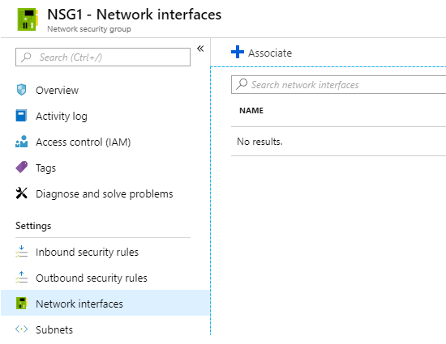
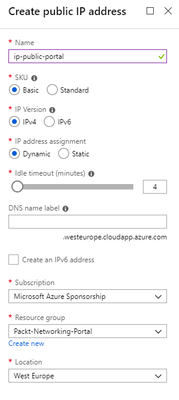
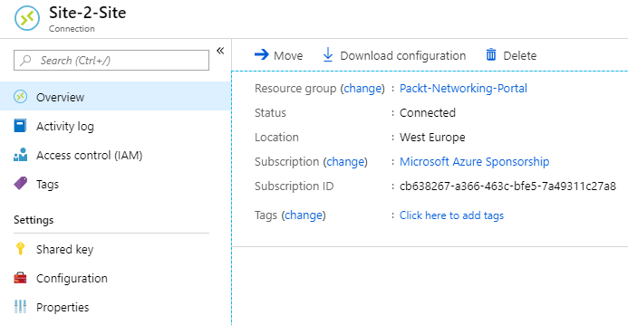
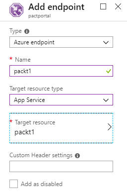
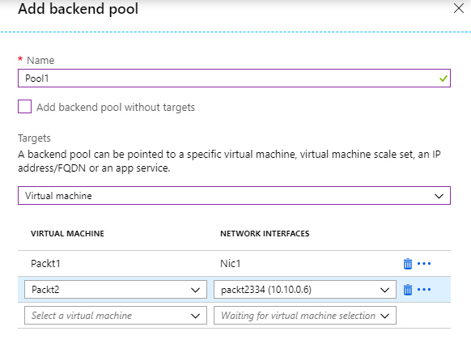
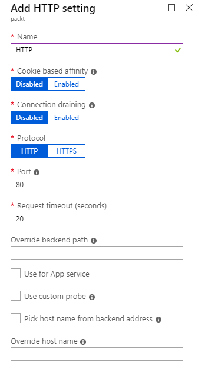
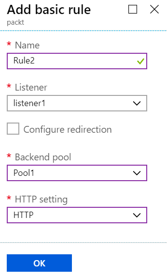

# Azure Networking Cookbook

Chapter 1. Azure Virtual Network
--------------------------------

In this very first chapter, you will learn about the basics of Azure networking, including creating Azure Virtual Networks, designing address spaces, and subnets. This will lay the foundation for all future recipes that we'll cover in this book.

We will cover the following recipes in this chapter:

*   Creating a virtual network in the portal
*   Creating a virtual network with PowerShell
*   Adding a subnet in the portal
*   Adding a subnet with PowerShell
*   Changing the address space size
*   Changing the subnet size

Technical requirements
----------------------

* * *

For this chapter, the following is required:

*   An Azure subscription
*   Azure PowerShell

Code samples can be found in [https://github.com/PacktPublishing/Azure-Networking-Cookbook/tree/master/Chapter01](https://github.com/PacktPublishing/Azure-Networking-Cookbook/tree/master/Chapter01).

Creating a virtual network in the portal
----------------------------------------

* * *

Azure Virtual Network represents your local network in the cloud. It enables other Azure resources to communicate over a secure private network without exposing endpoints over the internet.

### Getting ready

Before you start, open a web browser and go to the Azure portal at [https://portal.azure.com](https://portal.azure.com). 

### How to do it...

In order to create a new virtual network using the Azure portal, use the following steps:

1.  In the Azure portal, select **`Create a resource`** and choose **`Virtual network`** under **`Networking`** services (or, search for `virtual network` in the search bar).
2.  A new blade will open where we need to provide information for the virtual network to include **`Name`**, define **`Address space`**, select the **`Subscription`** option we want to use, select the **`Resource group`** option for where the virtual network will be deployed, select **`Location`** (Azure data center) for where the virtual network will be deployed, and define **`Name`** and **`Address range`** for the first subnet. We also have the option to select what kind of **`DDoS protection`** we want to use and if we want to use the **`Firewall`** option; an example is shown in the following screenshot:

3.  Creating a virtual network usually doesn't take much time and should be completed in under two minutes. Once deployment is finished, you can start using the virtual network.

### How it works...

We deploy virtual networks to **`Resource group`** under **`Subscription`** in the Azure data center that we choose. **`Location`** and **`Subscription`** are important parameters; we will only be able to attach Azure resources to this virtual network if they are in the same subscription and region (as the Azure data center). The **`Address space`** option defines the number of IP addresses that will be available for our network. It uses the **Classless Inter-Domain Routing** (**CIDR**) format and the largest range we can choose is `/8`. In the portal, we need to create an initial subnet and define the subnet address range. The smallest subnet allowed is `/29` and the largest is `/8` (however, this can't be larger than the virtual network range).

Creating a virtual network with PowerShell
------------------------------------------

* * *

PowerShell is a command-line shell and scripting language based on the .NET Framework. It's often used by system administrators to automate tasks and manage operating systems. Azure PowerShell is a PowerShell module that allows us to automate and manage Azure resources. Azure PowerShell is also very often used to automate deployment tasks and can also be used to deploy a new Azure Virtual Network.

### Getting ready

Before we start, we need to connect to the Azure subscription from a PowerShellconsole. Here's the command to do this:

Copy

    Connect-AzureRmAccount

This will open a new window where we need to input the credentials for the Azure subscription.

Afterward, we need to create a resource group where our virtual network will be deployed:

Copy

    New-AzureRmResourceGroup -name 'Packt-Networking-Script' -Location 'westeurope'

The output should be similar to the following screenshot:

### How to do it...

Deploying Azure Virtual Network is done in a single script. We need to define parameters for the resource group, location, name, and address range. Here is an example script:

Copy

    New-AzureRmVirtualNetwork -ResourceGroupName 'Packt-Networking-Script' -Location 'westeurope' -Name 'Packt-Script' -AddressPrefix 10.11.0.0/16

You should receive the following output:

### How it works...

The difference between deploying of a virtual networkfrom the portal and using PowerShell is that no subnet needs to be defined in PowerShell. The subnet is deployed in a separate command that can be executed either when you are deploying a virtual network or later on. We are going to see this command in the _Adding subnets with PowerShell_ recipe.

Adding a subnet in the portal
-----------------------------

* * *

Beside adding subnets while creating a virtual network, we can add additional subnets to our network at any time.

### Getting ready

Before you start, open a web browser and go to the Azure portal at [https://portal.azure.com](https://portal.azure.com). Here, locate the previously created virtual network.

### How to do it...

In order to add a subnet to a virtual network using the Azure portal, we must use the following steps:

1.  In the virtual network blade, go to the **`Subnets`** section. 
2.  Select the **`Add subnet`** option.

3.  A new blade will open. We need to provide information for the subnet, including **`Name`** and **`Address range`** in the CIDR format. **`Address range`** must be in the range limit of the virtual network address range and cannot overlap with the address range of other subnets in the virtual network. Optionally, we can add information for **`Network security group`**, **`Route tables`**, **`Service endpoints`**, and **`Subnet delegation`**. These options will be covered in later recipes: 
    
    
    
4.  We can also add a gateway subnet in the same blade. To add a gateway subnet, select the **`Gateway subnet`** option.

For a gateway subnet, the only parameter we need to define is **`Address range`**. The same rules apply as for adding a regular subnet. This time, we don't have to provide a name as it's already defined. You can add only one gateway subnet per virtual network. Service endpoints are not allowed in the gateway subnet:

5.  After the subnets are added, we can see the newly created subnets in the subnet blade under the virtual network:

### How it works...

A single virtual network can have a multiple number of subnets defined. Subnets can't overlap and must be in the range of the virtual network address range. For each subnet, four IP addresses are used for management and can't be used. Depending on the network settings, we can define the communication rules between subnets in the virtual network. A gateway subnet is used for VPN connections, and this will be covered in later chapters.

Adding a subnet with PowerShell
-------------------------------

* * *

When creating Azure Virtual Network with PowerShell, a subnet is not created in the same step and requires an additional command to be executed separately.

### Getting ready

Before creating a subnet, we need to collect information about the virtual network that the new subnet will be associated with. The parameters that need to be provided are the name of the virtual network and the resource group that the virtual network is located in:

Copy

    $VirtualNetwork = Get-AzureRmVirtualNetwork -Name 'Packt-Script' -ResourceGroupName 'Packt-Networking-Script'

### How to do it...

1.  To add a subnet to the virtual network, we need to execute a command and provide the name and address prefix. The address prefix is again in CIDR format:

Copy

    Add-AzureRmVirtualNetworkSubnetConfig -Name FrontEnd -AddressPrefix 10.11.0.0/24 -VirtualNetwork $VirtualNetwork

2.  We need to confirm these changes by executing the following:

Copy

    $VirtualNetwork | Set-AzureRmVirtualNetwork

3.  We can add an additional subnet by running all commands in a single step, as follows:

Copy

    $VirtualNetwork = Get-AzureRmVirtualNetwork -Name 'Packt-Script' -ResourceGroupName 'Packt-Networking-Script'
    Add-AzureRmVirtualNetworkSubnetConfig -Name BackEnd -AddressPrefix 10.11.1.0/24 -VirtualNetwork $VirtualNetwork
    $VirtualNetwork | Set-AzureRmVirtualNetwork

### How it works...

The subnet is created and added to the virtual network, but we need to confirm the changes before they can become effective. All the rules when creating or adding subnet size using the Azure portal apply here as well; the subnet must be within the virtual network's address space and cannot overlap with other subnets in the virtual network. The smallest subnet allowed is `/29`, and the largest is `/8`.

### There's more...

We can create and add multiple subnets in a single script, as follows:

Copy

    $VirtualNetwork = Get-AzureRmVirtualNetwork -Name 'Packt-Script' -ResourceGroupName 'Packt-Networking-Script'
    $FrontEnd = Add-AzureRmVirtualNetworkSubnetConfig -Name FrontEnd -AddressPrefix 10.11.0.0/24 -VirtualNetwork $VirtualNetwork
    $BackEnd = Add-AzureRmVirtualNetworkSubnetConfig -Name BackEnd -AddressPrefix 10.11.1.0/24 -VirtualNetwork $VirtualNetwork
    $VirtualNetwork | Set-AzureRmVirtualNetwork

Changing the address space size
-------------------------------

* * *

After the initial address space is defined during the creation of a virtual network, we can still change the address space size as needed. We can either increase or decrease the size of the address space, or change the address space completely by using a new address range.

### Getting ready

Before you start, open a web browser and go to the Azure portal at [https://portal.azure.com](https://portal.azure.com). 

### How to do it...

In order to change the address space size for a virtual network using the Azure portal, we must observe the following steps:

1.  In a virtual network blade, locate **`Address space`** under **`Settings`**.
2.  In the available address space, click on **`Address space`** and change the value. An example is shown in the following screenshot:
    

3.  After you have entered a new value for **`Address space`**, click **`Save`** to apply the changes.

### How it works...

Although you can change the address space at any time, there are some rules that determine what you can or cannot do. Address space can't be decreased if you have subnets defined in the address space that wouldn't be covered by a new address space. For example, if the address space was in the range of `10.0.0.0/16`, it would cover addresses from `10.0.0.1` to `10.0.255.254`. If one of the subnets was defined as `10.0.255.0/24`, we wouldn't be able to change the virtual network to `10.0.0.0/17`, as this will leave the subnet outside the new space.

Address space can't be changed to the new address space if you have subnets defined. In order to completely change the address space, you need to remove all subnets first. For example, if we have the address space defined as `10.0.0.0/16`, we wouldn't be able to change it to `10.1.0.0/16`, since having any subnets in the old space would leave them in an undefined address range.

Changing the subnet size
------------------------

* * *

Similar to the virtual network address space, we can change the size of a subnet at any time.

### Getting ready

Before you start, open a web browser and go to the Azure portal at [https://portal.azure.com](https://portal.azure.com). 

### How to do it...

In order to change subnet size using the Azure portal, we must use the following steps:

1.  In a virtual network blade, select the **`Subnets`** option.
2.  Select the subnet you want to change.
3.  In the **`Subnets`** option, enter a new value for the subnet size under **`Address range`**. An example of how to do this is shown in the following screenshot:

4.  After entering a new value, click on **`Save`**.
5.  In the **`Subnets`** list, you can see the changes applied and the address space has changed, as shown in the following screenshot:

### How it works...

When changing subnet size, there are some rules that must be followed. You can't change the address space if it's not within the virtual network address space range and the subnet range can't overlap with other subnets in a virtual network. If devices are assigned to this subnet, you can't change the subnet to exclude the addresses that these devices are already assigned to.

Chapter 2. Virtual Machine Networking
-------------------------------------

In this chapter, we'll cover Azure **Virtual Machines** (**VMs**) and the network interface that is used as an interconnection between Azure VMs and Azure Virtual Network. 

We will cover the following recipes in this chapter:

*   Creating Azure VMs
*   Viewing VM network settings
*   Creating a new network interface
*   Attaching a network interface to a VM
*   Detaching a network interface from a VM

Technical requirements
----------------------

* * *

For this chapter, the following is required:

*   An Azure subscription

Creating Azure VMs
------------------

* * *

Azure VMs depend on virtual networking, and during the creation process, we need to define the network settings.

### Getting ready

Before you start, open a web browser and go to the Azure portal at [https://portal.azure.com](https://portal.azure.com). 

### How to do it...

In order to create a new VM using the Azure portal, we must use the following steps:

1.  In the Azure portal, select **`Create a resource`** and choose **`Windows Server 2016`** VM (or search for any VM image under the **`Compute`** section).
2.  In the **`Create a virtual machine`** blade, we need to provide information for various options; not all of these are related to networking. First, we need to provide information on our Azure **`Subscription`** and **`Resource group`** (create a new resource group or provide an existing one).
3.  In **`INSTANCE DETAILS`**, we need to provide information on **`Virtual machine`** **`n`****`ame`**, **`Region`**, **`Availability option`**, or change with the **`Image`** drop-down. Example settings are shown in the following screenshot:

4.  Next, we need to provide information on our VMs **`Size`**, **`Username`**, and **`Password`**. Note that for **`Username`**, you can't use names such as admin, administrator, sysadmin, or root. **`Password`** must be at least 12 characters long and satisfy three out of four of the famous rules (that is, to combine big letters, small letters, special characters, and numbers). An example of this is shown in the following screenshot:

5.  Next, we get to an option that concerns networking. We need to define whether we are going to allow any type of connection over a public IP address. We can select whether we want to deny all access, or allow a specific port. In the following example, I'm choosing **`RDP (3389)`**:
    

6.  In next section, we need to define disks. We can choose between **`Premium SSD`**, **`Standard SSD,`** and **`Standard HDD`**. An OS disk is required and must be defined. We can attach additional data disks as needed. Disks can be added at a later time as well. We can choose whether we are going to **`Use managed disks`** or not. My recommendation would be to go with managed disks as they make maintenance much easier. An example of disk settings with only the OS disk is shown in the following screenshot:

7.  After defining disks, we get to the networking settings. Here, we need to define the **`Virtual network`** and **`Subnet`** options that the VM will use. These two options are mandatory. You can choose to assign the **`Public IP`** address to the VM (you can choose to disable the **`Public IP`** address, create a new one, or assign to an existing IP address). The last part of the network settings relate to **`Network security group`**, where we need to choose if we are going to use a **`Basic`** or **`Advanced`** NSG, and another option to define whether we will allow public ports. A VM network settings example is shown in the following screenshot:

8.  After the networking section, we need to set up **`MONITORING`**. **`Boot diagnostics`** are enabled by default and you can enable additional features as needed. The default settings for **`MONITORING`** are shown in the following screenshot:

9.  In **`EXTENSIONS`**, we can set up post-deployment configuration steps by adding software installations, configuration scripts, and more. The **`EXTENSIONS `**screen is shown in the following screenshot:

10.  The last setting that we can edit are tags. Tags apply additional metadata to Azure resources to logically organize them into a taxonomy. The **`Tags`** screen is shown in the following screenshot: 

11.  After all settings are defined, we get to validation screen where all our settings are checked for the last time. After validation is passed, we confirm the creation of a VM by pressing the **`Create`** button, as shown in the following screenshot:

### How it works...

When a VM is created, a **network interface** (**NIC**) is created in the process. An NIC is used as a sort of interconnection between the VM and virtual network. An NIC is assigned a private IP address by the network. As an NIC is associated both with the VM and virtual network, the IP address is used by the VM. Using this IP address, the VM can communicate over a private network with other VMs (or other Azure resources) on same network. Additionally, NICs and VMs can be assigned public IP address as well. Public address can be used to communicate with the VM over the internet, either to access services or to manage the VM.

### See also

If you are interested to find out more about Azure VMs, you can read my book, _Hands-On Cloud Administration in Azure,_ by Packt Publishing,where VMs are covered in more detail.

Viewing VM network settings
---------------------------

* * *

After an Azure VM is created, we can review the network settings in the VM blade.

### Getting ready

Before you start, open a web browser and go to the Azure portal at [https://portal.azure.com](https://portal.azure.com). Here, locate the previously created VM.

### How to do it...

In order to review the VM network settings, we must do the following steps:

1.  In the VM blade, locate the **`Networking`** settings. Here, you can see **`Network interface`**, **`APPLICATION SECURITY GROUPS`**, and **`Network security group`** associated with the VM. An example of this is shown in the following screenshot:

2.  If we select any of the associated network elements, we can discover more details. For example, if we select the **`Network interface`** option associated with the VM, we can see other networking information such as **`Private IP address`**, **`Virtual network/subnet`**, **`Public IP address`**, **`Network security group`**, **`IP configurations`**, **`DNS servers`**, and more. The network interface view is shown in the following screenshot:

### How it works...

Networking information is displayed in several places, including the VM's network settings. Additionally, each Azure resource has a separate blade and exists as an individual resource, so we can view these settings in multiple places. However, the most complete picture about VM network settings we can find is in the VM blade and NIC blade.

Creating a new network interface
--------------------------------

* * *

A network interface is usually created during the VM creation process, but each VM can have multiple network interfaces. Based on this, we can create an NIC as an individual resource and attach it or detach it as needed.

### Getting ready

Before you start, open a web browser and go to the Azure portal at [https://portal.azure.com](https://portal.azure.com). 

### How to do it...

In order to create a new NIC using the Azure portal, we must use the following steps:

1.  In the Azure portal, select **`Create a resource`** and choose **`Network interface`** under **`Networking`** services (or search for `network interface` in the search bar).
2.  In the creation blade, we need to provide information relating to the **`Name`**, **`Virtual network`**, and **`Subnet`** that the NIC will be associated with. Other information to be provided includes the IP address assignment type (**`Dynamic`** or **`Static`**), whether we want the NIC to be associated with a **`Network security group `**type, and whether we want to use **`IPv6`**. All Azure resources require information on **`Subscription`**, **`Resource group`**, and **`Location`**, and NIC is no exception. The information needed to create a new NIC is shown in the following screenshot:

### How it works...

A network interface can't exist without network association, and this must be assigned to a virtual network and subnet. This is defined during the creation process and cannot be changed later. On the other hand, association with a VM can be changed and the NIC can be attached or detached from a VM at any time.

Attaching a network interface to a VM
-------------------------------------

* * *

Each VM can have multiple network interfaces. Because of this, we can add a new network interface at any time.

### Getting ready

Before you start, open a web browser and go to the Azure portal at [https://portal.azure.com](https://portal.azure.com). Here, locate the previously created VM.

### How to do it...

To attach a network interface to a VM, we must do the following:

1.  In the VM blade, make sure the VM is stopped (that is, deallocated).
2.  Locate the **`Networking`** settings in the VM blade.
3.  At the top of the **`Networking`** settings screen in the VM blade, select the option to **`Attach network interface`**.
4.  A new option will appear, allowing you to create a new NIC or select an already-existing NIC that is not associated with the VM.
5.  Click **`OK`** and, in a few moments, the process will finish and the NIC will be associated with the VM. An example of this is shown in the following screenshot:

### How it works...

Each VM can have multiple network interfaces. The number of NICs associated with a VM depends on the type and size of the VM. To attach an NIC to a VM, the VM needs to be stopped (that is, deallocated); you can't add an additional NIC to a running VM.

Detaching a network interface from a VM
---------------------------------------

* * *

Just as with attaching a network interface, we can detach network interface at any time and attach it to another VM.

### Getting ready

Before you start, open a web browser and got to the Azure portal at [https://portal.azure.com](https://portal.azure.com). Here, locate the previously created VM.

### How to do it...

To detach a network interface from a VM, we must do the following:

1.  In the VM blade, make sure the VM is stopped (that is, deallocated).
2.  Locate the **`Networking`** settings in the VM blade.
3.  In the top of **`Networking`** settings screen in the VM blade, select the option to **`Detach network interface`**.
4.  Select the NIC you want to detach from the VM.
5.  Click **`OK`** and, in a few moments, the process will finish and the NIC will be removed from the VM. An example of this is shown in the following screenshot:

### How it works...

To detach a network interface, the VM associated with the NIC must be stopped (that is, deallocated). At least one NIC must be associated with the VM; so, you can't remove the last NIC from a VM. All network associations stay with the NIC; they are assigned to the NIC, not to the VM.

Chapter 3. Network Security Groups
----------------------------------

**Network Security Groups** (**NSGs**) contain sets of rules that allow or deny specific traffic to specific resources or subnets in Azure. An NSG can be associated  with either a subnet (applying security rules to all resources associated with the subnet) or a **network interface** (**NIC**) (applying security rules only to the VM associated with the NIC).

We will cover the following recipes in this chapter:

*   Creating a new NSG in a portal
*   Creating a new NSG with PowerShell
*   Creating a new allow rule in NSG
*   Creating a new deny rule in NSG
*   Creating a new NSG rule with PowerShell
*   Assigning an NSG to a subnet
*   Assigning an NSG to network interface
*   Assigning an NSG with PowerShell
*   Creating an Application Security Group (ASG)
*   Associating an ASG with a virtual machine (VM)
*   Creating rules with an NSG and an ASG

Technical requirements
----------------------

* * *

For this chapter, the following is required:

*   Azure subscription
*   Azure PowerShell

Code samples can be found at [https://github.com/PacktPublishing/Azure-Networking-Cookbook/tree/master/Chapter03](https://github.com/PacktPublishing/Azure-Networking-Cookbook/tree/master/Chapter03).

Creating a new NSG in a portal
------------------------------

* * *

As a first step to controlling network traffic better, we are going to create a new NSG. NSGs are built-in tools for network control and allow us to control incoming and outgoing traffic on a network interface or at the subnet level.

### Getting ready

Before you start, open your browser and go to the Azure portal: [https://portal.azure.com](https://portal.azure.com). 

### How to do it...

To create a new NSG using the Azure portal, we must follow these steps:

1.  In the Azure portal, select **`Create a resource`** and choose **`Network security group`** under the **`Networking`** services (or search for `network security group` in the search bar).
2.  The parameters we need to define for the deployment are **`Name`**, **`Subscription`**, **`Resource group`**, and **`Location`**. An example of the required parameters is shown in the following screenshot:

3.  After the deployment has been validated and started (it takes a few moments to complete), the NSG is ready for use.

### How it works...

The NSG deployment can be initiated during a VM deployment. This will associate the NSG to the NIC associated with the VM. In this case, the NSG is already associated with the resource, and rules defined in the NSG will apply only to the associated VM. 

If the NSG is deployed separately, as in this recipe, it is not associated and the rules that are created are not applied until the association has been created with NIC or the subnet. When it is associated with a subnet, the NSG rules will apply to all resources on the subnet.

Creating a new NSG with PowerShell
----------------------------------

* * *

Alternatively, we can create an NSG using Azure PowerShell. The advantage of this approach is that we can add NSG rules in a single script, creating custom rules right after the NSG is created. This allows us to automate the deployment process and have our own "default" rules right after the NSG has been created.

### Getting ready

Open the PowerShell console and make sure you are connected to your Azure subscription. 

### How to do it...

To deploy a new NSG, execute the following command:

Copy

    New-AzureRmNetworkSecurityGroup -Name "nsg1" -ResourceGroupName "Packt-Networking-Script" -Location "westeurope"

### How it works...

The final outcome will be the same as creating a new NSG using the Azure portal: a new NSG will have been created with default rules. An advantage of using PowerShell is that we can add additional rules and automate the process. We will see an example of this in the _Creating NSG rule with PowerShell_recipe later in this chapter.

Creating a new allow rule in NSG
--------------------------------

* * *

When a new NSG is created, only the default rules are present. Default rules allow all outbound traffic and block all inbound traffic. To change these, additional rules need to be created. First, we are going to show you how to create a new rule to allow inbound traffic.

### Getting ready

Before you start, open your browser and go to the Azure portal: [https://portal.azure.com](https://portal.azure.com). Locate the previously created NSG.

### How to do it...

To create a new NSG allow rule using the Azure portal, we must follow these steps:

1.  In the NSG blade, locate the **`Inbound security rules`** option under **`Settings`**.
2.  Click on the **`Add`** button at the top of the page and wait for the new blade to open:

3.  In the new blade, we need to provide information for **`Source`** (location and port), **`Destination`** (location and port), **`Protocol`**, **`Action`**, **`Priority`**, **`Name`**, and **`Description`**. If you want to allow traffic, make sure you select **`Allow`** for **`Action`**. An example of how to create a rule to allow traffic over the `443` port (allowing traffic to the web server) is shown in the following screenshot:

### How it works...

By default, all traffic coming from Azure Load Balancer or Azure Virtual Network is allowed. All traffic coming over the internet is denied. To change this, we need to create additional rules. Make sure you set the right priority when creating rules. Rules with highest priority (lower number) are processed first, so if you have two rules where one is denying traffic and one is allowing it, one with higher priority will take over while one with lower priority will be ignored.

Creating a new deny rule in NSG
-------------------------------

* * *

When a new NSG is created, only default rules are present. Default rules allow all outbound traffic and block all inbound traffic. To change this, additional rules need to be created. Now, we are going to show you how to create a new outbound rule to deny traffic.

### Getting ready

Before you start, open your browser and go to the Azure portal: [https://portal.azure.com](https://portal.azure.com). Locate the previously created NSG.

### How to do it...

To create a new NSG deny rule using the Azure portal, we must follow these steps:

1.  In the NSG blade, locate the **`Outbound security rules`** option under **`Settings`**.
2.  Click on the **`Add`** button at the top of the page and wait for the new blade to open:

3.  In the new blade, we need to provide information for **`Source`** (location and port), **`Destination`** (location and port), **`Protocol`**, **`Action`**, **`Priority`**, **`Name`**, and **`Description`**. If you want to deny traffic, make sure you select **`Deny`** for **`Action`**. An example of how to create a rule to deny traffic over the `22` port is shown in the following screenshot:

### How it works...

All outbound traffic is allowed by default, regardless of where it is going. If we want to explicitly deny traffic on a specific port, we need to create a rule to do so. Make sure you set the priority right when creating rules. Rules with the highest priority (lower number) are processed first, so if you have two rules where one is denying traffic and one is allowing it, the rule with higher priority will apply.

Creating a new NSG rule with PowerShell
---------------------------------------

* * *

Alternatively, we can create an NSG rule using Azure PowerShell. This command can be executed right after the NSG has been created, allowing us to create and configure NSG in a single script. This way, we can standardize deployment and have rules applied each time an NSG is created.

### Getting ready

Open the PowerShell console and make sure you are connected to your Azure subscription. 

### How to do it...

To create a new NSG rule, execute the following command:

Copy

    $nsg = Get-AzureRmNetworkSecurityGroup -Name 'nsg1' -ResourceGroupName 'Packt-Networking-Script'
    $nsg | Add-AzureRmNetworkSecurityRuleConfig -Name 'Allow_HTTPS' -Description 'Allow_HTTPS' -Access Allow -Protocol Tcp -Direction Inbound -Priority 100 -SourceAddressPrefix Internet -SourcePortRange * -DestinationAddressPrefix * -DestinationPortRange 443 | Set-AzureRmNetworkSecurityGroup

### How it works...

Using a script, creating an NSG rule is just a matter of parameters. The access parameter, which can be either allow or deny, will determine if we want to allow traffic or deny it. The direction parameter, which can be inbound or outbound, determines if the rule is for inbound or outbound traffic. All other parameters are the same, no matter what kind of rule we want to create. Again, priority plays a very important role and so we must make sure it's chosen correctly.

### There's more...

As mentioned in the _Creating a new NSG with PowerShell_ recipe, we can create the NSG and the rules that are needed in a single script. The following script is an example of this:

Copy

    $nsg = New-AzureRmNetworkSecurityGroup -Name 'nsg1' -ResourceGroupName 'Packt-Networking-Script' -Location "westeurope"
    $nsg | Add-AzureRmNetworkSecurityRuleConfig -Name 'Allow_HTTPS' -Description 'Allow_HTTPS' -Access Allow -Protocol Tcp -Direction Inbound -Priority 100 -SourceAddressPrefix Internet -SourcePortRange * -DestinationAddressPrefix * -DestinationPortRange 443 | Set-AzureRmNetworkSecurityGroup

Assigning an NSG to a subnet
----------------------------

* * *

The NSG and rules must be assigned to a resource to make any impact. First, we are going to show you how to associate an NSG with a subnet.

### Getting ready

Before you start, open your browser and go to the Azure portal: [https://portal.azure.com](https://portal.azure.com). Locate the previously created NSG.

### How to do it...

To assign an NSG to a subnet, we must follow these steps:

1.  In the NSG blade, locate the **`Subnets`** option under **`Settings`**
2.  Click on the **`Associate`** button at the top of the page and wait for the new blade to open:

3.  In the new blade, first select **`Virtual network`**, which contains the subnet you want to associate the NSG with:

4.  After selecting the virtual network, select the **`Subnet`** you want to associate it with:

5.  After submitting the change, the subnet will appear in a list of associated subnets:

### How it works...

When an NSG is associated with a subnet, the rules in the NSG will apply to all of the resources in the subnet. Note that the subnet can be associated with more than one NSG and the rules from all the NSGs will apply in that case. Priority is the most important factor when looking at single NSGs, but when the rules from more NSGs are observed, the deny rule will prevail. So, if we have two subnets, one with allow on the `443` port and another one with the deny rule on the same port, traffic on this port will be denied.

Assigning an NSG to a network interface
---------------------------------------

* * *

An NSG and its rules must be assigned to a resource to make any impact. Now, we are going to show you how to associate an NSG with a network interface.

### Getting ready

Before you start, open your browser and go to the Azure portal: [https://portal.azure.com](https://portal.azure.com). Locate the previously created NSG.

### How to do it...

To assign an NSG to a network interface, we must follow these steps:

1.  In the NSG blade, locate the **`Network interfaces`** option under **`Settings`**
2.  Click on the **`Associate`** button at the top of the page and wait for the new blade to open:

3.  Select the NIC you want to associate it with from the list of those available:

### How it works...

When an NSG is associated with a NIC, the NSG rules will apply only to a single NIC (or a VM associated with the NIC). The NIC can be associated with only one NSG directly, but a subnet associated with a NIC can have an association with another NSG (or more of them). This is similar to when we have more NSGs in a single subnet, and the deny rule will take higher priority. If either of the NSGs allows traffic on a port, but another NSG is blocking it, traffic will be denied.

Assigning an NSG with PowerShell
--------------------------------

* * *

Alternatively, we can associate an NSG using Azure PowerShell. In this recipe, we are going to show you how to associate an NSG with a subnet.

### Getting ready

Open the PowerShell console and make sure you are connected to your Azure subscription. 

### How to do it...

To associate an NSG with a subnet, execute the following command:

Copy

    $vnet = Get-AzureRmVirtualNetwork -Name 'Packt-Script' -ResourceGroupName 'Packt-Networking-Script'
    $subnet = Get-AzureRmVirtualNetworkSubnetConfig -VirtualNetwork $vnet -Name BackEnd
    $nsg = Get-AzureRmNetworkSecurityGroup -ResourceGroupName 'Packt-Networking-Script' -Name 'nsg1'
    $subnet.NetworkSecurityGroup = $nsg
    Set-AzureRmVirtualNetwork -VirtualNetwork $vnet

### How it works...

Using PowerShell, we need to collect information on the virtual network, subnet, and NSG. When all of the information is gathered, we can perform the association using `Set-AzureRmVirtualNetwork` and apply changes.

Creating an Application Security Group (ASG)
--------------------------------------------

* * *

ASGs are an extension of NSGs, allowing us to create additional rules and better control of traffic. Using only NSGs allows us to create rules that will allow traffic only for a specific source, IP address, or subnet. ASGs allow us to create better filtering and create additional checks on which traffic is allowed.

### Getting ready

Before you start, open your browser and go to the Azure portal: [https://portal.azure.com](https://portal.azure.com). 

### How to do it...

To create an ASG using the Azure portal, we must follow these steps:

1.  In the Azure portal, select **`Create a resource`** and choose **`Application security group`** under the **`Networking`** services (or search for `application security group` in the search bar).
2.  The parameters we need to define for deployment are **`Subscription`**, **`Resource group`**, **`Name`**, and **`Region`**. An example of the required parameters is shown in the following screenshot:

### How it works...

ASGs don't make much difference on their own and must be combined with NSGs to create NSG rules that will allow for better control of traffic and apply additional checks before traffic flow is allowed.

Associating an ASG with a VM
----------------------------

* * *

After creating an ASG, we must associate it with a VM. After this is completed, we can create rules with the NSG and ASG for traffic control.

### Getting ready

Before you start, open your browser and go to the Azure portal: [https://portal.azure.com](https://portal.azure.com).  Locate the previously created virtual machine.

### How to do it...

To associate an ASG with a virtual machine, we must follow these steps:

1.  In the virtual machine blade, locate the **`Networking`** settings
2.  In the **`Networking`** settings, select the **`Configure the application security groups`** option, as shown in the following screenshot:

3.  In the new blade from the list of available ASGs, select the ASG that you want to associate the VM with:

4.  After clicking **`Save`**, it takes a few seconds to apply changes until the VM is associated with the ASG

### How it works...

The VM must be associated with the ASG. We can associate more than one VM with each ASG. The ASG is then used in combination with the NSG to create new NSG rules.

Creating rules with an NSG and an ASG
-------------------------------------

* * *

As a final step, we can use NSGs and ASGs to create new rules with better control. This approach allows us to have better control of traffic, limiting incoming traffic not only to a specific subnet, but only if the resource is also part of the ASG.

### Getting ready

Before you start, open your browser and go to the Azure portal: [https://portal.azure.com](https://portal.azure.com). Locate the previously created NSG.

### How to do it...

To create a rule using both an ASG and an NSG, we must follow these steps:

1.  In the NSG blade, find **`Inbound security rules`**. Select **`Add`** to add a new rule.
2.   For the source, select **`Application Security Group,`** and then select the ASG you want to use as the source. We also need to provide parameters for **`Source`**, **`Source port ranges`**, **`Destination`**, **`Destination port ranges`**, **`Protocol`**, **`Action`**, **`Priority,`** and **`Name`**. An example is shown in the following screenshot:

### How it works...

Using only NSGs to create rules, we can create allow or deny traffic only for a specific IP address or range. With an ASG, we can widen or narrow this as needed. For example, we can create a rule to allow VMs from a frontend subnet, but only if these VMs are in a specific ASG. Alternatively, we can allow access to a number of VMs from different virtual networks and subnets, but only if they belong to a specific ASG.

Chapter 4. Managing IP Addresses
--------------------------------

In Azure, we can have two types of IP addresses, private and public. Public addresses can be accessed over the internet. Private addresses are from the Azure Virtual Network address space and are used for private communication on private networks. Addresses can be assigned to a resource or exist as a separate resource. 

We will cover the following recipes in this chapter:

*   Creating a new public IP address in the portal
*   Creating a new public IP address with PowerShell
*   Assigning a public IP address
*   Unassigning a public IP address
*   Creating a reservation for a public IP address
*   Removing a reservation for a public IP address
*   Creating a reservation for a private IP address
*   Changing a reservation for a private IP address
*   Removing a reservation for a private IP address

Technical requirements
----------------------

* * *

For this chapter, the following is required:

*   An Azure subscription
*   Azure PowerShell

Code samples can be found at [https://github.com/PacktPublishing/Azure-Networking-Cookbook/tree/master/Chapter04](https://github.com/PacktPublishing/Azure-Networking-Cookbook/tree/master/Chapter04).

Creating a new public IP address in the portal
----------------------------------------------

* * *

Public IP addresses can be created as a separate resource or during the creation of some other resources (a virtual machine, for example). Therefore, the public IP can exist as part of a resource or as a standalone resource of its own. First, we are going to show you how to create a new public IP address.

### Getting ready

Before you start, open your browser and go to the Azure portal: [https://portal.azure.com](https://portal.azure.com). 

### How to do it...

To create a new public IP address, we must follow these steps:

1.  In the Azure portal, select **`Create a resource`** and choose **`Public IP address`** under the **`Networking`** services (or search for `public IP address` in the search bar).
2.  The parameters we need to define for deployment are **`Name`**, **`SKU`**, **`IP Version`**, **`IP address assignment`**, **`DNS name label`**, **`Subscription`**, **`Resource group`**, and **`Location`**. An example of the required parameters is shown in the following screenshot:

### How it works...

The SKU can be either basic or standard. The main difference is that standard is closed to inbound traffic by default (inbound traffic must be whitelisted in NSG), and standard is zone redundant. Another difference is that a standard SKU public IP address has a static assignment and a basic SKU can be either static or dynamic.

You can choose either the IPv4 or IPv6 version of an IP, but choosing IPv6 will limit you to a dynamic assignment. 

The DNS name label is optional, and it can be used to resolve the endpoint in case a dynamic assignment is selected. Otherwise, there is no point in creating a DNS label, as an IP address can always be used to resolve the endpoint in case a static assignment is selected.

Creating a new public IP address with PowerShell
------------------------------------------------

* * *

Alternatively, we can create a public IP address using Azure PowerShell. Again, this approach is better when we want to automate the process. Even a public IP address can exist on its own; it's usually created to be joined with other resources and to be used as an endpoint. When using PowerShell to create a resource, we can continue with the next step and join it with a resource in a single script.

### Getting ready

Open the PowerShell console and make sure you are connected to your Azure subscription. 

### How to do it...

To deploy a new public IP address, execute the following command:

Copy

    New-AzureRmPublicIpAddress -Name 'ip-public-script' -ResourceGroupName 'Packt-Networking-Script' -AllocationMethod Dynamic -Location 'westeurope'

### How it works...

As an outcome, a new public IP address will be created. Settings in this case will be a basic SKU dynamic assignment, IPv4 version, and without a DNS label. Furthermore, we can use additional switches like `-SKU`, `-IPAddressVersion`, or `-DomainNamelabel` to define these options if needed.

Assigning a public IP address
-----------------------------

* * *

A public IP address can be created as a separate resource or can be unassigned from another resource and exist on its own. Such an IP address can then be assigned to a new or another resource. If the resource is no longer in use or migrated, we can still use the same public IP address. In this case, the public endpoint that's used to access a service may stay unchanged. This can be useful when a publicly available application or service is migrated or upgraded as we can keep using the same endpoint and end users don't need to be aware of any change.

### Getting ready

Before you start, open your browser and go to the Azure portal: [https://portal.azure.com](https://portal.azure.com). 

### How to do it...

To assign a public IP address, we must do the following:

1.  Locate the network interface that you want the IP address to be assigned to. This can be done directly by finding the NIC or through the VM blade that the NIC is assigned to.

2.  In the NIC blade, go to **`IP configurations`** under **`Settings`** and select the configuration, as shown in the following screenshot:

3.  In the new blade, select to enable **`Public IP address`** and select the public IP address that you want to assign. Only unassigned IP addresses in the same region will show in the list. An example of this is shown in the following screenshot:

4.  After the public IP address has been selected, click **`Save`** to apply the settings. 

### How it works...

A public IP address exists as a separate resource and can be assigned to a resource at any time. When a public IP address is assigned, you can use this IP address to access services running on a resource that the IP address is assigned to (an appropriate NSG must be applied). We can also remove an IP address from a resource and assign it to a new resource. For example, if we want to migrate services to a new virtual machine, the IP address can be removed from the old VM and assigned to the new one. This way, service endpoints running on the VM will not change. This is especially useful when static IP addresses are used.

Unassigning a public IP address
-------------------------------

* * *

A public IP address can be unassigned from a resource in order to be saved for later use or assigned to another resource. When a resource is deleted or decommissioned, we can still put the public IP address to use and assign it to the next resource. 

### Getting ready

Before you start, open your browser and go to the Azure portal: [https://portal.azure.com](https://portal.azure.com). Make sure that the virtual machine using a public IP address is not running.

### How to do it...

1.  Locate the NIC that the public IP address is associated with
2.  In the NIC blade, go to **`IP configurations`** under **`Settings`** and select the IP configuration:

3.  In the new blade, set **`Public IP address`** to **`Disabled`**:

4.  After the changes are made, click **`Save`** to apply the new configuration

### How it works...

A public IP address can be assigned or unassigned from a resource in order to save it for future use or to transfer it to a new resource. To remove it, we simply disable the public IP address in the IP configuration under the NIC that the IP address is assigned to. This will remove the association but keep the IP address as a separate resource.

Creating a reservation for a public IP address
----------------------------------------------

* * *

The default option for a public IP address is a dynamic IP assignment. This can be changed during the public IP address creation or later. Then, the public IP address becomes reserved (or static).

### Getting ready

Before you start, open your browser and go to the Azure portal: [https://portal.azure.com](https://portal.azure.com). 

### How to do it...

To create a reservation for a public IP address, follow these steps:

1.  Locate the public IP address in the Azure portal. This can be done by finding the IP address directly or through the resource it's assigned to (either the NIC or VM).
2.  In the IP address blade, go to **`Configuration`** under **`Settings`**. Change **`Assignment`** from **`Dynamic`** to **`Static,`** as shown in the following screenshot:

3.  After this change has been made, click **`Save`** to apply the new settings.

### How it works...

A public IP address is set to dynamic by default. This means that an IP address might change in time. For example, if a VM that an IP address is assigned to is turned off or rebooted, there is a possibility that the IP address will change after the VM is up and running again. This can cause issues if services that are running on the VM are accessed over the public IP address, or there is a DNS record associated with the public IP address. 

We create an IP reservation and set the assignment to static to avoid such a scenario and keep the IP address reserved for our services.

Removing a reservation for a public IP address
----------------------------------------------

* * *

If the public IP address is set to static, we can remove a reservation and set the IP address assignment to dynamic. This isn't done often as there is usually a reason why the reservation is set in the first place. But as the reservation for the public IP address has an additional cost, there is sometimes a need to remove the reservation if it is not necessary. 

### Getting ready

Before you start, open your browser and go to the Azure portal: [https://portal.azure.com](https://portal.azure.com). Make sure that the IP address is not associated with any resource.

### How to do it...

To remove a reservation for a public IP address, follow these steps:

1.  Locate the public IP address in the Azure portal

2.  In the public IP address blade, go to **`Configuration`** under **`Settings`** and set **`Assignment`** to **`Dynamic`**:

3.  After these changes have been made, click **`Save`** to apply the new configuration

### How it works...

To remove an IP reservation from a public IP address, the public IP address must not be associated with a resource. Then, we can remove the reservation by setting the IP address assignment to dynamic.

The main reason for this is pricing. In Azure, the first five public IP reservations are free. After the initial five, each new reservation is billed. To avoid paying anything unnecessary, we can remove a reservation when it is not needed or when the public IP address is not used.

Creating a reservation for a private IP address
-----------------------------------------------

* * *

Similar to public IP addresses, we can make a reservation for private IP addresses. This is usually done to ensure communication between servers on the same virtual network and to allow for the usage of IP addresses in connection strings.

### Getting ready

Before you start, open your browser and go to the Azure portal: [https://portal.azure.com](https://portal.azure.com).

### How to do it...

To create a reservation for a private IP address, follow these steps:

1.  In the Azure portal, locate the NIC you want to make the reservation for.
2.  In the NIC blade, go to **`IP configurations`** under **`Settings`** and select the IP configuration:

3.  In the new blade, under **`Private IP address settings`**, set **`Assignment`** to **`Static`**.

4.  The current IP address value will be set automatically. If needed, you can change that value to another value, but it must be in the address space of the subnet associated with the NIC:

5.  After these changes have been made, click **`Save`** to apply the new configuration.

### How it works...

A reservation for an IP address can be made for private IP addresses. The difference is that a private IP address does not exist as a separate resource but is assigned to an NIC.

Another difference is that you can select a value for a private IP address. A public IP address is assigned randomly and can be reserved, but you cannot choose which value this will be. For private IP addresses, you can select the value for the IP, but it must be an unused IP from the subnet associated with the NIC.

Changing a reservation for a private IP address
-----------------------------------------------

* * *

For private IP addresses, you can change an IP address at any time to another value. With public IP addresses, this isn't the case as you get the IP address randomly from a pool, and you aren't able to change the value for public IP addresses. With a private IP address, you can change the value to another IP address from the address space.

### Getting ready

Before you start, open your browser and go to the Azure portal: [https://portal.azure.com](https://portal.azure.com).

### How to do it...

To change a reservation for a private IP address, follow these steps:

1.  In the Azure portal, locate the NIC you want to make changes for
2.  In the NIC blade, go to **`IP configurations`** under **`Settings`** and select the IP configuration:

3.  In **`Private IP address settings`**, enter a new value for the **`IP address`**:

4.  After these changes have been made, click **`Save`** to apply the new configuration

### How it works...

A reservation for a private IP address can be changed. Again, the value must be an unused IP address from a subnet associated with the NIC. If the virtual machine associated with the NIC is turned off, the new IP address will be assigned on its next startup. If the virtual machine is running, it will be restarted to apply new changes.

Removing a reservation for a private IP address
-----------------------------------------------

* * *

Similar to public IP addresses, we can remove a reservation at any time. A private IP address is free, so additional costs aren't a factor in this case. But there are scenarios where a dynamic assignment is required, and we can set it at any time.

### Getting ready

Before you start, open your browser and go to the Azure portal: [https://portal.azure.com](https://portal.azure.com).

### How to do it...

To remove a reservation for a private IP address, follow these steps:

1.  In the Azure portal, locate the NIC you want to make changes for
2.  In the NIC blade, go to **`IP configurations`** under **`Settings`** and select the IP configuration:

3.  In the new blade, under **`Private IP address settings`**, change **`Assignment`** to **`Dynamic`**:
    

4.  After these changes have been made, click **`Save`** to apply the new configuration

### How it works...

We can remove a private IP address reservation at any time by switching the assignment to dynamic. When this change is made, the virtual machine associated with the NIC will be restarted apply the new changes. After a change is made, a private IP address may change after the VM is restarted or turned off.

Chapter 5. Local and Virtual Network Gateways
---------------------------------------------

Local and virtual network gateways are **virtual private network** (**VPN**) gateways that are used to connect to on-premises networks and encrypt all traffic going between Azure **Virtual Network** (**VNet**) and a local network. Each virtual network can have only one virtual network gateway, but one virtual network gateway can be used to configure multiple VPN connections.

We will cover the following recipes in this chapter:

*   Creating a local network gateway in the portal
*   Creating a local network gateway with PowerShell
*   Creating a virtual network gateway in the portal
*   Creating a virtual network gateway with PowerShell
*   Modifying the local network gateway settings

Technical requirements
----------------------

* * *

For this chapter, the following is required:

*   An Azure subscription
*   Azure PowerShell

Code samples can be found in [https://github.com/PacktPublishing/Azure-Networking-Cookbook/tree/master/Chapter05](https://github.com/PacktPublishing/Azure-Networking-Cookbook/tree/master/Chapter05).

Creating a local network gateway in the portal
----------------------------------------------

* * *

Although a local network gateway is created in Azure, it represents your local (on-premises) network and holds configuration information on your local network settings. It's an essential component for creating the VPN connection that is needed to create a Site-to-Site connection between the Azure VNet and the local network.

### Getting ready

Before you start, open a web browser and go to the Azure portal at [https://portal.azure.com](https://portal.azure.com). 

### How to do it...

In order to create a new local network gateway, the following steps are required:

1.  In the Azure portal, select **`Create a resource`** and choose **`Local network gateway`** under the **`Networking`** services (or search for `local network gateway` in the search bar).
2.  The parameters that we need to provide are **`Name`**, **`IP address`** (that is, the public IP address of the local firewall), **`Address space`** (the local address space that you want to connect to), **`Subscription`**, **`Resource group,`** and **`Location`**. Optionally, we can configure **Border Gateway Protocol** (**BGP**) settings:

### How it works...

The local network gateway is used to connect a virtual network gateway to an on-premises network. The virtual network gateway is directly connected to the virtual network and has all the relevant VNet information needed to create a VPN connection. On the other hand, a local network gateway holds all the local network information needed to create a VPN connection. 

Creating a local network gateway with PowerShell
------------------------------------------------

* * *

As mentioned in the previous recipe, the local network gateway holds information on the local network that we want to connect to Azure VNet. In addition to creating a local network gateway through the Azure portal, we can create it with Azure PowerShell.

### Getting ready

Open the PowerShell console and make sure you are connected to your Azure subscription. 

### How to do it...

To create a new local network gateway, execute the following command:

Copy

    New-AzureRmLocalNetworkGateway -Name packt-lng-script -ResourceGroupName 'Packt-Networking-Script' -Location 'westeurope' -GatewayIpAddress '195.222.10.20' -AddressPrefix '192.168.1.0/24'

### How it works...

In order to deploy a new local network gateway, we need to provide parameters for name, resource group, location, gateway IP address, and address prefix. The gateway IP address is the public IP address of the local firewall that you are trying to connect to. The address prefix is the subnet prefix of the local network that you are trying to connect to. This address must be associated with a firewall address that is provided as a gateway IP address.

Creating a virtual network gateway in the portal
------------------------------------------------

* * *

After a local network gateway is created, we need to create a virtual network gateway in order to create a VPN connection between the local and Azure networks. As a local network gateway holds information on the local network, the virtual network gateway holds information for the Azure VNet that we are trying to connect.

### Getting ready

Before you start, open a web browser and go to the Azure portal at [https://portal.azure.com](https://portal.azure.com). 

### How to do it...

In order to create a new virtual network gateway, the following steps are required:

1.  In the Azure portal, select **`Create a resource`** and choose **`Virtual network gateway`** under the **`Networking`** services (or search for `virtual network gateway` in the search bar).
2.  Everything is done in a single blade, but for the purpose of better visibility, I'm going to break it down into three sections. In the first section, we need to provide **`Name`**, **`Gateway type`**, **`VPN type`**, and **`SKU`**. Optionally, we can select **`Enable`****`active-active mode`**:

3.  In the second section, we need to select **`Virtual network`** (that will be used in the connection), and set the **`Public IP address`** options. Note that the gateway subnet must be created prior to this, and only virtual networks with a gateway subnet will be available for selection:

4.  In the final section, we need to select the **`Subscription`** and **`Location`** options of where the virtual network gateway will be created:

5.  After validation, we can click on **`Create`** and start deployment. Note that creating the virtual network gateway takes longer then most other Azure resources; deployment can take from 45 to 90 minutes.

### How it works...

The virtual network gateway is the second part needed to establish the connection to the Azure VNet. It's directly connected to the virtual network and is needed to create both Site-to-Site and Point-to-Site connections. We need to set the VPN type that needs to match to the type of the local VPN device when a Site-to-Site connection is created. 

Creating a virtual network gateway with PowerShell
--------------------------------------------------

* * *

Creating a virtual network gateway is possible with PowerShell. Again, this helps automate processes. For example, if we start creating a virtual network gateway using a portal and notice that our virtual network isn't listed, it's probably because it's missing a gateway subnet. So, we must abandon the process, go back and create the gateway subnet, and start creating the virtual network gateway. Using PowerShell, we can ensure that all the requisite resources are present before starting and then continue with creating the virtual network gateway.

### Getting ready

Open the PowerShell console and make sure you are connected to your Azure subscription. 

### How to do it...

To create a new virtual network gateway, execute the following command:

Copy

    $vnet = Get-AzureRmVirtualNetwork -ResourceGroupName 'Packt-Networking-Script' -Name 'Packt-Script'
    Add-AzureRmVirtualNetworkSubnetConfig -Name 'GatewaySubnet' -AddressPrefix 10.11.2.0/27 -VirtualNetwork $vnet
    $vnet | Set-AzureRmVirtualNetwork
    $gwpip = New-AzureRmPublicIpAddress -Name VNet1GWIP -ResourceGroupName 'Packt-Networking-Script' -Location 'westeurope' -AllocationMethod Dynamic
    
    $vnet = Get-AzureRmVirtualNetwork -ResourceGroupName 'Packt-Networking-Script' -Name 'Packt-Script'
    $subnet = Get-AzureRmVirtualNetworkSubnetConfig -Name 'GatewaySubnet' -VirtualNetwork $vnet
    $gwipconfig = New-AzureRmVirtualNetworkGatewayIpConfig -Name gwipconfig1 -SubnetId $subnet.Id -PublicIpAddressId $gwpip.Id
    New-AzureRmVirtualNetworkGateway -Name VNet1GW -ResourceGroupName 'Packt-Networking-Script' -Location 'westeurope' -IpConfigurations $gwipconfig -GatewayType Vpn -VpnType RouteBased -GatewaySku VpnGw1

### How it works...

The script performs a few different operations to make sure all requirements are met so that we can create a virtual network gateway. The first step is to collect information on the virtual network that we are going to use. Next, we add the gateway subnet to VNet, and create a public IP address that will be used by the virtual network gateway. We collect all the information and ensure that all the required resources are present, and then finally create a new virtual network gateway.

Modifying the local network gateway settings
--------------------------------------------

* * *

Network configurations may change over time and we may need to address these changes in Azure as well. For example, the public IP address of a local firewall may change and we need to reconfigure the local network gateway. Or, a local network might be reconfigured and the address space or subnet has changed, so we need to reconfigure the local network gateway once again.

### Getting ready

Before you start, open a web browser and go to the Azure portal at [https://portal.azure.com](https://portal.azure.com). 

### How to do it...

In order to modify local network gateway settings, we must do the following:

1.  Locate the local network gateway in the Azure portal and go to **`Configuration`**.

2.  In configuration, we can edit **`IP address`** or **`Address space`**. We can also add additional address spaces in case we want to connect multiple local subnets to the Azure VNet:

### How it works...

The local network gateway holds the local network information needed to create a Site-to-Site connection between the local and Azure networks. If this information changes, we can edit it in the **`Configuration`** settings. Changes that can be made are the IP address (that is, the public IP address of the local firewall) and the address space we are connecting to. Additionally, we can add or remove address spaces if we want to add or remove subnets that are able to connect to Azure VNet. If configuration in the local network gateway is no longer valid, we can still use it to create a completely new connection to a new local network if needed.

Chapter 6. Creating Hybrid Connections
--------------------------------------

Hybrid connections allow us to create secure connections with Azure VNets. These connections can either be from on-premises or from other Azure VNets. Establishing connections to Azure VNet enables secure network traffic with other services that are located in different Azure VNets, different subscriptions, or outside Azure (in different clouds or on-premises). Using secure connections removes the need for publicly exposed endpoints that present a potential security risk. This is especially important when we consider management, where opening public endpoints creates a security risk and presents a major issue. For example, if we consider managing virtual machines, it's a common practice to use either **Remote Desktop Protocol** (**RDP**) or PowerShell for management. Exposing these ports to public access presents a great risk. A best practice is to disable any kind of public access to such ports and use only access from an internal network for management. In this case, we use either a Site-2-Site or a Point-2-Site connection to enable secure management. 

In another scenario, we might need the ability to access a service or a database on another network, either on-premises or via another Azure VNet. Again, exposing these services might present a risk, and we use either Site-2-Site, VNet-2-VNet, or VNet peering to enable such a connection in a secure way.

We will cover the following recipes in this chapter:

*   Creating a Site-2-Site connection
*   Downloading the VPN device configuration from Azure
*   Creating Point-2-Site connection
*   Creating a VNet-2-VNet connection
*   Connecting VNets using network peering

Technical requirements
----------------------

* * *

For this chapter, the following are required:

*   Azure subscription
*   Windows PowerShell

Code samples can be found at [https://github.com/PacktPublishing/Azure-Networking-Cookbook/tree/master/Chapter06](https://github.com/PacktPublishing/Azure-Networking-Cookbook/tree/master/Chapter06).

Creating a Site-2-Site connection
---------------------------------

* * *

A Site-2-Site connection is used to create a secure connection between an on-premises network and Azure VNet. This connection is used to perform a number of different tasks, such as enabling hybrid connections or secure management. In a hybrid connection, we allow a service in one environment to connect to a service in another environment. For example, we could have an application in Azure that uses a database located in an on-premises environment. Secure management allows us to limit management operations to be allowed only when coming from a secure and controlled environment, from our local network.

### Getting ready

Before you start, open your browser and go to the Azure portal: [https://portal.azure.com](https://portal.azure.com). 

### How to do it...

To create a new Site-2-Site connection, we must follow these steps:

1.  Locate the virtual network gateway (the one we created in [Chapter 5](/book/cloud_and_networking/9781789800227/5), _Local and Virtual Network Gateways_) and select **`Connections`**.
2.  In **`Connections`**, select the **`Add`** option to add a new connection:

3.  In a new blade, we need to enter some information for the connection **`Name`** and select **`Site-to-site (IPsec)`** for **`Connection type`**:

4.  Under **`Local network gateway`**, we need to select a local network gateway from the list (a local network gateway was created in [Chapter 5](/book/cloud_and_networking/9781789800227/5), _Local and Virtual Network Gateways_):

5.  We need to provide a **Pre-Shared Key** (**PSK**) that will be used for IPSec connection. Note that options for **`Subscription`**, **`Resource group`**, and **`Location`** are locked and will be the same as they are for the virtual network gateway:

6.  Finally, we select **`Create`** and the deployment will start.

### How it works...

Using the virtual network gateway, we set up the Azure side of the IPsec tunnel. The local network gateway provides information on the local network, defining the local side of the tunnel with the public IP address, and local subnet information. This way, Azure's side of the tunnel has all the relevant information that's needed to form a successful connection with an on-premises network. However, this completes only half of the work, as the opposite side of the connection must be configured as well. This part of the work really depends on the VPN device that's used locally, and each device has unique configuration steps. After both sides of the tunnel are configured, the result is a secure, encrypted VPN connection between networks.

Downloading the VPN device configuration from Azure
---------------------------------------------------

* * *

After creating the Azure side of the Site-2-Site connection, we still need to configure the local VPN device. Configuration depends upon the vendor and the device type. You can see all the supported devices here: [https://docs.microsoft.com/en-us/azure/vpn-gateway/vpn-gateway-about-vpn-devices](https://docs.microsoft.com/en-us/azure/vpn-gateway/vpn-gateway-about-vpn-devices). In some cases, there is an option to download configuration for a VPN device directly from the Azure portal.

### Getting ready

Before you start, open the browser and go to the Azure portal: [https://portal.azure.com](https://portal.azure.com). 

### How to do it...

To download the VPN device configuration, we must follow these steps:

1.  Locate the Site-2-Site connection in the Azure portal. **`Overview`** will be opened by default.
2.  Select the **`Download configuration`** option from the top of the blade:

3.  A new blade will open, and you will see that all the options in the blade are predefined: 

4.  Select the option for **`Device vendor`**, **`Device family`**, and **`Firmware version`**. Note that only some options are available, and not all the supported devices have this option. After all of these options have been selected, download the configuration file. The sample file can be found in the GitHub repository associated with this book:

5.  After using the configuration file for the local VPN device, both sides of the IPsec tunnel are configured. **`Status`** under Site-2-Site connection will change to **`Connected:`**

Now, let's have a look at how it works.

### How it works...

After we set up the Azure side of the IPsec tunnel, we need to configure the other side as well as the local VPN device. The steps and configuration are different for each device. In some cases, we can download the configuration file directly from the Azure portal. After the VPN device has been configured, everything is set up, and we can use the tunnel for secure communication between the local network and Azure VNet.

Creating a Point-2-Site connection
----------------------------------

* * *

Accessing resources in a secure way is important, and this must be performed securely. It's not always possible to perform this using a Site-2-Site connection, especially when we have to perform something out of work hours. In this case, we can use Point-2-Site to create a secure connection that can be established from anywhere.

### Getting ready

To create a Point-2-Site connection, we'll need to generate a certificate that will be used for connection. To create a certificate, we must follow these steps:

1.  Execute the following PowerShell script to generate a certificate:

Copy

    $cert = New-SelfSignedCertificate -Type Custom -KeySpec Signature `
    -Subject "CN=P2SRootCert" -KeyExportPolicy Exportable `
    -HashAlgorithm sha256 -KeyLength 2048 `
    -CertStoreLocation "Cert:\CurrentUser\My" -KeyUsageProperty Sign -KeyUsage CertSign
    
    New-SelfSignedCertificate -Type Custom -DnsName P2SChildCert -KeySpec Signature `
    -Subject "CN=P2SChildCert" -KeyExportPolicy Exportable `
    -HashAlgorithm sha256 -KeyLength 2048 `
    -CertStoreLocation "Cert:\CurrentUser\My" `
    -Signer $cert -TextExtension @("2.5.29.37={text}1.3.6.1.5.5.7.3.2")

2.  Next, we need to export the certificate. Open **`certmgr`**, locate the personal certificate, select **`P2SRootCert`**, and then choose the **`Export...`** option:

3.  This will start the **`Certificate Export Wizard`**. Click **`Next`**.

4.  Select the option **`No, do not export the private key`** and click **`Next`**:

5.  Select the format **`Base-64 encoded X.509`** and click **`Next`**:

6.  Select the location where you want to save the certificate and click **`Next`**.

7.  Finally, we have the option to review all the information. After clicking **`Finish`**, the export will be complete:

Now, let's look at the steps to create a Point-2-Site connection.

### How to do it...

To create a Point-2-Site connection, we need to do the following:

1.  In Azure Portal, locate the virtual network gateway and **`Point-to-site configuration`**.
2.  We need to define the **`Address pool`**. The address pool cannot overlap with the address pool of the VNet associated with the virtual network gateway:

3.  Next, we need to select **`Tunnel type`** from the list of predefined options. In this recipe, we'll select **`OpenVPN (SSL)`**, but any option is valid:

4.  Locate the exported certificate (from the _Getting ready_ section) and open it in Notepad (or any other text editor). Select the value of the certificate and copy this value:

5.  In Azure Portal, we need to define the root certificate. Enter the name of the certificate and then paste value of the certificate (from the previous step) into the **`PUBLIC CERTIFICATE DATA`** field:

6.  After clicking **`Save`** for the Point-2-Site configuration, a new option will become available: **`Download VPN client`**. We can download the configuration and start using this connection:

Now, let's have a look at how it works.

### How it works...

Point-2-Site allows us to access Azure VNet in a secure way. A Site-2-Site connection is restricted to access from our local network, but Point-2-Site allows us to connect from anywhere. Certificate-based certification is used, which uses the same certificate on both the server (Azure) and the client (VPN client) side to verify the connection and permit access. This allows us to access Azure VNet from anywhere and at any time. This type of connection is usually used for management and maintenance tasks, as it's an on-demand connection. If a constant connection is needed, you need to consider a Site-2-Site connection.

Creating a VNet-2-VNet connection
---------------------------------

* * *

Similar to the need to connect Azure VNet to resources on a local network, we may have the need to connect to resources in another Azure VNet. In such cases, we can create a VNet-2-VNet connection that will allow us to use services and endpoints in another VNet. This process is very similar to creating a Site-2-Site connection; the difference is that we don't require a local network gateway; we use two virtual network gateways, one for each VNet.

### Getting ready

Before you start, open your browser and go to the Azure portal: [https://portal.azure.com](https://portal.azure.com). 

### How to do it...

To create a VNet-2-VNet connection, we must follow these steps:

1.  In Azure portal, locate one of the virtual network gateways (associated with one of the VNets you are trying to connect to).
2.  In the virtual network gateway blade, select **`Connections`** and select **`Add`** to add a new connection:

3.  In a new blade, enter the name for a new connection and select **`VNet-to-VNet`** under **`Connection type`**:

4.  The first virtual network gateway will be automatically highlighted. We need to select the second virtual network gateway:

5.  We need to provide a shared key for our connection before we select **`Create`** and start the deployment. Note that **`Subscription`**, **`Resource group`**, and **`Location`** are locked and that the values for the first virtual network gateway are used here:

6.  The deployment of VNet-2-VNet doesn't take long and should be done in a few minutes. However, it takes some time to establish connections, so you may see the status **`Unknown`** for up to 15 minutes before the status changes to **`Connected`**:

Now, let's have a look at how it works.

### How it works...

A VNet-2-VNet connection works very similar to a Site-2-Site connection. The difference is that Azure uses a local network gateway for information on the local network. In this case, we don't need this information; we use two virtual network gateways to connect. Each virtual network gateway provides network information for the VNet that it's associated with. The result is secure, encrypted VPN connections between two Azure VNets that can be used to establish connections between Azure resources on both VNets.

Connecting VNets using network peering
--------------------------------------

* * *

Another option to connect two Azure VNets is to use **network peering**. This approach doesn't require the use of a virtual network gateway, so it's more economical to use if the only requirement is to establish a connection between Azure VNets. Network peering uses the Microsoft backbone infrastructure to establish a connection between two VNets, and traffic is routed through private IP addresses only. However, this traffic is not encrypted; it's private traffic that stays on the Microsoft network, similar to what happens to traffic on the same Azure VNet.

### Getting ready

Before you start, open the browser and go to the Azure portal: [https://portal.azure.com](https://portal.azure.com). 

### How to do it...

To create network peering, we must do the follow these steps:

1.  In the Azure portal, locate one of the VNets that you want to connect to.
2.  In the VNet blade, select the **`Peerings`** option, and select **`Add`** to add a new connection:

3.  In the new blade, we must enter the name of the connection, select **`Virtual network deployment model`** (**`Resource manager`** or **`Classic`**), and select the VNet we are connecting to. This information can be provided by either providing a resource ID or by selecting a subscription and a VNet from the drop-down menu. There is some additional configuration that is optional and that allows us better traffic control:

4.  After a connection is created, we can see the information and the status for peering. We can also change the **`Configuration`** options at any time:

Now, let's have a look at how it works.

### How it works...

Network peering allows us to establish a connection between two Azure VNets in the same Azure tenant. Peering uses a Microsoft backbone network to route private traffic between resources on the same network, using private IP addresses only. There is no need for virtual network gateways (that create additional cost), as a virtual "remote gateway" is created to establish a connection. The downside of this approach is that the same VNet can't use peering and a virtual network gateway at the same time. If there is a need to connect VNet to both the local network and another VNet, we must use a different approach and use a virtual network gateway that will allow us to create a Site-2-Site connection with a local network and a VNet-2-VNet connection with another VNet.

Chapter 7. DNS and Routing
--------------------------

Azure DNS allows us to host **Domain Name System** (**DNS**) domains in Azure. When using Azure DNS, we use Microsoft infrastructure for the name resolution, which results in fast and reliable DNS queries. Microsoft Azure DNS infrastructure uses a vast number of servers to provide great reliability and availability of service. Using Anycast networking, each DNS query is answered by the closest DNS server available to provide a quick reply.

We will cover the following recipes in this chapter:

*   Creating an Azure DNS zone
*   Creating a new record set and a record in Azure DNS
*   Creating a route table
*   Changing the route table
*   Associating the route table to a subnet
*   Dissociating the route table from the subnet
*   Creating a new route
*   Changing a route
*   Deleting a route

Technical requirements
----------------------

* * *

For this chapter, the following is required:

*   Azure subscription

Creating an Azure DNS zone
--------------------------

* * *

To start using Azure DNS, we must first create a DNS zone. A DNS zone holds a DNS record for a specific domain, and it can hold records for a single domain at the time. A DNS zone will hold DNS records for this domain and possible subdomains. DNS name servers are set up to reply to any query on a registered domain, and point to a destination.

### Getting ready

Before you start, open your browser and go to the Azure portal via [https://portal.azure.com](https://portal.azure.com). 

### How to do it...

In order to create a new Azure DNS zone with the Azure portal, we must follow these steps:

1.  In the Azure portal, select **`Create a resource`** and choose **`DNS Zone`** under **`Networking`** services (or search for `DNS Zone` in the search bar).
2.  In a new blade, we must enter information for **`Name`**, **`Subscription`**, and **`Resource group`**. If we select the existing resource group, the location will be same as the one for the resource group selected. **`Name`** must be a **Fully Qualified Domain Name** (**FQDN**):

### How it works...

A DNS zone is required to start using Azure DNS. A new DNS zone is required for each domain we want to host with Azure DNS, as a single DNS zone can hold information for a single domain. After we create a DNS zone, we can add records, records sets, and route tables to a domain hosted with Azure DNS. Using these, we can route traffic and define destinations using an FQDN for Azure resources (and other resources as well). We'll show how to create and manage these in the coming recipes in this chapter.

Creating a new record set and record in Azure DNS
-------------------------------------------------

* * *

After creating a DNS zone, we define what domain we're going to hold records for. A DNS zone is created for a "root" domain defined with an FQDN. We can add additional subdomains and add records and record sets to hold information on other resources on the same domain.

### Getting ready

Before you start, open the browser and go to the Azure portal via [https://portal.azure.com](https://portal.azure.com). 

### How to do it...

In order to add a new record to the DNS zone, we must use the following steps:

1.  In the Azure portal, locate the DNS zone.
2.  In the overview, select the option for adding a record set:

3.  A new blade will open. Enter the name of the subdomain for which you want to add a record to:

4.  We need to select the type of record we want to add. The options are **`A`**, **`AAAA`**, **`CNAME`**, **`MX`**, **`NS`**, **`SRV`**, **`TXT`**, and **`PTR`**. The most common record type is **`A`**, so let's select that one:

5.  After we select the record type, we need to select whether this is an alias, and the **TTL** (**Time To****Live**) option. Finally, we add a record destination. This depends on the record type, and in the case of record A, it's going to be an IP address:

6.  Adding a single entry to our record creates a new record set and a new record. We can add more records to the record set by adding additional IP addresses (in this case).

### How it works...

A DNS record set holds information on the subdomain in the domain hosted with the DNS zone. In this case, the domain would be `toroman.cloud`, and the subdomain would be `test`. This forms an FQDN, `test.toroman.cloud`, and the record points this domain to the IP address we defined. The record set can hold multiple records for a single subdomain, usually used for redundancy and availability. 

Creating a route table
----------------------

* * *

Azure routes network traffic in subnets by default. But in some cases, we want to use custom traffic routes to define where and how traffic flows. In this case, we use **route tables**. A route table defines the next hop for our traffic and determines where the network traffic needs to go.

### Getting ready

Before you start, open the browser and go to the Azure portal via [https://portal.azure.com](https://portal.azure.com). 

### How to do it...

In order to add a new record to the DNS zone, we must use the following steps:

1.  In the Azure portal, select **`Create a resource`** and choose **`Route Table`** under the **`Networking`** services (or search for `route table` in the search bar).

2.  In the new blade, we need to provide the name of the route table and select the subscription, resource group, and location. Optionally, we can define whether we want to enable or disable **BGP** (**Border Gateway Protocol**) route propagation (enabled by default):

### How it works...

Network routing in Azure VNet is done automatically, but we can use custom routing with route tables. Route tables use rules and subnet associations to define traffic flow in Azure VNet. When a new route table is created, no configuration is created, only an empty resource. After the resource is created, we need to define rules and subnets in order to use a route table for the traffic flow. We will show in coming recipes in this chapter how we create and apply rules in route tables.

Changing the route table
------------------------

* * *

As mentioned in the previous recipe, creating a new route table will result in an empty resource. Once a resource is created, we can change the settings as needed. Before we configure the routes and subnets associated with the route table, the only setting we can change is the BGP route propagation. We may change other settings after creation as well.

### Getting ready

Before you start, open the browser and go to the Azure portal via [https://portal.azure.com](https://portal.azure.com). 

### How to do it...

In order to change the route table, we must do the following:

1.  In the Azure portal, locate **`Route table`**.
2.  Under **`Settings`**, we may change the **`BGP route propagation`** settings in the **`Configuration`** blade. Under **`Settings`**, we may change **`Routes`** and **`Subnets`**, if they were previously configured:

### How it works...

Under the settings of the route table, we can disable or enable BGP route propagation at any time. This option, if disabled, prevents on-premises routes from being propagated via BGP to the network interfaces in a virtual network subnet. Under the settings, we can create, delete, or change routes and subnets. These options will be addressed in the coming recipes in this chapter.

Associating a route table to a subnet
-------------------------------------

* * *

Once a route table is created, it doesn't do anything until it's properly configured. There are two things we need to address: which resources are affected and how. To define which resources are affected, we must make an association between a subnet and a route table. 

### Getting ready

Before you start, open the browser and go to the Azure portal via [https://portal.azure.com](https://portal.azure.com). 

### How to do it...

In order to associate a subnet with a route table, we must do the following:

1.  In the Azure portal, locate **`Route table`**.
2.  Under **`Settings`** in the route table, select the **`Subnets`** option. In the **`Subnets`** blade, select the **`Associate`** option to create a new association:

3.  A new blade will open. There are two options available to select a virtual network and the subnet we want to associate:

4.  First, we must select **`Virtual network`**. Selecting this option will list all the available virtual networks. Select the one you want to associate from this list:

5.  After a virtual network is selected, we can proceed to select a subnet. The subnet option will list all the subnets from the virtual network we selected in the previous step. Choose the subnet you want to associate from this list:

6.  After both options are selected, we may proceed and create an association:

7.  After a subnet has been associated, it will appear in a list of subnets under the route table:

### How it works...

The route table, to be effective, must have two parts defined: what and how. What is affected by the route table we define with a subnet association. This is only one part of the configuration, as just associating a subnet to a route table will do nothing. We must create rules that will apply to this association. We'll explain the rules in the following recipes in this chapter.

Dissociating a route table from the subnet
------------------------------------------

* * *

After we create an association and rules, rules will apply to all resources on an associated subnet. If we want rules to no longer apply to a specific subnet, we can remove the association.

### Getting ready

Before you start, open the browser and go to the Azure portal via [https://portal.azure.com](https://portal.azure.com). 

### How to do it...

In order to remove the association between the subnet and the route table, we must do the following:

1.  In the Azure portal, locate **`Route table`**.
2.  Under **`Settings`**, select the **`Subnets`** option, and select the subnet you want to remove:

3.  The subnet configuration blade will open. Select the route table option. Note that this actually opens a subnet configuration. It's a common mistake to confuse this blade with the association and to choose the **`Delete`** option. This will not only remove the association but remove the subnet altogether:

4.  It will show a list of the available route tables for a specific subnet. Choose **`None`**:

5.  After selecting **`None`**, click the **`Save`** button to apply the new settings. The route table association is removed from the subnet:

### How it works...

At some point, we may have created rules in a route table that apply to multiple subnets. If we no longer want to apply one or more rules to a specific subnet, we can remove the association. Once the association is removed, the rules will no longer apply to the subnet removed. All rules will apply to all the associated subnets. If we need a single rule not to apply to a specific subnet, we must remove the association.

Creating a new route
--------------------

* * *

After we create a route table and the associated subnets, there is still a piece missing. We defined the route table that will be affected with subnet association, and we're missing the part that defines how. We define how associated subnets are affected with rules called **routes**. Routes define traffic routes, telling us where specific traffic needs to go. If the default route for specific traffic is the internet, we can change this and reroute the traffic to a specific IP or subnet.

### Getting ready

Before you start, open the browser and go to the Azure portal via [https://portal.azure.com](https://portal.azure.com). 

### How to do it...

In order to create a new route, we must do the following:

1.  In the Azure portal, locate **`Route table`**.

2.  In the route table, under **`Settings`**, select **`Routes`**. Select **`Add`** to add a new route:

3.  In the new blade, we need to define the **`Route name`**, **`Address prefix`** (in CIDR format) for the destination IP address range, and select **`Next hop type`**. Next hop types are **`Virtual network gateway`**, **`Virtual network`**, **`Internet`**, **`Virtual appliance`**, and **`None`**:

4.  The last option, **`Next hop address`** is active only when a virtual appliance is used. In that case, we need to provide the virtual appliance IP address in this field, and all traffic will go through the virtual appliance:

### How it works...

The route defines the traffic flow. All traffic from the associated subnet will follow the route defined by these rules. If we define that traffic will go to the internet, all traffic will go outside the network to an IP address range defined with an IP address prefix. If we choose that traffic goes to a virtual network, it will go to a subnet defined by the IP address prefix. If that virtual network gateway is used, all traffic will go through the virtual network gateway and reach its connection on the other side, either another virtual network or our local network. The virtual appliance option will send all traffic to the virtual appliance, which then, with its own set of rules, defines where the traffic goes next.

Changing a route
----------------

* * *

Route requirements may change over time. In such cases, we can either remove the route or edit it, depending on our needs. If the route needs to be adjusted, we can select the option to change the route and apply the new traffic flow at any time.

### Getting ready

Before you start, open the browser and go to the Azure portal via [https://portal.azure.com](https://portal.azure.com). 

### How to do it...

In order to change the existing route, we need to do the following:

1.  In the Azure portal, locate **`Route table`**.
2.  Under **`Settings`**, select **`Routes`** and select the route you want to change from the list of available routes:

3.  A new blade will open. We can change **`Address prefix`** (for destination IP range) and **`Next hop type`**. If the next hop type is a virtual appliance, an option for the next hop address will be available:

### How it works...

The requirements for the route may change over time. We can change the route and adjust it to suit the new requirements as needed. The most common scenarios are that the traffic needs to reach a specific service and the service IP changes. For example, we may need to route all traffic through a virtual appliance, and the IP address of virtual appliance changes. We may change the route in the route table to reflect this change and force the traffic flow through the virtual appliance. Another example is when traffic needs to reach our local network through a virtual network gateway. The destination IP address range may change over time, and we need to reflect these changes in the route once again.

Deleting a route
----------------

* * *

As we already mentioned, route requirements may change over time. In some cases, the rules are no longer applicable and we must remove them. In such cases, changing the route will not complete the task, and we need to remove the route completely. This task may be completed by deleting the route.

### Getting ready

Before you start, open the browser and go to the Azure portal via [https://portal.azure.com](https://portal.azure.com). 

### How to do it...

In order to delete the route, we must do the following:

1.  In the Azure portal, locate **`Route table`**.
2.  Under **`Settings`**, select **`Routes`** and select the route you want to delete:

3.  A new blade will open. Select the delete option and confirm your action:

4.  After this action has been confirmed, you will return to the previous blade and the deleted route will no longer be listed: 

### How it works...

As requirements change, we need to address the new requirements in route tables. We can either edit routes or remove them to meet the new requirements. When multiple routes are used in a single route table, one of the routes may become obsolete or even block new requirements. In such cases, we may want to delete a route to resolve any issues.

Chapter 8. Load Balancers
-------------------------

**Load balancers** are used to support scaling and high availability for applications and services. A load balancer is primarily composed of two components—a frontend and a backend. Requests coming to the frontend of a load balancer are distributed to the backend, where we place multiple instances of a service. This can be used for performance-related reasons, where we would like to distribute traffic equally between endpoints in the backend, or for high availability, where multiple instances of services are used to increase the chance that at least one endpoint will be available at all times.

We will cover the following recipes in this chapter:

*   Creating an internal load balancer
*   Creating a public load balancer
*   Creating a backend pool
*   Creating health probes
*   Creating load balancer rules
*   Creating inbound NAT rules

Technical requirements
----------------------

* * *

For this chapter, an Azure subscription is required.

Creating an internal load balancer
----------------------------------

* * *

Microsoft Azure supports two types of load balancers—**internal** and **external**. An internal load balancer is assigned a private IP address (from the address range of subnets in VNet) for a frontend IP address, and it targets private IP addresses of our services (usually, Azure VM) in the backend. An internal load balancer is usually used by services that are not internet-facing and are accessed only from within our VNet.

### Getting ready

Before you start, open the browser and go to the Azure portal via [https://portal.azure.com](https://portal.azure.com). 

### How to do it...

In order to create a new internal load balancer with the Azure portal, we must use the following steps:

1.  In the Azure portal, select **`Create a resource`** and choose **`Load Balancer`** under the **`Networking`** services (or search for `Load Balancer` in the search bar).
2.  In the new blade, we must select a subscription and resource group where a load balancer is created. Then, we must provide information for the **`Name`**, **`Region`**, **`Type`**, and **`SKU`**. In this case, we select the **`Internal`** type to deploy an internal load balancer. Finally, we must select the **`Virtual network`** and the **`Subnet`** that the load balancer will be associated with, along with information of the IP address assignment, which can be **`Dynamic`** or **`Static`**:

3.  After all the information is entered, we select the **`Review + create`** option to validate the information and start the deployment of the load balancer.

### How it works...

An internal load balancer is assigned a private IP address and all requests coming to the frontend of an internal load balancer must come to a private address, limiting the traffic coming to the load balancer to be from within the VNet associated with the load balancer. Traffic can come from other networks (other VNets or local networks) if there is some kind of **virtual private network** (**VPN**) in place. The traffic coming to the frontend of the internal load balancer will be distributed across the endpoints in the backend of the load balancer. Internal load balancers are usually used for services that are not placed in a **demilitarized zone** (**DMZ**) (and therefore not accessible over the internet) but rather in middle- or back-tier services in a multi-tier application architecture.

Creating a public load balancer
-------------------------------

* * *

The second type of load balancer in Microsoft Azure is a **public load balancer**. The main difference is that a public load balancer is assigned a public IP address in the frontend and all requests are coming over the internet. The requests are then distributed to the endpoints in the backend.

### Getting ready

Before you start, open the browser and go to the Azure portal via [https://portal.azure.com](https://portal.azure.com). 

### How to do it...

In order to create a new public load balancer with the Azure portal, we must follow these steps:

1.  In the Azure portal, select **`Create a resource`** and choose **`Load Balancer`** under the **`Networking`** services (or search for `Load Balancer` in the search bar).

2.  In the new blade, we must select a subscription and a resource group where a load balancer is created. Then, we must provide information for **`Name`**, **`Region`**, **`Type`**, and **`SKU`**. In this case, we select **`Public `**to deploy the public load balancer:

3.  Selecting **`Public`** as the load balancer type will slightly change the blade. We no longer have the option to select VNet and subnet, like for internal load balancer. Instead, we can choose options for public IP address (new or existing), public IP address SKU, IP address assignment, and whether we want to use IPv6. Note that the public IP address SKU depends directly on the load balancer SKU, so the SKU selected for the load balancer will transfer automatically to the IP address:

4.  After all the information is entered, we select the **`Review + create`** option to validate the information and start the deployment of the load balancer.

### How it works...

The public load balancer is assigned a public IP address at the frontend. Therefore, all requests coming to the public load balancer will be coming over the internet, targeting the load balancer's public IP address. Requests are then distributed to endpoints in the backend of the load balancer. What's interesting is that the public load balancer does not target the public IP addresses in the backend, but private IP addresses. For example, let's say that we have one public load balancer with two Azure VMs in the backend. Traffic coming to the public IP address of the load balancer will then be distributed to VMs, but will target the VMs' private IP addresses. 

Public load balancers are used for public-facing services, most commonly for web servers.

Creating a backend pool
-----------------------

* * *

After the load balancer is created, either internally or publicly, we must apply further configuration in order to start using it. During the creation process, we define the frontend of the load balancer and know where traffic needs to go to reach the load balancer. But in order to define where that traffic needs to go after reaching the load balancer, we must define a backend pool. 

### Getting ready

Before you start, open the browser and go to the Azure portal via [https://portal.azure.com](https://portal.azure.com). 

### How to do it...

In order to create the backend pool, we must do the following:

1.  In the Azure portal, locate the previously created load balancer (either internal or public).
2.  In the **`Load balancer`** blade, under **`Settings`**, select **`Backend pools`**. Select **`Add`** to add the new backend pool:

3.  In the new blade, we must provide a name and what the load balancer is associated to. Association can be created for a single VM, availability set, or virtual machine scale set. I recommend using **`Availability set`**. Based on this selection, you will be offered a list of available resources in the selected category to choose from: 

4.  After an association is created, you will be offered further options to select a network IP configuration. In the case of selecting a virtual machine, you will be offered to select the **network interface** (**NIC**) (as any VM can have more than one), or in the case of the availability set, you can select between VMs in the selected set. In this recipe, I selected an availability set and two VMs in that set:

5.  After configuration is entered, it takes a few minutes to create an association. After that, the associated resources will show up in the backend pool list:

### How it works...

The two main components of any load balancer are the frontend and the backend. The frontend defines the endpoint of the load balancer, and the backend defines where the traffic needs to go after reaching the load balancer. As the frontend information is created along with the load balancer, we must define the backend. Then traffic will be evenly distributed across endpoints in the backend. The available options for the backend pool are **virtual machines**, **availability sets**, and **virtual machines****scale sets**. 

### See also

More information on virtual machines, availability sets, and virtual machines scale sets is available in my book, _Hands-On Cloud Administration in Azure,_ published by Packt at [https://www.packtpub.com/virtualization-and-cloud/hands-cloud-administration-azure](https://www.packtpub.com/virtualization-and-cloud/hands-cloud-administration-azure).

Creating health probes
----------------------

* * *

After the frontend and the backend of the load balancer are defined, traffic is evenly distributed among endpoints in the backend. But _what if one of the endpoints is unavailable?_ In that case, some of the requests will fail until we detect the issue or even fail indefinitely, in case issue is not detected. The load balancer would send a request to all the defined endpoints in the backend pool and the request would fail when directed to an unavailable server.

This is why we introduce the next two components in the load balancer—**health probes** and **rules**. These components are used to detect issues and describe what to do when issues are detected. 

Health probes constantly monitor all endpoints defined in the backend pool and detect whether any of them become unavailable.

### Getting ready

Before you start, open the browser and go to the Azure portal via [https://portal.azure.com](https://portal.azure.com). 

### How to do it...

To create a new health probe in the load balancer, we must do the following:

1.  In the Azure portal, locate the previously created load balancer (either internal or public).

2.  In the **`Load balancer`** blade, under **`Settings`**, select **`Health probes`**. Select **`+ Add`** to add a new health probe:

3.  In the new blade, we need to provide information about the health probe's name, the protocol we want to use, and the port, interval, and unhealthy threshold, as shown in the following screenshot:

### How it works...

After we define the health probe, it will be used to monitor the endpoints in the backend pool. We define the protocol and the port as useful information that will provide information regarding whether the service we are using is available or not. Monitoring the state of the server would not be enough, as it could be misleading. For example, the server could be running and available, but the IIS or SQL server that we use might be done. So, the protocol and the port are going to detect change in a service that we are interested in, and not only whether the server is running. The interval defines how often a check is performed, and the unhealthy threshold defines after how many consecutive fails the endpoint is declared unavailable. 

Creating load balancer rules
----------------------------

* * *

The last piece of puzzle, when speaking of Azure load balancers, is the **rule**. Rules finally tie all things together and define which health probe (there can be more than one) will monitor which backend pool (more than one can be available). Furthermore, rules enable port mapping from the frontend of a load balancer to the backend pool, defining how ports relate and how incoming traffic is forwarded to backend.

### Getting ready

Before you start, open your browser and go to the Azure portal via [https://portal.azure.com](https://portal.azure.com). 

### How to do it...

In order to create a load balancer rule, we must do the following:

1.  In the Azure portal, locate the previously created load balancer (either internal or public).
2.  In the **`Load balancer`** blade, under **`Settings`**, select **`Load balancing rules`**. Select **`Add`** to add the load balancing rule:

3.  In the new blade, we must provide information for the name and the IP version we are going to use, which frontend IP address we are going to use (as a load balancer can have more than one), the protocol, and the port mapping (traffic from the incoming port will be forwarded to the backend port):

4.  In the second part of the blade, we need to provide information for **`Backend pool`**, **`Health probe`**, **`Sessions persistence`**, **`Idle timeout (minutes)`** settings, and whether we want to use a floating IP:

### How it works...

The load balancer rule is the final piece that ties all the components together. We define which frontend IP address is used and to which backend the pool traffic will be forwarded to. The health probe is assigned to monitor the endpoints in the backend pool and to keep track of whether there are any unresponsive endpoints. We also create port mapping that will determine which protocol and port the load balancer will listen on, and, when the traffic arrives, where this traffic will be forwarded.

Creating inbound Network Address Translation (NAT) rules
--------------------------------------------------------

* * *

Inbound NAT rules are an optional setting in the Azure load balancer. These rules essentially create another port mapping from frontend to backend, forwarding traffic over a specific port on the frontend to a specific port in the backend. The difference between inbound NAT rules and port mapping in load balancer rules is that inbound NAT rules apply to direct forwarding to a VM, whereas load balancer rules forward traffic to a backend pool.

### Getting ready

Before you start, open the browser and go to the Azure portal via [https://portal.azure.com](https://portal.azure.com). 

### How to do it...

In order to create new inbound NAT rule, we must do the following:

1.  In the Azure portal, locate the previously created load balancer (either internal or public).
2.  In the **`Load balancer`** blade, under **`Settings`**, select **`Inbound NAT rules`**. Select **`Add`** to add a new inbound NAT rule:

3.  In the new blade, we must provide **`Name`**, select **`Frontend IP address`**, **`Service`**, **`Protocol`**, and **`Port`**:

4.  In the next set of options, you need to set an association and select one VM from that association. Note that from an associated availability set, you can select only one VM. Finally, you can select default or custom port mapping:

### How it works...

The inbound NAT rules create port mapping similar to the port mapping created with load balancer rules. The load balancer rule creates additional settings such as the health probe or session persistence. Inbound NAT rules exclude these settings and create unconditional mapping from the frontend to the backend. Another difference is that the inbound NAT rule forwards traffic directly to a single VM, whereas a load balancer rule forwards traffic to the backend. With the inbound NAT rule, forwarded traffic will always reach the single server in the backend, whereas the load balancer will forward the traffic to the backend pool and it will randomly end in any of the servers in the backend pool.

Chapter 9. Traffic Manager
--------------------------

An Azure load balancer is limited to providing high availability and scalability only to Azure virtual machines. Also, single load balancer is limited to VMs in a single Azure region. If we want to provide the same thing to other Azure services that are globally distributed , we must introduce a new component—**Azure Traffic Manager**. Azure Traffic Manager is DNS-based and provides the ability to distribute traffic over services and spread traffic across Azure regions. But Traffic Manager is not limited to Azure services only; we can add external endpoints as well.

We will cover the following recipes in this chapter:

*   Creating a new Traffic Manager profile
*   Adding an endpoint
*   Configuring distributed traffic
*   Configuring traffic based on priority
*   Configuring traffic based on geographical location
*   Managing an endpoint
*   Managing profiles
*   Configuring Traffic Manager with load balancers

Technical requirements
----------------------

* * *

For this chapter, an Azure subscription is required.

Creating a new Traffic Manager profile
--------------------------------------

* * *

Traffic Manager provides load balancing to services but traffic is routed and directed using DNS entries. The frontend is a **Fully Qualified Domain Name** (**FQDN**) assigned during creation, and all traffic coming to Traffic Manager is distributed to endpoints in the backend. In this recipe, we'll create new Traffic Manager.

### Getting ready

Before you start, open the browser and go to the Azure portal via [https://portal.azure.com](https://portal.azure.com). 

### How to do it...

In order to create a new Traffic Manager profile, we must do the following:

1.  In the Azure portal, select **`Create a resource`** and choose **`Traffic Manager`** under the **`Networking`** services (or search for `Traffic Manager` in the search bar).

2.  In the new blade, we must provide information for the **`Name`**, **`Routing method`**, **`Subscription`** and **`Resource group`** fields:

3.  Note that under the routing methods, we have multiple options—**`Performance`**, **`Weighted`**, **`Priority`**, **`Geographic`**, **`MultiValue`**, and **`Subnet`**. In this recipe, let's leave it at the default option (**`Performance`**), but we will cover the rest in other recipes in this chapter:

### How it works...

Traffic Manager is assigned a public endpoint that must be an FQDN. All traffic arriving to that endpoint will be distributed to endpoints in the backend, using the routing method defined. The default routing method is performance. The performance method will distribute traffic based on the best possible performance available. For example, if we have more than one backend endpoint in the same region, traffic will be spread evenly. If the endpoints are located across different regions, Traffic Manager will direct traffic to the endpoint closest to the incoming traffic in terms of geographical location and minimum network latency.

Adding an endpoint
------------------

* * *

After a Traffic Manager profile is created, we have the frontend endpoint and routing method defined. But we still need to define where the traffic needs to go after it's reached Traffic Manager. We need to add endpoints to the backend and define where the traffic is directed. In this recipe, we'll add new endpoint to Traffic Manager.

### Getting ready

Before you start, open the browser and go to the Azure portal on [https://portal.azure.com](https://portal.azure.com). 

### How to do it...

In order to add endpoints to Traffic Manager, we must do the following:

1.  In the Azure portal, locate the previously created Traffic Manager profile.
2.  In the **`Traffic Manager`** blade, under the settings, select **`Endpoints`**. Select **`Add`** to add a new endpoint:

3.  In the new blade, we need to provide information for the type (of endpoint we are adding) and the name. Based on the type, we can select certain target resource types, and based on the target resource type selection, we can select resources that fit the target resource type selected:

4.  Adding a single endpoint will only work as a redirection from one FQDN to another. We need to repeat the process at least one more time and add at least one more endpoint:

5.  All the added endpoints will appear in the list of endpoints under the **`Endpoint`** section in the **`Settings`** option of Traffic Manager:

### How it works...

Incoming requests reach Traffic Manager by hitting the frontend endpoint of Traffic Manager. Based on rules (mainly the routing method), traffic is then forwarded to the backend endpoints. The load balancer works by forwarding traffic to private IP addresses. On the other hand, Traffic Manager uses public endpoints in the backend. The supported endpoint types are Azure, external, and nested. Based on an endpoint type, we can add Azure or external endpoints. Endpoints can be either (public) FQDN or public IP address. Nested endpoints allow us to add other Traffic Manager profiles to the backend of Traffic Manager.

Configuring distributed traffic
-------------------------------

* * *

The default routing method for Traffic Manager is performance. The performance method will distribute traffic based on the best possible performance available. This method only takes full effect if we have multiple instances of a service in multiple regions. As this often isn't the case, other methods are available, such as distributed traffic or the weighted routing method. In this recipe, we'll configure Traffic Manager to work in distributed mode. 

### Getting ready

Before you start, open the browser and go to the Azure portal via [https://portal.azure.com](https://portal.azure.com). 

### How to do it...

In order to set the distributed traffic, we must do the following:

1.  In the Azure portal, locate the previously created Traffic Manager profile.
2.  Under **`Settings`**, select the **`Configuration`** option. Here, we have multiple options that we can change, such as **`DNS time to live (TTL)`**, protocols, or failover settings:

3.  Change **`Routing method`** to **`Weighted`** as shown in the following screenshot. Furthermore, we can set up weight settings if needed:

### How it works...

The weighted routing method will distribute traffic evenly across all endpoints in the backend. We can further set weight settings to give an advantage to a certain endpoint and say that some endpoints will receive a bigger or smaller percentage of the traffic. This method is usually used when we have multiple instances of an application in the same region, or for scaling out to increase performance. 

Configuring traffic based on priority
-------------------------------------

* * *

Another routing method available is **Priority**. Priority, as its name suggests, gives priority to some endpoints, while some endpoints are kept as backup. Backup endpoints are only used if endpoints with priority become unavailable. In this recipe, we'll configure Traffic Manager to route traffic based on priority.

### Getting ready

Before you start, open the browser and go to the Azure portal via [https://portal.azure.com](https://portal.azure.com). 

### How to do it...

In order to set the routing method to Priority, we must do the following:

1.  In the Azure portal, locate the previously created Traffic Manager profile.
2.  Under **`Settings`**, select the **`Configuration`** option.

3.  Change **`Routing method`** to **`Priority,`** as shown in the following screenshot:

### How it works...

Priority sets a priority order for endpoints. All traffic will first go to the endpoints with the highest priority. Other endpoints (with lower priority) are backed up, and traffic is routed to these endpoints only when higher-priority endpoints become unavailable. The default priority order is the order of adding endpoints to Traffic Manager, where the first-added endpoint becomes the one with the highest priority and the last-added endpoint becomes the endpoint with the least priority. Priority can be changed under the endpoint settings.

Configuring traffic based on geographical location
--------------------------------------------------

* * *

Geographical location is another routing method in Traffic Manager. This method is based on network latency and directs a request based on the geographical location of the origin and the endpoint. When a request comes to Traffic Manager, based on the origin of the request, it's routed to the nearest endpoint in terms of region. This way, it provides the least network latency possible. In this recipe, we'll configure Traffic Manager to route traffic based on geographical location.

### Getting ready

Before you start, open the browser and go to the Azure portal via [https://portal.azure.com](https://portal.azure.com). 

### How to do it...

In order to set the routing method to the geographical location, we must do the following:

1.  In the Azure portal, locate the previously created Traffic Manager profile
2.  Under **`Settings`**, select the **`Configuration`** option

3.  Change **`Routing method`** to **`Geographic`**, as shown in the following screenshot:

### How it works...

The geographic routing method matches the request origin with the closest endpoint in terms of geographical location.

For example, let's say we have multiple endpoints, each on different continents. If a request comes from Europe, it would make no sense to route it to Asia or North America. The geographic routing method will make sure that the request coming from Europe will be pointed to the endpoint located in Europe.

Managing endpoint
-----------------

* * *

After we add endpoints to Traffic Manager, we may have to make changes over time. This can be either to make adjustments or to completely remove endpoints. In this recipe, we'll edit existing Traffic Manager endpoints.

### Getting ready

Before you start, open the browser and go to the Azure portal via [https://portal.azure.com](https://portal.azure.com). 

### How to do it...

In order to make changes to endpoints in Traffic Manager, we must do the following:

1.  In the Azure portal, locate the previously created Traffic Manager.
2.  Under **`Settings`**, select **`Endpoints`**. From the list that appears, select the endpoint you want to change:

3.  In the new blade, we can either delete, disable, or make adjustments to the endpoint:

### How it works...

The existing endpoint in the Traffic Manager backend can be changed. We can delete the endpoint to completely remove it from Traffic Manager, or we can disable it to temporarily remove it from the backend. We can also change the endpoint completely, to point to another service or a completely different type. 

Managing profiles
-----------------

* * *

The Traffic Manager profile is another setting that we can manage and adjust. Although it has very limited options, where we can only disable and enable Traffic Manager, managing the profile setting can be very useful for maintenance purposes. In this recipe, we'll manage Traffic Manager profile.

### Getting ready

Before you start, open the browser and go to the Azure portal via [https://portal.azure.com](https://portal.azure.com). 

### How to do it...

In order to make changes to the Traffic Manager profile, we must do the following:

1.  In the Azure portal, locate the previously created Traffic Manager profile
2.  In **`Overview`**, select the **`Disable profile`** option and confirm:

3.  Once the profile has been disabled, it can be again enabled by the **`Enable profile`** option:

### How it works...

Managing the Traffic Manager profile with the disable and enable options will make the Traffic Manager frontend unavailable or available (based on the option selected). This can be very useful for maintenance purposes. If we must apply changes across all endpoints and changes need to be applied to all endpoints at the same time, we can disable the Traffic Manager profile temporarily. Once the changes are applied to all the endpoints, we can make Traffic Manager available again by enabling profile. 

Configuring Traffic Manager with load balancers
-----------------------------------------------

* * *

Combining Traffic Manager with load balancers is often done to provide maximum availability. Load balancers are limited to providing high availability to a set of resources located in the same region. This gives us an advantage if a single resource fails, as we have multiple instances of a resource. But _what if a complete region fails?_ Load balancers can't handle resources in multiple regions, but we can combine load balancers with Traffic Manager to provide even better availability with resources across Azure regions. In this recipe, we'll configure Traffic Manager to work with Load Balancers.

### Getting ready

Before you start, open the browser and go to the Azure portal via [https://portal.azure.com](https://portal.azure.com). 

### How to do it...

In order to set up Traffic Manager with load balancer, we must do the following:

1.  In the Azure portal, locate the load balancer and verify that it has the assigned IP address. Only public IP addresses can be used:

2.  Go to Traffic Manager and select **`Add`** to add new endpoint. Select **`Azure endpoin`****`t`** as **`Type`**, provide a name for the endpoint, and select **`Public IP address`** as the target resource type. Under **`Target resource`**, select the public IP address associated with the load balancer:

3.  Repeat the process and add another load balancer (from another region) as the Traffic Manager endpoint.

### How it works...

Load balancers provide better high availability, keeping a service active even if one of the services in the backend pool fails. If a region fails, load balancers can't provide help because they are limited to a single region. We must provide another set of resources in another region to truly increase availability. But these sets will be completely independent and will not provide failover unless we include Traffic Manager. Traffic Manager will become the frontend, and we will add load balancers as the backend endpoints of Traffic Manager. All requests will come to Traffic Manager first, and then will be routed to the appropriate load balancer in the backend. Traffic Manager will monitor the health of the load balancers, and if one of them becomes unavailable, the traffic will be rerouted to the active one.

Chapter 10. Azure Application Gateway
-------------------------------------

Azure Application Gateway is essentially a load balancer for web traffic, but it also allows you better traffic control. Where classic load balancers operate on transport layer, they allow you to route traffic based protocol (TCP or UDP) and IP address, mapping IP address and protocol in the frontend to IP address(es) and protocol in the backend. Application gateway expands on that and allows us to use URLs and paths to determine where traffic should go. For example, we can have multiple servers that are optimized for different things. If one of our servers is optimized for video, then all video requests will be routed to that specific server based on the incoming URL request.

We will cover the following recipes in this chapter:

*   Creating a new application gateway
*   Configuring the backend pool
*   Creating HTTP settings
*   Creating a listener
*   Creating a rule
*   Creating a probe
*   Configuring a **Web Application Firewall** (**WAF**)
*   Customizing WAF rules

Technical requirements
----------------------

* * *

For this chapter, an Azure subscription is required.

Creating a new application gateway
----------------------------------

* * *

Azure Application Gateway can be used as a simple load balancer to perform traffic distribution from frontend to backend based on protocols and ports. But it can also expand on that and perform additional routing based on URLs and paths. This allows us to have resource pools based on roles and also allows us to optimize for specific performance. Using these options and performing routing based on context will increase application performance, along with high availability. Of course, in this case, we need to have multiple resources for each performance type in each backend pool (each performance type requests a separate backend pool).

### Getting ready

Before you start, open the browser and go to the Azure portal through [https://portal.azure.com](https://portal.azure.com). 

### How to do it...

In order to create a new application gateway, we must do the following:

1.  In the Azure portal, select **`Create a resource`** and choose **`Application Gateway`** under the **`Networking`** services (or search for `application gateway` in the search bar).

2.  In the new blade, we must provide information for **`Name`**, **`Tier`**, **`Instance count`**, **`SKU size`**, **`Subscription`**, **`Resource group, `**and **`Location`**. Note that the virtual network and public IP address (associated with the application gateway) must be in the same region as the application gateway:

3.  Under **`Settings`**, we must select **`Virtual network`** that will be associated with our application gateway. You will be limited to virtual networks that are located in the region that is selected for the application gateway:

4.  Based on your virtual network selection, we must choose **`Subnet`** from the virtual network associated with the application gateway. Further to this, we must provide information for the frontend IP address (select either the public or private address type). If **`IP address type`** selected is **`Public`**, a new set of options will appear, where we need to define whether we want a new or existing public IP address and also define an **`SKU`** and **`DNS name label`** for the public IP address, as shown in the following screenshot:

5.  Finally, we must define the default listener. For listener, we must select whether we are going to use **`HTTP`** or **`HTTPS`**, assign the port, and enable or disable **`HTTP2`** (**`Disabled`** is the default option). Note that the firewall settings are available only when the application gateway SKU is set to WAF:

6.  Finally, the summary is shown, where we can check the settings one more time before deployment is started:

### How it works...

Azure Application Gateway is very similar to load balancers, with some additional options. It will route traffic coming to the frontend of the application gateway to a defined backend based on rules that we will define. In addition to routing based on protocol and port, the application gateway also allows defined routing based on URL and request type. Using these additional rules, we can route incoming requests to endpoints that are optimized for some roles. For example, we can have multiple backend pools with different settings that are optimized to perform only specific tasks. Based on incoming requests, the application gateway will route the request to appropriate backend pool. This approach, along with high availability, will provide better performance by routing each request to a backend pool that will process the request in a more optimized way.

Configuring the backend pool
----------------------------

* * *

After the application gateway is created, we must define backend pools. Traffic coming to the frontend of the application gateway will be forwarded to the backend pools. Backend pools in application gateways are the same as backend pools in load balancers, and are defined as possible destinations where traffic will be routed based on other settings that will be added in future recipes in this chapter.

### Getting ready

Before you start, open the browser and go to the Azure portal through [https://portal.azure.com](https://portal.azure.com). 

### How to do it...

In order to add backend pools to application gateway, we must do the following:

1.  In the Azure portal, locate the previously created application gateway.
2.  In the **`Application gateway`** blade, under **`Settings`**, select **`Backend pools`**. Select **`Add`** to add a new backend pool:

3.  In the new blade, we must provide the name and type of backend pool target. Available types are virtual machines, virtual machine scale sets, app services, and IP addresses/FQDN. Based on the type selection, you can add appropriate targets:

### How it works...

With backend pools, we define targets to which traffic will be forwarded. As the application gateway allows us to define routing by request type, it's best to have targets based on performance and types grouped in same way. For example, if we have multiple web servers, these should be placed in the same backend pool. Servers used for data processing should be placed in a separate pool, and servers used for video in another separate pool. This way, we can separate pools based on performance types and route traffic based on operations that need to be completed.

This will increase the performance of our application, as each request will be processed by the resource best suited for a specific task. To achieve high availability, we should add more servers to each backend pool.

Creating HTTP settings
----------------------

* * *

HTTP settings in application gateways are used for validation and various traffic settings. Their main purpose is to ensure that the request is directed to the appropriate backend pool. Some other HTTP settings are also included, such as affinity or connection draining. Override settings are also part of HTTP settings that will allow you to force-redirect if an incomplete or wrong request is sent.

### Getting ready

Before you start, open the browser and go to the Azure portal through [https://portal.azure.com](https://portal.azure.com). 

### How to do it...

In order to add HTTP settings to application gateway, we must do the following:

1.  In the Azure portal, locate the previously created application gateway.

2.  In the **`Application gateway`** blade, under **`Settings`**, select **`HTTP settings`**. Select **`Add`** to add a new HTTP setting:

3.  In the new blade, first, we need to provide **`Name`**. The next options allow us to disable or enable options such as **`Cookie based affinity`** and **`Connection draining`**. Further to this, we select **`Protocol`**, **`Port`**, and the **`Request`****`timeout (seconds)`** period. Optional settings are to use it for the app service or custom probes, or to pick a host name from the backend address pool. Override settings that can be set are **`Override backend path`** and **`Override host name`**:

### How it works...

As previously mentioned, the main purpose of HTTP settings is to ensure that requests are directed to the correct backend pool. But various other options are available. Cookie-based affinity allows us to route requests from the same source to the same target server in the backend pool. Connection draining will control how the server can be removed from the backend pool. If this is enabled, the server can be removed only when all active connections have stopped. Override settings allow us to override the path of the URL to a different path or a completely new domain, before forwarding the request to the backend pool.

Creating a listener
-------------------

* * *

**Listeners** in the application gateway listen for any incoming requests. After a new request is detected, it's forwarded to the backend pool based on the rules and settings we have defined.

### Getting ready

Before you start, open the browser and go to the Azure portal through [https://portal.azure.com](https://portal.azure.com). 

### How to do it...

In order to add a listener to application gateway, we must do the following:

1.  In the Azure portal, locate the previously created application gateway.
2.  In the **`Application gateway`** blade, under **`Settings`**, select **`Listeners`**, then select **`Basic`** to add a new listener:

3.  In the new blade, we need to provide a name for the listener, select the frontend IP, and provide a **`Port`** and **`Protocol`** that will be monitored:

### How it works...

Listener monitors for new requests coming to the application gateway. Each listener monitors only one frontend IP address and only one port. If we have multiple frontend IPs and traffic coming on multiple protocols and ports, we must create a listener for each IP address and each port that traffic may be coming to.

Creating a rule
---------------

* * *

Rules in application gateways are used to determine how traffic flows. Based on different settings, we can determine where a specific request is forwarded to and how this is done.

### Getting ready

Before you start, open the browser and go to the Azure portal through [https://portal.azure.com](https://portal.azure.com). 

### How to do it...

In order to add a rule to the application gateway, we must do the following:

1.  In the Azure portal, locate the previously created application gateway.
2.  In the **`Application gateway`** blade, under **`Settings`**, select **`Rules`**. Select **`Basic `**to add a new rule:

3.  In the new blade, we must provide a name for the new rule and select the **`Listener`**, **`Backend pool`**, and **`HTTP`****`setting`**, as shown in the following screenshot:

### How it works...

Rules tie some previously created settings together. We define a listener that defines what request on what IP address over which port are we expecting. Then these requests are forwarded to the backend pool; forwarding is performed based on the HTTP settings. Optionally, we can also add redirection into the rules.

Creating a probe
----------------

* * *

Probes in Azure Application Gateway are used to monitor the health of the backend endpoints. Each endpoint is monitored, and if found to be unhealthy, is temporarily taken out of the pool. Once the status changes, it's added back to the pool. This prevents requests from being sent to unhealthy endpoints that couldn't resolve the request.

### Getting ready

Before you start, open the browser and go to the Azure portal through [https://portal.azure.com](https://portal.azure.com). 

### How to do it...

In order to add a probe to our application gateway, we must do the following:

1.  In the Azure portal, locate the previously created application gateway.
2.  In the **`Application gateway`** blade, under **`Settings`**, select **`Health probes`**. Select **`Add`** to add the new probe:

3.  In the new blade, we must provide the **`Name`** of the probe, along with the **`Protocol`**, **`Host`** and **`Path`**. We also need to set the **`Interval`**, **`Timeout`**, and **`Unhealthy threshold`**:

### How it works...

**`Protocol`**, **`H`****`ost`**, and **`Path`** define what probe is being monitored. **`Interval`**defines how often checks are performed. **`Timeout`** defines how much time must pass before the check is declared to be failed. Finally, **`Unhealthy threshold`** is used to set how many failed checks must occur before the endpoint is declared unavailable. 

Configuring a WAF
-----------------

* * *

WAF is an additional setting for the application gateway. It's used to increase the security of applications behind the application gateway and also provides centralized protection.

### Getting ready

To enable WAF, we must set the application gateway to the WAF tier. To do so, we must do the following:

1.  In the **`Application gateway`** blade, go to **`Configuration`**, under **`Settings`**, as shown in the following screenshot:

2.  Change the **`Tier`** selection from **`Standard`** to **`WAF`**. Click the **`Save`** button:

### How to do it...

After the application gateway is set to WAF, we can enable and set the firewall rules. To do so, we must do the following:

1.  In the **`Application gateway`** blade, go to **`Web application firewall`**, under **`Settings`**:

2.  After we set **`Firewall status`** to **`Enabled`**, a new set of options will appear:

3.  We must select **`Firewall mode`**, the exclusion list, and **`Global parameters`** as follows:

### How it works...

The WAF feature helps increase security by checking all incoming traffic. As this can slow down performance, we can exclude some items. Excluded items will not be checked. WAF can work in two modes: detection and prevention. Detection will only detect if a malicious request is sent, while prevention will stop any such request.

Customizing WAF rules
---------------------

* * *

WAF comes with a predetermined set of rules. These rules are enforced to increase application security and prevent malicious requests. We can change these rules to address specific issues or requirements.

### Getting ready

Before you start, open the browser and go to the Azure portal through [https://portal.azure.com](https://portal.azure.com). 

### How to do it...

In order to change the WAF rules, we must do the following:

1.  Select **`Web application firewall`** under **`Settings`** in the **`Application gateway`** blade. 

2.  Select **`Rules`** in the WAF settings. Select **`Enabled`** under **`Advanced rule configuration`**, as shown in the following screenshot:

3.  Rules will appear in the form of a list. We can check or uncheck boxes to enable or disable rules:

### How it works...

WAF comes with all rules activated by default. This can slow down performance, so we can disable some of the rules if needed. Also, there are two rule sets available—**OWASP 2.2.9** and **OWASP 3.0**. The default rule set is OWASP 3.0, but we can switch between rule sets as per requirements.

Chapter 11. Azure Firewall
--------------------------

Most Azure networking components used for security are there to stop incoming unwanted traffic. Whether we use network security groups, application security groups, or a web application firewall, they all have one single purpose—to stop unwanted traffic reaching our services. Azure Firewall has similar functionality, including one extension, which we can use to stop outbound traffic from leaving the virtual network.

We will cover the following recipes in this chapter:

*   Creating a new Azure Firewall
*   Configuring a new allow rule
*   Configuring a new deny rule
*   Configuring a route table
*   Enabling diagnostic logs for Azure Firewall

Technical requirements
----------------------

* * *

For this chapter, the following is required:

*   An Azure subscription
*   Azure PowerShell

The code samples can be found at [https://github.com/PacktPublishing/Azure-Networking-Cookbook/tree/master/Chapter%2011](https://github.com/PacktPublishing/Azure-Networking-Cookbook/tree/master/Chapter%2011).

Creating a new Azure Firewall
-----------------------------

* * *

Azure Firewall allows us total control over our traffic. Besides controlling inbound traffic, with Azure Firewall, we can control outbound traffic as well. 

### Getting ready

Before we can create an Azure Firewall instance, we must prepare the subnet.

In order to create a new subnet for Azure Firewall, we must do the following:

1.  Locate a virtual network that will be associated with Azure Firewall.
2.  Select the **`Subnets`** option under settings and select the option to add new subnet, as shown in the following screenshot:

3.  In the new blade, we must provide the name and address range. It's very important that the subnet is named `AzureFirewallSubnet`:

### How to do it...

In order to create a new Azure Firewall instance using the Azure portal, take the following steps:

1.  In the Azure portal, select **`Create a resource`** and choose **`Azure Firewall`** under **`Networking`** services (or, search for `Azure Firewall` in the search bar).

2.  In the new blade, first, we must provide values for **`Subscription`** and **`Resource group`**. We need to fill in the **`Name`** and **`Region`** fields for Azure Firewall, as shown in the following screenshot:

3.  Next, we proceed to virtual network selection. Only virtual networks in the region where Azure Firewall will be created are available. Also, the selected virtual network must contain `AzureFirewallSubnet`. Finally, we define **`Public IP address`**, as shown in the following screenshot:

### How it works...

Azure Firewall uses a set of rules to control outbound traffic. We can either block everything by default and allow only white-listed traffic, or we can allow everything and block only black-listed traffic.

Configuring a new allow rule
----------------------------

* * *

If we want to allow specific traffic, we must create an allow rule. Rules are applied on priority level, so a rule will be applied only when there is not another rule with higher priority.

### Getting ready

Open the PowerShell console and make sure you are connected to your Azure subscription.

### How to do it...

In order to create a new allow rule in Azure Firewall, execute the following command:

Copy

    $RG="Packt-Networking-Portal"
     $Location="West Europe"
     $Azfw = Get-AzureRmFirewall -ResourceGroupName $RG
     $Rule = New-AzureRmFirewallApplicationRule -Name Rule1 -Protocol "http:80","https:443" -TargetFqdn "*packt.com"
     $RuleCollection = New-AzureRmFirewallApplicationRuleCollection -Name RuleCollection1 -Priority 100 -Rule $Rule -ActionType "Allow"
     $Azfw.ApplicationRuleCollections = $RuleCollection
     Set-AzureRmFirewall -AzureFirewall $Azfw

### How it works...

An allow rule in Azure Firewall will whitelist specific traffic. If there is a rule that would also block this traffic, the higher priority rule will be applied.

Configuring a new deny rule
---------------------------

* * *

If we want to deny specific traffic, we must create a deny rule. Rules are applied by priority, so this rule will be applied only if there is not a higher priority rule.

### Getting ready

Open the PowerShell console and make sure you are connected to your Azure subscription. 

### How to do it...

In order to create a new deny rule in Azure Firewall, execute the following command:

Copy

    $RG="Packt-Networking-Portal"
     $Location="West Europe"
    $Azfw = Get-AzureRmFirewall -ResourceGroupName $RG
     $Rule = New-AzureRmFirewallApplicationRule -Name Rule1 -Protocol "http:80","https:443" -TargetFqdn "*google.com"
     $RuleCollection = New-AzureRmFirewallApplicationRuleCollection -Name RuleCollection1 -Priority 100 -Rule $Rule -ActionType "Deny"
     $Azfw.ApplicationRuleCollections = $RuleCollection
     Set-AzureRmFirewall -AzureFirewall $Azfw

### How it works...

The deny rule is the most commonly used option with Azure Firewall. An approach where you block everything and allow only white-listed traffic isn't very practical, as we may end up adding too many allow rules. Therefore, the most common approach is to use deny rules to block certain traffic that we want to prevent.

Configuring a route table
-------------------------

* * *

Route tables are commonly used with Azure Firewall when there is cross-connectivity. Cross-connectivity can be either be with other Azure virtual networks or with on-premises networks. In such cases, Azure Firewall uses route tables to forward traffic based on rules in route tables.

### Getting ready

Open the PowerShell console and make sure you are connected to your Azure subscription. 

### How to do it...

In order to create a new route table in Azure Firewall, execute the following command:

Copy

    $RG="Packt-Networking-Portal"
     $Location="West Europe"
    $Azfw = Get-AzureRmFirewall -ResourceGroupName $RG
     $config = $Azfw.IpConfigurations[0].PrivateIPAddress
     $Route = New-AzureRmRouteConfig -Name 'Route1' -AddressPrefix 0.0.0.0/0 -NextHopType VirtualAppliance -NextHopIpAddress $config
     $RouteTable = New-AzureRmRouteTable -Name 'RouteTable1' -ResourceGroupName $RG -location $Location -Route $Route

### How it works...

Using route tables associated with Azure Firewall, we can define how traffic between networks is handled and how we route traffic from one network to another. In a multi-network environment, especially in a hybrid network where we connect an Azure virtual network with a local on-premises network, this option is very important. This allows us to determine what kind of traffic can flow where and how.

Enabling diagnostic logs for Azure Firewall
-------------------------------------------

* * *

Diagnostics are a very important of any IT system, and networking is no exception. Diagnostics settings in Azure Firewall allow us to collect various information that can be used for troubleshooting or for auditing.

### Getting ready

Before you start, open your browser and go to the Azure portal: [https://portal.azure.com](https://portal.azure.com).

### How to do it...

To enable diagnostics in Azure Firewall, we must follow these steps:

1.  In the Azure Firewall blade, locate **`Diagnostics settings`** under **`Monitoring`**.
2.  Select the **`Turn on diagnostics`** option, as shown in the following screenshot:

3.  In the new blade, fill in the **`Name`** field and specify where the logs will be stored. Choose the **`Storage account`** where the logs will be stored and specify the retention period and which logs will be stored, as shown in the following screenshot:

### How it works...

Diagnostics has two purposes—auditing and troubleshooting. Based on traffic and settings, these logs can grow over time, so it's good to know about the main purpose for enabling diagnostics in the first place. If diagnostics are enabled for auditing, you will probably want to choose a maximum of 365 days of retention. If the main purpose is troubleshooting, the retention period can be kept at 7 days or an even shorter time.

Appendix 1. Other Books You May Enjoy
-------------------------------------

If you enjoyed this book, you may be interested in these other books by Packt:

**Learn Microsoft Azure**Mohamed Wali

ISBN: 978-1-78961-758-0

*   Understand the cloud services offered by Azure
*   Design storage and networks in Azure for your Azure VM
*   Work with web apps and Azure SQL databases
*   Build your identity management solutions on Azure using Azure AD
*   Monitor, protect, and automate your Azure services using Operation Management Suite (OMS)
*   Implement OMS for Azure services

**Azure Serverless Computing Cookbook - Second Edition**Praveen Kumar Sreeram

ISBN: 978-1-78961-526-5

*   Integrate Azure Functions with other Azure services
*   Understand cloud application development using Azure Functions
*   Employ durable functions for developing reliable and durable serverless applications
*   Use SendGrid and Twilio services
*   Explore code reusability and refactoring in Azure Functions
*   Configure serverless applications in a production environment

Leave a review - let other readers know what you think
------------------------------------------------------

* * *

Please share your thoughts on this book with others by leaving a review on the site that you bought it from. If you purchased the book from Amazon, please leave us an honest review on this book's Amazon page. This is vital so that other potential readers can see and use your unbiased opinion to make purchasing decisions, we can understand what our customers think about our products, and our authors can see your feedback on the title that they have worked with Packt to create. It will only take a few minutes of your time, but is valuable to other potential customers, our authors, and Packt. Thank you!

Index
=====

A
-

*   address space size
    *   modifying / [Changing the address space size](/book/cloud_and_networking/9781789800227/1/ch01lvl1sec16/changing-the-address-space-size "Changing the address space size"), [How it works...](/book/cloud_and_networking/9781789800227/1/ch01lvl1sec16/changing-the-address-space-size "How it works...")
*   allow rule
    *   creating, in NSG / [Creating a new allow rule in NSG](/book/cloud_and_networking/9781789800227/3/ch03lvl1sec27/creating-a-new-allow-rule-in-nsg "Creating a new allow rule in NSG"), [How to do it...](/book/cloud_and_networking/9781789800227/3/ch03lvl1sec27/creating-a-new-allow-rule-in-nsg "How to do it..."), [How it works...](/book/cloud_and_networking/9781789800227/3/ch03lvl1sec27/creating-a-new-allow-rule-in-nsg "How it works...")
    *   configuring / [Configuring a new allow rule](/book/cloud_and_networking/9781789800227/11/ch11lvl1sec95/configuring-a-new-allow-rule "Configuring a new allow rule"), [How to do it...](/book/cloud_and_networking/9781789800227/11/ch11lvl1sec95/configuring-a-new-allow-rule "How to do it..."), [How it works...](/book/cloud_and_networking/9781789800227/11/ch11lvl1sec95/configuring-a-new-allow-rule "How it works...")
*   application gateway
    *   creating / [Creating a new application gateway](/book/cloud_and_networking/9781789800227/10/ch10lvl1sec85/creating-a-new-application-gateway "Creating a new application gateway"), [How to do it...](/book/cloud_and_networking/9781789800227/10/ch10lvl1sec85/creating-a-new-application-gateway "How to do it..."), [How it works...](/book/cloud_and_networking/9781789800227/10/ch10lvl1sec85/creating-a-new-application-gateway "How it works...")
*   Application Security Group (ASG)
    *   creating / [Creating an Application Security Group (ASG)](/book/cloud_and_networking/9781789800227/3/ch03lvl1sec33/creating-an-application-security-group-asg "Creating an Application Security Group (ASG)"), [How to do it...](/book/cloud_and_networking/9781789800227/3/ch03lvl1sec33/creating-an-application-security-group-asg "How to do it..."), [How it works...](/book/cloud_and_networking/9781789800227/3/ch03lvl1sec33/creating-an-application-security-group-asg "How it works...")
    *   associating, with VM / [Associating an ASG with a VM](/book/cloud_and_networking/9781789800227/3/ch03lvl1sec34/associating-an-asg-with-a-vm "Associating an ASG with a VM"), [How to do it...](/book/cloud_and_networking/9781789800227/3/ch03lvl1sec34/associating-an-asg-with-a-vm "How to do it..."), [How it works...](/book/cloud_and_networking/9781789800227/3/ch03lvl1sec34/associating-an-asg-with-a-vm "How it works...")
    *   rules, creating with / [Creating rules with an NSG and an ASG](/book/cloud_and_networking/9781789800227/3/ch03lvl1sec35/creating-rules-with-an-nsg-and-an-asg "Creating rules with an NSG and an ASG"), [How it works...](/book/cloud_and_networking/9781789800227/3/ch03lvl1sec35/creating-rules-with-an-nsg-and-an-asg "How it works...")
*   availability sets / [How it works...](/book/cloud_and_networking/9781789800227/8/ch08lvl1sec71/creating-a-backend-pool "How it works...")
*   Azure
    *   VPN device configuration, downloading from / [Downloading the VPN device configuration from Azure](/book/cloud_and_networking/9781789800227/6/ch06lvl1sec54/downloading-the-vpn-device-configuration-from-azure "Downloading the VPN device configuration from Azure"), [How to do it...](/book/cloud_and_networking/9781789800227/6/ch06lvl1sec54/downloading-the-vpn-device-configuration-from-azure "How to do it..."), [How it works...](/book/cloud_and_networking/9781789800227/6/ch06lvl1sec54/downloading-the-vpn-device-configuration-from-azure "How it works...")
*   Azure Application Gateway / [Creating a new application gateway](/book/cloud_and_networking/9781789800227/10/ch10lvl1sec85/creating-a-new-application-gateway "Creating a new application gateway")
*   Azure DNS
    *   record, creating / [Creating a new record set and record in Azure DNS](/book/cloud_and_networking/9781789800227/7/ch07lvl1sec60/creating-a-new-record-set-and-record-in-azure-dns "Creating a new record set and record in Azure DNS"), [How to do it...](/book/cloud_and_networking/9781789800227/7/ch07lvl1sec60/creating-a-new-record-set-and-record-in-azure-dns "How to do it...")
    *   record set, creating / [Creating a new record set and record in Azure DNS](/book/cloud_and_networking/9781789800227/7/ch07lvl1sec60/creating-a-new-record-set-and-record-in-azure-dns "Creating a new record set and record in Azure DNS"), [How to do it...](/book/cloud_and_networking/9781789800227/7/ch07lvl1sec60/creating-a-new-record-set-and-record-in-azure-dns "How to do it...")
*   Azure DNS zone
    *   creating / [Creating an Azure DNS zone](/book/cloud_and_networking/9781789800227/7/ch07lvl1sec59/creating-an-azure-dns-zone "Creating an Azure DNS zone"), [How it works...](/book/cloud_and_networking/9781789800227/7/ch07lvl1sec59/creating-an-azure-dns-zone "How it works...")
*   Azure Firewall
    *   creating / [Creating a new Azure Firewall](/book/cloud_and_networking/9781789800227/11/ch11lvl1sec94/creating-a-new-azure-firewall "Creating a new Azure Firewall"), [Getting ready](/book/cloud_and_networking/9781789800227/11/ch11lvl1sec94/creating-a-new-azure-firewall "Getting ready"), [How to do it...](/book/cloud_and_networking/9781789800227/11/ch11lvl1sec94/creating-a-new-azure-firewall "How to do it..."), [How it works...](/book/cloud_and_networking/9781789800227/11/ch11lvl1sec94/creating-a-new-azure-firewall "How it works...")
    *   diagnostic logs, enabling for / [Enabling diagnostic logs for Azure Firewall](/book/cloud_and_networking/9781789800227/11/ch11lvl1sec98/enabling-diagnostic-logs-for-azure-firewall "Enabling diagnostic logs for Azure Firewall"), [How to do it...](/book/cloud_and_networking/9781789800227/11/ch11lvl1sec98/enabling-diagnostic-logs-for-azure-firewall "How to do it..."), [How it works...](/book/cloud_and_networking/9781789800227/11/ch11lvl1sec98/enabling-diagnostic-logs-for-azure-firewall "How it works...")
*   Azure portal
    *   virtual network, creating in / [Creating a virtual network in the portal](/book/cloud_and_networking/9781789800227/1/ch01lvl1sec12/creating-a-virtual-network-in-the-portal "Creating a virtual network in the portal"), [How to do it...](/book/cloud_and_networking/9781789800227/1/ch01lvl1sec12/creating-a-virtual-network-in-the-portal "How to do it...")
    *   subnet, adding in / [Adding a subnet in the portal](/book/cloud_and_networking/9781789800227/1/ch01lvl1sec14/adding-a-subnet-in-the-portal "Adding a subnet in the portal"), [How to do it...](/book/cloud_and_networking/9781789800227/1/ch01lvl1sec14/adding-a-subnet-in-the-portal "How to do it..."), [How it works...](/book/cloud_and_networking/9781789800227/1/ch01lvl1sec14/adding-a-subnet-in-the-portal "How it works...")
    *   reference / [Getting ready](/book/cloud_and_networking/9781789800227/2/ch02lvl1sec19/creating-azure-vms "Getting ready")
    *   NSG, creating in / [Creating a new NSG in a portal](/book/cloud_and_networking/9781789800227/3/ch03lvl1sec25/creating-a-new-nsg-in-a-portal "Creating a new NSG in a portal"), [How to do it...](/book/cloud_and_networking/9781789800227/3/ch03lvl1sec25/creating-a-new-nsg-in-a-portal "How to do it..."), [How it works...](/book/cloud_and_networking/9781789800227/3/ch03lvl1sec25/creating-a-new-nsg-in-a-portal "How it works...")
    *   public IP address, creating in / [Creating a new public IP address in the portal](/book/cloud_and_networking/9781789800227/4/ch04lvl1sec37/creating-a-new-public-ip-address-in-the-portal "Creating a new public IP address in the portal"), [How it works...](/book/cloud_and_networking/9781789800227/4/ch04lvl1sec37/creating-a-new-public-ip-address-in-the-portal "How it works...")
    *   local network gateway, creating / [Creating a local network gateway in the portal](/book/cloud_and_networking/9781789800227/5/ch05lvl1sec47/creating-a-local-network-gateway-in-the-portal "Creating a local network gateway in the portal"), [How to do it...](/book/cloud_and_networking/9781789800227/5/ch05lvl1sec47/creating-a-local-network-gateway-in-the-portal "How to do it..."), [How it works...](/book/cloud_and_networking/9781789800227/5/ch05lvl1sec47/creating-a-local-network-gateway-in-the-portal "How it works...")
    *   virtual network gateway, creating / [Creating a virtual network gateway in the portal](/book/cloud_and_networking/9781789800227/5/ch05lvl1sec49/creating-a-virtual-network-gateway-in-the-portal "Creating a virtual network gateway in the portal"), [How to do it...](/book/cloud_and_networking/9781789800227/5/ch05lvl1sec49/creating-a-virtual-network-gateway-in-the-portal "How to do it..."), [How it works...](/book/cloud_and_networking/9781789800227/5/ch05lvl1sec49/creating-a-virtual-network-gateway-in-the-portal "How it works...")
*   Azure VMs
    *   creating / [Creating Azure VMs](/book/cloud_and_networking/9781789800227/2/ch02lvl1sec19/creating-azure-vms "Creating Azure VMs"), [How to do it...](/book/cloud_and_networking/9781789800227/2/ch02lvl1sec19/creating-azure-vms "How to do it..."), [How it works...](/book/cloud_and_networking/9781789800227/2/ch02lvl1sec19/creating-azure-vms "How it works...")

B
-

*   backend pool
    *   creating / [Creating a backend pool](/book/cloud_and_networking/9781789800227/8/ch08lvl1sec71/creating-a-backend-pool "Creating a backend pool"), [How to do it...](/book/cloud_and_networking/9781789800227/8/ch08lvl1sec71/creating-a-backend-pool "How to do it..."), [How it works...](/book/cloud_and_networking/9781789800227/8/ch08lvl1sec71/creating-a-backend-pool "How it works...")
    *   configuring / [Configuring the backend pool](/book/cloud_and_networking/9781789800227/10/ch10lvl1sec86/configuring-the-backend-pool "Configuring the backend pool"), [How to do it...](/book/cloud_and_networking/9781789800227/10/ch10lvl1sec86/configuring-the-backend-pool "How to do it..."), [How it works...](/book/cloud_and_networking/9781789800227/10/ch10lvl1sec86/configuring-the-backend-pool "How it works...")
*   Border Gateway Protocol (BGP) / [How to do it...](/book/cloud_and_networking/9781789800227/5/ch05lvl1sec47/creating-a-local-network-gateway-in-the-portal "How to do it...")

C
-

*   Classless Inter-Domain Routing (CIDR) / [How it works...](/book/cloud_and_networking/9781789800227/1/ch01lvl1sec12/creating-a-virtual-network-in-the-portal "How it works...")

D
-

*   demilitarized zone (DMZ) / [How it works...](/book/cloud_and_networking/9781789800227/8/ch08lvl1sec69/creating-an-internal-load-balancer "How it works...")
*   deny rule
    *   creating, in NSG / [Creating a new deny rule in NSG](/book/cloud_and_networking/9781789800227/3/ch03lvl1sec28/creating-a-new-deny-rule-in-nsg "Creating a new deny rule in NSG"), [How to do it...](/book/cloud_and_networking/9781789800227/3/ch03lvl1sec28/creating-a-new-deny-rule-in-nsg "How to do it..."), [How it works...](/book/cloud_and_networking/9781789800227/3/ch03lvl1sec28/creating-a-new-deny-rule-in-nsg "How it works...")
    *   configuring / [Configuring a new deny rule](/book/cloud_and_networking/9781789800227/11/ch11lvl1sec96/configuring-a-new-deny-rule "Configuring a new deny rule"), [How it works...](/book/cloud_and_networking/9781789800227/11/ch11lvl1sec96/configuring-a-new-deny-rule "How it works...")
*   diagnostic logs
    *   enabling, for Azure Firewall / [Enabling diagnostic logs for Azure Firewall](/book/cloud_and_networking/9781789800227/11/ch11lvl1sec98/enabling-diagnostic-logs-for-azure-firewall "Enabling diagnostic logs for Azure Firewall"), [How to do it...](/book/cloud_and_networking/9781789800227/11/ch11lvl1sec98/enabling-diagnostic-logs-for-azure-firewall "How to do it..."), [How it works...](/book/cloud_and_networking/9781789800227/11/ch11lvl1sec98/enabling-diagnostic-logs-for-azure-firewall "How it works...")
*   distributed traffic
    *   configuring / [Configuring distributed traffic](/book/cloud_and_networking/9781789800227/9/ch09lvl1sec78/configuring-distributed-traffic "Configuring distributed traffic"), [How to do it...](/book/cloud_and_networking/9781789800227/9/ch09lvl1sec78/configuring-distributed-traffic "How to do it..."), [How it works...](/book/cloud_and_networking/9781789800227/9/ch09lvl1sec78/configuring-distributed-traffic "How it works...")

E
-

*   endpoints
    *   managing, in Traffic Manager / [Managing endpoint](/book/cloud_and_networking/9781789800227/9/ch09lvl1sec81/managing-endpoint "Managing endpoint"), [How to do it...](/book/cloud_and_networking/9781789800227/9/ch09lvl1sec81/managing-endpoint "How to do it..."), [How it works...](/book/cloud_and_networking/9781789800227/9/ch09lvl1sec81/managing-endpoint "How it works...")
*   external load balancers / [Creating an internal load balancer](/book/cloud_and_networking/9781789800227/8/ch08lvl1sec69/creating-an-internal-load-balancer "Creating an internal load balancer")

F
-

*   Fully Qualified Domain Name (FQDN) / [Creating a new Traffic Manager profile](/book/cloud_and_networking/9781789800227/9/ch09lvl1sec76/creating-a-new-traffic-manager-profile "Creating a new Traffic Manager profile")

H
-

*   health probes
    *   creating / [Creating health probes](/book/cloud_and_networking/9781789800227/8/ch08lvl1sec72/creating-health-probes "Creating health probes"), [How to do it...](/book/cloud_and_networking/9781789800227/8/ch08lvl1sec72/creating-health-probes "How to do it..."), [How it works...](/book/cloud_and_networking/9781789800227/8/ch08lvl1sec72/creating-health-probes "How it works...")
*   HTTP settings
    *   creating / [Creating HTTP settings](/book/cloud_and_networking/9781789800227/10/ch10lvl1sec87/creating-http-settings "Creating HTTP settings"), [How to do it...](/book/cloud_and_networking/9781789800227/10/ch10lvl1sec87/creating-http-settings "How to do it..."), [How it works...](/book/cloud_and_networking/9781789800227/10/ch10lvl1sec87/creating-http-settings "How it works...")

I
-

*   inbound Network Address Translation (NAT) rules
    *   creating / [Creating inbound Network Address Translation (NAT) rules](/book/cloud_and_networking/9781789800227/8/ch08lvl1sec74/creating-inbound-network-address-translation-nat-rules "Creating inbound Network Address Translation (NAT) rules"), [How to do it...](/book/cloud_and_networking/9781789800227/8/ch08lvl1sec74/creating-inbound-network-address-translation-nat-rules "How to do it..."), [How it works...](/book/cloud_and_networking/9781789800227/8/ch08lvl1sec74/creating-inbound-network-address-translation-nat-rules "How it works...")
*   internal load balancer
    *   creating / [Creating an internal load balancer](/book/cloud_and_networking/9781789800227/8/ch08lvl1sec69/creating-an-internal-load-balancer "Creating an internal load balancer"), [How to do it...](/book/cloud_and_networking/9781789800227/8/ch08lvl1sec69/creating-an-internal-load-balancer "How to do it...")

L
-

*   listener
    *   creating / [Creating a listener](/book/cloud_and_networking/9781789800227/10/ch10lvl1sec88/creating-a-listener "Creating a listener"), [How to do it...](/book/cloud_and_networking/9781789800227/10/ch10lvl1sec88/creating-a-listener "How to do it..."), [How it works...](/book/cloud_and_networking/9781789800227/10/ch10lvl1sec88/creating-a-listener "How it works...")
*   load balancer rules
    *   creating / [Creating load balancer rules](/book/cloud_and_networking/9781789800227/8/ch08lvl1sec73/creating-load-balancer-rules "Creating load balancer rules"), [How to do it...](/book/cloud_and_networking/9781789800227/8/ch08lvl1sec73/creating-load-balancer-rules "How to do it..."), [How it works...](/book/cloud_and_networking/9781789800227/8/ch08lvl1sec73/creating-load-balancer-rules "How it works...")
*   load balancers
    *   Traffic Manager, configuring with / [Configuring Traffic Manager with load balancers](/book/cloud_and_networking/9781789800227/9/ch09lvl1sec83/configuring-traffic-manager-with-load-balancers "Configuring Traffic Manager with load balancers"), [How it works...](/book/cloud_and_networking/9781789800227/9/ch09lvl1sec83/configuring-traffic-manager-with-load-balancers "How it works...")
*   local network gateway
    *   creating, in portal / [Creating a local network gateway in the portal](/book/cloud_and_networking/9781789800227/5/ch05lvl1sec47/creating-a-local-network-gateway-in-the-portal "Creating a local network gateway in the portal"), [How to do it...](/book/cloud_and_networking/9781789800227/5/ch05lvl1sec47/creating-a-local-network-gateway-in-the-portal "How to do it..."), [How it works...](/book/cloud_and_networking/9781789800227/5/ch05lvl1sec47/creating-a-local-network-gateway-in-the-portal "How it works...")
    *   creating, with PowerShell / [Creating a local network gateway with PowerShell](/book/cloud_and_networking/9781789800227/5/ch05lvl1sec48/creating-a-local-network-gateway-with-powershell "Creating a local network gateway with PowerShell"), [How it works...](/book/cloud_and_networking/9781789800227/5/ch05lvl1sec48/creating-a-local-network-gateway-with-powershell "How it works...")
*   local network gateway settings
    *   modifying / [Modifying the local network gateway settings](/book/cloud_and_networking/9781789800227/5/ch05lvl1sec51/modifying-the-local-network-gateway-settings "Modifying the local network gateway settings"), [How to do it...](/book/cloud_and_networking/9781789800227/5/ch05lvl1sec51/modifying-the-local-network-gateway-settings "How to do it..."), [How it works...](/book/cloud_and_networking/9781789800227/5/ch05lvl1sec51/modifying-the-local-network-gateway-settings "How it works...")

N
-

*   network interface
    *   creating / [Creating a new network interface](/book/cloud_and_networking/9781789800227/2/ch02lvl1sec21/creating-a-new-network-interface "Creating a new network interface"), [How to do it...](/book/cloud_and_networking/9781789800227/2/ch02lvl1sec21/creating-a-new-network-interface "How to do it..."), [How it works...](/book/cloud_and_networking/9781789800227/2/ch02lvl1sec21/creating-a-new-network-interface "How it works...")
    *   attaching, to VM / [Attaching a network interface to a VM](/book/cloud_and_networking/9781789800227/2/ch02lvl1sec22/attaching-a-network-interface-to-a-vm "Attaching a network interface to a VM"), [How to do it...](/book/cloud_and_networking/9781789800227/2/ch02lvl1sec22/attaching-a-network-interface-to-a-vm "How to do it..."), [How it works...](/book/cloud_and_networking/9781789800227/2/ch02lvl1sec22/attaching-a-network-interface-to-a-vm "How it works...")
    *   detaching, from VM / [Detaching a network interface from a VM](/book/cloud_and_networking/9781789800227/2/ch02lvl1sec23/detaching-a-network-interface-from-a-vm "Detaching a network interface from a VM"), [How to do it...](/book/cloud_and_networking/9781789800227/2/ch02lvl1sec23/detaching-a-network-interface-from-a-vm "How to do it..."), [How it works...](/book/cloud_and_networking/9781789800227/2/ch02lvl1sec23/detaching-a-network-interface-from-a-vm "How it works...")
    *   NSG, assigning to / [Assigning an NSG to a network interface](/book/cloud_and_networking/9781789800227/3/ch03lvl1sec31/assigning-an-nsg-to-a-network-interface "Assigning an NSG to a network interface"), [How to do it...](/book/cloud_and_networking/9781789800227/3/ch03lvl1sec31/assigning-an-nsg-to-a-network-interface "How to do it..."), [How it works...](/book/cloud_and_networking/9781789800227/3/ch03lvl1sec31/assigning-an-nsg-to-a-network-interface "How it works...")
*   network interface (NIC) / [How it works...](/book/cloud_and_networking/9781789800227/2/ch02lvl1sec19/creating-azure-vms "How it works...")
*   network peering
    *   used, for connecting VNets / [Connecting VNets using network peering](/book/cloud_and_networking/9781789800227/6/ch06lvl1sec57/connecting-vnets-using-network-peering "Connecting VNets using network peering"), [How to do it...](/book/cloud_and_networking/9781789800227/6/ch06lvl1sec57/connecting-vnets-using-network-peering "How to do it...")
*   NSG
    *   creating, in portal / [Creating a new NSG in a portal](/book/cloud_and_networking/9781789800227/3/ch03lvl1sec25/creating-a-new-nsg-in-a-portal "Creating a new NSG in a portal"), [How to do it...](/book/cloud_and_networking/9781789800227/3/ch03lvl1sec25/creating-a-new-nsg-in-a-portal "How to do it..."), [How it works...](/book/cloud_and_networking/9781789800227/3/ch03lvl1sec25/creating-a-new-nsg-in-a-portal "How it works...")
    *   creating, with PowerShell / [Creating a new NSG with PowerShell](/book/cloud_and_networking/9781789800227/3/ch03lvl1sec26/creating-a-new-nsg-with-powershell "Creating a new NSG with PowerShell"), [How it works...](/book/cloud_and_networking/9781789800227/3/ch03lvl1sec26/creating-a-new-nsg-with-powershell "How it works..."), [How it works...](/book/cloud_and_networking/9781789800227/3/ch03lvl1sec29/creating-a-new-nsg-rule-with-powershell "How it works...")
    *   allow rule, creating / [Creating a new allow rule in NSG](/book/cloud_and_networking/9781789800227/3/ch03lvl1sec27/creating-a-new-allow-rule-in-nsg "Creating a new allow rule in NSG"), [How to do it...](/book/cloud_and_networking/9781789800227/3/ch03lvl1sec27/creating-a-new-allow-rule-in-nsg "How to do it..."), [How it works...](/book/cloud_and_networking/9781789800227/3/ch03lvl1sec27/creating-a-new-allow-rule-in-nsg "How it works...")
    *   deny rule, creating / [Creating a new deny rule in NSG](/book/cloud_and_networking/9781789800227/3/ch03lvl1sec28/creating-a-new-deny-rule-in-nsg "Creating a new deny rule in NSG"), [How to do it...](/book/cloud_and_networking/9781789800227/3/ch03lvl1sec28/creating-a-new-deny-rule-in-nsg "How to do it..."), [How it works...](/book/cloud_and_networking/9781789800227/3/ch03lvl1sec28/creating-a-new-deny-rule-in-nsg "How it works...")
    *   assigning, to subnet / [Assigning an NSG to a subnet](/book/cloud_and_networking/9781789800227/3/ch03lvl1sec30/assigning-an-nsg-to-a-subnet "Assigning an NSG to a subnet"), [How to do it...](/book/cloud_and_networking/9781789800227/3/ch03lvl1sec30/assigning-an-nsg-to-a-subnet "How to do it..."), [How it works...](/book/cloud_and_networking/9781789800227/3/ch03lvl1sec30/assigning-an-nsg-to-a-subnet "How it works...")
    *   assigning, to network interface / [Assigning an NSG to a network interface](/book/cloud_and_networking/9781789800227/3/ch03lvl1sec31/assigning-an-nsg-to-a-network-interface "Assigning an NSG to a network interface"), [How to do it...](/book/cloud_and_networking/9781789800227/3/ch03lvl1sec31/assigning-an-nsg-to-a-network-interface "How to do it..."), [How it works...](/book/cloud_and_networking/9781789800227/3/ch03lvl1sec31/assigning-an-nsg-to-a-network-interface "How it works...")
    *   assigning, with PowerShell / [Assigning an NSG with PowerShell](/book/cloud_and_networking/9781789800227/3/ch03lvl1sec32/assigning-an-nsg-with-powershell "Assigning an NSG with PowerShell"), [How to do it...](/book/cloud_and_networking/9781789800227/3/ch03lvl1sec32/assigning-an-nsg-with-powershell "How to do it..."), [How it works...](/book/cloud_and_networking/9781789800227/3/ch03lvl1sec32/assigning-an-nsg-with-powershell "How it works...")
    *   rules, creating with / [Creating rules with an NSG and an ASG](/book/cloud_and_networking/9781789800227/3/ch03lvl1sec35/creating-rules-with-an-nsg-and-an-asg "Creating rules with an NSG and an ASG"), [How it works...](/book/cloud_and_networking/9781789800227/3/ch03lvl1sec35/creating-rules-with-an-nsg-and-an-asg "How it works...")
*   NSG rule
    *   creating, with PowerShell / [Creating a new NSG rule with PowerShell](/book/cloud_and_networking/9781789800227/3/ch03lvl1sec29/creating-a-new-nsg-rule-with-powershell "Creating a new NSG rule with PowerShell")

O
-

*   OWASP 2.2.9 / [How it works...](/book/cloud_and_networking/9781789800227/10/ch10lvl1sec92/customizing-waf-rules "How it works...")
*   OWASP 3.0 / [How it works...](/book/cloud_and_networking/9781789800227/10/ch10lvl1sec92/customizing-waf-rules "How it works...")

P
-

*   Point-2-Site connection
    *   creating / [Creating a Point-2-Site connection](/book/cloud_and_networking/9781789800227/6/ch06lvl1sec55/creating-a-point-2-site-connection "Creating a Point-2-Site connection"), [Getting ready](/book/cloud_and_networking/9781789800227/6/ch06lvl1sec55/creating-a-point-2-site-connection "Getting ready"), [How to do it...](/book/cloud_and_networking/9781789800227/6/ch06lvl1sec55/creating-a-point-2-site-connection "How to do it..."), [How it works...](/book/cloud_and_networking/9781789800227/6/ch06lvl1sec55/creating-a-point-2-site-connection "How it works...")
*   PowerShell
    *   used, for creating virtual network / [Creating a virtual network with PowerShell](/book/cloud_and_networking/9781789800227/1/ch01lvl1sec13/creating-a-virtual-network-with-powershell "Creating a virtual network with PowerShell"), [How it works...](/book/cloud_and_networking/9781789800227/1/ch01lvl1sec13/creating-a-virtual-network-with-powershell "How it works...")
    *   used, for adding subnet / [Adding a subnet with PowerShell](/book/cloud_and_networking/9781789800227/1/ch01lvl1sec15/adding-a-subnet-with-powershell "Adding a subnet with PowerShell"), [How it works...](/book/cloud_and_networking/9781789800227/1/ch01lvl1sec15/adding-a-subnet-with-powershell "How it works...")
    *   NSG, creating / [Creating a new NSG with PowerShell](/book/cloud_and_networking/9781789800227/3/ch03lvl1sec26/creating-a-new-nsg-with-powershell "Creating a new NSG with PowerShell"), [How it works...](/book/cloud_and_networking/9781789800227/3/ch03lvl1sec26/creating-a-new-nsg-with-powershell "How it works...")
    *   NSG rule, creating / [Creating a new NSG rule with PowerShell](/book/cloud_and_networking/9781789800227/3/ch03lvl1sec29/creating-a-new-nsg-rule-with-powershell "Creating a new NSG rule with PowerShell"), [How it works...](/book/cloud_and_networking/9781789800227/3/ch03lvl1sec29/creating-a-new-nsg-rule-with-powershell "How it works...")
    *   NSG, assigning with / [Assigning an NSG with PowerShell](/book/cloud_and_networking/9781789800227/3/ch03lvl1sec32/assigning-an-nsg-with-powershell "Assigning an NSG with PowerShell"), [Getting ready](/book/cloud_and_networking/9781789800227/3/ch03lvl1sec32/assigning-an-nsg-with-powershell "Getting ready"), [How it works...](/book/cloud_and_networking/9781789800227/3/ch03lvl1sec32/assigning-an-nsg-with-powershell "How it works...")
    *   used, for creating public IP address / [Creating a new public IP address with PowerShell](/book/cloud_and_networking/9781789800227/4/ch04lvl1sec38/creating-a-new-public-ip-address-with-powershell "Creating a new public IP address with PowerShell")
    *   local network gateway, creating / [Creating a local network gateway with PowerShell](/book/cloud_and_networking/9781789800227/5/ch05lvl1sec48/creating-a-local-network-gateway-with-powershell "Creating a local network gateway with PowerShell"), [How it works...](/book/cloud_and_networking/9781789800227/5/ch05lvl1sec48/creating-a-local-network-gateway-with-powershell "How it works...")
    *   virtual network gateway, creating / [Creating a virtual network gateway with PowerShell](/book/cloud_and_networking/9781789800227/5/ch05lvl1sec50/creating-a-virtual-network-gateway-with-powershell "Creating a virtual network gateway with PowerShell"), [How it works...](/book/cloud_and_networking/9781789800227/5/ch05lvl1sec50/creating-a-virtual-network-gateway-with-powershell "How it works...")
*   Pre-Shared Key (PSK) / [How to do it...](/book/cloud_and_networking/9781789800227/6/ch06lvl1sec53/creating-a-site-2-site-connection "How to do it...")
*   Priority routing method
    *   traffic, configuring / [Configuring traffic based on priority](/book/cloud_and_networking/9781789800227/9/ch09lvl1sec79/configuring-traffic-based-on-priority "Configuring traffic based on priority"), [How to do it...](/book/cloud_and_networking/9781789800227/9/ch09lvl1sec79/configuring-traffic-based-on-priority "How to do it..."), [How it works...](/book/cloud_and_networking/9781789800227/9/ch09lvl1sec79/configuring-traffic-based-on-priority "How it works...")
*   private IP address
    *   reservation, creating for / [Creating a reservation for a private IP address](/book/cloud_and_networking/9781789800227/4/ch04lvl1sec43/creating-a-reservation-for-a-private-ip-address "Creating a reservation for a private IP address"), [How to do it...](/book/cloud_and_networking/9781789800227/4/ch04lvl1sec43/creating-a-reservation-for-a-private-ip-address "How to do it..."), [How it works...](/book/cloud_and_networking/9781789800227/4/ch04lvl1sec43/creating-a-reservation-for-a-private-ip-address "How it works...")
    *   reservation, modifying for / [Changing a reservation for a private IP address](/book/cloud_and_networking/9781789800227/4/ch04lvl1sec44/changing-a-reservation-for-a-private-ip-address "Changing a reservation for a private IP address")
    *   modifying, for private IP address / [How to do it...](/book/cloud_and_networking/9781789800227/4/ch04lvl1sec44/changing-a-reservation-for-a-private-ip-address "How to do it...")
    *   reservation, removing for / [Removing a reservation for a private IP address](/book/cloud_and_networking/9781789800227/4/ch04lvl1sec45/removing-a-reservation-for-a-private-ip-address "Removing a reservation for a private IP address"), [How to do it...](/book/cloud_and_networking/9781789800227/4/ch04lvl1sec45/removing-a-reservation-for-a-private-ip-address "How to do it...")
*   probe
    *   creating / [Creating a probe](/book/cloud_and_networking/9781789800227/10/ch10lvl1sec90/creating-a-probe "Creating a probe"), [How to do it...](/book/cloud_and_networking/9781789800227/10/ch10lvl1sec90/creating-a-probe "How to do it..."), [How it works...](/book/cloud_and_networking/9781789800227/10/ch10lvl1sec90/creating-a-probe "How it works...")
*   public IP address
    *   creating, in portal / [Creating a new public IP address in the portal](/book/cloud_and_networking/9781789800227/4/ch04lvl1sec37/creating-a-new-public-ip-address-in-the-portal "Creating a new public IP address in the portal"), [How it works...](/book/cloud_and_networking/9781789800227/4/ch04lvl1sec37/creating-a-new-public-ip-address-in-the-portal "How it works...")
    *   creating, with PowerShell / [Creating a new public IP address with PowerShell](/book/cloud_and_networking/9781789800227/4/ch04lvl1sec38/creating-a-new-public-ip-address-with-powershell "Creating a new public IP address with PowerShell")
    *   assigning / [Assigning a public IP address](/book/cloud_and_networking/9781789800227/4/ch04lvl1sec39/assigning-a-public-ip-address "Assigning a public IP address"), [How to do it...](/book/cloud_and_networking/9781789800227/4/ch04lvl1sec39/assigning-a-public-ip-address "How to do it..."), [How it works...](/book/cloud_and_networking/9781789800227/4/ch04lvl1sec39/assigning-a-public-ip-address "How it works...")
    *   unassigning / [Unassigning a public IP address](/book/cloud_and_networking/9781789800227/4/ch04lvl1sec40/unassigning-a-public-ip-address "Unassigning a public IP address"), [How to do it...](/book/cloud_and_networking/9781789800227/4/ch04lvl1sec40/unassigning-a-public-ip-address "How to do it..."), [How it works...](/book/cloud_and_networking/9781789800227/4/ch04lvl1sec40/unassigning-a-public-ip-address "How it works...")
    *   reservation, creating for / [Creating a reservation for a public IP address](/book/cloud_and_networking/9781789800227/4/ch04lvl1sec41/creating-a-reservation-for-a-public-ip-address "Creating a reservation for a public IP address"), [How to do it...](/book/cloud_and_networking/9781789800227/4/ch04lvl1sec41/creating-a-reservation-for-a-public-ip-address "How to do it...")
    *   reservation, removing for / [Removing a reservation for a public IP address](/book/cloud_and_networking/9781789800227/4/ch04lvl1sec42/removing-a-reservation-for-a-public-ip-address "Removing a reservation for a public IP address"), [How to do it...](/book/cloud_and_networking/9781789800227/4/ch04lvl1sec42/removing-a-reservation-for-a-public-ip-address "How to do it...")
*   public load balancer
    *   creating / [Creating a public load balancer](/book/cloud_and_networking/9781789800227/8/ch08lvl1sec70/creating-a-public-load-balancer "Creating a public load balancer"), [How to do it...](/book/cloud_and_networking/9781789800227/8/ch08lvl1sec70/creating-a-public-load-balancer "How to do it..."), [How it works...](/book/cloud_and_networking/9781789800227/8/ch08lvl1sec70/creating-a-public-load-balancer "How it works...")

R
-

*   record
    *   creating, in Azure DNS / [Creating a new record set and record in Azure DNS](/book/cloud_and_networking/9781789800227/7/ch07lvl1sec60/creating-a-new-record-set-and-record-in-azure-dns "Creating a new record set and record in Azure DNS"), [How to do it...](/book/cloud_and_networking/9781789800227/7/ch07lvl1sec60/creating-a-new-record-set-and-record-in-azure-dns "How to do it...")
*   record set
    *   creating, in Azure DNS / [Creating a new record set and record in Azure DNS](/book/cloud_and_networking/9781789800227/7/ch07lvl1sec60/creating-a-new-record-set-and-record-in-azure-dns "Creating a new record set and record in Azure DNS"), [How to do it...](/book/cloud_and_networking/9781789800227/7/ch07lvl1sec60/creating-a-new-record-set-and-record-in-azure-dns "How to do it...")
*   reservation
    *   creating, for public IP address / [Creating a reservation for a public IP address](/book/cloud_and_networking/9781789800227/4/ch04lvl1sec41/creating-a-reservation-for-a-public-ip-address "Creating a reservation for a public IP address"), [How to do it...](/book/cloud_and_networking/9781789800227/4/ch04lvl1sec41/creating-a-reservation-for-a-public-ip-address "How to do it...")
    *   removing, for public IP address / [Removing a reservation for a public IP address](/book/cloud_and_networking/9781789800227/4/ch04lvl1sec42/removing-a-reservation-for-a-public-ip-address "Removing a reservation for a public IP address"), [How to do it...](/book/cloud_and_networking/9781789800227/4/ch04lvl1sec42/removing-a-reservation-for-a-public-ip-address "How to do it...")
    *   creating, for private IP address / [Creating a reservation for a private IP address](/book/cloud_and_networking/9781789800227/4/ch04lvl1sec43/creating-a-reservation-for-a-private-ip-address "Creating a reservation for a private IP address"), [How to do it...](/book/cloud_and_networking/9781789800227/4/ch04lvl1sec43/creating-a-reservation-for-a-private-ip-address "How to do it..."), [How it works...](/book/cloud_and_networking/9781789800227/4/ch04lvl1sec43/creating-a-reservation-for-a-private-ip-address "How it works...")
    *   modifying, for private IP address / [Changing a reservation for a private IP address](/book/cloud_and_networking/9781789800227/4/ch04lvl1sec44/changing-a-reservation-for-a-private-ip-address "Changing a reservation for a private IP address"), [How to do it...](/book/cloud_and_networking/9781789800227/4/ch04lvl1sec44/changing-a-reservation-for-a-private-ip-address "How to do it...")
    *   removing, for private IP address / [Removing a reservation for a private IP address](/book/cloud_and_networking/9781789800227/4/ch04lvl1sec45/removing-a-reservation-for-a-private-ip-address "Removing a reservation for a private IP address"), [How to do it...](/book/cloud_and_networking/9781789800227/4/ch04lvl1sec45/removing-a-reservation-for-a-private-ip-address "How to do it...")
*   route
    *   creating / [Creating a new route](/book/cloud_and_networking/9781789800227/7/ch07lvl1sec65/creating-a-new-route "Creating a new route"), [How to do it...](/book/cloud_and_networking/9781789800227/7/ch07lvl1sec65/creating-a-new-route "How to do it..."), [How it works...](/book/cloud_and_networking/9781789800227/7/ch07lvl1sec65/creating-a-new-route "How it works...")
    *   modifying / [Changing a route](/book/cloud_and_networking/9781789800227/7/ch07lvl1sec66/changing-a-route "Changing a route"), [How to do it...](/book/cloud_and_networking/9781789800227/7/ch07lvl1sec66/changing-a-route "How to do it..."), [How it works...](/book/cloud_and_networking/9781789800227/7/ch07lvl1sec66/changing-a-route "How it works...")
    *   deleting / [Deleting a route](/book/cloud_and_networking/9781789800227/7/ch07lvl1sec67/deleting-a-route "Deleting a route"), [How to do it...](/book/cloud_and_networking/9781789800227/7/ch07lvl1sec67/deleting-a-route "How to do it..."), [How it works...](/book/cloud_and_networking/9781789800227/7/ch07lvl1sec67/deleting-a-route "How it works...")
*   route table
    *   creating / [Creating a route table](/book/cloud_and_networking/9781789800227/7/ch07lvl1sec61/creating-a-route-table "Creating a route table"), [How it works...](/book/cloud_and_networking/9781789800227/7/ch07lvl1sec61/creating-a-route-table "How it works...")
    *   modifying / [Changing the route table](/book/cloud_and_networking/9781789800227/7/ch07lvl1sec62/changing-the-route-table "Changing the route table"), [How to do it...](/book/cloud_and_networking/9781789800227/7/ch07lvl1sec62/changing-the-route-table "How to do it..."), [How it works...](/book/cloud_and_networking/9781789800227/7/ch07lvl1sec62/changing-the-route-table "How it works...")
    *   associating, to subnet / [Associating a route table to a subnet](/book/cloud_and_networking/9781789800227/7/ch07lvl1sec63/associating-a-route-table-to-a-subnet "Associating a route table to a subnet"), [How to do it...](/book/cloud_and_networking/9781789800227/7/ch07lvl1sec63/associating-a-route-table-to-a-subnet "How to do it...")
    *   dissociating, from subnet / [Dissociating a route table from the subnet](/book/cloud_and_networking/9781789800227/7/ch07lvl1sec64/dissociating-a-route-table-from-the-subnet "Dissociating a route table from the subnet"), [How to do it...](/book/cloud_and_networking/9781789800227/7/ch07lvl1sec64/dissociating-a-route-table-from-the-subnet "How to do it..."), [How it works...](/book/cloud_and_networking/9781789800227/7/ch07lvl1sec64/dissociating-a-route-table-from-the-subnet "How it works...")
    *   configuring / [Configuring a route table](/book/cloud_and_networking/9781789800227/11/ch11lvl1sec97/configuring-a-route-table "Configuring a route table"), [How it works...](/book/cloud_and_networking/9781789800227/11/ch11lvl1sec97/configuring-a-route-table "How it works...")
*   rules
    *   creating, with ASG / [Creating rules with an NSG and an ASG](/book/cloud_and_networking/9781789800227/3/ch03lvl1sec35/creating-rules-with-an-nsg-and-an-asg "Creating rules with an NSG and an ASG"), [How it works...](/book/cloud_and_networking/9781789800227/3/ch03lvl1sec35/creating-rules-with-an-nsg-and-an-asg "How it works...")
    *   creating, with NSG / [Creating rules with an NSG and an ASG](/book/cloud_and_networking/9781789800227/3/ch03lvl1sec35/creating-rules-with-an-nsg-and-an-asg "Creating rules with an NSG and an ASG"), [How it works...](/book/cloud_and_networking/9781789800227/3/ch03lvl1sec35/creating-rules-with-an-nsg-and-an-asg "How it works...")
    *   creating / [Creating a rule](/book/cloud_and_networking/9781789800227/10/ch10lvl1sec89/creating-a-rule "Creating a rule"), [How to do it...](/book/cloud_and_networking/9781789800227/10/ch10lvl1sec89/creating-a-rule "How to do it..."), [How it works...](/book/cloud_and_networking/9781789800227/10/ch10lvl1sec89/creating-a-rule "How it works...")

S
-

*   Site-2-Site connection
    *   creating / [Creating a Site-2-Site connection](/book/cloud_and_networking/9781789800227/6/ch06lvl1sec53/creating-a-site-2-site-connection "Creating a Site-2-Site connection"), [How to do it...](/book/cloud_and_networking/9781789800227/6/ch06lvl1sec53/creating-a-site-2-site-connection "How to do it..."), [How it works...](/book/cloud_and_networking/9781789800227/6/ch06lvl1sec53/creating-a-site-2-site-connection "How it works...")
*   subnet
    *   adding, in portal / [Adding a subnet in the portal](/book/cloud_and_networking/9781789800227/1/ch01lvl1sec14/adding-a-subnet-in-the-portal "Adding a subnet in the portal"), [How to do it...](/book/cloud_and_networking/9781789800227/1/ch01lvl1sec14/adding-a-subnet-in-the-portal "How to do it..."), [How it works...](/book/cloud_and_networking/9781789800227/1/ch01lvl1sec14/adding-a-subnet-in-the-portal "How it works...")
    *   adding, with PowerShell / [Adding a subnet with PowerShell](/book/cloud_and_networking/9781789800227/1/ch01lvl1sec15/adding-a-subnet-with-powershell "Adding a subnet with PowerShell"), [How it works...](/book/cloud_and_networking/9781789800227/1/ch01lvl1sec15/adding-a-subnet-with-powershell "How it works...")
    *   NSG, assigning to / [Assigning an NSG to a subnet](/book/cloud_and_networking/9781789800227/3/ch03lvl1sec30/assigning-an-nsg-to-a-subnet "Assigning an NSG to a subnet"), [How to do it...](/book/cloud_and_networking/9781789800227/3/ch03lvl1sec30/assigning-an-nsg-to-a-subnet "How to do it..."), [How it works...](/book/cloud_and_networking/9781789800227/3/ch03lvl1sec30/assigning-an-nsg-to-a-subnet "How it works...")
    *   route table, associating to / [Associating a route table to a subnet](/book/cloud_and_networking/9781789800227/7/ch07lvl1sec63/associating-a-route-table-to-a-subnet "Associating a route table to a subnet"), [How to do it...](/book/cloud_and_networking/9781789800227/7/ch07lvl1sec63/associating-a-route-table-to-a-subnet "How to do it..."), [How it works...](/book/cloud_and_networking/9781789800227/7/ch07lvl1sec63/associating-a-route-table-to-a-subnet "How it works...")
    *   route table, dissociating from / [Dissociating a route table from the subnet](/book/cloud_and_networking/9781789800227/7/ch07lvl1sec64/dissociating-a-route-table-from-the-subnet "Dissociating a route table from the subnet"), [How to do it...](/book/cloud_and_networking/9781789800227/7/ch07lvl1sec64/dissociating-a-route-table-from-the-subnet "How to do it..."), [How it works...](/book/cloud_and_networking/9781789800227/7/ch07lvl1sec64/dissociating-a-route-table-from-the-subnet "How it works...")
*   subnet size
    *   modifying / [Changing the subnet size](/book/cloud_and_networking/9781789800227/1/ch01lvl1sec17/changing-the-subnet-size "Changing the subnet size"), [How to do it...](/book/cloud_and_networking/9781789800227/1/ch01lvl1sec17/changing-the-subnet-size "How to do it..."), [How it works...](/book/cloud_and_networking/9781789800227/1/ch01lvl1sec17/changing-the-subnet-size "How it works...")

T
-

*   traffic
    *   configuring, based on priority / [Configuring traffic based on priority](/book/cloud_and_networking/9781789800227/9/ch09lvl1sec79/configuring-traffic-based-on-priority "Configuring traffic based on priority"), [How to do it...](/book/cloud_and_networking/9781789800227/9/ch09lvl1sec79/configuring-traffic-based-on-priority "How to do it..."), [How it works...](/book/cloud_and_networking/9781789800227/9/ch09lvl1sec79/configuring-traffic-based-on-priority "How it works...")
    *   configuring, based on geographical location / [Configuring traffic based on geographical location](/book/cloud_and_networking/9781789800227/9/ch09lvl1sec80/configuring-traffic-based-on-geographical-location "Configuring traffic based on geographical location"), [How to do it...](/book/cloud_and_networking/9781789800227/9/ch09lvl1sec80/configuring-traffic-based-on-geographical-location "How to do it..."), [How it works...](/book/cloud_and_networking/9781789800227/9/ch09lvl1sec80/configuring-traffic-based-on-geographical-location "How it works...")
*   Traffic Manager
    *   configuring, with load balancers / [Configuring Traffic Manager with load balancers](/book/cloud_and_networking/9781789800227/9/ch09lvl1sec83/configuring-traffic-manager-with-load-balancers "Configuring Traffic Manager with load balancers"), [How it works...](/book/cloud_and_networking/9781789800227/9/ch09lvl1sec83/configuring-traffic-manager-with-load-balancers "How it works...")
*   Traffic Manager profile
    *   creating / [Creating a new Traffic Manager profile](/book/cloud_and_networking/9781789800227/9/ch09lvl1sec76/creating-a-new-traffic-manager-profile "Creating a new Traffic Manager profile"), [How to do it...](/book/cloud_and_networking/9781789800227/9/ch09lvl1sec76/creating-a-new-traffic-manager-profile "How to do it..."), [How it works...](/book/cloud_and_networking/9781789800227/9/ch09lvl1sec76/creating-a-new-traffic-manager-profile "How it works...")
    *   endpoint, adding / [Adding an endpoint](/book/cloud_and_networking/9781789800227/9/ch09lvl1sec77/adding-an-endpoint "Adding an endpoint"), [How to do it...](/book/cloud_and_networking/9781789800227/9/ch09lvl1sec77/adding-an-endpoint "How to do it..."), [How it works...](/book/cloud_and_networking/9781789800227/9/ch09lvl1sec77/adding-an-endpoint "How it works...")
    *   managing / [Managing profiles](/book/cloud_and_networking/9781789800227/9/ch09lvl1sec82/managing-profiles "Managing profiles"), [How to do it...](/book/cloud_and_networking/9781789800227/9/ch09lvl1sec82/managing-profiles "How to do it..."), [How it works...](/book/cloud_and_networking/9781789800227/9/ch09lvl1sec82/managing-profiles "How it works...")

V
-

*   virtual machines / [How it works...](/book/cloud_and_networking/9781789800227/8/ch08lvl1sec71/creating-a-backend-pool "How it works...")
*   virtual machines scale sets / [How it works...](/book/cloud_and_networking/9781789800227/8/ch08lvl1sec71/creating-a-backend-pool "How it works...")
*   virtual network
    *   creating, in portal / [Creating a virtual network in the portal](/book/cloud_and_networking/9781789800227/1/ch01lvl1sec12/creating-a-virtual-network-in-the-portal "Creating a virtual network in the portal"), [How to do it...](/book/cloud_and_networking/9781789800227/1/ch01lvl1sec12/creating-a-virtual-network-in-the-portal "How to do it...")
    *   creating, with PowerShell / [Creating a virtual network with PowerShell](/book/cloud_and_networking/9781789800227/1/ch01lvl1sec13/creating-a-virtual-network-with-powershell "Creating a virtual network with PowerShell"), [How it works...](/book/cloud_and_networking/9781789800227/1/ch01lvl1sec13/creating-a-virtual-network-with-powershell "How it works...")
*   virtual network gateway
    *   creating, in portal / [Creating a virtual network gateway in the portal](/book/cloud_and_networking/9781789800227/5/ch05lvl1sec49/creating-a-virtual-network-gateway-in-the-portal "Creating a virtual network gateway in the portal"), [How to do it...](/book/cloud_and_networking/9781789800227/5/ch05lvl1sec49/creating-a-virtual-network-gateway-in-the-portal "How to do it...")
    *   creating, with PowerShell / [Creating a virtual network gateway with PowerShell](/book/cloud_and_networking/9781789800227/5/ch05lvl1sec50/creating-a-virtual-network-gateway-with-powershell "Creating a virtual network gateway with PowerShell"), [How it works...](/book/cloud_and_networking/9781789800227/5/ch05lvl1sec50/creating-a-virtual-network-gateway-with-powershell "How it works...")
*   virtual private network (VPN) / [How it works...](/book/cloud_and_networking/9781789800227/8/ch08lvl1sec69/creating-an-internal-load-balancer "How it works...")
*   VM
    *   network interface, attaching to / [Attaching a network interface to a VM](/book/cloud_and_networking/9781789800227/2/ch02lvl1sec22/attaching-a-network-interface-to-a-vm "Attaching a network interface to a VM"), [How to do it...](/book/cloud_and_networking/9781789800227/2/ch02lvl1sec22/attaching-a-network-interface-to-a-vm "How to do it..."), [How it works...](/book/cloud_and_networking/9781789800227/2/ch02lvl1sec22/attaching-a-network-interface-to-a-vm "How it works...")
    *   network interface, detaching from / [Detaching a network interface from a VM](/book/cloud_and_networking/9781789800227/2/ch02lvl1sec23/detaching-a-network-interface-from-a-vm "Detaching a network interface from a VM"), [How to do it...](/book/cloud_and_networking/9781789800227/2/ch02lvl1sec23/detaching-a-network-interface-from-a-vm "How to do it..."), [How it works...](/book/cloud_and_networking/9781789800227/2/ch02lvl1sec23/detaching-a-network-interface-from-a-vm "How it works...")
    *   ASG, associating with / [Associating an ASG with a VM](/book/cloud_and_networking/9781789800227/3/ch03lvl1sec34/associating-an-asg-with-a-vm "Associating an ASG with a VM"), [How to do it...](/book/cloud_and_networking/9781789800227/3/ch03lvl1sec34/associating-an-asg-with-a-vm "How to do it..."), [How it works...](/book/cloud_and_networking/9781789800227/3/ch03lvl1sec34/associating-an-asg-with-a-vm "How it works...")
*   VM network settings
    *   viewing / [Viewing VM network settings](/book/cloud_and_networking/9781789800227/2/ch02lvl1sec20/viewing-vm-network-settings "Viewing VM network settings"), [How to do it...](/book/cloud_and_networking/9781789800227/2/ch02lvl1sec20/viewing-vm-network-settings "How to do it..."), [How it works...](/book/cloud_and_networking/9781789800227/2/ch02lvl1sec20/viewing-vm-network-settings "How it works...")
*   VNet-2-VNet connection
    *   creating / [Creating a VNet-2-VNet connection](/book/cloud_and_networking/9781789800227/6/ch06lvl1sec56/creating-a-vnet-2-vnet-connection "Creating a VNet-2-VNet connection"), [How to do it...](/book/cloud_and_networking/9781789800227/6/ch06lvl1sec56/creating-a-vnet-2-vnet-connection "How to do it..."), [How it works...](/book/cloud_and_networking/9781789800227/6/ch06lvl1sec56/creating-a-vnet-2-vnet-connection "How it works...")
*   VNets
    *   connecting, network peering used / [Connecting VNets using network peering](/book/cloud_and_networking/9781789800227/6/ch06lvl1sec57/connecting-vnets-using-network-peering "Connecting VNets using network peering"), [How to do it...](/book/cloud_and_networking/9781789800227/6/ch06lvl1sec57/connecting-vnets-using-network-peering "How to do it...")
*   VPN device configuration
    *   downloading, from Azure / [Downloading the VPN device configuration from Azure](/book/cloud_and_networking/9781789800227/6/ch06lvl1sec54/downloading-the-vpn-device-configuration-from-azure "Downloading the VPN device configuration from Azure"), [How to do it...](/book/cloud_and_networking/9781789800227/6/ch06lvl1sec54/downloading-the-vpn-device-configuration-from-azure "How to do it..."), [How it works...](/book/cloud_and_networking/9781789800227/6/ch06lvl1sec54/downloading-the-vpn-device-configuration-from-azure "How it works...")
    *   reference / [Downloading the VPN device configuration from Azure](/book/cloud_and_networking/9781789800227/6/ch06lvl1sec54/downloading-the-vpn-device-configuration-from-azure "Downloading the VPN device configuration from Azure")

W
-

*   WAF
    *   configuring / [Configuring a WAF](/book/cloud_and_networking/9781789800227/10/ch10lvl1sec91/configuring-a-waf "Configuring a WAF"), [Getting ready](/book/cloud_and_networking/9781789800227/10/ch10lvl1sec91/configuring-a-waf "Getting ready"), [How to do it...](/book/cloud_and_networking/9781789800227/10/ch10lvl1sec91/configuring-a-waf "How to do it..."), [How it works...](/book/cloud_and_networking/9781789800227/10/ch10lvl1sec91/configuring-a-waf "How it works...")
*   WAF rules
    *   customizing / [Customizing WAF rules](/book/cloud_and_networking/9781789800227/10/ch10lvl1sec92/customizing-waf-rules "Customizing WAF rules"), [How to do it...](/book/cloud_and_networking/9781789800227/10/ch10lvl1sec92/customizing-waf-rules "How to do it..."), [How it works...](/book/cloud_and_networking/9781789800227/10/ch10lvl1sec92/customizing-waf-rules "How it works...")

