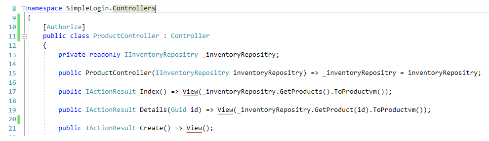
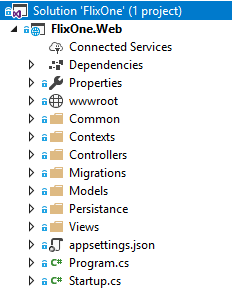
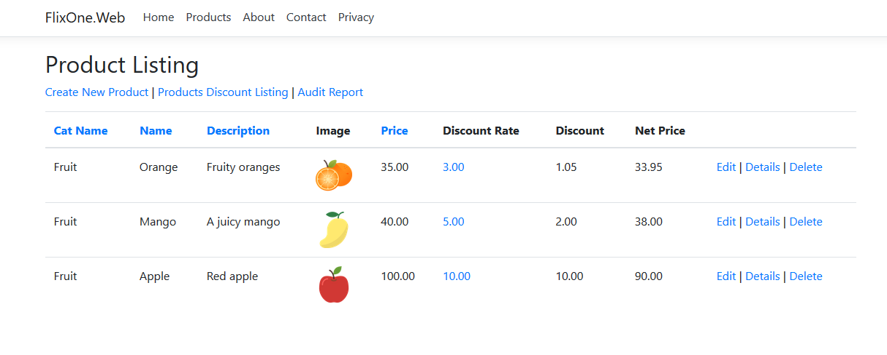
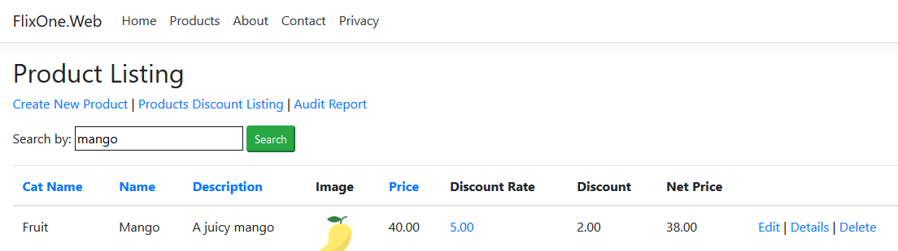
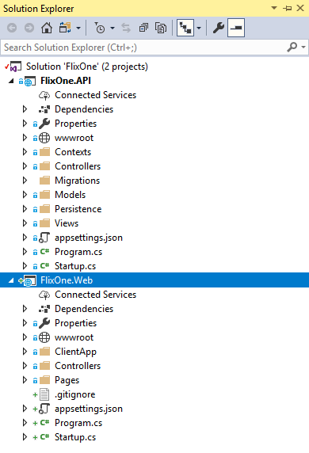

# Hands-On Design Patterns with C# and .NET Core

Chapter 1. Overview of OOP in .NET Core and C#
==============================================

For over 20 years, the most popular programming languages have been based on the principles of **object-oriented programming** (**OOP**). The rise in popularity of OOP languages is largely to do with the benefits of being able to abstract complex logic into a structure, called an object, that can be more easily explained, and, more importantly, reused within an application. In essence, OOP is a software design approach, that is, a pattern for developing software using the concept of objects that contain data and functionality. As the software industry matured, patterns appeared in OOP for commonly occurring problems, as they were effective in solving the same problems but across different contexts and industries. As software moved from the mainframe to client servers and then to the cloud, additional patterns have emerged to help in reducing development costs and improving reliability. This book will explore design patterns, from the foundation of OOP to the architecture design patterns for cloud-based software.

OOP is based on the concept of an object. This object generally contains data, referred to as properties and fields, and code or behavior referred to as methods.

**Design patterns** are solutions to general problems that software programmers face during development, and are built from the experience of what works and what doesn't. These solutions are trialed and tested by numerous developers in various situations. The benefits of using a pattern based on this previous activity ensure that the same efforts are not repeated again and again. In addition to this, using a pattern adds a sense of reliability that the problem will be solved without introducing a defect or issue.

This chapter reviews OOP and how it applies to C#. Note that this is simply intended as a brief introduction and it is not meant to be a complete primer for OOP or C#; instead, the chapter will cover aspects of both in enough detail to introduce you to the design patterns that will be covered in subsequent chapters. This chapter will cover the following topics:

*   A discussion of OOP and how classes and objects work
*   Inheritance
*   Encapsulation
*   Polymorphism

Technical requirements
======================

This chapter contains various code examples to explain these concepts. The code is kept simple and is just for demonstration purposes. Most of the examples involve a .NET Core console application written in C#.

To run and execute the code, you will need the following:

*   Visual Studio 2019 (you can also run the application using Visual Studio 2017version 3or later)
*   .NET Core
*   SQL Server (the Express Edition is used in this chapter)

Installing Visual Studio
------------------------

In order to run these code examples, you will need to install Visual Studio or later (you can also use your preferred IDE). To do this, follow these instructions:

1.  Download Visual Studio from the following link: [https://docs.microsoft.com/en-us/visualstudio/install/install-visual-studio](https://docs.microsoft.com/en-us/visualstudio/install/install-visual-studio).
2.  Follow the installation instructions included in the link. Multiple versions of Visual Studio are available; in this chapter, we are using Visual Studio for Windows.

Setting up .NET Core
--------------------

If you do not have .NET Core installed, you will need to follow these instructions:

1.  Download .NET Core from the following link:[https://www.microsoft.com/net/download/windows](https://www.microsoft.com/net/download/windows).
2.  Follow the installation instructions in the related library: [https://dotnet.microsoft.com/download/dotnet-core/2.2](https://dotnet.microsoft.com/download/dotnet-core/2.2).

The complete source code is available in GitHub. The source code shown in the chapter might not be complete, so it is recommended that you retrieve the source code in order to run the examples ([https://github.com/PacktPublishing/Hands-On-Design-Patterns-with-C-and-.NET-Core/tree/master/Chapter1](https://github.com/PacktPublishing/Hands-On-Design-Patterns-with-C-and-.NET-Core/tree/master/Chapter1)).

The models used in this book
----------------------------

As a learning aid, this book will contain many code samples in C# alongside diagrams and images to help describe specific concepts where possible. This is not a **Unified Modeling Language** (**UML**) book; however, for those with a knowledge of UML, many of the diagrams should seem familiar. This section provides a description of the class diagrams that will be used in this book.

Here, a class will be defined as including both fields and methods separated by a dashed line. If important to the discussion, then accessibility will be indicated as `-` for private, `+` for public, `#` for protected, and `~` for internal. The following screenshot illustrates this by showing a `Car` class with a private`_name`variable and a public`GetName()`method:

When showing relationships between objects, an association is shown with a solid line, an aggregation is shown with an open diamond, and a composition is shown with a filled diamond. When important to the discussion, multiplicity will be shown next to the class in question. The following diagram illustrates the `Car` class as having a single **Owner**, and up to three **Passengers**; it consists of four **Wheels**:

**Inheritance** is shown using an open triangle on the base class using a solid line. The following diagram shows the relationship between an `Account` base class and the `CheckingAccount` and `SavingsAccount` child classes: 

**Interfaces** are shown in a similar manner to inheritance, but they use a dashed line as well as an additional `<<interface>>` label, as shown in the following diagram:

This section provides an overview of the models used in this book. This style/approach was chosen because, hopefully, it will be familiar to the majority of readers. 

OOP and how classes and objects work
====================================

OOP refers to a software programming approach that uses objects defined as classes. These definitions include fields, sometimes called attributes, to store data and methods in order to provide functionality. The first OOP language was a simulation of real systems known as Simula ([https://en.wikipedia.org/wiki/Simula](https://en.wikipedia.org/wiki/Simula)) and was developed at the Norwegian Computing Center in 1960. The first pure OOP language came into existence in 1970 as the Smalltalk ([https://en.wikipedia.org/wiki/Smalltalk](https://en.wikipedia.org/wiki/Smalltalk)) language. This language was designed to program the Dynabook ([http://history-computer.com/ModernComputer/Personal/Dynabook.html](http://history-computer.com/ModernComputer/Personal/Dynabook.html)), which is a personal computer created by Alan Kay. Several OOP languages evolved from there, with the most popular being Java, C++, Python, and C#. 

OOP is based on objects that contain data. The OOP paradigm allows developers to arrange/organize code into an abstract or logical structure called an object. An object can contain both data and behavior.

With the use of the OOP approach, we are doing the following:

*   **Modularizing**: Here, an application is decomposed into different modules.
*   **Reusing the software**: Here, we rebuild or compose an application from different (that is, existing or new) modules.

In the following sections, we will discuss and understand the concepts of OOP in more detail.

Explaining OOP
--------------

Earlier, programming approaches had limitations and they often became difficult to maintain. OOP offered a new paradigm in software development that had advantages over other approaches. The concept of organizing code into objects is not difficult to explain and this is a huge advantage for the adoption of a new pattern. Many examples can be taken from the real world in order to explain the concept. Complex systems can also be described using smaller building blocks (that is, an _objects_). These allow developers to look at sections of the solution individually while understanding how they fit into the entire solution.

With this in mind, let's define a program as follows:

"A program is a list of instructions that instructs the language compiler on what to do."

As you can see, an object is a way of organizing a list of instructions in a logical manner. Going back to the example of the house, the architect's instructions help us to build a house, but they are not the house itself. Instead the architect's instructions are an abstract representation of a house. A class is similar as it defines the features of an object. An object is then created from the definition of a class. This is often called **instantiating the object**_._

To understand OOP more closely, we should mention two other significant programming approaches:

*   **Structured programming**: This is a term coined by Edsger W. Dijkstra in 1966. Structured programming is a programming paradigm that solves a problem to handle 1,000 lines of code and divides these into small parts. These small parts are mostly called **subroutines**, **block structures**, **for** and **while** loops, and more. Languages that use structured programming techniques include ALGOL, Pascal, PL/I, and more.
*   **Procedural programming**: This is a paradigm derived from structured programming and is simply based on how we make a call (also known as a **procedu****ral call**). Languages that use procedural programming techniques include COBOL, Pascal, and C. A recent example of the Go programming language was published in 2009.

Procedural calls  
A procedural call is where a collection of statements, known as a _procedure_,is activated. This is sometimes referred to as a procedure that is _invoked_. 

The main problem with these two approaches is that programs are not easily manageable once they grow. Programs with more complex and larger code bases strain these two approaches, leading to difficult-to-understand and difficult-to-maintain applications. To overcome such problems, OOP provides the following features:

*   Inheritance
*   Encapsulation
*   Polymorphism

In the following sections, we will discuss these features in more detail.

Inheritance, encapsulation, and polymorphism are sometimes referred to as the three pillars of OOP.

Before we begin, let's discuss some structures that are found in OOP.

A class
-------

A **class** is a group or template definition of the methods and variables that describe an object. In other words, a class is a blueprint, containing the definition of the variables and the methods that are common to all instances of the class called objects.

Let's take a look at the following code example:

Copy

    public class PetAnimal
    {
        private readonly string PetName;
        private readonly PetColor PetColor;
    
        public PetAnimal(string petName, PetColor petColor)
        {
            PetName = petName;
            PetColor = petColor;
        }
    
        public string MyPet() => $"My pet is {PetName} and its color is {PetColor}.";
    }

In the preceding code, we have a `PetAnimal` class that has two private fields called `PetName` and `PetColor`, and one method called `MyPet()`.

An object
---------

In the real world, objects share two characteristics, that is, state and behavior. In other words, we can say that every object has a name, color, and more; these characteristics are simply the state of an object. Let's take the example of any type of pet: a dog and a cat will both have a name by which they called. So, in this way, my dog is named Ace and my cat is named Clementine. Similarly, dogs and cats have specific behaviors, for example, dogs barks and cats meow.

In the _Explaining OOP_ section, we discussed that OOP is a programming model that is supposed to combine a state or structure (data) and the behavior (method) to deliver software functionality. In the previous example, the different states of pets make up the actual data, while the behavior of the pets is the method. 

An object stores the information (which is simply data) in attributes and discloses its behavior through methods.

In terms of an OOP language such as C#, an object is an instance of a class. In our previous example, the real-world object, `Dog`, would be an object of the `PetAnimal` class.

Objects can be concrete (that is, a real-world object, such as a dog or cat, or any type of file, such as physical file or a computer file) or they can be conceptual, such as database schemas or code blueprints.

The following code snippet shows how an object contains data and a method, and how you can use it:

Copy

    namespace OOPExample
    {
        class Program
        {
            static void Main(string[] args)
            {
                Console.WriteLine("OOP example");
                PetAnimal dog = new PetAnimal("Ace", PetColor.Black);
                Console.WriteLine(dog.MyPet());
                Console.ReadLine();
                PetAnimal cat = new PetAnimal("Clementine", PetColor.Brown);
                Console.WriteLine(cat.MyPet());
                Console.ReadLine();
            }
        }
    }

In the previous code snippet, we have created two objects: `dog` and `cat`. These objects are two different instances of a `PetAnimal` class. You can see that the fields or properties that contain data about the animal are given values using the constructor method. The constructor method is a special method used to create an instance of the class.

Let's visualize this example in the following diagram:

The preceding diagram is a pictorial representation of our previous code example, where we created two different `Dog` and `Cat` objects of the `PetAnimal` class. The diagram is relatively self-explanatory; it tells us that the object of `Dog` class is an instance of the `PetAnimal` class, as is the `Cat` object.

An interface
------------

In C#, an **interface** defines what an object contains, or its contract; in particular, the methods, properties, events, or indices of the object. However, the interface does not provide implementation. Interfaces cannot contain attributes. This is in contrast to a base class, where the base class provides both the contract and the implementation. A class that implements an interface must implement everything specified in the interface. 

An abstract class  
An abstract class is a bit of a hybrid between the interface and base class as it provides both implementations and attributes as well as methods that must be defined in the child classes.  
  
Signature  
The term _signature_ can also be used to describe the contract of an object. 

Inheritance
===========

One of the most important concepts in OOP is inheritance. Inheritance between classes allows us to define an _is-a-type-of relationship_; for example, a car _is a type of_ vehicle. The importance of this concept is that it allows for objects of the same type to share similar features. Let's say that we have a system for managing different products of an online bookstore. We might have one class for storing information about a physical book and a different one for storing information about a digital or online book. The features that are similar between the two, such as the name, publisher, and author, could be stored in another class. Both the physical and digital book classes could then inherit from the other class. 

There are different terms to describe classes in inheritance: a _child_ or _derived_ class inherits from another class while the class being inherited from can be called the _parent_ or _base_ class. 

In the following sections, we will discuss inheritance in more detail.

Types of inheritance
--------------------

Inheritance helps us to define a child class. This child class inherits the behavior of the parent or base class.

In C#, inheritance is symbolically defined using a colon (`:`).

Let's take a look at the different types of inheritance:

*   **Single inheritance**: As the most common type of inheritance, single inheritance describes a single class that is is derived from another class. 

Let's revisit the `PetAnimal` class previously mentioned and, instead, use inheritance to define our `Dog` and `Cat` classes. With inheritance, we can define some attributes that are common for both. For example, the name of the pet and the color of the pet would be common, so they would be located in a base class. The specifics of a cat or a dog would then be defined in a specific class; for example, the sound the cat and dog make. The following diagram illustrates a `PetAnimal` base class with two child classes: 

C# only supports single inheritance.

*   **Multiple inheritance**: Multiple inheritance happens when a derived class inherits multiple base classes. Languages such as C++ support multiple inheritance. C# does not support multiple inheritance, but we can achieve behaviors similar to multiple inheritance with the help of interfaces.

You can refer to the following post for more information about C# and multiple inheritance:  
[https://blogs.msdn.microsoft.com/csharpfaq/2004/03/07/why-doesnt-c-supportmultiple-inheritance/](https://blogs.msdn.microsoft.com/csharpfaq/2004/03/07/why-doesnt-c-supportmultiple-inheritance/).

*   **Hierarchical inheritance**: Hierarchical inheritance happens when more than one class inherits from another class.
*   **Multilevel inheritance**: When a class is derived from a class that is already a derived class, it is called multilevel inheritance.
*   **Hybrid inheritance**: Hybrid inheritance is a combination of more than one inheritance.

C# does not support hybrid inheritance.

*   **Implicit inheritance**: All the types in .NET Core implicitly inherit from the `System.Object` class and its derived classes.

Encapsulation
=============

Encapsulation is another fundamental concept in OOP where the details of a class, that is, the attributes and methods, can be visible or not visible outside the object. With encapsulation, a developer is providing guidance on how a class should be used as well as helping to prevent a class from being handled incorrectly. For example, let's say we wanted to only allow adding `PetAnimal` objects by using the `AddPet(PetAnimal)` method. We would do this by having the `PetOwner` class's `AddPet(PetAnimal)` method available while having the `Pets` attribute restricted to anything outside the `PetAnimal` class. In C#, this is possible by making the `Pets` attribute private. One reason for doing this would be if additional logic was required whenever a `PetAnimal` class was added, such as logging or validating that the `PetOwner` class could have a pet.

C# supports different levels of access that can be set on an item. An item could be a class, a class's attribute or method, or an enumeration:

*   **Public**: This indicates that access is available outside the item.
*   **Private**: This indicates that only the object has access to the item.
*   **Protected**: This indicates that only the object (and objects of classes that extended the class) can access the attribute or method.
*   **Internal**: This indicates that only objects within the same assembly have access to the item.
*   **Protected Internal**: This indicates that only the object (and objects of classes that extended the class) can access the attribute or method within the same assembly.

In the following diagram, access modifiers have been applied to `PetAnimal`:

As an example, the name of the pet and the color were made private to prevent access from outside the `PetAnimal` class. In this example, we are restricting the `PetName` and `PetColor` properties so only the `PetAnimal` class can access them in order to ensure that only the base class, `PetAnimal`, can change their values. The constructor of `PetAnimal` was protected to ensure only a child class could access it. In this application, only classes within the same library as the `Dog` class have access to the `RegisterInObedienceSchool()` method.

Polymorphism
============

The ability to handle different objects using the same interface is called polymorphism. This provides developers with the ability to build flexibility into applications by writing a single piece of functionality that can be applied to different forms as long as they share a common interface. There are different definitions of polymorphism in OOP, and we will distinguish between two main types:

*   **Static or early binding**: This form of polymorphism happens when the application is compiled.
*   **Dynamic or late binding**: This form of polymorphism happens when the application is running.

Static polymorphism
-------------------

Static or early binding polymorphism happens at compile time and it primarily consists of method overloading, where a class has multiple methods with the same name but with different parameters. This is often useful to convey a meaning behind the method or to simplify the code. For example, in a calculator, it is more readable to have multiple methods for adding different types of number rather than having a different method name for each scenario; let's compare the following code:

Copy

    int Add(int a, int b) => a + b;
    float Add(float a, float b) => a + b;
    decimal Add(decimal a, decimal b) => a + b;

In the following, the code is shown again with the same functionality, but without overloading the `Add()` method:

Copy

    int AddTwoIntegers(int a, int b) => a + b;
    float AddTwoFloats(float a, float b) => a + b;
    decimal AddTwoDecimals(decimal a, decimal b) => a + b;

In the pet example, an owner will use different food to feed objects of the `cat` and `dog` class. We can define this as the `PetOwner` class with two methods for `Feed()`, as follows:

Copy

    public void Feed(PetDog dog)
    {
        PetFeeder.FeedPet(dog, new Kibble());
    }
    
    public void Feed(PetCat cat)
    {
        PetFeeder.FeedPet(cat, new Fish());
    }

Both methods use a `PetFeeder` class to feed the pet, while the `dog` class is given `Kibble` and the `cat` instance is given `Fish`. The `PetFeeder` class is described in the _Generics_ section.

Dynamic polymorphism
--------------------

Dynamic or late binding polymorphism happens while the application is running. There are multiple situations where this can occur and we'll cover three common forms in C#: interface, inheritance, and generics.

Interface polymorphism
----------------------

An interface defines the signature that a class must implement. In the `PetAnimal` example, imagine that we define pet food as providing an amount of energy, as follows:

Copy

    public interface IPetFood
    {
        int Energy { get; }
    }

By itself, the interface cannot be instantiated but describes what an instance of `IPetFood` must implement. For example, `Kibble` and `Fish` might provide different levels of energy, as shown in the following code:

Copy

    public class Kibble : IPetFood
    {
        public int Energy => 7;
    }
    
    public class Fish : IPetFood
    {
        int IPetFood.Energy => 8;
    }

In the preceding code snippet, `Kibble` provides less energy than `Fish`.

Inheritance polymorphism
------------------------

Inheritance polymorphism allows for functionality to be determined at runtime in a similar way to an interface but applies to class inheritance. In our example, a pet can be fed, so we can define this as having a new `Feed(IPetFood)` method, which uses the interface that was defined previously:

Copy

    public virtual void Feed(IPetFood food)
    {
        Eat(food);
    }
    
    protected void Eat(IPetFood food)
    {
        _hunger -= food.Energy;
    }

The preceding code indicates that all implementations of `PetAnimal` will have a `Feed(IPetFood)` method and child classes can provide a different implementation. `Eat(IPetFood food)` is not marked as virtual, as it is intended that all `PetAnimal` objects will use the method without needing to override its behavior. It is also marked as protected to prevent it being accessed from outside the object.

A virtual method does not have to be defined in a child class; this differs from an interface, where all methods in an interface must be implemented.

`PetDog` will not override the behavior of the base class as a dog will eat both `Kibble` and `Fish`. A cat is more discerning, as shown in the following code:

Copy

    public override void Feed(IPetFood food)
    {
        if (food is Fish)
        {
            Eat(food);
        }
        else
        {
            Meow();
        }
    }

Using the override keyword, `PetCat` will change the behavior of the base class, resulting in a cat only eating fish.

Generics
--------

A generic defines a behavior that can be applied to a class. A commonly used form of this is in collections, where the same approach to handling an object can be applied regardless of the type of object. For example, a list of strings or a list of integers can be handled using the same logic without having to differentiate between the specific types.

Going back to pets, we could define a generic class for feeding a pet. This class simply feeds a pet given both the pet and some food, as shown in the following code:

Copy

    public static class PetFeeder
    {
        public static void FeedPet(TP pet, TF food) where TP : PetAnimal
                                                        where TF : IPetFood 
        {
            pet.Feed(food); 
        }
    }

There are a couple of interesting thing to point out here. First of all, the class does not have to be instantiated as both the class and method are marked as static. The generic method is described using the method signature, `FeedPet<TP, TF>`. The `where` keyword is used to indicate additional requirements as to what `TP` and `TF` must be. In this example, the `where` keyword defines `TP` as having to be a type of `PetAnimal`, while `TF` must implement the `IPetFood` interface.

Summary
=======

In this chapter, we discussed OOP and its three main features: inheritance, encapsulation, and polymorphism. Using these features, the classes within an application can be abstracted to provide definitions that are both easy to understand and protected against being used in a manner that is inconsistent with its purpose. This is an essential difference between OOP and some earlier types of software development language such as structural and procedural programming. With the ability to abstract functionality, the ability to reuse and maintain code is increased.

In the next chapter, we will discuss various patterns used in enterprise software development. We will cover programming patterns as well as software development principles and patterns used in the **Software Development Life Cycle** (**SDLC**).

Questions
=========

The following questions will allow you to consolidate the information contained in this chapter:

1.  What do the terms late and early binding refer to?
2.  Does C# support multiple inheritance?
3.  In C#, what level of encapsulation could be used to prevent access to a class from outside the library?
4.  What is the difference between aggregation and composition? 
5.  Can interfaces contain properties? (This is a bit of a trick question.)
6.  Do dogs eat fish?

Chapter 2. Modern Software Design Patterns and Principles
=========================================================

In the previous chapter, **object-oriented programming** (**OOP**) was discussed in preparation for exploring different patterns. As many patterns rely on concepts in OOP, it is important to introduce and/or revisit these concepts. Inheritance between classes allows us to define an _is-a-type-of relationship_. This provides a higher degree of abstraction. For example, with inheritance it is possible to perform comparisons such as a _cat _is a type of _animal_ and a _dog_ is a type of _animal_. Encapsulation provides a way of controlling the visibility and access of details of a class. Polymorphism provides the ability to handle different objects using the same interface. With OOP, a higher level of abstraction can be achieved, providing a more manageable and understandable way to deal with large solutions.

This chapter catalogs and introduces different patterns used in modern software development. This book takes a very broad view of what a pattern is. A pattern in software development is any solution to a general problem that software programmers face during development. They are built from experience on what works and what does not. Also, these solutions are trialed and tested by numerous developers in various situations. The benefit of using a pattern is based on this past activity both in not repeating the effort and in the assurance that the problem will be solved without introducing a defect or issue.

Especially when taking technology-specific patterns into consideration, there are too many to cover in a single book so this chapter will highlight specific patterns to illustrate different types of pattern. We have tried to pick out the commonest and most influential patterns based on our experience. In subsequent chapters, specific patterns will be explored in more detail.

The following topics will be covered in this chapter:

*   Design principles, including SOLID
*   Pattern catalogs, including **Gang of Four** (**GoF**) patterns and **Enterprise Integration Pattern** (**EIP**)
*   Software development life cycle patterns
*   Patterns and practices for solution development, cloud development, and service development

Technical requirements
======================

This chapter contains various code examples to explain the concepts. The code is kept simple and is just for demonstration purposes. Most of the examples involve a .NET Core console application written in C#.

To run and execute the code, you need the following:

*   Visual Studio 2019 (you can also run the application using Visual Studio 2017version 3or later)
*   .NET Core
*   SQL Server (the Express Edition is used in this chapter)

Installing Visual Studio
------------------------

To run these code examples, you need to install Visual Studio or you can use your preferred IDE. To do this, follow these instructions:

1.  Download Visual Studio from the following link:[https://docs.microsoft.com/en-us/visualstudio/install/install-visual-studio](https://docs.microsoft.com/en-us/visualstudio/install/install-visual-studio).
2.  Follow the installation instructions included. Multiple versions are available for Visual Studio installation. In this chapter, we are using Visual Studio for Windows.

Setting up .NET Core
--------------------

If you do not have .NET Core installed, you need to follow these instructions:

1.  Download .NET Core from the following link:[https://www.microsoft.com/net/download/windows](https://www.microsoft.com/net/download/windows).
2.  Follow the Installation instructions and related library: [https://dotnet.microsoft.com/download/dotnet-core/2.2](https://dotnet.microsoft.com/download/dotnet-core/2.2).

The complete source code is available in GitHub. The source code shown in the chapter might not be complete so it is advisable to retrieve the source in order to run the examples: [https://github.com/PacktPublishing/Hands-On-Design-Patterns-with-C-and-.NET-Core/tree/master/Chapter2](https://github.com/PacktPublishing/Hands-On-Design-Patterns-with-C-and-.NET-Core/tree/master/Chapter2).

Design principles
=================

Arguably, the most important aspect of good software development is software design. Developing software solutions that are both functionally accurate and easy to maintain is challenging and relies considerably on using good development principles. Over time, some decisions that were made early in the project can cause solutions to become too costly to maintain and extend, forcing systems to be rewritten, while others with a good design can be extended and adapted as business requirements and technology change. There are many software development design principles and this section will highlight some popular and important ones you need to be familiar with.

DRY – Don't Repeat Yourself
---------------------------

The guiding thought behind the **Don't Repeat Yourself** (**DRY**) principle is that duplication is a waste of time and effort. The repetition could take the form of processes and code. Handling the same requirement multiple times is a waste of effort and creates confusion within a solution. When first viewing this principle, it might not be clear how a system could end up duplicating a process or code. For example, once someone has determined how to do a requirement, why would someone else take the effort to duplicate the same functionality? There are many circumstances in which this happens in software development, and understanding why this happens is key to understanding the value of this principle.

The following are some common causes of code duplication:

*   **Lack of understanding**: In large solutions, a developer might not have a full understanding of an existing solution and/or does not know how to apply abstraction to solve the problem with existing functionality.
*   **Copy and paste**: To put this simply, the code is duplicated in multiple classes instead of refactoring the solution to allow for multiple classes to access the shared functionality. 

KISS – Keep It Simple Stupid
----------------------------

Similar to DRY, **Keep It Simple Stupid** (**KISS**) has been an important principle in software development for many years. KISS stresses that simplicity should be the goal and complexity should be avoided. The key here is to avoid unnecessary complexity and thus reduce the chances of things going wrong.

YAGNI – You Aren't Gonna Need It
--------------------------------

**You Aren't Gonna Need It** (**YAGNI**) simply states that functionality should only be added when it is required. Sometimes in software development, there is a tendency to _futureproof_ a design in case something changes. This can create requirements that are actually not needed currently or in the future: 

"Always implement things when you actually need them, never when you just foresee that you need them."

_\- Ron Jeffries_

MVP – Minimum Viable Product
----------------------------

By taking a **Minimum Viable Product** (**MVP**) approach, the scope of a piece of work is limited to the smallest set of requirements in order to produce a functioning deliverable. MVP is often combined with Agile software development (see the _Software development life cycle patterns_ section later in the chapter) by limiting requirements to a manageable amount that can be designed, developed, tested, and delivered. This approach lends itself well to smaller website or application development, where a feature set can be progressed all the way to production in a single development cycle.

In [Chapter 3](/book/programming/9781789133646/3), _Implementing Design Patterns - Basics Part 1_, MVP will be illustrated in a fictitious scenario where the technique will be used to limit the scope of changes as well as to help the team focus during the design and requirement gathering phases.

SOLID
-----

SOLID is one of the most influential design principles and we will cover it in more detail in [Chapter 3](/book/programming/9781789133646/3), _Implementing Design Patterns\- Basics Part 1_. Actually made up of five design principles, the intention of SOLID is to encourage designs that are more maintainable and easier to understand. These principles encourage code bases that are easier to modify and they reduce the risk of issues being introduced.

In [Chapter 3](/book/programming/9781789133646/3), _Implementing Design Patterns\- Basics Part 1,_ SOLID will be covered in more detail by being applied to a C# application.

Single responsibility principle
-------------------------------

A class should have only one responsibility. The goal of this principle is to simplify our classes and logically structure them. Classes with multiple responsibilities are harder to understand and modify, as they are more complex. Responsibility in this circumstance is simply a reason for the change. Another way of looking at responsibility is to define it as a single part of the functionality: 

"A class should have one, and only one, reason to change."

_\- Robert C. Martin_

Open/closed principle
---------------------

The open/closed principle is best described in terms of OOP. A class should be designed with inheritance as a means of extending its functionality. Change, in other words, is planned for and considered while the class is being designed. By defining and using an interface that the class implements, the open/closed principle is applied. The class is _open_ for modification, while its description, the interface, is _closed _for modification.

Liskov substitution principle
-----------------------------

Being able to substitute objects at runtime is the basis of the Liskov substitution principle. In OOP, if a class inherits from a base class or implements an interface, then it can be referenced as an object of the base class or interface. This is easier to describe with a simple example.

We'll define an interface for an animal and implement two animals, `Cat` and `Dog`, as follows:

Copy

    interface IAnimal
    {
         string MakeNoise();
    }
    class Dog : IAnimal
    {
       public string MakeNoise()
         {
            return "Woof";
         }
    }
    class Cat : IAnimal
    {
        public string MakeNoise()
        {
            return "Meouw";
        }
    }

Then we can refer to the `Cat` and `Dog` as an animal as follows:

Copy

    var animals = new List { new Cat(), new Dog() };
    
    foreach(var animal in animals)
    {
        Console.Write(animal.MakeNoise());
    }

Interface segregation principle
-------------------------------

Similar to the single responsibility principle, the interface segregation principle states that an interface should be limited to containing only methods that are relevant to a single responsibility. By reducing the complexity of the interface, the code becomes easier to refactor and understand. An important benefit of adhering to this principle in a system is that it aids in decoupling a system by reducing the number of dependencies.

Dependency inversion principle
------------------------------

The **dependency inversion principle** (**DIP**), also referred to as the dependency injection principle, states that modules should not depend on details but on abstractions instead. This principle encourages writing loosely coupled code to enhance readability and maintenance, especially in a large complex code base.

Software patterns
=================

Over the years, many patterns have been compiled into catalogs. This section will use two catalogs as an illustration. The first catalog is a collection of OOP-related patterns by the **GoF**. The second relates to the integration of systems and remainstechnologically agnostic. At the end of the chapter, there are some references for additional catalogs and resources.

GoF patterns
------------

Potentially, the most influential and well-known OOP collection of patterns comes from the _Design Patterns: Elements of Reusable Object-Oriented Software_ book by _GoF._ The aim of the patterns in the book is on a lower level—that is, object creation and interaction—instead of a larger software architecture concern. The collection consists of templates that can be applied to particular scenarios with the goal of producing solid building blocks while avoiding common pitfalls in object-oriented development.

_Erich Gamma, John Vlissides, Richard Helm_, and _Ralph Johnson_ are referred to as the GoF because of their widely influential publications in the 1990s. The book _Design Patterns: Elements of Reusable Object-Oriented Software _has been translated into several languages and contains examples in both C++ and Smalltalk. 

The collection is broken into three categories: creational patterns, structural patterns, and behavioral patterns which will be explained in the following sections.

Creational patterns
-------------------

The following five patterns are concerned with the instantiation of objects:

*   **Abstract Factory**: A pattern for the creation of objects belonging to a family of classes. The specific object is determined at runtime.
*   **Builder**: A useful pattern for more complex objects where the construction of the object is controlled externally to the constructed class.
*   **Factory Method**: A pattern for creating objects derived from a class where the specific class is determined at runtime.
*   **Prototype**: A pattern for copying or cloning an object. 
*   **Singleton**: A pattern for enforcing only one instance of a class.

In [Chapter 3](/book/programming/9781789133646/3), _Implementing Design Patterns - Basics Part 1_, the Abstract Factory pattern will be explored in more detail. In [Chapter 4](/book/programming/9781789133646/4), _Implementing Design Patterns - Basics Part 2_, the Singleton and Factory Method patterns will be explored in detail, including using the .NET Core framework support for these patterns.

Structural patterns
-------------------

The following patterns are concerned with defining relationships between classes and objects:

*   **Adapter**: A pattern for providing a match between two different classes
*   **Bridge**: A pattern for allowing the implementation details of a class to be replaced without requiring the class to be modified
*   **Composite**: Used to create a hierarchy of classes in a tree structure
*   **Decorator**: A pattern for replacing the functionality of a class at runtime
*   **Facade**: A pattern used to simplify complex systems
*   **Flyweight**: A pattern used to reduce the resource usage for complex models
*   **Proxy**: A pattern used to represent another object allowing for an additional level of control between the calling and called objects

Behavioral patterns
-------------------

The following behavioral patterns can be used to define the communication between classes and objects:

*   **Chain** **of** **Responsibility**: A pattern for handling a request between a collection of objects
*   **Command**: A pattern used to represent a request
*   **Interpreter**: A pattern for defining syntax or language for instructions in a program
*   **Iterator**: A pattern for traversing a collection of items without detailed knowledge of the elements in a collection
*   **Mediator**: A pattern for simplifying communication between classes
*   **Memento**: A pattern for capturing and storing the state of an object
*   **Observer**: A pattern for allowing objects to be notified of changes to another object's state
*   **State**: A pattern for altering an object's behavior when its state changes
*   **Strategy**: A pattern for implementing a collection of algorithms where a specific algorithm can be applied at runtime
*   **Template** **Method**: A pattern for defining the steps of an algorithm while leaving the implementation details in a subclass
*   **Visitor**: A pattern promoting loose coupling between data and functionality, allowing for additional operations to be added without requiring changes to the data classes

Chain of responsibility
-----------------------

A useful pattern you need to be familiar with is the Chain of Responsibility pattern so we will use it as an example. With this pattern, we will set up a collection or chain of classes for handling a request. The idea is the request will pass through each class until it is handled. This illustration uses a car service center, where each car will pass through the different sections of the center until the service is complete.

Let's start by defining a collection of flags that will be used to indicate the services required:

Copy

    [Flags]
    enum ServiceRequirements
    {
        None = 0,
        WheelAlignment = 1,
        Dirty = 2,
        EngineTune = 4,
        TestDrive = 8
    }

The `FlagsAttribute` in C# is a great way of using a bit field to hold a collection of flags. The single field will be used to indicate the enum values that are _turned on_ by using bitwise operations. 

The `Car` will contain a field to capture what servicing is required and a field that returns true when the service has been completed:

Copy

    class Car
    {
        public ServiceRequirements Requirements { get; set; }
    
        public bool IsServiceComplete
        {
            get
            {
                return Requirements == ServiceRequirements.None;
            }
        }
    }

One thing to point out is that a `Car` is considered to have its service completed once all the requirements have been completed, as represented by the `IsServiceComplete` property.

An abstract base class will be used to represent each of our service technicians in the following manner:

Copy

    abstract class ServiceHandler
    {
        protected ServiceHandler _nextServiceHandler;
        protected ServiceRequirements _servicesProvided;
    
        public ServiceHandler(ServiceRequirements servicesProvided)
        {
            _servicesProvided = servicesProvided;
        }
    }

Take note that the service provided by the class that extends the `ServiceHandler` class, in other words the technician, is required to be passed in.

The service will then be performed by using the bitwise `NOT` operation (`~`) to _turn off_ the bit on the given `Car`, indicating the service is required in the `Service` method: 

Copy

    public void Service(Car car)
    {
        if (_servicesProvided == (car.Requirements & _servicesProvided))
        {
            Console.WriteLine($"{this.GetType().Name} providing {this._servicesProvided} services.");
            car.Requirements &= ~_servicesProvided;
        }
    
        if (car.IsServiceComplete || _nextServiceHandler == null)
            return;
        else
            _nextServiceHandler.Service(car);
    }

If all services have been completed on the car and/or there are no more services, the chain is stopped. If there is another service and a car is not ready, then the next service handler is called.

This approach requires the chain to be set and the preceding example shows this being done using the`SetNextServiceHandler()` method to set the next service to be performed:

Copy

    public void SetNextServiceHandler(ServiceHandler handler)
    {
        _nextServiceHandler = handler;
    }

The service specialists include a `Detailer`, `Mechanic`, `WheelSpecialist`, and a `QualityControl` engineer. The `ServiceHandler` representing a `Detailer` is shown in the following code:

Copy

    class Detailer : ServiceHandler
    {
        public Detailer() : base(ServiceRequirements.Dirty) { }
    }

The mechanic, whose specialty is tuning the engine, is shown in the following code:

Copy

    class Mechanic : ServiceHandler
    {
        public Mechanic() : base(ServiceRequirements.EngineTune) { }
    }

The wheel specialist is shown in the following code:

Copy

    class WheelSpecialist : ServiceHandler
    {
        public WheelSpecialist() : base(ServiceRequirements.WheelAlignment) { }
    }

And last is quality control, who will take the car for a test drive:

Copy

    class QualityControl : ServiceHandler
    {
        public QualityControl() : base(ServiceRequirements.TestDrive) { }
    }

The service center technicians have been defined, so the next step is to service a couple of cars. This will be illustrated in the `Main` code block, starting with constructing the required objects:

Copy

    static void Main(string[] args)
    { 
        var mechanic = new Mechanic();
        var detailer = new Detailer();
        var wheels = new WheelSpecialist();
        var qa = new QualityControl();

The next step will be to set up the handling order for the different services:

Copy

        qa.SetNextServiceHandler(detailer);
        wheels.SetNextServiceHandler(qa);
        mechanic.SetNextServiceHandler(wheels);

Then two calls will be made to the mechanic, which is the start of the chain of responsibility:

Copy

        Console.WriteLine("Car 1 is dirty");
        mechanic.Service(new Car { Requirements = ServiceRequirements.Dirty });
    
        Console.WriteLine();
    
        Console.WriteLine("Car 2 requires full service");
        mechanic.Service(new Car { Requirements = ServiceRequirements.Dirty | 
                                                    ServiceRequirements.EngineTune | 
                                                    ServiceRequirements.TestDrive | 
                                                    ServiceRequirements.WheelAlignment });
    
        Console.Read();
    }

An important thing to note is the order in which the chain is set. For this service center, the mechanic first performs tuning, followed by the wheels being aligned. Then, a test drive is performed and after that, the car is worked up in detail. Originally, the test drive used to be performed as the last step, but the service center determined that, on rainy days, this required the car details to be repeated. A bit of a silly example, but it illustrates the benefit of having the chain of responsibility defined in a flexible manner.

The preceding screenshot shows the display after our two cars have been serviced.

Observer pattern
----------------

An interesting pattern to explore in more detail is the**Observer pattern**. This pattern allows for instances to be informed of when a particular event happens in another instance. In this way, there are many observers and a single subject. The following diagram illustrates this pattern:

Let's provide an example by creating a simple C# console application that will create a single instance of a`Subject`class and multiple`Observer`instances. When a quantity value changes in the`Subject`class, we want each`Observer`instance to be notified.

The`Subject`class contains a private quantity field that is updated by a public`UpdateQuantity`method:

Copy

    class Subject
    {
        private int _quantity = 0;
    
        public void UpdateQuantity(int value)
        {
            _quantity += value;
    
            // alert any observers
        }
    }

In order to alert any observers, we use the C# keywords, `delegate`and`event`. The`delegate` keyword defines the format or handler that will be called. The delegate to be used when the quantity is updated is shown in the following code:

Copy

    public delegate void QuantityUpdated(int quantity);

The delegate defines`QuantityUpdated`to be a method that receives an integer and does not return any value. An event is then added to the`Subject`class as follows:

Copy

    public event QuantityUpdated OnQuantityUpdated;

And, in the`UpdateQuantity`method, it is called as follows:

Copy

    public void UpdateQuantity(int value)
    {
        _quantity += value;
    
        // alert any observers
        OnQuantityUpdated?.Invoke(_quantity);
    }

In this example, we will define a method in the`Observer`class that has the same signature as the`QuantityUpdated`delegate:

Copy

    class Observer
    {
        ConsoleColor _color;
        public Observer(ConsoleColor color)
        {
            _color = color;
        }
    
        internal void ObserverQuantity(int quantity)
        {
            Console.ForegroundColor = _color;
            Console.WriteLine($"I observer the new quantity value of {quantity}.");
            Console.ForegroundColor = ConsoleColor.White;
        }
    }

This implementation will be alerted when the quantity of the`Subject`instance changes and will print a message to the console in a specific color.

Let's put these together in a simple application. At the start of the application, a single`Subject`and three`Observer`objects will be created:

Copy

    var subject = new Subject();
    var greenObserver = new Observer(ConsoleColor.Green);
    var redObserver = new Observer(ConsoleColor.Red);
    var yellowObserver = new Observer(ConsoleColor.Yellow);

Next, each`Observer`instance will register to be alerted by the`Subject`when the quantity changes:

Copy

    subject.OnQuantityUpdated += greenObserver.ObserverQuantity;
    subject.OnQuantityUpdated += redObserver.ObserverQuantity;
    subject.OnQuantityUpdated += yellowObserver.ObserverQuantity;

Then, we will update the quantity twice, as shown here:

Copy

    subject.UpdateQuantity(12);
    subject.UpdateQuantity(5); 

When the application is run, we get three messages printed in different colors for each update statement, as shown in the following screenshot:

  

This was a simple sample using the C#`event`keyword, but, hopefully, it illustrates how this pattern could be used. The advantage here is it loosely couples the subject from the observers. The subject does not have to have knowledge of the different observers, or even knowledge of whether any exist.

Enterprise integration patterns
-------------------------------

**Integration** is a discipline of software development that benefits greatly from leveraging the knowledge and experience of others. With this in mind, many catalogs of EIPs exist, some of which are technology agnostic while others are tailored to a particular technology stack. This section will highlight some popular integration patterns.

_Enterprise Integration Patterns_, by _Gregor Hohpe_ and _Bobby Woolf_, provides a solid resource for many integration patterns across a variety of technologies. This book is often referenced when discussing EIPs. The book is available at [https://www.enterpriseintegrationpatterns.com/](https://www.enterpriseintegrationpatterns.com/).

Topology
--------

An important consideration for enterprise integration is the topology of the systems being connected. In general, there are two distinct topologies: hub-and-spoke and enterprise service bus.

A **hub-and-spoke** (hub) topology describes an integration pattern where a single component, the hub, is centralized and it communicates with each application explicitly. This centralizes the communication so that the hub only needs to know about the other applications, as illustrated in the following diagram:

The diagram shows the hub, in blue, as having explicit knowledge of how to communicate with the different applications. This means that, when a message is to be sent from A to B, it is sent from A to the hub and then forwarded on to B. The advantage of this approach for an enterprise is that connectivity to B has to be defined and maintained only in one place, the hub. The significance here is that the security is controlled and maintained in one central location. 

An **enterprise service bus** (**ESB**) relies on a messaging model comprising of publishers and subscribers (Pub-Sub). A publisher submits messages to the bus and a subscriber registers to receive published messages. The following diagram illustrates this topology:

In the preceding diagram, if a message is to be routed from **A** to **B**, **B** subscribes to the ESB for messages published from **A**. When **A** publishes a new message, the message is sent to **B**. In practice, the subscription can be more complex. For example, in an ordering system, there might be two subscribers for priority orders and normal orders. In this situation, priority orders might then be handled differently from normal orders.

Patterns
--------

If we define an integration between two systems as having distinct steps, we can then define patterns in each step. Let's take a look at the following diagram to discuss an integration pipeline:

This pipeline is simplified as there could be more or fewer steps in a pipeline depending on the technology used. The purpose of the diagram is to provide some context as we look at some common integration patterns. These can be broken into categories as follows:

*   **Messaging**: Patterns related to the handling of messages
*   **Transformation**: Patterns related to altering message content
*   **Routing**: Patterns related to the exchange of messages

Messaging
---------

Patterns related to messaging can take the form of message construction and channels. A channel, in this context, is the endpoint and/or how the message enters and exits the integration pipeline. Some examples of construction-related patterns are the following:

*   **Message Sequence**: The message contains a sequence to indicate a particular processing order.
*   **Correlation Identifier**: The message contains a medium to identify related messages.
*   **Return Address**: The message identifies information about returning a response message.
*   **Expiration**: The message has a finite time that it is considered valid.

In the _Topology_ section, we covered some patterns related to channels but the following are additional patterns you should consider in integration:

*   **Competing Consumers**: Multiple processes could handle the same message.
*   **Selective Consumer**: Consumers use criteria to determine the message to process.
*   **Dead Letter Channel**: Handles messages that are not successfully processed.
*   **Guaranteed Delivery**: Ensures reliable handling of messages, where no message is lost.
*   **Event-driven Consumer:** The handling of messages is based on published events.
*   **Polling Consumer:** Handles messages that are retrieved from a source system.

Transformation
--------------

When integrating complex enterprise systems, transformation patterns allow for flexibility in how messages are handled in the system. With transformation, a message between two applications can be altered and/or enhanced. Here are some transformation-related patterns:

*   **Content Enricher**: A message is _enriched_ by adding information.
*   **Canonical Data Model**: A message is transformed into an application-neutral message format.
*   **Message Translator**: A pattern for translating one message to another.

The **Canonical Data Model** (**CDM**) is a good pattern to highlight. With this pattern, a message can be exchanged between multiple applications without having to perform a translation for each specific message type. This is best shown by an example of multiple systems exchanging messages, as illustrated in the following diagram:

In the diagram, applications **A** and **C** want to send their messages in their format to application **B** and **D**. If we used the Message Translator pattern, only the process, which is handling the transformation, would need to know how to translate from **A** to **B** and from **A** to **D** as well as **C** to **B** and **C** to **D**. This becomes increasingly difficult as the number of applications increases and when the publisher might not know the details of its consumers. With the CDM, source application messages for **A** and **B** are translated into a neutral schema X.

Canonical schema  
A canonical schema is sometimes referred to as a neutral schema, meaning it is not aligned directly with a source or destination system. The schema is then thought of as being impartial.

The message in the neutral schema format is then translated to the message formats for **B** and **D** as shown in the following diagram:

In the enterprise, this becomes unmanageable without some standards, and fortunately, many organizations have been created to produce as well as govern standards in many industries, including the following examples (but there are many more!):

*   **Electronic Data Interchange For Administration, Commerce and Transport** (**EDIFACT**): An international standard for trade
*   **IMS Question and Test Interoperability specification** (**QTI**)**:** Standards for the representation of assessment content and results produced by the **Information Management System** **(****IMS**) **Global Learning Consortium** (**GLC**)
*   **Hospitality Industry Technology Integration Standards (HITIS)**: Standards for property management systems maintained by the American Hotel and Motel Association
*   **X12 EDI (X12)**: Collection of schemas for health care, insurance, government, finance, transportation, and other industries maintained by the Accredited Standards Committee X12
*   **Business Process Framework** (**eTOM**): Telecommunications operating model maintained by the TM Forum

Routing
-------

Routing patterns provide different approaches to handling messages. Here are some examples of patterns that fall into this category:

*   **Content-based Routing**: The route or destination application(s) is determined by the content in the message.
*   **Message Filtering**: Only messages of interest are forwarded on to the destination application(s).
*   **Splitter**: Multiple messages are generated from a single message.
*   **Aggregator**: A single message is generated from multiple messages.
*   **Scatter-Gather**: A pattern for handling a broadcast of multiple messages and aggregating the responses into a single message.

The Scatter-Gather pattern is a very useful pattern and, as it combines both the Splitter and Aggregator patterns, it is a great example to explore. With this pattern, a more complex business process can be modeled.

In our scenario, we will take the fulfillment of an ordering system of widgets. The good news is, several vendors, sell widgets, but the price of widgets fluctuates often. So, which vendor has the best price changes? Using the Scatter-Gather pattern, the ordering system can query multiple vendors, select the best price, and then return the result back to the calling system. 

The Splitter pattern will be used to generate multiple messages to the vendors as shown in the following diagram:

The routing then waits until the vendor responses are received. Once the responses have been received, the Aggregator pattern is used to compile the results into a single message to the calling application: 

It is worth noting that there are many variations and circumstances for this pattern. The Scatter-Gather pattern might require all vendors to respond or just some of them. Another scenario might require a limit on the amount of time the process should wait for a response from a vendor. Some messages might take milliseconds for a response while other scenarios might take days for a response to be returned. 

An integration engine is software that supports many integration patterns. The integration engine can range from locally installed services to cloud-based solutions. Some of the more popular engines are Microsoft BizTalk, Dell Boomi, MuleSoft Anypoint Platform, IBM WebSphere, and SAS Business Intelligence.

Software development life cycle patterns
========================================

There are many approaches to managing software development and the two most common **software development life cycle** (**SDLC**) patterns are **Waterfall** and **Agile**. There are many variations of these two SDLC methodologies and often an organization will adapt a methodology to fit the project and team(s) as well as the company culture. 

The Waterfall and Agile SDLCs patterns are just two examples and there are several other patterns for software development that may suit a company's culture, software maturity, and industry better than others. 

Waterfall SDLC
--------------

The Waterfall approach comprises distinct phases that a project or piece of work goes through sequentially. Conceptually, it is simple to understand and it follows patterns used in other industries. The following is an example of the different phases:

*   **Requirements phase**: All requirements to be implemented are gathered and documented.
*   **Design phase**: Using the documentation produced in the previous step, the design that which is to be implemented is completed.
*   **Development phase**: Using the design from the previous step, the changes are implemented.
*   **Testing phase**: The changes implemented in the previous step are verified against the specified requirements.
*   **Deployment phase**: Once the testing has been completed, the changes performed by the project are deployed.

There are many strengths to the Waterfall model. The model is easy to understand and easy to manage, as each phase has a clear definition of what has to be done and what has to be delivered out of each phase. By having a series of phases, milestones can be defined, allowing for easier reporting on progress. Also, with distinct phases, the roles and responsibilities of the resources required can be more easily planned.

But what if something does not go to plan or things change? The Waterfall SDLC does have some disadvantages, and many of the disadvantages stem from its lack of flexibility for change, or the instances when things are discovered, requiring input from a previous step. In Waterfall, if a situation occurs requiring information from a previous phase, the previous phase is repeated. This poses several problems. As phases might be reported, reporting becomes difficult because a project (that had passed a phase or milestone) is now repeating the phase. This could promote a _witch-hunt_ company culture, where the effort is diverted to finding blame rather than measures to prevent recurring issues. Also, resources might no longer be available, as they have been moved onto other projects and/or have left the company.

The following diagram illustrates how the cost and time increase the further into the phases that an issue is discovered:

Because of the cost associated with change, the Waterfall SDLC tends to suit smaller projects with a lower risk of change. Larger and more complex projects increase the potential for change, as requirements might be altered or the business drivers change during the project.

Agile SDLC
----------

The Agile SDLC approach to software development attempts to embrace change and uncertainty. This is achieved by using a pattern that allows for change and/or the occurrence of issues that are discovered during the life of a project or product development. The key concept is to break the project into smaller iterations of development, often referred to as development cycles. In each cycle, the basic Waterfall stages are repeated so each cycle has requirements, design, development, testing, and deployment phase.

This is a simplification but the strategy of breaking the project into cycles has several advantages over Waterfall:

*   The impact of shifting business requirements is lessened as the scope is smaller.
*   The stakeholders get a visibly working system earlier than with Waterfall. Though not complete, this provides value as it allows for feedback to be incorporated earlier into a product.
*   Resourcing might benefit as the type of resources has fewer fluctuations.

The preceding diagram provides a summary of the two approaches.

Summary
=======

In this chapter, we have discussed major design patterns used in modern software development that were introduced in the previous chapter. We started with the discussion of various software development principles such as the DRY, KISS, YAGNI, MVP, and SOLID programming principles. Then, we covered software development patterns including GoF and EIPs. The methodology for SDLC was covered, including Waterfall and Agile. The purpose of this chapter was to illustrate how patterns are used across all levels of software development. 

As the software industry matures, patterns emerge as experience evolves, techniques grow, and technology advances. Some patterns have been developed to help different phases of the SDLC. For example in [Chapter 3](/book/programming/9781789133646/3), _Implementing Design Patterns - Basics Part 1_, **Test-driven development** (**TDD**) will be explored, where the definitions of tests are used to provide both measurable progress as well as clear requirements, during the development phase. As the chapters progress, we will discuss higher levels of abstraction in software development, including patterns for web development as well as modern architecture patterns for on-premise and cloud-based solutions. 

In the next chapter, we will start by building a fictitious application in .NET Core. Also, we will explain the various patterns discussed in this chapter, including programming principles such as SOLID, and illustrate several GoF patterns.

Questions
=========

The following questions will allow you to consolidate the information contained in this chapter:

1.  In SOLID, what does the S stand for? What is meant by a responsibility?
2.  Which SDLC method is built around cycles: Waterfall or Agile?
3.  Is the Decorator pattern a creational or structural pattern? 
4.  What does Pub-Sub integration stand for?

Chapter 3. Implementing Design Patterns - Basics Part 1
=======================================================

In the previous two chapters, we introduced and defined a wide range of modern patterns and practices pertaining to the **software development life cycle** (**SDLC**), from lower-level development patterns to high-level solution architectural patterns. This chapter applies some of those patterns in a sample scenario in order to provide context and further understanding of the definitions. The scenario is the creation of a solution to manage the inventory of an e-commerce bookseller.

The scenario was chosen as it provides enough complexity to illustrate the patterns while the concept is relatively simple. The company needs a way of managing their inventory, including allowing users to order their products. The organization needs to get an application in place, as soon as possible, to allow them to track their inventory, but there are many additional features, including allowing customers to order products and provide reviews. As the scenario plays out, the number of features requested grows to the point where the development team does not know where to start. Fortunately, by applying some good practices to help manage the expectations and requirements, the development team is able to simplify their initial delivery and get back on track. Also, by using patterns, they are able to build a solid foundation in order to help the expansion of the solution as new features are added. 

This chapter will cover the kickoff of a new project and the creation of the first release of the application. The following patterns are illustrated in this chapter:

*   **Minimal Viable Product** (**MVP**) 
*   **Test-driven development** (**TDD**)
*   Abstract Factory pattern (Gang of Four)
*   SOLID principles

Technical requirements
======================

This chapter contains various code examples to explain the concepts. The code is kept simple and is just for demonstration purposes. Most of the examples involve a .NET Core console application written in C#.

To run and execute the code, you need the following:

*   Visual Studio 2019 (you can also run the application using Visual Studio 2017version 3or later)
*   .NET Core
*   SQL Server (Express Edition is used in this chapter)

Installing Visual Studio
------------------------

To run these code examples, you need to install Visual Studio or you can use your preferred IDE. To do this, follow these instructions:

1.  Download Visual Studio from the following link:[https://docs.microsoft.com/en-us/visualstudio/install/install-visual-studio](https://docs.microsoft.com/en-us/visualstudio/install/install-visual-studio).
2.  Follow the installation instructions included. Multiple versions are available for Visual Studio installation. In this chapter, we are using Visual Studio for Windows.

Setting up .NET Core
--------------------

If you do not have .NET Core installed, you need to follow these instructions:

1.  Download .NET Core from the following link:[https://www.microsoft.com/net/download/windows](https://www.microsoft.com/net/download/windows).
2.  Follow the installation instructions and related library: [https://dotnet.microsoft.com/download/dotnet-core/2.2](https://dotnet.microsoft.com/download/dotnet-core/2.2).

The complete source code is available in GitHub. The source code shown in the chapter might not be complete, so it is advisable to retrieve the source in order to run the examples: [https://github.com/PacktPublishing/Hands-On-Design-Patterns-with-C-and-.NET-Core/tree/master/Chapter3](https://github.com/PacktPublishing/Hands-On-Design-Patterns-with-C-and-.NET-Core/tree/master/Chapter3).

Minimum Viable Product
======================

This section covers the initial phase of starting a new project to build a software application. This is sometimes referred to as a project kickoff or project launch, where the initial features and capabilities of the application are collected (in other words, requirement gathering).

Many approaches, which can be viewed as patterns, exist for the determining the features of a software application. Best practices around how to effectively model, conduct interviews and workshops, brainstorm and other techniques are outside the scope of this book. Instead, one approach, Minimum Viable Product, is described to provide an example of what these patterns might contain.

The project is for a hypothetical situation where a company, FlixOne, wants to use an inventory management application to manage its growing collection of books. This new application will be used bothby the staff to manage the inventory, and by customers to browse and create new orders. The application will need to be scalable, and, as an essential system to the business, it is planned to be used for a foreseeable future.

The company is broadly broken down into _business users_ and the _development team,_ where business users are primarily concerned with the functionality of the system and the development team is concerned about satisfying the requirements, as well as keeping a tab on the maintainability of the system. This is a simplification; however, organizations are not necessarily so tidily organized, and individuals might not fit correctly into one classification or another. For example, a **Business Analyst** (**BA**) or **Subject Matter Expert** (**SME**) often represent both a business user and a member of the development team.

As this is a technical book, we will mostly view the scenario from the development team's perspective and discuss the patterns and practices used to implement the inventory management application. 

Requirements
------------

Over the course of several meetings, the business and the development teams discussed the requirements of the new inventory management system. Progress toward defining a clear set of requirements was slow and the vision of the final product was not clear. The development team decided to pare down the enormous list of requirements to enough functionality that a key individual could start to record some inventory information. This would allow for simple inventory management and provide a basis that the business could extend upon. Each new set of requirements could then be added to the initial release.

Minimum Viable Product (MVP)  
A Minimum Viable Product is the smallest set of features of an application that can still be released and have enough value for a user base.

An advantage of the MVP approach is it gives the business and development teams a simplified vision of what needs to be delivered by narrowing the scope of an application. By reducing the features that will be delivered, the effort in determining what needs to be done becomes more focused. In the FlixOne scenario, a meeting's value would often degrade into discussing the particulars of a feature that, although important for the final version of the product, would require several features to be released before it. For example, the design around a customer-facing website was distracting the team from focusing on the data to be stored in the inventory management system.

MVP is very useful in situations where the complexity of requirements is not fully understood and/or the final vision is not well defined. It is important though to still maintain a product vision to avoid the risk of developing functionality that may not be required in the final version of the application.

The business and development teams were able to define the following functional requirements for the initial inventory management application:

*   The application should be a console application:
    *   It should print a welcome message that includes the version of the assembly.
    *   It should loop until a quit command is given.
    *   If a given command is not successful or not understood, then it should print a helpful message.
*   The application should respond to simple case-insensitive text commands.
*   Each command should have a short form, of a single character, and a long form.
*   If a command has additional parameters:
    *   Each one should be entered in sequence and submitted with the return key.
    *   Each one should have a prompt `Enter {parameter}:` where `{parameter}` is the name of the parameter.
*   A help command (`?`) should be available:
    *   Prints a summary of the commands available.
    *   Prints example usage of each command.
*   A quit command (`q`, `quit`) should be available:
    *   Prints a farewell message
    *   Ends the application
*   An add inventory command (`"a"`, `"addinventory"`) should be available:
    *   The `name` parameter of type string.
    *   It should add an entry into the database with the given name and a 0 quantity.
*   An update quantity command (`"u"`, `"updatequantity"`) should be available :
    *   The `name` parameter of type string.
    *   The `quantity` parameter of a positive or negative integer.
    *   It should update the quantity value of the book with the given name by adding the given quantity.
*   A get inventory command (`"g"`, `"getinventory"`) should be available:
    *   Returns all the books and their quantities in the database.

And the following non-functional requirements were defined:

*   No security is required other than what was supplied by the operating system.
*   The short form of a command is for usability while the long form of a command is for readability.

The FlixOne example is an illustration of how MVP could be used to help focus and streamline the SDLC. It is worth emphasizing that the difference between a **Proof of Concept** (**PoC**) and an MVP will differ with each organization. In this book, a PoC is different from MVP in that the resulting application is not viewed as disposable or incomplete. For a commercial product, this would mean the end product could be sold, and for an internal enterprise solution, the application could add value to the organization. 

How does MVP fit with future development?
-----------------------------------------

Another benefit to using MVP to focus and contain requirements is its synergy with Agile software development. Breaking development cycles into smaller cycles of development is a software development technique that has gained popularity over traditional Waterfall development. The driving concept is that requirements and solutions evolve during the life cycle of an application and involve a collaboration between the development team and the end users. Typically, the agile software development framework has a short release cycle where new functionality is designed, developed, tested, and released. Release cycles are then repeated as the application includes additional functionality. MVP fits well within agile development when the scope of work fits within a release cycle.

Scrum and Kanban are popular software development frameworks based on agile software development.

The scope of the initial MVP requirements was kept to a size that could be designed, developed, tested, and released with an agile cycle. In the next cycle, additional requirements will be added to the application. The challenge is to limit the scope of new functionality to what can be accomplished within a cycle. Each new release of functionality is limited to essential requirements or to its MVP. The principle here is that, by using an iterative approach to software development, the final version of the application will have a greater benefit to the end user than by using a single release that requires all requirements to be defined up front.

The following diagram sums up the difference between Agile and Waterfall software development methods: 

Test-driven development
=======================

Different approaches to **test-driven development** (**TDD**) exist, and a _test_ can vary from a unit test that is run on demand during development, to a unit test that is run during the build of a project, to a test script that will be run as a part of **user acceptance testing** (**UAT**). Similarly, a _test_ can be code or a document describing the steps to be performed by a user in order to verify a requirement. A reason for this is that there are different views as to what TDD is trying to achieve. TDD for some teams is a technique to refine requirements before writing code, while others view TDD as a way of measuring or validating the code that is delivered. 

UAT  
UAT is a term used for the activity during the SDLC where the product or project is verified to fulfill specified requirements. This is typically performed by members of the business or a selection of customers. Depending on the circumstances, this phase can be broken further into alpha and beta stages where alpha testing is performed by the development team and beta by the end users.

Why did the team choose TDD?
----------------------------

The development team decided to use TDD for several reasons. First, the team wanted a way to clearly measure progress during the development process. Second, they wanted to be able to reuse the tests in subsequent development cycles in order to continue to validate existing functionality while new functionality is added. For these reasons, the team will use unit tests to verify that the functionality written satisfies the given requirements of the team.

The following diagram illustrates the basics of TDD:

Tests are added and the code base is updated until all the defined tests pass. It is important to note that this is repeated. In each iteration, new tests are added and the tests are not considered passed until all tests, new and existing, pass.

The FlixOne development team decided to incorporate both unit tests and UAT into a single agile cycle. At the beginning of each cycle, new acceptance criteria would be determined. This would include the functionality to be delivered, as well as how it would be verified or accepted at the end of the development cycle. These acceptance criteria would then be used to add tests to the project. The development team would then build the solution until the new and existing tests passed, and then prepare a build for acceptance testing. Then, the acceptance testing would be run, and if any issues were detected, the development team would define new tests or amend existing tests based on the failures. The application would be developed again until all tests passed and a new build would be prepared. This would be repeated until acceptance testing passed. Then, the application would be deployed and a new development cycle would begin.

The following diagram illustrates this approach:

The team now has a plan, so let's start coding!

Setting up the projects
-----------------------

In this scenario, we will use the **Microsoft Unit Test** (**MSTest**) framework. This section provides some instructions to create the initial project using the .NET Core **command-line interface** (**CLI**) tools. These steps could have been completed using an **integrated development environment** (**IDE**) such as Visual Studio or Visual Studio Code. The instructions are supplied here to illustrate how the CLI can be used to complement the IDE.

CLI  
.NET Core CLI tools are cross-platform utilities for developing .NET applications and are the basis for more sophisticated tooling, such asIDEs. Please see the documentation for more information:[https://docs.microsoft.com/en-us/dotnet/core/tools](https://docs.microsoft.com/en-us/dotnet/core/tools).

The solution for this chapter will consist of three projects: a console application, a class library, and a test project. Let's create the solution directory, FlixOne, to contain the solution and sub-directories for the three projects. Within the created directory, the following command will create a new solution file:

Copy

    dotnet new sln

The following screenshot illustrates creating the directory and solution (note: only an empty solution file has been created so far):

The class library, `FlixOne.InventoryManagement`, will contain our business entities and logic. In later chapters, we will split these into separate libraries but, as our application is still small, they are contained in a single assembly. The `dotnet` core CLI command to create the project is shown here:

Copy

    dotnet new classlib --name FlixOne.InventoryManagement

Note, in the following screenshot, that a new directory is created containing the new class library project file:

References should be made from the solution to the new class library with the following command:

Copy

    dotnet sln add .\FlixOne.InventoryManagement\FlixOne.InventoryManagement.csproj

To create a new console application project, the following command should be used:

Copy

    dotnet new console --name FlixOne.InventoryManagementClient

The following screenshot shows the `console` template being restored:

The console application requires a reference to the class library (note: the command needs to be run in the directory with the project file that will have the reference added to it):

Copy

    dotnet add reference ..\FlixOne.InventoryManagement\FlixOne.InventoryManagement.csproj

A new `MSTest` project will be created using the following command:

Copy

    dotnet new mstest --name FlixOne.InventoryManagementTests

The following screenshot shows the creation of the MSTest project and should be run in the same folder as the solution, FlixOne (note the packages restored as part of the command containing the required MSTest NuGet packages):

The test project also requires a reference to the class library (note: this command needs to be run in the same folder as the MSTest project file):

Copy

    dotnet add reference ..\FlixOne.InventoryManagement\FlixOne.InventoryManagement.csproj

Finally, both the console application and the MSTest project should be added to the solution by running the following commands in the same directory as the solution file:

Copy

    dotnet sln add .\FlixOne.InventoryManagementClient\FlixOne.InventoryManagementClient.csproj
    dotnet sln add .\FlixOne.InventoryManagementTests\FlixOne.InventoryManagementTests.csproj

Visually, the solution is shown as follows:

Now that the initial structure of our solution is ready, let's first start by adding to our unit test definitions.

Initial unit test definitions
-----------------------------

The development team first transcribed the requirements into some basic unit tests. As nothing had been designed or written yet, these mostly take the form of noting what functionality should be validated. As the design and development progress, these tests will also evolve toward completion; for example, there is a requirement for adding inventory:

An add inventory command ("a", "addinventory") is available:

*   The `name` parameter of type string.
*   Add an entry into the database with the given name and a `0` quantity.

To capture this requirement, the development team created the following unit test to serve as a placeholder:

Copy

    [TestMethod]
    private void AddInventoryCommand_Successful()
    {
      // create an instance of the command
      // add a new book with parameter "name"
      // verify the book was added with the given name with 0 quantity
    
      Assert.Inconclusive("AddInventoryCommand_Successful has not been implemented.");
    }

As the application design becomes known and development starts, the existing tests will expand and new tests will be created, as follows: 

The importance of the inconclusive tests is that they communicate what needs to be accomplished to the team and provide a measure as the development proceeds. As the development progresses, inconclusive and failing tests will indicate work to be undertaken and successful tests will indicate progress toward completing the current set of tasks.

Abstract Factory design pattern
===============================

To illustrate our first pattern, let's walk through the development of the help command and the initial console application. The initial version of the console application is shown as follows:

Copy

    private static void Main(string[] args)
    {
        Greeting();
        
        // note: inline out variable introduced as part of C# 7.0
        GetCommand("?").RunCommand(out bool shouldQuit); 
    
        while (!shouldQuit)
        { 
            // handle the commands
            ...
        }
    
        Console.WriteLine("CatalogService has completed."); 
    }

When the application starts, both a greeting and the result of a help command are shown. The application will then process entered commands until the quit command is entered.

The following shows the detail of handling commands:

Copy

        while (!shouldQuit)
        { 
            Console.WriteLine(" > ");
            var input = Console.ReadLine();
            var command = GetCommand(input);
    
            var wasSuccessful = command.RunCommand(out shouldQuit);
    
            if (!wasSuccessful)
            {
                Console.WriteLine("Enter ? to view options.");
            }
        }

Until the application solution quits, the application will continue to prompt the user for command and, if a command was not successfully handled, then help text is shown.

RunCommand(out bool shouldQuit)  
C# 7.0 introduces a more fluid syntax for creating `out` parameters. This will declare the variables in the scope of the command block. This is illustrated with the following, where the `shouldQuit` Boolean is not declared ahead of time.

InventoryCommand abstract class
-------------------------------

The first thing to point out about the initial console application is that the team is using **object-oriented programming** (**OOP**) to create a standard way of handling commands. What the team learned from this initial design is that all commands will contain a `RunCommand()` method that will return two Booleans indicating whether the command was successful and whether the program should terminate. For example, the `HelpCommand()` will simply display a help message to the console and should not cause the program to end. The two return Booleans would then be _true_, to indicate that the command ran successfully and _false, _to indicate that the application should not terminate. The following shows the initial version:

The ... indicates additional statements and, in this particular example, additional `Console.WriteLine()` statements.

Copy

    public class HelpCommand
    {
        public bool RunCommand(out bool shouldQuit)
        {
            Console.WriteLine("USAGE:");
            Console.WriteLine("\taddinventory (a)");
            ...
            Console.WriteLine("Examples:");
            ...
    
            shouldQuit = false;
            return true;
        }
    }

The `QuitCommand` will display a message and then cause the program to end. The initial `QuitCommand` was as follows:

Copy

    public class QuitCommand
    {
        public bool RunCommand(out bool shouldQuit)
        {
            Console.WriteLine("Thank you for using FlixOne Inventory Management System");
                
            shouldQuit = true;
            return true;
        }
    }

The team decided to either create an interface that both classes implement, or an abstract class that both classes inherit from. Both could have achieved the desired dynamic polymorphism but the team chose to use an abstract class as all commands will have shared functionality.

In OOP and in particular C#, polymorphism is supported in three main ways: function overloading, generics, and subtyping or dynamic polymorphism. 

Using the Abstract Factory Design pattern, the team created an abstract class that commands would inherit from, `InventoryCommand`. The `InventoryCommand` class has a single method, `RunCommand`, that will perform the command and return whether the command was successfully executed and whether the application should quit. The class is abstract, meaning the class contains one or more abstract methods. In this case, the `InternalCommand()` method is abstract and the intent is that classes deriving from the `InventoryCommand` class will implement the `InternalCommand` method with the specific command functionality. For example, `QuitCommand` will extend `InventoryCommand` and provide a concrete implementation for the `InternalCommand()` method. The following snippet shows the `InventoryCommand` abstract class with the abstract `InternalCommand()` method:

Copy

    public abstract class InventoryCommand
    {
        private readonly bool _isTerminatingCommand;
        internal InventoryCommand(bool commandIsTerminating)
        {
            _isTerminatingCommand = commandIsTerminating; 
        }
        public bool RunCommand(out bool shouldQuit)
        {
            shouldQuit = _isTerminatingCommand;
            return InternalCommand();
        }
    
        internal abstract bool InternalCommand();
    }

The abstract method would then be implemented in each derived class, as illustrated with the `HelpCommand`. The `HelpCommand` simply prints some information to the console and then returns `true`, indicating that the command was executed successfully:

Copy

    public class HelpCommand : InventoryCommand
    {
        public HelpCommand() : base(false) { }
    
        internal override bool InternalCommand()
        { 
            Console.WriteLine("USAGE:");
            Console.WriteLine("\taddinventory (a)");
            ...
            Console.WriteLine("Examples:");
            ... 
            return true;
        }
    }

The development team then decided on making two additional changes to the `InventoryCommand`. The first thing they did not like was how the `shouldQuit` Boolean was being returned as an _out_ variable. Thus, they decided to use the new tuples feature of C# 7 to instead return a single `Tuple<bool,bool>` object as follows:

Copy

    public (bool wasSuccessful, bool shouldQuit) RunCommand()
    {
        /* additional code hidden */
    
        return (InternalCommand(), _isTerminatingCommand);
    }

Tuple  
The tuple is a C# type that provides a lightweight syntax for packaging multiple values into a single object easily. The disadvantage over defining a class is you lose inheritance and other object-oriented functionality. For more information, please see [https://docs.microsoft.com/en-us/dotnet/csharp/tuples](https://docs.microsoft.com/en-us/dotnet/csharp/tuples).

The other change was to introduce another abstract class to indicate whether the command was a non-terminating command; in other words, a command that does not cause the solution to quit or end.

As shown in the following code, this command is still abstract as it does not implement the `InternalCommand` method of `InventoryCommand`, but it passes a false value to the base class:

Copy

    internal abstract class NonTerminatingCommand : InventoryCommand
    {
        protected NonTerminatingCommand() : base(commandIsTerminating: false)
        {
        }
    }

The advantage here is now commands that do not cause the application to end – in other words, are non-terminating – now have a simpler definition:

Copy

    internal class HelpCommand : NonTerminatingCommand
    {
        internal override bool InternalCommand()
        {
            Interface.WriteMessage("USAGE:");
            /* additional code hidden */
    
            return true;
        }
    }

The following class diagram shows the inheritance of the `InventoryCommand` abstract class:

There is only one terminating command, `QuitCommand`, while the other commands extend the `NonTerminatingCommand` abstract class. It is also worth noting that only the `AddInventoryCommand` and `UpdateQuantityCommand` require parameters and the use of the `IParameterisedCommand` is explained later in the _Liskov Substitution Principle_ section. Another subtle point in the diagram is that all the types, other than the base `InventoryCommand`, are not public (visible to external assemblies). This will become relevant in the _Access modifiers_ section later in the chapter. 

SOLID principles
================

As the team simplifies the code by using patterns, they also use SOLID principles to help identify problems. By simplifying the code, the team aims to make the code more maintainable and easier for new team members to understand. This approach of reviewing the code with a set of principles is very useful in writing concise classes that only do what they need to achieve, and putting in a layer of abstraction that helps to write code that is easier to modify and understand.

Single responsibility principle (SRP)
-------------------------------------

The first principle that the team applies is the **single responsibility principle** (**SRP**). The team identified that the actual mechanism of writing to the console is not the responsibility of the `InventoryCommand` classes. Because of this, a `ConsoleUserInterface` class is introduced that is responsible for the interaction with the user. SRP will help keep the `InventoryCommand` classes smaller and avoid situations where the same code is duplicated. For example, the application should have a uniform way of prompting the user for information and displaying messages and warnings. Instead of repeating this in the `InventoryCommand` classes, this logic is encapsulated in the `ConsoleUserInterface` class. 

The `ConsoleUserInteraface` will consist of three methods, as indicated in the following:

Copy

    public class ConsoleUserInterface
    {
        // read value from console
    
        // message to the console
    
        // writer warning message to the console
    }

The first method will be used to read input from the console:

Copy

    public string ReadValue(string message)
    {
        Console.ForegroundColor = ConsoleColor.Green;
        Console.Write(message);
        return Console.ReadLine();
    }

The second method will print a message to the console using the color green:

Copy

    public void WriteMessage(string message)
    {
        Console.ForegroundColor = ConsoleColor.Green;
        Console.WriteLine(message);
    }

The final method will print a message to the console using a dark yellow color indicating a warning message:

Copy

    public void WriteWarning(string message)
    {
        Console.ForegroundColor = ConsoleColor.DarkYellow;
        Console.WriteLine(message);
    }

With the `ConsoleUserInterface` class, we can reduce the impact of changes to how we interact with the user. As our solution develops, we might find that the interface changes from a console to a web application. In theory, we would replace the `ConsoleUserInterface` with a `WebUserInterface`. If we had not reduced the user interface to a single class, the impact of such a change would most likely be more disruptive.

Open/closed principle (OCP)
---------------------------

The **open/closed principle**, the O in SOLID, is represented by the different `InventoryCommand` classes. Instead of having an implementation of the `InventoryCommand` class per command, the team could have defined a single class containing multiple `if` statements. Each `if` statement would determine what functionality to execute. For example, the following illustrates how the team could have broken this principle:

Copy

    internal bool InternalCommand(string command)
    {
        switch (command)
        {
            case "?":
            case "help":
                return RunHelpCommand(); 
            case "a":
            case "addinventory":
                return RunAddInventoryCommand(); 
            case "q":
            case "quit":
                return RunQuitCommand();
            case "u":
            case "updatequantity":
                return RunUpdateInventoryCommand();
            case "g":
            case "getinventory":
                return RunGetInventoryCommand();
        }
        return false;
    }

The above method breaks this principle because adding a new command would alter the behavior of the code. The idea of the principle is that it is **closed** to modification that would _alter_ its behavior and instead is **open** to extend the class to support additional behavior. This is what is accomplished by having the abstract `InventoryCommand` and derived classes (for example, `QuitCommand`, `HelpCommand`, and `AddInventoryCommand`). A compelling reason for this, especially when combined with the other principles, is that it leads to succinct code that is easier to maintain and understand. 

Liskov substitution principle (LSP)
-----------------------------------

The commands for quit, help, and get inventory do not require parameters, while the `AddInventory` and `UpdateQuantityCommand` do. There are several ways to handle this and the team decided to introduce an interface to identify those commands as follows:

Copy

    public interface IParameterisedCommand
    {
        bool GetParameters();
    }

By applying the **Liskov substitution principle** (**LSP**), only those commands that require parameters should implement the `GetParameters()` method. For example, on the `AddInventory` command, the `IParameterisedCommand` is implemented using a method defined on the base `InventoryCommand`:

Copy

    public class AddInventoryCommand : InventoryCommand, IParameterisedCommand
    {
        public string InventoryName { get; private set; }
    
        /// 
        /// AddInventoryCommand requires name
        /// 
        /// 
        public bool GetParameters()
        {
            if (string.IsNullOrWhiteSpace(InventoryName))
                InventoryName = GetParameter("name");
    
            return !string.IsNullOrWhiteSpace(InventoryName);
        }    
    }

The `GetParameter` method on the `InventoryCommand` class simply uses the `ConsoleUserInterface` to read a value from the console. The method will be shown later in this chapter. In C#, there is handy syntax that shows well how LSP can be used to apply functionality to only objects of a specific interface. On the first line of the `RunCommand` method, the `is` keyword is used to both test whether the current object implements the `IParameterisedCommand` interface as well as cast the object as a new object: `parameterisedCommand`. This is shown in bold in the following code snippet:

Copy

    public (bool wasSuccessful, bool shouldQuit) RunCommand()
    {
        if (this is IParameterisedCommand parameterisedCommand)
        {
            var allParametersCompleted = false;
    
            while (allParametersCompleted == false)
            {
                allParametersCompleted = parameterisedCommand.GetParameters();
            }
        }
    
        return (InternalCommand(), _isTerminatingCommand);
    }

Interface segregation principle (ISP)
-------------------------------------

One approach to handling commands with and without parameters would have been to define another method, `GetParameters`, on the `InventoryCommand` abstract class, and for those that do not require parameters to just return true to indicate that all, in this case no, parameters have been received. For example, the `QuitCommand`, `**HelpCommand**`, and `GetInventoryCommand` would all have an implementation similar to the following:

Copy

    internal override bool GetParameters()
    {
        return true;
    }

This would work but it does break the **interface segregation principle** (**ISP**), which states that an interface should only contain methods and properties that are required. Similar to SRP, which applies to classes, ISP applies to interfaces and is effective in keeping interfaces small and focused. In our example, only the `AddInventoryCommand` and `UpdateQuantityCommand` classes will implement the `InventoryCommand` interface.

Dependency inversion principle
------------------------------

The **dependency inversion principle** (**DIP**), also referred to as the **dependency injection** **principle** (**DIP**), modules should not depend on details but, instead, on abstractions. This principle encourages writing loosely coupled code to enhance both readability as well as maintenance, especially in a large complex code base.

If we revisit the `ConsoleUserInterface` class that was introduced earlier (in the _Single responsibility principle_ section), we could use the class without the `QuitCommand` as follows:

Copy

    internal class QuitCommand : InventoryCommand
    {
        internal override bool InternalCommand()
        {
            var console = new ConsoleUserInterface();
            console.WriteMessage("Thank you for using FlixOne Inventory Management System");
                
            return true;
        }
    }

This breaks several SOLID principles, but in regards to DIP, it makes a tight coupling between the `QuitCommand` and the `ConsoleUserInterface`. Imagine the scenario where the console is no longer the means to display information to the user, or what if the constructor of the `ConsoleUserInterface` requires additional parameters?

By applying the DIP principle, the following refactor was performed. First a new interface, `IUserInterface`, was introduced that contained the definitions of the methods implemented in the `ConsoleUserInterface`. Next, the interface, and not the concrete class, is used in the `InventoryCommand` classes. Finally, a reference to an object implementing the `IUserInterface` is passed into the constructor of the `InventoryCommand` classes. This approach protects the `InventoryCommand` classes from changes to the implementation details of `IUserInterface` classes, as well as providing a mechanism for more easily replacing different implementations of `IUserInterface` as the code base evolves. 

The DIP is illustrated as follows with the `QuitCommand` and is our final version of the class for this chapter:

Copy

    internal class QuitCommand : InventoryCommand
    {
        public QuitCommand(IUserInterface userInterface) : 
               base(commandIsTerminating: true, userInteface: userInterface)
        {
        }
    
        internal override bool InternalCommand()
        {
            Interface.WriteMessage("Thank you for using FlixOne Inventory Management System");
                
            return true;
        }
    }

Note that the class extends the `InventoryCommand` abstract class, providing both a common way of handling commands, as well as providing shared functionality. The constructor requires the `IUserInterface` dependency to be injected when the object is instantiated. Also note the `QuitCommand` implements a single method, `InternalCommand()`, keeping the `QuitCommand` lean and easy to read and understand.

To complete the picture, let's view the final `InventoryCommand` base class. The following shows the constructor and properties:

Copy

    public abstract class InventoryCommand
    {
        private readonly bool _isTerminatingCommand;
        protected IUserInterface Interface { get; }
    
        internal InventoryCommand(bool commandIsTerminating, IUserInterface userInteface)
        {
            _isTerminatingCommand = commandIsTerminating;
            Interface = userInteface;
        }
        ...
    }

Note the `IUserInterface` is passed into the constructor as well as a Boolean indicating whether the command is terminating or not. The `IUserInterface` is then made available to all implementation of `InventoryCommand` as the `Interface` property. 

The `RunCommand` is the only public method on the class:

Copy

    public (bool wasSuccessful, bool shouldQuit) RunCommand()
    {
        if (this is IParameterisedCommand parameterisedCommand)
        {
            var allParametersCompleted = false;
    
            while (allParametersCompleted == false)
            {
                allParametersCompleted = parameterisedCommand.GetParameters();
            }
        }
    
        return (InternalCommand(), _isTerminatingCommand);
    }
    
    internal abstract bool InternalCommand();

Furthermore, the `GetParameter` method is a method common to all implementations of `InventoryCommand`, so it is made internal:

Copy

    internal string GetParameter(string parameterName)
    {
        return Interface.ReadValue($"Enter {parameterName}:"); 
    }

DIP and IoC  
The DIP and **Inversion of Control** (**IoC**) are closely related and all address the same issues but in slightly different ways. IoC and its specialized form, the **Service Locator Pattern** (**SLP**), use a mechanism to supply an implementation of an abstraction on demand. So, instead of injecting the implementation, IoC acts as a proxy to supply the details that are required. In the next chapter, .NET Core support for these patterns will be explored.

InventoryCommand unit tests
---------------------------

With the `InventoryCommand` classes taking shape, let's revisit the unit tests so we can start to validate what has been written so far and identify any missing requirements. The SOLID principles will show their value here. Because we kept our classes (SRP) and interfaces (ISP) small, and focused on just the minimum amount of functionality required (LSP), our tests should also be simpler to write and validate. For example, a test regarding one of the commands will not need to validate the display of the messages on the console (for example, color or text size) as that is not the responsibility of the `InventoryCommand` classes but of the implementation of the `IUserInterface`. Also, with dependency injection, we will be able to isolate the test to just the inventory command. The following diagram illustrates this, as the unit test will only validate what is contained in the green box:

By keeping the unit test's scope limited, it will be easier to handle change as the application changes. In some situations where it is more difficult to separate the functionality due to interdependencies within classes (in other words, when SOLID is not followed), a test can span a larger section of the application including repositories. These tests are usually referred to as integration tests instead of unit tests.

Access modifiers
----------------

Access modifiers are an important way of handling the visibility of types and type members by encapsulating code. By using a clear access strategy, the intent of how an assembly and its types should be used can be communicated and enforced. For example, in the FlixOne application, only types that should be accessed directly by the console are marked as public. This means that the console application should have visibility of a limited number of types and methods. These types and methods have been marked as public while types and methods that the console should not have access to, have been marked as internal, private, or protected.

Please see the Microsoft docs programming guide for more information on access modifiers:   
[https://docs.microsoft.com/en-us/dotnet/csharp/programming-guide/classes-and-structs/access-modifiers](https://docs.microsoft.com/en-us/dotnet/csharp/programming-guide/classes-and-structs/access-modifiers)

The `InventoryCommand` abstract class is made public as the console application will use the `RunCommand` method to handle the command.

In the following snippet, note how the constructor and interface are made protected to give access to the sub-classes:

Copy

    public abstract class InventoryCommand
    {
        private readonly bool _isTerminatingCommand;
        protected IUserInterface Interface { get; }
    
        protected InventoryCommand(bool commandIsTerminating, IUserInterface userInteface)
        {
            _isTerminatingCommand = commandIsTerminating;
            Interface = userInteface;
        }
        ...
    }

In the following snippet, note that the `RunCommand` method is made public while the `InternalCommand` is made internal:

Copy

    public (bool wasSuccessful, bool shouldQuit) RunCommand()
    {
        if (this is IParameterisedCommand parameterisedCommand)
        {
            var allParametersCompleted = false;
    
            while (allParametersCompleted == false)
            {
                allParametersCompleted = parameterisedCommand.GetParameters();
            }
        }
    
        return (InternalCommand(), _isTerminatingCommand);
    }
    
    internal abstract bool InternalCommand();

Similarly, the implementations of `InventoryCommand` are marked as internal to prevent them from being directly referenced outside of the assembly. This is illustrated as follows with the `QuitCommand`:

Copy

    internal class QuitCommand : InventoryCommand
    {
        internal QuitCommand(IUserInterface userInterface) : base(true, userInterface) { }
    
        protected override bool InternalCommand()
        {
            Interface.WriteMessage("Thank you for using FlixOne Inventory Management System");
                
            return true;
        }
    }

Because the access of the different implementations will not be visible directly to the unit test project, an additional step is required to make the internal types visible. The `assembly` directive could be placed in any compiled file and, for the FlixOne application, an `assembly.cs` was added containing the assembly attribute:

Copy

    using System.Runtime.CompilerServices;
    [assembly: InternalsVisibleTo("FlixOne.InventoryManagementTests")]

In situations where the assembly is signed, the `InternalsVisibleTo()` requires a public key. Please see the Microsoft Docs C# Guide for more information: [https://docs.microsoft.com/en-us/dotnet/csharp/programming-guide/concepts/assemblies-gac/how-to-create-signed-friend-assemblies](https://docs.microsoft.com/en-us/dotnet/csharp/programming-guide/concepts/assemblies-gac/how-to-create-signed-friend-assemblies).

Helper TestUserInterface
------------------------

As part of a unit test of one of the `InventoryCommand` implementations, we do not want to test the referenced dependencies. Fortunately, because the commands adhere to the DIP, we can create a `helper`class to validate the implementation interactions with the dependencies. One of the dependencies is the `IUserInterface`, which is passed into the implementation in the constructor. The following is a reminder of the methods of the interface:

Copy

    public interface IUserInterface : IReadUserInterface, IWriteUserInterface { }
    
    public interface IReadUserInterface
    {
        string ReadValue(string message);
    }
    
    public interface IWriteUserInterface
    {
        void WriteMessage(string message);
        void WriteWarning(string message);
    }

By implementing a `helper` class, we can supply the information required by the `ReadValue` method as well as verify that the appropriate messages are received in the `WriteMessage` and `WriteWarning` methods. In the test project, a new class called `TestUserInterface` was created that implements the `IUserInterface` interface. The class contains three lists containing the expected `WriteMessage`, `WriteWarning`, and `ReadValue` calls, and keeps track of the number of times it has been called.

For example, the `WriteWarning` method is shown as follows:

Copy

    public void WriteWarning(string message)
    {
        Assert.IsTrue(_expectedWriteWarningRequestsIndex < _expectedWriteWarningRequests.Count,
                      "Received too many command write warning requests.");
    
        Assert.AreEqual(_expectedWriteWarningRequests[_expectedWriteWarningRequestsIndex++], message,                             "Received unexpected command write warning message");
    }

The `WriteWarning` method performs two asserts. The first verifies that the method is not called more times than expected and the second verifies that the message received matches the expected message.

The `ReadValue` method is similar but it additionally returns a value back to the calling `InventoryCommand` implementation. This will simulate the user entering information into the console:

Copy

    public string ReadValue(string message)
    {
        Assert.IsTrue(_expectedReadRequestsIndex < _expectedReadRequests.Count,
                      "Received too many command read requests.");
                
        Assert.AreEqual(_expectedReadRequests[_expectedReadRequestsIndex].Item1, message, 
                        "Received unexpected command read message");
    
        return _expectedReadRequests[_expectedReadRequestsIndex++].Item2;
    }

 As an extra validation step, at the end of a test method, the `TestUserInterface` is called to verify that the expected number of `ReadValue`, `WriteMessage`, and `WriteWarning` requests were received:

Copy

    public void Validate()
    {
        Assert.IsTrue(_expectedReadRequestsIndex == _expectedReadRequests.Count, 
                      "Not all read requests were performed.");
        Assert.IsTrue(_expectedWriteMessageRequestsIndex == _expectedWriteMessageRequests.Count, 
                      "Not all write requests were performed.");
        Assert.IsTrue(_expectedWriteWarningRequestsIndex == _expectedWriteWarningRequests.Count, 
                      "Not all warning requests were performed.");
    }

The `TestUserInterface` class illustrates how a dependency can be mocked to provide stubbed functionality as well as provide assertions to help verify the expected behavior. In later chapters, we will use a third-party package to provide a more sophisticated framework for mocking the dependencies.

Example unit test – QuitCommand
-------------------------------

Starting with the `QuitCommand`, the requirements are pretty straightforward: the command should print a farewell message and then cause the application to end. We have designed the `InventoryCommand` to return two Booleans to indicate whether the application should quit and whether the command ended successfully: 

Copy

    [TestMethod]
    public void QuitCommand_Successful()
    {
        var expectedInterface = new Helpers.TestUserInterface(
            new List>(), // ReadValue()
            new List // WriteMessage()
            {
                "Thank you for using FlixOne Inventory Management System"
            },
            new List() // WriteWarning()
        );
    
        // create an instance of the command
        var command = new QuitCommand(expectedInterface);
    
        var result = command.RunCommand();
    
        expectedInterface.Validate();
    
        Assert.IsTrue(result.shouldQuit, "Quit is a terminating command.");
        Assert.IsTrue(result.wasSuccessful, "Quit did not complete Successfully.");
    }

The test uses the `TestUserInterface` to verify that the text `"Thank you for using FlixOne Inventory Management System"`is sent to the `WriteMessage` method and no `ReadValue` or `WriteWarning` requests are received. These last two criteria are verified by the `expectedInterface.Validate()` call. The result of the `QuitCommand` is verified by checking that the `shouldQuit` and `wasSuccessful` Booleans are true.

In the FlixOne scenario, the text to be shown is _hardcoded_ in the solution for simplicity. A better approach would be to use resource files. Resource files provide a way of maintaining the text separate from the functionality as well as supporting localizing the data for different cultures.

Summary
=======

This chapter introduced the scenario of an online bookseller, FlixOne, wanting to build an application for managing their inventory. The chapter covered a range of patterns and practices that the development team can use while developing the application. The team used MVP to help keep the scope of the initial delivery to a manageable level and to help focus the business onto determining the requirements that had the maximum benefit to the organization. The team decided to use TDD to validate that the delivery matches the requirements and to help the team measure progress. The basic project, as well as the unit testing framework, MSTest, was created. The team also used SOLID principles to help structure the code in a way that will both help readability as well as the maintenance of the code base, as new enhancements to the application are added. The first Gang of Four pattern, the Abstract Factory design pattern, was used to provide a base for all inventory commands.

In the next chapter, the team will continue to build the initial inventory management project to fit the requirements defined in the MVP. The Gang of Four's Singleton pattern and the Factory Method pattern will be used by the team. These will be shown both with and without the mechanisms supported in .NET Core for these features.

Questions
=========

The following questions will allow you to consolidate the information contained in this chapter:

1.  In developing software for an organization, why is it sometimes difficult to determine requirements?
2.  What are two advantages and disadvantages of Waterfall software development versus Agile software development?
3.  How does dependency injection help when writing unit tests?
4.  Why is the following statement false? With TDD, you no longer need people to test a new software deployment.

Chapter 4. Implementing Design Patterns - Basics Part 2
=======================================================

In the previous chapter, we introduced FlixOne and the initial development of a new inventory management application. Several patterns were used by the development team, ranging from patterns designed to limit the scope of a deliverable such as a **Minimum Viable Product** (**MVP**) to patterns to assist in the development of the project such as **Test Driven Development** (**TDD**). Several patterns from the **Gang of Four** (**GoF**) were also applied as a solution to leverage how others have solved similar problems in the past so that we don't repeat common mistakes. Single responsibility principle, Open–closed principle, Liskov substitution principle, Interface Segregation principle, and Dependency inversion principle (SOLID principles) were applied to ensure we are creating a stable code base that will help in the management and future development of our application. 

This chapter will continue to explain the building of the FlixOne inventory management application by incorporating more patterns. More of the GoF patterns will be used, including the singleton and factory patterns. A singleton pattern will be used to illustrate the repository pattern that is used to maintain the FlixOne collection of books. The factory pattern will further the understanding of the **Dependency Injection** (**DI**). Finally, we will use the .NET Core framework to facilitate an **Inversion of Control** (**IoC**) container that will be used to complete the initial inventory management console application.

The following topics will be covered in this chapter:

*   The singleton pattern
*   The factory pattern
*   Features of .NET Core
*   Console application

Technical requirements
======================

This chapter contains various code examples to explain these concepts. The code is kept simple and is just for demonstration purposes. Most of the examples involve a .NET Core console application written in C#.

To run and execute the code, you will need the following:

*   Visual Studio 2019 (you can also run the application using Visual Studio 2017version 3or later)
*   .NET Core
*   SQL Server (the Express Edition is used in this chapter)

Installing Visual Studio
------------------------

To run these code examples, you need to install Visual Studio or later. You can use your preferred IDE. To do this, follow these instructions:

1.  Download Visual Studio from the following link:[https://docs.microsoft.com/en-us/visualstudio/install/install-visual-studio](https://docs.microsoft.com/en-us/visualstudio/install/install-visual-studio).
2.  Follow the installation instructions included. Multiple versions are available for the installation of Visual Studio; in this chapter, we are using Visual Studio for Windows.

Setting up .NET Core
--------------------

If you do not have .NET Core installed, you will need to follow these instructions:

1.  Download .NET Core from the following link:[https://www.microsoft.com/net/download/windows](https://www.microsoft.com/net/download/windows).
2.  Follow the installation instructions for the related library: [https://dotnet.microsoft.com/download/dotnet-core/2.2](https://dotnet.microsoft.com/download/dotnet-core/2.2).

The complete source code is available in GitHub. The source code that is shown in this chapter might not be complete, so it is recommended that you retrieve the source code in order to run the examples ([https://github.com/PacktPublishing/Hands-On-Design-Patterns-with-C-and-.NET-Core/tree/master/Chapter4](https://github.com/PacktPublishing/Hands-On-Design-Patterns-with-C-and-.NET-Core/tree/master/Chapter4)). 

The singleton pattern
=====================

The singleton pattern is another GoF design pattern that is used to restrict the instantiation of a class to one object. It is used in situations where actions within a system need to be coordinated or access to data needs to be limited. For example, if access to a file needs to be restricted within an application to a single writer, then a singleton could be used to prevent multiple objects from trying to write to the file at the same time. In our scenario, we are going to use a singleton to maintain the collection of books and their inventory.

The value of the singleton pattern is more apparent when it is illustrated using examples. This section will start with a basic class and then go on to identify the different issues that the singleton pattern addresses. These issues will be identified, and the class will be updated and then verified by unit tests.

The singleton pattern should only be used when necessary as it can introduce a potential bottleneck for the application. Sometimes, the pattern is viewed as an anti-pattern as it introduces global state. With global state, unknown dependencies within an application are introduced and it then becomes unclear as to how many types might depend on the information. Additionally, many frameworks and repositories already limit access when required, so introducing an additional mechanism might limit the performance unnecessarily.

.NET Core provides support for a number of the patterns discussed. In the next chapter, we will take advantage of the`ServiceCollection`class's support for both the factory method and the singleton pattern.

In our scenario, the singleton pattern will be used to hold an in-memory repository containing a collection of books. The singleton will prevent the collection of books from being updated by more than one thread at a time. This will require us to _lock_ a section of the code to prevent unpredictable updates.

The complexity of introducing a singleton into an application can be subtle; so, to gain a solid understanding of the pattern, we will cover the following topics:

*   .Net Framework's handling of processes and threads
*   The repository pattern
*   Race conditions
*   Unit testing to identify race conditions

Processes and threads
---------------------

To understand the singleton pattern, we need to provide a little context. In the .Net Framework, an application will be composed of lightweight, managed subprocesses called application domains that can comprise one or more managed threads. For the purpose of understanding the singleton pattern, let's define this as a multithreaded application that contains one or more threads running simultaneously. Technically, the threads are actually not running simultaneously, but this is achieved by dividing the available processor time between the threads, so that each thread will execute for a small amount of time and then the thread will suspend activity, allowing for another thread to execute.

Going back to the singleton pattern, in a multithreaded application, special care needs to be taken to ensure that access to the singleton is limited so that only one thread enters specific areas of logic at a time. Because of this synchronization of threads, it is possible for one thread to retrieve a value and update it, and, before it can be stored, another thread also updates the value.

The potential for more than one thread to access the same shared data and update it with unpredictable results can be referred to as a **race condition**.

To avoid data being updated incorrectly, some restriction is required to prevent more than one thread from executing the same block of logic at the same time. There are several mechanisms supported in the .Net Framework and, in the singleton pattern, the`lock`keyword is used. In the following code, the `lock` keyword is illustrated to show that only one thread at a time can execute the highlighted code while all other threads will be blocked:

Copy

    public class Inventory
    {
       int _quantity;
        private Object _lock = new Object();
    
        public void RemoveQuantity(int amount)
        {
            lock (_lock)
            {
                if (_quantity - amount < 0)
                {
                    throw new Exception("Cannot remove more than we have!");
                }
                _quantity -= amount;
            }
        }
    }

The lock is a simple way of restricting access to a section of code and can be applied to both object instances, as our previous example shows, and to the sections of code marked as static. 

The repository pattern
----------------------

The singleton pattern that is introduced to the project is applied to a class being used to maintain the inventory's collection of books. The singleton will prevent access from multiple threads being handled incorrectly, and, another pattern, the repository pattern, will be used to create a facade over the data that is being managed. 

The repository pattern provides an abstraction over a repository to provide a layer between the business logic of an application and the underlying data. This provides several advantages. By having a clean separation, our business logic can be maintained and unit tested independently of the underlying data. Often, the same repository pattern class can be reused by multiple business objects. An example of this could be `GetInventoryCommand`, `AddInventoryCommand`, and `UpdateInventoryCommand` objects; all of these objects use the same repository class. This allows us to test the logic in these commands in isolation from the repository. Another advantage of the pattern is that it enables centralized data-related policies to be more easily implemented, such as caching.

To begin, let's consider the following interface that describes the methods that the repository will implement; it contains a method for retrieving the books, adding a book, and updating the quantity of the book:

Copy

    internal interface IInventoryContext
    {
        Book[] GetBooks();
        bool AddBook(string name);
        bool UpdateQuantity(string name, int quantity);
    }

The initial version of the repository is as follows:

Copy

    internal class InventoryContext : IInventoryContext
    { 
        public InventoryContext()
        {
            _books = new Dictionary();
        }
           
        private readonly IDictionary _books; 
    
        public Book[] GetBooks()
        {
            return _books.Values.ToArray();
        }
    
        public bool AddBook(string name)
        {
            _books.Add(name, new Book { Name = name });
            return true;
        }
    
        public bool UpdateQuantity(string name, int quantity)
        {
            _books[name].Quantity += quantity;
            return true;
        }
    }

In this chapter, the book collection is being maintained in the form of an in-memory cache, and, in later chapters, this will be moved to a repository providing persistent data. Of course, this implementation is not ideal, as, once the application ends, all the data will be lost. However, it serves to illustrate the singleton pattern.

Unit tests
----------

To illustrate the issues that the singleton pattern addresses, let's start with a simple unit test that adds 30 books to the repository, updates the quantity of the different books, and then verifies the result. The following code shows the overall unit test, and we will explain each step individually:

Copy

     [TestClass]
    public class InventoryContextTests
    { 
        [TestMethod]
        public void MaintainBooks_Successful()
        { 
            var context = new InventoryContext();
    
            // add thirty books
            ...
    
            // let's update the quantity of the books by adding 1, 2, 3, 4, 5 ...
            ...
    
            // let's update the quantity of the books by subtracting 1, 2, 3, 4, 5 ...
            ...
    
            // all quantities should be 0
            ...
        } 
    }

To add 30 books, the `context` instance is used to add books from `Book_1`to `Book_30`:

Copy

            // add thirty books
            foreach(var id in Enumerable.Range(1, 30))
            {
                context.AddBook($"Book_{id}"); 
            }

The next section updates the book quantity by adding the numbers from `1` to `10` to the quantity of each book:

Copy

            // let's update the quantity of the books by adding 1, 2, 3, 4, 5 ...
            foreach (var quantity in Enumerable.Range(1, 10))
            {
                foreach (var id in Enumerable.Range(1, 30))
                {
                    context.UpdateQuantity($"Book_{id}", quantity);
                }
            }

Then, in the next section, we will subtract the numbers from `1` to `10` from the quantity of each book:

Copy

            foreach (var quantity in Enumerable.Range(1, 10))
            {
                foreach (var id in Enumerable.Range(1, 30))
                {
                    context.UpdateQuantity($"Book_{id}", -quantity);
                }
            }

As we have added and removed the same quantity for each book, the last part of our test will verify that the ending quantity is `0`:

Copy

            // all quantities should be 0
            foreach (var book in context.GetBooks())
            {
                Assert.AreEqual(0, book.Quantity);
            }

After running the test, we can see that the test passes:

So, when the test is run in a single process, the repository works as desired. However, what if the update requests are performed in separate threads? In order to test this, the unit test will be refactored to perform calls to the `InventoryContext` class in separate threads. 

The addition of the books is moved to a method that performs adding a book as a task (that is, in its own thread):

Copy

    public Task AddBook(string book)
    {
        return Task.Run(() =>
        {
            var context = new InventoryContext();
            Assert.IsTrue(context.AddBook(book));
        });
    }

Additionally, the update quantity step is moved into another method with a similar approach:

Copy

    public Task UpdateQuantity(string book, int quantity)
    {
        return Task.Run(() =>
        {
            var context = new InventoryContext();
            Assert.IsTrue(context.UpdateQuantity(book, quantity));
        });
    }

The unit test is then updated to call the new methods. It is worth noting that the unit test will wait until all books are added before updating the quantity. 

The `add thirty books` section now looks as follows:

Copy

        // add thirty books
        foreach (var id in Enumerable.Range(1, 30))
        {
            tasks.Add(AddBook($"Book_{id}"));
        }
    
        Task.WaitAll(tasks.ToArray());
        tasks.Clear();

Similarly, the update quantity is changed to call both the `Add` and `subtract` method in the tasks:

Copy

        // let's update the quantity of the books by adding 1, 2, 3, 4, 5 ...
        foreach (var quantity in Enumerable.Range(1, 10))
        {
            foreach (var id in Enumerable.Range(1, 30))
            {
                tasks.Add(UpdateQuantity($"Book_{id}", quantity));
            }
        }
    
        // let's update the quantity of the books by subtractin 1, 2, 3, 4, 5 ...
        foreach (var quantity in Enumerable.Range(1, 10))
        {
            foreach (var id in Enumerable.Range(1, 30))
            {
                tasks.Add(UpdateQuantity($"Book_{id}", -quantity));
            }
        }
    
        // wait for all adds and subtracts to finish
        Task.WaitAll(tasks.ToArray());

After the refactor, the unit test no longer successfully completes, and, when the unit test runs now, an error is reported indicating that the book was not found in the collection. This will be reported as `"The given key was not present in the dictionary."`. This is because each time the context is instantiated, a new books collection is created. The first step is to restrict the creation of the context. This is done by changing the access of the constructor so that the class can no longer be instantiated directly. Instead, a new public `static` property that only supports a `get` operation is added. This property will return an underlying `static`instance of the `InventoryContext` class and, if the instance is missing, will create it:

Copy

    internal class InventoryContext : IInventoryContext
    { 
        protected InventoryContext()
        {
            _books = new Dictionary();
        }
    
        private static InventoryContext _context;
        public static InventoryContext Singleton
        {
            get
            {
                if (_context == null)
                {
                    _context = new InventoryContext();
                }
    
                return _context;
            }
        }
        ...
    }    

This is still not enough to fix the broken unit test, but this is due to a different reason. To identify the issue, the unit test is run in debug mode with a breakpoint set in the `UpdateQuantity` method. The first time this is run, we can see that 28 books have been created and loaded in the book collection, as shown in the following screenshot:

At this point in the unit test, we would expect 30 books; however, before we start investigating, let's run the unit test a second time. This time, we get an **Object reference not set to an instance of an object** error when we try to access the books collection for adding a new book, as shown in the following screenshot:

Moreover, when the unit test is run a third time, the **Object reference not set to an instance of an object** error is not encountered, but there are only 27 books in our collection, as shown in the following screenshot:

This type of unpredictable behavior is typical of race conditions and indicates that the shared resource, that is, the `InventoryContext` singleton, is being handled by multiple threads without synchronizing the access. The construction of the static object still allows more than one instance of the `InventoryContext` singleton to be created:

Copy

    public static InventoryContext Singleton
    {
        get
        {
            if (_context == null)
            {
                _context = new InventoryContext();
            }
    
            return _context;
        }
    }

The race condition is where multiple threads evaluate the`if`statement as true and they all try to construct the`_context` object. All will succeed, but they will overwrite the previously constructed value by doing so. Of course, this is inefficient, especially when the constructor is a costly operation, but the issue discovered with the unit test is that the`_context`object is actually constructed by a thread after another thread or threads have updated the books collection. That is why the books collection,`_books`, has a different number of elements between runs.

To prevent this issue, the pattern uses a lock around the constructor as follows:

Copy

    private static object _lock = new object();
    public static InventoryContext Singleton
    {
        get
        { 
            if (_context == null)
            {
                lock (_lock)
                {
                    _context = new InventoryContext();
                }
            }
            
            return _context;
        }
    }

Unfortunately, the unit tests still fail. This is because although one thread at a time can enter the lock, all blocked instances will still enter the lock once the blocking thread has completed. The pattern handles this situation by having an additional check inside the lock in case the construction has already been completed:

Copy

    public static InventoryContext Singleton
    {
        get
        { 
            if (_context == null)
            {
                lock (_lock)
                {
                    if (_context == null)
                    {
                        _context = new InventoryContext();
                    }
                }
            }
            
            return _context;
        }
    }

The preceding lock is essential as it prevents the static `InventoryContext` object from getting instantiated multiple times. Unfortunately, our test still does not consistently pass; with each change, the unit test becomes closer to passing. Some unit test runs will complete without error but, occasionally, the test completes with a failed result, as indicated in the following screenshot:

Our instantiation of the static repository is now thread safe, but our access to the books collection is not. One thing to note is that the `Dictionary` class being used is not thread-safe. Fortunately, there are thread-safe collections available as part of the .Net Framework. These classes ensure that **adds and removals** from the collection are written for a multithreaded process. Note that only adds and removals are thread safe as this will become important a little bit later. The updated constructor is shown in the following code:

Copy

    protected InventoryContext()
    {
        _books = new ConcurrentDictionary();
    }

Microsoft recommends using the thread-safe collections in `System.Collections.Concurrent` over the corresponding collections in `System.Collections`, unless the application is targeting .Net Framework 1.1 or earlier.

After running the unit test again, introducing a `ConcurrentDictionary` class is still not enough to prevent incorrectly maintaining the books. The unit test is still failing. The concurrent dictionary protects from multiple threads being added and removed unpredictably, but does not offer any protection on the items in the collection themselves. This means that updates to the objects in the collection are not thread safe.

Let's take a closer look at race conditions in a multithreaded environment to understand why this is the case.

A race condition illustration
-----------------------------

The following sequence of diagrams visualize what is happening conceptually between two threads: **ThreadA** and **ThreadB**. The first diagram shows both threads without any values from the collection:

The following diagram shows that both threads read from the collection of the book with the name of `Chester`:

The following diagram shows that **ThreadA** updates the book by increasing the quantity by `4`, while **ThreadB** updates the book by increasing the quantity by `3`:

Then, when the updated book is persisted back to the collection, we have an unknown quantity as the result, as shown in the following diagram:

To avoid this race condition, we need to block other threads while an update operation is taking place. In `InventoryContext`, blocking other threads takes the form of a lock around the update of the book quantity:

Copy

    public bool UpdateQuantity(string name, int quantity)
    {
        lock (_lock)
        {
            _books[name].Quantity += quantity;
        }
    
        return true;
    }

The unit test now completes without error, as the additional locks prevent unpredictable race conditions.

The `InventoryContext` class is still not complete as it has been completed just enough to illustrate the singleton and repository patterns. In later chapters, the `InventoryContext` class will be adapted to use Entity Framework, an **Object Relational Mapping** (**ORM**) framework. At this point, the `InventoryContext` class will be improved to support additional functionality.

AddInventoryCommand
-------------------

With our repository available, the three `InventoryCommand` classes can be completed. The first, `AddInventoryCommand`, is shown as follows:

Copy

    internal class AddInventoryCommand : NonTerminatingCommand, IParameterisedCommand
    {
        private readonly IInventoryContext _context;
    
        internal AddInventoryCommand(IUserInterface userInterface, IInventoryContext context) 
                                                                : base(userInterface)
        {
            _context = context;
        }
    
        public string InventoryName { get; private set; }
    
        /// 
        /// AddInventoryCommand requires name
        /// 
        /// 
        public bool GetParameters()
        {
            if (string.IsNullOrWhiteSpace(InventoryName))
                InventoryName = GetParameter("name");
    
            return !string.IsNullOrWhiteSpace(InventoryName);
        }
    
        protected override bool InternalCommand()
        {
            return _context.AddBook(InventoryName); 
        }
    }

The first thing to note is that the repository, `IInventoryContext`, is injected in the constructor along with the `IUserInterface` interface described in the previous chapter. The command also requires a single parameter, `name`_, _to be supplied. This is retrieved in the `GetParameters` method that implements the `IParameterisedCommand` interface, which was also covered in the previous chapter. The command is then run in the `InternalCommand` method, which simply executes the `AddBook` method on the repository and returns a bool indicating whether the command has executed successfully.

TestInventoryContext
--------------------

Similar to `TestUserInterface`used in the previous chapter, the `TestInventoryContext` class will be used to mock the behavior of our repository by implementing the `IInventoryContext` interface. This class will support the three methods of the interface, as well as supporting two additional methods for retrieving the books that have been added to the collection during the unit test and for retrieving the books that have been updated during the unit test.

To support the `TestInventoryContext` class, two collections will be used:

Copy

    private readonly IDictionary _seedDictionary;
    private readonly IDictionary _books;

The first is used to store the starting collection of the books, while the second is used to store the final collection of the books. The constructor is shown in the following code; note how the dictionaries are copies of each other:

Copy

    public TestInventoryContext(IDictionary books)
    {
        _seedDictionary = books.ToDictionary(book => book.Key,
                                             book => new Book { Id = book.Value.Id, 
                                                                Name = book.Value.Name, 
                                                                Quantity = book.Value.Quantity });
        _books = books;
    }

The `IInventoryContext` methods are written to update and return just one of the collections, as follows:

Copy

    public Book[] GetBooks()
    {
        return _books.Values.ToArray();
    }
    
    public bool AddBook(string name)
    {
        _books.Add(name, new Book() { Name = name });
    
        return true;
    }
    
    public bool UpdateQuantity(string name, int quantity)
    {
        _books[name].Quantity += quantity;
    
        return true;
    }

At the end of the unit test, the two remaining methods can be used to determine the difference between the starting and ending collections:

Copy

    public Book[] GetAddedBooks()
    {
        return _books.Where(book => !_seedDictionary.ContainsKey(book.Key))
                                                        .Select(book => book.Value).ToArray();
    }
    
    public Book[] GetUpdatedBooks()
    { 
        return _books.Where(book => _seedDictionary[book.Key].Quantity != book.Value.Quantity)
                                                        .Select(book => book.Value).ToArray();
    }

There is some confusion in the software industry around the differences between mocks, stubs, fakes, and other terms used to identify and/or categorize types or services used in testing that are not suitable for production but are necessary for the unit test. These dependencies may have functionality that is different, missing, and/or the same as their _real_ counterparts.  
  
For example, the `TestUserInterface` class could be referred to as a mock as it provides some expectation (for example, assert statements) of the unit test while the `TestInventoryContext` class would be a fake, as it provides a working implementation. In this book, we will not follow these classifications too strictly.

AddInventoryCommandTest
-----------------------

`AddInventoryCommandTest` was updated by the team to verify the `AddInventoryCommand` functionality. This test will verify the adding of a single book to an existing inventory. The first part of the test is to define what is expected of the interface, which is only a single prompt to receive the new book name (remember that the `TestUserInterface` class takes three parameters: expected input, expected messages, and expected warnings):

Copy

    const string expectedBookName = "AddInventoryUnitTest";
    var expectedInterface = new Helpers.TestUserInterface(
        new List>
        {
            new Tuple("Enter name:", expectedBookName)
        },
        new List(),
        new List()
    );

The `TestInventoryContext` class will be initialized with a single book simulating an existing book collection:

Copy

    var context = new TestInventoryContext(new Dictionary
    {
        { "Gremlins", new Book { Id = 1, Name = "Gremlins", Quantity = 7 } }
    });

The following code snippet shows the creation of `AddInventoryCommand`, the running of the command, and the assert statements used to validate that the command ran successfully:

Copy

    // create an instance of the command
    var command = new AddInventoryCommand(expectedInterface, context);
    
    // add a new book with parameter "name"
    var result = command.RunCommand();
    
    Assert.IsFalse(result.shouldQuit, "AddInventory is not a terminating command.");
    Assert.IsTrue(result.wasSuccessful, "AddInventory did not complete Successfully.");
    
    // verify the book was added with the given name with 0 quantity
    Assert.AreEqual(1, context.GetAddedBooks().Length, "AddInventory should have added one new book.");
    
    var newBook = context.GetAddedBooks().First();
    Assert.AreEqual(expectedBookName, newBook.Name, "AddInventory did not add book successfully."); 

After the command is run, the result is verified to have run without error and that the command is not a terminating command. The rest of the `Assert` statements validate the expectation that only one book was added with the expected name.

UpdateQuantityCommand
---------------------

`UpdateQuantityCommand` is very similar to `AddInventoryCommand` and its source is as follows:

Copy

    internal class UpdateQuantityCommand : NonTerminatingCommand, IParameterisedCommand
    {
        private readonly IInventoryContext _context; 
    
        internal UpdateQuantityCommand(IUserInterface userInterface, IInventoryContext context) 
                                                                                : base(userInterface)
        {
            _context = context;
        }
    
        internal string InventoryName { get; private set; }
    
        private int _quantity;
        internal int Quantity { get => _quantity; private set => _quantity = value; }
    
        ...
    }

Like `AddInventoryCommand`, the `UpdateInventoryCommand` command is a non-terminating command with parameters. Therefore, it extends the `NonTerminatingCommand` base class and implements the `IParameterisedCommand` interface. Similarly, the dependencies for `IUserInterface` and `IInventoryContext` are injected in the constructor:

Copy

        /// 
        /// UpdateQuantity requires name and an integer value
        /// 
        /// 
        public bool GetParameters()
        {
            if (string.IsNullOrWhiteSpace(InventoryName))
                InventoryName = GetParameter("name");
    
            if (Quantity == 0)
                int.TryParse(GetParameter("quantity"), out _quantity);
    
            return !string.IsNullOrWhiteSpace(InventoryName) && Quantity != 0;
        }   

The `UpdateQuantityCommand` class does have an additional parameter, _quantity_, which is determined as part of the `GetParameters` method.

Finally, the quantity of a book is updated via the repository's `UpdateQuantity` method in the `InternalCommand` override method:

Copy

        protected override bool InternalCommand()
        {
            return _context.UpdateQuantity(InventoryName, Quantity);
        }

Now that the `UpdateQuantityCommand` class has been defined, the following section will add a unit test to validate the command.

GetInventoryCommand
-------------------

The `GetInventoryCommand` command differs from the previous two commands because it does not require any parameters. It does use the `IUserInterface` dependency and the `IInventoryContext` dependency to write the content of the collection. This is shown as follows:

Copy

    internal class GetInventoryCommand : NonTerminatingCommand
    {
        private readonly IInventoryContext _context;
        internal GetInventoryCommand(IUserInterface userInterface, IInventoryContext context) 
                                                               : base(userInterface)
        {
            _context = context;
        }
    
        protected override bool InternalCommand()
        {
            foreach (var book in _context.GetBooks())
            {
                Interface.WriteMessage($"{book.Name,-30}\tQuantity:{book.Quantity}"); 
            }
    
            return true;
        }
    }

With the `GetInventoryCommand` command implemented, the next step is to add a new test.

The factory pattern
===================

The next pattern applied by the team is the GoF factory pattern. The pattern introduces a **creator** whose responsibility is the instantiation of implementations of a specific type. Its purpose is to encapsulate the complexity around constructing types. The factory pattern allows for more flexibility as the application changes, by limiting the amount of required change compared to whether the construction was in the calling class. This is because the complexity of the construction is in one location, instead of distributed in multiple locations across the application.

In the FlixOne example, `InventoryCommandFactory` implements the pattern and shields the details of constructing each of the different `InventoryCommand` instances. In this scenario, the input received from the console application will be used to determine the concrete implementation of `InventoryCommand` to return. It is important to note that the return type is the `InventoryCommand` abstract class, thus shielding the calling class from the details of the concrete class.

`InventoryCommandFactory` is shown in the following code block. But, for now, focus on the `GetCommand` method as this implements the factory pattern:

Copy

    public class InventoryCommandFactory : IInventoryCommandFactory
    {
        private readonly IUserInterface _userInterface;
        private readonly IInventoryContext _context = InventoryContext.Instance;
    
        public InventoryCommandFactory(IUserInterface userInterface)
        {
            _userInterface = userInterface;
        }
    
        ...
    }

`GetCommand` uses a given string to determine the specific implementation of `InventoryCommand` to return:

Copy

    public InventoryCommand GetCommand(string input)
    {
        switch (input)
        {
            case "q":
            case "quit":
                return new QuitCommand(_userInterface);
            case "a":
            case "addinventory":
                return new AddInventoryCommand(_userInterface, _context);
            case "g":
            case "getinventory":
                return new GetInventoryCommand(_userInterface, _context);
            case "u":
            case "updatequantity":
                return new UpdateQuantityCommand(_userInterface, _context);
            case "?":
                return new HelpCommand(_userInterface);
            default:
                return new UnknownCommand(_userInterface);
        }
    }

All commands require `IUserInterface` to be supplied, but some also require access to the repository. These will be supplied with the singleton instance of `IInventoryContext`.

The factory pattern is often used with an Interface as the return type. It is illustrated here as the `InventoryCommand` base class.

Unit tests
----------

At first glance, the idea of building unit tests for such a simple class seemed like a waste of the team's time. Two important issues were uncovered by constructing the unit tests that might have gone undetected. 

Features in .NET Core
=====================

[Chapter 3](/book/programming/9781789133646/3), _Implementing Design Patterns – Basics Part 1,_ and the first part of this chapter have illustrated the GoF patterns without using any frameworks. It is worth covering this as, sometimes, a framework is not available for a specific pattern or applicable in a particular scenario. Additionally, it is important to understand what functionality the framework is providing in order to know when a pattern should be used. The rest of this chapter will look at a couple of features that .NET Core provides that support some of the patterns we have covered so far.

IServiceCollection
------------------

.NET Core was designed with **Dependency Injection** (**DI**) built-in to the framework. Typically, the start of a .NET Core application contains the set up of the DI for an application that primarily contains the creation of a collection of services. The framework uses these services to supply the dependencies when the application requires them. The services provide the foundation of a robust **Inversion of Control** (**IoC**) framework and are arguably one of the coolest features of .NET Core. This section will complete the console application and demonstrate how .NET Core supports building a sophisticated IoC framework based on the `IServiceCollection` interface.

The `IServiceCollection` interface is used to define the services available to the container that implements `IServiceProvider` interface. The services themselves are types that will be injected at runtime when required by the application. For example, `ConsoleUserInterface` interface, which was defined previously, will be a service injected at runtime. This is shown in the following code:

Copy

    IServiceCollection services = new ServiceCollection();
    services.AddTransient();

In the preceding code, `ConsoleUserInterface` interface is being added as a service that implements the `IUserInterface` interface. If the DI is providing another type that requires a `IUserInterface` interface dependency, then `ConsoleUserInterface` interface will be used. For example, `InventoryCommandFactory` is also added to the services, as shown in the following code:

Copy

    services.AddTransient();

`InventoryCommandFactory` has a constructor that requires an implementation of the `IUserInterface` interface:

Copy

    public class InventoryCommandFactory : IInventoryCommandFactory
    {
        private readonly IUserInterface _userInterface;
    
        public InventoryCommandFactory(IUserInterface userInterface)
        {
            _userInterface = userInterface;
        }
        ...
    }

Later, an instance of `InventoryCommandFactory` is requested, as follows:

Copy

    IServiceProvider serviceProvider = services.BuildServiceProvider();
    var service = serviceProvider.GetService();
    service.GetCommand("a");

Then, an instance of `IUserInterface` (in this application it is the registered `ConsoleUserInterface`) is instantiated and supplied to the constructor of `InventoryCommandFactory`.

There are different types of service _lifetimes _that can be specified when registering a service. A lifetime governs how the types will be instantiated and include Transient, Scoped, and Singleton. Transient means the service is created each time it is requested. Scope will be covered later when we look at website-related patterns and in particular where services are created per web request. Singleton behaves like the singleton pattern we covered earlier, and will also be covered later in this chapter.

CatalogService
--------------

The `CatalogService` interface represents the console application the team is building and is described as having a single `Run` method, as shown in the `ICatalogService` interface:

Copy

    interface ICatalogService
    {
        void Run();
    }

The service has two dependencies, `IUserInterface` and `IInventoryCommandFactory`, and they will be injected into the constructor and stored as local variables:

Copy

    public class CatalogService : ICatalogService
    {
        private readonly IUserInterface _userInterface;
        private readonly IInventoryCommandFactory _commandFactory;
    
        public CatalogService(IUserInterface userInterface, IInventoryCommandFactory commandFactory)
        {
            _userInterface = userInterface;
            _commandFactory = commandFactory;
        }
        ...
    }

The `Run` method is based on the earlier design by the team shown in [Chapter 3](/book/programming/9781789133646/3), _Implementing Design Patterns – Basics Part 1._ It prints a greeting and then loops until the quit inventory command is entered by the user. Each loop will perform the command and, if the command is not successful, it will print a help message:

Copy

    public void Run()
    {
        Greeting();
    
        var response = _commandFactory.GetCommand("?").RunCommand();
    
        while (!response.shouldQuit)
        {
            // look at this mistake with the ToLower()
            var input = _userInterface.ReadValue("> ").ToLower();
            var command = _commandFactory.GetCommand(input);
    
            response = command.RunCommand();
    
            if (!response.wasSuccessful)
            {
                _userInterface.WriteMessage("Enter ? to view options.");
            }
        }
    }

Now that we have the `CatalogService` interface ready, the next step will be to put everything together. The next section will do this using .NET Core.

IServiceProvider
----------------

With `CatalogService` defined, the team is finally able to put everything together in .NET Core. The start of all applications, that is, EXE programs, is the `Main` method, and .NET Core is no exception. The program is shown in the following code:

Copy

    class Program
    {
        private static void Main(string[] args)
        {
            IServiceCollection services = new ServiceCollection();
            ConfigureServices(services);
            IServiceProvider serviceProvider = services.BuildServiceProvider();
    
            var service = serviceProvider.GetService();
            service.Run();
    
            Console.WriteLine("CatalogService has completed.");
        }
    
        private static void ConfigureServices(IServiceCollection services)
        {
            // Add application services.
            services.AddTransient(); 
            services.AddTransient();
            services.AddTransient(); 
        }
    }

In the `ConfigureServices` method, different types are added to the IoC container including `ConsoleUserInterface`, `CatalogService`, and `InventoryCommandFactory` classes. The `ConsoleUserInterface` and `InventoryCommandFactory` class will be injected as required and the `CatalogService` class will be explicitly retrieved from the `IServiceProvider` interface built from the `ServiceCollection` object containing the added types. The program _runs_ until the `CatalogService` `Run` method completes. 

In [Chapter 5](/book/programming/9781789133646/5), _Implementing Design Patterns - .NET Core_, the singleton pattern will be revisited to use the .NET Core built-in capabilities by using the `IServiceCollection`, `AddSingleton` method to control the `InventoryContext` instance.

Console application
===================

The console application, when running from the command line, is simple, but it is a foundation of well-designed code adhering to the SOLID principles discussed in[Chapter 3](/book/programming/9781789133646/3),_Implementing Design Patterns – Basics Part 1_. When run, the application provides a simple greeting and displays a help message, including the command's supports and examples:

The application then loops through the commands until a quit command is received. The following screenshot illustrates its functionality:

This was not the most impressive of console applications, but it served to illustrated many principles and patterns.

Summary
=======

Similar to [Chapter 3](/book/programming/9781789133646/3), _Implementing Design Patterns – Basics Part 1, _this chapter continued the description of building an inventory management console application for FlixOne, in order to show practical examples of using **Object-Oriented Programming** (**OOP**) design patterns. In this chapter,the GoF's singleton and factory patterns were the focus. These two patterns have a particularly important role to play in .NET Core applications and will be used often in the following chapters. An introduction to using the built-in framework to provide an IoC container was also covered in this chapter.

This chapter finished with a working inventory management console application based on the requirements determined in [Chapter 3](/book/programming/9781789133646/3), _Implementing Design Patterns – Basics Part 1_. These requirements were the basis of the unit tests created in both chapters and were used to illustrate TDD. The team has a higher level of confidence that the application will pass the **User Acceptance Testing** (**UAT**) by having a suite of tests that verify the features required for this phase of development.

In the next chapter, we will continue with the description of building the inventory management application. The focus will move from basic OOP patterns to using the .NET Core framework to implement different patterns. For example, the singleton pattern introduced in this chapter will be refactored to use the capability of `IServiceCollection` to create a singleton, and we will also take a closer look at its DI capabilities. Additionally, the application will be extended to support logging using a variety of logging providers.

Questions
=========

The following questions will allow you to consolidate the information contained in this chapter:

1.  Provide an example why using a singleton **would not** be a good mechanism for limiting access to a shared resource.
2.  Is the following statement true? Why or why not? `ConcurrentDictionary` prevents items in the collection from being updated by more than one thread at a time.
3.  What is a race condition and why should it be avoided?
4.  How does the factory pattern help to simplify code?
5.  Do .NET Core applications require third-party IoC containers? 

Chapter 5. Implementing Design Patterns - .NET Core
===================================================

The previous chapter continued the building of the FlixOne inventory management application by incorporating additional patterns. More of the Gang of Four patterns were used, including the Singleton and Factory patterns. The Singleton pattern was used to illustrate the Repository pattern that was used to maintain the FlixOne collection of books. The Factory pattern was used to further explore the **dependency injection** (**DI**). The .Net Core framework was used to complete the initial inventory management console application, in order to facilitate an **inversion of control** (**IoC**) container.

This chapter will continue building upon the inventory management console application, while also exploring features of .Net Core. The Singleton pattern, which was covered in the previous chapter, will be revisited and created, using the Singleton service lifetime built into the .Net Core framework. Using the framework's DI, the Configuration pattern will be shown, as well as **constructor injection (CI)** explained, using different examples.

The following topics will be covered in this chapter:

*   .Net Core service lifetimes
*   Implementation factory

Technical requirements
======================

This chapter contains various code examples that are used to explain the concepts. The code is kept simple, and is just for demonstration purposes. Most of the examples involve a .NET Core console application written in C#.

To run and execute the code, you need the following:

*   Visual Studio 2019 (you can also run the application using Visual Studio 2017 Version 3or later).
*   Setting up .NET Core.
*   SQL server (express edition is used in this chapter).

Installing Visual Studio
------------------------

To run these code examples, you need to install Visual Studio 2010, or later. You can use your preferred IDE. To do this, follow these instructions:

1.  Download Visual Studio from the following link:[https://docs.microsoft.com/en-us/visualstudio/install/install-visual-studio](https://docs.microsoft.com/en-us/visualstudio/install/install-visual-studio).
2.  Follow the installation instructions included. Multiple versions are available for Visual Studio installation. In this chapter, we are using Visual Studio for Windows.

Setting up .NET Core
--------------------

If you do not have .NET Core installed, you need to follow these instructions:

1.  Download .NET Core from the following link:[https://www.microsoft.com/net/download/windows](https://www.microsoft.com/net/download/windows).
2.   The installation instructions and the related library can be found at the following link: [https://dotnet.microsoft.com/download/dotnet-core/2.2](https://dotnet.microsoft.com/download/dotnet-core/2.2).

The complete source code is available in the GitHub repository. The source code shown in the chapter might not be complete, so it is advisable to retrieve the source in order to run the examples. Please refer to [https://github.com/PacktPublishing/Hands-On-Design-Patterns-with-C-and-.NET-Core/tree/master/Chapter5.](https://github.com/PacktPublishing/Hands-On-Design-Patterns-with-C-and-.NET-Core/tree/master/Chapter5)

.Net Core service lifetimes
===========================

A fundamental concept to understand when working with .Net Core's DI, is service lifetimes. A service lifetime defines how a dependency is managed in regards to how often it is created. As an illustration of this process, think of DI as managing a container of dependencies. Dependency is just a class that the DI knows about, because the class was _registered_ with it. For .Net Core's DI, this is done with the following three methods of `IServiceCollection`:

*   `AddTransient<TService, TImplementation>()`
*   `AddScoped<TService, TImplementation>()`
*   `AddSingleton<TService, TImplementation>()`

The `IServiceCollection` interface is a collection of registered service descriptions, basically containing the dependency, and when the DI should supply the dependency. For example, when `TService` is requested, `TImplementation` is supplied (that is, injected).

In this section, we will look at the three service lifetimes, and provide an illustration of the different lifetimes via unit tests. We will also look at how implementation factories can be used to create instances of the dependencies.

Transient
---------

A `transient` dependency means each time the DI receives a request for a dependency, then a new instance of the dependency will be created. In most situations, this is the service lifetime that makes the most sense to use, as most classes should be designed to be lightweight, stateless services. In situations where the state needs to be persisted between references and/or if there is considerable effort in instantiating a new instance, then another service lifetime might make more sense.

Scoped
------

In .Net Core, there is the concept of a scope, which can be thought of as a context or boundary for the executing process. In some .Net Core implementations, the scope is implicitly defined, so you might not be aware that it is being put in place. For example, in ASP.Net Core, a scope is created for each web request that is received. This means that, if a dependency has a Scoped lifetime, then it will only be constructed once per web request, so, if the same dependency is used multiple times for the same web request, it will be shared.

Later in this chapter, we will explicitly create a scope in order to illustrate a Scoped lifetime, and the same concept applies in the unit test as it will in an ASP.Net Core application.

Singleton
---------

In .Net Core, the Singleton pattern is implemented so that dependency is only ever instantiated once, just like the Singleton pattern that was implemented in the previous chapter. Similar to the Singleton pattern in the previous chapter, the `singleton` class needs to be thread safe, and only the factory method that is used to create the singleton class is guaranteed to be called only once by a single thread.

Back to FlixOne 
----------------

To illustrate .Net Core's DI, we need to make some modifications to the FlixOne inventory management application. The first thing to do will be to update the `InventoryContext` class, which was defined earlier, in order to no longer implement the Singleton pattern (as we will do this using .Net Core's DI):

Copy

    public class InventoryContext : IInventoryContext
    {
        public InventoryContext()
        {
           _books = new ConcurrentDictionary();
        }
    
        private readonly static object _lock = new object(); 
    
        private readonly IDictionary _books;
    
        public Book[] GetBooks()
        {
            return _books.Values.ToArray();
        }
    
        ...
    }

The detail of the `AddBook` and `UpdateQuantity` methods are shown in the following code:

Copy

    public bool AddBook(string name)
    {
        _books.Add(name, new Book {Name = name});
        return true;
    }
    
    public bool UpdateQuantity(string name, int quantity)
    {
        lock (_lock)
        {
            _books[name].Quantity += quantity;
        }
    
        return true;
    }

There are a couple of things to note. The constructor has been changed from protected to public. This will allow the class to be instantiated by objects outside of the class. Also, note that the static `Instance` property and the private static `_instance` field have been removed, while the private `_lock` field remains. Similar to the Singleton pattern defined in the previous chapter, this only guarantees how the class is instantiated; it does not prevent methods from being accessed in parallel.

Both the `IInventoryContext` interface and the `InventoryContext` and `Book` classes were made public, as our DI is being defined in an external project.

Subsequently, the `InventoryCommandFactory` class, which is used to return commands, has been updated to have an instance of the `InventoryContext` injected into its constructor:

Copy

    public class InventoryCommandFactory : IInventoryCommandFactory
    {
        private readonly IUserInterface _userInterface;
        private readonly IInventoryContext _context;
    
        public InventoryCommandFactory(IUserInterface userInterface, IInventoryContext context)
        {
            _userInterface = userInterface;
            _context = context;
        }
    
        // GetCommand()
        ...
    }

The `GetCommand` method uses the input provided to determine the specific command:

Copy

    public InventoryCommand GetCommand(string input)
    {
        switch (input.ToLower())
        {
            case "q":
            case "quit":
                return new QuitCommand(_userInterface);
            case "a":
            case "addinventory":
                return new AddInventoryCommand(_userInterface, _context);
            case "g":
            case "getinventory":
                return new GetInventoryCommand(_userInterface, _context);
            case "u":
            case "updatequantity":
                return new UpdateQuantityCommand(_userInterface, _context);
            case "?":
                return new HelpCommand(_userInterface);
            default:
                return new UnknownCommand(_userInterface);
        }
    }

As noted, the `IInventoryContext` interface will now be supplied by the DI container that is defined in the client project. The console application now has an additional line to create a Singleton of the `IInventoryContext` interface using the `InventoryContext` class:

Copy

    class Program
    {
        private static void Main(string[] args)
        {
            IServiceCollection services = new ServiceCollection();
            ConfigureServices(services);
            IServiceProvider serviceProvider = services.BuildServiceProvider();
    
            var service = serviceProvider.GetService();
            service.Run();
    
            Console.WriteLine("CatalogService has completed.");
            Console.ReadLine();
        }
    
        private static void ConfigureServices(IServiceCollection services)
        {
            // Add application services.
            services.AddTransient(); 
            services.AddTransient();
            services.AddTransient();
    
            services.AddSingleton();
        }
    }

The console application can now be run with the same manual test as that performed in the previous chapter, but unit tests are a great way to understand what is being achieved using .Net Core's DI.

The example code provided for this chapter shows the completed project. The following section concentrates on the `InventoryContext` tests. The `InventoryCommandFactory` tests were also modified, but, as the changes are trivial, they will not be covered here.

Scope
-----

In applications that have multiple processes executing simultaneously, understanding service lifetime is very important to both functional and non-functional requirements. As illustrated in the previous unit test without the correct service lifetime, `InventoryContext` did not function as desired, and led to an invalid situation. Likewise, the incorrect use of service lifetimes could lead to applications that do not scale well. In general, the use of a lock-and-shared state should be avoided in multi-process solutions.

To illustrate this concept, imagine the FlixOne inventory management application was supplied to multiple staff members. The challenge now is how to perform a lock across multiple applications, and how to have a single collected state. In our terms, this would be a single `InventoryContext` class shared by multiple applications. Of course, this is where changing our solution to use a shared repository (for example, a database) would make sense, and/or changing our solution to a web application. We will cover databases and web application patterns in later chapters, but, as we are discussing service lifetimes, it does make sense to describe these in terms of a web application in more detail now.

The following diagram depicts a web app receiving two requests:

In terms of service lifetimes, a Singleton service lifetime will be available to both requests, while each request receives its own Scope lifetime. The important thing to note is around garbage collection. Dependencies that are created with a Transient service lifetime are marked to be released once the object is no longer referenced, while dependencies created with a Scope service lifetime are not marked to be released until the web request completes. And, dependencies created with a Singleton service lifetime are not marked to be released until the application ends.

Also, as shown in the following diagram, it is important to remember that dependencies in .Net Core are not shared between server instances in a web garden or web farm:

In the following chapters, different approaches to the shared state will be shown, including using a shared cache, databases, and other forms of repositories. 

Implementation factory
======================

The .Net Core DI supports the ability to specify an _implementation factory_ when registering a dependency. This allows for control over the creation of the dependency that is supplied by the service provided. This is done when registering by using the following extension of the `IServiceCollection` interface:

Copy

    public static IServiceCollection AddSingleton(this IServiceCollection services,     Func implementationFactory)
                    where TService : class
                    where TImplementation : class, TService;

The `AddSingleton` extension receives both a class to be registered as well as the class to be supplied when the dependency is required. An interesting thing to note is the .Net Core DI framework will maintain the registered services and either deliver the implementation when requested, or as part of instantiating one of the dependencies. This automatic instantiation is called **constructor injection** (**CI**). We will see examples of both in the following sections.

IInventoryContext
-----------------

As an example, let's revisit the `InventoryContext` class that is used to manage the inventory of books, by segregating the read and the write operations performed on our collection of books. `IInventoryContext` is split into `IInventoryReadContext` and `IInventoryWriteContext`:

Copy

    using FlixOne.InventoryManagement.Models;
    
    namespace FlixOne.InventoryManagement.Repository
    {
        public interface IInventoryContext : IInventoryReadContext, IInventoryWriteContext { }
    
        public interface IInventoryReadContext
        {
            Book[] GetBooks();
        }
    
        public interface IInventoryWriteContext
        {
            bool AddBook(string name);
            bool UpdateQuantity(string name, int quantity);
        }
    }

IInventoryReadContext
---------------------

The `IInventoryReadContext` interface contains the operation to read the books, while `IInventoryWriteContext` contains the operations that modify the collection of books. The original `IInventoryContext` interface was created for convenience for when a class requires both dependency types.

In later chapters, we will cover patterns that take advantage of splitting the context, including the **Command and** **Query Responsibility Segregation** (**CQRS**) pattern.

With this refactor, some changes are required. First classes only requiring to read the collection of books have their constructor updated with the `IInventoryReadContext` interface, as illustrated in the `GetInventoryCommand` class:

Copy

    internal class GetInventoryCommand : NonTerminatingCommand
    {
        private readonly IInventoryReadContext _context;
        internal GetInventoryCommand(IUserInterface userInterface, IInventoryReadContext context) : base(userInterface)
        {
            _context = context;
        }
    
        protected override bool InternalCommand()
        {
            foreach (var book in _context.GetBooks())
            {
                Interface.WriteMessage($"{book.Name,-30}\tQuantity:{book.Quantity}"); 
            }
    
            return true;
        }
    }

IInventoryWriteContext
----------------------

Likewise, classes requiring to modify the collection of books are updated to the `IInventoryWriteContext` interface, as illustrated with `AddInventoryCommand`:

Copy

    internal class AddInventoryCommand : NonTerminatingCommand, IParameterisedCommand
    {
        private readonly IInventoryWriteContext _context;
    
        internal AddInventoryCommand(IUserInterface userInterface, IInventoryWriteContext context) : base(userInterface)
        {
            _context = context;
        }
    
        public string InventoryName { get; private set; }
    
        ...
    }

The following shows the detail of the `GetParameters` and `InternalCommand` methods:

Copy

    /// 
    /// AddInventoryCommand requires name
    /// 
    /// 
    public bool GetParameters()
    {
        if (string.IsNullOrWhiteSpace(InventoryName))
            InventoryName = GetParameter("name");
        return !string.IsNullOrWhiteSpace(InventoryName);
    }
    
    protected override bool InternalCommand()
    {
        return _context.AddBook(InventoryName); 
    }

Note the `InternalCommand` method, where the book is added to the inventory with the given name of the book held in the `InventoryName` parameter.

Next, we will look at the factory for the inventory commands.

InventoryCommandFactory
-----------------------

The `InventoryCommandFactory` class is an implementation of the Factory pattern using .Net classes, which requires both readings of, and writing to, the collection of books:

Copy

    public class InventoryCommandFactory : IInventoryCommandFactory
    {
        private readonly IUserInterface _userInterface;
        private readonly IInventoryContext _context; 
    
        public InventoryCommandFactory(IUserInterface userInterface, IInventoryContext context)
        {
            _userInterface = userInterface;
            _context = context; 
        }
    
        public InventoryCommand GetCommand(string input)
        {
            switch (input.ToLower())
            {
                case "q":
                case "quit":
                    return new QuitCommand(_userInterface);
                case "a":
                case "addinventory":
                    return new AddInventoryCommand(_userInterface, _context);
                case "g":
                case "getinventory":
                    return new GetInventoryCommand(_userInterface, _context);
                case "u":
                case "updatequantity":
                    return new UpdateQuantityCommand(_userInterface, _context);
                case "?":
                    return new HelpCommand(_userInterface);
                default:
                    return new UnknownCommand(_userInterface);
            }
        }
    }

An interesting thing to note, is that the class actually did not require modifying from the previous chapter's version, as polymorphism handles the casting from `IInventoryContext` to the `IInventoryReadContext` and `IInventoryWriteContext` interfaces.

With these changes, we need to change the registration of the dependencies that are related to `InventoryContext`, in order to use an implementation factory:

Copy

    private static void ConfigureServices(IServiceCollection services)
    {
        // Add application services.
        ...            
    
        var context = new InventoryContext();
        services.AddSingleton(p => context);
        services.AddSingleton(p => context);
        services.AddSingleton(p => context);
    }

For all three interfaces, the same instance of `InventoryContext` will be used, and this is instantiated once using the implementation factory extension. This is supplied when a `IInventoryReadContext`, `IInventoryWriteContext`, or `IInventoryContext` dependency is requested. 

InventoryCommand
----------------

`InventoryCommandFactory` was useful to illustrate how the Factory pattern could be achieved using .Net, but let's revisit this now that we are using the .Net Core framework. Our requirement is given a string value; we want to return a particular implementation of `InventoryCommand`. This can be achieved in several ways, and, in this section, three examples will be given:

*   Implementation factory using a function
*   Using services
*   Using third-party containers

Implementation factory using a function
---------------------------------------

The implementation factory of the `GetService()` method can be used to determine the type of `InventoryCommand` class to be returned. For this example, a new static method is created in the `InventoryCommand` class: 

Copy

    public static Func> GetInventoryCommand => 
                                                                                provider => input =>
    {
        switch (input.ToLower())
        {
            case "q":
            case "quit":
                return new QuitCommand(provider.GetService());
            case "a":
            case "addinventory":
                return new AddInventoryCommand(provider.GetService(), provider.GetService());
            case "g":
            case "getinventory":
                return new GetInventoryCommand(provider.GetService(), provider.GetService());
            case "u":
            case "updatequantity":
                return new UpdateQuantityCommand(provider.GetService(), provider.GetService());
            case "?":
                return new HelpCommand(provider.GetService());
            default:
                return new UnknownCommand(provider.GetService());
        }
    };

This is a little tricky to read if you are not familiar with lambda expression bodies, so we will explain the code in a bit of detail. First of all, let's revisit the syntax of the `AddSingleton`:

Copy

    public static IServiceCollection AddSingleton(this IServiceCollection services, Func implementationFactory)
                where TService : class
                where TImplementation : class, TService;

This shows that the parameter of the `AddSingleton` extension is a function:

Copy

    Func implementationFactory

This means that the following code is equivalent:

Copy

    services.AddSingleton(provider => new InventoryContext());
    
    services.AddSingleton(GetInventoryContext);

The `GetInventoryContext` method is defined as follows:

Copy

    static Func GetInventoryContext => provider =>
    {
        return new InventoryContext();
    };

In our particular example, the specific `InventoryCommand` types have been marked as internal to the `FlixOne.InventoryManagement` project, so the `FlixOne.InventoryManagementClient` project is not able to access them directly. This is why a new static method was created in the `FlixOne.InventoryManagement.InventoryCommand` class that returned the following type:

Copy

    Func>

What this means is, when the service is requested, a string will be supplied to determine the specific type. Because the dependency changed, this means the `CatalogService` constructor requires updating:

Copy

    public CatalogService(IUserInterface userInterface, Func commandFactory)
    {
        _userInterface = userInterface;
        _commandFactory = commandFactory;
    }

When the service is requested, a string will be supplied to determine the specific. Because the dependency changed, the `CatalogueService` constructor requires updating:

Now when the string the user has entered is supplied to the `CommandFactory` dependency, the correct command is supplied:

Copy

    while (!response.shouldQuit)
    {
        // look at this mistake with the ToLower()
        var input = _userInterface.ReadValue("> ").ToLower();
        var command = _commandFactory(input);
    
        response = command.RunCommand();
    
        if (!response.wasSuccessful)
        {
            _userInterface.WriteMessage("Enter ? to view options.");
        }
    }

The unit tests associated with the command factory were also updated. As a comparison, a new `test` class was created from the existing `InventoryCommandFactoryTests` class, and named `InventoryCommandFunctionTests`. The initialization step is shown in the following code, with the changes highlighted:

Copy

    ServiceProvider Services { get; set; }
    
    [TestInitialize]
    public void Startup()
    {
        var expectedInterface = new Helpers.TestUserInterface(
            new List>(),
            new List(),
            new List()
        );
    
        IServiceCollection services = new ServiceCollection();
        services.AddSingleton();
        services.AddTransient>(InventoryCommand.GetInventoryCommand);
    
        Services = services.BuildServiceProvider();
    }

The individual tests were also updated to supply the string as part of the get service call, as shown in the following code with `QuitCommand`:

Copy

    [TestMethod]
    public void QuitCommand_Successful()
    {
        Assert.IsInstanceOfType(Services.GetService>().Invoke("q"),             
                                typeof(QuitCommand), 
                                "q should be QuitCommand");
    
        Assert.IsInstanceOfType(Services.GetService>().Invoke("quit"),
                                typeof(QuitCommand), 
                                "quit should be QuitCommand");
    }

The two tests verify that the services that are returned are of the `QuitCommand` type, when the service provider is given `"q"` or `"quit"`.

Using services
--------------

The `ServiceProvider` class provides a `Services` method that can be used to determine the appropriate service, when there are multiple dependencies registered for the same type. This example will take a different tack with `InventoryCommands`, and, because of the extent of the refactor, this will be done with new classes that will be created just to illustrate this approach.

In the unit test project, a new folder, `ImplementationFactoryTests`, was created, to contain the classes for this section. In the folder, a new base class for `InventoryCommand` was created:

Copy

    public abstract class InventoryCommand
    {
        protected abstract string[] CommandStrings { get; }
        public virtual bool IsCommandFor(string input)
        {
            return CommandStrings.Contains(input.ToLower());
        } 
    }

The concept behind this new class is that child classes will define the strings that they respond to. For example, `QuitCommand` will respond to the `"q"` and `"quit"` strings:

Copy

    public class QuitCommand : InventoryCommand
    {
        protected override string[] CommandStrings => new[] { "q", "quit" };
    }

The following shows the `GetInventoryCommand`, `AddInventoryCommand`, `UpdateQuantityCommand`, and `HelpCommand` classes, which follow a similar approach:

Copy

    public class GetInventoryCommand : InventoryCommand
    {
        protected override string[] CommandStrings => new[] { "g", "getinventory" };
    }
    
    public class AddInventoryCommand : InventoryCommand
    {
        protected override string[] CommandStrings => new[] { "a", "addinventory" };
    }
    
    public class UpdateQuantityCommand : InventoryCommand
    {
        protected override string[] CommandStrings => new[] { "u", "updatequantity" };
    }
    
    public class HelpCommand : InventoryCommand
    {
        protected override string[] CommandStrings => new[] { "?" };
    }

The `UnknownCommand` class, though, will be used as a default, so it will always evaluate to true, by overriding the `IsCommandFor` method:

Copy

    public class UnknownCommand : InventoryCommand
    {
        protected override string[] CommandStrings => new string[0];
    
        public override bool IsCommandFor(string input)
        {
            return true;
        }
    }

Because the `UnknownCommand` class is being treated as a default, the order of registration is important, and is shown below in the initialization of the unit `test` class:

Copy

    [TestInitialize]
    public void Startup()
    {
        var expectedInterface = new Helpers.TestUserInterface(
            new List>(),
            new List(),
            new List()
        );
    
        IServiceCollection services = new ServiceCollection(); 
        services.AddTransient();
        services.AddTransient(); 
        services.AddTransient();
        services.AddTransient();
        services.AddTransient();
        // UnknownCommand should be the last registered
        services.AddTransient();
    
        Services = services.BuildServiceProvider();
    }

For convenience, a new method has been created in order to return an instance of the `InventoryCommand` class when given a matching input string:

Copy

    public InventoryCommand GetCommand(string input)
    {
        return Services.GetServices().First(svc => svc.IsCommandFor(input));
    }

This method will traverse the collection of dependencies that are registered for the `InventoryCommand` service, until a match is found by using the `IsCommandFor()` method.

The unit test then uses the `GetCommand()` method to determine the dependency, as shown below for `UpdateQuantityCommand`:

Copy

    [TestMethod]
    public void UpdateQuantityCommand_Successful()
    {
        Assert.IsInstanceOfType(GetCommand("u"), 
                                typeof(UpdateQuantityCommand), 
                                "u should be UpdateQuantityCommand");
    
        Assert.IsInstanceOfType(GetCommand("updatequantity"), 
                                typeof(UpdateQuantityCommand), 
                                "updatequantity should be UpdateQuantityCommand");
    
        Assert.IsInstanceOfType(GetCommand("UpdaTEQuantity"), 
                                typeof(UpdateQuantityCommand), 
                                "UpdaTEQuantity should be UpdateQuantityCommand");
    }

Using third-party containers
----------------------------

The .Net Core framework provides great flexibility and functionality, but some features might not be supported, and a third-party container might be a more appropriate choice. Fortunately .Net Core is extensible and allows for the built-in service container to be replaced by a third-party container. To provide an example, we will use `Autofac` as our IoC container of the .Net Core DI. 

`Autofac` has a ton of great features, and is shown here as an example; but of course, there are other IoC containers that could have been used. For example, Castle Windsor and Unit are great alternatives that should also be considered.

The first step is to add the required `Autofac` package to the project. Using the package manager console, add the package using the following command (only required on the test project):

Copy

    install-package autofac

This example will again support our `InventoryCommand` factory by using an `Autofac` feature of naming registered dependencies. These named dependencies will be used to retrieve the correct `InventoryCommand` instance, based on the supplied input. 

Similar to the previous example, the registration of dependencies will be done in the `TestInitialize` method. The registrations will be named based on the command that will be used to determine the command. The following shows the `Startup` method structure that creates the `ContainerBuilder` object which will build the `Container` instance:

Copy

    [TestInitialize]
    public void Startup()
    {
        IServiceCollection services = new ServiceCollection();
    
        var builder = new ContainerBuilder(); 
    
        // commands
        ...
    
        Container = builder.Build(); 
    }

The commands are registered as follows:

Copy

    // commands
    builder.RegisterType().Named("q");
    builder.RegisterType().Named("quit");
    builder.RegisterType().Named("u");
    builder.RegisterType().Named("updatequantity");
    builder.RegisterType().Named("?");
    builder.RegisterType().Named("a");
    builder.RegisterType().Named("addinventory");
    builder.RegisterType().Named("g");
    builder.RegisterType().Named("getinventory");
    builder.RegisterType().Named("u");
    builder.RegisterType().Named("u");
    builder.RegisterType().As();

Unlike the previous example, the container that is generated is an instance of `Autofac.IContainer`. This will be used to retrieve each registered dependency. `QuitCommand`, for example, will be named both `"q"` and `"quit"`, which indicates the two commands that can be used to execute the command. Also, note the last registered type is not named, and belongs to `UnknownCommand`. This will act as a default if no command is found by name.

To determine a dependency, a new method will be used to retrieve the dependency by name:

Copy

    public InventoryCommand GetCommand(string input)
    {
        return Container.ResolveOptionalNamed(input.ToLower()) ?? 
               Container.Resolve();
    }

The `Autofac.IContainer` interface has a `ResolveOptionalNamed<_T_>(_string_)` method name, which will return the dependency with the given name, or null, if no matching registrations are found. If the dependency is not registered with the given name, then an instance of the `UnknownCommand` class will be returned. This is done by using the null-coalescing operation, `??`, and the `IContainer.Resolve<_T_>` method.

`Autofac.IContainer.ResolveNamed<_T_>(_string_)` will throw a `ComponentNotRegisteredException` exception if the dependency resolution fails.

A test method is written for each command in order to ensure that the commands are resolved correctly. Again, using `QuitCommand` as an example, we can see the following: 

Copy

    [TestMethod]
    public void QuitCommand_Successful()
    {
        Assert.IsInstanceOfType(GetCommand("q"), typeof(QuitCommand), "q should be QuitCommand");
        Assert.IsInstanceOfType(GetCommand("quit"), typeof(QuitCommand), "quit should be QuitCommand");
    }

Please view the `InventoryCommandAutofacTests` class in the source for the other `InventoryCommand` examples.

Summary
=======

The goal of this chapter was to explore the .Net Core framework in more detail, and, in particular, the .Net Core DI. Three types of service lifetimes are supported: Transient, Scoped, and Singleton. A Transient service will create a new instance of a registered dependency for each request. A Scoped service will be generated once with a defined scope, while a Singleton service will be performed once for the lifetime of the DI service collection. 

As the .Net Core DI is central to confidently building .Net Core applications, it is important to understand its capabilities and its limitations. It is important to use the DI effectively, as well as to avoid duplicating functionality that is already supplied. Just as crucial, it is also wise to know the limits of the .Net Core DI framework, as well as the strengths of other DI frameworks, for situations where replacing the basic .Net Core DI framework with a third-party DI framework could be beneficial for an application.

The next chapter will build upon the previous chapters and explore, common patterns in .Net Core ASP.Net web applications. 

Questions
=========

The following questions will allow you to consolidate the information contained in this chapter:

1.  If you are not sure what type of service lifetime to use, which type is it best to register a class as? Why?
2.  In .Net Core ASP.Net solutions, is a Scope defined per web request, or per session?
3.  Does registering a class as a Singleton in the .Net Core DI framework make it thread-safe?
4.  Is it true that the .Net Core DI framework can only be replaced with other Microsoft-supplied DI frameworks?

Chapter 6. Implementing Design Patterns for Web Applications - Part 1
=====================================================================

In this chapter, we will continue building the **FlixOne** Inventory Management application (see [Chapter 3](/book/programming/9781789133646/3), _Implementing Design Patterns Basics – Part 1_), and we will discuss the conversion of a console application to a web application. The web application should be more appealing to users, as opposed to a console application; Here, we will also discuss why we are going for this change.

The following topics will be covered in this chapter:

*   Creating a .NET Core web application
*   Crafting a web application
*   Implementing CRUD pages

If you have not looked at the earlier chapters yet, please note that the **FlixOne Inventory Management** web application is an imaginary product. We are creating this application to discuss the various design patterns required in web projects.

Technical requirements
======================

This chapter contains various code examples to explain the concepts. The code is kept simple and is just for demonstration purposes. Most of the examples involve a **.NET Core** console application written in C#.

To run and execute the code, you need the following:

*   Visual Studio 2019 (you can also run the application using Visual Studio 2017 Update 3 or later)
*   Environment Setup for .NET Core
*   SQL Server (the Express edition is used in this chapter)

Installing Visual Studio
------------------------

To run these code examples, you need to install Visual Studio (2017), or later version such as 2019 (or you can use your preferred IDE). To do this, follow these steps:

1.  Download Visual Studio from:[https://docs.microsoft.com/en-us/visualstudio/install/install-visual-studio](https://docs.microsoft.com/en-us/visualstudio/install/install-visual-studio).
2.  Follow the installation instructions included. Multiple versions are available for the Visual Studio installation. In this chapter, we are using Visual Studio for Windows.

Setting up .NET Core
--------------------

If you do not have .NET Core installed, you need to follow these steps:

1.  Download .NET Core from:[https://www.microsoft.com/net/download/windows](https://www.microsoft.com/net/download/windows).
2.  Follow the installation instructions and follow the related library: [https://dotnet.microsoft.com/download/dotnet-core/2.2](https://dotnet.microsoft.com/download/dotnet-core/2.2).

Installing SQL Server
---------------------

If you do not have SQL Server installed, you need to follow these instructions:

1.  Download SQL Server from: [https://www.microsoft.com/en-in/download/details.aspx?id=1695](https://www.microsoft.com/en-in/download/details.aspx?id=1695).
2.  You can find the installation instructions at: [https://docs.microsoft.com/en-us/sql/ssms/download-sql-server-management-studio-ssms?view=sql-server-2017](https://docs.microsoft.com/en-us/sql/ssms/download-sql-server-management-studio-ssms?view=sql-server-2017).

For troubleshooting and for more information, refer to: [https://www.blackbaud.com/files/support/infinityinstaller/content/installermaster/tkinstallsqlserver2008r2.htm](https://www.blackbaud.com/files/support/infinityinstaller/content/installermaster/tkinstallsqlserver2008r2.htm).

This section is meant to provide the prerequisite information to get started with web applications. We'll look at more details in the subsequent sections. In this chapter, we will use code examples to elaborate on various terms and sections.

The complete source code is available at: [https://github.com/PacktPublishing/Hands-On-Design-Patterns-with-C-and-.NET-Core/tree/master/Chapter6](https://github.com/PacktPublishing/Hands-On-Design-Patterns-with-C-and-.NET-Core/tree/master/Chapter6).

Creating a .Net Core web application
====================================

At the beginning of this chapter, we discussed our FlixOne console-based application, and there are various reasons to go with a web application as identified by the business team. Now it's time to make changes in the application. In this section, we will start the creation of a new UI of our existing FlixOne application with a new look and feel. We will also discuss all the requirements and initialization.

Kicking off the project
-----------------------

In continuation of our existing FlixOne console application, management has decided to revamp our FlixOne Inventory console application with a lot of features. Management came to the conclusion that we have to convert our existing console application into a web-based solution.

The tech team and the business team sat down together and identified the various reasons why the decision was made to scrap the current console application:

*   The interface is not interactive.
*   The application is not available everywhere.
*   It is complex to maintain.
*   The growing business needs a scalable system with higher performance and adaptability.

Crafting a web application
--------------------------

According to the requirements just discussed, our main goal is to convert our existing console application to a web application. In the process of this conversion, we will discuss various design patterns for web applications, and the importance of these design patterns in the context of web applications.

Web applications and how they work
----------------------------------

Web applications are one of the best implementations of the client-server architecture. A web application can be a small piece of code, a program, or a complete solution for a problem or a business scenario in which users interact with one another or with the server, using browsers. A web application serves requests and responses via browsers, mainly through the use of **HyperText Transfer Protocol** (**HTTP**).

Whenever any communication occurs between the client and the server, two things happen: the client initiates the request and the server generates the response. This communication is made up of HTTP requests and HTTP responses. For more information, refer to the documentation at: [https://www.w3schools.com/whatis/whatis\_http.asp](https://www.w3schools.com/whatis/whatis_http.asp).

In the following diagram, you can see an overview of a web application and how it works:

From this diagram, you can easily see that with the use of a browser (as a client), you're opening doors for millions of users who can access the website from anywhere in the world and can interact with you as a user. With a web application, you and your customers can communicate easily. Generally, effective engagement is only possible when you capture and store the data with all the necessary information required for your business and your users. This information is then processed, and the results are presented to your users.

In general, web applications use a combination of server-side code to handle the storage and retrieval of the information, and client-side scripts to present the information to the users.

The web application requires a web server (such as **IIS** or **Apache**) to manage requests coming from the client (from the browser, as can be seen in the previous diagram). An application server (such as IIS or Apache Tomcat) is also required to perform the tasks requested. A database is sometimes needed to store the information as well.

Put simply, both a web server and an application server are designed to serve HTTP content, but with certain variations. Web servers serve static HTTP content, such as HTML pages. Application servers can, apart from serving static HTTP content, also serve dynamic content, using different programming languages. For more information, refer to [https://stackoverflow.com/questions/936197/what-is-the-difference-between-application-server-and-web-server](https://stackoverflow.com/questions/936197/what-is-the-difference-between-application-server-and-web-server).

We can elaborate on the workflow of a web application as follows. These are known as the five-step working processes of a web application:

1.  A request is triggered by the client (browser) to the web server using HTTP (in most cases) over the internet. This usually happens through a web browser or the application's user interface.
2.  The request arises at the web server, and the web server forwards the request to the application server (for different requests, there would be different application servers).
3.  In the application server, the requested tasks are completed. This might involve querying the database server, retrieving information from the database, processing information, and building results.
4.  The generated results (the requested information or the processed data) are sent to the web server.
5.  Finally, the response is sent back to the requester (the client) from the web server with the requested information. This appears on the user's display.

The following diagram shows a pictorial overview of these five steps:

In the following sections, I will describe the working process of the web application using the **Model-View-Controller** (**MVC**) pattern.

Coding the web application
--------------------------

Up until now, we have gone through the requirements and looked at our aim, which is to convert a console application into a web-based platform or application. In this section, we will develop the actual web application using Visual Studio.

Carry out the following steps to create a web application using Visual Studio:

1.  Open the Visual Studio instance.
2.  Click on File|New|Project or press _Ctrl + Shift + N_, as shown in the following screenshot:

3.  From the New Project window, select Web|.NET Core|ASP.NET Core Web Application.

4.  Name it (for example, `FlixOne.Web`), select the location, and then you can update the solution name. By default, the solution name will be the same as the project name. Check the Create directory for solution checkbox. You can also choose to check the Create new Git repository checkbox (if you want to create a new repository for this, you need a valid Git account).

The following screenshot shows the creation process of a New project:

5.  The next step is to select the proper template for your web application and the .NET Core version. We are not going to enable Docker support for this project, as we are not going to deploy our application using Docker as the container. We will go with the HTTP protocol only, instead of HTTPS. Both the Enable Docker Support and Configure HTTPs checkboxes should, therefore, remain unchecked, as shown in the following screenshot:

We now have a complete project with our template and example code, using the MVC framework. The following screenshot shows our solution so far:

Architectural patterns are a way of implementing best practices within the design of the user interface and application itself. They provide us with reusable solutions to common problems. These patterns also allow us to easily implement a separation of concerns.  
  
The most popular architectural patterns are as follows:  

*   **Model-View-Controller** (**MVC**)
*   **Model-view-presenter** (**MVP**)
*   **Model-view-viewmodel** (**MVVM**)

You can try to run the application by hitting _F5_. The following screenshot shows the default home page of the web application:

In the coming sections, I will discuss MVC patterns and create **CRUD** (**Create**, **Update**, and **Delete**) pages to interact with the users.

Implementing CRUD pages
=======================

In this section, we will start creating functional pages to create, update, and delete products. To get started, open your `FlixOne` solution, and add the following classes into the specified folders:

**`Models`**: Add the following files in the `Models` folder of the solution:

*   `Product.cs`: The code snippet of the `Product` class is as follows:

Copy

    public class Product
    {
       public Guid Id { get; set; }
       public string Name { get; set; }
       public string Description { get; set; }
       public string Image { get; set; }
       public decimal Price { get; set; }
       public Guid CategoryId { get; set; }
       public virtual Category Category { get; set; }
    }

The `Product` class represents almost all the elements of the product. It has a `Name`, a complete `Description`, an `Image`, a `Price`, and a unique `ID` so that our system recognizes it. The `Product` class also has a `Category ID` to which this product belongs. It also includes a complete definition of the `Category`.

**Why should we define a `virtual` property?**  
In our `Product` class, we have defined a `virtual` property. This is because, in the **Entity Framework** (**EF**), this property helps to create a proxy for the virtual property. In this way, the property can support lazy loading and more efficient change tracking. This means that data is available on demand. EF loads the data when you request to use the `Category` property.

*   `Category.cs`: The code snippet of the `Category` class is as follows:

Copy

    public class Category
    {
        public Category()
        {
            Products = new List();
        }
    
        public Guid Id { get; set; }
        public string Name { get; set; }
        public string Description { get; set; }
        public virtual IEnumerable Products { get; set; }
    }

Our `Category` class represents the actual category of the product. A category has a unique `ID`, a `Name`, a complete `Description`, and a collection of `Products` that belong to this category. Whenever we initialize our `Category` class, it initializes our `Product` class.

*   `ProductViewModel.cs`: The code snippet of the `ProductViewModel` class is as follows:

Copy

    public class ProductViewModel
    {
        public Guid ProductId { get; set; }
        public string ProductName { get; set; }
        public string ProductDescription { get; set; }
        public string ProductImage { get; set; }
        public decimal ProductPrice { get; set; }
        public Guid CategoryId { get; set; }
        public string CategoryName { get; set; }
        public string CategoryDescription { get; set; }
    }

Our `ProductViewModel` class represents a complete `Product` which is having attributes like a unique `ProductId`, a `ProductName`, a complete `ProductDescription`, a `ProductImage`, a `ProductPrice`, a unique `CategoryId`, a `CategoryName`, and a complete `CategoryDescription`.

`Controllers`: Add the following files to the `Controllers` folder of the solution:

*   `ProductController` is responsible for all operations related to products. Let's take a look at the code and the operations that we are trying to achieve in this controller:

Copy

    public class ProductController : Controller
    {
        private readonly IInventoryRepositry _repositry;
        public ProductController(IInventoryRepositry inventoryRepositry) => _repositry = inventoryRepositry;
    
    ...
    }

Here, we defined the `ProductController` that inherits from a `Controller` class. We used **dependency injection**, which is built-in support from the ASP.NET Core MVC framework.

We discussed the inversion of control in detail in [Chapter 5](/book/programming/9781789133646/5), _Implementing Design Patterns - .Net Core;_ `Controller` is a base class for an MVC controller. For more information, refer to: [https://docs.microsoft.com/en-us/dotnet/api/microsoft.aspnetcore.mvc.controller](https://docs.microsoft.com/en-us/dotnet/api/microsoft.aspnetcore.mvc.controller).

We have created our main controller, `ProductController`. Let's now start adding functionalities for our CRUD operations.

The following code is simply a `Read` or `Get` operation that requests the repository (`_``inventoryRepository`) to list all available products, and then transposes this product list to the `ProductViewModel` type and returns an `Index` view:

Copy

       public IActionResult Index() => View(_repositry.GetProducts().ToProductvm());
       public IActionResult Details(Guid id) => View(_repositry.GetProduct(id).ToProductvm());

In the preceding code snippet, the `Details` method returns the details of a specific `Product` based on its unique `Id`. This is also a `Get` operation that is similar to our `Index` method, but it provides a single object instead of a list.

The methods of the **MVC controller** are also called **action methods** and have the return type of `ActionResult`. In this case, we are using `IActionResult`. In general, you can say that `IActionResult` is an interface of the `ActionResult` class. It also provides us a way to return many things, including the following:  

*   `EmptyResult`
*   `FileResult`
*   `HttpStatusCodeResult`
*   `ContentResult`
*   `JsonResult`
*   `RedirectToRouteResult`
*   `RedirectResult`

We are not going to discuss all of these in detail, as these are beyond the scope of this book. To find out more about return types, refer to: [https://docs.microsoft.com/en-us/aspnet/core/web-api/action-return-types](https://docs.microsoft.com/en-us/aspnet/core/web-api/action-return-types).

In the following code, we are creating a new product. The following code snippet has two action methods. One has the `[HttpPost]` attribute, and the other is without the attribute:

Copy

    public IActionResult Create() => View();
    [HttpPost]
    [ValidateAntiForgeryToken]
    public IActionResult Create([FromBody] Product product)
    {
        try
        {
            _repositry.AddProduct(product);
            return RedirectToAction(nameof(Index));
        }
        catch
        {
            return View();
        }
    }

The first method simply returns a `View`. This will return a `Create.cshtml` page.

If any of the action methods in the **MVC framework** do not have any attribute, it will use the `[HttpGet]` attribute by default. In other views, by default, action methods are `Get` requests. Whenever a user views a page, we use `[HttpGet]`, or a `Get` request. Whenever a user submits a form or performs an action, we use `[HttpPost]`, or a `Post` request.  
  
If we did not explicitly mention the view name in our action method, then the MVC framework looks like a view name in this format: `actionmethodname.cshtml` or `actionmethodname.vbhtml`. In our case, the view name is `Create.cshtml` because we are using the C# language. It would be `vbhtml` if we used Visual Basic. It first looks in the folder that has a name that is similar to the controller's folder name. If it does not find a file in this folder, it looks in the `shared` folder.

The second action method in the previous code snippet uses the `[HttpPost]` attribute, which means it handles `Post` requests. This action method simply adds the product by calling the `AddProduct` method of `_repository`. In this action method, we have used the `[ValidateAntiForgeryToken]` attribute and `[FromBody]`, which is a model binder.

The MVC framework provides a lot of security to protect our application from **Cross-Site Scripting**/**Cross-Site Request Forgery** (**XSS/CSRF**) attacks by providing the `[ValidateAntiForgeryToken]` attribute. These type of attacks generally include some dangerous client-side script code.

Model binding in MVC maps data from `HTTP` requests to action method parameters. Frequently used model binding attributes with action methods are as follows:

*   `[FromHeader]`
*   `` `[FromQuery]` ``
*   `[FromRoute]`
*   `[FromForm]`

We are not going to discuss these in more detail, as this is beyond the scope of this book. However, you can find complete details from the official documentation at [https://docs.microsoft.com/en-us/aspnet/core/mvc/models/model-binding](https://docs.microsoft.com/en-us/aspnet/core/mvc/models/model-binding).

In the previous code snippets, we discussed the `Create` and `Read` operations. It's now time to write a code for the `Update` operation. In the following code, we have two action methods: one is `Get`, and the other is a `Post` request:

Copy

    public IActionResult Edit(Guid id) => View(_repositry.GetProduct(id));
    
    [HttpPost]
    [ValidateAntiForgeryToken]
    public IActionResult Edit(Guid id, [FromBody] Product product)
    {
        try
        {
            _repositry.UpdateProduct(product);
            return RedirectToAction(nameof(Index));
        }
        catch
        {
            return View();
        }
    }

The first action method of the previous code gets a `Product` based on the `ID` and returns a `View`. The second action method takes the data from the view and updates the requested `Product` based on its ID:

Copy

    public IActionResult Delete(Guid id) => View(_repositry.GetProduct(id));
    
    [HttpPost]
    [ValidateAntiForgeryToken]
    public IActionResult Delete(Guid id, [FromBody] Product product)
    {
        try
        {
            _repositry.RemoveProduct(product);
            return RedirectToAction(nameof(Index));
        }
        catch
        {
            return View();
        }
    }

Finally, the previous code represents the `Delete` operation from our `CRUD` operations. It also has two action methods; one retrieves the data from the repository and serves it to the view, and another takes the data request and deletes the specific `Product` based on its ID.

`CategoryController` is responsible for all the operations of the `Product` category. Add the following code to the controller, it represents the `CategoryController`, where we have used dependency injections to initialize our `IInventoryRepository`:

Copy

    public class CategoryController: Controller
    {
      private readonly IInventoryRepositry _inventoryRepositry;
      public CategoryController(IInventoryRepositry inventoryRepositry) => _inventoryRepositry = inventoryRepositry;
     //code omitted
    }

The following code contains two action methods. The first gets a list of categories, and the second is a specific category based on its unique ID:

Copy

    public IActionResult Index() => View(_inventoryRepositry.GetCategories());
    public IActionResult Details(Guid id) => View(_inventoryRepositry.GetCategory(id));

The following  code is for the `Get` and the `Post` request to create a new category in the system:

Copy

    public IActionResult Create() => View();
        [HttpPost]
        [ValidateAntiForgeryToken]
        public IActionResult Create([FromBody] Category category)
        {
            try
            {
                _inventoryRepositry.AddCategory(category);
    
                return RedirectToAction(nameof(Index));
            }
            catch
            {
                return View();
            }
        }

In the following code, we are updating our existing category. The code contains the `Edit` action methods with `Get` and `Post` requests:

Copy

    public IActionResult Edit(Guid id) => View(_inventoryRepositry.GetCategory(id));
        [HttpPost]
        [ValidateAntiForgeryToken]
        public IActionResult Edit(Guid id, [FromBody]Category category)
        {
            try
            {
                _inventoryRepositry.UpdateCategory(category);
    
                return RedirectToAction(nameof(Index));
            }
            catch
            {
                return View();
            }
        }

Finally, we have a `Delete` action method. This is the final operation of our `CRUD` pages for `Category` deletion as shown in the following code:

Copy

    public IActionResult Delete(Guid id) => View(_inventoryRepositry.GetCategory(id));
    
        [HttpPost]
        [ValidateAntiForgeryToken]
        public IActionResult Delete(Guid id, [FromBody] Category category)
        {
            try
            {
                _inventoryRepositry.RemoveCategory(category);
    
                return RedirectToAction(nameof(Index));
            }
            catch
            {
                return View();
            }
        }

`Views`: Add the following views to their respective folders:

*   `Index.cshtml`
*   `Create.cshtml`
*   `Edit.cshtml`
*   `Delete.cshtml`
*   `Details.cshtml`

`Contexts`: Add the `InventoryContext.cs` file to the `Contexts` folder with the following code:

Copy

    public class InventoryContext : DbContext
    {
        public InventoryContext(DbContextOptions options)
            : base(options)
        {
        }
    
        public InventoryContext()
        {
        }
    
        public DbSet Products { get; set; }
        public DbSet Categories { get; set; }
    }

The preceding code provides the various methods needed to interact with the database using EF. You might face the following exception while running the code:

To fix this exception, you should map to the `IInventoryRepository` in the `Startup.cs` file, as shown in the following screenshot:

We have now added various functionalities to our web application, and our solution now looks as shown in the following screenshot:

Refer to the GitHub repository for this chapter ([https://github.com/PacktPublishing/Hands-On-Design-Patterns-with-C-and-.NET-Core/tree/master/Chapter6](https://github.com/PacktPublishing/Hands-On-Design-Patterns-with-C-and-.NET-Core/tree/master/Chapter6)).

If we were to visualize the MVC model, then it would work as shown in the following diagram:

The preceding image was adapted from [https://commons.wikimedia.org/wiki/File:MVC-Process.svg](https://commons.wikimedia.org/wiki/File:MVC-Process.svg)

As shown in the previous diagram, whenever a user raises a request, it comes to the controller and triggers the action method to be further manipulated or updated, if required, to the model, and then serves the view to the user.

In our case, whenever a user requests `/Product`, the request goes to the `Index` action method of `ProductController` and serves the `Index.cshtml` view after fetching the list of products. You will get the product listing as shown in the following screenshot:

The preceding screenshot is a simple product listing, and it represents the `Read` section of the `CRUD` operations. On this screen, the application shows the total available products and their categories.

The following diagram depicts how our application interacts:

It shows the pictorial overview of the process of our application. The `InventoryRepository` depends on the `InventoryContext` for database operations and interacts with our model classes, `Category` and `Product`. Our controllers for `Product` and `Category` use the `IInventoryRepository` interface to interact with the repository for CRUD operations.

Summary
=======

The main goal of this chapter was to start a basic web application.

We started the chapter by discussing business requirements, why we needed a web application, and why we wanted to upgrade our console application. We then covered the step-by-step creation of a web application using Visual Studio in the MVC pattern. We also discussed how a web application can work as a client-server model, and looked at user interface patterns. We also started building CRUD pages.

In the next chapter, we will continue with the web application and discuss more design patterns for web applications.

Questions
=========

The following questions will allow you to consolidate the information contained in this chapter:

1.  What is a web application?
2.  Craft a web application of your choice, and depict how it works.
3.  What is inversion of control?
4.  What are the architectural patterns that we've covered in this chapter? Which one do you like and why?

Further reading
===============

Congratulations! You've completed this chapter. We have covered a lot of things related to authentication, authorization, and testing projects. This is not the end of your learning; it is just the beginning, and there are more books you can refer to increase your understanding. The following books provide an in-depth look at RESTful web services and test-driven development:

*   _Building RESTful Web services with .NET Core_, by _Gaurav Aroraa_, _Tadit Dash_, from _Packt Publishing_, at: [https://www.packtpub.com/application-development/building-restful-web-services-net-core](https://www.packtpub.com/application-development/building-restful-web-services-net-core)
*   _C# and .NET Core Test Driven Development_, by _Ayobami Adewole_, from _Packt Publishing_, at: [https://www.packtpub.com/application-development/c-and-net-core-test-driven-development](https://www.packtpub.com/application-development/c-and-net-core-test-driven-development)

Chapter 7. Implementing Design Patterns for Web Applications - Part 2
=====================================================================

In the previous chapter, we extended our FlixOne inventory management console application to a web application while illustrating different patterns. We also covered **User Interface** (**UI**) architectural patterns such as **Model-View-Controller** (**MVC**), **Model View Presenter** (**MVP**), and others. The previous chapter aimed to discuss patterns such as MVC. We now need to extend our existing application to incorporate more patterns.

In this chapter, we will continue with our existing FlixOne web application and extend the application by working on code to see the implementation of authentication and authorization. In addition to this, we will discuss **Test-Driven Development** (**TDD**).

In this chapter, we will cover the following topics:

*   Authentication and authorization
*   Creating a .NET Core web test project

Technical requirements
======================

This chapter contains various code examples to explain the concepts. The code is kept simple and is just for demonstration purposes. Most of the examples involve a .NET Core console application that is written in C#.

To run and execute the code, Visual Studio 2019 is a prerequisite (you can also use Visual Studio 2017 to run the application).

Installing Visual Studio
------------------------

To run these code examples, you need to install Visual Studio (the preferred **Integrated Development Environment **(**IDE**)). To do so, follow these instructions:

1.  Download Visual Studio from the following download link, which contains installation instructions:[https://docs.microsoft.com/en-us/visualstudio/install/install-visual-studio](https://docs.microsoft.com/en-us/visualstudio/install/install-visual-studio).
2.  Follow the installation instructions you find there. Multiple versions are available for Visual Studio installation. Here, we are using Visual Studio for Windows.

Setting up .NET Core
--------------------

If you do not have .NET Core installed, you need to follow these instructions:

1.  Download .NET Core for Windows using[https://www.microsoft.com/net/download/windows](https://www.microsoft.com/net/download/windows).
2.  For multiple versions and a related library, visit [https://dotnet.microsoft.com/download/dotnet-core/2.2](https://dotnet.microsoft.com/download/dotnet-core/2.2).

Installing SQL Server
---------------------

If you do not have SQL Server installed, you need to follow these instructions:

1.  Download SQL Server from the following link: [https://www.microsoft.com/en-in/download/details.aspx?id=1695](https://www.microsoft.com/en-in/download/details.aspx?id=1695).
2.  You can find installation instructions here: [https://docs.microsoft.com/en-us/sql/ssms/download-sql-server-management-studio-ssms?view=sql-server-2017](https://docs.microsoft.com/en-us/sql/ssms/download-sql-server-management-studio-ssms?view=sql-server-2017).

For troubleshooting and for more information, refer to the following link: [https://www.blackbaud.com/files/support/infinityinstaller/content/installermaster/tkinstallsqlserver2008r2.htm](https://www.blackbaud.com/files/support/infinityinstaller/content/installermaster/tkinstallsqlserver2008r2.htm).  
  
The complete source code is available from the following link: [https://github.com/PacktPublishing/Hands-On-Design-Patterns-with-C-and-.NET-Core/tree/master/Chapter7](https://github.com/PacktPublishing/Hands-On-Design-Patterns-with-C-and-.NET-Core/tree/master/Chapter7).

Extending the .NET Core web application
=======================================

In this chapter, we will continue with our FlixOne inventory application. Throughout this chapter, we will discuss web application patterns and extend the web application that we developed in the previous chapter.

This chapter continues with the web application developed in the previous chapter. If you skipped the previous chapter, please revisit it to Synchronization with the current chapter.

In this section, we will go through the process of requirement gathering, and then discuss the various challenges with our web application that we developed before now.

Project kickoff
---------------

In [Chapter 6](/book/programming/9781789133646/6), _Implementing Design Patterns for Web Applications – Part 1_, we extended our FlixOne inventory console application and developed a web application. We extended the application after considering the following points:

*   Our business needs a rich UI.
*   New opportunities demand a responsive web application.

Authentication and authorization
================================

In the previous chapter—where we started upgrading our console application to a web application—we added **Create, Read, Update, and Delete **(**CRUD**) operations, which are available publicly to any user who is able to perform them. There is nothing coded to restrict a particular user from performing these operations. The risk with this is that users who are not supposed to perform these operations can easily do so. The consequences of this are as follows:

*   Unattended access
*   An open door for hackers/attackers
*   Data leakage issues

Now, if we are keen to safeguard our application and restrict the operations to permitted users only, then we have to implement a design that only allows these users to perform operations. There may be scenarios in which we could allow open access for a few operations. In our case, most operations are only for restricted access. In simple terms, we can try something that tells our application that the incoming user is the one who belongs to our application and can perform the specified task.

**Authentication** is simply a process in which a system verifies or identifies the incoming requests through credentials (generally a user ID and password). If the system finds that the provided credentials are wrong, then it notifies the user (generally via a message on the GUI screen) and terminates the authorization process.  
**Authorization** always comes after authentication. This is a process that allows the authenticated user who raised the request to access resources or data after verifying that they have access to the specific resources or data.

In the previous paragraph, we have discussed some mechanisms that stop unattended access to our application's operations. Let's refer to the following diagram and discuss what it shows:

The preceding diagram depicts a scenario in which the system does not allow unattended access. This is simply defined as follows: an incoming request is received and the internal system (an authentication mechanism) checks whether a request is authenticated or not. If a request is authenticated, then a user is allowed to perform the operations for which they are authorized. This is not only the single check, but for a typical system, authorization comes in place after authentication. We will discuss this in the upcoming sections.

To understand this in a better way, let's write a simple login application. Let's follow the steps given here:

1.  Open Visual Studio 2018.
2.  Open File | New | New project.
3.  From the Project window, give a name to your project.

4.  Select ASP.NET Core 2.2 for the Web Application (Model-View-Controller) template:

5.  You can choose various authentications that are available as part of the selected template.
6.  By default, the template provides an option named No Authentication, as shown here:  
    

7.  Press _F5_ and run the application. From here, you will see the default home page:

You will now notice that you can navigate every page without any restrictions. This is obvious and makes sense as these pages are available as open access. The Home and Privacy pages are open access and do not require any authentication, meaning that anyone can access/view these pages. On the other hand, we may have a few pages that are meant for unattended access, such as the User Profile, and Admin pages.

Refer to the GitHub repository for the chapter at [https://github.com/PacktPublishing/Hands-On-Design-Patterns-with-C-and-.NET-Core/tree/master/Chapter6](https://github.com/PacktPublishing/Hands-On-Design-Patterns-with-C-and-.NET-Core/tree/master/Chapter6), and go through the entire application that we have built using ASP.NET Core MVC.

To continue with our SimpleLogin application, let's add a screen that is meant for restricted access: the Products screen. In this chapter, we are not going to discuss how to add a new controller or views to an existing project. If you want to know how we can add these to our project, revisit [Chapter 6](/book/programming/9781789133646/6), _Implementing Design Patterns for Web Applications – Part 1_.

We have added new functionality to our project to showcase products with CRUD operations. Now, hit _F5_ and check the output:

You will get the output that is shown in the previous screenshot. You might notice that we nowhave a new menu named Products.

Let's navigate through the new menu options. Click on the Products menu:

The previous screenshot shows our Product page. This page is available to all and anyone can view it without any restrictions. You might have a look and observe that this page has the feature to Create New products, and to Edit and Delete existing products. Now, imagine a scenario where one unknown user came and deleted a specific product that is very important and attracts a high sales volume. You can imagine the scenario and how much this hampers a business. There might even be a chance that customers are lost.

In our scenario, we can protect our Product page in two ways:

*   **Prior Authenticate**: On this page, the link to Products is not available for everyone; it is only available for authenticated requests/users.
*   **Post Authenticate**: On this page, the link to Products is available for everyone. However, once someone requests to access the page, the system performs an authentication check.

Authentication in action
------------------------

In this section, we will see how to implement authentication and make our web pages restricted for unauthenticated requests.

To achieve authentication, we should adopt some sort of mechanism that provides us with a way to authenticate a user. In general cases, if a user is logged in, that means they are already authenticated.

In our web application, we will also follow the same approach and make sure that the user is logged in before accessing the restricted pages, views, and operations:

Copy

    public class User
    {
        public Guid Id { get; set; }
        public string UserName { get; set; }
        public string EmailId { get; set; }
        public string FirstName { get; set; }
        public string LastName { get; set; }
        public byte[] PasswordHash { get; set; }
        public byte[] PasswordSalt { get; set; }
        public string SecretKey { get; set; }
        public string Mobile { get; set; }
        public string EmailToken { get; set; }
        public DateTime EmailTokenDateTime { get; set; }
        public string OTP { get; set; }
        public DateTime OtpDateTime { get; set; }
        public bool IsMobileVerified { get; set; }
        public bool IsEmailVerified { get; set; }
        public bool IsActive { get; set; }
        public string Image { get; set; }
    }

The previous class is a typical `User` model/entity that represents our database `User` table. This table will persist all the information regarding `User`. Here is what every field looks like:

*   `Id` is a **Globally Unique Identifier** (**GUID**) and primary key in the table.
*   `UserName` is typically used during login and other related operations. It is a programmatically generated field.
*   `FirstName` and `LastName` combine the full name of the user.
*   `Emailid` is the valid email ID of the user. It should be a valid email because we will validate this after/during the registration process.
*   `PasswordHash` and `PasswordSalt` are the byte arrays that are based on a **Hash-Based Message Authentication Code, Secure Hash Algorithm** (**HMAC****SHA**) 512. A value for `PasswordHash` attribute is 64 bytes and `PasswordSalt` is 128 bytes.
*   `SecretKey` is a Base64-encoded string.
*   `Mobilie` is a valid mobile number that depends on the validity check by the system.
*   `EmailToken` and `OTP` are the **One-Time Passwords** (**OTPs**) that are randomly generated to validate `emailId` and `Mobile number`.
*   `EmailTokenDateTime` and `OtpDateTime` are the properties of the `datetime` data type; they represent the date and time in which `EmailToken` and `OTP` are issued for the user.
*   `IsMobileVerified` and `IsEmailverified` are Boolean values (`true`/`false`) that tell the system whether the mobile number and/or email ID are verified or not.
*   `IsActive` is a Boolean value (`true`/`false`) that tells the system whether a `User` model is active or not.
*   `Image` is a Base64-encoded string of an image. It represents the profile picture of a user.

We need to add our new class/entity to our `Context` class. Let's add what we can see in the following screenshot:

By adding the previous line in our `Context` class, we can access our `User` table directly using **Entity Framework** (**EF**) functionality:

Copy

    public class LoginViewModel
    {
        [Required]
        public string Username { get; set; }
        [Required]
        [DataType(DataType.Password)]
        public string Password { get; set; }
        [Display(Name = "Remember Me")]
        public bool RememberMe { get; set; }
        public string ReturnUrl { get; set; }
    }

`LoginViewModel` is used to authenticate the user. The values of this `viewmodel` come from the Login page (we will discuss and create this page in the upcoming section). It contains the following:

*   `UserName`: This is a unique name that is used to identify the user. This is a human-readable value that can be easily identified. It is not like the GUID value.
*   `Password`: This is a secret and sensitive value for any user.
*   `RememberMe`: This tells us whether the user wants to allow the current system to persist cookies which store values in cookies at the client browser.

To perform the CRUD operations, let's add the following code to the `UserManager` class:

Copy

    public class UserManager : IUserManager
    {
        private readonly InventoryContext _context;
    
        public UserManager(InventoryContext context) => _context = context;
    
        public bool Add(User user, string userPassword)
        {
            var newUser = CreateUser(user, userPassword);
            _context.Users.Add(newUser);
            return _context.SaveChanges() > 0;
        }
    
        public bool Login(LoginViewModel authRequest) => FindBy(authRequest) != null;
    
        public User GetBy(string userId) => _context.Users.Find(userId);

The following is the code snippet from the rest of the methods of the `UserManager` class:

Copy

       public User FindBy(LoginViewModel authRequest)
        {
            var user = Get(authRequest.Username).FirstOrDefault();
            if (user == null) throw new ArgumentException("You are not registered with us.");
            if (VerifyPasswordHash(authRequest.Password, user.PasswordHash, user.PasswordSalt)) return user;
            throw new ArgumentException("Incorrect username or password.");
        }
        public IEnumerable Get(string searchTerm, bool isActive = true)
        {
            return _context.Users.Where(x =>
                x.UserName == searchTerm.ToLower() || x.Mobile == searchTerm ||
                x.EmailId == searchTerm.ToLower() && x.IsActive == isActive);
        }
        
        ...
    }

The preceding code is the `UserManager` class, which gives us the ability to interact with our `User` table using EF:

The following code shows the View of the Login screen:

Copy

    
        
    
        
            
            
            
        
    
        
            
            
            
        
    
        
            
            
            
        
        
            
        
    

The previous code snippet is from our `Login.cshtml` page/view. This page provides a form to enter the `Login` details. These details come to our `Account` controller and are then validated to authenticate the user:

The following is the `Login` action method:

Copy

    [HttpGet]
    public IActionResult Login(string returnUrl = "")
    {
        var model = new LoginViewModel { ReturnUrl = returnUrl };
        return View(model);
    }

The preceding code snippet is a `Get /Account/Login` request that displays the empty login page, which is shown in the following screenshot:

The previous screenshot appears as soon as the user clicks on the Login menu option. This is a simple form used to enter the Login details.

The following code shows the `Login` action method that handles the `Login` functionality of the application:

Copy

    [HttpPost]
    public IActionResult Login(LoginViewModel model)
    {
        if (ModelState.IsValid)
        {
            var result = _authManager.Login(model);
    
            if (result)
            {
               return !string.IsNullOrEmpty(model.ReturnUrl) && Url.IsLocalUrl(model.ReturnUrl)
                    ? (IActionResult)Redirect(model.ReturnUrl)
                    : RedirectToAction("Index", "Home");
            }
        }
        ModelState.AddModelError("", "Invalid login attempt");
        return View(model);
    }

The preceding code snippet is a `Post /Account/Login` request from a login page that posts the entire `LoginViewModel` class:

The following is the screenshot of our Login view:

In the previous screenshot, we are trying to log in using our default user credentials (Username: `aroraG` and Password: `test123`). The information related to this login is being persisted in cookies, but only if the Remember Me checkbox is checked by the user. The system remembers the logged-in session on the current computer until the user hits the Logout button.

As soon as the user hits the Login button, the system authenticates their login details and redirects them to the home page, as shown in the following screenshot:

You might observe text in the menu, such as `Welcome Gaurav`. This welcome text is not coming automatically, but we did instruct our system to show this text by adding a few lines of code, as shown in the following code:

Copy

    
        @{
            if (AuthManager.IsAuthenticated)
            {
                Welcome @AuthManager.Name, Logout
    
            }
            else
            {
                Login
            }
        }
    

The previous code snippet is taken from the `_Layout.cshtml` view/page. In the previous code snippet, we are checking whether `IsAuthenticated` returns true. If so, then the welcome message is displayed. This welcome message comes along with the Logout option, but it displays the `Login` menu when `IsAuthenticated` returns the `false` value:

Copy

    public bool IsAuthenticated
    {
        get { return User.Identities.Any(u => u.IsAuthenticated); }
    }

`IsAuthenticated` is a `ReadOnly` property of the `AuthManager` class that checked whether the request is authenticated or not. Before we move ahead, let's revisit our `Login` method:

Copy

    public IActionResult Login(LoginViewModel model)
    {
        if (ModelState.IsValid)
        {
            var result = _authManager.Login(model);
    
            if (result)
            {
               return !string.IsNullOrEmpty(model.ReturnUrl) && Url.IsLocalUrl(model.ReturnUrl)
                    ? (IActionResult)Redirect(model.ReturnUrl)
                    : RedirectToAction("Index", "Home");
            }
        }
        ModelState.AddModelError("", "Invalid login attempt");
        return View(model);
    }

The previous `Login` method simply validates the user. Take a look at this statement—`var result = _authManager.Login(model);`. This calls a `Login` method from `AuthManager`:

If the `Login` method returns `true`, then it redirects the current Login page to the Home page. Otherwise, it remains on the same Login page by complaining about an Invalid login attempt. The following is the code of the `Login` method:

Copy

    public bool Login(LoginViewModel model)
    {
        var user = _userManager.FindBy(model);
        if (user == null) return false;
        SignInCookie(model, user);
        return true;
    }

The `Login` method is a typical method of the `AuthManager` class, which calls the `FindBy(model)` method of `UserManager` and checks whether it exists or not. If it exists, then it further calls the `SignInCookie(model,user)` method of the `AuthManager` class, otherwise, it simply returns as `false`, meaning that the Login is unsuccessful:

Copy

    private void SignInCookie(LoginViewModel model, User user)
    {
        var claims = new List
        {
            new Claim(ClaimTypes.Name, user.FirstName),
            new Claim(ClaimTypes.Email, user.EmailId),
            new Claim(ClaimTypes.NameIdentifier, user.Id.ToString())
        };
    
        var identity = new ClaimsIdentity(claims, CookieAuthenticationDefaults.AuthenticationScheme);
        var principal = new ClaimsPrincipal(identity);
        var props = new AuthenticationProperties { IsPersistent = model.RememberMe };
        _httpContext.SignInAsync(CookieAuthenticationDefaults.AuthenticationScheme, principal, props).Wait();
    }

The following code snippet makes sure that if the user is authenticated, then their details should be persisted in `HttpContext` so that the system can authenticate each and every incoming request from users. You might observe the `_httpContext.SignInAsync(CookieAuthenticationDefaults.AuthenticationScheme, principal, props).Wait();` statement that actually signed in and enabled the cookie authentication:

Copy

    //Cookie authentication
    services.AddAuthentication(CookieAuthenticationDefaults.AuthenticationScheme).AddCookie();
    //For claims
    services.AddSingleton();
    services.AddTransient();

The previous statements help us to enable cookie authentication and claims for incoming requests for our application. Finally, the `app.UseAuthentication();` statement adds the authentication mechanism ability into our application. These statements should be added to the `Startup.cs` class.

Authorization in action
-----------------------

In the previous section, we discussed how to avoid unattended access to a particular or restricted screen/page. We have seen that Login actually authenticates the user and allows them to make a request to the system. On the other hand, authentication does not mean that if a user is authenticated, then they are authorized to access a particular section, page, or screen.

The following depicts a typical authorization and authentication process:

In this process, the first request/user gets authenticated (typically, it is a login form), then a request is authorized to perform a particular/requested operation(s). There may be many scenarios where a request is authenticated but not authorized to access a specific resource or perform a specific operation.

In our application (created in the previous section), we have a `Products` page with CRUD operations. The `Products` page is not a public page, which means that this page is not available for all; it is available with restricted access.

We come back to the following main problem that we left within the previous section: "What if a user is authenticated but they are not authorized to access a particular page/resource? It does not matter whether we hide the page from the unauthorized user because they can easily access or view it by entering its URL._"_ To overcome this challenge/issue, we can implement the following steps:

1.  Check the authorization on each access of the restricted resource, which means that whenever a user tries to access the resource (by entering a direct URL in the browser), the system checks for authorization, so that incoming requests to access the resource can be authorized. If the incoming request of the user is not authorized, then they would not be able to perform the specified operation.
2.  Checking authorization on each operation of the restricted resource means that if the user is authenticated, they would be able to access the restricted page/view, but the operations of this page/view can only be accessible if the user is authorized.

The `Microsoft.AspNetCore.Authorization` namespace provides built-in functions to authorize specific resources.

To restrict access and avoid unattended access to a particular resource, we can use the `Authorize` attribute:

The previous screenshot shows that we are putting the `Authorize` attribute into our `ProductController`. Now, hit _F5_ and run the application.

If the user is not logged in to the system, they would not able to see the Product page as we have already added the condition. If the user is validated, then display Products in the menu bar.

Do not log in to the system and enter the product URL, `http://localhost:56229/Product`, directly to your browser. This will redirect the user to the Login screen. Please see the following screenshot and check the URL; you might notice that the URL contains a ReturnUrl part that will instruct the system on where to be redirected upon a successful login attempt.

See the following screenshot; note that the URL contains the ReturnUrl part. The system redirects the application to this URL once the user is logged in:

The following screenshot shows Product Listing:

Our Product Listing screen provides operations such as Create New, Edit, Delete, and Details. The current application allows the user to perform these operations. Therefore, does it make sense that any visiting and authenticated user can create, update, and delete a product? If we allow this for every user, the consequences can be as follows:

*   We can have many products that have been already added to the system.
*   Unavoidable removal/deletion of products.
*   Unavoidable updating of products.

Can we have something such as user types that differentiate all users of the `Admin` type from normal users, allowing only users with admin rights—not the normal users—to perform these operations? A better idea is to add roles for users; therefore, we would need to make a user of a specific type.

Let's add a new entity into our project and name it `Role`:

Copy

    public class Role
    {
        public Guid Id { get; set; }
        public string Name { get; set; }
        public string ShortName { get; set; }
    }

The previous code snippet that defines the `Role` class for a user has properties, as explained in the following list:

*   `Id`: This uses `GUID` as a primary key.
*   `Name`: A `Role` name of a `string` type.
*   `ShortName`: A short or abbreviated name of the role that is of a `string` type.

We need to add our new class/entity to our `Context` class. Let's add this as follows:

The previous code provides the ability to work various DB operations using EF:

Copy

    public IEnumerable GetRoles() => _context.Roles.ToList();
    
    public IEnumerable GetRolesBy(string userId) => _context.Roles.Where(x => x.UserId.ToString().Equals(userId));
    
    public string RoleNamesBy(string userId)
    {
        var listofRoleNames = GetRolesBy(userId).Select(x=>x.ShortName).ToList();
        return string.Join(",", listofRoleNames);
    }

The three methods of the `UserManager` class that appeared in the previous code snippet provide us with the ability to get `Roles` from the database:

Copy

    private void SignInCookie(LoginViewModel model, User user)
    {
        var claims = new List
        {
            new Claim(ClaimTypes.Name, user.FirstName),
            new Claim(ClaimTypes.Email, user.EmailId),
            new Claim(ClaimTypes.NameIdentifier, user.Id.ToString())
        };
    
        if (user.Roles != null)
        {
            string[] roles = user.Roles.Split(",");
    
            claims.AddRange(roles.Select(role => new Claim(ClaimTypes.Role, role)));
        }
    
        var identity = new ClaimsIdentity(claims, CookieAuthenticationDefaults.AuthenticationScheme);
    
        var principal = new ClaimsPrincipal(identity);
        var props = new AuthenticationProperties { IsPersistent = model.RememberMe };
        _httpContext.SignInAsync(CookieAuthenticationDefaults.AuthenticationScheme, principal, props).Wait();
    }

We have added `Roles` to our `Claims` by modifying the `SigningCookie` method of the `AuthManager` class:

The previous screenshot shows that a user named `Gaurav` has two roles: `Admin` and `Manager`:

We restrict `ProductController` for the user(s) with the `Admin` and `Manager` roles only. Now, try to log in with user `aroraG` and you will see `Product Listing`, as shown in the following screenshot:

Now, let's try to log in with a second user, `aroraG1`, which has the role of `Editor`. This will throw an `AccessDenied` error. For this, see the following screenshot:

In this way, we can safeguard our restricted resources. There are a lot of ways to achieve this. .NET Core MVC provides built-in functionality to achieve this, and you can also do so in a customizable way. If you do not want to use these available built-in features, you can easily draft your own functionality of required features by adding to the existing code. If you want to do this, you need to start from scratch. Furthermore, if something is available, then there is no sense in creating something similar again. If you do not find the functionality for available components, then you should customize the existing functionality/features rather than writing the entire code from scratch.

**A developer should implement an authentication mechanism that can't be tampered with. **In this section, we have discussed a lot to do with authentication and authorization, as well as writing code and creating our web application. In regard to authentication, we should use a good mechanism for the authentication so that no one can tamper with or bypass it. There are two more designs you can start with:  

*   Authentication filters
*   Authenticating individual requests/endpoints

After the implementation of the previous steps, every request that comes via any mode should be authenticated and authorized before the system responds to the user or the client that made the call. This process mainly includes the following:

*   **Confidentiality**: The secured system makes sure that any sensitive data is not exposed to unauthenticated and unauthorized access requests.
*   **Availability**: The security measures in the system make sure that the system is available for users who are genuine, as confirmed through the system's authentication and authorization mechanism.
*   **Integrity**: In a secured system, data tampering is not possible, so the data is secure.

Creating a web test project
---------------------------

Unit testing is the one that checks code health. This means that if the code is buggy (unhealthy), that would be the basis of many unknown and unwanted issues in the application. To overcome this approach, we could follow the TDD approach.

You can practice TDD with Katas. You can refer to [https://www.codeproject.com/Articles/886492/Learning-Test-Driven-Development-with-TDD-Katas](https://www.codeproject.com/Articles/886492/Learning-Test-Driven-Development-with-TDD-Katas) to find out more about TDD katas. If you want to practice this approach, use this repository: [https://github.com/garora/TDD-Katas](https://github.com/garora/TDD-Katas).

We have already discussed a lot about TDD in previous chapters, so we are not going to discuss this in detail here. Instead, let's create a test project as follows:

1.  Open our web application.
2.  From Solution Explorer in Visual Studio, right-click on Solution and click on Add | New Project..., as shown in the following screenshot:

3.  From the Add New Project template, select .NET Core and xUnit Test Project (.NET Core) and provide a meaningful name:

You will get a default unit `test` class with an empty test code, as shown in the following code snippet:

Copy

    namespace Product_Test
    {
        public class UnitTest1
        {
            [Fact]
            public void Test1()
            {
            }
        }
    }

You can change the name of this class or discard this class if you want to write your own `test` class:

Copy

    public class ProductData
    {
        public IEnumerable GetProducts()
        {
            var productVm = new List
            {
                new ProductViewModel
                {
                    CategoryId = Guid.NewGuid(),
                    CategoryDescription = "Category Description",
                    CategoryName = "Category Name",
                    ProductDescription = "Product Description",
                    ProductId = Guid.NewGuid(),
                    ProductImage = "Image full path",
                    ProductName = "Product Name",
                    ProductPrice = 112M
                },
               ... 
            };
    
            return productVm;
        }

4.  The previous code is from our newly added `ProductDate` class. Please add this to a new folder called `Fake`. This class just creates dummy data so that we can test our web application for the product:

Copy

    public class ProductTests
    {
        [Fact]
        public void Get_Returns_ActionResults()
        {
            // Arrange
            var mockRepo = new Mock();
            mockRepo.Setup(repo => repo.GetAll()).Returns(new ProductData().GetProductList());
            var controller = new ProductController(mockRepo.Object);
    
            // Act
            var result = controller.GetList();
    
            // Assert
            var viewResult = Assert.IsType(result);
            var model = Assert.IsAssignableFrom>(viewResult.Value);
            Assert.NotNull(model);
            Assert.Equal(2, model.Count());
        }
    }

5.  Add a new file called `ProductTests` in the `Services` folder. Please note that we are using `Stubs` and `Mocks` in this code.

Our previous code will complain about the error using red squiggly lines, as shown in the following screenshot:

6.  The previous code has errors as we did not add certain packages that were required for us to perform tests. To overcome these errors, we should install `moq` support to our `test` project. Pass the following command in your Package Manager Console:

Copy

    install-package moq 

7.  The preceding command will install the `moq` framework in the test project. Please note that while firing the preceding command, you should select the test project that we have created:

Once `moq` is installed, you can go ahead and start testing.

Important points to note while you're working with the `xUnit` test projects are as follows:  

*   **Fact** is an attribute and is used for a normal test method that is without parameters.
*   **Theory** is an attribute and is used for a parameterized test method.

8.  All set. Now, click on Test explorer and run your tests:

Finally, our tests have passed! This means that our controller methods are good, and we do not have any issues or bugs in our code that can break the functionality of the application/system.

Summary
=======

The main goal of this chapter was to make it possible for our web application to safeguard against unattended requests. This chapter covered a step-by-step creation of a web application using Visual Studio and discussed authentication and authorization. We also discussed TDD and created a new xUnit web test project where we used `Stubs` and `Mocks`.

In the next chapter, we will discuss the best practices and patterns while using concurrent programming in .NET Core.

Questions
=========

The following questions will allow you to consolidate the information contained in this chapter:

1.  What are authentication and authorization?
2.  Is it safe to use authentication at the first level of request and then allow incoming requests for restricted areas?
3.  How can you prove that authorization always comes after authentication?
4.  What is TDD and why do developers care about it?
5.  Define TDD katas. How do they help us to improve our TDD approach?

Further reading
===============

Congratulations, you've completed this chapter! To learn more about the topics covered in this chapter, refer to the following books:

*   _Building RESTful Web services with .NET Core_, by _Gaurav Aroraa, Tadit Dash_, published by _Packt Publishing_: [https://www.packtpub.com/application-development/building-restful-web-services-net-core](https://www.packtpub.com/application-development/building-restful-web-services-net-core)
*   _C# and .NET Core Test Driven Development_, by _Ayobami Adewole_, published by _Packt Publishing_: [https://www.packtpub.com/in/application-development/c-and-net-core-test-driven-development](https://www.packtpub.com/in/application-development/c-and-net-core-test-driven-development)

Chapter 8. Concurrent Programming in .NET Core
==============================================

In the previous chapter ([Chapter 7](/book/programming/9781789133646/7), _Implementing Design Patterns for Web Applications - Part 2_), we created a sample web application with the help of various patterns for the web. We adapted authorization and authentication mechanisms to secure a web application and discussed **Test-driven development** (**TDD**) to make sure that our code has been tested and is working.

This chapter will discuss the best practices to adopt while performing concurrent programming in .NET Core. In the upcoming sections of this chapter, we will learn about the design patterns relevant for well-organized concurrency in C# and .NET Core applications.

The following topics will be covered in this chapter:

*   Async/Await – Why is blocking bad?
*   Multithreading and asynchronous programming
*   Concurrent collections
*   Patterns and practices – TDD and Parallel LINQ

Technical requirements
======================

This chapter contains various code examples to explain the concepts. The code is kept simple and is only for demonstration purposes. Most of the examples involve a .NET Core console application written in C#.

The complete source code is available at the following link: [https://github.com/PacktPublishing/Hands-On-Design-Patterns-with-C-and-.NET-Core/tree/master/Chapter8](https://github.com/PacktPublishing/Hands-On-Design-Patterns-with-C-and-.NET-Core/tree/master/Chapter8).

To run and execute the code, you will require the following:

*   Visual Studio 2019 (you can also use Visual Studio 2017)
*   Setting up .NET Core 
*   SQL Server (the Express Edition is used in this chapter)

Installing Visual Studio
------------------------

To run the code examples, you will need to install Visual Studio (preferred IDE). To do so, you can follow these instructions:

1.  Download Visual Studio from the download link mentioned with the installation instructions:[https://docs.microsoft.com/en-us/visualstudio/install/install-visual-studio](https://docs.microsoft.com/en-us/visualstudio/install/install-visual-studio).
2.  Follow the installation instructions mentioned.
3.  Multiple options are available for the Visual Studio installation. Here, we are using Visual Studio for Windows.

Setting up .NET Core
--------------------

If you do not have .NET Core installed, you will need to follow these instructions:

1.  Download .NET Core for Windows at[https://www.microsoft.com/net/download/windows](https://www.microsoft.com/net/download/windows).
2.  For multiple versions and a related library, visit [https://dotnet.microsoft.com/download/dotnet-core/2.2](https://dotnet.microsoft.com/download/dotnet-core/2.2).

Installing SQL Server
---------------------

If you do not have SQL Server  installed, you can follow these instructions:

1.  Download SQL Server from the following link: [https://www.microsoft.com/en-in/download/details.aspx?id=1695](https://www.microsoft.com/en-in/download/details.aspx?id=1695).
2.  You can find installation instructions here: [https://docs.microsoft.com/en-us/sql/ssms/download-sql-server-management-studio-ssms?view=sql-server-2017](https://docs.microsoft.com/en-us/sql/ssms/download-sql-server-management-studio-ssms?view=sql-server-2017).

For troubleshooting and for more information, refer to the following link: [https://www.blackbaud.com/files/support/infinityinstaller/content/installermaster/tkinstallsqlserver2008r2.htm](https://www.blackbaud.com/files/support/infinityinstaller/content/installermaster/tkinstallsqlserver2008r2.htm).

Concurrency in the real world
=============================

**Concurrency** is a part of our life: it exists in the real world. When we are discussing concurrency, we are referring to multitasking.

In the real world, many of us perform multitasking frequently. For example, we can write a program while speaking on a mobile phone, we can watch a movie while having dinner, and we can sing while reading notations. There are a lot of examples of how we as humans can multitask. Without going into too much scientific detail, we can look at our brain trying to grasp new things while also commanding the other organs of the body to work, such as the heart or our sense of smell, as a form of multitasking. 

The same approach applies to our systems (computers). If we think about today's computers, every computer that is available has a CPU of multiple cores (more than one core). This is to allow multiple instructions simultaneously, and let us perform multiple tasks at once.

True parallelism is not possible on a single CPU machine because tasks are not switchable, as the CPU has a single core. It is only possible on a machine with multiple CPUs (multiple cores). In simple terms, concurrent programming involves two things:

*   **Task management**: Managing/distributing work units to available threads.
*   **Communication**: This sets up the initial parameter of the task and gets the results.

Whenever things/tasks are happening at the same time, we call this _concurrency_. In our programming language, whenever any parts of our program run at the same time, this is called concurrent programming. You can also use **parallel programming** as a synonym for concurrent programming.

As an example, imagine a big conference that you need a ticket for, to gain entry into a specific conference hall. At the gate of a conference hall, you have to buy a ticket, making a payment with cash or by card. While you're making a payment, the counter assistant could enter your details into the system, print an invoice, and provide you with the ticket. Now consider that there are more people who want to buy a ticket. Each person has to perform the required activities to collect the ticket from the ticket counter. In this case, only one person can be served at a time from one counter, and the rest of the people wait for their turn. Let's assume that one person takes two minutes to collect their ticket from the counter; the next person, therefore, needs to wait for two minutes for their turn. Consider the wait time of the last person in line if it is a queue of 50 people. Things can be changed here. If there were two more ticket counters and every counter is performing the tasks in two minutes, this means that every two minutes, three people will be able to collect three tickets—or three counters are selling two tickets every two minutes. In other words, every ticket counter is performing the same task (that is, ticket selling) at the same point in time. This means all counters are served in parallel; therefore, they are concurrent. This is depicted in the following diagram:

In the preceding diagram, it is clearly shown that every person who is in the queue is either in the wait position or is active at the counter, and there are three queues in which tasks are happening in a sequence. All three counters (`CounterA`, `CounterB`, and `CounterC`) are performing tasks at the same point in time—they are doing the activities in parallel.

**Concurrency** is when two or more tasks start, run, and complete in overlapping time periods.  
**Parallelism** is when two or more tasks run at the same time.

These are concurrent activities, but think of a scenario in which a huge amount of people are in the queue (for example, 10,000 people); there is no use in performing parallelism here, as this would not resolve the issue of a likely bottleneck in this operation. On the other hand, you can increase the number of counters to 50. Will they resolve this problem? These kinds of problems would occur while we work with any software. This is an issue that is related to blocking. In the upcoming sections, we will discuss concurrent programming in more detail.

Multithreading and asynchronous programming
===========================================

To put it simply, we can say that multithreading means that a program is running parallel on multiple threads. In asynchronous programming, a unit of work runs separately from the main application thread, and it tells the calling thread that the task has completed, failed, or is in progress. The interesting issues to consider around asynchronous programming are when we should use it and what its benefits are.

The potential for more than one thread to access the same shared data and update it with unpredictable results can be referred to as a **race condition**. We have already discussed race condition in [Chapter 4](/book/programming/9781789133646/4), _Implementing Design Patterns - Basics Part 2_.

Consider the scenario we discussed in the previous section, in which people from a queue are collecting their tickets. Let's try to capture this scenario in a multithreading program:

Copy

    internal class TicketCounter
    {
        public static void CounterA() => Console.WriteLine("Person A is collecting ticket from Counter A");
        public static void CounterB() => Console.WriteLine("Person B is collecting ticket from Counter B");
        public static void CounterC() => Console.WriteLine("Person C is collecting ticket from Counter C");
    }

Here, we have a `TicketCounter` class that represents our whole set up of ticket collecting counters (we discussed these in the previous section). The three methods: `CounterA()`, `CounterB()`, and `CounterC()` represent an individual ticket collection counter. These methods are simply writing a message to the console, as shown in the following code:

Copy

    internal class Program
    {
        private static void Main(string[] args)
        {
            var counterA = new Thread(TicketCounter.CounterA);
            var counterB = new Thread(TicketCounter.CounterB);
            var counterC = new Thread(TicketCounter.CounterC);
            Console.WriteLine("3-counters are serving...");
            counterA.Start();
            counterB.Start();
            counterC.Start();
            Console.WriteLine("Next person from row");
            Console.ReadLine();
        }
    }

The preceding code is our `Program` class that is initiating the activities from within the `Main` method. Here, we declared and started three threads for all the counters. Note that we have started these threads in a sequence/order. As we are expect that these threads will execute in the same sequence, let's run the program and see the output, as shown in the following screenshot:

The preceding program is not executed as per the given sequence in the code. As per our code, the execution sequence should be as follows:

Copy

    3-counters are serving...
    Next person from row
    Person A is collecting ticket from Counter A
    Person B is collecting ticket from Counter B
    Person C is collecting ticket from Counter C

This is due to threads, and these threads are working simultaneously without the guarantee that these should execute in the order/sequence that they have been declared/started in. 

Once again, run the program and see whether we get the same output:

The preceding snapshot is showing a different output from the previous results, so now we have the output in sequence/order:

Copy

    3-counters are serving...
    Person A is collecting ticket from Counter A
    Person B is collecting ticket from Counter B
    Next person from row
    Person C is collecting ticket from Counter C

So, the threads are working, but not in the sequence we defined them.

You can set the priorities of threads like this: `counterC.Priority = ThreadPriority.Highest;`, `counterB.Priority = ThreadPriority.Normal;`, and `counterA.Priority = ThreadPriority.Lowest;`.

To run the threads in a synchronized way, let's modify our code as follows:

Copy

    internal class SynchronizedTicketCounter
    {
        public void ShowMessage()
        {
            int personsInQueue = 5; //assume maximum persons in queue
            lock (this)
            {
                Thread thread = Thread.CurrentThread;
                for (int personCount = 0; personCount < personsInQueue; personCount++)
                {
                    Console.WriteLine($"\tPerson {personCount + 1} is collecting ticket from counter {thread.Name}.");
                }
            }
        }
    }

We created a new `SynchronizedTicketCounter`  class with the `ShowMessage()` method; please note the `lock(this){...}` in the preceding code. Run the program and check the output:

We have the output we expected now that our counters are serving in the right sequence/order.

Async/Await – why is blocking bad?
==================================

Asynchronous programming is very helpful in cases where we are expecting various activities at the same point in time. With the `async` keyword, we define our method/operation as asynchronous. Consider the following code snippet:

Copy

    internal class AsyncAwait
    {
        public async Task ShowMessage()
        {
            Console.WriteLine("\tServing messages!");
            await Task.Delay(1000);
        }
    }

Here, we have a `AsyncAwait` class with an `async` method, `ShowMessage()`. This method is simply printing a message that would show in the console window. Now, whenever we call/consume this method in another code, that part of the code could wait/hold/block the operation until the `ShowMessage()` method executes and completes its task. Refer to the following snapshot:

Our previous screenshot says that we have set a delay of 1,000 milliseconds for our `ShowMessage()` method. Here, we instructed the program to complete after 1,000 milliseconds. If we try to remove `await` from the previous code, Visual Studio will immediately give the warning to put `await` back in; see the following snapshot:

With the help of the `await` operator, we are using non-blocking API calls. Run the program and see the following output:

We will get the output that is shown in the preceding snapshot.

Concurrent collections
======================

The .NET Core framework provides a variety of collections with which we can use LINQ queries. As a developer, there are far fewer options when looking for thread-safe collections. Without thread-safe collections, it can become difficult for developers when they have to perform multiple operations. In this case, we would meet the race condition that we have already discussed in [Chapter 4](/book/programming/9781789133646/4), _Implementing Design Patterns - Basics Part 2_. To overcome such situations, we need to use the `lock` statement, as we have used in the previous section. For example, we can write a code of a simplified implementation of the `lock` statement—refer to the following code snippet, where we have used the `lock` statement and collection class, `Dictionary`:

Copy

    public bool UpdateQuantity(string name, int quantity)
    {
        lock (_lock)
        {
            _books[name].Quantity += quantity;
        }
    
        return true;
    }

The preceding code is from `InventoryContext`; in this code, we are blocking other threads from locking the operation in which we are trying to update the quantity.

The main drawback of the `Dictionary` collection class is that it is not thread-safe. We have to use this in the `lock` statement while we're using `Dictionary` with multiple threads. To make our code thread-safe, we can use the `ConcurrentDictionary` collection class.

`ConcurrentDictionary` is a thread-safe collection class and stores key-value pairs. This class has the implementation for the `lock` statement and provides a thread-safe class. Consider the following code:

Copy

    private readonly IDictionary _books;
    protected InventoryContext()
    {
        _books = new ConcurrentDictionary();
    }

The preceding code snippet is from the `InventoryContext` class of our FlixOne console application. In this code, we have the `_books` field, and it is initialized as a `ConcurrentDictionary` collection class.

As we are using the `UpdateQuantity()` method of the `InventoryContext` class in multithreads, there is a chance that one thread adds the quantity, while the other thread resets the quantity to its initial level. This happens because our object is from a single collection, and any changes to the collection in one thread are not visible to the other threads. All threads are referencing the original unmodified collection, and, in simple terms, our method is not thread-safe, unless we use the `lock` statement or the `ConcurretDictionary` collection class.

Patterns and practices – TDD and Parallel LINQ
==============================================

While we work with multithreading, we should follow best practices to write a **smooth code**. A smooth code is where a developer doesn't face deadlock. In other words, multithreading requires a lot of care during the writing process. 

While multiple threads are running in a class/program, deadlock occurs when each thread approaches the object or resource written under a `lock` statement. The actual deadlock occurs when each thread approaches to lock an object/resource that is already locked by another thread.

A small mistake can result in developers having to tackle unknown bugs that occur due to threads that are blocked. In addition to this, a bad implementation of a few words in the code can impact 100 lines of code. 

Let's go back to our example of conference tickets, which we discussed at the beginning of this chapter. What would happen if ticket counters are unable to serve their purpose and distribute tickets? In this scenario, each person would try to reach a ticket counter and obtain a ticket, which could jam the ticket counter. This could cause the ticket counter to become blocked. The same logic applies to our program. We'd meet a deadlock situation in which multiple threads would try to lock our object/resource. The best practice to use to avoid such a condition is using a mechanism that synchronizes access to the object/resource. The .NET Core framework provides a `Monitor` class to achieve this. I have rewritten our old code to avoid a deadlock situation—see the following code:

Copy

    private static void ProcessTickets()
    {
        var ticketCounter = new TicketCounter();
        var counterA = new Thread(ticketCounter.ShowMessage);
        var counterB = new Thread(ticketCounter.ShowMessage);
        var counterC = new Thread(ticketCounter.ShowMessage);
        counterA.Name = "A";
        counterB.Name = "B";
        counterC.Name = "C";
        counterA.Start();
        counterB.Start();
        counterC.Start();
    }

Here, we have the `ProcessTicket` method; it starts three threads (each thread represents each ticket counter). Every thread is reaching to `ShowMessage` of the `TicketCounter` class. There will be a problem of deadlock if our `ShowMessage` method is not written well to handle this situation. All three threads will try to acquire a lock for the respective object/resource related to the `ShowMessage` method.

The following code is the implementation of the `ShowMessage` method, and I have written this code to handle a deadlock situation:

Copy

    private static readonly object Object = new object();
    public void ShowMessage()
    {
        const int personsInQueue = 5;
        if (Monitor.TryEnter(Object, 300))
        {
            try
            {
                var thread = Thread.CurrentThread;
                for (var personCount = 0; personCount < personsInQueue; personCount++)
                    Console.WriteLine(
                        $"\tPerson {personCount + 1} is collecting ticket from counter {thread.Name}.");
            }
            finally
            {
                Monitor.Exit(Object);
            }
        }
    }

The preceding is the `ShowMessage()` method of our `TicketCounter` class. In this method, whenever a thread will try to lock `Object`, if `Object` is already locked, it tries for 300 milliseconds. The `Monitor` class handles this situation automatically. When using the `Monitor` class, the developer does not need to worry about a situation in which multiple threads are running, and each of these threads is trying to acquire the lock. Run the program to see the following output:

In the preceding snapshot, you will notice that after `counterA`, `counterC` is serving and then `counter B`. This means that after `thread A`, `thread C` was initiated, and then `thread B`. In other words, `thread A` acquires the lock first, and after 300 milliseconds, `thread C` tries to lock, and then `thread B` tries to lock the object. If you want to set the order or priorities of the thread, you can add the following lines of code:

Copy

    counterC.Priority = ThreadPriority.Highest
    counterB.Priority = ThreadPriority.Normal;
    counterA.Priority = ThreadPriority.Lowest;

When you add the preceding lines to the `ProcessTickets` method, all the threads will work: first `Thread C`, then `Thread B`, and, finally, `Thread A`.

Thread priorities are an enum that tells us how to schedule the thread and `System.Threading.ThreadPriority` with the following values:  

*   **Lowest**: This is the least priority, which means threads with the `Lowest` priority can be scheduled after the threads of any other priority.
*   **BelowNormal**: Threads with a `BelowNormal` priority can be scheduled after threads having a `Normal` priority, but before threads having the `Lowest` priority.
*   **Normal**: All threads are having the default priority as `Normal`. Threads with a `Normal` priority can be scheduled after threads having an `AboveNormal` priority, but before those threads that have a `BelowNormal` priority.
*   **AboveNormal**: Threads with an `AboveNormal` priority can be scheduled before threads having a `Normal` priority, but after threads having the `Highest` priority.
*   **Highest**: This is the top-most priority level of threads. Threads with the `Highest` priority can be scheduled before threads having any other priority.

After setting a priority level for the threads, execute the program and see the following output:

As per the preceding snapshot, after setting the priority, the counters are serving in the order `C`, `B`, and `A`. With a little caution and simple implementation, we can handle a deadlock situation as well as schedule our threads to be served in a specific order/priority.

The .Net Core framework also provides a **Task Parallel Library** (**TPL**) that is a set of public APIs that belong to the `System.Threading` and `System.Threading.Tasks` namespaces. With the help of TPL, developers can make applications concurrent by adapting its simplification implementation.

Considering the following code, we can see the simplest implementation of a TPL:

Copy

    public void PallelVersion()
    {
        var books = GetBooks();
        Parallel.ForEach(books, Process);
    }

The preceding is a simple `ForEach` loop using a `Parallel` keyword. In the preceding code, we are just iterating a collection of `books` and processing it with the use of the `Process` method:

Copy

    private void Process(Book book)
    {
        Console.WriteLine($"\t{book.Id}\t{book.Name}\t{book.Quantity}");
    }

The preceding code is our `Process` method (again, the simplest one), and it prints the details of the `books`. As per their requirement, users can perform as many actions as they want:

Copy

    private static void ParallelismExample()
    {
        var parallelism = new Parallelism();
        parallelism.GenerateBooks(19);
        Console.WriteLine("\n\tId\tName\tQty\n");
        parallelism.PallelVersion();
        Console.WriteLine($"\n\tTotal Processes Running on the machine:{Environment.ProcessorCount}\n");
        Console.WriteLine("\tProcessing complete. Press any key to exit.");
        Console.ReadKey();
    }

As you can see, we have the `ParallelismExample` method, and it generates the book list and processes the books by executing the `PallelVersion` method.

Before you execute the program to see the following output, first consider the following code snippet of sequential implementation:

Copy

    public void Sequential()
    {
        var books = GetBooks();
        foreach (var book in books) { Process(book); }
    }

The preceding code is a `Sequential` method; it uses a simple `foreach` loop to process the book collections. Execute the program and see the following output:

Take note of the preceding snapshot. First, there are four processes running in the system on which I am running this demo. The second iterated collection is in a sequence/order from 1 to 19. The program does not divide the tasks into different processes running on the machine. Press any key to exit from the current process, execute the program for the `ParallelismVersion` method, and see the following output:

The preceding screenshot is of an output from a parallel code; you may notice that the code is not processed in sequence and the IDs are not coming through in sequence/order, as we can see `Id` `13` comes after `9` but before `10`. If these were running in sequence, then the order of the `Id`s would be `9`, `10`, and then `13`.

LINQ was in the .NET world a long time before the birth of .NET Core. `LINQ-to-Objects` allows us to perform in-memory query operations by using arbitrary sequences of objects. `LINQ-to-Objects` is a collection of extension methods on top of `IEnumerable<T>`.

**Deferred execution** means execution happens once the data is enumerated.

PLINQ can be used as an alternative to TPL. It is a parallel implementation of LINQ. The PLINQ query operates on in-memory `IEnumerable` or `IEnumerable<T>` data sources. Also, it has a deferred execution. The LINQ query performs operations in sequence, while PLINQ executes operations in parallel and makes full use of all the processors on the machine. Consider the following code to see the implementation of PLINQ:

Copy

    public void Process()
    {
        var bookCount = 50000;
        _parallelism.GenerateBooks(bookCount);
        var books = _parallelism.GetBooks();
        var query = from book in books.AsParallel()
            where book.Quantity > 12250
            select book;
        Console.WriteLine($"\n\t{query.Count()} books out of {bookCount} total books," +
                          "having Qty in stock more than 12250.");
        Console.ReadKey();
    }

The preceding code is the process method of our PLINQ class. Here, we are using PLINQ to query any books in stock with a quantity of more than `12250`. Execute the code to see this output:

PLINQ uses all the processors of a machine, but we can limit the processors in PLINQ by using the `WithDegreeOfParallelism()` method. We can use the following code in our `Process ()` method of the `Linq` class:

Copy

    var query = from book in books.AsParallel().WithDegreeOfParallelism(3)
        where book.Quantity > 12250
        select book;
    return query;

The preceding code will use only three processors of the machine. Execute them, and you'll find that you get the same output as in the case of the previous code.

Summary
=======

In this chapter, we discussed concurrent programming and concurrency in the real world. We looked at how we can handle various scenarios related to concurrency in our day-to-day life. We looked at collecting conference tickets from serving counters, and we understood what parallel programming and concurrent programming are. We have also covered multithreading, `Async`/`Await`, `Concurrent` collection, and PLINQ.

In the upcoming chapter, we will get a taste of functional programming using the C# language. We will dive deeper into the concepts that show us how to use C# in .NET Core to perform functional programming.

Questions
=========

The following questions will allow you to consolidate the information contained in this chapter:

1.  What is concurrent programming?
2.  How does true parallelism happen?
3.  What is the race condition?
4.  Why should we use a concurrent dictionary?

Further reading
===============

The following book will help you learn more about the topics that have been covered in this chapter:

*   _Concurrent Patterns and Best Practices_, by _Atul S Khot_, published by _Packt Publishing_: [https://www.packtpub.com/in/application-development/concurrent-patterns-and-best-practices](https://www.packtpub.com/in/application-development/concurrent-patterns-and-best-practices)

Chapter 9. Functional Programming Practices
===========================================

The previous chapter ([Chapter 8](/book/programming/9781789133646/8), _Concurrent Programming in .NET Core_) introduced concurrent programming in .NET Core, and the aim of the chapter was to take advantage of `async`/`await` and parallelism, to make our program more performant.

In this chapter, we will get a taste of functional programming, using the C# language. We will also dive deeper into the concepts that show you how to leverage C# in .NET Core to perform functional programming. The aim of this chapter is to help you understand what functional programming is and how we can use it using the C# language.

Functional programming was inspired by mathematics, and it solves problems in a functional way. In mathematics, we have formulas and, in functional programming, we use math in the form of various functions. The best part of functional programming is that it helps to implement concurrency seamlessly. 

The following topics will be covered in this chapter:

*   Understanding functional programming
*   The inventory application 
*   Strategy patterns and functional programming

Technical requirements
======================

This chapter contains various code examples to explain the concepts of functional programming. The code is kept simple and is just for demonstration purposes. Most of the examples involve a .NET Core console application written in C#.

The complete source code is available at the following link: [https://github.com/PacktPublishing/Hands-On-Design-Patterns-with-C-and-.NET-Core/tree/master/Chapter9](https://github.com/PacktPublishing/Hands-On-Design-Patterns-with-C-and-.NET-Core/tree/master/Chapter9).

To run and execute the code, the prerequisites are as follows: 

*   Visual Studio 2019 (a Visual Studio 2017 update 3 or later can also be used to run the application).
*   Setting up .NET Core
*   SQL server (the Express Edition is used in this chapter)

Installing Visual Studio
------------------------

To run these code examples, you need to install Visual Studio 2017 (or a later version such as 2019). To do so, follow these instructions:

1.  Download Visual Studio from the following download link, which includes installation instructions:[https://docs.microsoft.com/en-us/visualstudio/install/install-visual-studio](https://docs.microsoft.com/en-us/visualstudio/install/install-visual-studio).
2.  Follow the installation instructions.
3.  Multiple versions are available for the Visual Studio installation. Here, we are using Visual Studio for Windows.

Setting up .NET Core
--------------------

If you do not have .NET Core installed, you need to follow these instructions:

1.  Download .NET Core for Windows at[https://www.microsoft.com/net/download/windows](https://www.microsoft.com/net/download/windows).
2.  For multiple versions and a related library, visit [https://dotnet.microsoft.com/download/dotnet-core/2.2](https://dotnet.microsoft.com/download/dotnet-core/2.2).

Installing SQL Server
---------------------

If you do not have SQL Server installed, you need to follow these instructions:

1.  Download SQL Server from the following link: [https://www.microsoft.com/en-in/download/details.aspx?id=1695](https://www.microsoft.com/en-in/download/details.aspx?id=1695).
2.  Find the installation instructions here: [https://docs.microsoft.com/en-us/sql/ssms/download-sql-server-management-studio-ssms?view=sql-server-2017](https://docs.microsoft.com/en-us/sql/ssms/download-sql-server-management-studio-ssms?view=sql-server-2017).

For troubleshooting and more information, refer to the following link: [https://www.blackbaud.com/files/support/infinityinstaller/content/installermaster/tkinstallsqlserver2008r2.htm](https://www.blackbaud.com/files/support/infinityinstaller/content/installermaster/tkinstallsqlserver2008r2.htm).

Understanding functional programming 
=====================================

In simple terms, **functional programming** is an approach to symbolic computation that is done in the same way as solving mathematical problems. Any functional programming is based on mathematical functions and its coding style. Any language that supports functional programming works for solutions for the following two questions:

*   What does it need to solve?
*   How does it solve it?

Functional programming is not a new invention. This language has existed in the industry for a long time. The following are some well-known programming languages that support functional programming:

*   Haskell
*   Scala
*   Erlang
*   Clojure
*   Lisp
*   OCaml

In 2005, Microsoft released the first version of F# (pronounced _EffSharp—_[https://fsharp.org/](https://fsharp.org/)). This is a functional programming language that has a lot of good features that any functional programming should have. In this chapter, we are not going to discuss much F#, but we will be discussing functional programming and its implementation using the C# language.

Pure functions are the ones that strengthen functional programming by saying that they're pure. These functions work on two levels:

*   The end result/output will always remain the same for the provided parameters.
*   They will not impact the behavior of the program or the execution path of the application, even when they are being called a hundred times.

Consider the following example from our FlixOne inventory application:

Copy

    public static class PriceCalc
    {
        public static decimal Discount(this decimal price, decimal discount) => 
            price * discount / 100;
    
        public static decimal PriceAfterDiscount(this decimal price, decimal discount) =>
            decimal.Round(price - Discount(price, discount));
    }

As you can see, we have a `PriceCalc` class with two extension methods: `Discount` and `PriceAfterDiscount`. These functions could be called pure functions; both the `PriceCalc` function and the `PriceAfterDiscount` function are meeting the criteria to be `Pure` function; the `Discount` method will calculate the discount based on the current price and discount. In this case, the output of the method will never change for the supplied parameter values. In this way, the product with a price of `190.00` and a discount of `10.00` will be calculated in this way: `190.00 * 10.00 /100`, and this will return `19.00`. Our next method—`PriceAfterDiscount`—with the same parameter values will calculate `190.00 - 19.00` and return the value of `171.00`.

One more important point in functional programming is that functions are pure and convey complete information (also called **functional honesty**). Consider the `Discount` method from the previous code; this is a pure function that is also honest. So, if someone accidentally supplies a negative discount or a discount that is more than its actual price (more than 100%), will this function remain pure and honest? To handle this scenario, our mathematics function should be written in such a way that if someone enters `discount <= 0 or discount > 100`, then the system will not entertain it. Consider the following code with this approach:

Copy

    public static decimal Discount(this decimal price, ValidDiscount validDiscount)
    {
        return price * validDiscount.Discount / 100;
    }

As you can see, our `Discount` function has a parameter type named `ValidDiscount`, which validates the input we have discussed. In this way, our function is now an honest function.

These functions are as simple as functional programming, but working with functional programming still requires a lot of practice. In the upcoming sections, we will discuss advanced concepts of functional programming, including functional programming principles.

Consider the following code, where we are checking whether the discount value is valid:

Copy

    private readonly Func _vallidDiscount = d => d > 0 || d % 100 <= 1;

In the preceding code snippet, we have a field named `_validDiscount`. Let's look at what this is doing: `Func` accepts `decimal` as an input and returns `bool` as an output. From its name, you can see that `field` stores only valid discounts.

`Func` is a type of delegate that points to a method of one or more arguments and returns a value. The general declaration of `Func` is `Func<TParameter, TOutput>`, where `TParameter` is the input parameter of any valid datatype and `TOutput` is the return value of any valid datatype.

Consider the following code snippet, where we are using the `_validDiscount` field in a method:

Copy

    public IEnumerable FilterOutInvalidDiscountRates(
        IEnumerable discountViewModels)
    {
        var viewModels = discountViewModels.ToList();
        var res = viewModels.Select(x => x.Discount).Where(_vallidDiscount);
        return viewModels.Where(x => res.Contains(x.Discount));
    }

In the preceding code, we have the `FilterOutInvalidDiscountRates` method. This method is self-explanatory and indicates that we are filtering out invalid discount rates. Let's analyze the code now.

The `FilterOutInvalidDiscountRates` method returns a collection of `DiscountViewModel` class for the products that have a valid discount. The following code is of our `DiscountViewModel` class:

Copy

    public class DiscountViewModel
    {
        public Guid ProductId { get; set; }
        public string ProductName { get; set; }
        public decimal Price { get; set; }
        public decimal Discount { get; set; }
        public decimal Amount { get; set; }
    }

Our `DiscountViewModel` class contains the following:

*   `ProductId`: This represents the ID of a product.
*   `ProductName`: This represents the name of a product.
*   `Price`: This contains the actual price of the product. The actual price is before any discount, taxes, and so on.
*   `Discount`: This contains the percentage of a discount such as 10 or 3. A valid discount rate should not be negative, equal to zero, or more than 100% (in other words, it should not be more than the actual cost of the product).
*   `Amount`: This contains the product value after any discount, taxes, and so on.

Now, let's jump back to our `FilterOutInavlidDiscountRates` method and take a look at `viewModels.Select(x => x.Discount).Where(_vallidDiscount)`. Here, you might notice that we are selecting discount rates from our `viewModels` list. This list contains discount rates that are valid as per the `_validDiscount` field. In the next line, our method is returning records with valid discount rates.

In functional programming, these functions are also known as **first-class functions**. These are the functions whose values can be used as an input or output for any other function. They can also be assigned to variables or stored in collections.

Go to Visual Studio and open the `FlixOne` inventory application. From here, run the application and you will see the following screenshot:

The previous screenshot is the Product Listing page that is showing all the available products. This is a simple page; you can also call it the Product Listing dashboard, where you'll find all the products. From Create New Product, you can add a new product, and Edit will give you the facility to update an existing product. In addition, the Details page will show the complete details of a specific product. By clicking Delete, you can remove the existing product from the listing.

Please refer to our `DiscountViewModel` class. We have the option to have multiple discount rates for a product with a business rule, which establishes that only one discount rate is active at a time. To view all the discount rates for a product, click on a discount rate from the preceding screen (Product Listing). This will show the following screen:

The preceding screen is Product Discount Listing that shows the discount listing for the product name Mango. This has two discount rates, but only the Seasonal Discount rate is active. You might have noticed the remarks column; this is marked as an invalid discount rate because, as per `_validDiscount`—which is discussed in the previous section—this discount rate does not match the criteria for a valid discount rate.

`Predicate` is also a delegate type, similar to `Func` delegates. This represents a method that validates the set of criteria. In other words, `Predicate` returns the type of `Predicate <T>`, where `T` is a valid datatype. It works if the criteria matches and returns a value of type `T`.

Consider the following code, where we are validating the Product Name to be valid as sentence case:

Copy

    private static readonly TextInfo TextInfo = new CultureInfo("en-US", false).TextInfo;
    private readonly Predicate _isProductNameTitleCase = s => s.Equals(TextInfo.ToTitleCase(s));

In the preceding code, we are using the `Predicate` keyword, and this analyzes the condition to validate `ProductName` using `TitleCase` keyword. If the criteria matches, the result will be `true`. If not, the result will be `false`. Consider the following code snippet, where we are using `_isProductNameTitleCase`:

Copy

    public IEnumerable FilterOutInvalidProductNames(
        IEnumerable productViewModels) => productViewModels.ToList()
        .Where(p => _isProductNameTitleCase(p.ProductName));

In the preceding code, we have the `FilterOutInvalidProductNames` method. The aim of this method is to pick the products with a valid product name (a `TitleCase` product name only).

Enhancing our inventory application
===================================

The project is for a hypothetical situation where a company, FlixOne, wants to enhance an inventory management application to manage its growing collection of products. This is not a new application, as we have already started the development of this application and discussed the initial stage in [Chapter 3](/book/programming/9781789133646/3), _Implementing Design Patterns - Basics Part 1_, where we have started developing a console-based inventory system. From time to time, stakeholders will review the application and try to meet end users' requirements. The enhancement is important, as this application will be used by both staff (to manage the inventory) and by customers (to browse and create new orders). The application will need to be scalable, and is an essential system for the business.

As this is a technical book, we will mostly discuss the various technical observations from the development team's perspective and discuss the patterns and practices used to implement the inventory management application. 

Requirements
------------

There is a need to enhance the application, and this cannot be achieved in one day. This will require a lot of meetings and discussions. Over the course of several meetings, the business and the development teams discussed the requirements of the new enhancements to the inventory management system. Progress toward defining a clear set of requirements was slow, and the vision of the final product was not clear. The development team decided to pare down the enormous list of requirements to just enough functionality so that a key individual could start to record some inventory information. This would allow for simple inventory management and provide a basis that the business could extend upon. We will work on the requirement and take a **Minimal Viable Product** (**MVP**) approach.

MVP is the smallest set of features of an application that can still be released and have enough value for a user base.

After several meetings and discussions between management and business analysts, a list of requirements was produced to enhance our `FlixOne` web application. The high-level requirements are as follows:

*   **Implementation of pagination**: Currently, all page listings are not paginated. It is really challenging to view items with large page counts by scrolling down or scrolling up the screen.
*   **Discount Rates**: Currently, there is no provision to add or see the various discount rates for a product. The business rules for discount rates are as follows:  
    *   A product can have more than one discount rate.
    *   A product can only have one active discount rate.
    *   A valid discount rate should not be a negative value and should not be more than 100%.

Back to FlixOne 
----------------

In the previous section, we discussed what is required in order to enhance an application. In this section, we will implement these requirements. Let's first revisit the file structure of our project. Take a look at the following snapshot:

The previous snapshot is depicting our FlixOne web application, having a folder structure as follows:

*   **wwwroot**: This is the folder that comes with static contents, such as CSS and jQuery files, which are required for the UI project. This folder comes with the default template provided by Visual Studio.
*   **Common**: This contains all the common files and operations related to business rules and more.
*   **Contexts**: This contains `InventoryContext`, which is a `DBContext` class that provides `Entity Framework Core` capabilities.
*   **Controllers**: This contains all the controller classes of our `FlixOne` application.
*   **Migration**: This contains the `InventoryModel` snapshot and initially created entities.
*   **Models:** This contains data models, `ViewModels`, that are required for our application.
*   **Persistence:** This contains the  `InventoryRepository` and its operations.
*   **Views**: This contains all the views/screens of the application.

Consider the following code:

Copy

    public interface IHelper
    {
        IEnumerable FilterOutInvalidDiscountRates(
            IEnumerable discountViewModels);
    
        IEnumerable FilterOutInvalidProductNames(
            IEnumerable productViewModels);
    }

The preceding code contains an `IHelper` interface that is holding two methods. We will implement this interface in the following code snippet:

Copy

    public class Helper : IHelper
    {
        private static readonly TextInfo TextInfo = new CultureInfo("en-US", false).TextInfo;
        private readonly Predicate _isProductNameTitleCase = s => s.Equals(TextInfo.ToTitleCase(s));
        private readonly Func _vallidDiscount = d => d == 0 || d - 100 <= 1;
    
        public IEnumerable FilterOutInvalidDiscountRates(
            IEnumerable discountViewModels)
        {
            var viewModels = discountViewModels.ToList();
            var res = viewModels.Select(x => x.ProductDiscountRate).Where(_vallidDiscount);
            return viewModels.Where(x => res.Contains(x.ProductDiscountRate));
        }
    
        public IEnumerable FilterOutInvalidProductNames(
            IEnumerable productViewModels) => productViewModels.ToList()
            .Where(p => _isProductNameTitleCase(p.ProductName));
    }

The `Helper` class implements the `IHelper` interface. In this class, we have two main, and important, methods: one is to check for a valid discount and the other is to check for a valid  `ProductName` attribute.

Before we use this functionality in our application, we should add this to our `Startup.cs` file, as shown in the following code:

Copy

    public void ConfigureServices(IServiceCollection services)
    {
        services.AddTransient();
        services.AddTransient();
        services.AddDbContext(o => o.UseSqlServer(Configuration.GetConnectionString("FlixOneDbConnection")));
        services.Configure(options =>
        {
            // This lambda determines whether user consent for non-essential cookies is needed for a given request.
            options.CheckConsentNeeded = context => true;
            options.MinimumSameSitePolicy = SameSiteMode.None;
        });
    }

In the preceding code snippet, we have a written statement, `services.AddTransient<IHelper, Helper>();`. With this, we are adding a transient service to our application. We have already discussed the _Inversion of control_ section in [Chapter 5](/book/programming/9781789133646/5), _Implementing Design Patterns - .Net Core_.

Consider the following code, where we are using the `IHelper` class by taking leverage of Inversion of control:

Copy

    public class InventoryRepositry : IInventoryRepositry
    {
        private readonly IHelper _helper;
        private readonly InventoryContext _inventoryContext;
    
        public InventoryRepositry(InventoryContext inventoryContext, IHelper helper)
        {
            _inventoryContext = inventoryContext;
            _helper = helper;
        }
    
    ... 
    }

The preceding code contains the `InventoryRepository` class, where we can see the use of a proper **Dependency Injection** (**DI**):

Copy

        public IEnumerable GetDiscountBy(Guid productId, bool activeOnly = false)
            {
                var discounts = activeOnly
                    ? GetDiscounts().Where(d => d.ProductId == productId && d.Active)
                    : GetDiscounts().Where(d => d.ProductId == productId);
                var product = _inventoryContext.Products.FirstOrDefault(p => p.Id == productId);
                var listDis = new List();
                foreach (var discount in discounts)
                {
                    if (product != null)
                    {
                        discount.ProductName = product.Name;
                        discount.ProductPrice = product.Price;
                    }
    
                    listDis.Add(discount);
                }
    
                return listDis;
            }

The preceding code is the `GetDiscountBy` method of the `InventoryRepository` class that is a returning collection of the discount model for the `active` or `de-active` records. Consider the following code snippet that is used for the `DiscountViewModel` collection:

Copy

        public IEnumerable GetValidDiscoutedProducts(
            IEnumerable discountViewModels)
        {
            return _helper.FilterOutInvalidDiscountRates(discountViewModels);
        }
    }

The preceding code that uses a collection of `DiscountViewModel` is filtering out the products that do not have a valid discount as per the business rule we discussed previously. The `GetValidDiscountProducts` method returns the collection of `DiscountViewModel`.

If we forget to define `IHelper` in our project `startup.cs` file, we will meet an exception, as shown in the following screenshot:

The preceding screenshot is clearly saying that the `IHelper` service is not resolved. In our case, we will not face this exception, as we have already added `IHelper` to the `Startup` class.

Until now, we have added helper methods to fulfill our new requirement for discount rates and to validate them. Now, let's add a controller and subsequent action methods. To do so, add a new `DiscountController` controller from Solution Explorer. After this, our `FlixOne` web solution will look similar to the following snapshot:

In the preceding snapshot, we can see that our `Controller` folder now has one additional controller, which is `DiscountController`.  The following code is from `DiscountController`:

Copy

    public class DiscountController : Controller
    {
        private readonly IInventoryRepositry _repositry;
    
        public DiscountController(IInventoryRepositry inventoryRepositry)
        {
            _repositry = inventoryRepositry;
        }
    
        public IActionResult Index()
        {
            return View(_repositry.GetDiscounts().ToDiscountViewModel());
        }
    
        public IActionResult Details(Guid id)
        {
            return View("Index", _repositry.GetDiscountBy(id).ToDiscountViewModel());
        }
    }

Execute the application and, from the main screen, click on Products and then click on Product Discount Listing. From here, you will get the following screen:

The preceding snapshot is depicting Product Discount Listing for all the available products. The Product Discount Listing has a lot of records; therefore, it requires scrolling up or scrolling down to view items on the screen. To handle this difficult situation, we should implement paging.

Strategy pattern and functional programming
===========================================

During the first four chapters of this book, we discussed patterns and practices a lot. The strategy pattern is one of the important patterns of **Gang of Four** (**GoF**) patterns. This falls under the behavioral patterns category and is also known as a policy pattern. This is a pattern that is usually implemented with the help of classes. This is also an easier one to implement using functional programming.

Jump back to the _Understanding functional programming_ section of this chapter and reconsider the paradigm of functional programming. Higher-order functions are one of the important paradigms of functional programming; using this, we can easily implement a strategy pattern in a functional way.

**Higher-order functions** (**HOFs**) are the functions that take parameters as functions. They can also return functions.

Consider the following code that shows the implementation of HOFs in functional programming:

Copy

    public static IEnumerable Where
        (this IEnumerable source, Func criteria)
    {
        foreach (var item in source)
            if (criteria(item))
                yield return item;
    }

The preceding code is a simple implementation of the `Where` clause, in which we used `LINQ Query`. In this, we are iterating a collection and returning an item if it meets the criteria. The preceding code can be further simplified. Consider the following code for a more simplified version of the preceding code:

Copy

    public static IEnumerable SimplifiedWhere
        (this IEnumerable source, Func criteria) => 
        Enumerable.Where(source, criteria);

As you can see, the `SimplifiedWhere` method produces the same result as the previously discussed `Where` method. This method is criteria-based and has a strategy to return results, and this criterion executes at runtime. We can easily call the preceding function in a subsequent method to take advantage of functional programming. Consider the following code:

Copy

    public IEnumerable
        GetProductsAbovePrice(IEnumerable productViewModels, decimal price) =>
        productViewModels.SimplifiedWhere(p => p.ProductPrice > price);

We have a method called `GetProductsAbovePrice`. In this method, we are providing the price. This method is self-explanatory, and it works on a collection of `ProductViewModel` with a criteria to list the products that have a product price that is more than the parameter price. In our `FlixOne` inventory application, you can find further scope to implement functional programming.

Summary
=======

Functional programming is all about functions and, predominantly, mathematical functions. Any language that supports functional programming always works on the solution with two main questions: what needs to be solved and how can this be solved? We saw functional programming and its easy implementation using the C# programming language.

We also learned about `Func`, `Predicate`, LINQ, `Lambda`, anonymous functions, closures, expression trees, currying, closures, and recursion. Finally, we looked into the implementation of the strategy pattern using functional programming.

In the next chapter ([Chapter 10](/book/programming/9781789133646/10), _Reactive Programming Patterns and Techniques_), we will discuss reactive programming as well as its model and principles. We will also discuss **reactive extensions**.

Questions
=========

The following questions will allow you to consolidate the information contained in this chapter:

1.  What is functional programming?
2.  What is referential transparency in functional programming?
3.  What is a pure function?

Chapter 10. Reactive Programming Patterns and Techniques
========================================================

In the previous chapter ([Chapter 9](/book/programming/9781789133646/9), _Functional Programming Practices_), we delved into functional programming and learned about **Func**, **Predicate**, **LINQ**, **Lambda**, **anonymous functions**, **expression trees**, and **recursion**. We also looked at the implementation of the strategy pattern using functional programming.

This chapter will explore the use of reactive programming and provides a hands-on demonstration of reactive programming using the C# language. We will delve into the principles and models of reactive programming and discuss the `IObservable` and `IObserver` providers.

The inventory application will be expanded in two main ways: by reacting to changes and by discussing the **Model-View-ViewModel** (**MVVM**) pattern.

The following topics will be covered in this chapter:

*   The principles of reactive programming
*   Reactive and IObservable
*   Reactive extensions—.NET Rx Extensions
*   Inventory application use case—getting inventory with a filter, paging, and sorting
*   Patterns and practices – MVVM

Technical requirements
======================

This chapter contains various code examples to explain the concepts of reactive programming. The code is kept simple and is only for demonstration purposes. Most of the examples involve a .NET Core console application written in C#.

The complete source code is available at the following link: [https://github.com/PacktPublishing/Hands-On-Design-Patterns-with-C-and-.NET-Core/tree/master/Chapter10](https://github.com/PacktPublishing/Hands-On-Design-Patterns-with-C-and-.NET-Core/tree/master/Chapter10).

Running and executing the code will require the following:

*   Visual Studio 2019 (you can also use Visual Studio 2017)
*   Setting up .NET Core 
*   SQL Server (the Express Edition is used in this chapter)

Installing Visual Studio
------------------------

To run the code examples, you will need to install Visual Studio (the preferred IDE). To do so, you can follow these instructions:

1.  Download Visual Studio 2017 or the later version (2019) from the download link mentioned with the installation instructions:[https://docs.microsoft.com/en-us/visualstudio/install/install-visual-studio](https://docs.microsoft.com/en-us/visualstudio/install/install-visual-studio).
2.  Follow the installation instructions.
3.  Multiple options are available for Visual Studio installation. Here, we are using Visual Studio for Windows.

Setting up .NET Core
--------------------

If you do not have .NET Core installed, you will need to follow these steps:

1.  Download .NET Core for Windows:[https://www.microsoft.com/net/download/windows](https://www.microsoft.com/net/download/windows).
2.  For multiple versions and a related library, visit [https://dotnet.microsoft.com/download/dotnet-core/2.2](https://dotnet.microsoft.com/download/dotnet-core/2.2).

Installing SQL Server
---------------------

If you do not have SQL Server installed, you can follow these instructions:

1.  Download SQL Server from the following link: [https://www.microsoft.com/en-in/download/details.aspx?id=1695](https://www.microsoft.com/en-in/download/details.aspx?id=1695).
2.  You can find the installation instructions here: [https://docs.microsoft.com/en-us/sql/ssms/download-sql-server-management-studio-ssms?view=sql-server-2017](https://docs.microsoft.com/en-us/sql/ssms/download-sql-server-management-studio-ssms?view=sql-server-2017).

For troubleshooting and for more information, refer to the following link: [https://www.blackbaud.com/files/support/infinityinstaller/content/installermaster/tkinstallsqlserver2008r2.htm](https://www.blackbaud.com/files/support/infinityinstaller/content/installermaster/tkinstallsqlserver2008r2.htm).

The principles of reactive programming
======================================

These days, everyone is talking about **asynchronous programming**. Various applications are built on RESTful services that use asynchronous programming. The term _asynchronous_ is relevant to reactive programming. Reactive is all about data streams, and reactive programming is a model structure that is built around asynchronous data streams. Reactive programming is also known as _the art of programming the propagation of changes_. Let's go back to our example from [Chapter 8](/book/programming/9781789133646/8), _Concurrent Programming in .NET Core,_ where we were discussing the ticket collection counters at a big conference.

In addition to the three ticket-collection counters, we have one more counter named the calculation counter. This fourth counter concentrates on counting the collection, and it counts how many tickets are distributed from each of the three counters. Consider the following diagram:

In the preceding diagram, the total of A+B+C is the sum of the remaining three columns; it is 1+1+1 = 3. The **Total** column always shows the sum of rest of the three columns, and it will never show the actual person who is standing in the queue and waiting for their turn to collect the ticket. The value of the **Total** column depends upon the number of the remaining columns. If **Counter A** had two people in a queue, then the **Total** column would have the sum of 2+1+1 = 4. You can also refer to the **Total** column as a computed column. This column calculates the sum as soon as other rows/columns shift their counts (people waiting in the queue). If we were to write the **Total** column in C#, we would choose the computed property, and this would look as follows: `public int TotalColumn { get { return ColumnA + ColumnB + ColumnC; } }`.

In the preceding diagram, data flows from column to column. You can treat this as a data stream. You can create a stream for anything such as click events and hover events. Anything can be a stream variable: user inputs, properties, caches, data structures, and more. In the stream world, you can listen to the stream and react accordingly.

A sequence of events is called a **stream**. A stream can emit three things: a value, an error, and a signal for completion.

You can easily work with a stream in this way:

*   One stream can be the input for another stream.
*   Multiple streams can be the input for another stream.
*   Streams can be merged.
*   Data values can be mapped from one stream to another.
*   Streams can be filtered with the data/events that you need.

To understand streams more closely, see the following diagram that represents a stream (a sequence of events):

The preceding diagram is a representation of a stream (sequence of events) where we have one to four events. Any of these events can be triggered or someone can click on any of them. These events can be represented by values and these values can be strings. The X sign shows that an error has occurred during the operation where streams are merged or their data is being mapped. Finally, the | sign shows that a stream (or an operation) is complete.

Be reactive with reactive programming
-------------------------------------

Obviously, our computed property (discussed in the previous section) cannot be reactive or represent reactive programming. Reactive programming has specific designs and technologies. To experience the reactive programming or to be reactive, you can start with documents, available at [http://reactivex.io/](http://reactivex.io/) and experience it by going through the reactive manifesto ([https://www.reactivemanifesto.org/](https://www.reactivemanifesto.org/))[.](https://www.reactivemanifesto.org/)

In simple terms, reactive properties are binding properties that react when an event is triggered.

Nowadays, when we deal with various large systems/applications, we find that they are too large to handle at once. These large systems are divided or composed into smaller systems. These smaller units/systems rely on reactive properties. To adhere to reactive programming, reactive systems apply design principles so that these properties can apply to all methods. With the help of this design/approach, we can make a composable system.

According to the manifesto, reactive programming and reactive systems are bothdifferent.

On the basis of the reactive manifesto, we can conclude that reactive systems are as follows:

*   **Responsive**: Reactive systems are event-based design systems; these systems are quick to respond to any request in a short amount of time.
*   **Scalable**: Reactive systems are reactive in nature. These systems can react to changing the scalability rate by expanding or reducing the allocated resources.
*   **Resilient**: A resilient system is one that will not stop even if there is a failure/exception. Reactive systems are designed in such a way so that in any exception or failure, the system will never die; it remains working.
*   **Message-based**: Any data item represents a message that can be sent to a specific destination. When a message or data item has arrived at a given state, an event emits a signal to notify the subscribers that a message has reached. Reactive systems rely on this message passing.

The following diagram shows a pictorial view of a reactive system:

In this diagram, a reactive system is composed of small systems that are resilient, scalable, responsive, and message-based.

Reactive and IObservable
========================

In the previous section, we discussed reactive programming and went through its model. In this section, we will discuss the Microsoft implementation of reactive programming. In response to reactive programming in .NET Core, we have various interfaces that provide a way to implement reactive programming in our application.

`IObservable<T>` is a generic interface that is defined in the `System` namespace and declared as `public interface IObservable<out T>`. Here, `T` represents a generic type of parameter that provides notification information. In simple terms, this interface helps us to define a provider for notifications, and these notifications can be pushed for information. You can use the observer pattern while implementing the `IObservable<T>` interface in your application.

Observer pattern – implementation using IObservable<T>
------------------------------------------------------

In simple terms, a subscriber registers with a provider so that the subscriber may get notifications related to the message information. These notifications notify the provider that messages have been delivered to subscribers. This information may also be related to changes in operations or any other changes in the method or object itself. This is also known as **state changes**.

The observer pattern specifies two terms: Observer and Observable. The observable is a provider also known as the **subject**_._ The observer is registered with the `Observable`/`Subject`/`Provider` types, and the observer will be automatically notified by the provider whenever any changes occur due to the pre-defined criteria/condition, change or event, and so on.

The following diagram is a simple representation of the observer pattern, where the subject is notifying two different observers:

Go back to the `FlixOne` inventory web application from [Chapter 9](/book/programming/9781789133646/9), _Functional Programming Practices_, initiate your Visual Studio, and open the `FlixOne.sln` solution.

Open Solution Explorer. From here, you will see that our project will look similar to the following snapshot:

Expand the Common folder under Solution Explorer and add two files: `ProductRecorder.cs` and `ProductReporter.cs`. These files are the implementation of the `IObservable<T>` and `IObserver<T>` interfaces. We also need to add a new ViewModel so that we can report actual messages to the users. To do so, expand the `Models` folder and add the `MessageViewModel.cs` file.

The following code is showing our `MessageViewModel` class:

Copy

    public class MessageViewModel
    {
        public string MsgId { get; set; }
        public bool IsSuccess { get; set; }
        public string Message { get; set; }
    
        public override string ToString() => $"Id:{MsgId}, Success:{IsSuccess}, Message:{Message}";
    }

`MessageViewModel` contains the following:

*   `MsgId`: A unique identifier
*   `IsSuccess`: Shows whether the operation has failed or succeeded
*   `Message`: A success message or an error message that depends upon the value of `IsSuccess`
*   `ToString()`: An override method that returns a string after concatenating all the information

Let's now discuss our two classes; the following code is from the `ProductRecorder` class:

Copy

    public class ProductRecorder : IObservable
    {
        private readonly List> _observers;
    
        public ProductRecorder() => _observers = new List>();
    
        public IDisposable Subscribe(IObserver observer)
        {
            if (!_observers.Contains(observer))
                _observers.Add(observer);
            return new Unsubscriber(_observers, observer);
        }
    ...
    }

Our `ProductRecorder` class implements the `IObservable<Product>` interface. If you recall our discussion regarding the observer pattern, you will come to know that this class is actually a provider, a subject, or an observable. The `IObservable<T>` interface has a `Subscribe` method that we need to use to subscribe our subscribers or observers (we will discuss the observer later in this section).

There should be a criteria or a condition so that the subscriber can get notifications. In our case, we have a `Record` method that serves this purpose. Consider the following code:

Copy

    public void Record(Product product)
    {
        var discountRate = product.Discount.FirstOrDefault(x => x.ProductId == product.Id)?.DiscountRate;
        foreach (var observer in _observers)
        {
            if (discountRate == 0 || discountRate - 100 <= 1)
                observer.OnError(
                    new Exception($"Product:{product.Name} has invalid discount rate {discountRate}"));
            else
                observer.OnNext(product);
        }
    }

The preceding is a `Record` method. We created this method to showcase the power of the pattern. This method is simply checking for the valid discount rates. If `discount rate` is not valid, as per the criteria/condition, this method would raise an exception and share the product name with an invalid `discount rate`.

The previous method validates the discount rate as per the criteria and sends a notification about the raised exception to the subscriber upon failure of the criteria. Take a look at the iteration block (the `foreach` loop) and imagine a situation where we do not have anything to iterate and all the subscribers have been notified. Can we imagine what will happen in this case? The same kind of situation may arise for `infinite` loop. To stop this, we need something that terminates the loop. For this, we have the following `EndRecording` method:

Copy

    public void EndRecording()
    {
        foreach (var observer in _observers.ToArray())
            if (_observers.Contains(observer))
                observer.OnCompleted();
        _observers.Clear();
    }

Our `EndRecoding` method is looping through the collection of `_observers` and triggering the `OnCompleted()` method explicitly. Finally, it cleared the `_observers` collection.

Now, let's discuss the `ProductReporter` class. This class is an example of the implementation of the `IObserver<T>` interface. Consider the following code:

Copy

    public void OnCompleted()
    {
        PrepReportData(true, $"Report has completed: {Name}");
        Unsubscribe();
    }
    
    public void OnError(Exception error) => PrepReportData(false, $"Error ocurred with instance: {Name}");
    
    public void OnNext(Product value)
    {
        var msg =
            $"Reporter:{Name}. Product - Name: {value.Name}, Price:{value.Price},Desc: {value.Description}";
        PrepReportData(true, msg);
    }

The `IObserver<T>` interface has the `OnComplete`, `OnError`, and `OnNext` methods that we have to implement in the `ProductReporter` class. The purpose of the `OnComplete` method is to notify the subscriber that the job has been done and then flush out the code. Furthermore, `OnError` is invoked when an error occurs during execution, while `OnNext` provides information of the next element in the sequence of a stream.

In the following code, `PrepReportData` is a value addition that gives the user a formatted report about all the operations of the process:

Copy

    private void PrepReportData(bool isSuccess, string message)
    {
        var model = new MessageViewModel
        {
            MsgId = Guid.NewGuid().ToString(),
            IsSuccess = isSuccess,
            Message = message
        };
    
        Reporter.Add(model);
    }

The preceding method is simply making additions to our `Reporter` collection, which is a collection of `MessageViewModel` classes. Note that, for simplicity purposes, you can also use the `ToString()` method that we have implemented in our `MessageViewModel` class.

The following code snippet shows the `Subcribe` and `Unsubscribe` methods:

Copy

    public virtual void Subscribe(IObservable provider)
    {
        if (provider != null)
            _unsubscriber = provider.Subscribe(this);
    }
    
    private void Unsubscribe() => _unsubscriber.Dispose();

The previous two methods tell the system that there is a provider. Subscribers could subscribe to the provider or unsubscribe/dispose of it upon completion of the operations.

Now it's time to showcase our implementation and see some good results. To do so, we need to make some changes to our existing `Product Listing` page and add a new View page to our project.

Add the following link to our `Index.cshtml` page so that we can see the new link to view Audit Report:

Copy

    Audit Report

In the preceding code snippet, we added a new link to show the Audit Report based on our implementation of the `Report Action` method, which we have defined in our `ProductConstroller` class.

After adding this code, our Product Listing page will look as follows:

First, let's discuss the `Report action` method. For this, consider the following code:

Copy

    var mango = _repositry.GetProduct(new Guid("09C2599E-652A-4807-A0F8-390A146F459B"));
    var apple = _repositry.GetProduct(new Guid("7AF8C5C2-FA98-42A0-B4E0-6D6A22FC3D52"));
    var orange = _repositry.GetProduct(new Guid("E2A8D6B3-A1F9-46DD-90BD-7F797E5C3986"));
    var model = new List();
    //provider
    ProductRecorder productProvider = new ProductRecorder();
    //observer1
    ProductReporter productObserver1 = new ProductReporter(nameof(mango));
    //observer2
    ProductReporter productObserver2 = new ProductReporter(nameof(apple));
    //observer3
    ProductReporter productObserver3 = new ProductReporter(nameof(orange));

In the preceding code, we are only taking the first three products for demonstration purposes. Please note that you can modify the code as per your own implementation. In the code, we have created a `productProvider` class and three observers to subscribe to our `productProvider` class.

The following diagram is a pictorial view of all the activities to showcase the `IObservable<T>` and `IObserver<T>` interfaces that we have discussed:

The following code is used to subscribe to `productrovider`:

Copy

    //subscribe
    productObserver1.Subscribe(productProvider);
    productObserver2.Subscribe(productProvider);
    productObserver3.Subscribe(productProvider);

Finally, we need to log the report and then unsubscribe:

Copy

    //Report and Unsubscribe
    productProvider.Record(mango);
    model.AddRange(productObserver1.Reporter);
    productObserver1.Unsubscribe();
    productProvider.Record(apple);
    model.AddRange(productObserver2.Reporter);
    productObserver2.Unsubscribe();
    productProvider.Record(orange);
    model.AddRange(productObserver3.Reporter);
    productObserver3.Unsubscribe();

Let's come back to our screen and add the `Report.cshtml` file to Views | Product. The following code is part of our Report page. You can find the complete code in the `Product` folder:

Copy

    @model IEnumerable
    
        
        
            
                @Html.DisplayNameFor(model => model.IsSuccess)
            
            
                @Html.DisplayNameFor(model => model.Message)
            
        
        

This code will create a header for the columns of our table that shows the audit report.

The following code will complete the table and add values to the `IsSuccess` and `Message` columns:

Copy

        
        @foreach (var item in Model)
        {
            
                
                    @Html.HiddenFor(modelItem => item.MsgId)
                    @Html.DisplayFor(modelItem => item.IsSuccess)
                
                
                    @Html.DisplayFor(modelItem => item.Message)
                
    
            
        }
        
    

At this point, we are done with our implementation of the observer pattern using `IObservable<T>` and `IObserver<T>` interfaces. Run the project by pressing _F5_ in Visual Studio, click on Product in the home page, and then click on the Audit Report link. From here, you will see that the audit report of our selected products, as shown in the following screenshot:

The preceding screenshot shows a simple listing page that shows the data from a `MessageViewModel` class. You can make the changes and modify them as per your requirement. In general, audit reports are coming from a lot of operational activities that we are seeing in the preceding screen. You could also save the audited data in the database and then serve this data accordingly for different purposes such as for reporting to admin and more.

Reactive extensions – .NET Rx extensions
========================================

The discussion in the previous session was aimed at reactive programming and the implementation of reactive programming using the `IObservable<T>` and `IObserver<T>` interfaces as an observer pattern. In this section, we will extend our learning with the help of **Rx Extensions**. If you would like to find out more about the development of Rx Extensions, you should follow the official repository at [https://github.com/dotnet/reactive](https://github.com/dotnet/reactive).

Please note that Rx Extensions are now merged with the `System` namespace, and you can find everything in the `System.Reactive`namespace. If you have experience with Rx Extensions, you should know that the namespace of these extensions has been changed, as follows:

*   `Rx.Main` has been changed to `System.Reactive`.
*   `Rx.Core` has been changed to `System.Reactive.Core`.
*   `Rx.Interfaces` has been changed to `System.Reactive.Interfaces`.
*   `Rx.Linq` has been changed to `System.Reactive.Linq`.
*   `Rx.PlatformServices` has been changed to `System.Reactive.PlatformServices`.
*   `Rx.Testing` has been changed to `Microsoft.Reactive.Testing`.

To initiate Visual Studio, open the `SimplyReactive` project (discussed in the previous section) and open the NuGet Package Manager. Click on Browse and enter the search term `System.Reactive`. From here, you will see the following results:

The aim of this section is to make you aware of reactive extensions but not delve into its internal development. These extensions are under the Apache2.0 license and maintained by .NET Foundation. We have already implemented reactive extensions in our `SimplyReactive` application.

Inventory application use case
==============================

In this section, we will continue with our FlixOne inventory application. Throughout this section, we will discuss the web application pattern and extend our web application developed in [Chapter 4](/book/programming/9781789133646/4), _Implementing Design Patterns - Basics Part 2_.

This chapter continues looking at web applications that were discussed in the previous chapter. If you skipped the previous chapter ([Chapter 9](/book/programming/9781789133646/9), _Functional Programming Practices_), please revisit it to get up to speed with the current chapter.

In this section, we will go through the process of requirement gathering and then discuss the various challenges of development and business with our web application that we developed previously.

Starting the project
--------------------

In [Chapter 7](/book/programming/9781789133646/7), _Implementing Design Patterns for Web Applications - Part 2_, we added features to our FlixOne inventory web application. We extended the application after considering the following points:

*   The business needs a rich UI.
*   New opportunities demand a responsive web application.

Getting inventory with a filter, paging, and sorting
----------------------------------------------------

As per our business requirements, we need to apply a filter, paging, and sorting to our FlixOne inventory application. First, let's start implementing the sorting. To do so, I've created a project and put this project in the `FlixOneWebExtended` folder. Start Visual Studio and open the FlixOne solution. We will apply to sort to our product listing sheet for these columns: `Category`, `productName`, `Description`, and `Price`. Please note that we will not be using any external component for sorting, but we will create our own login.

Open the Solution Explorer, and open `ProductController`, which is available in the `Controllers` folder. Add the `[FromQuery]Sort sort` parameter to the `Index` method. Please note that the `[FromQuery]` attributeindicates that this parameter is a query parameter. We will use this parameter to maintain our sorting order.

The following code shows the `Sort` class:

Copy

    public class Sort
    {
        public SortOrder Order { get; set; } = SortOrder.A;
        public string ColName { get; set; }
        public ColumnType ColType { get; set; } = ColumnType.Text;
    }

The `Sort` class contains three public properties as detailed here:

*   `Order`: Indicates the sorting order. The `SortOrder` is an enum defined as `public enum SortOrder { D, A, N }`.
*   `ColName`: Indicates the column name.
*   `ColType`: Indicates the type of a column; `ColumnType` is an enum defined as `public enum ColumnType { Text, Date, Number }`.

Open the `IInventoryRepositry` interface, and add the `IEnumerable<Product> GetProducts(Sort sort)` method. This method is responsible for sorting the results. Please note that we are going to use LINQ queries to apply sorting. Implement this `InventoryRepository` class methodand add the following code:

Copy

    public IEnumerable GetProducts(Sort sort)
    {
        if(sort.ColName == null)
            sort.ColName = "";
        switch (sort.ColName.ToLower())
        {
            case "categoryname":
            {
                var products = sort.Order == SortOrder.A
                    ? ListProducts().OrderBy(x => x.Category.Name)
                    : ListProducts().OrderByDescending(x => x.Category.Name);
                return PDiscounts(products);
    
            }

The following code is handling the case when `sort.ColName` is `productname`:

Copy

    
           case "productname":
            {
                var products = sort.Order == SortOrder.A
                    ? ListProducts().OrderBy(x => x.Name)
                    : ListProducts().OrderByDescending(x => x.Name);
                return PDiscounts(products);
            }

The following code is handling the case when `sort.ColName` is `productprice`:

Copy

    
            case "productprice":
            {
                var products = sort.Order == SortOrder.A
                    ? ListProducts().OrderBy(x => x.Price)
                    : ListProducts().OrderByDescending(x => x.Price);
                return PDiscounts(products);
            }
            default:
                return PDiscounts(ListProducts().OrderBy(x => x.Name));
        }
    }

In the previous code, we set the value of the `sort` parameter as blank if it contains a null value, and then we process it by using `switch..case` in `sort.ColName.ToLower()`.

The following is our `ListProducts()` method that gives us the result of the `IIncludeIQuerable<Product,Category>` type:

Copy

    private IIncludableQueryable ListProducts() =>
        _inventoryContext.Products.Include(c => c.Category);

The preceding code simply gives us `Products` by including `Categories` for each product. The sorting order will come from our user, so we need to modify our `Index.cshtml` page. We also need to add an anchor tag to the header columns of the table. For this, consider the following code:

Copy

     
            
                
                    @Html.ActionLink(Html.DisplayNameFor(model => model.CategoryName), "Index", new Sort { ColName = "CategoryName", ColType = ColumnType.Text, Order = SortOrder.A })
                
                
                    @Html.ActionLink(Html.DisplayNameFor(model => model.ProductName), "Index", new Sort { ColName = "ProductName", ColType = ColumnType.Text, Order = SortOrder.A })
    
                
                
                    @Html.ActionLink(Html.DisplayNameFor(model => model.ProductDescription), "Index", new Sort { ColName = "ProductDescription", ColType = ColumnType.Text, Order = SortOrder.A })
                
            
        

The preceding code show the header columns of the table; `new Sort { ColName = "ProductName", ColType = ColumnType.Text, Order = SortOrder.A }` is the main way we are implementing `SorOrder`.

Run the application and you will see the following snapshot of the Product Listing page with the sorting feature:

Now, open the `Index.cshtml` page, and add the following code to the page:

Copy

    @using (Html.BeginForm())
    {
        
            Search by: @Html.TextBox("searchTerm")
            
        
    }

In the preceding code, we are adding a textbox under `Form`. Here, the user inputs the data/value, and this data submits to the server as soon as the user clicks the submit button. At the server side, the filtered data will returned back and show the product listing. After the implementation of the preceding code, our Product Listing page will look like this:

Go to the `Index` method in `ProductController` and change the parameters. Now the `Index` method looks like this:

Copy

    public IActionResult Index([FromQuery]Sort sort, string searchTerm)
    {
        var products = _repositry.GetProducts(sort, searchTerm);
        return View(products.ToProductvm());
    }

Similarly, we need to update the method parameters of `GetProducts()` in `InventoryRepository` and `InventoryRepository`. The following is the code for the `InventoryRepository` class:

Copy

    private IEnumerable ListProducts(string searchTerm = "")
    {
        var includableQueryable = _inventoryContext.Products.Include(c => c.Category).ToList();
        if (!string.IsNullOrEmpty(searchTerm))
        {
            includableQueryable = includableQueryable.Where(x =>
                x.Name.Contains(searchTerm) || x.Description.Contains(searchTerm) ||
                x.Category.Name.Contains(searchTerm)).ToList();
        }
    
        return includableQueryable;
    }

Now run the project by pressing _F5_ from Visual Studio and navigating to the filter/search option in Product Listing. For this, see this snapshot:

After entering your search term, click on the Search button, and this will give you the results, as shown in the following snapshot:

In the preceding Product Listing screenshot, we are filtering our Product records with `searchTerm` `mango`, and it produces single results, as shown in the previous snapshot. There is one issue in this approach for searching data: add `fruit` as a search term, and see what will happen. It will produce zero results. This is demonstrated in the following snapshot:

We do not get any result, which means our search is not working when we are putting `searchTerm` in lowercase. This means our search is case-sensitive. We need to change our code to get it started.

Here is our modified code:

Copy

    var includableQueryable = _inventoryContext.Products.Include(c => c.Category).ToList();
    if (!string.IsNullOrEmpty(searchTerm))
    {
        includableQueryable = includableQueryable.Where(x =>
            x.Name.Contains(searchTerm, StringComparison.InvariantCultureIgnoreCase) ||
            x.Description.Contains(searchTerm, StringComparison.InvariantCultureIgnoreCase) ||
            x.Category.Name.Contains(searchTerm, StringComparison.InvariantCultureIgnoreCase)).ToList();
    }

We are ignoring the case to make our search case-insensitive. We used `StringComparison.InvariantCultureIgnoreCase` and ignored the case. Now our search will work with either capital or lowercase letters. The following is the snapshot that produces results using lowercase `fruit`:

In a previous discussion during the FlixOne app extension, we applied `Sort` and `Filter`; now we need to add `paging`. To do so, we have added a new class named, `PagedList` as follows:

Copy

    public class PagedList : List
    {
        public PagedList(List list, int totalRecords, int currentPage, int recordPerPage)
        {
            CurrentPage = currentPage;
            TotalPages = (int) Math.Ceiling(totalRecords / (double) recordPerPage);
    
            AddRange(list);
        }
    }

Now, change the parameters of the `Index` method of `ProductController` as follows:

Copy

    public IActionResult Index([FromQuery] Sort sort, string searchTerm, 
        string currentSearchTerm,
        int? pagenumber,
        int? pagesize)

Add the following code to the `Index.cshtml` page:

Copy

    @{
        var prevDisabled = !Model.HasPreviousPage ? "disabled" : "";
        var nextDisabled = !Model.HasNextPage ? "disabled" : "";
    }
    
    
        Previous
    
    
        Next
    

The preceding code makes it possible to move our screen to the next or the previous page. Our final screen will look like this:

In this section, we have discussed and extended the features of our FlixOne application by implementing `Sorting`, `Paging`, and `Filter`. The aim of this section was to give you hands-on experience with a working application. We have coded our application in such a way that it will directly meet real-world applications. With the preceding enhancement, our application is nowcapable of giving a product listing that can be sorted, paginated, and filtered.

Patterns and Practices – MVVM
=============================

In [Chapter 6](/book/programming/9781789133646/6), _Implementing Design Patterns for Web Applications - Part 1_, we discussed the **MVC** pattern and created an application based on this. 

Ken Cooper and Ted Peters are the names behind the invention of the MVVM pattern. At the time of this invention, both Ken and Ted were architects at the Microsoft Corporation. They made this pattern to simplify the UI of event-driven programming. Later on, it was implemented in **Windows Presentation Foundation** (**WPF**) and **Silverlight**.

The MVVM pattern was announced in 2005 by John Gossman. John has blogged about this pattern in context with building WPF applications. The link for this is at [https://blogs.msdn.microsoft.com/johngossman/2005/10/08/introduction-to-modelviewviewmodel-pattern-for-building-wpf-apps/](https://blogs.msdn.microsoft.com/johngossman/2005/10/08/introduction-to-modelviewviewmodel-pattern-for-building-wpf-apps/).

MVVM is considered to be one of the variations of MVC to meet the modern **User Interface** (**UI**) development approach, where UI development is the core responsibility of designer/UI-developers rather than application developers. In this approach of development, a designer who is a graphical enthusiast and is focused on making a UI more attractive may or may not bother about the development part of the application. Generally, designers (UI persons) use various tools to make the UI more attractive. The UI can be made with a simple HTML, CSS, and so on, using rich controls of WPF or Silverlight.

**Microsoft Silverlight** is a framework that helps to develop applications with a rich UI. Many developers refer to it as an alternative of Flash by Adobe. In July 2015, Microsoft announced that it was no longer supporting Silverlight. Microsoft announced the support of WPF in .NET Core 3.0 during its build ([https://developer.microsoft.com/en-us/events/build](https://developer.microsoft.com/en-us/events/build)). There is also a blog with more insight into the plan to support WPF found here: [https://devblogs.microsoft.com/dotnet/net-core-3-and-support-for-windows-desktop-applications/](https://devblogs.microsoft.com/dotnet/net-core-3-and-support-for-windows-desktop-applications/).

The MVVM pattern can be elaborated with its various components as follows:

*   **Model**: Holds data and does not care about any business logic in the application. I prefer to refer to this as a domain object because it holds the actual data of the application we are working with. In other words, we can say that a model is not responsible for making the data beautiful. For example, in a product model of our FlixOne application, a product model holds the value of various properties, and these describe a product by its name, description, category name, price, and more. These properties contain the actual data of the product, but the model is not responsible for making behavioral changes to any of the data. For example, it's not the responsibility of our product mode to format the product description to look perfect on the UI. On the other hand, many of our models contain validations and other computed properties. The main challenge is to maintain the pure and cleaned model, which means that the model should resemble the real-world model. In our case, our `product` model is called a **clean model**. A clean model is one that resembles the actual properties of real products. For example, if the `Product` model is storing the data of fruits, then it should show properties such as the color of fruits and so on. The following code is from a model of our imaginary application:

Copy

    export class Product {
      name: string;
      cat: string; 
      desc: string;
    }

Note that the preceding code is written in Angular. We will discuss Angular code in detail in the upcoming section, _Implementing MVVM_.

*   **View**: This is a data representation for the end user to access via the UI. This simply displays the value of the data, and this value may or may not be formatted. For example, we can show the discount rate as 18% on the UI, while it would be stored as 18.00 in the model. The view can also responsible for behavioral changes. The view accepts user inputs; for example, there would be a view that provides a form/screen to add a new product. Also, the view can manage the user input such as the key pressed, detecting a keyword, and more. It could also be an active view or a passive view. The view that accepts the user input and manipulates the data model (properties) according to the user input is an active view. A passive view is one that does nothing. In other words, a view that is not associated with the model is a passive view, and this kind of view is manipulated by a controller.

*   **ViewModel**: This works as a middleman between View and Model. Its responsibility is to make the presentation better. In our previous example, where View shows the discount rate as 18% but Model has a discount rate of 18.00, it is the responsibility of View Model to format 18.00 to 18% so that View can display the formatted discount rate.

If we combine all the points discussed, we can visualize the entire MVVM pattern, which would look like the following diagram:

The preceding diagram is a pictorial view of MVVM, and it shows us that **View Model** separates **View** and **Model**. **ViewModel** also maintains the `state` and `perform` operations. This helps **View** to present the final output to the end user. The view is UI, which gets data and presents it to the end user. In the next section, we will implement the MVVM pattern using Angular.

Implementation of MVVM
----------------------

In the previous section, we understood what the MVVM pattern isand how it works. In this section, we will use our FlixOne application and build an application using Angular. To demonstrate the MVVM pattern, we will use the API built on ASP.NET Core 2.2.

Start Visual Studio and open FlixOne Solution from the `FlixOneMVVM` folder. Run the `FlixOne.API` project where you will see the following Swagger documentation page:

The preceding screenshot is the snapshot of our Product APIs documentation, where we have incorporated Swagger for the API documentation. If you want to, you can test the API from this screen. If the APIs are returning results, then your project is successfully set up. If not, please check the prerequisites for this project, and also check the `README.md` file from the Git repository for this chapter. We have everything that is required to build a new UI; as discussed previously, we will create an Angular application that will consume our Product APIs. To get started, follow these steps:

1.  Open the Solution Explorer.
2.  Right-click on FlixOne Solution. 
3.  Click on Add New Project.

4.  From the Add New Project window, select ASP.NET Core Web Application. Call it FlixOne.Web and click OK. After doing so, refer to this screenshot:

5.  From the next window, select Angular, make sure you have selected ASP.NET Core 2.2, click OK, and refer to this screenshot:

6.  Open Solution Explorer and you will find the new `FlixOne.Web` project and folder hierarchy, which looks like this:

7.  From the Solution Explorer, right-click on the FlixOne.Web project, and click on the Set as Startup project, and then refer to the following screenshot:

8.  Run the `FlixOne.Web` project and see the output, which will look like the following screenshot:

We have set up our Angular app successfully. Go back to your Visual Studio and open the Output window. Refer to the following screenshot:

You will find `ng serve "--port" "60672"` from the Output window; this is a command that tells the Angular app to listen and serve. Open the `package.json` file from `Solution Explorer`; this file belongs to the `ClientApp` folder. You will notice `"@angular/core": "6.1.10"`, which means our application is built on `angular6`.

The following is the code of our `product.component.html` (this is a view):

Copy

    
      
        
          Name
          Cat. Name (C)
          Price(F)
          Desc
        
      
      
        
          {{ forecast.productName }}
          {{ forecast.categoryName }}
          {{ forecast.productPrice }}
          {{ forecast.productDescription }}
        
      
    

Run the application from Visual Studio, and click on Product, where you will get a Product Listing screen similar to this:

In this section, we have created a small demo application in Angular.

Summary
=======

The aim of this chapter was to get you through the reactive programming by discussing its principles and the reactive programming model. Reactive is all about the data stream, which we have discussed with examples. We extended our example from [Chapter 8](/book/programming/9781789133646/8), _Concurrent Programming in .NET Core_, where we discussed the use case of the ticket collection counter at a conference.

We explored the reactive system during our discussion of the reactive manifesto. We discussed the reactive system through the help of showcasing the `merge`, `filter`, and `map` operations, and how streams work with the help of examples. Also, we discussed the `IObservable` interface and the Rx extensions, using examples.

We carried forward our `FlixOne` inventory application and discussed the use cases to implement the paging and the sorting of inventory data for products. Finally, we discussed the MVVM pattern and created a small application on a MVVM architecture.

In the next chapter ([Chapter 11](/book/programming/9781789133646/11), _Advanced Database Design and Application Techniques_), advanced database and application techniques will be explored, including applying **Command Query Responsibility Segregation** (**CQRS**) and a ledger-style database.

Questions
=========

The following questions will allow you to consolidate the information contained in this chapter:

1.  What is a stream?
2.  What are reactive properties?
3.  What is a reactive system?
4.  What is meant by merging two reactive streams?
5.  What is the MVVM pattern?

Further reading
===============

To learn more about the topics covered in this chapter, refer to the following book. This book will provide you with various in-depth and hands-on exercises for reactive programming:

*   _Reactive Programming for .NET Developer_s, _Antonio Esposito_ and _Michael Ciceri_, Packt Publishing: [https://www.packtpub.com/web-development/reactive-programming-net-developers](https://www.packtpub.com/web-development/reactive-programming-net-developers)

Chapter 11. Advanced Database Design and Application Techniques
===============================================================

In the previous chapter, we learned about reactive programming by discussing its principles and models. We also discussed and looked at examples of how reactive programming is all about data streams.

Database designing is a complex task and needs a lot of patience. In this chapter, we will discuss advanced database and application techniques, including applying **Command Query Responsibility Segregation** (**CQRS**) and ledger-style databases.

Similar to previous chapters, a requirement gathering session will be illustrated in order to determine the **Minimum Viable Product** (**MVP**). In this chapter, several factors will be used to lead the design to CQRS. We will be using a ledger-style approach that consists of increased tracking of changes to inventory levels, as well as wanting to provide public APIs for retrieving inventory levels. This chapter will cover why developers use ledger-style databases and why we should focus on CQRS implementation. In this chapter, we will see why we adapt the CQRS pattern.

The following topics will be covered in this chapter:

*   Use case discussion
*   Database discussion
*   Ledger-style databases for inventory
*   Implementing the CQRS pattern

Technical requirements
======================

This chapter contains various code examples to explain the concepts. The code is kept simple and is just for demo purposes. Most of the examples involve a .NET Core console application written in C#.

To run and execute the code, Visual Studio 2019 is a prerequisite (you can also use Visual Studio 2017 to run the application).

Installing Visual Studio
------------------------

To run these code examples, you need to install Visual Studio (preferred IDE). To do so, follow these instructions:

1.  Download Visual Studio 2017 (or version 2019) from the following download link:[https://docs.microsoft.com/en-us/visualstudio/install/install-visual-studio](https://docs.microsoft.com/en-us/visualstudio/install/install-visual-studio).
2.  Follow the installation instructions that are accessible through the previous link. Multiple options are available for Visual Studio installation. Here, we are using Visual Studio for Windows.

Setting up .NET Core
--------------------

If you do not have .NET Core installed, you will need to follow these instructions:

1.  Download .NET Core for Windows:[https://www.microsoft.com/net/download/windows](https://www.microsoft.com/net/download/windows).
2.  For multiple versions and a related library, visit [https://dotnet.microsoft.com/download/dotnet-core/2.2](https://dotnet.microsoft.com/download/dotnet-core/2.2).

Installing SQL Server
---------------------

If you do not have SQL Server installed, you need to follow these instructions:

1.  Download SQL Server from the following link: [https://www.microsoft.com/en-in/download/details.aspx?id=1695](https://www.microsoft.com/en-in/download/details.aspx?id=1695).
2.  You can find the installation instructions at [https://docs.microsoft.com/en-us/sql/ssms/download-sql-server-management-studio-ssms?view=sql-server-2017](https://docs.microsoft.com/en-us/sql/ssms/download-sql-server-management-studio-ssms?view=sql-server-2017).

For troubleshooting and for more information, refer to the following link: [https://www.blackbaud.com/files/support/infinityinstaller/content/installermaster/tkinstallsqlserver2008r2.htm](https://www.blackbaud.com/files/support/infinityinstaller/content/installermaster/tkinstallsqlserver2008r2.htm).

Use case discussion
===================

In this chapter, we will continue with our FlixOne inventory application. Throughout this chapter, we will discuss CQRS patterns and extend the web application that we developed in the previous chapters.

This chapter continues with the web application that was developed in the previous chapter. If you skipped the previous chapter, please revisit it in order to aid your understanding of the current chapter.

In this section, we will go through the process of requirement gathering, and then discuss the various challenges with our web application.

Project kickoff
---------------

In [Chapter 7](/book/programming/9781789133646/7), _Implementing Design Patterns for Web Applications – Part 2_, we extended FlixOne Inventory and added authentication and authorization to the web application. We extended the application after considering the following points:

*   The current application is open for all; therefore, any user can visit any page, even restricted pages.
*   Users should not access pages that require access or special access rights; these pages are also known as restricted pages or pages with limited access.
*   Users should be able to access pages/resources as per their roles.

In [Chapter 10](/book/programming/9781789133646/10), _Reactive Programming Patterns and Techniques_, we further extended our FlixOne Inventory application and added paging, filtering, and sorting to all pages that show listings. The following points were considered while we extended the app:

*   **Item filtering**: Currently, users are unable to filter items by their categories. To extend this feature, users should be able to filter product items based on their categories.
*   **Item sorting**: Currently, items are appearing in the order in which they have been added to the database. There is no mechanism that enables the user to sort items based on categories such as item name or price.

Requirements
------------

After several meetings and discussions with management, **Business Analyst** (**BA**), and pre-sales staff, management decided to work on the following high-level requirements: business requirements and technical requirements.

Business requirements
---------------------

On the basis of discussions with stakeholders and endusers, and as per the market survey, our business team has listed the following requirements:

*   **Product expansion**: The product is reaching different users. This is a good time to expand the application. The application will robust to expand after having expanded it.
*   **Product model**: Being an inventory management application, users should feel freedom (this mean no restriction at model level, without complicated validations) and there should not be any restriction while users are interacting with the application. Every screen and page should be self-explanatory.
*   **Database design**: The application's database should be designed in such a way that the expansion should not take much time.

Technical requirements
----------------------

The actual requirements that meet business needs are now ready for development. After several discussions with business staff, we concluded that the following are the requirements:

*   The following are the requirements for the** landing** or **home page**:
    *   Should be a dashboard that contains various widgets
    *   Should show an at-a-glance picture of the store
*   The following are the requirements for the** product page**:
    *   Should have the capability to add, update, and delete products
    *   Should have the capability to add, update, and delete product categories

The FlixOne Inventory Management web application is an imaginary product. We are creating this application to discuss the various design patterns that are required/used in web projects.

Challenges
----------

Although we have extended our existing web application, it has various challenges for both developers and businesses. In this section, we will discuss these challenges and then we will find out the solutions to overcome these challenges.

Challenges for developers
-------------------------

The following are the challenges that arose due to a big change in the application. They were also a result of the major extensions associated with upgrading a console application to a web application:

*   **No support for RESTful services**: Currently, there is no support for RESTful services because no APIs have been developed.
*   **Limited security**: In the current application, there is only one mechanism that can restrict/permit the user from/to gaining access to a particular screen or module of the application: that is, by the login. 

Challenges for businesses
-------------------------

The following challenges occur as we adapt a new technology stack, and there are plenty of changes in the code. Therefore, it takes time to achieve the final output, which delays the product, resulting in a loss for the business:

*   **Loss of clientele**: Here, we are still in the development stage but the demand for our business is very high. However, the development team is taking longer than expected to deliver the product.
*   **It takes more time to roll out the production updates**: Development efforts are time-consuming at the moment and this delays the subsequent activities, leading to a delay in production.

Providing a solution to the problems/challenges
-----------------------------------------------

After several meetings and brainstorming sittings, the development team came to the conclusion that we have to stabilize our web-based solution. To overcome these challenges and provide the solution, the tech team and business team got together to identify the various solutions and points.

The following are the points supported by the solution:

*   Evolve RESTful webservices—there should be one API dashboard
*   Strictly following **T****est-Driven Development** (**TDD**)
*   Re-designing the **user interface** (**UI**) to meet the user experience expectations

Database discussion
===================

Before we start with the database discussion we have to consider the following points—a big picture of our FlixOne web application:

*   One part of our application is inventory management, but another part of it is an e-commerce web application.
*   The challenging part is that our application would also serve as a **Point Of Sale** (**POS**). In this part/module, the user can pay for the items they have purchased from offline counters/outlets.
*   For the inventory part, we need to address which approach we will be taking to calculate and maintain accounts and transactions, and to determine the cost of any item sold.

*   To maintain stock for inventories, various options are available, with the two most commonly used options being **First In First Out** (**FIFO**) and **Last In First Out** (**LIFO**).
*   Most of the transactions involve financial data, hence these transactions require historical data. Every record should have the following information: current value, the value before current changes, and the changes made.
*   While we're maintaining inventory, we are also required to maintain the items purchased.

There are more points that are important when designing a database for any e-commerce web application. We are limiting our scope for the FlixOne application in order to showcase the inventory and stock management.

Database processing
===================

Similar to the other topics we have covered in this book, there are a large number of databases ranging from basic patterns concerning the schema of a database to patterns that govern how database systems are put together. This section will cover two system patterns, **Online Transaction Processing** (**OLTP**) and **Online Analytical Processing** (**OLAP**). To further understand database design patterns, we will explore a specific pattern, ledger-style databases, in more detail.

A database schema is another word for the collection of tables, views, stored procedures, and other components that make up a database. Think of this as the _blueprint_ of the database.

OLTP
----

An OLTP database has been designed to handle large numbers of statements that cause changes to the database. Basically, the `INSERT`, `UPDATE`, and `DELETE` statements all cause changes and behave very differently from the `SELECT` statement. OLTP databases have been designed with this in mind. Because these databases record changes, they are typically the _main _or _master_database, meaning that they are the repositories that hold the current data.

The `MERGE` statement also qualifies as a statement that causes change. This is because it provides a convenient syntax for the insertion of a record when a row does not exist, and the insertion of an update when a row does exist. It will update when a row does exist. The `MERGE` statement is not supported in all database providers or versions.

OLTP databases are typically designed to process change statements quickly. This is normally done by the careful planning of table structures. A simple way of viewing this is to consider a database table. This table can have fields for storing data, keys for looking up the data efficiently, indexes to other tables, triggers to respond to specific situations, and other table constructs. Each one of these constructs has a performance penalty. The design of OLTP databases is, therefore, a balance between using the minimum number of constructs on a table versus the desired behavior.

Let's consider a table that records the books in our inventory system. Each book might record the name, quantity, date published, and have references to author information, publishers, and other related tables. We could put an index on all columns and even add indexes for the data in related tables. The problem with this approach is that each index has to be stored and maintained for each statement that causes change. Database designers have to carefully plan and analyze databases in order to determine the optimal combination of adding and, just as importantly, not adding indexes and other constructs to tables.

A table index can be thought of like a virtual lookup table that provides the relational database with a faster way of looking up data.

OLAP
----

Databases designed using the OLAP pattern are expected to have more `SELECT` statements than statements that cause change. These databases usually have a consolidated view of the data of one or more databases. Because of this, these databases are usually not the master database, but a database used to provide reporting and analysis separate from the master database. In some situations, this is provided on infrastructure isolated from other databases so as to not impact the performance of operational databases. This type of deployment is often referred to as a **data warehouse**.

A data warehousecan be used to provide a consolidated view of a system or collection of systems within an enterprise. The data is traditionally fed with slower periodical jobs to refresh the data from other systems, but with modern database systems, this is trending towards near real-time consolidation.

The major difference between OLTP and OLAP is around how the data is stored and organized. In many situations, this would require tables or persistent views—depending on the technology used—to be created in the OLAP database that supports specific reporting scenarios and duplicates the data. In OLTP databases, duplication of data is undesirable as it then introduces multiple tables that need to be maintained for a single statement that causes change.

Ledger-style databases
----------------------

The ledger-style database design will be highlighted, as it is both a pattern that has been used in many financial databases for decades and it may not be known to some developers. The ledger-style database stems from an accountant's ledger, where transactions were added to a document and the quantities and/or amounts are tallied in order to arrive at a final quantity or amount. The following table shows a ledger of the sale of apples:

There are a couple of things to point out about the example. The Purchaser information is written on separate rows instead of erasing their amounts and entering a new amount. Take the two purchases and one credit for West Country Produce. This is typically different from many databases in which a single row contains the Purchaser information with separate fields for the Amount and Price. 

A ledger-style database takes this concept by having a separate row per transaction, thus removing the `UPDATE` and `DELETE` statements and only relying on `INSERT` statements. This has several benefits. Similarly to a ledger, once each transaction has been written it cannot be removed or changed. If a mistake or a change occurs, such as the credit to West Country Produce, a new transaction needs to be written in order to arrive at the desired state. An interesting benefit of this is that the source table now has the immediate value of providing a detailed log of the activity. If we were to add a _modified by_ column, we could then have a comprehensive log of who or what made the change and what the change was.

This example is for a single-entry ledger, but in the real world, a double-entry ledger would be used. The difference is that in a double-entry ledger, each transaction is recorded as a credit in one table and a debit in another.

The next challenge is capturing the final or rolled-up version of the table. In this example, that is that amount of apples that have been purchased and for how much. The first approach could use a `SELECT` statement that simply performs `GROUP BY` on the purchaser, as follows:

Copy

    SELECT Purchaser, SUM(Amount), SUM(Price)
    FROM Apples
    GROUP BY Purchaser

While this would be fine for smaller data sizes, the issue here is that the performance of the query would degrade over time as the number of rows increases. An alternative would be to aggregate the data into another form. There are two main ways of achieving this. The first is to perform this activity at the same time as you write the information from the ledger table into another table (or persistent view if supported) that holds the data in an aggregate form.

A **persistent** or **materialized view** is similar to a database view, but the results of the view are cached. This gives us the benefit of not requiring the view to be recalculated on each request, and it is either refreshed periodically or when the underlying data changes.

The second approach relies on another mechanism that is separate from the `INSERT` statement to retrieve the aggregated view when required. In some systems, the primary scenario of writing changes to a table and retrieving the result is performed less frequently. In this case, it would make more sense to optimize the database so that writes are faster than reads, therefore limiting the amount of processing required when new records are inserted.

The next section deals with an interesting pattern CQRS that can be applied at the database level. This could be used in the ledger-style database design.

Implementing the CQRS pattern
=============================

CQRS simply works on the separation between queries (to read) and commands (to modify). **Command-Query Separation** (**CQS**) is an approach to **Object-oriented Design** (**OOD**).

CQRS was introduced for the first time by Bertrand Meyer ([https://en.wikipedia.org/wiki/Bertrand\_Meyer](https://en.wikipedia.org/wiki/Bertrand_Meyer)). He mentioned this term in his book, _Object-Oriented Software Construction_, during the late 1980s: [https://www.amazon.in/Object-Oriented-Software-Construction-Prentice-hall-International/dp/0136291554](https://www.amazon.in/Object-Oriented-Software-Construction-Prentice-hall-International/dp/0136291554).

CQRS does fit well with some scenarios and has some useful factors to it:

*   **Model separation**: In modeling terms, we are able to have multiple representations for our data model. The clear separation allows for choosing different frameworks or techniques over others that are more suitable for query or command. Arguably, this is achievable with **create, read, update, and delete** (**CRUD**)-style entities, although the single data layer assembly often emerges.
*   **Collaboration**: In some enterprises, a separation between query and command would benefit the teams involved in building complex systems, particularly when some teams are more suited for different aspects of an entity. For example, a team that is more concerned about presentation could concentrate on the query model, while another team that is more focused on data integrity could maintain the command model.
*   **Independent scalability**: Many solutions tend to either require more reads against the model, or more writes, depending on the business requirements.

For CQRS, remember that commands update data and queries read data.

Some important things to note while working on CQRS are as follows:

*   Commands should be placed asynchronously rather than as synchronous operations.
*   Databases should never be modified with queries.

CQRS simplifies the design with the use of separate commands and queries. Also, we can physically separate read data from write data operations. In this arrangement, a read database could use a separate database schema, or in other words, we can say that it could use a read-only database that is optimized for queries.

As the database uses a physical separation approach, we can visualize the CQRS flow of the application, as depicted in the following diagram:

The preceding diagram depicts an imaginary workflow of the CQRS application, in which an application has physically separate databases for write operations and read operations. This imaginary application is based on RESTful web services (.NET Core APIs). No APIs have been exposed directly to the client/end user who is consuming these APIs. There is an API gateway exposed to users, and any requests for applications will come through the API gateway.

The API Gateway provides an entry point to groups with similar types of services. You can also simulate it with the facade pattern, which is part of the distributed system.

In the previous diagram, we have the following:

*   **User interface**: This could be any client (who is consuming the APIs), web application, desktop application, mobile application, or any other application.
*   **API Gateway**: Any request from UI and response to UI is delivered from the API Gateway. This is the main part of CQRS, as business logic can be incorporated by using the Commands and Persistence layers.
*   **Database(s)**: The diagram shows two physically separated databases. In real applications, this depends upon the requirements of the product, and you can use the database for both write and read operations.
*   Queries are generated with `Read` operations that are **Data Transfer Objects** (**DTOs**).

You can now go back to the _Use case_ section, in which we discussed the new features/extensions of our FlixOne inventory application. In this section, we will create a new FlixOne application with the features discussed previously using the CQRS pattern. Please note that we will be developing APIs first. If you did not install the pre-requisites, I suggest revisiting the _Technical requirements_ section, gathering all of the required software, and installing them onto your machine. If you have completed the pre-requisites, then let's start by following these steps:

1.  Open Visual Studio.
2.  Click File | New Project to create a new project.
3.  On the New Project window, select Web and then select ASP.NET Core Web Application.
4.  Give a name to your project. I have named our project `FlixOne.API` and ensured that the Solution Name is `FlixOne`.

5.  Select the Location of your `Solution` folder, then click on the OK button as shown in the following screenshot:

6.  Now you should be on the New ASP.NET Web Core Application - FlixOne.API screen. Make sure that on this screen, you select ASP.NET Core 2.2. Select Web Application (Model-View-Controller) from the available templates, and uncheck the Configure for HTTPS checkbox, as shown in the following screenshot:

7.  You will see a default page appear, as shown in the following screenshot:

8.  Expand Solution Explorer and click on Show All files. You will see the default folders/files created by Visual Studio. Refer to the following screenshot:

We have selected the ASP.NET Core Web (Model-View-Controller) template. Therefore, we have the default folders, Controllers, Models, and Views. This is a default template provided by Visual Studio. To check this default template, hit _F5_ and run the project. Then, you will see the following default page:

The previous screenshot is the default Home screen of our web application. You may be thinking _is it a website?_ and be expecting an API documentation page here instead of a web page. This is because, when we select the template, Visual Studio adds MVC Controller instead of API Controller by default. Please note that in ASP.NET Core, both MVC Controller and API Controller use the same Controller Pipeline (see the Controller class: [https://docs.microsoft.com/en-us/dotnet/api/microsoft.aspnetcore.mvc.controller?view=aspnetcore-2.2](https://docs.microsoft.com/en-us/dotnet/api/microsoft.aspnetcore.mvc.controller?view=aspnetcore-2.2)).

Before discussing API projects in detail, let's first add a new project to our FlixOne solution. To do so, expand Solution Explorer, right-click on the Solution Name, and then click on Add New Project. Refer to the following screenshot:

In the New Project window, add the new `FlixOne.CQRS` project, and click on the `OK` button. Refer to the following screenshot:

The previous screenshot is of the Add New Project window. On it, select .NET Core and then select the Class Library(.NET Core) project. Enter the name `FlixOne.CQRS` and click the OK button. A New Project has been added to the solution. You can then add folders to the new solution, as shown in the following screenshot:

The previous screenshot is showing that I have added four new folders: `Commands`, `Queries`, `Domain`, and `Helper`. In the `Commands` folder, I have the `Command` and `Handler` sub-folders. Similarly, for the `Queries` folder, I have added sub-folders called `Handler` and `Query`.

To get started with the project, let's first add two Domain Entities in the project. The following is the required code:

Copy

    public class Product
    {
        public Guid Id { get; set; }
        public string Name { get; set; }
        public string Description { get; set; }
        public string Image { get; set; }
        public decimal Price { get; set; }
    }

The preceding code is a `Product` domain entity that has the following properties:

*   `Id`: A unique identifier
*   `Name`: A product name
*   `Description`: A product description
*   `Image`: An image of the product
*   `Price`: The price of the product

We also need to add the `CommandResponse` database. This plays an important role when interacting with database/repository, in that it ensures that the system gets a response. The following is the code-snippet of the `CommandResponse` Entity Model:

Copy

    public class CommandResponse
    {
        public Guid Id { get; set; }
        public bool Success { get; set; }
        public string Message { get; set; }
    
    }

The preceding `CommandResponse` class contains the following properties:

*   `Id`: Unique identifier.
*   `Success`: With values of `True` or `False`, it tells us whether the operation is successful or not.
*   `Message`: A message as a response to the operation. If `Success` if false, this message contains `Error`.

Now, it's time to add interfaces for a query. To add interfaces, follow these steps:

1.  From Solution Explorer, right-click on the `Queries` folder, click on Add, and then click on New Item, as per the following screenshot:

2.  From the Add New Item window, choose Interface, name it IQuery, and click on the Add button:

3.  Follow the previous steps and add the `IQueryHandler` interface as well. The following is the code from the `IQuery` interface:

Copy

    public interface IQuery
    {
    }

4.  The previous interface works as a skeleton for querying for any kind of operation. This is a generic interface using an `out` parameter of the `TResponse` type.

The following is code from our `ProductQuery` class:

Copy

    public class ProductQuery : IQuery>
    {
    }
    
    public class SingleProductQuery : IQuery
    {
        public SingleProductQuery(Guid id)
        {
            Id = id;
        }
    
        public Guid Id { get; }
        
    }

The following is code from our `ProductQueryHandler` class:

Copy

    public class ProductQueryHandler : IQueryHandler>
    {
        public IEnumerable Get()
        {
            //call repository
            throw new NotImplementedException();
        }
    }
    public class SingleProductQueryHandler : IQueryHandler
    {
        private SingleProductQuery _productQuery;
        public SingleProductQueryHandler(SingleProductQuery productQuery)
        {
            _productQuery = productQuery;
        }
    
        public Product Get()
        {
            //call repository
            throw new NotImplementedException();
        }
    }

The following is code from our `ProductQueryHandlerFactory` class:

Copy

    public static class ProductQueryHandlerFactory
    {
        public static IQueryHandler> Build(ProductQuery productQuery)
        {
            return new ProductQueryHandler();
        }
    
        public static IQueryHandler Build(SingleProductQuery singleProductQuery)
        {
            return  new SingleProductQueryHandler(singleProductQuery);
        }
    }

Similarly to `Query` interfaces and `Query` classes, we need to add interfaces for commands and their classes.

At the point by which we have created CQRS for a product domain entity, you can follow this workflow and add more entities as many times as you like. Now, let's move on to our `FlixOne.API` project and add a new API controller by following these steps:

1.  From Solution Explorer, right-click on the `Controllers` folder.
2.  Select Add | New Item.

3.  Select API Controller Class and name it `ProductController`; refer to the following screenshot:

4.  Add the following code in the API controller:

Copy

    [Route("api/[controller]")]
    public class ProductController : Controller
    {
        // GET: api/
        [HttpGet]
        public IEnumerable Get()
        {
            var query = new ProductQuery();
            var handler = ProductQueryHandlerFactory.Build(query);
            return handler.Get();
        }
    
        // GET api//5
        [HttpGet("{id}")]
        public Product Get(string id)
        {
            var query = new SingleProductQuery(id.ToValidGuid());
            var handler = ProductQueryHandlerFactory.Build(query);
            return handler.Get();
        }

The following code is for saving the product:

Copy

    
        // POST api/
        [HttpPost]
        public IActionResult Post([FromBody] Product product)
        {
            var command = new SaveProductCommand(product);
            var handler = ProductCommandHandlerFactory.Build(command);
            var response = handler.Execute();
            if (!response.Success) return StatusCode(500, response);
            product.Id = response.Id;
            return Ok(product);
    
        }

The following code is for deletion of products:

Copy

    
        // DELETE api//5
        [HttpDelete("{id}")]
        public IActionResult Delete(string id)
        {
            var command = new DeleteProductCommand(id.ToValidGuid());
            var handler = ProductCommandHandlerFactory.Build(command);
            var response = handler.Execute();
            if (!response.Success) return StatusCode(500, response);
            return Ok(response);
        }

We have created Product APIs, and we are not going to creates UI in this section. To view what we have done, we will be adding **Swagger** support to our API project.

Swagger is a tool that can be used for documentation purposes, and provides all of the information regarding the API endpoints on one screen, where you can visualize the API and test it by setting parameters as well.

To get started with the implementation of Swagger in our API project, follow these steps:

1.  Open Nuget Package Manager.
    
2.  Go to Nuget Package Manager | Browse and search for `Swashbuckle.ASPNETCore`; refer to the following screenshot:
    

3.  Open the `Startup.cs` file and add the following code to the `ConfigureService` method:

Copy

    //Register Swagger
                services.AddSwaggerGen(swagger =>
                {
                    swagger.SwaggerDoc("v1", new Info { Title = "Product APIs", Version = "v1" });
                });

4.  Now, add the following code to the `Configure` method:

Copy

    // Enable middleware to serve generated Swagger as a JSON endpoint.
    app.UseSwagger();
    
    // Enable middleware to serve swagger-ui (HTML, JS, CSS, etc.), specifying the Swagger JSON endpoint.
    app.UseSwaggerUI(c =>
    {
        c.SwaggerEndpoint("/swagger/v1/swagger.json", "Product API V1");
    });

We have now completed all of the changes that serve to showcase the power of CQRS in the application. Hit _F5_ in Visual Studio and open the Swagger documentation page by accessing the following URL: [http://localhost:52932/swagger/](http://localhost:52932/swagger/) (please note that port number `52932` may vary as per your setting of the project). You will see the following Swagger Documentation page:

Here, you can test Product APIs.

Summary
=======

This chapter introduced the CQRS pattern, which we then implemented into our application. The aim of the chapter was to go through the database techniques and look at how ledger-style databases work for inventory systems. To showcase the power of CQRS, we have created Product APIs and added support for Swagger documentation.

In the next chapter, we will discuss cloud services and look at microservices and serverless techniques in detail.

Questions
=========

The following questions will allow you to consolidate the information contained in this chapter:

1.  What is a ledger-style database?
2.  What is CQRS?
3.  When should we use CQRS?

Chapter 12. Coding for the Cloud
================================

The previous chapters explored patterns, from lower-level concepts such as the Singleton and Factory patterns, to patterns for specific technologies such as databases and web applications. These patterns are essential for ensuring the good design of a solution to ensure maintainability and efficient implementation. These patterns provide a solid foundation that allows applications to be enhanced and modified as requirements change and new functionality is added.

This chapter takes a higher-level view of a solution to address concerns involving designing implementing solutions that are reliable, scalable, and secure. The patterns in this chapter often involve environments that contain multiple applications, a repository, and a range of possible infrastructure configurations.

The software industry is continually evolving and with the change comes new opportunity as well as new challenges. In this chapter, we will look at different software patterns for the cloud. Many of these patterns are not new, and existed in on-premises environments. As cloud-first solutions are becoming the norm, these patterns are even more commonplace due to the ease of implementing solutions that do not rely on on-premises infrastructure.

Cloud-first or cloud-native solutions have been designed to target cloud computing resources, while hybrid solutions have been designed to use both cloud computing resources as well as resources from a private data center. 

This chapter defines five key concerns when building solutions in the cloud:

*   Scalability
*   Availability
*   Security
*   Application design
*   DevOps

We will discuss the key concerns and why they are significant to building cloud solutions. As the concerns are discussed, different patterns will be described that can be applied to address these concerns.

Technical requirements
======================

This chapter does not require any special technical requirements or source code as it is primarily theoretical. 

Key considerations when building solutions in the cloud
=======================================================

Making the decision to move to the cloud comes with its own set of problems and challenges. In this section, we will cover five key areas of consideration for building cloud-based solutions. While these are not unique to the cloud, they require special attention when switching to the cloud due to the wide range of technologies and solutions that are available.

The five primary considerations are as follows:

*   **Scalability**: This allows for accommodation of increased load or traffic for a growing business.
*   **Resilience/availability**: This ensures the handling of failures in a system gracefully with as little impact on the user as possible. 
*   **Security**: This ensures that private and proprietary data stays that way and is safe from hacks and attacks.
*   **Application design**: This refers to the design of applications with special consideration for cloud-based solutions.
*   **DevOps**: This is a collection of tools and practices that supports the development and running of cloud-based solutions.

Depending on your business requirements, you may need to look for solutions for some or all of these considerations. It is also in your business's best interest to adopt providers with solutions to problems that you don't anticipate but would make for good contingency planning.

In the following sections, we will discuss these considerations in further detail along with the available solution patterns for them.

These patterns range from a type of technology to architectural to business processes and a single pattern could address more than one concern.

Scalability
===========

Scalability refers to the ability to allocate and manage resources used by an application in order for the application to maintain an acceptable level of quality under a given workload. Most cloud offerings provide mechanisms for increasing the quality and quantity of resources used by an application. For example, the Azure App Service allows scaling of both the size of the App Service and the number of instances of the App Service.

Scalability can be viewed as demand on a limited number of resources. A resource could be disk space, RAM, bandwidth, or another aspect of software that can be quantified. The demand can range from the number of users, concurrent connections, or another demand that would produce a constraint on a resource. As the demand increases, a strain is placed on the application in order to provide the resource. When the strain affects the performance of the application, this is referred to as a resource bottleneck.

For example, a measure might be the number of users that can access an application before the performance of the application begins to deteriorate. The performance could be set as an average latency on requests being less than 2 seconds. As the number of users increases, the load on the system could then be viewed, and specific resource bottlenecks affecting the performance could be identified. 

Workload
--------

In order to determine how to effectively address scaling issues, it is important to understand the workload that the system will be under. There are four main types of workload: static, periodic, once-in-a-lifetime and unpredictable.

A static workload represents a constant level of activity on a system. Because the workload does not fluctuate, this type of system does not require a very elastic infrastructure.

Systems that have a predictable change in workload have a periodic workload. An example would be a system that experiences a surge of activity around the weekends or around the months when income tax is due. These systems can be scaled up to maintain a desired level of quality when the load increases and scaled down to save cost when the load decreases.

Once-in-a-lifetime workloads indicate systems designed around a specific event. These systems are provisioned to handle the workload around the event and deprovisioned once they are no longer needed.

Unpredictable workloads often benefit from the auto-scale functionality mentioned earlier. These systems have large fluctuations in activity that are either not understood by the business yet or are influenced by other factors. 

Understanding and designing a cloud-based application for its type of workload is essential for both maintaining a high level of performance as well as lowering costs.

Solution patterns
-----------------

We have available three design patterns and one architecture pattern to choose from to enable us to add scalability to our systems: 

*   Vertical scaling
*   Horizontal scaling
*   Auto-scaling
*   Microservices

Let's review each in more detail.

Vertical scaling
----------------

Though it is possible to add physical RAM or an additional disk drive to an on-premises server, most cloud providers support the ability to easily increase or decrease the computing power of a system. This is often with little or no downtime as the system scales. This type of scaling is called vertical scaling and refers to when a resource such as the type of CPU, size and quality of RAM, or size and quality of the disk is altered.

Vertical scalingis often referred to as _scaling up_ while horizontal scaling is often referred to as _scaling out_. In this context, the term _up_ refers to the size of the resource while _out_ refers to the number of instances.

Horizontal scaling
------------------

Horizontal scaling differs from vertical scaling because, instead of altering the size of a system, horizontal scaling changes the number of systems involved. For example, a web application might run on a single server having 4 GB RAM and 2 CPUs. If the server was increased in size to 8 GB RAM and 4 CPUs, then this would be vertical scaling. However, if two more servers were added with the same configuration of 4 GB RAM and 2 CPUs, then this would be horizontal scaling.

Horizontal scaling can be achieved by using some form of load balancing that redirects the requests across a collection of systems as illustrated in the following diagram:

Horizontal scaling is usually preferred in cloud solutions over vertical scaling. This is because, in general, it is more cost effective to use several smaller virtual machines to a single large server to provide the same measure of performance.

For horizontal scaling to be most effective, it does require a system design that supports this type of scaling. For example, web applications designed without sticky sessions and/or state stored on the server work better for horizontal scaling. This is because sticky sessions cause a user's requests to be routed to the same virtual machine for processing and, over time, the balance of the routing across the virtual machines could become uneven and therefore not as efficient as possible.

Statefulapplications  
A _stateful_application maintains information about an active session on the server or repository.  
  
Statelessapplications  
_Stateless_applications are designed to not require information about an active session to be stored on the server or repository. This allows for subsequent requests in a single session to be sent to any server to be handled and not just to the same server for the entire session.

Web applications designed that are stateful require sessions or information to be maintained in a shared repository. Stateless web applications support a more resilient pattern as any server in a web garden or web farm. This allows for a single node in the web application to fail without losing session information. 

A web _garden_ is a pattern where multiple copies of the same web application are hosted on the same server, whereas a web _farm_ is a pattern where multiple copies of the same web application are hosted on different servers. In both patterns, routing is used to expose the multiple copies as if they were a single application.

Auto-scaling
------------

An advantage of using a cloud provider over on-premises solutions is the built-in support for auto-scaling. As an added benefit to horizontal scaling, the ability to auto-scale an application is often a configurable feature of a cloud service. For example, an Azure App Service provides the ability to set up auto-scale profiles that allow an application to react to conditions. For example, the following screenshot shows an auto-scale profile:

The profile designed for weekdays will increase or decrease the number of app service instances depending on the load on the servers. The load is being measured in CPU percentage. If the CPU percentage is averages above 60%, then the number of instances is increased up to a maximum of 10. Similarly, if the CPU percentage falls below 30%, the number of instances is reduced to a minimum of 2.

An elastic infrastructure allows for resources to be scaled vertically or horizontally without requiring a re-deploy or downtime.The term is actually more of a degree of elasticity instead of referring to whether a system is_elastic_or_not elastic_. For example, an elastic service could allow for scaling both vertically and horizontally without requiring a restart of the service instances. A less elastic service would allow for scaling horizontally without a restart but would require a restart of the service when the size of the server is altered.

Microservices
-------------

There are different interpretations of what microservices means and how it relates to **service-oriented architecture** (**SOA**). In this section, we are going to view microservices as a refinement of SOA and not a new architectural pattern. The microservice architecture extends SOA by adding some additional key principles which require that services must:

*   be small - hence the term _micro_
*   be built around a business capability
*   be loosely coupled with other services
*   be independently maintainable
*   have an isolated state

Small
-----

Microservices takes the services in SOA farther by reducing them to their smallest possible size. This fits well with some other patterns that we have seen, such as **Keep It Simple Stupid** (**KISS**) and **You Aren't Gonna Need It** (**YAGNI**) from [Chapter 2](/book/programming/9781789133646/2), _Modern Software Design Patterns and Principles_. The microservice should only fulfill its requirements and nothing more.

Business capability
-------------------

By building a service around a business capability, we align our implementation in such a way that, as the business requirements change, our services will be changed in a similar manner. Because of this, it is less likely that change in one area of the business will impact other areas.

Loosely coupled
---------------

A microservice should interact with other services across a service boundary using a technology-agnostic protocol such as HTTP. This allows for the microservices to be integrated more easily and, more importantly, not require the rebuild of a microservice when another service changes. This does require a known _service contract_ to exist.

Service contract  
A _service contract_ is the definition of a service that is distributed to other development teams. **Web Services Description Language** (**WSDL**) is a widely known XML-based language for describing services, but other languages, such as Swagger, are also very popular.

When implementing a microservice, it is important to have a strategy for how the change will be managed. By having a versioned service contract, it is then possible to communicate the change clearly to a client of the service.

For example, the strategy of a microservice used to store an inventory of books could have the following strategy:

*   Each service will be versioned and include a Swagger definition.
*   Each service will start with version 1.
*   When a change is made that requires the service contract to change, the version will be increased by 1.
*   The service will maintain up to three versions.
*   Changes to a service must ensure that all current versions behave suitably.

The preceding basic strategy does have interesting implications. First of all, the team maintaining a service must ensure that changes do not break existing services. This ensures a new deployment will not break other services while allowing for new functionality to be deployed. The contract does allow for up to three services to be active at a time, thus allowing for a dependable service to update independently.

Independently maintainable
--------------------------

This is one of the most distinguishing features of microservices. Having a microservice able to be maintained independent of other microservices empowers a business to be able to manage the service without impacting other services. By managing a service, we are including both the development as well as the deployment of a service. With this principle, microservices can be updated and deployed with a reduced chance of impacting other services, as well as at a different rate of change from other services.

Isolated state
--------------

Isolated state includes both data and other resources that could be shared including databases and files. This is also a distinguishing feature of microservice architecture. By having an independent state, we are reducing the chance that a change in the data model to support one service will impact other services.

The following diagram illustrates a more traditional SOA approach, where a single database is used by multiple services:

By requiring a microservice to have an isolated state, we would then require a database per service as shown in the following diagram:

This has an advantage in that each service can choose the technology that best fits the requirements of the services. 

Advantages
----------

The microservice architecture does represent a shift from traditional service design and it does fit well in a cloud-based solution. The advantages of microservices and why they are gaining in popularity might not be immediately obvious. We have touched on how the design of microservices provides advantages for handling change gracefully. From a technical point of view, microservices can be scaled independently both at the service level and at the database.

What might not be clear is the benefit a microservice architecture has to a business. By having small independent services, the business can then look at different ways to maintain and develop microservices. The business now has options to host the services in different ways, including different cloud providers, as best fits the independent services. Likewise, the isolated nature of the services allows for a greater degree of agility in developing the services. As change happens, resources (that is, development team members) can be allocated to different services as required, and, as the scope of service is smaller, the amount of business knowledge required is also reduced. 

Resiliency/availability
=======================

Resiliency is the ability of an application to handle failure gracefully while availability is a measure of the amount of time the application is working. An application may have a collection of resources and still remain available if one of the resources becomes inoperable or unavailable. 

If an application is designed to handle one or more resources failing without the entire system becoming inoperable, this is referred to as **graceful degradation**.

Patterns apply to both isolate the elements of an application as well as handle the interaction between the elements so that when a failure occurs, the impact is limited. Many of the resiliency-related patterns focus on the messaging between the components within the application or to other applications. The Bulkhead pattern, for example, isolates the traffic into pools so that when one pool becomes overwhelmed or fails, the other pools are not adversely affected. Other patterns apply specific techniques to handle messaging, such as retry policies or compensating transactions.

Availability is an important factor to many cloud-based applications and, typically, availability is measured against a **service level agreement** (**SLA**). In most cases, the SLA stipulates the percentage of time the application must remain operable. Patterns involve both allowing for redundancy of components as well as using techniques to limit the effect of an increase in activity. For example, the Queue-Based Load Leveling pattern uses a queue to limit the effect a spike in activity might have on an application by acting as a buffer between the caller, or client, and the application or service.

Resiliency and availability are identified here as related cloud solution factors as often a resilient application allows for a strict SLA on availability to be achieved.

Solution pattern
----------------

To ensure we have a system that has resilience and availability, our best bet is to look for a provider with a specific architecture. Enter **event-driven architecture** (**EDA**).

EDA is an architectural pattern that uses_events_ to drive the behavior and activity of a system. The solution patterns available under it will help us achieve the intended resolutions. 

Security
========

Security ensures an application does not disclose information incorrectly or provide functionality outside of intended use. Security includes both malicious and accidental actions. With cloud applications and increasing use of a wide range of identity providers, restricting access to only approved users is often challenging.

End-user authentication and authorization requires design and planning as fewer applications run in isolation, and it is common for multiple identity providers, such as Facebook, Google, and Microsoft, to be used. In some instances, patterns are used to provide access directly to resources for improved performance and scalability. Furthermore, other patterns are concerned with creating a virtual wall between clients and applications.

Solution patterns
-----------------

As the industry has become more interconnected, the pattern of using an external party to authenticate users has become more common. The Federated Security pattern has been chosen for discussion here as it is one of the best ways to ensure security in our systems, and most **software-as-a-service (SaaS)** platforms offer this feature.

Application design
==================

The design of an application can vary significantly and be influenced by many factors. These factors are not only technical but are influenced by the teams involved in building, managing, and maintaining the applications. Some patterns, for example, work best with small dedicated teams as opposed to a larger number of geographically dispersed teams. Other design-related patterns handle different types of workload better and are used in specific scenarios. Other patterns have been designed around the frequency of change and how to limit the disruption of changes to an application once it has been released to users. 

Solution patterns
-----------------

As almost all on-premises patterns are applicable to cloud-based solutions, the scope of patterns that could be covered is staggering. The Cache and CQRS patterns have been chosen because the former is a very common pattern employed by most web applications and the latter shifts how designers think of building solutions and lends itself well to other architectural patterns such as SOA and microservices.

DevOps
======

With cloud-based solutions, the data center is remotely hosted and you often do not have full control or access to all aspects of an application. In some cases, such as serverless services, the infrastructure is abstracted away. An application must still expose information about a running application that can be used to manage and monitor an application. Patterns used to manage and monitor are essential for the success of an application by providing both the ability to keep an application running healthily as well as providing strategic information to the business.

Solution patterns
-----------------

With the availability of commercial packages relating to monitoring and managing solutions, many businesses have gained better control and understanding of their distributed systems. Telemetry and continuous delivery/continuous integration have been chosen to cover in more detail as they have particular value in cloud-based solutions.

Summary
=======

Cloud development requires careful planning, maintenance, and monitoring, and patterns can help achieve highly scalable, reliable, and secure solutions. Many of the patterns discussed in this chapter are applicable to on-premises applications and are essential in cloud solutions. The design of a cloud-first application should consider many factors, including scalability, availability, maintenance, monitoring, and security.

A scalable application allows for fluctuations in system load while maintaining an acceptable level of performance. The load can be measured in the number of users, concurrent processes, amount of data, and other factors in software. The ability to scale a solution horizontally requires a particular type of application development and is a paradigm that is especially significant to cloud computing. Patterns such as Queue-Based Load Leveling are a great technique to ensure solutions remain responsive under an increased load.

Many of the patterns covered in this chapter are complementary. For example, an application following the Command and Query Responsibility Segregation might leverage federated security for providing a single sign-on experience and use an event-driven architecture to handle consistency across the different components of an application.

In cloud-based solutions, there is a near-endless collection of applicable patterns that address different challenges in distributed systems. The patterns presented in this chapter represent a selection chosen for their breadth, as well as how they complement one another. Please see the references to explore other patterns suitable in cloud-based solutions.

What a journey! We have covered patterns from software design patterns used in object-oriented programming and architectural patterns used in cloud-based solutions, to business patterns for more efficient teams and patterns for building successful applications. Though we tried to cover a wide range of patterns, there are bound to be ones that could have, and should have, been added.  

With that, thank you from Gaurav and Jeffrey and we hope you enjoyed and gained something from reading _Hands-On Design Patterns with C# and .NET Core_. Please let us know what you think and share with us your favorite patterns.

Questions
=========

The following questions will allow you to consolidate the information contained in this chapter:

1.  Most patterns have been developed recently and only apply to cloud-based applications. True or false? 
2.  An ESB stands for what, and can be used in what type of architecture: EDA, SOA or monolithic?
3.  Is Queue-Based Load Leveling primarily used for DevOps, scalability, or availability?
4.  What are the benefits of CI/CD? Would it be more beneficial in a large number of globally dispersed teams or a single small team of collocated developers?
5.  In a website following Static Content Hosting, does a browser retrieve images and static content directly through a CDN, or does the web application retrieve the information on behalf of the browser?

Further reading
===============

To learn more about the topics covered in this chapter, refer to the following books. These books will provide you with various in-depth and hands-on exercises on the topics that have been covered in this chapter:

*   _Azure Serverless Computing Cookbook,_ by _Praveen Kumar Sreeram,_ published by _Packt Publishing_: [https://www.packtpub.com/in/virtualization-and-cloud/azure-serverless-computing-cookbook](https://www.packtpub.com/in/virtualization-and-cloud/azure-serverless-computing-cookbook)
*   _Microservices with Azure,_ by _Namit Tanasseri_ _and Rahul Rai_, published by _Packt Publishing_: [https://www.packtpub.com/in/virtualization-and-cloud/microservices-azure](https://www.packtpub.com/in/virtualization-and-cloud/microservices-azure)
*   _Hands-On Azure for Developers,_ by _Kamil Mrzygłód,_ published by _Packt Publishing_: [https://www.packtpub.com/virtualization-and-cloud/hands-azure-developers](https://www.packtpub.com/virtualization-and-cloud/hands-azure-developers)
*   _Building Microservices with .NET Core 2.0 - Second Edition_ by _Gaurav Aroraa_, published by _Packt Publishing_: [https://www.packtpub.com/application-development/building-microservices-net-core-20-second-edition](https://www.packtpub.com/application-development/building-microservices-net-core-20-second-edition).

Miscellaneous Best Practices
============================

In this book so far, we have discussed various patterns, styles, and code. During this discussion, our aim was to understand the patterns and practices to write neat, clean, and robust code. This appendix will mainly focus on practices. The practice is very important when it comes to adhering to any rule or any kind of coding style. As a developer, you should rehearse coding on a daily basis. According to the old proverb, _practice makes man perfect_.

This is shown through the fact that skills such as playing a game, driving a car, reading, or writing do not come instantly. Instead, we should perfect these skills over time and with practice. For example, when you start driving, you start it slowly. There, you need to remember when to press the clutch, when to press the brake, how far they need to turn the steering wheel, and so on. However, once the driver is well acquainted with driving, then there is no need to remember these steps; they come naturally. This is because of practice.

In this appendix, we will cover the following topics:

*   Use case discussion
*   Best practices
*   Other design patterns

Technical requirements
======================

This appendix contains various code examples to explain the concepts covered. The code is kept simple and is just for demo purposes. Most of the examples in this chapter involve a .NET Core console application written in C#.

To run and execute the code, there are these prerequisites:

*   Visual Studio 2019 (however, you can also run application using Visual Studio 2017)

Installation of Visual Studio
-----------------------------

To run the code examples included in this chapter, you need to install Visual Studio or later. To do so, follow these instructions:

1.  Download Visual Studio from the following download link:[https://docs.microsoft.com/en-us/visualstudio/install/install-visual-studio](https://docs.microsoft.com/en-us/visualstudio/install/install-visual-studio).
2.  Follow the installation instructions.
3.  Multiple versions are available for Visual Studio. We are using Visual Studio for Windows.

The example code files for the chapter is available at the following link: [https://github.com/PacktPublishing/Hands-On-Design-Patterns-with-C-and-.NET-Core/tree/master/Appendix](https://github.com/PacktPublishing/Hands-On-Design-Patterns-with-C-and-.NET-Core/tree/master/Appendix).

Use case discussion
===================

Put simply, a use case is a pre-creation or a symbolic representation of a business scenario. For example, we can represent our login page use case in a pictorial/symbolic representation. In our example, users are trying to log into a system. If the login succeeds, they can enter the system. If it fails, the system informs the users that the login attempt failed. Refer to the following diagram of a **login** use case:

In the preceding diagram, users called **User1**, **User2**, and **User3** are trying to enter the system using the login functionality of the application. If the login attempt is successful, the user can access the system. If not, the application notifies the user that login wasn't successful and the user can't access the system. The preceding diagram is much clearer than our actual verbose description, where we are describing this diagram. The diagram is also self-explanatory.

UML diagram
-----------

In the previous section, we discussed the login functionality with the help of symbolic representation. You might have noticed the symbols that are used in the diagram. The notations or symbols used in the previous diagram are part of a symbolic language called **Unified Modeling Language**. This is a way of visualizing our program, software, or even a class.

The symbol or notation used in the UML has evolved from the work of Grady Booch, James Rumbaugh, Ivar Jacobson, and the Rational Software Corporation.

Best practices
==============

As we have established, practice is a habit that occurs in our daily activities. In software engineering—where software is engineered and not manufactured—we have to practice in order to write good quality code. There may be more points that explain the best practices involved in software engineering. Let's discuss them:

*   **Short but simplified code**: This is a very basic thing that does require practice. Developers should use short but simplified code daily in order to write concise code and adhere to this practice in their daily life. The code should be clean and not repeat itself. Clean code and code simplification was covered in previous chapters; if you missed this topic, please revisit [Chapter](/book/programming/9781789133646/2) [2](/book/programming/9781789133646/2), _Modern Software Design Patterns and Principles_. Take a look at the following example of concise code:

Copy

    public class Math
    {
        public int Add(int a, int b) => a + b;
        public float Add(float a, float b) => a + b;
        public decimal Add(decimal a, decimal b) => a + b;
    }

The preceding code snippet contains a `Math` class with three `Add` methods. These methods are written to calculate the sum of two integer numbers and the sum of two float and decimal numbers. The `Add(float a, float b)` and `Add(decimal a, decimal b)` methods are the overloaded methods of `Add (int a, int b)`. The previous code example represents a scenario where the requirements are to make a single method with a output of the int, float, or decimal datatype.

*   **Unit testing**: This is an integral part of development when we want to test our code by writing code. **Test-driven development** (**TDD**) is one of the best practices that one should adhere to. We have discussed TDD in [Chapter 7](/book/programming/9781789133646/7), _Implementing Design Patterns for Web Applications - Part 2_.

*   **Code consistency**: Nowadays, there are very rare opportunities for a developer to work alone. A developer mostly works in a team, meaning that it is very important for there to be code consistency throughout the team. Code consistency can refer to code style. There are a few recommended practices and coding conversions that developers should use regularly while writing programs.

There are many ways to declare a variable. Here is one of the best examples for variable declaration:

Copy

    namespace Implement
    {
        public class Consume
        {
            BestPractices.Math math = new BestPractices.Math();
        }
    }

In the previous code, we have declared a `math` variable of the `BestPractices.Math` type. Here, `BestPractices` is our namespace and `Math` is the class. If we are not taking `using` directives in the code then it's good practice to have fully namespace qualified variables.

Official docs for the C# language describe these conventions very elaborately. You can refer to them here: [https://docs.microsoft.com/en-us/dotnet/csharp/programming-guide/inside-a-program/coding-conventions](https://docs.microsoft.com/en-us/dotnet/csharp/programming-guide/inside-a-program/coding-conventions).

*   **Code reviews**: Making mistakes is human nature, and this also happens in development. Code review is the first step in practicing writing bug-free code and uncovering the unpredictable mistakes in the code.

Other design patterns
=====================

So far, we have covered various design patterns and principles including the best practices to write code. This section will summarize the following patterns and guide you to write quality and robust code. The details and implementation of these patterns are beyond the scope of this book.

We have already covered the following patterns:

*   GoF patterns
*   Design principles
*   Software development life cycle patterns
*   Test-driven development

In this book, we have covered a lot of topics and developed a sample application (console and web). This is not the end of the world, there are more things to learn in the world.

We can list more patterns:

*   **Space-based architectural pattern**: **Space-based Pattern** (**SBP**s) are patterns that help with application scalability by minimizing the factors that limit application scaling. These patterns are also known as **cloud architecture patterns**. We have covered many of them in [Chapter 12](/book/programming/9781789133646/12), _Coding for the Cloud_.
*   **Messaging patterns**: These patterns are used to connect two applications based on messaging (sent in the form of packets). These packets or messages are transmitting using a logical path on which various applications connect (these logical paths are known as channels). There might be scenarios where one application has multiple messages; in that case, not all messages can be sent at once. In a scenario where there are multiple messages, a channel can be called a queue and several messages can be queued up in a channel and can be accessed from various applications at the same point in time.
*   **Additional patterns for Domain-Driven Design—layered architecture:** This depicts separation of concerns, where the concept of layered architecture comes in. Behind the scenes, the basic idea for developing an application is that it should be structured into conceptual layers. In general, applications have four conceptual layers:
    *   **User interface**: This layer has everything where the end user interacts, this layer accepts the commands and then provides the information accordingly.
    *   **Application layer**: This layer is more towards transaction management, data translation, and so on.
    *   **Domain layer**: This layer sticks to behavior and the state of the domain.
    *   **Infrastructure layer**: Everything happens here related to repositories, adapters, and frameworks.
*   **Containerized application patterns**: Before we dig into this, we should know what containers are. A container is lightweight, portable software; it defines an environment under which software can run. Generally, software that is running inside the container is designed as a single-purpose application. For containerized applications the most important pattern is as follows:
    *   **Docker image building patterns**: This pattern is based on the Builder pattern from GoF design patterns, which we discussed in [Chapter 3](/book/programming/9781789133646/3), _Implementing Design Patterns-Basics Part 1_.It only describes the setup so that it can be used to build a container. In addition to this, there is a multi-stage image building pattern that provides a way to build multiple images from a single Dockerfile.

Summary
=======

The aim of this appendix was to highlight the importance of practice. In this chapter, we discussed how we can practice enhancing our skills. Once we achieve the skills, there is no need to remember the steps to achieve a specific task. We covered and discussed a few use cases from the real world, discussed best practices from our day-to-day code, and other design patterns that can be used in our daily practice to enhance our skills. Finally, we wrapped up the last chapter of this book and learned that with practice and the adaptation of various patterns, developers can improve their code quality.

Questions
=========

The following questions will allow you to consolidate the information contained in this appendix:

1.  What is practice? Take a few examples from our routine and daily life.
2.  We can achieve a specific coding skill with practice. Explain this.
3.  What is test-driven development and how does it helps developers to practice?

Further reading
===============

We have almost reached the end of this book! In this appendix, we have covered a lot of things related to practice. This is not the end of learning but it is just a beginning, there are more books you can refer to for your learning and knowledge:

*   _Hands-On Domain-Driven Design with .NET Core_ by _Alexey Zimarev_, published by _Packt Publishing_: [https://www.packtpub.com/in/application-development/hands-domain-driven-design-net-core](https://www.packtpub.com/in/application-development/hands-domain-driven-design-net-core).
*   _C# and .NET Core Test-Driven Development_ by _Ayobami Adewole_, published by _Packt Publishing_: [https://www.packtpub.com/in/application-development/c-and-net-core-test-driven-development](https://www.packtpub.com/in/application-development/c-and-net-core-test-driven-development).
*   _Architectural Patterns_, by _Pethuru Raj, Harihara Subramanian, et al_, published by _Packt Publishing_: [https://www.packtpub.com/in/application-development/architectural-patterns](https://www.packtpub.com/in/application-development/architectural-patterns).
*   _Concurrent Patterns and Best Practices_, by _Atul S. Khot_, published by _Packt Publishing_: [https://www.packtpub.com/in/application-development/concurrent-patterns-and-best-practices](https://www.packtpub.com/in/application-development/concurrent-patterns-and-best-practices).

Assessments
===========

Chapter 1 – Overview of OOP in .NET Core and C#
===============================================

1.  **What do the terms late and early binding refer to?**

Early binding is established when the source code is compiled while late binding is established while the component is running. 

2.  **Does C# support multiple inheritance?**

No. The reasoning is that multiple inheritance leads to more complex source code.

3.  **In C#, what level of encapsulation could be used to prevent access to a class from outside of the library?**

The `internal` access modifier can be used to limit the visibility of a class to only within the library.

4.  **What is the difference between aggregation and composition?**

Both are types of association and the easiest way to differentiate the two is by whether or not the classes involved can exist without being associated. In a composition association, the classes involved have a tight life cycle dependency. This implies that, when one class is deleted, the associated classes are also deleted. 

5.  **Can interfaces contain properties? (This is a bit of a tricky question)**

It is possible for an interface to define properties, but as an interface does have a body...

6.  **Do dogs eat fish?**

Dogs are lovely but they eat most things they can get in their mouth.

Chapter 2 – Modern Software Design Patterns and Principles
==========================================================

1.  **In SOLID, what does the S stand for? What is meant by a responsibility?**

Single Responsibility Principle. Responsibility can be viewed as a reason for a change.

2.  **What SDLC method is built around cycles: Waterfall or Agile?**

Agile is built around the concept of the development process being conducted in a collection of cycles.

3.  **Is the decorator pattern a creational or structural pattern?**

The decorator pattern is a structural pattern that allows functionality to be divided between classes and is particularly useful to enhance classes at runtime.

4.  **What does pub-sub integration stand for?**

Publish-Subscribe is a useful pattern where processes publish messages and other processes subscribe to receive the messages.

Chapter 3 – Implementing Design Patterns – Basics Part 1
========================================================

1.  **In developing software for an organization, why is it sometimes difficult to determine requirements?**

There are many challenges to developing software for an organization. An example would be that changes in the organization's industry could cause the current requirements to need to be altered.

2.  **What are two advantages and disadvantages of waterfall software development versus agile software development?**

Waterfall software development provides an advantage over agile software development as it is simpler to understand and implement. In some situations, where the complexity and size of the project is smaller, Waterfall Software Development could be a better option over Agile Software Development. Waterfall Software Development, though, does not handle change well and, by having a larger scope, has more chance of requirements changing before the project is completed.

3.  **How does dependency injection help when writing unit tests?**

By injecting dependencies into a class, a class becomes easier to test as the dependencies are clearly known and more easily accessible.

4.  **Why is the following statement false? With TDD, you no longer need people to test a new software deployment.**

Test-Driven Development helps to improve the quality of a solution by building a clear testing strategy into the software development life cycle. The tests defined, though, might not be complete, so there is still the need for additional resources to validate the delivered software.

Chapter 4 – Implementing Design Patterns – Basics Part 2
========================================================

1.  **Provide an example to show why using a singletonwould notbe a good mechanism for limiting access to a shared resource?**

A singleton intentionally creates a bottleneck in an application. It is also one of the first patterns developers learn to use and, because of this, it is often used in situations where limiting access to the shared resource is not required.

2.  **Is the following statement true? Why or why not? `ConcurrentDictionary` prevents items in the collection from being updated by more than one thread at a time.**

For many C# developers, realizing that `ConcurrentDictionary` does not prevent items in the collection from being updated by more than one thread at a time is a painful lesson. `ConcurrentDictionary` protects a shared dictionary from being accessed and modified concurrently.

3.  **What is a race condition and why should it be avoided?**

A race condition is when the order of processing of multiple threads can culminate in different results.

4.  **How does the factory pattern help simplify code?**

The factory pattern is an effective way to decouple the creation of objects within an application.

5.  **Do .NET Core applications require third-party IoC containers?**

.NET Core has a powerful Inversion of Control built into the framework. It can be enhanced when required by other IoC containers, but is not required.

Chapter 5 – Implementing Design Patterns – .NET Core
====================================================

1.  **If you are not sure what type of service lifetime to use, what type is it best to register a class as? Why?**

Transient lifetime services are created each time they are requested. The majority of classes should be lightweight, stateless services, so this is the best service lifetime to use.

2.  **In .NET Core ASP .NET solutions, a scope is defined per web request or per session?**

A scope is per web request (connection).

3.  **Does registering a class as a Singleton in the .NET Core DI framework make it thread-safe?**

No, the framework will provide the same instance for subsequent requests, but does not make a class thread-safe.

4.  **Is it true that the .NET Core DI framework can only be replaced with other Microsoft-supplied DI frameworks?**

Yes, there are many DI frameworks that can be used instead of the native DI framework.

Chapter 6 – Implementing Design Patterns for Web Applications – Part 1
======================================================================

1.  **What is a web application?**

It's a program that uses a web browser and can be accessible from anywhere if available over public network. This works on a client/server architecture and serves the client by taking an HTTP request and providing an HTTP response.

2.  **Craft a web application of your choice and depict a pictorial view of the working of web application.**

Refer to the FlixOne application.

3.  **What is Inversion of Control?**

**Inversion of Control** (**IoC**) is a container to invert or delegate the control. It is based on the DI framework. .NET Core has a built-in IoC container.

4.  **What is the UI/Architectural pattern? Which pattern you would like to use and why?**

The UI Architectural pattern is designed to make a robust user interface to give user a better experience of the application. From the developer's point of view of point, MVC, MVP, and MVVM are the popular patterns.

Chapter 7 – Implementing Design Patterns for Web Applications – Part 2
======================================================================

1.  **What are authentication and authorization?**

Authentication is a process in which a system verifies or identifies the incoming requests through credentials (generally a user ID and password). If the system finds that the provided credentials are wrong, then it notifies the user (generally via a message on the GUI screen) and terminates the authorization process.

Authorization always comes after authentication. This is a process that allows the authenticated user who raised the request to access resources or data after verifying that they have access to the specific resources or data

2.  **Is it safe to use authentication at the first level of a request and then allow incoming requests for restricted areas?**

This is not always safe. As developers, we should take all necessary steps to make our application more secure. After first a level request, the authentication, the system should also check resource-level permissions.

3.  **How you will prove that authorization always comes after authentication?**

In a simple scenario of a web application, it first validates the user by asking for login credentials and then authorizes the user as per role to access specific resource.

4.  **What is Test-Driven Development and why do developers care about it?**

Test-Driven Development is a way to make sure that code is tested; it is like testing code by writing code. TDD is also known as Red/Blue/Green concepts. Developers should follow it to make their code/program work without any error.

5.  **Define TDD Katas. How does it help us to improve our TDD approach?**

TDD Katas are small scenarios or problems that help to learn to code by practice. You can take the example of Fizz Buzz Kata, where developers should apply coding to learn and practice TDD. If you want to practice TDD Katas, refer to this repository: [https://github.com/garora/TDD-Katas.](https://github.com/garora/TDD-Katas)

Chapter 8 – Concurrent Programming in .NET Core
===============================================

1.  **What is concurrent programming?**

Whenever things/tasks are happening at the same time, we say that tasks are happening concurrently. In our programming language, whenever any parts of our program run at the same time, it is concurrent programming.

2.  **How does true parallelism happen?**

True parallelism is not possible on a single CPU machine because tasks are not switchable, as it has a single core. It only happens on a machine with multiple CPUs (multiple cores).

3.  **What is a race condition?**

The potential for more than one thread to access the same shared data and update it with unpredictable results can be referred to as a race condition.

4.  **Why should we use `ConcurrentDictionary`?**

A concurrent dictionary is a thread-safe collection class and stores key-value pairs. This class has implementation for a lock statement and provides a thread-safe class.

Chapter 9 – Functional Programming Practices – an Approach
==========================================================

1.  **What is functional programming?**

Functional programming is an approach to symbolic computation in the same way as we solve mathematical problems. Any functional programming is based on mathematical functions. Any functional programming style language works on solutions with two terms: what to solve and how to solve?

2.  **What is referential transparency in functional programming?**

In functional programs, once we define the variables, they do not change their value throughout the program. As functional programs do not have assignment statements, if we need to store value, there is no alternative; instead, we define new variables.

3.  **What is `Pure` function?**

The `Pure` functions are the ones that strengthen functional programming by saying that they are pure. These functions work on two conditions:

*   *   The end result/output will always remain the same for the provided parameters.
    *   These will not impact the behavior of the program or the execution path of the application, even if they are being called a hundred times.

Chapter 10 – Reactive Programming Patterns and Techniques
=========================================================

1.  **What is a stream?**

A sequence of events is called a stream. A stream can emit three things: a value, an error, and a signal for completion.

2.  **What are reactive properties?**

Reactive properties are binding properties that react when an event triggers.

3.  **What is a reactive system?**

On the basis of the Reactive Manifesto, we can conclude that reactive systems are as follows:

*   *   **Responsive**: Reactive systems are event-based design systems because of this design approach; these systems are quick to respond to any request in a short time.
    *   **Scalable**: Reactive systems are reactive in nature. These systems can react to change the scalability rate by expanding or reducing the allocated resources.
    *   **Resilient**: A resilient system is one that would not stop, even if there is any failure/exception. Reactive systems are designed in such a way that, despite any exception or failure, the system will never die; it remains working.
    *   **Message-based**: Any data of an item represents a message and can be sent to a specific destination. When a message or data has arrived at a given state, an event that is a signal is emitted to notify that the message has been received. Reactive systems rely on this message-passing.

4.  **What is meant by merging two reactive streams?**

Merging two reactive steams is actually combining elements of two similar or different reactive streams into a new reactive stream. For example, if you have `stream1`, and `stream2` then `stream3 = stream1.merge(stream2)`, but the sequence of `stream3` would not be in order.

5.  **What is the MVVM pattern?**

 **Model-View-ViewModel** (**MVVM**) is one of the variations of **Model-View-Controller** (**MVC**) to meet the modern UI development approach, where UI development is the core responsibility of designer/UI-developers, rather than application developers. In this approach of development, a designer who is more of a graphical enthusiast and is focused on making the user interface more attractive may or may not bother about the development part of the application. Generally, designers (UI persons) use various tools to make the user interface more attractive. The MVVM is defined as follows:

*   *   **Model**: This is also called as a domain object and it holds data only; there is no business logic, validations, and so on.
    *   **View**: This is a representation of data for the end user.
    *   **View Model**: This separates View and Model; its main responsibility is to serve end users better stuff.

Chapter 11 – Advanced Database Design and Application Techniques
================================================================

1.  **What is a ledger-style database?**

This database is meant to insert operations only; there are no updates. Then, you create a view that aggregates the inserts together.

2.  **What is CQRS?**

Command Query Responsibility Segregation is a pattern that segregates the responsibilities between Query (to inserts) and Commands (to updates).

3.  **When should you use CQRS?**

CQRS can be a good pattern to apply for task-based or event-driven systems, especially when the solution is composed of multiple applications and not a single monolithic website or application. It is **a pattern and not an architecture**, so it should be applied in specific cases and not in all business scenarios

Chapter 12 – Coding for the Cloud
=================================

1.  **Is this a true statement? Most patterns have been developed recently and only apply to cloud-based applications.**

No, this is not true. Patterns have been evolving as software development changes but many of the core patterns have existed for decades.

2.  **What does an ESB stand for? What type of architecture can it be used in: EDA, SOA, or monolithic?**

It stands for Enterprise Service Bus. It can be used effectively in event-driven architecture and service-oriented architecture.

3.  **Is queue-based load leveling is primarily used for DevOps, scalability, or availability?**

Availability. Queue-based load leveling primarily used to handle large fluctuations in load by acting as a buffer to reduce the chance of an application becoming unavailable.

4.  **What are the benefits of CI/CD? Would it be more beneficial in a large number of globally dispersed teams or a single small team of collocated developers?**

In general, CI/CD helps to identify issues early in the development life cycle by frequently performing merges and deployments. Larger, more complex solutions, tend to show the benefits more than smaller, simpler solutions.

5.  **In a website following static content hosting, does a browser retrieve images and static content directly through a CDN or does the web application retrieve the information on behalf of the browser?**

A content delivery network can be used to improve performance and availability by caching static resources in multiple data centers, allowing for a browser to retrieve content directly from the closest data center.

Appendix A – Miscellaneous Best Practices
=========================================

1.  **What is a practice? Give a few examples from our routine/daily life.**

A practice may be one or more routine activities. To learn to drive, we should practice our driving. A practice is an activity that is not required to be memorized. There are a lot of examples of practice from our daily life: eating while watching TV shows, and so on. It does not break your rhythm to eat anything while you're watching your favorite TV show.

2.  **We can achieve a specific coding skill with practice. Explain this.**

Yes, we can achieve a specific coding skill with practice. The practice needs attention and consistency. For example, you want to learn Test-Driven Development. To do so, you need to learn it first. You can learn it by practicing TDD-Katas.

3.  **What is Test-Driven Development and how does it help developers to practice?**

Test-Driven Development is a way to make sure that code is tested; it is like we are testing code by writing code. TDD is also known as Red/Blue/Green concepts. Developers should follow it to make their code/program work without any error.

Other Books You May Enjoy
=========================

If you enjoyed this book, you may be interested in these other books by Packt:

**Hands-On Domain-Driven Design with .NET Core**  
Alexey Zimarev

ISBN: 9781788834094

*   Discover and resolve domain complexity together with business stakeholders
*   Avoid common pitfalls when creating the domain model
*   Study the concept of Bounded Context and aggregate
*   Design and build temporal models based on behavior and not only data
*   Build graphical user interfaces using JavaFX
*   Explore benefits and drawbacks of Event Sourcing
*   Get acquainted with CQRS and to-the-point read models with projections
*   Practice building one-way flow UI with Vue.js
*   Understand how a task-based UI conforms to DDD principles

**Hands-On Network Programming with C# and .NET Core**  
Sean Burns

ISBN: 9781789340761

*   Understand the breadth of C#'s network programming utility classes
*   Utilize network-layer architecture and organizational strategies
*   Implement various communication and transport protocols within C#
*   Discover hands-on examples of distributed application development
*   Gain hands-on experience with asynchronous socket programming and streams
*   Learn how C# and the .NET Core runtime interact with a hosting network
*   Understand a full suite of network programming tools and features

Leave a review - let other readers know what you think
======================================================

Please share your thoughts on this book with others by leaving a review on the site that you bought it from. If you purchased the book from Amazon, please leave us an honest review on this book's Amazon page. This is vital so that other potential readers can see and use your unbiased opinion to make purchasing decisions, we can understand what our customers think about our products, and our authors can see your feedback on the title that they have worked with Packt to create. It will only take a few minutes of your time, but is valuable to other potential customers, our authors, and Packt. Thank you!

