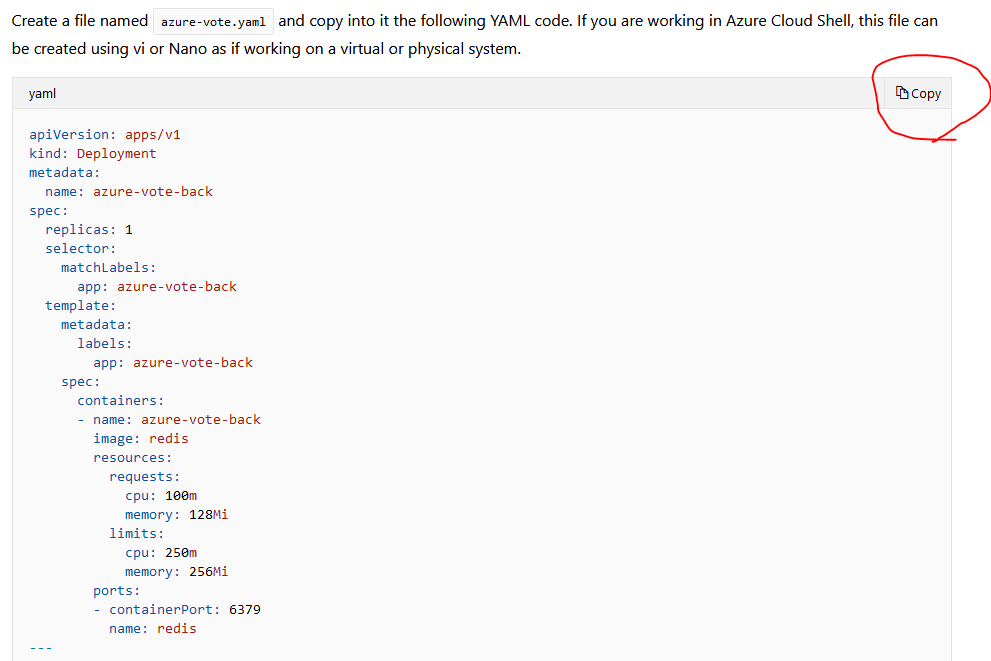
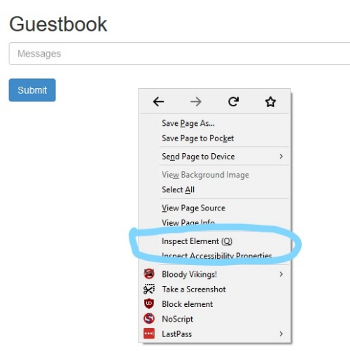
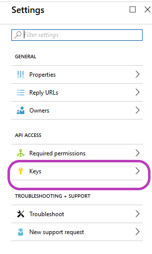
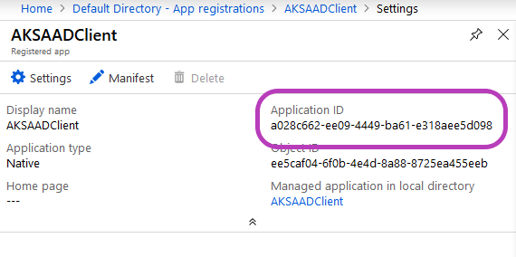
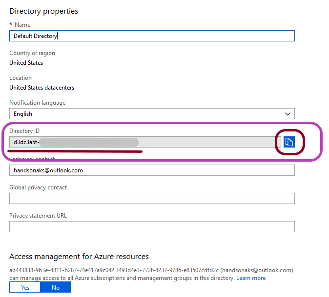
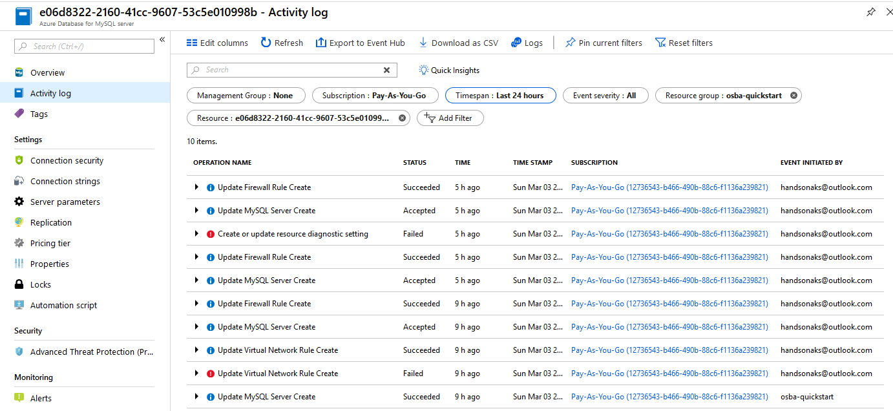
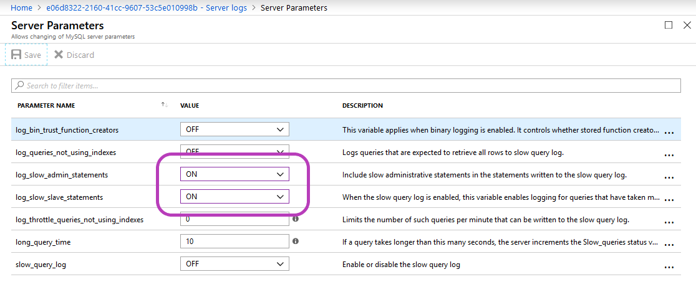
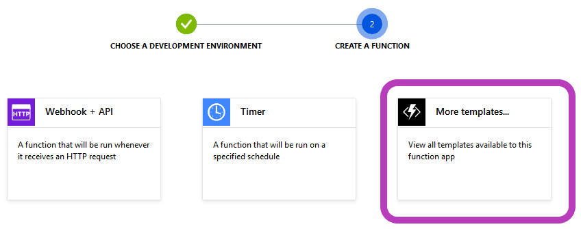
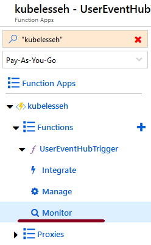

# Hands-On Kubernetes on Azure

Chapter 1. Introduction to Docker and Kubernetes
------------------------------------------------

The perfect storm – that is how the current state of the software development world can be described. The sources of this storm are as follows:

*   **Open source software** (**OSS**): This provides a foundational framework that makes almost any software possible.
*   **Technology and architecture advancements**: This enables the orchestration of loosely coupled systems that consist of micro applications leveraging microservices, micro frontends, and multiple databases.
*   **Public clouds**: For instance, Azure, AWS, and Google Cloud – these provide scalable infrastructure for a company of any size.
*   **Containerization and orchestration**: For instance, Docker and Kubernetes – making DevOps culture possible.

**Azure Kubernetes Service** (**AKS**) packages and manages the complexity of putting together all of the preceding sources for you. As an engineer, it is still very useful to know the underpinnings of AKS technologies. We will explore the foundations of the technologies (you might be surprised to see how really _old_ they are) that power AKS. You will learn about processes in Linux, and how Linux is related to Docker. Even though Kubernetes is technically a container runtime-agnostic platform (you will find out what this means shortly), Docker is the de facto container technology that is used practically everywhere. You will see how various processes fit nicely into Docker, and how Docker fits nicely into Kubernetes (just like the cute Russian dolls).

This chapter is the longest chapter that you will read in terms of theory in this book. You will get your hands dirty pretty quickly in the following chapters. Step by step, you will be building applications that can scale and are secure. This chapter gives you a brief introduction to the information that you will need if you want to dig deeper, or wish to troubleshoot when something goes wrong (remember, Murphy was an optimist!). Having cursory knowledge of this chapter will demystify much of the magic as you build your Azure AD-authenticated, Let's Encrypt-protected application that scales on demand based on the metrics that you are monitoring.

The following topics will be covered in this chapter:

*   The foundational technologies that enable AKS
*   The fundamentals of Docker
*   The fundamentals of Kubernetes

Technical requirements
----------------------

* * *

You will need a modern web browser, such as Chrome, Firefox, or Edge, for this chapter.

The foundational technologies that enable AKS
---------------------------------------------

* * *

The combination of OSS, public cloud, and containerization gives a developer a virtually unlimited number of compute power combined with the ability of rapidly composing applications that deliver more than the sum of the individual parts. The individual parts that make up an application generally do only one thing, and do it well (take, for instance, the Unix philosophy).

The developer is now able to architect applications that are deployed as microservices. When done right, microservices, such as SOA, enable quick feedback during development, testing, and deployment. Microservices are not a free lunch and has various problems, which are listed in the 2014 article—_Microservices - Not A Free Lunch!_ (you can read this article at [http://highscalability.com/blog/2014/4/8/microservices-not-a-free-lunch.html](http://highscalability.com/blog/2014/4/8/microservices-not-a-free-lunch.html)). With the technologies we listed earlier, developers have the power of having their cake and eating it too, as more and more of the _not free lunch_ part is available as managed services, such as AKS. The public cloud providers are competing by investing in managed services to become the go-to provider for developers.

### You build it, you run it

Even with more managed services coming to relieve the burden on the developer and operator, developers need to know the underlying workings of these services to make effective use of them in production. Just as developers write automated tests, future developers will be expected to know how their application can be delivered quickly and reliably to the customer.

Operators will take the hints from the developer specs and deliver them a stable system – whose metrics can be used for future software development, thus completing the virtuous cycle.

Developers owning the responsibility of running the software that they develop instead of throwing it over the wall for operations is a change in mindset that has origins in Amazon ([https://www.slideshare.net/ufried/the-truth-about-you-build-it-you-run-it](https://www.slideshare.net/ufried/the-truth-about-you-build-it-you-run-it)).

The advantages of the DevOps model not only change the responsibilities of the operations and development teams—it also changes the business side of organizations. The foundation of DevOps can enable businesses to accelerate the time to market significantly if combined with a lean and agile process and operations model.

### Everything is a file

Microservices, Docker, and Kubernetes can get quickly overwhelming for anyone. We can make it easier for ourselves by understanding the basics. It would be an understatement to say that understanding the fundamentals is critical to performing root cause analysis on production problems.

Any application is ultimately a process that is running on an **operating system** (**OS**). The process requires the following to be usable:

*   Compute (CPU)
*   Memory (RAM)
*   Storage (disk)
*   Network (NIC)

Launch the online Linux Terminal emulator at [https://bellard.org/jslinux/vm.html?url=https://bellard.org/jslinux/buildroot-x86.cfg](https://bellard.org/jslinux/vm.html?url=https://bellard.org/jslinux/buildroot-x86.cfg). Then, type the`ls` command, as follows:

This command lists the files in the current directory (which happens to be the root user's home directory).

Congratulations, you have launched your first container!

Well, obviously, this is not really the case. In principle, there is no difference between the command you ran versus launching a container.

So, what is the difference between the two? The clue lies in the word, `contain`. The `ls` process has very limited containment (it is limited only by the rights that the user has). `ls` can potentially see all files, has access to all the memory, network, and the CPU that's available to the OS.

A container is **contained** by the OS by controlling access to computing, memory, storage, and network. Each container runs in its own **namespace**([https://medium.com/@teddyking/linux-namespaces-850489d3ccf](https://medium.com/@teddyking/linux-namespaces-850489d3ccf)). The rights of the namespace processes are controlled by **control groups** (**cgroups**). 

Every container process has contained access via `cgroups` and namespaces, which makes it look (from the container process perspective) as if it is running as a complete instance of an OS. This means that it appears to have its own root filesystem, init process (PID 1), memory, compute, and network.

Since running containers is just a set of processes, it makes it extremely lightweight and fast, and all the tools that is used to debug and monitor processes can be used out of the box.

You can play with Docker by creating a free Docker Hub account at Docker Hub ([https://hub.docker.com/](https://hub.docker.com/)) and using that login at play with Docker ([https://labs.play-with-docker.com/](https://labs.play-with-docker.com/)).

First, type `docker run -it ubuntu`. After a short period of time, you will get a prompt such as `root@<randomhexnumber>:/#`. Next, type `exit`, and run the `docker run -it ubuntu` command again. You will notice that it is super fast! Even though you have launched a completely new instance of **Ubuntu** (on a host that is probably running **alpine** OS), it is available instantly. This magic is, of course, due to the fact that containers are nothing but regular processes on the OS. Finally, type `exit` to complete this exercise. The full interaction of the session on play with Docker ([https://labs.play-with-docker.com/](https://labs.play-with-docker.com/)) is shown in the following script for your reference. It demonstrates the commands and their output:

Copy

    docker run -it ubuntu # runs the standard ubuntu linux distribution as a container
    
    exit # the above command after pulling it from dockerhub will put you into the shell of the container. exit command gets you out of the container
    
    docker run -it ubuntu # running it again shows you how fast launching a container is. (Compare it to launching a full blown Virtual Machine (VM), booting a computer)
    
    exit # same as above, gets you out of the container

The following content displays the output that is produced after implementing the preceding commands:

Copy

    ###############################################################
     #                          WARNING!!!!                        #
     # This is a sandbox environment. Using personal credentials   #
     # is HIGHLY! discouraged. Any consequences of doing so are    #
     # completely the user's responsibilites.                      #
     #                                                             #
     # The PWD team.                                               #
     ###############################################################
     [node1] (local) root@192.168.0.18 ~
     $ docker ps
     CONTAINER ID        IMAGE               COMMAND             CREATED             STATUS              PORTS               NAMES
     [node1] (local) root@192.168.0.18 ~
     $ date
     Mon Oct 29 05:58:25 UTC 2018
     [node1] (local) root@192.168.0.18 ~
     $ docker run -it ubuntu
     Unable to find image 'ubuntu:latest' locally
     latest: Pulling from library/ubuntu
     473ede7ed136: Pull complete
     c46b5fa4d940: Pull complete
     93ae3df89c92: Pull complete
     6b1eed27cade: Pull complete
     Digest: sha256:29934af957c53004d7fb6340139880d23fb1952505a15d69a03af0d1418878cb
     Status: Downloaded newer image for ubuntu:latest
     root@03c373cb2eb8:/# exit
     exit
     [node1] (local) root@192.168.0.18 ~
     $ date
     Mon Oct 29 05:58:41 UTC 2018
     [node1] (local) root@192.168.0.18 ~
     $ docker run -it ubuntu
     root@4774cbe26ad7:/# exit
     exit
     [node1] (local) root@192.168.0.18 ~
     $ date
     Mon Oct 29 05:58:52 UTC 2018
     [node1] (local) root@192.168.0.18 ~

### Orchestration

An individual can rarely perform useful work alone; teams that communicate securely and well can generally accomplish more.

Just like people, containers need to talk to each other and they need help in organizing their work. This activity is called orchestration.

The current leading orchestration framework is Kubernetes ([https://kubernetes.io/](https://kubernetes.io/)). Kubernetes was inspired by the Borg project in Google, which, by itself, was running millions of containers in production. Incidentally, cgroups' initial contribution came from Google developers.

Kubernetes takes the declarative approach to orchestration; that is, you specify what you need and Kubernetes takes care of the rest.

Underlying all this magic, Kubernetes still launches the Docker containers, like you did previously. The extra work involves details such as networking, attaching persistent storage, handling the container, and host failures.

Remember, everything is a process!

Summary
-------

* * *

In this chapter, we introduced the concepts of Docker and Kubernetes. This provides the common context for the following chapters, where we will dive into how to deploy Dockerized applications in Microsoft AKS. You will see how the AKS PaaS offering from Microsoft streamlines deployment by taking on many of the management and operational tasks that you may have to do yourself if you manage and operate the Kubernetes infrastructure. 

In the next chapter, we will introduce the Azure Portal and its components in the context of managing AKS.

Chapter 2. Kubernetes on Azure (AKS)
------------------------------------

Installing and maintaining Kubernetes clusters correctly and securely is hard. Thankfully, all the major cloud providers such as **Google Cloud Platform** (**GCP**) (of course, considering Kubernetes was founded in Google), AWS, and Azure facilitate installing and maintaining clusters. You will learn how to navigate through Azure Portal and launch your own cluster and a sample application. And all of the above from your browser.

The following topics will be covered in this chapter:

*   Navigating Azure Portal
*   Launching your cluster
*   Starting your first application

Technical requirements
----------------------

* * *

You will need a modern web browser such as Firefox, Chrome, Safari, or Edge.

If you do not have an Azure account, you can create a free account here: [https://azure.microsoft.com/en-us/free/?WT.mc\_id=A261C142F](https://azure.microsoft.com/en-us/free/?WT.mc_id=A261C142F).

### Note

If you do not want to run the sample application in Docker locally, then skip to the _Enter_ing _the Azure portal_ section where we will show you how to do the same in Azure without installing anything locally.

In this section, we will show you how to run the Azure Voting application on your local machine. This requires the following:

*   Follow the instructions and install Git ([https://git-scm.com/downloads](https://git-scm.com/downloads)) on your local machine.
*   Install Docker ([https://www.docker.com/get-started](https://www.docker.com/get-started)); follow the instructions in the get-started document to install the Docker engine.
*   We will use the **Azure Voting** application ([https://github.com/Azure-Samples/azure-voting-app-redis](https://github.com/Azure-Samples/azure-voting-app-redis)) as provided by Microsoft on GitHub.

Now let's check out what version of Docker is running on your machine by using the following command. Open your favorite command-line prompt and check the versions of the Docker components that are installed. The response will be the versions you are running locally.

Copy

    $ docker --version
    Docker version 18.06.1-ce, build e68fc7a
    $docker-compose --version
    docker-compose version 1.22.0, build f46880f
    $docker-machine --version
    docker-machine version 0.15.0, build b48dc28d
    

It is time to get the application code from GitHub and run the Azure Voting application locally. You will see how easy it is to do that. In your command-line window, type the following commands:

Copy

    $ git clone https://github.com/Azure-Samples/azure-voting-app-redis.git

Change the directory to see the content of the cloned repository:

Copy

    $ cd azure-voting-app-redis

Now let's take a sneak peek at the `docker-compose.yaml` file. The Azure Voting application is composed of three containers:

1.   **Azure-vote-back**, the backend service of the application
2.  **Azure-vote-front**, the web application frontend
3.  **Redis DB**, the default Redis image

The YAML files describe the services, the container images, and ports that compose the application. You can also see that the application is using a default Redis Docker image. If you open the YAML file, it will look like this:

Copy

    version: '3'
    services:
     azure-vote-back:
     image: redis
     container_name: azure-vote-back
     ports:
     - "6379:6379"
    
     azure-vote-front:
     build: ./azure-vote
     image: azure-vote-front
     container_name: azure-vote-front
     environment:
     REDIS: azure-vote-back
     ports:
     - "8080:80"

Use the `docker-compose.yaml` file we just explored to build the container images, download the Redis image, and run the application:

Copy

    $ docker-compose up -d

Let's check the containers running on the local machine:

Copy

    $ docker ps
    CONTAINER ID        IMAGE               COMMAND                  CREATED             STATUS              PORTS                           NAMES
    9062b399fd6e        azure-vote-front    "/entrypoint.sh /sta…"   20 hours ago        Up 20 hours         443/tcp, 0.0.0.0:8080->80/tcp   azure-vote-front
    09befdf2128a        redis               "docker-entrypoint.s…"   20 hours ago        Up 20 hours         0.0.0.0:6379->6379/tcp          azure-vote-back

Last, but not least, let's start the Azure Voting app running on your local machine by going to your web browser and typing `http://localhost:8080`. The application will be loaded, and you can vote for cats or dogs. Happy voting!

Before moving on to the Azure portal, clean up the Docker images and resources with the following:

Copy

    $ docker-compose down
    Stopping azure-vote-front ... done
    Stopping azure-vote-back  ... done
    Removing azure-vote-front ... done
    Removing azure-vote-back  ... done
    Removing network azure-voting-app-redis_default

In the next sections, you will use Azure portal to deploy and run the same application on AKS in Microsoft Azure.

### Note

Provide the GitHub URL for the code in the chapter (setup instructions should be on the GitHub page). Create a GitHub folder named `chX`, where `X` is the chapter number, for example, `ch1`.

Entering the Azure portal
-------------------------

* * *

Till we get to an all command-line method of operation (aka the DevOps way), we will be utilizing Azure Portal for most of our use cases. Even when we are using command-line functions for most of our operations, Azure Portal is where you can quickly check the status of your infrastructure. Familiarity with Azure Portal is essential for running your AKS.

### Creating an Azure portal account

### Note

If you already have an account with Azure and/or are familiar with Azure Portal, you can skip this section.

Here we will show you how to get started with a free account.

### Note

In order to keep your trial account separate, you probably want to start the browser in Incognito or Private Browsing mode.

1.  Go to [https://azure.microsoft.com/en-us/free/](https://azure.microsoft.com/en-us/free/)

2.  Click the ****`Start free &gt;`**** button.

3.  Create a new account:

4.  Unless you want to use your existing email address, select ****`Get a new email address`****:

5.  Give an email address name that you will remember:

### Note

Do not forget this email address. You will have to use this email address to log on to Azure Portal throughout the book.

6.  Create your password:

### Note

As before, do not forget your password! We don't want to know it. We are definitely not responsible for it! (If you want fund our complete Lego Star Wars collectible sets, then do let us know.)

7.  Pass your **are you human** test:

8.  Select **`**Stay signed in?**`** to reduce some finger wear and tear (unless you are paranoid. If you are, then are you sure you want to use Microsoft services?):

9.  To get started on Azure, you will need a credit card or a phone to back you up. You will not be charged till you cross your $200 limit (at least, that's what Azure says. Use at your own risk):

10.  You still need your credit card to sign up:

### Note

The free account is valid _only_ for 30 days. Please finish the book by then and delete your account if you do not want to be charged after the trial. (Remember getting new emails is free.)

Congratulations! Finally, you should have access to the [https://portal.azure.com](https://portal.azure.com) portal. Take the 30-second **Start Tour**. In the book examples that follow, we are going to assume that you have created a new account.

Navigating the Azure portal
---------------------------

* * *

We are going to jump straight in by creating our **Azure Kubernetes Service** (**AKS**). By doing so, we are also going to familiarize ourselves with the Azure portal. Please note that we are going to ask you to blindly click here and there. We will explain the different concepts later in the appropriate context or as side notes. For now, trust us, we are engineers (at least we used to be).

### Creating your first AKS

On the top center where the search icon is, type this:

Copy

    aks

You will see ****`Kubernetes services`**** under ****`SERVICES`****. Click on it:

You have to add a new **Resource Group**_._ Type `handsonaks` and `myfirstakscluster` for the cluster name:

### Note

Use the previous names for **Resource Group** and **Cluster Name**. We will be using those repeatedly in the future. If you type anything else, you need to substitute the right group and name it appropriately.

The following settings were tested by us to work reliably with the free account.

Since it is just our sample application and to extend your free credits as much as possible, we will choose only one node with one vCPU. Click on **`Change size`**:

### Note

Your free account has a four-core limit that will be violated if we go with the defaults.

Select ****`DS1_v2`**** as follows:

Change the **vCPU** to `1`:

Like all good things in life, if they worked out of the box, we would be out of a job. There is one more thing we have to set, apart from the changes we needed to make it work under the free trial. Choose ****`West US 2`**** for ****`Region`**** before clicking on ****`Review + Create`**:**

Click on ****`Create`****:

You have worked really hard. You deserve a coffee break. Well, maybe not. In any case, as of now, it takes at least 10-20 minutes to create a cluster on AKS. So, you might as well.

If you have been really good this year, you should see this:

If you were not, we are not judging you; we can always blame Microsoft. For example, this is the error we got for the quota limitation as shown in the following screenshot. Double-check the settings (you thought you were smarter than us, didn't you? We know you ... we did the same when following the documentation) and try again:

### Using Azure Cloud Shell

Once you have a successful deployment, it is time to play. As promised, we will do it all from the Azure portal with no client installs.

The toughest part of this assignment is finding the small icon near the search bar:

Go ahead. Click on it.

First the portal will ask you to select either PowerShell or Bash as your default shell experience.

Next, the portal will ask you to create a storage account; just confirm and create it.

You might still get this:

Click on the power button; it should restart, and you should see something similar to this:

You can pull the splitter/divider up to see more of the shell:

On the shell, we need to first install `kubectl`. This is the command-line tool used for many operations when operating and maintaining Kubernetes clusters. Furthermore, `kubectl` is already installed for you on Azure Cloud Shell.

You need the credentials to access your cluster. For example, on the shell, type the following command:

Copy

    az aks get-credentials --resource-group handsonaks --name myfirstakscluster

The preceding command will set the correct values in `~/.kube/config` so that `kubectl` can access it.

To verify that you have access, type the following:

Copy

    kubectl get all

You should see something like this:

### Note

There is no need to worry whether all of these are exactly matching or what each item is. For now, our goal is to to be comfortable with `kubectl` and to ensure that the connection works.

### Note

If you are seeing **connection refused** or other access-related errors, double-check the entries in the following command:`az aks get-credentials --resource-group **handsonaks** --name **myfirstakscluster**`

You are all connected now. We are going to launch our first application now. 

### Note

We are going to use the `vi` command-line editor. It is generally confusing to use at first, but you can use the online code editor shown in the next section.

For the online code editor, type the following:

Copy

    PS Azure:\> code .

For `vi` , type this:

Copy

    vi azure-vote.yaml

If you are in `vi` , type `i` to get into the insert mode.

On a different browser, open [https://docs.microsoft.com/en-us/azure/aks/kubernetes-walkthrough](https://docs.microsoft.com/en-us/azure/aks/kubernetes-walkthrough). We will use the code directly there for now.

Go to the section that has the code for `azure-vote.yaml` and click on the **`**Copy**`** button:

We have included the code from the Azure website for your convenience:

Copy

    apiVersion: apps/v1
    kind: Deployment
    metadata:
      name: azure-vote-back
    spec:
      replicas: 1
      selector:
        matchLabels:
          app: azure-vote-back
      template:
        metadata:
          labels:
            app: azure-vote-back
        spec:
          containers:
          - name: azure-vote-back
            image: redis
            resources:
              requests:
                cpu: 100m
                memory: 128Mi
              limits:
                cpu: 250m
                memory: 256Mi
            ports:
            - containerPort: 6379
              name: redis
    ---
    apiVersion: v1
    kind: Service
    metadata:
      name: azure-vote-back
    spec:
      ports:
      - port: 6379
      selector:
        app: azure-vote-back
    ---
    apiVersion: apps/v1
    kind: Deployment
    metadata:
      name: azure-vote-front
    spec:
      replicas: 1
      selector:
        matchLabels:
          app: azure-vote-front
      template:
        metadata:
          labels:
            app: azure-vote-front
        spec:
          containers:
          - name: azure-vote-front
            image: microsoft/azure-vote-front:v1
            resources:
              requests:
                cpu: 100m
                memory: 128Mi
              limits:
                cpu: 250m
                memory: 256Mi
            ports:
            - containerPort: 80
            env:
            - name: REDIS
              value: "azure-vote-back"
    ---
    apiVersion: v1
    kind: Service
    metadata:
      name: azure-vote-front
    spec:
      type: LoadBalancer
      ports:
      - port: 80
      selector:
        app: azure-vote-front

Back on the Azure online code editor, paste the content of the file.

Then, click on the ****`...`**** in the right-hand corner to save the file as `azure-vote.yaml`:

The file should be saved. You can check by typing the following:

Copy

    cat azure-vote.yaml

### Note

Hitting the _Tab_ button expands the file name in Linux. In the preceding scenario, if you hit _Tab_ after typing `az` it should expand to `azure-vote.yaml`.

Now, let's launch the application:

Copy

    kubectl create -f azure-vote.yaml

Now we wait.

You can check the progress by typing the following:

Copy

    kubectl get pods

### Note

Typing `kubectl` can become tedious. We generally use the `alias` command to make our life easier. We use `alias kc=kubectl`. After running the preceding command, we can just use **`kc get pods`.**

Hit the _Up_ arrow and press _return_ till you get the status as all pods running. It does take some time to set up everything, which you can check by typing the following:

Copy

    kubectl get all --all-namespaces

The following screenshot illustrates the output of the preceding command:

It is most likely that it will be stuck on the previous step. If you are impatient, you can also type to see whether the frontend image has been pulled:

Copy

    kubectl get events | grep -i pulled

The following screenshot illustrates the output of the preceding command:

Once you see **Pulled** for the frontend, type the following to ensure that everything is running:

In order to access it publicly, we need to wait for one more thing. We could type commands repeatedly _or_ let Kubernetes know once a service is up and running. Now we want to know the public IP of the load balancer so that we can access it.

Type the following command:

Copy

    kubectl get service azure-vote-front --watch

Wait for the public IP to appear and then press _Ctrl_ + _C_ to exit the watch:

Note the external IP address, and type it on a browser. You should see this:

Click on ****`Cats`**** or ****`Dogs`**** (I would go with ****`Dogs`****) and watch the count go up.

You have now launched your own cluster and your first Kubernetes application. Note the effort of connecting the frontend and the backend and exposing it to the outside world along with providing storage for the services was all taken care of by Kubernetes.

Summary
-------

* * *

By the end of this chapter, we are now able to access and navigate the Azure portal to perform all the functions required to launch AKS and also to use the free trial on Azure to your advantage while learning the ins and outs of AKS and other Azure services. We launched our own AKS cluster with the ability to customize configurations if required using Azure Portal. We also learned to use Azure Cloud Shell without installing anything on your computer. This is important for all the upcoming sections, where you will be doing a lot more than launching simple applications. Finally, we launched a publicly accessible service that works! The skeleton of this application is the same for the complex applications that you will be launching in the next sections.

Chapter 3. Application Deployment on AKS
----------------------------------------

In this chapter, we will look at the details of deploying an application on the **Azure Kubernetes**** Service** (**AKS**). An application consists of multiple parts, and we will build an application one step at a time, while explaining the conceptual model behind it. You will be able to easily adapt the steps in this chapter to deploy any other application on AKS. The sample guestbook application will be deployed on AKS. The reader will understand the usefulness of various Kubernetes concepts, such as Pods, **Replication Controllers** (**RCs**), services, ConfigMaps, Namespaces, and Deployments. We will introduce deployment helpers, such as Helm, to streamline the deployment process.

The following topics will be covered in this chapter:

*   Deploying the sample guestbook application
*   Full deployment of the sample guestbook application
*   The helm way of installing complex applications

Technical requirements
----------------------

* * *

You'll need a modern browser, such as Chrome, Firefox, Safari, or Edge.

Deploying the sample guestbook application
------------------------------------------

* * *

In this chapter, we will deploy the classic guestbook sample Kubernetes application. We will be mostly following the steps from [https://Kubernetes.io/docs/tutorials/stateless-application/guestbook/](https://kubernetes.io/docs/tutorials/stateless-application/guestbook/) with some modifications. We employ these modifications to do the following:

*   Make the solution more AKS friendly
*   Show additional concepts, such as ConfigMaps, that are not present in the original sample

As mentioned in the Kubernetes documentation, you will be deploying a simple, multi-tier web application. You know it is a good sign for a platform when the documentation says it is a simple application that has master/slave backends and a scalable fronted. The guest book solution is also categorized as a stateless application because the frontend doesn't store any state. It is stateful for the single instance of Redis master, which stores all the guestbook entries.

You will be using this application as the basis for testing out the scaling of the backend and the frontend independently in the next chapter.

### Introducing the application

The application stores and displays guestbook entries. You can use it to record the opinions of all the people who visit your model railroad display, for example. Along the way, we will explain Kubernetes concepts such as Deployments and replication controllers.

The application uses PHP with Redis backends for this purpose.

### Deploying the first master

You are going to deploy the Redis master, which you will delete in the next step. This is done for no other reason than for you to learn about ConfigMaps.

Let's do this.

1.  Open your friendly cloud shell, as highlighted in the following screenshot:

2.  Type the following:

Copy

    kubectl apply -f https://k8s.io/examples/application/guestbook/redis-master-deployment.yaml

It will take some time for it to download and start running. While you wait, let me explain the command you just typed and executed. Let's start by exploring the content of the `yaml` file you used:

Copy

      1 apiVersion: apps/v1 # for versions before 1.9.0 use apps/v1beta2
      2 kind: Deployment
      3 metadata:
      4   name: redis-master
      5   labels:
      6     app: redis
      7 spec:
      8   selector:
      9     matchLabels:
     10       app: redis
     11       role: master
     12       tier: backend
     13   replicas: 1
     14   template:
     15     metadata:
     16       labels:
     17         app: redis
     18         role: master
     19         tier: backend
     20     spec:
     21       containers:
     22       - name: master
     23         image: k8s.gcr.io/redis:e2e # or just image: redis
     24         resources:
     25           requests:
     26             cpu: 100m
     27             memory: 100Mi
     28         ports:
     29         - containerPort: 6379

We will go inside the code to get straight to the meat of it:

*   **Line 23**: Says what Docker image we are going to run. In this case, it is the `redis` image tagged with `e2e` (presumably the latest image of `redis` that successfully passed its end-to-end `[e2e]` tests).
*   **Lines 28-29**: Say this container is going to listen on port `6379`.
*   **Line 22**: Gives this container a name, which is master.

*   **Lines 24-27**: Sets the `cpu/memory` resources requested for the container. In this case, the request is 0.1 CPU, which is equal to `100m` and is also often referred to as 100 millicores. The memory requested is `100Mi`, or `104857600` bytes, which is equal to `~105M` ([https://Kubernetes .io/docs/concepts/configuration/manage-compute-resources-container/](https://kubernetes.io/docs/concepts/configuration/manage-compute-resources-container/) ). You can also set `cpu` and `memory` limits the same way.

This is very similar to the arguments you will give to Docker to run a particular container image. If you had to run this manually, you would start and end getting something like the following:

Copy

    docker run -d k8s.gcr.io/redis:e2e # run the redis docker image with tag e2e in detached mode
    
    docker run --name named_master -d k8s.gcr.io/redis:e2e # run the image with the name test_master
    
    docker run --name net_master -p 6379:6379 -d k8s.gcr.io/redis:e2e # expose the port 6379
    
    docker run --name master -p 6379:6379 -m 100M -c 100m -d k8s.gcr.io/redis:e2e # set the cpu and memory limits

The container spec (lines 21-29) tells Kubernetes to run the specified container with the supplied arguments. So far, Kubernetes has not provided us anything more than what we could have typed in as a Docker command. Let's continue with the explanation of the code:

*   **Line 13**: It tells Kubernetes that we need exactly only one copy of the Redis master running. This is a key aspect of the declarative nature of Kubernetes. You provide a description of the containers your applications need to run (in this case, only one replica of the Redis master) and Kubernetes takes care of it.
*   **Lines 14-19**: Adds labels to the running instance so that it can be grouped and connected to other containers. We will discuss them later to see how they are used.
*   **Line 2**: Tells we would like a **Deployment** to be performed. When Kubernetes started, Replication Controllers were used (and are still used widely) to launch containers. You can still do most of the work you need using just Replication Controllers. **Deployment** adds convenience to managing RC. Deployments provide mechanisms to perform rollout changes and rollback if required. You can specify the strategy you would like to use when pushing an update (Rolling Update or Recreate).

*   **Line 4-6**: Gives the Deployment a name, which is `redis-master`.
*   **Line 7-12**: Let's us specify the containers that this Deployment will manage. In our example, it says that this Deployment will select and manage all containers for which labels match (`app == redis`, `role == master`, `tier == backend`). The preceding exactly matches the labels in lines 14-19.

#### Examining the deployment

The `redis-master` deployment should be complete by now. On Azure Cloud Shell, type the following:

Copy

    kubectl get all

You should get an output that looks something like this:

Copy

     NAME READY STATUS RESTARTS AGE
    pod/redis-master-6b464554c8-554p8 1/1 Running 0 3h
    
     NAME TYPE CLUSTER-IP EXTERNAL-IP PORT(S) AGE
     service/Kubernetes  ClusterIP 10.0.0.1  443/TCP 4h
    
     NAME DESIRED CURRENT UP-TO-DATE AVAILABLE AGE
    deployment.apps/redis-master 1 1 1 1 3h
    
     NAME DESIRED CURRENT READY AGE
    replicaset.apps/redis-master-6b464554c8 1 1 1 3h

You can see that we have a deployment named `redis-master`. It controls a replica set of `redis-master-<random id>`. Digging deeper, you will also find that the Replica Set is controlling **Pod** (a group of Docker containers that should be run together): `redis-master-<replica set random id&gt;->random id&gt;`.

More details can be obtained by typing `kubectl describe <instance -name>`, as follows:

Copy

    kubectl describe deployment/redis-master

This will give us the following output:

Copy

    Name: redis-master
     Namespace: default
     CreationTimestamp: Wed, 26 Dec 2018 01:47:56 +0000
     Labels: app=redis
     Annotations: deployment.Kubernetes .io/revision=1
     kubectl.Kubernetes .io/last-applied-configuration={"apiVersion":"apps/v1","kind":"Deployment","metadata":{"annotations":{},"labels":{"app":"redis"},"name":"redis-master","namespace":"default"},"spec":{...
     Selector: app=redis,role=master,tier=backend
     Replicas: 1 desired | 1 updated | 1 total | 1 available | 0 unavailable
     StrategyType: RollingUpdate
     MinReadySeconds: 0
     RollingUpdateStrategy: 25% max unavailable, 25% max surge
     Pod Template:
     Labels: app=redis
     role=master
     tier=backend
     Containers:
     master:
     Image: k8s.gcr.io/redis:e2e
     Port: 6379/TCP
     Host Port: 0/TCP
     Requests:
     cpu: 100m
     memory: 100Mi
     Environment: 
     Mounts: 
     Volumes: 
     Conditions:
     Type Status Reason
     ---- ------ ------
     Available True MinimumReplicasAvailable
     Progressing True NewReplicaSetAvailable
     OldReplicaSets: 
     NewReplicaSet: redis-master-6b464554c8 (1/1 replicas created)
     Events: 

In true internet fashion, launching an application without any environment-specific configuration has already become obsolete. We will introduce a new concept called **ConfigMaps** and then resume the regularly-scheduled program. First, we need to clean up, and we can do so by running the following command:

Copy

    kubectl delete deployment/redis-master

You will see the following output:

Copy

    deployment.extensions "redis-master" deleted

### Redis master

There was nothing wrong with the previous deployment. In practical use cases, it would be rare that you would launch an application without some configuration settings. In this case, we are going to set the following configuration settings for `redis-master` (from the example in [https://Kubernetes.io/docs/tutorials/configuration/configure-redis-using-configmap/](https://kubernetes.io/docs/tutorials/configuration/configure-redis-using-configmap/) ).

Copy and paste the following two lines into the Azure Cloud Shell editor and save it as `redis-config`:

Copy

    maxmemory 2mb
    maxmemory-policy allkeys-lru

### Note

The online editor is limited and surprisingly doesn't have support for creating a new file, not to worry. In this case, type **`touch redis-config`**. Then `code redis-config` works. Or you can open the empty file using the open file command on the online code editor.

Now we can create the ConfigMap using the following code:

Copy

    kubectl create configmap example-redis-config --from-file=redis-config

You should get this as the output:

Copy

    configmap/example-redis-config created

We will use the same trick to get the scoop on this ConfigMap:

Copy

    kubectl describe configmap/example-redis-config

The output should look like this:

Copy

    Name:         example-redis-config
    Namespace:    default
    Labels:       
    Annotations:  
    
    Data
    ====
    redis-config:
    ----
    maxmemory 2mb
    maxmemory-policy allkeys-lru
    Events:  

Creating from the command line is not very portable. It would be better if we could describe the preceding code in a `yaml` file. If only there was a command that would get the same information in `yaml` format. Not to worry, `kubectl` has the `get` command:

Copy

    kubectl get -o yaml configmap/example-redis-config

The preceding command gets close to what we want as shown:

Copy

    apiVersion: v1
    data:
      redis-config: |-
        maxmemory 2mb
        maxmemory-policy allkeys-lru
    kind: ConfigMap
    metadata:
      creationTimestamp: 2018-12-26T06:35:57Z
      name: example-redis-config
      namespace: default
      resourceVersion: "23430"
      selfLink: /api/v1/namespaces/default/configmaps/example-redis-config
      uid: 80624489-08d8-11e9-9914-82000ff4ac53

Let's create our `yaml` version of this. But first, let's `delete` the already-created ConfigMap:

Copy

    kubectl delete configmap/example-redis-config

Copy and paste the following lines into a file named `example-redis-config.yaml`, and then save the file:

Copy

    apiVersion: v1
    data:
      redis-config: |-
        maxmemory 2mb
        maxmemory-policy allkeys-lru
    kind: ConfigMap
    metadata:
      name: example-redis-config
      namespace: default
    
    

### Note

Use the touch trick to open the file on the online code editor.**`kubectl get -o yaml` **is a useful trick to get a deployable `yaml` file from a running system. It takes care of tricky `yaml` indentation and saves you from spending hours trying to get the format right.

ConfigMap is a portable way of configuring containers without having specialized images for each configuration. ConfigMap has a key-value pair for data that needs to be set on a container. In this case, `redis-config` is the key and `maxmemory 2mbmaxmemory-policy allkeys-lru` is the value.

Run the following command:

Copy

    kubectl create -f example-redis-config

The output should be as follows:

Copy

    configmap/example-redis-config created

Next, run the following command:

Copy

    kubectl describe configmap/example-redis-config

The preceding command returns the same output as the previous one:

Copy

    Name:         example-redis-config
    Namespace:    default
    Labels:       
    Annotations:  
    
    Data
    ====
    redis-config:
    ----
    maxmemory 2mb
    maxmemory-policy allkeys-lru
    Events:  

Now that we have ConfigMap defined, let's use it. Modify `redis-master-deployment.yaml` to use ConfigMap, as follows:

Copy

    apiVersion: apps/v1 # for versions before 1.9.0 use apps/v1beta2
    kind: Deployment
    metadata:
      name: redis-master
      labels:
        app: redis
    spec:
      selector:
        matchLabels:
          app: redis
          role: master
          tier: backend
      replicas: 1
      template:
        metadata:
          labels:
            app: redis
            role: master
            tier: backend
        spec:
          containers:
          - name: master
    image: Kubernetes /redis:v1
    env:
            - name: MASTER
              value: "true"
            volumeMounts:
            - mountPath: /redis-master
              name: config
            resources:
              requests:
                cpu: 100m
                memory: 100Mi
            ports:
            - containerPort: 6379
          volumes:
            - name: config
              configMap:
                name: example-redis-config
                items:
                - key: redis-config
                  path: redis.conf

We are using a different image `Kubernetes/redis:v1` that reads `redis-config` from `/redis-master/redis.conf` (instead of the usual `/etc/redis/redis.conf` in the other image). As usual, we are going to explain the new sections with line numbers:

Copy

      1 apiVersion: apps/v1 # for versions before 1.9.0 use apps/v1beta2
      2 kind: Deployment
      3 metadata:
      4   name: redis-master
      5   labels:
      6     app: redis
      7 spec:
      8   selector:
      9     matchLabels:
     10       app: redis
     11       role: master
     12       tier: backend
     13   replicas: 1
     14   template:
     15     metadata:
     16       labels:
     17         app: redis
     18         role: master
     19         tier: backend
     20     spec:
     21       containers:
     22       - name: master
     23         image: Kubernetes /redis:v1
     24         env:
     25         - name: MASTER
     26           value: "true"
     27         volumeMounts:
     28         - mountPath: /redis-master
     29           name: config
     30         resources:
     31           requests:
     32             cpu: 100m
     33             memory: 100Mi
     34         ports:
     35         - containerPort: 6379
     36       volumes:
     37         - name: config
     38           configMap:
     39             name: example-redis-config
     40             items:
     41             - key: redis-config
     42               path: redis.conf

The following lines will give a detailed explanation of the preceding code:

*   **Lines 24-26**: Show another way of configuring your running container. This method uses environment variables. In Docker form, this would be equivalent to `docker run -e "MASTER=TRUE"`. `--name master -p 6379:6379 -m 100M -c 100m -d Kubernetes /redis:v1 #` set the environment variable `MASTER=TRUE`. Your application can  read the environment variable settings for its configuration. Check out [https://12factor.net/config](https://12factor.net/config)to see why this is a very powerful idea.
*   **Lines 27-28**: Mounts the named volume (config that is defined in lines 36-42) at the `/redis-master` path on the running container. Since this is bind mount, it will hide whatever is exists on `/redis-master` on the original container.

In Docker terms, it would be equivalent to`docker run **-**v config:/redis-master`. `-e "MASTER=TRUE" --name master -p 6379:6379 -m 100M -c 100m -d Kubernetes /redis:v1 #` mount the `config` folder at `redis-master` on the container.

*   **Line 36-42**: Here is where Kubernetes takes the config as `ENV vars` to the next level.
*   **Line 37**: Gives the volume the **`config`.**
*   **Line 38-39**: Declares this volume should be loaded from the ConfigMap `example-redis-config` (which has to be already defined \[unless declared optional\]). We have defined this already, so we are good.
*   **Line 40-42**: Here is where the Kubernetes magic comes in. Configure a Pod with ConfigMap ([https://kubernetes.io/docs/tasks/configure-pod-container/configure-pod-configmap/#use-configmap-defined-environment-variables-in-pod-commands](https://kubernetes.io/docs/tasks/configure-pod-container/configure-pod-configmap/#use-configmap-defined-environment-variables-in-pod-commands)). This shows different ways you can load the config on to a pod. Here we are loading the value of the `redis-config` key (the two-line maxmemory settings) as a file called `redis.conf`.

We can check whether the settings were applied by running the following commands:

Copy

    kc exec -it redis-master- redis-cli
     127.0.0.1:6379> CONFIG GET maxmemory
     1) "maxmemory"
     2) "2097152"
     127.0.0.1:6379> CONFIG GET maxmemory-policy
     1) "maxmemory-policy"
     2) "allkeys-lru"
     127.0.0.1:6379>exit

### Note

You can see how this works by running the following:`kc exec -it redis-master-<pod-id> bash``root@redis-master-585bd9d8fb-p9qml:/data# ps``bash: ps: command not found``root@redis-master-585bd9d8fb-p9qml:/data# cat /proc/1/cmdline``s``h-c/run.sh``root@redis-master-585bd9d8fb-p9qml:/data# cat /run.sh |grep redis.conf``redis-server /redis-master/redis.conf``perl -pi -e "s/%master-ip%/${master}/" /redis-slave/redis.conf``perl -pi -e "s/%master-port%/6379/" /redis-slave/redis.conf``redis-server /redis-slave/redis.conf``root@redis-master-585bd9d8fb-p9qml:/data# cat /run.sh |grep MASTER``if [[ "${MASTER}" == "true" ]]; then``root@redis-master-585bd9d8fb-p9qml:/data# cat /redis-master/redis.conf``maxmemory 2mb``maxmemory-policy allkeys-lru`Somehow, in this image, `ps` is not installed. Not to worry, we can get the info by examining the contents of the `cmdline` file under `pid 1`. Now we know that `run.sh` is the file that is run, so somewhere in that `redis.conf` file from ConfigMap mounted at `/redis-master` would be used. So we grep `redis.conf`. For sure, we can see `redis-server` when it is started, when MASTER=TRUE uses the config from `/redis-master/redis.conf`. To make sure that Kubernetes did its magic, we examine the contents of `redis.conf` by running`cat /redis-master/redis.conf`and, lo and behold, it is exactly the values we specified in the ConfigMap`example-redis-conf`.

To repeat, you have just performed the most important and tricky part of configuring cloud-native applications. You have also noticed that the apps have to be modified to be cloud-friendly to read config dynamically (the old image didn't support dynamic configuration easily).

Fully deploying of the sample guestbook application
---------------------------------------------------

* * *

After taking a detour to get our feet wet on dynamically configuring applications using ConfigMap, we will return to our regularly-scheduled program by deploying the rest of the guestbook application. You will see the concepts of Deployment, Replica Sets, and Pods repeated again for the backends and frontends. We will introduce another key concept called **Service**. You might have also noticed the power of protocols and Docker images. Even though we switched to a different image for `redis-master`, we have an expectation that the rest of the implementation should go through without any hitches.

### Exposing the Redis master service

With plain Docker, the exposed port is constrained to the host it is running. There is no support for making the service available if the host goes down. Kubernetes provides **Service**, which handles exactly that problem. Using label-matching selectors, it proxies traffic to the right pods, including load balancing. In this case, the master has only one pod, so it just ensures that, independent of which node the pod runs, the traffic is directed to that pod. To create the service, run the following command:

Copy

    kubectl apply -f https://k8s.io/examples/application/guestbook/redis-master-service.yaml

The Redis master service has the following content:

Copy

      1 apiVersion: v1
      2 kind: Service
      3 metadata:
      4   name: redis-master
      5   labels:
      6     app: redis
      7     role: master
      8     tier: backend
      9 spec:
     10   ports:
     11   - port: 6379
     12     targetPort: 6379
     13   selector:
     14     app: redis
     15     role: master
     16     tier: backend
    ~                                                                        

Let's now see what we have done in the preceding code:

*   **Lines 1-8**: Tell Kubernetes we want a proxy service that has the same labels as our redis-master server.
*   **Lines 10-12**: Say that this Service should handle traffic arriving at 6379 and forwarded to 6,379 ports of the pods that are matched by the selector defined in line 13-16
*   **Line 13-16**: Used to find the pods to which the incoming traffic needs to be proxied. So, any pod with labels matching (`app:redis`, `AND role:master AND tier:backend`) is expected to handle port 6379 traffic.

We can check the properties of the service by running the following:

Copy

     kubectl get service
     NAME TYPE CLUSTER-IP EXTERNAL-IP PORT(S) AGE
     Kubernetes  ClusterIP 10.0.0.1  443/TCP 1d
    redis-master ClusterIP 10.0.22.146  6379/TCP 7m

You see that a new service, named `redis-master`,has been created. It has a cluster wide IP of `10.0.22.146` (in this case, YMMV). Note that this IP will work only within the cluster (hence the ClusterIP type). For fun, you can test this out by running the following commands:

Copy

    ab443838-9b3e-4811-b287-74e417a9@Azure:/usr/bin$ ssh -p 6379 10.0.22.146 # just hangs
    ^C
    ab443838-9b3e-4811-b287-74e417a9@Azure:/usr/bin$ ssh -p 80 www.google.com # very quick rejection
    ssh_exchange_identification: Connection closed by remote host

To verify it does work inside the cluster, we do our exec trick again:

Copy

    ab443838-9b3e-4811-b287-74e417a9@Azure:/usr/bin$ ssh -p 6379 10.0.22.146 # just hangs
    ^C
    ab443838-9b3e-4811-b287-74e417a9@Azure:/usr/bin$ ssh -p 80 www.google.com # very quick rejection
    ssh_exchange_identification: Connection closed by remote host

Verify that the connection actually works inside the cluster:

Copy

    ab443838-9b3e-4811-b287-74e417a9@Azure:~$ kubectl exec -it redis-master- bash
    root@redis-master-585bd9d8fb-p9qml:/data# apt-get install telnet
    Reading package lists... Done
    ...
    update-alternatives: using /usr/bin/telnet.netkit to provide /usr/bin/telnet (telnet) in auto mode
    root@redis-master-585bd9d8fb-p9qml:/data# telnet 10.0.22.146 6379 # remember that Ctrl+] is needed to "escape" from the session
    Trying 10.0.22.146...
    Connected to 10.0.22.146.
    Escape character is '^]'.
    ^]
    telnet> quit
    Connection closed.

You can try other ports and it won't work.

### Deploying the Redis slaves

Running a single backend on the cloud is not cool. So, we run multiple slaves to handle the massive read traffic of all those who would really like to know what people think of your model railroad display. We do this by running the following command:

Copy

    kubectl apply -f https://k8s.io/examples/application/guestbook/redis-slave-deployment.yaml

The output would be something like this:

Copy

    ab443838-9b3e-4811-b287-74e417a9@Azure:~$ kubectl apply -f https://k8s.io/examples/application/guestbook/redis-slave-deployment.yaml
    deployment.apps/redis-slave created
     ab443838-9b3e-4811-b287-74e417a9@Azure:~$ kubectl get all
     NAME READY STATUS RESTARTS AGE
     pod/redis-master-585bd9d8fb-p9qml 1/1 Running 0 21h
     pod/redis-slave-b58dc4644-2hpr7 0/1 ContainerCreating 0 3s
     pod/redis-slave-b58dc4644-bz9dj 0/1 ContainerCreating 0 3s
    
     NAME TYPE CLUSTER-IP EXTERNAL-IP PORT(S) AGE
     service/Kubernetes  ClusterIP 10.0.0.1  443/TCP 1d
     service/redis-master ClusterIP 10.0.22.146  6379/TCP 1h
    
     NAME DESIRED CURRENT UP-TO-DATE AVAILABLE AGE
     deployment.apps/redis-master 1 1 1 1 21h
    deployment.apps/redis-slave 2 2 2 0 3s
    
     NAME DESIRED CURRENT READY AGE
     replicaset.apps/redis-master-585bd9d8fb 1 1 1 21h
     replicaset.apps/redis-slave-b58dc4644 2 2 0 3s
     ab443838-9b3e-4811-b287-74e417a9@Azure:~$

Based on the preceding output, you can guess that this time we asked `2` replicas of the `redis` slave pods. That is confirmed true when you examine the `redis-slave-deployment.yaml` file:

Copy

      1 apiVersion: apps/v1 # for versions before 1.9.0 use apps/v1beta2
      2 kind: Deployment
      3 metadata:
      4   name: redis-slave
      5   labels:
      6     app: redis
      7 spec:
      8   selector:
      9     matchLabels:
     10       app: redis
     11       role: slave
     12       tier: backend
     13   replicas: 2
     14   template:
     15     metadata:
     16       labels:
     17         app: redis
     18         role: slave
     19         tier: backend
     20     spec:
     21       containers:
     22       - name: slave
     23         image: gcr.io/google_samples/gb-redisslave:v1
     24         resources:
     25           requests:
     26             cpu: 100m
     27             memory: 100Mi
     28         env:
     29         - name: GET_HOSTS_FROM
     30           value: dns
     31           # Using `GET_HOSTS_FROM=dns` requires your cluster to
     32           # provide a dns service. As of Kubernetes 1.3, DNS is a built-in
     33           # service launched automatically. However, if the cluster you are using
     34           # does not have a built-in DNS service, you can instead
     35           # access an environment variable to find the master
     36           # service's host. To do so, comment out the 'value: dns' line above, and
     37           # uncomment the line below:
     38           # value: env
     39         ports:
     40         - containerPort: 6379

Everything is more or less the same other than the following:

*   The role is declared to be a slave.
*   Replicas is equal to `2`.
*   We are using the `gb-redisslave` image.
*   Setting the `GET_HOSTS_FROM=dns;`, we can presume that the slave is going to get the master IP using DNS. Let's check whether our assumption is correct by running the following code:

Copy

    ab443838-9b3e-4811-b287-74e417a9@Azure:~$ kubectl exec -it redis-slave- bash
     root@redis-slave-b58dc4644-2hpr7:/data# cat /proc/1/cmdline
    /bin/sh-c/run.shroot@redis-slave-b58dc4644-2hpr7:/data# cat /run.sh
     #!/bin/bash
     #...
     if [[ ${GET_HOSTS_FROM:-dns} == "env" ]]; then
     redis-server --slaveof ${REDIS_MASTER_SERVICE_HOST} 6379
     else
     redis-server --slaveof redis-master 6379
     fi
     root@redis-slave-b58dc4644-2hpr7:/data# root@redis-slave-b58dc4644-2hpr7:/data# ping redis-master
     PING redis-master.default.svc.cluster.local (10.0.22.146): 48 data bytes

As expected, `run.sh` in the image checks whether the `GET_HOSTS_FROM` variable is set to `env`. In this case, it is set to `dns`, so it returns false. `redis-server` is launched in slave mode pointing to the `redis-master` host as the master. If you ping `redis-master`, you can see it is set to the ClusterIP of the `redis-master` service.

Similar to the master service, we need to expose the slave service by running the following:

Copy

    kubectl apply -f https://k8s.io/examples/application/guestbook/redis-slave-service.yaml

Copy

    apiVersion: v1
    kind: Service
    metadata:
      name: redis-slave
      labels:
        app: redis
        role: slave
        tier: backend
    spec:
      ports:
      - port: 6379
      selector:
        app: redis
        role: slave
        tier: backend

The only difference between this Service and the `redis-master` Service is that this service proxies traffic to pods that have the `role:slave` label in them.

Create the redis slave service by running the following command:

Copy

    ab443838-9b3e-4811-b287-74e417a9@Azure:~$ kubectl apply -f https://k8s.io/examples/application/guestbook/redis-slave-service.yaml
    service/redis-slave created
     ab443838-9b3e-4811-b287-74e417a9@Azure:~$ kubectl get service
     NAME TYPE CLUSTER-IP EXTERNAL-IP PORT(S) AGE
     Kubernetes  ClusterIP 10.0.0.1  443/TCP 1d
     redis-master ClusterIP 10.0.22.146 ; 6379/TCP 2h
    redis-slave ClusterIP 10.0.14.218  6379/TCP 3s
     ab443838-9b3e-4811-b287-74e417a9@Azure:~$

To check whether the slave service responds at the mentioned ClusterIP and port `6379`, run the following commands:

Copy

    kubectl run checkredisslave -it --image ubuntu
    # on the terminal or run 
    kubectl attach  # to get to the terminal
    # apt update
    apt install -y netcat # re-run apt update in case you copied the # by mistake in the previous command
    nc -vz  6379
    # you should get ... (?) open

### Deploying and exposing the frontend

Now it's getting pretty predictable and boring (exactly how deployments should be).

Run the following command:

Copy

    kubectl apply -f https://k8s.io/examples/application/guestbook/frontend-deployment.yaml

To verify the deployment, run this code:

Copy

    ab443838-9b3e-4811-b287-74e417a9@Azure:~$ kubectl apply -f https://k8s.io/examples/application/guestbook/frontend-deployment.yaml
    deployment.apps/frontend created
     ab443838-9b3e-4811-b287-74e417a9@Azure:~$ kc get pods
     NAME READY STATUS RESTARTS AGE
     frontend-56f7975f44-h9d78 0/1 Pending 0 2s
     frontend-56f7975f44-kw428 0/1 Pending 0 3s
     frontend-56f7975f44-nt55q 0/1 Pending 0 2s

You don't get any points for guessing that this Deployment specifies a replica count of `3` (OK, maybe a pat in the back; we are generous people). The Deployment has the usual suspects with minor changes as shown in the following code:

Copy

    apiVersion: apps/v1 # for versions before 1.9.0 use apps/v1beta2
    kind: Deployment
    metadata:
      name: frontend
      labels:
    app: guestbook
    spec:
      selector:
        matchLabels:
    app: guestbook
          tier: frontend
      replicas: 3
      template:
        metadata:
          labels:
     app: guestbook
            tier: frontend
        spec:
          containers:
          - name: php-redis
            image: gcr.io/google-samples/gb-frontend:v4
            resources:
              requests:
                cpu: 100m
                memory: 100Mi
            env:
            - name: GET_HOSTS_FROM
              value: dns
              # Using `GET_HOSTS_FROM=dns` requires your cluster to
              # provide a dns service. As of Kubernetes 1.3, DNS is a built-in
              # service launched automatically. However, if the cluster you are using
              # does not have a built-in DNS service, you can instead
              # access an environment variable to find the master
              # service's host. To do so, comment out the 'value: dns' line above, and
              # uncomment the line below:
              # value: env
            ports:
    - containerPort: 80

The replica count is set to `3`, the labels are set to `{app:guestbook, tier:frontend}`, and the image used is `gb-frontend:v4`.

#### Exposing the frontend service

In order to make it publicly available, we have to edit the service `yaml` file. Run the following command to download the file:

Copy

    curl -O -L https://k8s.io/examples/application/guestbook/frontend-service.yaml

 Use the online editor to edit it:

Copy

    code frontend-service.yaml

Comment out the NodePort line and uncomment the `type:LoadBalancer` line:

Copy

    apiVersion: v1
    kind: Service
    metadata:
      name: frontend
      labels:
        app: guestbook
        tier: frontend
    spec:
      # comment or delete the following line if you want to use a LoadBalancer
      # type: NodePort # line commented out
      # if your cluster supports it, uncomment the following to automatically create
      # an external load-balanced IP for the frontend service.
    type: LoadBalancer # line uncommented
      ports:
      - port: 80
      selector:
        app: guestbook
        tier: frontend

Next, run the following command:

Copy

    kubectl create -f frontend-service.yaml

This step takes some time the first time you run it. In the background, Azure has to perform lots of magic, to make it seamless. It has to create an **Azure Load Balancer** (**ALB**), and set the port-forwarding rules to forward traffic on port 80 to internal ports of the cluster.

Run the following until there is a value in the `EXTERNAL-IP` column:

Copy

    ab443838-9b3e-4811-b287-74e417a9@Azure:~$ kubectl get svc
     NAME TYPE CLUSTER-IP EXTERNAL-IP PORT(S) AGE
     frontend LoadBalancer 10.0.89.120 52.183.18.10380:31761/TCP 42m

In the Azure portal, if you click on **`All Resources`** and filter on Load Balancer, you will see a **Kubernetes** Azure Load Balancer. Clicking on it shows you something similar to the following screenshot. The highlighted sections shows the connection between the public IP (that is, External-IP):80 to the internal NodePort of `31761` across all the nodes in the cluster:

### The guestbook application in action

Type the public IP on your favorite browser. You should get the following screenshot:

Go ahead, record your messages. It will be saved. Go crazy, open another browser and type the same IP; you will see all the messages you typed.

Congratulations, you have completed your first fully-deployed, multi-tier, cloud-native Kubernetes application!

### Note

The frontend did not show up on our first try. It turned out for the small machines we were using. Kubernetes was not able to schedule three replicas of the frontend. We had to download the `frontend-deployment.yaml` file and change the replicas to 1 and also reduce the CPU task. The problem was discovered by typing`kubectl get events`

Alas, the preceding method of deploying has become obsolete already. We needed to give it a try for these reasons: 

*   For prototyping, you probably will start from one of those `yaml` files.
*   The basic concepts of Deployment, Replica Sets, Services, and Pods do not change and need to be understood in detail.
*   The obsolete part is not true at all.

Still, to conserve resources on our free trial virtual machines, it is better to delete the deployments we made to run the next round of the deployment by using the following commands:

Copy

    kubectl delete deployment -l app=redis
    kubectl delete service -l app=redis
    kubectl delete deployment -l app=guestbook
    kubectl delete service -l app=guestbook

The helm way of installing complex applications
-----------------------------------------------

* * *

As you went along the previous sections, you might have thought, This is pretty repetitive and boring. I wonder if there is a way to package everything and run it in one shot. That is a valid question, and a need when deploying complex applications in production. Helm charts is becoming the `de-facto` standard for packaging applications.

We are going to up the game by installing a complex WordPress site complete with persistence storage. We are going to do so with just one command (not counting the `helm init` command).

### The helm init command

On your cloud shell, type the following:

Copy

    helm init

After a couple of minutes, helm should be ready.

### Installing WordPress

Run the following command:

Copy

    helm install stable/wordpress --name handsonaks-wp --set smtpHost=smtp.google.com --set smtpPort=25 --set smtpPassword=abcd1234 --set smtpUser=handsonaks@gmail.com --set smtpUsername=handsonaks --set smtpProtocol=ssl

That's it; Helm goes ahead and installs everything mentioned at [https://Kubernetes.io/docs/tutorials/stateful-application/mysql-wordpress-persistent-volume/](https://kubernetes.io/docs/tutorials/stateful-application/mysql-wordpress-persistent-volume/).

### Note

The command should have been just `helm install stable/wordpress --name  handsonakswp`. The reason for the extra parameters was, at the time of writing, the command did not work without the SMTP settings. For more information visit [https://github.com/bitnami/bitnami-docker-wordpress/issues/153#issuecomment-450127531](https://github.com/bitnami/bitnami-docker-wordpress/issues/153#issuecomment-450127531). How did we figure out `smtpPassword` was the issue? Hint: it involved `kubectl` logs. We will go into more detail on monitoring in the next chapter.

It takes some time for Helm to install and the site to come up. We will look into a key concept, Persistent Volume Claims, while the site is loading.

#### Persistent Volume Claims

A process requires compute, memory, network, and storage. In the Guestbook sample, we saw how Kubernetes helps us abstract the compute, memory, and network. The same yaml files work across all cloud providers, including a cloud-specific setup of public-facing Load Balancers. The WordPress example shows how the last and the most important piece namely storage is abstracted from the underlying cloud provider.

In this case, the WordPress helm chart depends on the Maria DB helm chart ([https://github.com/helm/charts/tree/master/stable/mariadb](https://github.com/helm/charts/tree/master/stable/mariadb)) for its database install. Describing the helm format would take another book; it is easier to look at the output and see what was done. Unlike stateless applications, such as our frontends, Maria DB requires careful handling of storage. We inform of this Kubernetes by defining the Maria DB deployment as StatefulSet. StatefulSet ([https://kubernetes.io/docs/concepts/workloads/controllers/statefulset/](https://kubernetes.io/docs/concepts/workloads/controllers/statefulset/)) is like Deployment with the additional capability of ordering, and uniqueness of the pods. The previous statement is from the documentation, so what does it really mean. It means that Kubernetes will try really hard – and we mean really, really hard – to ensure that the pod and its storage are kept together. One way to help us is also the naming. The pods are named `<pod-name>-#`, where `#` starts from 0 for the first pod (you know it's a programmer thing).

You can see from the following code that mariadb has a predictable number attached to it, whereas the WordPress Deployment has a random number attached to the end. The numbering reinforces the ephemeral nature of the Deployment pods versus the StatefulSet pods.

Copy

    ab443838-9b3e-4811-b287-74e417a9@Azure:~$ kc get pod
    NAME                                       READY     STATUS    RESTARTS   AGE
    handsonaks-wp-mariadb-0                    1/1       Running   1          17h
    handsonaks-wp-wordpress-6ddcfd5c89-fv6l2   1/1       Running   2          16h

Another difference is how pod deletion is handled. When a Deployment Pod is deleted, Kubernetes will launch it again anywhere it can, whereas when a StatefulSet Pod is deleted, Kubernetes will relaunch it only on the node it was running. It will relocate the pod only if the node is removed from Kubernetes cluster.

Another requirement for StatefulSet is dynamically-provisioned persistent volume. Volume can be backed up by many mechanisms (including blocks, such as Azure Blob, EBS, and iSCSI, and network filesystems, such as AFS, NFS, and GlusterFS), please see [https://Kubernetes .io/docs/concepts/storage/volumes/#persistentvolumeclaim](https://kubernetes.io/docs/concepts/storage/volumes/#persistentvolumeclaim) for more information. StatefulSets require dynamically-provisioned volumes handled by PVC. PVC provides an abstraction over the underlying storage mechanism, whether it is backed by block storage or a host directory (not recommended for production use, but works pretty well for local development). Let's look at what the Maria DB helm chart did for us by running the following:

Copy

    kubectl get statefulsets
    NAME                    DESIRED   CURRENT   AGE
    handsonaks-wp-mariadb   1         1         17h
    
    kubectl get -o yaml statefulsets/handsonaks-wp-mariadb > mariadb_statefulset.yaml
    code mariadb_statefulset.yaml # open it in the editor

For our install, we got the following command:

Copy

      1 apiVersion: apps/v1
      2 kind: StatefulSet
      3 metadata:
      4   creationTimestamp: 2018-12-27T10:08:51Z
      5   generation: 1
      6   labels:
      7     app: mariadb
      8     chart: mariadb-5.2.5
      9     component: master
     10     heritage: Tiller
     11     release: handsonaks-wp
     12   name: handsonaks-wp-mariadb
     13   namespace: default
     14   resourceVersion: "182595"
     15   selfLink: /apis/apps/v1/namespaces/default/statefulsets/handsonaks-wp-mariadb
     16   uid: 68a51584-09bf-11e9-9914-82000ff4ac53
     17 spec:
     18   podManagementPolicy: OrderedReady
     19   replicas: 1
     20   revisionHistoryLimit: 10
     21   selector:
     22     matchLabels:
     23       app: mariadb
     24       component: master
     25       release: handsonaks-wp
     26   serviceName: handsonaks-wp-mariadb
     27   template:
     28     metadata:
     29       creationTimestamp: null
     30       labels:
     31         app: mariadb
     32         chart: mariadb-5.2.5
     33         component: master
     34         release: handsonaks-wp
     35     spec:
     36       affinity:
     37         podAntiAffinity:
     38           preferredDuringSchedulingIgnoredDuringExecution:
     39           - podAffinityTerm:
     40               labelSelector:
     41                 matchLabels:
     42                   app: mariadb
     43                   release: handsonaks-wp
     44               topologyKey: Kubernetes .io/hostname
     45             weight: 1
     46       containers:
     47       - env:
     48         - name: MARIADB_ROOT_PASSWORD
     49           valueFrom:
     50             secretKeyRef:
     51               key: mariadb-root-password
     52               name: handsonaks-wp-mariadb
     53         - name: MARIADB_USER
     54           value: bn_wordpress
     55         - name: MARIADB_PASSWORD
     56           valueFrom:
     57             secretKeyRef:
     58               key: mariadb-password
     59               name: handsonaks-wp-mariadb
     60         - name: MARIADB_DATABASE
     61           value: bitnami_wordpress
     62         image: docker.io/bitnami/mariadb:10.1.37
     63         imagePullPolicy: IfNotPresent
     64         livenessProbe:
     65           exec:
     66             command:
     67             - sh
     68             - -c
     69             - exec mysqladmin status -uroot -p$MARIADB_ROOT_PASSWORD
     70           failureThreshold: 3
     71           initialDelaySeconds: 120
     72           periodSeconds: 10
     73           successThreshold: 1
     74           timeoutSeconds: 1
     75         name: mariadb
     76         ports:
     77         - containerPort: 3306
     78           name: mysql
     79           protocol: TCP
     80         readinessProbe:
     81           exec:
     82             command:
     83             - sh
     84             - -c
     85             - exec mysqladmin status -uroot -p$MARIADB_ROOT_PASSWORD
     86           failureThreshold: 3
     87           initialDelaySeconds: 30
     88           periodSeconds: 10
     89           successThreshold: 1
     90           timeoutSeconds: 1
     91         resources: {}
     92         terminationMessagePath: /dev/termination-log
     93         terminationMessagePolicy: File
     94         volumeMounts:
     95         - mountPath: /bitnami/mariadb
     96           name: data
     97         - mountPath: /opt/bitnami/mariadb/conf/my.cnf
     98           name: config
     99           subPath: my.cnf
    100       dnsPolicy: ClusterFirst
    101       restartPolicy: Always
    102       schedulerName: default-scheduler
    103       securityContext:
    104         fsGroup: 1001
    105         runAsUser: 1001
    106       terminationGracePeriodSeconds: 30
    107       volumes:
    108       - configMap:
    109           defaultMode: 420
    110           name: handsonaks-wp-mariadb
    111         name: config
    112   updateStrategy:
    113     type: RollingUpdate
    114   volumeClaimTemplates:
    115   - metadata:
    116       creationTimestamp: null
    117       labels:
    118         app: mariadb
    119         component: master
    120         heritage: Tiller
    121         release: handsonaks-wp
    122       name: data
    123     spec:
    124       accessModes:
    125       - ReadWriteOnce
    126       resources:
    127         requests:
    128           storage: 8Gi
    129     status:
    130       phase: Pending
    131 status:
    132   collisionCount: 0
    133   currentReplicas: 1
    134   currentRevision: handsonaks-wp-mariadb-544cbd7968
    135   observedGeneration: 1
    136   readyReplicas: 1
    137   replicas: 1
    138   updateRevision: handsonaks-wp-mariadb-544cbd7968
    139   updatedReplicas: 1

Those are lots of lines, and if you read them carefully, you will see it is mostly the same information that we provided for Deployment. In the following block, we will highlight the key differences, to take a look at just the PVC:

Copy

      1 apiVersion: apps/v1
      2 kind: StatefulSet
    ...
     19   replicas: 1
    ...
     94         volumeMounts:
     95         - mountPath: /bitnami/mariadb
     96           name: data
    ...
    114   volumeClaimTemplates:
    115   - metadata:
    117       labels:
    118         app: mariadb
    119         component: master
    120         heritage: Tiller
    121         release: handsonaks-wp
    122       name: data
    123     spec:
    124       accessModes:
    125       - ReadWriteOnce
    126       resources:
    127         requests:
    128           storage: 8Gi

### Note

**Persistent Volume Claims** (**PVC**) can be used by any Pod, not just StatefulSet Pods.

The following lines will give a detailed explanation of the preceding code:

*   **Line 2**: StatefulSet declaration
*   **Line 19**: As a Maria/MySQL DB, they don't support running active/inactive multiple instances (unlike Hadoop, for example)
*   **Line 94-96**: Mount the volume defined as **data** and mount it under the `/bitnami/mariadb` path
*   **Line 114-122**: Declare the metadata from the volume claim with the **data** ID
*   **Line 128**: The size requested for the database storage is 8 Gigabytes

Based on the preceding information, Kubernetes dynamically requests and binds 8Gi volume to this pod. In this case, the default dynamic-storage provisioner backed by Azure Disk is used. The dynamic provisioner is set up by Azure when we created the cluster as shown in the following command and the obtained output:

Copy

    ab443838-9b3e-4811-b287-74e417a9@Azure:~$ kc get storageclass
    NAME                PROVISIONER                AGE
    default (default)   Kubernetes .io/azure-disk   8h
    managed-premium     Kubernetes .io/azure-disk   2d

We get more details about the PVC by running the following:

Copy

    ab443838-9b3e-4811-b287-74e417a9@Azure:~$ kc get pvc
    NAME                           STATUS    VOLUME                                     CAPACITY   ACCESS MODES   STORAGECLASS   AGE
    data-handsonaks-wp-mariadb-0   Bound     pvc-68aa2ba4-09bf-11e9-9914-82000ff4ac53   8Gi        RWO            default        19h

When we asked for storage in the StatefulSet description (Line 114-128), Kubernetes performed Azure-Disk-specific operations to get the Azure Disk with 8GiB storage:

The helm chart keeps the deployment cloud provider agnostic through the use of abstractions, such as PVC. This script would work the same on AWS or GCP. On AWS, it will be backed by EBS, and on GCP it would be Persistent Disk.

Also note that PVC can be deployed without using Helm.

#### Your own WordPress site

Blogging has enabled Tim Berners Lee's vision of the two-way web. It enables anyone to express their views and knowledge to the whole wide world. Launching and maintaining blogs used to be hard until Kubernetes came along. Remember how you wanted to launch your own blog when you were a kid? Here we are going to make it happen:

Copy

    ab443838-9b3e-4811-b287-74e417a9@Azure:~$ kubectl get svc
    NAME                      TYPE           CLUSTER-IP    EXTERNAL-IP    PORT(S)                      AGE
    handsonaks-wp-mariadb     ClusterIP      10.0.44.146            3306/TCP                     21h
    handsonaks-wp-wordpress   LoadBalancer   10.0.40.39    52.183.78.32   80:31044/TCP,443:32007/TCP   21h
    Kubernetes                 ClusterIP      10.0.0.1               443/TCP                      2d

Go to `http://<external-ip-shown>`:

To delete the WordPress site, run the following:

Copy

    helm delete --purge handsonaks-wp

Summary
-------

* * *

This chapter was the big one. We went from a simple Docker container mapped to a Pod, to Pods running as ReplicaSet, to ReplicaSets under Deployment, to StatefulSets managing **Persistent Volume Claims** (**PVCs**). We went from launching using raw Kubernetes `yaml` files to installing complex applications using Helm charts.

In the next chapter, you will learn how to perform cool tricks, such as scaling your application, and what to do when things go wrong. The power of the Kubernetes declarative engine, which lets you specify the desired state and let the machine figure out how to achieve it, will be realized. Without having advanced Network certification or knowledge, you will be able to diagnose common network errors while troubleshooting Kubernetes applications.

Chapter 4. Scaling Your Application to Thousands of Deployments
---------------------------------------------------------------

In this chapter, we will show you how to scale the sample application that we introduced in [Chapter 2](/book/cloud_and_networking/9781789536102/2), _Kubernetes on Azure (AKS)_, using `kubectl`. We will introduce different failures to demonstrate the power of Kubernetes' declarative engine. The goal is to make you comfortable with `kubectl`, which is an important tool for managing AKS. In addition, in this chapter you will get a brief introduction to how network traffic is routed to different pods running on different nodes, and how it will help you to diagnose network problems in production.

In this chapter, we'll cover the following topics: 

*   Scaling your application
*   Handling failure in AKS
*   Upgrading your application

Technical requirements
----------------------

* * *

For this chapter, you will need any modern browser, such as Chrome, Firefox, Safari, or Edge.

You will find the code files for this chapter by accessing [https://github.com/PacktPublishing/Hands-On-Kubernetes-on-Azure](https://github.com/PacktPublishing/Hands-On-Kubernetes-on-Azure)[.](https://github.com/PacktPublishing/Hands-On-Kubernetes-on-Azure)

Scaling your application
------------------------

* * *

Scaling on demand is one of the key benefits of using cloud-native applications. It also helps optimize resources for your application. If the frontend component encounters heavy loads, you can scale the frontend alone, while keeping the same number of backend instances. You can increase or reduce the number/size of VMs required depending on your workload and peak demand hours. You will scale your application components independently and also see how to troubleshoot scaling issues.

### Implementing independent scaling

To demonstrate independent scaling, let's use the guestbook example that we used in the previous chapter. Let's follow these steps to learn how to implement independent scaling: 

1.  Install the guestbook by running the `kubectl create` command in the Azure command line:

Copy

    kubectl create -f https://raw.githubusercontent.com/kubernetes/examples/master/guestbook/all-in-one/guestbook-all-in-one.yaml

2.  After you have entered the preceding command, you should see the following output in your command-line output:

Copy

    ab443838-9b3e-4811-b287-74e417a9@Azure:~$ kubectl create -f https://raw.githubusercontent.com/kubernetes/examples/master/guestbook/all-in-one/guestbook-all-in-one.yaml
    service/redis-master created
    deployment.apps/redis-master created
    service/redis-slave created
    deployment.apps/redis-slave created
    service/frontend created
    deployment.apps/frontend created

3.  After a few minutes, you should get the following output in which you will see that none of the containers are accessible from the internet, and no external IP is assigned: 

Copy

    ab443838-9b3e-4811-b287-74e417a9@Azure:~$ kc get all
    NAME READY STATUS RESTARTS AGE
    pod/frontend-56f7975f44-7sdn5 1/1 Running 0 1m
    pod/frontend-56f7975f44-hscn7 1/1 Running 0 1m
    pod/frontend-56f7975f44-pqvbg 1/1 Running 0 1m
    pod/redis-master-6b464554c8-8nv4s 1/1 Running 0 1m
    pod/redis-slave-b58dc4644-597qt 1/1 Running 0 1m
    pod/redis-slave-b58dc4644-xtdkx 1/1 Running 0 1m
    
    NAME TYPE CLUSTER-IP EXTERNAL-IP PORT(S) AGE
    service/frontend ClusterIP 10.0.174.190  80/TCP 1m
    service/kubernetes ClusterIP 10.0.0.1  443/TCP 3d
    service/redis-master ClusterIP 10.0.208.204  6379/TCP 1m
    service/redis-slave ClusterIP 10.0.225.59  6379/TCP 1m
    
    NAME DESIRED CURRENT UP-TO-DATE AVAILABLE AGE
    deployment.apps/frontend 3 3 3 3 1m
    deployment.apps/redis-master 1 1 1 1 1m
    deployment.apps/redis-slave 2 2 2 2 1m
    
    NAME DESIRED CURRENT READY AGE
    replicaset.apps/frontend-56f7975f44 3 3 3 1m
    replicaset.apps/redis-master-6b464554c8 1 1 1 1m
    replicaset.apps/redis-slave-b58dc4644 2 2 2 1m

4.  Expose the frontend to the public internet by default using the following command:

Copy

    kc get -o yaml svc/frontend > frontend-service.yaml
    code frontend-service.yaml

5.  Edit the `frontend-service.yaml` file to set the labels, ports, and selector, which should appear as follows (or you can cut and paste the following):

Copy

    apiVersion: v1
    kind: Service
    metadata:
     labels:
     app: guestbook
     tier: frontend
     name: frontend
    spec:
     ports:
     - port: 80
     protocol: TCP
     targetPort: 80
     selector:
     app: guestbook
     tier: frontend
     type: LoadBalancer

6.  Save the file and recreate the frontend service so that we can access it publicly by deleting the frontend service and recreating it as follows:

Copy

    kubectl delete -f frontend-service.yaml
    kubectl create -f frontend-service.yaml

7.  Use the following command to get the public IP to access the application via the internet:

Copy

    kubectl get svc

You will get the following output. You need to look for the IP displayed under the `EXTERNAL-IP` column:

Copy

    NAME           TYPE           CLUSTER-IP     EXTERNAL-IP     PORT(S)        AGE
    frontend       LoadBalancer   10.0.196.116      80:30063/TCP   2m

8.  Type the IP address from the preceding output into your browser navigation bar as follows: `http://<EXTERNAL-IP>/`. The result of this is shown in the following screenshot:

The familiar guestbook sample should be visible. You have successfully publically accessed the guestbook.

### Scaling the guestbook frontend component

Kubernetes gives us the ability to scale each component of an application dynamically. In this section, we will show you how to scale the frontend of the guestbook application as follows:

Copy

    ab443838-9b3e-4811-b287-74e417a9@Azure:~$ kc scale --replicas=6 deployment/frontend
    deployment.extensions/frontend scaled
    ab443838-9b3e-4811-b287-74e417a9@Azure:~$ kc get all
    NAME                                READY     STATUS              RESTARTS   AGE
    pod/frontend-56f7975f44-2rnst       1/1       Running             0          4s
    pod/frontend-56f7975f44-4tgkm       1/1       Running             0          4s
    pod/frontend-56f7975f44-7sdn5       1/1       Running             0          2h
    pod/frontend-56f7975f44-hscn7       1/1       Running             0          2h
    pod/frontend-56f7975f44-p2k9w       0/1       ContainerCreating   0          4s
    pod/frontend-56f7975f44-pqvbg       1/1       Running             0          2h

We achieve this by using the `scale` option in `kubectl`. You can set the number of replicas you want, and Kubernetes takes care of the rest. You can even scale it down to zero (one of the tricks used to reload configuration when the application doesn't support the dynamic reload of configuration). You can see this trick in action as follows:

Copy

    ab443838-9b3e-4811-b287-74e417a9@Azure:~$ kc scale --replicas=0 deployment/frontend
    deployment.extensions/frontend scaled
    ab443838-9b3e-4811-b287-74e417a9@Azure:~$ kc get pods
    NAME                            READY     STATUS        RESTARTS   AGE
    frontend-56f7975f44-4vh7c       0/1       Terminating   0          3m
    frontend-56f7975f44-75trq       0/1       Terminating   0          3m
    frontend-56f7975f44-p6ht5       0/1       Terminating   0          3m
    frontend-56f7975f44-pqvbg       0/1       Terminating   1          14h
    
    

Let's bring it back to `3` replicas from `0` by using the following command:

Copy

    ab443838-9b3e-4811-b287-74e417a9@Azure:~$ kc scale --replicas=3 deployment/frontend
    deployment.extensions/frontend scaled

In this chapter, you have experienced how easy it is to scale pods with Kubernetes. This capability provides a very powerful tool for you to not only dynamically adjust your application components, but also to provide resilient applications with failover capabilities enabled by running multiple instances of components at the same time.

Furthermore, its declarative nature is another key advantage of using Kubernetes. In the previous examples, we saw that we need to define what we want (namely, the number of the replicas) in the `.yaml` file description, and Kubernetes handles the rest.

Besides the number of replicas, we can define other components in a descriptive way, some of which are given here:

*   Desired versus available nodes (if they are the same, take no action)
*   The number of pods
*   Pod placement based on CPU/memory requirements
*   The handling of special cases such as StatefulSets

Handling failure in AKS
-----------------------

* * *

Kubernetes is a distributed system with many hidden working parts. AKS abstracts all of it for us, but it is still our responsibility to know where to look and how to respond when bad things happen. Much of the failure handling is done automatically by Kubernetes – still, you will run into situations where manual intervention is required. The following is a list of the most common failure modes that require interaction. We will look into the following failure modes in depth in this section:

*   Node failures
*   Out-of-resource failure
*   Storage mount issues
*   Network issues

### Note

See Kubernetes the Hard Way ([https://github.com/kelseyhightower/kubernetes-the-hard-way](https://github.com/kelseyhightower/kubernetes-the-hard-way)), an excellent tutorial, to get an idea about the blocks on which Kubernetes is built. For the Azure version, see _Kubernetes the Hard Way_ –_Azure Translation_ ([https://github.com/ivanfioravanti/kubernetes-the-hard-way-on-azure](https://github.com/ivanfioravanti/kubernetes-the-hard-way-on-azure)) . 

### Node failures

Intentionally (to save costs) or unintentionally, nodes can go down. When that happens, you don't want to get the proverbial 3AM call when Kubernetes can handle it automatically for you instead. In this exercise, we are going to bring a node down in our cluster and see what Kubernetes does in response:

1.  Ensure that your cluster has at least two nodes:

2.  Check that your URL is working as shown in the following output, using the external IP to reach the frontend:

Copy

    kc get svc
    NAME           TYPE           CLUSTER-IP     EXTERNAL-IP     PORT(S)        AGE
    frontend       LoadBalancer   10.0.196.116   EXTERNAL-IP   80:30063/TCP   14h

3.  Go to `http://<EXTERNAL-IP>`:

4.  Let's see where the pods are running currently using the following code:

Copy

    kubectl describe nodes

The following output is edited to show only the lines we are interested in:

Copy

      1 ab443838-9b3e-4811-b287-74e417a9@Azure:~$ kc describe nodes
      2 Name:               aks-agentpool-18162866-0
      5 Addresses:
      6   InternalIP:  10.240.0.4
     7 Hostname: aks-agentpool-18162866-0
     16 Non-terminated Pods:         (12 in total)
     17   Namespace                  Name                               CPU Requests  CPU Limits  Memory Requests  Memory Limits
     18   ---------                  ----                               ------------  ----------  ---------------  -------------
     19   default                    frontend-56f7975f44-9k7f2          100m (10%)    0 (0%)      100Mi (7%)       0 (0%)
     20   default                    frontend-56f7975f44-rflgz          100m (10%)    0 (0%)      100Mi (7%)       0 (0%)
     21   default                    redis-master-6b464554c8-8nv4s      100m (10%)    0 (0%)      100Mi (7%)       0 (0%)
     22   default                    redis-slave-b58dc4644-wtkwj        100m (10%)    0 (0%)      100Mi (7%)       0 (0%)
     23   default                    redis-slave-b58dc4644-xtdkx        100m (10%)    0 (0%)      100Mi (7%)       0 (0%)
     39 Name:               aks-agentpool-18162866-1
     42 Addresses:
     43   InternalIP:  10.240.0.5
     44   Hostname:    aks-agentpool-18162866-1
     54   Namespace                  Name                                     CPU Requests  CPU Limits  Memory Requests  Memory Limits
     55   ---------                  ----                                     ------------  ----------  ---------------  -------------
     56   default                    frontend-56f7975f44-gbsfv                100m (10%)    0 (0%)      100Mi (7%)       0 (0%)

We can see that on `agent-0`, we have the following:

*   *   Two frontend servers (out of three)
    *   One redis master
    *   Two redis slaves
    

On `agent-1`, we have the following:

*   *   One frontend server
    

5.  In this case, we are going for maximum damage, so let's shut down `agent-0` (you can choose whichever node you want – for illustration purposes, it doesn't really matter):

Let the fun begin.

6.  For maximum fun, you can run the following command to hit the guestbook frontend every `5` seconds and return the HTML (on any Bash Terminal):

Copy

    while true; do curl http:/// ; sleep 5; done
    

### Note

The preceding command will generate infinite scroll till you press _Ctrl_ + _C_.

Add some Guestbook entries to see what happens to them when you cause the node to shut down.

Things will go crazy during the shutdown of `agent-0`. You can see this in the following edited output generated during the shutdown:

Copy

    ab443838-9b3e-4811-b287-74e417a9@Azure:~$ kc get events --watch
    LAST SEEN FIRST SEEN COUNT NAME KIND SUBOBJECT TYPE REASON SOURCE MESSAGE
    47m 47m 1 frontend-56f7975f44-9k7f2.1574e5f94ac87d7c Pod Normal Scheduled default-scheduler Successfully assigned default/frontend-56f7975f44-9k7f2 to aks-agentpool-18162866-0
    47m 47m 1 frontend-56f7975f44-9k7f2.1574e5f9c9eb2713 Pod spec.containers{php-redis} Normal Pulled kubelet, aks-agentpool-18162866-0 Container image "gcr.io/google-samples/gb-frontend:v4" already present on machine
    47m 47m 1 frontend-56f7975f44-9k7f2.1574e5f9e3ee2348 Pod spec.containers{php-redis} Normal Created kubelet, aks-agentpool-18162866-0 Created container
    47m 47m 1 frontend-56f7975f44-9k7f2.1574e5fa0ec58afa Pod spec.containers{php-redis} Normal Started kubelet, aks-agentpool-18162866-0 Started container
    52s 52s 1 frontend-56f7975f44-fbksv.1574e88a6e05a7eb Pod Normal Scheduled default-scheduler Successfully assigned default/frontend-56f7975f44-fbksv to aks-agentpool-18162866-1
    50s 50s 1 frontend-56f7975f44-fbksv.1574e88aec0fb81d Pod spec.containers{php-redis} Normal Pulled kubelet, aks-agentpool-18162866-0 Container image "gcr.io/google-samples/gb-frontend:v4" already present on machine
    47m 47m 1 frontend-56f7975f44-rflgz.1574e5f9e7166672 Pod spec.containers{php-redis} Normal Created kubelet, aks-agentpool-18162866-0 Created container
    47m 47m 1 frontend-56f7975f44-rflgz.1574e5fa1524773e Pod spec.containers{php-redis} Normal Started kubelet, aks-agentpool-18162866-0 Started container
    52s 52s 1 frontend-56f7975f44-xw7vd.1574e88a716fa558 Pod Normal Scheduled default-scheduler Successfully assigned default/frontend-56f7975f44-xw7vd to aks-agentpool-18162866-1
    49s 49s 1 frontend-56f7975f44-xw7vd.1574e88b37cf57f1 Pod spec.containers{php-redis} Normal Pulled kubelet, aks-agentpool-18162866-1 Container image "gcr.io/google-samples/gb-frontend:v4" already present on machine
    48s 48s 1 frontend-56f7975f44-xw7vd.1574e88b4cb8959f Pod spec.containers{php-redis} Normal Created kubelet, aks-agentpool-18162866-1 Created container
    47s 47s 1 frontend-56f7975f44-xw7vd.1574e88b8aee5ee6 Pod spec.containers{php-redis} Normal Started kubelet, aks-agentpool-18162866-1 Started container
    47m 47m 1 frontend-56f7975f44.1574e5f9483ea97c ReplicaSet Normal SuccessfulCreate replicaset-controller Created pod: frontend-56f7975f44-gbsfv
    47m 47m 1 frontend-56f7975f44.1574e5f949bd8e43 ReplicaSet Normal SuccessfulCreate replicaset-
    8s 52s 8 redis-master-6b464554c8-f5p7f.1574e88a71687da6 Pod Warning FailedScheduling default-scheduler 0/2 nodes are available: 1 Insufficient cpu, 1 node(s) were not ready, 1 node(s) were out of disk space.
    52s 52s 1 redis-master-6b464554c8.1574e88a716d02d9 ReplicaSet Normal SuccessfulCreate replicaset-controller Created pod: redis-master-6b464554c8-f5p7f
    8s 52s 7 redis-slave-b58dc4644-7w468.1574e88a73b5ecc4 Pod Warning FailedScheduling default-scheduler 0/2 nodes are available: 1 Insufficient cpu, 1 node(s) were not ready, 1 node(s) were out of disk space.
    8s 52s 8 redis-slave-b58dc4644-lqkdp.1574e88a78913f1a Pod Warning FailedScheduling default-scheduler 0/2 nodes are available: 1 Insufficient cpu, 1 node(s) were not ready, 1 node(s) were out of disk space.
    52s 52s 1 redis-slave-b58dc4644.1574e88a73b40e64 ReplicaSet Normal SuccessfulCreate replicaset-controller Created pod: redis-slave-b58dc4644-7w468
    52s 52s 1 redis-slave-b58dc4644.1574e88a78901fd9 ReplicaSet Normal SuccessfulCreate replicaset-controller Created pod: redis-slave-b58dc4644-lqkdp
    0s 54s 8 redis-slave-b58dc4644-7w468.1574e88a73b5ecc4 Pod Warning FailedScheduling default-scheduler 0/2 nodes are available: 1 Insufficient cpu, 1 node(s) were not ready, 1 node(s) were out of disk space.
    0s 54s 9 redis-slave-b58dc4644-lqkdp.1574e88a78913f1a Pod Warning FailedScheduling default-scheduler 0/2 nodes are available: 1 Insufficient cpu, 1 node(s) were not ready, 1 node(s) were out of disk space.
    0s 54s 9 redis-master-6b464554c8-f5p7f.1574e88a71687da6 Pod 
    0s 1m 13 redis-slave-b58dc4644-lqkdp.1574e88a78913f1a Pod Warning FailedScheduling default-scheduler 0/2 nodes are available: 1 Insufficient cpu, 1 node(s) were not ready, 1 node(s) were out of disk space.

Take a look at the guestbook application in the browser:

What you can see is that all your precious messages are gone! This shows the importance of having **Persistent Volume Claims** (**PVCs**) for any data that you want to survive in the case of a node failure.

Let's look at some messages from the frontend and understand what they mean:

Copy

    9m 1h 3 frontend.1574e31070390293 Service Normal UpdatedLoadBalancer service-controller                  Updated load balancer with new hosts

The preceding message is the first hint we get when something goes wrong. Your curl command might have hiccupped a little bit, but has continued. You have to hit the frontend URL on your browser for migration to kick in. The reason you have to reload the frontend is because of how the frontend is that constructed, it just loads the HTML and expects JavaScript to hit the Redis database. So, hit refresh on your browser:

Copy

    52s         52s          1         frontend-56f7975f44-fbksv.1574e88a6e05a7eb       Pod                                       Normal    Scheduled             default-scheduler                   Successfully assigned default/frontend-56f7975f44-fbksv to aks-agentpool-18162866-1

You can see that one of the frontend pods is scheduled for migration to `agent-1`:

Copy

    50s         50s          1         frontend-56f7975f44-fbksv.1574e88aec0fb81d       Pod          spec.containers{php-redis}   Normal    Pulled                kubelet, aks-agentpool-18162866-1   Container image "gcr.io/google-samples/gb-frontend:v4" already present on machine
    50s         50s          1         frontend-56f7975f44-fbksv.1574e88b004c01e6       Pod          spec.containers{php-redis}   Normal    Created               kubelet, aks-agentpool-18162866-1   Created container
    49s         49s          1         frontend-56f7975f44-fbksv.1574e88b44244673       Pod          spec.containers{php-redis}   Normal    Started               kubelet, aks-agentpool-18162866-1   Started container

Next, Kubernetes checks whether the Docker image is present on the node and downloads it if required. Furthermore, the container is created and started.

### Diagnosing out-of-resource errors

When deleting `agent-0`, we can observe the issue of being out of resources. Only one node is available, but that node is out of disk space:

Copy

    0s        1m        13        redis-slave-b58dc4644-lqkdp.1574e88a78913f1a   Pod                 Warning   FailedScheduling   default-scheduler   0/2 nodes are available: 1 Insufficient cpu, 1 node(s) were not ready, 1 node(s) were out of disk space.

To confirm this, run the following command:

Copy

    kc get pods

When you run the command, you will get the following output:

Copy

    redis-slave-b58dc4644-tcl2x     0/1       Pending   0          4h
    redis-slave-b58dc4644-wtkwj     1/1       Unknown   0          6h
    redis-slave-b58dc4644-xtdkx     1/1       Unknown   1          20h

### Note

If you had launched the cluster on VMs with more vCPUs (ours was running the smallest available, A1), you can set the replicas to be 10 or higher to recreate this issue as follows:`kubectl scale --replicas=10 deployment/redis-slave`

Now that we have confirmed the issue, let's get back to the error:

Copy

    redis-slave-... Warning   FailedScheduling ...   0/2 nodes are available: 1 Insufficient cpu, 1 node(s) were not ready, 1 node(s) were out of disk space.

There are three errors as follows:

*   Insufficient CPU
*   One node not ready
*   One node out of disk space

Let's look at them in detail:

*   **One node not ready**: We know about this error because we caused it. We can also probably guess that it is the same node that is reporting `out of disk space`.

How can we make sure that it is the `Insufficient cpu` issue instead of the node being out of disk space? Let's explore this using the following steps:

1.  Get hold of a running pod:

Copy

    kc get pods
    NAME                            READY     STATUS    RESTARTS   AGE
    frontend-56f7975f44-9k7f2       1/1       Unknown   0          5h
    frontend-56f7975f44-lsnrq       1/1       Running   0          4h

2.  Use the `kubectl exec` command to run a shell on the node as follows:

Copy

    kc exec -it frontend- bash

3.  Once we are in, run the following command:

Copy

    df -h

The output we should get will be similar to the following: 

Copy

    root@frontend-56f7975f44-lsnrq:/var/www/html# df -h
    Filesystem      Size  Used Avail Use% Mounted on
    overlay          30G   15G   15G  51% /
    tmpfs            64M     0   64M   0% /dev
    tmpfs           966M     0  966M   0% /sys/fs/cgroup
    /dev/sda1        30G   15G   15G  51% /etc/hosts
    shm              64M     0   64M   0% /dev/shm
    tmpfs           966M   12K  965M   1% /run/secrets/kubernetes.io/serviceaccount
    tmpfs           966M     0  966M   0% /proc/acpi
    tmpfs           966M     0  966M   0% /proc/scsi
    tmpfs           966M     0  966M   0% /sys/firmware

4.  Clearly there is enough disk space, since the node is not reporting a status. So, enter the following command to know why the node is showing `out of disk space`:

Copy

    kc describe nodes

This is not much of help in determining where the `out of disk space` issue is coming from (the `Unknown` status doesn't mean out of disk). This seems to be a bug in the eventing mechanism reporter of Kubernetes, although this bug might be fixed by the time you read this.

In our case, the CPU is the bottleneck.  So, let's see what Kubernetes is having trouble with, by getting the `ReplicaSet` definition of `redis-slave` as follows:

Copy

    ab443838-9b3e-4811-b287-74e417a9@Azure:~$ kc get rs
    NAME                      DESIRED   CURRENT   READY     AGE
    frontend-56f7975f44       1         1         1         20h
    redis-master-6b464554c8   1         1         1         20h
    redis-slave-b58dc4644     1         1         0         20h
    ab443838-9b3e-4811-b287-74e417a9@Azure:~$ kc get -o yaml rs/redis-slave-b58dc4644
    apiVersion: extensions/v1beta1
    ...
    kind: ReplicaSet
            resources:
              requests:
    cpu: 100m

You might think that since `redis-slave` is used only for reading, the application might still work. On the surface, it looks okay. The guestbook appears in the browser when we enter the IP address as follows:

But if you try to add an entry, nothing happens.

The Developer Web Tools are good debugging tools for these cases, and are available in most browsers. You can launch them by right clicking and choosing `Inspect`:

 After a page refresh, you can see this error in the **`Network`** tab:

Copy

    
    Fatal error:  Uncaught exception 'Predis\Connection\ConnectionException' with message 'Connection timed out [tcp://redis-slave:6379]' in /usr/local/lib/php/Predis/Connection/AbstractConnection.php:168
    
    

There are multiple ways we can solve this issue. In production, you would restart the node or add additional nodes. To demonstrate, we will try multiple approaches (all of them coming from practical experience).

#### Reducing the number of replicas to the bare minimum

Our first approach is to reduce the number of replicas to only what is essential by using the following command:

Copy

    ab443838-9b3e-4811-b287-74e417a9@Azure:~$ kc scale --replicas=1 deployment/frontend
    deployment.extensions/frontend scaled
    ab443838-9b3e-4811-b287-74e417a9@Azure:~$ kc scale --replicas=1 deployment/redis-slave
    deployment.extensions/redis-slave scaled

Let's check the events as follows:

Copy

    kc get events
    LAST SEEN   FIRST SEEN   COUNT     NAME                                           KIND      SUBOBJECT   TYPE      REASON             SOURCE              MESSAGE
    1m          5h           1973      redis-slave-b58dc4644-tcl2x.1574e9eadbae3e88   Pod                   Warning   FailedScheduling   default-scheduler   0/2 nodes are available: 1 Insufficient cpu, 1 node(s) were not ready, 1 node(s) were out of disk space.

Despite reducing the replicas, we still get the error message. The VM that we are running simply does not have the horsepower to run these apps.

#### Reducing CPU requirements

We can use the same trick of changing the `yaml` file as we did earlier, as follows:

Copy

    kc get -o yaml deploy/frontend > frontend.yaml
    ...

This time, we are going to download the `yaml` file and modify it as follows:

Copy

    curl -O -L  https://raw.githubusercontent.com/kubernetes/examples/master/guestbook/all-in-one/guestbook-all-in-one.yaml

Find **resources** | **cpu **limit for **`redis-slave` **and `frontend`and replace `100m` with `10m`:

Copy

    cpu: 10m

Remember that the advantage of using Deployments versus plain Replication Controllers was the ability to roll out an upgrade. We can use that capability to let Kubernetes make the required changes in a declarative fashion.

In our case, we get this new error from the `kubectl get events` command:

Copy

    1s          18s          4         redis-slave-b6566c98-gq5cw.15753462c1fbce76      Pod                                       Warning   FailedScheduling          default-scheduler     0/2 nodes are available: 1 Insufficient memory, 1 node(s) were not ready, 1 node(s) were out of disk space.

To fix the error shown in the previous code, let's edit the memory requirements in the `yaml` file as well. This time, we will use the following command:

Copy

    kubectl edit deploy/redis-deploy

Change the memory requirement to the following:

Copy

     memory: 10Mi

### Note

You have to remember `vi` commands to edit the memory requirements:

*   Press _i_ to change text
*   Press _Esc_ to get out edit mode
*   Then _:wq _to write the file out and quit

Kubernetes makes the required changes to make things happen. Make changes to replicas and resource settings to get to this state:

Copy

    ab443838-9b3e-4811-b287-74e417a9@Azure:~$ kc get pods |grep Running
    frontend-84d8dff7c4-98pph       1/1       Running   0          1h
    redis-master-6b464554c8-f5p7f   1/1       Running   1          23h
    redis-slave-787d9ffb96-wsf62    1/1       Running   0          1m

The guestbook appears in the browser when we enter the IP address as follows:

Since we now have the entries, we can confirm that the application is working properly.

#### Cleanup of the guestbook deployment

Let's clean up by running the following `delete` command:

Copy

    kc delete -f guestbook-all-in-one.yaml

Also, restart `node-0` to get to a functioning cluster:

This completes the another most common failure nodes wherein you were able to identify the errors that lead to the issue and fix it.

### Fixing storage mount issues

In this section, you will fix the issue we experienced earlier in this chapter of non-persistent storage if a node goes down. Before we start, let's make sure that the cluster is in a clean state:

Copy

    ab443838-9b3e-4811-b287-74e417a9@Azure:~$ kc get all
    NAME                 TYPE        CLUSTER-IP   EXTERNAL-IP   PORT(S)   AGE
    service/kubernetes   ClusterIP   10.0.0.1             443/TCP   4d

Get the status of running nodes:

Copy

    ab443838-9b3e-4811-b287-74e417a9@Azure:~$ kc get nodes
    NAME                       STATUS    ROLES     AGE       VERSION
    aks-agentpool-18162866-0   Ready     agent     4d        v1.11.5
    aks-agentpool-18162866-1   Ready     agent     3d        v1.11.5

In the last example, we saw that the messages stored in `redis-master` were lost if it gets restarted. The reason for this is that `redis-master` stores all data in its container, and whenever it is restarted, it uses the clean image without the data. In order to survive reboots, the data has to be stored _outside_. Kubernetes uses PVCs to abstract the underlying storage provider to provide this external storage.

#### Starting the WordPress install

Let's start by reinstalling WordPress. We will show how it works and then verify that storage is still present after a reboot:

1.  Start reinstalling using the following command:

Copy

    helm install stable/wordpress --name handsonaks-wp

2.  At the time of writing, the preceding command didn't work. We debugged the error by running the following code:

Copy

    kubectl logs pod/cantankerous-buffoon-wordpress--

3.  This gives us the following error:

Copy

    Error executing 'postInstallation': You should specify username, password, host, port for SMTP configuration

This error showed that some bug in the script was expecting that the SMTP variables would be set (in theory, you are allowed to set it as empty).

4.  To work around the issue, run the `helm` command as follows:

Copy

    helm delete --purge handsonaks-wp
    kc delete pvc/data-handsonaks-wp-mariadb-0
    helm install stable/wordpress --name handsonaks-wp --set smtpHost=smtp.google.com --set smtpPort=25 --set smtpPassword=abcd1234 --set smtpUser=handsonaks@gmail.com --set smtpUsername=handsonaks --set smtpProtocol=ssl

This will take a couple of minutes to process. 

#### Persistent volumes

Let's explore persistent volumes (PVs):

1.  In our case, run the following `describe nodes` command: 

Copy

    kc describe nodes

The preceding command gives the following output:

Copy

      Namespace Name  CPU Requests  CPU Limits  Memory Requests  Memory Limits
      default   handsonaks-wp-mariadb-0                     0 (0%)        0 (0%)      0 (0%)           0 (0%)
      default   handsonaks-wp-wordpress-6ddcfd5c89-p2925    300m (31%)    0 (0%)      512Mi (38%)      0 (0%)

2.  Are all pods on `agent-0`? Your pod placement may vary. To verify this run the following command:

Copy

    ab443838-9b3e-4811-b287-74e417a9@Azure:~$ kc get pvc
    NAME                  STATUS    VOLUME                 CAPACITY   ACCESS MODES   STORAGECLASS   AGE
    data-handsonaks-wp-mariadb-0   Bound pvc-752cea13-0c73-11e9-9914-82000ff4ac53   8Gi RWO  default 1h
    handsonaks-wp-wordpress        Bound pvc-74f785bc-0c73-11e9-9914-82000ff4ac53  10Gi  RWO default 1h

The following command shows the PVCs that are bound to the pods:

Copy

    kc get pv # the actual persistent volumes
    ...
    Type:         AzureDisk (an Azure Data Disk mount on the host and bind mount to the pod)
        DiskName:     kubernetes-dynamic-pvc-74f785bc-0c73-11e9-9914-82000ff4ac53
        DiskURI:      /subscriptions/12736543-b466-490b-88c6-f1136a239821/resourceGroups/MC_cloud-shell-storage-westus_myhandsonaks_westus2/providers/Microsoft.Compute/disks/kubernetes-dynamic-pvc-74f785bc-0c73-11e9-9914-82000ff4ac53
    ...
    # shows the actual disk backing up the PVC

3.  Verify that your site is actually working:

Copy

    ab443838-9b3e-4811-b287-74e417a9@Azure:~$ kc get svc
    NAME                      TYPE           CLUSTER-IP    EXTERNAL-IP   PORT(S)                      AGE
    handsonaks-wp-wordpress   LoadBalancer   10.0.78.128      80:31425/TCP,443:31446/TCP   1h

4.  Log on to the site (using the **Log In** link) as follows:

Copy

    helm status handsonaks-wp
    echo Password: $(kubectl get secret --namespace default handsonaks-wp-wordpress -o jsonpath="{.data.wordpress-password}" | base64 --decode)

5.  Add a test post and click on **`Post Comment`** to publish it:

We will verify whether this post survives a reboot in the next section.

#### Handling node failure with PVC involvement

Let's run the `describe nodes` command again as follows:

Copy

    kubectl describe nodes

We found that, in our cluster, `agent-0` had all the critical pods of the database and WordPress.

We are going to be evil again and stop the node that can cause most damage by shutting down `node-0` on the Azure portal:

Let the fun begin.

Click refresh on the page to verify that the page does not work.

You have to wait at least 300s (in this case) as that is the default for Kubernetes for `tolerations`. Check this by running the following command:

Copy

    kc describe pods/

You will get the following output:

Copy

    Tolerations:     node.kubernetes.io/not-ready:NoExecute for 300s
                     node.kubernetes.io/unreachable:NoExecute for 300s

Keep refreshing the page once in a while, and eventually you will see Kubernetes try to migrate the pod to the running agent.

Use`kubectl edit deploy/...`to fix any insufficient CPU/memory errors as shown in the last section.

In our case, we see these errors when you run `kubectl get events`:

Copy

    2s          2s           1         handsonaks-wp-wordpress-55644f585c-hqmn5.15753d7898e1545c   Pod                      Warning   FailedAttachVolume    attachdetach-controller   Multi-Attach error for volume "pvc-74f785bc-0c73-11e9-9914-82000ff4ac53" Volume is already used by pod(s) handsonaks-wp-wordpress-6ddcfd5c89-p2925
    36s         36s          1         handsonaks-wp-wordpress-55644f585c-hqmn5.15753d953ce0bdca   Pod                      Warning   FailedMount           kubelet, aks-agentpool-18162866-1   Unable to mount volumes for pod "handsonaks-wp-wordpress-55644f585c-hqmn5_default(ec03818d-0c83-11e9-9914-82000ff4ac53)": timeout expired waiting for volumes to attach or mount for pod "default"/"handsonaks-wp-wordpress-55644f585c-hqmn5". list of unmounted volumes=[wordpress-data]. list of unattached volumes=[wordpress-data default-token-rskvs]
    a

This is because storage detachment from a VM is a tricky business, and Azure has a high tolerance before it would let you detach storage from one VM. As usual, there are multiple ways around this issue:

*   Use the Azure portal to manually detach the disk we identified previously.
*   Delete the old pod manually (the one with the status Unknown) to force-detach the volume.
*   Give it around 5 or 10 minutes, then delete the pod to force Kubernetes to try again.

By trying some, or all, of these, we were able to mount the WordPress volume on `agent-1`, but not the `mariadb` volume. We had to restart `agent-0` to get the cluster to a decent state. At this point, there are only two options:

*   Get Microsoft support.
*   Make sure that you have good backup.

It is for this reason and more that we recommend using managed DBs for your pods and not hosting them yourself. We will see how we can do that in the upcoming chapters.

When your cluster is running for a long time, or at scale, eventually you will run into the following issues:

*   The kube DNS kubelet stops working and will require a restart.
*   Azure limits outside connections from a single VM to 1,024.
*   If any of your pods create zombie processes and don't clean up, you won't be able to even connect to the pod. You will have to restart the pod.

Before continuing, let's clean up the PV/PVC using the following command:

Copy

    helm delete --purge handsonaks-wp
    # delete any pv or pvc that might be present using kubectl delete pvc/...

By the end of this section, you now have a detailed knowledge in studying and fixing node failures.

Upgrading your application
--------------------------

* * *

Using Deployments makes upgrading a straightforward operation. As with any upgrade, you should have good backups in case something goes wrong. Most of the issues you will run into will happen during upgrades. Cloud-native applications are supposed to make dealing with this relatively easier which is possible only if you have a very strong development team that has the ability to do incremental rollouts (with support for rollback).

There is a trade-off between getting features out for customers to see versus spending a lot of time ensuring developer training, automated tests, and disciplined developers and product managers. Remember, most successful companies that do upgrades in production multiple times a day had for years monolithic applications that generated revenue before they were able to switch to a microservices-based approach.

Most methods here work great if you have stateless applications. If you have a state stored anywhere, back up before you try anything.

### kubectl edit

For a deployment, all we have to do is change the values that we want to change using the `kubectl edit` command as follows:

Copy

    kubectl edit 

The deployment detects the changes (if any) and matches the running state to the desired state. Lets see how its done:

1.  We start with our guestbook application to demonstrate this example:

Copy

    curl -O -L https://raw.githubusercontent.com/kubernetes/examples/master/guestbook/all-in-one/guestbook-all-in-one.yaml
    kubectl create -f guestbook-all-in-one.yaml

2.  After few minutes, all the pods should be running. Let's do our first upgrade by changing the service from `ClusterIP` to `LoadBalancer`:

Copy

    code guestbook-all-in-one.yaml
    #change the frontend service section from ClusterIP to LoadBalancer
    # refer the previous sections if you are not sure how to change it

3.  Apply the change as shown in the following code:

Copy

    kubectl apply -f guestbook-all-in-one.yaml

4.  You should see the external IP pending message (you can ignore the warnings about using the `saveconfig` option):

Copy

    ab443838-9b3e-4811-b287-74e417a9@Azure:~$ kc get svc
    NAME           TYPE           CLUSTER-IP     EXTERNAL-IP   PORT(S)        AGE
    frontend       LoadBalancer   10.0.247.224        80:30886/TCP   7m

Normally, it would be the reverse, but for demonstration purposes imagine that we are upgrading the frontend version.

5.  Change the frontend image line from `image: gcr.io/google-samples/gb-frontend:v4` to the following:

Copy

    image: gcr.io/google-samples/gb-frontend:v3

6.  Run the following command:

Copy

    kubectl apply -f guestbook-all-in-one.yaml

7.  You should see the following output:

Copy

    ab443838-9b3e-4811-b287-74e417a9@Azure:~$ kubectl apply -f guestbook-all-in-one.yaml
    service/redis-master unchanged
    deployment.apps/redis-master unchanged
    service/redis-slave unchanged
    deployment.apps/redis-slave unchanged
    service/frontend unchanged
    deployment.apps/frontend configured
    

8.  Running `kubectl gets events` will show the rolling update strategy that the Deployment uses to update the frontend images:

Copy

    12s        12s          1         frontend.157557b31a134dc7                        Deployment                                Normal    ScalingReplicaSet         deployment-controller     Scaled down replica set frontend-56f7975f44 to 2
    12s         12s          1         frontend-5785f8455c.157557b31e83d67a             ReplicaSet                                Normal    SuccessfulCreate          replicaset-controller     Created pod: frontend-5785f8455c-z99v2
    12s         12s          1         frontend-5785f8455c-z99v2.157557b31f68ac29       Pod                                       Normal    Scheduled                 default-scheduler     Successfully assigned default/frontend-5785f8455c-z99v2 to aks-agentpool-18506452-1
    12s         12s          1         frontend.157557b31be33765                        Deployment                                Normal    ScalingReplicaSet         deployment-controller     Scaled up replica set frontend-5785f8455c to 2
    12s         12s          1         frontend-56f7975f44.157557b31bce2beb             ReplicaSet                                Normal    SuccessfulDelete          replicaset-controller     Deleted pod: frontend-56f7975f44-rfd7w
    11s         11s          1         frontend-5785f8455c-z99v2.157557b35b5176f7       Pod          spec.containers{php-redis}   Normal    Pulling                   kubelet, aks-agentpool-18506452-1     pulling image "gcr.io/google-samples/gb-frontend:v3"
    11s         11s          1         frontend-56f7975f44-rfd7w.157557b32b25ad47       Pod          spec.containers{php-redis}   Normal    Killing                   kubelet, aks-agentpool-18506452-1     Killing container with id docker://php-redis:Need to kill Pod

You will also see two replica sets for the frontend, the new one replacing the other one pod at a time:

Copy

    ab443838-9b3e-4811-b287-74e417a9@Azure:~$ kc get rs
    NAME                      DESIRED   CURRENT   READY     AGE
    frontend-56f7975f44       0         0         0         19m
    frontend-5785f8455c       3         3         3         4m

9.  Finally, let's clean up again by running the `kubectl delete` command:

Copy

    kubectl delete -f guestbook-all-in-one.yaml

Congratulations, you have completed the upgrade!

### Helm upgrade

This section will explain how to perform upgrades using helm operators in a similar way:

1.  Run the following command:

Copy

    helm install stable/wordpress --name handsonaks-wp --set smtpHost=smtp.google.com --set smtpPort=25 --set smtpPassword=abcd1234 --set smtpUser=handsonaks@gmail.com --set smtpUsername=handsonaks --set smtpProtocol=ssl

Wait for 5 to 10 minutes for the pods to deploy.

Looking at the tags from [https://hub.docker.com/r/bitnami/wordpress/tags](https://hub.docker.com/r/bitnami/wordpress/tags) at the time of writing, we see a new tag of `5.0.2-r9`.

2.  Let's live life dangerously and upgrade to the release candidate:

Copy

    helm upgrade handsonaks-wp stable/wordpress --set image.tag=5.0.2-r9

When you run the `kubectl get pods` command, you should see two pods for `wordpress`: 

Copy

    ab443838-9b3e-4811-b287-74e417a9@Azure:~$ kc describe pods/handsonaks-wp-wordpress- | grep Image
        Image:          docker.io/bitnami/wordpress:5.0.2-r9
        Image ID:       docker-pullable://bitnami
    ...
    ab443838-9b3e-4811-b287-74e417a9@Azure:~$ kc describe pods/handsonaks-wp-wordpress- | grep Image
        Image:          docker.io/bitnami/wordpress:5.0.2
        Image ID:       docker-pullable://bitnami/wordpress@sha256:
    
    

Running `describe` on them and grepping for images should show that the `wordpress` pod is being redeployed with the `image.tag` set in the second step.

3.  Finally, cleaning up the running the following command:

Copy

    helm delete --purge handsonaks-wp

Thus, we have upgraded our application using helm operators.

Summary
-------

* * *

This was a chapter with tons of information. Our goal was to show how to scale deployments with Kubernetes by not only showing you how to create multiple instances of the software, but also how to debug problems that you might run into.

We started the chapter off by looking at how to define the use of a load balancer and leverage the replica creation feature in Kubernetes to achieve scalability. With this type of scalability, we also achieve failover by using load balancer and multiple instances of the software for stateless applications.

After that, we showed you how to troubleshoot simple problems you might run into, and how to use persistent storage to avoid data loss if a node goes down or needs to be rebooted. 

In the next chapter, we will look at how to set up Ingress services and certificate managers to interface with LetsEncrypt.

Chapter 5. Single Sign-On with Azure AD
---------------------------------------

HTTPs has become a necessity for any public-facing website, given phishing attacks. Luckily, with the LetsEncrypt service and helpers in Kubernetes, it is very easy to set verified SSL certificates. In this chapter, we will see how to set up Ingress services and certificate managers to interface with LetsEncrypt.

Different approaches for authentication to the guestbook app will be explored in this chapter. We will look at the `oauth2_proxy` side car for adding authentication to the sample guest app using Azure AD. The reader will be able to secure apps with no built-in authentication easily. The authentication scheme can be extended to use GitHub, Google, GitLab, LinkedIn, or Facebook.

The following topics will be covered in this chapter:

*   Authentication and common authentication providers
*   Authentication versus authorization (AuthN versus AuthZ)
*   Deploying the `oauth2_proxy` side car
*   Hints on using GitHub or other authentication providers

Technical requirements
----------------------

* * *

You'll need a modern browser, such as Chrome, Firefox, Safari, or Edge.

You can find the code files for this chapter at [https://github.com/PacktPublishing/Hands-On-Kubernetes-on-Azure](https://github.com/PacktPublishing/Hands-On-Kubernetes-on-Azure).

HTTPS support
-------------

* * *

Obtaining **Secure Sockets Layer** (**SSL**) certificates traditionally was an expensive business. If you want to do it cheaply, you could self-sign your certificates, but browsers would complain when opening up your site and identify it as not trusted. The LetsEncrypt service changes all that. You do get some extra benefits with commercialcertificate providers, but the certificate issued by LetsEncrypt should be sufficient.

### Installing Ingress

Exposing services to the public and routing was "an exercise left to the reader" when Kubernetes started. With the Ingress object, Kubernetes provides a clean way of securely exposing your services. It provides an SSL endpoint and name-based routing. Let's install the nginx version of the Ingress by performing the following steps:

1.  Type in the following command to begin the installation:

Copy

    helm install nginx/ingress --set rbac.create=false

2.  Get the exposed IP of the ingress-controller service:

Copy

    kc get svc | grep ingress-controller
    ...-ingress-controller    LoadBalancer   10.0.119.107   52.175.214.251   80:32533/TCP,443:32382/TCP   2d

You can browse to the web page by entering `http://<EXTERNAL-IP>` in the browser and it will automatically redirect to the `https://<EXTERNAL-IP>` secure site, where you will get the security warning.

### Launching the Guestbook application

To launch the guestbook application, type in the following command:

Copy

    kubectl create -f  https://raw.githubusercontent.com/kubernetes/examples/master/guestbook/all-in-one/guestbook-all-in-one.yaml

### Adding Lets Ingress

Use the following `yaml` file to expose the frontend service via the ingress:

Copy

    apiVersion: extensions/v1beta1
    kind: Ingress
    metadata:
      name: simple-frontend-ingress
      annotations:
        nginx.ingress.kubernetes.io/rewrite-target: /
    spec:
      rules:
      - http:
          paths:
          - path: /
            backend:
              serviceName: frontend
              servicePort: 80

Use `kubctl apply -f simple-frontend-ingress.yaml` to connect the `nginx-ingress` service to the frontend service. As you can see in the rules section, it tells `nginx` that when someone goes to the path `https://<EXTERNAL-IP>/ use` in the **backend,** the service named frontend is listening on service port `80`.

Go to `https://<EXTERNAL-IP>/` and you should get the following output:

### Adding LetsEncrypt

The process of adding LetsEncrypt involves the following steps:

1.  Install the certificate manager that interfaces with the LetsEncrypt API to request a certificate for the domain name you specify.

2.  Map Azure FQDN to the nginx Ingress public IP.
3.  Install the Certificate Issuer that gets the certificate from LetsEncrypt.
4.  Create the SSL certificate for a given **Fully-Qualified Domain Name** (**FQDN**).
5.  Secure the frontend service section by creating an Ingress to the service with the certificate created in _step 4_.

#### Installing the certificate manager

The certificate manager ([https://github.com/jetstack/cert-manager](https://github.com/jetstack/cert-manager)) automates the management and issuance of TLS certificates from various issuing sources. Certificate renewal and ensuring that they are updated periodically is all managed by `cert-manager`, which is a Kubernetes add-on.

The following command installs the cert-manager; at the time of writing, it requires the following workaround to avoid the `custom resource already exists` error:

Copy

    helm install stable/cert-manager \
    --name cert-manager \
    --set createCustomResource=false \
    --set ingressShim.extraArgs='{--default-issuer-name=letsencrypt-prod,--default-issuer-kind=Issuer}' \
    --set rbac.create=false
    
    helm upgrade cert-manager stable/cert-manager \
    --set createCustomResource=true \
    --set ingressShim.defaultIssuerName=letsencrypt-prod \
    --set ingressShim.defaultIssuerKind=ClusterIssuer \
    --set rbac.create=false \
    --set serviceAccount.create=false
    
    

#### Mapping the Azure FQDN to the nginx ingress public IP

LetsEncrypt requires a **publicly-available** DNS entry to verify ownership of the DNS entry _before_ it issues the certificate. This ensures that you cannot hijack someone else's site. We have to map the public domain name given to us by azure to the external IP we get from Azure Loadbalancer in order to prove ownership.

Let's map our public domain, say `handsonaks-ingress.westus2.cloudapp.azure.com`, to `<external-ip> (public IP from`` "kc get svc |grep ingress"`).

### Note

In case it is already taken, change the FQDN to something more unique to you, such as `handsonaks-yourpetname-ing`.

For LetsEncrypt, we need a valid FQDN in order for the certificate to be issued. LetsEncrypt assumes that if you are able to provide the valid IP for a given **Domain Name System** (**DNS**) entry, you have the rights to the domain. It will issue the certificate **only** after such verification. This is to prevent certificates being issued for your domain by bad actors.

The following script obtains a DNS name for a given Azure Public IP:

Copy

    #!/bin/bash
    # Public IP address of your ingress controller
    IP=""
    
    # Name to associate with public IP address
    DNSNAME="handsonaks-ingress-"
    # Get the resource-id of the public ip
    PUBLICIPID=$(az network public-ip list --query "[?ipAddress!=null]|[?contains(ipAddress, '$IP')].[id]" --output tsv)
    # Update public ip address with DNS name
    az network public-ip update --ids $PUBLICIPID --dns-name $DNSNAME

Write down the DNS name. It will be `handsonaks-ingress-<yourname>.westus2.cloudapp.azure.com`.

#### Installing the certificate issuer

The certificate can be issued by multiple issuers. `letsencrypt-staging`, for example, is for testing purposes. In our case, we are more adventurous, so we will directly use the `letsencrypt-prod` issuer. As usual, use `kubectl apply -f certificate-issuer.yaml`, which has the following contents:

Copy

    apiVersion: certmanager.k8s.io/v1alpha1
    kind: ClusterIssuer
    metadata:
      name: letsencrypt-prod
    spec:
      acme:
        server: https://acme-v02.api.letsencrypt.org/directory
        email: 
        privateKeySecretRef:
          name: letsencrypt-prod
        http01: {}

#### Creating the SSL certificate

We're almost there; let's request a certificate from the `letsencrypt` service:

Copy

    apiVersion: certmanager.k8s.io/v1alpha1
    kind: Certificate
    metadata:
      name: tls-secret
    spec:
      secretName: tls-secret
      dnsNames:
      - handsonaks-ingress-.westus2.cloudapp.azure.com
      acme:
        config:
        - http01:
            ingressClass: nginx
          domains:
          - handsonaks-ingress-.westus2.cloudapp.azure.com
      issuerRef:
        name: letsencrypt-prod
        kind: ClusterIssuer

The certificate manager obtains the certificate for the domain specified and handles the handshake required for verification. Pretty cool stuff.

#### Securing the frontend service connection

Let's create the lets-encrypt HTTPs frontend tunnel. Following is the Quick status update:

*   Certificate manager for interfacing with the `letsencrypt` service `**√**`
*   Public DNS name for our ingress `**√**`
*   Certificate for our public FQDN

The missing piece is the connection between our public ingress to the frontend service. The following code will create that for you:

Copy

      1 apiVersion: extensions/v1beta1
      2 kind: Ingress
      3 metadata:
      4   name: frontend-aks-ingress
      5   annotations:
      6     kubernetes.io/ingress.class: nginx
      7     certmanager.k8s.io/cluster-issuer: letsencrypt-prod
      8     nginx.ingress.kubernetes.io/rewrite-target: /
      9 spec:
     10   tls:
     11   - hosts:
     12     - handsonaks-ingress.westus2.cloudapp.azure.com
     13     secretName: tls-secret
     14   rules:
     15   - host: handsonaks-ingress.westus2.cloudapp.azure.com
     16     http:
     17       paths:
     18       - path: /
     19         backend:
     20           serviceName: frontend
     21           servicePort: 80

Let's break down the preceding code:

*   **Lines 1-2**: Specifies that we want the Ingress resource.
*   **Lines 3-8**: Gives it a name (`frontend-aks-ingress`) and, uses the `nginx` ingress, backed by the `letsencrypt-prod` certificate issuer, along with `nginx` specific rewrite target rule, to make the browser think that `nginx` is the root for all `html/css/js`  files.
*   **Lines 9-13**: Tells `nginx` ingress to obtain the certificates from `secret tls-secret`, which is set by the cert manager once it gets it for the `handsonaks-ingress.westus2.cloudapp.azure.com` host from the LetsEncrypt service.
*   **Lines 14-21**: Specifies to nginx that any request that is coming for `handsonaks-ingress.westus2.cloudapp.azure.com` on the `/` path is handled by the `frontend` service on port `80`.

You can verify that the service is up by launching `https://handsonaks-ingress.westus2.cloudapp.azure.com/`. You should see the following:

Authentication versus authorization 
------------------------------------

* * *

Authentication (AuthN) is very often mixed up with authorization (AuthZ). It generally takes multiple attempts to understand the difference and we _still_ get confused. The source of confusion is that most people think the authentication provider and the authorization provider are the _same_. In our WordPress example, WordPress provides the authentication (has the username and password) _and_ authorization (stores the users under admin or user roles, for example). The implementation in the code (at least initially) would be mixing up authentication and authorization also (_if (admin) do this; else do that_). Even the names can be confusing. OAuth is an authorization protocol, whereas we are using the `oauth2_proxy` for authentication.

Authentication deals with identity (who are you?), and in general requires a trusted provider (such as Google, GitHub, or Azure).

Authorization deals with permissions (what are you trying to do?), and is very implementation specific in terms of what application resources needs to be protected.

We are going to use Azure AD for authentication to our guestbook service.

### Authentication and common authN providers

Our guestbook application is open to all and lets anyone with the public IP access the service. The image by itself has no authentication support and we cannot request the code authors to add authentication just for us. A common problem is wanting to apply policy separately from implementation. The common approach used for this purpose is the sidecar pattern ([https://docs.microsoft.com/en-us/azure/architecture/patterns/sidecar](https://docs.microsoft.com/en-us/azure/architecture/patterns/sidecar)). It is similar to aspect-oriented programming.

Authentication deals with verifying whether you are who you say you are. The normal verification system is via username and password. The assumption is that _only_ _you_ know your username and password and therefore you are the person who is logging in. Obviously, with recent hacks, it has not proven to be sufficient, hence the implementation of two-factor authentication and multi-factor authentication. On top of that, it has become very hard for people to remember their multiple user accounts and passwords. To help alleviate that, authentication is provided as a service by multiple providers with support for OAuth or SAML. Here are some of the well-known providers: 

*   Google ([https://github.com/pusher/oauth2\_proxy#google-auth-provider](https://github.com/pusher/oauth2_proxy#google-auth-provider))
*   Azure ([https://github.com/pusher/oauth2\_proxy#azure-auth-provider](https://github.com/bitly/oauth2_proxy#azure-auth-provider))
*   Facebook ([https://github.com/pusher/oauth2\_proxy#facebook-auth-provider](https://github.com/bitly/oauth2_proxy#facebook-auth-provider))
*   GitHub ([https://github.com/pusher/oauth2\_proxy#github-auth-provider](https://github.com/bitly/oauth2_proxy#github-auth-provider))
*   GitLab ([https://github.com/pusher/oauth2\_proxy#gitlab-auth-provider](https://github.com/bitly/oauth2_proxy#gitlab-auth-provider))
*   LinkedIn ([https://github.com/pusher/oauth2\_proxy#linkedin-auth-provider](https://github.com/bitly/oauth2_proxy#linkedin-auth-provider)

In the following sections, we will use a sidecar implementation, `oauth2_proxy`, to implement authentication for our guestbook example.

Deploying the oauth2\_proxy side car
------------------------------------

* * *

We are going to implement `oauth2_proxy` from bitly ([https://github.com/bitly/oauth2\_proxy](https://github.com/bitly/oauth2_proxy)). We will be following the steps indicated in the documentation for Azure AD ([https://docs.microsoft.com/en-us/azure/active-directory/](https://docs.microsoft.com/en-us/azure/active-directory/)).

First, register an app with Azure AD as shown in the following screenshot:

Next, create a client ID secret by performing the following steps:

1.  Select **`Certificates & secrets`** and go to **`New client secret`**:

2.  Add the secret:

3.  Click on the Copy icon and save the secret in a safe place:

4.  Save the client and the tenant ID:

After creating the client ID secret, we will now launch `oauth2_proxy` with the following YAML file:

Copy

    apiVersion: extensions/v1beta1
    kind: Deployment
    metadata:
      name: oauth2-proxy
      namespace: kube-system
    spec:
      replicas: 1
      selector:
        matchLabels:
          app: oauth2-proxy
      template:
        metadata:
          labels:
            app: oauth2-proxy
        spec:
          containers:
          - args:
            - --provider=azure
            - --email-domain=microsoft.com
            - --upstream=http://10.0.83.95:80
            - --http-address=0.0.0.0:4180
            - --azure-tenant=d3dc3a5f-de30-4781-8752-7814fd5d0a5e
            env:
              - name: OAUTH2_PROXY_CLIENT_ID
                value: 9f640227-965c-43ac-bf8d-8bc5eac86ea1
              - name: OAUTH2_PROXY_CLIENT_SECRET
                value: "wu:q{%.}+^&X(K;_!K|0:1+k(v^.E%^]%w)7;);*NL9$;>!l()_"
              - name: OAUTH2_PROXY_COOKIE_SECRET
                value: 9ju360pxM2nVQdQqQZ4Dtg==
            image: docker.io/colemickens/oauth2_proxy:latest
            imagePullPolicy: Always
            name: oauth2-proxy
            ports:
            - containerPort: 4180
              protocol: TCP

Next, Oauth2 needs to be exposed as a service so that the ingress can talk to it by running the following code:

Copy

    apiVersion: v1
    kind: Service
    metadata:
      name: oauth2-proxy
      namespace: default
    spec:
      ports:
      - name: http
        port: 4180
        protocol: TCP
        targetPort: 4180
      selector:
        app: oauth2-proxy

Create an ingress so that any URL link that goes to `handsonaks-ingress-<yourname>.westus2.``cloudapp.azure.com/oauth` will be redirected to the `oauth2``-proxy` service.

The same `letsencrypt` certificate is used here:

Copy

    apiVersion: extensions/v1beta1
    kind: Ingress
    metadata:
      name: oauth2-proxy-ingress
      annotations:
        kubernetes.io/ingress.class: nginx
        kubernetes.io/tls-acme: "true"
    spec:
      tls:
      - hosts:
        - handsonaks-ingress.westus2.cloudapp.azure.com
        secretName: tls-secret
      rules:
      - host: handsonaks-ingress.westus2.cloudapp.azure.com
        http:
          paths:
          - path: /oauth2
            backend:
              serviceName: oauth2-proxy
              servicePort: 4180

Finally, we will link the `oauth2` proxy to the frontend service by creating an ingress that configures `nginx` so that authentication is checked using the paths in `auth-url` and `auth-signin`. If it is successful, the traffic is redirected to the backend service (in our case it is the frontend service).

The following code performs the redirection once authentication is successful:

Copy

    apiVersion: extensions/v1beta1
    kind: Ingress
    metadata:
      name: frontend-oauth2-ingress
      annotations:
        kubernetes.io/ingress.class: nginx
        nginx.ingress.kubernetes.io/auth-url: "http://oauth2-proxy.default.svc.cluster.local:4180/oauth2/auth"
        nginx.ingress.kubernetes.io/auth-signin: "http://handsonaks-ingress-.westus2.cloudapp.azure.com/oauth2/start"
        nginx.ingress.kubernetes.io/ssl-redirect: "false"
        nginx.ingress.kubernetes.io/rewrite-target: /
    spec:
      rules:
      - host: handsonaks-ingress-.westus2.cloudapp.azure.com
        http:
          paths:
          - path: /
            backend:
              serviceName: frontend
              servicePort: 80

We are done with configuration. You can now log in with your existing Microsoft account to the service at `https://handsonaks-ingress-<yourname>.westus2.cloudapp.azure.net/`.

### Note

`oauth2-proxy` supports multiple authentication providers, such as GitHub and Google. Only the `oauth2-proxy` deployment's `yaml` has to be changed with the right service to change the `auth` provider. Please see the section at [https://github.com/pusher/oauth2\_proxy#oauth-provider-configuration](https://github.com/pusher/oauth2_proxy#oauth-provider-configuration).

Summary
-------

* * *

In this chapter, we added access control to our guestbook application without actually changing the source code of it by using the sidecar pattern in Kubernetes ([https://kubernetes.io/blog/2015/06/the-distributed-system-toolkit-patterns/](https://kubernetes.io/blog/2015/06/the-distributed-system-toolkit-patterns/)). We started by getting the Kubernetes ingress objects to redirect to a `https://....` secured site. Then we installed the certificate manager that interfaces with the LetsEncrypt API to request a certificate for the domain name you specified in the next steps. We leveraged a Certificate Issuer, which gets the certificate from LetsEncrypt, and created the actual certificate for a given **Fully-Qualified Domain Name** (**FQDN**). We then created an Ingress to the service with the certificate we'd created. Finally, we jumped into authentication (AuthN) and authorization (AuthZ), and showed you how to leverage AzureAD as an authentication provider for the guestbook application.

You learned how to secure your applications on an enterprise scale. By integrating with Azure Active Directory, you can enable any application to link to an organization's Active Directory. This alone is worth more than the price of this book.

In the next chapter, you will learn how to be a superhero, by predicting and fixing issues before they occur through proactive monitoring and alerts. You will also learn to use your X-ray vision to quickly identify root causes when errors do occur, and learn how to debug applications running on AKS. You will be able to perform the right fixes once you have identified the root cause.

Chapter 6. Monitoring the AKS Cluster and the Application
---------------------------------------------------------

In this chapter, you will learn how to monitor your cluster and the applications running on it. We will also show the use of the **Microsoft Operations Management Suite** (**OMS**) agent and the integration with Azure Portal, as well as set up alerts for critical events on the AKS cluster. You will be proactive in monitoring your cluster and the applications running on it, and you will be a hero for being able to proactively prevent errors from happening (launching more nodes when the cluster is CPU-constrained, for example) and for quickly resolving issues when they do happen.

In brief, the following topics will be covered in this chapter:

*   The `kubectl` commands for monitoring applications
*   Debugging applications
*   Review metrics reported by Kubernetes
*   Review metrics from OMS

Technical requirements
----------------------

* * *

You will require a modern browser such as Chrome, Firefox, Safari, or Edge.

You will find the code files for this chapter by accessing the following link: [https://github.com/PacktPublishing/Hands-On-Kubernetes-on-Azure](https://github.com/PacktPublishing/Hands-On-Kubernetes-on-Azure).

Commands for monitoring applications
------------------------------------

* * *

Monitoring deployed applications on AKS along with monitoring Kubernetes health is essential to provide reliable service to your customers. There are two primary use cases for monitoring:

*   Debugging applications (used mostly when deploying/upgrading apps)
*   On-going monitoring to get alerts if something is not behaving as expected

We will handle the first use case of debugging when deploying/upgrading applications. The same methodology also applies for debugging running applications for which the commands are as follows:

Copy

    kubectl get xxx
    kubectl logs xxx

Before we start, we are going to have a clean start with our guestbook example.

If you have guestbook already running in your cluster, delete it by running the following command on the Azure Cloud Shell:

Copy

    kubectl delete -f guestbook-all-in-one.yaml

Recreate the guestbook again using the following command:

Copy

    kubectl create -f guestbook-all-in-one.yaml

While the `create` command is running, we will watch the progress in the following sections.

### kubectl get command

To see the overall picture of deployed applications, `x` provides the `get` command. The `get` command lists the resources that you specify. Resources can be pods, replication controllers, ingress, nodes, deployments, secrets, and so on. We have already run this in the previous chapters to verify whether our application is ready to be used or not. Perform the following steps:

1.  Run the following `get`command, which will get us the resources and their statuses:

Copy

    kubectl get all

You will get something like this, as shown in the following block:

Copy

    NAME                                                            READY     STATUS    RESTARTS   AGE
    pod/frontend-5785f8455c-2dsgt                                   0/1       Pending   0          9s
    pod/frontend-5785f8455c-f8knz                                   0/1       Pending   0          9s
    pod/frontend-5785f8455c-p9mh9                                   0/1       Pending   0          9s
    pod/redis-master-6b464554c8-sghfh                               0/1       Pending   0          9s
    pod/redis-slave-b58dc4644-2ngwx                                 0/1       Pending   0          9s
    pod/redis-slave-b58dc4644-58lv2                                 0/1       Pending   0          9s
    
    ...

2.  Now to view the pods, run the following command:

Copy

    kubectl get -w pods

The command doesn't exit and changes output _only_ if the state of any pod changes. For example, you will see an output that is similar to this:

Copy

    ab443838-9b3e-4811-b287-74e417a9@Azure:~$ kubectl get -w pods
    NAME                                                        READY     STATUS    RESTARTS   AGE
    frontend-5785f8455c-2dsgt                                   0/1       Pending   0          5m
    frontend-5785f8455c-f8knz                                   0/1       Pending   0          5m
    frontend-5785f8455c-p9mh9                                   0/1       Pending   0          5m
    redis-master-6b464554c8-sghfh                               0/1       Pending   0          5m
    redis-slave-b58dc4644-2ngwx                                 0/1       Pending   0          5m
    redis-slave-b58dc4644-58lv2                                 0/1       Pending   0          5m

If you wait long enough, you will get the following:

Copy

    frontend-5785f8455c-f8knz   0/1       ContainerCreating   0         8m
    frontend-5785f8455c-2dsgt   0/1       ContainerCreating   0         8m
    redis-master-6b464554c8-sghfh   0/1       ContainerCreating   0         8m
    redis-slave-b58dc4644-58lv2   0/1       ContainerCreating   0         8m
    redis-slave-b58dc4644-2ngwx   0/1       ContainerCreating   0         8m
    frontend-5785f8455c-p9mh9   0/1       ContainerCreating   0         8m
    frontend-5785f8455c-f8knz   1/1       Running   0         8m
    frontend-5785f8455c-2dsgt   1/1       Running   0         8m
    redis-master-6b464554c8-sghfh   1/1       Running   0         8m
    redis-slave-b58dc4644-58lv2   1/1       Running   0         8m
    redis-slave-b58dc4644-2ngwx   1/1       Running   0         8m
    frontend-5785f8455c-p9mh9   1/1       Running   0         8m

You will see _only_ the pods are shown. Also, you get a view of the state changes of the pods that kubernetes handles. The first column is the pod name (`frontend-5785f8455c-f8knz`), for example. The second column is how many containers in the pod are ready over the total number of containers in the pod (`0/1` initially meaning 0 containers are up while a total of `1` is expected). The third column is the status (`Pending/ContainerCreating/Running/...`). The fourth column is the number of restarts. The fifth column is the age (when the pod was asked to be created).

### Note

Press _Ctrl_ + _C_ to stop the monitoring.

Once the state changes, you don't see the history of state changes. For example, if you run the same command now, it will be stuck at the running state till you press _Ctrl_ + _C_:

Copy

    ab443838-9b3e-4811-b287-74e417a9@Azure:~$ kubectl get -w pods
    NAME                                                        READY     STATUS    RESTARTS   AGE
    frontend-5785f8455c-2dsgt                                   1/1       Running   0          26m
    frontend-5785f8455c-f8knz                                   1/1       Running   0          26m
    frontend-5785f8455c-p9mh9                                   1/1       Running   0          26m
    redis-master-6b464554c8-sghfh                               1/1       Running   0          26m
    redis-slave-b58dc4644-2ngwx                                 1/1       Running   0          26m
    redis-slave-b58dc4644-58lv2                                 1/1       Running   0          26m

To see the history if something goes wrong, run the following command:

Copy

    kubectl get events

### Note

Kubernetes maintains events for only one hour by default. All the commands work only if the event was fired within the past hour.

If everything went well, you should have an output something similar to the following one:

Copy

       42s         42s          1         frontend-5785f8455c-wxsdm.1581ea340ab4ab56       Pod                                       Normal    Scheduled              default-scheduler                   Successfully assigned default/frontend-5785f8455c-wxsdm to aks-agentpool-26533852-0
    42s         42s          1         frontend-5785f8455c.1581ea34098640c9             ReplicaSet                                Normal    SuccessfulCreate       replicaset-controller               Created pod: frontend-5785f8455c-lkjgc
    40s         40s          1         frontend-5785f8455c-2trpg.1581ea3487c328b5       Pod          spec.containers{php-redis}   Normal    Pulled                 kubelet, aks-agentpool-26533852-0   Container image "gcr.io/google-samples/gb-frontend:v3" already present on machine
    40s         40s          1         frontend-5785f8455c-2trpg.1581ea34b5abca9e       Pod          spec.containers{php-redis}   Normal    Created                kubelet, aks-agentpool-26533852-0   Created container
    39s         39s          1         frontend-5785f8455c-2trpg.1581ea34d18c96f8       Pod          spec.containers{php-redis}   Normal    Started                kubelet, aks-agentpool-26533852-0   Started container

The general states for a pod are `Scheduled->Pulled->Created->Started`. As we will see next, things can fail at any of the states, and we need to use the `kubectl get` command to dig deeper.

### kubectl describe command

The `kubectl` events command lists all the events for the entire namespace. If you are interested in just a pod, you can use the following command:

Copy

    kubectl describe pods

The preceding command lists all the information about all pods.

If you want information on a particular pod, you can type the following:

Copy

    kubeclt describe pod/

You will get an output similar to the one here:

Copy

    Name:               frontend-5785f8455c-2trpg
    Namespace:          default
    ...
    Node:               aks-agentpool-26533852-0/10.240.0.4
    Start Time:         Sun, 10 Feb 2019 05:40:55 +0000
    Labels:             app=guestbook
                        pod-template-hash=1341940117
                        tier=frontend
    Annotations:        
    Status:             Running
    IP:                 10.244.0.87
    Controlled By:      ReplicaSet/frontend-5785f8455c
    Containers:
      php-redis:
    ...
    Image:          gcr.io/google-samples/gb-frontend:v3
        ...
        Port:           80/TCP
        Host Port:      0/TCP
    ...
        Environment:
          GET_HOSTS_FROM:                dns
    
    Events:
      Type    Reason     Age   From                               Message
      ----    ------     ----  ----                               -------
      Normal  Scheduled  26m   default-scheduler                  Successfully assigned default/frontend-5785f8455c-2trpg to aks-agentpool-26533852-0
      Normal  Pulled     26m   kubelet, aks-agentpool-26533852-0  Container image "gcr.io/google-samples/gb-frontend:v3" already present on machine
      Normal  Created    26m   kubelet, aks-agentpool-26533852-0  Created container
      Normal  Started    26m   kubelet, aks-agentpool-26533852-0  Started container

From the description, you can get the node on which the pod is running, how long it was running, its internal IP address, `docker` image name, ports exposed, `env` variables, and the events (within the past hour).

In the preceding example, the pod name is `frontend-5785f8455c-2trpg`. Note that it has the `<replicaset name>-<random 5 chars>` format. The `replicaset` name itself is randomly generated from the deployment name `frontend`.

The namespace under which the pod runs is default. So far we have been just using the default namespace, appropriately named default. In the next chapters, we will see how namespaces help us to isolate pods.

The next section that is important from the preceding output is the _node_ section.

Copy

    Node: aks-agentpool-26533852-0/10.240.0.4

The node section lets us know which physical node/VM that the pod is actually running on. If the pod is repeatedly starting or having issues running and everything else seems OK, there might be an issue with the node. Having this information is essential to perform advanced debugging.

The following is the time the pod was initially scheduled:

Copy

    Start Time: Sun, 10 Feb 2019 05:40:55 +0000

It doesn't mean that the pod has been running from that time. So, the time can be misleading in that sense. The actual uptime of the pod would be dependent on whether it was moved from a node to another, or the node it was on went down.

Connections between resources are made using `Labels` as shown here:

Copy

    Labels:            app=guestbook
                        pod-template-hash=1341940117
                        tier=frontend

This is how connections such as `Service->Deployment->ReplicaSet->Pod` are made. If you see that traffic is not being routed to a pod from a service, this is the first thing you should check. If the labels don't match, the resources won't attach.

The following shows the internal IP of the pod and its status:

Copy

    Status:         Running
    IP:                 10.244.0.87

When a service directs its traffic or another container wants to talk to the containers in this pod, this is the IP that they will see. This IP is very useful when resolving application issues. Let's say you want to know why the frontend is not able to reach the server, you could find the server pod IP and try pinging it from the frontend container.

The containers running in the pod and the ports that are exposed are listed in the following block:

Copy

    Containers:
      php-redis:
    ...
    Image:          gcr.io/google-samples/gb-frontend:v3
        ...
        Port:           80/TCP
        Host Port:      0/TCP
    ...
        Environment:
          GET_HOSTS_FROM:                dns

In this case, we are getting the `gb-frontend` container with the `v3` tag from the `gcr.io`container registry, and the repository name is `google-samples`.

Port 80 is exposed for outside traffic. Since each pod has its own IP, the same port can be exposed for multiple containers of the same pod running even on the same host. This is a huge management advantage as we don't have to worry about port collisions. The port that needs to be configured is also fixed so that scripts can be written simply without the logic of figuring out which port actually got allocated for the pod.

Any events that occurred in the previous hour show up here:

Copy

    Events:

Debugging applications
----------------------

* * *

Now that we have a basic understanding of how to monitor deployments, we can start seeing how we can debug issues with deployments.

In this section, we will introduce common errors and determine how to debug and fix them.

If not done already, run the following command:

Copy

    kubectl create -f guestbook-all-in-one.yaml

After sometime, the services should be up and running.

### Image Pull errors

In this section, we are going to introduce image pull errors by setting the image tag value to a non-existent one.

Run the following command on Azure Cloud Shell:

Copy

    kubectl edit deployment/frontend

Next, change the image tag from `v3` to `v_non_existent` by running the following commands:

Copy

    image: gcr.io/google-samples/gb-frontend:v3
    image: gcr.io/google-samples/gb-frontend:v_non_existent

Now save it.

Running the following command lists all the pods in the current namespace:

Copy

    kc get pods

The preceding command should show errors as shown here:

Copy

    pod/frontend-5489947457-hvtq2 0/1  ErrImagePull   0          4s

Run the following command to get all the errors:

Copy

    kubectl describe pods/frontend-5489947457-

A sample error output that should be similar to your output is shown here. The key error line is highlighted in bold:

Copy

    Events:
      Type     Reason     Age              From                               Message
      ----     ------     ----             ----                               -------
      Normal   Scheduled  2m               default-scheduler                  Successfully assigned default/frontend-5489947457-hvtq2 to aks-agentpool-26533852-0
      Normal   Pulling    1m (x4 over 2m)  kubelet, aks-agentpool-26533852-0  pulling image "gcr.io/google-samples/gb-frontend:v_non_existent"
      Warning  Failed     1m (x4 over 2m)  kubelet, aks-agentpool-26533852-0  Failed to pull image "gcr.io/google-samples/gb-frontend:v_non_existent": rpc error: code = Unknown desc = Error response from daemon: manifest for gcr.io/google-samples/gb-frontend:v_non_existent not found
      Warning  Failed     1m (x4 over 2m)  kubelet, aks-agentpool-26533852-0  Error: ErrImagePull
      Normal   BackOff    1m (x6 over 2m)  kubelet, aks-agentpool-26533852-0  Back-off pulling image "gcr.io/google-samples/gb-frontend:v_non_existent"
      Warning  Failed     1m (x7 over 2m)  kubelet, aks-agentpool-26533852-0  Error: ImagePullBackOff

So, the events clearly show that the image does not exist. Errors such as passing invalid credentials to private Docker repositories will also show up here.

Let's fix the error, by setting the image tag back to `v3`:

Copy

    kubectl edit deployment/frontend
    image: gcr.io/google-samples/gb-frontend:v_non_existent
    image: gcr.io/google-samples/gb-frontend:v3

Save the file, and the deployment should get automatically fixed. You can verify it by getting the events for the pods again.

### Note

Because we did a rolling update, the frontend was continuously available with zero downtime. Kubernetes recognized a problem with the new specification and stopped rolling out the changes automatically.

### Application errors

We will see how to debug an application error. The errors in this section will be self-induced similar to the last section. The method of debugging the issue is the same as the one we have used to debug errors on running applications.

### Note

Most errors come from `mis-configuration`, where it can be fixed by editing the specification. Errors in the application code itself requires a new image to be built and used.

#### Scaling down the frontend

With `replicas=3`, the request can be handled by any of the pods. To introduce the application `error` and note the errors, we need to make changes in all three of them. Let's make our life easier, by scaling the replicas to `1`, so that we can make changes in one pod only:

Copy

    kubectl scale --replicas=1 deployment/frontend

#### Introducing an app "error"

In this case, we are going to make the `Submit` button fail to work.

We need to modify the application code for that.

### Note

To properly do this, you need to create a new image with the wrong code, upload it to your Docker repository and use that image for serving the application.

We will use the `kubectl exec` command that lets you run the commands on a pod. With the `-it` option, it attaches an interactive terminal to the pod and gives us a shell that we can run our commands on. The following command launches a Bash Terminal on the pod:

Copy

    kubectl exec -it  bash

Once you are in the container shell, run the following:

Copy

    apt update
    apt install -y vim

The preceding code installs the vim editor so that we can edit the file to introduce `error`.

You can run another instance of the cloud shell by clicking the button shown. This will allow debugging while editing the application code:

In shell #1, open the `guestbook.php` file:

Copy

    vim guestbook.php

Add the following line after the `#18` line:

Copy

        $host = 'localhost';

The file will look similar to the following:

Copy

     18   if ($_GET['cmd'] == 'set') {
     19     $host = 'localhost';
     20     $client = new Predis\Client([

We are introducing an error where reading messages would work, but not writing them. We do this by asking the frontend to connect to the Redis master at the non-existent local host server. The writes should fail.

Open up your guestbook and note the entries there:

Now add a new entry and click on **`Submit`**:

This shows that the app is not production ready. If we did not know any better, we would have thought the entry was written safely. So what is going on?

### Note

Without going too much into the application design, the way the app works is as follows:

*   It grabs all the entries on startup and stores them in its cache
*   Any time a new entry is added, the object is added to its cache **independent** of whether the server acknowledges that it was written.

If you have network debugging tools turned on your browser, you can catch the response from the server.

To verify that it has not been written to the database, hit the Refresh button in your browser; you will see only the initial entries and the new entry has disappeared:

As an app developer or operator, you probably get a ticket like this: _After the new deployment, new entries are not persisted. Fix it_.

#### Logs

The first step is to get the logs. On the second shell, run the following:

Copy

    kubectl logs 

You will see entries, like this:

Copy

    "GET /guestbook.php?cmd=set&key=messages&value=,test%201,test%202,test%204,test%20456,this%20entry%20should%20not%20be%20present%20in%20redis%20db HTTP/1.1" 200 1345 "https://handsonaks-ingress.westus2.cloudapp.azure.com/" "Mozilla/5.0 (Windows NT 10.0; Win64; x64; rv:65.0) Gecko/20100101 Firefox/65.0"

So you know that the error is somewhere when writing to the database in the `"set"` section of the code.

On the other cloud shell window, edit the file to print out debug messages:

Copy

      if ($_GET['cmd'] == 'set') {
        if(!defined('STDOUT')) define('STDOUT', fopen('php://stdout', 'w'));
        fwrite(STDOUT, "hostname at the beginning of 'set' command ");
        fwrite(STDOUT, $host);
        fwrite(STDOUT, "\n");

Add a new entry to the browser and look at the logs again:

Copy

    kc logs 

You will see this entry:

Copy

    hostname at the beginning of 'set' command redis-master

So we "know" that the error is between this line and the starting of the client, so the setting of the `$host = 'localhost'` must be the offending error. This error is not as uncommon as you think it would be, and as we just saw could have easily gone through QA unless there had been a specific instruction to refresh the browser. It could have worked perfectly will for the developer, as they could have a running `redis` server on the local machine.

Delete the offending line, and save the file:

Copy

     18   if ($_GET['cmd'] == 'set') {
     19     if(!defined('STDOUT')) define('STDOUT', fopen('php://stdout', 'w'));
     20     fwrite(STDOUT, "hostname at the beginning of 'set' command");
     21     fwrite(STDOUT, $host);
     22     fwrite(STDOUT, "\n");
     23     $client = new Predis\Client([

Add a new entry to the browser and hit Refresh to be sure:

### Note

Check the browser network logs to be sure that the `redis` backend database is being hit and the entries are retrieved.

The following points summarize some common errors and methods to fix the errors:

*   Errors can come in many shapes and forms.
*   Most of the errors encountered by the deployment team are configuration issues.
*   Logs are your friend.
*   Adding `kubectl exec` to a container is your next best friend.
*   **Note this a serious security risk, as it pretty much lets the operator do what they want**.
*   Anything printed to `stdout` and `stderr` shows up in the logs (independent of the application/language/logging framework).

Metrics reported by Kubernetes
------------------------------

* * *

Kubernetes has a dashboard add-on, which is really cool and shows many metrics in a consumable form. However, it is a serious security risk and requires complicated configuration to set up securely.

We won't be installing it, as you get the same benefit, without the hassle from Azure Kubernetes Monitoring itself. If you still want to do it, please see [https://blog.heptio.com/on-securing-the-kubernetes-dashboard-16b09b1b7aca](https://blog.heptio.com/on-securing-the-kubernetes-dashboard-16b09b1b7aca).

We are going to list the metrics available by `kubectl`.

### Node status and consumption

Run the following command to get information about the nodes on the cluster:

Copy

    kubectl get nodes

The following lists their name, status, and age:

Copy

    NAME                       STATUS    ROLES     AGE       VERSION
    aks-agentpool-26533852-0   Ready     agent     34d       v1.11.5

You can get more information by passing the `-o` wide option:

Copy

    kubectl get -o wide nodes

The output lists, the underlying `OS-IMAGE`, internal IP, and other useful information can be obtained with the following:

Copy

    NAME STATUS ROLES AGE VERSION INTERNAL-IP EXTERNAL-IP OS-IMAGE KERNEL-VERSION CONTAINER-RUNTIME
    aks-agentpool-26533852-0 Ready agent 34d v1.11.5 10.240.0.4  Ubuntu 16.04.5 LTS   4.15.0-1036-azure   docker://3.0.1

You can find out which nodes are consuming the most resources, using the following:

Copy

    kubectl top nodes

It shows the CPU and memory usage of the nodes:

Copy

    NAME                       CPU(cores)   CPU%      MEMORY(bytes)   MEMORY%
    aks-agentpool-26533852-0   146m         7%        1233Mi          23%

The same set of commands can be run for pods.

Metrics reported from OMS
-------------------------

* * *

Azure Portal shows many of the metrics that you would like to see combined with authorization as only personnel with access to the portal can see these metrics.

### AKS Insights

The **`Insights`**section of the AKS tab provides most of the metrics you need to know about your cluster. It also has the ability to drill down to the container level. You can also see the logs of the container.

### Note

Logs of a container could contain sensitive information. So the rights to review logs should be controlled and audited.

#### Cluster metrics

Insights show the cluster metrics. The following screenshot shows the CPU utilization and the memory utilization of all the nodes in the cluster:

Scrolling down shows the node and pod status monitoring. This is important if you have nodes going from the **`Ready`** to **`Not Ready`** state. This would be very useful information when contacting Azure support if something goes wrong. Similarly, if pods are in a failed state, you can find that out here:

#### Container metrics, logs, and environmental variables

Clicking on the container tab lists the container metrics, environment variables, and access to its logs as shown in the following screenshot:

### Note

ENV variables can contain sensitive information, so access to insights should be tightly controlled through RBAC.

Apart from the logs, it also shows the environment variables that are set for the container:

### Logs

Log filtering helps in obtaining the `kube` events of interest that happened before the default window of an hour.

Filtering by container name can also be done, without resorting to the Azure cloud shell.

The following screenshot shows the log information, such as the event time, node, resource type or object kind, namespace, resource name, and message. The pod with the `ImagePullBackOff` error is highlighted as follows:

Summary
-------

* * *

We started the chapter by showing how to use the `kubectl` events to monitor the application. Then we showed how powerful the created logs are to debug the application. The logs contain all the information that is written to `stdout` and `stderr`. We also touched on the Kuberenetes dashboards and showed you how to use the Kubernetes metrics for the operational monitoring of your deployments. Lastly, we explained the use of OMS to show the AKS metrics and environment variables, as well as logs with log filtering. You now have the skills to set alerts on any metric that you would like to be notified of by leveraging Azure Insights. You also learned how to debug application and cluster issues through the use of `kubectl` and OMS monitoring.

In the next chapter, we will learn how to secure an AKS cluster with role-based security, leveraging Azure Active Directory as an authentication provider.

Chapter 7. Operation and Maintenance of AKS Applications
--------------------------------------------------------

In production systems, you need to allow different personnel access to certain resources; this is known as **role-based access control** (**RBAC**). This chapter will take you through how you can turn on RBAC on AKS and practice assigning different roles with different rights. Users would be able to verify that their access is denied when trying to modify resources that they do not have access to. The benefits of establishing RBAC are that it acts not only as a guardrail against the accidental deletion of critical resources but also an important security feature to limit full access to the cluster to roles that really need it.

The following topics will be covered in this chapter:

*   Service roles in Kubernetes
*   Attaching service roles to Azure AD users
*   Verifying RBAC

Technical requirements
----------------------

* * *

You will need a modern web browser, such as Chrome, Firefox, or Edge.

Service roles in Kubernetes
---------------------------

* * *

Using the cloud shell, we have been acting as _root_, which allowed us to pretty much do anything and everything in the cluster. For production use cases, this root access is dangerous and not allowed in selected regulated environments. It is a generally-accepted best practice to use the **principle of least privilege** (**PoLP**) to log into any computer system, so as to avoid unintentional downtime through deleting key resources while thinking that you were operating on the local cluster (been there, done that). Anywhere between 22% and 29% ([https://blog.storagecraft.com/data-loss-statistics-infographic/](https://blog.storagecraft.com/data-loss-statistics-infographic/)) of data loss is attributed to human error. You don't want to be part of that statistic (it is very painful).

Kubernetes developers realized this was a problem, and added RBAC along with the concept of service roles to control access to the cluster.

Service roles let you assign read-only and read/write access to Kubernetes resources. You can say person X has read-only access to the pods running in a namespace. The neat thing about AKS is that the person can be tied to Azure Active Directory (which in turn can be linked to your corporate Active Directory via an SSO solution).

### Deleting any AKS cluster without RBAC

If you have a cluster already running, to save costs and reduce variability, it is recommended that you delete the cluster before starting. As with the preceding warning, it is assumed that you are following this book using your own personal account. Be very careful before deleting the cluster if you are using your corporate or shared account.

The following screenshot shows how to delete a cluster on Azure Portal:

### Creating an AKS cluster with the Azure AD RBAC support

**Azure Active Directory** (**AAD**) provides a hosted Active Directory that is a scalable and convenient way to manage users for any application. The ability to easily link an AAD with your organization's **Single-Sign-On** (**SSO**) provider is a tremendous benefit. Since most organizations have Office 365 online, by default they have an Azure AD instance. As an operator, by linking the Azure AD to Kubernetes RBAC, you don't have to worry about off-boarding people and, as an app owner, you can easily assign members to Azure AD groups.

To start, we need to create Azure AD applications to link to our Kubernetes cluster. The steps we are going to follow are pretty much verbatim from [https://docs.microsoft.com/en-us/azure/aks/aad-integration](https://docs.microsoft.com/en-us/azure/aks/aad-integration).

#### Creating the Azure AD server application

 The Azure AD server is the application that is used to get the users in the default Azure AD directory associated with your account. To create the application, perform the following steps:

1.  Select the Azure **Active Directory -> App registrations ->New application** registration.
2.  Enter the details as shown here:

3.  Click on **`Create`** and then click on **`Manifest`** to edit it:

4.  Change `groupMembershipClaims`from null to `All`:

5.  Generate and save the keys:

6.  Enter the description, set the expiry, and click on **`Save`**:

7.  Ensure that you save the key value:

Please make sure that you save the key value somewhere secure.

The following subsections have details on setting up and granting the permissions for the Azure AD application so that it can access the user information from the Azure AD.

##### Setting the permissions for the application to access user info

We need to set the permissions for the Azure AD server application to be able to access the users in the Azure AD. Perform the following steps:

1.  Select **`Settings`** and go to **`Required permissions`**:

2.  Click on **`Add`** and go to **`Select an API`**:

3.  Select **`Microsoft Graph`**:

4.  Allow the application to read the AAD data:

5.  Under **`Application Permissions`**, place a checkmark next to **`Read directory data`**:

6.  Allow **`DELEGATED PERMISSIONS`** so that the application can read directory data on behalf of the user:

7.  Under **`DELEGATED PERMISSIONS`**, place a checkmark next to **`Sign in and read user profile`** and **`Read directory data`**:

##### Granting the permissions and noting the application ID

1.  Choose **`Microsoft Graph`**from the list of APIs, then select **`Grant Permissions`**:

2.  Return to the application and take note of the **`Application ID`**:

#### Creating the client application

This application is used when logging into the cluster. The process is similar to the preceding with slight differences. Let's get started:

1.  Register the client application:

2.  Add and grant the required permissions.
3.  Give this application the right to access the AAD server application:

4.  Place a checkmark next to the application and click on **Select** and then **Done**:

5.  Write down the **`Application ID`**. This will be used as "Client application ID" when creating the cluster:

This way we have created a client application ID.

#### Getting the AAD tenant ID

You can get the ID of your Azure tenant by selecting **Azure Active Directory -> Properties**:

### Note

You can get the tenant ID of _any_ domain by accessing [https://login.windows.net/**<domainname>**.onmicrosoft.com/.well-known/openid-configuration](https://login.windows.net/%3Cdomainname%3E.onmicrosoft.com/.well-known/openid-configuration). For example, for this book, the domain name was handsonaksoutlook: [https://login.windows.net/handsonaksoutlook.onmicrosoft.com/.well-known/openid-configuration](https://login.windows.net/handsonaksoutlook.onmicrosoft.com/.well-known/openid-configuration).

#### Deploying the cluster

On the cloud shell, create a resource group:

Copy

    az group create --name handsonaks-rbac --location eastus

Deploy the cluster using the following command on the cloud shell:

Copy

    az aks create \
      --resource-group handsonaks-rbac \
      --name handsonaks-rbac \
      --generate-ssh-keys \
      --aad-server-app-id  \
      --aad-server-app-secret  \
      --aad-client-app-id  \
      --aad-tenant-id 

Your fresh and hot cluster should be ready in 10 minutes or so.

Attaching service roles to AAD users
------------------------------------

* * *

We will be creating users in our directory and assigning roles to them.

### Creating users in your Active Directory

Select Azure **Active Directory->Users** and select **New user**. As shown in the following screenshot:

### Note

Do not select **New guest user**. Guest users cannot be assigned roles.

The username has to be in the domain that you are the admin of. In this case, an Outlook account was used and hence the domain name is `handsonaksoutlook.onmicrosoft.com`. Write down the password.

#### Creating a read-only group and adding the user to it

To demonstrate that you can manage using groups, instead of individual users, let's create a read-only user group and add the new user to the group:

You can select the users when creating the group:

Verifying RBAC
--------------

* * *

Let's give it a spin by creating the RBAC roles on Kubernetes and checking whether it actually works.

### Creating the read-only user role

On the cloud shell, connect to your cluster.

Note that you have to specify `--admin` so that you can work on your cluster:

Copy

    az aks get-credentials --resource-group handsonaks-rbac --name handsonaks-rbac --admin

#### Creating the cluster-wide, read-only role

Create the following file and save it as `cluster-read-only-role.yaml`:

Copy

    apiVersion: rbac.authorization.k8s.io/v1
    kind: ClusterRole
    metadata:
      labels:
      name: read-only
    rules:
    - apiGroups:
      - ""
      resources: ["*"]
      verbs:
      - get
      - list
      - watch
    - apiGroups:
      - extensions
      resources: ["*"]
      verbs:
      - get
      - list
      - watch
    - apiGroups:
      - apps
      resources: ["*"]
      verbs:
      - get
      - list
      - watch

Run the following command to create a cluster-wide role named `read-only` that has read-only permissions across the cluster:

Copy

    kubectl create -f cluster-read-only-role.yaml

#### Binding the role to the AAD group

Create the following file and save it as `readonly-azure-aad-group.yaml`:

Copy

    kind: ClusterRoleBinding
    apiVersion: rbac.authorization.k8s.io/v1
    metadata:
      name: read-only
    roleRef:
      kind: ClusterRole #this must be Role or ClusterRole
      name: read-only # this must match the name of the Role or ClusterRole you wish to bind to
      apiGroup: rbac.authorization.k8s.io
    subjects:
    - kind: Group
      apiGroup: rbac.authorization.k8s.io
      name: "

Run the following command to create the read-only role, but this time access is given to anyone who is present in the group:

Copy

    kubectl create -f readonly-azure-aad-group.yaml

### The access test

Now, get the credentials as the read-only user.

This time, the "`--admin`" parameter is _not_ passed:

Copy

    az aks get-credentials --resource-group handsonaks-rbac --name handsonaks-rbac

Run the following command, just to test RBAC:

Copy

    kubectl get all

You will be asked to log in:

Copy

    To sign in, use a web browser to open the page https://microsoft.com/devicelogin and enter the code BRVBZLAHE to authenticate.

Log in using the `readonly` account username. When you log in the first time, you will be asked to change the password:

Once you have logged in successfully, you can close the window and you should see the following output:

Copy

    NAME         TYPE        CLUSTER-IP   EXTERNAL-IP   PORT(S)   AGE
    kubernetes   ClusterIP   10.0.0.1             443/TCP   14h
    Error from server (Forbidden): horizontalpodautoscalers.autoscaling is forbidden: User "service-readonly-user@handsonaksoutlook.onmicrosoft.com" cannot list horizontalpodautoscalers.autoscaling in the namespace "default"
    Error from server (Forbidden): jobs.batch is forbidden: User "service-readonly-user@handsonaksoutlook.onmicrosoft.com" cannot list jobs.batch in the namespace "default"
    Error from server (Forbidden): cronjobs.batch is forbidden: User "service-readonly-user@handsonaksoutlook.onmicrosoft.com" cannot list cronjobs.batch in the namespace "default"

So we can see most of it except the pod `autoscalers/batch` jobs and `cronjobs`.

Let's see whether we actually have read-only access by trying to delete something, such as a pod:

Copy

    kubectl delete pods/ -n kube-system

You will get a Forbidden message:

Copy

    Error from server (Forbidden): pods "heapster-779db6bd48-nvhv9" is forbidden: User "service-readonly-user@handsonaksoutlook.onmicrosoft.com" cannot delete pods in the namespace "kube-system"

We have ensured that we have access _only_ to the user we have given access.

Summary
-------

* * *

In this chapter, we learned how to secure your AKS cluster with role-based security by leveraging Azure Active Directory as the authentication provider. We created a service role that lets you assign read-only or read/write access to Kubernetes resources, and we looked at some advanced features.  First, we showed you how to create the AAD server application. Then we created the client application. After that, we showed you how to get the AAD tenant ID and deployed the cluster. Once we had the RBAC-enabled solution deployed, we tested the read-only feature by creating users in the Active Directory. We then created a read-only group and added the user to it. We finished the chapter by creating the read-only user role and binding the role to the AAD group of the user.

In the next chapter, you will learn how to authorize Kubernetes cluster applications to connect to other Azure services, such as Azure SQL databases and Event Hubs.

Chapter 8. Connecting an App to an Azure Database - Authorization
-----------------------------------------------------------------

This chapter will take you through the process of connecting to an Azure Database. A connection to one or multiple databases can build the backbone for almost every commercial application. Therefore, we will discuss the benefits of using a hosted database versus running StatefulSets on Kubernetes itself. In addition, we will show you aspects of security, backup, **disaster recovery** (**DR**), authorization, and audit logging. The independent scaling of the database and the cluster will also be explored. We will break down the discussion of this chapter into the following topics:

*   Extending an app to connect to an Azure Database
*   Restoring from backup
*   Reviewing audit logs
*   DR options

Technical requirements
----------------------

* * *

You will require the following tools for this chapter:

*   A modern web browser such as Chrome, Firefox, or Edge
*   The **role-based access control** (**RBAC**)-enabled cluster that was deployed in the last chapter and that is still running

Extending an app to connect to an Azure Database
------------------------------------------------

* * *

All the examples that we have gone through so far have been self-contained; that is, everything ran inside the Kubernetes cluster. While there is a great advantage to being mostly cloud-agnostic, this is a huge disadvantage when it comes to managing state. Almost any production application has state and is generally stored in a database. In this section, we will launch the WordPress application, but this time we will use an external database managed by Azure.

### WordPress backed by Azure MySQL

As with most applications these days, much of the hard work has already been done by the open source community (including those who work for Microsoft). Microsoft has realized that many users would like to use their managed services from Kubernetes, and that they require an easier way of using the same methodologies that are used for Kubernetes deployment. To aid in this effort, they have released Helm charts that use these managed services as a backend ([https://github.com/Azure/helm-charts](https://github.com/Azure/helm-charts)). We will be using [https://github.com/Azure/helm-charts/tree/master/wordpress](https://github.com/Azure/helm-charts/tree/master/wordpress) as a sample application.

First, we will need to install the prerequisites that are described in the following section.

#### Prerequisites

Since the WordPress sample application requires custom interfacing with Azure services, it requires a little bit more than the normal Helm init and installation that we have explained in previous chapters. We will need to install Open Service Broker for Azure ([https://osba.sh/](https://osba.sh/)).

We will follow the instructions from [https://github.com/Azure/open-service-broker-azure/blob/master/docs/quickstart-aks.md](https://github.com/Azure/open-service-broker-azure/blob/master/docs/quickstart-aks.md) to install the Open Service Broker for Azure on an Azure Container Service-managed cluster.

Let's start by making a number of changes to add RBAC support for Helm.

##### Helm with RBAC

Since we have RBAC enabled on the cluster, we need to install Helm with RBAC support:

### Note

It is assumed that the RBAC-enabled cluster that was deployed in the previous chapter is still running.

1.  Get the admin credentials by running the following command on Azure Cloud Shell:

Copy

    az aks get-credentials --resource-group handsonaks-rbac --name handsonaks-rbac --admin

2.  Get the roles required for Helm by fetching them as follows:

Copy

    kubectl create -f https://raw.githubusercontent.com/Azure/helm-charts/master/docs/prerequisities/helm-rbac-config.yaml

3.  Install Helm using the `tiller` service account:

Copy

    helm init --service-account tiller

##### Deploying the service catalog on the cluster

The service catalog provides the catalog servers that are required for the Open Service Broker. To deploy the service catalog on the cluster, follow these steps:

1.  Let's deploy the service catalog by running the following commands:

Copy

    helm repo add svc-cat https://svc-catalog-charts.storage.googleapis.comhelm install svc-cat/catalog --name catalog --namespace catalog \   --set apiserver.storage.etcd.persistence.enabled=true \   --set apiserver.healthcheck.enabled=false \   --set controllerManager.healthcheck.enabled=false \   --set apiserver.verbosity=2 \   --set controllerManager.verbosity=2

2.  Wait until the service catalog is deployed. You can check this by running the following command:

Copy

    helm status catalog

3.  Verify that the `AVAILABLE` column shows `1` for both the API server and the manager:

Copy

    ==> v1beta1/Deployment
    NAME                                READY  UP-TO-DATE  AVAILABLE  AGE
    catalog-catalog-apiserver           1/1    1           1          5h54m
    catalog-catalog-controller-manager  1/1    1           1          5h54m

##### Deploying Open Service Broker for Azure

We need to obtain the subscription ID, tenant ID, client ID, and secrets in order for the Open Service Broker to launch Azure services on our behalf:

1.  Run the following command to obtain the required lists:

Copy

    az account list -o table

2.  Copy your subscription ID and save it in an environment variable:

Copy

    export AZURE_SUBSCRIPTION_ID=""

3.  Create a service principal with RBAC enabled so that it can launch Azure services:

Copy

    az ad sp create-for-rbac --name osba-quickstart -o table

4.  Save the values from the command output in the environment variable:

Copy

    export AZURE_TENANT_ID=export AZURE_CLIENT_ID=export AZURE_CLIENT_SECRET=

5.  Now we can deploy the Open Service Broker, as follows:

Copy

    helm repo add azure https://kubernetescharts.blob.core.windows.net/azurehelm install azure/open-service-broker-azure --name osba --namespace osba \  --set azure.subscriptionId=$AZURE_SUBSCRIPTION_ID \  --set azure.tenantId=$AZURE_TENANT_ID \  --set azure.clientId=$AZURE_CLIENT_ID \  --set azure.clientSecret=$AZURE_CLIENT_SECRETD

##### Deploying WordPress

Following are the steps to deploy WordPress:

1.  Run the following command to install WordPress:

Copy

    helm install azure/wordpress --name osba-quickstart --namespace osba-quickstart

2.  Run the following command to know when WordPress is ready:

Copy

    kubectl get deploy osba-quickstart-wordpress -n osba-quickstart -wNAME                        DESIRED   CURRENT   UP-TO-DATE   AVAILABLE   AGEosba-quickstart-wordpress   1         1         1            0           1m...osba-quickstart-wordpress   1         1         1            1           2m

### Note

In case you run into `Not able to schedule pod problem`, use the `kubectl edit deploy/osba-quickstart-wordpress -n osba-quickstart` command and set the replicas to `1` (you can refer to [Chapter 6](/book/cloud_and_networking/9781789536102/6), _Monitoring the AKS Cluster and the Application,_ for more information).

### Securing MySQL

Although many steps are automated for us, this doesn't mean MySQL is production-ready. For instance, the network settings for the MySQL server has the following **`AllowAll`** **`0.0.0.0`** rule entry in **`Connection security`**:

This rule allows a connection to the database from any IP address. As you may have already guessed, this is a serious security hole and is the cause of many data breaches. The good news is that this rule is not required when using AKS. You can add the AKS VNet to the **`VNET Rules`** section and delete the **`AllowAll 0.0.0.0`** rule, as shown in the following screenshot:

We can reduce the attack surface tremendously by performing this simple change.

### Running the WordPress sample with MySQL Database

You can verify that your blog site is available and running by using `SERVICE_IP`, which is obtained by running the following command:

Copy

    echo $(kubectl get svc --namespace osba-quickstart osba-quickstart-wordpress -o jsonpath='{.status.loadBalancer.ingress[0].ip}')

Then, open a web browser and go to `http://<SERVICE_IP>/`.

We have launched a WordPress site that is backed by an Azure-managed database. We have also secured it by modifying the firewall. In the next section, we will go through the advantages of letting Azure manage your database.

Restoring from backup
---------------------

* * *

When you run a database within your Kubernetes cluster, **high availability** (**HA**), backup, and DR are your responsibilities. Setting up cron jobs to take backups and store them separately, and also ensuring that the instance is up and running, makes this a complicated operation. As a developer or an operator, running MySQL in production will not be your core competency and it is also unlikely to be for your company. Just as we don't manage our own Kubernetes cluster (we use the managed Kubernetes service), for production, we recommend that you keep life simple by using the managed option.

### Note

You can refer to [https://docs.microsoft.com/en-us/azure/mysql/concepts-backup](https://docs.microsoft.com/en-us/azure/mysql/concepts-backup) to find up-to-date information on the backup frequency, replication, and restore options.

### Performing a restore

For testing the restore capabilities, let's add a few entries on the WordPress blog. Let's assume that during an update, the database was corrupted, and so we want to do a point-in-time restore.

All you have to do is click on **`Restore`** and choose the point in time from which you want to perform the restore, as shown in the following screenshot:

Finally, press ****`OK`****; after approximately 15 minutes, the MySQL service should be restored.

### Connecting WordPress to the restored database

Azure MySQL restore creates a new instance of the database. To make our WordPress installation connect to the restored database, we need to modify the Kubernetes deployment files. Ideally, you will modify the Helm values file and perform a Helm upgrade; however, that is beyond the scope of this book:

1.  From the Azure Portal, note down the **`Server name`**, as shown in the following screenshot:

2.  Also, modify **`Connection security`** to allow the cluster to talk to the restored database, as shown in the following screenshot:

To verify the restore, add a few entries on the blog. On restore, these entries should not be present.

#### Modifying the host setting in WordPress deployment

In this section, we will show you how to modify the deployment by examining the deployment file (by using `kubectl describe deploy/...`):

1.  You can see that the host value is obtained from the secret, as follows:

Copy

    MARIADB_HOST: 

2.  To set secrets, we need the `base64` value. Obtain the `base64` value of the server name by running the following command:

Copy

    echo  | base64

Note the `base64` value.

3.  Get the URI value by running the following command:

Copy

    kc get -o yaml secrets/osba-quickstart-wordpress-mysql-secret -n osba-quickstart

4.  Get the value for URI and decode it using the following command:

Copy

    echo 'base64 -uri value' | base64 -d

5.  Change the server name in the URI string from `mysql://username:password@**<orig-db-name>**.mysql.database.azure.com:3306/k9mhjialu3?useSSL=true&requireSSL=true` to `mysql://<sameusername>:<same password>@<**restored-db-name**>.mysql.database.azure.com:3306/k9mhjialu3?useSSL=true&requireSSL=true`.
6.  Get the encoded value again by running the following command:

Copy

    echo 'new uri' | base64 -w 0

Note down the new URI value.

7.  Run the following command to set the host to the new value:

Copy

    kubectl edit secrets/osba-quickstart-wordpress-mysql-secret -n osba-quickstart-wordpress

8.  Set the value of the host to the Base64 value that you noted down when encoding the restored MySQL server name:

Copy

    apiVersion: v1
    data:
      database: azltaGppYWx1Mw==
      host: 
      password:...
      uri: 

9.  Save the preceding file by hitting _Esc_ and then `:wq`.

Even though we have reset the secret value, this doesn't mean that our server will automatically pick up the new value.

10.  There are many ways to do it, but we are going to use scaling. Scale down the number of replicas by running the following command:

Copy

    kc scale --replicas=0 deploy/osba-quickstart-wordpress -n osba-quickstart

### Note

Due to problems with attaching and detaching storage, we have to wait for at least 15 minutes for the storage to become detached.

11.  After waiting 15 minutes, scale the replicas up again:

Copy

    kc scale --replicas=1 deploy/osba-quickstart-wordpress -n osba-quickstart

Even though, in theory, the preceding should work, if you run the `kubectl` logs on the WordPress pod, you will see that it is still using the old server name.

This means that logs– has to come from the mounted volume. Running `grep -R 'original server name' *` on the pod by using `kubectl exec` shows that the values are actually stored in `/bitnami/wordpress/wp-config.php`.

12.  Open the file and put in the restored database name. Scale the replicas up and down (after waiting for 15 minutes). It might be easier to create a new **persistent volume claim** (**PVC**).
    

The blog logs will show that it is connecting to the restored database.

Reviewing audit logs
--------------------

* * *

When you run the database on the Kubernetes cluster, it is very difficult to get audit logs should something goes wrong. You need a robust way of dynamically setting the audit level depending on the scenario. You also have to ensure that the logs are shipped outside the cluster. Unless you have RBAC enabled, and that the RBAC logs are correlated, it is difficult to determine whether anyone has made changes to the database server settings.

A managed Azure Database solves the preceding issues by providing a robust auditing mechanism via the Azure Portal.

### Azure Database audits

A very powerful tool for troubleshooting is the Azure Database audit logs. You can review the basic logs by looking at the **`Activity log`**:

The **`Activity log`** provides very valuable information in retracing the activities that have been performed. Another option is to leverage the advanced logs that are available, which we can obtain by enabling **`Server logs`**, as shown in the following screenshot. First, go to the logs settings, and then click on **`Click here to enable logs and configure log parameters`**:

For our example, we will enable monitoring for performance issues by enabling the `log_slow...` statements, as shown in the following screenshot:

DR options
----------

* * *

Depending on your **Service Level Agreement** (**SLA**) and DR needs, you can add replicas to your MySQL server, as shown in the following screenshot:

### Note

A full list of backup, restore, and replication options are documented at [https://docs.microsoft.com/en-us/azure/mysql/concepts-backup](https://docs.microsoft.com/en-us/azure/mysql/concepts-backup) and [https://docs.microsoft.com/en-us/azure/mysql/concepts-read-replicas](https://docs.microsoft.com/en-us/azure/mysql/concepts-read-replicas).

### Azure SQL HADR options

Naturally, the options are much better when you use Azure SQL Database than with MySQL. Brief highlights of all the options are listed and users are encouraged to choose their database server based on their own needs. You can create a test database to see the options yourself, as shown in the following screenshot:

The advanced options are shown in the following screenshot:

We only want to highlight two of the advanced options that we looked at in the previous section for MySQL, which are also available with Azure SQL Database:

*   **A****ctive Directory** (**AD**) **admin**: You can connect your company's Azure AD to provide controlled access to the databases.
*   **Auditing**: Fine-grained auditing, even for row-level access, can be set.

Another great feature is that **`Geo-Replication`** can also be easily added, as shown in the following screenshot:

Summary
-------

* * *

This chapter focused on working with the WordPress sample solution that leverages a MySQL database as a data store. We started by showing you how to set up the cluster to connect the MySQL database by installing the Open Service Broker for Azure and leveraging the RBAC-enabled Helm tool. We then showed you how to install a MySQL database and drastically minimize the attack surface by changing the default configuration to not allow public access to the database. Then, we discussed how to restore the database from a backup and how to leverage the audit logs for troubleshooting. Finally, we discussed how to configure the solution for DR, and so satisfy your organization's DR needs by using Azure SQL geo-replication.

In the next chapter, you will learn how to implement microservices on AKS, including by using Event Hubs for loosely-coupled integration between the applications.

Chapter 9. Connecting to Other Azure Services (Event Hub)
---------------------------------------------------------

Event-based integration is a key pattern for implementing microservices. In this chapter, you will learn how to how to implement microservices on AKS, including how to use Event Hub for loosely coupled integration between the applications. The securing of the communications between microservices will also be introduced to the reader. Microservices, when implemented with the correct organization/support in place, help businesses develop a growth mindset in their teams. DevOps maturity is crucial in making the digital transformation of companies a reality. You, as a developer and/or an engineer responsible for site reliability, will learn how to deploy them, and also how to leverage Azure Event Hub to store events. As you will learn in this chapter, events-based integration is one of the key differentiators between monolithic and microservice-based applications. We will cover the following topics in brief: 

*   Introducing to microservices
*   Deploying a set of microservices
*   Using Azure Event Hubs

Technical requirements
----------------------

* * *

You will need to use a modern browser, such as Firefox, Chrome, or Edge.

Introducing to microservices
----------------------------

* * *

Microservices are an architectural pattern for organizing your application according to business domains. For more information on microservices, please see [https://martinfowler.com/articles/microservices.html](https://martinfowler.com/articles/microservices.html). Classic examples that are usually provided for microservices are how customer, movies, and recommendation services are implemented. Customer service simply deals with customer details, and has no information about movies. The movies service deals with movie details and nothing more. The recommendation engine service deals with recommendations only, and, given a movie title, will return the movie that are closely related. 

One of the main selling points of microservices is strengthen independence. Services are designed to be small enough (hence the name _micro_) to handle the needs of a business domain. As they are small, they can be made self-contained and independently testable, and so are independently releasable. With the use of proper contract tests, each team can rollout their release on their own schedule, without the need for handoffs.

Graceful degradation is another benefit of microservices. If the recommendation engine is not functioning, the customer will still be able to log in and watch movies.

Independent scaling is another benefit that is mostly useful for systems with heavy users. In our example, if more requests are coming in for recommendations, our service can be scaled up without scaling up other services.

Each service can be built with the right language of choice. For high performance, the Rust language can be used, or the development team might even be more comfortable developing in Python. As long as they expose REST services, they can be deployed with services written in any other language.

Blue/green deployment and rolling updates are also made possible by the use of microservices. You can deploy the upgraded service and check whether or not they are working, and then push all the new requests to the upgraded service. The requests to the old service can be drained. The preceding deployment is called blue/green deployment. If something goes wrong, the upgraded service is downscaled, and the customers experience almost no downtime. Rolling updates are similar, where the old pods are slowly replaced with the new pods and the process is reversed if something goes wrong.

Since services are kept small, they can be rewritten quickly in case the initial implementation is wrong. Composable services, such as aggregator services, can be built on top of existing services to speed up development. Microservices bring back the old Unix philosophy of doing one thing, and doing it well. Composability is the method of integrating services rather than stuffing everything in one service.

### Microservices are no free lunch

With all the advantages mentioned previously, as described in [http://highscalability.com/blog/2014/4/8/microservices-not-a-free-lunch.html](http://highscalability.com/blog/2014/4/8/microservices-not-a-free-lunch.html) by Benjamin Wootton ([https://twitter.com/benjaminwootton](https://twitter.com/benjaminwootton)),CTO of Contino ([http://contino.co.uk/](http://contino.co.uk/)), without enough DevOps maturity and developer awareness of the difficulties encountered in a distributed system, microservices will not be worthwhile for a business. Even though it is slightly old, the warnings mentioned in the article still hold.

Many organizations that promote microservices now, such as Amazon, Netflix, and eBay, had monolithic applications generating boatloads of money for years before they started migrating toward microservices. Having a business driver is the number one requirement for thinking about microservices.

Microservices require a high degree of software developmental maturity for it to be implemented correctly. Architects who understand the domain very well have to follow domain-driven design principles to ensure that each service is bounded and cohesive.

Developers must be aware of deployment issues, such as the backward compatibility of their services, and have to build semantic versioning in their service. Automated tests, including contract tests, are crucial to ensure that the services don't break running systems. Services should be developed in a cloud native fashion that includes retries while trying to connect to dependent services.

CI/CD tools must be present that build and deploy the integrated solution continuously. The infrastructure to create environments on demand and maintain them is required for continuous delivery. Enough skill to automate environment setup to ensure that automated tests can be run reliably is required.

Running distributed systems is hard. Pathological failures can occur anywhere (application, network, storage, memory), and with systems running independently it would be very hard to set up and diagnose.

Debugging asynchronous systems is not an easy skill without the right tools. Operators with maturity are required that can correlate events in logs present in multiple locations.

As long as you are aware of the challenges, microservices can be implemented in any organization. The key idea is to get both top and bottom buy-in with realistic expectations. Then you can implement it in stages with non-critical, but highly visible, services.

### Kubernetes and microservices

As we have seen, microservices are not a prerequisite for using Kubernetes. Kubernetes will launch and run your monolithic applications, as well as any microservices.

The reverse cannot generally be said, meaning that Kubernetes has almost become a prerequisite for microservices. The challenges mentioned in the previous section are the main reasons for learning and implementing a complex system like Kubernetes.

Kubernetes allows migration toward microservices at a speed that is comfortable for organizations. It allows CI/CD, with service discovery, scaling, and roll-out support. Now that we've got a fair idea about microservices, let's now learn how to deploy a set of microservices.

Deploying a set of microservices
--------------------------------

* * *

We will be deploying a set of microservices called a social network. The service is composed of two main service, users and friends. The users service stores all the users in its own data store. The friends service stores the user's friends. The events of adding a user/adding a friend are sent to a recommendation service backed by a graph database that is then used to query relationships between users. You can query the graph database with questions, such as _give me the common friends of user X and user Y_.

In the following section, you will do the following:

*   Use Helm to deploy a sample microservice-based application
*   Test the service by sending events and watch objects being created and updated

### Deploying Helm

First, we will deploy this service as is with the use of the local Kafka instance that acts as the event broker.

1.  On Azure Cloud Shell, type the following:

Copy

    # original code forked from https://github.com/kbastani/event-sourcing-microservices-example.git
    git clone https://github.com/gshiva/event-sourcing-microservices-example.git
    cd event-sourcing-microservices-example

2.  We will use Kafka and ZooKeeper charts from `bitnami`, so let's add the required `helm repo`:

Copy

    helm repo add bitnami https://charts.bitnami.com
    helm repo add incubator https://kubernetes-charts-incubator.storage.googleapis.com

3.  Let's update the dependencies to make the dependent charts available:

Copy

    helm dep update deployment/helm/social-network
    helm dep update deployment/helm/friend-service
    helm dep update deployment/helm/user-service
    helm dep update deployment/helm/recommendation-service

4.  Next, deploy the microservices:

Copy

    helm install --namespace social-network --name social-network --set fullNameOverride=social-network \
      deployment/helm/social-network

5.  Check the status of the deployment using the following command:

Copy

    kubectl get pods -w -n social-network

6.  Wait for about 15-30 minutes until all of the services are up and running. This service does not implement any security, so we use local port forwarding to access the service:

Copy

    kubectl --namespace social-network port-forward svc/edge-service 9000

7.  Test the services by running the following command:

Copy

    # Generates a 15 person social network using serial API calls
    sh ./deployment/sbin/generate-serial.sh

We have implemented a microservice-based application in a few commands. We have also seen how port forwarding helps in testing applications locally without having to log on to the nodes. The testing application script shows that even a distributed system can easily be tested, given some upfront work.

The next section, we will move away from storing events in the cluster and storing them in Azure Event Hub. By leveraging recently added Kafka support on Azure Event Hubs, and switching to using a more production-ready event store, we will see that the process is straightforward.

Using Azure Event Hubs
----------------------

* * *

Running Kafka locally is OK for demo purposes, but not suitable for production use. The same reasons why you wouldn't want to run your own database server are why you would avoid running and maintaining your own Kafka instance. Azure Event Hub has added support for the Kafka protocol, so with minor modifications, we can update our application from using local Kafka instance to the scalable Azure Event Hub instance.

In the following sections, we will do the following:

*   Create the Azure Event Hub via the portal and gather the required details to connect our microservice-based application.
*   Modify the Helm chart to use the newly created Azure Event Hub.

### Creating the Azure Event Hub

Perform the following steps to create the Azure Event Hub:

1.  To create the Azure Event Hub on Azure portal, search for `event hub`, shown as follows:

2.  Click on **Event Hubs**.
3.  On the **Event Hubs** tab, click on **Add**:

4.  Fill in the details as follows. For Kafka support, the `Standard` tier must be used:

5.  Once the Event Hubs is created, select it, as shown in the following screenshot:

6.  Click on the **Shared access policies **| **RootManageSharedAccessKey** and copy the **Connection string-primary****key**, as shown in the following screenshot:

Using Azure portal, we have created the Azure Event Hub that can store and process our events as they are generated. We need to gather the connection strings so that we can hook up our microservice-based application.

### Updating the Helm files

We are going to switch the microservice deployment from using the local Kafka instance to using the Azure-hosted, Kafka-compatible Event Hub instance:

1.  First, let's delete the local deployment:

Copy

    helm del --purge social-network

2.  Modify the `./deployment/helm/user-service/templates/deployment.yaml` file to change line 32 until the `name: SPRING_PROFILES_ACTIVE` line:

Copy

                - name: SPRING_CLOUD_STREAM_KAFKA_BINDER_BROKERS
                  value: ".servicebus.windows.net:9093"
                - name: SPRING_CLOUD_STREAM_KAFKA_BINDER_DEFAULT_BROKER_PORT
                  value: "9093"
                - name: SPRING_CLOUD_STREAM_KAFKA_BINDER_CONFIGURATION_SECURITY_PROTOCOL
                  value: "SASL_SSL"
                - name: SPRING_CLOUD_STREAM_KAFKA_BINDER_CONFIGURATION_SASL_MECHANISM
                  value: "PLAIN"
                - name: SPRING_CLOUD_STREAM_KAFKA_BINDER_CONFIGURATION_SASL_JAAS_CONFIG
                  value: 'org.apache.kafka.common.security.plain.PlainLoginModule required username="$ConnectionString" password="Endpoint=sb://... copy the entire connection string that you copied from azure portal'

The modified file will have a section that is similar to the following:

Copy

     - name: SPRING_CLOUD_STREAM_KAFKA_BINDER_BROKERS
                  value: "myhandsonaks.servicebus.windows.net:9093"
                - name: SPRING_CLOUD_STREAM_KAFKA_BINDER_DEFAULT_BROKER_PORT
                  value: "9093"
                - name: SPRING_CLOUD_STREAM_KAFKA_BINDER_CONFIGURATION_SECURITY_PROTOCOL
                  value: "SASL_SSL"
                - name: SPRING_CLOUD_STREAM_KAFKA_BINDER_CONFIGURATION_SASL_MECHANISM
                  value: "PLAIN"
                - name: SPRING_CLOUD_STREAM_KAFKA_BINDER_CONFIGURATION_SASL_JAAS_CONFIG
                  value: 'org.apache.kafka.common.security.plain.PlainLoginModule required username="$ConnectionString" password="Endpoint=sb://handsonaks-serverless.servicebus.windows.net/;SharedAccessKeyName=RootManageSharedAccessKey;SharedAccessKey=eJ7l5CMBiBnL5gsELsWjWZ4W+liOgXIUH4Pj2wFJugI="

3.  The same changes have to be made to the following files:

Copy

    ./deployment/helm/friend-service/templates/deployment.yaml
    ./deployment/helm/recommendation-service/templates/deployment.yaml

4.  Disable the Kafka deployment by setting the `enabled:` value to `false` in `deployment/helm/social-network/values.yaml`:

Copy

    nameOverride: social-network
    fullNameOverride: social-network
    
    kafka:
      enabled: false

5.  Run the deployment as follows:

Copy

    helm install --namespace social-network --name social-network --set fullNameOverride=social-network   deployment/helm/social-network

6.  Wait for all the pods to be up, and then run the following command to verify that the install worked:

Copy

    # port forward the service locally
    kubectl --namespace social-network port-forward svc/edge-service 9000 &
    # Generates a 15 person social network using serial API calls
    bash ./deployment/sbin/generate-serial.sh

7.  You can see the activity on the Azure portal in the following screenshot:

Clicking on the **friend** Event Hub and then **Metrics**, we can see the number of messages that came through and how many came over time (you have to **Add** the **Incoming Messages **metric with the **EntityName = 'friend'** filter), as shown in the following screenshot:

Summary
-------

* * *

We started this chapter by covering microservices, their benefits and their trade-offs. Following this, we went on to deploy a set of microservices called social network, where we used Helm to deploy a sample microservice-based application. We were able to test the service by sending events and watching objects being created and updated. Finally, we covered the storing of events in Azure Event Hub using Kafka support, and we were able to gather the required details to connect our microservice-based application and modify the Helm chart. The next chapter will cover cluster and port security using secret objects provided by Kubernetes.

Chapter 10. Securing AKS Network Connections
--------------------------------------------

_Loose lips sink ships_ is a phrase that describes how easy it can be to jeopardize the security of a Kubernetes-managed cluster (_Kubernetes_, by the way, is Greek for _helmsman of a ship_). If your cluster is left open with the wrong ports or services exposed, or plain text is used for secrets in application definitions, bad actors can take advantage of this lax security and do pretty much whatever they want in your cluster. 

In this chapter, we will explore Kubernetes secrets in more depth. You will learn about different secrets backends and how to use them. You'll get a brief introduction to service mesh concepts, and you'll be able to follow along with a practical example. 

The following topics will be covered briefly in this chapter:

*   SSH secrets management
*   The Istio service mesh at your service

Technical requirements
----------------------

* * *

You will require a modern browser, such as Chrome, Firefox, or Edge, for this chapter.

Setting up secrets management
-----------------------------

* * *

All production applications require some secret information to function. Kubernetes has a pluggable secrets backend to manage these secrets. Kubernetes also provides multiple ways of using the secrets in your deployment. The ability to manage secrets and properly use the secrets backend will make your services resistant to attacks. 

We have used secrets in all our deployments in previous chapters. Mostly, we passed the secrets as a string in some kind of variable, or Helm took care of creating the secrets for us. In Kubernetes, secrets are a resource just like pods and replica sets. There are no cluster-wide secrets, which can cause a number of long debugging sessions. Secrets have to be (re)created in all the namespaces where you want to use them. In this section, we'll learn how to create, decode, and use our own secrets.

### Creating your own secrets

Kubernetes provides two ways of creating secrets, as follows:

*   Creating secrets from files
*   Creating secrets from YAML and JSON definitions

Using any of the preceding methods, you can create three types of secrets:

*   **Generic secrets**: These can be created using literal values in addition to the preceding two methods.
*   **Docker-registry credentials**: These are used to pull images from the private registry.
*   **TLS certificates**: These are used to store SSL certificates.

#### Creating secrets from files

We'll begin by using the file method of creating secrets. Let's say that you need to store a URL and a secret token for accessing an API. To achieve this, you'll need to follow these steps:

1.  Store the URL in `apiurl.txt`, as follows:

Copy

    echo "https://my-secret-url-location.topsecret.com" > secreturl.txt

2.  Store the token in another file, as follows:

Copy

    echo '/x~Lhx\nAz!,;.Vk%[#n+";9p%jGF6[' > secrettoken.txt

3.  Let Kubernetes create the secrets from the files, as follows:

Copy

    kubectl create secret generic myapi-url-token --from-file=./secreturl.txt --from-file=./secrettoken.txt

The most interesting argument in the preceding command is the secret type, which we specify as `generic`. There are three secret types defined in Kubernetes:

*   *   `docker-registry`: This is used with the Docker registry; this is very important when you have to pull images from a private repository.
    *   `generic`: This is the one that we used previously; it creates secrets from files, directories, or literal values.
    *   `tls`: This is used to store SSL certificates that, for example, can be used in ingress.
    

The command should return the following output:

Copy

    secret/myapi-url-token created

4.  We can check whether the secrets were created in the same way as any other Kubernetes resource by using the `get` command:

Copy

    kubectl get secrets

This command will return the following output:

Copy

    NAME                  TYPE                      DATA   AGE
    defa...   kubernetes.io/service-account-token   3      4d2h
    myapi-url-token       Opaque                    2      2m14s

Opaque means that, from Kubernetes' perspective, the schema of the contents are unknown. It is an arbitrary key-value pair with no constraints, as opposed to the Docker-registry TLS secrets that will be verified as having the required details.

5.  For more details about the secrets, you can also run the `describe` command:

Copy

    kubectl describe secrets/myapi-url-token

Notice that you give the token name if you only need a specific secret value. `kubectl describe secrets` will give more details on all the secrets in a namespace.

You will get the following output:

Copy

    Name:         myapi-url-token
    Namespace:    default
    Labels:       
    Annotations:  
    
    Type:  Opaque
    
    Data
    ====
    secrettoken.txt:  32 bytes
    secreturl.txt:    45 bytes

Note that both the preceding commands did not display the actual secret values.

6.  To get the secrets, run the following command:

Copy

    kubectl get -o yaml secrets/myapi-url-token

You will get the following output:

Copy

    apiVersion: v1
    data:
    secrettoken.txt: L3h+TGh4XG5BeiEsOy5WayVbI24rIjs5cCVqR0Y2Wwo=
    secreturl.txt: aHR0cHM6Ly9teS1zZWNyZXQtdXJsLWxvY2F0aW9uLnRvcHNlY3JldC5jb20K
    kind: Secret
    ...

The data is stored as key-value pairs, with the filename as the key and the `base64encoded` contents of the file as the value.

7.  The preceding values are `base64` encoded. To get the actual values, run the following command:

Copy

    #get the token value
    echo 'L3h+TGh4XG5BeiEsOy5WayVbI24rIjs5cCVqR0Y2Wwo=' | base64 -d 

You will get the value that was originally entered, as follows:

Copy

    /x~Lhx\nAz!,;.Vk%[#n+";9p%jGF6[

8.  Similarly, for the `url` value, you can run the following command:

Copy

    #get the url value
    echo 'aHR0cHM6Ly9teS1zZWNyZXQtdXJsLWxvY2F0aW9uLnRvcHNlY3JldC5jb20K' | base64 -d

You will get the originally entered `url` value, as follows:

Copy

    https://my-secret-url-location.topsecret.com

In this section, we were able to encode the URL with a secret token and get the actual secret values back using files.

#### Creating secrets manually using files

We will create the same secrets as in the previous section, only manually, by following these steps:

1.  First, we need to encode the secrets to `base64`, as follows:

Copy

    # encode the token to base64
    # -w 0 options ensures that in case the string goes more 
    # than 80 chars no column wrapping is done
    echo '/x~Lhx\nAz!,;.Vk%[#n+";9p%jGF6[' | base64 -w 0

You will get the following value:

Copy

    L3h+TGh4XG5BeiEsOy5WayVbI24rIjs5cCVqR0Y2Wwo=

You might notice that this is the same value that was present when we got the `yaml` definition of the secret.

2.  Similarly, for the `url` value, we can get the `base64` encoded value, as shown in the following code block:

Copy

    echo 'https://my-secret-url-location.topsecret.com' | base64 -w 0
    aHR0cHM6Ly9teS1zZWNyZXQtdXJsLWxvY2F0aW9uLnRvcHNlY3JldC5jb20K

3.  We can now create the secret definition manually; then, save the file as `myfirstsecret.yaml`:

Copy

    apiVersion: v1
    kind: Secret
    metadata:
      name: myapiurltoken
    type: Opaque
    data:
    url: aHR0cHM6Ly9teS1zZWNyZXQtdXJsLWxvY2F0aW9uLnRvcHNlY3JldC5jb20K
    token: L3h+TGh4XG5BeiEsOy5WayVbI24rIjs5cCVqR0Y2Wwo=

`kind` tells us that this is a secret; the `name` value is `myapiurltoken`, and `type` is `Opaque` (from Kubernetes' perspective, values are unconstrained key-value pairs). The `data` section has the actual data in the form of keys, such as `url` and `token`, followed by the encoded values.

4.  Now we can create the secrets in the same way as any other Kubernetes resource by using the `create` command:

Copy

    kubectl create -f myfirstsecret.yaml
    kubectl get secrets
    NAME                  TYPE              DATA   AGE
    defau...              kubernetes.io/..   3      4d5h
    myapi-url-token       Opaque             2      167m
    myapiurltoken         Opaque             2      25m

5.  You can double-check that the secrets are the same, by using `kubectl get -o yaml secrets/myapiurltoken` in the same way that we described in the previous section.

#### Creating generic secrets using literals

The third method of creating secrets is by using the literal method. To do this, run the following command:

Copy

    kubectl create secret generic my-api-secret-literal--from-literal=url=https://my-secret-url-location.topsecret.com --from-literal=token='/x~Lhx\nAz!,;.Vk%[#n+";9p%jGF6['

We can verify that the secret was created by running the following command.

Copy

    kubectl get secrets

This will give us the following output:

Copy

    NAME                     TYPE                DATA   AGE
    ...
    my-api-secret-literal   Opaque               2      45s
    myapi-url-token         Opaque               2      3h
    mysecret                Opaque               2      39m

Thus we have created secrets using literal values in addition to the preceding two methods.

#### Creating the Docker registry key

Connecting to a private Docker registry is a necessity in production environments. Since this use case is so common, Kubernetes has provided mechanisms to create the connection:

Copy

    kubectl create secret docker-registry --docker-server= --docker-username= --docker-password= --docker-email=

The first parameter is the secret type, which is `docker-registry`. Then, you give the secret a name; for example, `regcred`. The other parameters are the Docker server ([https://index.docker.io/v1/](https://index.docker.io/v1/) for Docker Hub), your username, password, and email.

You can retrieve the secret in the same way as other secrets by using `kubectl` to access secrets.

#### Creating the tls secret

To create a `tls` secret that can be used in ingress definitions, we use the following command:

Copy

    kubectl create secret tls  --key  --cert 

The first parameter is `tls` to set the secret type, and then the `key` value and the actual `certificate` value. These files are usually obtained from your certificate registrar.

### Note

If you want to generate your own secret, you can run the following command:

`openssl req -x509 -nodes -days 365 -newkey rsa:2048 -keyout /tmp/ssl.key -out /tmp/ssl.crt -subj "/CN=foo.bar.com"`

### Using your secrets

Kubernetes offers the following two ways to mount your secrets:

*   Mounting as environment variables
*   Mounting as files

#### Secrets as environment variables

Secrets are referenced in the pod definition under the `containers` and `env` sections. We will use the secrets that we previously defined in a pod, and learn how to use them in an application: 

1.  Save the following configuration in a file called `pod-with-env-secrets.yaml`:

Copy

    apiVersion: v1
    kind: Pod
    metadata:
      name: secret-using-env
    spec:
      containers:
      - name: nginx
        image: nginx
    env:
          - name: SECRET_URL
    valueFrom:
    secretKeyRef:
    name: myapi-url-token
    key: secreturl.txt
          - name: SECRET_TOKEN
    valueFrom:
              secretKeyRef:
                name: myapi-url-token
                key: secrettoken.txt
      restartPolicy: Never

Under `env`, we define the `env` name as `SECRET_URL`. Then `kubernetes` gets the value by using the `valueFrom`. It is referred to a key in the secret data using `secretKeyRef` with the `myapi-url-token` name. Finally, take the value present in the `secreturl.txt` key.

Similarly, we ask the `SECRET_TOKEN` value to be set by using the value present in the `secrettoken.txt` key.

2.  Let's now create the pod and see whether it really worked:

Copy

    kubectl create -f pod-with-env-secrets.yaml

3.  Check whether the environment variables are set correctly:

Copy

    kc exec -it secret-using-env bash
    root@secret-using-env:/# echo $SECRET_URL
    https://my-secret-url-location.topsecret.com
    root@secret-using-env:/# echo $SECRET_TOKEN
    /x~Lhx\nAz!,;.Vk%[#n+";9p%jGF6[

Any application can use the secret values by referencing the appropriate `env` variables. Please note that both the application and the `pod` definition have no hardcoded secrets.

#### Secrets as files

Let's take a look at how to mount the same secrets as files. We will use the following `pod` definition to demonstrate how this can be done:

Copy

    apiVersion: v1
    kind: Pod
    metadata:
      name: secret-using-volume
    spec:
      containers:
      - name: nginx
        image: nginx
    volumeMounts:
        - name: secretvolume
          mountPath: "/etc/secrets"
          readOnly: true
      volumes:
      - name: secretvolume
        secret:
    secretName: myapi-url-token

The preceding definition tells us that the `volumeMounts` section should mount a volume called `secretvolume`. The `mountPath` where it should be mounted is `/etc/secrets`; additionally, it is `readOnly`.

Note that this is more succinct than the `env` definition, as you don't have to define a name for each and every secret. However, applications need to have a special code to read the contents of the file in order to load it properly. This method is suited for loading entire config files.

Let's see whether the secrets made it through:

1.  Save the preceding file as `pod-with-vol-secret.yaml`. Then, create the pod using the following command:

Copy

    kubectl create -f pod-with-vol-secret.yaml

2.  Echo the contents of the files in the mounted volume:

Copy

    kubectl create -f secret-using-volume bash
    ls /etc/secrets/ | xargs -I {}  cat /etc/secrets/{}
    /x~Lhx\nAz!,;.Vk%[#n+";9p%jGF6[
    https://my-secret-url-location.topsecret.com

### Note

RBAC is very important, even though there is some protection from storing secrets separately. A person who has access to the cluster has access to the secrets that are stored and encrypted with a single master key in the `etcd` data containers. Also, with enough user rights, any secret can be decoded by accessing the pod or using `kubectl get -o yaml secrets/... method`.

The Istio service mesh at your service
--------------------------------------

* * *

We have found a number of ways to secure our pods, but our network connections are still open. Any pod in the cluster can talk to any other pod in the same cluster. As a site reliability engineer, you will want to enforce both ingress and egress rules. As a developer, you don't want to be bothered by it as you won't have information on where your application will be deployed, as well as what is allowed and what is not. If only there was a way that we could run the applications as is, while still specifying network policies.

Enter service mesh—this is defined as the layer that controls service-to-service communication. Just as with microservices, service mesh implementation is not a free lunch. If you don't have hundreds of microservices running, you probably don't need a service mesh. If you decide that you really do need one, you will need to choose one first. There are four popular options, each with its own advantages:

*   Linkerd ([https://linkerd.io/](https://linkerd.io/))
*   Envoy ([https://www.envoyproxy.io/](https://www.envoyproxy.io/))
*   Istio ([https://istio.io/](https://istio.io/))
*   Linkerd2, formerly Conduit ([https://conduit.io/](https://conduit.io/))

You should choose one service mesh based on your needs, and feel comfortable in the knowledge that, until you hit really high volumes, any one of these solutions will work for you.

We are going to try `istio` for no reason other than its high star rating, at the time of writing, on GitHub (over 15,000). This rating is far higher than any other project.

### Installing Istio

Installing `istio` is easy; to do so, follow these steps:

1.  Download the `istio` package, as follows:

Copy

    curl -L https://git.io/getLatestIstio | sh -
    cd istio-/

2.  Add the `istio` binaries to your path, as follows:

Copy

    export PATH="$PATH:~/istio-/bin"

3.  Install `istio` with the default values:

Copy

    helm install install/kubernetes/helm/istio --name istio --namespace istio-system

4.  Make sure everything is up and running, as follows:

Copy

    kc get svc -n istio-system

We now have `istio` up and running.

### Injecting Istio as a sidecar automatically

Istio has the ability to install itself as a sidecar automatically by using labels in the namespace. We can make it function in this way by using the following steps:

1.  Let's label the default namespace with the appropriate label, namely, `istio-injection=enabled`:

Copy

    kubectl label namespace default istio-injection=enabled

2.  Let's launch an application to see whether the sidecar is indeed deployed automatically:

Copy

    kubectl apply -f samples/bookinfo/platform/kube/bookinfo.yaml

3.  Get the pods running on the default namespace:

Copy

    kubectl get pods

4.  Run the `describe` command on any one of the pods:

Copy

    kc describe pods/details-

You can see that the sidecar has indeed been applied:

Copy

    Name:           details-v1-7bcdcc4fd6-xqwjz
    Namespace:      default
    ...
    Labels:         app=details
                    pod-template-hash=3678770982
                    version=v1
    Annotations:    sidecar.istio.io/status:
                      {"version":"887285bb7fa76191bf7f637f283183f0ba057323b078d44c3db45978346cbc1a","initContainers":["istio-init"],"containers":["istio-proxy"]...
    ...

Note that without making any modifications to the underlying application, we were able to get the `istio` service mesh deployed and attached to the containers.

### Enforcing mutual TLS

By default, mutual TLS is not enforced. In this section, we will enforce mutual TLS authentication step by step. We will mostly follow the steps in the following link: [https://istio.io/docs/tasks/security/authn-policy/#globally-enabling-istio-mutual-tls](https://istio.io/docs/tasks/security/authn-policy/#globally-enabling-istio-mutual-tls).

### Note

Please read [https://istio.io/docs/concepts/security/#authentication-policies](https://istio.io/docs/concepts/security/#authentication-policies) and [https://istio.io/docs/concepts/security/#mutual-tls-authentication](https://istio.io/docs/concepts/security/#mutual-tls-authentication) for more details.

#### Deploying sample services

In this example, we are using two services, `httpbin` and `sleep`, deployed under different namespaces. Two of these namespaces, `foo` and `bar`, will have the `istio` sidecar proxy. The third namespace with the `legacy` name will run the same services without the sidecar proxy.

### Note

Make sure the Istio binaries are present in your path. `istioctl` should be runnable from the command line.

We will look at the services of namespaces by using the following commands:

1.  Use the following commands to create namespaces (`foo`, `bar`, and `legacy`) and create the `httpbin` and `sleep` services in those namespaces:

Copy

    kubectl create ns foo
    kubectl apply -f <(istioctl kube-inject -f samples/httpbin/httpbin.yaml) -n foo
    kubectl apply -f <(istioctl kube-inject -f samples/sleep/sleep.yaml) -n foo
    kubectl create ns bar
    kubectl apply -f <(istioctl kube-inject -f samples/httpbin/httpbin.yaml) -n bar
    kubectl apply -f <(istioctl kube-inject -f samples/sleep/sleep.yaml) -n bar
    kubectl create ns legacy
    kubectl apply -f samples/httpbin/httpbin.yaml -n legacy
    kubectl apply -f samples/sleep/sleep.yaml -n legacy

As you can see, the same services are deployed in `foo` and `bar` with the sidecar injected, while `legacy` is not.

2.  Let's check whether everything is okay:

Copy

    for from in "foo" "bar" "legacy"; do for to in "foo" "bar" "legacy"; do kubectl exec $(kubectl get pod -l app=sleep -n ${from} -o jsonpath={.items..metadata.name}) -c sleep -n ${from} -- curl http://httpbin.${to}:8000/ip -s -o /dev/null -w "sleep.${from} to httpbin.${to}: %{http_code}\n"; done; done

The preceding command iterates through all reachable combinations. You should see something similar to the following output:

Copy

    sleep.foo to httpbin.foo: 200
    sleep.foo to httpbin.bar: 200
    sleep.foo to httpbin.legacy: 200
    sleep.bar to httpbin.foo: 200
    sleep.bar to httpbin.bar: 200
    sleep.bar to httpbin.legacy: 200
    sleep.legacy to httpbin.foo: 200
    sleep.legacy to httpbin.bar: 200
    sleep.legacy to httpbin.legacy: 200

3.  Ensure that there are no existing policies, as follows:

Copy

    kubectl get policies.authentication.istio.io --all-namespaces
    No resources found.
    kubectl get meshpolicies.authentication.istio.io
    No resources found.

4.  Additionally, ensure that there are no destination rules that apply:

Copy

    kubectl get destinationrules.networking.istio.io --all-namespaces -o yaml |grep"host:"
        host: istio-policy.istio-system.svc.cluster.local
        host: istio-telemetry.istio-system.svc.cluster.local

In the preceding results, there should be no hosts with `foo`, `bar`, `legacy`, or a  `* wildcard`.

#### Globally enabling mutual TLS

Mutual TLS states that all services must use TLS when communicating with other services. This uncovers one of the big security holes in Kubernetes. A bad actor who has access to the cluster, even if they don't have access to the namespace, can send commands to any pod, pretending to be a legitimate service. If given enough rights, they can also operate as the man in the middle between services, grabbing JSON Web Tokens (JWTs). Implementing TLS between services reduces the chances of man-in-the-middle attacks between services:

1.  To enable mutual TLS globally, run the following command:

Copy

    cat <

Since it is named `default`, it specifies that all workloads in the mesh will only accept encrypted requests using TLS.

2.  Now run the following command:

Copy

    for from in "foo" "bar"; do for to in "foo" "bar"; do kubectl exec $(kubectl get pod -l app=sleep -n ${from} -o jsonpath={.items..metadata.name}) -c sleep -n ${from} -- curl http://httpbin.${to}:8000/ip -s -o /dev/null -w "sleep.${from} to httpbin.${to}: %{http_code}\n"; done; done

Those systems with sidecars will fail when running this command and will receive a `503` code, as the client is still using plain text. It might take a few seconds for `MeshPolicy` to take effect. The following is the output:

Copy

    sleep.foo to httpbin.foo: 503
    sleep.foo to httpbin.bar: 503
    sleep.bar to httpbin.foo: 503
    sleep.bar to httpbin.bar: 503

3.  We will set the destination rule to use a `*` wildcard that is similar to the mesh-wide authentication policy. This is required to configure the client side:

Copy

    cat <

Running the preceding command will make all the pods with the sidecar communicate via TLS.

4.  We can check this by running the same command again:

Copy

    for from in "foo" "bar"; do for to in "foo" "bar"; do kubectl exec $(kubectl get pod -l app=sleep -n ${from} -o jsonpath={.items..metadata.name}) -c sleep -n ${from} -- curl http://httpbin.${to}:8000/ip -s -o /dev/null -w "sleep.${from} to httpbin.${to}: %{http_code}\n"; done; done

This time, the returned codes will be `200`:

Copy

    sleep.foo to httpbin.foo: 200
    sleep.foo to httpbin.bar: 200
    sleep.bar to httpbin.foo: 200
    sleep.bar to httpbin.bar: 200

5.  We can also check that the pods without the `istio` sidecar cannot access any services in the `foo` or `bar` namespaces by running the following command:

Copy

    for from in "legacy"; do for to in "foo" "bar"; do kubectl exec $(kubectl get pod -l app=sleep -n ${from} -o jsonpath={.items..metadata.name}) -c sleep -n ${from} -- curl http://httpbin.${to}:8000/ip -s -o /dev/null -w "sleep.${from} to httpbin.${to}: %{http_code}\n"; done; done

The result will be as follows:

Copy

    sleep.legacy to httpbin.foo: 000
    command terminated with exit code 56
    sleep.legacy to httpbin.bar: 000
    command terminated with exit code 56

Using some simple commands, we were able to dramatically increase the security of our applications without changing the application code. We achieved the goal of setting system-wide policies with operators without having developers be worried about them.

Summary
-------

* * *

In this chapter, we learned how to secure secrets in Kubernetes. We went into detail in creating, decoding, and using secrets. We installed and injected Istio, achieving the goal of being able to set system-wide policies without needing developer intervention or oversight. Since hackers like to pick on easy systems, the skills that we have learned in this chapter will help to make your setup less likely to be targeted. In the next chapter, you will learn how to deploy serverless functions on AKS.

Chapter 11. Serverless Functions
--------------------------------

Serverless functions allow code to be deployed without worrying about managing servers and the like. In this chapter, readers will learn how to deploy serverless functions on AKS directly using Kubeless, which will be useful should they be required to provide serverless functions within their organization network. The reader will also integrate AKS-deployed applications with Azure Event Hubs. We will be covering the following topics in brief:

*   Kubeless services
*   Events and serverless functions

Technical requirements
----------------------

* * *

You will need to use a modern browser, such as Chrome, Firefox, or Edge.

Kubeless services
-----------------

* * *

The popularity of AWS Lambda, the serverless compute platform, has resulted in many frameworks that allow similar functionality, both as cloud provider-managed (for example, Azure Functions, Google Cloud Functions, and IBM Cloud Functions) and self-managed frameworks. Kubeless is one of the self-managed ones. As in any new fast-moving technology, there is no clear winner yet. Here are some open source alternatives to Kubeless that are Kubernetes friendly:

*   **Serverless** ([https://serverless.com/](https://serverless.com/)): A Node.js-based serverless application framework that can deploy and manage functions on multiple cloud providers, including Azure. Kubernetes support is provided via Kubeless.
*   **OpenFaas** ([https://www.openfaas.com/](https://www.openfaas.com/)): A portable framework, providing ease of use for building serverless functions with Docker and Kubernetes, which has first-class support for metrics.

*   **Fission.io** ([https://fission.io/](https://fission.io/)): A fast, open source serverless framework for Kubernetes with a focus on developer productivity and high performance.
*   **Apache OpenWhisk** ([https://openwhisk.apache.org/](https://openwhisk.apache.org/)): An open source, distributed serverless platform that executes functions (fx) in response to events at any scale.
*   **Knative** ([https://cloud.google.com/knative/](https://cloud.google.com/knative/)): This enables developers to focus on writing interesting code, without worrying about the difficult parts of building, deploying, and managing an application.

Kubeless was chosen based on its compatibility with the highest GitHub star winner (28K+ at the time of writing) serverless framework ([https://github.com/serverless/serverless](https://github.com/serverless/serverless)).

### Installing Kubeless

This script should be pretty much expected by now. Run the following commands on Azure Cloud Shell. It will install the `kubeless` framework in the `kubeless` namespace with RBAC support:

Copy

    helm repo add incubator https://kubernetes-charts-incubator.storage.googleapis.com/
    helm install --name kubeless  --namespace kubeless --set rbac.create=true  incubator/kubeless

#### Install Kubeless binary

While Kubeless comes up, install the Kubeless binary to launch functions in the Kubernetes cluster by running the following command:

Copy

    export RELEASE=$(curl -s https://api.github.com/repos/kubeless/kubeless/releases/latest | grep tag_name | cut -d '"' -f 4)
    export OS=$(uname -s| tr '[:upper:]' '[:lower:]')
    curl -OL https://github.com/kubeless/kubeless/releases/download/$RELEASE/kubeless_$OS-amd64.zip &&   unzip kubeless_$OS-amd64.zip && mkdir -p ~/local/bin &&  mv bundles/kubeless_$OS-amd64/kubeless ~/local/bin/ && export PATH=$PATH:~/local/bin

Ensure that the `kubeless` framework is installed properly by running the following command:

Copy

    kubeless --help

You should get an output similar to the following:

Copy

    Serverless framework for Kubernetes
    
    Usage:
      kubeless [command]
    
    Available Commands:
      autoscale         manage autoscale to function on Kubeless
      completion        Output shell completion code for the specified shell.
      function          function specific operations
      get-server-config Print the current configuration of the controller
      help              Help about any command
      topic             manage message topics in Kubeless
      trigger           trigger specific operations
      version           Print the version of Kubeless
    
    Flags:
      -h, --help   help for kubeless

Check the `helm` deploy status to ensure that everything has been installed:

Copy

    helm status kubeless

You should get an output that is similar to the following:

Copy

    LAST DEPLOYED: Sun Mar 10 04:27:03 2019
    NAMESPACE: kubeless
    STATUS: DEPLOYED
    
    RESOURCES:
    ==> v1/ConfigMap
    NAME DATA AGE
    kubeless-config 8 36s
    
    ==> v1/Pod(related)
    NAME READY STATUS RESTARTS AGE
    kubeless-kubeless-controller-manager-5cccf45988-nc25l 3/3 Running 0 36s
    
    ==> v1/ServiceAccount
    NAME SECRETS AGE
    controller-acct 1 36s
    
    ==> v1beta1/ClusterRole
    NAME AGE
    kubeless-kubeless-controller-deployer 36s
    
    ==> v1beta1/ClusterRoleBinding
    NAME AGE
    kafka-controller-deployer 36s
    kubeless-kubeless-controller-deployer 36s
    
    ==> v1beta1/CustomResourceDefinition
    NAME AGE
    cronjobtriggers.kubeless.io 36s
    functions.kubeless.io 36s
    httptriggers.kubeless.io 36s
    
    ==> v1beta1/Deployment
    NAME READY UP-TO-DATE AVAILABLE AGE
    kubeless-kubeless-controller-manager 1/1 1 1 36s
    
    
    NOTES:
    
    == Deploy function
    
    In order to deploy a function you need the kubeless binary.
    You can download it from the kubeless repo:
    
    https://github.com/kubeless/kubeless

Great! We are good to go to deploy our first serverless function.

### The hello world serverless function

Write the following code and save it to `hello-serverless.py`: 

Copy

    # The framework is all setup to take in a 
    # user defined handler function (hello in this case)
    # and pass data along with the event array
    def hello(event, context):
       print event   return event['data']

Now, to deploy it, run the following code:

Copy

    kubectl create ns serverless
    kubeless function deploy hello --runtime python2.7 --from-file hello-serverless.py --handler hello-serverless.hello -n serverless

Let's see what we have done in the preceding code:

*   Line one: This creates a new namespace for the serverless functions.
*   Line two: This deploys a serverless function named `hello` by using the `hello-serverless.py` file, with `runtime` specified as `python 2.7` and the `handler` as the `hello` function in the `serverless` namespace.

You can check whether the function is ready by running the following command:

Copy

    kubeless function ls hello  -n serverless

Now, let's call it by running the following command:

Copy

    kubeless function call hello --data 'Hello world!' -n serverless

You should get the following output:

Copy

    Hello world!

You have successfully run your first serverless function.

Events and serverless functions
-------------------------------

* * *

Serverless functions mainly use events to trigger their invocation. While the following invocation is useful for testing and debugging purposes, it is not really useful for other purposes. Serverless functions excel when they are run on demand and, in general, as part of some automation triggered by events. Calling them manually, as we are doing in the following code, is useful only for testing and debugging purposes:

Copy

    kubeless function call hello --data 'Hello world!' -n serverless

To be really useful, we need the ability to trigger it through events. One of the easiest ways to integrate our serverless functions with events is to use Azure Event Hubs. In this section, we will integrate Azure Event Hubs with our serverless functions. We will be using Azure Functions to call our serverless function.

### Note

There are multiple ways that a function can be linked to Event Hub. Event Grid is also an option. Please see [https://docs.microsoft.com/en-us/azure/event-grid/custom-event-quickstart](https://docs.microsoft.com/en-us/azure/event-grid/custom-event-quickstart) if you would like to take this route.

The following sections will cover these topics:

*   How to create the Azure Function via the portal
*   How to modify the code to call our serverless function

### Creating and configuring Azure Functions

We have to create an Azure Function that will act as an intermediator between Azure Event Hub and our serverless function. Since Azure Functions are launched on demand, you pay for the time that they are actually used.

Perform the following steps:

1.  First, create the Function App by selecting **`Create a resource`**, then clicking on **`Compute`**, then finally selecting **`Function App`**, as shown in the following screenshot:

2.  Now, fill in the required specifications shown in the following screenshot: 

Please ensure that you select the ****`Windows`**** option and create a new ****`Resource Group`****.

3.  Since the code is in JavaScript, make sure that the ****`Runtime Stack`**** is ****`JavaScript`****. Click on ****`Create`****.
4.  Wait for the deployment to be completed. Once it is complete, choose ****`Go to resource`**** as follows:

5.  Click on ****`+ New Function`**** to add the code to call our serverless function. Choose the ****`In-portal`**** option and click on ****`Continue`****:

6.  Choose the ****`More templates..`**.** option:

7.  Click on **`**Finish and view templates**.`**
8.  Select ****`Azure Event Hub trigger`****:

9.  An ****`Extensions not Installed`**** dialog will pop up. Click on ****`Install`****:

_Do not close the browser__while the install is going on_. It can take up to two minutes. Click ****`Continue`**** once it is done.

10.  In the dialog that pops up, give the function the name `UserEventHubTrigger`, and click on _****`new`****_ in the **`**Event Hub connection**`** section:

11.  Select the following values:

12.  Use ****`user`**** as the Event Hub name and click on ****`Create`****:

You will get the editor as follows:

In this way, we have created and configured Azure Functions successfully.

### Integrating Kubeless with Azure Event Hubs via Azure Functions

We need to expose our Kubeless function to the world so that it can be called by Azure Functions. Run the following command to expose the `**hello**` service:

Copy

    kc expose --name hello-http svc/hello --type=LoadBalancer -n serverless

Use `kubectl get svc -n serverless` to get the `LoadBalancer` IP.

You can check whether the function works by running the following `curl` command:

Copy

    curl -L --insecure --data '{"Hello world!"}'   --header ":8080

Now we can modify the Azure Function code whenever an event occurs in the ****`user`**** Event Hub.

Edit the function shown at the end of the previous section, as follows. Remember to replace the **`LoadBalancer`** IP with your value:

Copy

    module.exports = async function (context, eventHubMessages) {
        context.log(`JavaScript eventhub trigger function called for message array ${eventHubMessages}`);
    
        eventHubMessages.forEach((message, index) => {
            context.log(`Processed message ${message}`);
            const http = require('http');
    
            var postData = JSON.stringify({
                'msg' : 'Hello World from Event Hub!'
            });
    
            var options = {
            hostname: '', // <<<----- IMPORTANT CHANGE THE IP HERE
            port: 8080,
            path: '',
            method: 'POST',
            headers: {
                'Content-Type': 'application/json',
                'Content-Length': postData.length
                }
            };
    
            var req = http.request(options, (res) => {
            console.log('statusCode:', res.statusCode);
            console.log('headers:', res.headers);
    
            res.on('data', (d) => {
                process.stdout.write(d);
            });
            });
    
            req.on('error', (e) => {
            console.error(e);
            });
    
            req.write(postData);
            req.end();
    
        });
    };

Click on ****`Save and Run`**** once you have changed the IP address.

Your Kubeless function would have been called, and you can verify this by running the following command:

Copy

    kc logs -f  -n serverless

You should see an output similar to the following:

Copy

    10.244.3.20 - - [18/Mar/2019:08:10:17 +0000] "GET /metrics HTTP/1.1" 200 5421 "" "Prometheus/2.6.0" 0/1312
    10.244.3.1 - - [18/Mar/2019:08:10:31 +0000] "GET /healthz HTTP/1.1" 200 2 "" "kube-probe/1.9" 0/102
    {'event-time': None, 'extensions': {'request': }, 'event-type': None, 'event-namespace': None, 'data': {u'msg': u'Hello World fromEvent Hub!'}, 'event-id': None}
    10.244.3.1 - - [18/Mar/2019:08:10:59 +0000] "POST / HTTP/1.1" 200 38 "" "" 0/10385

You can verify the Event Hub integration by changing the names in `**event-sourcing-microservices-example/deployment/sbin/names-15.txt**` and running the following command:

Copy

    cd event-sourcing-microservices-example && ./deployment/sbin/generate-serial.sh

You will see that the function is triggered in the Kubeless function logs and also in the Azure Portal, as shown in the following screenshot, by choosing the ****`Monitor`**** option:

The actual log entries are shown in the following screenshot. Note that it might take couple of minutes before you see the Event Hub entries:

Congratulations, you have successfully triggered a Kubeless serverless function using an Azure Function that, in turn, was triggered by an event that occurred in Event Hub. 

Summary
-------

* * *

This chapter was all about installing Kubeless to successfully run our first serverless function. In the latter part of the chapter, we integrated our Kubeless serverless functions with events using Azure Event Hubs. By using smaller code that is loosely coupled, we can now make faster independent releases a reality in our organization. The next and final chapter will cover future steps, where we will be pointed to different resources and can learn/implement advanced features in security and scalability. For this chapter, please refer to: [https://www.packtpub.com/sites/default/files/downloads/Next\_Steps.pdf](https://www.packtpub.com/sites/default/files/downloads/Next_Steps.pdf)

Appendix 1. Other Books You May Enjoy
-------------------------------------

If you enjoyed this book, you may be interested in these other books by Packt:

**Serverless Integration Design Patterns with Azure** Abhishek Kumar, Srinivasa Mahendrakar

ISBN: 978-1-78839-923-4

*   Learn about the design principles of Microsoft Azure Serverless Integration
*   Get insights into Azure Functions, Logic Apps, Azure Event Grid and Service Bus
*   Secure and manage your integration endpoints using Azure API Management
*   Build advanced B2B solutions using Logic Apps, Enterprise Integration Pack
*   Monitor integration solutions using tools available on the market
*   Discover design patterns for hybrid integration

**Hands-On Azure for Developers** Kamil Mrzygłód

ISBN: 978-1-78934-062-4

*   Implement serverless components such as Azure functions and logic apps
*   Integrate applications with available storages and containers
*   Understand messaging components, including Azure Event Hubs and Azure Queue Storage
*   Gain an understanding of Application Insights and other proper monitoring solutions
*   Store your data with services such as Azure SQL and Azure Data Lake Storage
*   Develop fast and scalable cloud applications

Leave a review - let other readers know what you think
------------------------------------------------------

* * *

Please share your thoughts on this book with others by leaving a review on the site that you bought it from. If you purchased the book from Amazon, please leave us an honest review on this book's Amazon page. This is vital so that other potential readers can see and use your unbiased opinion to make purchasing decisions, we can understand what our customers think about our products, and our authors can see your feedback on the title that they have worked with Packt to create. It will only take a few minutes of your time, but is valuable to other potential customers, our authors, and Packt. Thank you!

Index
=====

A
-

*   AAD tenant ID
    *   obtaining / [Getting the AAD tenant ID](/book/cloud_and_networking/9781789536102/7/ch07lvl1sec39/service-roles-in-kubernetes "Getting the AAD tenant ID")
*   AAD users
    *   service roles, attaching / [Attaching service roles to AAD users](/book/cloud_and_networking/9781789536102/7/ch07lvl1sec40/attaching-service-roles-to-aad-users "Attaching service roles to AAD users")
*   access test / [The access test](/book/cloud_and_networking/9781789536102/7/ch07lvl1sec41/verifying-rbac "The access test")
*   Active Directory (AD)
    *   users, creating / [Creating users in your Active Directory](/book/cloud_and_networking/9781789536102/7/ch07lvl1sec40/attaching-service-roles-to-aad-users "Creating users in your Active Directory")
    *   read-only group, creating / [Creating a read-only group and adding the user to it](/book/cloud_and_networking/9781789536102/7/ch07lvl1sec40/attaching-service-roles-to-aad-users "Creating a read-only group and adding the user to it")
    *   user, adding / [Creating a read-only group and adding the user to it](/book/cloud_and_networking/9781789536102/7/ch07lvl1sec40/attaching-service-roles-to-aad-users "Creating a read-only group and adding the user to it")
    *   admin / [Azure SQL HADR options](/book/cloud_and_networking/9781789536102/8/ch08lvl1sec47/dr-options "Azure SQL HADR options")
*   AKS Insights
    *   about / [AKS Insights](/book/cloud_and_networking/9781789536102/6/ch06lvl1sec36/metrics-reported-from-oms "AKS Insights")
    *   cluster metrics / [Cluster metrics](/book/cloud_and_networking/9781789536102/6/ch06lvl1sec36/metrics-reported-from-oms "Cluster metrics")
    *   container metrics / [Container metrics, logs, and environmental variables](/book/cloud_and_networking/9781789536102/6/ch06lvl1sec36/metrics-reported-from-oms "Container metrics, logs, and environmental variables")
    *   environment variables / [Container metrics, logs, and environmental variables](/book/cloud_and_networking/9781789536102/6/ch06lvl1sec36/metrics-reported-from-oms "Container metrics, logs, and environmental variables")
*   Apache OpenWhisk
    *   URL / [Kubeless services](/book/cloud_and_networking/9781789536102/11/ch11lvl1sec59/kubeless-services "Kubeless services")
*   application deployment, on AKS
    *   technical requisites / [Technical requirements](/book/cloud_and_networking/9781789536102/3/ch03lvl1sec17/technical-requirements "Technical requirements")
*   application errors
    *   about / [Application errors](/book/cloud_and_networking/9781789536102/6/ch06lvl1sec34/debugging-applications "Application errors")
    *   frontend, scaling down / [Scaling down the frontend](/book/cloud_and_networking/9781789536102/6/ch06lvl1sec34/debugging-applications "Scaling down the frontend")
    *   app error / [Introducing an app "error"](/book/cloud_and_networking/9781789536102/6/ch06lvl1sec34/debugging-applications "Introducing an app "error"")
    *   logs / [Logs](/book/cloud_and_networking/9781789536102/6/ch06lvl1sec34/debugging-applications "Logs")
    *   methods, for fixing / [Logs](/book/cloud_and_networking/9781789536102/6/ch06lvl1sec34/debugging-applications "Logs")
*   application monitoring
    *   technical requisites / [Technical requirements](/book/cloud_and_networking/9781789536102/6/ch06lvl1sec32/technical-requirements "Technical requirements")
*   applications, debugging
    *   about / [Debugging applications](/book/cloud_and_networking/9781789536102/6/ch06lvl1sec34/debugging-applications "Debugging applications")
    *   image pull errors / [Image Pull errors](/book/cloud_and_networking/9781789536102/6/ch06lvl1sec34/debugging-applications "Image Pull errors")
    *   application errors / [Application errors](/book/cloud_and_networking/9781789536102/6/ch06lvl1sec34/debugging-applications "Application errors")
*   Auditing / [Azure SQL HADR options](/book/cloud_and_networking/9781789536102/8/ch08lvl1sec47/dr-options "Azure SQL HADR options")
*   audit logs
    *   reviewing / [Reviewing audit logs](/book/cloud_and_networking/9781789536102/8/ch08lvl1sec46/reviewing-audit-logs "Reviewing audit logs")
*   authentication (AuthN)
    *   versus, authorization (AuthZ) / [Authentication versus authorization ](/book/cloud_and_networking/9781789536102/5/ch05lvl1sec29/authentication-versus-authorization "Authentication versus authorization ")
    *   common authN providers / [Authentication and common authN providers](/book/cloud_and_networking/9781789536102/5/ch05lvl1sec29/authentication-versus-authorization "Authentication and common authN providers")
*   Azure Active Directory (AAD) / [Creating an AKS cluster with the Azure AD RBAC support](/book/cloud_and_networking/9781789536102/7/ch07lvl1sec39/service-roles-in-kubernetes "Creating an AKS cluster with the Azure AD RBAC support")
*   Azure AD server application
    *   creating / [Creating the Azure AD server application](/book/cloud_and_networking/9781789536102/7/ch07lvl1sec39/service-roles-in-kubernetes "Creating the Azure AD server application")
    *   permissions, setting to access user info / [Setting the permissions for the application to access user info](/book/cloud_and_networking/9781789536102/7/ch07lvl1sec39/service-roles-in-kubernetes "Setting the permissions for the application to access user info")
    *   application ID, noting / [Granting the permissions and noting the application ID](/book/cloud_and_networking/9781789536102/7/ch07lvl1sec39/service-roles-in-kubernetes "Granting the permissions and noting the application ID")
    *   permissions, granting / [Granting the permissions and noting the application ID](/book/cloud_and_networking/9781789536102/7/ch07lvl1sec39/service-roles-in-kubernetes "Granting the permissions and noting the application ID")
*   Azure Cloud Shell
    *   using / [Using Azure Cloud Shell](/book/cloud_and_networking/9781789536102/2/ch02lvl1sec15/navigating-the-azure-portal "Using Azure Cloud Shell")
*   Azure Database
    *   app extension, to connect / [Extending an app to connect to an Azure Database](/book/cloud_and_networking/9781789536102/8/ch08lvl1sec44/extending-an-app-to-connect-to-an-azure-database "Extending an app to connect to an Azure Database")
    *   audits / [Azure Database audits](/book/cloud_and_networking/9781789536102/8/ch08lvl1sec46/reviewing-audit-logs "Azure Database audits")
*   Azure Function
    *   creating / [Creating and configuring Azure Functions](/book/cloud_and_networking/9781789536102/11/ch11lvl1sec60/events-and-serverless-functions "Creating and configuring Azure Functions")
    *   configuring / [Creating and configuring Azure Functions](/book/cloud_and_networking/9781789536102/11/ch11lvl1sec60/events-and-serverless-functions "Creating and configuring Azure Functions")
*   Azure Kubernetes Service (AKS)
    *   technical requisites / [Technical requirements](/book/cloud_and_networking/9781789536102/1/ch01lvl1sec10/technical-requirements "Technical requirements"), [Technical requirements](/book/cloud_and_networking/9781789536102/2/ch02lvl1sec13/technical-requirements "Technical requirements")
    *   foundational technologies / [The foundational technologies that enable AKS](/book/cloud_and_networking/9781789536102/1/ch01lvl1sec11/the-foundational-technologies-that-enable-aks "The foundational technologies that enable AKS")
    *   first service, creating / [Creating your first AKS](/book/cloud_and_networking/9781789536102/2/ch02lvl1sec15/navigating-the-azure-portal "Creating your first AKS")
    *   failure, handling / [Handling failure in AKS](/book/cloud_and_networking/9781789536102/4/ch04lvl1sec24/handling-failure-in-aks "Handling failure in AKS")
*   Azure Load Balancer (ALB) / [Exposing the frontend service](/book/cloud_and_networking/9781789536102/3/ch03lvl1sec19/fully-deploying-of-the-sample-guestbook-application "Exposing the frontend service")
*   Azure MySQL
    *   WordPress backed / [WordPress backed by Azure MySQL](/book/cloud_and_networking/9781789536102/8/ch08lvl1sec44/extending-an-app-to-connect-to-an-azure-database "WordPress backed by Azure MySQL")
*   Azure Portal
    *   about / [Entering the Azure portal](/book/cloud_and_networking/9781789536102/2/ch02lvl1sec14/entering-the-azure-portal "Entering the Azure portal")
    *   account, creating / [Creating an Azure portal account](/book/cloud_and_networking/9781789536102/2/ch02lvl1sec14/entering-the-azure-portal "Creating an Azure portal account")
    *   navigating / [Navigating the Azure portal](/book/cloud_and_networking/9781789536102/2/ch02lvl1sec15/navigating-the-azure-portal "Navigating the Azure portal")
    *   AKS, creating / [Creating your first AKS](/book/cloud_and_networking/9781789536102/2/ch02lvl1sec15/navigating-the-azure-portal "Creating your first AKS")
    *   Azure Cloud Shell, using / [Using Azure Cloud Shell](/book/cloud_and_networking/9781789536102/2/ch02lvl1sec15/navigating-the-azure-portal "Using Azure Cloud Shell")
*   Azure SQL HADR options / [Azure SQL HADR options](/book/cloud_and_networking/9781789536102/8/ch08lvl1sec47/dr-options "Azure SQL HADR options")

B
-

*   backup
    *   restoring / [Restoring from backup](/book/cloud_and_networking/9781789536102/8/ch08lvl1sec45/restoring-from-backup "Restoring from backup")
    *   restore, performing / [Performing a restore](/book/cloud_and_networking/9781789536102/8/ch08lvl1sec45/restoring-from-backup "Performing a restore")
*   backup frequency
    *   reference link / [Restoring from backup](/book/cloud_and_networking/9781789536102/8/ch08lvl1sec45/restoring-from-backup "Restoring from backup")

C
-

*   certificate manager
    *   URL / [Installing the certificate manager](/book/cloud_and_networking/9781789536102/5/ch05lvl1sec28/https-support "Installing the certificate manager")
*   client application
    *   creating / [Creating the client application](/book/cloud_and_networking/9781789536102/7/ch07lvl1sec39/service-roles-in-kubernetes "Creating the client application")
*   cluster
    *   deploying / [Deploying the cluster](/book/cloud_and_networking/9781789536102/7/ch07lvl1sec39/service-roles-in-kubernetes "Deploying the cluster")
*   cluster-wide read-only role
    *   creating / [Creating the cluster-wide, read-only role](/book/cloud_and_networking/9781789536102/7/ch07lvl1sec41/verifying-rbac "Creating the cluster-wide, read-only role")
*   commands, for monitoring applications
    *   about / [Commands for monitoring applications](/book/cloud_and_networking/9781789536102/6/ch06lvl1sec33/commands-for-monitoring-applications "Commands for monitoring applications")
    *   kubectl get command / [kubectl get command](/book/cloud_and_networking/9781789536102/6/ch06lvl1sec33/commands-for-monitoring-applications "kubectl get command")
    *   kubectl describe command / [kubectl describe command](/book/cloud_and_networking/9781789536102/6/ch06lvl1sec33/commands-for-monitoring-applications "kubectl describe command")
*   complex applications
    *   installing, in helm way / [The helm way of installing complex applications](/book/cloud_and_networking/9781789536102/3/ch03lvl1sec20/the-helm-way-of-installing-complex-applications "The helm way of installing complex applications")
*   ConfigMap / [Examining the deployment](/book/cloud_and_networking/9781789536102/3/ch03lvl1sec18/deploying-the-sample-guestbook-application "Examining the deployment"), [Redis master](/book/cloud_and_networking/9781789536102/3/ch03lvl1sec18/deploying-the-sample-guestbook-application "Redis master")
*   container / [Everything is a file](/book/cloud_and_networking/9781789536102/1/ch01lvl1sec11/the-foundational-technologies-that-enable-aks "Everything is a file")
*   control groups (cgroups) / [Everything is a file](/book/cloud_and_networking/9781789536102/1/ch01lvl1sec11/the-foundational-technologies-that-enable-aks "Everything is a file")

D
-

*   deployment, sample guestbook application
    *   performing / [Fully deploying of the sample guestbook application](/book/cloud_and_networking/9781789536102/3/ch03lvl1sec19/fully-deploying-of-the-sample-guestbook-application "Fully deploying of the sample guestbook application")
    *   redis master service, exposing / [Exposing the Redis master service](/book/cloud_and_networking/9781789536102/3/ch03lvl1sec19/fully-deploying-of-the-sample-guestbook-application "Exposing the Redis master service")
    *   redis slaves, deploying / [Deploying the Redis slaves](/book/cloud_and_networking/9781789536102/3/ch03lvl1sec19/fully-deploying-of-the-sample-guestbook-application "Deploying the Redis slaves")
    *   frontend service, deploying / [Deploying and exposing the frontend](/book/cloud_and_networking/9781789536102/3/ch03lvl1sec19/fully-deploying-of-the-sample-guestbook-application "Deploying and exposing the frontend")
    *   frontend service, exposing / [Exposing the frontend service](/book/cloud_and_networking/9781789536102/3/ch03lvl1sec19/fully-deploying-of-the-sample-guestbook-application "Exposing the frontend service")
*   Docker / [Everything is a file](/book/cloud_and_networking/9781789536102/1/ch01lvl1sec11/the-foundational-technologies-that-enable-aks "Everything is a file")
*   Docker registry key
    *   creating / [Creating the Docker registry key](/book/cloud_and_networking/9781789536102/10/ch10lvl1sec55/setting-up-secrets-management "Creating the Docker registry key")
*   Domain Name System (DNS) entry / [Mapping the Azure FQDN to the nginx ingress public IP](/book/cloud_and_networking/9781789536102/5/ch05lvl1sec28/https-support "Mapping the Azure FQDN to the nginx ingress public IP")
*   DR options / [DR options](/book/cloud_and_networking/9781789536102/8/ch08lvl1sec47/dr-options "DR options")

E
-

*   events / [Events and serverless functions](/book/cloud_and_networking/9781789536102/11/ch11lvl1sec60/events-and-serverless-functions "Events and serverless functions")

F
-

*   failure handling, AKS
    *   about / [Handling failure in AKS](/book/cloud_and_networking/9781789536102/4/ch04lvl1sec24/handling-failure-in-aks "Handling failure in AKS")
    *   node failures / [Node failures](/book/cloud_and_networking/9781789536102/4/ch04lvl1sec24/handling-failure-in-aks "Node failures")
    *   out-of-resource errors, diagnosing / [Diagnosing out-of-resource errors](/book/cloud_and_networking/9781789536102/4/ch04lvl1sec24/handling-failure-in-aks "Diagnosing out-of-resource errors")
    *   storage mount issues, troubleshooting / [Fixing storage mount issues](/book/cloud_and_networking/9781789536102/4/ch04lvl1sec24/handling-failure-in-aks "Fixing storage mount issues")
*   Fission.io
    *   URL / [Kubeless services](/book/cloud_and_networking/9781789536102/11/ch11lvl1sec59/kubeless-services "Kubeless services")
*   foundational technologies, AKS
    *   about / [The foundational technologies that enable AKS](/book/cloud_and_networking/9781789536102/1/ch01lvl1sec11/the-foundational-technologies-that-enable-aks "The foundational technologies that enable AKS")
    *   operators / [You build it, you run it](/book/cloud_and_networking/9781789536102/1/ch01lvl1sec11/the-foundational-technologies-that-enable-aks "You build it, you run it")
    *   developers / [You build it, you run it](/book/cloud_and_networking/9781789536102/1/ch01lvl1sec11/the-foundational-technologies-that-enable-aks "You build it, you run it")
    *   orchestration / [Orchestration](/book/cloud_and_networking/9781789536102/1/ch01lvl1sec11/the-foundational-technologies-that-enable-aks "Orchestration")

G
-

*   generic secrets
    *   creating, literals used / [Creating generic secrets using literals](/book/cloud_and_networking/9781789536102/10/ch10lvl1sec55/setting-up-secrets-management "Creating generic secrets using literals")
*   guestbook application
    *   launching / [Launching the Guestbook application](/book/cloud_and_networking/9781789536102/5/ch05lvl1sec28/https-support "Launching the Guestbook application")
*   guestbook frontend component
    *   scaling / [Scaling the guestbook frontend component](/book/cloud_and_networking/9781789536102/4/ch04lvl1sec23/scaling-your-application "Scaling the guestbook frontend component")

H
-

*   Hello world serverless function / [The hello world serverless function](/book/cloud_and_networking/9781789536102/11/ch11lvl1sec59/kubeless-services "The hello world serverless function")
*   Helm
    *   installing, with RBAC / [Helm with RBAC](/book/cloud_and_networking/9781789536102/8/ch08lvl1sec44/extending-an-app-to-connect-to-an-azure-database "Helm with RBAC")
*   Helm charts
    *   reference link / [WordPress backed by Azure MySQL](/book/cloud_and_networking/9781789536102/8/ch08lvl1sec44/extending-an-app-to-connect-to-an-azure-database "WordPress backed by Azure MySQL")
*   helm init command / [The helm init command](/book/cloud_and_networking/9781789536102/3/ch03lvl1sec20/the-helm-way-of-installing-complex-applications "The helm init command")
*   helm way
    *   complex applications, installing / [The helm way of installing complex applications](/book/cloud_and_networking/9781789536102/3/ch03lvl1sec20/the-helm-way-of-installing-complex-applications "The helm way of installing complex applications")
*   high availability (HA) / [Restoring from backup](/book/cloud_and_networking/9781789536102/8/ch08lvl1sec45/restoring-from-backup "Restoring from backup")

I
-

*   independent scaling
    *   implementing / [Implementing independent scaling](/book/cloud_and_networking/9781789536102/4/ch04lvl1sec23/scaling-your-application "Implementing independent scaling")
*   Ingress
    *   installing / [Installing Ingress](/book/cloud_and_networking/9781789536102/5/ch05lvl1sec28/https-support "Installing Ingress")
*   Istio
    *   service mesh, at service / [The Istio service mesh at your service](/book/cloud_and_networking/9781789536102/10/ch10lvl1sec56/the-istio-service-mesh-at-your-service "The Istio service mesh at your service")
    *   installing / [Installing Istio](/book/cloud_and_networking/9781789536102/10/ch10lvl1sec56/the-istio-service-mesh-at-your-service "Installing Istio")
    *   injecting, as sidecar automatically / [Injecting Istio as a sidecar automatically](/book/cloud_and_networking/9781789536102/10/ch10lvl1sec56/the-istio-service-mesh-at-your-service "Injecting Istio as a sidecar automatically")
    *   mutual TLS, enforcing / [Enforcing mutual TLS](/book/cloud_and_networking/9781789536102/10/ch10lvl1sec56/the-istio-service-mesh-at-your-service "Enforcing mutual TLS")

K
-

*   Knative
    *   URL / [Kubeless services](/book/cloud_and_networking/9781789536102/11/ch11lvl1sec59/kubeless-services "Kubeless services")
*   kubectl describe command / [kubectl describe command](/book/cloud_and_networking/9781789536102/6/ch06lvl1sec33/commands-for-monitoring-applications "kubectl describe command")
*   kubectl get command / [kubectl get command](/book/cloud_and_networking/9781789536102/6/ch06lvl1sec33/commands-for-monitoring-applications "kubectl get command")
*   Kubeless
    *   integrating, with Azure Event Hub via Azure Function / [Integrating Kubeless with Azure Event Hubs via Azure Functions](/book/cloud_and_networking/9781789536102/11/ch11lvl1sec60/events-and-serverless-functions "Integrating Kubeless with Azure Event Hubs via Azure Functions")
*   Kubeless binary
    *   installing / [Install Kubeless binary](/book/cloud_and_networking/9781789536102/11/ch11lvl1sec59/kubeless-services "Install Kubeless binary")
*   Kubeless services
    *   about / [Kubeless services](/book/cloud_and_networking/9781789536102/11/ch11lvl1sec59/kubeless-services "Kubeless services")
    *   Serverless / [Kubeless services](/book/cloud_and_networking/9781789536102/11/ch11lvl1sec59/kubeless-services "Kubeless services")
    *   OpenFaas / [Kubeless services](/book/cloud_and_networking/9781789536102/11/ch11lvl1sec59/kubeless-services "Kubeless services")
    *   Fission.io / [Kubeless services](/book/cloud_and_networking/9781789536102/11/ch11lvl1sec59/kubeless-services "Kubeless services")
    *   Apache OpenWhisk / [Kubeless services](/book/cloud_and_networking/9781789536102/11/ch11lvl1sec59/kubeless-services "Kubeless services")
    *   Knative / [Kubeless services](/book/cloud_and_networking/9781789536102/11/ch11lvl1sec59/kubeless-services "Kubeless services")
    *   installing / [Installing Kubeless](/book/cloud_and_networking/9781789536102/11/ch11lvl1sec59/kubeless-services "Installing Kubeless")
    *   Hello world serverless function / [The hello world serverless function](/book/cloud_and_networking/9781789536102/11/ch11lvl1sec59/kubeless-services "The hello world serverless function")
*   Kubernetes
    *   about / [Everything is a file](/book/cloud_and_networking/9781789536102/1/ch01lvl1sec11/the-foundational-technologies-that-enable-aks "Everything is a file")
    *   URL / [Orchestration](/book/cloud_and_networking/9781789536102/1/ch01lvl1sec11/the-foundational-technologies-that-enable-aks "Orchestration")
    *   metrics / [Metrics reported by Kubernetes](/book/cloud_and_networking/9781789536102/6/ch06lvl1sec35/metrics-reported-by-kubernetes "Metrics reported by Kubernetes")
    *   service roles / [Service roles in Kubernetes](/book/cloud_and_networking/9781789536102/7/ch07lvl1sec39/service-roles-in-kubernetes "Service roles in Kubernetes")
*   Kubernetes Azure Load Balancer / [Exposing the frontend service](/book/cloud_and_networking/9781789536102/3/ch03lvl1sec19/fully-deploying-of-the-sample-guestbook-application "Exposing the frontend service")

L
-

*   LetsEncrypt
    *   about / [HTTPS support](/book/cloud_and_networking/9781789536102/5/ch05lvl1sec28/https-support "HTTPS support")
    *   adding / [Adding LetsEncrypt](/book/cloud_and_networking/9781789536102/5/ch05lvl1sec28/https-support "Adding LetsEncrypt")
    *   certificate manager, installing / [Installing the certificate manager](/book/cloud_and_networking/9781789536102/5/ch05lvl1sec28/https-support "Installing the certificate manager")
    *   Azure FQDN, mapping to nginx ingress public IP / [Mapping the Azure FQDN to the nginx ingress public IP](/book/cloud_and_networking/9781789536102/5/ch05lvl1sec28/https-support "Mapping the Azure FQDN to the nginx ingress public IP")
    *   certificate issuer, installing / [Installing the certificate issuer](/book/cloud_and_networking/9781789536102/5/ch05lvl1sec28/https-support "Installing the certificate issuer")
    *   SSL certificate, creating / [Creating the SSL certificate](/book/cloud_and_networking/9781789536102/5/ch05lvl1sec28/https-support "Creating the SSL certificate")
    *   frontend service connection, securing / [Securing the frontend service connection](/book/cloud_and_networking/9781789536102/5/ch05lvl1sec28/https-support "Securing the frontend service connection")
*   Lets Ingress
    *   adding / [Adding Lets Ingress](/book/cloud_and_networking/9781789536102/5/ch05lvl1sec28/https-support "Adding Lets Ingress")

M
-

*   Maria DB helm chart
    *   URL / [Persistent Volume Claims](/book/cloud_and_networking/9781789536102/3/ch03lvl1sec20/the-helm-way-of-installing-complex-applications "Persistent Volume Claims")
*   metrics, by Kubernetes
    *   about / [Metrics reported by Kubernetes](/book/cloud_and_networking/9781789536102/6/ch06lvl1sec35/metrics-reported-by-kubernetes "Metrics reported by Kubernetes")
    *   node status / [Node status and consumption](/book/cloud_and_networking/9781789536102/6/ch06lvl1sec35/metrics-reported-by-kubernetes "Node status and consumption")
    *   consumption / [Node status and consumption](/book/cloud_and_networking/9781789536102/6/ch06lvl1sec35/metrics-reported-by-kubernetes "Node status and consumption")
    *   consuming / [Node status and consumption](/book/cloud_and_networking/9781789536102/6/ch06lvl1sec35/metrics-reported-by-kubernetes "Node status and consumption")
*   metrics, from OMS
    *   about / [Metrics reported from OMS](/book/cloud_and_networking/9781789536102/6/ch06lvl1sec36/metrics-reported-from-oms "Metrics reported from OMS")
    *   AKS Insights / [AKS Insights](/book/cloud_and_networking/9781789536102/6/ch06lvl1sec36/metrics-reported-from-oms "AKS Insights")
    *   logs / [Logs](/book/cloud_and_networking/9781789536102/6/ch06lvl1sec36/metrics-reported-from-oms "Logs")
*   microservices
    *   reference link / [Introducing to microservices](/book/cloud_and_networking/9781789536102/9/ch09lvl1sec50/introducing-to-microservices "Introducing to microservices")
    *   about / [Introducing to microservices](/book/cloud_and_networking/9781789536102/9/ch09lvl1sec50/introducing-to-microservices "Introducing to microservices")
*   mutual TLS
    *   reference link / [Enforcing mutual TLS](/book/cloud_and_networking/9781789536102/10/ch10lvl1sec56/the-istio-service-mesh-at-your-service "Enforcing mutual TLS")
    *   enforcing / [Enforcing mutual TLS](/book/cloud_and_networking/9781789536102/10/ch10lvl1sec56/the-istio-service-mesh-at-your-service "Enforcing mutual TLS")
    *   sample services, deploying / [Deploying sample services](/book/cloud_and_networking/9781789536102/10/ch10lvl1sec56/the-istio-service-mesh-at-your-service "Deploying sample services")
    *   enabling / [Globally enabling mutual TLS](/book/cloud_and_networking/9781789536102/10/ch10lvl1sec56/the-istio-service-mesh-at-your-service "Globally enabling mutual TLS")
*   MySQL
    *   securing / [Securing MySQL](/book/cloud_and_networking/9781789536102/8/ch08lvl1sec44/extending-an-app-to-connect-to-an-azure-database "Securing MySQL")

N
-

*   namespace / [Everything is a file](/book/cloud_and_networking/9781789536102/1/ch01lvl1sec11/the-foundational-technologies-that-enable-aks "Everything is a file")

O
-

*   oauth2\_proxy side car
    *   deploying / [Deploying the oauth2\_proxy side car](/book/cloud_and_networking/9781789536102/5/ch05lvl1sec30/deploying-the-oauth2-proxy-side-car "Deploying the oauth2_proxy side car")
*   OpenFaas
    *   URL / [Kubeless services](/book/cloud_and_networking/9781789536102/11/ch11lvl1sec59/kubeless-services "Kubeless services")
*   Open Service Broker
    *   deploying, for Azure / [Deploying Open Service Broker for Azure](/book/cloud_and_networking/9781789536102/8/ch08lvl1sec44/extending-an-app-to-connect-to-an-azure-database "Deploying Open Service Broker for Azure")
*   Open Service Broker, for Azure
    *   URL, for installing / [Prerequisites](/book/cloud_and_networking/9781789536102/8/ch08lvl1sec44/extending-an-app-to-connect-to-an-azure-database "Prerequisites")
*   operating system (OS) / [Everything is a file](/book/cloud_and_networking/9781789536102/1/ch01lvl1sec11/the-foundational-technologies-that-enable-aks "Everything is a file")
*   out-of-resource errors, diagnosing
    *   about / [Diagnosing out-of-resource errors](/book/cloud_and_networking/9781789536102/4/ch04lvl1sec24/handling-failure-in-aks "Diagnosing out-of-resource errors")
    *   number of replicas, reducing to bare minimum / [Reducing the number of replicas to the bare minimum](/book/cloud_and_networking/9781789536102/4/ch04lvl1sec24/handling-failure-in-aks "Reducing the number of replicas to the bare minimum")
    *   CPU requirements, reducing / [Reducing CPU requirements](/book/cloud_and_networking/9781789536102/4/ch04lvl1sec24/handling-failure-in-aks "Reducing CPU requirements")
    *   guestbook deployment, cleanup / [Cleanup of the guestbook deployment](/book/cloud_and_networking/9781789536102/4/ch04lvl1sec24/handling-failure-in-aks "Cleanup of the guestbook deployment")

P
-

*   persistent volume claim (PVC) / [Persistent Volume Claims](/book/cloud_and_networking/9781789536102/3/ch03lvl1sec20/the-helm-way-of-installing-complex-applications "Persistent Volume Claims"), [Modifying the host setting in WordPress deployment](/book/cloud_and_networking/9781789536102/8/ch08lvl1sec45/restoring-from-backup "Modifying the host setting in WordPress deployment")
*   principle of least privilege (PoLP) / [Service roles in Kubernetes](/book/cloud_and_networking/9781789536102/7/ch07lvl1sec39/service-roles-in-kubernetes "Service roles in Kubernetes")
*   public cloud providers / [The foundational technologies that enable AKS](/book/cloud_and_networking/9781789536102/1/ch01lvl1sec11/the-foundational-technologies-that-enable-aks "The foundational technologies that enable AKS")

R
-

*   read-only user role
    *   creating / [Creating the read-only user role](/book/cloud_and_networking/9781789536102/7/ch07lvl1sec41/verifying-rbac "Creating the read-only user role")
*   replication
    *   reference link / [Restoring from backup](/book/cloud_and_networking/9781789536102/8/ch08lvl1sec45/restoring-from-backup "Restoring from backup")
*   restore options
    *   reference link / [Restoring from backup](/book/cloud_and_networking/9781789536102/8/ch08lvl1sec45/restoring-from-backup "Restoring from backup")
*   role
    *   binding, to AAD group / [Binding the role to the AAD group](/book/cloud_and_networking/9781789536102/7/ch07lvl1sec41/verifying-rbac "Binding the role to the AAD group")
*   role-based access control (RBAC)
    
    *   AKS cluster, deleting / [Deleting any AKS cluster without RBAC](/book/cloud_and_networking/9781789536102/7/ch07lvl1sec39/service-roles-in-kubernetes "Deleting any AKS cluster without RBAC")
    *   AKS cluster, creating with Azure AD RBAC / [Creating an AKS cluster with the Azure AD RBAC support](/book/cloud_and_networking/9781789536102/7/ch07lvl1sec39/service-roles-in-kubernetes "Creating an AKS cluster with the Azure AD RBAC support")
    *   verifying / [Verifying RBAC](/book/cloud_and_networking/9781789536102/7/ch07lvl1sec41/verifying-rbac "Verifying RBAC")
    
    / [Technical requirements](/book/cloud_and_networking/9781789536102/8/ch08lvl1sec43/technical-requirements "Technical requirements")

S
-

*   sample applications
    *   scaling / [Scaling your application](/book/cloud_and_networking/9781789536102/4/ch04lvl1sec23/scaling-your-application "Scaling your application")
*   sample guestbook application, Kubernetes
    *   deploying / [Deploying the sample guestbook application](/book/cloud_and_networking/9781789536102/3/ch03lvl1sec18/deploying-the-sample-guestbook-application "Deploying the sample guestbook application")
    *   about / [Introducing the application](/book/cloud_and_networking/9781789536102/3/ch03lvl1sec18/deploying-the-sample-guestbook-application "Introducing the application")
    *   first master, deploying / [Deploying the first master](/book/cloud_and_networking/9781789536102/3/ch03lvl1sec18/deploying-the-sample-guestbook-application "Deploying the first master")
    *   deployment, examining / [Examining the deployment](/book/cloud_and_networking/9781789536102/3/ch03lvl1sec18/deploying-the-sample-guestbook-application "Examining the deployment")
    *   Redis master / [Redis master](/book/cloud_and_networking/9781789536102/3/ch03lvl1sec18/deploying-the-sample-guestbook-application "Redis master")
    *   full deployment / [Fully deploying of the sample guestbook application](/book/cloud_and_networking/9781789536102/3/ch03lvl1sec19/fully-deploying-of-the-sample-guestbook-application "Fully deploying of the sample guestbook application")
    *   running / [The guestbook application in action](/book/cloud_and_networking/9781789536102/3/ch03lvl1sec19/fully-deploying-of-the-sample-guestbook-application "The guestbook application in action")
    *   independent scaling, implementing / [Implementing independent scaling](/book/cloud_and_networking/9781789536102/4/ch04lvl1sec23/scaling-your-application "Implementing independent scaling")
    *   upgrading / [Upgrading your application](/book/cloud_and_networking/9781789536102/4/ch04lvl1sec25/upgrading-your-application "Upgrading your application")
*   scaling
    *   technical requisites / [Technical requirements](/book/cloud_and_networking/9781789536102/4/ch04lvl1sec22/technical-requirements "Technical requirements")
*   secrets
    *   management, setting up / [Setting up secrets management](/book/cloud_and_networking/9781789536102/10/ch10lvl1sec55/setting-up-secrets-management "Setting up secrets management")
    *   creating / [Creating your own secrets](/book/cloud_and_networking/9781789536102/10/ch10lvl1sec55/setting-up-secrets-management "Creating your own secrets")
    *   creating, from files / [Creating secrets from files](/book/cloud_and_networking/9781789536102/10/ch10lvl1sec55/setting-up-secrets-management "Creating secrets from files")
    *   creating, files used / [Creating secrets manually using files](/book/cloud_and_networking/9781789536102/10/ch10lvl1sec55/setting-up-secrets-management "Creating secrets manually using files")
    *   using / [Using your secrets](/book/cloud_and_networking/9781789536102/10/ch10lvl1sec55/setting-up-secrets-management "Using your secrets")
    *   as environment variables / [Secrets as environment variables](/book/cloud_and_networking/9781789536102/10/ch10lvl1sec55/setting-up-secrets-management "Secrets as environment variables")
    *   as files / [Secrets as files](/book/cloud_and_networking/9781789536102/10/ch10lvl1sec55/setting-up-secrets-management "Secrets as files")
*   secrets, types
    *   generic secrets / [Creating your own secrets](/book/cloud_and_networking/9781789536102/10/ch10lvl1sec55/setting-up-secrets-management "Creating your own secrets")
    *   Docker-registry credentials / [Creating your own secrets](/book/cloud_and_networking/9781789536102/10/ch10lvl1sec55/setting-up-secrets-management "Creating your own secrets")
    *   TLS certificates / [Creating your own secrets](/book/cloud_and_networking/9781789536102/10/ch10lvl1sec55/setting-up-secrets-management "Creating your own secrets")
*   Secure Sockets Layer (SSL) certificates / [HTTPS support](/book/cloud_and_networking/9781789536102/5/ch05lvl1sec28/https-support "HTTPS support")
*   Serverless
    *   URL / [Kubeless services](/book/cloud_and_networking/9781789536102/11/ch11lvl1sec59/kubeless-services "Kubeless services")
*   serverless function / [Events and serverless functions](/book/cloud_and_networking/9781789536102/11/ch11lvl1sec60/events-and-serverless-functions "Events and serverless functions")
*   service catalog
    *   deploying, on cluster / [Deploying the service catalog on the cluster](/book/cloud_and_networking/9781789536102/8/ch08lvl1sec44/extending-an-app-to-connect-to-an-azure-database "Deploying the service catalog on the cluster")
*   Service Level Agreement (SLA) / [DR options](/book/cloud_and_networking/9781789536102/8/ch08lvl1sec47/dr-options "DR options")
*   service roles
    *   in Kubernetes / [Service roles in Kubernetes](/book/cloud_and_networking/9781789536102/7/ch07lvl1sec39/service-roles-in-kubernetes "Service roles in Kubernetes")
    *   atttaching, to AAD users / [Attaching service roles to AAD users](/book/cloud_and_networking/9781789536102/7/ch07lvl1sec40/attaching-service-roles-to-aad-users "Attaching service roles to AAD users")
*   Single-Sign-On (SSO) / [Creating an AKS cluster with the Azure AD RBAC support](/book/cloud_and_networking/9781789536102/7/ch07lvl1sec39/service-roles-in-kubernetes "Creating an AKS cluster with the Azure AD RBAC support")
*   Single Sign-On, with Azure AD
    *   technical requisites / [Technical requirements](/book/cloud_and_networking/9781789536102/5/ch05lvl1sec27/technical-requirements "Technical requirements")
*   StatefulSet
    *   URL / [Persistent Volume Claims](/book/cloud_and_networking/9781789536102/3/ch03lvl1sec20/the-helm-way-of-installing-complex-applications "Persistent Volume Claims")
*   storage mount issues, troubleshooting
    *   about / [Fixing storage mount issues](/book/cloud_and_networking/9781789536102/4/ch04lvl1sec24/handling-failure-in-aks "Fixing storage mount issues")
    *   WordPress, reinstalling / [Starting the WordPress install](/book/cloud_and_networking/9781789536102/4/ch04lvl1sec24/handling-failure-in-aks "Starting the WordPress install")
    *   persistent volumes (PVs) / [Persistent volumes](/book/cloud_and_networking/9781789536102/4/ch04lvl1sec24/handling-failure-in-aks "Persistent volumes")
    *   node failure, handling with PVC involvement / [Handling node failure with PVC involvement](/book/cloud_and_networking/9781789536102/4/ch04lvl1sec24/handling-failure-in-aks "Handling node failure with PVC involvement")

T
-

*   tls secret
    *   creating / [Creating the tls secret](/book/cloud_and_networking/9781789536102/10/ch10lvl1sec55/setting-up-secrets-management "Creating the tls secret")

U
-

*   upgrade, sample application
    *   performing / [Upgrading your application](/book/cloud_and_networking/9781789536102/4/ch04lvl1sec25/upgrading-your-application "Upgrading your application")
    *   kubectl edit / [kubectl edit](/book/cloud_and_networking/9781789536102/4/ch04lvl1sec25/upgrading-your-application "kubectl edit")
    *   Helm upgrade / [Helm upgrade](/book/cloud_and_networking/9781789536102/4/ch04lvl1sec25/upgrading-your-application "Helm upgrade")

W
-

*   WordPress
    *   installing / [Installing WordPress](/book/cloud_and_networking/9781789536102/3/ch03lvl1sec20/the-helm-way-of-installing-complex-applications "Installing WordPress")
    *   backed, by Azure MySQL / [WordPress backed by Azure MySQL](/book/cloud_and_networking/9781789536102/8/ch08lvl1sec44/extending-an-app-to-connect-to-an-azure-database "WordPress backed by Azure MySQL")
    *   prerequisites / [Prerequisites](/book/cloud_and_networking/9781789536102/8/ch08lvl1sec44/extending-an-app-to-connect-to-an-azure-database "Prerequisites")
    *   deploying / [Deploying WordPress](/book/cloud_and_networking/9781789536102/8/ch08lvl1sec44/extending-an-app-to-connect-to-an-azure-database "Deploying WordPress")
    *   sample executing, with MySQL Database / [Running the WordPress sample with MySQL Database](/book/cloud_and_networking/9781789536102/8/ch08lvl1sec44/extending-an-app-to-connect-to-an-azure-database "Running the WordPress sample with MySQL Database")
    *   connecting, to restore database / [Connecting WordPress to the restored database](/book/cloud_and_networking/9781789536102/8/ch08lvl1sec45/restoring-from-backup "Connecting WordPress to the restored database")
    *   deployment, host setting modifying / [Modifying the host setting in WordPress deployment](/book/cloud_and_networking/9781789536102/8/ch08lvl1sec45/restoring-from-backup "Modifying the host setting in WordPress deployment")
*   Wordpress helm chart / [Persistent Volume Claims](/book/cloud_and_networking/9781789536102/3/ch03lvl1sec20/the-helm-way-of-installing-complex-applications "Persistent Volume Claims")
*   WordPress site
    *   about / [Your own WordPress site](/book/cloud_and_networking/9781789536102/3/ch03lvl1sec20/the-helm-way-of-installing-complex-applications "Your own WordPress site")
    *   deleting / [Your own WordPress site](/book/cloud_and_networking/9781789536102/3/ch03lvl1sec20/the-helm-way-of-installing-complex-applications "Your own WordPress site")

