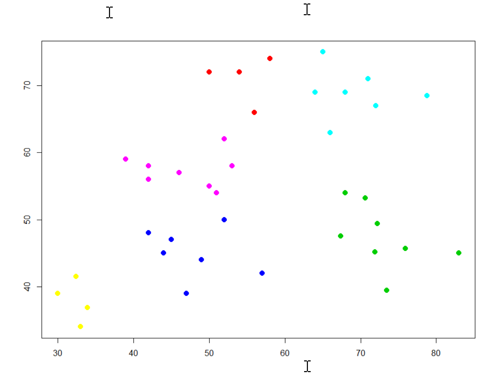
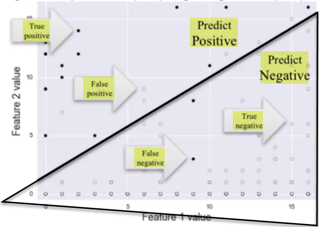
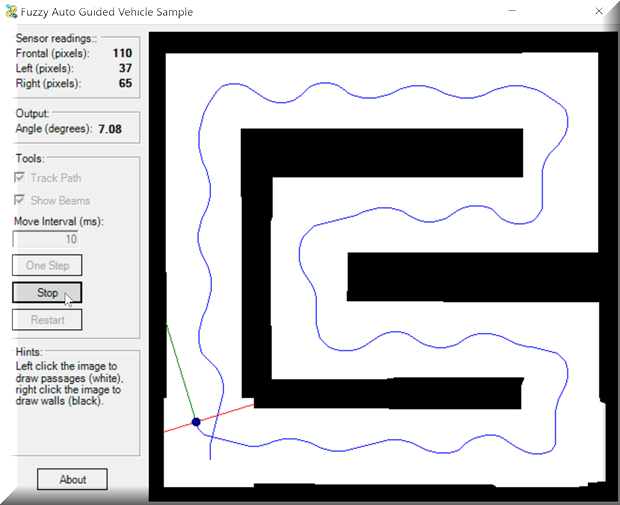
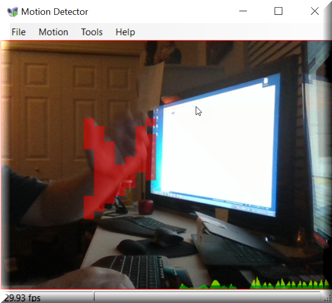
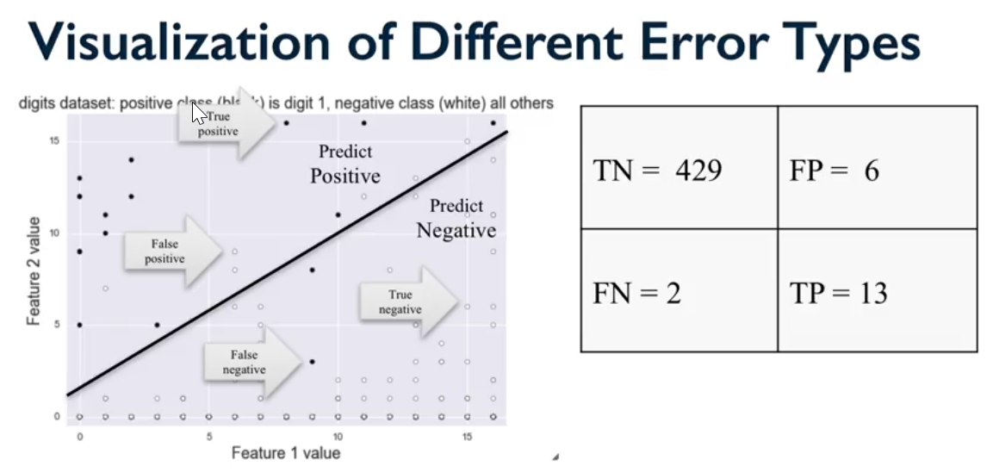
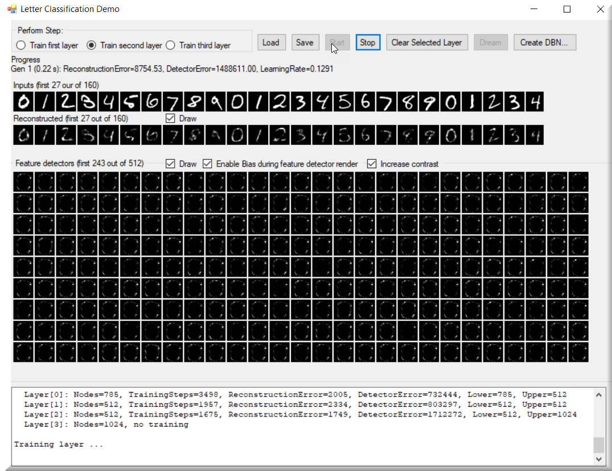

# Hands-On Machine Learning with C#

Chapter 1. Machine Learning Basics
----------------------------------

Hello everyone, and welcome to _Machine Learning Using C# and .NET_. Our goal in this book is to expose you, a seasoned C# .NET developer, to the many open source machine learning frameworks that are available, as well as examples of using those packages. Along the way, we'll talk about logging, facial and motion detection, decision trees, image recognition, intuitive deep learning, quantum computing, and more. In many cases, you'll be up and running within minutes. It's my true hope that there is something for everyone in this series. Most importantly, having dealt with developers for 30 years now, here's why I wrote this book.

As a lifelong Microsoft developer, I have often watched developers struggle to find the resources needed for everyday problems. Let's face it, none of us have the time to do things the way we like, and few of us are fortunate enough to work in a true research and development unit. We've made quite a journey over the years though, from those of us old enough to remember having the sentinel copy of the C programmers' reference and 50 other books on our desk, to now being able to type in a quick search into Google and get exactly (okay, sometimes exactly) what we are looking for. But now that the age of AI is among us, things take a bit of a different turn. As C# developers, Google search isn't always our best friend when it comes to machine learning because almost everything being used is Python, R, MATLAB, and Octave. We also have to remember that machine learning has been around for many years; it's just recently that corporate America has embraced it and we're seeing more and more people become involved. The computing power is now available, and the academia has made incredible strides and progress in bringing it out into the world. But the world, my friends, as you have no doubt heard, is a scary place! Where is a C# .NET developer to turn? Let's start answering this question with a short story in the next section, which, unfortunately, is as true as the sky is blue. At least here in sunny Florida!

In this chapter, we are going to learn the following topics:

*   Data mining
*   **Artificial Intelligence** (**AI**) and bio-AI
*   Deep learning
*   Probability and statistics
*   Supervised learning
*   Unsupervised learning
*   Reinforcement learning
*   Whether to buy, build or open source

Introduction to machine learning
--------------------------------

* * *

I once had a boss whom I told I was using machine learning to discover more about our data. His response was, _What do you think you can learn that I don't already know!_ If you haven't encountered one of those in your career, congratulations. Also let me know if you have any openings! But you more than likely have, or will. Here's how it was handled. And no, I didn't quit!

> _Me: "The goal is to learn more information and details about the funds that we have and how they may relate to what the user actually means." Him: "But I already know all that. And machine learning is just a buzzword, it's all data in the end, and we're all just data stewards. The rest is all buzzwords. Why should we be doing this and how is it going to help me in the end." Me: "Well, let me ask you this. What do you think happens when you type a search for something in Google?" Him: Deer-in-the headlights look with a slight hint of anger. Him: "What do you mean? Google obviously compares my search against other searches that have historically looked for the same thing." Me: "OK, and how does that get done?" Him: A slightly bigger hint at anger and frustration. Him: "Obviously its computers searching the web and matching up my search criteria against others." Me: "But did you ever think about how that search gets matched up amongst the billions of other searches going on, and how all the data behind the searches keeps getting updated? People obviously cannot be involved or it wouldn't scale." Him: "Of course, algorithms are finely tuned and give the results we are looking for, or at least, recommendations." Me: "Right, and it is machine learning that does just that." (not always but close enough!) Him: "OK, well I don't see what more I can learn from the data so let's see how it goes."_

So, let's be honest folks. Sometimes, no amount of logic will override blinders or resistance to change, but the story has a much different and more important meaning behind it than a boss who defies everything we learned in biology. In the world of machine learning, it's a lot harder to prove/show what's going on, whether or not things are working, how they are working, why they are (or are not) working, and so on to someone who isn't in the day-to-day trenches of development like you are. And even then, it could be very difficult for you to understand what the algorithm is doing as well.

Here are just some of the questions you should be asking yourself when it comes to deciding whether or not machine learning is right for you:

*   Are you just trying to be _buzzword compliant_ (which might be what's really being asked for) or is there a true need for this type of solution?
*   Do you have the data you need?
*   Is the data clean enough for usage (more on that later)?
*   Do you know where, and whether, you can get data that you might be missing? More importantly, how do you know that data is in fact missing?
*   Do you have a lot of data or just a small amount?
*   Is there another known and proven solution that already exists that we could use instead?
*   Do you know what you are trying to accomplish?
*   Do you know how you are going to accomplish it?
*   How will you explain it to others?
*   How will you be able to prove what's going on under the hood when asked?

These are just some of the many questions we will tackle together as we embark on our machine learning journey. It's all about developing what I call the _machine learning mindset_.

Nowadays, it seems that if someone does a SQL query that returns more than one row, they call themselves a **data scientist**. Fair enough for the resume; everyone needs a pat on the back occasionally, even if it's self-provided. But are we really operating as data scientists, and what exactly does data scientist mean? Are we really doing machine learning, and what exactly does that mean? Well, by the end of this book, we'll hopefully have found the answers to all of that, or at the very least, created an environment where you can find the answers on your own!

Not all of us have the luxury of working in the research or academic world. Many of us have daily fires to fight, and the right solution just might be a tactical solution that has to be in place in 2 hours. That's what we, as C# developers, do. We sit behind our desks all day, headphones on if we're lucky, and type away. But do we ever really get the full time we want or need to develop a project the way we'd like? If we did, there wouldn't be as much technical debt in our projects as we have, right (you do track your technical debt, right)?

We need to be smart about how we can get ahead of the curve, and sometimes we do that by thinking more than we code, especially upfront. The academic side of things is invaluable; there's simply no replacement for knowledge. But most production code in corporate America isn't written in academic languages such as Python, R, Matlab and Octave. Even though all that academic wealth is available, it's not available in the form that suits us best to do our jobs.

In the meantime, let's stop and praise those that contribute to the open source community. It is because of them that we have some excellent third-party open source solutions out there that we can leverage to get the job done. It's such a privilege that the open source community allows us to utilize what they have developed, and the objective of this book is to expose you to just some of those tools and show how you can use them. Along the way, we'll try and give you at least some of the basic behind-the-scenes knowledge that you should know, just so that everything isn't a black hole versus a black box!

You've heard buzzwords everywhere. I used to have a 2-4 hour commute to and from work each day, and I can't remember the total number of billboards I would see that had the words **machine learning** or AI on them. They are everywhere, but what exactly does it all mean? AI, machine learning, data science, **Natural Language Processing** (**NLP**), data mining, neurons, phew! It seems like as soon as corporate America got involved, what was once a finely tuned art became a messy free-for-all, and micro-managed project with completely unreal expectations. I've even heard a prospective client say, _I'm not sure what it means, but I just don't want to be left behind!_

The first thing we must do is to learn the proper way to approach a machine learning project. Let's start with some definitions:

Tom Mitchell has defined machine learning as:

> _"A computer program is said to learn from experience E with respect to some class of tasks T and performance measure P if its performance at tasks in T, as measured by P, improves with experience E."_

Our definition is going to be just a bit different. It will hopefully be something that you can use when asked to defend your chosen path:

> _"Machine learning is a collection of techniques which can be used to deal with large amounts of data in the most efficient and effective manner possible, which will derive actionable results and insight for us from that data."_

Now, what about those things we call **techniques**? Make no mistake; techniques such as probability, statistics, they are all there, just hidden under the covers. And the tools we're going to use to perform our examples will hide the details just like Python, R, and the rest of them do! That being said, it would be a complete disservice to you if we didn't at least make you aware of some of the basics, which we'll cover in a moment. I don't mean to lower the importance of any of them as they are all equally important, but our goal here is to get all C# developers up and running as quick as possible. We're going to give you enough information to make you buzzword compliant, and then you'll know more than just the block box API calls! I encourage each one of you to pursue as much academic knowledge as possible in this field. Machine Learning and Artificial Intelligence are changing daily it seems, so always keep up with the latest. The more you know, the better you will be at gaining acceptance for your project.

Since we brought up the topic of **buzzword compliant**, let's clear up a few terms right from the start. Data mining, machine learning, artificial intelligence, the list goes on and on. I'll only cover a few terms for now, but here's an easy way to think about it.

You're on a road trip with your family. Let's assume you have children, and let's put aside the _are we there yet_ conversations! You are driving down the highway and one of your kids (a very young toddler), yells _TRUCK_ and points out the window at a truck. This child is very young, so how did he know that particular vehicle was a truck (let's assume it really was!). They know it's a truck because every previous time they did the same thing you said _Yes_ or _No_. That's machine learning. Then, when you told them _Yes_ or _No_, that's reinforcement learning. If you said _Yes, that's a big truck_, that's adding context to the reinforcement, and that moves us down the road into deep learning. See what you've been teaching your children that you didn't even know about?

Hope that helped.

Data mining
-----------

* * *

Data mining deals with searching large amounts of data for very specific information. You are searching through your data looking for something specific. For example, a credit card company would use data mining to learn about buyers habits by analyzing purchases and their locations. This information then becomes very useful for things such as targeted advertisements.

Machine learning, on the other hand, focuses on performing the actual task of searching for that data using algorithms you have provided. Makes sense?

Enough said for now, but here is an excellent link where you can learn more about data mining: [https://blog.udacity.com/2014/12/24-data-science-resources-keep-finger-pulse.html](https://blog.udacity.com/2014/12/24-data-science-resources-keep-finger-pulse.html)

Artificial Intelligence
-----------------------

* * *

Artificial Intelligence is a higher order of machine learning. Some people have defined it as when the machine appears as smart as or smarter than a human. As for me, the verdict is still out on that one. The more I watch the daily news, the more I wonder which intelligence it is that is artificial, and for that matter, what intelligence really is! There are so many definitions floating around, but in a nutshell, Artificial Intelligence is considered a machine doing things that a human could or should do in a manner such that any reasonable person would not be able to distinguish the machine from the human in its response. In any event, Artificial Intelligence is a very far-reaching subject, and unfortunately there are as many meanings as people using the term!

Bio-AI
------

* * *

Bio-AI refers to putting a biological component alongside a computational component. Genotypes, phenotypes, neurons, mirror neurons, canonical neurons, synapses... you'll hear all that mentioned under this category, **Artificial Neural Networks** (**ANNs**)! Bio-AI is mostly used in the medical field. For now, we need not concern ourselves with this, but just know that the term exists and that biology is the basis for its incorporation.

Deep learning
-------------

* * *

For many years, it was believed that neural networks (using a concept known as hidden layers) only needed a single hidden layer to solve any problem. With the increase of computing power, decrease of computing hardware cost, and advances of neural network algorithms, it's common to have hundreds or even thousands of **hidden layers** in your network. The increase in the number of hidden layers, among other things, is what deep learning is in a very small nutshell! Here's a visual comparison that might help in making things clearer:

No hidden layers

As you can see in the following representational image there are several  hidden layers in the network.

 Many hidden layers (white circles)

Probability and statistics
--------------------------

* * *

Believe it or not, this is what you are doing; it's just very well abstracted from your view. But let me give you an incredibly, overly simplified, quick primer... just in case you are rusty!

You see a polar bear walking in the snow. You wonder what kind of footprints it makes. That's probability. Next, you see footprints in the snow and wonder if it's a polar bear. That's statistics. Kaboom! Now you're primed! You're also probably wondering what is wrong with this author, so maybe another example just in case!

*   Probability deals with predicting the likelihood of future event(s).
*   Statistics deals with analyzing the frequency of past event(s).

Approaching your machine learning project
-----------------------------------------

* * *

Next, let's talk about how we're going to approach our machine learning project, and while doing so, continue to define/refine our machine learning mindset. Let's start by defining the basic steps that we need to use each time we approach one of these projects. Basically, we can break them down into the following categories.

### Data collection

There are countless types of data at your disposal, from SQL and NoSQL databases, Excel files, Access databases, text files, and on and on. You need to decide where your data is located, how it is formatted, how you will import and refine it. You need to always keep in mind that there is no substitute for large amounts of testing and training data, as well as the quality of it. Garbage in, garbage out can get very messy in machine learning!

### Data preparation

As we said previously, there is simply no substitute for data quality. Is there data that is missing, malformed, or incorrect? And let's not forget about another term you'll get familiar with, data outliers. Those are the nasty little pieces of data that simply don't fit nicely with the rest of your data! Do you have those? If so, should they be there, and if so, how will they be treated? If you are not sure, here's what a data outlier might look like if you are plotting your data:

In statistics, an outlier is an observation point that is distant from other observations, sometimes very much so, sometimes not. The outlier itself may be due to variability in measurement, indicate an experiment defect, or it might in fact be valid. If you see outliers in your data, you need to understand why. They can indicate some form of measurement error, and the algorithm that you are using may not be robust enough to handle these outliers.

### Model selection and training

When creating and training a model, here are a few things that you need to consider.

*   You need to choose the appropriate machine learning algorithm for the task at hand, which will be representative of the data you are working with. You will then split this into 2-3 subsets of data: **training**, **validation**, and **test**. The rules for the correct proportions vary based upon the amount of data you are working with. For example, if you have 10,000 rows of data, then perhaps 20% to training and 80% to test is good. But if you have 108 rows of data, perhaps 5% training and 95% test is better.
*   There is one rule that you must always follow to the letter. Whatever fractionality you decide to use for your test, train and validation sets, **_ALL THE DATA MUST COME FROM THE SAME DATASET_**. This is so very important. You never want to take some data from one dataset to train on, and then data from a completely different dataset to test on. That will just lead to frustration. Always accumulate huge datasets to train, test and validate on!
*   Validation data can be used to validate your test data prior to using the test data set. Some people use it, some don't. However you split your data up, you will always have a data set to train with, and a set to test with. The goal of your algorithm must be to be flexible enough to handle data it has not previously seen, and you can't do that if you are testing with the same set of data you are developing against. Following are the two ways that the data can be split. The two approaches show how you can separate test and train sets (one with a cross validation set and the other without one):

### Model evaluation

Once you have used your training data, you will move on to testing/evaluating your model using the test dataset you prepared earlier. This is where we find out how well our model works against data that it has not previously seen. If our model fails here, we return to go, do not collect $200, and refine our process!

### Model tuning

As you are evaluating your model, you may, at some point, determine that you need to choose a different model or introduce more features/variables/hyper-parameters to improve the efficiency and performance of your model. One good way of reducing your exposure here is to spend the extra time in the _Data collection_ section and _Data preparation_ section. As we said earlier, there is simply no substitute for a lot of correct data.

If you have to tune your models, and you will, there are many approaches to doing so. Here are just a few:

*   Grid search
*   Random search
*   Bayesian optimization
*   Gradient-based optimization
*   Evolutionary optimization

Let's look at an example dataset—the infamous and always used Iris dataset.

Iris dataset
------------

* * *

The Iris dataset is a dataset of flowers introduced by the biologist Mr. Ronald Fisher in 1936. This dataset contains 50 samples from each of 3 species of the Iris flower (Iris setosa, Iris virginica, Iris versicolor). Each sample consists of four features (length of the sepal, length of the petal, width of the sepal, width of the pedal). Combined, this data produces a linearly discriminant model distinguishing one species from another.

So, how do we go from the flower to the data:

We need to now take what we know about the visual representation of what we are working with (the flower) and transform it into something the computer can understand. We do so by breaking down all the information we know about the flower into columns (features) and rows (data items) as you can see below:

Now that all the measurements are in a format which the computer can understand, our first step should be to make sure we have no missing or malformed data, as that spells trouble. If you look at the yellow highlights in the previous screenshot, you can see that we are missing data. We need to ensure that this gets populated before we feed it to our application. Once the data is properly prepared and validated, we are ready to go. If we run the Iris validator from **Encog34** our output should reflect that we have `150` datasets, which it does:

### Types of Machine Learning

Now, let's briefly familiarize ourselves with the different types of machine learning which we will discuss throughout the book, starting with the next chapter. It is important that you are at least familiar with these terms as they surely will come up one day, and the more you know and understand, the better you will be able to approach your problem and explain it to others.

Here is a simple diagram which shows the three main categories of machine learning:

Supervised learning
-------------------

* * *

These types of machine learning models are used to predict the outcome based upon the data presented to it. The instructions provided are explicit and detailed, or at least should be, which is what has garnered the label **supervised**. We are basically learning a function which maps an input to an output based upon input and output pairs. This function is inferred from training data which is called **labeled**, in that it specifically tells the function what it expects. In supervised learning, there is always an input and corresponding output (or more correctly, a desired output value). More formally, this type of algorithm uses a technique known as **inductive bias** to accomplish this, which basically means that there are a set of assumptions which the algorithm will use to predict the outputs given inputs it may or may not have previously seen.

In supervised learning we typically have access to a set of _X_ features (_X1, X2, X3, ... Xx_), measured on observations, and a response _Y_, also measured on those same _n_ observations. We then try and predict _Y_ using _X1, X2, X3, ... Xn_.

Models such as **Support Vector Machines** (**SVM**), linear regression, Naive Bayes, and tree-based methods are just a few examples of supervised learning.

Next, let's briefly discuss a few things which we need to concern ourselves with when it comes to supervised learning. They are, in no particular order:

*   Bias-variance trade-off
*   Amount of training data
*   Input space dimensionality
*   Incorrect output values
*   Data heterogeneity

### Bias-variance trade-off

Before we talk about the bias-variance trade-off, it only makes sense that we would first make sure you are familiar with the individual terms themselves.

When we talk about bias-variance trade-off, bias refers to an error from incorrect assumptions in the learning algorithm. High bias causes what is known as **under-fitting**, a phenomenon which causes the algorithm to miss relevant feature-output layer relationships in the data.

Variance, on the other hand, is a sensitivity error to small fluctuations in the training set. High variance can cause your algorithm to model random noise rather than the actual intended outputs, a phenomenon known as **over-fitting**.

There is a trade-off between bias and variance that every machine learning developer needs to understand. It has a direct correlation to under and over fitting of your data. We say that a learning algorithm has a high variance for an input if it predicts a different output result when used on a different training set, and that of course is not good.

A machine learning algorithm with **low bias** must be flexible enough so that it can fit the data well. If the algorithm is designed too flexible, each training and test dataset will fit differently, resulting in high variance.

Your algorithm must be flexible enough to adjust this trade-off either by inherent algorithmic knowledge or a parameter which can be user adjusted.

The following figure shows a simple model with high bias (to the left), and a more complex model with high variance (to the right).

### Amount of training data

As we have said repeatedly, there simply is no substitute for having enough data to get the job done correctly and completely. This directly correlates to the complexity of your learning algorithm. A less complex algorithm with high bias and low variance can learn better from a smaller amount of data. However, if your learning algorithm is complex (many input features, parameters, and so on), then you will need a much larger training set from which to learn from with low bias and high variance.

### Input space dimensionality

With every learning problem our input is going to be in the form of a **vector**. The **feature vector**, meaning the features of the data itself, can affect the learning algorithm greatly. If the input feature vectors are very large, which is called high-dimensionality, then learning can be more difficult even if you only need just a few of those features. Sometimes, the extra dimensions confuse your learning algorithm, which results in high variance. This, in turn, means that you will have to tune your algorithm to have lower variance and higher bias. It is sometimes easier, if applicable, to remove the extra features from your data, thus improving your learning function accuracy.

That being said, a popular technique known as **dimensionality reduction** is used by several machine learning algorithms. These algorithms will identify and remove irrelevant features.

### Incorrect output values

The question we ask ourselves here is how many errors exist in the desired output from our machine learning algorithm. If we experience this, the learning algorithm may be attempting to fit the data too well, resulting in something we mentioned previously, **over-fitting**. Over-fitting can result from incorrect data, or a learning algorithm which is too complex for the task at hand. If this happens, we need to either tune our algorithm or look for one which will provide us with higher bias and lower variance.

### Data heterogeneity

Heterogeneity, according to Webster's dictionary, means _the quality or state of consisting of dissimilar or diverse elements: the quality or state of being heterogeneous_. To us this means that the feature vectors include features of many different kinds. If this applies to our application, then it may be better for us to apply a different learning algorithm for the task. Some learning algorithms also require that our data is scaled to fit within certain ranges, such as _\[0 - 1\], \[-1 - 1\]_, and so on. As we get into learning algorithms that utilize distance functions as their basis, such as nearest neighbor and support vector methods, you will see that they are exceptionally sensitive to this. On the other hand, algorithms such as those that are tree-based (decision trees, and so on) handle this phenomenon quite well.

We will end this discussion by saying that we should always start with the least complex, and most appropriate algorithm, and ensure our data is collected and prepared correctly. From there, we can always experiment with different learning algorithms and tune them to see which one works best for our situation. Make no mistake, tuning algorithms may not be a simple task, and in the end, consumes a lot more time than we have available. Always ensure the appropriate amount of data is available first!

Unsupervised learning
---------------------

* * *

Contrary to supervised learning, unsupervised usually has more leeway in how the outcome is determined. The data is treated such that, to the algorithm, there is no single feature more important than any other in the dataset. These algorithms learn from datasets of input data without the expected output data being labeled. k-means clustering (cluster analysis) is an example of an unsupervised model. It is very good at finding patterns in the data that have meaning relative to the input data. The big difference between what we learned in the supervised section and here is that we now have _x_ features _X1, X2, X3, ... Xx_ measured on _n_ observations. But we no longer interested in prediction of _Y_ because we no longer have _Y_. Our only interest is to discover data patterns over the features that we have:

In the previous diagram, you can see that data such as this lends itself much more to a non-linear approach, where the data appears to be in clusters relative to importance. It is **non-linear** because there is no way we will get a straight line to accurately separate and categorize the data. Unsupervised learning allows us to approach a problem with little to no idea what the results will, or should, look like. Structure is derived from the data itself versus supervised rules applied to output labels. This structure is usually derived by **clustering** relationships of data.

For example, let's say we have 108 genes from our genomic data science experiment. We would like to group this data into similar segments, such as hair color, lifespan, weight, and so on.

The second example is what is famously known as the **cocktail party effect3**, which basically refers to the brains auditory ability to focus attention to one thing and filter out the **noise **around it.

Both examples can use clustering to accomplish their goals.

Reinforcement learning
----------------------

* * *

Reinforcement learning is a case where the machine is trained for a specific outcome with the sole purpose of maximizing efficiency and/or performance. The algorithm is **rewarded** for making the correct decisions, and **penalized** for making incorrect ones. Continual training is used to constantly improve performance. The continual learning process means less human intervention. Markov models are an example of reinforcement learning, and self-driving autonomous automobiles are a great example of just such an application. It constantly interacts with its environments, watches for obstacles, speed limits, distance, pedestrians, and so on to (hopefully) make the correct decisions.

Our biggest difference with reinforcement learning is that we do not deal with correct input and output data. The focus here is on performance, meaning somehow finding a balance between unseen data and what the algorithms have already learned.

The algorithm applies an action to its environment, receives a reward or a penalty based upon what it has done, repeats, and so on as shown in the following image. You can just imagine how many times per second this is happening in that nice little autonomous taxi that just picked you up at the hotel.

Build, buy, or open source
--------------------------

* * *

Next, let's ask ourselves the ever-important question? Buy, build or open source?

It would be my recommendation, and of course one reason why I'm writing this book, to expose yourself to the open source world. I realize that many developers suffer from the '_it's not built here'_ syndrome, but we should really be honest with ourselves before going down that path. Do we really think we have the expertise to do better, faster, and have it tested within our time constraints, compared to what is already out there? We should first try and see what is already out there that we can use. There are so many fabulous open source toolkits for us to use, and the developers of those have put tremendous amounts of hours and work into developing and testing them. Obviously open source is not a solution for everyone, every time, but even if you cannot use it in your application, there certainly is tremendous knowledge you can gain by using and experimenting with them.

Buying usually isn't an option. If you're lucky enough to find something to purchase, you probably won't get the approval as it will cost a pretty penny! And what happens if you need to modify the product to do something you need? Good luck getting access to the source or having the support team change their priorities just for you. Not going to happen, at least not as fast as we'll probably need it to!

And as for building it yourself, hey we're developers, it's what we all want to do, right? But before you fire up Visual Studio and take off, think long and hard about what you are getting into.

So open source should always be a first choice. You can bring it in house (assuming licensing allows you), adapt it to your standards if need be (code contacts, more unit tests, better documentation, and so on).

Additional reading
------------------

* * *

Although the code is in Python and R, I encourage those interested in expanding upon what we have talked about in this chapter to visit Jason Brownlee's site, [https://machinelearningmastery.com/](https://machinelearningmastery.com/). The explanations and passion about machine learning are second to none and there is an incredible amount of information you can gain from his site. The explanations are clear, passionate and cover an incredible amount of depth. I highly recommend perusing his blog and site to learn as much as you can.

Summary
-------

* * *

In this chapter, we discussed many aspects of machine learning with C#, different strategies for implementing your code—such as build, buy, or open source—as well as lightly touch upon some important definitions. I hope this got you ready for the chapters to come.

Before we dive right into our source code and applications, I want to take some time to discuss with you something that is very near and dear to my heart: logging. It's something that we all do (or should do), and there is a phenomenal tool out there that you need to know about if you do not already. We'll be using it quite a bit in this book, so it's definitely helpful to spend some time on it up front, starting in the next chapter.

References
----------

* * *

*   By Nicoguaro - Own work, CC BY 4.0, [https://commons.wikimedia.org/w/index.php?curid=46257808](https://commons.wikimedia.org/w/index.php?curid=46257808)
*   Creative Commons Attribution-ShareAlike 3.0 Unported
*   [https://en.wikipedia.org/wiki/Cocktail\_party\_effect](https://en.wikipedia.org/wiki/Cocktail_party_effect)
*   Encog framework is copyright of Jeff Heaton/Heaton research

Chapter 2. ReflectInsight – Real-Time Monitoring
------------------------------------------------

Every developer needs to have a good logging tool. Unfortunately, what I see happening a lot is developers keeping up with the latest and greatest of everything, but not logging. In a way this is good, the best logging framework is the one you don't even know is working. However, if you have not used **ReflectInsight** from **ReflectSoftware** before, you are going to love this chapter. It is so incredibly important to have the right logging tool, especially in machine learning, and nothing comes close to the rich, robust logging provided by this tool!

 You absolutely need to know what's going on inside your algorithm, and ReflectSoftware has the richest logging capabilities around. Especially when it comes to machine learning algorithms, there is nothing that remotely comes close. And when you move into deep learning, you are going to be very happy you can see what is going on under the covers.

With an algorithm running for possibly days, the insights you receive from the right kind of logging are invaluable:

ReflectInsight is comprised of a **Software Development Kit** (**SDK**), a router, a Log Viewer, and a Live Viewer. We'll take up each one separately and discuss them in detail.

In this chapter, we will cover the following topics:

*   Router
*   Log Viewer
*   Live Viewer
    
    *   Message navigation
    *   Searching through your messages
    *   Time zone formatting
    *   Auto Save/Purge
    *   SDK
    *   Configuration editor
    

Router
------

* * *

The router is the central part of the logging system. All log messages are sent to the router, which can distribute the messages from there to listeners, such as viewers, text files, binary files, event logs, databases, and more. You would typically have the router installed on a separate machine from the rest of your logging system, but you do not have to. Once installed and configured (the configuration out of the box is usually suitable for most situations), the router runs as a Windows service and has no user interface, as shown in the following screenshot:

Next we'll talk about the Log and Live Viewers.

Log Viewer
----------

* * *

The Log Viewer is designed to view historical log files that have been saved either manually or from the router/viewer configuration. If you are streaming a high number of messages through the system, you will no doubt collect a lot of log files; they may need to be viewed. I wrote an enterprise-grade microservice system for a client that used ReflectInsight at the center of its system and streamed messages to and through a **RabbitMQ** system.

On average, we streamed roughly 1 million messages a day (it is still used in production); when problems arose, the Log Viewer's historical logging capabilities were invaluable.

Live Viewer
-----------

* * *

The Live Viewer is what you will use most of the time to view your real-time logging. The capabilities of the Live Viewer are extensive to say the least. Briefly, the high-performance logging allows us to monitor instrumented applications in real time by displaying log messages in the Live Viewer. We can log incredibly rich details, such as exceptions, objects, datasets, images, process and thread information, and well-formatted XML. We can also quickly and easily navigate and trace through our applications to find the information we need. The **`Message`****`Details`** panel displays the extended details of the selected message. The details could be as simple as the message itself, or complex data such as an object, dataset, binary blob, image, process and thread information, and the contents of a collection. Syntax highlighting is available for select message types such as SQL, XML, and HTML-related messages, as well as full Unicode support, which aids in the viewing of these types of messages.

### Message navigation

ReflectInsight supports many ways of navigating through your logged messages.

You can navigate using one of the following methods:

*   Find a matching **`Enter`**/**`Exit`** method block
*   Jump to a parent **`Enter`**/**`Exit`** method block
*   Jump from any message in a **`User Defined`** view to the **`All Messages`** view
*   Go to a message by **`Line Number`**
*   **`Advanced Search`**
*   **`Quick Search`** (active view only)
*   **`Message Type`** browse navigator
*   **`Bookmarks`**

#### Message properties

This panel allows us to further inspect a selected message. We can view various **`Date Time`** values, the **`Time Zone`**, **`Process Id`**, **`Thread Id`**, **`Request Id`**, **`Category`**, **`Machine Name`**, and so on. We can also extend the message **`Properties`** panel by attaching user-defined properties to single or multiple messages during logging:

#### Watches

Available only in the Live Viewer, the **`Watches`**panel allows us to display non-persistent information for quick and dirty data change. We can write directly to the **`Watches`** or, if using the ReflectInsight **PostSharp AOP** extension, we can easily decorate an object property with a predefined custom attribute.

This attribute forces ReflectInsight to display the value of the property whenever its value changes:

#### Bookmarks

The **`Bookmarks`**panel allows us to view bookmarks for the current logging session:

It can be persisted with our log file for later retrieval. We can filter bookmarks for the active view or a given view, or see all bookmarks across**`All Views`**. We can also navigate to any bookmark and immediately activate the view to select where the bookmarked message is located:

#### Call Stack

The **`Call Stack`**panel displays the **`Call Stack`** level of the current selected message. **`Call Stack`** entries are generated using the **`Enter`**/**`Exit`** methods, or if the message was contained within the`TraceMethod` using block.

We can easily navigate the **`Call Stack`** by double-clicking on a **`Call Stack`** entry, taking us to the top of the **`Enter`**/**`Exit`** message block within the active message log panel:

### Searching through your messages

The Live Viewer provides two ways to search messages by criteria, as shown in the following screenshot. They are **`Quick Search`** and **`Advanced Search`**:

### Note

**Quick Search**is mainly used for simple, quick, text-based searching.

#### Advanced Search

This is primarily used to search messages where a more complex search criterion is needed. The search criteria can include a combination of the following:

*   **`Message Content`**
*   **`Message Type`**
*   **`Content AND Message Type`**
*   **`Content OR Message Type`**
*   In addition to a **`Regular Expression`**

The **`Advanced Search`** view provides the ability to either navigate to the search result or bookmark it:

### Time zone formatting

We can display our time details in either **`Standard`** or **`Military`** time formats. Select the **`Time Zone Type`** that best suits your location, such as **`Source`**, **`Local`**, **`UTC`**, or **`Custom`** (choosing from one of the available system time zones).

### Auto Save/Purge

Apart from the library's ability to **`Auto Save`** rolling log files, the Live Viewer has similar capabilities in addition to **`Auto Purge`** the top portion of a rolling log file. You can configure the Live Viewer to either **`Auto Save`** or **`Auto Purge`** by applying one of the following methods:

*   Auto Save -This method forces the Live Viewer to save the files once a specific criterion has been met (that is, on a new day and/or message limit).
*   Auto Purge -This method forces the Live Viewer to purge the top portion of the logged messages, based on predefined size percentages of the current log file.

It is sufficient to say that if we look at the following screenshot, we can see the amount of information that may be gathered from our algorithms and applications; it's huge:

#### Example

We've mentioned just how valuable a tool such as this can be when it comes to machine learning, so it's only fair that we show you exactly what we mean. Up next is a screenshot of an actual machine learning algorithm outputting data to the Live Viewer. Without this information in real time, we would be lost with respect to the efficacy and performance of our application!

#### ReflectInsight Utilities: 

**`Message Statistics`** can be viewed and adjusted to meet your criteria with this incredibly valuable tool. You can search for various types of messages, by names, categories, users and more. From there you can see the composition of such messages.

#### Watches

Watches observe parameters and variables in real-time as shown below. You define your own watches programatically and periodically update their values and/or parameters.

### Software Development Kit

The SDK is what allows us to connect ReflectInsight to our applications. We will see as we get further along just how easy it is to do this. The beautiful thing about how this SDK works compared to others is the rich image set assigned to each message. When you have thousands of messages streaming per second, colors and images can be a huge help in focusing your attention on just what you need to see.

The following is a screenshot that shows exactly what I mean. As an example, if we use the **`SendException`** message, then the red _X_ will be displayed in the icon panel along the far left-hand side of the Live Viewer/Log Viewer. The same applies for all the other messages you see in the following screenshot:

### Configuration editor

The configuration editor is a visual interface into the ability to make configuration parameter changes for the application. This makes it simpler and more intuitive compared to changing text file parameters.

#### Overview

We can use the XML-based configuration file with our applications to make the ReflectInsight viewer behave the way we want it to. There are a few configuration categories available, from autosave and filtering, to message coloring and many more.

#### XML configuration

ReflectInsight is configured using an XML configuration file. The configuration information can be embedded within other XML configuration files, such as the application or `web.config` file, or in a separate file. The configuration is easily readable and updatable while retaining the flexibility to express all configurations.

Alternatively, ReflectInsight can be configured programmatically. We will use a combination of both throughout this book, with the main configuration usually done via the `app.config` file.

#### Dynamic configuration

ReflectInsight automatically monitors its configuration file for changes and dynamically applies these changes when made. In many cases, it is possible to diagnose application issues without terminating the process in question. This can be a very valuable tool in investigating issues from our deployed applications.

#### Main Screen

The ReflectInsight insight configuration editor helps in easily creating configuration files through a visual interface, but advanced users can work with XML.

The tool is very useful for editing settings, defining message patterns/formats, defining extensions, defining listeners, associating colors with message types, and more:

*   Easy-to-understand layout
*   It remembers the recent files list
*   Predefined selections and dynamic section lookups
*   Key values popup editor
*   Message pattern popup editor
*   Method types popup editor
*   Color definition and message color popup editor

Following is a screenshot of the configuration editor and the various parameters its changes can affect:

You can download a trial copy of ReflectInsight from [www.reflectsoftware.com](http://www.reflectsoftware.com). Mention this book when purchasing and get a substantial discount off the retail price!

Summary
-------

* * *

In this chapter, we learned about ReflectInsight and the incredible benefits it can provide you. We saw especially how it can help the machine learning developer see exactly what is going on inside their algorithm. I encourage you to download your copy and try it out. You will never look at logging the same way again. Our next chapter will expose the famous Traveling Salesman problem, and we will get our first exposure to the second love of my life, neurons, as well as work with the famous Bayes theorem!

ReflectInsight is a copyright of ReflectSoftware. All images, text, and logos are used with permission.

Chapter 3. Bayes Intuition – Solving the Hit and Run Mystery and Performing Data Analysis
-----------------------------------------------------------------------------------------

Notice how the start of this chapter was an in-your-face algorithm? I wanted to make sure that the first thing you see is this formula. This underscores just how important it will become in your machine learning career. Write it down, put it on a sticky note on your monitor, or commit it to memory!

In this chapter, we will:

*   Apply the famous Bayes' theorem to solve a very famous problem in computer science
*   Show you how you can use Bayes' theorem and Naive Bayes to plot data, discover outliers from truth tables, and more

Overviewing Bayes' theorem
--------------------------

* * *

To be honest, there are as many interpretations of Bayes' theorem as there are books about it. The one shown previously is the main one that we will be discussing. I would also encourage you to refer to [https://brilliant.org/wiki/bayes-theorem/](https://brilliant.org/wiki/bayes-theorem/) for further reading.

To make this more concrete and formal, let's start off with a bit of intuition and formality; it will help us set the stage for what is to come.

When we use Bayes' theorem, we are measuring the degree of belief of something, the likelihood that an event will occur. Let's just keep it that simple for now:

The preceding formula means the probability of _A_ given _B_.

Probability is usually quantified as a number between 0 and 1, inclusive of both; 0 would indicate impossibility and 1 would indicate absolute certainty. The higher the probability, the more the certainty. The odds of a dice rolling a 6 and the odds of a coin flip coming up heads are two examples of probability that you are no doubt very familiar with. There's also another example you are familiar with and encounter daily: spam.

All of us usually have our email open right beside us, all day long (some of us all night long too!). And with the messages that we are expecting also come the ones that we are not and do not care to receive. We all hate dealing with spam, that nasty email that has nothing to do with anything but Viagra; yet we somehow always seem to get it. What is the probability that any one of those emails I get each day is spam? What is the probability that I care about its content? How would we even know?

So let's talk a little bit about how a spam filter works because, you see, it's perhaps the best example of probability we can use! To be precise and more formal, we are dealing with **conditional probability**, which is the probability of event _A_ given the occurrence of event _B_.

The way most spam filters work, at least at the very basic level, is by defining a list of words that are used to indicate emails that we do not want or did not ask to receive. If the email contains those words, it's considered spam and we deal with it accordingly. So, using Bayes' theorem, we look for the probability that an email is spam given a list of words, which would look like this in a formulaic view:

**The probability that an email is spam, given a set of words**: User Qniemiec in Wikipedia has an incredible visual diagram that explains in full force every combination of a probabilistic view, which is represented by the superposition of two event trees. If you are a visual person like I am, here is a complete visualization of Bayes' theorem represented by the superposition of two event tree diagrams:

Now, let's move on to a very famous problem. It is called by many names, but the basic problem is what is known as the **taxicab problem**. Here's our scenario, which we will attempt to solve using probability and Bayes' theorem.

An Uber driver was involved in a hit-and-run accident. The famous yellow taxi cabs and Uber drivers are the two companies that operate in the city and can be seen everywhere. We are given the following data:

*   85% of the cabs in the city are yellow and 15% are Uber.
*   A witness identified the car involved in the hit and run and stated that it had an Uber sticker on it. That being said, we know how reliable witness testimony is, so the court decided to test the user and determine their reliability. Using the same set of circumstances that existed on the night of the accident, the court concluded that the witness correctly identified each one of the two vehicles 80% of the time, but failed 20% of the time. This is going to be important, so stay with me on this!

**Our dilemma**: What is the probability that the car involved in the accident was an Uber driver versus a yellow cab?

Mathematically, here's how we get to the answer we need:

*   The total number of Uber drivers identified correctly is:

_15 \* 0.8 = 12_

*   The witness is incorrect 20% of the time, so the total number of vehicles incorrectly identified is:

_85 \* 0.2 = 17_

*   Therefore, the total vehicles identified by the witness is _12 + 17 = 29_. The probability that they identified the Uber driver correctly is hence:

_12/29 = @41.3%_

Now, let's see whether we can develop a simple program that can help us arrive at that number to prove our solution works and is viable. To accomplish this, we are going to dive into our first open source toolkit: **Encog**. Encog is designed to handle problems exactly like this.

The Encog framework is a full-fledged machine learning framework and was developed by Mr. Jeff Heaton. Mr. Heaton has also published several books on the Encog framework, as well as other subjects, and I encourage you to seek them out if you plan to use this framework extensively. I persoally own every one of them and I consider them seminal works.

Let's look at the code it's going to take to solve our problem. As you'll notice, math, statistics, probability... it's all abstracted from you. Encog can allow you to focus on the business problem you are trying to solve.

The complete execution block looks like the following code. We'll begin to dissect it in a moment.

Copy

    public void Execute(IExampleInterface app)
    {
                // Create a Bayesian network
                BayesianNetwork network = new BayesianNetwork();
                // Create the Uber driver event
                BayesianEvent UberDriver = network.CreateEvent("uber_driver");
                // create the witness event
                BayesianEvent WitnessSawUberDriver = network.CreateEvent("saw_uber_driver");
                // Attach the two
                network.CreateDependency(UberDriver, WitnessSawUberDriver);
                network.FinalizeStructure();
                // build the truth tables
                UberDriver?.Table?.AddLine(0.85, true);
                WitnessSawUberDriver?.Table?.AddLine(0.80, true, true);
                WitnessSawUberDriver?.Table?.AddLine(0.20, true, false);
                network.Validate();
                Console.WriteLine(network.ToString());
                Console.WriteLine($"Parameter count: {network.CalculateParameterCount()}");
                EnumerationQuery query = new EnumerationQuery(network);
                // The evidence is that someone saw the Uber driver hit the car
                query.DefineEventType(WitnessSawUberDriver, EventType.Evidence);
                // The result was the Uber driver did it
                query.DefineEventType(UberDriver, EventType.Outcome);
                query.SetEventValue(WitnessSawUberDriver, false);
                query.SetEventValue(UberDriver, false);
                query.Execute();
                Console.WriteLine(query.ToString());
    }

OK, let's break this down into more digestible pieces. The first thing we are going to do is create a Bayesian network. This object will be at the center of solving our mystery. The `BayesianNetwork` object is a wrapper around a probability and classification engine.

The Bayesian network is comprised of one or more `BayesianEvents`. An event will be one of three distinct types—`Evidence`, `Outcome`, or `Hidden`—and will usually correspond to a number in the training data. An `Event` is always discrete, but continuous values (if present and desired) can be mapped to a range of discrete values.

After creating the initial network object, we create an event for the Uber driver as well as for the witness who claimed they saw the driver involved in the hit and run. We will create a dependency between the Uber driver and the witness, and then finalize the structure of our network:

Copy

    public void Execute(IExampleInterface app)
             {
                 // Create a Bayesian network
                 BayesianNetwork network = new BayesianNetwork();
                 // Create the Uber driver event
                 BayesianEvent UberDriver = network.CreateEvent("uber_driver");
                 // create the witness event
                 BayesianEvent WitnessSawUberDriver = network.CreateEvent("saw_uber_driver");
                 // Attach the two
                 network.CreateDependency(UberDriver, WitnessSawUberDriver);
                 network.FinalizeStructure();
    
                 // build the truth tables
                 UberDriver?.Table?.AddLine(0.85, true);
                 WitnessSawUberDriver?.Table?.AddLine(0.80, true, true);
                 WitnessSawUberDriver?.Table?.AddLine(0.20, true, false);
                 network.Validate();
    
                 Console.WriteLine(network.ToString());
                 Console.WriteLine($"Parameter count: {network.CalculateParameterCount()}");
    
                 EnumerationQuery query = new EnumerationQuery(network);
    
                 // The evidence is that someone saw the Uber driver hit the car
                 query.DefineEventType(WitnessSawUberDriver, EventType.Evidence);
                 // The result was the Uber driver did it
                 query.DefineEventType(UberDriver, EventType.Outcome);
                 query.SetEventValue(WitnessSawUberDriver, false);
                 query.SetEventValue(UberDriver, false);
                 query.Execute();
                 Console.WriteLine(query.ToString());
             }

Next, we need to build the actual truth tables. A truth table is a listing of all possible values a function can have. There are one or more rows of increasing complexity, and the last row is the final function value. If you remember logic theory, there are basically three operations that you can have: `NOT`, `AND`, and `OR`. 0 usually represents `false`, and 1 usually represents `true`.

If we look just a little bit deeper, we will see that we end up with the following rules:

_If A = 0, -A = 1_

_If A = 1, -A = 0_

_A+B = 1, except when A and B = 0_

_A+B = 0 if A and B = 0_

_A\*B = 0, except when A and B = 1_

_A\*B = 1 if A and B = 1_

Now, back to our code.

To build the truth table, we will need to know the probability and the result value. In the case of our problem, the probability that an Uber driver was involved in the accident is 85%. As for the witness, there is an 80% chance they are telling the truth and a 20% chance that they are mistaken. We will use the`AddLine` function of the truth table to add this information:

Copy

    // build the truth tables
    UberDriver?.Table?.AddLine(0.85, true);
    WitnessSawUberDriver?.Table?.AddLine(0.80, true, true);
    WitnessSawUberDriver?.Table?.AddLine(0.20, true, false);
    network.Validate();

Let's talk a bit more about truth tables. Here is an extended truth table showing all the possible truth functions of two variables, _P_ and _Q_.

If we were to program our truth table more extensively, here is an example of how we could do so:

Copy

    a?.Table?.AddLine(0.5, true); // P(A) = 0.5
    x1?.Table?.AddLine(0.2, true, true); // p(x1|a) = 0.2
    x1?.Table?.AddLine(0.6, true, false);// p(x1|~a) = 0.6
    x2?.Table?.AddLine(0.2, true, true); // p(x2|a) = 0.2
    x2?.Table?.AddLine(0.6, true, false);// p(x2|~a) = 0.6
    x3?.Table?.AddLine(0.2, true, true); // p(x3|a) = 0.2
    x3?.Table?.AddLine(0.6, true, false);// p(x3|~a) = 0.6

Now that our network and truth tables are built, it's time to define some events. As we mentioned earlier, events are any one of `Evidence`, `Hidden`, or `Outcome`. The `Hidden` event, which is neither `Evidence` nor `Outcome`, is still involved in the Bayesian graph itself. We will not be using `Hidden` but I wanted you to know that it does exist.

To solve our mystery, we must accumulate evidence. In our case, the evidence that we have is that the witness reported seeing an Uber driver involved in the hit and run. We will define an event type of `Evidence` and assign it to what the witness reported. The result, or outcome, is that it was an Uber driver, so we will assign an event type of outcome to that.

Finally, we must account for the fact that, at least some of the time, the witness's report of seeing an Uber driver involved was incorrect. So we must create event values for both probabilities—that the witness did not see an Uber driver, and that an Uber driver was not involved:

Copy

    EnumerationQuery query = new EnumerationQuery(network);
    
    // The evidence is that someone saw the Uber driver hit the car
    query.DefineEventType(WitnessSawUberDriver, EventType.Evidence);
    // The result was the Uber driver did it
    query.DefineEventType(UberDriver, EventType.Outcome);
    query.SetEventValue(WitnessSawUberDriver, false);
    query.SetEventValue(UberDriver, false);
    query.Execute();

Notice that the query we are going to execute is an `EnumerationQuery`. This object allows probabilistic queries against a Bayesian network. This is done by calculating every combination of hidden nodes and using total probability to find the result. The performance can be weak if our Bayesian network is large, but fortunately for us, it is not.

Finally, we execute our query against our Bayesian network definition and print the results:

The result, as we had hoped for, was 41%.

As an exercise for you, see whether you can now use Encog to solve another very famous example. In this example, we wake up in the morning and find out that the grass was wet. Did it rain, was the sprinkler on, or both? Here's what our truth tables look like on pen and paper:

The probability that it rained:

The complete truth table:

Overviewing Naive Bayes and plotting data
-----------------------------------------

* * *

Although we discussed Bayes' theorem, we would be doing a great disservice to you if we did not discuss Naive Bayes. It's everywhere, and for good reasons. It almost always works well (hence the name, Naive), and you will most certainly be exposed to it during your machine learning career. It is a simplistic technique based upon a premise that the value of any one feature is completely independent from the value of any other. For example, an orange is round, the color is orange, the skin is not smooth, and it's 10-20 cm in diameter. A Naive Bayes classifier would then consider each feature described previously to contribute independently that this is an orange versus an apple, lemon, and so on, even if there is some data relationship amongst its features.

As mentioned, Naïve Bayes is surprisingly efficient in resolving complex situations. Although there are scenarios where it can certainly be outperformed, it can be a great first-try algorithm to apply to your problem. We only need a very small amount of training data compared to many other models.

### Plotting data

In our next application, we will be using the fantastic Accord.NET machine learning framework to provide you with a tool with which you can enter data, watch it being plotted, and learn about false positives and negatives. We will be able to enter data for objects that exist in our data space and categorize them as either being green or blue. We will be able to change that data and see how it is classified and, more importantly, visually represented. Our objective is to learn which set new cases fall into as they arrive; they are either green or blue. In addition, we want to track false positives and false negatives. Naive Bayes will do this for us based upon the data that exists within our data space. Remember, after we train our Naive Bayes classifier, the end goal is that it can recognize new objects from data it has previously never seen. If it cannot, then we need to circle back to the training stage.

We briefly discussed truth tables, and now it's time to go back and put a bit more formality behind that definition. More concretely, let's talk in terms of a **confusion matrix**. In machine learning, a confusion matrix (error matrix or matching matrix) is a table layout that lets you visualize the performance of an algorithm. Each row represents predicted class instances, while each column represents actual class instances. It's called a confusion matrix because the visualization makes it easy to see whether you are confusing one with the other.

An abstract view of a truth table would look something like this:

**X present**

**X absent**

Test positive

True positive

False positive

Total positive

Test negative

False negative

True negative

Total negative

Total with X

Total without X

Grand total

A more visual view of the same truth table would look something like this:

Visual view of the truth table

And finally, a more formal view of a true confusion matrix:

In the field of machine learning, the truth table/confusion matrix allows you to visually assess the performance of your algorithm. As you will see in our following application, every time you add or change data, you will be able to see whether any of these false or negative conditions occur.

Currently, the test data we will start out with is split evenly between green and blue objects, so there's no reasonable probability that any new case is more likely to be one versus the other. This reasonable probability, sometimes called a **belief**, is more formally known as the **prior probability** (there's that word again!). Prior probabilities are based upon prior experience with what we've seen with the data and, in many cases, this information is used to predict outcomes prior to them happening. Given a prior probability or belief, we will formulate a conclusion which then becomes our **posterior belief**.

In our case, we are looking at:

*   The prior probability of green objects being the total number of green objects/the total number of objects in our data space
*   The prior probability of blue objects being the total number of blue objects/the total number of objects in our data space

Let's look a little bit further into what's happening.

You can see what our data looks like in the following screenshot. The _X_ and _Y_ columns indicate coordinates in our data space along an _x_ and _y_ axis, and the _G_ column is a label as to whether or not the object is green. Remember, supervised learning should give us the objective we are trying to arrive at, and Naive Bayes should make it easy to see whether that's true.

If we take the preceding data and create a scatter plot of it, it will look like the following screenshot. As you can see, all the points in our data space are plotted, and the ones with our _G_ column having a value of 0 are plotted as blue, while those having a value of 1 are plotted as green.

Each data point is plotted against its _X_/_Y_ location in our data space, represented by the _x_/_y_ axis:

But what happens when we add new objects to our data space that the Naive Bayes classifier cannot correctly classify? We end up with what is known as false negatives and false positives, as follows:

As we have only two categories of data (green and blue), we need to determine how these new data objects will be correctly classified. As you can see, we have 14 new data points, and the color coding shows where they align to the _x_ and _y_ axis.

Now let's view our application in its full form. The following is a screenshot of our main screen. Under the **`Data Samples`** tab on the left-hand side of the screen, we can see that we have our data space loaded. On the right-hand side of the screen, we can see that we have a scatter plot visual diagram that helps us visualize that data space. As you can see, all the data points have been plotted and color-coded correctly:

If we take a look at how the probabilities are classified and plotted, you can see that the data presents itself almost in two enclosed but overlapping clusters:

When a data point in our space overlaps a different data point of a different color, that's where we need Naive Bayes to do its job for us.

If we switch to our **`Model Testing`** tab, we can see the new data points we added.

Next, let's modify some of the data points that we have added in order to show how any one data point can become a false negative or a false positive. Note that we start this exercise with seven false negatives and seven false positives.

The data modifications we made previously result in the following plot. As you can see, we have additional false positives now:

I will leave it up to you to experiment with the data and continue your Naive Bayes learning!

Summary
-------

* * *

In this chapter, we learned about probability theory, Bayes theorem, Naive Bayes, and how to apply it to real-world problems. We also learned how to develop a tool that will help us test out our classifier and see whether our data holds any false negatives or positives.

In our next chapter, we will dive deeper into the world of machine learning and talk about reinforcement learning.

References
----------

* * *

*   Creative Commons Attribution—ShareAlike License
*   Heaton, J. (2015). _Encog: Library of Interchangeable Machine Learning Models for Java and C#_, _Journal of Machine Learning Research_, 16, 1243-1247
*   Copyright 2008-2014, Heaton Research, Inc
*   Copyright (c) 2009-2017, Accord.NET authors authors@accord-framework.net
*   _Case Study: The base rate fallacy reconsidered_ (Koehler (1996))

Chapter 4. Risk versus Reward – Reinforcement Learning
------------------------------------------------------

In this chapter, we will go a little deeper and learn about one of the hot topics in machine learning: reinforcement learning. We will cover several exciting examples to show how you can use this in your application. We'll go over a few algorithms, and then after our first, more formal example, we will take you to a final exciting example that you are sure to enjoy!

The following topics will covered in this chapter:

*   Overviewing reinforcement learning
*   Types of learning
*   Q-learning
*   SARSA
*   Running our application
*   Tower of Hanoi

Overviewing reinforcement learning
----------------------------------

* * *

As mentioned in [Chapter 1](/book/big_data_and_business_intelligence/9781788994941/1), _Machine Learning Basics_, reinforcement learning is a case where the machine is trained for a specific outcome with the sole purpose of maximizing efficiency and/or performance. The algorithm is rewarded for making correct decisions and penalized for making incorrect ones, as shown in the following diagram:

Continual training is used to constantly improve performance. The focus here is on performance, meaning somehow finding a balance between unseen data and what the algorithms have already learned. The algorithm applies an action to its environment, receives a reward or a penalty based on what it has done, repeats the process, and so on.

We're going to dive right into the application in this chapter, and we're going to use the incredible Accord.NET open source machine learning framework to highlight how we can use reinforcement learning to help an autonomous object get from its starting location, depicted by a black object, to a desired end point, depicted by a red object.

The concept is similar, although on a much lower scale of complexity, to what autonomous vehicles do to get you from point A to point B. Our example will allow you to use maps of various complexity, meaning various obstacles may appear in between your autonomous object and the desired location. Let's look at our application:

Here, you can see that we have a very basic map loaded, one with no obstacles but only exterior confining walls. The black block (start) is our autonomous object and the red block (stop) is our destination. Our goal in this application is to navigate the walls to get to our desired location. If our next move puts us onto a white block, our algorithm will be rewarded. If our next move puts us into a wall, it will be penalized. From this, our autonomous object should be able to get to its destination. The question is: how fast can it learn? In this example, there are absolutely no obstacles in its path, so there should be no issues solving the problem in the shortest number of moves possible.

The following is another example of a somewhat more complicated map for our environment:

Types of learning
-----------------

* * *

On the right-hand side of our application are our settings, as seen in the following screenshot. The first thing that we see is the learning algorithm. In this application, we will be dealing with two distinct learning algorithms, **Q-learning** and **State-Action-Reward-State-Action** (**SARSA**). Let's briefly discuss both of these algorithms:

Q-learning
----------

* * *

Q-learning can identify an optimal action (that which has the highest value in each state) while in a given state without having a completely defined model of the environment. It is also great at handling problems with stochastic transitions and rewards without requiring tweaking or adaptations.

Here is the mathematical intuition for Q-learning:

Perhaps it's easier to comprehend if we provide a very high-level abstract example. The agent starts at state 1. It then performs action 1 and gets reward 1. Next, it looks around and sees what the maximum possible reward for an action in state 2 is; it uses that to update the value of action 1. And so on!

SARSA
-----

* * *

**SARSA** (you can already guess where this one is, going by the name) works like this:

1.  The agent starts at state 1
2.  It then performs action 1 and gets reward 1
3.  Next, it moves on to state 2, performs action 2, and gets reward 2
4.  Then, the agent goes back and updates the value of action 1

As you can see, the difference in the two algorithms is in the way the future reward is found. Q-learning uses the highest action possible from state 2, while SARSA uses the value of the action that is actually taken.

Here is the mathematical intuition for SARSA:

Running our application
-----------------------

* * *

For now, let's start using our application with our default parameters. Simply click on the **`Start`** button and the learning will commence. Once this is complete, you will be able to click on the **`Show Solution`** button, and the learned path will be animated from start to finish.

Clicking on **`Start`** will begin the learning stage and continue until the black object reaches its goal:

Here you will see that as the learning progresses, we are sending the output to `ReflectInsight` to help us see and learn what the algorithm is doing internally. You see that for each iteration, different object positions are being evaluated, and so are their actions and rewards:

Once the learning is complete, we can click on the **`Show Solution`** button to replay the final solution. When complete, the black object will sit atop the red object:

Now let's look at the code from our application. There are two methods of learning that we highlighted previously. Here's how Q-learning looks:

Copy

    int iteration = 0;
                 TabuSearchExploration tabuPolicy = (TabuSearchExploration)qLearning.ExplorationPolicy;
                 EpsilonGreedyExploration explorationPolicy = (EpsilonGreedyExploration)tabuPolicy.BasePolicy;
    
                 while ((!needToStop) && (iteration < learningIterations))
                 {
                     explorationPolicy.Epsilon = explorationRate - ((double)iteration / learningIterations) * explorationRate;
                     qLearning.LearningRate = learningRate - ((double)iteration / learningIterations) * learningRate;
                     tabuPolicy.ResetTabuList();
    
                     var agentCurrentX = agentStartX;
                     var agentCurrentY = agentStartY;
    
                     int steps = 0;
                     while ((!needToStop) && ((agentCurrentX != agentStopX) || (agentCurrentY != agentStopY)))
                     {
                         steps++;
                         int currentState = GetStateNumber(agentCurrentX, agentCurrentY);
                         int action = qLearning.GetAction(currentState);
                         double reward = UpdateAgentPosition(ref agentCurrentX, ref agentCurrentY, action);
                         int nextState = GetStateNumber(agentCurrentX, agentCurrentY);
    
                         // do learning of the agent - update his Q-function, set Tabu action
                         qLearning.UpdateState(currentState, action, reward, nextState);
                         tabuPolicy.SetTabuAction((action + 2) % 4, 1);
                     }
    
                     System.Diagnostics.Debug.WriteLine(steps);
                     iteration++;
    
                     SetText(iterationBox, iteration.ToString());
                 }

How does SARSA learning differ? Let's take a look at the `while` loop of SARSA learning and understand:

Copy

    int iteration = 0;
                 TabuSearchExploration tabuPolicy = (TabuSearchExploration)sarsa.ExplorationPolicy;
                 EpsilonGreedyExploration explorationPolicy = (EpsilonGreedyExploration)tabuPolicy.BasePolicy;
    
                 while ((!needToStop) && (iteration < learningIterations))
                 {
                     explorationPolicy.Epsilon = explorationRate - ((double)iteration / learningIterations) * explorationRate;
                     sarsa.LearningRate = learningRate - ((double)iteration / learningIterations) * learningRate;
                     tabuPolicy.ResetTabuList();
    
                     var agentCurrentX = agentStartX;
                     var agentCurrentY = agentStartY;
                     int steps = 1;
                     int previousState = GetStateNumber(agentCurrentX, agentCurrentY);
                     int previousAction = sarsa.GetAction(previousState);
                     double reward = UpdateAgentPosition(ref agentCurrentX, ref agentCurrentY, previousAction);
    
                     while ((!needToStop) && ((agentCurrentX != agentStopX) || (agentCurrentY != agentStopY)))
                     {
                         steps++;
    
                         tabuPolicy.SetTabuAction((previousAction + 2) % 4, 1);
                         int nextState = GetStateNumber(agentCurrentX, agentCurrentY);
                         int nextAction = sarsa.GetAction(nextState);
                         sarsa.UpdateState(previousState, previousAction, reward, nextState, nextAction);
                         reward = UpdateAgentPosition(ref agentCurrentX, ref agentCurrentY, nextAction);
                         previousState = nextState;
                         previousAction = nextAction;
                     }
    
                     if (!needToStop)
                     {
                         sarsa.UpdateState(previousState, previousAction, reward);
                     }
    
                     System.Diagnostics.Debug.WriteLine(steps);
    
                     iteration++;
    
                     SetText(iterationBox, iteration.ToString());
                 }

Our last step is to see how we can animate the solution. This will be needed for us to see that our algorithm achieved its goal. Here is the code:

Copy

    TabuSearchExploration tabuPolicy;
    
                 if (qLearning != null)
                     tabuPolicy = (TabuSearchExploration)qLearning.ExplorationPolicy;
                 else if (sarsa != null)
                     tabuPolicy = (TabuSearchExploration)sarsa.ExplorationPolicy;
                 else
                     throw new Exception();
    
                 var explorationPolicy = (EpsilonGreedyExploration)tabuPolicy?.BasePolicy;
                 explorationPolicy.Epsilon = 0;
                 tabuPolicy?.ResetTabuList();
                 int agentCurrentX = agentStartX, agentCurrentY = agentStartY;
                 Array.Copy(map, mapToDisplay, mapWidth * mapHeight);
                 mapToDisplay[agentStartY, agentStartX] = 2;
                 mapToDisplay[agentStopY, agentStopX] = 3;

And here is our `while` loop where all the magic happens!

Copy

    while (!needToStop)
                 {
                     cellWorld.Map = mapToDisplay;
                     Thread.Sleep(200);
    
                     if ((agentCurrentX == agentStopX) && (agentCurrentY == agentStopY))
                     {
                         mapToDisplay[agentStartY, agentStartX] = 2;
                         mapToDisplay[agentStopY, agentStopX] = 3;
                         agentCurrentX = agentStartX;
                         agentCurrentY = agentStartY;
                         cellWorld.Map = mapToDisplay;
                         Thread.Sleep(200);
                     }
    
                     mapToDisplay[agentCurrentY, agentCurrentX] = 0;
                     int currentState = GetStateNumber(agentCurrentX, agentCurrentY);
                     int action = qLearning?.GetAction(currentState) ?? sarsa.GetAction(currentState);
                     UpdateAgentPosition(ref agentCurrentX, ref agentCurrentY, action);
                     mapToDisplay[agentCurrentY, agentCurrentX] = 2;
                 }

Let's break this down into more digestible sections. The first thing that we do is establish our tabu policy. If you are not familiar with tabu searching, note that it is designed to enhance the performance of a local search by relaxing its rule. At each step, sometimes worsening a move is acceptable if there are no alternatives (moves with reward).

Additionally, prohibitions (tabu) are put in place to ensure that the algorithm does not return to the previously visited solution.

Copy

                TabuSearchExploration tabuPolicy;
    
                 if (qLearning != null)
                     tabuPolicy = (TabuSearchExploration)qLearning.ExplorationPolicy;
                 else if (sarsa != null)
                     tabuPolicy = (TabuSearchExploration)sarsa.ExplorationPolicy;
                 else
                     throw new Exception();
    
                 var explorationPolicy = (EpsilonGreedyExploration)tabuPolicy?.BasePolicy;
                 explorationPolicy.Epsilon = 0;
                 tabuPolicy?.ResetTabuList();

Next, we have to position our agent and prepare the map.

Here is our main execution loop, which will show the animated solution:

Copy

    while (!needToStop)
                 {
                     cellWorld.Map = mapToDisplay;
                     Thread.Sleep(200);
    
                     if ((agentCurrentX == agentStopX) && (agentCurrentY == agentStopY))
                     {
                         mapToDisplay[agentStartY, agentStartX] = 2;
                         mapToDisplay[agentStopY, agentStopX] = 3;
                         agentCurrentX = agentStartX;
                         agentCurrentY = agentStartY;
                         cellWorld.Map = mapToDisplay;
                         Thread.Sleep(200);
                     }
    
                     mapToDisplay[agentCurrentY, agentCurrentX] = 0;
                     int currentState = GetStateNumber(agentCurrentX, agentCurrentY);
                     int action = qLearning?.GetAction(currentState) ?? sarsa.GetAction(currentState);
                     UpdateAgentPosition(ref agentCurrentX, ref agentCurrentY, action);
                     mapToDisplay[agentCurrentY, agentCurrentX] = 2;
                 }

Tower of Hanoi
--------------

* * *

Since we've discussed Q-learning, I want to spend the rest of this chapter highlighting some fantastic work done by Kenan Deen. His Tower of Hanoi solution is a great example of how you can use reinforcement learning to solve real-world problems.

This form of reinforcement learning is more formally known as a **Markov Decision Process** (**MDP**). An MDP is a discrete-time stochastic control process, which means that at each time step, the process is in state _x_. The decision maker may choose any available action for that state, and the process will respond at the next time step by randomly moving into a new state and giving the decision maker a reward. The probability that the process moves into its new state is determined by the chosen action. So, the next state depends on the current state and the decision maker's action. Given the state and the action, the next move is completely independent of all previous states and actions.

The Tower of Hanoi consists of three rods and several sequentially sized disks in the leftmost rod. The objective is to move all the disks from the leftmost rod to the rightmost one **with the fewest possible number of moves**.

Two important rules you have to follow are that you can move only one disk at a time, and you can't put a bigger disk on top of a smaller one; that is, in any rod, the order of disks must always be from the largest disk at the bottom to the smallest disk at the top, depicted as follows:

Let's say we are using three disks, as pictured just now. In this scenario, there are 33 possible states, shown as follows:

The total number of all possible states in a Tower of Hanoi puzzle is 3 raised to the number of disks.

_||S|| = 3n_

Where ||_S_|| is the number of elements in the set states, and _n_ is the number of disks.

So, in our example, we have _3 x 3 x 3 = 27_ unique possible states of the distribution of disks over the three rods, including empty rods; but two empty rods can be in a state at max.

With the total number of states being defined, here are all the possible actions our algorithm has available to move from one state to another:

The least possible number of moves for this puzzle is:_LeastPossibleMoves = 2n - 1_

Where _n_ is the number of disks.

The Q-learning algorithm can be formally defined as follows:

In this Q-learning algorithm, we have the following variables being used:

*   **Q matrix**: A 2D array that, at first, is populated with a fixed value for all elements (usually 0). It is used to hold the calculated policy over all states; that is, for every state, it holds the rewards for the respective possible actions.
*   **R matrix:** A 2D array that holds the initial rewards and allows the program to determine the list of possible actions for a specific state.
*   **Discount factor:** Determines the policy of the agent in how it deals with rewards. A discount factor closer to 0 will make the agent greedy by only considering current rewards, while a discount factor approaching 1 will make it more strategic and farsighted for better rewards in the long run.

We should briefly highlight some of the methods of our Q-learning class:

*   `Init`: Called for generation of all possible states as well as for the start of the learning process.
*   `Learn`: Has sequential steps for the learning process.
*   `InitRMatrix`: This initializes the reward matrix with one of these values:
    
    *   `0`: We do **not** have information about the reward when taking this action in this state
    *   `X`: There is no way to take this action in this state
    *   `100`: This is our big reward in the final state, where we want to go
    

*   `TrainQMatrix`: Contains the actual iterative value update rule of the Q matrix. When completed, we expect to have a trained agent.
*   `NormalizeQMatrix`: This normalizes the values of the Q matrix making them percentages.
*   `Test`: Provides textual input from the user and displays the optimal shortest path to solve the puzzle.

Let's look deeper into our `TrainQMatrix` code:

Copy

    private void TrainQMatrix(int _StatesMaxCount)
    {
      pickedActions = new Dictionary();
    // list of available actions (will be based on R matrix which
    // contains the allowed next actions starting from some state as 0 values in the array
      List nextActions = new List();
      int counter = 0;
      int rIndex = 0;
    // _StatesMaxCount is the number of all possible states of a puzzle
    // from my experience with this application, 4 times the number
    // of all possible moves has enough episodes to train Q matrix
      while (counter < 3 * _StatesMaxCount)
      {
        var init = Utility.GetRandomNumber(0, _StatesMaxCount);
        do
      {
    // get available actions
        nextActions = GetNextActions(_StatesMaxCount, init);
    // Choose any action out of the available actions randomly
        if (nextActions != null)
        {
          var nextStep = Utility.GetRandomNumber(0, nextActions.Count);
          nextStep = nextActions[nextStep];
    // get available actions
          nextActions = GetNextActions(_StatesMaxCount, nextStep);
    // set the index of the action to take from this state
          for (int i = 0; i < 3; i++)
          {
            if (R != null && R[init, i, 1] == nextStep)
            rIndex = i;
          }
    // this is the value iteration update rule, discount factor is 0.8
          Q[init, nextStep] = R[init, rIndex, 0] + 0.8 * Utility.GetMax(Q, nextStep, nextActions);
    // set the next step as the current step
          init = nextStep;
          }
        }
      while (init != FinalStateIndex);
      counter++;
      }
    }

Running the application with three disks:

Running the application with four disks:

And here's running with seven disks. The optimal number of moves is 127, so you can see how fast the solution can multiply the possible combinations:

Summary
-------

* * *

In this chapter, we learned about reinforcement learning, various types of learning algorithms that go with it, and how you can apply it to real-world learning problems. In the next chapter, we're going to jump into fuzzy logic and see not only what it means, but also how we can apply it to everyday problems.

References
----------

* * *

*   Wikipedia, Creative Commons ShareAlike License
*   Watkins, C.J.C.H. (1989), _Learning from Delayed Rewards_ (Ph.D. thesis), Cambridge University
*   _Online Q-Learning using Connectionist Systems_, Rummery & Niranjan (1994)
*   Wiering, Marco; Schmidhuber, Jürgen (1998-10-01), _Fast Online Q(λ)_. _Machine Learning_. **33** (1): 105-115
*   Copyright (c) 2009-2017, Accord.NET Authors at: `authors@accord-framework.net`
*   Kenan Deen, [https://kenandeen.wordpress.com/](https://kenandeen.wordpress.com/)

Chapter 5. Fuzzy Logic – Navigating the Obstacle Course
-------------------------------------------------------

**Fuzzy logic**. Another one of those buzzword-compliant terms you hear all the time. But what does it really mean, and could it mean more than one thing? We are about to find out just that. We will use fuzzy logic to help guide an autonomous vehicle around an obstacle course, and if we do it correctly, we will avoid obstacles along the way. Our **automated guided vehicle** (**AGV**) will navigate its way around the obstacle course, sensing for obstacles in its path. It will use an inference system to help guide it along. You, the user, will be able to create obstacles or throughways, which the AGV either must avoid or can utilize. You can watch the tracking beams work as well as track the path of the AGV along its course. Each step the AGV takes will be updated on the user interface so that you can see what is going on.

In Boolean logic, things are either true or false, on or off, black or white. What many people do not know is that there is also what is known as **many-valued logic**, where the truth lies somewhere between 1 and 0. Fuzzy logic is a conceptual implementation of many-valued logic that handles partial truth. What many people also do not know is that the famous sigmoid function, which you will hear of later, in our chapter on activation functions, is a fuzzification method.

Wikipedia has a great visual of this, as follows:

According to Wikipedia:

> _"In this image, the meanings of the expressions cold, warm, and hot are represented by functions mapping a temperature scale. A point on that scale has three "truth values"-one for each of the three functions. The vertical line in the image represents a particular temperature that the three arrows (truth values) gauge. Since the red arrow points to zero, this temperature may be interpreted as "not hot". The orange arrow (pointing at 0.2) may describe it as "slightly warm" and the blue arrow (pointing at 0.8) "fairly cold"."_

This diagram and description are a very accurate representation of what we are about to delve into. Why do we show this? Because our first example is going to show exactly this. To illustrate fuzzy logic, we will be using the AForge.NET open source machine learning framework. For a user, it is an excellent framework to show how easy it is to use the inference engine to accomplish tasks.

In this chapter we will cover:

*   Fuzzy logic
*   Autonomously guided vehicles
*   Obstacle avoidance and recognition

Fuzzy logic
-----------

* * *

Our application will have two simple buttons, one for running the fuzzy set test and the other for running the linguistic variable test. Here is a quick snapshot of what our example application will look like:

The code to create this sample is relatively small and simple. Here is what it looks like when we click on the **`Run Fuzzy Set Test`** button. We will create two fuzzy sets (one for **`Cool`** and one for **`Warm`**), add some membership data values for each, and then plot them:

Copy

    TrapezoidalFunction function1 = new TrapezoidalFunction( 13, 18, 23, 28 );
                 FuzzySet fsCool = new FuzzySet( "Cool", function1 );
                 TrapezoidalFunction function2 = new TrapezoidalFunction( 23, 28, 33, 38 );
                 FuzzySet fsWarm = new FuzzySet( "Warm", function2 );
    
                 double[,] coolValues = new double[20, 2];
                 for ( int i = 10; i < 30; i++ )
                 {
                     coolValues[i - 10, 0] = i;
                     coolValues[i - 10, 1] = fsCool.GetMembership( i );
                 }
    
                 double[,] warmValues = new double[20, 2];
                 for ( int i = 20; i < 40; i++ )
                 {
                     warmValues[i - 20, 0] = i;
                     warmValues[i - 20, 1] = fsWarm.GetMembership( i );
                 }
    
                 chart?.UpdateDataSeries( "COOL", coolValues );
                 chart?.UpdateDataSeries( "WARM", warmValues );

The code for running the linguistic variable test is as follows. Again, we create fuzzy sets, but this time we create four instead of two. As with our first test, we add membership data and then plot:

Copy

    LinguisticVariable lvTemperature = new LinguisticVariable( "Temperature", 0, 80 );
                 TrapezoidalFunction function1 = new TrapezoidalFunction( 10, 15, TrapezoidalFunction.EdgeType.Right );
                 FuzzySet fsCold = new FuzzySet( "Cold", function1 );
                 TrapezoidalFunction function2 = new TrapezoidalFunction( 10, 15, 20, 25 );
                 FuzzySet fsCool = new FuzzySet( "Cool", function2 );
                 TrapezoidalFunction function3 = new TrapezoidalFunction( 20, 25, 30, 35 );
                 FuzzySet fsWarm = new FuzzySet( "Warm", function3 );
                 TrapezoidalFunction function4 = new TrapezoidalFunction( 30, 35, TrapezoidalFunction.EdgeType.Left );
                 FuzzySet fsHot = new FuzzySet( "Hot", function4 );
    
                 lvTemperature.AddLabel( fsCold );
                 lvTemperature.AddLabel( fsCool );
                 lvTemperature.AddLabel( fsWarm );
                 lvTemperature.AddLabel( fsHot );
    
                 double[][,] chartValues = new double[4][,];
                 for ( int i = 0; i < 4; i++ )
                     chartValues[i] = new double[160, 2];

And finally we chart the values:

Copy

    int j = 0;
                 for ( float x = 0; x < 80; x += 0.5f, j++ )
                 {
                     double y1 = lvTemperature.GetLabelMembership( "Cold", x );
                     double y2 = lvTemperature.GetLabelMembership( "Cool", x );
                     double y3 = lvTemperature.GetLabelMembership( "Warm", x );
                     double y4 = lvTemperature.GetLabelMembership( "Hot", x );
    
                     chartValues[0][j, 0] = x;
                     chartValues[0][j, 1] = y1;
                     chartValues[1][j, 0] = x;
                     chartValues[1][j, 1] = y2;
                     chartValues[2][j, 0] = x;
                     chartValues[2][j, 1] = y3;
                     chartValues[3][j, 0] = x;
                     chartValues[3][j, 1] = y4;
                 }
    
                 chart.UpdateDataSeries( "COLD", chartValues[0] );
                 chart.UpdateDataSeries( "COOL", chartValues[1] );
                 chart.UpdateDataSeries( "WARM", chartValues[2] );
                 chart.UpdateDataSeries( "HOT", chartValues[3] );

Linguistic variable shape:

As you can see, we were able to easily show the exact visual definition and clarity that the Wikipedia definition presented.

### Fuzzy AGV

In this example, we are going to go more in depth than we did for our first example. Before we go any further, let me show you what our application will look like, and then a brief explanation of an inference engine is in order:

Although AForge.NET makes it very easy and transparent for us to create an `InferenceSystem` object, we should probably start first by telling you a little bit about what such a system is. A fuzzy inference system is a model capable of executing fuzzy computing. This is accomplished using a database, linguistic variables and a rule base, all of which can be in memory. The typical operation of a fuzzy inference system is as follows:

*   Get the numeric inputs
*   Utilize the database with the linguistic variables to obtain linguistic meaning for each numerical input
*   Verify which rules from the rule base are activated by the input
*   Combine the results of the activated rules to obtain a fuzzy output

For us, the part where most of the work will be performed is in initializing our fuzzy logic system. Let's break this down into our individual steps as previously outlined.

First, we prepare the linguistic labels (fuzzy sets) that compose the distances we will have. They are `Near`, `Medium`, and `Far`:

Copy

                FuzzySet fsNear = new FuzzySet( "Near", new TrapezoidalFunction( 15, 50, TrapezoidalFunction.EdgeType.Right ) );
                 FuzzySet fsMedium = new FuzzySet( "Medium", new TrapezoidalFunction( 15, 50, 60, 100 ) );
                 FuzzySet fsFar = new FuzzySet( "Far", new TrapezoidalFunction( 60, 100, TrapezoidalFunction.EdgeType.Left ) );

Next, we initialize the linguistic variables we'll need. The first, `lvRight`, will be an input variable for the right distance measurement:

Copy

                LinguisticVariable lvRight = new LinguisticVariable( "RightDistance", 0, 120 );
                 lvRight.AddLabel( fsNear );
                 lvRight.AddLabel( fsMedium );
                 lvRight.AddLabel( fsFar );

Now, we do the same for the left distance input measurement:

Copy

                LinguisticVariable lvLeft = new LinguisticVariable( "LeftDistance", 0, 120 );
                 lvLeft.AddLabel( fsNear );
                 lvLeft.AddLabel( fsMedium );
                 lvLeft.AddLabel( fsFar );

Our last linguistic variable will be for the front distance measurement:

Copy

                LinguisticVariable lvFront = new LinguisticVariable( "FrontalDistance", 0, 120 );
                 lvFront.AddLabel( fsNear );
                 lvFront.AddLabel( fsMedium );
                 lvFront.AddLabel( fsFar );

We now focus on the linguistic labels (fuzzy sets) that compose the angle. We need to do this step so that we can create our final linguistic variable:

Copy

                FuzzySet fsVN = new FuzzySet( "VeryNegative", new TrapezoidalFunction( -40, -35, TrapezoidalFunction.EdgeType.Right));
                 FuzzySet fsN = new FuzzySet( "Negative", new TrapezoidalFunction( -40, -35, -25, -20 ) );
                 FuzzySet fsLN = new FuzzySet( "LittleNegative", new TrapezoidalFunction( -25, -20, -10, -5 ) );
                 FuzzySet fsZero = new FuzzySet( "Zero", new TrapezoidalFunction( -10, 5, 5, 10 ) );
                 FuzzySet fsLP = new FuzzySet( "LittlePositive", new TrapezoidalFunction( 5, 10, 20, 25 ) );
                 FuzzySet fsP = new FuzzySet( "Positive", new TrapezoidalFunction( 20, 25, 35, 40 ) );
                 FuzzySet fsVP = new FuzzySet( "VeryPositive", new TrapezoidalFunction( 35, 40, TrapezoidalFunction.EdgeType.Left));

Now we can create our final linguistic variable for the angle:

Copy

                LinguisticVariable lvAngle = new LinguisticVariable( "Angle", -50, 50 );
                 lvAngle.AddLabel( fsVN );
                 lvAngle.AddLabel( fsN );
                 lvAngle.AddLabel( fsLN );
                 lvAngle.AddLabel( fsZero );
                 lvAngle.AddLabel( fsLP );
                 lvAngle.AddLabel( fsP );
                 lvAngle.AddLabel( fsVP );

We can now move on to creating our fuzzy database. For our application, this is an in-memory dictionary of linguistic variables, but there is no reason you can't implement it as a SQL, NoSQL, or any other type of concrete database, should you so desire:

Copy

                Database fuzzyDB = new Database( );
                 fuzzyDB.AddVariable( lvFront );
                 fuzzyDB.AddVariable( lvLeft );
                 fuzzyDB.AddVariable( lvRight );
                 fuzzyDB.AddVariable( lvAngle );

Next, we will create the main inference engine. What is most interesting about this next line of code is the `CentroidDifuzzifier`. At the end of our inference process, we are going to need a numeric value to control other parts of the process. In order to obtain this number, a defuzzification method is performed. Let me explain it.

The output of our fuzzy inference system is a set of rules with a firing strength greater than zero. This firing strength applies a constraint to the consequent fuzzy sets of the rules. When we put all those fuzzy sets together, they result in a shape that is the linguistic output meaning. The centroid method will calculate the center of the area of our shape to obtain the numerical representation of the output. It uses numerical approximation, so several intervals will be chosen. As the number of intervals increases, so does the precision of our output:

Copy

    IS = new InferenceSystem(fuzzyDB, new CentroidDefuzzifier(1000));

Next, we can start adding the rules to our inference system:

After all this work, our inference system is ready to go!

The main code loop for our application will look like this. We will describe each function in detail:

Copy

    if (FirstInference)
                     GetMeasures();
    
                 try
                 {
                     DoInference();
                     MoveAGV();
                     GetMeasures();
                 }
                 catch (Exception ex)
                 {
                     Debug.WriteLine(ex);
                 }

Let's take a quick look at the `GetMeasures` function.

After getting the current bitmap as well as the position of our AGV, we call the `HandleAGVOnWall` function, which handles the scenario where our AGV is up against a wall and has nowhere to move. After this, `DrawAGV` handles drawing our AGV within our map. Finally, `RefreshTerrain` does exactly what its name implies:

Copy

            private void GetMeasures()
             {
                 // Getting AGV's position
                 pbTerrain.Image = CopyImage(OriginalMap);
                 Bitmap b = (Bitmap) pbTerrain.Image;
                 Point pPos = new Point(pbRobot.Left - pbTerrain.Left + 5, pbRobot.Top - pbTerrain.Top + 5);
    
                 // AGV on the wall
                 HandleAGVOnWall(b, pPos);
    
                 DrawAGV(pPos, b);
    
                 RefreshTerrain();
             }

`DrawAGV` gets any obstacles in front of us, to the left and to the right. If you have the **`Show Beams`** checkbox selected, you will see the front, left, and right beam avoidance detectors displayed:

Copy

    private void DrawAGV(Point pPos, Bitmap b)
             {
                 Point pFrontObstacle = GetObstacle(pPos, b, -1, 0);
                 Point pLeftObstacle = GetObstacle(pPos, b, 1, 90);
                 Point pRightObstacle = GetObstacle(pPos, b, 1, -90);
    
                 // Showing beams
                 Graphics g = Graphics.FromImage(b);
                 if (cbLasers.Checked)
                 {
                     g.DrawLine(new Pen(Color.Red, 1), pFrontObstacle, pPos);
                     g.DrawLine(new Pen(Color.Red, 1), pLeftObstacle, pPos);
                     g.DrawLine(new Pen(Color.Red, 1), pRightObstacle, pPos);
                 }
    
                 // Drawing AGV
                 if (btnRun.Text != RunLabel)
                 {
                     g.FillEllipse(new SolidBrush(Color.Blue), pPos.X - 5, pPos.Y - 5, 10, 10);
                 }
    
                 g.DrawImage(b, 0, 0);
                 g.Dispose();
    
                 // Updating distances texts
                 txtFront.Text = GetDistance(pPos, pFrontObstacle).ToString();
                 txtLeft.Text = GetDistance(pPos, pLeftObstacle).ToString();
                 txtRight.Text = GetDistance(pPos, pRightObstacle).ToString();
             }

The `DoInference` function runs one epoch (instance, generation, and so on) of our fuzzy inference system. Ultimately, it is responsible for determining the next angle of our AGV.

Copy

     private void DoInference()
             {
                 // Setting inputs
                 IS?.SetInput("RightDistance", Convert.ToSingle(txtRight.Text));
                 IS?.SetInput("LeftDistance", Convert.ToSingle(txtLeft.Text));
                 IS?.SetInput("FrontalDistance", Convert.ToSingle(txtFront.Text));
    
                 // Setting outputs
                 try
                 {
                     double NewAngle = IS.Evaluate("Angle");
                     txtAngle.Text = NewAngle.ToString("##0.#0");
                     Angle += NewAngle;
                 }
                 catch (Exception)
                 {
                 }
             }

The `MoveAGV` function is responsible for moving our AGV one step. Approximately 50% of the code in this function is dedicated to drawing the historical trajectory of your AGV if you have **`Track Path`** checked:

Copy

     private void MoveAGV()
             {
                 double rad = ((Angle + 90) * Math.PI) / 180;
                 int Offset = 0;
                 int Inc = -4;
    
                 Offset += Inc;
                 int IncX = Convert.ToInt32(Offset * Math.Cos(rad));
                 int IncY = Convert.ToInt32(Offset * Math.Sin(rad));
    
                 // Leaving the track
                 if (cbTrajeto.Checked)
                 {
                     Graphics g = Graphics.FromImage(OriginalMap);
                     Point p1 = new Point(pbRobot.Left - pbTerrain.Left + pbRobot.Width / 2, pbRobot.Top - pbTerrain.Top + pbRobot.Height / 2);
                     Point p2 = new Point(p1.X + IncX, p1.Y + IncY);
                     g.DrawLine(new Pen(new SolidBrush( Color.Green)), p1, p2);
                     g.DrawImage(OriginalMap, 0, 0);
                     g.Dispose();
                 }
    
                 pbRobot.Top = pbRobot.Top + IncY;
                 pbRobot.Left = pbRobot.Left + IncX;
             }

The main application with **`Show Beams`** selected:

With our application running, the AGV is successfully navigating obstacles and both the path and the beams are displayed. **`Angle`** is the angle that our AGV is currently facing, and the sensor readings relate to the front, left, and right beam sensors being displayed:

Our AGV is making a successful complete pass through the obstacle course and continuing on:

**`Track Path`** and **`Show Beams`** can be separately selected:

This shows how, using the left and right mouse buttons, we can add obstacles and gateways to obstruct and allow the AGV to pass through, respectively:

Summary
-------

* * *

In this chapter we learned about various types of fuzzy logic implementation and saw exactly how easy it was to add this logic to our application using AForge.NET. In our next chapter, we will embark on a journey deep into self-organizing maps, taking our machine learning repertoire to the next level. If you remember your art classes from elementary school, this chapter is sure to bring back memories!

References
----------

* * *

AForge.NET: Copyright © AForge.NET, 2006-2013

Chapter 6. Color Blending – Self-Organizing Maps and Elastic Neural Networks
----------------------------------------------------------------------------

**Self-Organizing Maps** (**SOM**), or **Kohonen maps** as you may have heard, are one of the basic types of self-organizing neural networks. The ability to self-organize provides adaptation to formerly unseen input data. It has been theorized as one of the most natural ways of learning, like that which is used by our brains, where no predefined patterns are thought to exist. Those patterns take shape during the learning process and are incredibly gifted at representing multidimensional data at a much lower level of dimensionality, such as 2D or 1D. Additionally, this network stores information in such a way that any topological relationships within the training set remain preserved.

More formally, an SOM is a clustering technique that will help us uncover interesting data categories in large datasets. It's a type of unsupervised neural network where neurons are arranged in a single, two-dimensional grid. The grid must be rectangular, as in, a pure rectangle or a hexagon. Throughout the iterations (which we will specify), the neurons in our grid will gradually coalesce around areas with a higher density of data points (the left-hand side of our display called **`Points`**). As the neurons move, they bend and twist the grid until they move more closely to the points of interest and reflect the shape of that data.

In this chapter we will cover the following topics:

*   Kohonen SOM
*   Working with AForge.NET

Under the hood of an SOM
------------------------

* * *

So, the inevitable question now arises: how do these things work?

In a nutshell, we have neurons on the grid; gradually, via iterations, they adapt themselves to the shape of our data (in our example, shown in the following image on the left-hand side in the **`Points`** panel). Let's talk a bit more about the iterative process itself.

1.  The first step is to randomly position data on the grid. We will randomly be placing our grid's neurons in our data space, as follows:

2.  The second step is where our algorithm will select a single data point.
3.  In the third step, we need to find the neuron (data point) that is closest to the chosen data point. This then becomes our best matching unit.

4.  The fourth step is to move our best-matching unit towards that data point. The distance that we move is determined by our learning rate, which will ultimately decrease after each iteration.
5.  Fifth, we will move the neighbors of our best-matching unit closer to it, with the farther-away neurons moving less than those that are closer. The **`Initial radius`** variable you see on the screen is what we use to identify neighbors. This value, just like the **`Initial learning rate`**, will decrease over time. If you have **ReflectInsight** (**RI**) up and running, you can watch the **`Initial learning rate`** decrease over time, as shown in the following screenshot:

6.  Our sixth and final step will be to update the **`Initial learning rate`** and **`Initial radius`**, as we have described so far, and then repeat. We will continue this process until our data points have stabilized and are in the correct position.

Now that we've introduced you to a little bit of intuition on SOMs, let's talk a little more about what we're going to do in this chapter. We have chosen a very common mechanism for teaching our principals, which is the mapping of colors. The colors themselves are 3D objects represented by red, green, and blue, but we will be organizing them into two dimensions. There are two key points you will see here with the organization of colors. First, the colors are clustered into distinct regions, and second, regions of similar properties are usually found adjacent to each other.

Our second example, which is a little bit more advanced, will use an **artificial neural network** (**ANN**) as we described before; this is an advanced form of machine learning, used to create an organizational mapping that matches the one presented to it. Let's look at our first example.

Here's a screenshot of our example. As you can see, we have a random pattern of colors, which, when finished, will be organized by clusters of similar colors:

If we are successful—and we will be—here's what our result should look like:

Let us begin by following the steps of the process as follows:

1.  We will start out by using **`500`** iterations to achieve our goal. Using a smaller number may not produce the blend that we are ultimately after. As an example, if we have used **`500`** iterations, here is what our result would look like:

2.  As you can see, we are far from being where we need to be. Being able to change the iterations allows you to experiment with exactly the right setting. I can tell you that **`500`** is higher than we need, so I will leave it as an exercise for you to figure out the number where the progression stops and you are satisfied with the organization.
3.  After setting the number of iterations, all we must do is make sure we have the random color pattern we want, which can be achieved by clicking on the **`Randomize`** button.
4.  Once you have the pattern that you want, you simply click on the **`Start`** button and watch the results.
5.  Once you click on **`Start`**, the **`Stop`** button will be activated, and you can stop the progression anytime you like. The organization will automatically stop once you reach the number of iterations that you specified.

Before we get into the actual code, let me show you some screenshots of what some organizational patterns look like. You can accomplish wonderful results by simply changing different parameters, which we will describe in detail further on. In the following screenshot, we have set the number of **`Iterations`** to **`3000`** and the **`Initial radius`** as **`10`**:

In the following screenshot we are using **`4000`** iterations and an **`Initial radius`** of **`18`**:

In the following screenshot we have set the number of **`Iterations`** to **`4000`** and the **`Initial radius`** as **`5`**:

Here, we have set the number of **`Iterations`** to **`5000`**, the **`Initial learning rate`** as **`0.3`**, and the **`Initial radius`** as **`25`**, as shown in the following screenshot, to obtain the desired result:

As promised, let's now dive into the code.

In this example, we are going to work with `AForge` and use the `DistanceNetwork` object. A distance network is a neural network of only a single distance. As well as being used for an SOM, it is used for an ElasticNet operation, which is what we will be using to show the elastic connections between objects during progression.

We will create our distance network using three input neurons and `1000` neurons that will be doing the work under the hood:

Copy

    network = new DistanceNetwork(3, 100 * 100);

When you click on the **`Randomize`** button to randomize the colors, here's what happens under the hood:

Copy

    private void RandomizeNetwork()
             {
                 if (network != null)
                 {
                     foreach (var neuron in (network?.Layers.SelectMany(layer
                       => layer?.Neurons)).Where(neuron => neuron != null))
                         neuron.RandGenerator = 
                           new UniformContinuousDistribution
                           (new Range(0, 255));
    
                     network?.Randomize();
                 }
    
                 UpdateMap();
             }

You will notice that the randomization range we are dealing with stays within the range of any color's red, green, or blue characteristic, which is `255`.

Next, we will look at our learning loop, which looks like this. We'll do a deep dive into it in a moment:

Copy

    SOMLearning trainer = new SOMLearning(network);
                 double[] input = new double[3];
                 double fixedLearningRate = learningRate / 10;
                 double driftingLearningRate = fixedLearningRate * 9;
                 int i = 0;
    
                 while (!needToStop)
                 {
                     trainer.LearningRate = driftingLearningRate 
                       * (iterations - i)
                       / iterations + fixedLearningRate;
                     trainer.LearningRadius = radius * (iterations - i) 
                       / iterations;
    
                     if (rand != null)
                     {
                         input[0] = rand.Next(256);
                         input[1] = rand.Next(256);
                         input[2] = rand.Next(256);
                     }
    
                     trainer.Run(input);
    
                     // update map once per 50 iterations
                     if ((i % 10) == 9)
                     {
                         UpdateMap();
                     }
    
                     i++;
    
                     SetText(currentIterationBox, i.ToString());
    
                     if (i >= iterations)
                         break;
                 }

If we look closer, the first object we create is an `SOMLearning` object. This object is optimized for square space learning, meaning it expects that the network it is working on has the same height as its width. This makes it easier to find the square root of the network's neuron counts:

Copy

    SOMLearning trainer = new SOMLearning(network);

Next, we need to create variables to hold our red, green, and blue input colors, from which we will continually randomize the input colors in order to achieve our goals:

Copy

                    if (rand != null)
                     {
                         input[0] = rand.Next(256);
                         input[1] = rand.Next(256);
                         input[2] = rand.Next(256);
                     }

Once we enter our `while` loop, we will continually update our variables until we reach the total number of iterations we selected. In this update loop, there are several things happening. First, we will update the learning rate and learning radius, and store it in our `SOMLearning` object:

Copy

    trainer.LearningRate = driftingLearningRate * (iterations - i) /
      iterations + fixedLearningRate;
    trainer.LearningRadius = radius * (iterations - i) / iterations;

The learning rate determines our speed of learning. The learning radius, which can have a pretty dramatic affect on the visual output, determines the number of neurons to be updated relative to the distance from the winning neuron. The circle of the specified radius consists of neurons, and they are updated continually during the learning process. The closer a neuron is to the winning neuron, the more updating it will receive. Please note that if, during your experiments, you set this value to zero, then only the winning neurons' weights are updated and no others.

Although we will have a very pretty visual effect to watch, we'll still need to know what's going on within our application, and that's where RI comes in:

Copy

    RILogManager.Default.ViewerSendWatch("Learning Rate", $"{trainer.LearningRate}");
    RILogManager.Default.ViewerSendWatch("Learning Radius", $"{trainer.LearningRadius}");
    RILogManager.Default.ViewerSendWatch("Red", $"{RGBInput[0]}");
    RILogManager.Default.ViewerSendWatch("Green", $"{RGBInput[1]}");
    RILogManager.Default.ViewerSendWatch("Blue", $"{RGBInput[2]}");

RI, as we mentioned earlier, has a watch panel that lets you continually track whatever variables you are interested in. In our case, we are interested in watching the learning rate, learning radius, and each RGB color that is randomized. All we need to do is supply the label and the value, and RI will do the rest, as we will see in a moment.

Finally, as they relate to RI, we want to see the RGB values in our message window as well, so we will add a debug message for that:

Copy

    RILogManager.Default.SendDebug($"Red {RGBInput[0]}, Green {RGBInput[1]}, Blue 
      {RGBInput[2]}");

We now make a training `Run` for this iteration and pass to it the `RGBInput` array:

Copy

    trainer.Run(RGBInput);

Let's talk about learning for a moment. As we mentioned, each iteration will try and learn more and more information. This learning iteration returns a learning error, which is the difference in the neurons' weights and the input vector `RGBInput`. As mentioned previously, the distance is measured according to the distance from the winning neuron. The process is as follows.

The trainer runs one learning iteration, finds the winning neuron (the neuron that has weights with values closest to those provided in the `RGBInput`), and updates its weights. It also updates the weights of the neighboring neurons. As each learning iteration occurs, the network gets closer and closer to the optimal solution.

Up next is a screenshot of our application running. In the background is RI, so that you can see how we are logging each iteration, what color values we are using when we update the map, as well as the learning rate and learning radius. As your machine learning programs and algorithms get more and more complex, you will realize that this kind of insight into your applications becomes incredibly invaluable. It is also an indispensable real-time debugging and diagnostic tool!

Since SOM are, well, self-organizing, our second example is going to be more graphical. Our hope is that it will help you to better understand what's happening behind the scenes.

In this example, we'll again use AForge.NET and build a 2D plane of objects, organized into a few groups. We will, starting from a single location, visually arrive at the location of those shapes. This is conceptually the same as our color example, which used points in a 3D space, except that this time, our points are in 2D. The visualization occurs in the **`Map`** panel and is a top-down view of what is happening in 2D space, so as to get to a 1D graphical view.

Initially, neurons in the SOM grid start out at random positions, but they are gradually massaged into a molded outlining that is in the shape of our data. This is an iterative process, and although putting an animated `.gif` into the book is a feat that we have not yet achieved, I have taken screenshots at various points in the iteration to show you what happens. You can run the example for yourself to see it in real time.

We start out with all our objects in the positions on the left. We will run through **`500`** iterations to show the evolution. We will go from a blank white panel to one that, hopefully, resembles the **`Points`** panel:

Now we click on the **`Start`** button and away it goes! You will see the points beginning to organize themselves by moving to their correct locations, which (hopefully) will mirror that of the **`Points`** we have specified:

After **`199`** iterations:

After **`343`** iterations:

And, after completion, you can see that the objects have organized themselves like the pattern that we initially created. If you imagine that you are looking down at the map, even though you are on a flat piece of paper, you can see the 3D experience if you look hard enough. The blue dots are the active neurons, the light gray dots are the inactive neurons, and the lines drawn are the elastic connections between neurons.

The checkboxes below the map allow you to easily choose whether to display either or both of these:

If you take a screenshot with the connections and inactive neurons not shown, you will see that the organizational patters in the map arrive at the same clustering as our objective, which for us means success:

How exactly all this works is the next topic we will investigate. As always, let's take a look at our main execution loop. As you can see, we'll be using the same `DistanceNetwork` and `SOMLearning` objects that we previously discussed:

Copy

    DistanceNetwork network = new DistanceNetwork(2, networkSize 
      * networkSize);
    
                 // set random generators range
                 foreach (var neuron in network.Layers.SelectMany(layer =>
                   layer.Neurons))
                     neuron.RandGenerator = new UniformContinuousDistribution(
                         new Range(0, Math.Max
                           (pointsPanel.ClientRectangle.Width,
                           pointsPanel.ClientRectangle.Height)));
    
                 // create learning algorithm
                 SOMLearning trainer = new SOMLearning(network, networkSize, 
                   networkSize);
    
                 // create map
                 map = new int[networkSize, networkSize, 3];
    
                 double fixedLearningRate = learningRate / 10;
                 double driftingLearningRate = fixedLearningRate * 9;
    
                 // iterations
                 int i = 0;
    
                 // loop
                 while (!needToStop)
                 {
                     trainer.LearningRate = driftingLearningRate 
                       * (iterations - i) / iterations + fixedLearningRate;
                     trainer.LearningRadius = (double)learningRadius * 
                       (iterations - i) / iterations;
    
                     // run training epoch
                     trainer.RunEpoch(trainingSet);
    
                     // update map
                     UpdateMap(network);
    
                     // increase current iteration
                     i++;
    
                     // set current iteration's info
                     SetText(currentIterationBox, i.ToString());
    
                     // stop ?
                     if (i >= iterations)
                         break;
                 }

As we mentioned earlier, the `LearningRate` and `LearningRadius` continue to evolve through every iteration. This time, let's talk a bit about the `RunEpoch` method of the trainer. This method, although very simplistic, is designed to take a vector of input values and then return a learning error for that iteration (as you can now see, also sometimes called an **epoch**). It does this by calculating against each one of the input samples in the vector. The learning error is the absolute difference between the neurons' weights and inputs. The difference is measured according to the distance from the winning neuron. As mentioned earlier, we run this calculation against one learning iteration/epoch, find the winner, and update its weights (as well as neighbor weights). I should point out that when I say _winner_, I mean the neuron that has weights with values closest to the specified input vector, that is, the minimum distance from the network's input.

Next, we will highlight how we update the `map` itself; our calculated projects should match the initial input vector (points):

Copy

                // get first layer
                 Layer layer = network.Layers[0];
    
                 // lock
                 Monitor.Enter(this);
    
                 // run through all neurons
                 for (int i = 0; i < layer.Neurons.Length; i++)
                 {
                     Neuron neuron = layer.Neurons[i];
    
                     int x = i % networkSize;
                     int y = i / networkSize;
    
                     map[y, x, 0] = (int)neuron.Weights[0];
                     map[y, x, 1] = (int)neuron.Weights[1];
                     map[y, x, 2] = 0;
                 }
    
                 // collect active neurons
                 for (int i = 0; i < pointsCount; i++)
                 {
                     network.Compute(trainingSet[i]);
                     int w = network.GetWinner();
    
                     map[w / networkSize, w % networkSize, 2] = 1;
                 }
    
                 // unlock
                 Monitor.Exit(this);
    
                 //
                 mapPanel.Invalidate();

As you can see from this code, we get the first layer, calculate `map` for all the neurons, collect the active neurons so that we can determine the winner, and then update `map`.

Since we have talked about the winner so much, let me show you just how much code is involved in calculating the winner:

Copy

    public int GetWinner()
    {
    // find the MIN value
    double min = output[0];
    int minIndex = 0;
    for (int i = 1; i < output.Length; i++)
    {
    if (output[i] < min)
    {
    // found new MIN value
    min = output[i];
    minIndex = i;
    }
    }
    return minIndex;
    }

That's it! All we are doing is looking for the index of the neuron whose weights have the minimum distance from the network's input.

Summary
-------

* * *

In this chapter, we learned how to harness the power of SOMs and elastic neural networks. You've now officially crossed up the ladder from machine learning into neural networks; congratulations!

In our next chapter, we will use some of our knowledge to start facial and motion detection programs and have some real fun! You are going to get to work with my associate for the chapter, Frenchie!

Chapter 7. Facial and Motion Detection – Imaging Filters
--------------------------------------------------------

You have seen and heard of it everywhere. Facial recognition, motion detection. We have motion sensors in our homes as part of our security systems. Everybody is doing facial recognition—there are security cameras on our streets, in our airports, and probably even in our homes. And if we think about everything that an autonomous vehicle must do, wow! There is a recent link (at the time of writing) on how facial recognition technology identified a suspect amongst a crowd of 50,000 faces! [https://www.digitaltrends.com/cool-tech/facial-recognition-china-50000/](https://www.digitaltrends.com/cool-tech/facial-recognition-china-50000/)

But what exactly does that mean? How does it do what it does? What happens behind the scenes? And how can I use it in my applications? In this chapter, we are going to show two separate examples, one for facial detection and the other for motion detection. We'll show you exactly what goes on and just how fast you can add these capabilities into your application.

In this chapter we will cover:

*   Facial detection
*   Motion detection
    
    *   Adding detection to your application
    

Facial detection
----------------

* * *

Let's start out with facial detection. In our example, I'm going to use my friendly little French Bulldog, Frenchie, as our assistant. Tried to get my beautiful wife to do the honors but makeup, hair; well, I'm sure you know that story! Frenchie the Bulldog, however, had no complaints.

Before I start, please re-read the chapter title. No matter how many times you read it, you'll probably miss the key point here, and it's so very important. Notice it says **facial detection** and not **facial recognition**. This is so very important that I needed to stop and re-stress it. We are not trying to identify Joe, Bob, or Sally. We are trying to identify that, out of everything we see via our camera, we can detect a face. We are not concerned with whose face it is, just the fact that it is a face! It is so important that we understand this before moving on! Otherwise, your expectations will be so incorrectly biased (another buzzword for your checklist) that you'll make yourself confused and upset, and we don't want that!

Facial detection, as I will stress again later, is the first part of facial recognition, a much more complicated beast. If you can't identify that there are one or more faces out of all the things on the screen, then you'll never be able to recognize whose face that is!

Let's start things off by taking a quick look at our application:

As you can see, we have a very simple screen. In our case, the laptop camera is our video capture device. Frenchie is kindly posing in front of the camera for us, just standing there enjoying life. But, as soon as we enable facial tracking, watch what happens:

The facial features of Frenchie are now being tracked. What you see surrounding Frenchie are the tracking containers (white boxes), which tell us we know that there is a face and where it is, and our angle detector (red line), which provides some insight into the horizontal aspect of our face .

As we move Frenchie around, the tracking container and angle detector will track him. That's all well and good, but what happens if we enable facial tracking on a real human face? As you see here, the tracking containers and angles are tracking the facial figures of our guest poser, just like they did for Frenchie:

As our poser moves his head from side to side, the camera tracks this and you can see the angle detectors adjusting to what it recognizes as the horizontal angle of the face. In this case, you will notice that the **`Color space`** is in black and white and not color. This is a histogram back projection and is an option that you can change:

Even as we move farther away from the camera, where other objects come into view, the facial detector can keep track of our face among the noise, as shown in the following screenshot. This is exactly how the facial recognition systems you see in movies work, albeit more advanced; and, using the code and samples we'll show you shortly, you too can be up and running with your own facial recognition application in minutes! We'll provide the detection; you provide the recognition:

Now that we've seen how our application appears from the outside, let's look under the hood at what is going on.

Let's start by asking ourselves exactly what the problem is that we are trying to solve here. As we mentioned in previous sections, we are trying to detect (notice again I did not say recognize) facial images. While this is easy for a human, a computer needs very detailed instruction sets to accomplish this feat.

Luckily, there is a very famous algorithm called the Viola-Jones algorithm that will do the heavy lifting for us. Why did we pick this algorithm?

1.  It has very high detection rates and very low false positives.
2.  It is very good at real-time processing.
3.  It is very good at detecting faces from non-faces. Detecting faces is the first step in facial recognition!

This algorithm requires that the camera has a full frontal, upright view of the face. To be detected, the face will need to point straight towards the camera, not tilted and not looking up or down. Remember again; for the moment, we are just interested in facial detection!

To delve into the technical side of things, our algorithm will require four stages to accomplish its job. They are:

*   Haar feature selection
*   Creating an integral image
*   AdaBoost training
*   Cascading classifiers

Let's think about what facial detection actually accomplished. All faces, be it human, animal, or otherwise, share some similar properties. For example, the eye is darker than the upper cheeks, the nose bridge is brighter than the eyes, and your forehead may be lighter than the rest of your face. Our algorithm matches these intuitions up by using what is known as **Haar features**. We can come up with matchable facial features by looking at the location and size of the eyes, mouth, bridge of the nose, and so forth. However, we do have an obstacle.

In a 24x24 pixel window, there are a total of 162,336 possible features. Obviously, to try and evaluate them all would be prohibitively expensive in both time and computation, if it works at all. So, we are going to work with a technique known as **adaptive boosting**, or more commonly, **AdaBoost**. It's another one for your buzzword-compliant list. If you have delved into or researched machine learning, I'm sure you've heard about a technique called **boosting.** That's exactly what AdaBoost is. Our learning algorithm will use AdaBoost to select the best features and train classifiers to use them.

AdaBoost can be used with many types of learning algorithms and is considered the best out-of-the-box algorithm for many tasks where boosting is required. You usually won't notice how good and fast it is until you switch to a different algorithm and benchmark it. I have done this countless number of times, and I can tell you that the difference is very noticeable.

Let's give a little more definition to boosting before we continue.

**Boosting** takes the output from other **weak-learning** algorithms and combines them with a weighted sum that is the final output of the boosted classifier. The adaptive part of AdaBoost comes from the fact that subsequent learners are tweaked in favor of those instances that have been incorrectly classified by previous classifiers. We must be careful with our data preparation though, as AdaBoost is sensitive to noisy data and outliers (remember how we stressed those in [Chapter 1](/book/big_data_and_business_intelligence/9781788994941/1), _Machine Learning Basics_). The algorithm tends to **overfit** the data more than other algorithms, which is why, in our earlier chapters, we stressed on data preparation for missing data and outliers. In the end, if weak learning algorithms are better than random guessing, AdaBoost can be a valuable addition to our process.

With that brief description behind us, let's look under the covers at what's happening. For this example, we will again use the **Accord framework** and we will work with the vision face tracking sample.

We start by creating a `FaceHaarCascade` object. This object holds a collection of Haar-like features' weak classification stages. There will be many stages provided, each containing a set of classifier trees which will be used in the decision-making process. We are now technically working with a decision tree. The beauty of the Accord framework is that  `FaceHaarCascade` automatically creates all these stages and trees for us without exposing us to the details.

Let's see what a particular stage might look like:

Copy

    
    List stages = new List();
     List nodes;
     HaarCascadeStage stage;
     stage = new HaarCascadeStage(0.822689414024353);
     nodes = new List();
     nodes.Add(new[] { new HaarFeatureNode(0.004014195874333382, 
       0.0337941907346249, 0.8378106951713562, 
       new int[] { 3, 7, 14, 4, -1 },
       new int[] { 3, 9, 14, 2, 2 }) });
     nodes.Add(new[] { new HaarFeatureNode(0.0151513395830989,
       0.1514132022857666, 0.7488812208175659, 
       new int[] { 1, 2, 18, 4, -1 }, 
       new int[] { 7, 2, 6, 4, 3 }) });
     nodes.Add(new[] { new HaarFeatureNode(0.004210993181914091,
       0.0900492817163467, 0.6374819874763489, 
       new int[] { 1, 7, 15, 9, -1 }, 
       new int[] { 1, 10, 15, 3, 3 })
      });
     stage.Trees = nodes.ToArray(); stages.Add(stage);

Now don't let that scare you off. As you can see, we are building a decision tree underneath the hood by providing the nodes for each stage with the numeric values for each feature.

Once created, we can use our cascade object to create our `HaarObjectDetector`, which is what we will use for our detection. It takes:

1.  Our facial cascade objects
2.  The minimum window size to use when searching for objects
3.  Our search mode, given that we are searching for only a single object
4.  The re-scaling factor to use when re-scaling our search window during the search

Copy

    HaarCascade cascade = new FaceHaarCascade();
    detector = new HaarObjectDetector(cascade, 25, 
      ObjectDetectorSearchMode.Single, 1.2f,
      ObjectDetectorScalingMode.GreaterToSmaller);

Now we are ready to tackle the topic of our video collection source. In our examples, we will simply use the local camera to capture all images. However, the Accord.NET framework makes it easy to use other sources for image capture, such as a `.avi` files, animated `.jpg` files, and so forth.

We connect to the camera, select the resolution, and are then ready to go:

Copy

    VideoCaptureDevice videoSource = new 
      VideoCaptureDevice(form.VideoDevice);
    foreach (var cap in device.VideoCapabilities)
    {
    
      if (cap.FrameSize.Height == 240)
      return cap;
      if (cap.FrameSize.Width == 320)
      return cap;
    }
    return device.VideoCapabilities.Last();

With the application now running and our video source selected, our application will look like this. Once again, enter Frenchie the Bulldog! Please excuse the mess; Frenchie is not the tidiest of assistants and he even left his empty cup of coffee on my table!

For this demonstration, you will notice that Frenchie is facing the camera, and in the background, we have two 55" monitors as well as many other items my wife likes to refer to as junk. I myself prefer to think of it as stochastic noise! This is done to show how the face detection algorithm can distinguish Frenchie's face amongst everything else. If our detector cannot handle this, it is going to get lost in the noise and be of little use to us.

With our video source now coming in, we need to be notified when a new frame is received so that we can process it, apply our markers, and so on. We do this by attaching to the `NewFrameReceived` event handler of the video source player. As a C# developer I am assuming that you are familiar with events such as this:

Copy

    this.videoSourcePlayer.NewFrameReceived += new
      Accord.Video.NewFrameEventHandler
      (this.videoSourcePlayer_NewFrame);

Now that we have a video source and video coming in, let's look at what happens each time we are notified that a new video frame is available.

The first thing that we need to do is `downsample` the image to make it easier to work with:

Copy

    ResizeNearestNeighbor resize = new ResizeNearestNeighbor(160, 120);
    UnmanagedImage downsample = resize.Apply(im);

With the image in a more manageable size, we will process the frame. If we have not found a facial region, we will stay in tracking mode waiting for a frame that has a detectable face. Once we have found a facial region, we will reset our tracker, locate the face, reduce its size in order to flush away any background noise, initialize the tracker, and apply the marker window to the image. All of this is accomplished with the following code:

Copy

    Rectangle[] regions = detector?.ProcessFrame(downsample);
    if (regions != null && regions.Length > 0)
    {
      tracker?.Reset();
      // Will track the first face found
      Rectangle face = regions[0];
      // Reduce the face size to avoid tracking background
      Rectangle window = new Rectangle(
        (int)((regions[0].X + regions[0].Width / 2f) * xscale),
        (int)((regions[0].Y + regions[0].Height / 2f) * 
        yscale), 1, 1);
      window.Inflate((int)(0.2f * regions[0].Width * xscale),
        (int)(0.4f * regions[0].Height * yscale));
      // Initialize tracker
      if (tracker != null)
      {
        tracker.SearchWindow = window;
        tracker.ProcessFrame(im);
      }
    marker = new RectanglesMarker(window);
    marker.ApplyInPlace(im);
    args.Frame = im.ToManagedImage();
    tracking = true;
    }
      else
      {
        detecting = true;
      }

Once a face is detected, our image frame looks like this:

If Frenchie tilts his head to the side, our image now looks like this:

Motion detection
----------------

* * *

You can already see that we are not only doing facial detection, but motion detection as well. So let's turn our focus to be a bit wider scale and detect any motion, not just faces. Again, we'll use Accord.NET for this and use the motion detection sample. As with facial detection, you will see just how simple it is to add this capability to your applications and instantly become a hero at work!

With motion detection, we will highlight anything that moves on the screen in red. The amount of movement is indicated by the thickness of red in any one area. So, using the following image, you can see that the fingers are moving but that everything else is motionless:

As the movement of the hand increases, you can see increased movement in the entire hand:

Once the entire hand starts to move, you can see not only more red but also the total amount of red increasing relative to the movement:

If we do not wish to process the entire screen area for motion, we can define **`Motion Regions`**; motion detection will occur only in those regions. In the following image, you can see that I've defined a **`Motion Regions`**. You will notice in upcoming images that this is the only area that motion will be processed from:

Now, if we create some motion for the camera (fingers moving), we will see that only motion from our defined region is being processed:

You can also see that, with a **`Motion Regions`** defined and Peter the meditating Gnome in front of the region, we are still able to detect motion behind him while filtering out non-interesting items; but his face is not a part of the recognition. You could, of course, combine both processes to have the best of both worlds:

Another option that we can use is **`grid motion highlighting`**. This makes the motion detected region highlighted in red squares based on a defined grid. Basically, the motion area is now a red box, as you can see here:

### Adding detection to your application

Here's a simple example of all you need to do to add video recognition to your application. As you can see, it couldn't be any easier!

Copy

    // create motion detector
    MotionDetector detector = new MotionDetector(
      new SimpleBackgroundModelingDetector(),
      new MotionAreaHighlighting());
    // continuously feed video frames to motion detector
    while ()
    {
      // process new video frame and check motion level
      if (detector.ProcessFrame(videoFrame) > 0.02)
      {
       // ring alarm or do somethng else
      }
    }
    Opening our video source
    videoSourcePlayer.VideoSource = new AsyncVideoSource(source);

When we receive a new video frame, that's when all the magic happens. Here's all the code it takes to make processing a new video frame a success:

Copy

    private void videoSourcePlayer_NewFrame(object sender,  
      NewFrameEventArgs args)
    {
      lock (this)
    {
      if (detector != null)
    {
      float motionLevel = detector.ProcessFrame(args.Frame);
      if (motionLevel > motionAlarmLevel)
      {
        // flash for 2 seconds
        flash = (int)(2 * (1000 / alarmTimer.Interval));
      }
    // check objects' count
    if (detector.MotionProcessingAlgorithm is BlobCountingObjectsProcessing)
    {
      BlobCountingObjectsProcessing countingDetector = 
        (BlobCountingObjectsProcessing)
        detector.MotionProcessingAlgorithm;
      detectedObjectsCount = countingDetector.ObjectsCount;
    }
    else
    {
    detectedObjectsCount = -1;
    }
    // accumulate history
    motionHistory.Add(motionLevel);
    if (motionHistory.Count > 300)
    {
      motionHistory.RemoveAt(0);
    }
    if (showMotionHistoryToolStripMenuItem.Checked)
      DrawMotionHistory(args.Frame);
    }
    }

The key here is detecting the amount of motion that is happening in the frame, which is done with the following code. For this example, we are using a motion alarm level of  `2`, but you can use whatever you like. Once this threshold has been passed, you can implement your desired logic, such as sending an alert email, a text, and starting video capture, and so forth:

Copy

    float motionLevel = detector.ProcessFrame(args.Frame);
    if (motionLevel > motionAlarmLevel)
    {
    // flash for 2 seconds
    flash = (int)(2 * (1000 / alarmTimer.Interval));
    }
    
    

Summary
-------

* * *

In this chapter, we learned about facial and motion detection. We discovered various algorithms you can employ in your current environment to easily integrate this functionality into your applications. We also showed some easy and simple code you can use to quickly add such capabilities. In the next chapter, we are going to step into the world of artificial neural networks and tackle some very exciting problems!

Chapter 8. Encyclopedias and Neurons – Traveling Salesman Problem
-----------------------------------------------------------------

In this chapter we are going to solve one of the most famous of all problems for machine learners. We will also dive into the world of graph theory (just a bit) as well as neural network neurons. Let's start off by explaining the traveling salesman problem, shall we?

In this chapter we will cover:

*   Traveling salesman problem
*   Learning rate parameter

Traveling salesman problem
--------------------------

* * *

We have a salesman who must travel between _n_ cities. He doesn't care about which order this happens in, nor which city he visits first or last. His only concern is that he visits each city only once and finishes at home, where he started.

### Note

Each city is a node, and each node is connected to other close nodes by an edge (think of it like a road, plane, train, car, and so on).

Now, each of those connections has one or more weights associated with it, which we will call the **cost**.

### Note

The cost describes the difficulty of travel along that connection, such as the cost of the plane ticket, the amount of gas the car needs, and so on.

Our salesman has a boss as we met in [Chapter 1](/book/big_data_and_business_intelligence/9781788994941/1), _Machine Learning Basics_, so his marching orders are to keep the cost and distance he travels as low as possible.

_How does this apply to me in real life?_ you may ask. This problem actually has several applications in real life such as

*   The design and creation of circuit boards for your computer. With millions of transistors, the circuit board needs to be drilled and created precisely.
*   It also appears as a subproblem in DNA sequencing, which has become a big part of machine learning for many people.

For those that have taken up or are familiar with graph theory, you hopefully remember the undirected weighted graph. That is exactly what we are dealing with here. The cities are vertices, the paths are edges, and the path distance is the edge weight. Never thought you'd use that knowledge again, did you? In essence, we have a minimization problem of starting and finishing at a specific vertex after having visited every other vertex just once. We may, in fact, end up with a complete graph when we are done, where each pair of vertices is connected by an edge.

Next, we must talk about asymmetry and symmetry, because this problem may end up being either. What do we mean exactly? Well, we have either an asymmetric traveling salesman problem or a symmetric traveling salesman problem. It all depends upon the distance between two cities. If the distances are the same in each direction, we have a symmetric traveling salesman problem, and the symmetry helps us have the possible solutions. If the paths do not exist in both directions, or if the distances are different, we have a directed graph. Here is a diagram showing the preceding description:

The traveling salesman problem can be symmetric or asymmetric. In this chapter, we are going to take you through the wonderful land of genetic algorithms. Let's start with an incredibly oversimplistic description of what's going to happen.

In the biology world, when we want to create a new genotype, we take a little bit from parent **A** and the rest from parent **B**. This is called crossover mutation, if you are updating your buzzword-compliant checklist! After this happens, these genotypes are perturbed, or altered, ever so slightly. This is called **mutation** (update that buzzword compliant list again), and this is how genetic material is created.

Next, we delete the original generation, replaced by the new one, and each genotype is tested. The newer genotypes, being the better part of their previous components, will now be skewed towards higher fitness; on an average, this generation should score higher than its predecessor.

This process continues for many generations, and over time, the average fitness of the population will evolve and increase. This doesn't always work, as in real life, but generally speaking, it does.

With a seminar of genetic algorithmic programming behind us, let's dive into our application.

Here's what our sample application looks like. It is based on the Accord.NET framework. After we've defined the number of houses we need to visit, we simply click on the **`Generate`** button:

In our test application, we can change the number of houses that we want to visit very easily, as shown in the highlighted area.

We could have a very simple problem space or a more complicated one. Here is an example of a very simple problem space:

And here is an example of a more complicated problem space:

We also have three different types of selection methods for our algorithm to work with, namely **`Elite`**, **`Rank`**, and **`Roulette`**:

*   **`Elite`**: Specifies the number of best chromosomes to work within the next generation.
*   **`Roulette`**: Selects chromosomes based on their rank (fitness value).
*   **`Rank`**: Selects chromosomes based on their rank (fitness value). This differs from the **`Roulette`** selection method in that the wheel and sector sizes are different within the calculation.

Finally, we choose the total number of iterations we want our algorithm to use. We select the **`Calculate Route`** button, and, assuming all goes well, we'll end up with our map looking similar to this:

Let's take a look at what happens when we select the number of cities we want and then click on the **`Generate`** button:

Copy

            private void GenerateMap( )
             {
                 Random rand = new Random( (int) DateTime.Now.Ticks );
    
                 // create coordinates array
                 map = new double[citiesCount, 2];
    
                 for ( int i = 0; i < citiesCount; i++ )
                 {
                     map[i, 0] = rand.Next( 1001 );
                     map[i, 1] = rand.Next( 1001 );
                 }
    
                 // set the map
                 mapControl.UpdateDataSeries( "map", map );
                 // erase path if it is
                 mapControl.UpdateDataSeries( "path", null );
             }

The first thing that we do is initialize our random number generator and seed it. Next, we get the total number of cities that the user specified, and then create a new array from that. Finally, we plot each point and update our map. The map is a chart control from Accord.NET that will take care of a lot of visual plotting for us.

With that done, we are ready to calculate our route and (hopefully) solve our problem.

Next, let's see what our main search solution looks like:

Copy

                Neuron.RandRange = new Range( 0, 1000 );
                 DistanceNetwork network = new DistanceNetwork( 2, neurons );
                 ElasticNetworkLearning    trainer = new ElasticNetworkLearning(
     network );
                 double    fixedLearningRate = learningRate / 20;
                 double    driftingLearningRate = fixedLearningRate * 19;
                 double[,] path = new double[neurons + 1, 2];
                 double[] input = new double[2];
                 int i = 0;
    
                 while ( !needToStop )
                 {
                     trainer.LearningRate = driftingLearningRate * ( iterations - i ) / iterations + fixedLearningRate;
                     trainer.LearningRadius = learningRadius * ( iterations - i ) / iterations;
    
                     int currentCity = rand.Next( citiesCount );
                     input[0] = map[currentCity, 0];
                     input[1] = map[currentCity, 1];
    
                     trainer.Run( input );
    
                     for ( int j = 0; j < neurons; j++ )
                     {
                         path[j, 0] = network.Layers[0].Neurons[j].Weights[0];
                         path[j, 1] = network.Layers[0].Neurons[j].Weights[1];
                     }
                     path[neurons, 0] = network.Layers[0].Neurons[0].Weights[0];
                     path[neurons, 1] = network.Layers[0].Neurons[0].Weights[1];
    
                     chart?.UpdateDataSeries( "path", path );
                     i++;
    
                     SetText( currentIterationBox, i.ToString( ) );
    
                     if ( i >= iterations )
                         break;
                }

Let's try and break all that down into more usable chunks for you. The first thing we do is determine the selection method that we'll use to rank our chromosomes:

Copy

    // create fitness function
     TSPFitnessFunction fitnessFunction = new TSPFitnessFunction( map );
     // create population
     Population population = new Population( populationSize,
         ( greedyCrossover ) ? new TSPChromosome( map ) : new PermutationChromosome( citiesCount ),
         fitnessFunction,
         ( selectionMethod == 0 ) ? (ISelectionMethod) new EliteSelection( ) :
         ( selectionMethod == 1 ) ? (ISelectionMethod) new RankSelection( ) :
         (ISelectionMethod) new RouletteWheelSelection( ));

I want to take this opportunity to point out the `TSPChromosome` you see here. This object is based on a short-array chromosome (one that is an array of unsigned short values ranging from 2 to 65,536. There are two specific features:

*   All genes are unique within the chromosome, meaning there are no two genes with the same value
*   The maximum value of each gene is equal to the chromosome length minus 1

Next, we must create the path variable for us to fill in with our data points:

Copy

    double[,] path = new double[citiesCount + 1, 2];

After this is complete, we can enter our `while` loop and begin our processing. To do that, we will process a single generation by running a single epoch. You can think of an epoch as an iteration:

Copy

                    // run one epoch of genetic algorithm
                     RILogManager.Default?.SendDebug("Running Epoch " + i);
                     population.RunEpoch( );

We then get the best values from that effort:

Copy

    ushort[] bestValue = ((PermutationChromosome) population.BestChromosome).Value;

We update and create our path between each city:

Copy

    for ( int j = 0; j < citiesCount; j++ )
                     {
                         path[j, 0] = map[bestValue[j], 0];
                         path[j, 1] = map[bestValue[j], 1];
                     }
                     path[citiesCount, 0] = map[bestValue[0], 0];
                     path[citiesCount, 1] = map[bestValue[0], 1];

And we supply that value to our chart control:

Copy

    mapControl.UpdateDataSeries( "path", path );

Let's see some examples of what our route might look like based on the selection method that we choose.

The **`Elite`** selection:

The **`Rank`** selection:

The difference between this and the **`Roulette`** selection method is in the wheel and its sector size calculation methods. The size of the wheel equals _size \* (size +1) / 2_, where _size_ is the size of the current population. The worst chromosome has its sector size equal to 1, the next has a size of 2, and so on.

**`The Roulette`** selection:

This algorithm selects chromosomes of the new generation according to their fitness values. The higher the value, the greater the chances of it becoming a member of the new generation.

What you will notice as you generate your routes is that the **`Elite`** method finds its solution right away. The **`Rank`** method continues refining its route throughout the iterations, and the **`Roulette`** method refines its routes even more.

To illustrate what I mean, define a huge load for your salesman today. Let's say he has 200 houses to visit, as we need to sell a lot of encyclopedias today. This is where the beauty of our algorithm shines. It's easy to create the optimal map and route if we are dealing with five houses. But if we are dealing with 200 houses, not so much!

Now that we've solved our problem, let's see if we can apply what we learned from our earlier chapter about **self-organizing maps** (**SOM**) here to approach this problem from a different angle. If you recall, back in [Chapter 6](/book/big_data_and_business_intelligence/9781788994941/6), _Color Blending – Self-Organizing Maps and Elastic Neural Networks_, we discussed SOM in general. So we'll preclude the academia from happening here! We're going to use a technique called Elastic Network Training, which is a great unsupervised approach to such a problem as we have here.

Let's first talk briefly about what an **Elastic Map** is. Elastic Maps provide a tool for creating nonlinear dimensionality reduction. They are a system of elastic springs in our data space that approximate a low-dimensional manifold. With this capability, we can go from completely unstructured clustering (no elasticity) to a closer linear principal components analysis manifold for high bending/low stretching of the springs. You'll see when using our sample application that the lines are not necessarily as rigid as they were in our previous solution. And in many cases, they may not even get into the center of the city we are visiting (the line generates off the center) but approach only the outskirts of the city limits, as in the preceding example!

Once again, we'll be dealing with neurons, one of my favorite objects of all. This time we'll have a bit more control though, by being able to specify our learning rate and radius. As with our previous example, we'll be able to specify the total number of cities our salesman must visit today. Let's go easier on him this time though!

To start, we'll visit 50 cities and use a learning rate of `0.3` and radius of `0.75`. Finally, we will run for 50,000 iterations (don't worry; this will go fast). Our output will look like this:

Now, what happens if we change our radius to a different value, say, **`0.25`**? Note how our angles between some cities become more pronounced:

Next, let's change our learning rate from **`0.3`** to **`0.75`**:

Even though our route looks very similar in the end, there is one important difference. In the previous example, the route path for our salesman was not drawn until all the iterations were complete. By raising the learning rate, the route gets drawn several times before the perfect route is complete. Here are some images showing the progression:

Here we are at iteration **`5777`** of our solution:

This shows how our solution looks at iteration **`44636`**:

This one shows how our solution looks at iteration **`34299`**:

Now, let's look into a small bit of code to see how our search solution differs this time:

Copy

                // create fitness function
                 TSPFitnessFunction fitnessFunction = new TSPFitnessFunction( map );
                 // create population
                 Population population = new Population( populationSize,
                     ( greedyCrossover ) ? new TSPChromosome( map ) : new PermutationChromosome( citiesCount ),
                     fitnessFunction, ( selectionMethod == 0 ) ? new EliteSelection( )
                     : ( selectionMethod == 1 ) ? new RankSelection( ) :
                     (ISelectionMethod) new RouletteWheelSelection( ));
                 // iterations
                 int i = 1;
    
                 // path
                 double[,] path = new double[citiesCount + 1, 2];
    
                 // loop
                 while ( !needToStop )
                 {
                     // run one epoch of genetic algorithm
                     RILogManager.Default?.SendDebug("Running Epoch " + i);
                     population.RunEpoch( );
    
                     // display current path
                     ushort[] bestValue = ((PermutationChromosome) population.BestChromosome).Value;
    
                     for ( int j = 0; j < citiesCount; j++ )
                     {
                         path[j, 0] = map[bestValue[j], 0];
                         path[j, 1] = map[bestValue[j], 1];
                     }
                     path[citiesCount, 0] = map[bestValue[0], 0];
                     path[citiesCount, 1] = map[bestValue[0], 1];
    
                     mapControl.UpdateDataSeries( "path", path );
    

Copy

                     // set current iteration's info
                     SetText( currentIterationBox, i.ToString( ) );
                     SetText( pathLengthBox, fitnessFunction.PathLength( population.BestChromosome ).ToString( ) );
    
                     // increase current iteration
                     i++;
    
                     //
                     if ( ( iterations != 0 ) && ( i > iterations ) )
                         break;
                 }

The first thing you see that we've done is creating a `DistanceNetwork` object. This object contains only a single `DistanceLayer`, which is a single layer of distance neurons. A distance neuron computes its output as the distance between its weights and inputs—the sum of absolute differences between the weight values and input values. All of this together makes up our SOM and, more importantly, our Elastic Network.

Next, we have to initialize our network with some random weights. We will do this by creating a **uniform continuous distribution** for each neuron. A uniform continuous distribution, or rectangular distribution, is a symmetric probability distribution such that, for each member of the family, all intervals of the same length on the distribution's support have the same probability. You will usually see this written out as U(_a_, _b_), with parameters _a_ and _b_ being the minimum and maximum values respectively.

Copy

    foreach (var neuron in network.Layers.SelectMany(layer => layer?.Neurons).Where(neuron => neuron != null))
     {
                     neuron.RandGenerator = new UniformContinuousDistribution(new Range(0, 1000));
     }

Next, we create our elastic learner object, which allows us to train our distance network:

Copy

                ElasticNetworkLearning trainer = new ElasticNetworkLearning(network);

Here's what the `ElasticNetworkLearning` constructor looks like internally:

Now we calculate our learning rate and radius:

Copy

                double fixedLearningRate = learningRate / 20;
                 double driftingLearningRate = fixedLearningRate * 19;

Finally, we are in our central processing loop, where we will remain until told to stop:

Copy

    while (!needToStop)
                 {
                     // update learning speed & radius
                     trainer.LearningRate = driftingLearningRate * (iterations - i) / iterations + fixedLearningRate;
                     trainer.LearningRadius = learningRadius * (iterations - i) / iterations;
    
                     // set network input
                     int currentCity = rand.Next(citiesCount);
                     input[0] = map[currentCity, 0];
                     input[1] = map[currentCity, 1];
    
                     // run one training iteration
                     trainer.Run(input);
    
                     // show current path
                     for (int j = 0; j < neurons; j++)
                     {
                         path[j, 0] = network.Layers[0].Neurons[j].Weights[0];
                         path[j, 1] = network.Layers[0].Neurons[j].Weights[1];
                     }
                     path[neurons, 0] = network.Layers[0].Neurons[0].Weights[0];
                     path[neurons, 1] = network.Layers[0].Neurons[0].Weights[1];
    
                     chart.UpdateDataSeries("path", path);
    
                     i++;
    
                     SetText(currentIterationBox, i.ToString());
    
                     if (i >= iterations)
                         break;
                 }

In the preceding loop, the trainer is running one epoch (iteration) per loop increment. Here's what the `trainer.Run` function looks like, so you can see what's happening. Basically, the method finds the winning neuron (the one that has the weights with values closest to the specified input vector). It then updates its weights as well as the weights of the neighboring neurons:

Copy

    public double Run( double[] input )
             {
                 double error = 0.0;
    
                 // compute the network
                 network.Compute( input );
                 int winner = network.GetWinner( );
    
                 // get layer of the network
                 Layer layer = network.Layers[0];
    
                 // walk through all neurons of the layer
                 for ( int j = 0; j < layer.Neurons.Length; j++ )
                 {
                     Neuron neuron = layer.Neurons[j];
    
                     // update factor
                     double factor = Math.Exp( -distance[Math.Abs( j - winner )] / squaredRadius2 );
    
                     // update weights of the neuron
                     for ( int i = 0; i < neuron.Weights.Length; i++ )
                     {
                         // calculate the error
                         double e = ( input[i] - neuron.Weights[i] ) * factor;
                         error += Math.Abs( e );
                         // update weight
                         neuron.Weights[i] += e * learningRate;
                     }
                 }
                 return error;
             }

The two main functions of this method that we will look deeper into are computing the network and obtaining the winner (highlighted items).

How do we compute the network? Basically, we work ourselves down through the distance layer and into each neuron in order to update the weights correctly, similar to what you see here:

Copy

    public virtual double[] Compute( double[] input )
             {
                 // local variable to avoid mutlithread conflicts
                 double[] output = input;
    
                 // compute each layer
                 for ( int i = 0; i < layers.Length; i++ )
                 {
                     output = layers[i].Compute( output );
                 }
    
                 // assign output property as well (works correctly for single threaded usage)
                 this.output = output;
    
                 return output;
             }

Finally, we need to compute the winner, the neuron with the minimum weight and therefore the minimum distance:

Copy

    public int GetWinner( )
             {
                 // find the MIN value
                 double min = output[0];
                 int    minIndex = 0;
    
                 for ( int i = 1; i < output.Length; i++ )
                 {
                     if ( output[i] < min )
                     {
                         // found new MIN value
                         min = output[i];
                         minIndex = i;
                     }
                 }
    
                 return minIndex;
             }

Let's talk briefly about the parameters you can enter on the screen.

Learning rate parameter
-----------------------

* * *

The learning rate is a parameter that determines the speed of learning. More formally, it determines how much we are adjusting the weights of our network with respect to the loss gradient. If it is too low, we travel slower down our slope. Even though we desire to have a low learning rate, it could mean that we'll be taking a long time to reach convergence. The learning rate also affects how quickly our model can converge tolocal minima (best accuracy).

When dealing with neurons, it determines the acquisition time (the amount of time it takes for a response to a new experience to be learned) for neurons with weights being used for training.

Effect of various learning rates on convergence (image credit: [cs231n](http://cs231n.github.io/neural-networks-3/))

### Learning radius

The learning radius determines the number of neurons to be updated around the winning neuron. Any neuron that is in the circle of the radius will be updated during the learning process. The closer the neuron, the more updates that are happening. The farther away, the fewer.

Summary
-------

* * *

In this chapter, we learned about neurons, which is an incredibly fascinating branch of research, focused on heavily for several years. We also learned about the famous traveling salesman problem, what it is, and how we can solve it with a computer. This little example has wide-reaching applications in the real world. In our next chapter, we are going to put all this neural knowledge we have gained and apply it to **Restricted Boltzmann Machines** (**RBM**) with a **Deep Belief Network** (**DBN**). This chapter will be sure to add a lot of terminology to your buzzword-compliant checklist! In the next chapter, we will answer the question that we all, as developers, face: _Should I take the job?_

Chapter 9. Should I Take the Job – Decision Trees in Action
-----------------------------------------------------------

This chapter will focus on:

*   Decision trees
*   How to create decision trees for your application
*   Understanding truth tables
*   Visual intuition regarding false negatives and false positives

Before we dive right in, let's gain some background information which will be helpful to us.

For a decision tree to be complete and effective, it must contain all possibilities, meaning every pathway in and out. Event sequences must also be supplied and be mutually exclusive, meaning if one event happens, the other one cannot.

Decision trees are a form of **supervised machine learning**, in that we have to explain what the input and output should be. There are decision nodes and leaves. The leaves are the decisions, final or not, and the nodes are where decision splits occur.

Although there are many algorithms available for our use, we are going to use the **Iterative Dichotomizer 3** (**I****D3**) algorithm. During each recursive step, the attribute that best classifies the set of inputs we are working with is selected according to a criterion **(InfoGain**, **GainRatio**, and so on). It must be pointed out that regardless of the algorithm that we use, none are guaranteed to produce the smallest tree possible. This has a direct implication on the performance of our algorithm. Keep in mind that with decision trees, learning is based solely on heuristics, not true optimized criteria. Let's use an example to explain this further.

The following example is from [http://jmlr.csail.mit.edu/papers/volume8/esmeir07a/esmeir07a.pdf](http://jmlr.csail.mit.edu/papers/volume8/esmeir07a/esmeir07a.pdf), and it illustrates the XOR learning concept, which all of us developers are (or should be) familiar with. You will see this happen in a later example as well, but for now, **a3** and **a4** are completely irrelevant to the problem we are trying to solve. They have zero influence on our answer. That being said, the ID3 algorithm will select one of them to belong to the tree, and in fact, it will use **a4** as the root! Remember that this is heuristic learning of the algorithm and not optimized findings:

Hopefully this visual will make it easier to understand what we mean. The goal here isn't to get too deep into decision tree mechanics and theory. After all of that, you might be asking why we are even talking about decision trees. Despite any issues they may have, decision trees work as the base for many algorithms, especially those that need a human description of the results. They are also the basis for the Viola & Jones (2001) real-time facial detection algorithm we used in an earlier chapter. As perhaps a better example, the **Kinect of Microsoft Xbox 360** uses decision trees as well.

Once again, we will turn to the Accord.NET open source framework to illustrate our concept. In our sample, we'll be dealing with the following decision tree objects, so it's best that we discuss them upfront.

Decision tree
-------------

* * *

This is our main class.

### Decision node

This is a node for our decision tree. Each node may or may not have children associated with it.

### Decision variable

This object defines the nature of each decision variable that the tree and nodes can process. The values can be ranges, continuous, or discrete.

### Decision branch node collection

This collection contains decision nodes grouped together with additional information about their decision variables for comparison.

Here is an example of a decision tree for determining financial risks. It is very easy to follow simply by navigating the nodes, making a decision as to which way to go, until you get to the final answer. In this case, someone is applying for credit and we need to make a decision on their credit worthiness. A decision tree is a great approach to solving this problem:

With this simplistic visual diagram behind us, let's visit the problem we are trying to solve. It's one that all of us developers face (hopefully) from time to time.

Should I take the job?
----------------------

* * *

You have just been offered a new job, and you need to decide whether or not you are going to take it. There are a few things that are important for you to consider, so we will use those as input variables, or features, for our decision tree. Here is what is important to you: pay, benefits, company culture, and of course, _Can I work from home?_

Rather than load data from disk storage, we are going to create an in-memory database and add our features this way. We will create `DataTable` and create `Columns` as features as shown here:

Copy

    DataTable data = new DataTable("Should I Go To Work For Company
      X");
    data.Columns.Add("Scenario");
    data.Columns.Add("Pay");
    data.Columns.Add("Benefits");
    data.Columns.Add("Culture");
    data.Columns.Add("WorkFromHome");
    data.Columns.Add("ShouldITakeJob");

After this, we will load several rows of data, each with a different set of features, and our last column, `ShouldITakeJob` being a `Yes` or `No`, as our final decision:

Copy

    data.Rows.Add("D1", "Good", "Good", "Mean", "Yes", "Yes");
    data.Rows.Add("D2", "Good", "Good", "Mean", "No", "Yes");
    data.Rows.Add("D3", "Average", "Good", "Good", "Yes", "Yes");
    data.Rows.Add("D4", "Average", "Good", "Good", "No", "Yes");
    data.Rows.Add("D5", "Bad", "Good", "Good", "Yes", "No");
    data.Rows.Add("D6", "Bad", "Good", "Good", "No", "No");
    data.Rows.Add("D7", "Good", "Average", "Mean", "Yes", "Yes");
    data.Rows.Add("D8", "Good", "Average", "Mean", "No", "Yes");
    data.Rows.Add("D9", "Average", "Average", "Good", "Yes", "No");
    data.Rows.Add("D10", "Average", "Average", "Good", "No", "No");
    data.Rows.Add("D11", "Bad", "Average", "Good", "Yes", "No");
    data.Rows.Add("D12", "Bad", "Average", "Good", "No", "No");

Copy

    data.Rows.Add("D13", "Good", "Bad", "Mean", "Yes", "Yes");
    data.Rows.Add("D14", "Good", "Bad", "Mean", "No", "Yes");
    data.Rows.Add("D15", "Average", "Bad", "Good", "Yes", "No");
    data.Rows.Add("D16", "Average", "Bad", "Good", "No", "No");
    data.Rows.Add("D17", "Bad", "Bad", "Good", "Yes", "No");
    data.Rows.Add("D18", "Bad", "Bad", "Good", "No", "No");
    data.Rows.Add("D19", "Good", "Good", "Good", "Yes", "Yes"); data.Rows.Add("D20", "Good", "Good", "Good", "No", "Yes");

Once all of the data is created and in our table, we need to put our previous features into a form of representation that our computer can understand. Since all our features are categories, it doesn't really matter how we represent them, if we are consistent. Since numbers are easier, we will convert our features (categories) to a code book through a process known as `Codification`. This `codebook` effectively transforms every value into an integer. Notice that we will pass in our `data` categories as input:

Copy

    Codification codebook = new Codification(data);

Next, we need to create decision variables for our decision tree to use. The tree will be trying to help us determine if we should take our new job offer or not. For this decision, there will be several categories of inputs, which we will specify in our decision variable array, and two possible decisions, `Yes` or `No`.

The `DecisionVariable` array will hold the name of each category as well as the total count of possible attributes for this category. For example, the `Pay` category has three possible values, `Good`, `Average`, or  `Poor`. So, we specify the category name and the number `3`. We then repeat this for all our other categories except the last one, which is our decision:

Copy

    DecisionVariable[] attributes =
    {
      new DecisionVariable("Pay", 3),
      new DecisionVariable("Benefits", 3),
      new DecisionVariable("Culture", 3),
      new DecisionVariable("WorkFromHome", 2)
    };
    int outputValues = 2; // 2 possible output values: yes or no
    DecisionTree tree = new DecisionTree(attributes, outputValues);

Now that we have our decision tree created, we have to teach it the problem we are trying to solve. At this point, it really knows nothing. In order to do that, we will have to create a learning algorithm for the tree to use. In our case, that would be the ID3 algorithm we discussed earlier. Since we have only categorical values for this sample, the ID3 algorithm is the simplest choice. Please feel free to replace it with C4.5, C5.0, or whatever you want to try:

Copy

    ID3Learning id3 = new ID3Learning(tree);
    Now, with our tree fully created and ready to go, we 
      are ready to classify new samples.
    // Translate our training data into integer symbols using our codebook:
    DataTable symbols = codebook.Apply(data);
    int[][] inputs = symbols.ToArray("Pay", "Benefits", "Culture",
      "WorkFromHome");
    int[] outputs = symbols.ToIntArray("ShouldITakeJob").GetColumn(0);
    // Learn the training instances!
    id3.Run(inputs, outputs);

Once the learning algorithm has been run, it is trained and ready to use. We simply provide a sample dataset to the algorithm so that it can give us back an answer. In this case, the pay is good, the company culture is good, the benefits are good, and I can work from home. If the decision tree is trained properly, the answer is a resounding `Yes`:

Copy

    int[] query = codebook.Translate("Good", "Good", "Good", "Yes");
    int output = tree.Compute(query);
    string answer = codebook.Translate("ShouldITakeJob", output); 
    // answer   will be "Yes".

Next, we will turn our attention to using the `numl` open source machine learning package to show you another example of training and using a decision tree.

numl
----

* * *

`numl` is a very famous open source machine learning toolkit. As with most machine learning frameworks, it too uses the `Iris` dataset for many of its examples, including the one we will use for decision trees.

Here is an example of our `numl` output:

Let's take a look at the code behind that example:

Copy

    static void Main(string[] args)
    {
    Console.WriteLine("Hello World!");
    var description = Descriptor.Create();
    Console.WriteLine(description);
    var generator = new DecisionTreeGenerator();
    var data = Iris.Load();
    var model = generator.Generate(description, data);
    Console.WriteLine("Generated model:");
    Console.WriteLine(model);
    Console.ReadKey();
    }

Definitely not the most complex of functions, is it? This is the beauty of using `numl` in your applications; it's incredibly easy to use and to integrate.

The preceding code creates a descriptor and `DecisionTreeGenerator`, loads the `Iris` dataset, and then generates a model. Here is just a sample of the data being loaded:

Copy

    public static Iris[] Load()
    {
    return new Iris[]
    {
    new Iris { SepalLength = 5.1m, SepalWidth = 3.5m, PetalLength =
      1.4m, PetalWidth = 0.2m, Class = "Iris-setosa" },
    new Iris { SepalLength = 4.9m, SepalWidth = 3m, PetalLength = 
      1.4m, PetalWidth = 0.2m, Class = "Iris-setosa" },
    new Iris { SepalLength = 4.7m, SepalWidth = 3.2m, PetalLength =
      1.3m, PetalWidth = 0.2m, Class = "Iris-setosa" },
    new Iris { SepalLength = 4.6m, SepalWidth = 3.1m, PetalLength = 
      1.5m, PetalWidth = 0.2m, Class = "Iris-setosa" },
    new Iris { SepalLength = 5m, SepalWidth = 3.6m, PetalLength = 
      1.4m, PetalWidth = 0.2m, Class = "Iris-setosa" },
    new Iris { SepalLength = 5.4m, SepalWidth = 3.9m, PetalLength = 
      1.7m, PetalWidth = 0.4m, Class = "Iris-setosa" },

And so on...

Accord.NET decision trees
-------------------------

* * *

The Accord.NET framework has its own decision tree example that we should point out as well. It takes a different, more graphical approach to decision trees, but the call is yours to make as to which you like and feel most comfortable with.

Once the data is loaded you can create your decision tree and get it ready for learning. You will see a data plot similar to what you see here, using two categories, **`X`** and **`Y`**:

The next tab will let you see the tree nodes, leafs, and decisions. There is also a top-down graphical view of the tree on the right. The most useful information is located within the **`Tree View`** on the left, where you can see the nodes, their values, and the decisions that were made:

Finally, the last tab will let you perform **`Model Testing`**:

### Learning code

Following is the learning code:

Copy

    // Specify the input variables
    DecisionVariable[] variables =
    {
    new DecisionVariable("x", DecisionVariableKind.Continuous),
    new DecisionVariable("y", DecisionVariableKind.Continuous),
    };
    // Create the C4.5 learning algorithm
    var c45 = new C45Learning(variables);
    // Learn the decision tree using C4.5
    tree = c45.Learn(inputs, outputs);
    // Show the learned tree in the view
    decisionTreeView1.TreeSource = tree;
    // Get the ranges for each variable (X and Y)
    DoubleRange[] ranges = table.GetRange(0);
    // Generate a Cartesian coordinate system
    double[][] map = Matrix.Mesh(ranges[0], 
      200, ranges[1], 200);
    // Classify each point in the Cartesian coordinate system
    double[,] surface = map.ToMatrix().
      InsertColumn(tree.Decide(map));
    CreateScatterplot(zedGraphControl2, surface);
    //Testing
    // Creates a matrix from the entire source data table
    double[][] table = (dgvLearningSource.DataSource as
      DataTable).ToJagged(out columnNames);
    // Get only the input vector values (first two columns)
    double[][] inputs = table.GetColumns(0, 1);
    // Get the expected output labels (last column)
    int[] expected = table.GetColumn(2).ToInt32();
    // Compute the actual tree outputs and turn 
      a Boolean into a 0 or 1
    int[] actual = tree.Decide(inputs);
    // Use confusion matrix to compute some statistics.
    ConfusionMatrix confusionMatrix = 
      new ConfusionMatrix(actual, expected, 1, 0);
    dgvPerformance.DataSource = new [] { confusionMatrix };
    // Create performance scatter plot
    CreateResultScatterplot(zedGraphControl1,
      inputs, expected.ToDouble(), actual.ToDouble());
    // As you can see above, the tree is making 
      the decision via the code line
    int[] actual = tree.Decide(inputs);

This value is then fed to a `ConfusionMatrix`. For those of you that are not familiar with this, let me briefly explain.

### Confusion matrix

A **confusion matrix** is a table used to describe the performance of a classification model. It is run on a test dataset for which the truth values are known. This is how we arrive at things such as the following.

#### True positives

This is a case where we predicted yes, and this was the truth.

#### True negatives

This is a case where we predicted no, and this was the truth.

#### False positives

This is a case where we predicted yes but the truth was no. You might sometimes see this referred to as a **type 1** error.

#### False negatives

This is a case where we predicted no but the truth was yes. You might sometimes see this referred to as **type II** error.

Now, with all that being said, we need to talk about two other important terms, **precision** and **recall**.

Let's describe them this way. For the past week, it has rained every day. That's 7 days out of 7. Simple enough. A week later, you are asked _How often did it rain last week?_

#### Recall

It is the ratio of the number of days you correctly recalled the rain relative to the overall number of correct events. If you said it rained 7 days, that's 100%. If you said it rained 4 days, then that's 57% recall. In this case, it means your recall was not so precise, so we have precision to recognize.

#### Precision

It is the ratio of times you correctly recalled it was going to rain, relative to the total number of days in that week.

For us, if our machine learning algorithm is good at recall, it doesn't necessarily mean it's good at precision. Makes sense? That gets us into other things such as F1 scores, which we'll leave for another day.

### Error type visualization

Here are some visualizations that may be of help:

Identification of true positives versus false negatives:

After using the confusion matrix to compute the statistics, the scatter plot is created and everything is identified:

Summary
-------

* * *

In this chapter, we devoted a lot of time towards decision trees; what they are, how we can use them, and how they can benefit us in our applications. In our next chapter we are going to enter the world of **Deep Belief Networks** (**DBNs**), what they are, and how we can use them. We'll even talk a little bit about what a computer dreams, when it dreams!

References
----------

* * *

*   Bishop, C. M., 2007. _Pattern Recognition and Machine Learning (Information Science and Statistics)._ 1st ed. 2006. Corr. 2nd printing ed. s.l.: Springer.
*   Fayyad, U. M. & Irani, K. B., 1992. [http://deepblue.lib.umich.edu/bitstream/2027.42/46964/1/10994\_2004\_Article\_422458.pdf](http://deepblue.lib.umich.edu/bitstream/2027.42/46964/1/10994_2004_Article_422458.pdf). _Machine Learning,_ January, 8(1), pp. 87-102.
*   Quinlan, J. R., 1986. [http://www.dmi.unict.it/~apulvirenti/agd/Qui86.pdf](http://www.dmi.unict.it/~apulvirenti/agd/Qui86.pdf). _Machine Learning,_ 1(1), pp. 81-106.
*   Quinlan, J. R., 1993. _C4.5: Programs for Machine Learning (Morgan Kaufmann Series in Machine Learning)._ 1 ed. s.l.: Morgan Kaufmann.
*   Shotton, J. et al., 2011. [http://research.microsoft.com/apps/pubs/default.aspx?id=145347](http://research.microsoft.com/apps/pubs/default.aspx?id=145347)_._ s.l., s.n.
*   Viola, P. & Jones, M., 2001. _Robust Real-time Object Detection._ s.l., s.n.
*   Mitchell, T. M., 1997. Decision Tree Learning. In:: _Machine Learning (McGraw-Hill Series in Computer Science)._ s.l.: McGraw Hill.
*   Mitchell, T. M., 1997. _Machine Learning (McGraw-Hill Series in Computer Science)._ Boston(MA): WCB/McGraw-Hill.
*   Esmeir, S. & Markovitch, S., 2007. [http://jmlr.csail.mit.edu/papers/volume8/esmeir07a/esmeir07a.pdf](http://jmlr.csail.mit.edu/papers/volume8/esmeir07a/esmeir07a.pdf). _J. Mach. Learn. Res.,_ May, Volume 8, pp. 891-933.
*   Hyafil, L. & Rivest, R. L., 1976. Constructing Optimal Binary Decision Trees is NP-complete. _Information Processing Letters,_ 5(1), pp. 15-17.
*   [https://en.wikipedia.org/wiki/Ross\_Quinlan](https://en.wikipedia.org/wiki/Ross_Quinlan).

Chapter 10. Deep Belief – Deep Networks and Dreaming
----------------------------------------------------

We've all heard of deep learning, but how many of us know what a **Deep Belief Network** is? Let's start this chapter by answering that very question. A Deep Belief Network is a very advanced form of machine learning, one whose meaning is rapidly evolving. As a machine learning developer, it's important that you have a bit of exposure to this concept so that you are familiar with it when you encounter it or it encounters you!

In machine learning, a Deep Belief Network is technically a deep neural network. We should state that the meaning of **deep**, when it comes to deep learning or deep belief, means that the network is composed of multiple layers (hidden units). In a Deep Belief Network, these connections span internally between each neuron within a layer, but not between different layers. A Deep Belief Network can be trained to learn unsupervised in order to probabilistically reconstruct the network's inputs. The layers then function as 'feature detectors' to recognize or classify images, letters, and so on. You can also watch a Deep Belief Network dream, which is a very interesting topic in and of itself.

In this chapter we will cover:

*   Restricted Boltzmann Machines
*   Creating and training a Deep Belief Network in C#

Restricted Boltzmann Machines
-----------------------------

* * *

One popular method of constructing a Deep Belief Network is to comprise it as a layered collection of **Restricted Boltzmann Machines** (**RBMs**). These RMBs function as auto-encoders, with each hidden layer, serving as the visible layer for the next. This composition leads to a fast, layer-by-layer and unsupervised training procedure. The Deep Belief Network will have layers of RBMs for the pre-train phase, and then a feedforward network for the fine-tune phase. The first step of the training will be to learn a layer of features from the visible units. The next step is to take the activations from the previously trained features and make them the new visible units. We then repeat the process so that we can learn more features in the second hidden layer. The process then continues for all hidden layers.

We should provide two notes of information here.

First, we should explain a bit about what an auto-encoder is and does. Auto-encoders are at the heart of what is known as **representational learning**. They encode input, which is usually compressed vectors of significant features, as well as data for reconstructing via unsupervised learning.

Second, we should note that stacking RBMs within a Deep Belief Network is but one way to approach this. Stacking Restricted Linear Units (ReLUs) with dropout and training, and then accompanying that with backpropagation, has once again become state of the art. I say once again because 30 years ago, the supervised approach was the way to go. Rather than let the algorithm look at all the data and determine the feature of interest, sometimes we as humans can actually better find the feature we want.

What I would consider the two most significant properties of Deep Belief Networks are as follows:

*   There is an efficient, layer-by-layer process for learning top-down, generative weights. It determines how variables in one layer depend on variables in the layers above it.
*   After the learning is complete, the values of the variables in every layer can easily be inferred by a single, bottom-up pass which starts with an observed data vector in the bottom layer and uses the generative weights in reverse direction to reconstruct the data.

With that said, let's now talk about RBMs as well as Boltzmann machines in general.

A Boltzmann machine is a recurrent neural network with binary units and undirected edges between these units. For those of you who weren't paying attention in your graph theory class, undirected means the edges (or links) are bidirectional, they are not pointing in any specific direction. For those not experienced in graph theory, the following is a diagram of an undirected graph with undirected edges:

Boltzmann machines were one of the first neural networks capable of learning internal representations, and given enough time, they can solve difficult problems. They are, however, not good at scaling, which leads us to our next topic, RBMs.

RBMs were introduced to deal with the Boltzmann Machines' inability to scale. They have hidden layers, with connections restricted between each hidden unit but not outside those units, which helps with efficient learning. More formally, we must dive into a little bit of graph theory to properly explain this.

RBMs must have their neurons form what is known as a **bipartite graph**, a more advanced form of graph theory; a pair of nodes from each of the two groups of units (visible and hidden layers) may have a symmetric connection between them. There can be no connections between the nodes within any group. A bipartite graph, sometimes called a **biograph**, is a set of graph vertices decomposed into two disjoint sets such that no two vertices within the same set are adjacent.

Here is a good example that will help visualize this topic.

### Note

Note that there are no connections within the same set (red on the left or black on the right), but there are connections between the two sets:

More formally, an RBM is what is known as a **symmetrical bipartite graph_._** This is because inputs from all visible nodes are passed to all hidden nodes. We say symmetrical because each visible node relates to a hidden node; bipartite because there are two layers; and graph because, well, it's a graph, or a collection of nodes if you prefer!

Imagine for a second that our RBM is presented images of cats and dogs, and we have two output nodes, one for each animal. On our forward learning pass, our RBM asks itself "_With the pixels I am seeing, should I send stronger weight signals for the cat or for the dog?_" On the backward pass, it wonders "_Being a dog, which distribution of pixels should I see?_" That, my friends, was today's lesson on joint probability: the simultaneous probability of _X_ given _A_ and _A_ given _X_. In our case, this joint probability is expressed as the weights between the two layers and is an important aspect of RBMs.

With today's mini lessons in joint probability and graph theory behind us, we'll now talk about **reconstruction**, which is an important piece of what RBMs do. In the example we have been discussing, we are learning which groups of pixels occur (meaning being _on_) for a set of images. When a hidden layer node is activated by a significant weight (whatever that is determined to be to turn it _on_), it represents co-occurrences of something happening, in our case, the dog or the cat. Pointy ears + round face + small eyes might be what we are looking for if the image is a cat. Big ears + long tail + big nose may make the image a dog. These activations represent what our RBM "thinks" the original data looks like. For all intents and purposes, we are in fact reconstructing the original data.

We should also quickly point out that an RBM has two biases instead of one. This is very important as this is what distinguishes it from other auto-encoding algorithms. The hidden bias helps our RBM produce the activations we need when it's on the forward pass, and the visible layer bias helps learn the correct reconstructions on the backward pass. The hidden bias is important because its main job is to ensure that some of the nodes fire no matter how sparse our data might be. You will see how this impacts the way a Deep Belief Network dreams a little later on.

### Layering

Once our RBM learns the structure of the input data, which is related to the activations made in our first hidden layer, the data gets passed down to the next hidden layer. The first hidden layer then becomes the new visible layer. The activations we created in the hidden layer now become our inputs. They will be multiplied by the weights in the new hidden layer to produce another set of activations. This process continues through all the hidden layers in our network. The hidden layer becomes the visible layer, we have another hidden layer whose weights we will use, and we repeat. Each new hidden layer results in adjusted weights, until we get to the point where we can recognize the input from the previous layer.

To elaborate just a bit more (helping you in your quest to remain buzzword-compliant), this is technically called **unsupervised, greedy, layer-wise training**. No input is required to improve the weights of each layer, which means no outside influence of any type is involved. This further means we should be able to use our algorithm to train on unsupervised data that has not been seen previously. As we have continually stressed, _the more the data we have, the better our results_! As each layer gets better and hopefully more accurate, we are in a much better position to increase our learning through each hidden layer, with the weights having the responsibility of guiding us to the correct image classification along the way.

But as we discuss reconstruction, we should point out that each time a number (weight) in our reconstruction effort is non-zero, that is an indication that our RBM has learned something from the data. In a sense, you can treat the returned numbers exactly as you would treat a percentage indicator. The higher the number, the more confident the algorithm is of what it is seeing. Remember, we have the master dataset that we are trying to get back to, and we have a reference dataset to use in our reconstruction efforts. As our RBM iterates over each image, it doesn't yet know what image it is dealing with; that's what it is trying to determine.

Let's take a brief moment to clarify something. When we say we are using a greedy algorithm, what we really mean is that our RBM will take the shortest path to achieve the best result. We will sample random pixels from the image we see, and test which ones lead us to the correct answer. The RBM will test each hypothesis against the master dataset (test set), which is our correct end goal. Keep in mind that each image is just a set of pixels we're trying to classify. Those pixels house features and characteristics of data. For example, a pixel can have different shades of light, wherein dark pixels perhaps indicate borders, light pixels perhaps indicate numbers, and so forth.

But what happens when things don't go our way? What happens if whatever we learn at any given step is not correct? Should this occur, it would mean that our algorithm has guessed incorrectly. Our course of action is then to go back and try again. This is not as bad, nor as time-consuming, as it may seem. Of course, there is a temporal cost associated with an incorrect hypothesis, but the end goal is that we must increase our learning efficiency and reduce our error with each stage. Each weighted connection that was wrong will be penalized like what we did in reinforcement learning. These connections will decrease in weight and no longer be as strong. Hopefully, the next pass through will increase our accuracy while decreasing our error, and the stronger the weight, the more the influence it will have.

So, let's take a hypothetical scenario and think aloud for a second. Let's say we are classifying numeric images, meaning numbers. Some images will have curves, such as 2, 3, 6, 8, 9, and so on. Other numbers, such as 1, 4 and 7, will not. Knowledge such as this is very important, because our RBM, will use it to continue to improve its learning and reduce error. If we think we're dealing with the number 2, then the weights to the path that indicate this to us will be more heavily weighted than others. This is a drastic oversimplification, but hopefully it's enough to help you understand what we are about to embark upon.

As we put all this together, we now have the theoretical framework for a Deep Belief Network. Although we have delved into more theory than other chapters, as you see our example program working, it will all start to make sense. And you will be much better prepared to use it in your applications, knowing what's happening behind the scenes. Remember, black hole versus black box!

To show you about both Deep Belief Networks and RBMs, we are going to use the fantastic open source software SharpRBM written by Mattia Fagerlund. This software is an incredible contribution to the open source community, and I have no doubt you will spend hours, if not days, working with it. This software comes with some very incredible demos. For this chapter, we will use the Letter Classification Demo.

The following screenshot is of our deep belief test application. Ever wonder what a computer dreams of when it's sleeping? Well my friend, you are about to find out!

As usual, we will also use ReflectInsight to provide us with a behind-the-scenes look into what is going on:

The first thing you will notice about our demo application is that there is a lot going on. Let's take a moment and break it down into smaller chunks.

In the upper-left corner of the program screen is the area where we designate the layer that we want to train. We have three hidden layers, all of which need proper training before testing. We can train each layer one at a time, starting with the first layer. You may train for as long or as little as you like, but the more you train, the better your system will be:

The next section following our training options is our progress. As we are training, all pertinent information, such as generation, reconstruction error, detector error, and learning rate, is displayed here:

The next section is the drawing of our feature detectors, which will update themselves throughout training if the **`Draw`** checkbox is checked:

As you begin training a layer, you will notice that the reconstructions and feature detectors are basically empty. They will refine themselves as your training progresses. Remember, we are reconstructing what we already know to be true! As the training continues, the reconstructed digits become more and more defined, along with our feature detector:

Here is a snapshot from the application during training. As you can see, it is on generation 31 and the reconstructed digits are very well defined. They are still not complete or correct, but you can see just how much progress we are making:

What does a computer dream?
---------------------------

* * *

_What does a computer dream when it dreams_? is a famous saying. The intuition for us will be a feature which allows us to see what the computer is thinking during its reconstruction phase. As the program is trying to reconstruct our digits, the feature detectors themselves will take various forms throughout the process. It is these forms that we display in the dream window (indicated by the red circle):

Well, we have spent quite a bit of time looking at screenshots of our application. I think it's time that we now look at the code. Let's start by looking at how we create the `DeepBeliefNetwork` object itself:

Copy

    DeepBeliefNetwork = new DeepBeliefNetwork(28 * 29, 500, 500, 1000);

Once this is created, we need to create our network trainer, and we do this based on the weights from the layer that we are training:

Copy

    DeepBeliefNetworkTrainer trainer = new
      DeepBeliefNetworkTrainer(DeepBeliefNetwork,
      DeepBeliefNetwork?.LayerWeights?[layerId], inputs);

Both of these objects are used within our main `TrainNetwork` loop, the part of our application where most of the activity happens. This loop will continue until told to stop.

Copy

    private void TrainNetwork(DeepBeliefNetworkTrainer trainer)
             {
                 try
                 {
                     Stopping = false;
                     ClearBoxes();
                     _unsavedChanges = true;
                     int generation = 0;
    
                     SetThreadExecutionState(EXECUTION_STATE.ES_CONTINUOUS
                       | EXECUTION_STATE.ES_SYSTEM_REQUIRED);
    
                     while (Stopping == false)
                     {
                         Stopwatch stopwatch = Stopwatch.StartNew();
    TrainingError error = trainer?.Train();
                         label1.Text = string.Format(
                             "Gen {0} ({4:0.00} s): ReconstructionError=
                               {1:0.00}, DetectorError={2:0.00},
                               LearningRate={3:0.0000}",
                             generation, error.ReconstructionError,
                             error.FeatureDetectorError,
                             trainer.TrainingWeights.AdjustedLearningRate,
                               stopwatch.ElapsedMilliseconds / 1000.0);
    
                         Application.DoEvents();
                         ShowReconstructed(trainer);
                         ShowFeatureDetectors(trainer);
                         Application.DoEvents();
    
                         if (Stopping)
                         {
                             break;
                         }
                         generation++;
                     }
                     DocumentDeepBeliefNetwork();
                 }
                 finally
                 {
                     SetThreadExecutionState(EXECUTION_STATE.ES_CONTINUOUS);
                 }
             }

In the preceding code, we highlighted the `trainer.Train()` function, which is an array-based learning algorithm that looks like this:

Copy

     public TrainingError Train()
             {
                 TrainingError trainingError = null;
                 if (_weights != null)
                 {
                     ClearDetectorErrors(_weights.LowerLayerSize,
                      _weights.UpperLayerSize);
    
                     float reconstructionError = 0;
    
     ParallelFor(MultiThreaded, 0, _testCount,
                         testCase =>
                         {
                             float errorPart = 
                               TrainOnSingleCase(_rawTestCases, 
                               _weights?.Weights, _detectorError,
                                 testCase, _weights.LowerLayerSize, 
                                 _weights.UpperLayerSize, _testCount);
    
                             lock (_locks?[testCase % 
                             _weights.LowerLayerSize])
                             {
                                 reconstructionError += errorPart;
                             }
                         });
    
                     float epsilon = 
                     _weights.GetAdjustedAndScaledTrainingRate(_testCount);
                     UpdateWeights(_weights.Weights, 
                       _weights.LowerLayerSize, _weights.UpperLayerSize, 
                       _detectorError, epsilon);
                     trainingError = new 
                       TrainingError(_detectorError.Sum(val => 
                       Math.Abs(val)), reconstructionError);
                       _weights?.RegisterLastTrainingError(trainingError);
                     return trainingError;
                 }
                 return trainingError;
             }

This code uses parallel processing (highlighted section) to train single cases in parallel. This function is responsible for handling the changing of input and hidden layers, as we discussed at the beginning of the chapter. It uses the `TrainOnSingleCase` function, which looks like this:

Copy

    private float TrainOnSingleCase(float[] rawTestCases, float[] weights, float[] detectorErrors, int testCase,
                 int lowerCount, int upperCount, int testCaseCount)
             {
                 float[] model = new float[upperCount];
                 float[] reconstructed = new float[lowerCount];
                 float[] reconstructedModel = new float[upperCount];
                 int rawTestCaseOffset = testCase * lowerCount;
    
                 ActivateLowerToUpperBinary(rawTestCases, lowerCount, 
                   rawTestCaseOffset, model, upperCount, weights); // Model
                 ActivateUpperToLower(reconstructed, lowerCount, model,
                   upperCount, weights); // Reconstruction
                 ActivateLowerToUpper(reconstructed, lowerCount, 0,
                 reconstructedModel, upperCount, weights); // 
                 Reconstruction model
                 return AccumulateErrors(rawTestCases, lowerCount, 
                 rawTestCaseOffset, model, upperCount, reconstructed,
                     reconstructedModel, detectorErrors); // Accumulate 
                      detector errors
             }

Finally, we accumulate the errors during processing, which is the difference between what our model should believe and what it actually does. Obviously, the lower the error rate the better, for the most accurate reconstruction of our images. The `AccumulateErrors` function is shown here:

Copy

    private float AccumulateErrors(float[] rawTestCases, int lowerCount, int rawTestCaseOffset, float[] model,
                 int upperCount, float[] reconstructed, float[] reconstructedModel, float[] detectorErrors)
             {
                 float reconstructedError = 0;
                 float[] errorRow = new float[upperCount];
    
                 for (int lower = 0; lower < lowerCount; lower++)
                 {
                     int errorOffset = upperCount * lower;
                     for (int upper = 0; upper < upperCount; upper++)
                     {
                         errorRow[upper] = rawTestCases[rawTestCaseOffset + 
                           lower] * model[upper] + 
                           // What the model should believe in
                             -reconstructed[lower] * 
                               reconstructedModel[upper]; 
                               // What the model actually believes in
                     }
    
                     lock (_locks[lower])
                     {
                         for (int upper = 0; upper < upperCount; upper++)
                         {
                             detectorErrors[errorOffset + upper] -= 
                               errorRow[upper];
                         }
                     }
    
                     reconstructedError += 
                       Math.Abs(rawTestCases[rawTestCaseOffset + lower] - 
                       reconstructed[lower]);
                 }
    
                 return reconstructedError;
             }

Summary
-------

* * *

Well folks, there you have it! In this chapter, you learned about RBMs, a little bit of graph theory, and how to create and train a Deep Belief Network in C#. Your buzzword-compliant checklist is almost complete! I recommend that you experiment with the code, train your network layers to different thresholds, and watch how your computer dreams while reconstructing. Remember, the more you train the better, so spend time with each layer to ensure it has enough data to do an accurate job of reconstruction.

A quick note of warning: if you enable drawing of your feature detectors and reconstructed inputs, you will notice a huge decrease in performance. If you are trying to train your layers, you may wish to train them without visualizations first in order to reduce the time required. Trust me, with visualizations it will feel like an eternity if you train each level to a high iteration! Feel free to continually save your network as you progress. Good luck, and happy dreaming!

In the next chapter, we will learn about micro benchmarking and get to use one of the most powerful open source micro benchmarking toolkit ever written!

References
----------

* * *

*   Mattias Fagerlund: [https://lotsacode.wordpress.com/2010/09/14/sharprbm-restricted-boltzmann-machines-in-c-net/#comments](https://lotsacode.wordpress.com/2010/09/14/sharprbm-restricted-boltzmann-machines-in-c-net/#comments)
*   Nykamp DQ, _Undirected graph definition_, from _Math Insight_: [http://mathinsight.org/definition/undirected\_graph](http://mathinsight.org/definition/undirected_graph)

Chapter 11. Microbenchmarking and Activation Functions
------------------------------------------------------

In this chapter we are going to learn the following:

*   What microbenchmarking is
*   How to apply it to your code
*   What activation functions are
*   How to plot and benchmark activation functions

Every developer needs to have a good benchmarking tool at their disposal. Qualitative benchmarks are everywhere; you hear everyday, _We decreased this by 10% and increased that by 25%_. Remember the old adage, _When you hear a number thrown out, 98.4 percent of the time that number is false_? By the way, I just made up that number as well. When you hear a quote like that, ask that person to prove it and what do you get? Task manager perhaps? As data scientists, we don't need qualitative results; we need quantitative results that can be proven and consistently replicated. Reproducible results are incredibly important, not only for consistency but also for credibility and accuracy. And that's where microbenchmarking comes in to play.

We are going to use the irreplaceable `BenchmarkDotNet` library, which you can find here: [https://github.com/dotnet/BenchmarkDotNet](https://github.com/dotnet/BenchmarkDotNet).

If you are not already using this library, you need to drop what you are doing right now and install it. I consider it one of the most irreplaceable frameworks you can use, and I consider it in terms of importance, right up there with unit and integration testing.

To show you just how valuable this tool is, we are going to plot several activation functions and compare their runtimes. As part of this, we will consider **warmup**, **legacy** and **RyuJIT**, **cold starting**, and more aspects of a program execution. In the end, we will have a quantitative set of results that prove the exact measurements of our functions. If, say in release 2.0, we see that something is running slower, we can rerun the benchmarks and compare.

I would strongly recommend that this be integrated into your continuous integration/continuous build process so that at each release, you have benchmark numbers to compare. And that's not just our code. I have created massive CI/CD systems that encompassed a huge number of programs, microservices, environments, and build and deploy steps. We would also regularly benchmark certain .NET library functions that we use all the time to verify; in between .NET framework releases, nothing has changed.

In this chapter, we are going to have two samples. The first is an activation function viewer; it will plot each activation function so that you can see how it looks. You can find this as part of what I consider one of the most valuable open source programs, **SharpNEAT**, by Mr. Colin Green. This package is absolutely incredible, and there's not a day that goes by when I don't use it. I have created new UIs on top of it as well as advanced versions to work with my requirements, and it's as flexible a tool as you can find. I work daily with researching the integration of mirror and canonical neurons into extendable substrates, and tools such as SharpNEAT are incredible. A future advanced book will be highlighting SharpNEAT much more, so get familiar with it now! This first sample application is available with the latest SharpNEAT package, which can be found at [https://github.com/colgreen/sharpneat](https://github.com/colgreen/sharpneat).

Visual activation function plotting
-----------------------------------

* * *

Here is a plot of local and global minimum being plotted from a custom version of SharpNEAT. It is absolutely amazing what you can do with this product in the realm of neural networks and advanced machine learning!

As I mentioned, we are going to plot and then benchmark several activation functions. We hear this term **activation functions** everywhere, but do we really know what it means? Let's start by giving a quick explanation just in case you are not familiar.

An activation function is used to decide whether a neuron has been activated or not. Some people like to replace the word **activated** with **fired**. Whatever flips your pickle! Either way, it's what finally determines whether something is on or off, fired or not, activated or not.

Let's start by showing you what a plot of a single activation function looks like:

This is what the **Logistic Steep** approximation and **Swish activation** function look like when they are plotted individually, as there are many types of activation functions, here's what all of our activation functions are going to look like when they are plotted together:

At this point you may be wondering, _Why do we even care what the plots look like?_ Great question. We care because you are going to use these quite a bit once you progress into neural networks and beyond. It's very handy to be able to know whether your activation function will place the value of your neuron in on or off state, and what range it will keep or need the values in. You will no doubt encounter and/or use activation functions in your career as a machine learning developer, and knowing the difference between a `TanH` and a `LeakyReLU` activation function is very important.

### Plotting all functions

The plotting of all the activation functions is done within a single function, remarkably titled `PlotAllFunctions`:

Copy

    private void PlotAllFunctions()
    {
    // First, clear out any old GraphPane's from the MasterPane
    collection MasterPane master = zed.MasterPane;
    master.PaneList.Clear();
    // Display the MasterPane Title, and set the 
      outer margin to 10 points
    master.Title.IsVisible = true;
    master.Margin.All = 10;
    // Plot multiple functions arranged on a master pane.
    PlotOnMasterPane(Functions.LogisticApproximantSteep,
      "Logistic Steep (Approximant)");
    PlotOnMasterPane(Functions.LogisticFunctionSteep,
      "Logistic Steep (Function)");
    PlotOnMasterPane(Functions.SoftSign, "Soft Sign");
    PlotOnMasterPane(Functions.PolynomialApproximant,
      "Polynomial Approximant");
    PlotOnMasterPane(Functions.QuadraticSigmoid,
      "Quadratic Sigmoid");
    PlotOnMasterPane(Functions.ReLU, "ReLU");
    PlotOnMasterPane(Functions.LeakyReLU, "Leaky ReLU");
    PlotOnMasterPane(Functions.LeakyReLUShifted,
      "Leaky ReLU (Shifted)");
    PlotOnMasterPane(Functions.SReLU, "S-Shaped ReLU");
    PlotOnMasterPane(Functions.SReLUShifted,
      "S-Shaped ReLU (Shifted)");
    PlotOnMasterPane(Functions.ArcTan, "ArcTan");
    PlotOnMasterPane(Functions.TanH, "TanH");
    PlotOnMasterPane(Functions.ArcSinH, "ArcSinH");
    PlotOnMasterPane(Functions.ScaledELU, 
      "Scaled Exponential Linear Unit");
    // Refigure the axis ranges for the GraphPanes.
      zed.AxisChange();
    // Layout the GraphPanes using a default Pane Layout.
    using (Graphics g = this.CreateGraphics()) {
      master.SetLayout(g, PaneLayout.SquareColPreferred);
    }

### The main Plot function

Behind the scenes, the `Plot` function is what is responsible for executing and plotting each function:

Copy

    private void Plot(Func fn, string fnName, 
      Color graphColor, GraphPane gpane = null)
    {
      const double xmin = -2.0;
      const double xmax = 2.0;
      const int resolution = 2000;
      zed.IsShowPointValues = true;
      zed.PointValueFormat = "e";
      var pane = gpane ?? zed.GraphPane;
      pane.XAxis.MajorGrid.IsVisible = true;
      pane.YAxis.MajorGrid.IsVisible = true;
      pane.Title.Text = fnName;
      pane.YAxis.Title.Text = string.Empty;
      pane.XAxis.Title.Text = string.Empty;
      double[] xarr = new double[resolution];
      double[] yarr = new double[resolution];
      double incr = (xmax - xmin) / resolution;
      double x = xmin;
    for(int i=0; i < resolution; i++, x+=incr)
    {
      xarr[i] = x;
      yarr[i] = fn(x);
    }
    PointPairList list1 = new PointPairList(xarr, yarr);
    LineItem li = pane.AddCurve(string.Empty, list1, graphColor,
      SymbolType.None);
    li.Symbol.Fill = new Fill(Color.White);
    pane.Chart.Fill = new Fill(Color.White, 
      Color.LightGoldenrodYellow, 45.0F);
    }

The main point of interest within this code is highlighted in yellow. This is where the activation function that we passed in is executed and its value used for the _y_ axis plot value. The famous **ZedGraph** open source plotting package is used for all graph plotting. Once each function is executed, the respective plot will be made.

### Benchmarking

`BenchmarkDotNet` produces several reports, one of which is an HTML report similar to what you see here:

The Excel report provides the details of every parameter that was used in running the program and is your most extensive source of information. In many cases, most of these parameters will use the default values and be more than you need, but at least you will have the choice to remove what you will:

We'll describe some of these parameters in our next section when we review the source code for creating what you see before:

Copy

    static void Main(string[] args)
    {
    var config = ManualConfig.Create(DefaultConfig.Instance);
    // Set up an results exporter.
    // Note. By default results files will be located in 
      .BenchmarkDotNet.Artifactsresults directory.
    config.Add(new CsvExporter(CsvSeparator.CurrentCulture,
      new BenchmarkDotNet.Reports.SummaryStyle
    {
      PrintUnitsInHeader = true,
      PrintUnitsInContent = false,
      TimeUnit = TimeUnit.Microsecond,
      SizeUnit = BenchmarkDotNet.Columns.SizeUnit.KB
    }));
    // Legacy JITter tests.
    config.Add(new Job(EnvMode.LegacyJitX64, 
      EnvMode.Clr, RunMode.Short)
    {
      Env = { Runtime = Runtime.Clr, Platform = Platform.X64 },
        Run = { LaunchCount = 1, WarmupCount = 1, 
        TargetCount = 1, RunStrategy =
        BenchmarkDotNet.Engines.RunStrategy.Throughput },
      Accuracy = { RemoveOutliers = true }
    }.WithGcAllowVeryLargeObjects(true));
    // RyuJIT tests.
    config.Add(new Job(EnvMode.RyuJitX64, EnvMode.Clr,
      RunMode.Short)
    {
      Env = { Runtime = Runtime.Clr, Platform = Platform.X64 },
        Run = { LaunchCount = 1, WarmupCount = 1, 
        TargetCount = 1, RunStrategy = 
        BenchmarkDotNet.Engines.RunStrategy.Throughput }, 
      Accuracy = { RemoveOutliers = true }
    }.WithGcAllowVeryLargeObjects(true));
    // Uncomment to allow benchmarking of non-optimized assemblies.
    //config.Add(JitOptimizationsValidator.DontFailOnError);
    // Run benchmarks.
    var summary = BenchmarkRunner.Run(config);
    }

Let's dissect this code a bit more.

To begin with, we'll create a manual configuration object that will hold our configuration parameters used for benchmarking:

Copy

    var config = ManualConfig.Create(DefaultConfig.Instance);

Next, we'll set up an exporter to hold the parameters we will use for exporting our results. We will export our results to a `.csv` file using a timing of microseconds and size in kilobytes:

Copy

    config.Add(new CsvExporter(CsvSeparator.CurrentCulture,
      new BenchmarkDotNet.Reports.SummaryStyle
    {
      PrintUnitsInHeader = true,
      PrintUnitsInContent = false,
      TimeUnit = TimeUnit.Microsecond,
      SizeUnit = BenchmarkDotNet.Columns.SizeUnit.KB
    }));

Next, we'll create a benchmark job that will handle the measurements of the `LegacyJitX64` on the x64 architecture. You can feel free to change this and any other parameter to experiment with or include whatever results you need or want for your test scenario. In our case, we will be using the x64 platform; a `LaunchCount`, `WarmupCount`, and `TargetCount` of `1`; and `RunStrategy` of `Throughput`. We will also do the same for RyuJIT but we won't show the code here:

Copy

    config.Add(new Job(EnvMode.LegacyJitX64, EnvMode.Clr,
     RunMode.Short)
    {
      Env = { Runtime = Runtime.Clr, Platform = Platform.X64 },
        Run = { LaunchCount = 1, WarmupCount = 1, TargetCount = 1,
        RunStrategy = Throughput },
        Accuracy = { RemoveOutliers = true }
    }.WithGcAllowVeryLargeObjects(true));

Finally, we will run `BenchmarkRunner` to perform our tests:

Copy

    // Run benchmarks.
    var summary = BenchmarkRunner.Run(config);

`BenchmarkDotNet` will run as a DOS command-line application, and the following is an example of the preceding code executing:

Let's take a look at one example of an activation function being plotted:

Copy

    [Benchmark]
    public double LogisticFunctionSteepDouble()
    {
      double a = 0.0;
      for(int i=0; i<__loops; i++)
      {
        a = Functions.LogisticFunctionSteep(_x[i % _x.Length]);
      }
      return a;
    }

You will notice the `[Benchmark]` attribute being used. This indicates to `BenchmarkDotNet` that this will be a test that needs to be benchmarked. Internally, it calls the following function:

For the `LogisticFunctionSteep` function, the implementation, like most activation functions, is simple (assuming you know the formula). In this case we are not plotting the activation function but rather benchmarking it. You will notice that the function takes and returns `double`. We have also benchmarked the identical function by using and returning `float` variables, so we are benchmarking the difference between the function using `double` and `float`. Hence, people can see that sometimes the performance impact is more than they may think:

Summary
-------

* * *

In this chapter we learned about applying microbenchmarking to your code. We also saw how to plot and benchmark activation functions as well as use microbenchmarking with that as well. You now have one of the most powerful benchmarking libraries which you can add to all your code. In the next chapter, we are going to dive into Intuitive Deep Learning and show you one of the most powerful frameworks for machine learning testing available to a C# developer.

Chapter 12. Intuitive Deep Learning in C# .NET
----------------------------------------------

Our goal in this chapter is to expose you to some of the powerful functionality that is available with Kelp.Net.

In this chapter, you will learn:

*   How to use Kelp.Net to perform your own testing
*   How to write tests
*   How to do benchmarks of functions
*   How to extend Kelp.Net

Kelp.Net4 is a deep learning library written in C# and .NET. With the ability to chain functions into a function stack, it provides an incredible amount of power in a very flexible and intuitive platform. It also takes heavy advantage of the OpenCL language platform to enable seamless operation on both CPU-and GPU-enabled devices. Deep learning is an incredibly powerful tool, and native support for Caffe and Chainer model loading makes this platform even more powerful. As you will see, you can create a 1 million hidden layer deep learning network in just a few lines of code.

Kelp.Net also makes it very easy to save and load models to and from disk storage. This is a very powerful feature, allowing you to perform your training, save the model, and then load and test as required. It also makes it much easier to productionize code and truly separate the training and the test phases.

Among other things, Kelp.Net is an incredibly powerful tool for you to be able to learn and understand better various types of functions, their interactions, and performance. For instance, you can run tests against the same network with different optimizers and see the results by changing a single line of code. Also, you can design your tests easily to see the difference in using various batch sizes, number of hidden layers, epochs, and more. There really is no deep learning workbench for .NET that offers the power and flexibility found in Kelp.Net.

Let's begin by talking a little bit about deep learning.

What is deep learning?
----------------------

* * *

To discuss deep learning, we need to go back in time, not so long ago, to when big data arrived in front of all our faces. The term was, and still is, everywhere. It was a skill that everyone just had to have, a buzzword-compliant checklist item. But what exactly did that term really mean? Well, it just meant that rather than siloed SQL databases and files being FTP'ed to use, we had this explosion of digital data from social media, internet search engines, e-commerce sites, and much more. And of course, this data came in various forms and formats. More formally, we were suddenly dealing with unstructured data. Not only did we have this explosion of data due to applications such as Facebook, Twitter, Google, and more, but also the explosion continues. More and more people get and stay connected to each other, sharing vast amounts of information about themselves that they wouldn't dare provide to someone if asked via a telephone call, right? And we have little to no control over the format and quality of that data. This will become an important point as we proceed.

Now, this vast amount of data is great, but humans can barely absorb what they are exposed to daily, let alone this explosion of data. So, along the way, people realized that machine learning and artificial intelligence could be adapted to just such a task. From a simple machine learning algorithm, all the way up to multilayered networks, artificial intelligence and deep learning were born (at least the corporate world likes to believe it happened that way!).

Deep learning, which is a branch of machine learning and artificial intelligence, uses many levels of neural network layers (hierarchical, if you like) to perform its job. In many cases, these networks are built to mirror what we think we know about the human brain, with neurons connecting layers together like an intricately layered web. This allows data processing to occur in a nonlinear fashion. Each layer processes data from the previous layer (with an exception being the first layer, of course), passing its information on to the next layer. With any luck, each layer improves the model, and in the end, we achieve our goal and solve our problem.

### OpenCL

Kelp.Net makes heavy usage of the open computing language, or OpenCL. According to Wikipedia:

> _"OpenCL views a computing system as consisting of a number of compute devices, which might be central processing units (CPUs), or accelerators such as graphics processing units (GPUs), attached to a host processor (a CPU). Functions executed on an OpenCL device are called kernels. A single compute device typically consists of several compute units, which in turn comprise multiple processing elements (PS). A single kernel execution can run on all or many of the PEs in parallel."_

In OpenCL, tasks are scheduled on command queues. There is at least one command queue for each device. The OpenCL runtime breaks the scheduled data-parallel tasks into pieces and sends the tasks to the device processing element.

OpenCL defines a memory hierarchy:

*   **Global**: Shared by all processing elements, and has high latency
*   **Read-only**: Smaller, of lower latency, and writable by the host CPU but not compute devices
*   **Local**: Shared by a process element group
*   **Per-element**: Private memory

OpenCL also provides an API designed more towards math. This can be seen in the exposure of fixed-length vector types such as float4 (four vector of single-precision floats), available in lengths of 2, 3, 4, 8 and 16. As you gain more exposure to Kelp.Net and start to create your own functions, you will encounter OpenCL programming. For now, it's enough to know that it exists and is being used under the hood extensively.

### OpenCL hierarchy

In Kelp.Net, the hierarchy for various OpenCL resources is as shown here:

Let's describe these in more detail.

#### Compute kernel

A kernel object encapsulates a specific kernel function declared in a program and the argument values to be used when executing this kernel function.

#### Compute program

An OpenCL program consisting of a set of kernels. Programs may also contain auxiliary functions called by the kernel functions and constant data.

#### Compute sampler

An object that describes how to sample an image when the image is read in the kernel. The image read functions take a sampler as an argument. The sampler specifies the image addressing mode (meaning how out-of-range coordinates are handled), the filtering mode, and whether the input image coordinate is a normalized or unnormalized value.

#### Compute device

A compute device is a collection of compute units. A command queue is used to queue commands to a device. Examples of commands include executing kernels or reading/writing memory objects. OpenCL devices typically correspond to a GPU, a multi-core CPU, and other processors such as **Digital Signal Processor** (**DSP**) and the cell/B.E. processor.

#### Compute resource

An OpenCL resource that can be created and deleted by the application.

#### Compute object

An object identified by its handle in the OpenCL environment.

#### Compute context

A compute context is the actual environment within which the kernels execute and the domain in which synchronization and memory management are defined.

#### Compute command queue

A command queue is an object that holds commands that will be executed on a specific device. The command queue is created on a specific device within a context. Commands to a queue are queued in order but may be executed either in order or out of order.

#### Compute buffer

A memory object that stores a linear collection of bytes. Buffer objects are accessible using a pointer in a kernel executing on a device.

#### Compute event

An event encapsulates the status of an operation such as a command. It can be used to synchronize operations in a context.

#### Compute image

A memory object that stores a 2D or 3D structured array. Image data can only be accessed with read and write functions. Read functions use a sampler.

#### Compute platform

The host plus a collection of devices managed by the OpenCL framework that allow an application to share resources and execute kernels on devices on the platform.

#### Compute user event

This represents a user-created event.

The Kelp.Net Framework
----------------------

* * *

### Functions

Functions are the basic building blocks of a Kelp.Net neural network. Single functions are chained together within function stacks to create powerful and possibly complex network chains. There are four primary types of functions you need to know about, and their purposes, should be self-explanatory:

*   Single-input functions
*   Dual-input functions
*   Multi-input functions
*   Multi-output functions

Functions are also chained together when networks are loaded from disks.

Each function has a forward and backward method that you will be implementing when you create functions of your own:

Copy

    public abstract NdArray[] Forward(params NdArray[] xs);
    public virtual void Backward([CanBeNull] params NdArray[] ys){}

### Function stacks

Function stacks are layers of functions that are executed simultaneously in one forward, backward, or update pass. Function stacks are created when you either create a test or load a model from disk. Here are some examples of function stacks.

They can be small and simple:

Copy

    FunctionStack nn = new FunctionStack(
                     new Linear(2, 2, name: "l1 Linear"),
                     new Sigmoid(name: "l1 Sigmoid"),
                     new Linear(2, 2, name: "l2 Linear"));

They can be a little bit bigger:

Copy

    FunctionStack nn = new FunctionStack(
                     new Convolution2D(1, 2, 3, name: "conv1", gpuEnable: true),// Do not forget the GPU flag if necessary
                     new ReLU(),
                     new MaxPooling(2, 2),
                     new Convolution2D(2, 2, 2, name: "conv2", gpuEnable: true),
                     new ReLU(),
                     new MaxPooling(2, 2),
                     new Linear(8, 2, name: "fl3"),
                     new ReLU(),
                     new Linear(2, 2, name: "fl4")
                 );

Or, they can be very large:

Copy

    FunctionStack nn = new FunctionStack(
                     new Linear(neuronCount * neuronCount, N, name: "l1 Linear"), // L1
                     new BatchNormalization(N, name: "l1 BatchNorm"),
                     new LeakyReLU(slope: 0.000001, name: "l1 LeakyReLU"),
                     new Linear(N, N, name: "l2 Linear"), // L2
                     new BatchNormalization(N, name: "l2 BatchNorm"),
                     new LeakyReLU(slope: 0.000001, name: "l2 LeakyReLU"),
                     new Linear(N, N, name: "l3 Linear"), // L3
                     new BatchNormalization(N, name: "l3 BatchNorm"),
                     new LeakyReLU(slope: 0.000001, name: "l3 LeakyReLU"),
                     new Linear(N, N, name: "l4 Linear"), // L4
                     new BatchNormalization(N, name: "l4 BatchNorm"),
                     new LeakyReLU(slope: 0.000001, name: "l4 LeakyReLU"),
                     new Linear(N, N, name: "l5 Linear"), // L5
                     new BatchNormalization(N, name: "l5 BatchNorm"),
                     new LeakyReLU(slope: 0.000001, name: "l5 LeakyReLU"),
                     new Linear(N, N, name: "l6 Linear"), // L6
                     new BatchNormalization(N, name: "l6 BatchNorm"),
                     new LeakyReLU(slope: 0.000001, name: "l6 LeakyReLU"),
                     new Linear(N, N, name: "l7 Linear"), // L7
                     new BatchNormalization(N, name: "l7 BatchNorm"),
                     new LeakyReLU(slope: 0.000001, name: "l7 ReLU"),
                     new Linear(N, N, name: "l8 Linear"), // L8
                     new BatchNormalization(N, name: "l8 BatchNorm"),
                     new LeakyReLU(slope: 0.000001, name: "l8 LeakyReLU"),
                     new Linear(N, N, name: "l9 Linear"), // L9
                     new BatchNormalization(N, name: "l9 BatchNorm"),
                     new PolynomialApproximantSteep(slope: 0.000001, name: "l9 PolynomialApproximantSteep"),
                     new Linear(N, N, name: "l10 Linear"), // L10
                     new BatchNormalization(N, name: "l10 BatchNorm"),
                     new PolynomialApproximantSteep(slope: 0.000001, name: "l10 PolynomialApproximantSteep"),
                     new Linear(N, N, name: "l11 Linear"), // L11
                     new BatchNormalization(N, name: "l11 BatchNorm"),
                     new PolynomialApproximantSteep(slope: 0.000001, name: "l11 PolynomialApproximantSteep"),
                     new Linear(N, N, name: "l12 Linear"), // L12
                     new BatchNormalization(N, name: "l12 BatchNorm"),
                     new PolynomialApproximantSteep(slope: 0.000001, name: "l12 PolynomialApproximantSteep"),
                     new Linear(N, N, name: "l13 Linear"), // L13
                     new BatchNormalization(N, name: "l13 BatchNorm"),
                     new PolynomialApproximantSteep(slope: 0.000001, name: "l13 PolynomialApproximantSteep"),
                     new Linear(N, N, name: "l14 Linear"), // L14
                     new BatchNormalization(N, name: "l14 BatchNorm"),
                     new PolynomialApproximantSteep(slope: 0.000001, name: "l14 PolynomialApproximantSteep"),
                     new Linear(N, 10, name: "l15 Linear") // L15
                 );

### Function dictionaries

A function dictionary is a serializable dictionary of functions (described previously). When a network model is loaded from disk, a function dictionary will be returned and can be operated on exactly as if you had just created the function stack itself in code. The function dictionary is used primarily with the Caffe data model loader.

### Caffe1

Kelp.Net was developed strongly around the Caffe style of development and supports many of its features.

Caffe provides multimedia scientists and practitioners with a clean and modifiable framework for state-of-the-art deep learning algorithms and a collection of reference models. The framework is a BSD-licensed C++ library with Python and MATLAB bindings for training and deploying general-purpose convolutional neural networks and other deep models efficiently on commodity architectures. Caffe fits industry and internet-scale media needs by CUDA GPU computation, processing over 40 million images a day on a single K40 or Titan GPU (approximately 2 ms per image). By separating model representation and actual implementation, Caffe allows experimentation and seamless switching among platforms for ease of development and deployment, from prototyping machines to cloud environments.

#### Chainer

According to the Chainer documentation2:

> _"Chainer is a flexible framework for neural networks. One major goal is flexibility, so it must enable us to write complex architectures simply and intuitively."_

Chainer adopts a define-by-run scheme, that is, the network is defined dynamically via the actual forward computation. More precisely, Chainer stores the history of computation instead of programming logic. For example, Chainer does not need any magic to introduce conditionals and loops into the network definitions. The define-by-run scheme is the core concept of Chainer. This strategy also makes it easy to write multi-GPU parallelization, since logic comes closer to network manipulation.

Kelp.Net can load a Chainer model directly from disk.

### Loss

Kelp.Net is comprised of a single abstract `LossFunction` class, designed to be implemented for your specific instance in determining how you evaluate loss.

In machine learning, a loss function or cost function is a function that maps an event or values of one or more variables onto a real number intuitively, representing some cost associated with the event. Kelp.Net offers two out-of-the-box loss functions: mean squared error and softmax cross entropy. You can easily extend these to meet your needs.

#### Model saving and loading

Kelp.Net makes it very easy to save and load models with a call to one simple class. The `ModelIO` class exposes both a `Save` and a `Load` method for easy saving and loading to disk. Here is a very simple example of saving a model after training, reloading, and then performing testing on that model:

### Optimizers

Optimization algorithms minimize or maximize an error function depending on the model's parameters. Examples of parameters would be weights and biases. They help compute the output value and update the model towards the position of optimal solution by minimizing loss. Extending Kelp.Net to add your own optimization algorithms is a simple process, although adding the OpenCL and resource side of things is a coordinated effort.

Kelp.Net comes with many predefined optimizers, such as:

*   AdaDelta
*   AdaGrad
*   Adam
*   GradientClipping
*   MomentumSGD
*   RMSprop
*   SGD

These are all based on the abstract optimizer class.

### Datasets

Kelp.Net natively supports the following datasets:

*   CIFAR
*   MNIST

#### CIFAR

The CIFAR datasets come in two flavors, CIFAR-10 and CIFAR 100, with the difference being the number of classes within each. Let's briefly discuss both.

##### CIFAR-10

The CIFAR-10 dataset consists of 60,000 32 x 32 color images in 10 classes, with 6,000 images per class. There are 50,000 training images and 10,000 test images. The dataset is divided into five training batches and one test batch, each with 10,000 images. The test batch contains exactly 1,000 randomly selected images from each class. The training batches contain the remaining images in random order, but some training batches may contain more images from one class than another. Between them, the training batches contain exactly 5,000 images from each class.

##### CIFAR-100

The CIFAR-100 dataset is just like CIFAR-10, except that it has 100 classes containing 600 images each. There are 500 training images and 100 testing images per class. The 100 classes in CIFAR-100 are grouped into 20 superclasses. Each image comes with a fine label (the class to which it belongs) and a coarse label (the superclass to which it belongs). Here is the list of classes in CIFAR-100:

**Superclass**

**Classes**

Aquatic mammals

Beaver, dolphin, otter, seal, and whale

Fish

Aquarium fish, flatfish, ray, shark, and trout

Flowers

Orchids, poppies, roses, sunflowers, and tulips

Food containers

Bottles, bowls, cans, cups, and plates

Fruit and vegetables

Apples, mushrooms, oranges, pears, and sweet peppers

Household electrical devices

Clock, computer keyboard, lamp, telephone, and television

Household furniture

Bed, chair, couch, table, and wardrobe

Insects

Bee, beetle, butterfly, caterpillar, and cockroach

Large carnivores

Bear, leopard, lion, tiger, and wolf

Large man-made outdoor things

Bridge, castle, house, road, and skyscraper

Large natural outdoor scenes

Cloud, forest, mountain, plain, and sea

Large omnivores and herbivores

Camel, cattle, chimpanzee, elephant, and kangaroo

Medium-sized mammals

Fox, porcupine, possum, raccoon, and skunk

Non-insect invertebrates

Crab, lobster, snail, spider, and worm

People

Baby, boy, girl, man, and woman

Reptiles

Crocodile, dinosaur, lizard, snake, and turtle

Small mammals

Hamster, mouse, rabbit, shrew, and squirrel

Trees

Maple, oak, palm, pine, and willow

Vehicles 1

Bicycle, bus, motorcycle, pickup truck, and train

Vehicles 2

Lawn-mower, rocket, streetcar, tank, and tractor

#### MNIST

The MNIST database is a large database of handwritten digits that is commonly used for training various image processing systems. The database is also widely used for training and testing in the field of machine learning. It has a training set of 60,000 examples and a test set of 10,000 examples. The digits have been size-normalized and centered in a fixed-size image, making it the standard of choice for people wanting to try various learning techniques without requiring the effort of preprocessing and formatting:

MNIST Example

### Tests

Tests are actual execution events, small programs if you will. Because of the usage of OpenCL, these programs are compiled at runtime. To create a test, you only need to provide a single static `Run` function that encapsulates your code. Kelp.Net comes with a preconfigured tester, which makes it very simple to add your own tests. We will explore this in detail in our section on writing tests, for now, here is an example of a simple XOR test program:

Copy

    public static void Run()
             {
                 const int learningCount = 10000;
    
                 Real[][] trainData =
                 {
                     new Real[] { 0, 0 },
                     new Real[] { 1, 0 },
                     new Real[] { 0, 1 },
                     new Real[] { 1, 1 }
                 };
    
                 Real[][] trainLabel =
                 {
                     new Real[] { 0 },
                     new Real[] { 1 },
                     new Real[] { 1 },
                     new Real[] { 0 }
                 };
    
                 FunctionStack nn = new FunctionStack(
                     new Linear(2, 2, name: "l1 Linear"),
                     new ReLU(name: "l1 ReLU"),
                     new Linear(2, 1, name: "l2 Linear"));
    
                 nn.SetOptimizer(new AdaGrad());
    
                 RILogManager.Default?.SendDebug("Training...");
                 for (int i = 0; i < learningCount; i++)
                 {

Copy

                     //use MeanSquaredError for loss function
                     Trainer.Train(nn, trainData[0], trainLabel[0], new MeanSquaredError(), false);
                     Trainer.Train(nn, trainData[1], trainLabel[1], new MeanSquaredError(), false);
                     Trainer.Train(nn, trainData[2], trainLabel[2], new MeanSquaredError(), false);
                     Trainer.Train(nn, trainData[3], trainLabel[3], new MeanSquaredError(), false);
    
                     //If you do not update every time after training, you can update it as a mini batch
                     nn.Update();
                 }
    
                 RILogManager.Default?.SendDebug("Test Start...");
                 foreach (Real[] val in trainData)
                 {
                     NdArray result = nn.Predict(val)[0];
                     RILogManager.Default?.SendDebug($"{val[0]} xor {val[1]} = {(result.Data[0] > 0.5 ? 1 : 0)} {result}");
                 }
             }

### Monitoring Kelp.Net

ReflectInsight from ReflectSoftware is hands down the best real-time logging framework for both logging and rich visualization available today. Kelp.Net has native support for this framework, thereby making it very easy for you to see what is going on inside your tests.

Here is what the main screen of ReflectInsight looks like:

An example of the main screen of Reflect Insight

#### Watches

Watches allow you to keep an eye on specific data elements throughout the execution of your tests. When it comes to machine learning, understanding and seeing exactly what is going on inside your algorithms is incredibly important, and the watch panel is exactly the place to accomplish that:

#### Messages

The message panel is where each message is displayed during test execution. The information available is totally up to you. The image displayed to the immediate left of the message text is based upon the type of message that you send (Information, Debug, Warning, Error, etc.):

#### Properties

Each message has predefined properties that can be viewed via the **`Properties`** panel. There are standard properties, such as that shown below, which are available for every message. Then there are customize message properties that can be applied:

An example of per message properties

### Weaver

The weaver is a critical component of Kelp.Net and is the first object call you will make when running a test. This object houses a variety of OpenCL objects such as:

*   ComputeContext
*   An array of ComputeDevices
*   ComputeCommandQueue
*   A Boolean flag indicating if the GPU is enabled
*   ComputePlatform
*   A dictionary of KernelSources

The weaver is the place to tell your program whether you will be using a CPU or GPU, and which device (if your system is capable of multiple devices) you will be using. You only need to make a single call to the weaver, at the beginning of your program, similar to what you see here:

Copy

    Weaver.Initialize(ComputeDeviceTypes.Gpu);

You also can avoid using the initialization call of the weaver and allow it to determine what needs to happen automatically.

Here are the basic contents of the weaver. Its purpose is to build (compile dynamically at runtime) the program that will be executed:

Copy

     ///    The context. 
             internal static ComputeContext Context;
             ///    The devices. 
             private static ComputeDevice[] Devices;
             ///    Queue of commands. 
             internal static ComputeCommandQueue CommandQueue;
             ///    Zero-based index of the device. 
             private static int DeviceIndex;
             ///    True to enable, false to disable. 
             internal static bool Enable;
             ///    The platform. 
             private static ComputePlatform Platform;
             ///    The kernel sources. 
             private static readonly Dictionary KernelSources = new Dictionary();

### Writing tests

Creating tests for Kelp.Net is incredibly simple. Each test that you author needs only a single `Run` function exposed. The rest is your logic as to how you want your network to operate. The general guidelines for your `Run` function would be:

*   Load data (real or simulated):

Copy

    Real[][] trainData = new Real[N][];
                 Real[][] trainLabel = new Real[N][];
    
                 for (int i = 0; i < N; i++)
                 {
                     //Prepare Sin wave for one cycle
                     Real radian = -Math.PI + Math.PI * 2.0 * i / (N - 1);
                     trainData[i] = new[] { radian };
                     trainLabel[i] = new Real[] { Math.Sin(radian) };
                 }

*   Create your function stack:

Copy

    FunctionStack nn = new FunctionStack(
                     new Linear(1, 4, name: "l1 Linear"),
                     new Tanh(name: "l1 Tanh"),
                     new Linear(4, 1, name: "l2 Linear")
                 );

*   Select your optimizer:

Copy

     nn.SetOptimizer(new SGD());

*   Train your data:

Copy

    for (int i = 0; i < EPOCH; i++)
                {
                    Real loss = 0;
                    for (int j = 0; j < N; j++)
                    {
                        //When training is executed in the network, an error is returned to the return value
                        loss += Trainer.Train(nn, trainData[j], trainLabel[j], new MeanSquaredError());
                    }
                    if (i % (EPOCH / 10) == 0)
                    {
                        RILogManager.Default?.SendDebug("loss:" + loss / N);
                        RILogManager.Default?.SendDebug("");
                    }
                }

*   Test your data:

Copy

    RILogManager.Default?.SendDebug("Test Start...");
                foreach (Real[] val in trainData)
                {
                    RILogManager.Default?.SendDebug(val[0] + ":" + nn.Predict(val)[0].Data[0]);
                }

### Benchmarking functions

The `SingleBenchmark` class within the `KelpNetTester` class allows for simple benchmarking of various activation, noise, and other functions. If a function has a GPU capability, that is benchmarked, and so are CPU capabilities. The timing is at the microsecond level, as ReLU forward will usually always be below 1 ms in granularity.

**With CPU enabled**

**With GPU enabled**

Now let's talk about how we run a single benchmark.

### Running a Single Benchmark

When you run the `SingleBenchmark` class, the functions you see in the upcoming images will be timed. Forward and backward CPU and GPU timing will be provided (GPU when applicable). Here is a collapsed view of the benchmark tests:

And here is an expanded view of the benchmarks:

Summary
-------

* * *

In this chapter, we welcomed you to the world of intuitive deep learning. We showed you how you could use Kelp.Net to be your research platform to test virtually any hypothesis. We also showed you the power and flexibility of Kelp.Net. In our next chapter, we will enter the world of quantum computing and show you a little bit of the future of computing. Hold on to your hats, this one is different!

References
----------

* * *

1.  _Convolutional Architecture for fast feature embedding_, Y Jia, E Shelhamer, J Donahue, S Karayev, J Long, proceedings of the 22nd ACM international conference, 2014
2.  Chainer at [https://docs.chainer.org/en/stable/index.html](https://docs.chainer.org/en/stable/index.html)
3.  _Learning__Multiple Layers of Features from Tiny Images_ at [https://www.cs.toronto.edu/~kriz/learning-features-2009-TR.pdf](https://www.cs.toronto.edu/~kriz/learning-features-2009-TR.pdf), Alex Krizhevsky, 2009
4.  Original Kelp.Net at [https://github.com/harujoh](https://github.com/harujoh)
5.  (Filice '15) Simone Filice, Giuseppe Castellucci, Danilo Croce, Roberto Basili, _Kelp: a kernel-based Learning Platform for Natural Language Processing_, proceedings of ACL: system demonstrations, Beijing, China (July 2015)

Chapter 13. Quantum Computing – The Future
------------------------------------------

We will end this series with the beginning of another topic, **quantum computing**. Quantum computing is the future, it's coming, and it's real. It uses quantum-mechanical phenomena, such as superposition and entanglement, and bases its computations on something called **quantum bits** (**qubits**). Where normal computers are transistor-based and use the ever-famous one and zero, quantum computing uses qubits, which can be in superpositions of a state, not just on or off.

At the time of writing, quantum computing is still in its infancy, but progress is being made. As such, this chapter will be short, but we want to expose you to the future so that you are aware.

In this chapter, we will cover:

*   Superposition
*   Teleportation

Many experiments are being run, and Microsoft has released its quantum computing **Software Development Kit** (**SDK**). Both Microsoft and IBM are developing their own versions of quantum computers. But before we get to that, let's go over a few terms you'll need to know. These will go into your super buzzword-compliant checklist!

Here is a **Bloch sphere**, which is a qubit representation in **Hilbert space**, and it is the most fundamental component of quantum computing:

A classical computer has its memory made up of bits—ones and zeros. A quantum computer, however, is comprised of a series of qubits. A single qubit can represent a one, a zero, or any quantum superposition of these two qubit states. A single qubit can be in any one of two states. A pair of qubits can be in any superposition of two states, and three qubits can be in any superposition of eight states. So, quantum computers can be in superpositions of many different states, whereas conventional computers can only be in one of those states at any given moment in time.

A quantum computer operates using quantum gates and quantum logic gates (similar to logic gates for a conventional computer), and the problem it is trying to solve is encoded by setting the initial values of the qubits, just like a conventional computer does. Quantum algorithms are considered mostly probabilistic, in that they provide a correct solution only with a known probability:

Qubits are made up of controlled particles and the means of control (for example, devices that trap particles and switch them from one state to another).

Superposition
-------------

* * *

Wikipedia defines **superposition** as:

> _"... a fundamental principle of quantum mechanics. It states that, much like waves in classical physics, any two (or more) quantum states can be added together ("superposed") and the result will be another valid quantum state; and conversely, every quantum state can be represented as a sum of two or more other distinct states. Mathematically, it refers to a property of solutions to the Schrodinger equation; since the Schrodinger equation is linear, any linear combination of solutions will also be a solution."_

What that really means is that a quantum system can be in multiple states at the same time when not being observed. They can exist across all possible states simultaneously. Think of a windy day on a pond with lots of waves. No doubt you've seen them overlapping at some point. That is a brutally simplistic explanation of superposition in a nutshell.

Teleportation
-------------

* * *

In quantum computing, **teleportation** refers to the method of moving a quantum state from one location to another without having to move any physical particles. This process is usually accompanied by **entanglement** between the sending and receiving locations. Teleportation of a quantum state uses the phenomenon of quantum entanglement (our next topic) as a means of transmission. When two or more particles are entangled, their quantum states are interdependent, no matter how far apart they are. In effect, they act as a single quantum object.

### Entanglement

Quantum entanglement is a physical phenomenon that occurs when pairs or groups of particles are generated or interact in ways such that the state of each particle cannot be described independently of the state of the other, even when the particles are separated by a large distance—instead, a quantum state must be described for the system as a whole.

Maybe a more visual example is in order. Let say that you have todays newspaper, and that it's 100 pages in length. If you ready 10 pages, you would know 10% of the content. If you read another 10 pages, you'd now know 20% of the content, and so on. However, if the newspaper was highly entangled, if you read 10 pages you would know almost nothing. Why, because the information is in between those pages, not on them. So you'd have to figure out a way to read all of the pages at once.

Now that we've described those terms, let's show you a quick sample from Microsoft's quantum computing SDK. As we mentioned, quantum computing is in its infancy at the time of writing, so the best we can do is show you where it's heading. We'll do that with a very brief example, and then leave it up to you if you wish to learn more.

So what does a quantum computing program look like? Like this:

Copy

    class Program
    {
    static void Main(string[] args)
    {
    using (var sim = new QuantumSimulator())
    {
    var rand = new System.Random();
    foreach (var idxRun in Enumerable.Range(0, 8))
    {
    var sent = rand.Next(2) == 0;
    var received = TeleportClassicalMessage.Run(sim, sent).Result;
    System.Console.WriteLine($"Round {idxRun}:tSent {sent},tgot
      {received}.");
    System.Console.WriteLine(sent == received ? "Teleportation
      successful!!n" : "n");
    }
    }
    System.Console.WriteLine("nnPress Enter to continue...nn");
    System.Console.ReadLine();
    }
    }

Yep, that's it! Well, sort of. You see, a quantum computing program using the Microsoft quantum SDK is comprised of two parts. The first is the C# component you see here. Actually, it can be C#, Python, and several other languages on the frontend. On the backend, which we will see in a moment, is the quantum side of things, written in Q#; that's Microsoft's new language for quantum computing. Each Q# operation generates a corresponding C# class of the same name, which will have a `Run` method. This method is asynchronous because the operation will run asynchronously on the quantum computer.

According to the Microsoft documentation on Q#:

"Q# (Q-sharp) is a domain-specific programming language used for expressing quantum algorithms. It is to be used for writing sub-programs that execute on an adjunct quantum processor, under the control of a classical host program and computer.

Q# provides a small set of primitive types, along with two ways (arrays and tuples) for creating new, structured types. It supports a basic procedural model for writing programs, with loops and if/then statements. The top-level constructs in Q# are user defined types, operations, and functions."

So let's talk about what our C# code does. It simply sends a message using teleportation (and now you know why we started with terminology!). Let's take a look at the backend and see what's going on:

Copy

    operation Teleport(msg : Qubit, there : Qubit) : ()
    {
    body
    {
    using (register = Qubit[1])
    {
    // Ask for an auxillary qubit that we can use to prepare
    // for teleportation.
    let here = register[0];
    // Create some entanglement that we can use to send our message.\
    H(here);
    CNOT(here, there);
    // Move our message into the entangled pair.
    CNOT(msg, here);
    H(msg);
    // Measure out the entanglement.
    if (M(msg) == One) { Z(there); }
    if (M(here) == One) { X(there); }
    // Reset our "here" qubit before releasing it.
    Reset(here);
    }
    }
    }

And now there are many thoughts running through your head. More questions than answers, right? Fear not; it's a bit more of a technical approach to writing software for sure, but we'll give you a little bit of insight so that it will all make sense.

`H`, `CNOT`, `M`, what is going on? These are all Q#-defined functions and will exist in the Q# component file of your project. Let's take a look at one of them and explain what's going on.

#### CNOT

This applies the `CNOT` gate (a controlled NOT gate) to a qubit. The CNOT gate is the "quantization" of a classical gate, and can be used to entangle and disentangle EPR states. For those interested in EPR, I would recommend reading up on The Einstein–Podolsky–Rosen paradox (EPR).

A `CNOT` gate is a set of rows and columns, similar to this:

#### H

This function applies the **Hadamard** transformation to a single qubit. It will basically flip the qubit halfway instead of all the way. The Haramard transform is used in data encryption, as well as signal processing algorithms such as JPEG XR and MPEG-4 Audio Video Codec. In video compression it is usually used in order to for the sum of absolute transformed differences. The Hadamard transformation is also used in scientific methods such as mass spectroscopy and crystallography among others.

Currently, the Hadamard function is defined as:

#### M

This measures a single qubit in the **Pauli-Z** basis such that the output result is given by the distribution. The `M` operation is defined as:

Copy

    Pr(Zero||ψ
    ⟩
    )=
    ⟨
    ψ|0
    ⟩⟨
    0|ψ
    ⟩

How does the Q# language differ from C#? Here are a few points.

The `using` statement is different from that of C#. It's used to allocate an array of qubits for processing. Like the `using` statement in C#, the qubits are released at the end of the `using` statement. There are no qubits that are used for the entire lifetime of the application.

Q# has a different `for` loop that is used to iterate through a range. There is no direct equivalent of a C# `for` loop.

Q#, by default, has all variables as immutable, meaning that once they are assigned, they cannot be changed. There is a `let` keyword that will allow binding of the variable. Operational arguments are always immutable regardless. That being said, there is (at the time of writing) the ability to declare a variable with the `mutable` keyword and set the value later using the `set` statement.

Summary
-------

* * *

Well folks, I hope you enjoyed reading this book as much as I did writing it. Remember, there is so much to cover, and things expand/change on a daily basis! For the next book in our series, I plan on diving deeper into the world of deep learning and really explore the internals of some interesting things.

For now, I hope you've found a way to take up these invaluable open source projects and make them a part of your daily life. Whether you are a machine learning developer, a data scientist, or just a regular C# developer interested in all of the previous, there's something for everyone in this book. Explore the open source projects, their samples, and test cases; build a framework that allows you to integrate these into your daily life.

For now, thank you so very much for reading this book, and I wish you all the best in your future endeavors of machine learning! I want to thank all those involved in creating this book and bringing it to market. The Packt team has been so amazingly helpful and courteous, and has made the process easy and fun. To all the proofreaders out there, thank you so much for your time and effort. Your comments have helped to make this book so much better.

Index
=====

A
-

*   Accord.NET
    *   using / [Overviewing reinforcement learning](/book/big_data_and_business_intelligence/9781788994941/4/ch04lvl1sec33/overviewing-reinforcement-learning "Overviewing reinforcement learning")
    *   decision trees / [Accord.NET decision trees](/book/big_data_and_business_intelligence/9781788994941/9/ch09lvl1sec55/accord-net-decision-trees "Accord.NET decision trees")
*   Accord framework / [Facial detection](/book/big_data_and_business_intelligence/9781788994941/7/ch07lvl1sec46/facial-detection "Facial detection")
*   activation functions / [Visual activation function plotting](/book/big_data_and_business_intelligence/9781788994941/11/ch11lvl1sec62/visual-activation-function-plotting "Visual activation function plotting")
*   adaptive boosting (AdaBoost) / [Facial detection](/book/big_data_and_business_intelligence/9781788994941/7/ch07lvl1sec46/facial-detection "Facial detection")
*   Artificial Intelligence (AI) / [Artificial Intelligence](/book/big_data_and_business_intelligence/9781788994941/1/ch01lvl1sec12/artificial-intelligence "Artificial Intelligence")
*   artificial neural network (ANN)
    *   about / [Bio-AI](/book/big_data_and_business_intelligence/9781788994941/1/ch01lvl1sec13/bio-ai "Bio-AI")
    *   using / [Under the hood of an SOM](/book/big_data_and_business_intelligence/9781788994941/6/ch06lvl1sec44/under-the-hood-of-an-som "Under the hood of an SOM")
*   asymmetric traveling salesman problem / [Traveling salesman problem](/book/big_data_and_business_intelligence/9781788994941/8/ch08lvl1sec49/traveling-salesman-problem "Traveling salesman problem")
*   Auto Save/Purge, Live Viewer
    *   about / [Auto Save/Purge](/book/big_data_and_business_intelligence/9781788994941/2/ch02lvl1sec27/live-viewer "Auto Save/Purge")
    *   Auto Save / [Auto Save/Purge](/book/big_data_and_business_intelligence/9781788994941/2/ch02lvl1sec27/live-viewer "Auto Save/Purge")
    *   Auto Purge / [Auto Save/Purge](/book/big_data_and_business_intelligence/9781788994941/2/ch02lvl1sec27/live-viewer "Auto Save/Purge"), [Example](/book/big_data_and_business_intelligence/9781788994941/2/ch02lvl1sec27/live-viewer "Example"), [Watches](/book/big_data_and_business_intelligence/9781788994941/2/ch02lvl1sec27/live-viewer "Watches")

B
-

*   Bayes' theorem
    *   overview / [Overviewing Bayes' theorem](/book/big_data_and_business_intelligence/9781788994941/3/ch03lvl1sec29/overviewing-bayes-theorem "Overviewing Bayes' theorem")
*   belief / [Plotting data](/book/big_data_and_business_intelligence/9781788994941/3/ch03lvl1sec30/overviewing-naive-bayes-and-plotting-data "Plotting data")
*   Bio-AI / [Bio-AI](/book/big_data_and_business_intelligence/9781788994941/1/ch01lvl1sec13/bio-ai "Bio-AI")
*   biograph / [Restricted Boltzmann Machines](/book/big_data_and_business_intelligence/9781788994941/10/ch10lvl1sec58/restricted-boltzmann-machines "Restricted Boltzmann Machines")
*   bipartite graph / [Restricted Boltzmann Machines](/book/big_data_and_business_intelligence/9781788994941/10/ch10lvl1sec58/restricted-boltzmann-machines "Restricted Boltzmann Machines")
*   Boltzmann machine / [Restricted Boltzmann Machines](/book/big_data_and_business_intelligence/9781788994941/10/ch10lvl1sec58/restricted-boltzmann-machines "Restricted Boltzmann Machines")
*   boosting / [Facial detection](/book/big_data_and_business_intelligence/9781788994941/7/ch07lvl1sec46/facial-detection "Facial detection")
*   buzzword compliant / [Introduction to machine learning](/book/big_data_and_business_intelligence/9781788994941/1/ch01lvl1sec10/introduction-to-machine-learning "Introduction to machine learning")

C
-

*   Caffe
    *   about / [Caffe1](/book/big_data_and_business_intelligence/9781788994941/12/ch12lvl1sec65/the-kelp-net-framework "Caffe1")
    *   Chainer / [Chainer](/book/big_data_and_business_intelligence/9781788994941/12/ch12lvl1sec65/the-kelp-net-framework "Chainer")
*   clustering / [Unsupervised learning](/book/big_data_and_business_intelligence/9781788994941/1/ch01lvl1sec19/unsupervised-learning "Unsupervised learning")
*   cocktail party effect3 / [Unsupervised learning](/book/big_data_and_business_intelligence/9781788994941/1/ch01lvl1sec19/unsupervised-learning "Unsupervised learning")
*   conditional probability / [Overviewing Bayes' theorem](/book/big_data_and_business_intelligence/9781788994941/3/ch03lvl1sec29/overviewing-bayes-theorem "Overviewing Bayes' theorem")
*   configuration editor, Live Viewer
    *   about / [Configuration editor](/book/big_data_and_business_intelligence/9781788994941/2/ch02lvl1sec27/live-viewer "Configuration editor")
    *   overview / [Overview](/book/big_data_and_business_intelligence/9781788994941/2/ch02lvl1sec27/live-viewer "Overview")
    *   XML configuration / [XML configuration](/book/big_data_and_business_intelligence/9781788994941/2/ch02lvl1sec27/live-viewer "XML configuration")
    *   dynamic configuration / [Dynamic configuration](/book/big_data_and_business_intelligence/9781788994941/2/ch02lvl1sec27/live-viewer "Dynamic configuration")
    *   using / [Main Screen](/book/big_data_and_business_intelligence/9781788994941/2/ch02lvl1sec27/live-viewer "Main Screen")
*   confusion matrix
    *   about / [Plotting data](/book/big_data_and_business_intelligence/9781788994941/3/ch03lvl1sec30/overviewing-naive-bayes-and-plotting-data "Plotting data"), [Confusion matrix](/book/big_data_and_business_intelligence/9781788994941/9/ch09lvl1sec55/accord-net-decision-trees "Confusion matrix")
    *   true positives / [True positives](/book/big_data_and_business_intelligence/9781788994941/9/ch09lvl1sec55/accord-net-decision-trees "True positives")
    *   true negatives / [True negatives](/book/big_data_and_business_intelligence/9781788994941/9/ch09lvl1sec55/accord-net-decision-trees "True negatives")
    *   false positives / [False positives](/book/big_data_and_business_intelligence/9781788994941/9/ch09lvl1sec55/accord-net-decision-trees "False positives")
    *   false negatives / [False negatives](/book/big_data_and_business_intelligence/9781788994941/9/ch09lvl1sec55/accord-net-decision-trees "False negatives")
    *   recall / [Recall](/book/big_data_and_business_intelligence/9781788994941/9/ch09lvl1sec55/accord-net-decision-trees "Recall")
    *   precision / [Precision](/book/big_data_and_business_intelligence/9781788994941/9/ch09lvl1sec55/accord-net-decision-trees "Precision")

D
-

*   data heterogeneity / [Data heterogeneity](/book/big_data_and_business_intelligence/9781788994941/1/ch01lvl1sec18/supervised-learning "Data heterogeneity")
*   data mining
    *   about / [Data mining](/book/big_data_and_business_intelligence/9781788994941/1/ch01lvl1sec11/data-mining "Data mining")
    *   reference / [Data mining](/book/big_data_and_business_intelligence/9781788994941/1/ch01lvl1sec11/data-mining "Data mining")
*   datasets, Kelp.Net
    *   about / [Datasets](/book/big_data_and_business_intelligence/9781788994941/12/ch12lvl1sec65/the-kelp-net-framework "Datasets")
    *   CIFAR-10 / [CIFAR-10](/book/big_data_and_business_intelligence/9781788994941/12/ch12lvl1sec65/the-kelp-net-framework "CIFAR-10")
    *   CIFAR-100 / [CIFAR-100](/book/big_data_and_business_intelligence/9781788994941/12/ch12lvl1sec65/the-kelp-net-framework "CIFAR-100")
    *   MNIST / [MNIST](/book/big_data_and_business_intelligence/9781788994941/12/ch12lvl1sec65/the-kelp-net-framework "MNIST")
*   decision tree
    *   decision node / [Decision node](/book/big_data_and_business_intelligence/9781788994941/9/ch09lvl1sec52/decision-tree "Decision node")
    *   decision variable / [Decision variable](/book/big_data_and_business_intelligence/9781788994941/9/ch09lvl1sec52/decision-tree "Decision variable")
    *   decision branch node collection / [Decision branch node collection](/book/big_data_and_business_intelligence/9781788994941/9/ch09lvl1sec52/decision-tree "Decision branch node collection")
    *   job decision, creating / [Should I take the job?](/book/big_data_and_business_intelligence/9781788994941/9/ch09lvl1sec53/should-i-take-the-job "Should I take the job?")
*   decision trees, Accord.NET
    *   about / [Accord.NET decision trees](/book/big_data_and_business_intelligence/9781788994941/9/ch09lvl1sec55/accord-net-decision-trees "Accord.NET decision trees")
    *   learning code / [Learning code](/book/big_data_and_business_intelligence/9781788994941/9/ch09lvl1sec55/accord-net-decision-trees "Learning code")
    *   confusion matrix / [Confusion matrix](/book/big_data_and_business_intelligence/9781788994941/9/ch09lvl1sec55/accord-net-decision-trees "Confusion matrix")
    *   error type visualization / [Error type visualization](/book/big_data_and_business_intelligence/9781788994941/9/ch09lvl1sec55/accord-net-decision-trees "Error type visualization")
*   Deep Belief Network
    *   properties / [Restricted Boltzmann Machines](/book/big_data_and_business_intelligence/9781788994941/10/ch10lvl1sec58/restricted-boltzmann-machines "Restricted Boltzmann Machines")
    *   computer dreaming, at reconstruction phase / [What does a computer dream?](/book/big_data_and_business_intelligence/9781788994941/10/ch10lvl1sec59/what-does-a-computer-dream "What does a computer dream?")
*   deep learning
    *   about / [Deep learning](/book/big_data_and_business_intelligence/9781788994941/1/ch01lvl1sec14/deep-learning "Deep learning"), [What is deep learning?](/book/big_data_and_business_intelligence/9781788994941/12/ch12lvl1sec64/what-is-deep-learning "What is deep learning?")
    *   OpenCL / [OpenCL](/book/big_data_and_business_intelligence/9781788994941/12/ch12lvl1sec64/what-is-deep-learning "OpenCL")
*   Digital Signal Processor (DSP) / [Compute device](/book/big_data_and_business_intelligence/9781788994941/12/ch12lvl1sec64/what-is-deep-learning "Compute device")

E
-

*   Elastic Maps / [Traveling salesman problem](/book/big_data_and_business_intelligence/9781788994941/8/ch08lvl1sec49/traveling-salesman-problem "Traveling salesman problem")
*   Encog / [Overviewing Bayes' theorem](/book/big_data_and_business_intelligence/9781788994941/3/ch03lvl1sec29/overviewing-bayes-theorem "Overviewing Bayes' theorem")
*   entanglement
    *   about / [Entanglement](/book/big_data_and_business_intelligence/9781788994941/13/ch13lvl1sec69/teleportation "Entanglement")
    *   CNOT / [CNOT](/book/big_data_and_business_intelligence/9781788994941/13/ch13lvl1sec69/teleportation "CNOT")
    *   Hadamard transformation (H) / [H](/book/big_data_and_business_intelligence/9781788994941/13/ch13lvl1sec69/teleportation "H")
    *   M operation / [M](/book/big_data_and_business_intelligence/9781788994941/13/ch13lvl1sec69/teleportation "M")
*   epoch / [Under the hood of an SOM](/book/big_data_and_business_intelligence/9781788994941/6/ch06lvl1sec44/under-the-hood-of-an-som "Under the hood of an SOM")

F
-

*   facial detection
    *   about / [Facial detection](/book/big_data_and_business_intelligence/9781788994941/7/ch07lvl1sec46/facial-detection "Facial detection")
    *   facial tracking, enabling / [Facial detection](/book/big_data_and_business_intelligence/9781788994941/7/ch07lvl1sec46/facial-detection "Facial detection")
    *   building / [Facial detection](/book/big_data_and_business_intelligence/9781788994941/7/ch07lvl1sec46/facial-detection "Facial detection")
*   feature vector / [Input space dimensionality](/book/big_data_and_business_intelligence/9781788994941/1/ch01lvl1sec18/supervised-learning "Input space dimensionality")
*   function dictionary / [Function dictionaries](/book/big_data_and_business_intelligence/9781788994941/12/ch12lvl1sec65/the-kelp-net-framework "Function dictionaries")
*   function stacks / [Function stacks](/book/big_data_and_business_intelligence/9781788994941/12/ch12lvl1sec65/the-kelp-net-framework "Function stacks")
*   fuzzy logic
    *   example application / [Fuzzy logic](/book/big_data_and_business_intelligence/9781788994941/5/ch05lvl1sec41/fuzzy-logic "Fuzzy logic")
    *   automated guided vehicle (AGV), implementing / [Fuzzy AGV](/book/big_data_and_business_intelligence/9781788994941/5/ch05lvl1sec41/fuzzy-logic "Fuzzy AGV")

H
-

*   Haar features / [Facial detection](/book/big_data_and_business_intelligence/9781788994941/7/ch07lvl1sec46/facial-detection "Facial detection")
*   hidden layers / [Deep learning](/book/big_data_and_business_intelligence/9781788994941/1/ch01lvl1sec14/deep-learning "Deep learning")

I
-

*   inductive bias / [Supervised learning](/book/big_data_and_business_intelligence/9781788994941/1/ch01lvl1sec18/supervised-learning "Supervised learning")
*   Iris dataset / [Iris dataset](/book/big_data_and_business_intelligence/9781788994941/1/ch01lvl1sec17/iris-dataset "Iris dataset"), [Types of Machine Learning](/book/big_data_and_business_intelligence/9781788994941/1/ch01lvl1sec17/iris-dataset "Types of Machine Learning")

J
-

*   job decision
    *   creating / [Should I take the job?](/book/big_data_and_business_intelligence/9781788994941/9/ch09lvl1sec53/should-i-take-the-job "Should I take the job?")

K
-

*   Kelp.Net
    *   functions / [Functions](/book/big_data_and_business_intelligence/9781788994941/12/ch12lvl1sec65/the-kelp-net-framework "Functions")
    *   function stacks / [Function stacks](/book/big_data_and_business_intelligence/9781788994941/12/ch12lvl1sec65/the-kelp-net-framework "Function stacks")
    *   function dictionary / [Function dictionaries](/book/big_data_and_business_intelligence/9781788994941/12/ch12lvl1sec65/the-kelp-net-framework "Function dictionaries")
    *   Caffe / [Caffe1](/book/big_data_and_business_intelligence/9781788994941/12/ch12lvl1sec65/the-kelp-net-framework "Caffe1")
    *   loss function / [Loss](/book/big_data_and_business_intelligence/9781788994941/12/ch12lvl1sec65/the-kelp-net-framework "Loss")
    *   optimizers / [Optimizers](/book/big_data_and_business_intelligence/9781788994941/12/ch12lvl1sec65/the-kelp-net-framework "Optimizers")
    *   datasets / [Datasets](/book/big_data_and_business_intelligence/9781788994941/12/ch12lvl1sec65/the-kelp-net-framework "Datasets")
    *   tests / [Tests](/book/big_data_and_business_intelligence/9781788994941/12/ch12lvl1sec65/the-kelp-net-framework "Tests")
    *   monitoring / [Monitoring Kelp.Net](/book/big_data_and_business_intelligence/9781788994941/12/ch12lvl1sec65/the-kelp-net-framework "Monitoring Kelp.Net")
    *   Watches / [Watches](/book/big_data_and_business_intelligence/9781788994941/12/ch12lvl1sec65/the-kelp-net-framework "Watches")
    *   Message panel / [Messages](/book/big_data_and_business_intelligence/9781788994941/12/ch12lvl1sec65/the-kelp-net-framework "Messages")
    *   Properties panel / [Properties](/book/big_data_and_business_intelligence/9781788994941/12/ch12lvl1sec65/the-kelp-net-framework "Properties")
    *   weaver / [Weaver](/book/big_data_and_business_intelligence/9781788994941/12/ch12lvl1sec65/the-kelp-net-framework "Weaver")
    *   tests, writing / [Writing tests](/book/big_data_and_business_intelligence/9781788994941/12/ch12lvl1sec65/the-kelp-net-framework "Writing tests")
    *   benchmarking functions / [Benchmarking functions](/book/big_data_and_business_intelligence/9781788994941/12/ch12lvl1sec65/the-kelp-net-framework "Benchmarking functions")
    *   benchmarking functions, with CPU enabled / [Benchmarking functions](/book/big_data_and_business_intelligence/9781788994941/12/ch12lvl1sec65/the-kelp-net-framework "Benchmarking functions")
    *   benchmarking functions, with GPU enabled / [Benchmarking functions](/book/big_data_and_business_intelligence/9781788994941/12/ch12lvl1sec65/the-kelp-net-framework "Benchmarking functions")
    *   SingleBenchmark, executing / [Running a Single Benchmark](/book/big_data_and_business_intelligence/9781788994941/12/ch12lvl1sec65/the-kelp-net-framework "Running a Single Benchmark")

L
-

*   labeled data / [Supervised learning](/book/big_data_and_business_intelligence/9781788994941/1/ch01lvl1sec18/supervised-learning "Supervised learning")
*   learning algorithm
    *   types / [Types of learning](/book/big_data_and_business_intelligence/9781788994941/4/ch04lvl1sec34/types-of-learning "Types of learning")
*   learning radius / [Learning radius](/book/big_data_and_business_intelligence/9781788994941/8/ch08lvl1sec50/learning-rate-parameter "Learning radius")
*   learning rate parameter / [Learning rate parameter](/book/big_data_and_business_intelligence/9781788994941/8/ch08lvl1sec50/learning-rate-parameter "Learning rate parameter")
*   Live Viewer
    *   about / [Live Viewer](/book/big_data_and_business_intelligence/9781788994941/2/ch02lvl1sec27/live-viewer "Live Viewer")
    *   message navigation / [Message navigation](/book/big_data_and_business_intelligence/9781788994941/2/ch02lvl1sec27/live-viewer "Message navigation")
    *   messages, searching / [Searching through your messages](/book/big_data_and_business_intelligence/9781788994941/2/ch02lvl1sec27/live-viewer "Searching through your messages")
    *   time zone, formatting / [Time zone formatting](/book/big_data_and_business_intelligence/9781788994941/2/ch02lvl1sec27/live-viewer "Time zone formatting")
    *   Auto Save/Purge / [Auto Save/Purge](/book/big_data_and_business_intelligence/9781788994941/2/ch02lvl1sec27/live-viewer "Auto Save/Purge")
    *   Software Development Kit (SDK) / [Software Development Kit](/book/big_data_and_business_intelligence/9781788994941/2/ch02lvl1sec27/live-viewer "Software Development Kit")
    *   configuration editor / [Configuration editor](/book/big_data_and_business_intelligence/9781788994941/2/ch02lvl1sec27/live-viewer "Configuration editor")
*   Log Viewer / [Log Viewer](/book/big_data_and_business_intelligence/9781788994941/2/ch02lvl1sec26/log-viewer "Log Viewer")
*   loss function, Kelp.Net
    *   about / [Loss](/book/big_data_and_business_intelligence/9781788994941/12/ch12lvl1sec65/the-kelp-net-framework "Loss")
    *   model, saving / [Model saving and loading](/book/big_data_and_business_intelligence/9781788994941/12/ch12lvl1sec65/the-kelp-net-framework "Model saving and loading")
    *   model, loading / [Model saving and loading](/book/big_data_and_business_intelligence/9781788994941/12/ch12lvl1sec65/the-kelp-net-framework "Model saving and loading")

M
-

*   machine learning
    *   about / [Introduction to machine learning](/book/big_data_and_business_intelligence/9781788994941/1/ch01lvl1sec10/introduction-to-machine-learning "Introduction to machine learning")
    *   reference / [Additional reading](/book/big_data_and_business_intelligence/9781788994941/1/ch01lvl1sec22/additional-reading "Additional reading")
*   machine learning project
    *   approaching / [Approaching your machine learning project](/book/big_data_and_business_intelligence/9781788994941/1/ch01lvl1sec16/approaching-your-machine-learning-project "Approaching your machine learning project")
    *   data collection / [Data collection](/book/big_data_and_business_intelligence/9781788994941/1/ch01lvl1sec16/approaching-your-machine-learning-project "Data collection")
    *   data preparation / [Data preparation](/book/big_data_and_business_intelligence/9781788994941/1/ch01lvl1sec16/approaching-your-machine-learning-project "Data preparation")
    *   model selection / [Model selection and training](/book/big_data_and_business_intelligence/9781788994941/1/ch01lvl1sec16/approaching-your-machine-learning-project "Model selection and training")
    *   model training / [Model selection and training](/book/big_data_and_business_intelligence/9781788994941/1/ch01lvl1sec16/approaching-your-machine-learning-project "Model selection and training")
    *   model evaluation / [Model evaluation](/book/big_data_and_business_intelligence/9781788994941/1/ch01lvl1sec16/approaching-your-machine-learning-project "Model evaluation")
    *   model tuning / [Model tuning](/book/big_data_and_business_intelligence/9781788994941/1/ch01lvl1sec16/approaching-your-machine-learning-project "Model tuning")
*   Markov Decision Process (MDP) / [Tower of Hanoi](/book/big_data_and_business_intelligence/9781788994941/4/ch04lvl1sec38/tower-of-hanoi "Tower of Hanoi")
*   message navigation, Live Viewer
    *   methods / [Message navigation](/book/big_data_and_business_intelligence/9781788994941/2/ch02lvl1sec27/live-viewer "Message navigation")
    *   message properties / [Message properties](/book/big_data_and_business_intelligence/9781788994941/2/ch02lvl1sec27/live-viewer "Message properties")
    *   Watches / [Watches](/book/big_data_and_business_intelligence/9781788994941/2/ch02lvl1sec27/live-viewer "Watches")
    *   Bookmarks / [Bookmarks](/book/big_data_and_business_intelligence/9781788994941/2/ch02lvl1sec27/live-viewer "Bookmarks")
    *   Call Stack / [Call Stack](/book/big_data_and_business_intelligence/9781788994941/2/ch02lvl1sec27/live-viewer "Call Stack")
*   messages, Live Viewer
    *   searching / [Searching through your messages](/book/big_data_and_business_intelligence/9781788994941/2/ch02lvl1sec27/live-viewer "Searching through your messages")
    *   Advanced Search / [Advanced Search](/book/big_data_and_business_intelligence/9781788994941/2/ch02lvl1sec27/live-viewer "Advanced Search")
*   motion detection
    *   about / [Motion detection](/book/big_data_and_business_intelligence/9781788994941/7/ch07lvl1sec47/motion-detection "Motion detection")
    *   implementing / [Motion detection](/book/big_data_and_business_intelligence/9781788994941/7/ch07lvl1sec47/motion-detection "Motion detection")
    *   adding, to application / [Adding detection to your application](/book/big_data_and_business_intelligence/9781788994941/7/ch07lvl1sec47/motion-detection "Adding detection to your application")
*   mutation / [Traveling salesman problem](/book/big_data_and_business_intelligence/9781788994941/8/ch08lvl1sec49/traveling-salesman-problem "Traveling salesman problem")

N
-

*   Natural Language Processing (NLP) / [Introduction to machine learning](/book/big_data_and_business_intelligence/9781788994941/1/ch01lvl1sec10/introduction-to-machine-learning "Introduction to machine learning")
*   naïve Bayes
    *   overview / [Overviewing Naive Bayes and plotting data](/book/big_data_and_business_intelligence/9781788994941/3/ch03lvl1sec30/overviewing-naive-bayes-and-plotting-data "Overviewing Naive Bayes and plotting data")
    *   data, plotting / [Overviewing Naive Bayes and plotting data](/book/big_data_and_business_intelligence/9781788994941/3/ch03lvl1sec30/overviewing-naive-bayes-and-plotting-data "Overviewing Naive Bayes and plotting data"), [Plotting data](/book/big_data_and_business_intelligence/9781788994941/3/ch03lvl1sec30/overviewing-naive-bayes-and-plotting-data "Plotting data")
*   noise / [Unsupervised learning](/book/big_data_and_business_intelligence/9781788994941/1/ch01lvl1sec19/unsupervised-learning "Unsupervised learning")
*   numl / [numl](/book/big_data_and_business_intelligence/9781788994941/9/ch09lvl1sec54/numl "numl")

O
-

*   OpenCL
    *   about / [OpenCL](/book/big_data_and_business_intelligence/9781788994941/12/ch12lvl1sec64/what-is-deep-learning "OpenCL")
    *   hierarchy / [OpenCL hierarchy](/book/big_data_and_business_intelligence/9781788994941/12/ch12lvl1sec64/what-is-deep-learning "OpenCL hierarchy")
*   OpenCL, hierarchy
    *   compute kernel / [Compute kernel](/book/big_data_and_business_intelligence/9781788994941/12/ch12lvl1sec64/what-is-deep-learning "Compute kernel")
    *   compute program / [Compute program](/book/big_data_and_business_intelligence/9781788994941/12/ch12lvl1sec64/what-is-deep-learning "Compute program")
    *   compute sampler / [Compute sampler](/book/big_data_and_business_intelligence/9781788994941/12/ch12lvl1sec64/what-is-deep-learning "Compute sampler")
    *   compute device / [Compute device](/book/big_data_and_business_intelligence/9781788994941/12/ch12lvl1sec64/what-is-deep-learning "Compute device")
    *   compute resource / [Compute resource](/book/big_data_and_business_intelligence/9781788994941/12/ch12lvl1sec64/what-is-deep-learning "Compute resource")
    *   compute object / [Compute object](/book/big_data_and_business_intelligence/9781788994941/12/ch12lvl1sec64/what-is-deep-learning "Compute object")
    *   compute context / [Compute context](/book/big_data_and_business_intelligence/9781788994941/12/ch12lvl1sec64/what-is-deep-learning "Compute context")
    *   compute command queue / [Compute command queue](/book/big_data_and_business_intelligence/9781788994941/12/ch12lvl1sec64/what-is-deep-learning "Compute command queue")
    *   compute buffer / [Compute buffer](/book/big_data_and_business_intelligence/9781788994941/12/ch12lvl1sec64/what-is-deep-learning "Compute buffer")
    *   compute event / [Compute event](/book/big_data_and_business_intelligence/9781788994941/12/ch12lvl1sec64/what-is-deep-learning "Compute event")
    *   compute image / [Compute image](/book/big_data_and_business_intelligence/9781788994941/12/ch12lvl1sec64/what-is-deep-learning "Compute image")
    *   compute platform / [Compute platform](/book/big_data_and_business_intelligence/9781788994941/12/ch12lvl1sec64/what-is-deep-learning "Compute platform")
    *   compute user event / [Compute user event](/book/big_data_and_business_intelligence/9781788994941/12/ch12lvl1sec64/what-is-deep-learning "Compute user event")
*   OpenCL, memory hierarchy
    *   global / [OpenCL](/book/big_data_and_business_intelligence/9781788994941/12/ch12lvl1sec64/what-is-deep-learning "OpenCL")
    *   read-only / [OpenCL](/book/big_data_and_business_intelligence/9781788994941/12/ch12lvl1sec64/what-is-deep-learning "OpenCL")
    *   per-element / [OpenCL](/book/big_data_and_business_intelligence/9781788994941/12/ch12lvl1sec64/what-is-deep-learning "OpenCL")
    *   local / [OpenCL](/book/big_data_and_business_intelligence/9781788994941/12/ch12lvl1sec64/what-is-deep-learning "OpenCL")
*   open source
    *   building / [Build, buy, or open source](/book/big_data_and_business_intelligence/9781788994941/1/ch01lvl1sec21/build-buy-or-open-source "Build, buy, or open source")
    *   buying / [Build, buy, or open source](/book/big_data_and_business_intelligence/9781788994941/1/ch01lvl1sec21/build-buy-or-open-source "Build, buy, or open source")
*   optimizers, Kelp.Net / [Optimizers](/book/big_data_and_business_intelligence/9781788994941/12/ch12lvl1sec65/the-kelp-net-framework "Optimizers")
*   over-fitting / [Bias-variance trade-off](/book/big_data_and_business_intelligence/9781788994941/1/ch01lvl1sec18/supervised-learning "Bias-variance trade-off"), [Incorrect output values](/book/big_data_and_business_intelligence/9781788994941/1/ch01lvl1sec18/supervised-learning "Incorrect output values")

P
-

*   Pauli-Z / [M](/book/big_data_and_business_intelligence/9781788994941/13/ch13lvl1sec69/teleportation "M")
*   posterior belief / [Plotting data](/book/big_data_and_business_intelligence/9781788994941/3/ch03lvl1sec30/overviewing-naive-bayes-and-plotting-data "Plotting data")
*   PostSharp AOP extension / [Watches](/book/big_data_and_business_intelligence/9781788994941/2/ch02lvl1sec27/live-viewer "Watches")
*   precision / [Precision](/book/big_data_and_business_intelligence/9781788994941/9/ch09lvl1sec55/accord-net-decision-trees "Precision")
*   probability / [Probability and statistics](/book/big_data_and_business_intelligence/9781788994941/1/ch01lvl1sec15/probability-and-statistics "Probability and statistics")

Q
-

*   Q-learning / [Q-learning](/book/big_data_and_business_intelligence/9781788994941/4/ch04lvl1sec35/q-learning "Q-learning")

R
-

*   RabbitMQ / [Log Viewer](/book/big_data_and_business_intelligence/9781788994941/2/ch02lvl1sec26/log-viewer "Log Viewer")
*   recall / [Recall](/book/big_data_and_business_intelligence/9781788994941/9/ch09lvl1sec55/accord-net-decision-trees "Recall")
*   reconstruction / [Restricted Boltzmann Machines](/book/big_data_and_business_intelligence/9781788994941/10/ch10lvl1sec58/restricted-boltzmann-machines "Restricted Boltzmann Machines")
*   ReflectInsight (RI)
    *   URL, for downloading / [Main Screen](/book/big_data_and_business_intelligence/9781788994941/2/ch02lvl1sec27/live-viewer "Main Screen")
    *   about / [Under the hood of an SOM](/book/big_data_and_business_intelligence/9781788994941/6/ch06lvl1sec44/under-the-hood-of-an-som "Under the hood of an SOM")
*   reinforcement learning
    *   about / [Reinforcement learning](/book/big_data_and_business_intelligence/9781788994941/1/ch01lvl1sec20/reinforcement-learning "Reinforcement learning")
    *   overview / [Overviewing reinforcement learning](/book/big_data_and_business_intelligence/9781788994941/4/ch04lvl1sec33/overviewing-reinforcement-learning "Overviewing reinforcement learning")
    *   application, executing / [Running our application](/book/big_data_and_business_intelligence/9781788994941/4/ch04lvl1sec37/running-our-application "Running our application")
*   representational learning / [Restricted Boltzmann Machines](/book/big_data_and_business_intelligence/9781788994941/10/ch10lvl1sec58/restricted-boltzmann-machines "Restricted Boltzmann Machines")
*   Restricted Boltzmann Machines (RBMs)
    *   about / [Restricted Boltzmann Machines](/book/big_data_and_business_intelligence/9781788994941/10/ch10lvl1sec58/restricted-boltzmann-machines "Restricted Boltzmann Machines")
    *   example / [Restricted Boltzmann Machines](/book/big_data_and_business_intelligence/9781788994941/10/ch10lvl1sec58/restricted-boltzmann-machines "Restricted Boltzmann Machines")
    *   layering / [Layering](/book/big_data_and_business_intelligence/9781788994941/10/ch10lvl1sec58/restricted-boltzmann-machines "Layering")
*   router / [Router](/book/big_data_and_business_intelligence/9781788994941/2/ch02lvl1sec25/router "Router")

S
-

*   Self Organizing Maps (SOM)
    *   illustrating / [Under the hood of an SOM](/book/big_data_and_business_intelligence/9781788994941/6/ch06lvl1sec44/under-the-hood-of-an-som "Under the hood of an SOM")
    *   colors, mapping / [Under the hood of an SOM](/book/big_data_and_business_intelligence/9781788994941/6/ch06lvl1sec44/under-the-hood-of-an-som "Under the hood of an SOM")
    *   2D organizational mapping / [Under the hood of an SOM](/book/big_data_and_business_intelligence/9781788994941/6/ch06lvl1sec44/under-the-hood-of-an-som "Under the hood of an SOM")
    *   applying, to traveling salesman problem / [Traveling salesman problem](/book/big_data_and_business_intelligence/9781788994941/8/ch08lvl1sec49/traveling-salesman-problem "Traveling salesman problem")
*   SingleBenchmark
    *   executing / [Running a Single Benchmark](/book/big_data_and_business_intelligence/9781788994941/12/ch12lvl1sec65/the-kelp-net-framework "Running a Single Benchmark")
*   Software Development Kit (SDK) / [Software Development Kit](/book/big_data_and_business_intelligence/9781788994941/2/ch02lvl1sec27/live-viewer "Software Development Kit")
*   spam email
    *   probability / [Overviewing Bayes' theorem](/book/big_data_and_business_intelligence/9781788994941/3/ch03lvl1sec29/overviewing-bayes-theorem "Overviewing Bayes' theorem")
*   State-Action-Reward-State-Action (SARSA) / [Types of learning](/book/big_data_and_business_intelligence/9781788994941/4/ch04lvl1sec34/types-of-learning "Types of learning"), [SARSA](/book/big_data_and_business_intelligence/9781788994941/4/ch04lvl1sec36/sarsa "SARSA")
*   statistics / [Probability and statistics](/book/big_data_and_business_intelligence/9781788994941/1/ch01lvl1sec15/probability-and-statistics "Probability and statistics")
*   superposition / [Superposition](/book/big_data_and_business_intelligence/9781788994941/13/ch13lvl1sec68/superposition "Superposition")
*   supervised learning
    *   about / [Supervised learning](/book/big_data_and_business_intelligence/9781788994941/1/ch01lvl1sec18/supervised-learning "Supervised learning")
    *   bias-variance trade-off / [Bias-variance trade-off](/book/big_data_and_business_intelligence/9781788994941/1/ch01lvl1sec18/supervised-learning "Bias-variance trade-off")
    *   amount of training data / [Amount of training data](/book/big_data_and_business_intelligence/9781788994941/1/ch01lvl1sec18/supervised-learning "Amount of training data")
    *   input space dimensionality / [Input space dimensionality](/book/big_data_and_business_intelligence/9781788994941/1/ch01lvl1sec18/supervised-learning "Input space dimensionality")
    *   incorrect output values / [Incorrect output values](/book/big_data_and_business_intelligence/9781788994941/1/ch01lvl1sec18/supervised-learning "Incorrect output values")
    *   data heterogeneity / [Data heterogeneity](/book/big_data_and_business_intelligence/9781788994941/1/ch01lvl1sec18/supervised-learning "Data heterogeneity")
*   Support Vector Machines (SVM) / [Supervised learning](/book/big_data_and_business_intelligence/9781788994941/1/ch01lvl1sec18/supervised-learning "Supervised learning")
*   symmetrical bipartite graph / [Restricted Boltzmann Machines](/book/big_data_and_business_intelligence/9781788994941/10/ch10lvl1sec58/restricted-boltzmann-machines "Restricted Boltzmann Machines")
*   symmetric traveling salesman problem / [Traveling salesman problem](/book/big_data_and_business_intelligence/9781788994941/8/ch08lvl1sec49/traveling-salesman-problem "Traveling salesman problem")

T
-

*   taxicab problem / [Overviewing Bayes' theorem](/book/big_data_and_business_intelligence/9781788994941/3/ch03lvl1sec29/overviewing-bayes-theorem "Overviewing Bayes' theorem")
*   teleportation
    *   about / [Teleportation](/book/big_data_and_business_intelligence/9781788994941/13/ch13lvl1sec69/teleportation "Teleportation")
    *   entanglement / [Entanglement](/book/big_data_and_business_intelligence/9781788994941/13/ch13lvl1sec69/teleportation "Entanglement")
*   test / [Model selection and training](/book/big_data_and_business_intelligence/9781788994941/1/ch01lvl1sec16/approaching-your-machine-learning-project "Model selection and training")
*   Tower of Hanoi
    *   about / [Tower of Hanoi](/book/big_data_and_business_intelligence/9781788994941/4/ch04lvl1sec38/tower-of-hanoi "Tower of Hanoi")
    *   game states / [Tower of Hanoi](/book/big_data_and_business_intelligence/9781788994941/4/ch04lvl1sec38/tower-of-hanoi "Tower of Hanoi")
    *   possible moves / [Tower of Hanoi](/book/big_data_and_business_intelligence/9781788994941/4/ch04lvl1sec38/tower-of-hanoi "Tower of Hanoi")
    *   Q-learning algorithm, defining / [Tower of Hanoi](/book/big_data_and_business_intelligence/9781788994941/4/ch04lvl1sec38/tower-of-hanoi "Tower of Hanoi")
    *   puzzle, solving / [Tower of Hanoi](/book/big_data_and_business_intelligence/9781788994941/4/ch04lvl1sec38/tower-of-hanoi "Tower of Hanoi")
    *   application, executing / [Tower of Hanoi](/book/big_data_and_business_intelligence/9781788994941/4/ch04lvl1sec38/tower-of-hanoi "Tower of Hanoi")
*   training / [Model selection and training](/book/big_data_and_business_intelligence/9781788994941/1/ch01lvl1sec16/approaching-your-machine-learning-project "Model selection and training")
*   traveling salesman problem
    *   about / [Traveling salesman problem](/book/big_data_and_business_intelligence/9781788994941/8/ch08lvl1sec49/traveling-salesman-problem "Traveling salesman problem")
    *   symmetric traveling salesman problem / [Traveling salesman problem](/book/big_data_and_business_intelligence/9781788994941/8/ch08lvl1sec49/traveling-salesman-problem "Traveling salesman problem")
    *   asymmetric traveling salesman problem / [Traveling salesman problem](/book/big_data_and_business_intelligence/9781788994941/8/ch08lvl1sec49/traveling-salesman-problem "Traveling salesman problem")
    *   number of houses, defining / [Traveling salesman problem](/book/big_data_and_business_intelligence/9781788994941/8/ch08lvl1sec49/traveling-salesman-problem "Traveling salesman problem")
    *   route, calculating / [Traveling salesman problem](/book/big_data_and_business_intelligence/9781788994941/8/ch08lvl1sec49/traveling-salesman-problem "Traveling salesman problem")
    *   cities, selecting / [Traveling salesman problem](/book/big_data_and_business_intelligence/9781788994941/8/ch08lvl1sec49/traveling-salesman-problem "Traveling salesman problem")
    *   chromosomes, ranking / [Traveling salesman problem](/book/big_data_and_business_intelligence/9781788994941/8/ch08lvl1sec49/traveling-salesman-problem "Traveling salesman problem")
    *   path, updating between each city / [Traveling salesman problem](/book/big_data_and_business_intelligence/9781788994941/8/ch08lvl1sec49/traveling-salesman-problem "Traveling salesman problem")
    *   path, creating / [Traveling salesman problem](/book/big_data_and_business_intelligence/9781788994941/8/ch08lvl1sec49/traveling-salesman-problem "Traveling salesman problem")
    *   Elite selection / [Traveling salesman problem](/book/big_data_and_business_intelligence/9781788994941/8/ch08lvl1sec49/traveling-salesman-problem "Traveling salesman problem")
    *   Rank selection / [Traveling salesman problem](/book/big_data_and_business_intelligence/9781788994941/8/ch08lvl1sec49/traveling-salesman-problem "Traveling salesman problem")
    *   Roulette selection / [Traveling salesman problem](/book/big_data_and_business_intelligence/9781788994941/8/ch08lvl1sec49/traveling-salesman-problem "Traveling salesman problem")
    *   routes, generating / [Traveling salesman problem](/book/big_data_and_business_intelligence/9781788994941/8/ch08lvl1sec49/traveling-salesman-problem "Traveling salesman problem")
    *   self-organizing maps (SOM), using / [Traveling salesman problem](/book/big_data_and_business_intelligence/9781788994941/8/ch08lvl1sec49/traveling-salesman-problem "Traveling salesman problem")
    *   Elastic Map, using / [Traveling salesman problem](/book/big_data_and_business_intelligence/9781788994941/8/ch08lvl1sec49/traveling-salesman-problem "Traveling salesman problem")
    *   network, initializing / [Traveling salesman problem](/book/big_data_and_business_intelligence/9781788994941/8/ch08lvl1sec49/traveling-salesman-problem "Traveling salesman problem")
    *   learning rate, calculating / [Traveling salesman problem](/book/big_data_and_business_intelligence/9781788994941/8/ch08lvl1sec49/traveling-salesman-problem "Traveling salesman problem")
    *   learning radius, calculating / [Traveling salesman problem](/book/big_data_and_business_intelligence/9781788994941/8/ch08lvl1sec49/traveling-salesman-problem "Traveling salesman problem")
    *   network, computing / [Traveling salesman problem](/book/big_data_and_business_intelligence/9781788994941/8/ch08lvl1sec49/traveling-salesman-problem "Traveling salesman problem")
*   type 1 error / [False positives](/book/big_data_and_business_intelligence/9781788994941/9/ch09lvl1sec55/accord-net-decision-trees "False positives")
*   type II error / [False negatives](/book/big_data_and_business_intelligence/9781788994941/9/ch09lvl1sec55/accord-net-decision-trees "False negatives")

U
-

*   under-fitting / [Bias-variance trade-off](/book/big_data_and_business_intelligence/9781788994941/1/ch01lvl1sec18/supervised-learning "Bias-variance trade-off")
*   uniform continuous distribution / [Traveling salesman problem](/book/big_data_and_business_intelligence/9781788994941/8/ch08lvl1sec49/traveling-salesman-problem "Traveling salesman problem")
*   unsupervised, greedy, layer-wise training / [Layering](/book/big_data_and_business_intelligence/9781788994941/10/ch10lvl1sec58/restricted-boltzmann-machines "Layering")
*   unsupervised learning / [Unsupervised learning](/book/big_data_and_business_intelligence/9781788994941/1/ch01lvl1sec19/unsupervised-learning "Unsupervised learning")

V
-

*   validation / [Model selection and training](/book/big_data_and_business_intelligence/9781788994941/1/ch01lvl1sec16/approaching-your-machine-learning-project "Model selection and training")
*   vector / [Input space dimensionality](/book/big_data_and_business_intelligence/9781788994941/1/ch01lvl1sec18/supervised-learning "Input space dimensionality")
*   visual activation function
    *   plotting / [Visual activation function plotting](/book/big_data_and_business_intelligence/9781788994941/11/ch11lvl1sec62/visual-activation-function-plotting "Visual activation function plotting")
    *   activation functions, plotting / [Plotting all functions](/book/big_data_and_business_intelligence/9781788994941/11/ch11lvl1sec62/visual-activation-function-plotting "Plotting all functions")
    *   Plot function, using / [The main Plot function](/book/big_data_and_business_intelligence/9781788994941/11/ch11lvl1sec62/visual-activation-function-plotting "The main Plot function")
    *   benchmarking / [Benchmarking](/book/big_data_and_business_intelligence/9781788994941/11/ch11lvl1sec62/visual-activation-function-plotting "Benchmarking")

W
-

*   weak-learning algorithms / [Facial detection](/book/big_data_and_business_intelligence/9781788994941/7/ch07lvl1sec46/facial-detection "Facial detection")
*   weaver, Kelp.Net / [Weaver](/book/big_data_and_business_intelligence/9781788994941/12/ch12lvl1sec65/the-kelp-net-framework "Weaver")

Z
-

*   ZedGraph / [The main Plot function](/book/big_data_and_business_intelligence/9781788994941/11/ch11lvl1sec62/visual-activation-function-plotting "The main Plot function")

