# Mastering Reverse Engineering

Chapter 1. Preparing to Reverse
-------------------------------

In this first chapter, we will introduce reverse engineering and explain what it is for. We will begin by discussing some insights already being applied in various aspects that will help the reader understand what reverse engineering is. In this chapter, we will cover a brief introduction to the process and types of tools used in software reverse engineering. There are tips given here on the proper handling of malware. The last section of this chapter shows how easy it is to set up our initial analysis environment using tools that are readily available for download. The following topics will be covered:

*   What reverse engineering is used for
*   Applying reverse engineering
*   Types of tools used in reverse engineering
*   Guide to handling malware
*   Setting up your reverse engineering environment

Reverse engineering
-------------------

* * *

Breaking something down and putting it back together is a process that helps people understand how things were made. A person would be able to redo and reproduce an origami by unfolding it first. Knowing how cars work requires understanding each major and minor mechanical part and their purposes. The complex nature of the human anatomy requires people to understand each and every part of the body. How? By dissecting it. Reverse engineering is a way for us to understand how things were designed, why is it in its state, when it triggers, how it works, and what its purpose is. In effect, the information is used to redesign and improve for better performance and cost. It can even help fix defects.

However, reverse engineering entails ethical issues and is still a continuous debate. Similar to Frankenstein's case, there are existing issues that defy natural laws in a way that is not acceptable to humanity. Today, simple redesigning can raise copyright infringement if not thought through carefully. Some countries and states have laws governing against reverse engineering. However, in the software security industry, reverse engineering is a must and a common use case.

Imagine if the Trojan Horse was thoroughly inspected and torn down before it was allowed to enter the gates of a city. This would probably cause a few dead soldiers outside the gate fighting for the city. The next time the city is sent another Trojan Horse, archers would  know where to point their arrows. And no dead soldiers this time. The same is true for malware analysis—by knowing the behaviors of a certain malware through reverse engineering, the analyst can recommend various safeguards for the network. Think of it as the Trojan Horse being the malware, the analyst being the soldier who initially inspected the horse, and the city being the network of computers.

Anyone seeking to become a reverse engineer or an analyst should have the trait of being resourceful. Searching the internet is part of reverse engineering. An analyst would not plainly rely on the tools and information we provide in this book. There are instances that an analysis would even require reverse engineer to develop their own tools.

Software auditing may require reverse engineering. Besides high-level code review processes, some software quality verification also involves implementing reverse engineering. The aim of these test activities is to ensure that vulnerabilities are found and fixed. There are a lot of factors that are not taken into consideration during the design and development of a piece of software. Most of these are random input and external factors that may cause leaks, leading to vulnerabilities. These vulnerabilities may be used for malicious intents that not only disrupt the software, but may cause damage and compromise the system environment it is installed in. System monitoring and fuzzing tools are commonly used when testing software. Today's operating systems have better safeguards to protect from crashing. Operating systems usually report any discrepancies found, such as memory or file corruption. Additional information, such as crash dumps, are also provided. From this information, a reverse engineer would be able to pinpoint where exactly in the software they have to inspect.

In the software security industry, one of the core skills required is reverse engineering. Every attack, usually in the form of malware, is reversed and analyzed. The first thing that is usually needed is to clean the network and systems from being compromised. An analyst determines how the malware installed itself and became persistent. Then, they develop steps for uninstalling the malware. In the anti-malware phase, these steps are used to develop the clean-up routine, once the anti-malware product is able to detect that the system has been compromised.

The analysis provides information about how the malware was able to compromise the system. With this information, network administrators are able to impose policies to mitigate the attack. If the malware was able to enter the system because of a user opening an email attachment that contains JavaScript code, the network administrator would implement the blocking of emails that contain a JavaScript attachment.

Some administrators are even advised to restructure their network infrastructure. Once a system gets compromised, the attackers may already have got all of the information about the network, and would easily be able to make another wave of the same attack. Making major changes will greatly help prevent the same attack from happening again.

Part of restructuring the infrastructure is education. The best way to prevent a system from being compromised is by educating its users about securing information, including their privacy. Knowing about social engineering and having experience of previous attacks makes users aware of security. It is important to know how attackers are able to compromise an institution and what damage they can cause. As a result, security policies are imposed, backups are set up, and continuous learning is implemented.

Going further, targeted companies can report the attack to authorities. Even a small piece of information can give authorities hints to help them hunt down the suspects and shut down malware communication servers.

Systems can be compromised by taking advantage of software vulnerabilities. After the attacker gets knowledge about the target, the attacker can craft code that exploits known software vulnerabilities. Besides making changes in the infrastructure, any software used should also be kept up to date with security features and patches. Reverse engineering is also needed to find vulnerable code. This helps pinpoint the vulnerable code by backtracking it to the source.

All of these activities are done based on the output of reverse engineering. The information gathered from reverse engineering affects how the infrastructure needs to be restructured. 

Technical requirements
----------------------

* * *

We will work in an environment that will make use of virtualization software. It is recommended that we have a physical machine with virtualization enabled and a processor with at least four cores, 4 GB of RAM, and 250 GB of disk space. Pre-install this physical machine with either the Windows or Linux operating system.

We will be using VirtualBox in our setup. The host operating system version of Windows or Linux will depend on the requirements of VirtualBox. See the latest version of VirtualBox at [https://www.virtualbox.org/](https://www.virtualbox.org/) and look for the recommended requirements.

You may need to download virtual machines from Microsoft in advance, as these may take some time to download. See the developers' page at [https://developer.microsoft.com/en-us/microsoft-edge/tools/vms/](https://developer.microsoft.com/en-us/microsoft-edge/tools/vms/). Windows 10 can be downloaded from the following link: [https://www.microsoft.com/en-us/software-download/windows10](https://www.microsoft.com/en-us/software-download/windows10)

Reverse engineering as a process
--------------------------------

* * *

Like any other activity, reverse engineering is also a process. There is a guide that we can follow to help us generate information that can be helpful to both the analyst and stakeholders.

### Seeking approval

Ethics requires anyone carrying out reverse engineering of software to have approval from the owner of the software. However, there are a lot of instances where software shows its bugs upfront, while the operating system reports it. Some companies are more lenient about their software getting reversed without approval, but it is customary today that any vulnerabilities found should be reported directly to the owner and not publicized. It is up to the owner to decide when to report the vulnerability to the community. This prevents attackers from using a vulnerability before a software patch gets released.

It is a different story when malware or hacking is involved. Of course, reversing malware doesn't need approval from the malware author. Rather, one of the goals of malware analysis is to catch the author. If not sure, always consult a lawyer or a company's legal department.

### Static analysis

Without any execution, viewing the file's binary and parsing each and every byte provides much of the information needed to continue further. Simply knowing the type of file sets the mindset of the analyst in a way that helps them to prepare specific sets of tools and references that may be used. Searching text strings can also give clues about the author of the program, where it came from, and, most likely, what it does.

### Dynamic analysis

This type of analysis is where the the object being analyzed gets executed. It requires an enclosed environment so that behaviors that may compromise production systems do not happen. Setting up enclosed environments are usually done using virtual machines, since they can then easily be controlled. Tools that monitor and log common environment actions are implemented during dynamic analysis.

### Low-level analysis

There is some information that may be missed out during static and dynamic analyses. The flow of a program follows a path that depends of certain conditions. For example, a program will only create a file only if a specific process is running. Or, a program will create a registry entry in the `Wow6432Node` key only if it were running in a 64-bit Windows operating system. Debugging tools are usually used to analyze a program in low-level analysis.

### Reporting

While doing analysis, every piece of information should be collected and documented. It is common practice to document a reverse engineered object to help future analysis. An analysis serves as a knowledge base for developers who want to secure their upcoming programs from flaws. For example, a simple input can now be secured by placing bounds validation, which is known about as a result of a prior reverse-engineered program that indicated possible buffer overflow.

A good report answers questions regarding the following:

*   How a reversed engineered object works
*   When specific behavior triggers
*   Why specific codes were used in the program
*   Where it was intended to work on
*   What the whole program does

Tools
-----

* * *

Doing reverse code engineering starts off with understanding the meaning of every bit and byte. Simply viewing the bytes contained requires developing tools that aid in the reading of files and objects. Parsing and adding meaning to every byte would require another tool. Reverse engineering has evolved with tools that are continuously updated when encountering new software technology. Here, we have categorized these tools into binary analysis tools, disassemblers, decompilers, debuggers, and monitoring tools.

### Binary analysis tools

Binary analysis tools are used to parse binary files and extract information about the file. An analyst would be able to identify which applications are able to read or execute the binary. File types are generally identified from their magic header bytes. These Magic Header bytes are usually located at the beginning of a file. For example, a Microsoft executable file, an `EXE` file, begin with the MZ header (MZ is believed to be the initials of Mark Zbikowski, a developer from Microsoft during the DOS days). Microsoft Office Word documents, on the other hand, have these first four bytes as their Magic Header: 

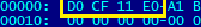

The hexadecimal bytes in the preceding screenshot read as `DOCFILE` Other information such as text string also give hints. The following screenshot shows information indicating that the program was most likely built using Window Forms:

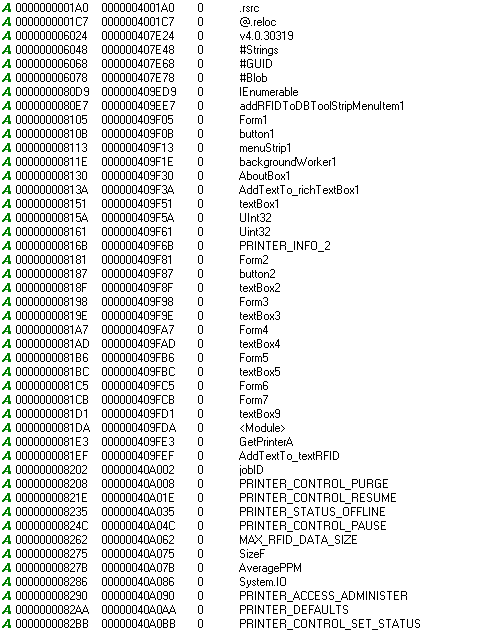

### Disassemblers

Disassemblers are used to view the low-level code of a program. Reading low-level code requires knowledge of assembly language. Analysis done with a disassembler gives information about the execution conditions and system interactions that a program will carry out when executed. However, the highlights when reading low-level code are when the program uses **Application Program Interface** (**API**) functions. The following screenshot shows a code snippet of a program module that uses the `GetJob()` API. This API is used to get information about the printer job, as shown here:

### Debuggers

Disassemblers can show the code tree, but the analyst can verify which branch the code flows to by using a debugger. A debugger does actual execution per line of code. The analyst can trace through codes such as loops, conditional statements, and API execution. Since debuggers are categorized under dynamic analysis and perform a step-wise execution of code, debugging is done in an enclosed environment. Various file types have different disassemblers. In a .NET compiled executable, it is best to instead disassemble the p-code and work out what each operator means.

### Monitoring tools

Monitoring tools are used to monitor system behaviors regarding file, registry, memory, and network. These tools usually tap or hook on APIs or system calls, then log information such as newly created processes, updated files, new registry entries, and incoming SMB packets are generated by reporting tools.

### Decompilers

Decompilers are similar to disassemblers. They are tools that attempt to restore the high-level source code of program unlike disassemblers that attempt to restore the low-level (assembly language) source code of a program.

These tools work hand in hand with each other. The logs generated from monitoring tools can be used to trace the actual code from the disassembled program. The same applies when debugging, where the analyst can see the overview of the low-level code from the disassembly, while being able to predict where to place breakpoints based on the monitoring tools' logs.

Malware handling
----------------

* * *

Readers of this book are required to take precautions when handling malware files. Here are some initial tips that can help us to prevent our host machine from being compromised:

*   Do your analysis in an enclosed environment such as a separate computer or in a virtual machine.
*   If network access is not required, cut it off.
*   If internet access is not required, cut it off.
*   When copying files manually, rename the file to a filename that doesn't execute. For example, rename `myfile.exe` to `myfile.foranalysis`.

Basic analysis lab setup
------------------------

* * *

A typical setup would require a system that can run malware without it being compromised externally. However, there are instances that may require external information from the internet. For starters, we're going to mimic an environment of a home user. Our setup will, as much as possible, use free and open source tools. The following diagram shows an ideal analysis environment setup:

The sandbox environment here is where we do analysis of a file. **`MITM`**, mentioned on the right of the diagram, means the **man in the middle** environment, which is where we monitor incoming and outgoing network activities. The sandbox should be restored to its original state. This means that after every use, we should be able to revert or restore its unmodified state. The easiest way to set this up is to use virtualization technology, since it will then be easy to revert to cloned images. There are many virtualization programs to choose from, including VMware, VirtualBox, Virtual PC, and Bochs. 

It should also be noted that there is software that can detect that it is being run, and doesn't like to be run in a virtualized environment. A physical machine setup may be needed for this case. Disk management software that can store images or re-image disks would be the best solution for us here. These programs include Fog, Clonezilla, DeepFreeze, and HDClone.

### Our setup

In our setup, we will be using VirtualBox, which can be downloaded from[ https://www.virtualbox.org/](https://www.virtualbox.org/). The Windows OS we will be using is Windows 7 32-bit, which can be downloaded from [https://developer.microsoft.com/en-us/microsoft-edge/tools/vms/](https://developer.microsoft.com/en-us/microsoft-edge/tools/vms/). In the following diagram, the system, which has an internet connection, is installed with two virtual machines, a guest sandbox and guest MITM:

1.  Download and install VirtualBox and run it. VirtualBox has installers for both Windows and Linux. Download the Windows 7 32-bit image, as shown here:

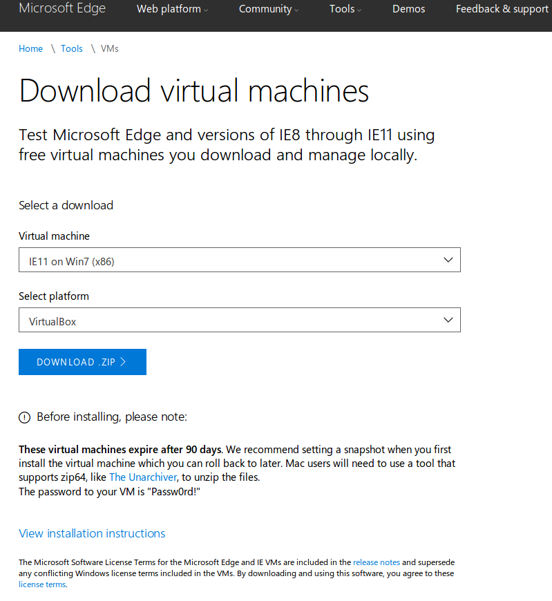

2.  The image downloaded from the Microsoft website is zipped and should be extracted. In VirtualBox, click on **`File|Import Appliance`**. You should be shown a dialog where we can import the Windows 7 32-bit image. 
3.  Simply browse and select the OVA file that was extracted from the ZIP archive, then click on **`Next`**, as shown here:

4.  Before continuing, the settings can be changed. The default RAM is set to 4096 MB. The more RAM allocated and the higher the number of CPU cores set, the better performance will be noticed when running or debugging. However, the more RAM added, the same amount of disk space gets consumed when storing snapshots of the image. This means that if we allocated 1 GB of RAM, creating a snapshot will also consume at least 1GB of disk space.  We set our RAM to 2048 MB, which would be a reasonable amount for us to work on:

5.  Click on **`Import`** and it should start generating the virtual disk image. Once it has completed, we need to create our first snapshot. It is recommended to create a snapshot in a powered-off state, since the amount of disk space consumed is minimal. Look for the **`SnapShots `**tab, then click on **`Take`**. Fill out the **`Snapshot Name`** and **`Snapshot Description`** fields, then click on the **`OK`** button. This quickly creates your first snapshot.

### Note

In a power-on state, the amount of RAM plus the amount of modified disk space in the virtual machine is equal to the total disk space that a snapshot will consume.

6.  Click on **`Start`** to begin running the Windows 7 image. You should end up with the following window. In case it asks for a password, the default password is `Passw0rd!`:

At this point, the network setup is set to NAT. This means that any network resources required by the virtual machine will use the host computer's IP address. The IP address of the virtual machine is taken from the VirtualBox's virtual DHCP service. Remember that any network communication in the virtual machine makes use of the host computer's IP address.

Since we can't prevent a certain malware from sending out information to the web in order to return information back to our virtual machine, it is important to note that some ISPs may monitor common malware behavior. It would be best to review your contract with them and make a call if needed.

Most of our reverse engineering deals with malware and, as of the time of writing, attackers usually target Windows systems. Our setup uses Microsoft Windows 7 32-bit. Feel free to use other versions. We recommend installing the 32-bit version of Microsoft Windows, as it will be easier to track virtual and physical addresses later on during low-level debugging.

Samples
-------

* * *

We will be building our own programs to validate and understand how the low-level code behaves and what it looks like. The following list outlines the software we will be using to build our programs:

*   Dev C++ ([http://www.bloodshed.net/devcpp.htm](http://www.bloodshed.net/devcpp.html))
*   Visual Studio C++ ([https://www.visualstudio.com/downloads/](https://www.visualstudio.com/downloads/))
*   MASM32 ([http://www.masm32.com/](http://www.masm32.com/))

If you are interested in malware, the samples can be obtained from the following sites:

*   [https://github.com/PacktPublishing/Mastering-Reverse-Engineering](https://github.com/PacktPublishing/Mastering-Reverse-Engineering)
*   [https://github.com/ytisf/theZoo](https://github.com/ytisf/theZoo)

Summary
-------

* * *

Reverse engineering has been around for years and has been a useful technique to understand how things work. In the software industry, reverse engineering helps validate and fix code flow and structures. The information from such tasks can improve the security of various aspects of software, network infrastructure, and human awareness. As a core skill requirement for the anti-malware industry, reverse engineering helps create detection and remediation information; the same information that is used to build safeguards for an institution's servers. It is also used by authorities and forensic experts to hunt down syndicates.

There are basic steps that help build reverse engineering information. Once an analyst has approval from the original author to carry out reverse engineering, they can begin with static analysis, dynamic analysis, and then low-level analysis. This is then followed by reporting the overview and details about the software.

When doing analysis, various types of tools are used, including static analysis tools, disassemblers, decompilers, debuggers, and system monitoring tools. When doing reverse engineering on malware, it is best to use these tools in an environment that has limited or no access to the network you use for personal purposes or work. This should prevent your infrastructure from being compromised. Malware should be handled properly, and we listed a couple of ways to prevent accidental double-clicks.

Malware analysis nonetheless requires the internet to get further information on how the malware works and what it does. There may be some legal issues that require you to consult the laws of your country and the policies of your local ISP, to ensure that you are not violating any of them.

The core requirement for the setup of an analysis lab is that the target operating system can be reverted back to its unmodified state.

Malware samples can be obtained from the following link: [https://github.com/PacktPublishing/Mastering-Reverse-Engineering/tree/master/tools](https://github.com/PacktPublishing/Mastering-Reverse-Engineering/tree/master/tools). These samples will be used throughout this book.

Now that we have our basic setup, let's embark on our journey through reverse engineering.

Chapter 2. Identification and Extraction of Hidden Components
-------------------------------------------------------------

Today, the most common use for reverse engineering is in targeting malware. Like any other software, malware has its installation process. The difference is that it does not ask for the user's permission to install. Malware does not even install in the `Program files` folder where other legitimate applications are installed. Rather, it tends to install its malware file in folders that are not commonly entered by the user, making it hidden from being noticed. However, some malware shows up noticed and generates copies of itself in almost all noticeable folders such as the desktop. Its purpose is to get its copies executed by users, be it by accidental double-click or by curiosity. This is what we usually call malware persistence.

Persistence is when malware consistently runs in the background. In this chapter, we will be pointing out general techniques used by malware to become persistent. We will also explain common locations where malware files are stored. Major behaviors of malware and some tools that are capable of identifying how the malware installs itself in the system will also be shown.  Understanding how malware is delivered will definitely help a reverse engineer explain how the attacker was able to compromise the system.

In this chapter we will learn about the following:

*   The basics of the operating system environment
*   Typical malware behavior:
    
    *   Malware delivery
    *   Malware persistence
    *   Malware payload
    
*   Tools used to identify hidden components

Technical requirements
----------------------

* * *

The discussions will use the Windows environment. We will be using the virtual machine setup we created in the previous _chapter_. In addition, you'll need to download and install this software: the SysInternals suite ([https://docs.microsoft.com/en-us/sysinternals/downloads/sysinternals-suite](https://docs.microsoft.com/en-us/sysinternals/downloads/sysinternals-suite)).

The operating system environment
--------------------------------

* * *

Doing reverse engineering requires the analyst to understand where the software being reversed is being run. The major parts that software requires in order to work in an operating system are the memory and the filesystem. In Windows operating systems, besides the memory and the filesystem, Microsoft introduced the registry system, which is actually stored in protected files called registry hives.

### The filesystem

The filesystem is where data is stored directly to the physical disk drive. These filesystems manage how files and directories are stored in the disk. Various disk filesystems have their own variation of efficiently reading and writing data. 

There are different disk filesystems such as `FAT`, `NTFS`, `ex2`, `ex3`, `XFS`, and `APFS`. Common filesystems used by Windows are `FAT32` and `NTFS`. Stored in the filesystem is information about the directory paths and files. It includes the filename, size of the file, date stamps, and permissions.

The following screenshot shows the information stored in the filesystem about `bfsvc.exe`**`:`**

In previous MacOS X versions, file information and data are stored in resource forks. Resource forks are actually deprecated but backward compatibility still exists on recent versions of MacOS. A file has two forks stored in the filesystem, the data fork and the resource fork. The data fork contains unstructured data, while the resource fork contains structured data. The resource fork contains information such as the executable machine code, icons, shape of an alert box, string used in the file, and so forth. For instance, if you wanted to back up a Mac application by simply moving it to a Windows hard drive then moving it back, the Mac application will no longer open. While transferring, only the file gets transferred but the resource fork gets stripped out in the process. Simple copy tools don't respect the forks. Instead, Mac developers developed tools to synchronize files to and from external disks.

### Memory

When a Windows executable file executes, the system allocates a memory space, reads the executable file from the disk, writes it at predefined sections in the allocated memory, then allows the code to execute from there. This block of memory is called a process block and is linked to other process blocks. Basically, every program that executes consumes a memory space as a process.

The following screenshot shows a Windows Task Manager's view of the list of processes:

### The registry system

In Windows, the registry is a common database that contains system-wide configuration and application settings.  Examples of stored information in the registry are as follows:

*   Associated programs that execute specific files:
    
    *   DOCX files are associated with Microsoft Word
    *   PDF files are associated with Adobe Reader
    
*   Associated icons to specific files and folders
*   Software settings:
    
    *   Uninstall configuration
    *   Update sites
    *   Ports used
    *   Product IDs
    
*   User and group profiles
*   Printer setup:
    
    *   Default printer
    *   Driver names
    
*   Designated drivers for specific services

The registry is stored in hive files. The list of hive files is also found in the registry itself, as can be seen in the following screenshot:  

Writing and reading information from the registry requires using Windows registry APIs. The registry can be viewed visually using the Registry Editor. Entries in the right pane of the Registry Editor are the registry keys. On the left pane, the registry values are found under the **`Name`** column, as can be seen in the following screenshot:

Typical malware behavior
------------------------

* * *

Malware is simply defined as malicious software. You'd expect bad things to happen to your system environment once malware has entered. Once typical malware enters the system, it does two basic things: installs itself and does its evil work. With the intent of forcing itself to be installed in the system malware does not need to notify the user at all. Instead, it directly makes changes to the system.  

### Persistence

One of the changes malware makes in the system is to make itself resident.  Malware persistence means that the malware will still be running in background and, as much as possible, all the time. For example, malware gets executed after every boot-up of the system, or malware gets executed at a certain time of the day. The most common way for malware to achieve persistence is to drop a copy of itself in some folder in the system and make an entry in the registry.

The following view of the registry editor shows a registry entry by the `GlobeImposter` ransomware:  

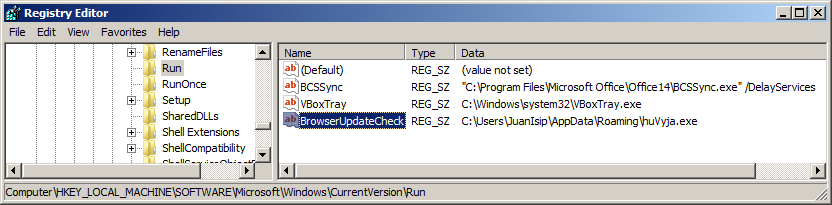

Any entries made under the registry key `HKEY_LOCAL_MACHINE\SOFTWARE\Microsoft\ Windows\CurrentVersion\Run` are expected to run every time Windows starts. In this case, the `GlobeImposter` ransomware's executable file stored in `C:\Users\JuanIsip\AppData\Roaming\huVyja.exe` becomes persistent.   `BrowserUpdateCheck` is the registry value, while the path is the registry data. What matters under this registry key are the paths, regardless of the registry value name.

There are several areas in the registry that can trigger the execution of a malware executable file. 

#### Run keys

Entering a file path in the registry data under these registry keys will trigger execution when Windows starts, as can be seen in the following registry path for the Windows 64-bit versions

*   `HKEY_LOCAL_MACHINE\Software\Microsoft\Windows\CurrentVersion\Run`
*   `HKEY_LOCAL_MACHINE\Software\Microsoft\Windows\CurrentVersion\RunOnce`
*   `HKEY_LOCAL_MACHINE\Software\Microsoft\Windows\CurrentVersion\RunOnceEx`
*   `HKEY_LOCAL_MACHINE\Software\Microsoft\Windows\CurrentVersion\RunServices`
*   `HKEY_LOCAL_MACHINE\Software\Microsoft\Windows\N\RunServicesOnce`
*   `HKEY_LOCAL_MACHINE\Software\Microsoft\Windows\CurrentVersion\Policies\Explorer\Run`
*   `HKEY_LOCAL_MACHINE\SOFTWARE\Wow6432Node\Windows\CurrentVersion\Run`

Programs that are listed under these registry keys will trigger execution when the current user logs in, as can be seen in the following registry path:

*   `HKEY_CURRENT_USER\Software\Microsoft\Windows\CurrentVersion\Run`
*   `HKEY_CURRENT_USER\Software\Microsoft\Windows\CurrentVersion\RunOnce`
*   `HKEY_CURRENT_USER\Software\Microsoft\Windows\CurrentVersion\RunOnceEx`
*   `HKEY_LOCAL_MACHINE\Software\Microsoft\Windows\CurrentVersion\RunServices`
*   `HKEY_LOCAL_MACHINE\Software\Microsoft\Windows\CurrentVersion\RunServicesOnce`
*   `HKEY_CURRENT_USER\Software\Microsoft\Windows NT\CurrentVersion\Windows\Run`

The keys names containing `Once` will have the listed programs that run only once. The malware may still persist if it keeps on placing its own file path under the `RunOnce`, `RunOnceEx` or `RunServicesOnce` keys.

#### Load and Run values

The following registry values, under their respective registry key, will trigger execution when any user logs in:

*   `HKEY_CURRENT_USER\Software\Microsoft\Windows NT\CurrentVersion\Windows`
    
    *   `Load = <file path>`
    *   `Run = <file path>`
    

**BootExecute value**

*   `HKEY_LOCAL_MACHINE\SYSTEM\ControlSetXXX\Control\Session Manager`
    
    *   `XXX` in `ControlSetXXX` is a three digit number usually `ControlSet001`, `ControlSet002`, or `ControlSet003`.
    *   `BootExecute = <file path>`
        
        *   The default value of `BootExecute` is `autocheck autochk *` 
        
    

**Winlogon key**

*   `HKEY_LOCAL_MACHINE\SOFTWARE\Microsoft\Windows NT\CurrentVersion\Winlogon`
    
    *   Activities under this registry key are executed during Windows logon 
    *   `UserInit = <file path>`
        
        *   The default value of `Userinit` is `C:\Windows\system32\userinit.exe`
        
    *   `Notify = <dll file path>`
        
        *   `Notify` is not set by default. It is expected to be a dynamic link library file
        
    *   `Shell = <exe file path>`
        
        *   The default value of `Shell` is `explorer.exe`
        
    
*   `HKEY_CURRENT_USER\SOFTWARE\Microsoft\Windows NT\CurrentVersion\Winlogon`
    
    *   `Shell = <exe file path>`
        
        *   The default value of `Shell` is `` `explorer.exe` ``
        
    

**Policy scripts keys**

*   `HKEY_LOCAL_MACHINE\Software\Microsoft\Windows\CurrentVersion\Group Policy\Scripts\Shutdown\0\N`
    
    *   where `N` is a number starting from `0`. Multiple scripts or executables can be run during the shutdown sequence
    *   `Script = [file path of executable file or script]`
    
*   `HKEY_LOCAL_MACHINE\Software\Microsoft\Windows\CurrentVersion\Group Policy\Scripts\Startup\0\N`
    
    *   This is where `N` is a number starting from `0`. Multiple scripts or executables can be run during the startup sequence.
    *   `Script = [file path of executable file or script]`
    
*   `HKEY_CURRENT_USER\Software\Microsoft\Windows\CurrentVersion\Group Policy\Scripts\Logon\0\N`
    
    *   This is where `N` is a number starting from `0`. Multiple scripts or executables can be run when a user logs off.
    *   `Script = [file path of executable file or script]`
    
*   `HKEY_CURRENT_USER\Software\Microsoft\Windows\CurrentVersion\Group Policy\Scripts\Logoff\0\N`
    
    *   where N is a number starting from 0. Multiple scripts or executables can be run when a user logs off
    *   `Script = [file path of executable file or script]`
    

**AppInit\_DLLs values**

*   `HKEY_LOCAL_MACHINE\SOFTWARE\Microsoft\Windows NT\CurrentVersion\Windows`
    
    *   `AppInit_DLLs = [a list of DLLs]`
        
        *   The list of DLLs are delimited by a comma or space
        
    *   `LoadAppInit_DLLs = [1 or 0]`
        
        *   Here, `1` means enabled, and `0` means disabled
        
    

**Services keys**

*   `HKEY_LOCAL_MACHINE\SYSTEM\CurrentControlSet\Services\[Service Name]`
    
    *   This is where `ServiceName` is the name of the service
    *   `ImagePath = [sys/dll file path]`
    *   Loads a system file (`.sys`) or a library file (`.dll`), which is the driver executable
    *   The service triggers depending on the value of the start:
        
        *   `0`  (`SERVICE_BOOT_START` triggers when OS is being loaded)
        *   `1`  (`SERVICE_SYSTEM_START` triggers when OS is being initialized)
        *   `2` (`SERVICE_AUTO_START` triggers when service manager starts.)
        *   `3`  (`SERVICE_DEMAND_START` triggers when it is manually started)
        *   `4`  (`SERVICE_DISABLED`. The service is disabled from triggering)
        
    

**File associations**

*   `HKEY_CLASSES_ROOT or in HKEY_LOCAL_MACHINE\SOFTWARE\Classes\[File type or extension name]\shell\open\command`
    
    *   The entry in the (`Default`) registry value executes files that are described by \[File type or extension name\].
    *   The following code shows the associated entry for executable files or `.EXE` files:
        
        *   `` `<show image of exefile entry in HKEY_LOCAL_MACHINE\SOFTWARE\Classes\exefile\shell\open\command>` ``
        *   The (`Default`) value contains `"%1" %*`.  `%1` pertains to the executable being run as is, while `%*` pertains to the command-line arguments.  Persistence is implemented by malware by appending its own executable. For example, the `(Default)` value is set to `malware.exe "%1" %*`.  As a result, `malware.exe` runs and uses `%1` (the executable being run) and `%*` as its arguments.  `malware.exe` is then responsible for running `%1` with its `%*`.
        
    

#### Startup values

The startup registry value contains the path to a folder which contains files that are executed after the user has logged in. The default folder location is at `%APPDATA%\Microsoft\Windows\Start Menu\Programs\Startup`.

*   `HKEY_CURRENT_USER\Software\Microsoft\Windows\CurrentVersion\Explorer\Shell Folders`
    
    *   `Startup = [startup folder path]`
    
*   `HKEY_CURRENT_USER\Software\Microsoft\Windows\CurrentVersion\Explorer\User Shell Folders`
    
    *   `Startup = [startup folder path]`
    
*   `HKEY_LOCAL_MACHINE\SOFTWARE\Microsoft\Windows\CurrentVersion\Explorer\User Shell Folders`
    
    *   `Common Startup = [startup folder path]`
    
*   `HKEY_LOCAL_MACHINE\SOFTWARE\Microsoft\Windows\CurrentVersion\Explorer\Shell Folders`
    
    *   `` `Common Startup = [startup folder path]` ``
    

#### The Image File Execution Options key

File paths set in the debugger of the `Image File Execution Options` key is run when the process is to be debugged or is run with the `CreateProcess` API:

*   `HKEY_LOCAL_MACHINE\Software\Microsoft\Windows NT\CurrentVersion\Image File Execution Options\[Process Name]`
    
    *   `Debugger = [executable file]`
    *   `[Process Name]` pertains to the filename of the running executable
    *   This persistence only triggers when there is a need for  `[Process Name]` to invoke a debugger
    

**Browser Helper Objects key**

*   `HKEY_LOCAL_MACHINE\Software\Microsoft\Windows\CurrentVersion\Explorer\Browser Helper Objects\[CLSID]`
    
    *   Having the `CLSID` as a subkey simply means that it is installed and enabled as an Internet Explorer BHO
    *   The `CLSID` is registered under the `HKEY_CLASSES_ROOT\CLSID\[CLSID]\InprocServer32` key
        
        *   The `(Default)` value points to the DLL file associated with the BHO
        
    *   The DLL file is loaded every time Internet Explorer is opened
    

Besides registry entries, an executable can also be triggered by schedule using the task scheduler or `cron` jobs. An executable or a script can be triggered even at certain conditions. Take, for example, the following screenshot of a Windows Task scheduler:

There are many more ways in which malware gets persistence other than those which have been listed previously. These are the challenges that a reverse engineer learns as they encounter new techniques.

### Malware delivery

In the software security industry, the activity of an attacker to spread and compromise a system is called a malware campaign. There are various ways that malware gets into a system. The most common way that these malware executable files are delivered is through an email attachment sent to its target user(s). As communication technology changes, the logistics that these campaigns implement adapt to whatever technology there is. This includes looking for vulnerabilities in the target system and penetrating it with exploits.

#### Email

Malware sent as an email delivery would require the recipient to open the attached file. The email is crafted in such a way that the recipient becomes curious about opening the attachment. These unsolicited emails that are spread to many addresses are called email spam. They usually contain a subject and a message body that uses social engineering to get the recipient's attention and eventually have them execute the malware. An example of this can be seen in the following screenshot:

### Note

Activities that deceive a person or a group of people to do an activity is called**_social engineering_**. With poor security awareness, users may fall into this famous proverbial trap: _curiosity killed the cat_.  

#### Instant messenger

Besides email, there is what we call SPIM or Instant Messaging Spam. This is spam sent to instant messaging such as Facebook, Skype, and Yahoo Messenger applications. This also includes public or private messages spimmed using Twitter, Facebook, and other social networking services. The messages usually contain a link to a compromised site containing malware or spyware. Some services that support file transfers are abused by malware spim. Today, these social networking services have implemented back-end security to mitigate SPIM.  However, at the time of writing, there are still a few incidents of malware spreading through instant messaging. An example of this can be seen in the following screenshot:

Image from John Patrick Lita from `CSPCert.ph`

The previous screenshot is a private message from Facebook's instant messenger containing a ZIP file that actually contains a malware file.

#### The computer network

It is a necessity today that a computer has to be connected to a network so users can access resources from each other. With each computer linked to another whether it is LAN (Local Area Network) or WAN (Wide Area Network), file sharing protocols are also open for attackers to abuse. Malware can attempt to drop copies of itself to file shares. However, the malware depends on the user at the remote end running the malware file from the file share. These kinds of malware are called network worms.

To list down the shared folders in Windows, you can use the `net share` command, as can be seen in the following screenshot:

As an analyst, we can make recommendations on what to do with these shared folders. We can say that these shares either be removed, if not used. We can also have these folders reviewed for the permissions of who can access it and what type of permissions (like read and write permissions) certain users can have. That way, we are helping secure the network from getting infested by network worms.

#### Media storage

Network administrators are very restrictive when it comes to using thumb drives. The primary reason is that external storage devices, such as USB thumb drives, CDs, DVDs, external hard drives, and even smartphones are all media in which malware can store itself. Once a storage device gets mounted to a computer, it serves like a regular drive. Malware can simply drop copies of itself to these storage drives. Similar to network worms, these are worms that depend on the user to run the malware. But with the Windows Autorun feature turned on, malware may execute once the drive is mounted, as can be seen in the following screenshot:

The previous image is the default dialog encountered when inserting a CD drive containing setup software.

The `autorun.inf` file in the root of a drive contains information on which file to automatically execute. This is used by software installers stored in CDs so that, when the disk is inserted, it automatically runs the setup program. This is abused by malware by doing these steps:

1.  Dropping a copy of its malware file in removable drives
2.  Along  with its dropped copy, it generates an `autorun.inf` file that points to the dropped executable file, as can be seen in the following example:

The `autorun.inf` for the VirtualBox setup autoplay dialog shown previously contains the text as shown in the previous screenshot. The`open`property contains the executable to be run.  

#### Exploits and compromised websites

Exploits are also categorized under malware. Exploits are crafted to compromise specific vulnerabilities of software or network services. These are usually in the form of binary data. Exploits take advantage of vulnerability, thereby causing the target software or service to behave in such a manner that the attacker intends it should behave. Usually, the attacker intends to gain control over the target system or simply take it down.

Once an attacker identifies vulnerabilities on its target, an exploit is crafted containing code that would download malware that can give the attacker more access. This concept was used to develop exploit kits. Exploit kits are a set of known vulnerability scanners and known exploits packaged as a toolkit.

The following diagram gives an example:

In a malware campaign, social engineering is used to lure users to visit links that are actually compromised. Usually, the compromised sites were manually hacked and have been injected with a hidden script that redirects to another website. The malicious links are spammed to email messages, instant messaging, and social networking sites. Visiting legitimate sites that are compromised with malicious advertisements also counts as bait. These sites include software or media piracy sites, the dark web, or even pornographic sites. Once the user clicks the link, typically, the site redirects to another compromised site, and to another, until it reaches the exploit kit landing gate page. From the user's internet browser, the exploit kit gate gathers information on the machine, such as software versions, and then determines whether or not the software is known to be vulnerable. It then delivers all exploits applicable to the vulnerable software. The exploits typically contain code that will download and execute malware. As a result, the unaware user gets a compromised system.

#### Software piracy

Hacking tools, pirated software, serial generating tools, and pirated media files are just some of the distributed software where malware or adware may be included. For example, the setup file of the installer of pirated software may be downloading malware and installing it in the background without asking the user for permission.

##### Malware file properties

The initial behavior of common malware is to drop a copy of itself, drop its malware component embedded in it, or download its malware component. It creates the dropped files which are usually found in these folders:

*   The Windows System folder: `C:\Windows\System32`
*   The Windows folder:  `C:\Windows`
*   The user profile folder:   `C:\Users\[username]`
*   The Appdata folder:  `C:\Users\[username]\AppData\Roaming`
*   The recycle bin folder:  `C:\$Recycle.Bin`
*   The desktop folder: `C:\Users\[username]\Desktop`
*   The temporary folder:  `C:\Users\[username]\AppData\Local\Temp`

As part of its social engineering, another cheap technique is to change the icon of a malware file to something that would lure the user to open it, for example, folder icons, Microsoft Office icons, or Adobe PDF icons. It also uses file names that are deceiving, such as the words _INVOICE,__New__Folder_, _Scandal,__Expose,__Pamela,__Confidential,_ and so on. The following screenshot gives examples of actual malware that mimics known documents: 

Notice that highlighting the fake PDF file shows that it is actually an application.

### Payload – the evil within

The attacker develops malware for a purpose. This is typically to cause harm to the target, maybe because of hate, for fun, for monetary or, probably, political reasons. Here are some typical malware payloads that were seen in the wild:

*   Encrypting files for ransom
*   Deleting all files
*   Formatting drives
*   Gaining full access to the system and the network
*   Stealing accounts and passwords
*   Stealing documents, images, and videos
*   Changing specific configuration and settings
*   Turning the computer into a proxy server
*   Installing `cryptocoin` miners
*   Continuously opening websites - ad or porn sites
*   Installing more malware
*   Installing adware

One of the conclusions that a reverse engineer includes in the report is the payload. This determines what malware actually does to the machine other than getting installed.

Tools
-----

* * *

Identifying the registry entry, files dropped, and running processes that are related to the malware requires tools. There are existing tools that we can use to extract these objects. There are two analysis events we should consider: analysis after the malware has been executed and analysis before the malware executes. Since our aim for this chapter is to extract components, we will discuss the tools that can help us find suspected files. Analysis tools that are used after we have extracted our suspected malware will be discussed in further chapters.

When a system has already been compromised, the analyst would need to use tools that can identify suspected files. Each suspected file will be analysed further. To start off, we can identify it based on persistence.

1.  List down all processes and their respective file information
2.  From the list of known registry persistence paths, look for entries containing the file paths
3.  Extract the suspected files

The above steps may require pre-existing tools from Microsoft Windows, such as:

*   The Registry Editor (`regedit`/`regedt32)` to search the registry
*   You can also use the command line for accessing the registry `reg.exe`, as seen in the following screenshot:   
    
    
    
*   Task manager (`taskmgr`) to list down the processes
*   Windows Explorer (`explorer`) or Command prompt (`cmd`) to traverse directories and retrieve the files. 

However, there are also third-party  tools that we can use that can help us list down suspected files. Here are a few we will briefly discuss:

*   Autoruns
*   Process explorer

### Autoruns

The startup list we saw earlier in this chapter, covers registry entries, schedule jobs, and file location. The bottom line is that this tool covers all of those, including other areas we have not discussed, such as Microsoft Office add-ons, codecs, and printer monitors, as can be seen in the following screenshot:

There are 32- and 64-bit versions of the autoruns tool. The screenshot above shows all possible triggers for an executable which was based on the research of the SysInternals' authors Mark Russinovich and Bryce Cogswell. The screenshot also categorizes each autorun entry, shows the description of each entry, and indicates the file path related to the entry.

As for reverse engineers, the identification of suspected files can be determined by having knowledge of what files are common to the startup prior to the system getting compromised. Continuous practice and experience will make the reverse engineer easily identify which are good or suspected executable files.

### The Process explorer

In essence, the `Process` explorer tool is similar to the Task Manager, as demonstrated in the following screenshot:  

The advantage of this tool is that it can show more information about the process itself, such as how it was run, including the parameters used, and even its autostart location, as can be seen in the following example:

In addition, the process explorer has tools to send it VirusTotal identification, shows a list of strings identified from its image and the threads associated with it. From a reverser's point of view, the highly used information here is the command-line usage, and autostart location. VirusTotal is an online service that scans a submitted file or URL using multiple security software, as demonstrated in the following screenshot: 

The results are not conclusive, but it gives the submitter an idea about the file's credibility of being legit software or malware.

Summary
-------

* * *

In the first chapter, we learned about reverse engineering and its importance when analyzing malware. To begin with our reverse engineering adventures, we have to learn the system we are analyzing. We discussed the three main areas in the Windows operating system environment: memory, disk, and the registry.  In this chapter, we aimed to find malware from a compromised Windows system by extracting suspected files. To do that, we listed common startup areas in the system that we can search into. These areas include the registry, task schedules, and startup folder.  

We learned that typical malware behaves by installing itself and runnng code that harms the system. Malware installs itself basically for persistence which results in the malware file triggering most of the time the system is online. We then listed a few behaviors as to why malware was called malicious. This malicious code consisted of anything to do with crime entailing monetary or political gain, such as ransom and backdoor access.

We ended this chapter by listing tools we can use to easily identify the suspected files. We first introduced pre-existing Windows tools such as the Registry editor, Task Manager and the Task Scheduler. We followed these with two more tools from SysInternals: autoruns and Process explorer.  With these tools at hand, we should be able to list down our suspected files. However, as with any other tasks, we will be able to master identification faster with practice and experience.

Further reading
---------------

* * *

*   [https://msdn.microsoft.com/en-us/library/windows/desktop/ms724871(v=vs.85).aspx](https://msdn.microsoft.com/en-us/library/windows/desktop/ms724871(v=vs.85).aspx)
*   [https://medium.com/@johnpaticklita/cryptomalware-spreads-on-facebook-79a299590116](https://medium.com/@johnpaticklita/cryptomalware-spreads-on-facebook-79a299590116)

Chapter 3. The Low-Level Language
---------------------------------

The main piece of knowledge required in advance for any reverse engineer is assembly language. Understanding assembly language is like learning the ABCs of reversing. It may look hard at first, but eventually it will become like a muscle memory. Assembly language is the language that is used to communicate with the machine. The source code of a program can be understood by humans but not by the machine. The source code has to be compiled down to its assembly language code form for the machine to understand it. 

But, as humans, what if the source code is not available? Our only way to understand what a program does is to read its assembly codes. In a way, what we are building here is a way to turn an assembly language code back to the source code. That would be why this is called reversing.

We will provide a brief introduction to assembly language, focusing on the x86 Intel architecture. So, why x86? There are a lot of architectures out there, such as 8080, ARM, MIPS, PowerPC, and SPARC, but we are focusing on Intel x86 as it is the most popular and widely used architecture today.

In this chapter, we will get to learn the basics of assembly language. We will start by reviewing binary numbers, followed by using assembly language instructions to implement binary arithmetic, we will then learn how to compile our own low-level program, and, finally, how to debug a program.

This chapter has been divided into sections. We will learn about the following:

*   Binary numbers, bases, and the ASCII table
*   x86 architecture
*   Assembly language instructions
*   Tools used to edit and compile an assembly-language source code
*   Debugging tools
*   Exceptions and error handling
*   Windows APIs
*   High-level language constructs

We will include instructions to set up and develop your assembly language code. This also comes with exercises that may help to inspire you to develop programs using assembly language.

Technical requirements
----------------------

* * *

It is best, but not required, that the reader has some background knowledge of any programming language. Having a programming background will help the reader to understand assembly language more quickly. There are references given at the end of this chapter that the reader can use for further programming development and research not provided in this book.

Some tools that we will use here include the following:

*   Binary editors, such as HxD Editor or HIEW (Hacker's View)
*   Text editors, such as Notepad++

Binary numbers
--------------

* * *

Computers were designed to electronically process and store data using signals. A signal is like an on/off switch, where both the "on" and "off" positions can be denoted by the numbers "1" and "0" respectively. These two numbers are what we call binary numbers. The next section will discuss how binary numbers are used and how this relates to other number bases.

### Bases

The place value of a digit in a number determines its value at that position. In the standard decimal numbers, the value of a place is ten times the value of the place on its right. The decimal number system is also called base-10, which is composed of digits from 0 to 9.

Let's say that position 1 is at the right-most digit of the whole number, as follows:

Copy

    2018
    Place value at position 1 is 1 multiplied by 8 represents 8.
    Place value at position 2 is 10 multiplied by 1 represents 10.
    Place value at position 3 is 100 multiplied by 0 represents 0.
    Place value at position 4 is 1000 multiplied by 2 represents 2000.

The sum of all represented numbers is the actual value. Following this concept will help us to read or convert into other number bases.

In base-2 numbers, the value of a place is 2 times the value of the place on its right. Base-2 uses only 2 digits, composed of 0 and 1. In this book, we will append a small `b` to denote that the number is of base-2 format. Base-2 numbers are also called binary numbers. Each digit in a binary string is called a bit. Consider the following as an example:

Copy

    11010b
    Place value at position 1 is 1 multiplied by 0 represents 0.
    Place value at position 2 is 2 multiplied by 1 represents 2.
    Place value at position 3 is 4 multiplied by 0 represents 0.
    Place value at position 4 is 8 multiplied by 1 represents 8.
    Place value at position 5 is 16 multiplied by 1 represents 16.
    
    The equivalent decimal value of 11010b is 26.

In base-16 numbers, the value of a place is 16 times the value of the place on its right. It is composed of digits 0 to 9 and letters A to F where A is equivalent to 10, B is 11, C is 12, D is 13, E is 14, and F is 15. We will denote base-16 numbers, also known as hexadecimal numbers, with the letter `h`. In this book, hexadecimal numbers with an odd number of digits will be prefixed with `0` (zero). Hexadecimal numbers can also instead be prefixed with "0x" (zero and a lowercase x). The `0x` is a standard used on various programming languages denoting that the number next to it is of hexadecimal format:

Copy

    BEEFh
    Place value at position 1 is 1 multiplied by 0Fh (15) represents 15.are
    Place value at position 2 is 16 multiplied by 0Eh (14) represents 224.
    Place value at position 3 is 256 multiplied by 0Eh (14) represents 3584.
    Place value at position 4 is 4096 multiplied by 0Bh (11)represents 45056.
    
    The equivalent decimal value of BEEFh is 48879.

### Converting between bases

We have already converted hexadecimal and binary numbers into decimal, or base-10. Converting base-10 into other bases simply requires division of the base being converted into, while taking note of the remainders.

The following is an example for base-2

Copy

    87 to base-2
    
    87 divided by 2 is 43 remainder 1.
    43 divided by 2 is 21 remainder 1.
    21 divided by 2 is 10 remainder 1.
    10 divided by 2 is 5 remainder 0.
    5 divided by 2 is 2 remainder 1.
    2 divided by 2 is 1 remainder 0.
    1 divided by 2 is 0 remainder 1.
    and nothing more to divide since we're down to 0.
    
    base-2 has digits 0 and 1.
    Writing the remainders backward results to 1010111b. 

The following is an example for base-16:

Copy

    34512 to base-16
    
    34512 divided by 16 is 2157 remainder 0.
    2157 divided by 16 is 134 remainder 13 (0Dh)
    134 divided by 16 is 8 remainder 6.
    6 divided by 16 is 0 remainder 6.
    
    base-16 has digits from 0 to 9 and A to F.
    Writing the remainders backward results to 66D0h.

Converting from hexadecimal into binary simply requires knowing how many binary digits there are in a hexadecimal digit. The highest digit for a hexadecimal number is `0Fh` (15) and is equivalent to `1111b`. Take note that there are 4 binary digits in a hexadecimal digit. An example conversion is shown here:

Copy

    ABCDh
     0Ah = 1010b
     0Bh = 1011b
     0Ch = 1100b
     0Dh = 1101b
    
     Just combine the equivalent binary number.
     ABCDh = 1010101111001101b

Split the binary number into four digits each when converting from binary into hexadecimal, as shown here:

Copy

    1010010111010111b
     1010b = 10 (0Ah)
    0101b = 5
     1101b = 13 (0Dh)
     0111b = 7
    
     1010010111010111b = A5D7h
    

So, why the use of base-2 and base-16 in computers, rather than our daily base-10 usage? Well, for base-2, there are two states: an on and an off signal. A state can easily be read and transmitted electronically. Base-16 compresses the representation of the binary equivalent of a decimal number. Take 10 for instance: this number is represented as `1010b` and consumes 4 bits. To maximize the information that can be stored in 4 bits, we can represent numbers from 0 to 15 instead.

A 4-bit value is also called a nibble. It is half of a byte. Bytes can represent alphabets, numbers, and characters. This representation of characters is mapped in the ASCII table. The ASCII table has three sections: control, printable, and extended characters. There are 255 (`FFh`) ASCII characters. Lists of printable characters that can be typed on the keyboard and some of the extended characters with keyboard format can be found at [https://github.com/PacktPublishing/Mastering-Reverse-Engineering/tree/master/ch3](https://github.com/PacktPublishing/Mastering-Reverse-Engineering/tree/master/ch3).

Though not directly visible from the English language keyboard, symbols can still be displayed by using the character's equivalent code.

### Binary arithmetic

Since a byte is the common unit used in computers, let's play with it. We can start with basic arithmetical functions: addition, subtraction, multiplication, and division. The pencil-and-paper method is still a strong method for doing binary math. Binary arithmetic is similar to doing arithmetic in decimal numbers. The difference is that there are only two numbers used, 1 and 0.

Addition is carried out as follows:

Copy

      1b               10101b
    + 1b  +  1111b 
     10b              100100b

An example of subtraction is as follows:

Copy

     10b               1101b
    - 1b - 111b 
      1b                110b

Multiplication is carried out as follows:

Copy

       101b             1b x 1b = 1b
    x   10b             1b x 0b = 0b
       000
      101  
      1010b

Division in binary works as follows:

Copy

       1010b    1000b 
    10b | 10100b                  11b | 11010b
    -10-11
           010                           0010
    -10-000
             00                            10b (remainder)
    -0
              0

### Signed numbers

Binary numbers can be structured as signed or unsigned. For signed numbers or integers, the most significant bit dictates what sign the number is in. This requires a defined size of the binary such as `BYTE`, `WORD`, `DWORD`, and `QWORD`. A `BYTE` has a size of 8 bits. A `WORD` has 16 bits while a DWORD (double `WORD`) has 32 bits. A `QWORD` (quad `WORD`) has 64 bits. Basically, the size doubles as it progresses.

In our example, let's use a `BYTE`. Identifying a positive binary number is easy. In positive numbers, the most significant bit, or 8th bit in a byte, is 0. The rest of the bits from 0 to the 7th bit is the actual value. For a negative binary number, the most significant bit is set to 1. However, the value set from 0 to the 7th bit is then calculated for a two's complement value:

Copy

    01011011b = +91
    11011011b = -37
    10100101b = -91
    00100101b = +37

The "2's complement" of a value is calculated in two steps:

1.  Reverse 1s and 0s, so that 1 becomes 0 and 0 becomes 1, for example, `1010b` becomes `0101b`. This step is called the one's complement.
2.  Add 1 to the result of the previous step, for example, `0101b + 1b = 0110b`.

To write down the binary equivalent of -63, assuming it is a `BYTE`, we only take bits 0 to 7:

1.  Convertinto binary using the previous procedure:

Copy

    63 = 0111111b

2.  Do "1's complement" as follows:

Copy

    0111111b -> 1000000b

3.  Add 1 to the preceding outcome to get the "2's complement" result:

Copy

    1000000b + 1 = 1000001b

4.  Since this is a negative number, set the most significant bit to 1:

Copy

    11000001b = -63

Here's how to write the decimal of a negative binary number:

1.  Take note that the significant bit is 1, and so a negative sign:

Copy

    10111011b

2.  Take the "1's complement," then add 1:

Copy

      01000100b
    +        1b 
      01000101b

3.  Convert the result to decimal, and place the – sign at the beginning, since this is a negative number:

Copy

    - 01000101b = -69

x86
---

* * *

Like any other programming language, assembly language has its own variables, syntax, operations, and functions. Every line of code is processes a small amount of data. In other words, every byte is read or written per line of code.

### Registers

In programming, processing data requires variables. You can simply think of registers as variables in assembly language. However, not all registers are treated as plain variables, but rather, each register has a designated purpose. The registers are categorized as being one of the following:

*   General purpose registers
*   Segment registers
*   Flag registers
*   Instruction pointers

In x86 architecture, each general purpose register has its designated purpose and is stored at `WORD` size, or 16 bits, as follows:

*   Accumulator (AX)
*   Counter (CX)
*   Data (DX)
*   Base (BX)
*   Stack pointer (SP)
*   Base pointer (BP)
*   Source index (SI)
*   Destination index (DI)

For registers AX, BX, CX, and DX, the least and most significant bytes can be accessed by smaller registers. For AX, the lower 8 bits can be read using the AL register, while the upper 8 bits can be read using the AH register, as shown here:

When running code, the system needs to identify where the code is at. The Instruction Pointer (IP) register is the one that contains the memory address where the next assembly instruction to be executed is stored.

System states and logical results of executed code are stored in the **FLAGS register**. Every bit of the FLAGS register has its own purpose, with some of the definitions given in the following table:

**Offset**

**Abbreviation**

**Description**

0

CF

Carry flag. This flag is set when an addition operation requires a bit to be carried. It is also set when a bit needs to be borrowed in a subtraction operation.

1

Reserved

2

PF

Parity flag. This flag indicates if the number of set bits is odd or even from the last instruction operation.

3

Reserved

4

AF

Adjust flag. This is used in Binary-Coded Decimals (BCD). This flag is set when a carry happens from the low to high nibble or when a borrow happens from the high to low nibble of a byte.

6

ZF

Zero flag. This flag is set when the result of the last instruction operation is zero.

7

SF

Sign flag. This flag is set when the result of the last instruction operation is a negative number.

8

TF

Trap flag. This is used when debugging. This flag is set when breakpoints are encountered. Setting the trap flag can cause an exception on every instruction, enabling debugging tools to control step-by-step debugging.

9

IF

Interrupt flag. If this flag is set, the processor responds to interrupts. Interrupts are instances where errors, external events, or exceptions are triggered from hardware or software. 

10

DF

Direction flag. When set, data is read from memory backwards.

11

OF

Overflow flag. It is set if an arithmetic operation results in a value larger than what the register can contain.

12 to 13

IOPL

Input/output privilege level. The IOPL shows the ability of the program to access IO ports.

14

NT

Nested task flag. This controls the chaining of interrupt tasks or processes. If set, then it is linked to the chain.

15

Reserved

16

RF

Resume flag. It temporarily disables debug exceptions so the next instruction being debugged can be interrupted without a debug exception.

17

VM

Virtual mode. Sets the program to run in compatibility with 8086 processors.

18

AC

Alignment check. This flag is set when data written on a memory reference, such as the stack, is a non-word (for 4 byte boundaries) or non-doubleword (for 8 byte boundaries). However, this flag was more useful before the 486-architecture days.

19

VIF

Virtual interrupt flag. Similar to the interrupt flag, but works when in virtual mode.

20

VIP

Virtual interrupt pending flag. Indicates that triggered interrupts are waiting to be processed. Works in Virtual mode.

21

ID

Identification flag. Indicates if the CPUID instruction can be used. The CPUID can determine the type of processor and other processor info.

22

Reserved

23 to 31

Reserved

32 to 63

Reserved

All of these flags have a purpose, but the flags that are mostly monitored and used are the carry, sign, zero, overflow, and parity flags.

All these registers have an "extended" mode for 32-bits. It can accessed with a prefixed "E" (`EAX`, `EBX`, `ECX`, `EDX`, `ESP`, `EIP`, and `EFLAGS`). The same goes with 64-bit mode, which can be accessed with a prefixed "R" (`RAX`, `RBX`, `RCX`, `RDX`, `RSP`, and `RIP`).

The memory is divided into sections such as the code segment, stack segment, data segment, and other sections. The segment registers are used to identify the starting location of these sections, as follows:

*   Stack segment (SS)
*   Code segment (CS)
*   Data segment (DS)
*   Extra segment (ES)
*   F segment (FS)
*   G segment (GS)

When a program loads, the operating system maps the executable file to the memory. The executable file contains information to which data maps respective segments. The code segment contains the executable code. The data segment contains the data bytes, such as constants, strings, and global variables. The stack segment is allocated to contain runtime function variables and other processed data. The extra segment is similar to the data segment, but this space is commonly used to move data between variables. Some 16-bit operating systems, such as DOS, make use of the SS, CS, DS, and ES since there are only 64 kilobytes allocated per segment. However, in modern operating systems (32-bit systems and higher) these four segments are set in the same memory space, while FS and GS point to process and thread information respectively.

### Memory addressing

The start of a piece of data, a series of bytes, stored in the memory can be located using its memory address. Every byte stored in the memory is assigned a memory address that identifies its location. When a program is executed by a user, the executable file is read, then mapped by the system to an allocated memory address. The executable file contains information on how it maps it, so that all executable code is in the code section, all initialized data is in the data section, and uninitialized data is in the BSS section. Code instructions found in the code section are able to access data in the data section using memory addresses, which can be hard-coded. Data can also be a list of addresses pointing to another set of data.

#### Endianness

When reading or writing data to memory, we use the registers or memory to process them as `BYTE`, `WORD`, `DWORD`, or even `QWORD`. Depending on the platform or program, data is read in little-endian or big-endian form.

In little-endian, a chunk of data read into a `DWORD` is reversed. Let's take the following piece of data as an example:

`AA BB CC DD`

When the data on a file or memory looks like this, in little-endian format, it will be read as `DDCCBBAAh` in a `DWORD` value. This endianness is common to Windows applications.

In the big-endian system, the same chunk of data will be read as `AABBCCDDh`. The advantage of using the big-endian form arises when reading streaming data such as file, serial, and network streams.

The advantage of reading in little-endian is that the address you read it from remains fixed, regardless of whether it is read as `BYTE`, `WORD`, or `DWORD`. For example, consider the following:

Copy

    Address       Byte
    0x00000000    AA
    0x00000001    00
    0x00000002    00
    0x00000003    00

In the preceding example, we attempt to read the data from address the `0x00000000` address. When read as `BYTE`, it will be `AAh`. When read as a `WORD`, it will be `AAh`. When read as a `DWORD`, it will be `AAh`.

But when in big endian, when read as a `BYTE`, it will be `AAh`. When read as a `WORD`, it will be `AA00h`. When read as a `DWORD`, it will be `AA000000h`.

There are actually a lot more advantages over the other. Either of these can be used by an application depending on its purpose. In `x86` assembly, the little-endian format is the standard.

Basic instructions
------------------

* * *

Assembly language is made up of direct lines of code that follow this syntax:

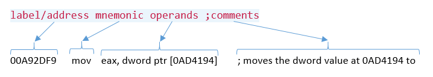

The label is used to define the location of the instruction line. It is generally used during development of an assembly code without prior knowledge of the address where the code will be placed in the memory. Some debuggers are able to support having the user label addresses with a readable name. A mnemonic is a human readable instruction, such as MOV, ADD and SUB. Every mnemonic is represented by a byte number or a couple of bytes called an opcode. The operands are the instruction's arguments. This is normally read as `destination, source` . In the instruction shown above, the `eax` register is the destination and the doubleword data stored at address 0x0AD4194. Finally, we can add comments to every instruction line of our program. 

### Note

In assembly language, code comments are denoted by a semicolon (;)

### Opcode bytes

Every instruction has an equivalent opcode (operation code) byte:

Copy

    Address     Opcode          Instructions
    00A92D7C    B8 00000080     MOV EAX,80000000h
    00A92D81    B9 02000000     MOV ECX,2
    00A92D86    F7E1            MUL ECX

In the preceding code, the MOV instruction is equivalent to the `B8`opcode byte. The `MOV` instruction at the `00A92D81`address is equivalent to `B9`. The difference between the two `MOV` instructions is the register into which the `DWORD` value is moved. There are a total of 5 bytes consumed in `MOV EAX, 80000000h`. It consists of the opcode byte, `B8`, and the operand value, `80000000h`. The same number of bytes is also used in `MOV ECX, 2`, and `MUL ECX` uses 2 bytes.

`MOV EAX, 80000000h` is located at `00A92D7ch`. Add 5 bytes (becomes `00A92D81`) and we get to the address of the next instruction. Viewing the code in the memory would look like this:

Copy

    Address     Bytes
    00A92D7C    B8 00 00 00 80 B9 02 00 00 00 F7 E1

A dump of memory is usually shown in memory dumpers in paragraphs or 16 bytes per line and address aligned to `10h`.

Assembly language instructions can be categorized as follows:

*   Copying and accessing data instructions (for example, MOV, LEA, and MOVB)
*   Arithmetic instructions (for example, ADD, SUB, MUL, and DIV)
*   Binary logic instructions (for example, XOR, NOT, SHR, and ROL)
*   Flow control (for example, JMP, CALL, CMP, and INT)

### Copying data

The MOV  instruction is used to move data. With this, data is moved either to or from a register or a memory address.

`mov eax, 0xaabbccdd`  places the `0xaabbccdd` value in the `eax` register.

`mov eax, edx` places the data value from the`edx` register to the `eax `register.

Let's take the following memory entries as an example:

Copy

    Address   Bytes
    00000060: 60 61 62 63 64 65 66 67 68 69 6A 6B 6C 6D 6E 6F 
    00000070: 70 71 72 73 74 75 76 77 78 79 7A 7B 7C 7D 7E 7F 
    00000080: 80 81 82 83 84 85 86 87 88 89 8A 8B 8C 8D 8E 8F 
    00000090: 90 91 92 93 94 95 96 97 98 99 9A 9B 9C 9D 9E 9F 

Reading data may require using directives to help the assembler. We use `byte ptr`, `word ptr`, or `dword ptr`:

Copy

    ; the following lines reads from memory
    mov al, byte ptr [00000071]       ; al = 71h
    mov cx, word ptr [00000071]       ; cx = 7271h
    mov edx, dword ptr [00000071]     ; edx = 74737271h
    
    ; the following lines writes to memory
    mov eax, 011223344h
    mov byte ptr [00000080], al       ; writes the value in al to address 00000080
    mov word ptr [00000081], ax       ; writes the value in ax to address 00000081
    mov dword ptr [00000083], eax     ; writes the value in eax to address 00000083

The memory will look like this afterward:

Copy

    00000060: 60 61 62 63 64 65 66 67 68 69 6A 6B 6C 6D 6E 6F 
    00000070: 70 71 72 73 74 75 76 77 78 79 7A 7B 7C 7D 7E 7F 
    00000080: 44 44 3344 33 22 11 87 88 89 8A 8B 8C 8D 8E 8F 
    00000090: 90 91 92 93 94 95 96 97 98 99 9A 9B 9C 9D 9E 9F 

#### MOV and LEA

MOV is used to read the value at a given address, while LEA (Load Effective Address) is used to get the address instead:

Copy

    mov eax, dword ptr [00000060]           ; stores 63626160h to eax
    mov eax, dword ptr [00000060]           ; stores 00000060h to eax

So, how is the LEA instruction helpful if you can calculate the address by yourself? Let's take the following C code as an example:

Copy

    struct Test {
        int x;
        int y;
    } test[10];
    
    int value;
    int *p;
    
    // some code here that fills up the test[] array
    
    for (int i=0; i<10, i++) {
        value = test[i].y;
        p = &test[i].y;
    }

The C code starts with defining `test[10]`, an array of `struct Test`, which contains two integers, `x` and `y`. The `for-loop` statement takes the value of `y` and the pointer address of `y` in a `struct test` element. 

Let's say the base of the test array is in EBX, the `for-loop` counter, `i`, is in `ECX`, the integers are `DWORD` values, and so `struct Test` will contain two `DWORD` values. Knowing that a `DWORD` has 4 bytes, the equivalent of `value = test[i].y;` in assembly language will look like `mov edx, [ebx+ecx*8+4]`. Then, the equivalent of `p = &test[i].y;` in assembly language will look like `lea esi, [ebx+ecx*8+4]`. Indeed, without using LEA, the address can still be calculated with arithmetic instructions. However, calculating for the address could be done much more easily using LEA:

Copy

    ; using MUL and ADD
    mov ecx, 1111h
    mov ebx, 2222h
    mov eax, 2              ; eax = 2
    mul ecx                 ; eax = 2222h
    add eax, ebx            ; eax = 4444h
    add eax, 1              ; eax = 4445h
    
    ; using LEA
    mov ecx, 1111h
    mov ebx, 2222h
    lea eax, [ecx*2+ebx+1]  ; eax = 4445h

The preceding code shows that the six lines of code can be optimized to three lines using the LEA instruction.

### Arithmetic operations

x86 instructions are based on the CISC architecture, where arithmetical instructions such as ADD, SUB, MUL, and DIV have a more low-level set of operations behind them. Arithmetical instructions work with the help of a set of flags that indicates certain conditions to be met during the operation.

#### Addition and subtraction

In addition (ADD) and subtraction (SUB), the OF, SF, and CF flags are affected. Let's see some examples of usage as instruction.

`add eax, ecx` adds whatever value is in the `ecx` register to the value in `eax`. The results of adding `eax` and `ecx` goes into `eax`.

Let's take the following example to see how it sets the OF, SF and CF flags:

Copy

    mov ecx, 0x0fffffff
    mov ebx, 0x0fffffff
    add ecx, ebx

The registers are DWORDs. The `ecx`and `ebx` registers were set with `0x0fffffff` (‭268,435,455‬), adding these results to`0x1ffffffe`(‭536,870,910‬). SF was not set, since the result did not touch the most significant bit (MSB). CF was not set because the result is still within the capacity of a `DWORD`. Assuming that both were signed numbers, the result is still within the capacity of a signed `DWORD` number:

Copy

    mov ecx, 0x7fffffff
    mov ebx, 0x7fffffff
    add ecx, ebx

The result in `ecx` becomes `0xfffffffe` (`-2`). `CF = 0`; `SF = 1`; `OF = 1`. Assuming that both `ecx` and `ebx` were unsigned, the CF flag will not be set. Assuming that both `ecx` and `ebx` were signed numbers and both are positive numbers, the `OF` flag will be set. And since the most significant bit becomes `1`, the `SF` flag is also set.

Now, how about adding two negative numbers? Let's consider the following example:

Copy

    mov ecx, 0x80000000
    mov ebx, 0x80000000
    add ecx, ebx

Basically, we're adding both `ecx` and `ebx`, containing `0x80000000` (-2,147,483,648), the result of which becomes zero (0). `CF = 1`; `SF = 0`; `OF = 1`. The SF flag was not set since the `MSB` of the result is 0. Adding both MSB of ecx and ebx will definitely exceed the capacity of a `DWORD` value. At the signed number perspective, the OF flag is also set, since adding both negative values exceeds the signed `DWORD` capacity.

Let's try the borrow concept in this next example:

Copy

    mov ecx, 0x7fffffff
    mov edx, 0x80000000
    sub ecx, edx

What happens here is that we are subtracting `0x80000000` (-2,147,483,648) from `0x7fffffff` (‭2,147,483,647‬). In fact, what we are expecting is the sum of 2,147,483,648 and 2,147,483,647. The result in `ecx` becomes `0xffffffff` (-1). CF = 1; SF = 1; OF = 1. Remember that we are doing a subtraction operation, thereby causing CF to be set, due to borrowing. The same goes for the OF flag.

#### Increment and decrement instructions

The INC instruction simply adds 1, while DEC subtracts 1. The following code results in `eax` becoming zero (0):

Copy

    mov eax, 0xffffffff
    inc eax

The following code results in `eax` becoming `0xffffffff`:

Copy

    mov eax, 0
    dec eax

#### Multiplication and division instructions

MUL is used for multiplication and DIV for division. In multiplication, we expect that multiplying values would exceed the capacity of the register value. Hence the product is stored in AX, `DX:AX` or `EDX:EAX` (long or `QWORD`):

Copy

    mov eax, 0x80000000
    mov ecx, 2
    mul ecx

The product stored in eax is zero (0), and `edx` now contains `0x00000001`. `SF =0`; `CF = 1`; and `OF = 1`.

For division, the dividend is placed in `AX`, `DX:AX`, or `EDX:EAX`, and after the division operation, the quotient is placed in `AL`, `AX`, or `EAX`. The remainder is stored in `AH`, `DX`, or `EDX`.

#### Other signed operations

**NEG**

This operation does a two's complement.

Consider the following as an example: `NEG EAX` or `NEG dword ptr [00403000]`.

If `EAX` were `01h`, it becomes `FFFFFFFFh` (-1).

**MOVSX**

This moves a `BYTE` to WORD or WORD to `DWORD`, including the sign. It is a more flexible instruction than CBW, CWDE, CWD, since it accommodates operands.

Consider the following as an example: `MOVSX EAX, BX`.

If BX were `FFFFh` (-1) and the sign flag is set, EAX will be `FFFFFFFFh` (-1).

**CBW**

Similar to MOVSX, it converts a `BYTE` into `WORD`, including the sign. The affected register is AL and AX. This is an instruction without any operands and is similar to MOVSX.  The effect turns the byte AL extend to its word counterpart, AX.   Such conversion is dentoed with a "->" sign.  For example,  `AL -> AX` means we are extending the 8-bit number to a 16-bit without compromising the stored value.

If AL were `FFh` (-1), AX will be `FFFFh` (-1).

**CWDE**

This is similar to CBW, but converts a `WORD` into `DWORD`. It affects `AX->EAX`.

**CWD**

This is similar to CBW, but converts a `WORD` into `DWORD`. It affects `AX-> DX:AX`.

**IMUL/IDIV**

This performs MUL and DIV, but accepts operands from other registers or memory.

### Bitwise algebra

Boolean algebra or bitwise operations are necessary in low-level programming since it can perform simple calculations by changing the bits of a number. It is commonly used in cryptography's obfuscation and decoding.

**NOT**

This operation reverses the bits.

Consider the following as an example:`NOT AL`

If AL equals `1010101b` (`55h`), it becomes `10101010b` (`AAh`).

**AND**

This operation sets `bit` to `1` if both are `1`s, otherwise it sets `bit` to `0`.

Consider the following as an example:`AND AL, AH`

If AL equals `10111010b` (`BAh`) and AH equals `11101101b` (`EDh`), AL becomes `10101000b` (`A8h`).

**OR**

This operation sets `bit` to `0` if both are `0`s, else it sets `bit` to `1`.

Consider the following as an example: `OR AL, AH`

If AL equals `10111010b` (`BAh`) and AH equals `11101100b` (`ECh`), AL becomes `11111110b` (`FEh`).

**XOR**

This operation sets bit to `0` if both bits are equal, else it sets bit to `1`.

Consider the following as an example: `XOR EAX, EAX`

XOR-ing the same value will become `0`. Thus `EAX` becomes `0`:

`XOR AH, AL`

If AH were `100010b` (`22h`) and AL were `1101011b` (`6Bh`), AH becomes `1001001b` (`49h`).

**SHL/SAL**

This operation shifts bits to the left.

Consider the following as an example: `SHL AL, 3`

If `AL` were `11011101b` (`DDh`), shifting it to the left by `3` makes AL equal to `11101000b` (`E8h`).

**SHR/SAR**

This operation shifts bits to the right.

Consider the following as an example: `SHR AL, 3`

If `AL` were `11011101b` (`DDh`), shifting it to the right by `3` makes AL equal to `011011b` (`1Bh`).

**ROL**

This operation rotates bits to the left.

Consider the following as an example: `ROL AL, 3`

if `AL` were `11011101b` (`DDh`), rotating it to the left by `3` makes AL equal to `11101110b` (`EEh`).

**ROR**

This operation rotates bits to the right.

Consider the following as an example: `ROR AL, 3`

If `AL` were `11011101b` (`DDh`), rotating it to the right by `3` makes AL equal to `10111011b` (`BBh`).

### Control flow

The beauty of a program is that we can carry out a number of different behaviors based on condition and state. For example, we can make a certain task repeat until a counter reaches a defined maximum. In C programming, the program's flow is controlled by instructions such as the `if-then-else` and `for-loop` statements. The following are common instructions used in assembly language, in conjunction with program control flow. The affected register in this is the index pointer IP/EIP, which holds the current address where the next instruction to execute is located.

Copy

    JMP

Short for jump, this means that the operand is an address that it will go to. It sets the EIP to the next instruction line. There are two main variations for the address: direct and indirect.

A `JMP` using a direct address would literally jump to the given address. Consider as an example: `JMP  00401000`. This will set the `EIP` to `00401000h`.

A `JMP` using an indirect address would jump to an address that can only be known when the jump is executed. The address has to be retrieved or calculated somehow prior to the `JMP` instruction. Here are some examples:

Copy

    jmp   eax
    jmp   dword ptr [00403000]
    jmp   dword ptr [eax+edx]
    jmp   dowrd ptr [eax]
    jmp   dword ptr [ebx*4+eax]

**CALL and RET**

Similar to `JMP`, this goes to the address stated in the operand, but stores the address of the next instruction to the stack after the CALL instruction. The address is stored in the stack and will be used by the `RET` instruction later to point `EIP` back to it. For example, consider the following:

Copy

    Address            Instruction
    00401000           CALL 00401100
    00401005           MOV ECX, EAX
    00401007
    ...
    00401100           MOV EAX, F00BF00B
    00401105           RET

When the CALL happens at the address `00401000`, the top of the stack will contain the value `00401005h`, which will be the return address. The code passes it to the instruction at the address `00401100`, where `EAX` is set to `F00bF00Bh`. Then the `RET` instruction retrieves the return address from the top of the stack and sets the EIP.  A subroutine or procedure is the term used for the lines of instructions from the call.

The `RET` instruction can optionally have an operand. The operand is the number of stack `DWORDs` it will release before retrieving the return address. This is useful when the stack is used within the subroutine as it serves as a cleanup of the used stack.

**Conditional jumps**

These are jumps that depend on the flags and the counter register:

**Instruction**

**Flags**

**Description**

`JZ/JE`

ZF = 1

Jump if zero/Jump if equal

`JNZ/JNE`

ZF = 0

Jump if not zero/Jump if not equal

`JS`

SF = 1

Jump if sign

`JNS`

SF = 0

Jump if not sign

`JC/JB/JNAE`

CF = 1

Jump if carry/Jump if below/Jump if not above or equal

`JNC/JNB/JAE`

CF = 0

Jump if not carry/jump if not below/Jump if above or equal

`JO`

OF = 1

Jump if overflow

`JNO`

OF = 0

Jump if not overflow

`JA/JNBE`

CF = 0 and ZF = 0

Jump if above/Jump if not below or equal

`JNA/JBE`

CF = 1 or ZF = 1

Jump if not above/Jump if below or equal

`JG/JNLE`

ZF = 0 and SF = OF

Jump if greater/Jump if not less or equal

`JNG/JLE`

ZF = 1 or SF != OF

Jump if not greater/Jump if less or equal

`JL/JNGE`

SF != OF

Jump if less/Jump if not greater or equal

`JNL/JGE`

SF = OF

Jump if not less/Jump if greater or equal

`JP/JPE`

PF = 1

Jump if parity/Jump if parity is even

`JNP/JPO`

PF = 0

Jump if not parity/Jump if parity is odd

`JCXZ`

CX = 0

Jump if CX is zero.

`JECXZ`

ECX = 0

Jump if ECX is zero.

`LOOP`

ECX > 0

Jump if ECX is not zero. Decrements ECX.

`LOOPE`

ECX > 0 and ZF = 1

Jump if ECX is not zero and zero flag is set. Decrements ECX.

`LOOPNE`

ECX > 0 and ZF = 0

Jump if ECX is not zero and zero flag is not set. Decrements ECX.

**Flagging instructions**

Besides the arithmetic, bit-wise operations, interrupts, and return values from functions, these instructions are also able to set flags.

**CMP** performs a SUB instruction on the first and second operands, but does not modify the registers or the immediate value. It only affects the flags.

**TEST** performs an AND instruction on the first and second operands, but does not modify the registers or the immediate value. It only affects the flags.

### Stack manipulation

The stack is a memory space where data is temporarily stored. Adding and removing data in the stack is in a first-in-last-out method. Subroutines compiled from programs in C initially allocate space in the stack, called a stack frame, for its uninitialized variables. The address of the top of the stack is stored in the ESP register:

The stack is controlled by two common instructions: `PUSH` and `POP`.

**PUSH** decreases the top-of-stack address by a `DWORD` size, for a 32-bit address space, then stores the value from its operand.

Consider the following as an example: `PUSH 1`

If the top of the stack, stored in ESP, is at address `002FFFFCh`, then the ESP becomes `002FFFF8h` and stores `1` at the new ESP address.

**POP** retrieves the value from the top of the stack (ESP) then stores it to the register or memory space indicated in the operand. Then ESP is increased by a `DWORD` size. 

Consider the following as an example: `POP EAX`

If the address of the top of the stack, stored in ESP, is at address `002FFFF8h`, and the stored `DWORD` value at the top of the stack is `0xDEADBEEF`, then `0xDEADBEEF` will be stored in `EAX`, while ESP becomes `002FFFFCh`.

**PUSHA/PUSHAD** both push all the general purpose registers to the stack in this order (for 32-bit builds): `EAX`, `ECX`, `EDX`, `EBX`, `EBP`, `ESP`, `EBP`, `ESI`, and `EDI`. `PUSHA` is intended for 16-bit operands, while `PUSHAD` is for 32-bit operands. However, both may be synonymous to each other, adapting to the current operand size.

**POPA/POPAD** both pop all the general purpose registers from the stack and retrieved in a reverse order as stored by `PUSHA`/`PUSHAD`.

**PUSHF** pushes the `EFLAGS` to stack.

**POPF** pops the `EFLAGS` from stack.

**ENTER** is commonly used at the start of a subroutine. It is used to create a stack frame for the subroutine. Internally, `ENTER 8,0` may roughly be equivalent to the following:

Copy

    push ebp                      ; save the current value of ebp
    mov ebp, esp                  ; stores current stack to ebp
    add esp, 8                    ; create a stack frame with a size of 8 bytes

`LEAVE`is used to reverse what the `ENTER` instruction did eventually destroying the stack frame created.

Tools – builder and debugger
----------------------------

* * *

Before we proceed with more instructions, it would be best to try actually programming with assembly language. The tools we will need are a text editor, the assembly code builder, and the debugger.

### Popular assemblers

All programming languages need to be built to become an executable on the system platform that the program was built for. Unless you want to enter each opcode byte in a binary file, developers have made tools to convert that source code to an executable that contains code that the machine can understand. Let's take a look at some of the most popular assembly language builders today.

#### MASM

Also known as Microsoft Macro Assembler, MASM has been around for more than 30 years. It is maintained by Microsoft and is part of the Visual Studio product. It was developed for compiling x86 source code to executable code. 

Compiling takes two steps: compiling the source into an object file, then linking all necessary modules required by the object file into a single executable.

The MASM package comes along with a text editor that has the menu containing the compiler and linker to build the source as an executable. This comes very handy as there is no need to go to the command line to run the compiler and linker to build the executable. A simple "`Console Build All`" command on the following source generates an executable that can be run in the command terminal:

MASM can be downloaded from [http://www.masm32.com/](http://www.masm32.com/).

#### NASM

**NASM** is the abbreviation of **Netwide Assembler**. NASM is very similar to MASM with slight differences between its syntax, directives, and variable declaration. A great thing about NASM is that sectioning of code and data is easily identified:

Both MASM and NASM also require compiling and linking to build the executable:

However, unlike MASM, the installer package does not have its own editor. NASM is very popular in the Linux community due to its development as opensource software. The package contains only the compiler for the object file; you'll have to download a GCC  compiler to generate the executable.

The official website for downloading NASM is at [https://www.nasm.us/](https://www.nasm.us/). For Windows, MinGW ([http://www.mingw.org/](http://www.mingw.org/)) can be used to generate the executable.

#### FASM

FASM, or Flat Assembler, is similar MASM and NASM. Like MASM, it has its own source editor. Like NASM, the sections are easily identifiable and configured, and the software comes in flavors for both Windows and Linux:

FASM can be downloaded from [http://flatassembler.net/](http://flatassembler.net/).

In our assembly language programming, we will use FASM, since we can use its editor in both Windows and Linux.

### x86 Debuggers

Debuggers are program developers' tools for tracing through their code.  These tools are used to validate that the program  follows the expected behavior.  With a debugger, we can trace our code line per line.  We get to see every instruction in action as it make changes to the registers and data stored in the memory.  In reversing, debuggers are used to analyze programs at its low-level. With what we learned about assembly language, the target compiled program, and a debugger, we are able to do reverse engineering.   

Besides the tools introduced in this book,  there are a lot of tools available in the internet that may have more or less features.  The point is that reverse engineering rely on the tools and we need to keep ourselves updated with the latest tool. Feel free to download other tools that you want to explore and see which one makes your reversing feel more comfortable. 

#### WinDbg

Developed by Microsoft to perform debugging on Microsoft Windows, `WinDbg` is a powerful tool that can debug in user and kernel mode. It can load memory dumps and crash dumps caused by errors flagged by Windows itself. In kernel mode, it can be used to remotely debug a device driver or a Windows operating system. It can load symbol files linked to the program that aid the developer or analyst in identifying the proper library function format and other information.

`WinDbg` has a graphical user interface, and by default, shows a command box where you can type in and enter commands. You can add a set of information windows and dock them. It can show the disassembly, registers and flags, the stack (using the memory dump window), and a memory dump of whichever address entered:

`Windbg` can be downloaded from [https://docs.microsoft.com/en-us/windows-hardware/drivers/debugger/.](https://docs.microsoft.com/en-us/windows-hardware/drivers/debugger/.)

#### Ollydebug

This is the most popular debugger on the x86 32-bit Windows platform due to its lightweight package file size. Its default interface shows the important information needed by a reverse engineer: a disassembly view where tracing happens; registers and flags panes; and the stack and memory views.

OllyDebug can be downloaded from [http://www.ollydbg.de/](http://www.ollydbg.de/).

#### x64dbg

This debugger is most recommended as the developers keep this up-to-date, working with the community. It also supports both 64- and 32-bit Windows platforms with a lot of useful plugins available. It has a similar interface as Ollydebug.

`x64dbg` can be downloaded from [https://x64dbg.com/](https://x64dbg.com/).

Hello World
-----------

* * *

We are going to use `FASM` for building our first assembly language program. And we will debug the executable using `x64dbg`.

### Installation of FASM

Using our Windows setup, download FASM from [http://flatassembler.net/](http://flatassembler.net/), [then extract FASM into a folder of your choice:](http://flatassembler.net/)

Run `FASMW.EXE` to bring up the `FASM` GUI.

### It works!

In your text editor, write down the following code, or you can simply do a Git clone of the data at [https://github.com/PacktPublishing/Mastering-Reverse-Engineering/blob/master/ch3/fasmhello.asm](https://github.com/PacktPublishing/Mastering-Reverse-Engineering/blob/master/ch3/fasmhello.asm).

Copy

    format PE CONSOLE
    entry start
    
    include '%include%\win32a.inc' 
    
    section '.data' data readable writeable 
      message db 'Hello World!',0
      msgformat db '%s',0
    
    section '.code' code readable executable 
      start:
        push message
        push msgformat
        call [printf]
        push 0
        call [ExitProcess]
    
    section '.idata' import data readable writeable 
      library kernel32, 'kernel32.dll', \
              msvcrt, 'msvcrt.dll'
      import kernel32, ExitProcess, 'ExitProcess'
      import msvcrt, printf, 'printf'

Save it by clicking on **`File`**\->**`Save as`**..., then click on **`Run`**\->**`Compile`**:

The executable file will be located where the source was saved:

If "`Hello World!`" did not show up, one thing to note is that this is a console program. You'll have to open up a command terminal and run the executable from there:

### Dealing with common errors when building

**Write Failed Error** – This means that the builder or compiler is not able to write to the output file. It is possible that the executable file it was going to build to is still running. Try looking for the program that was run previously and terminate it. You can also terminate it from the process list or Task Manager.

**Unexpected Characters** – Check for the syntax at the indicated line. Sometimes the included files also need to be updated because of changing syntax on recent versions of the builder.

**Invalid argument** – Check for the syntax at the indicated line. There might be missing parameters of a definition or a declaration.

**Illegal instruction** – Check for the syntax at the indicated line. If you are sure that the instruction is valid, it might be that the builder version doesn't match where the instruction was valid. While updating the builder to the most recent version, also update the source to comply with the recent version.

### Dissecting the program 

Now that we have built our program and got it working, let's discuss what the program contains and is intended for. 

A program is mainly structured with a code section and a data section. The code section, as its name states, is where program codes are placed. On the other hand, the data section is where the data, such as text strings, used by the program code is located. There are requirements before a program can be compiled. These requirements define how the program will be built. For example, we can tell the compiler to build this program as a Windows executable, instead of a Linux executable. We can also tell the compiler which line in the code should the program start running. An example of a program structure is given here:

We can also define the external library functions that the program will be using. This list is described under a separate sections called the Import section. There are various sections that can be supported by a compiler. An example of these extended sections include the resource section, which contains data such as icons and images.

With the a basic picture of a what a program is structured, let see how our program was written. The first line, `format PE CONSOLE`, indicates that the program will be compiled as a Windows PE executable file and built to run on the console, better known in Windows as Command Prompt.

The next line, `entry start`, means that the program will start running code located at the `start` label. The name of the label can be changed as desired by the programmer. The next line, `include '%include%\win32a.inc'`, will add declarations from the FASM library file `win32a.inc`. The declared functions expected are for calling the `printf` and `ExitProcess` API functions discussed in the `idata` section.

There are three sections built in this program: the `data`, `code`, and `idata` sections. The section names here are labeled as `.data`, `.code`, and `.idata`. The permissions for each section are also indicated as either `readable`, `writeable`, and `executable`. The `data` section is where integers and text strings are placed and listed using the define byte (`db`) instruction. The `code` section is where lines of instruction code are executed. The `idata` section is where imported API functions are declared.

On the next line, we see that the data section is defined as a `writeable` section:

Copy

    section '.data' data readable writeable

The program's `.data` section contains two constant variables, `message` and `msgformat`. Both text strings are `ASCIIZ` (`ASCII-Zero`) strings, which means that they are terminated with a zero (0) byte. These variables are defined with the `db` instruction:

Copy

     message db 'Hello World!',0
     msgformat db '%s',0

The next line defines the code section. It is defined with read and execute permissions:

Copy

    section '.code' code readable executable

It is in the `.code` section where the `start:` label is and where our code is. Label names are prefixed with a colon character.

In C programming, `printf` is a function commonly used to print out messages to the console using the C syntax, as follows:

`int printf ( const char * format, ... );`

The first parameter is the message containing format specifiers. The second parameter contains the actual data that fills up the format specifiers. In assembly language perspective, the `printf` function is an API function that is in the `msvcrt` library. An API function is set up by placing the arguments in the memory stack space before calling a function. If your program is built in C, a function that requires 3 parameters (for example, `myfunction(arg1, arg2, arg3)`) will have the following as an equivalent in assembly language:

Copy

    push 
    push 
    push 
    call myfunction

For a 32-bit address space, the `push` instruction is used to write a `DWORD` (32 bits) of data on the top of the stack. The address of the top of the stack is stored in the ESP register. When a `push` instruction is executed, the ESP decreases by 4. If the argument is a text string or a data buffer, the address is push-ed to the stack. If the argument is a number value, the value is directly push-ed to the stack.

Following the same API calling structure, with two arguments, our program called `printf` in this manner:

Copy

     push message
     push msgformat
     call [printf]

In the data section, the addresses, labeled as `message` and `msgformat`, are pushed to the stack as a setup before calling the `printf` function. Addresses are usually placed in square brackets, `[]`. As discussed previously, the value at the address is used instead. The `printf` is actually a label that is the local address in the program declared in the `.idata` section. `[printf]` then means that we are using the address of the `printf` API function from the `msvcrt` library. Thus, `call [printf]` will execute the `printf` function from the `msvcrt` library.

The same goes for `ExitProcess`. `ExitProcess` is a `kernel32` function that terminates the running process. It requires a single parameter, which is the exit code. An exit code of 0 means that the program will terminate without any errors:

Copy

     push 0 
     call [ExitProcess]

In C syntax, this code is equivalent to `ExitProcess(0)`, which terminates the program with a success result defined with zero.

The program's `.idata` section contains external functions and is set with read and write permissions:

Copy

    section '.idata' import data readable writeable

In the following code snippet, there are two portions. The first part indicates which library files the functions are located in. The `library` command is used to set the libraries required, and uses the syntax `library <library name>, <library file>`. A backslash, `\`, is placed to indicate that the next line is a continuation of the current line:

Copy

     library kernel32, 'kernel32.dll', \
               msvcrt, 'msvcrt.dll'

Once the libraries are declared, specific API functions are indicated using the `import` command. The syntax is `import <library name>, <function name>, <function name in library file>`. Two external API functions are imported here, _kernel32_'s _ExitProcess_ and _msvcrt_'s _printf:_

Copy

     import kernel32, ExitProcess, 'ExitProcess'
     import msvcrt, printf, 'printf'

A annotated version of the program can be found at [https://github.com/PacktPublishing/Mastering-Reverse-Engineering/blob/master/ch3/FASM%20commented.txt](https://github.com/PacktPublishing/Mastering-Reverse-Engineering/blob/master/ch3/FASM%20commented.txt)

The library of API functions can be found in the MSDN library ([https://msdn.microsoft.com/en-us/library](https://msdn.microsoft.com/en-us/library)), which also has an offline version packaged in the Visual Studio installer. It contains detailed information about what the API function is for and how to use it. The online version looks like the following:

After Hello
-----------

* * *

We encountered an external call to the `printf` and `ExitProcess` API functions. These specific functions were developed for Windows as a means of communication between the user-mode and the kernel-mode. Generally, for most operating systems, the kernel is responsible for literally displaying the output on the monitor, writing files to the disk, reading keyboard strokes, transmitting data to USB ports, sending data to the printer, transmitting data to the network wire, and so forth. In essence, everything that has something to do with hardware has to go through the kernel. Our program, however, is in the user-mode, and we use the APIs to tell the kernel to do stuff for us.

### Calling APIs

Calling APIs within our program just requires us to define the library file where the API function is, and the API name itself. As we did with our Hello World program, we import the API function by setting it up in the import section:

Copy

    section '.idata' import data readable writeable     ; import section has read and write permissions
      library kernel32, 'kernel32.dll', \               ; functions came from kernel32 and msvcrt dlls
              msvcrt, 'msvcrt.dll'
      import kernel32, ExitProcess, 'ExitProcess'       ; program will use ExitProcess and printf functions
      import msvcrt, printf, 'printf'

And then we call the APIs with a CALL instruction, as follows:

Copy

        call [printf]
        call [ExitProcess]

#### Common Windows API libraries

**KERNEL32** contains base functions of Windows that are responsible for file I/O operations and memory management, including processes and threads management. Some functions are helpers for calling more native APIs in the NTDLL library.

**USER32** contains functions that deal with the display and graphical interface, such as program windows, menu, and icons. It also contains functions that controls window messages.

**ADVAPI32** contains functions that has to do with the Windows registry.

**MSVCRT** contains standard C library functions from Microsoft Visual C++ runtime, such as printf, scanf, malloc, strlen, fopen, and getch.

**WS2\_32**, **WININET**, **URLMON**, and **NETAPI32** are libraries that contain functions that have to do with networking and internet communication.

#### Short list of common API functions

The API functions can be categorized based on their purposes. A complete list can be found at the MSDN Library, but the most common ones are listed here:

**Purpose**

**API functions**

**Console output**

`KERNEL32!GetStdHandle, MSVCRT!printf`

**File handling**

`KERNEL32!ReadFile, KERNEL32!WriteFile, KERNEL32!CreateFile`

**Memory management**

`KERNEL32!VirtualAlloc, KERNEL32!VirtualProtect, MSVCRT!malloc`

**Process and threads**

`KERNEL32!ExitProcess, KERNEL32!CreateProcess, KERNEL32!CreateThread, SHELL32!ShellExecute`

**Window management**

`USER32!MessageBoxA, USER32!CreateWindowExA, `

`USER32!RegisterWindowMessageW`

**Strings**

`MSVCRT!strlen, MSVCRT!printf`

**Network communication**

`WININET!InternetAttemptConnect, WS2_32!socket, WS2_32!connect, URLMON!URLDownloadToFile`

**Cryptography**

`CryptDecrypt, CryptEncrypt`

**Registry**

`RegDeleteKey, RegCreateKey, RegQueryValueExW, RegSetValueExW`

### Debugging

At certain points, our program may produce unpredictable errors or invalid output. In that case, we need to trace what went wrong, by debugging each line of code. But before that, there are some general debug commands we need to know.

Single-stepping a program means debugging per line of code. There are two modes to single step: step into and step over. During debugging, when the line being debugged is a CALL instruction, single-step debugging continues in the subroutine when a **step into** mode is used. The **step over** mode, however doesn't enter the subroutine, but rather lets the subroutine finish up running and the single step continues on the line after the CALL instruction. See the following comparison:

Step into

Step over

Copy

        CALL 00401000 ; <-- STEP INTO SUBROUTINE
        MOV  EBX, EAX
        ...
    00401000:  
        MOV EAX, 37173 ; <- DEBUG POINTER GOES HERE
        RET
    

Copy

        CALL 00401000 ; <-- STEP OVER SUBROUTINE
        MOV  EBX, EAX ; <- DEBUG POINTER GOES HERE
        ...
    00401000:  
        MOV EAX, 37173
        RET
    
    

A **run** or **continue** makes the debugger execute instructions continuously until the program terminates, encounters an error, or until it encounters a manually set breakpoint.

Placing a **breakpoint** is a way to enable to the debugger to interrupt a code that was set to freely run. For example, if I placed a breakpoint at address 0040200A in the following code, and let the debugger automatically run every instruction starting from 00402000, the debugger stops at address 0040200A and leaves the user to continue doing single steps or run:

Copy

    00402000  push 0040100D
    00402005  push 0040100D
    0040200A  call dword ptr [printf]  ; <-- breakpoint set here
    00402010  push 0
    00402012  call dword ptr [ExitProcess]

Let's debug our Hello World program.

Download x64dbg from [https://x64dbg.com/](https://x64dbg.com/).

It is a ZIP archive that you will have to extract. And once extracted, open the x96dbg.exe from the release folder. This will show the launcher dialog where you get to select x32dbg (for 32-bit debugging) and x64dbg (for 64-bit debugging) as your debugger:

The Hello World program we developed is a 32-bit program, thus, select x32dbg. Then click on File->Open, then browse and open the helloworld.exe program. Opening it will show you where the EIP is at in the disassembly window as follows:

At the bottom of the window, it says: "**`System breakpoint reached!`**" EIP is at a high-memory region address and the window title also indicates "Module: ntdll.dll - Thread: Main Thread." All of this suggests that we are not yet in the helloworld program, but rather still in the ntdll.dll code that loads up the helloworld program to memory, initializes it and then starts to run it. If you go to Options->Preferences, and in the Events table of the Settings window, by default, the System Breakpoint\* is checked. This causes the debugger to pause in the ntdll.dll before we even reach our helloworld code. Uncheck the System Breakpoint\*, click on Save, then exit the debugger, as shown here:

Now that we have removed the System Breakpoint, repeat loading the helloworld program. The EIP should now be in the helloworld code:

Click on the Debug menu. You should see that there are keyboard keys assigned to Step into, Step over, Run and more debugging options:

The stack frame window is located at the lower right pane. Take note of the information there, then press `_F7_` or _F8_ to do a single step. The `PUSH helloworld.401000` instruction just placed the address of "`Hello World`" text string at the top of the stack. At the upper right pane where the registers and flags are, all changes have their text colored red. With the stack moving its address, ESP should change. And since we are now on the next line of instruction code, EIP should have also changed.

Do another single step to push the address of "`%s`" to the stack. You should now be in address `0040200A`. At this point, doing a step over will execute the `printf` function and be at address 00402010. Out of curiosity, let's do a step into instead. This leads us in the `msvcrt` library, where the `printf` function is:

To get back to our `helloworld` program, we can do a "`Run to user code`," which has a mapped key of _Alt _\+ _F9_ or an "`Execute till return`" _Ctrl _\+ _F9_. The user code pertains to our hello world program. Doing a "`Run to user code`" will bring us to address `00402010`, which is the instruction after the `printf` call. Doing an "`Execute till return`" will bring us to the address where the `RET` instruction is. Let's do an "`Execute till return`" instead:

Now take a look at the stack. As discussed previously about the `CALL-RET` instructions, a `CALL` stores the address of the next instruction at the top of the stack. At this point, the address stored at the top of the stack is `00402010`. Make a single step and we should be back in our `hello world` program.

Just continue doing step overs. The last two instructions should terminate the program and the debugging will stop.

Summary
-------

* * *

Assembly language is a low-level language that uses instructions to communicate directly with the computer system. Logic used in computers is based on an on-and-off concept, from which binary 1s and 0s were derived. We have learned how to read and write binary from various number bases, and how to do arithmetic and bitwise computations.

We introduced popular assemblers and debuggers that we can use to build and validate our program. Then, we used FASM to code and build our Win32 low-level hello world program that uses APIs to communicate with the kernel. We validated our built executable program using `x64dbg` to debug it. Debugging our hello world program is a good start for us to get introduced to the world of reverse engineering.

Practice makes perfect. We have a listed a few suggested programs that can be developed using assembly language.

Knowing the lowest level of a code is a good start for our reverse engineering journey. As you finish up this book, assembly language will feel somewhat like a walk in the park.

Further reading
---------------

* * *

Intel's documentation contains the complete list of x86 instructions and describes the syntax and use of each instruction in assembly language. You can get these documents from [http://www.intel.com/products/processor/manuals/](http://www.intel.com/products/processor/manuals/).

Chapter 4. Static and Dynamic Reversing
---------------------------------------

Like a patient in a hospital, a file needs to undergo some triage to determine the right allocation of resources. The result of the file assessment will tell us what tools need to be used, what kind of reversing steps need to be taken, and what resources will be used. The steps involved in carrying out reversing are categorized into static and dynamic analysis. 

In this chapter, we will introduce the methods and tools used in assessing a file. We will be focusing on a 32-bit Windows operating system for our examples. This will be followed by an examination of tools we can use for static and dynamic analysis. This chapter can help you to generate a checklist that will serve as a guide for you to retrieve all information on a file in the least amount of time.

In this chapter, you will do the following: 

*   Gain an understanding of Target assessment
*   Perform static analysis
*   Perform dynamic analysis

Assessment and static analysis
------------------------------

* * *

A file needs to undergo an initial assessment in order for us to determine what tools and analysis methods will be required. This process also helps us to create a strategy for analyzing the file. Doing such an assessment requires carrying out a light static analysis. Here are some ideas for assessment that may serve as our guide:

*   Where did it originate from:
    
    *   One of the purposes of reverse engineering is to help network administrators prevent similar malware from infiltrating the network. Knowing where a file came from would be helpful in securing the channel used to transmit it. For example, if the file being analyzed was determined to have been an email attachment, network administrators should secure the email server.
    
*   Existing information:
    
    *   Searching the internet for already existing information can be very helpful. There might be existing analyses that has been done on the file. We would be able to determine what behaviors to expect, which will help hasten the analysis.
    
*   Viewing the file and extracting its text strings:
    
    *   Using tools to view the file help us to determine the type of file. Extracting readable text from the file also gives us hints of what messages, functions, and modules it will use when opened or executed.
    
*   File information:
    
    *   What is the file type?
    *   Header and type analysis
    

### Static analysis

Static analysis will help us make notes of what we will do during dynamic analysis. With knowledge of the `x86` assembly language, we should be able to understand a disassembled `Win32 PE` file and its branches. Doing so, we would be able to prepare the right tools to read, open, and debug the file based on its file type, and also understand the file's structure based on its file format.

We begin static analysis by determining the file type, then move on to understanding the file format. We can extract text strings that might help us instantly identify useful information, such as the API function used, which library modules it will use, what high level language the file was compiled from, registry keys it will try to access, and websites or IP addresses it might try to connect to.

### File types and header analysis

The type of file is the most important piece of information that sets off the whole analysis. If the file type is a Windows executable, a preset of `PE` tools will be prepared. If the file type is a Word document, the sandbox environment we are going to use will have to be installed with Microsoft Office and analysis tools that can read the `OLE` file format. If the given target for analysis is a website, we may need to prepare browser tools that can read HTML and debug Java scripts or Visual Basic scripts.

#### Extracting useful information from file

It would be fun to manually parse each piece of information about a file using file viewing tools, such as HxD ([https://mh-nexus.de/en/hxd/](https://mh-nexus.de/en/hxd/)). But, since searching for documentation about the file would take some time, there are existing tools that were developed for reverse engineers. These tools, readily available on the internet, can easily extract and display file information, and have features that can identify what type of file it is. This extracted information helps us determine what type of file we are dealing with.

##### PEid and TrID

PEid and TrID are the tools that are able to detect the type of file, the compiler used, the encrypting tool, and the packer and protector used. Compressed executables are better known as packers. Some examples of these packers are UPX, PECompact, and Aspack. Protectors, on the other hand, are somewhat like packers, but rather more advanced in the sense that the original compiled code would be protected from being reversed easily. Examples of protectors include Themida, AsProtect, and Enigma Protector.

Protector software is usually commercial software. Neither tool is updated anymore but both still work very well. Here's a screenshot of PEiD's main interface:

Here's a screenshot of how `TrID` can be used in a Linux Terminal:

### Note

At the time of writing, these tools could be downloaded at the following links:PEid is available from [http://www.softpedia.com/get/Programming/Packers-Crypters-Protectors/PEiD-updated.shtml](http://www.softpedia.com/get/Programming/Packers-Crypters-Protectors/PEiD-updated.shtml).[http://www.softpedia.com/get/Programming/Packers-Crypters-Protectors/PEiD-updated.shtml](http://www.softpedia.com/get/Programming/Packers-Crypters-Protectors/PEiD-updated.shtml)TriD is available at [http://mark0.net/soft-trid-e.html](http://mark0.net/soft-trid-e.html).

##### python-magic

This is a Python module that is able to detect the file type. However, unlike PEiD and TrID, it also detects compilers and packers:

It can be downloaded at [https://pypi.org/project/python-magic/](https://pypi.org/project/python-magic/).

##### file

Linux has a built-in command known as **file**. **file** is based on the `libmagic` library, and is able to determine file types of various file formats:

##### MASTIFF

MASTIFF is an static analyzer framework. It works on Linux and Mac. As a framework, the static analysis is based on plugins from the MASTIFF author and from the community. 

These plugins include the following:

**trid** : This is used for identifying file types.**ssdeep** : `ssdeep` is a fuzzy hash calculator. A fuzzy hash, or context triggered piecewise hashes (`CTPH`), can be used to identify nearly identical files. This is useful for identifying variants of a malware family.**pdftools** : A plugin by Didier Stevens. This extracts information about PDF files.**exiftool** : This shows info, from image files.**pefile** : This shows information about PE files.**disitool** : This is another Python script from Didier Stevens. This is used to extract digital signatures from signed executables.**pyOLEscanner** : This is a tool used to extract information from OLE file types, such as Word documents and Excel spreadsheets.

An example of MASTIFF at work can be seen in the following screenshot:

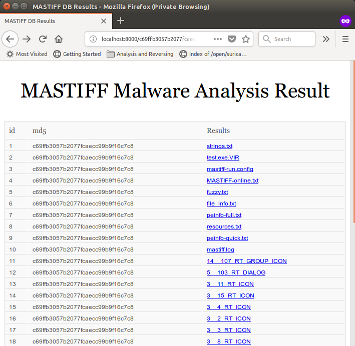

MASTIFF can be downloaded from [https://github.com/KoreLogicSecurity/mastiff](https://github.com/KoreLogicSecurity/mastiff).

### Other information

As part of static information gathering, a file is given its own unique hash. These hashes are used to identify a file from a database of file information. Hash information generally helps analysts share information about the file, without transmitting the file itself.

Here is an example of MASTIFF's `file_info` result on a test file:

#### PE executables

PE executables are programs that work on Windows. Executable files have the `.exe` extension. Dynamic link libraries uses the same PE file format and use the `.dll` file extension. Windows device driver programs, also in PE file format, use the `.sys` extension. There are also other extensions that use the PE file format, such as screensavers (`.scr`).

The PE file format has a header, which is divided into the MZ header, along with its DOS stub and the PE header, followed by the data directories and section tables, as shown here:

The file format follows the original `MSDOS EXE` format, but was extended for Windows using the PE header. If a Windows program were run in an MSDOS environment, it would display this message: `This program cannot be run in DOS mode.`

The code that displays this message is part of the DOS stub.

The PE header's section table contains all the information about where code and data are located in the file, and how it will be mapped into the memory when it gets loaded as a process. The PE header contains the address where the program begins to execute code—a location known as the entry point—and will be set in the EIP register.

The data directories contain addresses of tables that, in turn, contain information such as the import table. The import table contains the libraries and APIs that will be used by the program. The table follows a structure that points to a set of addresses, pointing, in turn, to the names of libraries and their respective export functions:

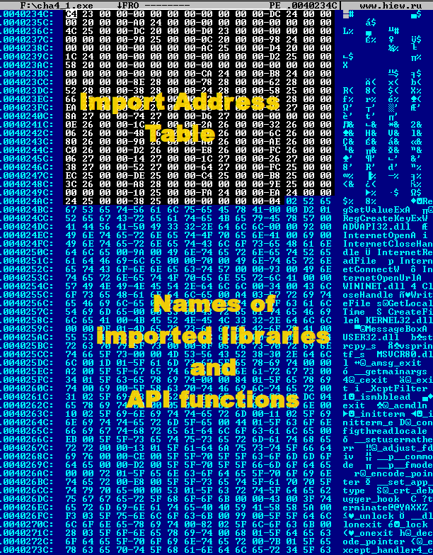

The `peinfo` module used in `MASTIFF` is able to display the imported libraries and functions, as shown here:

`HxD` and `HIEW` are popular binary editors used in this chapter; `HxD`, being the more popular, is free, and can easily be used to make binary edits to a file. More information and a download link can be found at [https://mh-nexus.de/en/hxd/](https://mh-nexus.de/en/hxd/). If you try using `HxD`, you'll see something similar to this screenshot:

Another useful hex-editing tool is `HIEW` (Hacker's View). The demo and free versions are able to parse through a `PE` header. This tool can also show exports and imported API functions:

The statically imported modules, libraries, and functions are hints on what we can expect the program to access. Consider, for example, that if the `PE` file imports the `KERNEL32.DLL` library, then we should expect the file to contain core APIs that may access files, processes, and threads, or dynamically load other libraries and import functions. Here are some of the more common libraries that we should take note of:

*   `ADVAPI32.DLL` : This library contains functions that will access the registry.
*   `MSVCRXX.DLL`  (where XX is a version number. Examples are the libraries `MSVCRT.DLL` and `MSVCR80.DLL`) – This contains Microsoft Visual C runtime functions. This tells us straight away that the program was compiled using Visual C.
*   `WININET.DLL` : This library contains functions that accesses the internet.
*   `USER32.DLL` : This contains window-control functions related to anything displayed on the monitor, such as dialog boxes, showing message boxes, and positioning window boxes where they should be.
*   `NTDLL.DLL` : This library contains native functions that directly interact with the kernel system. `KERNEL32.DLL` and libraries like `USER32.DLL`, `WININET.DLL`, and `ADVAPI32.DLL`  have functions that are used to forward information to the native functions to perform actual system-level operations.

### Deadlisting

Deadlisting is an analysis method where we get to analyze a file's disassembled or decompiled code, and map out the flow of events that will happen when it executes. The resulting illustrated flow will serve as a guide for dynamic analysis.

#### IDA (Interactive Disassembler)

We previously introduced the IDA tool to show the disassembly of a given file. It has a graph-view feature that shows an overview of blocks of code and the branching of conditional flow. In deadlisting, we try to describe each block of code and what possible results it will give. This gives us an idea of what the program does.

#### Decompilers

Some high-level programs are compiled using p-code, such as C# and Visual Basic (p-code version). On the contrary, a decompiler attempts to recreate the high-level source code based on the p-code. A high-level syntax usually has an equivalent block of p-code that can by identified by the decompiler.

Programs compiled using the C language are laid to a file in plain assembly language. But since it is still a high-level language, some blocks of code can be identified back to their C syntax. The paid version of IDA Pro has an expensive, but very useful plugin, called Hex-Rays, that can identify these blocks of code and recreate the C source code.

##### ILSpy – C# Decompiler

A popular tool used to decompile a C# program is ILSpy. Some decompilers will leave the analyst with just the source being statically analyzed as is. But, in ILSpy, it is possible to save the decompiled source as a Visual Studio project. This enables the analyst to compile and debug it for dynamic analysis.

Dynamic analysis
----------------

* * *

Dynamic analysis is a type of analysis that requires live execution of the code. In static analysis, the farthest we can go is with deadlisting. If, for example, we encounter a code that decrypts or decompresses to a huge amount of data, and if we want to see the contents of the decoded data, then the fastest option would be to do dynamic analysis. We can run a debug session and let that area of code run for us. Both static analysis and dynamic analysis work hand in hand. Static analysis helps us identify points in the code where we need a deeper understanding and some actual interaction with the system. By following static analysis with dynamic analysis, we can also see actual data, such as file handles, randomly generated numbers, network socket and packet data, and API function results.

There are existing tools that can carry out an automated analysis, which runs the program in a sandbox environment. These tools either log the changes during runtime, or in between snapshots:

*   Cuckoo (open source) – This tool is deployed locally. It requires a host and sandbox client(s). The host serves as a web console to which files are submitted for analysis. The files are executed in the sandbox, and all activities are logged and then sent back to the host server. The report can be viewed from the web console.
*   RegShot (free) - This tool is used to take a snapshot of the registry and file system before and after running a program. The difference between the snapshots enables the analyst to determine what changes happened. The changes may include changes made by the operating system, and it is up to the analyst to identify which changes were caused by the program.
*   Sandboxie (freemium) - This tool is used in the environment where the program will be run. It is claimed that internally, it uses isolation technology. In essence, the isolation technology allocates disk space, to which disk writes will only happen at the time the program is executed by Sandboxie. This enables Sandboxie to determine changes by looking only at the isolated space. A download link and some more information about Sandboxie can be found at [https://www.sandboxie.com/HowItWorks](https://www.sandboxie.com/HowItWorks).
*   Malwr (free) - This is a free online service that uses Cuckoo. Files can be submitted at [https://malwr.com/](https://malwr.com/).
*   ThreatAnalyzer (paid) - Originally known as CWSandbox, this is the most popular sandboxing technology used in the security industry for automating the extraction of information from a piece of running malware. The technology has improved a lot, especially with its reporting. In addition, it reports descriptive behaviors found, including a cloud query about the submitted file. It can cater to customized rules and flexible Python plugins to bring up behaviors seen by the analyst.
*   Payload Security's Hybrid Analysis (free) - One of the most popular free online services, like Malwr, with report contents similar to that of ThreatAnalyzer. 

Submitting files to online services reduce the need to set up a host-sandbox environment. However, some would still prefer to set up their own, to avoid having files shared to the community or an online service.

For malware analysis, it is advisable to do automated analysis and network information gathering at the time the file was received. Sites from which malware retrieve further data might not be available if authorities act fast enough to take such sites down.

### Memory regions and the mapping of a process

In dynamic analysis, it is important to know what the memory looks like when a program gets loaded and then executed.

Since Windows and Linux are capable of multitasking, every process has its own **Virtual Address Space (VAS)**. For a 32-bit operating system, the VAS has a size of 4 GB. Each VAS is mapped to the physical memory using its respective page table and is managed by the operating system's kernel. So how do multiple VASes fit in the physical memory? The operating system manages this using paging. The paging has a list of used and unused memory, including privilege flags. If the physical memory is not enough, then paging can use disk space as an form of extended physical memory. A process and its module dependencies don't use up the whole 4 GB of space, and only these virtually allocated memory segments are listed as used in the page tables and mapped in the physical memory.

A VAS is divided into two regions: user space and kernel space, with the kernel space located in the higher address region. The division of virtual space differs between Windows and Linux:

Every VAS has a kernel space listed in the page tables as a space that has exclusive privileges. Generally, these privileges are called kernel mode and user mode. These are specifically identified as protection rings. The kernel has a privilege of ring 0, while the applications that we use are run on ring 3 privilege. Device drivers are in the ring 1 or ring 2 layers, and are also identified as having kernel-mode privileges. If user-mode programs try to directly access the kernel space in kernel mode, a page fault is triggered.

Once a VAS is enabled, the user space is initially allocated for the stack, heap, the program, and the dynamic libraries. Further allocations are caused by the program at runtime by requesting memory using APIs, such as `malloc` and `VirtualAlloc`:

The preceding screenshot is a mapped view when `jbtest.exe` had just been loaded in 32-bit Windows. Here is a more descriptive standard layout of a program in a virtual allocated space under Windows:

### Process and thread monitoring

Monitoring the processes and threads, especially those that were created by the file we are analyzing, tells us that there are more behaviors occurring than is obvious. A process can create multiple threads, which tells us that it might be doing several behaviors at the same time. A created process tells us that a new program was just executed.

In Windows, the termination, creation, and opening of a process can be monitored by third-party tools such as Process Monitor. Though there are built-in tools, such as Task Manager, that can show information about processes, some third-party tools can give more detail about the processes and the threads tied to it.

### Network traffic

The communicated data between a server and a client computer can only be seen during dynamic analysis. The packet captured during transmission will help the analyst understand what the program is sending to a server and how it will respond to any such data received.

Popular tools, such as Wireshark and Fiddler, are used to capture packets of data and store them as `pcap` files. In Linux, the `tcpdump` tool is commonly used to do the same thing.

### Monitoring system changes

For Windows, there are three aspects we need to monitor: memory, disk, and registry. File monitoring tools look at created, modified, or deleted files and directories. On the other hand, registry monitoring tools look at created, updated, or deleted registry keys, values, and data. We can use tools such as `FileMon` and `RegMon` to do this job.

### Post-execution differences

Comparing differences between snapshots taken before and after running the executable shows all the system changes that happened. For this type of analysis, any events that happened in between are not identified. This is useful for finding out how a software installer installed a program. And as a result, the difference comes in handy, especially when manually uninstalling a piece of software. The tool used here is RegShot.

### Debugging

Deadlisting gives us most of the information we need, including the program's branching flow. Now, we have an opportunity to validate the path that the program will follow when doing debugging. We get to see the data that are temporarily stored in the registers and memory. And instead of manually trying to understand a decryption code, debugging it would easily show the resulting decrypted data.

Tools used for debugging in Windows include the following:

*   `OllyDebug`
*   `x86dbg`
*   `IDA Pro`

Tools used for debugging Linux include the following:

*   `gdb`
*   `radare2`

Try it yourself
---------------

* * *

To try out the tools we have learned about, let's try doing some static analysis on `ch4_2.exe`. To help out, here's a list of what we need to find:

*   File information:
    
    *   file type
    *   imported DLLs and APIs
    *   text strings
    *   file hash
    
*   What the file does

Jumping right into getting file information, we will use TrID ([http://mark0.net/soft-trid-e.html](http://mark0.net/soft-trid-e.html)) to identify the file type. Execute the following line:

Copy

    trid cha4_2.exe

The TrID result tells us that we have here a Windows 32-bit executable file that is UPX packed:

Knowing that this is a UPX packed file, we can try the UPX ([https://upx.github.io/](https://upx.github.io/)) tool's decompress feature to help us restore the file back to its original form before it was packed. A packed file is a compressed executable file that decompresses and then executes the program during runtime. The primary purpose of a packed file is to reduce the file size of executables while retaining the program's original  behavior. We will be discussing more about packers in [_Chapter 10_](/book/networking_and_servers/9781788838849/10), _Packing and Encryption_, of this book. For now, let's just unpack this file with the UPX tool using the `-d` parameter:

Copy

    upx -d cha4_2.exe

This results to the file being expanded back to its original form:

And if we use `TrID` this time, we should get a different result:

It is still a Windows executable file, so we can use CFF Explorer to check for more information:

On the left pane, if we select Import Directory, we should see a list of imported library files and API functions it will use, as shown here:

Clicking on `USER32.dll`, we see that the `MessageBoxA` API is going to be used by the program.

Using the bintext ([http://b2b-download.mcafee.com/products/tools/foundstone/bintext303.zip](http://b2b-download.mcafee.com/products/tools/foundstone/bintext303.zip)) tool, we can see a list of text strings found in the file:

These appear to be the notable text strings, which suggest that the program checks for the time and displays various greetings. It will probably retrieve a file from the internet. It may do something about the `File.txt` file. But all these are just educated guesses, which makes good practice for reversing, as it helps use to build an overview of the relationship between each aspect of our analysis:

Copy

    000000001134 000000402134 0 The system time is: %02d:%02d
    000000001158 000000402158 0 Nice Night!
    000000001164 000000402164 0 Good Morning
    000000001174 000000402174 0 Good Afternoon
    000000001184 000000402184 0 Good Evening
    000000001198 000000402198 0 https://raw.githubusercontent.com/PacktPublishing/Mastering-Reverse-Engineering/master/ch4/encmsg.bin
    000000001200 000000402200 0 File.txt
    00000000122C 00000040222C 0 Reversing

The hash (MD5, SHA1, SHA256) of a file will help as a reference to every file we analyze. There are a lot of file hash-generating tools available in the internet. To generate the hashes of this file, we chose a tool called HashMyFiles. This is a tool compiled for Windows OS and can be added to the context menu (right-click) of the Windows Explorer:

 It can display the file's `CRC`, `MD5`, `SHA1`, `SHA-256`, `SHA-512`, and`SHA-384`, as follows:

Copy

    MD5: 38b55d2148f2b782163a3a92095435af
    SHA1: d3bdb435d37f843bf68560025aa77239df7ebb36
    CRC: 0bfe57ff
    SHA256: 810c0ac30aa69248a41c175813ede941c79f27ddce68a91054a741460246e0ae
    SHA512: a870b7b9d6cc4d86799d6db56bc6f8ad811fb6298737e26a52a706b33be6fe7a8993f9acdbe7fe1308f9dbf61aa1dd7a95015bab72b5c6af7b7359850036890e
    SHA384: b0425bb66c1d327d7819f13647dc50cf2214bf00e5fb89de63bcb442535860e13516de870cbf07237cf04d739ba6ae72

Usually, we only take either `MD5`, `SHA1`, or `SHA256`.

We should not forget the file size and the creation time using a simple file property check:

The **`Modified date`** is more relevant in terms of when the file was actually compiled. The **`Created date`** is when the file was written or copied to the directory where it is now. That means that the first time the file was built, both the **`Created`** and **`Modified`** dates were the same.

To statically analyze the file's behavior, we will be using a disassembly tool known as IDA Pro. A freeware version of IDA Pro can be found at [https://www.hex-rays.com/products/ida/support/download\_freeware.shtml](https://www.hex-rays.com/products/ida/support/download_freeware.shtml). But, if you can afford the luxury of its paid version, which we highly recommend, please do purchase it. We find the features and supported architectures of the paid version way better. But for this book, we will be using every available tool that does not require purchasing.

There are currently two known free versions of IDA Pro. We have made backups of the tool available at [https://github.com/PacktPublishing/Mastering-Reverse-Engineering/tree/master/tools/Disassembler%20Tools](https://github.com/PacktPublishing/Mastering-Reverse-Engineering/tree/master/tools/Disassembler%20Tools). And since we are dealing with a 32-bit Windows executable file, select the 32-bit version.

Once IDA Pro is installed, open up `cha4_2.exe` inside. Wait for the auto-analysis to complete and it will redirct the disassembly to the `WinMain` function:

Scrolling down will show more disassembly code that we learned in [_Chapter 3_](/book/networking_and_servers/9781788838849/3), _The Low-Level Language_. For deadlisting behaviors, we usually look for instructions that call APIs. The very first API we encounter is a call to `GetSystemTime`:

Following the code, we encounter these API functions in this sequence:

1.  `vsprintf_s`
2.  `MessageBoxA`
3.  `InternetOpenA`
4.  `InternetConnectW`
5.  `InternetOpenUrlA`
6.  `memset`
7.  `InternetReadFile`
8.  `InternetCloseHandle`
9.  `strcpy_s`
10.  `CreateFileA`
11.  `WriteFile`
12.  `CloseHandle`
13.  `RegCreateKeyExW`
14.  `RegSetValueExA`

With what we learned in [_Chapter 3_](/book/networking_and_servers/9781788838849/3), _The Low Level Language_, try to follow the code and deduce what the file will do without executing it. To help out, here are the expected behaviors of the program:

1.  Displaying a message depending on the current system time. The messages can be one of the following:
    
    *   `Good Morning`
    *   `Good Afternoon`
    *   `Good Evening`
    *   `` `Nice Night` ``
    
2.  Reading the contents of a file from the internet, decrypting the contents, and saving it to a file named `File.txt`.
3.  Making a registry key, `HKEY_CURRENT_USER\Software\Packt`, and storing the same decrypted data in the `Reversing` registry value.

This may take a long time for beginners, but with continuous practice, analysis will be done at a fast pace.

Summary
-------

* * *

Both approaches to analysis, static and dynamic, have their means to extract information and are required to properly analyze a file. Before doing dynamic analysis, it is recommended to start with static analysis first. We stick to our goal of generating an analysis report from the information we get. The analyst is not limited to using just the tools and resources outlined here to conduct an analysis—any information from the internet is useful, but validating it with your own analysis will stand as proof. Taking all items from the file, such as notable text strings, imported API functions, system changes, code flows, and possible blocks of behaviors are important, as these may be useful when building an overview of the file.

The result of the static analysis draws together the approach and resources that need to be prepared for dynamic analysis. For example, if the static analysis identified the file as a `Win32` PE file executable, then tools for analyzing PE files will need to be prepared.

As part of dynamic analysis, we discussed about **Virtual Allocated Space (VAS)** and how a program is mapped in memory along with its library dependencies. This information comes in handy when attempting reversing in further chapters.

We also introduced a few tools that we can use to engage in both static and dynamic approaches, and ended this chapter with a brief exercise on a 32-bit Windows PE executable file. In the next chapter, we will show more use of some of these tools as we reverse-engineer files.

References
----------

* * *

The files used in this chapter can be downloaded from [https://github.com/PacktPublishing/Mastering-Reverse-Engineering](https://github.com/PacktPublishing/Mastering-Reverse-Engineering).[https://github.com/PacktPublishing/Mastering-Reverse-Engineering](https://github.com/PacktPublishing/Mastering-Reverse-Engineering)

Chapter 5. Tools of the Trade
-----------------------------

In the previous chapters, we used some simple reversing tools, such as PEiD, CFF Explorer, IDA Pro, and OllyDbg, which aided us in our reversing adventure. This chapter explores and introduces more tools we can use and choose from. The selection of tools depend on the analysis required. For example, if a file was identified as an ELF file type, we'd need to use tools for analyzing a Linux executable. 

This chapter covers tools for Windows and Linux, categorized for static and dynamic analysis. There are a lot of tools available out there—don't limit yourself to the tools discussed in this book.

In this chapter, you will achieve the following learning outcomes:

*   Setting up tools
*   Understanding static and dynamic tools for Windows, and Linux
*   Understanding support tools

Analysis environments
---------------------

* * *

The environment setup in reverse engineering is crucial to the result. We need a sandbox environment where we can dissect and play with the file, without worrying that we may break something. And since the most popular operating systems are Microsoft Windows and Linux, let's discuss using these operating systems in a virtual environment.

### Virtual machines

From the first chapter, we introduced using VirtualBox as our desktop virtualization system. The reason we chose VirtualBox was because of it being freeware. But besides VirtualBox, choosing the right sandboxing software depends on user preferences and requirements. There are pros and cons for every piece of sandboxing software, so it is worth exploring those on offer to find out which software you prefer. Here's a small list of virtualization software:

*   **VMWare Workstation:** This is a commercial, and widely popular, piece of virtualization software. VMWare Workstation can be downloaded from** [https://www.vmware.com](https://www.vmware.com)**.
*   **VirtualBox:** This is free and open source virtualization software. It can be downloaded from **[https://www.virtualbox.org](https://www.virtualbox.org)**.
*   **Qemu (Quick Emulator):** This is actually notvirtualizationsoftware, but rather, an emulator. Virtualization software uses virtualization features of the CPU, but uses real CPU resources to do this, while emulators simply imitate a CPU and its resources. That is, running an operating system in a virtualized environment uses the real CPU, while running an operating system in an emulated environment uses an imitated CPU. The Qemu module can be installed from Linux standard repositories. It has ports for both Windows and macOS, and can be downloaded from** [https://www.qemu.org](https://www.qemu.org)**.
*   **Bochs:** An emulator that is limited toemulatingthe x86 CPU architecture. It is released as an open source and usually used for debugging the**Master Boot Record**(**MBR**) of smalldiskimages. See [http://bochs.sourceforge.net](http://bochs.sourceforge.net)for more details.
*   **Microsoft Hyper-V:** A virtualization feature of selected Microsoft Windows versions, including Windows 10. Activate it from the following menu like so:

****

*   **Parallels:** A commercial virtualization program, primarily designed to run Windows in a macOS host. More information about this piece of software can be found at[https://www.parallels.com/](https://www.parallels.com/).[https://www.parallels.com/](https://www.parallels.com/)

The advantage of emulators is that other CPU architectures, such as ARM, can be emulated. Unlike virtualization software, emulators depend on the bare-metal machine's hypervisor. The drawback is possible slow performance as every emulated instruction is interpreted.

### Windows

It is recommended to do analysis on a 32- or 64-bit Windows 10 system, or the most recent version on offer. At the least, Windows 7 can still be used, since it is light and has a stable environment for running executable files. As much as possible, selecting the most popular and widely used version of Windows will be the best choice. Choosing old versions such as XP may not be very helpful, unless the program we are going to reverse was solely built for Windows XP.

At the time of writing, there are two ways we can get Windows for our analysis**:**

*   Install Windows 10 from an installer or ISO image that can be downloaded from [https://www.microsoft.com/en-us/software-download/windows10](https://www.microsoft.com/en-us/software-download/windows10).
*   Deploy the Windows appliance used for testing old versions of Edge and Internet Explorer. The appliance can be downloaded from **[https://developer.microsoft.com/en-us/microsoft-edge/tools/vms](https://developer.microsoft.com/en-us/microsoft-edge/tools/vms).**

These downloads do not have any license installed, and will expire within a short period. For the second option in the preceding list, after the deploying the appliance, it is best to take an initial snapshot _before_ running the virtual machine. Reverting to this initial snapshot should reset the expiration back to when the appliance was deployed. Further snapshots should also be created, containing configuration updates and installed tools.

### Linux

Linux can easily be downloaded due to it being open source. Popular systems are usually forked from Debian or Red Hat systems. But since most of the tools developed for analysis are built under Debian-based systems, we selected Lubuntu as our analysis environment.

### Note

**Lubuntu** is a light version of Ubuntu**.**

However, we are not leaving Red Hat-based systems from our list. If a program was designed to run only on Red Hat-based systems, we should do our dynamic reversing and debugging on a Red Hat-based system. As noted, reverse engineering requires not only the tools fit for the target, but the environment as well.

Lubuntu can be downloaded from [https://lubuntu.net](https://lubuntu.net). But, if you prefer using Ubuntu, you can download the installer from **[https://www.ubuntu.com](https://www.ubuntu.com)**.

Information gathering tools
---------------------------

* * *

Knowing what we are dealing with prepares us further. For example, if a file were identified as a Windows executable, we then prepare Windows executable tools. Information gathering tools helps us identify what the file type is and its properties. The information gathered becomes a part of the analysis profile. These tools are categorized as file type identifying, hash calculating, text string gathering, and monitoring tools.

### File type information

These tools gather primary information about a file. The data gathered includes the filename, file size, file type, and file type-specific properties. The result of these tools enables the analyst to plan how to analyze the file:

*   **PEiD:** A tool used toidentifythe file type, the packer, and compiler. It is built to run in Windows. It is not maintained, but still very useful.
*   **TrID:** A command-line tool similar to PEiD. This tool has Windows and Linux versions. It can read a community-driven signature database of various file types.
*   **CFF Explorer:** This tool is primarily used to read and make edits in a PE format file. It runs under Windows and has a lot of features, such as listing processes and dumping processes to a file. It can also be used to rebuild a process dump.
*   **PE Explorer: **Another tool used to read and edit the structure of PE files. It can also unpack a number of executable compressed programs, such as UPX, Upack, and NSPack. PE Explorer only runs in Windows.
*   **Detect-it-Easy (DiE): **Downloaded from [https://github.com/horsicq/Detect-It-Easy](https://github.com/horsicq/Detect-It-Easy), DiE is an open source tool that uses a community-driven set of algorithmic signatures to identify files. The tool has builds for Windows and Linux.
*   **ExifTool: **This tool was primarily designed to read and edit the metadata of image files with an EXIF file format. It was further developed to extend features for other file formats, including PE files. ExifTool is available for Windows and Linux and can be downloaded from **[https://sno.phy.queensu.ca/~phil/exiftool/](https://sno.phy.queensu.ca/~phil/exiftool/)**.

### Hash identifying

Information gathering also includes identifying a file by its hash. Not only does the hash help validate a transferred file; it is also commonly used as a unique ID for a file analysis profile:

*   **Quickhash:** This is an open source tool available for Windows, Linux, and macOS that generates the MD5, SHA1, SHA256, and SHA512 of any file. It can be downloaded from** [https://quickhash-gui.org/](https://quickhash-gui.org/)**.
    
*   **HashTab: **This tool runs inWindowsand can be integrated as a tab in the properties information of a file. It calculates the MD5, SHA1, and a couple of hash algorithms.
*   **7-zip:** This tool is actually a file archiver, but it has an extension tool that can be enabled to calculate the hash of a file in MD5, SHA1, SHA256, and so forth.

### Strings

Text-string gathering tools are mainly used to quickly identify possible functions or messages used by the program. It is not always true that every text string is used by the program. Program flow still depends on conditions set in the program. However, the string locations in the file can be used as markers that the analyst can trace back:

*   **SysInternals Suite's strings: **This is acommand\-line tool for Windows that shows the list of text strings in any type of file.
*   **BinText: **This is a GUI-based Windows tool that can display the ASCII and Unicode text strings for any given file.

### Monitoring tools

Without manually digging deeper into the program's algorithm, simply running the program can give plenty of information about its behavior. Monitoring tools usually work by placing sensors in common or specific system library functions, then logging the parameters used. Using monitoring tools is a fast way to produce an initial behavior analysis of a program:

*   **SysInternals Suite's Procmon or Process Monitor: **Running only on Windows, this is a real-time monitoring tool that monitors processes, thread, filesystem, and registry events. It can bedownloadedfrom [https://docs.microsoft.com/en-us/sysinternals/downloads/procmon](https://docs.microsoft.com/en-us/sysinternals/downloads/procmon)and is a part of theSysInternalsSuite package.
*   **API Monitor: **This powerful tool helps reverse engineering by monitoring API calls as the program runs. The analyst has to set which API the tool needs to hook. Once an API is hooked, all user-mode processes using the API will be logged. API Monitor can be downloaded from [http://www.rohitab.com/apimonitor](http://www.rohitab.com/apimonitor).

*   **CaptureBAT: **In addition to what Process Monitor can do, this command-line tool is also capable of monitoring network traffic.

### Default command-line tools

There are a couple of useful tools that are already built into the operating system we are working on. These come in handy when third party tools are not available:

*   **strings:** This is a Linux command used to list the strings found in a given file.
*   **md5sum: **This is a Linux command used to calculate the MD5 hash of a given file.
*   **file:** This is a command line in Linux used to identify files. It uses the libmagic library.

Disassemblers
-------------

* * *

Disassemblers are tools used to look at the low-level code of a program compiled from either a high-level language, or of the same low-level language. As part of analysis, deadlisting and recognizing the blocks of code help to build up the behavior of the program. It is then be easier to identify only code blocks that need to be thoroughly debugged, without running through the whole program code:

*   **IDA Pro:** A popular tool used in the software security industry to disassemble various low-level language built on the x86 and ARM architectures. It has a wide list of features. It can generate a graphical flow of code, showing code blocks and branching. It also has scripting that can be used to parse through the code and disassemble it into more meaningful information. IDA Pro has an extended plugin, called Hex-Rays, that is capable of identifying assembly codes to its equivalent C source or syntax. The free version of IDA Pro can be downloaded from **[https://www.hex-rays.com/products/ida/support/download\_freeware.shtml](https://www.hex-rays.com/products/ida/support/download_freeware.shtml)**.
    
*   **Radare: **Available on Windows, Linux, and macOS, this open sourcetoolshows the disassembled equivalent of a given program. It has a command-lineinterfaceview, but there are existing plugins that can show it using the computer's browser. Radare's source can bedownloadedand built from [https://github.com/radare/radare2](https://github.com/radare/radare2). Information on how to install binaries can be found at its website, available at** [https://rada.re](https://rada.re)**.
*   **Capstone:** This is an open source disassembly and decompiler engine. The engine is used by many disassembly and decompiler tools, such as Snowman. Information about this tool can be found at **[https://www.capstone-engine.org/](https://www.capstone-engine.org/)**.
*   **Hopper:** A disassembly tool for Linux and macOS operating systems. It has a similar interface as IDA Pro and is capable of debugging using GDB. 
*   **BEYE: **Also known as Binary EYE, this is a hex viewer and editing tool with the addition of a disassembly view mode. BEYE is available for Windows and Linux. It can be downloaded from** [https://sourceforge.net/projects/beye/](https://sourceforge.net/projects/beye/)**.
*   **HIEW:** Also known as Hacker's View, is similar to BEYE, but has better information output for PE files. The paid version of HIEW has more features supporting a lot of file types and machine architectures.

Debuggers
---------

* * *

When debugging tools are used, this would mean that we are in the code-tracing phase of our analysis. Debuggers are used to step in every instruction the program is supposed to do. In the process of debugging, actual interaction and changes in memory, disk, network, and devices can be identified:

*   **x86dbg:** This is a Windows user-modedebugger. It is opensourceand can debug 32- and 64-bit programs. It is capable of accepting plugins written by users. The source code can bedownloadedfrom [https://github.com/x64dbg](https://github.com/x64dbg). The builds can be downloaded from [https://x64dbg.com](https://x64dbg.com).
*   **IDA Pro:** Paid versions of IDA Pro are capable of debugging using the same disassembly interface. It is very useful when you want to see a graphical view of decrypted code.

*   **OllyDebug:** A popular Windows debugger, due to its portability and rich features. It can accommodate plugins written by its users, adding capabilities such as unpacking a loaded executable compressed file (by reaching the original entry point) and memory dumping. Ollydebug can be downloaded from [http://www.ollydbg.de/](http://www.ollydbg.de/).
*   **Immunity Debugger:** The interface of this program looks like a highly improved version of OllyDebug. It has plugin support for Python and other tools. Immunity Debugger can be downloaded from Immunity, Inc.'s site at [https://www.immunityinc.com/products/debugger/](https://www.immunityinc.com/products/debugger/). Older versions can be found at [https://github.com/kbandla/ImmunityDebugger/](https://github.com/kbandla/ImmunityDebugger).
*   **Windbg:** A debugger developed by Microsoft. The interface is quite plain, but can be configured to show every kind of information needed by a reverser. It is capable of being set up to remotely debug device drivers, software in the kernel levels, and even a whole Microsoft operating system.
*   **GDB:** Also known as GNU Debugger, GDB is originally a debugger developed for Linux and a couple of other operating systems. It is capable of debugging not only low-level languages but also used for debugging high-level languages such as C, C++, and Java. GDB can also be used in Windows. GDB uses a command-line interface, but there are existing GUI programs that use GDB for a more informative look.
*   **Radare:** Radare also has a debugger packaged along with it. It can also do remote debugging by using GDB remotely. Its interface is command line-based but has an integrated visual view. Its developers also made a better visual view using the browser. Basically, compared with GDB, Radare would be much preferred. It is also primarily built for Linux, but has compiled binaries on offer for Windows and macOS.

Decompilers
-----------

* * *

Disassemblers are used to show the low-level code of a compiled high-level program. Decompilers, on the other hand, attempt to show the high-level source code of the program. These tools work by identifying blocks of low-level code that match with corresponding syntax in the high-level program. It is expected that these tools won't be able to show what the original program's source code looks like, but nonetheless, they help speed up analysis with a better view of the program's pseudo code:

*   **Snowman:** This is a C and C++ decompiler. It can run as astandalonetool, or as an IDA Pro plugin. The source can be found at [https://github.com/yegord/snowman](https://github.com/yegord/snowman), while itscompiledbinaries can bedownloadedfrom [https://derevenets.com/](https://derevenets.com/). It is available for Windows and Linux.
*   **Hex-Rays: **This is also a C and C++ decompiler and runs as a plugin for IDA Pro. It is sold commercially as part of IDA Pro. Users should expect this to have a better decompiled output than Snowman.
*   **dotPeek: **This is a free .NET decompiler by Jetbrains. It can be downloaded from [https://www.jetbrains.com/decompiler/](https://www.jetbrains.com/decompiler/).
*   **iLSpy:** This is an open source .NET decompiler. The source and pre-compiled binaries can be found at [https://github.com/icsharpcode/ILSpy](https://github.com/icsharpcode/ILSpy).

Network tools
-------------

* * *

The following is a list of tools that are used to monitor the network:

*   **tcpdump:** This is a Linux-based tool used tocapturenetwork traffic. It can beinstalledfrom the default repositories.
*   **Wireshark: **This tool is capable of monitoring network traffic. Incoming and outgoing network traffic, including packet information and data, is logged in real time. Originally named Ethereal, Wireshark is available for Windows, Linux, and macOS, and can be downloaded from [https://www.wireshark.org/](https://www.wireshark.org/).
*   **mitmproxy: **Also known as Man-In-The-Middle Proxy. As its name states, it is set up as a proxy, and thus able to control and monitor network traffic before data is either sent externally or received by internal programs.
*   **inetsim:** Essentially, this tool fakes network and internet connectivity, thereby trapping any network traffic sent externally by a program. This is very useful for analyzing malware, preventing it from sending data externally, while having knowledge of where it connects to and what data it tries to send.

Editing tools
-------------

* * *

There may be instances where we need to modify the contents of a program to make it work properly, or validate a code behavior. Modifying data in a file can also change the code flow where conditional instructions may happen. Changing instructions can also work around anti-debugging tricks:

*   **HxD Hex Editor:** A Windowsbinaryfileviewerand editor. You can use this to view the binary contents of a file.
*   **Bless:** A Linux binary file viewer and editor.
*   **Notepad++:** A Windows text editor, but can also read binary files, though reading binary files with hexadecimal digits would require a hex-editing plugin. Still, this is useful for reading and analyzing scripts, due to its wide range of supported languages, including Visual Basic and JavaScript.
*   **BEYE:** A useful tool for viewing and editing any file type. BEYE is available for Windows and Linux. 
*   **HIEW: **The feature that makes this software worthwhile is its ability to do on-the-fly encryption using assembly language. 

Attack tools
------------

* * *

There may be cases where we need to craft our own packets to fool the program into thinking that it is receiving live data from the network. Though these tools are primarily developed to generate exploited network packets for penetration testing, these can also be used for reverse engineering:

*   **Metasploit**([https://www.metasploit.com/](https://www.metasploit.com/)): This is aframeworkwith scripts that cangenerateexploited packets to send to the target for penetration tests. Thescriptsare modular and users can develop their own scripts.
*   **ExploitPack** ([http://exploitpack.com/](http://exploitpack.com/)): This has the same concept as Metasploit, though is maintained by a different group of researchers.

Automation tools
----------------

* * *

Developing our own programs to do analysis may sometimes be a must. For example, if the program contains a decryption algorithm, we can develop a separate program that can run the same algorithm that may be used for similar programs with the same decryption algorithm. If we wanted to identify variants of the file we were analyzing, we could automate the identification for incoming files using one of the following:

*   **Python:** This scriptinglanguageis popularbecauseof it availability across multiple platforms. It is pre-installed in Linux operating systems;compiledbinaries for Windows can be downloaded from[https://www.python.org/](https://www.python.org/). 
*   **Yara:** A tool and language from the developers of VirusTotal. It is capable of searching the contents of files for a set of binary or text signatures. Its most common application is in searching for malware remnants in a compromised system.
*   **Visual Studio:** A piece of Microsoft software for coding and building programs. It can be used by reverse engineers when decompiled programs need to be debugged graphically. For example, we can debug a decompiled C# program using Visual Studio, instead of trying to understand each p-code of disassembled C# codes.

Software forensic tools
-----------------------

* * *

Reverse engineering includes analyzing the post-execution of a program. This entails gathering and determining objects and events from memory and disk images. With these tools, we can analyze the suspended state of an operating system with the process of the program being analyzed still in running memory. 

Here is a list of different forensic software that can be downloaded:

*   Digital Forensics Framework ([https://github.com/arxsys/dff](https://github.com/arxsys/dff))
*   Open Computer Forensics Architecture

                                   [https://github.com/DNPA/OcfaArch](https://github.com/DNPA/OcfaArch)

[                    https://github.com/DNPA/OcfaLib](https://github.com/DNPA/OcfaLib)

[                    https://github.com/DNPA/OcfaModules](https://github.com/DNPA/OcfaModules)

[                    https://github.com/DNPA/OcfaDocs](https://github.com/DNPA/OcfaDocs)

[                    https://github.com/DNPA/OcfaJavaLib](https://github.com/DNPA/OcfaJavaLib)

*   CAINE ([https://www.caine-live.net/](https://www.caine-live.net/))
*   X-Ways Forensics Disk Tools ([http://www.x-ways.net/forensics/](http://www.x-ways.net/forensics/))
*   SIFT ([https://digital-forensics.sans.org/community/downloads](https://digital-forensics.sans.org/community/downloads))
*   SleuthKit ([http://www.sleuthkit.org/](http://www.sleuthkit.org/))
*   LibForensics ([https://code.google.com/archive/p/libforensics/](https://code.google.com/archive/p/libforensics/))
*   Volatility ([https://github.com/volatilityfoundation](https://github.com/volatilityfoundation)): 

In malware analysis, Volatility is one of the popular pieces of open source software used. It is able to read suspended states of virtual machines. The advantage of such tools is that malware, such as rootkits, that try to hide themselves from user domains can be extracted using memory forensic tools.

*   BulkExtractor ([http://downloads.digitalcorpora.org/downloads/bulk\_extractor/](http://downloads.digitalcorpora.org/downloads/bulk_extractor/))
*   PlainSight ([http://www.plainsight.info/index.html](http://www.plainsight.info/index.html))
*   Helix3 ([http://www.e-fense.com/products.php](http://www.e-fense.com/products.php))
*   RedLine ([https://www.fireeye.com/services/freeware/redline.html](https://www.fireeye.com/services/freeware/redline.html))
*   Xplico ([https://www.xplico.org/](https://www.xplico.org/))

Automated dynamic analysis
--------------------------

* * *

These are tools used to automatically gather information by running the program in an enclosed sandbox.

*   **Cuckoo:** This is a piece of Python-codedsoftwaredeployed in Debian-based operating systems. Usually, Cuckoo is installed in the hosting Ubuntu system, andsendsfiles to be analyzed in the VMWare or VirtualBox sandbox clients. Its development is community-driven, and as such, a lot of open source plugins are available for download.
*   **ThreatAnalyzer:** Sold commercially, ThreatAnalyzer, previously known as CWSandbox, has been popular in the anti-virus community for its ability to analyze malware and return very useful information. And because users are able to develop their own rules, ThreatAnalyzer, as a backend system, can be used to determine if a submitted file contains malicious behaviors or not.
*   **Joe Sandbox:** This is another commercial tool that shows meaningful information about the activities that a submitted program carries out when executed.
*   **Buster Sandbox Analyzer (BSA): **The setup of BSA is different from the first three tools. This one does not require a client sandbox. It is installed in the sandbox environment. The concept of this tool is to allocate disk space where a program can run. After running, everything that happened in the space is logged and restored back afterwards. It is still recommended to use BSA in an enclosed environment. 
*   **Regshot: **this is a tool used to capture a snapshot of the disk and registry. After running a program, the user can take a second snapshot. The difference of the snapshots can be compared, thereby showing what changes were made in the system. Regshot should be run in an enclosed environment.

Online service sites
--------------------

* * *

There are existing online services that can also aid us in our reversing.

*   **VirusTotal:** This submits a file or a URL and cross-references it with a list of detections from various security programs. The result gives us an idea if the file is indeedmaliciousor not. It can also show us some file information, such as the SHA256, MD5, file size, and any indicators.
*   **Malwr:** Files submitted here will be submitted to a backend Cuckoo system.
*   **Falcon Sandbox:** This is also known as hybrid-analysis, and is an online automated analysis system developed by Payload Security. Results from Cuckoo and hybrid-analysis uncover similar behaviors, but one may show more information than the other. This may depend on how the client sandbox was set up. If, say, the .NET framework was not installed in the sandbox, submitted .NET executables will not run as expected.
*   **whois.domaintools.com:** This is a site that shows the whois information about a domain or URL. This may come in handy, especially when trying to determine which country or state a program is trying to connect to.
*   **robtex.com:** A similar site to whois, that shows historical info and a graphical tree of what a given site is connected to.
*   **debuggex.com:** This is an online regular expressions service, where you can test your regex syntax. This can come in handy when developing scripts, or reading scripts or codes that contain regular expressions.

### Note

Submitting files or URLs to these online sites would mean that you are sharing information to their end. It would be best to ask for the permission of the owner of the file or URL before submitting.

Summary
-------

* * *

In this chapter, we listed some of the tools used for reverse engineering. We tried to categorized the tools based on their purposes. But just as how we choose every piece of software that we use, the reverser's preferred set of tools depend on the packed features they contain, how user-friendly they are, and most importantly, whether or not they have the features required to do the job. We have covered the tools we can use for static analysis, including binary viewer and disassembly tools. We also listed useful debugging tools that we can use for Windows and Linux.

From the list, I personally recommend HIEW, x86dbg, IDA Pro, Snowman, and iLSpy for Windows analysis of PE binary executables. And on the Linux side, BEYE, Radare, GDB, and IDA Pro are great for analyzing ELF files.

We also covered some online services that can help us gain more information about sites we extracted from the analysis. We also introduced systems that can automate analysis, when we are going to deal with a lot of files. In addition, we listed a few forensic tools that we can use to analyze suspended memory.

As always, these tools have their pros and cons, and those eventually chosen will depend on the user and the type of analysis needed. The tools each have their own unique capability and comfort. For the next chapters, we will be using a mix of these tools. We may not use all of them, but we'll use what will get the analysis done.

In the next chapter, we'll learn more tools as we engage in reverse engineering on Linux platforms.

Chapter 6. RE in Linux Platforms
--------------------------------

A lot of our tools work great in Linux. In the previous chapter, we introduced a few Linux command-line tools that are already built-in by default. Linux already has Python scripting installed, as well. In this chapter, we are going to discuss a good setup for analyzing Linux files and hosting Windows sandbox clients.

We are going to learn how to reverse an ELF file by exploring the reversing tools. We will end this chapter by setting up a Windows sandbox client, running a program in it, and monitoring the network traffic coming from the sandbox.

Not all of us are fond of using Linux. Linux is an open source system. It is a technology that will stick with us. As a reverse engineer, no technology should be an obstacle, and it is never too late to learn this technology. The basics of using Linux systems can easily be found on the internet. As much as possible, this chapter tries to detail the steps required to install and execute what is needed in a way that you can follow.

In this chapter, you will look at the following 

*   Understanding of linux executables
*   Reversing an ELF file
*   Virtualization in Linux – an analysis of a Windows executable under a Linux host
*   Network traffic monitoring

Setup
-----

* * *

This chapter discusses Linux reverse engineering, so we need to have a Linux setup. For reverse engineering, it is recommended to deploy Linux on a bare-metal machine. And since most of the analysis tools that have been developed are Debian-based, let's use 32-bit Ubuntu Desktop. I chose Ubuntu because it has a strong community. Because of that, most of the issues may already have a resolution or solutions may be readily available. 

Why build our setup on a bare-metal machine? It is a better host for our sandbox clients, especially when monitoring network traffic. It also has an advantage in proper handling of Windows malware, preventing compromise due to accidental malware execution.

You can go to [https://www.ubuntu.com/](https://www.ubuntu.com/) to obtain an ISO for the Ubuntu installer. The site includes an installation guide. For additional help, you can visit the community forum at [https://ubuntuforums.org/](https://ubuntuforums.org/).

### Note

"Bare-metal machines" refers to computers that execute code directly on the hardware. It is usually a term used to refer to hardware, as opposed to virtual machines.

Linux executable – hello world
------------------------------

* * *

To begin with, let's create a hello world program. Before anything else, we need to make sure that the tools required to build it are installed. Open a Terminal (the Terminal is Linux's version of Windows' Command Prompt) and enter the following command. This may require you to enter your super user password:

Copy

    sudo apt install gcc

The C program compiler,_**`gcc`,** _is usually pre-installed in Linux.

Open any text editor and type the lines of following code, saving it as `_hello.c_`:

Copy

    #include 
    void main(void)
    {
        printf ("hello world!\n");
    }

You can use `vim` as your text editor by running `vi` from the Terminal.   

To compile and run the program, use the following commands:

The `hello` file is our Linux executable that displays a message in the console.

Now, on to reversing this program.

### dlroW olleH

As an example of good practice, the process of reversing a program first needs to start with proper identification. Let's start with `file`:

It is a 32-bit ELF file-type. ELF files are native executables on Linux platforms.

Next stop, let's take a quick look at text strings with the `strings` command:

This command will produce something like the following output:

Copy

    /lib/ld-linux.so.2
    libc.so.6
    _IO_stdin_used
    puts
    __libc_start_main
    __gmon_start__
    GLIBC_2.0
    PTRh
    UWVS
    t$,U
    [^_]
    hello world!
    ;*2$"(
    GCC: (Ubuntu 5.4.0-6ubuntu1~16.04.10) 5.4.0 20160609
    crtstuff.c
    __JCR_LIST__
    deregister_tm_clones
    __do_global_dtors_aux
    completed.7209
    __do_global_dtors_aux_fini_array_entry
    frame_dummy
    __frame_dummy_init_array_entry
    hello.c
    __FRAME_END__
    __JCR_END__
    __init_array_end
    _DYNAMIC
    __init_array_start
    __GNU_EH_FRAME_HDR
    _GLOBAL_OFFSET_TABLE_
    __libc_csu_fini
    _ITM_deregisterTMCloneTable
    __x86.get_pc_thunk.bx
    _edata
    __data_start
    puts@@GLIBC_2.0
    __gmon_start__
    __dso_handle
    _IO_stdin_used
    __libc_start_main@@GLIBC_2.0
    __libc_csu_init
    _fp_hw
    __bss_start
    main
    _Jv_RegisterClasses
    __TMC_END__
    _ITM_registerTMCloneTable
    .symtab
    .strtab
    .shstrtab
    .interp
    .note.ABI-tag
    .note.gnu.build-id
    .gnu.hash
    .dynsym
    .dynstr
    .gnu.version
    .gnu.version_r
    .rel.dyn
    .rel.plt
    .init
    .plt.got
    .text
    .fini
    .rodata
    .eh_frame_hdr
    .eh_frame
    .init_array
    .fini_array
    .jcr
    .dynamic
    .got.plt
    .data
    .bss
    .comment

The strings are listed in order from the start of the file. The first portion of the list contained our message and the compiler information. The first two lines also show what libraries are used by the program:

Copy

    /lib/ld-linux.so.2
    libc.so.6

The last portion of the list contains names of sections of the file. We only know of a few bits of text that we placed in our C code. The rest are placed there by the compiler itself, as part of its code that prepares and ends the graceful execution of our code.

Disassembly in Linux is just a command line away. Using the `-d` parameter of the `objdump` command, we should be able to show the disassembly of the executable code. You might need to pipe the output to a file using this command line:

Copy

    objdump -d hello > disassembly.asm

The output file, `disassembly.asm`, should contain the following code:

If you notice, the disassembly syntax is different from the format of the Intel assembly language that we learned. What we see here is the AT&T disassembly syntax. To get an Intel syntax, we need to use the `-M intel` parameter, as follows:

Copy

    objdump -M intel -d hello > disassembly.asm

The output should give us this disassembly result:

The result shows the disassembly code of each function. In summary, there were a total of 15 functions from executable sections:

Copy

    Disassembly of section .init:
    080482a8 <_init>:
    
    Disassembly of section .plt:
    080482d0 :
    080482e0 :
    080482f0 <__libc_start_main@plt>:
    
    Disassembly of section .plt.got:
    08048300 <.plt.got>:
    
    Disassembly of section .text:
    08048310 <_start>:
    08048340 <__x86.get_pc_thunk.bx>:
    08048350 :
    08048380 :
    080483c0 <__do_global_dtors_aux>:
    080483e0 :
    0804840b :
    08048440 <__libc_csu_init>:
    080484a0 <__libc_csu_fini>:
    
    Disassembly of section .fini:
    080484a4 <_fini>:

The disassembly of our code is usually at the `.text` section. And, since this is a GCC-compiled program, we can skip all the initialization code and head straight to the `main` function where our code is at:

I have highlighted the API call on `puts`. The `puts` API is also a version of `printf`. GCC was smart enough to choose `puts` over `printf` for the reason that the string was not interpreted as a **C-style** **formatting string**. A formatting string, or `formatter`, contains control characters, which are denoted with the `%` sign, such as `%d` for integer and `%s` for string. Essentially, _puts_ is used for non-formatted strings, while `printf` is used for formatted strings.

#### What have we gathered so far?

Assuming we don't have any idea of the source code, this is the information we have gathered so far:

*   The file is a 32-bit ELF executable.
*   It was compiled using `GCC`.
*   It has 15 executable functions, including the `main()` function.
*   The code uses common Linux libraries: `libc.so` and `ld-linux.so`.
*   Based on the disassembly code, the program is expected to simply show a message.
*   The program is expected to display the message using _puts_.

#### Dynamic analysis

Now let's do some dynamic analysis. Remember that dynamic analysis should be done in a sandbox environment. There are a few tools that are usually pre-installed in Linux that can be used to display more detailed information. We're introducing `ltrace`, `strace`, and `gdb` for this reversing activity.

Here's how `ltrace` is used:

The output of `ltrace` shows a readable code of what the program did. `ltrace` logged library functions that the program called and received. It called _puts_ to display a message. It also received an exit status of `_13_` when the program terminated.

The address `_0x804840b_` is also the address of the `main` function listed in the disassembly results.

`strace` is another tool we can use, but this logs system calls. Here's the result of running `strace` on our hello world program:

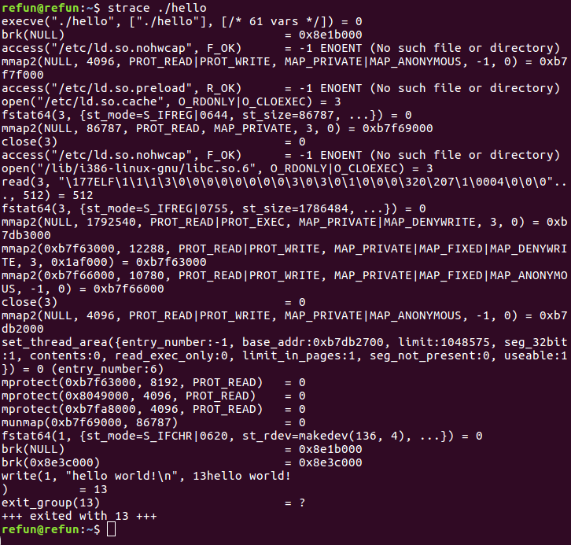

`strace` logged every system call that happened, starting from when it was being executed by the system. `execve` is the first system call that was logged. Calling _execve_ runs a program pointed to by the filename in its function argument. open and read are system calls that are used here to read files. `mmap2`, `mprotect`, and `brk` are responsible for memory activities such as allocation, permissions, and segment boundary setting.

Deep inside the code of `puts`, it eventually executes a `write` system call. _write_, in general, writes data to the object it was pointed to. Usually, it is used to write to a file. In this case, _write_'s first parameter has a value of `1`. The value of `1` denotes `STDOUT`, which is the handle for the console output. The second parameter is the message, thus, it writes the message to `STDOUT`.

#### Going further with debugging

First, we need to install `gdb` by running the following command:

Copy

    sudo apt install gdb

The installation should look something like this:

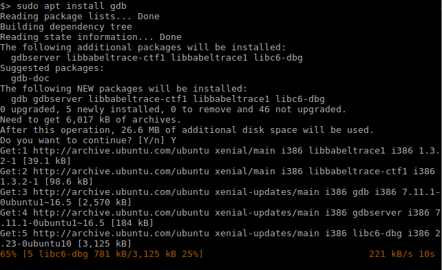

Then, use `gdb` to debug the `hello` program, as follows:

Copy

    gdb ./hello

`gdb` can be controlled using commands. The commands are fully listed in online documentation, but simply entering _help_ can aid us with the basics.

You can also use `gdb` to show the disassembly of specified functions, using the `disass` command. For example, let's see what happens if we use the `disass main` command:

Then, again we have been given the disassembly in AT&T sytnax. To set `gdb` to use Intel syntax, use the following command:

Copy

    set disassembly-flavor intel

This should give us the Intel assembly language syntax, as follows:

To place a breakpoint at the _main_ function, the command would be `b *main`. 

### Note

Take note that the asterisk (_\*_) specifies an address location in the program. 

After placing a breakpoint, we can run the program using the `run` command. We should end up at the address of the `main` function:

To get the current values of the registers, enter `info registers`. Since we are in a 32-bit environment, the extended registers (that is, EAX, ECX, EDX, EBX, and EIP) are used. A 64-bit environment would show the registers with the R-prefix (that is, RAX, RCX, RDX, RBX, and RIP).

Now that we are at the main function, we can run each instruction with step into (the `stepi` command) and step over (the `nexti` command). Usually, we follow this with the `info registers` command to see what values changed. 

### Note

The abbreviated command equivalent of `stepi` and `nexti` are `si` and `ni` respectively.

Keep on entering `si` and `disass main` until you reach the line containing `call   0x80482e0 <puts@plt>`. You should end up with these `disass` and `info registers` result:

The `=>` found at the left side indicates where the instruction pointer is located. The registers should look similar to this:

Before the _puts_ function gets called, we can inspect what values were pushed into the stack. We can view that with `x/8x $esp`:

The `x` command is used to show a memory dump of the specified address. The syntax is x/FMT ADDRESS. FMT has 3 parts: the repeat count, the format letter, and the size letter. You should be able to see more information about the `x` command with `help x`. `x/8x $esp` shows 8 DWORD hexadecimal values from the address pointed by the `esp` register. Since the address space is in 32 bits, the default size letter was shown in `DWORD` size.

`puts` expects a single parameter. Thus, we are only interested in the first value pushed at the `0x080484c0` stack location. We expect that the parameter should be an address to where the message should be. So, entering the `x/s`command should give us the contents of the message, as follows:

Next, we need to do a step over (`ni`) the call instruction line. This should display the following message:

But if you used `si`, the instruction pointer will be in the _puts_ wrapper code. We can still go back to where we left off using the `until` command, abbreviated as `u`. Simply using the `until` command steps in one instruction. You'll have to indicate the address location where it will stop. It is like a temporary breakpoint. Remember to place an asterisk before the address:

The remaining `6` lines of code restore the values of _ebp_ and _esp_ right after entering the main function, then returning with _ret_. Remember that a call instruction would store the return address at the top of the stack, before actually jumping to the function address. The `ret` instruction will read the return value pointed to by the _esp_ register.

The values of `esp` and `ebp`, right after entering the main function, should be restored before the _ret_ instruction. Generally, a function begins by setting up its own stack frame for use with the function's local variables. 

Here's a table showing the changes in the values of the `esp`, `ebp`, and `ecx` registers after the instruction at the given address. 

### Note

Note that the stack, denoted by the _esp_ register, starts from a high address and goes down to lower addresses as it is used to store data.

**Address**

**Instruction**

**esp**

**ebp**

**ecx**

**Remarks**

`0x0804840b`

`lea ecx,[esp+0x04]`

`0xbffff08c`

`0`

`0xbffff090`

Initial values after entering main. 

\[0xbffff08c\] = 0xb7e21637

This is the return address. 

`0x0804840f`

`and esp,0xfffffff0`

`0xbffff080`

`0`

`0xbffff090`

Aligns the stack in 16-byte paragraphs. In effect, this subtracts 0xc from esp.

`0x08048412`

`push DWORD PTR [ecx-0x4]`

`0xbffff07c`

`0`

`0xbffff090`

\[0xbffff07c\] = 0xb7e21637

ecx - 4 = 0xbffff08c points to the return address.

The return address is now placed in two stack addresses.

`0x08048415`

`push ebp`

`0xbffff078`

`0`

`0xbffff090`

Begins stack frame setup.

\[0xbffff078\] = 0

`0x08048416`

`mov ebp,esp`

`0xbffff078`

`0xbffff078`

`0xbffff090`

Saves esp.

`0x08048418`

`push ecx`

`0xbffff074`

`0xbffff078`

`0xbffff090`

Saves ecx.

\[0xbffff074\] = 0xbffff090

`0x08048419`

`sub esp,0x4`

`0xbffff070`

`0xbffff078`

`0xbffff090`

Allocates 4 bytes for stack frame.

`0x0804841c`

`sub esp,0xc`

`0xbffff064`

`0xbffff078`

`0xbffff090`

Allocates another 12 bytes for stack frame.

`0x0804841f`

`push 0x80484c0`

`0xbffff060`

`0xbffff078`

`0xbffff090`

\[0xbffff060\] = 0x080484c0

\[0x080484c0\] = "hello world!"

`0x08048424`

`call 0x80482e0 <puts@plt>`

`0xbffff060`

`0xbffff078`

`0xffffffff`

Stack is still the same after the call.

`0x08048429`

`add esp,0x10`

`0xbffff070`

`0xbffff078`

`0xffffffff`

Adds 0x10 to esp reducing the stack frame.

`0x0804842c`

`nop`

`0xbffff070`

`0xbffff078`

`0xffffffff`

No operation

`0x0804842d`

`mov ecx,DWORD PTR [ebp-0x4]`

`0xbffff070`

`0xbffff078`

`0xbffff090`

Restores the value of ecx before call.

`0x08048430`

`leave`

`0xbffff07c`

`0`

`0xbffff090`

`leave` is the equivalent of`mov esp, ebp``pop ebp`

`0x08048431`

`lea esp,[ecx-0x4]`

`0xbffff08c`

`0`

`0xbffff090`

ecx - 4 = 0xbffff08c

\[0xbffff08c\] = 0xb7e21637

The address of esp is restored back.

`0x08048434`

`ret`

`-`

`-`

`-`

Returns to 0xb7e21637

You can either continue exploring the cleanup code after `ret`, or just make the program eventually end by using `continue` or its abbreviation, `c`, as follows:

### A better debugger

Before moving to more Linux executable-reversing activities, let's explore more tools. `gdb` seems fine, but it would have been better if we were able to debug it interactively, using visual tools for debugging. In [Chapter 5](/book/networking_and_servers/9781788838849/5),_ Tools of Trade_, we introduced the Radare, under the _Disassemblers_ and _Debuggers_ sections, as a tool that is capable of doing both disassembly and debugging. So, let's get a feel for using Radare.

#### Setup

Radare is in its second version. To install it, you'll need _**git**_ to install from the GitHub repository, as follows:

Copy

    git clone https://github.com/radare/radare2.git

The instructions for installing it are written in the `README` file. As of the time of writing, it is suggested that `Radare2` is installed by running the `sys/install.sh` or `sys/user.sh` shell scripts from the Terminal.

#### Hello World in Radare2

Besides its disassembler and debugger, `Radare2` is also packed with a bunch of tools . Most of these are static analysis tools.

To get the `MD5` hash of the hello world binary file, we can use `rabin2`:

With the use of the `ls` command and `rahash2`, we are able to determine these pieces of information:

Copy

    filesize: 7348 bytes
    time stamp: July 12 21:26 of this year
    md5: 799554478cf399e5f87b37fcaf1c2ae6
    sha256: 90085dacc7fc863a2606f8ab77b049532bf454badefcdd326459585bea4dfb29

`rabin2` is another tool that can extract static information from a file, such as the type of file, header information, sections, and strings.

Let's get the type of file first by using the `rabin2 -I hello` command:

The _bintype_, _class,_ _hascode,_ and _os_ fields indicate that the file is an executable 32-bit ELF file that runs in Linux. _arch_, _bits_, _endian,_ and _machine_ suggest that the file was built with an x86 code. In addition, the _lang_ field indicates that the file was compiled from C language. This information will definitely help us prepare for what to expect during disassembly and debugging.

To list imported functions, we use `rabin2 -i hello`:

There are two global functions we are interested in: `puts` and `__libc_start_main. puts`, as we discussed, is used to print a message. \_\_libc\_start\_main is a function that initializes the stack frame, sets up the registers and some data structures, sets up error handling, and then calls the `main()` function.

To get the ELF header info, use `rabin2 -H hello`:

If we are only interested with the strings we can find from the data section, use the `rabin2 -z hello` command:

With `rabin2`, we got additional information about the file, shown here:

Copy

    filetype: 32-bit elf file and has executable code for Linux
    architecture: x86 Intel
    functions: imports puts and has a main function
    notable strings: hello world!

Let's try the `radare2` debugger itself. From the Terminal console, you can either use `radare2`'s abbreviation `r2`, or `radare2` itself, with the `-d <file>` as its argument:

This takes you to the `radare2` console. Enclosed in square brackets, the address indicates where the current `eip` is. It is not the entry point of the hello program, but rather an address in the dynamic loader. As with `gdb`, you'll have to enter commands. To bring up help, just use **_?_** and it will show you a list of commands as follows:

We start off by using the `aaa` command. This analyzes the code for function calls, flags, references and tries to generate constructive function names:

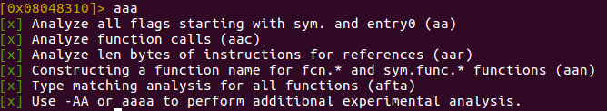

Using the `V!`command sets the console to visual mode. In this mode, we should be able to debug the program while having an interactive view of the registry and the stack. Entering `:` should show a command console. Pressing _**`Enter`**_ should bring us back to visual mode. Type `V?` to show more visual mode commands. It is also best to maximize the Terminal window to get a better view of the debugger:

In the command console, enter `db entry0`. This should set a breakpoint at the entry point address of our program. But, since we also know that this program has a main function, you can also enter `db sym.entry` to set a breakpoint at the main function.

In visual mode, you can start the actual debugging using these keys that are available by default:

Copy

    | F2 toggle breakpoint
    | F4 run to cursor
    | F7 single step
    | F8 step over
    | F9 continue

With the entry point and main function set with a breakpoint, press _**`F9`**_ to run the program. We should end up in the entry point address. 

### Note

You'll need to refresh radare2's visual mode by reopening it to see the changes. To do that, just press `q` twice to quit visual mode. But before running `V!` again, you'll need to seek the current _eip_ by using the `s eip` command.

Pressing _F9_ again should bring you to the main function of our program. Remember to refresh the visual mode:

Press _**`F7`**_ or _**`F8`**_ to trace the program while seeing the stack and registers change. The letter **b** at the left of the address at line `0x0804840b` indicates that the address is set with a breakpoint. 

So far, we have learned about the basic commands and keys. Feel free to explore the other commands and you'll definitely get more information and learn some easy ways to work around analyzing files. 

### What is the password?

So now that we know how to debug "`Unix style`", let's try the passcode program. You can download the passcode program from [https://github.com/PacktPublishing/Mastering-Reverse-Engineering/raw/master/ch6/passcode](https://github.com/PacktPublishing/Mastering-Reverse-Engineering/raw/master/ch6/passcode).

Try to get some static information. Here's a list of commands you can use:

Copy

    ls -l passcode
    rahash2 -a md5,sha256 passcode
    rabin2 -I passcode
    rabin2 -i passcode
    rabin2 -H passcode
    rabin2 -z passcode

At this point, the information we're after is as follows:

*   File size: 7,520 bytes
*   MD5 hash: `b365e87a6e532d68909fb19494168bed`
*   SHA256 hash: `68d6db63b69a7a55948e9d25065350c8e1ace9cd81e55a102bd42cc7fc527d8f`
*   The type of file: ELF
    
    *   32-bit x86 Intel
    *   Compiled C code that has notable imported functions: `printf`, `puts`, `strlen` and `__isoc99_scanf`
    
*   Notable strings are as follows:
    
    *   Enter password:
    *   Correct password!
    *   Incorrect password!
    

Now, for a quick dynamic analysis, let's use `ltrace ./passcode`:

We tried a few passwords but none returned "**`Correct password!`**" The file doesn't even have a hint in the list of strings for us to use. Let's try `strace`:

The line with `read(0, asdf123` is where the password was manually entered. The code after this goes to the exit door. Let's do a deadlisting activity based on the disassembly, but this time, we'll use `radare2`'s graphical view. Go ahead and open up `radare2` with the `radare2 -d passcode` command. In the `radare2` console, use this sequence of commands:

Copy

    aaa
    s sym.main
    VVV

These should open up a graphical representation of the disassembly code blocks from the _main_ function. Scroll down and you should see conditional branching where the green line denotes a `true`, while the red line denotes a `false` flow. Keep scrolling down until you see the `Correct password!` text string. We'll work backwards from there:

In the `0x80485d3` block, where the `Correct password!` string is, we see that the message was displayed using _puts_. Going to that block is a red line from the `0x80485c7` block. In the `0x80485c7` block, the value in `local_418h` was compared to `0x2de` (or 734 in decimal format). The value should be equal to 734 to make it go to the `Correct password!` block. If we were to try to decompile the C code, it would look something like this:

Copy

    ...
    if (local_418h == 734)
        puts("Correct password!)
    ...

Scroll up to see where the red line came from:

By the way this graph looks, there is a loop, and to exit the loop, it would require the value at `local_414h` to be greater than or equal to the value at `local_410h`. The loop exits to the `0x80485c7` block. At the `0x8048582` block, both values at `local_418h` and `local_414h` are initialized to 0. These values are compared in the `0x80485b9` block.

Inspecting the `0x8048598` block, there are three variables of concern: `local_40ch`, `local_414h`, and `local_418h`. If we were to make a pseudo code of this block, it would look like this:

Copy

    eax = byte at address [local_40ch + local_414h]
    add eax to local_418h 
    increment local_414h

`local_414h` seem to be a pointer of the data pointed to by `local_40c`. `local_418` starts from 0, and each byte from `local_40ch` is added. Looking at an overview, a checksum algorithm seems to be happening here:

Copy

    ...
    // unknown variables for now are local_40ch and local_410h
    int local_418h = 0;
    for (int local_414h = 0; local_414h < local_410h; local_414++)
    {
        local_418h += local_40ch[local_414h];
    }
    
    if (local_418h == 734)
        puts("Correct password!)
    ...

Let's move further up and identify what `local_40ch` and `local_410h` should be:

This is the main block. There are three named functions here:

*   `printf()`
*   `scanf()`
*   `strlen()`

`local_40ch` and `local_410h` here were used. `local_40ch` is the second parameter for `scanf`, while the data at the `0x80486b1` address should contain the format expected. `local_40ch` contains the buffer typed in. To retrieve the data at `0x80486b1`, just enter a colon (`:`), enter `s 0x80486b1`, then return back to the visual mode. Press `q` again to view the data:

The length of the data in `local_40ch` is identified and stored in `local_410h`. The value at `local_410h` is compared to 7. If equal, it follows the red line going to the `0x8048582` block, or the start of the checksum loop. If not, it follows the green line going to the `0x80485e5` block that contains code that will display **`Incorrect password! `**

In summary, the code would most likely look like this:

Copy

    ...
    printf ("Enter password: ");
    scanf ("%s", local_40ch);
    local_410h = strlen(local_40ch);
    
    if (local_410h != 7)
        puts ("Incorrect password!);
    else
    {
        int local_418h = 0;
        for (int local_414h = 0; local_414h < local_410h; local_414++)
        {
            local_418h += local_40ch[local_414h];
        }
    
        if (local_418h == 734)
            puts("Correct password!)
    }

The entered password should have a **size of 7 characters** and the sum of all characters in the password should be **equal to 734**. Therefore, the password can be anything, as long as it satisfies the given conditions.

Using the ASCII table, we can determine the equivalent value of each character. If the sum is 734 from a total of 7 characters, we simply divide 734 by 7. This gives us a value of 104, or 0x68 with a remainder of 6. We can distribute the remainder, 6, to 6 of the characters, giving us this set:

**Decimal**

**Hex**

**ASCII character**

`105`

`0x69`

`i`

`105`

`0x69`

`i`

`105`

`0x69`

`i`

`105`

`0x69`

`i`

`105`

`0x69`

`i`

`105`

`0x69`

`i`

`104`

`0x68`

`h`

Let's try the password `_iiiiiih_` or `_hiiiiii_`, as follows:

Network traffic analysis
------------------------

* * *

This time, we'll work on a program that receives a network connection and sends back some data. We will be using the file available at [https://github.com/PacktPublishing/Mastering-Reverse-Engineering/raw/master/ch6/server](https://github.com/PacktPublishing/Mastering-Reverse-Engineering/raw/master/ch6/server). Once you have it downloaded, execute it from the Terminal as follows:

The program is a server program that waits for connections to port `9999`. To test this out, open a browser, then use the IP address of the machine where the server is running, plus the port. For example, use `127.0.0.1:9999` if you're trying this from your own machine. You might see something like the following output:

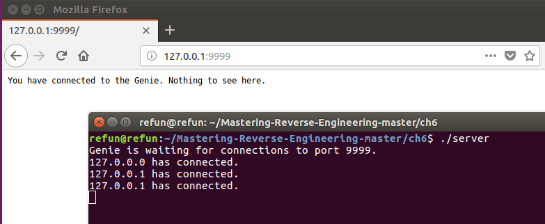

To understand network traffic, we need to capture some network packets by using tools such as `tcpdump`. `tcpdump` is usually pre-installed in Linux distributions. Open another Terminal and use the following command:

Copy

    sudo tcpdump -i lo 'port 9999'  -w captured.pcap

Here's a brief explanation of the parameters used:

`-i lo` uses the `loopback` network interface. We have used it here since we plan on accessing the server locally.

`'port 9999'`, with the single quotes, filters only packets that are using port 9999.

`-w captured.pcap` writes data packets to a PCAP file named `captured.pcap`.

Once `tcpdump` listens for data, try connecting to the server by visiting `127.0.0.1:9999` from the browser. If you wish to connect from outside the machine which holds the server, then re-run `tcpdump` without the `-i lo` parameter. This uses the default network interface instead. And instead of visiting using `127.0.0.1`, you'll have to use the IP address used by the default network interface.

To stop `tcpdump`, just break it using _Ctrl_ + _C_.

To view the contents of `captured.pcap` in human readable form, use the following command:

Copy

    sudo tcpdump -X -r captured.pcap > captured.log

This command should redirect the the `tcpdump` output to `captured.log`. The `-X` parameter shows the packet data in hexadecimal and ASCII. `-r captured.pcap` means read from the `PCAP` file `captured.pcap`. Opening the `captured.log` file should look something like the following:

Before we proceed, let's examine some basics on the two most popular network protocols, **Transmission Control Protocol **(**TCP**) and **User Datagram Protocol** (**UDP**). TCP is a network transmission in which a communication between a sender and a receiver is established. The communication begins with a 3-way handshake, where the sender sends a SYN flag to the receiver, then the receiver sends back SYN and ACK flags to the sender, and finally, the sender sends an ACK flag to the receiver, opening the start of a communication. Further exchange of data between the sender and receiver are done in segments. Every segment has a 20-byte TCP header that contains the IP address of the sender and the receiver and any current status flags. This is followed by the size of the data being transmitted and the data itself. UDP uses a shorter header, since it only sends data and doesn't require acknowledgement from the receiver. It is not required, via UDP, to do a 3-way handshake. The primary purpose of UDP is to keep sending data to the receiver. TCP seems to be more reliable in terms of exchanging data, however. For UDP, sending data is much faster, as there are no overheads required. UDP is commonly used to transmit huge amounts of data via file transmission protocols, while TCP is used to communicate data that requires integrity.

In the preceding screenshot, lines 1 to 15 show a TCP 3-way handshake. The first connection from the localhost port at `55704` (client) to the localhost port at `9999` (server) is a SYN, denoted in the flags as `S`. This was responded to by an `S.` flag, which means SYN and ACK. The last is an ACK denoted by `.` in the flags. The client port at 55704 is an ephemeral port. An ephemeral port is a system generated port for client connections. The server port at `9999` is fixed in the server program.

In lines 16 to 23, we can see the actual response data from the server to the client. The server sends back a data containing a 55 character data containing the string "_You have connected to the Genie. Nothing to see here._" and 2 new line (`0x0A`) characters to the client. The data before the 55 character string is the packet's header containing information about the packet. The packet header, when parsed, is the information described in line 16. The TCP flags are `P.`, which means PUSH and ACK. The information in the packet header structure is documented in the TCP and UDP specifications. You can start to look for these specifications at `RFC 675`, available at [https://tools.ietf.org/html/rfc675](https://tools.ietf.org/html/rfc675), and `RFC 768`, available at [https://tools.ietf.org/html/rfc768](https://tools.ietf.org/html/rfc768). To fast-track the process, we can use Wireshark, which will be discussed later, to help us parse through the packet information.

In lines `24` to `28`, FIN and ACK flags, formatted as `F.`, are sent from the server to the client, saying that the server is closing the connection. Lines 29 to 33 is an ACK response, `.`, that acknowledges the connection is being closed.

A better tool for capturing and viewing this graphically is _**Wireshark**_. Previously known as _Ethereal_, Wireshark has the same capabilities as `tcpdump`. Wireshark can be manually downloaded and installed from [https://www.wireshark.org/](https://www.wireshark.org/). It can also be installed using the following `apt` command:

Copy

    sudo apt install wireshark-qt

Capturing network packets requires root privileges in order to access the network interfaces. This is the reason for our use of `sudo` when running _**tcpdump**_. The same goes when using _**Wireshark**_. So, to execute _**Wireshark**_ in Linux, we use the following command:

Copy

    sudo wireshark

Besides capturing traffic and showing it in real time, you can also open and view PCAP files in _**Wireshark**_:

To start capturing, double-click on `any` from the list of interfaces. This essentially captures from both the default network interface and the loopback interface _lo_. What you'll see are continuous lines of network traffic packets. Wireshark has a display filter to minimize all the noise we see. For our exercise, in the filter field, enter the following display filter:

Copy

    tcp.port == 9999

This should only show packets that use the TCP port at `9999`. There are more filters you can experiment on. These are documented in Wireshark's manual pages.

Clicking on a packet shows parsed information that gives you a better understanding of the packet fields, as shown in the following screenshot:

Wireshark has a wide-knowledge of standard packets. This makes Wireshark a must-have tool for every analyst.

Summary
-------

* * *

In this chapter, our discussions revolved around reverse engineering tools that are already built into Linux systems. Debian-based operating systems, such as Ubuntu, are popular for reverse engineering purposes because of the wide community and tools available. We have focused more on how to analyze Linux' native executable, the ELF file. We started off by using GCC to compile a C program source into an ELF executable. We proceeded to analyze the executable using static info-gathering tools, including `ls`, `file`, `strings`, and `objdump`. Then we used `ltrace` and `strace` to carry out a dynamic analysis. Then we used `gdb` to debug the program, showing us Intel assembly language syntax.

We also introduced and explored the `radare2` toolkit. We used `rahash2` and `rabin2` to gather static information, and used `radare2` for disassembly and debugging in an interactive view. Network analysis tools were not left behind either, as we used `tcpdump` and `Wireshark`. 

In the information security world, most files to be analyzed are executables based on Microsoft Windows, which we're going to discuss in the next chapter. We may not encounter much analysis of Linux files in the industry, but knowing how to do it will definitely come in handy when the task requires it.  

Further reading
---------------

* * *

The files and sources used in this chapter can be found at [https://github.com/PacktPublishing/Mastering-Reverse-Engineering/tree/master/ch6](https://github.com/PacktPublishing/Mastering-Reverse-Engineering/tree/master/ch6)[.](https://github.com/PacktPublishing/Mastering-Reverse-Engineering/tree/master/ch6)

Chapter 7. RE for Windows Platforms
-----------------------------------

With Windows being one of the most popular operating systems in the world, most software in the cyber world has been written for it. This includes malware.

This chapter focuses on the analysis of the Windows native executable, the PE file, and evolves directly by doing file analysis, that is, gathering static information and performing dynamic analysis. We will dig deeper into understanding how the PE file behaves with the Windows operating system. The following topics will be covered in this chapter:

*   Analyzing Windows PE
*   Tools
*   Static analysis
*   Dynamic analysis

Technical requirements
----------------------

* * *

This chapter requires knowledge of the Windows environment and its administration. The reader should also know how to use commands in Command Prompt. The first portion of this chapter requires the user to have basic knowledge of building and compiling C programs using Visual Studio or similar software.

Hello World
-----------

* * *

Programs in the Windows environment communicate with the system by using Windows APIs. These APIs are built around the file system, memory management (including processes, the stack, and allocations), the registry hive, network communication, and so forth. Regarding reverse engineering, a wide coverage of these APIs and their library modules is a good advantage when it comes to easily understanding how a program works when seen in its low-level language equivalent. So, the best way to begin exploring APIs and their libraries would be to develop some programs ourselves.

There are many high-level languages used by developers like C, C++, C#, and Visual Basic.  C, C++, and Visual Basic (native) compile to an executable that directly executes instructions in the x86 language. C# and Visual Basic (`p-code`) are usually compiled to use interpreters as a layer that turns the p-code into actual x86 instructions. For this chapter, we will focus on executable binaries compiled from C/C++ and assembly language. The goal is to have a better understanding of the behavior of programs that use Windows APIs.

For this chapter, our choice for building C/C++ programs will be the Visual Studio Community edition. Visual Studio is widely used for building Microsoft Windows programs. Given that it is also a product of Microsoft, it already contains the compatible libraries required to compile programs. You can download and install Visual Studio Community edition from [https://visualstudio.microsoft.com/downloads/](https://visualstudio.microsoft.com/downloads/).

These programs are neither harmful nor malicious. The following C programming activities can be done with Visual Studio in a bare metal machine. In case you are planning on installing Visual Studio in a Windows VM, at the time of writing this book, Visual Studio 2017 Community edition has the following recommended system requirements:

*   1.8 GHz dual core
*   4 GB of RAM
*   130 GB of disk space

These system requirements can be found at [https://docs.microsoft.com/en-us/visualstudio/productinfo/vs2017-system-requirements-vs](https://docs.microsoft.com/en-us/visualstudio/productinfo/vs2017-system-requirements-vs). You may need to perform some Windows updates and install the .NET framework. This can also be installed from the Windows 7 setup that we previously downloaded from [https://developer.microsoft.com/en-us/microsoft-edge/tools/vms/](https://developer.microsoft.com/en-us/microsoft-edge/tools/vms/) . Please visit the Microsoft Visual Studio website for the requirements of newer versions.

There are many Visual Studio alternatives that have minimal requirements like Bloodshed Dev C++, Zeus IDE, and Eclipse. However, some of these IDE may not be up-to-date and/or may need to the compiler and its dependencies to have been properly set up.

### Learning about the APIs

We'll be skipping `Hello World` here since we have already made one in the previous chapters. Instead, we'll be looking into the following example programs:

*   A keylogger saved to a `filez`
*   Enumerating a registry key and printing it out
*   List processes and printing out
*   Encrypting data and storing it in a file
*   Decrypting an encrypted file
*   Listening to port `9999` and sending back a message when connected

The source code for these programs can be found at [https://github.com/PacktPublishing/Mastering-Reverse-Engineering/tree/master/ch7](https://github.com/PacktPublishing/Mastering-Reverse-Engineering/tree/master/ch7). Feel free to play with these programs, add your own code, or even create your own version. The aim here is to get you to learn how these APIs work, hand in hand.

One of the keys to determining how a program behaves is to learn how APIs are used. The use of each API is documented in the Microsoft Developer Network (MSDN) library. The programs we are about to look into are just examples of program behaviors. We use these APIs to build upon these behaviors. Our goal here is to learn how these APIs are used and interact with each other. 

As a reverse engineer, it is expected and required for the reader to use the MSDN or other resources to further understand the details on how the API works. The API name can be searched in the MSDN library at [https://msdn.microsoft.com](https://msdn.microsoft.com).

#### Keylogger

A keylogger is a program that logs what keys have been pressed by a user. The log is usually stored in a file. The core API used here is `GetAsyncKeyState`. Every button that can be pressed from the keyboard or the mouse has an assigned ID called a virtual key code. Specifying a virtual key code, the `GetAsyncKeyState` gives information about whether the key has been pressed or not. 

### Note

The source code for this program can be found at [https://github.com/PacktPublishing/Mastering-Reverse-Engineering/blob/master/ch7/keylogger.cpp](https://github.com/PacktPublishing/Mastering-Reverse-Engineering/blob/master/ch7/keylogger.cpp).

For keylogging to work, we will need to check the state of each virtual key code and run them in a loop. Once a key has been identified as pressed, the virtual key code gets stored into a file. The following code does just that:

Copy

      while (true) {
     for (char i = 1; i <= 255; i++) {
     if (GetAsyncKeyState(i) & 1) {
     sprintf_s(lpBuffer, "\\x%02x", i);
     LogFile(lpBuffer, (char*)"log.txt");
     }
     }

`LogFile` here is a function that accepts two parameters: the data that it writes and the file path of the log file. `lpBuffer` contains the data and is formatted by the `sprintf_s` API as `\\x%02x`. As a result, the format converts any numbers into a two-digit hexadecimal string. The number 9 becomes `\x09`, and the number 106 becomes `\x6a`. 

All we need are three Windows API functions to implement the storage of data to a log file – `CreateFile`, `WriteFile`, and `CloseHandle` – as shown in the following code:

Copy

    void LogFile(char* lpBuffer, LPCSTR fname) {
    
      BOOL bErrorFlag;
      DWORD dwBytesWritten;
    
      HANDLE hFile = CreateFileA(fname, FILE_APPEND_DATA, 0, NULL, OPEN_ALWAYS, FILE_ATTRIBUTE_NORMAL, NULL);
      bErrorFlag = WriteFile(hFile, lpBuffer, strlen(lpBuffer), &dwBytesWritten, NULL);
      CloseHandle(hFile);
    
      return;_
    }

`CreateFileA` is used to create or open a new file given the filename and how the file will be used. Since the purpose of this exercise is to continuously log the virtual key codes of pressed keys, we need to open the file in append mode (`FILE_APPEND_DATA`). A file handle is returned to `hFile` and is used by `WriteFile`. `lpBuffer` contains the formatted virtual key code. One of the parameters `WriteFile` requires is the size of the data to be written. The `strlen` API was used here to determine the length of the data. Finally, the file handle is closed using the `CloseHandle`. It is important to close file handles to make the file available for use.

There are different keyboard variants that cater to the language of the user. Thus, different keyboards may have different virtual key codes. At the start of the program, we used `GetKeyboardLayoutNameA(lpBuffer)` to identify the type of keyboard being used.  When reading the log, the type of keyboard will be used as a reference to properly identify which keys were pressed.

#### regenum

The `regenum` program, as mentioned below, aims to enumerate all values and data in a given registry key. The parameters required for the APIs depend on the result of the previous APIs. Just like how we were able to write data to a file in the keylogger program, registry enumerating APIs also require a handle. In this case, a handle to the registry key is used by the `RegEnumValueA` and `RegQueryValueExA` APIs.

### Note

The source code for this program can be found at [https://github.com/PacktPublishing/Mastering-Reverse-Engineering/blob/master/ch7/regenum.cpp](https://github.com/PacktPublishing/Mastering-Reverse-Engineering/blob/master/ch7/regenum.cpp).

Copy

    int main()
    {
     LPCSTR lpSubKey = "Software\\Microsoft\\Windows\\CurrentVersion\\Run";
     HKEY hkResult;
     DWORD dwIndex;
     char ValueName[1024];
     char ValueData[1024];
     DWORD cchValueName;
     DWORD result;
     DWORD dType;
     DWORD dataSize;
     HKEY hKey = HKEY_LOCAL_MACHINE;
    
     if (RegOpenKeyExA(hKey, lpSubKey, 0, KEY_READ, &hkResult) == ERROR_SUCCESS)
     {
     printf("HKEY_LOCAL_MACHINE\\%s\n", lpSubKey);
     dwIndex = 0;
     result = ERROR_SUCCESS;
     while (result == ERROR_SUCCESS)
     {
     cchValueName = 1024;
     result = RegEnumValueA(hkResult, dwIndex, (char *)&ValueName, &cchValueName, NULL, NULL, NULL, NULL);
     if (result == ERROR_SUCCESS)
     {
     RegQueryValueExA(hkResult, ValueName, NULL, &dType, (unsigned char *)&ValueData, &dataSize);
     if (strlen(ValueName) == 0)
     sprintf((char*)&ValueName, "%s", "(Default)");
     printf("%s: %s\n", ValueName, ValueData);
     }
     dwIndex++;
     }
     RegCloseKey(hkResult);
     }
     return 0;
    }

The enumeration begins by retrieving a handle for the registry key via `RegOpenKeyExA`. A successful return value should be non-zero, while its output should show a handle stored in `hkResult`. The registry key that is being targeted here is `HKEY_LOCAL_MACHINE\Software\Microsoft\Windows\CurrentVersion\Run`.

The handle in `hkResult` is used by `RegEnumValueA` to begin enumerating each registry value under the registry key. Subsequent calls to `RegEnumValueA` gives the next registry value entry. This block of code is therefore placed in a loop until it fails to return an `ERROR_SUCCESS` result. An `ERROR_SUCCESS` result means that a registry value was successfully retrieved.

For every registry value, `RegQueryValueExA` is called. Remember that we only go the registry value, but not its respective data. Using `RegQueryValueExA`, we should be able to acquire the registry data.

Finally, we have to close the handle by using `RegCloseKey`.

Other APIs that are used here are `printf`, `strlen`, and `sprintf`. `printf` was used in the program to print the target registry key, value, and data to the command-line console. `strlen` was used to get the text string length. Every registry key has a default value. Since `RegEnumValueA` will return `ERROR_SUCCEPantf`, we are able to replace the `ValueName` variable with a string called `(Default)`:

#### processlist

Similar to how enumerating registry values works, listing processes also works on the same concept. Since the processes in real-time change fast, a snapshot of the process list needs to be taken. The snapshot contains a list of process information at the time the snapshot was taken. The snapshot can be taken using `CreateToolhelp32Snapshot`. The result is stored in `hSnapshot`, which is the snapshot handle. 

To begin enumerating the list, `Process32First` is used to acquire the first process information from the list. This information is stored in the `pe32` variable, which is a `PROCESSENTRY32` type. Subsequent process information is retrieved by calling `Process32Next`. `CloseHandle` is finally used when done with the list.

Again, `printf` is used to print out the executable file name and the process ID:

Copy

    int main()
    {
      HANDLE hSnapshot;
      PROCESSENTRY32 pe32;
    
      hSnapshot = CreateToolhelp32Snapshot(TH32CS_SNAPPROCESS, 0);
      pe32.dwSize = sizeof(PROCESSENTRY32);
    
      if (Process32First(hSnapshot, &pe32))
      {
        printf("\nexecutable [pid]\n");
        do
        {
          printf("%ls [%d]\n", pe32.szExeFile, pe32.th32ProcessID);
        } while (Process32Next(hSnapshot, &pe32));
        CloseHandle(hSnapshot);
      }
        return 0;
    }

### Note

The source code for this program can be found at [https://github.com/PacktPublishing/Mastering-Reverse-Engineering/blob/master/ch7/processlist.cpp](https://github.com/PacktPublishing/Mastering-Reverse-Engineering/blob/master/ch7/processlist.cpp).

#### Encrypting and decrypting a file

Ransomware has been one of the most popular malware to spread out globally. Its core element is being able to encrypt files.

In these encrypt and decrypt programs, we are going to learn about some of the basic APIs used in encryption and decryption.  

The API used to encrypt is `CryptEncrypt`, while `CryptDecrypt` is used for decryption. However, these APIs require at least a handle to the encryption key. To obtain the handle to the encryption key, a handle to the **Cryptographic Service Provider** (**CSP**) is required. In essence, before calling `CryptEncrypt` or `CryptDecrypt`, calling a couple of APIs is required to set up the algorithm that will be used.

In our program, `CryptAcquireContextA` is used to get a `CryptoAPI` handle of a key container from a CSP. It is in this API where the algorithm, AES, is indicated. The key that the encryption will be using will be controlled by a user-defined password which is set in the `password[]` string. To get a handle to the derived key, the APIs `CryptCreateHash`, `CryptHashData`, and `CryptDeriveKey` are used while passing the user-defined `password` to `CryptHashData`. The data to be encrypted and assigned in the `buffer` variable,is passed to `CryptEncrypt`. The resulting encrypted data is written in the same data buffer, overwriting it in the process:

Copy

    int main()
    {
      unsigned char buffer[1024] = "Hello World!";
      unsigned char password[] = "this0is0quite0a0long0cryptographic0key";
      DWORD dwDataLen;
      BOOL Final;
    
      HCRYPTPROV hProv;
    
      printf("message: %s\n", buffer);
      if (CryptAcquireContextA(&hProv, NULL, NULL, PROV_RSA_AES, CRYPT_VERIFYCONTEXT))
      {
        HCRYPTHASH hHash;
        if (CryptCreateHash(hProv, CALG_SHA_256, NULL, NULL, &hHash))
        {
          if (CryptHashData(hHash, password, strlen((char*)password), NULL))
          {
            HCRYPTKEY hKey;
            if (CryptDeriveKey(hProv, CALG_AES_128, hHash, NULL, &hKey))_
            {
              Final = true;
              dwDataLen = strlen((char*)buffer);
              if (CryptEncrypt(hKey, NULL, Final, NULL, (unsigned char*)&buffer, &dwDataLen, 1024))
              {
                printf("saving encrypted buffer to message.enc");
                LogFile(buffer, dwDataLen, (char*)"message.enc");
              }
              printf("%d\n", GetLastError());
              CryptDestroyKey(hKey);
            }
          }
          CryptDestroyHash(hHash);
        }
        CryptReleaseContext(hProv, 0);
      }
      return 0;
    }

Using the modified version of the `LogFile` function, which now includes the size of the data to write, the encrypted data is stored in the `message.enc` file:

Copy

    void LogFile(unsigned char* lpBuffer, DWORD buflen, LPCSTR fname) {
    
      BOOL bErrorFlag;
      DWORD dwBytesWritten;
    
      DeleteFileA(fname);
    
      HANDLE hFile = CreateFileA(fname, FILE_ALL_ACCESS, 0, NULL, CREATE_ALWAYS, FILE_ATTRIBUTE_NORMAL, NULL);
      bErrorFlag = WriteFile(hFile, lpBuffer, buflen, &dwBytesWritten, NULL);
      CloseHandle(hFile);
    
      Sleep(10);
    
      return;
    }

To gracefully close the `CryptoAPI` handles, `CryptDestroyKey`, `CryptDestroyHash`, and `CryptReleaseContext` are used.

The encrypted message `Hello World!` will now look like this:

The way to decrypt the message is to use the same `CryptoAPIs`, but now use `CryptDecrypt`. This time, the contents of `message.enc` is read to the data buffer, decrypted, and then stored in `message.dec`. The CryptoAPIs are used in the same way as they were for acquiring the key handle. The buffer length stored in `dwDataLen` should initially contain the maximum length of the buffer:

Copy

    int main()
    {
      unsigned char buffer[1024];
      unsigned char password[] = "this0is0quite0a0long0cryptographic0key";
      DWORD dwDataLen;
      BOOL Final;
    
      DWORD buflen;
      char fname[] = "message.enc";
      HANDLE hFile = CreateFileA(fname, GENERIC_READ, FILE_SHARE_READ, NULL, OPEN_ALWAYS, FILE_ATTRIBUTE_NORMAL, NULL);
      ReadFile(hFile, buffer, 1024, &buflen, NULL);
      CloseHandle(hFile);
    
      HCRYPTPROV hProv;
    
      if (CryptAcquireContextA(&hProv, NULL, NULL, PROV_RSA_AES, CRYPT_VERIFYCONTEXT))
      {
        HCRYPTHASH hHash;
        if (CryptCreateHash(hProv, CALG_SHA_256, NULL, NULL, &hHash))
        {
          if (CryptHashData(hHash, password, strlen((char*)password), NULL))
          {
            HCRYPTKEY hKey;
            if (CryptDeriveKey(hProv, CALG_AES_128, hHash, NULL, &hKey))
            {
              Final = true;
              dwDataLen = buflen;
              if ( CryptDecrypt(hKey, NULL, Final, NULL, (unsigned char*)&buffer, &dwDataLen) )
              {
                printf("decrypted message: %s\n", buffer);
                printf("saving decrypted message to message.dec");
                LogFile(buffer, dwDataLen, (char*)"message.dec");
              }
              printf("%d\n", GetLastError());
              CryptDestroyKey(hKey);
            }
          }
          CryptDestroyHash(hHash);
        }
        CryptReleaseContext(hProv, 0);
      }
      return 0;
    }
    
    

### Note

The source code for the encryption and decryption programs can be found at the following links:Encryption: [https://github.com/PacktPublishing/Mastering-Reverse-Engineering/blob/master/ch7/encfile.cpp](https://github.com/PacktPublishing/Mastering-Reverse-Engineering/blob/master/ch7/encfile.cpp).Decryption: [https://github.com/PacktPublishing/Mastering-Reverse-Engineering/blob/master/ch7/decfile.cpp](https://github.com/PacktPublishing/Mastering-Reverse-Engineering/blob/master/ch7/decfile.cpp).

#### The server

In _[Chapter 6](/book/networking_and_servers/9781788838849/6), RE in Linux Platforms_, we learned about using socket APIs to control network communication between a client and a server. The same code can be implemented for the Windows operating system. For Windows, the socket library needs to be initiated by using the `WSAStartup` API before using socket APIs. In comparison to Linux functions, instead of using `write`, `send` is used to send data back to the client. Also, regarding `close`, the equivalent of this is `closesocket`, which is used to free up the socket handle.

Here's a graphical representation of how a server and a client generally communicate with the use of socket APIs.  Take note that the functions shown in the following diagram are Windows API functions:

The `socket` function is used to initiate a socket connection. When we're done with the connection, the communication is closed via the `closesocket` function.  The server requires that we `bind` the program with a network port. The `listen` and `accept` function is used to  wait for client connections. The send and `recv` functions are used for the data transfer between the server and the client. `send` is used to send data while `recv` is used to receive data. Finally,  `closesocket` is used to terminate the transmission. The code below shows an actual C source code of a server-side program that accepts connections and replies with `You have connected to the Genie. Nothing to see here`

> .

Copy

    int main()
    {
     int listenfd = 0, connfd = 0;
     struct sockaddr_in serv_addr;
     struct sockaddr_in ctl_addr;
     int addrlen;
     char sendBuff[1025];
    
    
     WSADATA WSAData;
    
     if (WSAStartup(MAKEWORD(2, 2), &WSAData) == 0)
     {
         listenfd = socket(AF_INET, SOCK_STREAM, 0);
         if (listenfd != INVALID_SOCKET)
         {
             memset(&serv_addr, '0', sizeof(serv_addr));
             memset(sendBuff, '0', sizeof(sendBuff));
             serv_addr.sin_family = AF_INET;
             serv_addr.sin_addr.s_addr = htonl(INADDR_ANY);
             serv_addr.sin_port = htons(9999);
             if (bind(listenfd, (struct sockaddr*)&serv_addr, sizeof(serv_addr)) == 0)
             {
                 if (listen(listenfd, SOMAXCONN) == 0)
                 {
                     printf("Genie is waiting for connections to port 9999.\n");
                     while (1)
                     {
                         addrlen = sizeof(ctl_addr);
                         connfd = accept(listenfd, (struct sockaddr*)&ctl_addr, &addrlen);
                         if (connfd != INVALID_SOCKET)
                         {
                             printf("%s has connected.\n", inet_ntoa(ctl_addr.sin_addr));
    
                             snprintf(sendBuff, sizeof(sendBuff), "You have connected to the Genie. Nothing to see here.\n\n");
                             send(connfd, sendBuff, strlen(sendBuff), 0);
                             closesocket(connfd);
                         }
                     }
                 }
             }
         closesocket(listenfd);
         }
     WSACleanup();
     }
     return 0;
    }

### Note

The source code for this program can be found at [https://github.com/PacktPublishing/Mastering-Reverse-Engineering/blob/master/ch7/server.cpp](https://github.com/PacktPublishing/Mastering-Reverse-Engineering/blob/master/ch7/server.cpp).

What is the password?
---------------------

* * *

In this section, we are going to reverse the `passcode.exe` program. As a practice run, we'll gather the information we need by using static and dynamic analysis tools. We'll use some of the Windows tools that were introduced in the previous chapters. Do not be limited by the tools that we are going to use here. There are a lot of alternatives that can do the same task.  The OS environment used to analyze this program is a Windows 10, 32-bit, 2 GB RAM, 2 core processor in a VirtualBox.

### Static analysis

The second piece of information that you'll need to know, next to knowing the filename, is the hash of the file. Let's pick Quickhash ([https://quickhash-gui.org/](https://quickhash-gui.org/)) to help us with this task.  After opening the `passcode.exe` file using Quickhash, we can get the hash calculations for various algorithms.  The following screenshot shows the calculated `SHA256` hash for the `passcode.exe` file:

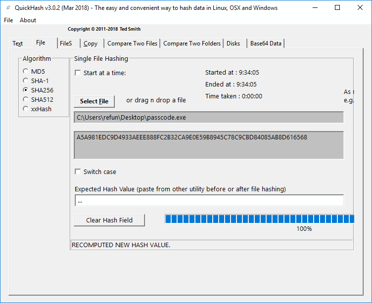

The file has a name extension of`.exe`. This initially sets us to use tools for analyzing Windows executable files. However, to make sure that this is indeed a Windows executable, let's use `TriD` to get the file type. `TrID` ([http://mark0.net/soft-trid-e.html](http://mark0.net/soft-trid-e.html)) is console-based and should be run on the Command Prompt.We will also need to download and extract`TriD`'s definitions from[ http://mark0.net/download/triddefs.zip](http://mark0.net/download/triddefs.zip).  In the following screenshot, we used `dir` and `trid`. By using directory listing with `dir`, we were able to get the file's time stamp and file size.  With the `trid` tool, we were able to identify what type of file `passcode.exe` is:

Now that we have verified that it is a Windows executable, using CFF Explorer should give us more file structure details. Download and install CFF Explorer from [https://ntcore.com/](https://ntcore.com/). Here is what you will see upon opening it: 

Both `TrID` and CFF Explorer identified the file as a Windows executable, but are not agreeing on their decisions. This might be confusing since TrID identified the file as a `Win64 Executable` while CFF Explorer identified it as a `Portable Executable 32`.  This requires identifying the machine type from the PE header itself. The header reference for PE files can be viewed at [http://www.microsoft.com/whdc/system/platform/firmware/PECOFF.mspx](http://www.microsoft.com/whdc/system/platform/firmware/PECOFF.mspx).  

We can use CFF Explorer's `Hex Editor` to view the binary. The first column shows the file offset, the middle column shows the hexadecimal equivalent of the binary, and the right-most column shows the printable characters:

The file begins with the `MZ` magic header, or `0x4d5a`, denoting a Microsoft executable file. At file offset `0x3c`, the `DWORD` value, read in little endian, is `0x00000080`. This is the file offset where the PE header is expected to be located. The PE header begins with a `DWORD` value equivalent of `0x00004550` or `PE` followed by two null bytes. This is followed by a `WORD` value that tells you on which machine type the program can run on. In this program, we get `0x014c`, which is equivalent to `IMAGE_FILE_MACHINE_I386` and means that it runs in Intel 386 (a 32-bit microprocessor) processors or later, but also other compatible processors.

At this point, what we already know is as follows:

Copy

    Filename:  passcode.exe
    Filesize:  16,766 bytes
    MD5:  5D984DB6FA89BA90CF487BAE0C5DB300
    SHA256:  A5A981EDC9D4933AEEE888FC2B32CA9E0E59B8945C78C9CBD84085AB8D616568
    File Type: Windows PE 32-bit
    Compiler: MingWin32 - Dev C++

To get to know the file better, let's run it in the sandbox.

### A quick run

From the VM, open Windows sandbox, and then drop and run a copy of `passcode.exe` in it: 

The program asks for a password. After guessing a password, the program suddenly closes. The information that we get from this event is as follows:

*   The first piece of information is about the program asking for a password
*   The second piece of information is that it opens Command prompt

This just means that the program should be run in the  Command prompt.

### Deadlisting

For the password, we may be able to find it in the text strings lying around the file itself. To get a list of strings from the file, we'll need to use SysInternal Suite's Strings ([https://docs.microsoft.com/en-us/sysinternals/downloads/strings](https://docs.microsoft.com/en-us/sysinternals/downloads/strings)). Strings is a console-based tool. The list of strings at the output are printed out on the console.

### Note

The source code for this program can be found at [https://github.com/PacktPublishing/Mastering-Reverse-Engineering/blob/master/ch7/passcode.c](https://github.com/PacktPublishing/Mastering-Reverse-Engineering/blob/master/ch7/passcode.c).

We should redirect the output to a text file by running it as `strings.exe passcode.exe > strings.txt`:

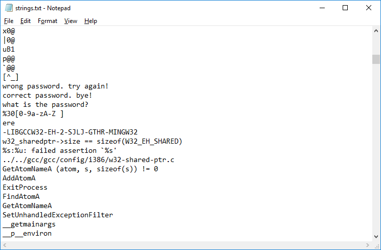

Regardless, we still get a wrong password when we try out the strings. That being said, the strings do show us that a correct message would most likely display `correct password. bye!`. The list also shows a lot of APIs that the program uses. However, knowing that this was compiled using MingWin-Dev C++, it is possible that most of the APIs used are part of the program's initialization.

Disassembling the file using the IDA Pro 32-bit decompiler, we get to see the main function code. You can download and install IDA Pro from [https://github.com/PacktPublishing/Mastering-Reverse-Engineering/tree/master/tools/Disassembler%20Tools](https://github.com/PacktPublishing/Mastering-Reverse-Engineering/tree/master/tools/Disassembler%20Tools). Since we are working in a Windows 32-bit environment, install the 32-bit `idafree50.exe` file. These installers were pulled from the official IDA Pro website and are hosted in our GitHub repository for the purpose of availability.

This file is a PE file, or Portable Executable. It should be opened as a Portable Executable to read the executable codes of the PE file. If opened using the MS-DOS executable, the resulting code will be the 16-bit MS-DOS stub:

IDA Pro was able to identify the main function. It is located at the address `0x004012B8`. Scrolling down to the Graph overview shows the branching of the blocks and may give you an idea of how the program's code will flow when executed. To view the code in plain disassembly, that is, without the graphical representation, just change to **`Text view`** mode:

Knowing that this is a C compiled code, we only need to focus our analysis on the `_main` function. We will try to make pseudocode out of the analysis. The information that will be gathered are the APIs, since they are used in the flow of code, the conditions that make the jump branches, and the variables used. There might be some specific compiler code injected into the program that we may have identify and skip:

Quickly inspecting the functions `sub_401850` and `sub_4014F0`, we can see that the `_atexit` API was used here. The `atexit` API is used to set the code that will be executed once the program terminates normally. `atexit` and similar APIs are commonly used by high-level compilers to run cleanup code. This cleanup code is usually designed to prevent possible memory leaks, close opened and unused handles, de-allocate allocated memory, and/or realign the heap and stack for a graceful exit:

The parameter used in `_atexit` points to `sub_401450`,  and contains the cleanup codes.

Continuing, we get to a call the `printf` function. In assembly language, calling APIs requires that its parameters are placed in sequence from the top of the stack. The `push` instruction is what we commonly use to store the data in the stack. This code does just the same thing. If you right-click on `[esp+88h+var_88]`, a drop-down menu will pop out, showing a list of possible variable structures. The instruction line can be better understood as `mov dword ptr [esp], offset aWhatIsThePassw`:

This does the same as `push offset aWhatIsThePassw`.  The square brackets were used to define a data container. In this case, `esp` is the address of the container where the address of `what is the password? ` gets stored. There is a difference between using `push` and `mov`.  In the `push` instruction, the stack pointer, `esp`, is decremented. Overall, `printf` got the parameter it needed to display the message to the console.

The next API is `scanf`.  `scanf` requires two parameters: the format of the input and the address where the input gets stored. The first parameter is located at the top of stack, and should be in the format of the input followed by the address where the input will be placed. Revising the variable structure should look like this:

The format given is `"%30[0-9a-zA-Z ]"` , which means that `scanf` will only read 30 characters from the start of the input and that it will only accept the first set of characters that are within the square bracket. The accepted characters would only be "`0`" to "`9`", "`a`" to "`z`", "`A`" to "`Z`", and the space character. This type of input format is used to prevent exceeding a 30 character input. It is also used to prevent the rest of the code from processing non-alphanumeric characters, with the exception of the space character.

The second parameter, placed at `[esp+4]`, should be an address to where the input will be stored. Tracing back, the value of the `eax` register is set as \[`ebp+var_28`\]. Let's just take note that the address stored at `var_28` is the inputted password.

The `strlen` API comes right after and requires only one parameter. Tracing back the value of `eax`, `var_28`, the inputted password, is the string that `strlen` will be using. The resulting length of the string is stored in the `eax` register. The string size is compared to a value of `11h` or `17`.  After a `cmp`, a conditional jump is usually expected. The `jnz` instruction is used. The red line is followed if the comparison deems _false_. A green line is followed for a _true _condition. A blue line simply follows the next code block, as shown here:

Following the red line means that the string length is equal to 17. At this point, our pseudocode is as follows:

Copy

    main()
    {
        printf("what is the password? ");
        scanf("%30[0-9a-zA-Z ]", &password);
        password_size = strlen(password);
        if (password_size == 17)
        { ... }
        else
        { ... }
    }

It is more than likely that if the size of the password is not 17, it will say wrong password. Let's follow the green path first:

The green line goes down to the `loc_4013F4` block, followed by the `loc_401400` block that ends the `_main` function. The instruction at `loc_4013F4` is a call to `sub_401290`.  This function contains code that indeed displays the wrong password message. Take note that a lot of lines point to `loc_4013F4`:

Here's the continuation of building our pseudocode with this wrong password function:

Copy

    wrong_password()
    {
        printf("wrong password. try again!\n");
    }
    
    main()
    {
        printf("what is the password? ");
        scanf("%30[0-9a-zA-Z ]", &password);
        password_size = strlen(password);
        if (password_size == 17)
        { ... }
        else
        {
            wrong_password();
        }
    }

### Note

One good technique in reverse engineering is to find the shortest exit path possible. However, this takes practice and experience. This makes it easier to picture the whole structure of the code.

Now, let's analyze the rest of the code under a 17 character string size. Let's trace the branching instructions and work backwards with the conditions:

The condition for `jle` is a comparison between the values at `var_60` and 0.  `var_60` is set with a value of 5, which came from `var_5c`. This prompts the code direction to follow the red line, like so:

Zooming out, the code we are looking at is actually a loop that has two exit points. The first exit point is a condition that the value at `var_60` is less than or equal to `0`. The second exit point is a condition where the byte pointed to by register `eax` should not be equal to `65h`. If we inspect the variables in the loop further, the initial value, at `var_60`, is `5`. The value at `var_60` is being decremented in the `loc_401373` block. This means that the loop will iterate 5 times.

We can also see `var_8` and `var_5c` in the loop. However, since the start of the main code, `var_8` was never set. `var_5c` was also used not as a variable, but as part of a calculated address. IDA Pro helped to identify possible variable usage as part of the `main` function's stack frame and set its base in the `ebp` register. This time, we may need to undo this variable identification by removing the variable structure only on `var_8` and `var_5c` in the loop code. This can be done by choosing the structure from the list given by right-clicking the variable names:

Thereby, for calculating the value in `eax`, we begin from the `lea` instruction line. The value stored to `edx` is the difference taken from `ebp` minus 8.  `lea` here does not take the value stored at `ebp-8`, unlike when using the `mov` instruction. The value stored in `ebp` is the value in the `esp` register after entering the `main` function. This makes `ebp` the stack frame's base address. Referencing variables in the stack frame makes use of `ebp`. Remember that the stack is used by descending from a high memory address. This is the reason why referencing from the `ebp` register requires subtracting relatively:

Now, in the `add` instruction line, the value to be stored in `edx` will be the sum of `edx`, and the value stored from a calculated address. This calculated address is `eax*4-5Ch`.  `eax` is the value from `var_60` which contains a value that decrements from `5` down to `0`.  But since the loop terminates when `var_60` reaches `0`, `eax` in this line will only have values from `5` down to `1`.   Calculating all five addresses, we should get the following output:

Copy

    [ebp+5*4-5ch] -> [ebp-48h] = 10h
    [ebp+4*4-5ch] -> [ebp-4Ch] = 0eh
    [ebp+3*4-5ch] -> [ebp-50h] = 7
    [ebp+2*4-5ch] -> [ebp-54h] = 5
    [ebp+1*4-5ch] -> [ebp-58h] = 3

It also happens that the values stored at these stack frame addresses were set before calling the first `printf` function. At this point, given the value of `eax` from `5` down to `1`, `edx` should have the resulting values:

Copy

    eax = 5;  edx = ebp-8+10h;  edx = ebp+8
    eax = 4;  edx = ebp-8+0eh;  edx = ebp+6
    eax = 3;  edx = ebp-8+7;    edx = ebp-1
    eax = 2;  edx = ebp-8+5;    edx = ebp-3
    eax = 1;  edx = ebp-8+3;    edx = ebp-5

The resulting value of `edx` is then stored in `eax` by the `mov` instruction. However, right after this, `20h` is subtracted from `eax`: 

Copy

    from eax = 5;  eax = ebp+8-20h;  eax = ebp-18h
    from eax = 4;  eax = ebp+6-20h;  eax = ebp-1ah
    from eax = 3;  eax = ebp-1-20h;  eax = ebp-21h
    from eax = 5;  eax = ebp-3-20h;  eax = ebp-23h
    from eax = 5;  eax = ebp-5-20h;  eax = ebp-25h

The next two lines of code is the second exit condition for the loop. The `cmp` instruction compares `65h` with the value stored at the address pointed to by `eax`. The equivalent ASCII character of `65h` is "e". If the values at the addresses pointed to by eax don't match a value of `65h`, the code exits the loop. If a mismatch happens, following the red line ends up with a call to `sub_401290`, which happens to be the wrong password function. The addresses being compared to with the character "`e`" must be part of the input string.

If we made a map out of the stack frame in a table, it would look something like this:

0

1

2

3

4

5

6

7

8

9

A

B

C

D

E

F

\-60h

03

00

00

00

05

00

00

00

\-50h

07

00

00

00

0e

00

00

00

10

00

00

00

\-40h

\-30h

X

X

X

e

X

e

X

e

\-20h

X

X

X

X

X

X

e

X

e

\-10h

ebp

We have to consider that `scanf` stored the input password at `ebp-var_28` or `ebp-28`. Knowing that there are exactly 17 characters for a correct password, we marked these input locations with X. Let's also set the addresses that should match with "`e`" to proceed. Remember that the string begins at offset `0`, not `1`.

Now that we're good with the loop, here's what our pseudocode should look like by now:

Copy

    wrong_password()
    {
        printf("wrong password. try again!\n");
    }
    
    main()
    {
        e_locations[] = [3, 5, 7, 0eh, 10h];
        printf("what is the password? ");
        scanf("%30[0-9a-zA-Z ]", &password);
        password_size = strlen(password);
        if (password_size == 17)
        {
    
            for (i = 5; i >= 0; i--)
                if (password[e_locations[i]] != 'e')
                {
                    wrong_password();
                    goto goodbye;
                }
            ...
        }
        else
        {
            wrong_password();
        }
    goodbye:
    }

Moving on, after the loop, we will see another block that uses `strcmp`. This time, we corrected some of the variable structures to get a better grasp of what our stack frame would look like:

The first two instructions read `DWORD` values from `ebp-1Ah` and `ebp-25h`, and are used to calculate a binary, AND. Looking at our stack frame, both locations are within the inputted password string area. Eventually, a binary AND is again used on the resulting value and `0FFFFFFh`. The final value is stored at `ebp-2Ch`. `strcmp` is then used to compare the value stored at `ebp-2Ch` with the string "`ere`". If the string comparison does not match, the green line goes to the wrong password code block.

Using the `AND` instruction with `0FFFFFFh` means that it was only limited to `3` characters.  Using `AND` on the two `DWORD`s from the password string would only mean that both should be equal, at least on the 3 characters. Thus, `ebp-1Ah` and `ebp-25h` should contain "`ere`":

0

1

2

3

4

5

6

7

8

9

A

B

C

D

E

F

\-60h

03

00

00

00

05

00

00

00

\-50h

07

00

00

00

0e

00

00

00

10

00

00

00

\-40h

\-30h

e

r

e

X

X

X

e

r

e

X

e

\-20h

X

X

X

X

X

X

e

r

e

\-10h

ebp

Let's mode on to the next set of code, following the red line:

All green lines point to the wrong password code block. So, to keep moving forward, we'll have to follow the conditions that go with the red line. The first code block in the preceding screenshot uses the `XOR` instruction to validate that the characters at `ebp-1Eh` and `ebp-22h` are equal.  The second block adds both character values from the same offsets, `ebp-1Eh` and `ebp-22h`.  The sum should be `40h`. In that case, the character should have an ASCII value of `20h`, a space character.

The third block reads a `DWORD` value from `ebp-28h` and then uses the AND instruction to only take the first 3 characters. The result is compared with `647541h`. If translated to ASCII characters, it is read as "`duA`".

The fourth block does the same method as the third but takes the `DWORD` from `ebp-1Dh` and compares it with `636146h`, or "`caF`".

The last block takes a WORD value from `ebp-20h` and compares it with `7473h`, or "`ts`".

Writing all these down to our stack frame table should be done in little endian:

0

1

2

3

4

5

6

7

8

9

A

B

C

D

E

F

\-60h

03

00

00

00

05

00

00

00

\-50h

07

00

00

00

0e

00

00

00

10

00

00

00

\-40h

\-30h

e

r

e

A

u

d

e

r

e

e

\-20h

s

t

F

a

c

e

r

e

\-10h

ebp

The password should be "`Audere est Facere`". If successful, it should run the correct password function:

To complete our pseudocode, we have to compute the string's relative offsets from `ebp-28h`.  `ebp-28h` is the password string's offset, 0, while the last offset, offset 16, in the string should be at `ebp-18h`:

Copy

    wrong_password()
    {
        printf("\nwrong password. try again!\n");
    }
    
    correct_password()
    {
        printf("\ncorrect password. bye!\n");
    }
    
    main()
    {
        e_locations[] = [3, 5, 7, 0eh, 10h];
        printf("what is the password? ");
        scanf("%30[0-9a-zA-Z ]", &password);
        password_size = strlen(password);
        if (password_size == 17)
        {
            for (i = 5; i >= 0; i--)
                if (password[e_locations[i]] != 'e')
                {
                    wrong_password();
                    goto goodbye;
                }
            if ( (password[6] ^ password[10]) == 0 )   // ^ means XOR
                if ( (password[6] + password[10]) == 0x40 )
                    if ( ( *(password+0) & 0x0FFFFFF ) == 'duA' )
                        if ( ( *(password+11) & 0x0FFFFFF ) == 'caF' )
                            if ( ( *(password+8) & 0x0FFFF ) == 'ts' )
                            {
                                correct_password();
                                goto goodbye
                            }
        }
        wrong_password();
    goodbye:
    }

### Dynamic analysis with debugging

There is nothing better than verifying what we assumed during our static analysis. Simply running the program and entering the password should finish the job:

Deadlisting is as important as debugging a program. Both can be done at the same time. Debugging can help speed up the deadlisting process as it is also validated at the same time. For this exercise, we're going to redo the analysis of `passcode.exe` by using `x32dbg` from [https://x64dbg.com](https://x64dbg.com). 

After opening `passcode.exe` in `x32dbg`, registering EIP will be at a high memory region. This is definitely not in any part of the `passcode.exe` image:

To go around this, click on **`Options`**\->**`Preferences`**, and then under the **`Events`** tab, **`uncheck`**_**`System Breakpoint*`**_: 

Click on the **`Save`** button and then use **`Debug`**\->**`Restart`** or press `Ctrl + F2`. This restarts the program, but now, EIP should stop at the PE file's entry point address:

And since we also know the address of the `main` function, we need to set a breakpoint there and let the program run (`_F9_`). To do that, in the Command box, enter the following:

Copy

    bp 004012b8

After running, EIP should stop at the `main` function's address. We get to see a familiar piece of code as we did during deadlisting:

_F7_ and _F8_ are the shortcut keys for Step in and Step over. Click on the **`Debug`** menu and you should see the shortcut keys assigned to the debug command. Just keep on playing with the commands; if you ever mess things up, you can always restart.

The advantage of using the Debugger is that you should easily be able to see the stack frame. There are five memory dump windows consisting of the stack frame. Let's use Dump 2 to show us the stack frame. Make two instruction steps to get `ebp` set with the stack frame's base. On the left pane, in the list of registers, right-click on **`Register EBP`** and then select **`Follow in Dump->Dump 2`**. This should bring Dump 2 forward. Since the stack moves down from a higher address, you'll have to roll the scroll bar up to show the initial data we have in the stack frame:

Here's the same stack frame after inputting for `scanf`. Also, during `scanf`, you'll have to switch to the command prompt window to enter the password and then switch back after.  Also included in the following screenshot is the stack window, located in the right-hand pane:

Even while in the debugger, we can change the contents of the inputted string any time, thereby forcing it to continue in the condition toward the correct password. All we need to do is right-click on the byte in the **`Dump`** window and select **`Modify Value`**_._ For example, in the loop that compares `65h` ("`e`") with the value stored in the address pointed by register `eax`, before stepping on the `cmp` instruction, we can change the value at that address.

In the following screenshot the value stored at the address `0060FF20h` (EAX), which is being modifed from `35h` to `65h`:

The same modification can be done by doing a binary edit through right-clicking on byte, and then selecting _**`Binary`**_\->_**`Edit`**_.

And here's where we should end up if we have a correct password:

### Decompilers

It may be easier if the pseudocode were automatically given to us. Certain tools exist that may be able to help us with that. Let's try and decompile `passcode.exe` ([https://github.com/PacktPublishing/Mastering-Reverse-Engineering/blob/master/ch7/passcode.exe](https://github.com/PacktPublishing/Mastering-Reverse-Engineering/blob/master/ch7/passcode.exe)) using the standalone version of Snowman ([https://derevenets.com/](https://derevenets.com/)). Once the file has been opened, click on **`View`**\->**`Inspector`**.  This should show a box containing resolved functions from the program. Look for the function definition `_main` and select it to show the equivalent pseudocode of the assembly language. This highlights the assembly language line in the left-hand pane and the psuedocode in the middle pane:

As of the time of writing this book, the output C source may help, but not all are correctly decompiled. For instance, the loop where "`e`" was being compared was not decompiled correctly. The output shows a `while` loop, but we expect that the `v10` variable should have its value read from the offset calculated in the password string. However, most of the code should somehow aid us in understanding how the program should work. The decompiler engine for this is open source ([https://www.capstone-engine.org/](https://www.capstone-engine.org/)), so not much should be expected as support won't always be there.

The good news is that there are more powerful decompilers that exist, such as HexRays. Most institutions and some individual analysts and researchers who perform reverse engineering are willing to pay for these decompilers. HexRays is one bang for its buck for most reverse engineers.

Here's a HexRays decompiled version of `passcode.exe`:

Decompilers are continuously developed since these tools speed up analysis. They do not decompile perfectly, but should be near the source.

Summary
-------

* * *

In this chapter, we introduced reverse engineering, beginning with APIs, by learning how these are used in a functional program. We then used static and dynamic analysis tools to reverse a program.

Overall, there are a lot of reversing tools for Windows available for use. This also includes the vast information and research on how to use them for specific reversing situations. Reverse engineering is mostly about acquiring the resources from the World Wide Web, and from what you already know, we have already done that.  

Further reading
---------------

* * *

*   [https://visualstudio.microsoft.com](https://visualstudio.microsoft.com): this is the download site for Visual Studio
*   [https://docs.microsoft.com/en-us/visualstudio/productinfo/vs2017-system-requirements-vs:](https://docs.microsoft.com/en-us/visualstudio/productinfo/vs2017-system-requirements-vs) site shows recommended system requirements for installing Visual Studio
*   [https://sourceforge.net/projects/orwelldevcpp/](https://sourceforge.net/projects/orwelldevcpp/): this site contains the binary downloads of Dev C++.
*   [https://developer.microsoft.com/en-us/microsoft-edge/tools/vms/](https://developer.microsoft.com/en-us/microsoft-edge/tools/vms/): appliance versions of pre-installed Microsoft Windows can be downloaded here 
*   [http://mark0.net/soft-trid-e.html:](http://mark0.net/soft-trid-e.html) Download site of the TrID tool and its signature database file
*   [http://www.microsoft.com/whdc/system/platform/firmware/PECOFF.mspx:](http://www.microsoft.com/whdc/system/platform/firmware/PECOFF.mspx) documentation of the Microsoft Portable E

Chapter 8. Sandboxing - Virtualization as a Component for RE
------------------------------------------------------------

In previous chapters, we have used virtualization software, in particular, VirtualBox or VMware, to set up our Linux and Windows environments to conduct analysis. virtualization worked fine since these virtualization software only support x86 architecture. Virtualization is a very useful component of reverse engineering. In fact, most software is built under x86 architecture.  Virtualization uses the resources of the host machine's CPU via the hypervisor. 

Unfortunately, there are other CPU architectures out there that doesn't support virtualization. VirtualBox nor VMware doesn't support these architectures.  What if we were given a non-x86 executable to work with?  And all we have is an operating system installed in an x86 machine. Well, this should not stop us from doing reverse engineering.

To work around this issue, we will be using emulators. Emulators have been around long before the hypervisor was even introduced.  Emulators, basically, emulates a CPU machine.  Treating this as a new machine, operating systems that run on a non-x86 architecture can be deployed.  After then, we can run native executables.

In this chapter, we will learn about QEMU to deploy an non-x86 operating system.  We will also learn about emulating the boot up of an x86 machine using Bochs.

Emulation
---------

* * *

The beauty of emulation is that it can fool the operating system into thinking that it is running on a certain CPU architecture. The drawback is noticeably slow performance, since almost every instruction is interpreted. To explain CPUs briefly, there are two CPU architecture designs: **Complex Instruction Set Computing** (**CISC**) and **Reduced Instruction Set Computing** (**RISC**). In assembly programming, CISC would only require a few instructions. For example, a single arithmetic instruction, such as MUL, executes lower-level instructions in it. In RISC, a low-level program should be carefully optimized. In effect, CISC has the advantage of requiring less memory space, but a single instruction would require more time to execute. On the other hand, RISC has better performance, since it executes instructions in a simplistic way. However, if a code is not properly optimized, programs built for RISC may not perform as fast as they should and may consume space. High-level compilers should have the ability to optimize low-level code for RISC.

Here is a short list of CPU architectures, categorized in terms of CISC and RISC:

*   CISC:
    
    *   Motorola 68000
    *   x86
    *   z/Architecture
    
*   RISC:
    
    *   ARM 
    *   ETRAX CRIS
    *   DEC Alpha
    *   LatticeMico32
    *   MIPS
    *   MicroBlaze
    *   Nios II
    *   OpenRISC
    *   PowerPC
    *   SPARC
    *   SuperH
    *   Hewlett Packard PA-RISC
    *   Infineon TriCore
    *   UNICORE
    *   Xtensa
    

Popular among CISC and RISC architectures are x86 and ARM. x86 is used by Intel and AMD computers, in favor of having a minimum number of instructions used by programs. Newer devices, such as smartphones and other mobile devices, make use of ARM architecture, as it has the advantages of low power consumption with high performance.

For the purpose of discussion in this chapter, we are using ARM as the architecture that we are going to emulate on top of an x86 machine. We chose the ARM architecture since it is currently the most popular processor used in handheld devices today.

### Emulation of Windows and Linux under an x86 host

We explained that installing an operating system on a VM follows the architecture of the host machine. For example, a Windows x86 build can only be installed on a VM that is itself installed on an x86 machine. 

A lot of Linux operating systems, including Arch Linux, Debian, Fedora, and Ubuntu, have support for running under ARM processors. On the other hand, Windows RT and Windows Mobile were built for devices using ARM CPUs.  

Since we are working on PCs using x86 processors, analyzing a non-x86-based executable still follows the same reverse engineering concepts of static and dynamic analysis. The only addition to these steps is that we would need to set up the environment for which the executable can run and learn the tools that can be used on top of this emulated environment.

#### Emulators

We are going to introduce two of the most popular emulators: QEMU (Quick Emulator) and Bochs.   

QEMU has a reputation of being the most widely used emulator because of its support for a vast range of architectures, including x86 and ARM. It can also be installed under Windows, Linux, and macOS. QEMU is used from the command line, but there are available GUI tools, such as virt-manager, that can help set up and manage the guest operating system images. virt-manager, however, is only available for Linux hosts. 

Bochs is another emulator, but is limited to only supporting x86 architecture. It is worth mentioning this emulator, as it is used to debug the **Memory Boot Record** (**MBR**) code. 

Analysis in unfamiliar environments
-----------------------------------

* * *

Here, the reverse engineering concepts are the same. However, the availability of tools is limited. Static analysis can still be done under an x86 environment, but when we need to execute the file, it would require sandbox emulation.

It is still best to debug native executables locally in the emulated environment. But, if local debugging is slim, one alternative way is to do remote debugging. For Windows, the most popular remote debugging tools are Windbg and IDA Pro. For Linux, we usually use GDB.

Analyzing ARM-compiled executables is not far from the process that we perform with x86 executables. We follow the same steps as we did with x86:

1.  Study the ARM low-level language
2.  Do deadlisiting using disassembly tools
3.  Debug the program in the operating system environment

Studying the ARM low-level language is done in the same way that we studied x86 instructions. We just need to understand the memory address space, general purpose registers, special registers, stack, and language syntax. That would also include how API functions are called.  

Tools such as IDA Pro, among other ARM disassembly tools, can be used to show the ARM disassembly code of a native ARM executable.

### Linux ARM guest in QEMU

Linux ARM can be installed in an ARM CPU guest of QEMU, which runs under a Windows in an x86 CPU. Let's head straight to deploying an Arch Linux ARM, then. Running an Arch Linux instance as a QEMU guest is not that hard because of all the available resources we can download from the internet. For demo purposes, we will be using a pre-installed image of Arch Linux and running it in QEMU. Prepare to download these files:

*   QEMU: [https://qemu.weilnetz.de/](https://qemu.weilnetz.de/)
*   Arch Linux image: [http://downloads.raspberrypi.org/arch/images/archlinuxarm-29-04-2012/archlinuxarm-29-04-2012.img.zip](http://downloads.raspberrypi.org/arch/images/archlinuxarm-29-04-2012/archlinuxarm-29-04-2012.img.zip)
*   System kernel: [https://github.com/okertanov/pinguin/blob/master/bin/kernel/zImage-devtmpfs](https://github.com/okertanov/pinguin/blob/master/bin/kernel/zImage-devtmpfs)

### Note

In this book, we will install QEMU on a Windows host. While installing, **take note of where QEMU was installed**. This is particularly important, as QEMU's path will be used later.

Extract the image file from `archlinuxarm-29-04-2012.img.zip`to a new directory, and copy `zImage-devtmpfs` into the same directory.

Open a command line in the image and kernel file's directory. Then, execute the following line:

Copy

    "c:\Program Files\qemu\qemu-system-arm.exe" -M versatilepb -cpu arm1136-r2 -hda archlinuxarm-29-04-2012.img -kernel zImage-devtmpfs -m 192 -append "root=/dev/sda2" -vga std -net nic -net user

Here, change `C:\Program Files\qemu` to the path where QEMU was installed. This should fire up QEMU with Arch Linux running, as shown here:

Now, log in using these credentials:

Copy

    alarmpi login: root
    Password: root

You can go ahead and play with it like a regular Linux console. Arch Linux is a popular OS installed by enthusiasts of Raspberry Pi.

### MBR debugging with Bochs

When we turn on a computer, the first code that runs is from the BIOS (Basic Input/Output System), a program embedded in the CPU.  It performs a power-on self-test (POST)  that makes sure connected hardware are working properly.  The BIOS loads the master boot record (MBR) to memory and then passes code execution.  The master boot record (MBR) was read from the first disk sector of the designated boot disk.  The MBR contains the bootstrap loader which is responsible for loading an operating system. 

If, for example, we want to debug a given MBR image, we can do that with an emulator called Bochs. Bochs can be downloaded from [http://bochs.sourceforge.net/](http://bochs.sourceforge.net/).

To test this out, we have provided a disk image that can be downloaded from [https://github.com/PacktPublishing/Mastering-Reverse-Engineering/blob/master/ch8/mbrdemo.zip](https://github.com/PacktPublishing/Mastering-Reverse-Engineering/blob/master/ch8/mbrdemo.zip). This ZIP archive extracts to about 10MB. The file contains the `mre.bin` disk image and the `bochsrc` image configuration file that will be passed to Bochs.

If we open the `mre.bin` using IDA Pro, we should be able to statically analyze the MBR code. The MBR almost always starts at the `0x7c00` address. It is a 16-bit code that uses hardware interrupts to control the computer.  

When loading the file in IDA Pro, make sure to change the loading offset to `0x7c00`, as shown in the following screenshot:

When asked about the disassembly mode, choose 16-bit mode. Since everything is still undefined, we need to turn the data into code. Select the first byte code, right-click to open the context menu, then select **`Code`**, as shown here:

When converted into disassembly code, we can see that IDA Pro was also able to identify the interrupt functions and how these are used. The following screenshot shows 16-bit disassembly and the use of interrupt `13h` to read data from disk sectors:

To debug the MBR with Bochs, we will have to make sure that `bochsrc` contains the following line:

Copy

    display_library: win32, options="gui_debug"

This line enables the use of the Bochs GUI debugger.

If we have a different disk image, we can change the file name of the disk image file in the `at0-master` line. In this demo, the disk image's filename is `mre.bin`:

Copy

    ata0-master: type=disk, path="mre.bin", mode=flat

To emulate the disk image, execute these commands:

Copy

    set $BXSHARE=C:\Program Files (x86)\Bochs-2.6.8
    "C:\Program Files (x86)\Bochs-2.6.8\bochsdbg.exe" -q -f bochsrc

You might need to change `C:\Program files (x86)\Bochs-2.6.8` to the path where you have installed Bochs. Take note that, for the `$BXSHARE` environment variable, there are no quotes.

Here, Bochs was installed under a Windows environment. The paths can be changed if working in a Linux environment.

Once running, the console will be filled up with logged lines, as shown here:

This will bring up the debugging console, which should look like the one shown in this screenshot:

Another window that shows the output should also appear:

The MBR code begins at the `0x7c00 `address. We will have to place a breakpoint at `0x7c00`. Bochs GUI has a command line where we get to set the breakpoints at specified addresses. This is located at the bottom of the window. See the highlighted area in the following screenshot:

To set a breakpoint at `0x7c00`, enter `lb 0x7c00`. To see a the list of commands, enter `help`. The most common commands used are the following:

Copy

    c             Continue/Run
    Ctrl-C        Break current execution
    s [count]     Step.  count is the number of instructions to step
    lb address    Set breakpoint at address
    bpe n         Enable breakpoint where n is the breakpoint number
    bpd n         Disable breakpoint where n is the breakpoint number
    del n         Delete breakpoint where n is the breakpoint number
    info break    To list the breakpoints and its respective numbers 

The GUI has also mapped keyboard keys with the commands. Select the **`Command`** menu to view these keys.

Press _F5_ to continue the code, until it reaches the MBR code at `0x7c00`. We should now see the same disassembly code that we saw in IDA Pro. We can then start pressing _F11_ to step debug on each instruction line:

At some point, the code will enter an endless loop state. If we look at the output window, the end result should have the same message, as in the following screenshot:

Summary
-------

* * *

In this chapter, we have learned that, even if the file is not a Windows or a Linux x86-native executable, we can still analyze a non-x86 executable file. With static analysis alone, we can analyze a file without even doing dynamic analysis, although we still need references to understand the low-level language of non-x86 architectures, categorized as RISC or CISC. Just as we learned x86 assembly language, languages such as ARM assembly can be learned with the same concepts.

However, an analysis can still be proven with actual code execution, using dynamic analysis. To do that, we need to set up the environment where the executable will run natively. We introduced an emulation tool called QEMU that can do the job for us. It has quite a number of architectures that it can support, including ARM. Today, one of the most popular operating system using ARM architecture is Arch Linux. This operating system is commonly deployed by Raspberry Pi enthusiasts.

We also learned about debugging MBR code taken from a disk image. Using Bochs, a tool that can emulate the boot sequence of an x86 system, we were able to show how you can load and debug 16-bit code that uses hardware interrupts. In addition, some ransomware employ features that can inject or replace the MBR with malicious code. With what we learned in this chapter, nothing can stop us from reversing these pieces of code.

Further Reading
---------------

* * *

*   KVM and CPU feature enablement -[https://wiki.qemu.org/images/c/c8/Cpu-models-and-libvirt-devconf-2014.pdf](https://wiki.qemu.org/images/c/c8/Cpu-models-and-libvirt-devconf-2014.pdf)
*   A way for installing Windows ARM in QEMU - [https://withinrafael.com/2018/02/11/boot-arm64-builds-of-windows-10-in-qemu/](https://withinrafael.com/2018/02/11/boot-arm64-builds-of-windows-10-in-qemu/)
*   How to DEBUG System Code using The Bochs Emulator on a Windows PC - [https://thestarman.pcministry.com/asm/bochs/bochsdbg.html](https://thestarman.pcministry.com/asm/bochs/bochsdbg.html)

Chapter 9. Binary Obfuscation Techniques
----------------------------------------

Binary obfuscation is a way for developers to make the code of a program difficult to understand or reverse. It is also used to hide data from being seen easily. It can be categorized as an anti-reversing technique that increases the processing time for reversing. Obfuscation can also use encryption and decryption algorithms, along with its hardcoded or code-generated cipher key.

In this chapter, we will discuss ways how data and code are obfuscated. We are going to show how obfuscation is applied in examples including simple XORs, simple arithmetic, building data in the stack, and discussions about polymorphic and metamorphic code.  

In the malware world, binary obfuscation is a common technique used by viruses aiming to defeat signature-based anti-virus software. As a virus infects files, it obfuscates its code using polymorphism or metamorphism.

In this chapter, we will achieve the following learning outcomes:

*   Identifying data being assembled on the stack
*   Identifying data being XORed or deobfuscated prior to use
*   Modifying data in text or other segments, and assembling on the heap

Data assembly on the stack
--------------------------

* * *

The stack is a memory space in which any data can be stored. The stack can be accessed using the stack pointer register (for 32-bit address space, the ESP register is used). Let's consider the example of the following code snippet:

Copy

    push 0
    push 21646c72h
    push 6f57206fh
    push 6c6c6548h
    mov eax, esp
    push 74h
    push 6B636150h
    mov edx, esp
    push 0
    push eax
    push edx
    push 0
    mov eax, 
    call eax

This will eventually display the following message box:

How did that happen when no visible text strings were referenced? Before calling for the `MessageBoxA` function, the stack would look like this:

These push instructions assembled the null terminated message text at the stack.

Copy

    push 0
    push 21646c72h
    push 6f57206fh
    push 6c6c6548h

While the other string was assembled with these push instructions:

Copy

    push 74h
    push 6B636150h

In effect, the stack dump would look like this.

Every after string assembly, the value of register ESP is stored in EAX and then EDX.  That is, EAX points to the address of the first string.  EDX points to the address of the second assembled string.

`MessageBoxA` accepts four parameters.  The second parameter is the message text and the third is the caption text.  From the stack dump shown above, the strings are located at  addresses `0x22FE50` and `0x22FE54`.  

Copy

    push 0
    push eax
    push edx
    push 0
    mov eax, 

`MessageBoxA` has all the parameters it requires. Even though the strings were assembled at the stack, as long as data is accessible, it can be used.

### Code assembly

The same concept is possible in terms of code. Here's another code snippet:

Copy

    push c3
    push 57006a52
    push 50006ad4
    push 8b6b6361
    push 5068746a
    push c48b6c6c
    push 6548686f
    push 57206f68
    push 21646c72
    push 68006a5f
    mov eax, esp
    call eax
    mov eax, 
    call eax

This yields the same message box as before. The difference is that this code pushes `opcode` bytes into the stack, and passes code execution to it. After entering the first `call eax` instruction, the stack would look like this:

Remember that the value at the top of the stack should contain the return address set by the `call` instruction. And here's where our instruction pointer will be by now:

The `pop edi` instruction stores the return address to the `EDI`register. The same set of instructions that assemble the message text setup are used here. Finally, a `push edi`, followed by a `ret` instruction, should make it back to the return address.

The resulting stack should look like this:

This is then followed by a couple of instructions that invoke `MessageBoxA`.

This technique of running code in the stack is employed by numerous malware, including software vulnerability exploits. As a course of action to prevent malware code execution, some operating systems have made security updates to bar the stack from code execution.

Encrypted data identification
-----------------------------

* * *

One of the main features of antivirus software is to detect malware using signatures. Signatures are sets of byte sequences unique to a given piece of malware. Although this detection technique is not thought of as effective for anti-virus nowadays, it may still play a vital role in detecting files, especially when an operating system is taken offline.

Simple signature detection can easily be defeated by encrypting the data and/or code of a malware. The effect would be that a new signature gets developed from a unique portion of the encrypted data. An attacker can simply re-encrypt the same malware using a different key, which would result in another signature. But still, the malware runs with the same behavior.

Of course, anti-virus software has made great improvements to defeat this technique, thereby making signature detection a technology of the past.

On the other hand, this is an obfuscation technique that eats up additional time for reversing software. Under static analysis, identifying encrypted data and decryption routines informs us what to expect in the course of our analysis, especially when debugging. To start off, we'll look into a few code snippets.

### Loop codes

Decryption can easily be identified by inspecting code that runs in a loop:

Copy

      mov ecx, 0x10
      mov esi, 0x00402000
    loc_00401000:
      mov al, [esi]
      sub al, 0x20
      mov [esi], al
      inc esi
      dec ecx
      jnz loc_00401000

This loop code is controlled by a conditional jump. To identify a decryption or an encryption code, it should have a source and a destination. In this code, the source starts at address `0x00402000`, with the destination also at the same address. Each byte in the data is modified by an algorithm. In this case, the algorithm is a simple subtraction of `0x20` from the byte being changed. The loop ends only when `0x10` bytes of data have been modified. `0x20` is identified as the encryption/decryption key.

The algorithm can vary, using standard and binary or just standard arithmetic. As long as a source data is modified and written to a destination within a loop, we can say that we have identified a cryptographic routine.

### Simple arithmetic

Besides using bitwise operations, basic mathematical operations can also be used. If addition has a subtraction counterpart, we can encrypt a file using addition and decrypt it with subtraction, and vice-versa. The following code shows decryption using addition:

Copy

     mov ecx, 0x10
     mov esi, 0x00402000
    loc_00401000:
     mov al, [esi]
     add al, 0x10
     mov [esi], al
     inc esi
     dec ecx
     jnz loc_00401000

The beauty of byte values is that they can be processed as signed numbers, if, for example, given this set of encryption information:

Copy

    data = 0x00, 0x01, 0x02, 0x0a, 0x10, 0x1A, 0xFE, 0xFF
     key = 0x11
     encrypt algorithm = byte subtraction
     decrypt algorithm = byte addition

After each byte gets subtracted with `0x11`, the encrypted data would be the following:

Copy

    encrypted data = 0xEF, 0xF0, 0xF1, 0xF9, 0xFF, 0x09, 0xED, 0xEE

To restore it, we'll have to add the same value, `0x11`, that was subtracted before:

Copy

    decrypted data = 0x00, 0x01, 0x02, 0x0a, 0x10, 0x1A, 0xFE, 0xFF

If we look at the equivalent decimal values of the preceding bytes in unsigned and signed form, the data would look like the following:

Copy

    data (unsigned) = 0, 1, 2, 10, 16, 26, 254, 255
    data (signed) = 0, 1, 2, 10, 16, 26, -2, -1

Here's the encrypted data shown in decimal values:

Copy

    encrypted data (unsigned) = 239, 240, 241, 249, 255, 9, 237, 238
    encrypted data (signed) = -17, -16, -15, -7, -1, 9, -19, -18

To sum it up, if we were to use basic arithmetical operations, we should look at it in the value's signed form.

### Simple XOR decryption

XOR is the most popularly used operator when it comes to software cryptography. If we were to change the code algorithm in the previous code snippet, it would look like this:

Copy

     mov ecx, 0x10
     mov esi, 0x00402000
    loc_00401000:
     mov al, [esi]
     xor al, 0x20
     mov [esi], al
     inc esi
     dec ecx
     jnz loc_00401000

What makes it popular is that the same algorithm can be used to encrypt and decrypt data. Using the same key, `XOR` can restore the original data back. Unlike when using `SUB`, the data-restoring counterpart requires an algorithm that uses `ADD`.

Here's a quick demonstration:

Copy

    Encryption using the key 0x20:
      data:  0x46 = 01000110b
       key:  0x20 = 00100000b
    0x46 XOR 0x20 = 01100110b = 0x66
    
    Decryption using the same key:
      data:  0x66 = 01100110b
       key:  0x20 = 00100000b
    0x66 XOR 0x20 = 01000110b = 0x46

Assembly of data in other memory regions
----------------------------------------

* * *

It is possible to execute data in a different memory region out of the process' image space. Similar to how code was executed at the stack space, memory spaces, such as the heap and newly allocated space, can be used to manipulate data and run the code. This is a common technique used not only by malware, but also by legitimate applications. 

Accessing the heap requires calling APIs, such as `HeapAlloc` (Windows) or generally `malloc` (Windows and Linux). A default heap space is given for every process created. `Heap` is generally used when asking for a small chunk of memory space. The maximum size of a heap varies between operating systems. If the requested size of the memory space being requested for allocation doesn't fit the current heap space, `HeapAlloc` or `malloc` internally calls for `VirtualAlloc` (Windows) or `sbrk` (Linux) functions. These functions directly requests memory space from the operating system's memory manager.

Allocated memory space have defined access permissions. Just like how the segments of a program are used, these can generally have read, write, and execute permissions. If the region requires code execution, the read and execute permission should be set.

Check out the following code snippet with an implementation of decrypting data to the heap:

Copy

                    call GetProcessHeap
                    push 1000h             ; dwBytes
                    mov edi, eax
                    push 8 ; dwFlags
                    push edi               ; hHeap
                    call HeapAlloc
                    push 1BEh              ; Size
                    mov esi, eax
                    push offset unk_403018 ; Src
                    push esi               ; Dst
                    call memcpy
                    add esp, 0Ch
                    xor ecx, ecx
                    nop
    loc_401030:
                    xor byte ptr [ecx+esi], 58h
                    inc ecx
                    cmp ecx, 1BEh
                    jl short loc_401030

The code allocates `1000h` bytes of heap space, then copies `1BEh` bytes of data from the address at `0x00403018` to the allocated heap. The decryption loop can easily be identified in this code. 

The algorithm uses `XOR` with a key value of `58h`. The data size is `1BEh` and the data is directly updated at the same allocated heap space. The iteration is controlled using the `ECX` register, while the location of the encrypted data, which is at the heap address, is stored in the `ESI` register.

Let's see what gets decrypted using debugging tools.

Decrypting with x86dbg
----------------------

* * *

The preceding code snippet came from the `HeapDemo.exe` file. You can download this file from [https://github.com/PacktPublishing/Mastering-Reverse-Engineering/tree/master/ch9](https://github.com/PacktPublishing/Mastering-Reverse-Engineering/tree/master/ch9). Go ahead and start debugging the file using `x86dbg`. This screenshot shows the disassembly code at the `WinMain` function right after loading the file in `x86dbg`:

From the executable's code entry point, we encounter heap allocation with the `GetProcessHeap` and `RtlAllocateHeap` APIs. This is followed by using a `_memcpy` function, which copies `0x1BE` bytes of data from the address denoted by `heapdemo.enc`. Let's take a look at the memory dump from `heapdemo.enc`. To do that, right-click on `push <heapdemo.enc>`, then select **`Follow in Dump`**. Click on the given address, not the **`Selected Address`**. This should change the contents in the currently focused `Dump` window:

This should be the data that will be decrypted by the next lines of code that run in a loop. We should also see the same encrypted data at the allocated heap space right after executing `_memcpy`. The allocated heap space's address should still be stored in the register `ESI`. Right-click on the value of register `ESI` in the window containing a list of registers and flags, then select **`Follow in Dump`**. This should show the same contents of data, but at the heap address space. The dump shown in the following screenshot is the encrypted data:

Now for the interesting part—decrypting. While looking at the dump of the heap, continue doing debug steps. You should notice the values changing as the `xor byte ptr ds:[ecx+esi], 58` instruction executes:

As it would be tedious to step through all these bytes for 0x1BE times, we can simply place a break point at the line after the `jl` instruction and press _`F9`_ to continue running the instructions. This should result in this decrypted dump:

Continue debugging the code; it concludes by cleaning up the allocated heap and exiting the process. The allocated heap is freed up using the `HeapFree` API. Usually, an `ExitProcess` API is used to exit the program. This time, it uses `GetCurrentProcess` and `TerminateProcess` to do that.

Other obfuscation techniques
----------------------------

* * *

The obfuscation techniques we discussed are based on hiding actual strings and code using simple cryptography. Still, there are other ways to obfuscate code. As long as the concept of impeding data and code from easy extraction and analysis is present, then obfuscation still occurs. Let's discuss some more obfuscation techniques.

### Control flow flattening obfuscation

The aim of control flow flattening is to make a simple code look like a complicated set of conditional jumps. Let's consider this simple code:

Copy

        cmp byte ptr [esi], 0x20
        jz loc_00EB100C
        mov eax, 0
        jmp loc_00EB1011
    loc_00EB100C:
        mov eax, 1
    loc_00EB1011:
        test eax, eax
        ret

When obfuscated using the control flow flattening method, it would look something like this:

Copy

        mov ecx, 1
        mov ebx, 0                ; initial value of control variable
    loc_00EB100A:
        test ecx, ecx
        jz loc_00EB103C           ; jump will never happen, an endless loop
    loc_00EB100E:
        cmp ebx, 0                ; is control variable equal to 0?
        jnz loc_00EB102B
    loc_00EB1013:
        cmp byte ptr [esi], 0x20
        jnz loc_00EB1024
    loc_00EB1018:
        mov eax, 0
        mov ebx, 2
        jmp loc_00EB103E
    loc_00EB1024:
        mov ebx, 1                ; set control variable to 1
        jmp loc_00EB103E
    loc_00EB102B:
        cmp ebx, 1                ; is control variable equal to 1?
        jnz loc_00EB103C
    loc_00EB1030:
        mov eax, 1
        mov ebx, 2                ; set control variable to 2
        jmp loc_00EB103E
    loc_00EB103C:
        jmp loc_00EB1040          ; exit loop
    loc_00EB103E:
        jmp loc_00EB100A          ; loop back
    loc_00EB1040:
        test eax, eax
        ret

The obfuscated code would ultimately have the same result as the original code. In a control flow flattening obfuscation, the flow of code is guided by a control variable. In the preceding code, the control variable is the `EBX` register. To graphically view the difference, here's how the original code looks:

And here is how the code looks when obfuscation is applied:

The code is placed in a loop while being controlled with the value set in the control variable, the `EBX`register. Every block of code has an ID. Before leaving the first block of code, the control variable is set with the ID of the second block of code. The flow loops around again, goes into the second block of code, and before leaving, it is set with the ID of the third block of code. The sequence goes on until the final block of code executes. Conditions in the block of code can set the control variable with the block ID it chooses to go to next. In our previous code the loop only iterates twice before it ends.

Looking at the two preceding diagrams, we can see how a simple code can look complicated when obfuscated. As a reverse engineer, the challenge is how to spot a complicated code being reduced to a more understandable code. The trick here is to identify if a control variable exists.

### Garbage code insertion

Garbage code insertion is a cheap way of making code look complicated. A code is simply injected with a code or a sequence of code that actually does nothing. In the following code snippet, try to identify all of the garbage codes:

Copy

        mov eax, [esi]
        pushad
        popad
        xor eax, ffff0000h
        nop
        call loc_004017f
        shr eax, 4
        add ebx, 34h
        sub ebx, 34h
        push eax
        ror eax, 5
        and eax, 0ffffh
        pop eax
        jmp loc_0040180
    loc_004017f:
        ret

Removing the garbage codes should reduce it down to this code:

Copy

        mov eax, [esi]
        xor eax, ffff0000h
        shr eax, 4
        jmp loc_0040180

A lot of malware employs this technique to quickly generate variants of its own code. It may increase the size of code, but as a result, it makes it undetectable by signature-based anti-malware software.

### Code obfuscation with a metamorphic engine

A program can be coded in different ways. To "increment the value of a variable" means adding one to it. In assembly language, `INC EAX` would also be equivalent to `ADD EAX`, `1`. The concept of replacing the same instruction or set of instructions with an equivalent instruction relates to metamorphism.  

Here are a few examples of code that can be interchanged with each other:

Copy

    mov eax, 78h

Copy

    push 78h
    pop eax

Copy

    mov cl, 4
    mul cl

Copy

    shl eax, 2

Copy

    jmp 00401000h

Copy

    push 00401000h
    ret

Copy

    xchg eax, edx

Copy

    xor eax, edx
    xor edx, eax
    xor eax, edx

Copy

    rol eax, 7

Copy

    push ebx
    mov ebx, eax
    shl eax, 7
    shr ebx, 25
    or eax, ebx
    pop ebx

Copy

    push 1234h

Copy

    sub esp, 4
    mov [esp], 1234h

This concept was introduced in computer viruses that are able to infect files with a different generation of itself. The computer viruses in which this concept was introduced were Zmist, Ghost, Zperm, and Regswap. The challenge that the metamorphic engines in these viruses face is to make the infected files still work like the original and prevent them from being corrupted.

So, how does metamorphic code differ from a polymorphic code? First off, both techniques were brought up to thwart anti-virus software from detecting several generations of malware. Anti-virus software usually detects malware using signatures. These signatures are unique sequences of bytes found in the malware file. To prevent the anti-virus from further detection, encryption is used to hide the whole virus code, or portions of it. A stub code responsible for decrypting the self-encrypted code of the virus. The following diagram shows a representation of the file generations of a polymorphic virus:

As we can see, the stub usually comes with the same code, but the key changes. This leaves the encrypted code different from the previous generation. In the preceding diagram, we depicted the difference by changing the encrypted code's color. If a code involves decryption and encryption, it can be called a polymorphic code. Some anti-virus software employs the use of code emulation or adds specific decryption algorithms to decrypt the virus code, enabling the signatures to be matched for detection.

For metamorphic code, no encryption is involved.  The concept is about substituting a code with a different code that results with the same behavior. For each generation of the virus code, the code changes. A polymorphic code can easily be identified because of the stub code. But easy identification of metamorphic code is impossible, since it would just look like a regular set of code. Here's a representation of, file generations of a metamorphic code:

All these metamorphic generation will yield the same result retaining its code sequence. It is hard for anti-virus signatures to detect metamorphic viruses, since the code itself changes. Metamorphic code can only be identified by comparing two variations. In metamorphic viruses, the generation of new code involves a metamorphic engine, which comes along with the code itself. Even the engine's lines of code themselves can be modified.

### Dynamic library loading

During static analysis, we can immediately see imported functions that are available for the program's use. It is possible to only see two API functions in the import table, but have the program use dozens of APIs. In Windows, these two API functions are `LoadLibrary` and `GetProcAddress`, while in Linux, these are `dlopen` and `dlsym`.

`LoadLibrary` only requires the name of the library where the desired API function name is located. `GetProcAddress` is then responsible for retrieving the address of the API function from the library with that API name. With the library loaded, a program can call the API function using the API's address.

The following code snippet demonstrates how dynamic library loading is done. The code eventually displays a "`hello world` message box:

Copy

    ; code in the .text section
    push 00403000h
    call LoadLibrary
    push 00403010h
    push eax
    call GetProcAddress
    push 0
    push 00403030h
    push 00403020h
    push 0
    call eax              ; USER32!MessageBoxA
    
    
    ; data in the .data section
    00403000h "USER32.DLL", 0
    00403010h "MessageBoxA", 0
    00403020h "Hello World!", 0
    00403030h "Packt Demo", 0

Some programs have the text strings encrypted, including the name of the API functions, and get decrypted at runtime before doing dynamic import. This prevents tools such as `Strings`or`BinText`from listing down the APIs that the program might use. An analyst would be able to see these loaded functions while doing debug sessions.

### Use of PEB information

The **Process Environment Block** (**PEB**) contains useful information about the running process. This includes the list of modules loaded for the process, the chain of **Structured Error Handlers** (**SEH**), and even the program's command line parameters. Instead of using API functions, such as  `GetCommandLine` and `IsDebuggerPresent`, here, the obfuscation technique directly reads this information from PEB.

For instance, the `IsDebuggerPresent` API contains the following code:

Using the following code alone will return a value of `1` or `0` in the `EAX` register. It is in the FS segment where the `PEB` and **Thread Information Block** (**TIB**) are found. This code shows that the debug flag can be found at offset `2` of the `PEB`.

Copy

    mov eax, large fs:30h
    movzx eax, byte ptr [eax+2]

There are different ways for an obfuscation to be implemented. It can be implemented based on the creativity of the developer. As long as the goal of concealing the obvious is present, it will make it hard for reverse engineers to analyze the binary. A better understanding of various obfuscation techniques will definitely helps us overcome the analysis of complicated code during reversing.

Summary
-------

* * *

In this chapter, we have understood what obfuscation is all about. As a means of hiding data, simple cryptography is one of the most commonly used techniques. Identifying simple decryption algorithms requires looking for the cipher key, the data to decrypt, and the size of the data. After identifying these decryption parameters, all we need to do is place a breakpoint at the exit point of the decryption code. We can also monitor the decrypted code using the memory dump of the debugging tool.

We cited a few methods used in obfuscation, such as control flow flattening, garbage code insertion, metamorphic code, dynamically importing API functions, and directly accessing the process information block. Identifying obfuscated codes and data helps us overcome the analysis of complicated code. Obfuscation was introduced as a way to conceal information.

In the next chapter, we'll continue introducing the same concept, but in particular, we'll look how they are implemented in an executable file using Packer tools and encryption.

Chapter 10. Packing and Encryption
----------------------------------

As a continuation of what we have learned about obfuscation, we will now introduce a set of tools which are categorized to defend software from reverse engineering. The result of using these tools, such as packers and crypters, is a transformed version of the original executable file which still behaves exactly as the original flow of code behavior did. Based on the tool used, we will discuss what a transformed executable would look like and how execution of the transformed file takes place.

We have picked the UPX tool to demonstrate how packers work at low-level and to show techniques that can be used to reverse it.

### Note

There are many free packers available in the internet that are commonly used by malicious author to pack their software (fsg, yoda, aspack), but for the sake of simplicity we will focus on the simplest of them all UPX.

This chapter will use Windows as our environment and will be debugging with `x86Dbg` or `OllyDbg`. We will also show how the Volatility tool may come in handy. We will touch on obfuscation in the scripting language, and then use a bit of Cyber Chef to decipher data.

We will cover the following topics in this chapter:

*   Unpacking with the UPX tool
*   Identifying unpacking stubs, and setting breakpoints for memory extraction using debuggers
*   Dumping memory, and extracting programs executing in memory
*   Identifying and decrypting segments using keys within executables

A quick review on how native executables are loaded by the OS
-------------------------------------------------------------

* * *

For better understanding on how packers modify files, let us have a quick review of how executable files are loaded by the operating system. Native executables are better known as PE files for Windows and ELF files for Linux. These files are compiled down to their low-level format; that is, using assembly language like `x86` instructions. Every executable is structured with a header, code section, data section, and other pertinent sections. The code section contains the actual low-level instruction codes, while the data section contains actual data used by the code. The header contains information about the file, the sections, and how the file should be mapped as a process in the memory. This is shown in the following diagram:

The **`header`** information can be classified as raw and virtual. Raw information consists of appropriate information about the physical file, such as file offsets and size. The offsets are relative to file offset 0. While virtual information consists of appropriate information regarding memory offsets in a process, virtual offsets are usually relative to the image base, which is the start of the process image in memory. The image base is an address in the process space allocated by the operating system. Basically, the header tells us how the operating system should map the file (raw) and its sections to the memory (virtual). In addition, every section has an attribute which tells us whether the section can be used for reading, writing, or executing. _In [chapter 4](/book/networking_and_servers/9781788838849/4), Static and Dynamic Reversing,_ under Memory Regions and Mapping of a Process, we showed how a raw file gets mapped in virtual memory space. The following figure shows how the file on a disk (left) would look when mapped in virtual memory space (right):

The libraries or modules containing functions required by the code are also listed in a portion of the file that can be seen in sections other than the code and data sections. This is called the import table. It is a list of API functions and the libraries it is from. After the file is mapped, the operating system loads all the libraries in the same process space. The libraries are loaded in the same manner as the executable file but in a higher memory region of the same process space. More about where the libraries are loaded can be found in _[Chapter 4](/book/networking_and_servers/9781788838849/4), Static and Dynamic Reversing,_ under Memory Regions and Mapping of a Process.

When everything is mapped and loaded properly, the OS reads the entry point address from the header then passes the code execution to that address.

There are other sections of the file that make the operating system behave in a special manner. An example of this is the icons displayed by the file explorer, which can be found in the resource section. The file can also contain digitally signed signatures which are used as indicators if the file is allowed to run in the operating system. The CFF Explorer tool should be able to help us to view the header information and these sections, as shown in the following screenshot:

We have covered the basics so far but all these structures are well documented by Microsoft and the Linux community. The structure of the Windows PE file can be found in the following link: [https://docs.microsoft.com/en-us/windows/desktop/debug/pe-format](https://docs.microsoft.com/en-us/windows/desktop/debug/pe-format). While the structure for a Linux ELF file can be found in the following link: [http://refspecs.linuxbase.org/elf/elf.pdf](http://refspecs.linuxbase.org/elf/elf.pdf)[.](http://refspecs.linuxbase.org/elf/elf.pdf)

Packers, crypters, obfuscators, protectors and SFX
--------------------------------------------------

* * *

Executable files can have the code packed, encrypted and obfuscated but remain executable with all of the program intact. These techniques are primarily aimed at protecting the program from being reversed. The rule is that if the original program works properly, it can be reversed. For the rest of the chapter, we will define the term host or original program as the executable file, data, or code before it gets packed, encrypted, obfuscated or protected.  

### Packers or compressors

Packers, also known as compressors, are tools used to compress the host down to a smaller size. The concept of compressing data helps us to reduce the time taken to transfer any data. At the obfuscation side, compressed data will most likely not show complete readable text.

In the following figure, the left pane shows the code's binary and data before getting compressed, while the one on the right shows its compressed form. Notice that the text strings are not completely found in the compressed form:

Given that the code and data are now compressed, executing the file would require a code that decompresses it. This code is called the decompression code stub. 

In the following figure, the original structure of the file is shown at the left with the program entry point in the code section. A probable packed version would have a new structure (right) with the entry point starting in the decompression stub:

When the packed executable is executed, the stub runs first and, afterwards, passes the code execution to the decompressed code. The entry point in the header should point to the address of the stub.

Packers reduce the size of some of the sections and thus must change values in the file header. The raw location and size of the sections are modified. As a matter of fact, some packers would treat the file as one big section containing both the code and data within it. The trick is to set this one big section with readable, writable, and executable attributes. However, this may run the risk of having improper error handling, especially when code accidentally writes to a supposedly read-only area, or executes code to a supposedly non-executable area.

The end result of a packed file is to get the host behavior intact with a packed file having a smaller file size.

### Crypters

Obfuscation by encryption is done by crypters. Packers compress the sections while crypters encrypt the sections. Similar to packers, crypters have a stub used to decrypt encrypted code and data. As a result, crypters may instead increase the file size of the host. 

The following image shows a file `crypted` by `Yoda Crypter`:  

The section offsets and sizes have been retained but encrypted. The stub was placed in a newly added section named `_yC_`. If we compare how the original opcode bytes look with the encrypted bytes, we'll notice that opcode bytes have zero bytes spread out. This is a trait that can be used to identify encrypted bytes.

Another trait for packers and crypters is about how they import API functions. Using CFF Explorer to check out the Import Directory, we only see two imported APIs: `LoadLibrary` and `GetProcAddress`. Both functions are from `Kernel32.DLL`, and notice that it has its name in mixed character casing: `KeRnEl32.Dll`, as shown in the following example:

With only these two API functions, every function it requires can be dynamically loaded.

The following image shows the `GetProcAddress` API: 

While the following image shows the `LoadLibrary` API: 

Looking at the stub, we expected it to have a loop code that contains the decryption algorithm. The following image shows the decryption algorithm used by `Yoda Crypter`:

### Obfuscators

Obfuscators are also classified as code modifiers which change the structure of the code while retaining the flow of the program. In the previous chapter, we introduced the control flow flattening (CFF) technique. The CFF technique converts a small code to run in a loop which gets controlled by a control flag. However, obfuscation is not limited to the CFF technique. The compiled file structure can also be modified, especially for a psuedocode based execution, like Visual Basic  and .NET compiled programs.

One of the main techniques to obfuscate is to garble, or encrypt, the name of functions so that decompilers wouldn't be able to recognize the function correctly. Examples of these high-level obfuscating tools are `Obfuscar`, `CryptoObfuscator` and `Dotfuscator`.

The renaming of variable names with random generated text strings, converting the code text to hexadecimal text, and splitting text for the code to concatenate the text are some obfuscation techniques used for scripts such as JavaScript and visual basic scripts.

The following screenshot gives an example of an obfuscated JavaScript code using an online obfuscation tool:

The original code is at the left while its obfuscated version is at the right.

### Protectors

The protectors employ the combination of packers and crypters, and other anti-reversing features. Protected software usually has multiple layers of decompression and decryption that may use cipher algorithms like `blowfish`, `sha512`, or `bcrypt`. Some sophisticated protectors even use their own code virtualization which is similar to the pseudocode concept. Protectors are usually sold commercially and used for anti-piracy.

Examples of Windows executable protectors are `Themida`, `VMProtect`, `Enigma`, and `Asprotect`.

### SFX  Self-extracting archives

We usually archive our files using ZIP and RAR. But, did you know that these archived files can be turned into a self-extracting executable (SFX)? The intention for these tools is to easily produce installers for any software requiring multiple files, such as the main program and its dependent library modules. Embedded in the SFX archive is an SFX script. This script is responsible for instructing which directories the files are destined to be extracted to. This can be seen in the following diagram:

Usually, SFX have scripting features that can:

*   Extract archived files
*   Run a file from the extracted files
*   Run any file from the system
*   Delete files
*   Make registry entries
*   Visit sites from the internet
*   Create files

Basically, it can pretty much do what a regular program can do to the system.  Examples of SFX tools are `Winzip SFX`, `RARSFX` and `NSIS`.

Unpacking
---------

* * *

At this stage, using `x86dbg`, we are going to unpack a packed executable. In this debugging session, we will be unpacking a UPX packed file. Our target will be to reach the original host's entry point. Besides this UPX packed file, we have provided packed samples in our GitHub page that can be used for practice.

### The UPX tool

The Ultimate Packer for `eXecutables`, also known as UPX, can be downloaded from [https://upx.github.io/](https://upx.github.io/). The tool itself can pack Windows executables. It is also able to restore or unpack UPX packed files. To see it in action, we used the tool on the file `original.exe`. This is shown in the following example:

Notice that the original file size reduced after being packed.

### Debugging though the packer

Major modifications in the file, especially in the PE file header, have been made by the packer.  To better understand how packers work, let us compare the host and the packed version of the executable file. Using the CFF tool, let us inspect the header differences.

The figure above shows the NT header difference between the original and the UPX packed version:  

The only difference here is the number of sections, which was reduced from four down to three, as demonstrated by the following example: 

In the optional header comparison in the preceding example, the changes are:

*   SizeOfCode: `0x0C00 to 0x1000`
*   SizeOfInitializedData: `0x0e00 to 0x5000`
*   AddressOfEntryPoint: `0x157e to 0x6b90`
*   BaseOfCode: `0x1000 to 0x6000`
*   BaseOfData: `0x2000 to 0x7000`
*   SizeOfImage: `0x5000 to 0x8000`
*   SizeOfHeaders: `0x0400 to 0x1000`
*   CheckSum: `0x4a92` to `0`

The image below shows a comparison between the data directory table of the original and UPXed version of the program.

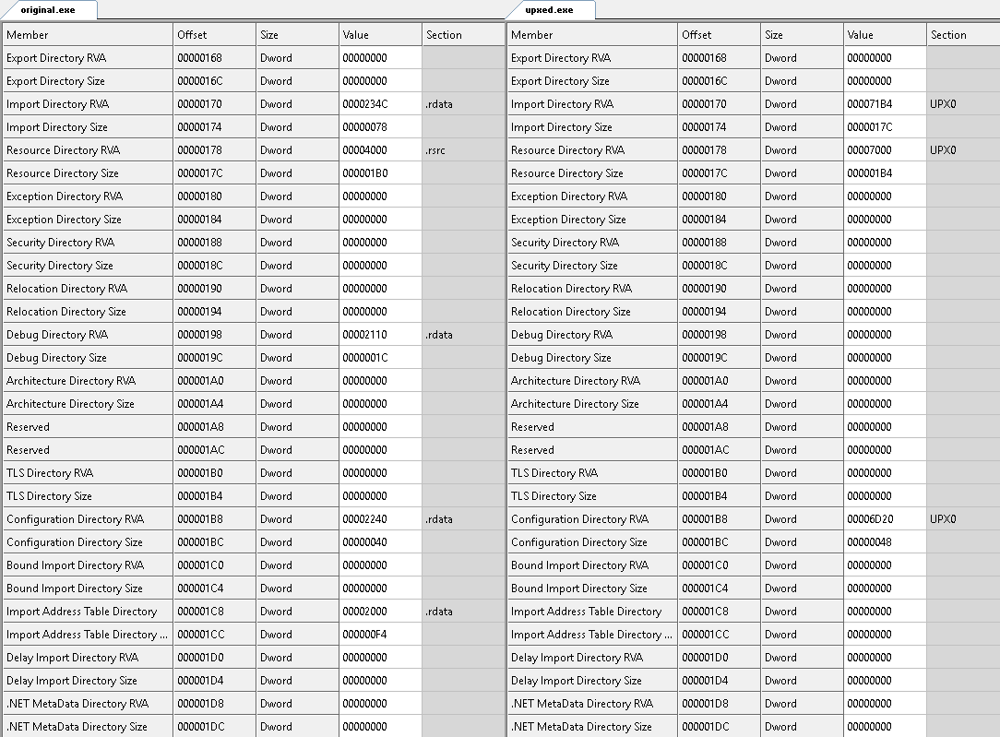

The previous example shows that the changes in the data directory are:

*   Import Directory RVA: `0x234c to 0x71b4`
*   Import Directory Size: `0x0078 to 0x017c`
*   Resource Directory RVA: `0x4000` to `0x7000`
*   Resource Directory Size: `0x01b0` to `0x01b4`
*   Debug Directory RVA: `0x2110` to `0`
*   Debug Directory Size: `0x001c` to `0`
*   Configuration Directory RVA: `0x2240` to `0x6d20`
*   Configuration Directory Size: `0x40` t0 `0x48`
*   Import Address Directory RVA: `0x2000` to `0`
*   Import Address Directory Size: `0xf4` t0 `0`

The image below shows a comparison between the header sections between the original and the UPXed version of the program.

The previous example shows that almost all of the information in the original section header has changed in the UPXed version. The raw and virtual offsets, sizes, and characteristics have changed. 

For the `UPX0`section, the meaning of the bit flags in the **`Characteristics`** field are listed in the following example:

The following example shows that the number of imported API functions has been reduced, but the original static import library files are still the same:

The following figure shows the API functions that will be imported for `KERNEL32.dll`. They have totally different API functions:

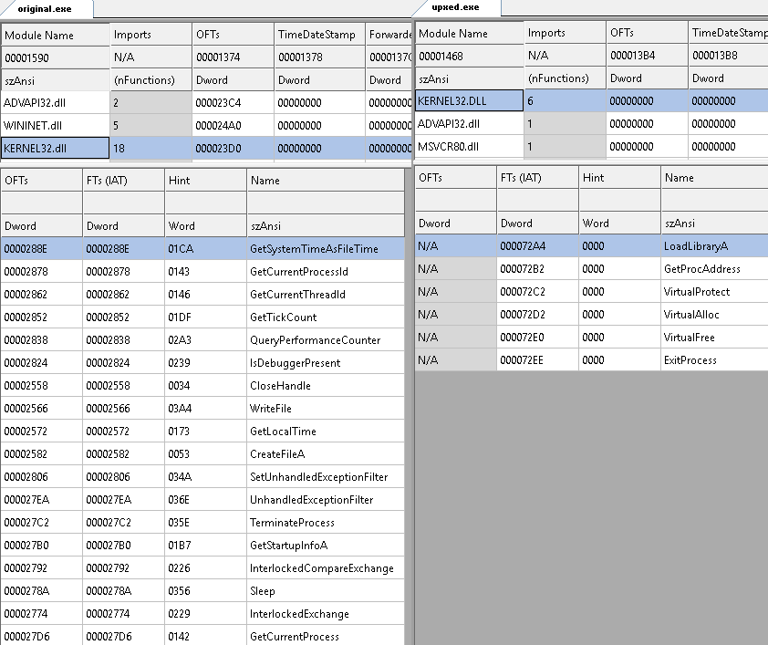

As for the resource directory contents, it looks like the size did not change except for the offset, as can be seen in the following example:

The following list shows the changes on which the traits are based in the packed file:

*   There are three sections, namely `UPX0`, `UPx1` and `.rsrc`:
    
    *   `UPX0` has virtual section properties but has no raw section properties.  This only means that the section will be allocated by the operating system but no data will be mapped to it from the file. This section is set with read, write, and execute flags.  
    *   The entry point address is within the `UPX1` section. The stub should be located in this section, along with the compressed code and data.
    *   The `.rsrc` section seems to retain its contents. Retaining the resource section should still give out the proper icons and program details read by the operating system's file explorer.
    
*   With the packer having its own structure causing major changes in the sections, some header fields, like the `BaseOfCode` and `BaseOfData`, were totally modified.
*   Virtual sizes were aligned based on the `SectionAlignment`. For example, the `.rsrc's` virtual size was originally `0x1b0`, aligning it with the `SectionAlignment`, which should make it `0x1000`. 
*   The ImageSize has increased since a stub was inserted by the packer.

The entry point is the sum of the `ImageBase` and `AddressOfEntryPoint`. The original entry point is located at `0x0040157e`. This address is located within the range of `UPX0`, which begins at `0x00401000` with a size of `0x5000`. The stub is located at the packed file's entry point in the `UPX1` section. The outcome we are expecting is that the packer decompresses the code, dynamically imports the API functions, and finally passes the code execution to the original entry point. To hasten our debugging, what we should be looking for is an instruction, or a set of instructions, that will pass execution to `0x0040157e`, which is the original entry point.

Let us see this in action by opening `upxed.exe` in `x86dbg`. We start off at the entry point at `0x00406b90`, as shown in the following screenshot:

The operating system maps the file to the memory, and we have all the virtual sections allocated as well. The first instruction uses `pushad` to save all the initial flag states. If it saves all the flags, it should restore these flags before it jumps towards the original entry point. The next instruction stores the address `0x00406000` to register `esi`. This address is the start of the `UPX1` section. This is where the compressed data is. The next line stores `0x00401000` to register edi. It is easy to tell that the compressed data will be decompressed from `esi` to `edi`. With debugging on, the decompression codes are from `0x00406b91` to `0x00406c5d`.

Before placing a breakpoint at `0x00406c62`, set a dump window with the address `0x00401000`.  This should help us view a decompressed portion of the host. Running through the code until `0x00406c62` should complete the decompression. This is shown in the following screenshot:

The next set of instructions fixes call instructions using relative jump addresses. This code runs from `0x00406c65` to `0x00406c94`. Just place another breakpoint, or instead use a Run until selection at the `0x00406c96` line, to run through the loop of this call fixing code.

The next lines are the portion of the packer that dynamically load the API functions used by the host. The code stores `0x00405000` to register edi. This address contains data where it can locate the list of names of the original modules and API function names associated with each module.

For every module name, it uses `LoadLibraryA` to load the libraries that the host will use later. This is shown in the following screenshot:

 Right after loading a module, it uses `GetProcAddress` to retrieve the addresses of the APIs the host will use, as shown in the following screenshot: 

Every retrieved API address is stored at the host import table which is located at `0x00402000`. Restoring the function addresses to the same import table address should make the host call the APIs without any issues. Placing a breakpoint at `0x00406cde` should execute the dynamic import routine.  

The next routine is about to set the mapped header's access permission to read-only, preventing it from being written to or code executed, as shown in the following screenshot:

VirtualProtect is used to set memory access flags and also takes four parameters.  The following code shows the parameters according to MSDN:

Copy

    BOOL WINAPI VirtualProtect(
      _In_  LPVOID lpAddress,
      _In_  SIZE_T dwSize,
      _In_  DWORD  flNewProtect,
      _Out_ PDWORD lpflOldProtect
    );

The first call to VirtualProtect is set with an `lpAddress` equal to `0x00400000`,  dwSize with 0x1000 bytes, and the protect flags with a value of 4.  The value 4 denotes the constant for PAGE\_READWRITE. The succeeding calls to VirtualProtect are set with a protect flag `PAGE_READONLY`. This is shown in the following screenshot:

Remember that, at the start of the code, we encountered a `pushad` instruction. At this point, we are on its counterpart instruction, `popad`. This is most likely the part where execution will be passed to the original entry point. Looking at the `jmp` instruction at `0x00406D1B`, the address jumps to an address in the `UPX0` section. Looking at our host-packed comparison, the original entry point is indeed located at `0x0040157e`. 

Reaching the original entry point should conclude debugging the packer code.

Dumping processes from memory
-----------------------------

* * *

A packed file's data cannot be seen in plain sight, but if we let it run, everything is expected to be unpacked in its process space. What we aim to do is to  produce a version of the file in its unpacked state. To do that, we need to dump the whole memory then extract the executable's process image to a file.

### Memory dumping with VirtualBox

We will be using Volatility to dump the process from a suspended VirtualBox image. First of all, we need to learn how to dump a VirtualBox image:  

1.  Enable the VirtualBox's debug menu:
    
    *   For Windows VirtualBox hosts:
        
        *   Enter a new environment variable named `VBOX_GUI_DBG_ENABLED` and set it to `true`. This is shown in the following screenshot:
        
    

1.  *   For Linux hosts:
        
        *   Edit/etc/environment as a root user
        *   Add a new entry `VBOX_GUI_DBG_ENABLED=true` 
        *   Execute the command: `source /etc/environment`
        
        *   Restart VirtualBox if already opened
        
    
2.  Run the packed executable in the Windows guest. We are going to run `upxed.exe` from our GitHub page.
3.  From the VBoxDbg console, execute these lines to save the whole memory dump to a file. Note that there should be a dot before the `pgmphystofile` command, as shown in the following example:
    
    Copy
    
        .pgmphystofile memory.dmp
    
4.  memory.dmp is the filename and is stored at the logged-in user's home directory.  That is the `%userprofile%` folder in Windows and the `~/` folder in Linux.

Next, we will be using Volatility to parse the memory dump and extract the data we need.

### Extracting the process to a file using Volatility

Volatility can be downloaded from [https://www.volatilityfoundation.org/releases](https://www.volatilityfoundation.org/releases). For this section, our VirtualBox host is in a Linux Ubuntu machine. The Volatility command parameters shown here should also be the same when used in Windows.

First, we need to identify the exact operating system version using Volatility using the `imageinfo` parameter, as shown in the following examples:

Copy

    vol -f ~/memory.dmp imageinfo

Again, `~/memory.dmp` is the file path of the memory we just dumped. The result should show a list of the identified OS profile. For Windows 7 SP1 32-bit, we would be using `Win7SP1x86` as our profile for succeeding `Volatility` commands.

Next, we will have to list down the running processes and identify which is our packed executable. To list down running processes, we will be using the `pslist` parameter, as shown in the following examples:

Copy

    volatility --profile=Win7SP1x86 -f ~/memory.dmp pslist

Looking at the second column's last line in the previous screenshot, we find `upxed.exe`. We need to note down the **`process ID (PID)`** which has a value of `2656`. Now that we have retrieved the PID of our packed executable, we can dump the process to file using the `procdump` parameter, as shown in the following code:

Copy

    volatility --profile=Win7SP1x86 -f ~/memory.dmp procdump -D dump/ -p 2656

`procdump` will save the process executable in the `dump/` folder set by the `-D` parameter, as shown in the following screenshot:

Volatility has a wide range of features to choose from. Feel free to explore these arguments as these may help in fitting analysis situations.

How about an executable in its unpacked state?
----------------------------------------------

* * *

Now that we have an executable file from Volatility, running this back in our Windows guest sandbox gives us the following message:

Remember that the packed executable has its own PE header and stub and not that of the original host's. The header, stub and compressed data were directly mapped to the process space. Every API function was dynamically imported. Even with the code and data decompressed, the entry point set in the header is still of the packed executables and not of the original hosts.  

Fortunately, `x86dbg` has a plugin known as Scylla. After reaching the original entry point, which means we are in the unpacked state, we can rebuild the process being debugged into a brand new executable file. The new executable file is already unpacked and can be executed alone.

This still requires us to debug the packed executable until we reach the original entry point (OEP). Once at the OEP, open up Scylla from the plugins' drop-down menu. This should open up the Scylla window, as shown in the following example:

The active process is already set to the `upxed.exe` process. The OEP is also set to where the instruction pointer is. The next thing to do is click on **`IAT Autosearch`** to make Scylla parse the process space and locate the most probable import table. This fills up the **`VA`** and `Size` fields in the **`IAT info`** frame with the probable import table location and size. Click on `Get Imports` to make Scylla scan for the imported library and API functions. This is shown in the following screenshot:

Expand one of the libraries and it will show the API functions it found. Now, under the **`Dump frame`**, click on the **`Dump`** button. This brings up a dialog that asks where to save the executable file. This simply dumps the executable file's process. We still need to apply the IAT info and imports. Click on **`Fix Dump`** and open the dumped executable file. This produces a new file with the `_SCY` appended to the file name, as shown in the following screenshot: 

Running this new executable file should give us the same result as the original host's behavior.

In Volatility, we did not have enough information to reconstruct the executable file. Using `x86dbg` and Scylla, though requiring us to get past debugging the packer stub, we were able to have a reconstructed executable file.

Other file-types
----------------

* * *

Nowadays, websites usually convert binary data to printable ASCII text in order for the site developers to easily embed this data along with the HTML scripts. Others simply convert data to something that is not easy for humans to read. In this section, we will aim to decode data that has been hidden from plain understandable form. In _[Chapter 13 ](/book/networking_and_servers/9781788838849/13)Reversing various File-types_, we will deal more with how to reverse other File-Types besides Windows and Linux executables. In the meantime, we will just decode obvious data.

Let us head to our browsers and visit [www.google.com](http://www.google.com), at the time of writing (we stored a copy of the source at [https://github.com/PacktPublishing/Mastering-Reverse-Engineering/blob/master/ch10/google\_page\_source.txt](https://github.com/PacktPublishing/Mastering-Reverse-Engineering/blob/master/ch10/google_page_source.txt)), viewing the source would show us a portion that has a `b64` encoded text, as in the following screenshot:  

Using Cyberchef, a tool which can help decode various types of encoded data including base 64, we can deduce this data to something we understand. Just copy and paste the base-64 data into the input box then double-click _From Base64_. This should display the decoded binary content in the output box, as shown in the following screenshot:

Notice that the output has a `PNG` written at the beginning. This is most likely a PNG image file. In addition, if we carefully look at the source code, we can see that the type of data was also indicated before the base-64 encoded data, as shown in the following example:

Copy

    data:image/png;base64

If we click on the disk icon, we can save the output data to a file and name it with a `.png` extension. That should enable us to view the image, as shown in the following screenshot:

There are other supported encoded types from the Cyberchef tool. If we ever encounter similar encoded text, the internet has all the available tools to help us out.

Summary
-------

* * *

Reverse engineering is about how we work with the tools in their proper situations. Even with packed, encrypted, and obfuscated executables, hidden information can still be extracted.

In this chapter, we introduced various concepts of how data can be hidden using packers, crypters, obfuscators, protectors, and even SFX tools. We encountered a packed file produced by the UPX tool which we were still able to reverse using a debugger. Being aware of where the instruction pointer is, we can determine if we are already at the original entry point. As a general rule, if the instruction pointer has jumped from a different section, we can say that we are already at the original entry point.

Using another solution to viewing the unpacked state of a program, we used Volatility with a memory dump from a VirtualBox guest and extracted the process of the executable that we just ran. Using the Scylla tool, we were also able to rebuild an unpacked state of the packed executable.

We ended this chapter by introducing the CyberChef tool, which is able to decode popular encoded data like base-64. This tool might come in useful when we encounter encoded data not only in scripts found in websites but in every executable we encounter.

In the next chapter, we will proceed further in our journey by identifying malicious behaviors executed by malware.

Chapter 11. Anti-analysis Tricks
--------------------------------

Anti-debugging, anti-virtual-machine (VM), anti-emulation, and anti-dumping are all tricks that attempt to analysis put a halt to an analysis. In this chapter, we will try to show the concepts of these anti-analysis methods. To help us identify these codes, we will explain the concept and show the actual disassembly codes that makes it work. Being able to identify these tricks will help us to avoid them. With initial static analysis, we would be able to skip these codes.

In this chapter, we will achieve the following learning outcomes:

*   Identifying anti-analysis tricks
*   Learning how to overcome anti-analysis tricks

Anti-debugging tricks
---------------------

* * *

Anti-debugging tricks are meantto ensure that the codes are not working under the influence of a debugger. Say we have a program with an anti-debugging code in it. The behavior of the program is just as if it were running without an anti-debugging code. The story becomes different, however, when the program is being debugged. While debugging, we encounter code that goes straight to exiting the program or jumps into code that doesn't make sense. This process is illustrated in the following diagram:

Developing anti-debugging code requires understanding the traits of the program and the system, both when normally running and when being debugged. For example, the **Process Environment Block** (**PEB**) contains a flag that is set when a program is being run under a debugger. Another popular trick is to use a **Structured Exception Handler** (**SEH**) to continue code that forces an error exception while debugging. To better understand how these work, let's discuss these tricks in a little more detail.

### IsDebuggerPresent

`IsDebuggerPresent` is a `Kernel32` API function that simply tells us whether the program is under a debugger. The result is placed in the `eax`register with a value of either true (`1`) or false (`0`). When used, the code looks something like this:

Copy

    call IsDebuggerPresent
    test eax, eax
    jz notdebugged

The same concept applies with the `CheckRemoteDebuggerPresent` API. The difference is that it checks whether either another process or its _own_ process is being debugged. `CheckRemoteDebuggerPresent` requires two arguments: a handle to a process and an output variable that tells us whether the process is being debugged or not. The following code checks whether its own process is being debugged:

Copy

    call GetCurrentProcess
    push edi
    push eax
    call CheckRemoteDebuggerPresent
    cmp dword ptr [edi], 1
    jz beingdebugged

The `GetCurrentProcess` API is used to retrieve the handle to the running process. This usually returns a `-1` (`0xFFFFFFFF`) value, which is the handle to its own process. The `edi` register should be a variable address where the output of `CheckRemoteDebuggerPresent` will be stored.  

### Debug flags in the PEB

A thread is the basic unit of execution.  The process itself is run as a thread entity that is capable of triggering multiple threads in the same process space. The information about the currently running thread is stored in the the Thread Environment Block (TEB).  The TEB is also called the Thread Information Block (TIB) and contains information such as the thread ID, structured error handling frame, stack base address and limit, and the address pointing to information about the process the thread is running under.  Information about the process is stored in the Process Environment Block (PEB).

The PEB contains information like pointer to tables that lists the loaded modules, command line parameters used to run the process, information taken from the PE header, and if it is being debugged.  The TIB and PEB structures are documented by Microsoft at https://docs.microsoft.com/en-us/windows/desktop/api/winternl/.

`PEB` has fields that can be used to identify whether a process is being debugged: the `BeingDebugged` and `NtGlobalFlag` flags. In `PEB`, these are located at the following locations:

**Offset**

**Information**

`0x02`

BeingDebugged (1 for True) - BYTE

`0x68`

GlobalNTFlag (usually 0x70 when debugged) - DWORD

Internally, `IsDebuggerPresent` works with this code:

Let's check what is happening with the `IsDebuggerPresent` code:

Copy

    mov eax, dword ptr fs:[18]

The preceding line retrieves the address of the **Thread Environment Block** (**TEB**) from the **Thread Information Block** (**TIB**). The `FS` segment contains`TIB`. `TEB` address is stored at offset `0x18` of `TIB`. `TIB` is stored in the `eax`register.

The following line retrieves `PEB` address and stores it in the `eax` register. The `PEB` address is located at offset `0x30` of `TEB`:

Copy

    mov eax, dword ptr ds:[eax+30]

The byte at offset `2` of `PEB` contains a Boolean value of `1` or `0`, indicating whether the process is being debugged or not:

Copy

    movzx eax, byte ptr ds:[eax+2]

If we wanted to create our own function, but applied this with `GlobalNTFlag`, we can make the code look like this:

Copy

    mov eax, dword ptr fs:[18]
    mov eax, dword ptr ds:[eax+0x30]
    mov eax, dword ptr ds:[eax+0x68]
    cmp eax, 0x70
    setz al
    and eax, 1

The first three lines of the preceding block basically retrieve `GlobalNTFlag` at offset `0x68` of `PEB`. 

The following `cmp` instruction will set the zero flag to `1` if the value of `eax` is equal to `0x70`:

Copy

    cmp eax, 0x70

The `setz` instruction will set the `al` register with what `ZF` is, which should either be `0` or `1`:

Copy

    setz al

Finally, the `and` instruction will only retain the first bit for the `eax`register, which, as a result, clears the register, but retains a value of either `1` or `0`, for true or false:

Copy

    and eax, 1

### Debugger information from NtQueryInformationProcess

Querying process information using the `NtQueryInformationProcess` function gives us another way to identify if the process is under a debugger. As sourced from `MSDN`, the `NtQueryInformationProcess` syntax declaration is the following:

Copy

    NTSTATUSWINAPINtQueryInformationProcess(_In_HANDLEProcessHandle,_In_PROCESSINFOCLASSProcessInformationClass,_Out_PVOIDProcessInformation,_In_ULONGProcessInformationLength,_Out_opt_PULONGReturnLength);

More information about this function can be found at [https://docs.microsoft.com/en-us/windows/desktop/api/winternl/nf-winternl-ntqueryinformationprocess](https://docs.microsoft.com/en-us/windows/desktop/api/winternl/nf-winternl-ntqueryinformationprocess).

Specific information is returned based on what ID is supplied in the second argument, `PROCESSINFOCLASS`. `PROCESSINFOCLASS` is an enumerated list of IDs that we want to query. The IDs we need in order to determine whether the process is being debugged are the following:

*   `ProcessDebugPort (7)`
*   `ProcessDebugObjectHandle (30)`
*   `ProcessDebugFlags (31)`

In essence, if the output result, filled in the `ProcessInformation` from the third argument, gives us a non-zero result, then it means that the process is being debugged.

### Timing tricks

Normally, the time it takes for a program to execute lines of instructions from address `A` to address `B` would only take less than a second. But if these instructions were being debugged, a human would probably take about a second per line. Debugging from address `A` to address `B` would at least take a couple of seconds.

Essentially, the concept works just like a stopwatch. If the time it takes for a few lines of code is too long, the trick assumes that the program is being debugged.

Timing tricks can be applied as an anti-debugging method in any programming language. Setting a stopwatch would only require a function that can read time. Here are some examples of how timing tricks can be implemented in x86 assembly:

Copy

    rdtsc
    mov ebx, eax
    nop
    nop
    nop
    nop
    nop
    nop
    nop
    nop
    rdtsc
    sub eax, ebx
    cmp eax, 0x100000
    jg exit

In x86 processors means **Read Time-Stamp Counter **(**RDTSC**). Every time the processor is reset (either by a hard reset or power-on), the timestamp counter is set to 0. The timestamp counter increments for every processor clock cycle. In the preceding chunk of `RDTSC` code, the result of the first `RDTSC` instruction is stored in the `ebx`register. After a set of `nop` instructions, the value stored in `ebx` is subtracted from the result of the second `RDTSC` instruction. This takes the difference between the first and second `TSC`. If the difference is greater than `0x100000`, the code jumps to exit. If the program were not being step debugged, the difference should be about less than `0x500`.

On the other hand, `GetSystemTime` and `GetLocalTime`, which are API functions that can retrieve time, can also be used to implement timing tricks. To identify these tricks, the code has to contain two time-retrieving functions.

### Passing code execution via SEH

One of the most popular anti-debugging tricks is to use `SEH` to pass code execution. It is popular trick used in Windows computer viruses. But before we discuss how this trick is used for anti-debugging, let us discuss how `SEH` works a little.

Exceptions are usually triggered from errors, such as reading bytes from inaccessible memory regions, or by something as simple as division by zero. They can also be triggered by debugger interrupts, `INT 3` and `INT 1`. When an exception occurs, the system jumps right to the exception handler. Normally, the exception handler's job is to do something about the error.

Usually, this job gives an error message notification, leading to a graceful termination of the program. In programming terms, this is try-except or `try-catch` handling. The following is an example of exception handling in Python programming:

Copy

    try:print("Hello World!")
    except:print("Hello Error!")

An `SEH` record contains two elements: the address of the exception handler and the address of the next `SEH` record. The next `SEH` record contains the address of the `SEH` record next to it. Overall, the `SEH` records are chained to each other. This is called the `SEH` chain. If the current handler was not able to handle the exception, then the next handler takes over. A program crash can happen if ever the `SEH` records were exhausted. This process is shown here:

As we can see, the last `SEH` record contains a `-1` (`0xFFFFFFFF` for 32-bit address space) value at the `SEH` record pointer field.

Now that we know how `SEH` works, how can this be abused for anti-debugging? Using our try-except Python code, abusing it would look something like this:

Copy

    x = 1
    try:
        x = x / 0
        print("This message will not show up!")
    except:
        print("Hello World!")

What we did was force an error (a division-by-zero error, to be precise) to cause an exception. The exception handler displays the `Hello World!` message. But how does it work in x86 assembly language?

To set up our new `SEH`, we need to first identify where the current `SEH` is. For every process, there is an `SEH` chain set up by the Windows OS. The current `SEH` record can be retrieved from offset `0` of `TIB`, as denoted by the `FS` segment register.

The following assembly code retrieves the address of the current `SEH` record to the `eax` register:

Copy

    mov eax, dword ptr FS:[0]

To change the handler, we can simply change the address of the current `SEH` record at `FS:[0]` with our `SEH` record. Let's assume that the handling code's address will be at `0x00401000`, and that the current SEH record, is located at `0x00200000` has these values in it:

Next SEH record

`0xFFFFFFFF`

Current handler address

`0x78000000`

The next thing to do is build our `SEH` record, which we can store in the stack. With `FS:[0]` returning the `0x00200000` value, and our handler located at `0x00401000`, here's a way to build the `SEH` record from the stack:

Copy

    push 0x00401000
    push dword ptr FS:[0]

The stack should look like something like this:

ESP

`0x00200000`

ESP+4

`0x00401000`

All we need to do is update the value of `FS:[0]` to the address of this `SEH` record, which is the register `ESP` register (that is, top of the stack):

Copy

    mov dword ptr FS:[0], esp

The preceding code should add our `SEH` to the `SEH` chain.

#### Causing exceptions

The next thing to do is develop a code that forcefully causes an exception. We have a few known ways to do that:

*   Use debug breakpoints (INT 3 / INT 1)
    
*   Access inaccessible memory spaces
    
*   Divide by zero

The aim of an `SEH` anti-debugging trick is to direct the debug analysis to an error. This makes an analyst try to trace back to what might have caused the error, eventually wasting time. And, if the analyst is familiar with `SEH`, it would be easy to pinpoint where the handler is and set a breakpoint there.

Step debugging works because of `Interrupt 1`, while breakpoints are set using `Interrupt 3`. When the execution of code encounters an `INT 3` instruction, a debug exception occurs. To invoke an `Interrupt 1` exception, the trap flag has to be set first.

When reading data from inaccessible memory, a read error occurs. There are already known memory regions, such as the kernel space, that are not allowed to be directly accessed from the user-mode process. Most of these regions are protected with a `PAGE_GUARD` flag. The `PAGE_GUARD` flag can be set with a `VirtualAlloc` or `VirtualProtect` function. That means we can produce our own inaccessible memory region. Typically, the region from offset `0` of the process space is not accessible. The following line of code will cause an access violation exception:

Copy

    mov al, [0]

In mathematics, doing actual division by zero is an infinite task. The system explicitly identifies this kind of error and causes an exception. An example line for this is the following:

Copy

    mov eax, 1
    xor cl, cl
    div cl

What the preceding code does is set the `eax`register to `1`, set the `cl`register to `0`, and then divides `eax` with `cl`, causing a divide-by-zero exception.

#### A typical SEH setup

Based on what we've learned, let's make use of a regular flow of code, then use `SEH` as an anti-debugging trick. The following code will be our original code:

Copy

    push eax
    mov eax, 0x12345678
    mov ebx, 0x87654321
    and eax, ebx
    pop eax

After placing the `SEH` anti-debugging trick, the code would look something like this:

Copy

        mov eax, dword ptr FS:[0]
        push 0x00401000
        push eax
        mov dword ptr FS:[0], esp
        mov al, [0]
    
    RDTSC (with CPUID to force a VM Exit)
    
    VMM instructions i.e. VMCALL
    
    VMEXIT
    0x00401000:
        push eax
        mov eax, 0x12345678
        mov ebx, 0x87654321
        and eax, ebx
        pop eax

What we did here was to manually set up the `SEH`. Fortunately, Windows has a feature that can also set up exception handlers called Vectored Exception Handler. The API that registers a new handle is `AddVectoredExceptionHandler`. A C source code that implements this can be found at [https://docs.microsoft.com/en-us/windows/desktop/debug/using-a-vectored-exception-handler](https://docs.microsoft.com/en-us/windows/desktop/debug/using-a-vectored-exception-handler).

Anti-VM tricks
--------------

* * *

This trick's aim is to exit the program when it identifies that it is running in a virtualized environment. The most typical way to identify being in a VM is to check for specific virtualization software artifacts installed in the machine. These artifacts may be located in the registry or a running service. We have listed a few specific artifacts that can be used to identify being run inside a VM. 

### VM running process names

The easiest way for a program to determine whether it is in a VM is by identifying known file names of running processes. Here's a list for each of the most popular pieces of VM software:

**Virtualbox**

**VMWare**

**QEMU**

**Parallels**

**VirtualPC**

`vboxtray.exe``vboxservice.exe``vboxcontrol.exe`

`vmtoolsd.exe``vmwaretray.exe``vmwareuser``VGAuthService.exe``vmacthlp.exe`

`qemu-ga.exe`

`prl_cc.exe``prl_tools.exe`

`vmsrvc.exe``vmusrvc.exe`

### Existence of VM files and directories

Identifying the existence of at least one of the VM software's files can tell if the program is running in a virtual machine. The following table contains a list of files that can be used to identify if the program is running in a VirtualBox or VMware guest:

**Virtualbox**

**VMWare**

`%programfiles%\oracle\virtualbox guest additions``system32\drivers\VBoxGuest.sys``system32\drivers\VBoxMouse.sys``system32\drivers\VBoxSF.sys``system32\drivers\VBoxVideo.sys``system32\vboxdisp.dll``system32\vboxhook.dll``system32\vboxmrxnp.dll``system32\vboxogl.dll``system32\vboxoglarrayspu.dll``system32\vboxoglcrutil.dll``system32\vboxoglerrorspu.dll``system32\vboxoglfeedbackspu.dll``system32\vboxoglpackspu.dll``system32\vboxoglpassthroughspu.dll`

`%programfiles%\VMWare``system32\drivers\vm3dmp.sys``system32\drivers\vmci.sys``system32\drivers\vmhgfs.sys``system32\drivers\vmmemctl.sys``system32\drivers\vmmouse.sys``system32\drivers\vmrawdsk.sys``system32\drivers\vmusbmouse.sys`

### Default MAC address

The first three hexadecimal numbers of the VM's default MAC address can also be used. But, of course, if the MAC address were changed, these won't work:

**VirtualBox**

**VMWare**

**Parallels**

`08:00:27`

`00:05:69``00:0C:29``00:1C:14``00:50:56`

`00:1C:42`

### Registry entries made by VMs

Information and configuration of software are usually done in the registry. This also counts for the VM guest software, which makes registry entries. Here's a short list of registry entries by VirtualBox:

Copy

    HARDWARE\ACPI\DSDT\VBOX__ 
    HARDWARE\ACPI\FADT\VBOX__ 
    HARDWARE\ACPI\RSDT\VBOX__ 
    SOFTWARE\Oracle\VirtualBox Guest Additions 
    SYSTEM\ControlSet001\Services\VBoxGuest 
    SYSTEM\ControlSet001\Services\VBoxMouse 
    SYSTEM\ControlSet001\Services\VBoxService 
    SYSTEM\ControlSet001\Services\VBoxSF 
    SYSTEM\ControlSet001\Services\VBoxVideo 

Here are registry entries known to be from VMWare:

Copy

    SOFTWARE\VMware, Inc.\VMware Tools 

A Linux emulation with Wine has the following registry entry:

Copy

    SOFTWARE\Wine

The existence of Microsoft's Hyper-V' can also be identified from the registry:

Copy

    SOFTWARE\Microsoft\Virtual Machine\Guest

### VM devices

These are virtual devices created by the VM. Here are the accessible devices created by VirtualBox and VMWare:

**VirtualBox**

**VMWare**

`\\.\VBoxGuest``\\.\VBoxTrayIPC``\\.\VBoxMiniRdrDN`

`\\.\HGFS``\\.\vmci`

### CPUID results

`CPUID` is an x86 instruction that returns information about the processor it is running under.  Before running the instruction, the type of information, called a leaf, is required and stored in register EAX.  Depending on the leaf, it returns values in registers EAX, EBX, ECX, and EDX.  Every bit stored in the registers may tells if a certain CPU feature is available or not. Details about the returned CPU information can be found at [https://en.wikipedia.org/wiki/CPUID](https://en.wikipedia.org/wiki/CPUID).

One of then pieces of `CPUID` returned information is a flag that tells whether the system is running on a hypervisor. Hypervisor is a CPU feature that supports running VM guests. For anti-VM, if this flag were enabled, it would mean that the process is in a VM guest.

The following x86 code checks whether the hypervisor flag is enabled:

Copy

    mov eax, 1
    cpuid
    bt ecx, 31
    jc inhypervisor

The preceding code retrieves information from CPUID leaf 1. The 31st bit result in the `ecx`register is placed in the carry flag. If the bit is set to 1, the system is running on a hypervisor.

Besides the hypervisor information, some specific VM software can be identified from the guest OS. The CPUID instruction can return a unique string ID to identify the VM software the guest is under. The following code checks whether it is running in a VMWare guest:

Copy

    mov eax, 0x40000000
    cpuid
    cmp ebx, 'awMV'
    jne exit
    cmp ecx, 'MVer'
    jne exit
    cmp edx, 'eraw'
    jne exit

When values of the `ebx`, `ecx`, and `edx`registers are concatenated, it would read as `VMwareVMware`. Here is a list of known string IDs used by other VM software:

**VirtualBox 4.x**

**VMware**

**Hyper-V**

**KVM**

**Xen**

VBoxVBoxVBox

VMwareVMware

Microsoft Hv

KVMKVMKVM

XenVMMXenVMM

Anti-emulation tricks
---------------------

* * *

Anti-emulation or anti-automated analysis are methods employed by a program to prevent moving further in its code if it identifies that it is being analyzed. The behavior of a program can be logged and analyzed using automated analysis tools such as Cuckoo Sandbox, Hybrid Analysis, and ThreatAnalyzer. The concept of these tricks is in being able to determine that the system in which a program is running is controlled and was set up by a user.

Here are some things that distinguish a user-controlled environment and an automated analysis controlled system from each other:

*   A user-controlled system has mouse movement.
*   User controlled systems can include a dialog box that waits for a user to scroll down and then click on a button.
*   The setup of an automated analysis system has the following attributes:
    
    *   A low amount of physical memory
    *   A low disk size
    *   The free space on the disk may be nearly depleted
    *   The number of CPUs is only one
    *   The screen size is too small
    

Simply setting up a task that requires a user's manual input would determine that the program is running in a user-controlled environment. Similar to anti-VM, the VM guest setup would make use of the lowest possible requirements, such that it doesn't eat up the VM host's computer resources.

Another anti-analysis trick checks for running analysis tools. These tools include the following:

*   OllyDBG (`ollydbg.exe`)
*   WinDbg (`windbg.exe`)
*   IDA Pro (`ida.exe`, `idag.exe`, `ida64.exe`, `idag64.exe`)
*   SysInternals Suite Tools, which includes the following:
    
    *   Process Explorer (`procexp.ex`e)
    *   Process Monitor (`procmon.exe`)
    *   Regmon (`regmon.exe`)
    *   Filemon (`filemon.exe`)
    *   TCPView (`tcpview.exe`)
    *   Autoruns (`autoruns.exe`, `autorunsc.exe`)
    
*   Wireshark (`wireshark.exe`)

A way around these tricks is for automated analysis to trick them back. For example, there are ways to mimic mouse movement and even read dialog window properties, scroll, and click buttons. A simple work-around for anti-analysis trick is to rename the tool we're using to monitor behaviors.

Anti-dumping tricks
-------------------

* * *

This method does not stop dumping memory to a file. This trick instead prevents the reverser from easily understanding the dumped data. Here are some examples of how this could be applied:

*   Portions of the PE header have been modified, so that the process dump gives the wrong properties.
    
*   Portions of `PEB`, such as `SizeOfImage`, have been modified, so that the process dumping tool dumps wrong.
    
*   Dumping is very useful for seeing decrypted data. Anti-dumping tricks would re-encrypt the decrypted code or data after use.
    

To overcome this trick, we can either identify or skip the code that modifies data. For re-encryption, we can also skip the code that re-encrypts, to leave it in a decrypted state.

Summary
-------

* * *

Malware have been evolving by adding new techniques to evade anti-virus and reverse engineering.  These techniques include process hollowing, process injection, process doppelganging, code anti-debugging, and anti-analysis.  Process hollowing and process doppelganging techniques basically overwrites the image of a legit process with a malicious image.  This masks the malicious program with a legit process.  Process injection, on the other hand, inserts and runs code in a remote process space.

Anti-debugging, anti-analysis, and the other tricks discussed in this chapter are obstacles for reverse engineering. But knowing the concept for these tricks enables us to overcome them. Doing static analysis with deadlisting, we can identify and then skip the tricky code, or in the case of SEH, place a breakpoint at the handler.

We discussed anti-debugging tricks and their technique of using errors to cause exceptions and hold the rest of its code at the handler. We also discussed other tricks, including anti-VM and anti-emulation tricks, which are able to identify being in an analysis environment.

In the next chapter, we will be using what we have learned here with an actual reverse engineering analysis of an executable file.

Chapter 12. Practical Reverse Engineering of a Windows Executable
-----------------------------------------------------------------

Reverse engineering is very common when dealing with malware analysis. In this chapter, we will look at an executable program and determine its actual behavioral flow using the tools we have learned so far. We will head straight from static analysis to dynamic analysis. This will require that we have our lab set up ready so that it will be easier to follow through. 

The target file that will be analyzed in this chapter has behaviors that were seen in actual malware. Regardless of a file being malware or not, we have to handle every file we analyze carefully in an enclosed environment. Let's get started on performing some reversing.

**We will cover the following topics in this chapter:**

*   Practical static analysis
*   Practical dynamic analysis

Things to prepare
-----------------

* * *

The file we are about to analyze can be downloaded from [https://github.com/PacktPublishing/Mastering-Reverse-Engineering/blob/master/ch12/whatami.zip](https://github.com/PacktPublishing/Mastering-Reverse-Engineering/blob/master/ch12/whatami.zip). It is a password-protected zip file and the password is "`infected`", without the quotes.

We need to prepare our Windows lab setup. The analysis discussed in this chapter runs the program in a VirtualBox guest running a Windows 10 32-bit operating system . The following tools additionally need to be prepared:

*   IDA Pro 32-bit: A copy of the free version can be downloaded from [https://github.com/PacktPublishing/Mastering-Reverse-Engineering/blob/master/tools/Disassembler%20Tools/32-bit%20idafree50.exe](https://github.com/PacktPublishing/Mastering-Reverse-Engineering/blob/master/tools/Disassembler%20Tools/32-bit%20idafree50.exe).
*   x86dbg: The latest version can be downloaded from [https://x64dbg.com](https://x64dbg.com). A copy of of an older version is available at [https://github.com/PacktPublishing/Mastering-Reverse-Engineering/blob/master/tools/Debuggers/x64dbg%20-%20snapshot\_2018-04-05\_00-33.zip](https://github.com/PacktPublishing/Mastering-Reverse-Engineering/blob/master/tools/Debuggers/x64dbg%20-%20snapshot_2018-04-05_00-33.zip).
*   Fakenet: The official version can be downloaded at [https://github.com/fireeye/flare-fakenet-ng](https://github.com/fireeye/flare-fakenet-ng). A copy can also be downloaded from [https://github.com/PacktPublishing/Mastering-Reverse-Engineering/tree/master/tools/FakeNet](https://github.com/PacktPublishing/Mastering-Reverse-Engineering/tree/master/tools/FakeNet)
*   SysInternals Suite: [https://docs.microsoft.com/en-us/sysinternals/downloads/](https://docs.microsoft.com/en-us/sysinternals/downloads/)
*   Snowman: [https://derevenets.com/](https://derevenets.com/)
*   HxD: [https://mh-nexus.de/en/hxd/](https://mh-nexus.de/en/hxd/)
*   CFF Explorer: [https://ntcore.com/](https://ntcore.com/)

We may need other tools as we proceed with our analysis. If you find tools that are more comfortable to use, feel free to use them.

Initial static analysis
-----------------------

* * *

To help us out in terms of our static info gathering, here is a list of the information that we need to obtain:

*   File properties (name, size, other info)
*   Hash (MD5, SHA1)
*   File type (including header information)
*   Strings
*   Deadlisting (highlight where we need information)

At the end of the initial analysis, we will have to summarize all the information we retrieved.

### Initial file information

To get the filename, file size, hash calculations, file type, and other information regarding the file, we will be using `CFF` Explorer. When opening the file, we might encounter an error message when using the latter, as can be seen in the following screenshot:

This error is caused by MS Windows' virus protection feature. Since we are in a sandboxed environment (under a virtualized guest environment), it should be okay to disable this. Disabling this feature in a production environment can expose risks for the computer getting compromised by malware.

To disable this feature in Windows, select **`Start`**\->**`Settings`**\->**`Windows Security`**\->**`Virus & threat protection`**\->**`Virus & threat protection`** settings. Then turn off **`Real-time protection`**. You might as well turn off both **`Cloud-delivered protection`** and **`Automatic sample submission`** to **`prevent any security settings`** from blocking activities that the program that is being analyzed might perform.

The following screenshot shows **`Real-time protection`** disabled:

Opening the file with CFF Explorer reveals a lot of information, including packer identification of the file being UPX packed:

From the preceding result, we can tabulate the following file information:

Filename

`whatami.exe`

File size

28,672 bytes

MD5

F4723E35D83B10AD72EC32D2ECC61091

SHA-1

4A1E8A976F1515CE3F7F86F814B1235B7D18A231

File type

Win32 PE file – packed with UPX v3.0

We will have to download the UPX tool and try to decompress the file. The UPX tool can be downloaded from [https://upx.github.io/](https://upx.github.io/). Using UPX, extract the file using the "`-d`" option, as follows:

Copy

    upx -d whatami.exe

The result after decompressing the file, demonstrated as follows, tells us that the file originally had a size of 73,728 bytes:

So, if we re-open the file in CFF Explorer, our file information table would now include the following:

Filename

whatami.exe

File size

73,728 bytes

MD5

18F86337C492E834B1771CC57FB2175D

SHA-1

C8601593E7DC27D97EFC29CBFF90612A265A248E

File type

Win32 PE file – compiled by Microsoft Visual C++ 8

Let's see what notable strings we can find using SysInternals' strings tool. Strings is a command-line tool. Just pass the filename as the tool's argument and redirect the output to a file. Here is how we use it:

Copy

    strings.exe whatami.exe > filestrings.txt

By removing noisy strings or text that are not relevant, we obtained the following:

Copy

    !This program cannot be run in DOS mode.
    Rich
    .text
    `.rdata
    @.data
    .rsrc
    hey
    how did you get here?
    calc
    ntdll.dll
    NtUnmapViewOfSection
    KERNEL32.DLL
    MSVCR80.dll
    USER32.dll
    Sleep
    FindResourceW
    LoadResource
    LockResource
    SizeofResource
    VirtualAlloc
    FreeResource
    IsDebuggerPresent
    ExitProcess
    CreateProcessA
    GetThreadContext
    ReadProcessMemory
    GetModuleHandleA
    GetProcAddress
    VirtualAllocEx
    WriteProcessMemory
    SetThreadContext
    ResumeThread
    GetCurrentProcess
    GetSystemTimeAsFileTime
    GetCurrentProcessId
    GetCurrentThreadId
    GetTickCount
    QueryPerformanceCounter
    SetUnhandledExceptionFilter
    TerminateProcess
    GetStartupInfoW
    UnhandledExceptionFilter
    InterlockedCompareExchange
    InterlockedExchange
    _XcptFilter
    exit
    _wcmdln
    _initterm
    _initterm_e
    _configthreadlocale
    __setusermatherr
    _adjust_fdiv
    __p__commode
    __p__fmode
    _encode_pointer
    __set_app_type
    _crt_debugger_hook
    ?terminate@@YAXXZ
    _unlock
    __dllonexit
    _lock
    _onexit
    _decode_pointer
    _except_handler4_common
    _invoke_watson
    _controlfp_s
    _exit
    _cexit
    _amsg_exit
    ??2@YAPAXI@Z
    memset
    __wgetmainargs
    memcpy
    UpdateWindow
    ShowWindow
    CreateWindowExW
    RegisterClassExW
    LoadStringW
    MessageBoxA
    WHATAMI
    t
      
        
          
        
      
    PAD

We highlighted a number of text strings. As a result, we may be expecting a number of messages to pop up by using the `MessageBoxA` function. With APIs such as `LoadResource` and `LockResource`, we may also encounter code that will process some data from the resource section. A suspended process may also be invoked after seeing APIs such as `CreateProcess` and `ResumeThread`. Anti-debugging may also be expected using the `IsDebuggerPresent` API. The program may have been compiled to use GUI-based code using `CreateWindowExW` and `RegisterClassExW`, but we do not see the window messaging loop functions: `GetMessage`, `TranslateMessage`, and `DispatchMessage`.

All these are just assumptions that we can better understand following further analysis. Now, let's try to do deadlisting on the file using IDA Pro.

### Deadlisting

After opening up `whatami.exe` in IDA Pro, auto-analysis recognizes the `WinMain` function. In the following screenshot, we can see that the first three APIs that will be executed are `LoadStringW`, `RegisterClassExW`, and `CreateWindowEx`:

When `CreateWindowExW` is executed, the window properties are taken from the configuration set by `RegisterClassExW`. The `ClassName`, which is used as the name of the window, is taken from the file's text string resource using `LoadStringW`. However, our concern here would only be the code pointed to by `lpfnWindProc` takes us. When `CreateWindowExW` is executed, the code pointed to by the `lpfnWndProc` parameter is executed.

Before we proceed, take a look at `sub_4010C0`. Let's see the code that comes after `CreateWindowExW`:

The preceding screenshot shows that after `CreateWindowExW`, `ShowWindow` and `UpdateWindow` are the only APIs that may be executed. However, there are indeed no window messaging APIs that were expected to process window activities. This would entail us assuming that the intention of the program was only to run code at the address pointed to by the `lpfnWndProc` parameter. 

Double clicking on `dword_4010C0`, which is the address of  `lpfnWndProc`, will show a set of bytes that have not been properly analyzed by IDA Pro. Since we are sure that this area should be a code, we will have to tell IDA Pro that it is a code.  By pressing '`c`' at address `0x004010C0`, IDA Pro will start converting the bytes to readable assembly language code. Select `Yes` when IDA Pro asks us to convert to code:

Scrolling down, we will encounter another unrecognized code at `0x004011a0`. Just perform the same procedure:

Scrolling down again will bring us to data that can no longer be converted. This should be the last part of the code. Let's tell IDA Pro that this code should be a treated as a function. To do that, highlight lines from `0x004010C0` to `0x004011C0`, right-click on the highlighted lines, and then select "`Create function...`" to turn the set of code into a function.

Turning the code into a function will help our deadlisting see a graphical view of the code. To do that, right-click and select Graph view. The following screenshot shows the first set of code of the function. What interests us here is how the `rdtsc` and `cpuid` instructions were used:

In _[Chapter 11](/book/networking_and_servers/9781788838849/11), Identification with POC Malware_, under anti-debugging tricks, we discussed `rdtsc` being used as a timing trick. The difference is calculated right after the second `rdtsc`. In the following code, the expected duration should only be less than or equal to `0x10000`, or `65,536` cycles. If we get to pass that timing trick, a message box will appear.

Leaf 1 (set in the register `eax`) is passed to the first execution of a `cpuid` instruction. Again, in [Chapter 11](/book/networking_and_servers/9781788838849/11), `cpuid` can be used for anti-VM tricks. The result is placed in register eax. This is followed by three `xor` instructions that eventually exchange the values of the `eax` and `ecx` registers.

Copy

    xor ecx, eax
    xor eax, ecx
    xor ecx, eax

The bt instruction moves the 31st (`0x1F`) bit to the `carry` flag. If the 31st bit is set, it means that we are running in a hypervisor environment. We will need to take note of this line during our debugging session later. We want to make the result with the 31st bit set to `0`.

This may be followed by another check on the 5th bit using `xor ecx, 20h`. With the 5th bit set, it would mean that VMX (Virtual Machine eXtensions) instructions are available. If the VMX instructions are available, it would also mean that the system is capable of running virtualization. Usually, VMX is only available at the host VM, and the program can assume that it is running on the physical machine. For bitwise logic, if the 5th bit of `ecx` is set, an `xor``20h` should make it a zero. But if the other bits of register `ecx` were set, register ecx would not have a zero value. We should also take note on this for our debug session.

Two main tricks were shown here – a timing-trick and an anti-VM trick. Overall, if we deduce what we analyzed, the program can either go in two directions: the loop at `loc_4010EF`, which makes no sense, and the `MessageBoxA` code.

If we take a closer look, the whole anti-debug and anti-VM tricks are enclosed by `pusha` and `popa` instructions. Essentially, we can skip the whole trick codes and jump right to the `MessageBoxA` code, as can be seen in the following screenshot:

The `MessageBoxA` code is followed by functions that read an `RCDATA` (`0x0A`) resource type with an ordinal name of `0x88` (`136`).  Using CFF Explorer, click on **`Resource Editor`** and expand `RCData`. We should be able to see the data being read here, as shown in the following screenshot:

The data is copied, using `memcpy`, to a memory space allocated using `VirtualAlloc`. The allocated size is the size indicated in the RCData's properties. The size can be seen by expanding `RCData` in the Resource Directory in `CFF` Explorer. The address of the copied data is left to the`edi register.`

We also see `IsDebuggerPresent` being used here, another anti-debugging trick. Following the green line ends up to an `ExitProcess`.

The following screenshot is where the red line goes to:

The loop at `loc_4011A0` seems to be decrypting the data. Remember that the address of the data is in register edi. The decryption algorithm uses a `ror``0x0c` (rotate 12 bits to the right). After decryption, it stores the data address to register `eax` and then calls the `sub_4011D0` function.

Knowing the location and size of the decrypted data, we should be able to create a memory dump during our debug session.

Inside `sub_4011DO`, the address stored in eax is transferred to the esi register, and subsequently to register edi. We then encounter a call to `CreateProcessA` that runs "calc":

The process named "`calc`" is actually the Windows default calculator application. The sixth parameter of `CreateProcessA`, `dwCreationFlags`, is what interests us here. The value of 4 denotes CREATE\_SUSPENDED. The calculator was run as a process in suspended mode. This means that it is not running and was only loaded in the calculator's own process space.

If we were to make a block diagram of `sub_4011D0` with the sequence of API functions, we would have something like this.

The sequence of APIs demonstrates a behavior called process hollowing. Process hollowing is a technique, commonly used by malware, to mask its code under a legitimate process. This technique creates a process in a suspended state, and then its memory is unmapped and replaced with a different process image. In this case, the legitimate process is Calculator.

The `NtUnmapViewOfSection` API is a function that unmaps or removes the PE image layout from a given process space. This API comes from the `NTDLL.DLL` library file. Instead of using `LoadLibrary`, the `GetModuleHandle` was used. `LoadLibrary` is used to load a library that has not yet been loaded, while `GetModuleHandle` is used to retrieve the handle of an already loaded library. In this case, the program assumed that `NTDLL.DLL` was already loaded.

The following screenshot shows the disassembly code that retrieves the function address of `NtUnmapViewOfSection`:

The decrypted data from the resource section's RCData is passed to sub\_4011D0. Every call to `WriteProcessMemory` reads chunks of data from the decrypted data. Given this, we are expecting the decrypted data to be that of a `Win32` PE file.

To summarize, the code initially creates a window. However, the registered window properties are almost empty, except for the callback, `Wndproc`. The `Wndproc` callback is the code that initially executes when the window is created. As a result, the creation of a window using `RegisterClassEx` and `CreateWindow` APIs were just used to pass code execution. In other words, the whole window creation was the simple equivalent of a `jmp` instruction.

Here's another diagram outlining the flow of code at the Wndproc callback:

In the first section of the `Wndproc` code, we encountered anti-debug (timing tricks with `rdtsc`) and anti-vm (`cpuid` bit 31 and 5) tricks. Once we get passed that, a message box appears. The data from the resource's RCData is copied to an allocated memory. We encounter another anti-debugging trick using the `IsDebuggerPresent` API. The data is decrypted and passed to a process-hollowing code using Calculator.

Our next target for analysis would be the decrypted image executed using process hollowing. We will start directly with debugging.

Debugging
---------

* * *

We will be using `x86dbg` for our debug session. Remember that we decompressed the file using UPX. It would be wise to open the decompressed version instead of the original whatami.exe file.  Opening the compressed will be fine but we will have to go through debugging the UPX packed code.

Unlike IDA Pro, `x86dbg` is not able to recognize the `WinMain` function where the real code starts. In addition, after opening the file, the instruction pointer may still be somewhere in the `NTDLL` memory space. And to avoid being in an `NTDLL` region during startup, we may need to make a short configuration change in `x86dbg`.

Select Options->Preference. Under the Events tab, uncheck System Breakpoint and TLS Callbacks. Click on the Save button and then select Debug->Restart. This should now bring us to the entry point of `whatami.exe` at the following address: `0x004016B8`.

Since we already know the `WinMain` address from IDA Pro, we can just place a breakpoint at that address. The WinMain address is at `0x00401000`. Press CTRL+G, then type `0x00401000`, then press `F2` to place a breakpoint, and finally press `F9` to run the program.

Here is a screenshot of where we should be at this point:

We have observed in our static analysis that `RegisterClassExW` and `CreateWindowExW` were used to set the WndProc as a window handler where more interesting codes are placed. Make a breakpoint at the WndProc address, `0x004010c0`, and then press F9. This should bring us to the following screenshot, where the anti-debug and anti-VM codes are located:

We highlighted the anti-debug and anti-VM codes here. These codes run begins from the pushad instruction up to the popad instruction. What we can do here is skip the anti-debug and anti-VM codes. Press F7 or F8 until we are at address `0x004010C9`. Select line `0x00401108`, the line right after `popad`, and then right-click on it to bring up the context menu. Select Set New Origin Here. This brings the instruction pointer, register EIP, to this address.

We should now be at the code that displays the following message using the `MessageBoxA` function. Just keep on pressing `F8` until the following message appears:

You will have to click on the OK button for debugging to proceed. The next portion of the code will retrieve the `RCData` from the resource section. Keep on pressing `F8` until we reach line `0x0040117D`, a call to `memcpy`. If we look carefully at the three parameters to be passed for `memcpy`, register edi should contain the source address of the data to be copied, register `eax` should contain the destination address, and register `esi` should contain the size of data to be copied. To get a memory view of what the destination will contain, select the value of `EDI` in the right-hand pane, and then right-click on it to show the context menu. Select Follow in Dump. We should now be able to view Dump 1's memory space, as demonstrated in the following screenshot: 

Press `F8` to proceed with the `memcpy`. The following screenshot shows the current location:

Keep on pressing `F8` until we are at the line (`0x00401192`) after the call to `IsDebuggerPresent`. Register `EAX` is expected to be set to `1`, which indicates a "`True`" value. We will need to change that to "`False`", with a zero value. To do that, double-click on the value of register `EAX`, and then change 1 to 0. In effect, this should not let the code jump straight to the `ExitProcess` call. 

The next code would be the decryption routine. The arrows in the far left-hand pane show a `loopback` code. The algorithm uses a `ror` instruction. Keep on pressing `F8` while observing Dump 1. We can slowly see the data being decrypted, starting with an `MZ` header. You can place a breakpoint at address `0x004011B7`, where the decryption code ends and reveals entirely decrypted data, shown as follows:

The decrypted data is a `Win32` PE file with a size of `0x0D000` (53,248 bytes). What we can do here is dump this decrypted memory to a file. To do that, click on the Memory Map tab or select View->Memory Map. This shows us the process memory space with the addresses of memory sections and its respective size. The memory address where the decrypted data is, in our case, `0x001B000`. This address may be different to other analyzes. Select the decrypted data's memory address with a size of `0x00D000`, right-click to bring up the context menu, and then select Dump Memory to File. Refer to the following example:

Save the file and open it with CFF Explorer. This gives us the following file information:

File size

53,248 bytes

MD5

DD073CBC4BE74CF1BD0379BA468AE950

SHA-1

90068FF0C1C1D0A5D0AF2B3CC2430A77EF1B7FC4

File type

Win32 PE file – compiled by Microsoft Visual C++ 8

In addition, viewing the import directory shows us four library modules: `KERNEL32`, `ADVAPI32`, `WS2_32`, and `URLMON`. The following CFF Explorer screenshot shows that registry and cryptography APIs are being imported from `ADVAPI32`:

The presence of `WS2_32` means that the program might use network socket functions. `URLDownloadToFile` is the single API imported from `URLMON`. We are expecting a file to be downloaded.

Going back to our debug session, there are two call instructions left. The one option is a call to `ExitProcess`, which will terminate the currently running process. The other is a call to address `0x004011DO`. Use `F7` to do a debug step causing the debugger to enter the call instruction. This is the function that does the process-hollowing routine. The following screenshot is where we should be at after entering `0x004011D0`:

Continue pressing `F8` until after the call to `CreateProcessA`. Open Windows Task Manger, and take a look at the list of processes. You should see `calc.exe` in suspended status, shown as follows:

Continue pressing F8 until we reach the line that calls `ResumeThread` (`0x0040138C`). What happened is that the unknown PE file has just replaced the image of the Calculator process. If we take a look back at the block diagram of `sub_4011D0`, we are currently in the process hollowing behavior of this program. While Calculator is in suspended mode, no code is being executed yet. So before hitting `F8` on the `ResumeThread` line, we will have to attach the suspended Calculator and place breakpoints at the entry point or at its WinMain address. To do that, we will have to open up another `x86dbg` debugger, then select **`File`**\->**`Attach`**, and look for calc. If you cannot see that, you will need to run as an administrator by selecting File->Restart.

Let's use IDA Pro to help us identify the `WinMain` address. Open the dumped memory in IDA Pro and, following the automated analysis, we'll be at the `WinMain` function. Change the view to Text view and then take note of the `WinMain` address, as in the following screenshot:

In `x86dbg`, place a breakpoint at `0x004017A0`, as shown in the following screenshot:

Now we are ready to press `F8` over the `ResumeThread` line. But before doing that, it would be a good idea to create a snapshot of our running VM just in case something goes sideways:

At this point, the only API left for `whatami.exe` to run is `ExitProcess`. This means that we can just press `F9` to let this process die.

After `ResumeThread` has been called, the `calc` process is lifted from being suspended and begins to run. But since the unknown image is in a debugger paused state, we observe that the `calc` image is still at the attached breakpoint instruction pointer.

### The unknown image

At this point, we have the memory dump opened in IDA Pro and have the same unknown image mapped into a Calculator process. We will work with both tools by using IDA Pro for viewing the disassembly code and `x86dbg` for debugging.

In `x86dbg`, we have placed a breakpoint at the `WinMain` address of the unknown image. However, the instruction pointer is still at an `NTDLL` address. Hit `F9` to make it continue and bring us to our `WinMain`.

Taking a detailed look at the disassembly codes from `WinMain`, we will notice an SEH anti-debug here: 

`call sub_4017CB` goes to a subroutine that has a `call $+5`, `pop eax`, and then a`retn` instruction.  `call $+5` calls the next line. Remember that when `call` is executed, the top of the stack will contain the return address. `call sub_4017CB` stores the return address, `0x004017B3`, at the top of the stack. And again, `call $+5` stores `0x004017D0` at the top of the stack. `0x004017D0` is placed in the eax register because of `pop eax`. The ret instruction returns to the `0x004017AD`address. A value of 2 is added to the address stored at the `eax` register. As a result, the address in `eax` points to `0x004017D2`. This must be the handler for the SEH being set up.

We can go through the SEH, or simply skip this in our debug session. Skipping it would be as simple since we can identify the pushf/pusha and popa/popf instructions and execute the same process as we did in the `whatami.exe` process.

Going through the SEH should also be simple. We can just place a breakpoint at the handler address, `0x004017D2`, and press `F9` until we reach the handler.

### Note

We can choose either of these options. When it comes to decisions like this, it is always wise to take a snapshot of the VM. We can try both options by simply restoring the VM snapshot.

Our next stop is `sub_401730`. The following screenshot shows the code in `sub_401730`:

Debugging through this code reveals that `LoadLibraryA` and `GetProcAddress` is used to retrieve the address of `MessageBoxA`. Afterward, it just displays a message.

The next lines of code is an anti-automated analysis trick. We can see that the difference of the results of two `GetTickCount` is being compared to a value `0x0493e0` or `300000`. Between the calls to `GetTickCount`, a Sleep function is also called.

A Sleep for 300000 means 5 minutes. Usually, automated analysis systems would turn a long Sleep to a very short one. The preceding code wants to make sure that 5 minutes really elapsed. As analysts debugging this code, we can simply skip this trick by setting our instruction pointer after the jb instruction.

Next is a call to `sub_401500` with two parameters: "`mcdo.thecyberdung.net`" and `0x270F` (`9999`). The routine contains socket APIs. As we did before, let us list down the sequence of APIs we will encounter.

For network socket behaviors, what we will be looking into are the parameters and results for `gethostbyname`, `htons`, `send` and `recv`. Again, before we proceed, taking a VM snapshot would be recommended at this point.

Keep on step debugging until we reach the call to `gethostbyname`. We can get the server to which the program is connecting to by looking at `gethostbyname`'s parameters. And that would be "`mcdo.thecyberdung.net`". Proceeding with the call, we might encounter a problem with gethostbyname's result. The result in register EAX is zero. This means `gethostbyname` failed because it was not able to resolve "`mcdo.thecyberdung.net`" to an IP address. What we need to do is setup `FakeNet` to mimic the internet. Revert the VM snapshot to take us back before executing `WSAStartup`.

Before running `FakeNet`, disconnect the cable by selecting Machine->Settings->Network from the VirtualBox menu. Expand the Advanced menu and uncheck Cable connected. We are doing this procedure to make sure that there will be no interference for `FakeNet` reconfiguring the network.

The following screenshot shows `FakeNet` running successfully. `FakeNet` might require running in administrative privileges. If that happens, just run it as an Administrator:

Restore cable connection by checking the VM Network settings' Cable Connected check box. To verify that everything works fine, open up Internet Explorer and visit any website. The resulting page should be similar to the following screenshot:

Now, we can go back to our debugging at the `gethostbyname` address. We should now get a result in register `EAX` with `FakeNet` running.

The next API we are after is `htons`. This should give us information about the server's network port the program is going to connect to. The parameter passed to `htons` is stored in register `ECX`. This is the port number that will be used, `0x270F` or `9999`.

Going on with debugging, we encounter the connect function where actual connection to the server and given port commences. The connect function returns zero to register `EAX` if it was successful. In our case, this fails with a `-1` return value.

The reason for this is that FakeNet only supports commonly used and few known malware ports. Fortunately, we can edit FakeNet's configuration and add port 9999 to the list. FakeNet's configuration file, FakeNet.cfg, is found at the same directory where FakeNet's executable is. But before updating this file, we will have to revert again to snapshot before `WSAStartup` is called.

Using Notepad, edit `FakeNet.cfg`. Look for the line that has the "`RawListner`" text. If not found, just append the following lines in the config file.

Copy

    RawListener Port:9999 UseSSL:No

When this line is added, the config file should look like this:

Take note of the added `RawListener` line. After this, restart `FakeNet` then debug again until we reach the `connect` API. This time we are expecting the connect function to become successful.

Continue debugging until we reach the send function. The second parameter (look at the second entry from the top of stack) of the send function points to the address of the data to be sent. Press `F8` to proceed sending the data and look at `FakeNet`'s command console.

We highlighted the communication between this program and `FakeNet`. Remember that `FakeNet` here is a mimic of the remote server. The data sent was "`OLAH`".

Continue debugging until we reach another send or `recv` function. The next function is a `recv`. 

The second parameter is the buffer that receives data from the server. Apparently, we are not expecting `FakeNet` to send any data back. What we can do is monitor succeeding code that will process the data in this `recv` buffer. But to make the `recv` call successful, the return value should be a non-zero number. We will have to change register EAX's value after stepping on the `recv` call, as we did in the following screenshot:

The next lines of code compare the data received with a string. See the following disassembly using the `repe cmpsb` instruction to compare the strings.  This instruction compares the text string stored at the address pointed to by registers `ESI` and `EDI`.  The number of bytes to compare is stored in register `ECX`.  The supposedly received data is located at the address pointed to by register `ESI`.  And the address of the string, "`jollibee`", is stored in register `EDI`.  What we want to happen here is make both strings equal.

To do that in our debug session, we will have to edit the bytes at the received data address and make it equal to the 9 character string being compared to. Right click on the value of register ESI to bring up the context menu, select Follow in Dump. At the first byte of the data in Dump window, right click and select **`Binary->Edit`**.

This pops up a dialog box (shown in the following) where we can enter the string "**`jollibee`**":

Hit F8 to proceed with the comparison.  This should not go to the address where the conditional jump points to. Continue debugging until we reach another send function. Again, look at the data to be sent, which is the address that the second parameter points to. However, irrespective of whether this succeeds or fails, the result is not processed. The succeeding API closes the connection with `closesocket` and WSACleanup functions, sets `EAX` to `1`, and returns from the current function. `EAX` will only be set to `1` after the last send function.

We've highlighted `var_DBD` in the disassembly code shown below to see that a value of 1 was stored after the sending data back to the server.

After returning to the `WinMain` function, it would be wise to do a VM snapshot.

Keep on debugging until we reach a call to address `0x00401280`. There are two parameters that will be passed to the function with values stored in the `EAX` and `ECX`registers . The data is dumped under `Dump 1`, demonstrated as follows:

After entering function `0x00401280`, we will only encounter a URLDownloadToFile function. The function downloads `https://raw.githubusercontent.com/PacktPublishing/Mastering-Reverse-Engineering/master/ch12/manginasal` and stores it to a file named `unknown`, as can be seen in the following screenshot:

Doing this, we get to encounter an error that fails to download the file. The reason is that we are still under a mimicked internet.  This time, we will need to get a connection to the live internet. We will have to revert back to the snapshot before the `URLDownloadToFile` function happens.

In the FakeNet console, press _CTRL + C_ to exit the tool. To test whether the live internet is up, visit [http://testmyids.com](http://testmyids.com) from the internet browser. The result should be similar to the following screenshot:

Check VirtualBox's network configuration and Windows' network setup if the internet cannot be accessed.

With the internet connection up, the program should be able to download the file successfully. The file is downloaded with the filename `unknown`. If we load this file in CFF Explorer, we get these file properties:

The following screenshot shows the file's content by selecting the CFF Explorer's Hex Editor:

The file seems to be encrypted. We should expect that the next behavior will process this file. Keep on debugging until we reach a call to address `0x004012e0`. This function accepts two parameters, an address stored in `EAX`, and another address pushed to the stack. The function receives these `imagine` parameter strings from the top of the stack and `unknown` from the register `EAX`.

Entering the function reveals reading the content of the file  "unknown". The disassembly code that reads the file in a newly allocated memory space is as follows:

Keep on pressing `F8` until after the `CloseHandle` call. The next set of code shows the use of `Cryptographic` APIs. Let's list the sequence of APIs here once again:

Copy

    .text:0040137A call ds:CryptAcquireContextA
    .text:0040139B call ds:CryptCreateHash
    .text:004013C8 call ds:CryptHashData
    .text:004013EC call ds:CryptDeriveKey
    .text:004013FF call sub_401290
    .text:0040147B call ds:CryptDecrypt
    .text:0040149D call ds:CreateFileA
    .text:004014AF call ds:WriteFile
    .text:004014B6 call ds:CloseHandle
    .text:004014BE call ds:Sleep
    .text:004014D9 call ds:CryptDestroyKey
    .text:004014E4 call ds:CryptDestroyHash
    .text:004014F1 call ds:CryptReleaseContext

Based on the list, it would seem that whatever is decrypted gets stored in a file. What we would want to know about this are the following:

*   The cryptographic algorithm used
*   The cipher key used
*   The name of the file it stores data into

To identify the algorithm used, we should monitor the parameters used in either `CryptAcquireContextA`function. Keep on debugging until `CryptAcquireContextA`. The fourth parameter, `dwProvType`, should tell us what algorithm was used. `dwProvType` here is `0x18` or `24`. For the list of provider type values, we can reference [https://docs.microsoft.com/en-us/dotnet/api/system.security.permissions.keycontainerpermissionattribute.providertype](https://docs.microsoft.com/en-us/dotnet/api/system.security.permissions.keycontainerpermissionattribute.providertype). In this case, 24 is defined for the value of `PROV_RSA_AES`. Thus, the cipher algorithm here uses `RSA AES`.

The cipher key used for this algorithm should be the third parameter of the `CryptHashData` function. Look at the second parameter of the `CryptHashData` function in the following screenshot:

The key is `this0is0quite0a0long0cryptographic0key`.  

For the final piece of information, we need to monitor `CreateFileA` to get the filename of where the decrypted data will possibly be placed.  After debugging to `CreateFileA`, we should see the first parameter as the output filename, "`imagine`". The `CryptDecrypt` function accepts the location of encrypted data, the fifth parameter, and decrypts it at the same location. The process runs in a loop where every piece of decrypted data gets appended to the "imagine" file.

The following screenshot, an IDA Pro graphical view, shows decrypted data being appended to the output file:

The decryption ends by closing the cryptographic handles with `CryptDestroyKey`, `CryptDestroyHash`, and `CryptReleaseContext`.

Curious enough, let's use CFF Explorer to extract information from the "`imagine`" file:

Using the TrID tool, we get a more meaningful file type, as shown in the following screenshot:

The file is a `PNG` image file.

Continuing with the debug session, keep on pressing `F8` until we reach a call to address `0x00401180`. Press `F7` to enter this function. This reveals the utilization of registry APIs in this sequence:

Copy

    .text:004011BF call ds:RegOpenKeyExA
    .text:004011E6 call esi ; RegQueryValueExA
    .text:004011F3 call edi ; RegCloseKey
    .text:00401249 call ds:RegOpenKeyA
    .text:0040126A call esi ; RegQueryValueExA
    .text:00401271 call edi ; RegCloseKey

Basically, the registry functions here only retrieve certain values that exist in the registry. The disassembly codes shown below shows that the first query retrieves the data value of `ProgId` from the `HKEY_CURRENT_USER\Software\Microsoft\Windows\Shell\Associations\UrlAssociations\http\UserChoice` registry key:

If we take a look at the registry, this location points to the ID of the default internet browser used by the logged-in user. The following screenshot shows an example of the ID of the default internet browser set in `Progid`, which is `FirefoxURL-308046B0AF4A39CB`:

For the next registry query, `RegOpenKeyExA` opens the `HKEY_CLASSES_ROOT\FirefoxURL-308046B0AF4A39CB\shell\open\command`registry key, where `FirefoxURL-308046B0AF4A39CB` is the ID of the default internet browser:

The succeeding `RegQueryValueExA` has the second parameter, `lpValuename`, equal to `zero`. Refer to the disassembly as follows:

If `lpValuename` is equal to `0`, the data being retrieved will be taken from the default value. 

Looking at the registry, this is displayed as (Default), demonstrated as follows:

Hence, the action performed by the function was retrieval of the command line for the default internet browser.

The following lines of code resolve the full file path of the "`imagine`" file, and then pass the path to the final function, `sub_401000`, before exiting the process:

Debugging into `sub_401000`, we encounter more than a hundred lines of code that pretty much moves test strings around. But the `bottomline` is that it will run another process using the `CreateProcessA`. Taking a look at the parameters that will be passed to `CreateProcess`, the second parameter, which is the command line, that it will execute contains the path of the default browser passed with the full path of the "imagine" file as its argument. From the following screenshot, it can be seen that we dumped the command line in Dump 1:

As a result, this opens the "imagine" file using the default internet browser. The following screenshot is displayed:

### Analysis summary

The following table concerns the file elements we found.

The original file is a UPX-packed Win32 executable file.

Filename

whatami.exe

File size

28,672 bytes

MD5

F4723E35D83B10AD72EC32D2ECC61091

SHA-1

4A1E8A976F1515CE3F7F86F814B1235B7D18A231

File type

Win32 PE file – packed with UPX v3.0

The UPX unpacked version gives us this new information about the file:

Filename

whatami.exe

File size

73,728 bytes

MD5

18F86337C492E834B1771CC57FB2175D

SHA-1

C8601593E7DC27D97EFC29CBFF90612A265A248E

File type

Win32 PE file – compiled by Microsoft Visual C++ 8

The program maps an unknown PE file using process hollowing. This PE file contains the following information:

File size

53,248 bytes

MD5

DD073CBC4BE74CF1BD0379BA468AE950

SHA-1

90068FF0C1C1D0A5D0AF2B3CC2430A77EF1B7FC4

File type

Win32 PE file – compiled by Microsoft Visual C++ 8

A file downloaded from [https://raw.githubusercontent.com/PacktPublishing/Mastering-Reverse-Engineering/master/ch12/manginasal](https://raw.githubusercontent.com/PacktPublishing/Mastering-Reverse-Engineering/master/ch12/manginasal) is stored in a file as unknown. Here is the file's information:

Filename

unknown

File size

3,008 bytes

MD5

05213A14A665E5E2EEC31971A5542D32

SHA-1

7ECCD8EB05A31AB627CDFA6F3CFE4BFFA46E01A1

File type

Unknown file type

The unknown file was decrypted and stored using the filename "`imagine`", containing the following file information:

Filename

imagine

File size

3,007 bytes

MD5

7AAF7D965EF8AEE002B8D72AF6855667

SHA-1

4757E071CA2C69F0647537E5D2A6DB8F6F975D49

File type

PNG file type

To recap what behaviors it executed, here is a step-by-step process:

1.  Displays a message box: "`How did you get here?`"
2.  Decrypts a PE image from the resource section
3.  Uses process hollowing to replace "`calc`" with a decrypted PE image

4.  Displays a message box: "Learning reversing is fun. For educational purposes only. This is not a malware."
5.  Sleeps for 5 minutes
6.  Checks the connection to the "`mcdo.thecyberdung.net:9999`" server
7.  Downloads the file from [raw.githubusercontent.com](http://raw.githubusercontent.com)
8.  Decrypts the downloaded file and outputs of result to a PNG image file.
9.  Retrieves the default internet browser path
10.  Displays the PNG image file using the default internet browser

Summary
-------

* * *

Reversing a software takes time and patience. It may take days to analyze just one piece of software. But with practice and experience, the time it takes to analyze a file improves.

In this chapter, we dealt with a file that can be reversed using the tools we learned. With the help of a debugger, a disassembler, and tools such as CFF Explorer and TriD, we were able to extract file information and behaviors. In addition, we also learned to use FakeNet to mimic the network and the internet, which became very useful for us when generating network information for the socket functions.

There are a lot of obstacles, including anti-debugging tricks. However, familiarity with these tricks enabled us to skip these codes.

One of the most important tips when reversing is to keep on making snapshots just in case we encounter obstacles. We can experiment on every piece of data that functions require.

Again, reversing is a patience game that you can cheat by saving and loading snapshots.

Further Reading
---------------

* * *

DLL Injection -[ https://en.wikipedia.org/wiki/DLL\_injection](https://en.wikipedia.org/wiki/DLL_injection)

Process Hollowing - [https://github.com/m0n0ph1/Process-Hollowing](https://github.com/m0n0ph1/Process-Hollowing)

Chapter 13. Reversing Various File Types
----------------------------------------

So far, we have been dealing with binary executables. In this chapter, we will also look at other ways in which code can be executed. Visiting websites (HTML) and receiving emails (that have documents attached to them) are some of the mediums where malware can easily enter a target system.

In this chapter, we will learn about the following topics:

*   Debugging scripts in HTML
*   Understanding Macro in Office documents
*   Performing PDF analysis
*   SWF analysis

Analysis of HTML scripts
------------------------

* * *

Almost every website we visit contains scripts. Most commonly, it contains JavaScript code that is triggered by clicking on the OK button on a website or by those artistic bubbles and stars that roam around with the mouse pointer. JavaScript is one of the most powerful tools that can be used by a site developer. It can be used to control elements that an internet browser contains. 

Besides JavaScript, Visual Basic scripts (VBScripts) can also be embedded in HTML websites. However, VBScript has been disabled by default in recent web browsers. This is due to the fact that VBScript has been exposed to a lot of vulnerabilities in the past. In addition, JavaScript is the default language used by many internet browsers.

There are two sides for a website to work, that is, the server side and the client side. When visiting a website, we are looking at the client side page. All backend scripts are running at the server side. For example, when visiting a website, the server-side programs send the HTML contents, including text, scripts, images, Java applets, and flash files. Only the browser elements, like HTML, JavaScript, Java applets, and SWF flash, that can be supported by internet browsers, are the objects that are crafted and sent by server-side programs. In essence, what we can analyze are these browser elements.

Fortunately, scripts are readable text files. We can perform static analysis for HTML scripts. But like any other code, reversing requires that we have learn scripting language used.  The bottom line is, we need to learn the basics of the JavaScript programming language.

Let's try reversing a simple HTML file. You can download this HTML file from the following link: [https://github.com/PacktPublishing/Mastering-Reverse-Engineering/blob/master/ch13/demo\_01.html](https://github.com/PacktPublishing/Mastering-Reverse-Engineering/blob/master/ch13/demo_01.html). 

### Note

Only do this if you have time. When reversing a HTML file, it is recommended that you set it up to run as though it's being viewed in a website and not as an HTML file.

Using a text editor, such as Notepad, we can perform static analysis on the HTML file. Other text editors, such as Notepad++ ([https://notepad-plus-plus.org/](https://notepad-plus-plus.org/)), would be better since it can show script syntax in color. This helps us to distinguish between the script functions from the data, as shown in the following screenshot:

To understand this code, a lot of references about HTML programming are available in the internet. One of these reference sites is [https://www.w3schools.com/html/default.asp](https://www.w3schools.com/html/default.asp). What we are after here are the scripts that are defined in the `script` tags. There are a total of three JavaScript script codes here. The first script contains the following code:

Copy

    alert("Hello reverser! --from a javascript code");

The `alert` function is used to display a message box. The message should be enclosed with quotes.

The second script contains the following code:

Copy

    alert("1 + 2 is equal to");
    x = 1
    y = 2

Again, the script displays a message, and then assigns the value `1` to variable `x` and the value `2` to variable `y`.

The last script contains the following code:

Copy

    alert("x + y");

This shows another message. This time, the message is the sum of the `x` and `y` variables, which should give us the value of `3`. Even with the script code being located in separate tags, values in variables from the last running script should be reflected in succeeding scripts.

To prove this behavior, let's dynamically analyze the file by running it in an internet browser.

Open Internet Explorer. We can also use Firefox or Chrome. Drag and drop `demo_01.html` into Internet Explorer. This should show the following message box once it has loaded:

The message may not show up if the internet browser has disabled running JavaScript content. Usually, a security message appears, asking if we want to allow running script codes. Just allow the script to run:

The following message boxes will come up afterwards:

Now that the page has completely been loaded, press `F12` to bring up the debugger console. Select the **`Debugger`** pane. This should show the HTML script, as follows:

In the debugger, place a breakpoint at line `3`, which is the first `alert` function. To place a breakpoint, click on the empty gray space at the left of the line number. This should create a red dot that indicates a breakpoint line. The following screenshot shows all three scripts with their first lines marked with a breakpoint:

Refresh the browser by focusing on the internet browser's page and pressing **`F5.`** We may end up debugging the `browsertools` script, which is an Internet Explorer initialization script. This is shown in the following screenshot:

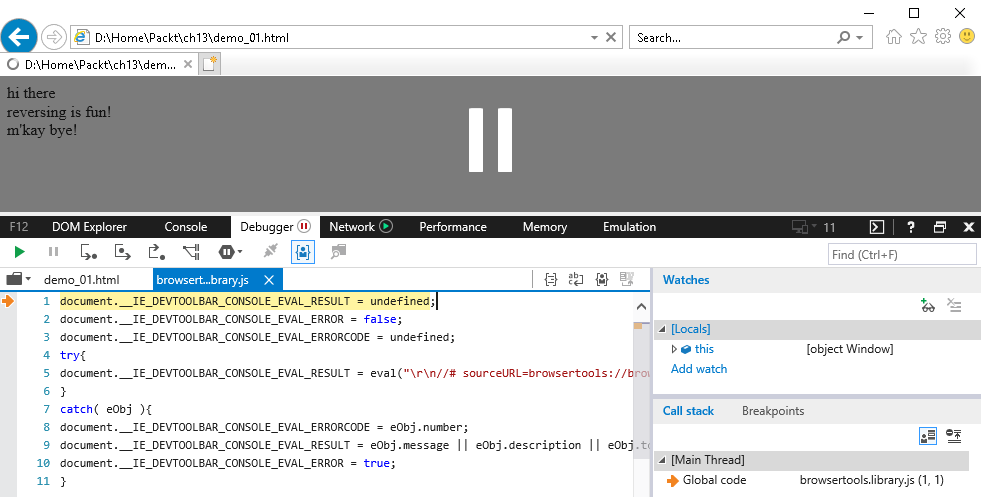

Just press **`_F5_`** again to make the debugger continue until we reach our breakpoint. We should now be at the first `alert` function, as follows:

We can press _**`F11`**_ to step into or **`F10`** to Step over the script line. Doing so should invoke the first message box. Continue pressing _**`F10`**_ to move on to the following script lines. The next script is another `alert` function:

The following lines assign `1` to `x` and `2` to `y`. We can monitor what happens to these variables by adding these in the watch list, which is located in the right-hand pane. Click on **`Add watch`** to add the variables that we can monitor:

The last function is another `alert` function that displays the sum of `x` and `y`.

Let's try this with `demo_02.html` ([https://github.com/PacktPublishing/Mastering-Reverse-Engineering/blob/master/ch13/demo\_02.html](https://github.com/PacktPublishing/Mastering-Reverse-Engineering/blob/master/ch13/demo_02.html)).

If we debug this, it performs the same behavior that we encountered in `demo_01.html`. The difference is that it looks obfuscated when we look at it from the text editor:

The message was converted to escaped format using each ASCII character's hexadecimal equivalent. In the previous chapter, we learned about `Cyberchef`, an online tool that we can use to de-obfuscate these types of data. Since this type of data is escaped, we should use an `unescape` operation to decode this data. Using `Cyberchef`, search for the `unescape` operation, and then copy and paste the escaped data in the **`Input`** window. We should get a decoded output showing the exact text we saw in the messages, like so:

Analyzing HTML scripts is not that complicated, especially since everything is almost human readable. All we need to understand is the syntax and the functions of the script language. Plus, this a way to dynamically analyze the script using debugging tools that are fortunately available in internet browsers.

MS Office macro analysis
------------------------

* * *

Microsoft Office has a way for automating simple tasks such as creating formatted tables or inserting letterheads. This is called an MS office macro. MS Office macro makes use of the Visual Basic for Application language, which uses the same language as Visual Basic scripts. However, these can be abused to do more like download a file, create files, make registry entries, and even delete files. 

First off, we need static tools to read information and extract the macro source from a given Office file. To open MS Office documents, we need to have Microsoft Office installed. The other tool that we could use would be OLE tools, which can be downloaded from [http://www.decalage.info/en/python/oletools](http://www.decalage.info/en/python/oletools). These set of tools are Python scripts, and will require Python 2.7 to be installed on your system. The Python installer can be downloaded from [https://www.python.org/](https://www.python.org/).

The file we are going to analyze first is [https://github.com/PacktPublishing/Mastering-Reverse-Engineering/blob/master/ch13/demo\_01.doc](https://github.com/PacktPublishing/Mastering-Reverse-Engineering/blob/master/ch13/demo_01.doc). Type in the following  code into the command line to use `olevba.py` on `demo_01.doc`:

Copy

    python olevba.py demo_01.doc

This extracts information about the `VBA` source and the source itself:

We can see from the preceding screenshot that the source has two subroutines: `autoopen()` and `autoclose()`. `olevba.py` also describes these subroutines that are tied to events when the document is opened and closed.

The source contains code that pops up messages. Now, let's try to open the document in Microsoft Word. By doing this, we may end up with Microsoft Word showing us a security warning about the document containing code. Click on **`Enable Content`** so that we can see what the macro can do:

The first message immediately appears:

To debug the code, we need to open up the VBA editor. Select **`View->Macro`**. This opens up the **`Macro`** dialog box where you can select any **`Macro name`**and click on the **`Edit`** button:

We are currently using Microsoft Office 2013, so the user interface for the `VBA` Editor may be different for other versions. In the `VBA` Editor, we should now see the source code. Pressing _**`F9`**_ on a line of code enables or disables a breakpoint. Pressing _**`F8`**_ does step debugging. _**`F5`**_ is for continuing to run the code. We can start debugging from any of the subroutines. Select the **`Deb`****``**`u`**g``** menu to view more debug features that are available:

Closing the document will bring up the following message box:

Now, try analyzing **`demo_02.doc`**. This will be quite a challenge since we will be looking at how the password can be derived.

### Note

Remember that the VBA Editor is the macro developer's console. This is where the macro program was developed and debugged. Thus, to reverse what we are looking for, we can manipulate the source code. 

The password for `demo_02.doc` can be found in the Summary section of this chapter.

PDF file analysis
-----------------

* * *

PDF files have evolved to run specific actions and allow for the execution of JavaScript. For PDF analysis, what we can do is extract event information and analyze what the JavaScript will do. We can use Didier Stevens' PDF Tools to help us analyze PDFs. This toolset runs using Python, so we will again need that installed. PDF Tools can be downloaded from [https://blog.didierstevens.com/programs/pdf-tools/](https://blog.didierstevens.com/programs/pdf-tools/). If you go to the site, you will get a description about each tool in the package.

Let's try using the tool with [https://github.com/PacktPublishing/Mastering-Reverse-Engineering/blob/master/ch13/demo\_01.pdf](https://github.com/PacktPublishing/Mastering-Reverse-Engineering/blob/master/ch13/demo_01.pdf). Using `pdfid.py`, execute the following line:

Copy

    python pdfid.py demo_01.pdf

The following screenshot shows the result of `pdfid` on `demo_01.pdf`:

Here, we can see that there is JavaScript code embedded to it. Let's now try the `pdf-parser.py` file so that we can extract more information. Some elements in the PDF file can be compressed and will not be readable. The `pdf-parser` tool is able to decompress these streams. Execute the following command to redirect output from `pdf-parser` to `demo_01.log`:

Copy

    python pdf-parser.py demo_01.pdf > demo_01.log

The output given by `pdf-parser` is basically the same as the contents of `demo_01.pdf`. The reason for this is that there were no PDF objects that got decompressed. If we look closer at the output, we can easily identify where the script code is:

Copy

      <<
        /JS (app.alert({cMsg: "Reversing is fun!", cTitle: "Mastering Reverse Engineering"})
        ; )
        /S /JavaScript
      >>

As a result, using Chrome as our PDF reader, the PDF displays the following message box:

To debug the JavaScript, we would need to copy this into a separate JavaScript or HTML file. We may also need to fix the syntax of running JavaScript operators. The JavaScript code from the PDF can be converted into the following HTML code:

Copy

    
    
        alert("Reversing is fun!", "Mastering Reverse Engineering");
    
    

SWF file analysis
-----------------

* * *

ShockWave Flash files can also contain code. Basically, flash files are legitimately written to follow a sequence of tasks. But just like any other code, it can be abused to carry out malicious activities.

The SWF file we are going to analyze can be downloaded from [https://github.com/PacktPublishing/Mastering-Reverse-Engineering/blob/master/ch13/demo01.swf](https://github.com/PacktPublishing/Mastering-Reverse-Engineering/blob/master/ch13/demo01.swf).  

The main tool used for analyzing SWF at the time of writing this book is the JPEXS SWF decompiler.  Besides this let's first talk about other existing tools that are able to parse SWF files.  These tools are as follows:

*   SWFTools
*   FLASM
*   Flare
*   XXXSWF

### SWFTools

SWFTools is a collection of tools for reading and building SWF files.  It can be downloaded from [http://www.swftools.org/](http://www.swftools.org/). To successfully install SWFTools, it should be run as administrator. The tools are used at the command line. There are two tools here that can extract information about the SWF file: `swfdump` and `swfextract`. Here's what `swfdump` gives us:

The result tells us that the file is `zlib` compressed.  There is also a `DOABC` method labeled `Main`. The existence of a `DOABC` also means that there is an embedded action script. Using `HxD`, we can verify that the file is compressed. The magic header `CWS` indicates that the `SWF` is indeed compressed. An uncompressed `SWF` starts with `FWS` magic bytes:

The other tool, `swfextract`, is capable of extracting embedded videos or images. `demo01.swf` doesn't contain any media, as we can see from the following screenshot:

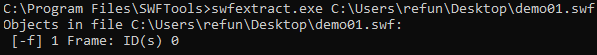

The other tools in `SWFTools` are used to build `SWFs` from PDFs, images, and videos.

### FLASM

`FLASM` is a tool that is capable of decompressing and disassembling`SWF` files. It can be downloaded from [http://nowrap.de/flasm.html](http://nowrap.de/flasm.html). We decompressed `demo01.swf` using the `-x` parameter and got the following output:

After that, we used the `-d` parameter to disassemble the file where it showed information about how the `SWF` was structured:

We can't see any disassembled nor decompiled action scripts here.

### Flare

This is a tool that is capable of decompiling ActionScript code. It can be downloaded from [http://nowrap.de/flare.html](http://nowrap.de/flare.html). However, it may not be able to fully support `AS2` and `AS3` code. Just pass the `SWF` file to the Flare tool and it will generate an `FLR` file. We can executed Flare using the following command:

Copy

    flare.exe demo01.swf

The result placed in `demo01.flr` contained the following output:

Copy

    movie 'demo01.swf' {
    // flash 32, total frames: 1, frame rate: 30 fps, 800x600 px, compressed, network access alowed
    
      metadata application/x-shockwave-flashAdobe Flex 4 Applicationhttp://www.adobe.com/products/flexunknownunknownENOct 29, 2018
    
      // unknown tag 82 length 706
    
      // unknown tag 76 length 9
    }

It had the same result as `FLASM`. No action scripts were disassembled.

### XXXSWF

This tool can be downloaded from [https://github.com/viper-framework/xxxswf](https://github.com/viper-framework/xxxswf). It is a Python script that accepts the following parameters:

Copy

    Usage: xxxswf.py [options] 
    
    Options:
      -h, --help show this help message and exit
      -x, --extract Extracts the embedded SWF(s), names it MD5HASH.swf &
                            saves it in the working dir. No addition args needed
      -y, --yara Scans the SWF(s) with yara. If the SWF(s) is
                            compressed it will be deflated. No addition args
                            needed
      -s, --md5scan Scans the SWF(s) for MD5 signatures. Please see func
                            checkMD5 to define hashes. No addition args needed
      -H, --header Displays the SWFs file header. No addition args needed
      -d, --decompress Deflates compressed SWFS(s)
      -r PATH, --recdir=PATH
                            Will scan a directory for files that contain SWFs.
                            Must provide path in quotes
      -c, --compress Compress SWF using Zlib
      -z, --zcompress Compress SWF using LZMA

We tried using this tool with `demo01.swf`. After using the `-H` paramater, the tool tells us that it is compressed. We then decompressed the file using the `-d` option. This resulted in a decompressed `SWF` version in the `243781cd4047e8774c8125072de4edb1.swf` file. Finally, we used the `-H` parameter on the decompressed file:

So far, what comes in useful for this without the `yara` and `md5` features is its ability to search for embedded flash files. This comes in useful for detecting `SWF` malware with embedded SWFs in it.

### JPEXS SWF decompiler 

One of the most used tool for analyzing SWF files is the `JPEXS` SWF decompiler. Nightly builds can be downloaded from [https://github.com/jindrapetrik/jpexs-decompiler](https://github.com/jindrapetrik/jpexs-decompiler). This tool is capable of decompiling `ActionScript` that supports `AS3`. The following screenshot shows the `JPEXS` console:

Besides being able to decompile, it has an interface that can be set up with Adobe Flash Player's debugger. After installing JPEXS, we need to download the _flash player projector content debugger _from [https://www.adobe.com/support/flashplayer/debug\_downloads.html](https://www.adobe.com/support/flashplayer/debug_downloads.html).

Open JPEXS and then select **`Settings->Advanced Settings->Paths`**. Then, browse to the downloaded flash executable to fill up the Flash Player projector content debugger path.  Click **`OK`** when you're done:

This is an important setup that enables us to debug the decompiled ActionCcript. You can also fill up the Flash Player projector path by downloading the Flash Player projector from [https://www.adobe.com/support/flashplayer/debug\_downloads.html](https://www.adobe.com/support/flashplayer/debug_downloads.html).

Open the SWF file and expand the tree of objects in the left window pane. Select **`Main`** under the `scripts` object. This displays the decompiled ActionScript, as shown in the following screenshot:

And here is the decompiled code for `demo01.swf`:

Copy

    package
    {
       import flash.display.Sprite;
       import flash.text.TextField;
    
       public class Main extends Sprite
       {
    
    
          public function Main()
          {
             super();
             trace("Hello World!");
             var myText:TextField = new TextField();
             myText.text = "Ahoy there!";
             myText.textColor = 16711680;
             myText.width = 100;
             myText.height = 100;
             addChild(myText);
             var myText2:TextField = new TextField();
             myText2.text = "Reversing is fun!\n--b0yb4w4n9";
             myText.y = 100;
             addChild(myText2);
          }
       }
    }

Click the **`Debug`** button or _**`Ctrl+F5`**,_ thisshould bring us to the debugger console. In the left-most window, the byte-code equivalent of the decompiled Actionscript is shown.

What the code does is create two TextFields containing text that gets displayed on the SWF display space.

JPEXS is a tool that has the important feature we want to analyze code in a flash file.  It has a byte-code disassembler, source decompiler, and a debugger.  

Summary
-------

* * *

Analyzing various file types also uses the same concept as reversing. In this chapter, we learned about the scripting language that the file format is using. We could gather additional information if we were also inclined to understand the file's header and structure. We also learned that as long as executable code can be embedded into a file, there is a way to analyze it. It may not be dynamically analyzed easily, but at least static analysis can be performed.

We tackled how to debug JavaScript that is embedded in HTML scripts. Virtually, we can analyze any website we visit. We also learned about the tools that we can use to extract macro code in Microsoft Office documents. It also happens that we can debug this macro code using the VBA Editor. We also looked at a variety of tools that we can use to extract JavaScript from a PDF file. Then we analyzed an SWF file using JPEXS, a powerful tool that has a disassembler, decompiler, and debugger. 

Reversing engineering software is a concept at hand. We research what the software is and how it works. We also get to learn the low-level language beneath the code that executes in the file. It may take time to learn this language, but it is worth the knowledge and experience that we gain from it.

Have a fun day reversing!

P.S.  The password for `demo_02.doc` is burgersteak.

Further reading
---------------

* * *

[https://www.w3schools.com/html/default.asp](https://www.w3schools.com/html/default.asp) : a good tutorial site for learning HTML scripting

[http://www.javascriptobfuscator.com](http://www.javascriptobfuscator.com)[\-](http://www.javascriptobfuscator.com) this is an online site that can obfuscate javascript code

Appendix 1. Other Books You May Enjoy
-------------------------------------

If you enjoyed this book, you may be interested in these other books by Packt:

**Hands-On Cybersecurity for Architects** Neil Rerup

ISBN: 9781788830263

*   Understand different security architecture layers and their integration with all solutions
*   Study SWOT analysis and dig into your organization’s requirements to drive the strategy
*   Design and implement a secure email service approach
*   Monitor the age and capacity of security tools and architecture
*   Explore growth projections and architecture strategy
*   Identify trends, as well as what a security architect should take into consideration

**Cybersecurity - Attack and Defense Strategies** Yuri Diogenes

ISBN: 9781788475297

*   Learn the importance of having a solid foundation for your security posture
*   Understand the attack strategy using cyber security kill chain
*   Learn how to enhance your defense strategy by improving your security policies, hardening your network, implementing active sensors, and leveraging threat intelligence
*   Learn how to perform an incident investigation
*   Get an in-depth understanding of the recovery process
*   Understand continuous security monitoring and how to implement a vulnerability management strategy
*   Learn how to perform log analysis to identify suspicious activities

Leave a review - let other readers know what you think
------------------------------------------------------

* * *

Please share your thoughts on this book with others by leaving a review on the site that you bought it from. If you purchased the book from Amazon, please leave us an honest review on this book's Amazon page. This is vital so that other potential readers can see and use your unbiased opinion to make purchasing decisions, we can understand what our customers think about our products, and our authors can see your feedback on the title that they have worked with Packt to create. It will only take a few minutes of your time, but is valuable to other potential customers, our authors, and Packt. Thank you!

Index
=====

A
-

*   addition operation / [Addition and subtraction](/book/networking_and_servers/9781788838849/3/ch03lvl1sec27/basic-instructions "Addition and subtraction")
*   analysis summary / [Analysis summary](/book/networking_and_servers/9781788838849/12/ch12lvl1sec85/debugging "Analysis summary")
*   anti-debugging tricks
    *   about / [Anti-debugging tricks](/book/networking_and_servers/9781788838849/11/ch11lvl1sec78/anti-debugging-tricks "Anti-debugging tricks")
    *   IsDebuggerPresent / [IsDebuggerPresent](/book/networking_and_servers/9781788838849/11/ch11lvl1sec78/anti-debugging-tricks "IsDebuggerPresent")
    *   flags, debugging in PEB / [Debug flags in the PEB](/book/networking_and_servers/9781788838849/11/ch11lvl1sec78/anti-debugging-tricks "Debug flags in the PEB")
    *   information, debugging from NtQueryInformationProcess / [Debugger information from NtQueryInformationProcess](/book/networking_and_servers/9781788838849/11/ch11lvl1sec78/anti-debugging-tricks "Debugger information from NtQueryInformationProcess")
    *   timing tricks / [Timing tricks](/book/networking_and_servers/9781788838849/11/ch11lvl1sec78/anti-debugging-tricks "Timing tricks")
    *   code execution, passing via SEH / [Passing code execution via SEH](/book/networking_and_servers/9781788838849/11/ch11lvl1sec78/anti-debugging-tricks "Passing code execution via SEH")
*   anti-dumping tricks / [Anti-dumping tricks](/book/networking_and_servers/9781788838849/11/ch11lvl1sec81/anti-dumping-tricks "Anti-dumping tricks")
*   anti-emulation tricks / [Anti-emulation tricks](/book/networking_and_servers/9781788838849/11/ch11lvl1sec80/anti-emulation-tricks "Anti-emulation tricks")
*   anti-VM tricks
    *   about / [Anti-VM tricks](/book/networking_and_servers/9781788838849/11/ch11lvl1sec79/anti-vm-tricks "Anti-VM tricks")
    *   VM running process names / [VM running process names](/book/networking_and_servers/9781788838849/11/ch11lvl1sec79/anti-vm-tricks "VM running process names")
    *   existence of VM files/directories / [Existence of VM files and directories](/book/networking_and_servers/9781788838849/11/ch11lvl1sec79/anti-vm-tricks "Existence of VM files and directories")
    *   default MAC address / [Default MAC address](/book/networking_and_servers/9781788838849/11/ch11lvl1sec79/anti-vm-tricks "Default MAC address")
    *   registry entries made by VMs / [Registry entries made by VMs](/book/networking_and_servers/9781788838849/11/ch11lvl1sec79/anti-vm-tricks "Registry entries made by VMs")
    *   VM devices / [VM devices](/book/networking_and_servers/9781788838849/11/ch11lvl1sec79/anti-vm-tricks "VM devices")
    *   CPUID results / [CPUID results](/book/networking_and_servers/9781788838849/11/ch11lvl1sec79/anti-vm-tricks "CPUID results")
*   API Monitor / [Monitoring tools](/book/networking_and_servers/9781788838849/5/ch05lvl1sec39/information-gathering-tools "Monitoring tools")
*   APIs
    *   calling / [Calling APIs](/book/networking_and_servers/9781788838849/3/ch03lvl1sec30/after-hello "Calling APIs")
    *   Windows API libraries / [Common Windows API libraries](/book/networking_and_servers/9781788838849/3/ch03lvl1sec30/after-hello "Common Windows API libraries")
    *   functions / [Short list of common API functions](/book/networking_and_servers/9781788838849/3/ch03lvl1sec30/after-hello "Short list of common API functions")
    *   learning / [Learning about the APIs](/book/networking_and_servers/9781788838849/7/ch07lvl1sec57/hello-world "Learning about the APIs")
    *   keylogger / [Keylogger](/book/networking_and_servers/9781788838849/7/ch07lvl1sec57/hello-world "Keylogger")
    *   regenum / [regenum](/book/networking_and_servers/9781788838849/7/ch07lvl1sec57/hello-world "regenum")
    *   server / [The server](/book/networking_and_servers/9781788838849/7/ch07lvl1sec57/hello-world "The server")
*   Application Program Interface (API) / [Disassemblers](/book/networking_and_servers/9781788838849/1/ch01lvl1sec13/tools "Disassemblers")
*   arithmetic operations
    *   about / [Arithmetic operations](/book/networking_and_servers/9781788838849/3/ch03lvl1sec27/basic-instructions "Arithmetic operations")
    *   addition / [Addition and subtraction](/book/networking_and_servers/9781788838849/3/ch03lvl1sec27/basic-instructions "Addition and subtraction")
    *   subtraction / [Addition and subtraction](/book/networking_and_servers/9781788838849/3/ch03lvl1sec27/basic-instructions "Addition and subtraction")
    *   decrement instruction / [Increment and decrement instructions](/book/networking_and_servers/9781788838849/3/ch03lvl1sec27/basic-instructions "Increment and decrement instructions")
    *   increment instruction / [Increment and decrement instructions](/book/networking_and_servers/9781788838849/3/ch03lvl1sec27/basic-instructions "Increment and decrement instructions")
    *   division instruction / [Multiplication and division instructions](/book/networking_and_servers/9781788838849/3/ch03lvl1sec27/basic-instructions "Multiplication and division instructions")
    *   multiplication instruction / [Multiplication and division instructions](/book/networking_and_servers/9781788838849/3/ch03lvl1sec27/basic-instructions "Multiplication and division instructions")
    *   signed operations / [Other signed operations](/book/networking_and_servers/9781788838849/3/ch03lvl1sec27/basic-instructions "Other signed operations")
*   ARM-compiled executables
    *   analyzing / [Analysis in unfamiliar environments](/book/networking_and_servers/9781788838849/8/ch08lvl1sec62/analysis-in-unfamiliar-environments "Analysis in unfamiliar environments")
*   assemblers
    *   about / [Popular assemblers](/book/networking_and_servers/9781788838849/3/ch03lvl1sec28/tools-builder-and-debugger "Popular assemblers")
    *   MASM / [MASM](/book/networking_and_servers/9781788838849/3/ch03lvl1sec28/tools-builder-and-debugger "MASM")
    *   NASM / [NASM](/book/networking_and_servers/9781788838849/3/ch03lvl1sec28/tools-builder-and-debugger "NASM")
    *   FASM / [FASM](/book/networking_and_servers/9781788838849/3/ch03lvl1sec28/tools-builder-and-debugger "FASM")
*   assessment
    *   ideas / [Assessment and static analysis](/book/networking_and_servers/9781788838849/4/ch04lvl1sec33/assessment-and-static-analysis "Assessment and static analysis")
    *   file types / [File types and header analysis](/book/networking_and_servers/9781788838849/4/ch04lvl1sec33/assessment-and-static-analysis "File types and header analysis")
    *   header analysis / [File types and header analysis](/book/networking_and_servers/9781788838849/4/ch04lvl1sec33/assessment-and-static-analysis "File types and header analysis")
*   attack tools
    *   about / [Attack tools](/book/networking_and_servers/9781788838849/5/ch05lvl1sec45/attack-tools "Attack tools")
    *   Metasploit / [Attack tools](/book/networking_and_servers/9781788838849/5/ch05lvl1sec45/attack-tools "Attack tools")
    *   ExploitPack / [Attack tools](/book/networking_and_servers/9781788838849/5/ch05lvl1sec45/attack-tools "Attack tools")
*   automated analysis
    *   tools / [Dynamic analysis](/book/networking_and_servers/9781788838849/4/ch04lvl1sec34/dynamic-analysis "Dynamic analysis")
*   automated dynamic analysis
    *   about / [Automated dynamic analysis](/book/networking_and_servers/9781788838849/5/ch05lvl1sec48/automated-dynamic-analysis "Automated dynamic analysis")
    *   Cuckoo / [Automated dynamic analysis](/book/networking_and_servers/9781788838849/5/ch05lvl1sec48/automated-dynamic-analysis "Automated dynamic analysis")
    *   ThreatAnalyzer / [Automated dynamic analysis](/book/networking_and_servers/9781788838849/5/ch05lvl1sec48/automated-dynamic-analysis "Automated dynamic analysis")
    *   Joe Sandbox / [Automated dynamic analysis](/book/networking_and_servers/9781788838849/5/ch05lvl1sec48/automated-dynamic-analysis "Automated dynamic analysis")
    *   Buster Sandbox Analyzer (BSA) / [Automated dynamic analysis](/book/networking_and_servers/9781788838849/5/ch05lvl1sec48/automated-dynamic-analysis "Automated dynamic analysis")
    *   Regshot / [Automated dynamic analysis](/book/networking_and_servers/9781788838849/5/ch05lvl1sec48/automated-dynamic-analysis "Automated dynamic analysis")
*   automation tools
    *   about / [Automation tools](/book/networking_and_servers/9781788838849/5/ch05lvl1sec46/automation-tools "Automation tools")
    *   Python / [Automation tools](/book/networking_and_servers/9781788838849/5/ch05lvl1sec46/automation-tools "Automation tools")
    *   Yara / [Automation tools](/book/networking_and_servers/9781788838849/5/ch05lvl1sec46/automation-tools "Automation tools")
    *   Visual Studio / [Automation tools](/book/networking_and_servers/9781788838849/5/ch05lvl1sec46/automation-tools "Automation tools")
*   autoruns / [Autoruns](/book/networking_and_servers/9781788838849/2/ch02lvl1sec21/tools "Autoruns")

B
-

*   bases
    *   about / [Bases](/book/networking_and_servers/9781788838849/3/ch03lvl1sec25/binary-numbers "Bases")
    *   converting between / [Converting between bases](/book/networking_and_servers/9781788838849/3/ch03lvl1sec25/binary-numbers "Converting between bases")
*   basic analysis lab setup / [Basic analysis lab setup](/book/networking_and_servers/9781788838849/1/ch01lvl1sec15/basic-analysis-lab-setup "Basic analysis lab setup"), [Our setup](/book/networking_and_servers/9781788838849/1/ch01lvl1sec15/basic-analysis-lab-setup "Our setup")
*   basic instructions
    *   about / [Basic instructions](/book/networking_and_servers/9781788838849/3/ch03lvl1sec27/basic-instructions "Basic instructions")
    *   opcode bytes / [Opcode bytes](/book/networking_and_servers/9781788838849/3/ch03lvl1sec27/basic-instructions "Opcode bytes")
    *   data, copying / [Copying data](/book/networking_and_servers/9781788838849/3/ch03lvl1sec27/basic-instructions "Copying data")
    *   arithmetic operations / [Arithmetic operations](/book/networking_and_servers/9781788838849/3/ch03lvl1sec27/basic-instructions "Arithmetic operations")
    *   bitwise algebra / [Bitwise algebra](/book/networking_and_servers/9781788838849/3/ch03lvl1sec27/basic-instructions "Bitwise algebra")
    *   control flow / [Control flow](/book/networking_and_servers/9781788838849/3/ch03lvl1sec27/basic-instructions "Control flow")
    *   stack manipulation / [Stack manipulation](/book/networking_and_servers/9781788838849/3/ch03lvl1sec27/basic-instructions "Stack manipulation")
*   BEYE
    *   about / [Disassemblers](/book/networking_and_servers/9781788838849/5/ch05lvl1sec40/disassemblers "Disassemblers")
    *   reference / [Disassemblers](/book/networking_and_servers/9781788838849/5/ch05lvl1sec40/disassemblers "Disassemblers")
*   binary analysis tools / [Binary analysis tools](/book/networking_and_servers/9781788838849/1/ch01lvl1sec13/tools "Binary analysis tools")
*   binary arithmetic / [Binary arithmetic](/book/networking_and_servers/9781788838849/3/ch03lvl1sec25/binary-numbers "Binary arithmetic")
*   binary numbers
    *   about / [Binary numbers](/book/networking_and_servers/9781788838849/3/ch03lvl1sec25/binary-numbers "Binary numbers")
    *   bases / [Bases](/book/networking_and_servers/9781788838849/3/ch03lvl1sec25/binary-numbers "Bases")
    *   signed numbers / [Signed numbers](/book/networking_and_servers/9781788838849/3/ch03lvl1sec25/binary-numbers "Signed numbers")
*   bintext
    *   reference / [Try it yourself](/book/networking_and_servers/9781788838849/4/ch04lvl1sec35/try-it-yourself "Try it yourself")
*   BinText / [Strings](/book/networking_and_servers/9781788838849/5/ch05lvl1sec39/information-gathering-tools "Strings")
*   bitwise algebra
    *   about / [Bitwise algebra](/book/networking_and_servers/9781788838849/3/ch03lvl1sec27/basic-instructions "Bitwise algebra")
    *   NOT / [Bitwise algebra](/book/networking_and_servers/9781788838849/3/ch03lvl1sec27/basic-instructions "Bitwise algebra")
    *   AND / [Bitwise algebra](/book/networking_and_servers/9781788838849/3/ch03lvl1sec27/basic-instructions "Bitwise algebra")
    *   OR / [Bitwise algebra](/book/networking_and_servers/9781788838849/3/ch03lvl1sec27/basic-instructions "Bitwise algebra")
    *   XOR / [Bitwise algebra](/book/networking_and_servers/9781788838849/3/ch03lvl1sec27/basic-instructions "Bitwise algebra")
    *   SHL/SAL / [Bitwise algebra](/book/networking_and_servers/9781788838849/3/ch03lvl1sec27/basic-instructions "Bitwise algebra")
    *   SHR/SAR / [Bitwise algebra](/book/networking_and_servers/9781788838849/3/ch03lvl1sec27/basic-instructions "Bitwise algebra")
    *   ROL / [Bitwise algebra](/book/networking_and_servers/9781788838849/3/ch03lvl1sec27/basic-instructions "Bitwise algebra")
    *   ROR / [Bitwise algebra](/book/networking_and_servers/9781788838849/3/ch03lvl1sec27/basic-instructions "Bitwise algebra")
*   Bless / [Editing tools](/book/networking_and_servers/9781788838849/5/ch05lvl1sec44/editing-tools "Editing tools")
*   Bochs
    *   about / [Emulators](/book/networking_and_servers/9781788838849/8/ch08lvl1sec61/emulation "Emulators")
    *   MBR debugging / [MBR debugging with Bochs](/book/networking_and_servers/9781788838849/8/ch08lvl1sec62/analysis-in-unfamiliar-environments "MBR debugging with Bochs")
*   Buster Sandbox Analyzer (BSA) / [Automated dynamic analysis](/book/networking_and_servers/9781788838849/5/ch05lvl1sec48/automated-dynamic-analysis "Automated dynamic analysis")

C
-

*   Capstone
    *   about / [Disassemblers](/book/networking_and_servers/9781788838849/5/ch05lvl1sec40/disassemblers "Disassemblers")
    *   reference / [Disassemblers](/book/networking_and_servers/9781788838849/5/ch05lvl1sec40/disassemblers "Disassemblers")
*   CaptureBAT / [Monitoring tools](/book/networking_and_servers/9781788838849/5/ch05lvl1sec39/information-gathering-tools "Monitoring tools")
*   CFF Explorer
    *   about / [File type information](/book/networking_and_servers/9781788838849/5/ch05lvl1sec39/information-gathering-tools "File type information")
    *   download link / [Static analysis](/book/networking_and_servers/9781788838849/7/ch07lvl1sec58/what-is-the-password "Static analysis")
*   code assembly / [Code assembly](/book/networking_and_servers/9781788838849/9/ch09lvl1sec65/data-assembly-on-the-stack "Code assembly")
*   Complex Instruction Set Computing (CISC) / [Emulation](/book/networking_and_servers/9781788838849/8/ch08lvl1sec61/emulation "Emulation")
*   compressors / [Packers or compressors](/book/networking_and_servers/9781788838849/10/ch10lvl1sec72/packers-crypters-obfuscators-protectors-and-sfx "Packers or compressors")
*   control flow / [Control flow](/book/networking_and_servers/9781788838849/3/ch03lvl1sec27/basic-instructions "Control flow")
*   CPU architectures / [Emulation](/book/networking_and_servers/9781788838849/8/ch08lvl1sec61/emulation "Emulation")
*   CPUID
    *   reference / [CPUID results](/book/networking_and_servers/9781788838849/11/ch11lvl1sec79/anti-vm-tricks "CPUID results")
*   crypters / [Crypters](/book/networking_and_servers/9781788838849/10/ch10lvl1sec72/packers-crypters-obfuscators-protectors-and-sfx "Crypters")
*   Cryptographic Service Provider (CSP) / [Encrypting and decrypting a file](/book/networking_and_servers/9781788838849/7/ch07lvl1sec57/hello-world "Encrypting and decrypting a file")
*   Cuckoo / [Dynamic analysis](/book/networking_and_servers/9781788838849/4/ch04lvl1sec34/dynamic-analysis "Dynamic analysis"), [Automated dynamic analysis](/book/networking_and_servers/9781788838849/5/ch05lvl1sec48/automated-dynamic-analysis "Automated dynamic analysis")
*   Cyberchef / [Other file-types](/book/networking_and_servers/9781788838849/10/ch10lvl1sec76/other-file-types "Other file-types")

D
-

*   data assembly
    *   on stack / [Data assembly on the stack](/book/networking_and_servers/9781788838849/9/ch09lvl1sec65/data-assembly-on-the-stack "Data assembly on the stack")
    *   in memory regions / [Assembly of data in other memory regions](/book/networking_and_servers/9781788838849/9/ch09lvl1sec67/assembly-of-data-in-other-memory-regions "Assembly of data in other memory regions")
*   deadlisting / [Deadlisting](/book/networking_and_servers/9781788838849/4/ch04lvl1sec33/assessment-and-static-analysis "Deadlisting")
*   debuggers
    *   about / [Debuggers](/book/networking_and_servers/9781788838849/1/ch01lvl1sec13/tools "Debuggers"), [Debuggers](/book/networking_and_servers/9781788838849/5/ch05lvl1sec41/debuggers "Debuggers")
    *   x86dbg / [Debuggers](/book/networking_and_servers/9781788838849/5/ch05lvl1sec41/debuggers "Debuggers")
    *   IDA Pro / [Debuggers](/book/networking_and_servers/9781788838849/5/ch05lvl1sec41/debuggers "Debuggers")
    *   OllyDebug / [Debuggers](/book/networking_and_servers/9781788838849/5/ch05lvl1sec41/debuggers "Debuggers")
    *   Immunity Debugger / [Debuggers](/book/networking_and_servers/9781788838849/5/ch05lvl1sec41/debuggers "Debuggers")
    *   Windbg / [Debuggers](/book/networking_and_servers/9781788838849/5/ch05lvl1sec41/debuggers "Debuggers")
    *   GDB / [Debuggers](/book/networking_and_servers/9781788838849/5/ch05lvl1sec41/debuggers "Debuggers")
    *   Radare / [Debuggers](/book/networking_and_servers/9781788838849/5/ch05lvl1sec41/debuggers "Debuggers")
*   debugging
    *   about / [Debugging](/book/networking_and_servers/9781788838849/3/ch03lvl1sec30/after-hello "Debugging"), [Debugging](/book/networking_and_servers/9781788838849/12/ch12lvl1sec85/debugging "Debugging")
    *   unknown image / [The unknown image](/book/networking_and_servers/9781788838849/12/ch12lvl1sec85/debugging "The unknown image")
    *   analysis summary / [Analysis summary](/book/networking_and_servers/9781788838849/12/ch12lvl1sec85/debugging "Analysis summary")
*   decompilers
    *   about / [Decompilers](/book/networking_and_servers/9781788838849/1/ch01lvl1sec13/tools "Decompilers"), [Decompilers](/book/networking_and_servers/9781788838849/4/ch04lvl1sec33/assessment-and-static-analysis "Decompilers"), [Decompilers](/book/networking_and_servers/9781788838849/5/ch05lvl1sec42/decompilers "Decompilers")
    *   ILSpy / [ILSpy – C# Decompiler](/book/networking_and_servers/9781788838849/4/ch04lvl1sec33/assessment-and-static-analysis "ILSpy – C# Decompiler")
    *   Snowman / [Decompilers](/book/networking_and_servers/9781788838849/5/ch05lvl1sec42/decompilers "Decompilers")
    *   Hex-Rays / [Decompilers](/book/networking_and_servers/9781788838849/5/ch05lvl1sec42/decompilers "Decompilers")
    *   dotPeek / [Decompilers](/book/networking_and_servers/9781788838849/5/ch05lvl1sec42/decompilers "Decompilers")
    *   iLSpy / [Decompilers](/book/networking_and_servers/9781788838849/5/ch05lvl1sec42/decompilers "Decompilers")
*   decrement instruction / [Increment and decrement instructions](/book/networking_and_servers/9781788838849/3/ch03lvl1sec27/basic-instructions "Increment and decrement instructions")
*   default command-line tools
    *   strings / [Default command-line tools](/book/networking_and_servers/9781788838849/5/ch05lvl1sec39/information-gathering-tools "Default command-line tools")
    *   md5sum / [Default command-line tools](/book/networking_and_servers/9781788838849/5/ch05lvl1sec39/information-gathering-tools "Default command-line tools")
    *   file / [Default command-line tools](/book/networking_and_servers/9781788838849/5/ch05lvl1sec39/information-gathering-tools "Default command-line tools")
*   Detect-it-Easy (DiE) / [File type information](/book/networking_and_servers/9781788838849/5/ch05lvl1sec39/information-gathering-tools "File type information")
*   disassemblers
    *   about / [Disassemblers](/book/networking_and_servers/9781788838849/1/ch01lvl1sec13/tools "Disassemblers"), [Disassemblers](/book/networking_and_servers/9781788838849/5/ch05lvl1sec40/disassemblers "Disassemblers")
    *   IDA Pro / [Disassemblers](/book/networking_and_servers/9781788838849/5/ch05lvl1sec40/disassemblers "Disassemblers")
    *   Radare / [Disassemblers](/book/networking_and_servers/9781788838849/5/ch05lvl1sec40/disassemblers "Disassemblers")
    *   Capstone / [Disassemblers](/book/networking_and_servers/9781788838849/5/ch05lvl1sec40/disassemblers "Disassemblers")
    *   Hopper / [Disassemblers](/book/networking_and_servers/9781788838849/5/ch05lvl1sec40/disassemblers "Disassemblers")
    *   BEYE / [Disassemblers](/book/networking_and_servers/9781788838849/5/ch05lvl1sec40/disassemblers "Disassemblers")
    *   HIEW / [Disassemblers](/book/networking_and_servers/9781788838849/5/ch05lvl1sec40/disassemblers "Disassemblers")
*   disk filesystems / [The filesystem](/book/networking_and_servers/9781788838849/2/ch02lvl1sec19/the-operating-system-environment "The filesystem")
*   division instruction / [Multiplication and division instructions](/book/networking_and_servers/9781788838849/3/ch03lvl1sec27/basic-instructions "Multiplication and division instructions")
*   dlroW olleH
    *   about / [dlroW olleH](/book/networking_and_servers/9781788838849/6/ch06lvl1sec52/linux-executable-hello-world "dlroW olleH")
    *   information / [What have we gathered so far?](/book/networking_and_servers/9781788838849/6/ch06lvl1sec52/linux-executable-hello-world "What have we gathered so far?")
    *   dynamic analysis / [Dynamic analysis](/book/networking_and_servers/9781788838849/6/ch06lvl1sec52/linux-executable-hello-world "Dynamic analysis")
    *   debugging / [Going further with debugging](/book/networking_and_servers/9781788838849/6/ch06lvl1sec52/linux-executable-hello-world "Going further with debugging")
*   dotPeek
    *   reference / [Decompilers](/book/networking_and_servers/9781788838849/5/ch05lvl1sec42/decompilers "Decompilers")
    *   about / [Decompilers](/book/networking_and_servers/9781788838849/5/ch05lvl1sec42/decompilers "Decompilers")
*   dynamic analysis
    *   about / [Dynamic analysis](/book/networking_and_servers/9781788838849/4/ch04lvl1sec34/dynamic-analysis "Dynamic analysis")
    *   memory regions / [Memory regions and the mapping of a process](/book/networking_and_servers/9781788838849/4/ch04lvl1sec34/dynamic-analysis "Memory regions and the mapping of a process")
    *   mapping process / [Memory regions and the mapping of a process](/book/networking_and_servers/9781788838849/4/ch04lvl1sec34/dynamic-analysis "Memory regions and the mapping of a process")
    *   memory process / [Memory regions and the mapping of a process](/book/networking_and_servers/9781788838849/4/ch04lvl1sec34/dynamic-analysis "Memory regions and the mapping of a process")
    *   process monitoring / [Process and thread monitoring](/book/networking_and_servers/9781788838849/4/ch04lvl1sec34/dynamic-analysis "Process and thread monitoring")
    *   thread monitoring / [Process and thread monitoring](/book/networking_and_servers/9781788838849/4/ch04lvl1sec34/dynamic-analysis "Process and thread monitoring")
    *   network traffic / [Network traffic](/book/networking_and_servers/9781788838849/4/ch04lvl1sec34/dynamic-analysis "Network traffic")
    *   system changes, monitoring / [Monitoring system changes](/book/networking_and_servers/9781788838849/4/ch04lvl1sec34/dynamic-analysis "Monitoring system changes")
    *   post-execution differences / [Post-execution differences](/book/networking_and_servers/9781788838849/4/ch04lvl1sec34/dynamic-analysis "Post-execution differences")
    *   debugging / [Debugging](/book/networking_and_servers/9781788838849/4/ch04lvl1sec34/dynamic-analysis "Debugging")

E
-

*   editing tools
    *   about / [Editing tools](/book/networking_and_servers/9781788838849/5/ch05lvl1sec44/editing-tools "Editing tools")
    *   HxD Hex Editor / [Editing tools](/book/networking_and_servers/9781788838849/5/ch05lvl1sec44/editing-tools "Editing tools")
    *   Bless / [Editing tools](/book/networking_and_servers/9781788838849/5/ch05lvl1sec44/editing-tools "Editing tools")
    *   Notepad++ / [Editing tools](/book/networking_and_servers/9781788838849/5/ch05lvl1sec44/editing-tools "Editing tools")
    *   BEYE / [Editing tools](/book/networking_and_servers/9781788838849/5/ch05lvl1sec44/editing-tools "Editing tools")
    *   HIEW / [Editing tools](/book/networking_and_servers/9781788838849/5/ch05lvl1sec44/editing-tools "Editing tools")
*   emulation
    *   about / [Emulation](/book/networking_and_servers/9781788838849/8/ch08lvl1sec61/emulation "Emulation")
    *   of Windows, under x86 host / [Emulation of Windows and Linux under an x86 host](/book/networking_and_servers/9781788838849/8/ch08lvl1sec61/emulation "Emulation of Windows and Linux under an x86 host")
    *   of Linux, under x86 host / [Emulation of Windows and Linux under an x86 host](/book/networking_and_servers/9781788838849/8/ch08lvl1sec61/emulation "Emulation of Windows and Linux under an x86 host")
*   emulators
    *   about / [Emulators](/book/networking_and_servers/9781788838849/8/ch08lvl1sec61/emulation "Emulators")
    *   QEMU / [Emulators](/book/networking_and_servers/9781788838849/8/ch08lvl1sec61/emulation "Emulators")
    *   Bochs / [Emulators](/book/networking_and_servers/9781788838849/8/ch08lvl1sec61/emulation "Emulators")
*   encrypted data identification
    *   about / [Encrypted data identification](/book/networking_and_servers/9781788838849/9/ch09lvl1sec66/encrypted-data-identification "Encrypted data identification")
    *   loop codes / [Loop codes](/book/networking_and_servers/9781788838849/9/ch09lvl1sec66/encrypted-data-identification "Loop codes")
    *   simple arithmetic / [Simple arithmetic](/book/networking_and_servers/9781788838849/9/ch09lvl1sec66/encrypted-data-identification "Simple arithmetic")
    *   simple XOR decryption / [Simple XOR decryption](/book/networking_and_servers/9781788838849/9/ch09lvl1sec66/encrypted-data-identification "Simple XOR decryption")
*   environment setup, for tools
    *   virtual machines / [Virtual machines](/book/networking_and_servers/9781788838849/5/ch05lvl1sec38/analysis-environments "Virtual machines")
    *   Windows / [Windows](/book/networking_and_servers/9781788838849/5/ch05lvl1sec38/analysis-environments "Windows")
    *   Linux / [Linux](/book/networking_and_servers/9781788838849/5/ch05lvl1sec38/analysis-environments "Linux")
*   errors
    *   dealing with / [Dealing with common errors when building](/book/networking_and_servers/9781788838849/3/ch03lvl1sec29/hello-world "Dealing with common errors when building")
*   exceptions / [Causing exceptions](/book/networking_and_servers/9781788838849/11/ch11lvl1sec78/anti-debugging-tricks "Causing exceptions")
*   executable
    *   in unpacked state / [How about an executable in its unpacked state?](/book/networking_and_servers/9781788838849/10/ch10lvl1sec75/how-about-an-executable-in-its-unpacked-state "How about an executable in its unpacked state?")
*   executable files / [Packers, crypters, obfuscators, protectors and SFX](/book/networking_and_servers/9781788838849/10/ch10lvl1sec72/packers-crypters-obfuscators-protectors-and-sfx "Packers, crypters, obfuscators, protectors and SFX")
*   ExifTool / [File type information](/book/networking_and_servers/9781788838849/5/ch05lvl1sec39/information-gathering-tools "File type information")
*   ExploitPack
    *   about / [Attack tools](/book/networking_and_servers/9781788838849/5/ch05lvl1sec45/attack-tools "Attack tools")
    *   reference / [Attack tools](/book/networking_and_servers/9781788838849/5/ch05lvl1sec45/attack-tools "Attack tools")

F
-

*   Falcon Sandbox / [Online service sites](/book/networking_and_servers/9781788838849/5/ch05lvl1sec49/online-service-sites "Online service sites")
*   FASM
    *   about / [FASM](/book/networking_and_servers/9781788838849/3/ch03lvl1sec28/tools-builder-and-debugger "FASM")
    *   download link / [FASM](/book/networking_and_servers/9781788838849/3/ch03lvl1sec28/tools-builder-and-debugger "FASM")
    *   installing / [Installation of FASM](/book/networking_and_servers/9781788838849/3/ch03lvl1sec29/hello-world "Installation of FASM")
    *   working / [It works!](/book/networking_and_servers/9781788838849/3/ch03lvl1sec29/hello-world "It works!")
*   file
    *   information, extracting from / [Extracting useful information from file](/book/networking_and_servers/9781788838849/4/ch04lvl1sec33/assessment-and-static-analysis "Extracting useful information from file")
    *   about / [file](/book/networking_and_servers/9781788838849/4/ch04lvl1sec33/assessment-and-static-analysis "file")
    *   encrypting / [Encrypting and decrypting a file](/book/networking_and_servers/9781788838849/7/ch07lvl1sec57/hello-world "Encrypting and decrypting a file")
    *   decrypting / [Encrypting and decrypting a file](/book/networking_and_servers/9781788838849/7/ch07lvl1sec57/hello-world "Encrypting and decrypting a file")
*   File-types / [Other file-types](/book/networking_and_servers/9781788838849/10/ch10lvl1sec76/other-file-types "Other file-types")
*   filesystem / [The filesystem](/book/networking_and_servers/9781788838849/2/ch02lvl1sec19/the-operating-system-environment "The filesystem")
*   file type information tools
    *   PEiD / [File type information](/book/networking_and_servers/9781788838849/5/ch05lvl1sec39/information-gathering-tools "File type information")
    *   TrID / [File type information](/book/networking_and_servers/9781788838849/5/ch05lvl1sec39/information-gathering-tools "File type information")
    *   CFF Explorer / [File type information](/book/networking_and_servers/9781788838849/5/ch05lvl1sec39/information-gathering-tools "File type information")
    *   PE Explorer / [File type information](/book/networking_and_servers/9781788838849/5/ch05lvl1sec39/information-gathering-tools "File type information")
    *   Detect-it-Easy (DiE) / [File type information](/book/networking_and_servers/9781788838849/5/ch05lvl1sec39/information-gathering-tools "File type information")
    *   ExifTool / [File type information](/book/networking_and_servers/9781788838849/5/ch05lvl1sec39/information-gathering-tools "File type information")
*   Flare
    *   about / [Flare](/book/networking_and_servers/9781788838849/13/ch13lvl1sec91/swf-file-analysis "Flare")
    *   reference / [Flare](/book/networking_and_servers/9781788838849/13/ch13lvl1sec91/swf-file-analysis "Flare")
*   FLASM
    *   about / [FLASM](/book/networking_and_servers/9781788838849/13/ch13lvl1sec91/swf-file-analysis "FLASM")
    *   reference / [FLASM](/book/networking_and_servers/9781788838849/13/ch13lvl1sec91/swf-file-analysis "FLASM")

G
-

*   GDB / [Debuggers](/book/networking_and_servers/9781788838849/5/ch05lvl1sec41/debuggers "Debuggers")

H
-

*   hash information / [Other information](/book/networking_and_servers/9781788838849/4/ch04lvl1sec33/assessment-and-static-analysis "Other information")
*   HashTab / [Hash identifying](/book/networking_and_servers/9781788838849/5/ch05lvl1sec39/information-gathering-tools "Hash identifying")
*   Hello World
    *   in Radare2 / [Hello World in Radare2](/book/networking_and_servers/9781788838849/6/ch06lvl1sec52/linux-executable-hello-world "Hello World in Radare2")
    *   about / [Hello World](/book/networking_and_servers/9781788838849/7/ch07lvl1sec57/hello-world "Hello World")
*   hello world program, Linux
    *   about / [Linux executable – hello world](/book/networking_and_servers/9781788838849/6/ch06lvl1sec52/linux-executable-hello-world "Linux executable – hello world")
    *   dlroW olleH / [dlroW olleH](/book/networking_and_servers/9781788838849/6/ch06lvl1sec52/linux-executable-hello-world "dlroW olleH")
    *   password / [What is the password?](/book/networking_and_servers/9781788838849/6/ch06lvl1sec52/linux-executable-hello-world "What is the password?")
*   Hex-Rays / [Decompilers](/book/networking_and_servers/9781788838849/5/ch05lvl1sec42/decompilers "Decompilers")
*   HIEW / [Disassemblers](/book/networking_and_servers/9781788838849/5/ch05lvl1sec40/disassemblers "Disassemblers")
*   Hopper / [Disassemblers](/book/networking_and_servers/9781788838849/5/ch05lvl1sec40/disassemblers "Disassemblers")
*   HTML scripts
    *   analyzing / [Analysis of HTML scripts](/book/networking_and_servers/9781788838849/13/ch13lvl1sec88/analysis-of-html-scripts "Analysis of HTML scripts")
*   HxD
    *   reference / [Extracting useful information from file](/book/networking_and_servers/9781788838849/4/ch04lvl1sec33/assessment-and-static-analysis "Extracting useful information from file")
*   HxD Hex Editor / [Editing tools](/book/networking_and_servers/9781788838849/5/ch05lvl1sec44/editing-tools "Editing tools")

I
-

*   IDA (Interactive Disassembler) / [IDA (Interactive Disassembler)](/book/networking_and_servers/9781788838849/4/ch04lvl1sec33/assessment-and-static-analysis "IDA (Interactive Disassembler)")
*   IDA Pro
    *   reference / [Try it yourself](/book/networking_and_servers/9781788838849/4/ch04lvl1sec35/try-it-yourself "Try it yourself"), [Disassemblers](/book/networking_and_servers/9781788838849/5/ch05lvl1sec40/disassemblers "Disassemblers")
    *   about / [Disassemblers](/book/networking_and_servers/9781788838849/5/ch05lvl1sec40/disassemblers "Disassemblers"), [Debuggers](/book/networking_and_servers/9781788838849/5/ch05lvl1sec41/debuggers "Debuggers")
*   iLSpy
    *   reference / [Decompilers](/book/networking_and_servers/9781788838849/5/ch05lvl1sec42/decompilers "Decompilers")
    *   about / [Decompilers](/book/networking_and_servers/9781788838849/5/ch05lvl1sec42/decompilers "Decompilers")
*   ILSpy / [ILSpy – C# Decompiler](/book/networking_and_servers/9781788838849/4/ch04lvl1sec33/assessment-and-static-analysis "ILSpy – C# Decompiler")
*   Immunity Debugger
    *   reference / [Debuggers](/book/networking_and_servers/9781788838849/5/ch05lvl1sec41/debuggers "Debuggers")
    *   about / [Debuggers](/book/networking_and_servers/9781788838849/5/ch05lvl1sec41/debuggers "Debuggers")
*   increment instruction / [Increment and decrement instructions](/book/networking_and_servers/9781788838849/3/ch03lvl1sec27/basic-instructions "Increment and decrement instructions")
*   inetsim / [Network tools](/book/networking_and_servers/9781788838849/5/ch05lvl1sec43/network-tools "Network tools")
*   information
    *   extracting, from file / [Extracting useful information from file](/book/networking_and_servers/9781788838849/4/ch04lvl1sec33/assessment-and-static-analysis "Extracting useful information from file")
*   information gathering tools
    *   about / [Information gathering tools](/book/networking_and_servers/9781788838849/5/ch05lvl1sec39/information-gathering-tools "Information gathering tools")
    *   file type information / [File type information](/book/networking_and_servers/9781788838849/5/ch05lvl1sec39/information-gathering-tools "File type information")
    *   hash identifying / [Hash identifying](/book/networking_and_servers/9781788838849/5/ch05lvl1sec39/information-gathering-tools "Hash identifying")
    *   strings / [Strings](/book/networking_and_servers/9781788838849/5/ch05lvl1sec39/information-gathering-tools "Strings")
    *   monitoring tools / [Monitoring tools](/book/networking_and_servers/9781788838849/5/ch05lvl1sec39/information-gathering-tools "Monitoring tools")
    *   default command-line tools / [Default command-line tools](/book/networking_and_servers/9781788838849/5/ch05lvl1sec39/information-gathering-tools "Default command-line tools")
*   initial file information
    *   obtaining / [Initial file information](/book/networking_and_servers/9781788838849/12/ch12lvl1sec84/initial-static-analysis "Initial file information")
*   initial static analysis
    *   about / [Initial static analysis](/book/networking_and_servers/9781788838849/12/ch12lvl1sec84/initial-static-analysis "Initial static analysis")
    *   initial file information / [Initial file information](/book/networking_and_servers/9781788838849/12/ch12lvl1sec84/initial-static-analysis "Initial file information")
    *   deadlisting / [Deadlisting](/book/networking_and_servers/9781788838849/12/ch12lvl1sec84/initial-static-analysis "Deadlisting")
*   IsDebuggerPresent / [IsDebuggerPresent](/book/networking_and_servers/9781788838849/11/ch11lvl1sec78/anti-debugging-tricks "IsDebuggerPresent")
*   ISO, for Ubuntu installer
    *   reference / [Setup](/book/networking_and_servers/9781788838849/6/ch06lvl1sec51/setup "Setup")

J
-

*   Joe Sandbox / [Automated dynamic analysis](/book/networking_and_servers/9781788838849/5/ch05lvl1sec48/automated-dynamic-analysis "Automated dynamic analysis")
*   JPEXS SWF decompiler / [JPEXS SWF decompiler ](/book/networking_and_servers/9781788838849/13/ch13lvl1sec91/swf-file-analysis "JPEXS SWF decompiler ")
    *   reference / [JPEXS SWF decompiler ](/book/networking_and_servers/9781788838849/13/ch13lvl1sec91/swf-file-analysis "JPEXS SWF decompiler ")
    *   about / [JPEXS SWF decompiler ](/book/networking_and_servers/9781788838849/13/ch13lvl1sec91/swf-file-analysis "JPEXS SWF decompiler ")

K
-

*   keylogger / [Keylogger](/book/networking_and_servers/9781788838849/7/ch07lvl1sec57/hello-world "Keylogger")

L
-

*   LEA / [MOV and LEA](/book/networking_and_servers/9781788838849/3/ch03lvl1sec27/basic-instructions "MOV and LEA")
*   Linux / [Linux](/book/networking_and_servers/9781788838849/5/ch05lvl1sec38/analysis-environments "Linux")
*   Linux ARM guest
    *   in QEMU / [Linux ARM guest in QEMU](/book/networking_and_servers/9781788838849/8/ch08lvl1sec62/analysis-in-unfamiliar-environments "Linux ARM guest in QEMU")
*   Linux ELF file
    *   reference / [A quick review on how native executables are loaded by the OS](/book/networking_and_servers/9781788838849/10/ch10lvl1sec71/a-quick-review-on-how-native-executables-are-loaded-by-the-os "A quick review on how native executables are loaded by the OS")
*   Lubuntu / [Linux](/book/networking_and_servers/9781788838849/5/ch05lvl1sec38/analysis-environments "Linux")

M
-

*   malware
    *   handling / [Malware handling](/book/networking_and_servers/9781788838849/1/ch01lvl1sec14/malware-handling "Malware handling")
    *   about / [Typical malware behavior](/book/networking_and_servers/9781788838849/2/ch02lvl1sec20/typical-malware-behavior "Typical malware behavior")
*   malware delivery
    *   about / [Malware delivery](/book/networking_and_servers/9781788838849/2/ch02lvl1sec20/typical-malware-behavior "Malware delivery")
    *   email / [Email](/book/networking_and_servers/9781788838849/2/ch02lvl1sec20/typical-malware-behavior "Email")
    *   instant messenger / [Instant messenger](/book/networking_and_servers/9781788838849/2/ch02lvl1sec20/typical-malware-behavior "Instant messenger")
    *   computer network / [The computer network](/book/networking_and_servers/9781788838849/2/ch02lvl1sec20/typical-malware-behavior "The computer network")
    *   media storage / [Media storage](/book/networking_and_servers/9781788838849/2/ch02lvl1sec20/typical-malware-behavior "Media storage")
    *   exploits / [Exploits and compromised websites](/book/networking_and_servers/9781788838849/2/ch02lvl1sec20/typical-malware-behavior "Exploits and compromised websites")
    *   compromised websites / [Exploits and compromised websites](/book/networking_and_servers/9781788838849/2/ch02lvl1sec20/typical-malware-behavior "Exploits and compromised websites")
    *   software piracy / [Software piracy](/book/networking_and_servers/9781788838849/2/ch02lvl1sec20/typical-malware-behavior "Software piracy"), [Malware file properties](/book/networking_and_servers/9781788838849/2/ch02lvl1sec20/typical-malware-behavior "Malware file properties")
*   malware persistence
    *   about / [Persistence](/book/networking_and_servers/9781788838849/2/ch02lvl1sec20/typical-malware-behavior "Persistence")
    *   run keys / [Run keys](/book/networking_and_servers/9781788838849/2/ch02lvl1sec20/typical-malware-behavior "Run keys")
    *   load values / [Load and Run values](/book/networking_and_servers/9781788838849/2/ch02lvl1sec20/typical-malware-behavior "Load and Run values")
    *   run values / [Load and Run values](/book/networking_and_servers/9781788838849/2/ch02lvl1sec20/typical-malware-behavior "Load and Run values")
    *   BootExecute value / [Load and Run values](/book/networking_and_servers/9781788838849/2/ch02lvl1sec20/typical-malware-behavior "Load and Run values")
    *   Winlogon key / [Load and Run values](/book/networking_and_servers/9781788838849/2/ch02lvl1sec20/typical-malware-behavior "Load and Run values")
    *   policy scripts keys / [Load and Run values](/book/networking_and_servers/9781788838849/2/ch02lvl1sec20/typical-malware-behavior "Load and Run values")
    *   AppInit\_DLLs values / [Load and Run values](/book/networking_and_servers/9781788838849/2/ch02lvl1sec20/typical-malware-behavior "Load and Run values")
    *   services keys / [Load and Run values](/book/networking_and_servers/9781788838849/2/ch02lvl1sec20/typical-malware-behavior "Load and Run values")
    *   file associations / [Load and Run values](/book/networking_and_servers/9781788838849/2/ch02lvl1sec20/typical-malware-behavior "Load and Run values")
    *   startup values / [Startup values](/book/networking_and_servers/9781788838849/2/ch02lvl1sec20/typical-malware-behavior "Startup values")
    *   Image file execution options key / [The Image File Execution Options key](/book/networking_and_servers/9781788838849/2/ch02lvl1sec20/typical-malware-behavior "The Image File Execution Options key")
*   Malwr
    *   reference / [Dynamic analysis](/book/networking_and_servers/9781788838849/4/ch04lvl1sec34/dynamic-analysis "Dynamic analysis")
    *   about / [Online service sites](/book/networking_and_servers/9781788838849/5/ch05lvl1sec49/online-service-sites "Online service sites")
*   MASM
    *   about / [MASM](/book/networking_and_servers/9781788838849/3/ch03lvl1sec28/tools-builder-and-debugger "MASM")
    *   download link / [MASM](/book/networking_and_servers/9781788838849/3/ch03lvl1sec28/tools-builder-and-debugger "MASM")
*   Master Boot Record (MBR) / [Virtual machines](/book/networking_and_servers/9781788838849/5/ch05lvl1sec38/analysis-environments "Virtual machines")
*   MASTIFF
    *   about / [MASTIFF](/book/networking_and_servers/9781788838849/4/ch04lvl1sec33/assessment-and-static-analysis "MASTIFF")
    *   example / [MASTIFF](/book/networking_and_servers/9781788838849/4/ch04lvl1sec33/assessment-and-static-analysis "MASTIFF")
    *   download link / [MASTIFF](/book/networking_and_servers/9781788838849/4/ch04lvl1sec33/assessment-and-static-analysis "MASTIFF")
*   MBR debugging
    *   with Bochs / [MBR debugging with Bochs](/book/networking_and_servers/9781788838849/8/ch08lvl1sec62/analysis-in-unfamiliar-environments "MBR debugging with Bochs")
*   memory
    *   about / [Memory](/book/networking_and_servers/9781788838849/2/ch02lvl1sec19/the-operating-system-environment "Memory")
    *   processes, dumping from / [Dumping processes from memory](/book/networking_and_servers/9781788838849/10/ch10lvl1sec74/dumping-processes-from-memory "Dumping processes from memory")
*   memory addressing
    *   about / [Memory addressing](/book/networking_and_servers/9781788838849/3/ch03lvl1sec26/x86 "Memory addressing")
    *   endianness / [Endianness](/book/networking_and_servers/9781788838849/3/ch03lvl1sec26/x86 "Endianness")
*   Memory Boot Record (MBR) / [Emulators](/book/networking_and_servers/9781788838849/8/ch08lvl1sec61/emulation "Emulators")
*   memory dumping
    *   with VirtualBox / [Memory dumping with VirtualBox](/book/networking_and_servers/9781788838849/10/ch10lvl1sec74/dumping-processes-from-memory "Memory dumping with VirtualBox")
*   Metasploit
    *   about / [Attack tools](/book/networking_and_servers/9781788838849/5/ch05lvl1sec45/attack-tools "Attack tools")
    *   reference / [Attack tools](/book/networking_and_servers/9781788838849/5/ch05lvl1sec45/attack-tools "Attack tools")
*   MinGW
    *   reference / [NASM](/book/networking_and_servers/9781788838849/3/ch03lvl1sec28/tools-builder-and-debugger "NASM")
*   mitmproxy / [Network tools](/book/networking_and_servers/9781788838849/5/ch05lvl1sec43/network-tools "Network tools")
*   monitoring tools
    *   about / [Monitoring tools](/book/networking_and_servers/9781788838849/1/ch01lvl1sec13/tools "Monitoring tools"), [Monitoring tools](/book/networking_and_servers/9781788838849/5/ch05lvl1sec39/information-gathering-tools "Monitoring tools")
    *   SysInternals Suite's Procmon or Process Monitor / [Monitoring tools](/book/networking_and_servers/9781788838849/5/ch05lvl1sec39/information-gathering-tools "Monitoring tools")
    *   API Monitor / [Monitoring tools](/book/networking_and_servers/9781788838849/5/ch05lvl1sec39/information-gathering-tools "Monitoring tools")
    *   CaptureBAT / [Monitoring tools](/book/networking_and_servers/9781788838849/5/ch05lvl1sec39/information-gathering-tools "Monitoring tools")
*   MOV / [MOV and LEA](/book/networking_and_servers/9781788838849/3/ch03lvl1sec27/basic-instructions "MOV and LEA")
*   MS Office macro analysis
    *   about / [MS Office macro analysis](/book/networking_and_servers/9781788838849/13/ch13lvl1sec89/ms-office-macro-analysis "MS Office macro analysis")
    *   performing / [MS Office macro analysis](/book/networking_and_servers/9781788838849/13/ch13lvl1sec89/ms-office-macro-analysis "MS Office macro analysis")
*   multiplication instruction / [Multiplication and division instructions](/book/networking_and_servers/9781788838849/3/ch03lvl1sec27/basic-instructions "Multiplication and division instructions")

N
-

*   NASM
    *   about / [NASM](/book/networking_and_servers/9781788838849/3/ch03lvl1sec28/tools-builder-and-debugger "NASM")
    *   reference / [NASM](/book/networking_and_servers/9781788838849/3/ch03lvl1sec28/tools-builder-and-debugger "NASM")
*   native executables
    *   loading, by OS / [A quick review on how native executables are loaded by the OS](/book/networking_and_servers/9781788838849/10/ch10lvl1sec71/a-quick-review-on-how-native-executables-are-loaded-by-the-os "A quick review on how native executables are loaded by the OS")
*   network tools
    *   about / [Network tools](/book/networking_and_servers/9781788838849/5/ch05lvl1sec43/network-tools "Network tools")
    *   tcpdump / [Network tools](/book/networking_and_servers/9781788838849/5/ch05lvl1sec43/network-tools "Network tools")
    *   Wireshark / [Network tools](/book/networking_and_servers/9781788838849/5/ch05lvl1sec43/network-tools "Network tools")
    *   mitmproxy / [Network tools](/book/networking_and_servers/9781788838849/5/ch05lvl1sec43/network-tools "Network tools")
    *   inetsim / [Network tools](/book/networking_and_servers/9781788838849/5/ch05lvl1sec43/network-tools "Network tools")
*   network traffic analysis / [Network traffic analysis](/book/networking_and_servers/9781788838849/6/ch06lvl1sec53/network-traffic-analysis "Network traffic analysis")
*   Notepad++
    *   about / [Editing tools](/book/networking_and_servers/9781788838849/5/ch05lvl1sec44/editing-tools "Editing tools")
    *   reference / [Analysis of HTML scripts](/book/networking_and_servers/9781788838849/13/ch13lvl1sec88/analysis-of-html-scripts "Analysis of HTML scripts")
*   NtQueryInformationProcess
    *   reference / [Debugger information from NtQueryInformationProcess](/book/networking_and_servers/9781788838849/11/ch11lvl1sec78/anti-debugging-tricks "Debugger information from NtQueryInformationProcess")

O
-

*   obfuscation techniques
    *   about / [Other obfuscation techniques](/book/networking_and_servers/9781788838849/9/ch09lvl1sec69/other-obfuscation-techniques "Other obfuscation techniques")
    *   control flow flattening obfuscation / [Control flow flattening obfuscation](/book/networking_and_servers/9781788838849/9/ch09lvl1sec69/other-obfuscation-techniques "Control flow flattening obfuscation")
    *   garbage code insertion / [Garbage code insertion](/book/networking_and_servers/9781788838849/9/ch09lvl1sec69/other-obfuscation-techniques "Garbage code insertion")
    *   with metamorphic engine / [Code obfuscation with a metamorphic engine](/book/networking_and_servers/9781788838849/9/ch09lvl1sec69/other-obfuscation-techniques "Code obfuscation with a metamorphic engine")
    *   dynamic library loading / [Dynamic library loading](/book/networking_and_servers/9781788838849/9/ch09lvl1sec69/other-obfuscation-techniques "Dynamic library loading")
    *   PEB information usage / [Use of PEB information](/book/networking_and_servers/9781788838849/9/ch09lvl1sec69/other-obfuscation-techniques "Use of PEB information")
*   obfuscators / [Obfuscators](/book/networking_and_servers/9781788838849/10/ch10lvl1sec72/packers-crypters-obfuscators-protectors-and-sfx "Obfuscators")
*   OllyDebug
    *   about / [Ollydebug](/book/networking_and_servers/9781788838849/3/ch03lvl1sec28/tools-builder-and-debugger "Ollydebug"), [Debuggers](/book/networking_and_servers/9781788838849/5/ch05lvl1sec41/debuggers "Debuggers")
    *   download link / [Ollydebug](/book/networking_and_servers/9781788838849/3/ch03lvl1sec28/tools-builder-and-debugger "Ollydebug")
    *   reference / [Debuggers](/book/networking_and_servers/9781788838849/5/ch05lvl1sec41/debuggers "Debuggers")
*   online service sites
    *   VirusTotal / [Online service sites](/book/networking_and_servers/9781788838849/5/ch05lvl1sec49/online-service-sites "Online service sites")
    *   Malwr / [Online service sites](/book/networking_and_servers/9781788838849/5/ch05lvl1sec49/online-service-sites "Online service sites")
    *   Falcon Sandbox / [Online service sites](/book/networking_and_servers/9781788838849/5/ch05lvl1sec49/online-service-sites "Online service sites")
    *   whois.domaintools.com / [Online service sites](/book/networking_and_servers/9781788838849/5/ch05lvl1sec49/online-service-sites "Online service sites")
    *   robtex.com / [Online service sites](/book/networking_and_servers/9781788838849/5/ch05lvl1sec49/online-service-sites "Online service sites")
    *   debuggex.com / [Online service sites](/book/networking_and_servers/9781788838849/5/ch05lvl1sec49/online-service-sites "Online service sites")
*   opcode bytes / [Opcode bytes](/book/networking_and_servers/9781788838849/3/ch03lvl1sec27/basic-instructions "Opcode bytes")
*   operating system environment
    *   about / [The operating system environment](/book/networking_and_servers/9781788838849/2/ch02lvl1sec19/the-operating-system-environment "The operating system environment")
    *   filesystem / [The filesystem](/book/networking_and_servers/9781788838849/2/ch02lvl1sec19/the-operating-system-environment "The filesystem")
    *   memory / [Memory](/book/networking_and_servers/9781788838849/2/ch02lvl1sec19/the-operating-system-environment "Memory")
    *   registry system / [The registry system](/book/networking_and_servers/9781788838849/2/ch02lvl1sec19/the-operating-system-environment "The registry system")

P
-

*   packed executable
    *   unpacking / [Unpacking](/book/networking_and_servers/9781788838849/10/ch10lvl1sec73/unpacking "Unpacking")
*   packer
    *   about / [Packers or compressors](/book/networking_and_servers/9781788838849/10/ch10lvl1sec72/packers-crypters-obfuscators-protectors-and-sfx "Packers or compressors")
    *   used, for debugging / [Debugging though the packer](/book/networking_and_servers/9781788838849/10/ch10lvl1sec73/unpacking "Debugging though the packer")
*   password
    *   about / [What is the password?](/book/networking_and_servers/9781788838849/7/ch07lvl1sec58/what-is-the-password "What is the password?")
    *   static analysis / [Static analysis](/book/networking_and_servers/9781788838849/7/ch07lvl1sec58/what-is-the-password "Static analysis")
    *   quick run / [A quick run](/book/networking_and_servers/9781788838849/7/ch07lvl1sec58/what-is-the-password "A quick run")
    *   deadlisting / [Deadlisting](/book/networking_and_servers/9781788838849/7/ch07lvl1sec58/what-is-the-password "Deadlisting")
    *   dynamic analysis with debugging / [Dynamic analysis with debugging](/book/networking_and_servers/9781788838849/7/ch07lvl1sec58/what-is-the-password "Dynamic analysis with debugging")
    *   decompilers / [Decompilers](/book/networking_and_servers/9781788838849/7/ch07lvl1sec58/what-is-the-password "Decompilers")
*   payload / [Payload – the evil within](/book/networking_and_servers/9781788838849/2/ch02lvl1sec20/typical-malware-behavior "Payload – the evil within")
*   PDF file analysis
    *   about / [PDF file analysis](/book/networking_and_servers/9781788838849/13/ch13lvl1sec90/pdf-file-analysis "PDF file analysis")
    *   performing / [PDF file analysis](/book/networking_and_servers/9781788838849/13/ch13lvl1sec90/pdf-file-analysis "PDF file analysis")
*   PE executables / [PE executables](/book/networking_and_servers/9781788838849/4/ch04lvl1sec33/assessment-and-static-analysis "PE executables")
*   PE Explorer / [File type information](/book/networking_and_servers/9781788838849/5/ch05lvl1sec39/information-gathering-tools "File type information")
*   PEiD
    *   about / [PEid and TrID](/book/networking_and_servers/9781788838849/4/ch04lvl1sec33/assessment-and-static-analysis "PEid and TrID"), [File type information](/book/networking_and_servers/9781788838849/5/ch05lvl1sec39/information-gathering-tools "File type information")
    *   reference / [PEid and TrID](/book/networking_and_servers/9781788838849/4/ch04lvl1sec33/assessment-and-static-analysis "PEid and TrID")
*   practical reverse engineering, of Windows Executable
    *   preparing for / [Things to prepare](/book/networking_and_servers/9781788838849/12/ch12lvl1sec83/things-to-prepare "Things to prepare")
    *   initial static analysis / [Initial static analysis](/book/networking_and_servers/9781788838849/12/ch12lvl1sec84/initial-static-analysis "Initial static analysis")
    *   debugging / [Debugging](/book/networking_and_servers/9781788838849/12/ch12lvl1sec85/debugging "Debugging")
*   Process Environment Block (PEB) / [Use of PEB information](/book/networking_and_servers/9781788838849/9/ch09lvl1sec69/other-obfuscation-techniques "Use of PEB information"), [Anti-debugging tricks](/book/networking_and_servers/9781788838849/11/ch11lvl1sec78/anti-debugging-tricks "Anti-debugging tricks")
*   processes
    *   dumping, from memory / [Dumping processes from memory](/book/networking_and_servers/9781788838849/10/ch10lvl1sec74/dumping-processes-from-memory "Dumping processes from memory")
*   Process explorer tool / [The Process explorer](/book/networking_and_servers/9781788838849/2/ch02lvl1sec21/tools "The Process explorer")
*   processlist / [processlist](/book/networking_and_servers/9781788838849/7/ch07lvl1sec57/hello-world "processlist")
*   program
    *   about / [Dissecting the program ](/book/networking_and_servers/9781788838849/3/ch03lvl1sec29/hello-world "Dissecting the program ")
    *   dissecting / [Dissecting the program ](/book/networking_and_servers/9781788838849/3/ch03lvl1sec29/hello-world "Dissecting the program ")
*   protectors / [Protectors](/book/networking_and_servers/9781788838849/10/ch10lvl1sec72/packers-crypters-obfuscators-protectors-and-sfx "Protectors")
*   Python
    *   reference / [Automation tools](/book/networking_and_servers/9781788838849/5/ch05lvl1sec46/automation-tools "Automation tools")
    *   about / [Automation tools](/book/networking_and_servers/9781788838849/5/ch05lvl1sec46/automation-tools "Automation tools")
*   python-magic
    *   about / [python-magic](/book/networking_and_servers/9781788838849/4/ch04lvl1sec33/assessment-and-static-analysis "python-magic")
    *   download link / [python-magic](/book/networking_and_servers/9781788838849/4/ch04lvl1sec33/assessment-and-static-analysis "python-magic")

Q
-

*   QEMU / [Emulators](/book/networking_and_servers/9781788838849/8/ch08lvl1sec61/emulation "Emulators")
*   Quickhash
    *   about / [Hash identifying](/book/networking_and_servers/9781788838849/5/ch05lvl1sec39/information-gathering-tools "Hash identifying")
    *   reference / [Static analysis](/book/networking_and_servers/9781788838849/7/ch07lvl1sec58/what-is-the-password "Static analysis")

R
-

*   rabin2 / [Hello World in Radare2](/book/networking_and_servers/9781788838849/6/ch06lvl1sec52/linux-executable-hello-world "Hello World in Radare2")
*   Radare
    *   about / [Disassemblers](/book/networking_and_servers/9781788838849/5/ch05lvl1sec40/disassemblers "Disassemblers"), [Debuggers](/book/networking_and_servers/9781788838849/5/ch05lvl1sec41/debuggers "Debuggers"), [Setup](/book/networking_and_servers/9781788838849/6/ch06lvl1sec52/linux-executable-hello-world "Setup")
    *   reference / [Disassemblers](/book/networking_and_servers/9781788838849/5/ch05lvl1sec40/disassemblers "Disassemblers")
*   Radare2
    *   Hello World / [Hello World in Radare2](/book/networking_and_servers/9781788838849/6/ch06lvl1sec52/linux-executable-hello-world "Hello World in Radare2")
*   Read Time-Stamp Counter (RDTSC) / [Timing tricks](/book/networking_and_servers/9781788838849/11/ch11lvl1sec78/anti-debugging-tricks "Timing tricks")
*   Reduced Instruction Set Computing (RISC) / [Emulation](/book/networking_and_servers/9781788838849/8/ch08lvl1sec61/emulation "Emulation")
*   regenum / [regenum](/book/networking_and_servers/9781788838849/7/ch07lvl1sec57/hello-world "regenum")
*   registers / [Registers](/book/networking_and_servers/9781788838849/3/ch03lvl1sec26/x86 "Registers")
*   registry system / [The registry system](/book/networking_and_servers/9781788838849/2/ch02lvl1sec19/the-operating-system-environment "The registry system")
*   RegShot / [Dynamic analysis](/book/networking_and_servers/9781788838849/4/ch04lvl1sec34/dynamic-analysis "Dynamic analysis"), [Automated dynamic analysis](/book/networking_and_servers/9781788838849/5/ch05lvl1sec48/automated-dynamic-analysis "Automated dynamic analysis")
*   resource forks / [The filesystem](/book/networking_and_servers/9781788838849/2/ch02lvl1sec19/the-operating-system-environment "The filesystem")
*   reverse engineering
    *   about / [Reverse engineering](/book/networking_and_servers/9781788838849/1/ch01lvl1sec10/reverse-engineering "Reverse engineering")
*   reverse engineering, as process
    *   about / [Reverse engineering as a process](/book/networking_and_servers/9781788838849/1/ch01lvl1sec12/reverse-engineering-as-a-process "Reverse engineering as a process")
    *   approval, seeking / [Seeking approval](/book/networking_and_servers/9781788838849/1/ch01lvl1sec12/reverse-engineering-as-a-process "Seeking approval")
    *   static analysis / [Static analysis](/book/networking_and_servers/9781788838849/1/ch01lvl1sec12/reverse-engineering-as-a-process "Static analysis")
    *   dynamic analysis / [Dynamic analysis](/book/networking_and_servers/9781788838849/1/ch01lvl1sec12/reverse-engineering-as-a-process "Dynamic analysis")
    *   low-level analysis / [Low-level analysis](/book/networking_and_servers/9781788838849/1/ch01lvl1sec12/reverse-engineering-as-a-process "Low-level analysis")
    *   reporting / [Reporting](/book/networking_and_servers/9781788838849/1/ch01lvl1sec12/reverse-engineering-as-a-process "Reporting")
*   reverse engineering, Linux
    *   setup / [Setup](/book/networking_and_servers/9781788838849/6/ch06lvl1sec51/setup "Setup")

S
-

*   Sandboxie
    *   about / [Dynamic analysis](/book/networking_and_servers/9781788838849/4/ch04lvl1sec34/dynamic-analysis "Dynamic analysis")
    *   reference / [Dynamic analysis](/book/networking_and_servers/9781788838849/4/ch04lvl1sec34/dynamic-analysis "Dynamic analysis")
*   SEH
    *   setting up / [A typical SEH setup](/book/networking_and_servers/9781788838849/11/ch11lvl1sec78/anti-debugging-tricks "A typical SEH setup")
*   self-extracting archives (SFX) / [SFX  Self-extracting archives](/book/networking_and_servers/9781788838849/10/ch10lvl1sec72/packers-crypters-obfuscators-protectors-and-sfx "SFX  Self-extracting archives")
*   signed numbers / [Signed numbers](/book/networking_and_servers/9781788838849/3/ch03lvl1sec25/binary-numbers "Signed numbers")
*   signed operations
    *   NEA / [Other signed operations](/book/networking_and_servers/9781788838849/3/ch03lvl1sec27/basic-instructions "Other signed operations")
    *   MOVSX / [Other signed operations](/book/networking_and_servers/9781788838849/3/ch03lvl1sec27/basic-instructions "Other signed operations")
    *   CBW / [Other signed operations](/book/networking_and_servers/9781788838849/3/ch03lvl1sec27/basic-instructions "Other signed operations")
    *   CWDE / [Other signed operations](/book/networking_and_servers/9781788838849/3/ch03lvl1sec27/basic-instructions "Other signed operations")
    *   CWD / [Other signed operations](/book/networking_and_servers/9781788838849/3/ch03lvl1sec27/basic-instructions "Other signed operations")
    *   IMUL/IDIV / [Other signed operations](/book/networking_and_servers/9781788838849/3/ch03lvl1sec27/basic-instructions "Other signed operations")
*   Snowman
    *   reference / [Decompilers](/book/networking_and_servers/9781788838849/5/ch05lvl1sec42/decompilers "Decompilers")
    *   about / [Decompilers](/book/networking_and_servers/9781788838849/5/ch05lvl1sec42/decompilers "Decompilers")
*   software forensic tools
    *   about / [Software forensic tools](/book/networking_and_servers/9781788838849/5/ch05lvl1sec47/software-forensic-tools "Software forensic tools")
    *   references / [Software forensic tools](/book/networking_and_servers/9781788838849/5/ch05lvl1sec47/software-forensic-tools "Software forensic tools")
*   stack
    *   about / [Data assembly on the stack](/book/networking_and_servers/9781788838849/9/ch09lvl1sec65/data-assembly-on-the-stack "Data assembly on the stack")
    *   data assembly / [Data assembly on the stack](/book/networking_and_servers/9781788838849/9/ch09lvl1sec65/data-assembly-on-the-stack "Data assembly on the stack")
*   stack manipulation / [Stack manipulation](/book/networking_and_servers/9781788838849/3/ch03lvl1sec27/basic-instructions "Stack manipulation")
*   static analysis
    *   about / [Assessment and static analysis](/book/networking_and_servers/9781788838849/4/ch04lvl1sec33/assessment-and-static-analysis "Assessment and static analysis"), [Static analysis](/book/networking_and_servers/9781788838849/4/ch04lvl1sec33/assessment-and-static-analysis "Static analysis"), [Analysis in unfamiliar environments](/book/networking_and_servers/9781788838849/8/ch08lvl1sec62/analysis-in-unfamiliar-environments "Analysis in unfamiliar environments")
    *   trying / [Try it yourself](/book/networking_and_servers/9781788838849/4/ch04lvl1sec35/try-it-yourself "Try it yourself")
*   strings / [Strings](/book/networking_and_servers/9781788838849/5/ch05lvl1sec39/information-gathering-tools "Strings")
*   Strings
    *   reference / [Deadlisting](/book/networking_and_servers/9781788838849/7/ch07lvl1sec58/what-is-the-password "Deadlisting")
*   Structured Error Handlers (SEH) / [Use of PEB information](/book/networking_and_servers/9781788838849/9/ch09lvl1sec69/other-obfuscation-techniques "Use of PEB information")
*   Structured Exception Handler (SEH) / [Anti-debugging tricks](/book/networking_and_servers/9781788838849/11/ch11lvl1sec78/anti-debugging-tricks "Anti-debugging tricks")
*   subtraction operation / [Addition and subtraction](/book/networking_and_servers/9781788838849/3/ch03lvl1sec27/basic-instructions "Addition and subtraction")
*   SWF file analysis
    *   about / [SWF file analysis](/book/networking_and_servers/9781788838849/13/ch13lvl1sec91/swf-file-analysis "SWF file analysis")
    *   performing / [SWF file analysis](/book/networking_and_servers/9781788838849/13/ch13lvl1sec91/swf-file-analysis "SWF file analysis")
*   SWFTools
    *   about / [SWFTools](/book/networking_and_servers/9781788838849/13/ch13lvl1sec91/swf-file-analysis "SWFTools")
    *   reference / [SWFTools](/book/networking_and_servers/9781788838849/13/ch13lvl1sec91/swf-file-analysis "SWFTools")
*   SysInternals suite
    *   reference / [Technical requirements](/book/networking_and_servers/9781788838849/2/ch02lvl1sec18/technical-requirements "Technical requirements")
*   SysInternals Suite's Procmon or Process Monitor / [Monitoring tools](/book/networking_and_servers/9781788838849/5/ch05lvl1sec39/information-gathering-tools "Monitoring tools")
*   SysInternals Suite's string / [Strings](/book/networking_and_servers/9781788838849/5/ch05lvl1sec39/information-gathering-tools "Strings")

T
-

*   tcpdump / [Network tools](/book/networking_and_servers/9781788838849/5/ch05lvl1sec43/network-tools "Network tools")
*   Thread Environment Block (TEB) / [Debug flags in the PEB](/book/networking_and_servers/9781788838849/11/ch11lvl1sec78/anti-debugging-tricks "Debug flags in the PEB")
*   Thread Information Block (TIB) / [Use of PEB information](/book/networking_and_servers/9781788838849/9/ch09lvl1sec69/other-obfuscation-techniques "Use of PEB information"), [Debug flags in the PEB](/book/networking_and_servers/9781788838849/11/ch11lvl1sec78/anti-debugging-tricks "Debug flags in the PEB")
*   ThreatAnalyzer / [Dynamic analysis](/book/networking_and_servers/9781788838849/4/ch04lvl1sec34/dynamic-analysis "Dynamic analysis"), [Automated dynamic analysis](/book/networking_and_servers/9781788838849/5/ch05lvl1sec48/automated-dynamic-analysis "Automated dynamic analysis")
*   tools
    *   about / [Tools](/book/networking_and_servers/9781788838849/1/ch01lvl1sec13/tools "Tools"), [Tools](/book/networking_and_servers/9781788838849/2/ch02lvl1sec21/tools "Tools")
    *   binary analysis tools / [Binary analysis tools](/book/networking_and_servers/9781788838849/1/ch01lvl1sec13/tools "Binary analysis tools")
    *   disassemblers / [Disassemblers](/book/networking_and_servers/9781788838849/1/ch01lvl1sec13/tools "Disassemblers")
    *   debuggers / [Debuggers](/book/networking_and_servers/9781788838849/1/ch01lvl1sec13/tools "Debuggers")
    *   monitoring tools / [Monitoring tools](/book/networking_and_servers/9781788838849/1/ch01lvl1sec13/tools "Monitoring tools")
    *   decompilers / [Decompilers](/book/networking_and_servers/9781788838849/1/ch01lvl1sec13/tools "Decompilers")
    *   autoruns / [Autoruns](/book/networking_and_servers/9781788838849/2/ch02lvl1sec21/tools "Autoruns")
    *   Process explorer / [The Process explorer](/book/networking_and_servers/9781788838849/2/ch02lvl1sec21/tools "The Process explorer")
    *   environment setup / [Analysis environments](/book/networking_and_servers/9781788838849/5/ch05lvl1sec38/analysis-environments "Analysis environments")
    *   information gathering tools / [Information gathering tools](/book/networking_and_servers/9781788838849/5/ch05lvl1sec39/information-gathering-tools "Information gathering tools")
*   Transmission Control Protocol (TCP) / [Network traffic analysis](/book/networking_and_servers/9781788838849/6/ch06lvl1sec53/network-traffic-analysis "Network traffic analysis")
*   TrID
    *   about / [PEid and TrID](/book/networking_and_servers/9781788838849/4/ch04lvl1sec33/assessment-and-static-analysis "PEid and TrID"), [File type information](/book/networking_and_servers/9781788838849/5/ch05lvl1sec39/information-gathering-tools "File type information")
    *   reference / [PEid and TrID](/book/networking_and_servers/9781788838849/4/ch04lvl1sec33/assessment-and-static-analysis "PEid and TrID")

U
-

*   Ubuntu forums
    *   reference / [Setup](/book/networking_and_servers/9781788838849/6/ch06lvl1sec51/setup "Setup")
*   UPX
    *   reference / [Try it yourself](/book/networking_and_servers/9781788838849/4/ch04lvl1sec35/try-it-yourself "Try it yourself")
*   UPX tool
    *   about / [The UPX tool](/book/networking_and_servers/9781788838849/10/ch10lvl1sec73/unpacking "The UPX tool")
    *   download link / [The UPX tool](/book/networking_and_servers/9781788838849/10/ch10lvl1sec73/unpacking "The UPX tool")
*   User Datagram Protocol (UDP) / [Network traffic analysis](/book/networking_and_servers/9781788838849/6/ch06lvl1sec53/network-traffic-analysis "Network traffic analysis")

V
-

*   Vectored Exception Handler
    *   reference / [A typical SEH setup](/book/networking_and_servers/9781788838849/11/ch11lvl1sec78/anti-debugging-tricks "A typical SEH setup")
*   VirtualBox
    *   reference / [Technical requirements](/book/networking_and_servers/9781788838849/1/ch01lvl1sec11/technical-requirements "Technical requirements"), [Our setup](/book/networking_and_servers/9781788838849/1/ch01lvl1sec15/basic-analysis-lab-setup "Our setup")
    *   downloading / [Our setup](/book/networking_and_servers/9781788838849/1/ch01lvl1sec15/basic-analysis-lab-setup "Our setup")
    *   memory dumping / [Memory dumping with VirtualBox](/book/networking_and_servers/9781788838849/10/ch10lvl1sec74/dumping-processes-from-memory "Memory dumping with VirtualBox")
*   virtualization software
    *   VMWare Workstation / [Virtual machines](/book/networking_and_servers/9781788838849/5/ch05lvl1sec38/analysis-environments "Virtual machines")
    *   VirtualBox / [Virtual machines](/book/networking_and_servers/9781788838849/5/ch05lvl1sec38/analysis-environments "Virtual machines")
    *   Qemu (Quick Emulator) / [Virtual machines](/book/networking_and_servers/9781788838849/5/ch05lvl1sec38/analysis-environments "Virtual machines")
    *   Bochs / [Virtual machines](/book/networking_and_servers/9781788838849/5/ch05lvl1sec38/analysis-environments "Virtual machines")
    *   Microsoft Hyper-V / [Virtual machines](/book/networking_and_servers/9781788838849/5/ch05lvl1sec38/analysis-environments "Virtual machines")
*   virtual machines, Microsoft
    *   download link / [To get the most out of this book](# "To get the most out of this book"), [Technical requirements](/book/networking_and_servers/9781788838849/1/ch01lvl1sec11/technical-requirements "Technical requirements")
*   VirtualProtect / [Debugging though the packer](/book/networking_and_servers/9781788838849/10/ch10lvl1sec73/unpacking "Debugging though the packer")
*   VirusTotal / [Online service sites](/book/networking_and_servers/9781788838849/5/ch05lvl1sec49/online-service-sites "Online service sites")
*   Visual Studio / [Automation tools](/book/networking_and_servers/9781788838849/5/ch05lvl1sec46/automation-tools "Automation tools")
*   Visual Studio Community edition
    *   reference / [Hello World](/book/networking_and_servers/9781788838849/7/ch07lvl1sec57/hello-world "Hello World")
*   Volatility
    *   about / [Software forensic tools](/book/networking_and_servers/9781788838849/5/ch05lvl1sec47/software-forensic-tools "Software forensic tools")
    *   reference / [Software forensic tools](/book/networking_and_servers/9781788838849/5/ch05lvl1sec47/software-forensic-tools "Software forensic tools")
    *   download link / [Extracting the process to a file using Volatility](/book/networking_and_servers/9781788838849/10/ch10lvl1sec74/dumping-processes-from-memory "Extracting the process to a file using Volatility")
    *   used, for extracting process to file / [Extracting the process to a file using Volatility](/book/networking_and_servers/9781788838849/10/ch10lvl1sec74/dumping-processes-from-memory "Extracting the process to a file using Volatility")

W
-

*   whois.domaintools.com / [Online service sites](/book/networking_and_servers/9781788838849/5/ch05lvl1sec49/online-service-sites "Online service sites")
*   WinDbg
    *   about / [WinDbg](/book/networking_and_servers/9781788838849/3/ch03lvl1sec28/tools-builder-and-debugger "WinDbg"), [Debuggers](/book/networking_and_servers/9781788838849/5/ch05lvl1sec41/debuggers "Debuggers")
    *   download link / [WinDbg](/book/networking_and_servers/9781788838849/3/ch03lvl1sec28/tools-builder-and-debugger "WinDbg")
*   Windows / [Windows](/book/networking_and_servers/9781788838849/5/ch05lvl1sec38/analysis-environments "Windows")
*   Windows 7 32-bit
    *   download link / [Our setup](/book/networking_and_servers/9781788838849/1/ch01lvl1sec15/basic-analysis-lab-setup "Our setup")
*   Windows API libraries
    *   KERNEL32 / [Common Windows API libraries](/book/networking_and_servers/9781788838849/3/ch03lvl1sec30/after-hello "Common Windows API libraries")
    *   USER32 / [Common Windows API libraries](/book/networking_and_servers/9781788838849/3/ch03lvl1sec30/after-hello "Common Windows API libraries")
    *   ADVAPI32 / [Common Windows API libraries](/book/networking_and_servers/9781788838849/3/ch03lvl1sec30/after-hello "Common Windows API libraries")
    *   MSVCRT / [Common Windows API libraries](/book/networking_and_servers/9781788838849/3/ch03lvl1sec30/after-hello "Common Windows API libraries")
    *   WININET / [Common Windows API libraries](/book/networking_and_servers/9781788838849/3/ch03lvl1sec30/after-hello "Common Windows API libraries")
    *   WS2\_32 / [Common Windows API libraries](/book/networking_and_servers/9781788838849/3/ch03lvl1sec30/after-hello "Common Windows API libraries")
    *   URLMON / [Common Windows API libraries](/book/networking_and_servers/9781788838849/3/ch03lvl1sec30/after-hello "Common Windows API libraries")
    *   NETAPI32 / [Common Windows API libraries](/book/networking_and_servers/9781788838849/3/ch03lvl1sec30/after-hello "Common Windows API libraries")
*   Windows PE file
    *   reference / [A quick review on how native executables are loaded by the OS](/book/networking_and_servers/9781788838849/10/ch10lvl1sec71/a-quick-review-on-how-native-executables-are-loaded-by-the-os "A quick review on how native executables are loaded by the OS")
*   Wireshark
    *   about / [Network tools](/book/networking_and_servers/9781788838849/5/ch05lvl1sec43/network-tools "Network tools")
    *   reference / [Network tools](/book/networking_and_servers/9781788838849/5/ch05lvl1sec43/network-tools "Network tools"), [Network traffic analysis](/book/networking_and_servers/9781788838849/6/ch06lvl1sec53/network-traffic-analysis "Network traffic analysis")

X
-

*   x64dbg
    *   about / [x64dbg](/book/networking_and_servers/9781788838849/3/ch03lvl1sec28/tools-builder-and-debugger "x64dbg")
    *   download link / [x64dbg](/book/networking_and_servers/9781788838849/3/ch03lvl1sec28/tools-builder-and-debugger "x64dbg"), [Debugging](/book/networking_and_servers/9781788838849/3/ch03lvl1sec30/after-hello "Debugging")
*   x86
    *   about / [x86](/book/networking_and_servers/9781788838849/3/ch03lvl1sec26/x86 "x86"), [Emulation](/book/networking_and_servers/9781788838849/8/ch08lvl1sec61/emulation "Emulation")
    *   registers / [Registers](/book/networking_and_servers/9781788838849/3/ch03lvl1sec26/x86 "Registers")
    *   memory addressing / [Memory addressing](/book/networking_and_servers/9781788838849/3/ch03lvl1sec26/x86 "Memory addressing")
*   x86 Debuggers
    *   about / [x86 Debuggers](/book/networking_and_servers/9781788838849/3/ch03lvl1sec28/tools-builder-and-debugger "x86 Debuggers")
    *   WinDbg / [WinDbg](/book/networking_and_servers/9781788838849/3/ch03lvl1sec28/tools-builder-and-debugger "WinDbg")
    *   OllyDebug / [Ollydebug](/book/networking_and_servers/9781788838849/3/ch03lvl1sec28/tools-builder-and-debugger "Ollydebug")
    *   x64dbg / [x64dbg](/book/networking_and_servers/9781788838849/3/ch03lvl1sec28/tools-builder-and-debugger "x64dbg")
*   x86dbg
    *   about / [Debuggers](/book/networking_and_servers/9781788838849/5/ch05lvl1sec41/debuggers "Debuggers")
    *   reference / [Debuggers](/book/networking_and_servers/9781788838849/5/ch05lvl1sec41/debuggers "Debuggers")
    *   file, decrypting with / [Decrypting with x86dbg](/book/networking_and_servers/9781788838849/9/ch09lvl1sec68/decrypting-with-x86dbg "Decrypting with x86dbg")
*   XXXSWF
    *   about / [XXXSWF](/book/networking_and_servers/9781788838849/13/ch13lvl1sec91/swf-file-analysis "XXXSWF")
    *   reference / [XXXSWF](/book/networking_and_servers/9781788838849/13/ch13lvl1sec91/swf-file-analysis "XXXSWF")

Y
-

*   Yara / [Automation tools](/book/networking_and_servers/9781788838849/5/ch05lvl1sec46/automation-tools "Automation tools")

Z
-

*   7-zip / [Hash identifying](/book/networking_and_servers/9781788838849/5/ch05lvl1sec39/information-gathering-tools "Hash identifying")

