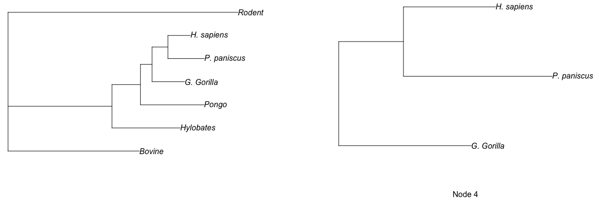
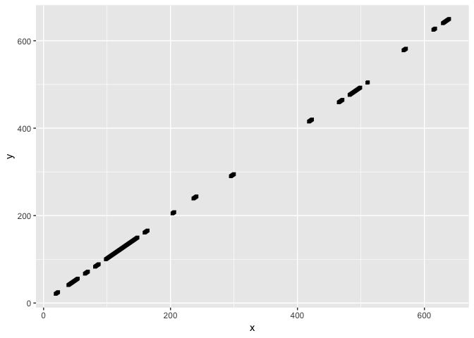
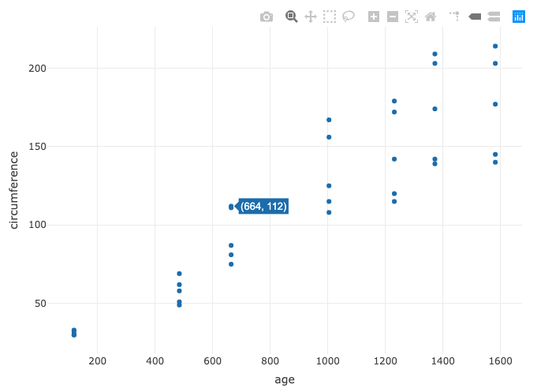
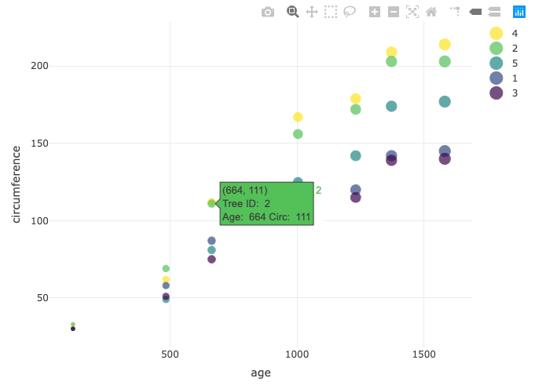
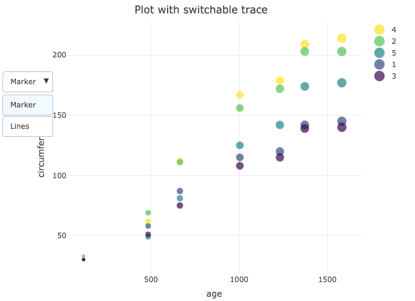
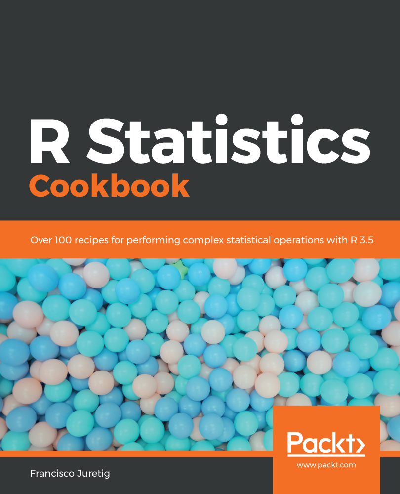

# R Bioinformatics Cookbook

Chapter 1. Performing Quantitative RNAseq
=========================================

The technology of RNAseq has revolutionized the study of transcript abundances, bringing high-sensitivity detection and high-throughput analysis. Bioinformatic analysis pipelines using RNAseq data typically start with a read quality control step followed by either alignment to a reference or the assembly of sequence reads into longer transcripts_de novo_. After that, transcript abundances are estimated with read counting and statistical models and differential expression between samples is assessed. Naturally, there are many technologies available for all steps of this pipeline. The quality control and read alignment steps will usually take place outside of R, so analysis in R will begin with a file of transcript or gene annotations (such as GFF and BED files) and a file of aligned reads (such as BAM files). 

The tools in R for performing analysis are powerful and flexible. Many of them are part of the Bioconductor suite and, as such, integrate together very nicely. The key question researchers wish to answer with RNAseq is usually: _Which transcripts are differentially expressed_? In this chapter, we'll look at some recipes for that in standard cases where we already know the genomic positions of genes we're interested in, and in cases where we need to find unannotated transcripts. We'll also look at other important recipes that help answer the questions _How many replicates are enough_? and _Which allele is expressed more_?

In this chapter, we will cover the following recipes:

*   Estimating differential expression with edgeR
*   Estimating differential expression with DESeq2
*   Power analysis with powsimR
*   Finding unannotated transcribed regions with GRanges objects
*   Finding regions showing high expression ab initio with bumphunter
*   Differential peak analysis
*   Estimating batch effects using SVA
*   Finding allele-specific expression with AllelicImbalance
*   Plotting and presenting RNAseq data


Technical requirements
======================

The sample data you'll need is available from this book's GitHub repository: [https://github.com/PacktPublishing/R-Bioinformatics\_Cookbook](https://github.com/PacktPublishing/R-Bioinformatics_Cookbook)[.](https://github.com/danmaclean/R_Bioinformatics_Cookbook) If you want to use the code examples as they are written, then you will need to make sure that this data is in a sub-directory of whatever your working directory is.

Here are the R packages that you'll need. Most of these will install with `install.packages()`_; _others are a little more complicated:

*   `Bioconductor`
    *   `AllelicImbalance`
    *   `bumphunter` 
    *   `csaw`
    *   `DESeq`
    *   `edgeR`
    *   `IRanges`
    *   `Rsamtools`
    *   `rtracklayer`
    *   `sva`
    *   `SummarizedExperiment`
    *   `VariantAnnotation`
*   `dplyr`
*   `extRemes`
*   `forcats`
*   `magrittr`
*   `powsimR`
*   `readr` 

`Bioconductor` is huge and has its own installation manager. You can install it with the following code:[](https://www.bioconductor.org/install/)

Copy

    if (!requireNamespace("BiocManager"))
        install.packages("BiocManager")
    BiocManager::install()

Further information is available at [https://www.bioconductor.org/install/](https://www.bioconductor.org/install/).

Normally, in R, a user will load a library and use the functions directly by name. This is great in interactive sessions but it can cause confusion when many packages are loaded. To clarify which package and function I'm using at a given moment, I will occasionally use the `packageName::functionName()` convention. 

Sometimes, in the middle of a recipe, I'll interrupt the code so you can see some intermediate output or the structure of an object it's important to understand. Whenever that happens, you'll see a code block where each line begins with `##` (double hash symbols). Consider the following command:  
  

`letters[1:5]`

This will give us output as follows:

`## a b c d e`

Note that the output lines are prefixed with `##`.


Estimating differential expression with edgeR
=============================================

edgeR is a widely used and powerful package that implements negative binomial models suitable for sparse count data such as RNAseq data in a general linear model framework, which are powerful for describing and understanding count relationships and exact tests for multi-group experiments. It uses a weighted style normalization called TMM, which is the weighted mean of log ratio between sample and control, after removal of genes with high counts and outlying log ratios. The TMM value should be close to one, but can be used as a correction factor to be applied to overall library sizes

In this recipe, we'll look at some options from preparing read counts for annotated regions in some object to identifying the differentially expressed features in a genome. Usually, there is an upstream step requiring us to take high-throughput sequence reads, align them to a reference and produce files describing those alignments, such as `.bam` files. With those files prepared, we'd fire up R and start to analyze. So that we can concentrate on the differential expression analysis part of the process, we'll use a prepared dataset for which all of the data is ready. [Chapter 8](/book/business_and_other/9781789950694/8), _Working with Databases and Remote Data Sources,_ shows you how to go from raw data to this stage if you're looking for how to do that step.

As there are many different tools and methods for getting those alignments of reads, we will look at starting the process with two common input object types. We'll use a count table, like that we would have if we were loading from a text file and we'll use an ExpressionSet (`eset`) object, which is an object type common in Bioconductor.

Our prepared dataset will be the`modencodefly`data from the NHGRI encyclopedia of DNA elements project for the model organism,_Drosophila melanogaster_. You can read about this project at[www.modencode.org](http://www.modencode.org/). The dataset contains 147 different samples for_D. melanogaster_, a fruit fly with an approximately 110 Mbp genome, annotated with about 15,000 gene features.

Getting ready
-------------

The data is provided as both a count matrix and an ExpressionSet object and you can see the _Appendix_ at the end of this book for further information on these object types. The data is in this book's code and data repository at [https://github.com/PacktPublishing/R\_Bioinformatics\_Cookbook](https://github.com/PacktPublishing/R_Bioinformatics_Cookbook)under`datasets/ch1/modencodefly_eset.RData`, `datasets/ch1/modencodefly_count_table.txt`, and `datasets/ch1/modencodelfy_phenodata.txt` . We'll also use the `edgeR` (from Bioconductor), `readr`, and `magrittr` libraries.

How to do it...
---------------

We will see two ways of estimating differential expressions with edgeR.

Using edgeR from a count table
------------------------------

For estimating differential expressions with edgeR from a count table (for example, in a text file), we will use the following steps:

1.  Load the count data:

Copy

    count_dataframe <- readr::read_tsv(file.path(getwd(), "datasets", "ch1", "modencodefly_count_table.txt" ))
    genes <- count_dataframe[['gene']]
    count_dataframe[['gene']] <- NULL
    count_matrix <- as.matrix(count_dataframe)
    rownames(count_matrix) <- genes
    pheno_data <- readr::read_table2(file.path(getwd(), "datasets", "ch1", "modencodefly_phenodata.txt"))

2.  Specify experiments of interest:

Copy

    experiments_of_interest <- c("L1Larvae", "L2Larvae")
    columns_of_interest <- which( pheno_data[['stage']] %in% experiments_of_interest ) 

3.  Form the grouping factor:

Copy

    library(magrittr)
    grouping <- pheno_data[['stage']][columns_of_interest] %>% 
    forcats::as_factor()

4.  Form the subset of count data:

Copy

    counts_of_interest <-  count_matrix[,columns_of_interest]

5.  Create the DGE object:

Copy

    library(edgeR)
    count_dge <- edgeR::DGEList(counts = counts_of_interest, group = grouping)

6.  Perform differential expression analysis:

Copy

    design <- model.matrix(~ grouping)
    eset_dge <- edgeR::estimateDisp(eset_dge, design)
    fit <- edgeR::glmQLFit(eset_dge, design)
    result <- edgeR::glmQLFTest(fit, coef=2)
    topTags(result)

Using edgeR from an ExpressionSet object
----------------------------------------

Estimating using edgeR from our prepared `eset` object can be done using the following steps:

1.  Load the `eset` data:

Copy

    load(file.path(getwd(), "datasets/ch1/modencodefly_eset.RData"))

2.  Specify experiments of interest:

Copy

    experiments_of_interest <- c("L1Larvae", "L2Larvae")
    columns_of_interest <- which( phenoData(modencodefly.eset)[['stage']] %in% experiments_of_interest )

3.  Form the grouping factor:

Copy

    grouping <- droplevels(phenoData(modencodefly.eset)[['stage']][columns_of_interest] )

4.  Form the subset of count data:

Copy

    counts_of_interest <- exprs(modencodefly.eset)[, columns_of_interest]

5.  Create the DGE object:

Copy

    eset_dge <- edgeR::DGEList(
     counts = counts_of_interest,
     group = grouping 
     )

6.  Perform differential expression analysis:

Copy

    design <- model.matrix(~ grouping)
    eset_dge <- edgeR::estimateDisp(eset_dge, design)
    
    fit <- edgeR::glmQLFit(eset_dge, design)
    result <- edgeR::glmQLFTest(fit, coef=2)
    topTags(result)

How it works...
---------------

We saw two ways of estimating differential expression with edgeR. In the first half of this recipe, we used edgeR starting with our data in a text file.

Using edgeR from a count table
------------------------------

In _step 1_, we use the `read_tsv()` function in the `readr` package to load the tab delimited text file of counts into a dataframe called `count_dataframe`. Then, from that, we extract the `'gene'` column to a new variable, `genes`, and erase it from `count_dataframe`, by assigning `NULL`. This is all done so we can easily convert into the `count_matrix` matrix with the base `as.matrix()` function and add the gene information back as `rownames`. Finally, we load the phenotype data we'll need from file using the `readr read_table2()` function. 

_Step 2_ is concerned with working out which columns in `count_matrix` we want to use. We define a variable, `experiments_of_interest`, which holds the column names we want and then use the `%in%` operator and `which()` functions to create a binary vector that matches the number of columns. If, say, the third column of the `columns_of_interest` vector is `TRUE` it indicates the name was in the `experiments_of interest` variable. 

_Step 3_ begins with loading the `magrittr` package to get the `%>%` operator, which will allow piping. We then use R indexing with the binary `columns_of_interest` factor to select the names of columns we want and send it to the `forcats as_factor()` function to get a factor object for our grouping variable. Sample grouping information is basically a factor that tells us which samples are replications of the same thing and it's important for the experimental design description. We need to create a grouping vector, each index of which refers to a column in the counts table. So, in the following example, the first three columns in the data would be replicates of one sample, the second three columns in the counts table would be replicates of a different replicate, and so on.We can use any symbols in the grouping vector to represent the groups. The more complicated the grouping vector, the more complicated the experiment design can be. In the recipe here, we'll use a simple test/control design:

Copy

    numeric_groups <- c(1,1,1,2,2,2)
    letter_groups <- c("A","A","A", "B","B","B")

A simple vector like this will do, but you can also use afactor object. The factor is R's categorical data type and is implemented as a vector of integers that have associated name labels, called levels. When a factor is displayed, the name labels are taken instead of the integers. The factor object has a memory of sorts, and even when a subset of levels is used, all of the levels that could have been used are retained so that when, for example, the levels are used as categories, empty levels can still be displayed.

In _Step 4_, we use indexing to extract the columns of data we want to actually analyze.

By _Step 5_, our preparatory work is done and we can build the `DGEList` object we need to do differential analysis. To start, we load the `edgeR` library and use the `DGEList()` function on `counts_of_interest` and our grouping object.

In _Step 6_, with `DGEList`, we can go through the `edgeR` process. First, we create the experimental design descriptor design object with the base `model.matrix()` function. A model design is required to tell the functions how to compare samples; this is a common thing in R and so has a base function. We use the `grouping` variable we created. We must estimate the dispersions of each gene with the `estimateDisp()` function, then we can use that measure of variability in tests. Finally, a generalized linear model is fit and the quasi-likelihood F-test is applied with the two uses of `glmQLFTest()`, first with the dispersal estimates, `eset_dge`, then with the resulting `fit` object.

We can use the `topTags()` function to see the details of differentially expressed genes. We get the following output:

Copy

     ## Coefficient: groupingL2Larvae
     ## logFC logCPM F PValue FDR
     ## FBgn0027527 6.318665 11.14876 42854.72 1.132951e-41 1.684584e-37
     ## [ reached 'max' / getOption("max.print") -- omitted 9 rows ]

The columns show the gene name, the `logFC` value of the gene, the F value, the P value and the **False Detection Rate** (**FDR**). Usually, the column we want to make statistical conclusions from is FDR.

Using edgeR from an ExpressionSet object
----------------------------------------

In _Step 1_, we are looking at using `edgeR` from our prepared eset object. We first load that in, using the base R function as it is stored in a standard Rdata format file.

In _Step 2_, we prepare the vector of experiments of interest. This works as in _step 2_, except that we don't need to look at the `pheno_data` object we created from a file; instead, we can use the `eset` function, `phenoData()`, to extract the phenotype data straight from the `eset` object (note that this is one of the major differences between `eset` and the count matrix—see this book's _Appendix_ for further information).

In _Step 3_, we create the grouping factor. Again, this can be done by using the `phenoData()` extraction function, but, as it returns a factor, we need to drop the levels that aren't selected using the `droplevels()` function (see the _How it works..._ section in the _Estimating differential expression with edgeR_ recipe, _step 3_ from the previous method, for a brief discussion of factor objects).

In _step 4_, we extract the data for the columns we are interested in into a standard matrix object. Again, we have a dedicated function, `exprs()`, for extracting the expression values from `eset`, and we can subset that using column indexing with `column_names`.

In _Step 5_, we use the `DGEList()` constructor function to build the data structure for edgeR and in _step 6_, carry out the analysis. This step is identical to _Step 6_ of the first method.


Estimating differential expression with DESeq2
==============================================

The `DESeq2` package is a method for differential analysis of count data, so it is ideal for RNAseq (and other count-style data such as `ChIPSeq`). It uses dispersion estimates and relative expression changes to strengthen estimates and modeling with an emphasis on improving gene ranking in results tables. `DESeq2` differs from `edgeR` in that it uses a geometric style normalization in which the per lane scaling factor is computed as the median of the ratios of the gene count over its geometric mean ratio, whereas edgeR uses the weighted one. The two normalization strategies are not mutually exclusive and both make different assumptions about the data. As with any `RNAseq` or large scale experiment, there is never an "out-of-the-box" best answer. You'll end up testing these methods and maybe others and closely examining results from control genes and cross-validation experiments to see which performs best. The performance will depend greatly on the particular dataset at hand, so the flexible approach we learn here will give you a good idea of how to test the different solutions for yourself.

The process we'll look at in this recipe is somewhat similar to that for edgeR in the preceding _Recipe 1_. We can use both ExpressionSets and count tables as input to DESeq2 and, when we've prepared them, we have a different set of functions to use to get our data into a DESeqDataSet, not the DGEList as with edgeR.

Getting ready
-------------

As in _Recipe 1_, the data is provided as both a count matrix and an `ExpressionSet` object and you can see the _Appendix_ at the end of this book for further information on these object types. The data is in this book's code and data repository at [https://github.com/PacktPublishing/R\_Bioinformatics\_Cookbook](https://github.com/PacktPublishing/R_Bioinformatics_Cookbook) under `datasets/ch1/modencodefly_eset.RData` , `datasets/ch1/modencodefly_count_table.txt`, and `datasets/ch1/modencodelfy_phenodata.txt`. Again, we'll use `readr` and `magrittr` and, from Bioconductor, `SummarizedExperiement,` and DESeq2.

How to do it...
---------------

Estimating differential expressions with DESeq2 can be done in two ways, as shown in the following section.

Using DESeq2 from a count matrix
--------------------------------

Estimating differential expressions with DESeq2 from a count table (for example, in a text file), we will use the following steps:

1.  Load count data:

Copy

    count_dataframe <- readr::read_tsv(file.path(getwd(), "datasets", "ch1", "modencodefly_count_table.txt" ))
    genes <- count_dataframe[['gene']]
    count_dataframe[['gene']] <- NULL
    count_matrix <- as.matrix(count_dataframe)
    rownames(count_matrix) <- genes
    pheno_data <- readr::read_table2(file.path(getwd(), "datasets", "ch1", "modencodefly_phenodata.txt"))

2.  Specify experiments of interest:

Copy

    experiments_of_interest <- c("L1Larvae", "L2Larvae")
    columns_of_interest <- which( pheno_data[['stage']] %in% experiments_of_interest ) 

3.  Form the grouping factor:

Copy

    library(magrittr)
    grouping <- pheno_data[['stage']][columns_of_interest] %>% 
     forcats::as_factor()

4.  Form the subset of count data:

Copy

    counts_of_interest <- count_matrix[,columns_of_interest]

5.  Build the DESeq object:

Copy

    library("DESeq2")
    dds <- DESeqDataSetFromMatrix(countData = counts_of_interest,
     colData = grouping,
     design = ~ stage)

6.  Carry out the analysis:

Copy

    dds <- DESeq(dds)

7.  Extract the results:

Copy

    res <- results(dds, contrast=c("stage","L2Larvae","L1Larvae"))

Using DESeq2 from an ExpressionSet object
-----------------------------------------

To estimate differential expressions with DESeq2 from an ExpressionSet object, we will use the following steps:

1.  Load the `eset` data and convert into `DESeqDataSet()`:

Copy

    library(SummarizedExperiment)
    load(file.path(getwd(), "datasets/ch1/modencodefly_eset.RData"))
    summ_exp <- makeSummarizedExperimentFromExpressionSet(modencodefly.eset)
    ddsSE <- DESeqDataSet(summ_exp, design= ~ stage)

2.  Carry out analysis and extract results:

Copy

    ddsSE <- DESeq(ddsSE)
    resSE <- results(ddsSE, contrast=c("stage","L2Larvae","L1Larvae"))

How it works...
---------------

In the first section of this recipe, we used DESeq1 starting with our data in a text file; as you'll notice _steps 1_ to _4_ are identical to those in the previous section.

Using DESeq2 from a count matrix
--------------------------------

In _Step 1_, we use the`readr`package's `read_tsv()`function to load the tab-delimited text file of counts into a dataframe called`count_dataframe`. Then, from that, we extract the`'gene'`column to a new variable,`genes`, and erase it from`count_dataframe`, by assigning`NULL`. This is all done so we can easily convert into the `count_matrix` matrix with the base`as.matrix()`function and add the gene information back as`rownames`. Finally, we load the phenotype data we'll need from the file using the `readr``read_table2()`function. 

_Step 2_ is concerned with working out which columns in `count_matrix` we want to use. We define a variable,`experiments_of_interest`, that holds the column names we want and then use the`%in%`operator and`which()`functions to create a binary vector that matches the number of columns. If, say the third column of the`columns_of_interest`vector is `'TRUE'`, it indicates the name was in the`experiments_of interest`variable. 

_Step 3_ begins with loading the`magrittr`package to get the`%>%`operator, which will allow piping. We then use R indexing with the binary`columns_of_interest`factor to select the names of columns we want and send it to the`forcats``as_factor()`function to get a factor object for our grouping variable. Sample grouping information is basically a factor that tells us which samples are replications of the same thing and it's important for the experimental design description. You can see an expanded description of these grouping/factor objects in _step 3_ in _Recipe 1_.

In _Step 4_, we use indexing to extract the columns of data we want to actually analyze.

By _Step 5_, we are into the actual analysis section. First, we convert our matrix of counts into a `DESeqDataSet` object; this can be done with the conversion function, `DESeqDataSetFromMatrix()`, passing in the counts, the groups, and a design. The design is in the form of an R formula, hence, the `~ stage` annotation.

In _Step 6_, we perform the actual analysis using the `DESeq()` function on the `dds DESeqDataSet` object and in _Step 7_, we get the results into the `res` variable using the `results()` function. The output has the following six columns:

Copy

    baseMean log2FoldChange lfcSE stat pvalue padj

This shows the mean counts, the `log2` fold change between samples for a gene, the standard error of the `log2` fold change, the Wald statistic, and the raw and adjusted P value. The `padj` column for adjusted P values is the one most commonly used for concluding about significance.

Using DESeq2 from an ExpressionSet object
-----------------------------------------

_Steps 1_ and 2 show how to do the same procedure starting from the `eset` object. It only takes two short steps because DESeq2 is set up to work a lot more nicely with Bioconductor objects than edgeR is. In _step 8_, we load the `eset` data with the `load()` function. Then we use the `makeSummarizedExperimentFromExpressionSet()`function from the `SummarizedExperiment` Bioconductor package to convert `eset` into `SummarizedExperiment`, which can be used directly in the `DESeq()` function in _step 9_. This step works exactly as _steps 6_ and _7_. 


Power analysis with powsimR
===========================

An important preliminary to any experiment is assessing the power of the experimental design to optimize statistical sensitivity. In essence, a power analysis can tell us the number of replicates required to determine an effect size of a given magnitude for a given amount of experimental variability.

We'll use the `powsimR` package, which is not part of Bioconductor, to perform two types of power analysis. Both of these will be with a small real dataset, but first, we'll do it with two treatments—a test and control—then, we'll do it with just one. With each, we'll estimate the number of replicates we need to spot differences in gene expression of a particular magnitude—if they're present. `powsimR` takes a simulation-based approach, effectively generating many datasets and evaluating the detection power in each to create a distribution of detection power. The first step, then, is to estimate some parameters for these simulations—for this, we'll need some sample or preliminary data. After that, we can run simulations and assess power.

Getting ready
-------------

The dataset for this recipe will be a test or control RNAseq experiment from _Arabidopsis_ with three replicates each. These are available as a prepared count matrix in `datasets/ch1/arabidopsis.RDS` in this book's data repository. In this section, we'll use a set of counts in a simple test or control experiment from _Arabidopsis thaliana_. The matrix has six columns (three `mock` treatments and three `hrcc` treatments) and 26,222 rows, each a gene feature. We'll need the `dplyr`, `extRemes`, and `powsimR` packages for this code.

Our package of interest, `powsimR`, isn't on CRAN; it's hosted as a source on GitHub at[https://github.com/bvieth/powsimR](https://github.com/bvieth/powsimR). You'll need to use`devtools`to install it, which can be done using the following code:

Copy

    install.packages("devtools")
    devtools::install_github("bvieth/powsimR")

If you do this, there is a chance that this package will still fail to install. It has a lot of dependencies and you might need to install those manually; there is further information on the package GitHub repository and you should check that for the latest information. At the time of writing, you'll need to do the following two big steps. First, create the `ipak` function outlined here, then run the three different package installation steps with the `ipak` function:

Copy

    ipak <- function(pkg, repository = c("CRAN", "Bioconductor", "github")) {
        new.pkg <- pkg[!(pkg %in% installed.packages()[, "Package"])]
        # new.pkg <- pkg
        if (length(new.pkg)) {
            if (repository == "CRAN") {
                install.packages(new.pkg, dependencies = TRUE)
            }
            if (repository == "Bioconductor") {
                if (strsplit(version[["version.string"]], " ")[[1]][3] > "3.5.0") {
                    if (!requireNamespace("BiocManager")) {
                      install.packages("BiocManager")
                    }
                    BiocManager::install(new.pkg, dependencies = TRUE, ask = FALSE)
                }
                if (strsplit(version[["version.string"]], " ")[[1]][3] < "3.5.0") {
                    source("https://bioconductor.org/biocLite.R")
                    biocLite(new.pkg, dependencies = TRUE, ask = FALSE)
                }
            }
            if (repository == "github") {
                devtools::install_github(new.pkg, build_vignettes = FALSE, force = FALSE, 
                    dependencies = TRUE)
            }
        }
    }
    
    # CRAN PACKAGES
    cranpackages <- c("broom", "cobs", "cowplot", "data.table", "devtools", "doParallel", 
        "dplyr", "drc", "DrImpute", "fastICA", "fitdistrplus", "foreach", "gamlss.dist", 
        "ggExtra", "ggplot2", "ggthemes", "grDevices", "glmnet", "grid", "gtools", 
        "Hmisc", "kernlab", "MASS", "MBESS", "matrixStats", "mclust", "methods", 
        "minpack.lm", "moments", "msir", "NBPSeq", "nonnest2", "parallel", "penalized", 
        "plyr", "pscl", "reshape2", "Rmagic", "rsvd", "Rtsne", "scales", "Seurat", 
        "snow", "stats", "tibble", "tidyr", "VGAM", "ZIM")
    
    ipak(cranpackages, repository = "CRAN")
    
    # BIOCONDUCTOR
    biocpackages <- c("AnnotationDbi", "bayNorm", "baySeq", "Biobase", "BiocGenerics", 
        "BiocParallel", "DEDS", "DESeq2", "EBSeq", "edgeR", "IHW", "iCOBRA", "limma", 
        "Linnorm", "MAST", "monocle", "NOISeq", "qvalue", "ROTS", "RUVSeq", "S4Vectors", 
        "scater", "scDD", "scde", "scone", "scran", "SCnorm", "SingleCellExperiment", 
        "SummarizedExperiment", "zinbwave")
    ipak(biocpackages, repository = "Bioconductor")
    
    # GITHUB
    githubpackages <- c("nghiavtr/BPSC", "cz-ye/DECENT", "mohuangx/SAVER", "statOmics/zingeR")
    ipak(githubpackages, repository = "github")

When this is done, you should be able to install the package we're after with this code:

Copy

    devtools::install_github("bvieth/powsimR", build_vignettes = TRUE, dependencies = FALSE)
    library("powsimR")

At the moment, for this to work, you also need to manually load `dplyr`. 

How to do it...
---------------

We will do the power analysis using the following steps:

1.  Estimate simulation parameter values:

Copy

    arab_data <- readRDS(file.path(getwd(), "datasets", "ch1", "arabidopsis.RDS" ))
    means_mock <- rowMeans(arab_data[, c("mock1", "mock2", "mock3")])
    means_hrcc <- rowMeans(arab_data[, c("hrcc1", "hrcc2", "hrcc3")])
    log2fc <- log2(means_hrcc / means_mock)
    prop_de <- sum(abs(log2fc) > 2) / length(log2fc) 

2.  Examine the distribution of the `log2` fold change ratios:

Copy

    finite_log2fc <-log2fc[is.finite(log2fc)]
    plot(density(finite_log2fc))
    extRemes::qqnorm(finite_log2fc )

3.  Set up parameter values for the simulation run:

Copy

    library(powsimR)
     library(dplyr)
     
     params <- estimateParam(
     countData = arab_data,
     Distribution = "NB",
     RNAseq = "bulk",
     normalization = "TMM" # edgeR method, can be others
     )
     
     de_opts <- DESetup(ngenes=1000,
     nsims=25,
     p.DE = prop_de,
     pLFC= finite_log2fc,
     sim.seed = 58673
     )
     
     sim_opts <- SimSetup(
     desetup = de_opts,
     params = params
     )
     
     num_replicates <- c(2, 3, 5, 8, 12,15)

4.  Run the simulation:

Copy

     simDE <- simulateDE(n1 = num_replicates,
     n2 = num_replicates,
     sim.settings = sim_opts,
     DEmethod = "edgeR-LRT",
     normalization = "TMM",
     verbose = FALSE)

5.  Run the evaluation of the simulation:

Copy

     evalDE <- evaluateDE(simRes = simDE,
     alpha.type = 'adjusted',
     MTC = 'BH',
     alpha.nominal = 0.1,
     stratify.by = 'mean',
     filter.by = 'none',
     strata.filtered = 1,
     target.by = 'lfc',
     delta = 0)

6.  Plot the evaluation:

Copy

     plotEvalDE(evalRes = evalDE,
     rate='marginal',
     quick=FALSE, annot=TRUE)

How it works...
---------------

Power analysis in `powsimR` requires us to do some pre-analysis so that we have estimates for some important parameters. To perform a simulation-based power analysis, we need to estimate the distribution of log fold changes between treatments and the proportion of features that are differentially expressed.

In _step 1_, we'll get the mean counts for each feature in the two treatments. After loading the expression data using the `readRDS()` function, we use the `rowMeans()` function on certain columns to get the mean expression counts of each gene in both the `mock` and `hrcc1` treatments. We can then get the log2 ratio of those (by simply dividing the two vectors and, in the last line, use standard arithmetical operators to work out those that have a log2 fold change greater than 2). Inspecting the final `prop_de` variable gives the following output:

Copy

    prop_de
    ## [1] 0.2001754

So, a proportion of about 0.2 of the features have counts changing by log2 twofold.

_Step 2_ looks at the distribution of the gene expression ratios. We first remove the non-finite ratios from the `log2fc` variable. We must do this because, when calculating ratios, we generate`Inf`values in R; this occurs when the denominator (the mock sample) has zero mean counts. We can remove them using indexing on the vector with the binary vector that comes from `is.finite()` function. With the `Inf` values removed, we can plot. First, we do a normal density plot using the `density()` function, which shows the distribution of ratios. Then, we use the `qqnorm()` function in the `extRemes` package, which plots the data against data sampled from an idealized normal distribution with the same mean. A strong, linear correlation indicates a normal distribution in the original data. We can see the output in the following screenshot:


They look pretty log-normally distributed, so we can assume a log-normal distribution. 

The longest step here, _step 3,_ is actually only four lines. We are basically setting up the parameters for the simulation, which requires us to specify a lot of values. The first set, `params`, which we create with the `estimateParam()` function needs the data source (`countData`), the distribution to use (we set `Distribution = "NB"`, which selects the negative binomial); the type of RNAseq experiment—ours is a bulk RNAseq experiment (`RNAseq = "bulk"`), and normalization strategy—we use the edgeR style TMM (`normalization = "TMM"`). The second set, `desetup`, is created with the `DESetup()` function; in this, we choose the parameters relating to the number of genes for which to simulate differential expression. We set up 1,000 total gene simulations (`ngenes`) and 25 simulation runs (`nsims`). We set the proportion to be differentially expressed to that estimated in _step 1_ in `prop_de`. We use the vector of fold changes, `finite_log2fc`, as input for the `pLFC` parameter. Setting `sim.seed` is not necessary but will ensure reproducibility between runs. The third line uses the `SimSetup()` function to combine `params` and `desetup` into a single object, `sim_opts`. Finally, we create a `num_replicates` vector specifying the number of biological replicates (RNA samples) to simulate.

_Step 4_ is relatively straightforward: we run the differential expression simulation using the `sim_opts` parameters created in the previous steps, choosing `"edgeR-LRT"` as the differential expression method and `"TMM"` as the normalization. The simulation data is stored in the `simDE` variable. 

In _Step 5_, we create an evaluation of the simulation—this analyzes and extracts various statistics. We pass the `simDE` simulation data to the `evaluateDE()` function along with values for things pertaining to grouping, filtering, and significance.

Finally, in _Step 6_, we can plot the `evalDE` object from _Step 5_ and see the results of the simulation. We get the following plot in which we can see the different powers at different replicate numbers. Note the _x_\-axis indicates the number of replicate RNA samples used, and the metrics include FDR, **False Negative/Positive Rate (FNR/FPR)**, and **TNR/TPR (True Negative/Positive Rate)**:


There's more...
---------------

When we have only one sample (or maybe even just one replicate), we have a hard time estimating the log2 fold change distribution and the number of differentially expressed genes. In place of estimates, we can use a callback function to generate numbers as needed. The body of the function just needs to return numbers from a specified distribution with parameters you decide. Here, we'll build a function that returns numbers with a normal distribution of mean 0 and standard deviation 2. This reflects that we think the log fold change distribution is normal with these parameters. When we've built the function, it gets used in the `DESetup()` function in place of the vector of log2 fold changes. For the proportion of genes differentially expressed, we just have to guess or take an estimate from something we already know about the experimental system:

Copy

    log2fc_func <- function(x){ rnorm(x, 0, 2)} 
    prop_de = 0.1
    de_opts <- DESetup(ngenes=1000,
     nsims=25,
     p.DE = prop_de,
     pLFC= log2fc_func,
     sim.seed = 58673
     )


Finding unannotated transcribed regions
=======================================

A common challenge is to find and count reads that have aligned outside of annotated regions. In an RNAseq experiment, these reads can represent non-annotated genes and novel transcripts. Essentially, we have some genes we know about and can see that they are transcribed as they have aligned read coverage, but other transcribed regions do not fall in any annotations and we want to know the locations of the alignments of the reads representing them. In this recipe, we'll look at a deceptively straightforward technique for finding such regions.

Getting ready
-------------

Our dataset will be a synthetic one that has a small 6,000 bp genome region and two gene features with reads and a third unannotated region with aligning reads, as shown in the following screenshot:


We'll need the Bioconductor `csaw`, `IRanges`, `SummarizedExperiment`,and `rtracklayer` libraries and some functions from other packages that are part of base Bioconductor. The data is in this book's data repository under `datasets/ch1/windows.bam` and `datasets/ch1/genes.gff`

How to do it...
---------------

Power analysis with `powsimR` can be done in the following steps:

1.  Set up a loading function:

Copy

    get_annotated_regions_from_gff <- function(file_name) { 
        gff <- rtracklayer::import.gff(file_name) 
        as(gff, "GRanges") 
    }

2.  Get counts in windows across the whole genome:

Copy

    whole_genome <- csaw::windowCounts( 
        file.path(getwd(), "datasets", "ch1", "windows.bam"),
        bin = TRUE,
        filter = 0,
        width = 500,
        param = csaw::readParam(
            minq = 20,
            dedup = TRUE,
            pe = "both"
        )
    )
    colnames(whole_genome) <- c("small_data")
    
    annotated_regions <- get_annotated_regions_from_gff(file.path(getwd(), "datasets", "ch1", "genes.gff"))

3.  Find overlaps between annotations and our windows, and subset the windows:

Copy

    library(IRanges)
    library(SummarizedExperiment)
    windows_in_genes <-IRanges::overlapsAny( SummarizedExperiment::rowRanges(whole_genome), annotated_regions ) 

4.  Subset the windows into those in annotated and non-annotated regions:

Copy

    annotated_window_counts <- whole_genome[windows_in_genes,] 
    non_annotated_window_counts <- whole_genome[ ! windows_in_genes,] 

5.  Get the data out to a count matrix:

Copy

    assay(non_annotated_window_counts)

How it works...
---------------

In _step 1,_ we create a function that will load gene region information in a GFF file (see this book's _Appendix_ for a description of GFF) and convert it into a Bioconductor `GRanges` object using the `rtracklayer` package. This recipe works because `GRanges` objects can be subset, just like a regular R matrix or dataframe. They're an object that is "matrix-like" in that respect and although `GRanges` is much more complicated than a matrix, it behaves much the same. This allows for some easy manipulations and extractions. We use `GRanges`extensively throughout this recipe, along with the related class, `RangedSummarizedExperiment`.

In _step 2,_ we use the `csaw windowCounts()` function to get counts across the whole genome in 500 bp windows. The `width` parameter defines the window size, and the `param` parameter determines what constitutes a passing read; here, we set minimum read quality (`minq`) to a PHRED score of 20, remove PCR duplicates (`dedup = TRUE`), and require that both of the pairs of a read are aligned (`pe="both"`). The returned `whole_genome` object is `RangedSummarizedExperiment`. We set the name of the single data column in `whole_genome` to `small_data`. Finally, we use the custom function, `get_annotated_regions_from_gff()`, to make a `GRanges` object, `annotated_regions`, of the genes represented in our GFF file.

With _Step 3_, we use the `IRanges overlapsAny()` function to check whether the window locations overlap at all with the gene regions. This function requires `GRanges` objects, so we extract that from the `whole_genome` variable using the `SummarizedExperiment` `rowRanges()` function and pass that along with the existing `GRanges` object's `annotated_regions` to `overlapsAny()`. This returns a binary vector that we can use to do subsetting.

In _step 4,_ we simply use the binary vector, `windows_in_genes`, to subset the `whole_genome` object, thereby extracting the annotated windows (into `annotated_window_counts`) as a `GRanges` object. Then, we can get the non-annotated windows with the same code but by logically inverting the binary vector using the `!` operator. This gives us `non_annotated_window_counts`.

Finally, in _step 5_, we can extract the actual counts from the `GRanges` object using the `assay()` function.

There's more...
---------------

We may need to get annotated regions from other file formats than GFF. `rtracklayer` supports various formats—here's a function for working with BED files:

Copy

    get_annotated_regions_from_bed <- function(file_name){ 
        bed <- rtracklayer::import.bed(file_name) 
        as(bed, "GRanges") 
    }


Finding regions showing high expression ab initio with bumphunter
=================================================================

Finding regions of read alignments that all come from the same, potentially unannotated, genomic feature is a common task. The aim here is to group read alignments together in such a way that we will be able to mark regions that have significant coverage and then go on to compare samples for differences in expression levels. 

Getting ready...
----------------

We'll use the same `windows` dataset that had one experiment with three peaks into the function that we used in _Recipe 4—_so we know we're looking for three bumps. The data is in this book's data repository under `datasets/ch1/windows.bam`. We'll need the `Rsamtools `and `bumphunter` libraries.

How to do it...
---------------

1.  Load data and get per-position coverage:

Copy

    library(Rsamtools) 
    library(bumphunter) 
    pileup_df <- Rsamtools::pileup(file.path(getwd(), "datasets", "ch1", "windows.bam"))

2.  Find preliminary clusters:

Copy

    clusters <- bumphunter::clusterMaker(pileup_df$seqnames, pileup_df$pos, maxGap = 100) 

3.  Find the bumps with a minimum cutoff:

Copy

    bumphunter::regionFinder(pileup_df$count, pileup_df$seqnames, pileup_df$pos, clusters, cutoff=1)

How it works...
---------------

In _step 1,_ we use Rsamtools `pileup()` function with default settings to get a per-base coverage dataframe. Each row represents a single nucleotide in the reference and the count column gives the depth of coverage at that point. The result is stored in the `pileup_df` dataframe.

In _step 2_, we use the bumphunter `clusterMaker()` function on `pileup_df`, which simply groups reads within a certain distance of each other into clusters. We give it the sequence names, positions, and a maximum distance parameter (`maxGap`). The function returns a vector of cluster numbers of equal length to the dataframe, indicating the cluster membership of each row in the dataframe. If we tabulate with table, we can see the cluster sizes (number of rows) in each cluster:

Copy

    table(clusters)
    ## clusters
    ##    1    2    3 
    ## 1486 1552 1520

In _step 3_, we refine our approach; we use `regionFinder()`, which applies a read depth cutoff to ensure a minimum read depth for the clusters. We pass it similar data as in _step 2_, adding the cluster membership vector clusters and a minimum read cutoff—here, we set to 1 for use with this very small dataset. The result of _step 3_ is the regions that are clustered together, but in a useful table:

Copy

    ##    chr start  end     value  area cluster indexStart indexEnd    L
    ## 3 Chr1  4503 5500 10.401974 15811       3       3039     4558 1520
    ## 1 Chr1   502 1500  9.985868 14839       1          1     1486 1486
    ## 2 Chr1  2501 3500  8.657216 13436       2       1487     3038 1552

In these region predictions, we can clearly see the three regions containing reads that are in that data, give or take a nucleotide or two.

There's more...
---------------

If you have multiple experiments to analyze, try the `bumphunter()` function. This will operate over multiple data columns in a matrix and perform linear modeling to assess uncertainty about the position and existence from the replicates; it is very similar to `regionFinder()` in operation.


Differential peak analysis
==========================

When you've discovered unannotated transcripts you may want to see whether they are differentially expressed between experiments. We've already looked at how we might do that with **edgeR** and **DESeq**, but one problem is going from an object such as a `RangedSummarizedExperiment`, comprised of the data and a `GRanges` object that describes the peak regions, to the internal **DESeq** object. In this recipe, we'll look at how we can summarise the data in those objects and get them into the correct format.

Getting ready
-------------

For this recipe, you'll need the `RangedSummarizedExperiment` version of the _Arabidopsis thaliana_ RNAseq in `datasets/ch1/arabidopsis_rse.RDS` in this book's repository. We'll use the **DESeq** and `SummarizedExperiment` Bioconductor packages we used earlier too.

How to do it...
---------------

1.  Load data and set up a function that creates region tags:

Copy

    library(SummarizedExperiment) 
    arab_rse <- readRDS(file.path(getwd(), "datasets", "ch1", "arabidopsis_rse.RDS") ) 
    
     make_tag <- function(grange_obj){
         paste0( 
            grange_obj@seqnames, 
            ":", 
            grange_obj@ranges@start, 
            "-", 
            (grange_obj@ranges@start + grange_obj@ranges@width) 
        ) 
    }

2.  Extract data and annotate rows:

Copy

    counts <- assay(arab_rse)
    
    if ( ! is.null(names(rowRanges(arab_rse))) ){
      rownames(counts) <- names(rowRanges(arab_rse))
    } else {
      rownames(counts) <- make_tag(rowRanges(arab_rse))
    }

How it works...
---------------

_Step 1_ starts by loading in our pre-prepared `RangedSummarized` experiment; note that the `names` slot of the `GRanges` object in there is _not_ populated. We next create a custom function, `make_tag()`, which works by pasting together `seqnames`, `starts` and the computed end (`start` + `width`) from a passed `GRanges` object. Note the `@` sign syntax: this is used because `GRange` is an S4 object and the slots are accessed with `@` rather than the more familiar `$`. 

In s_tep 2,_ the code pulls out the actual data from `RangedSummarizedExperiment` using the `assay()` function. The matrix returned has no row names, which is unuseful, so we use the `if` clause to check the names slot—we use that as row names if it's available; if it, isn't we make a row name tag using the position information in the `GRanges` object in the `make_tag()` function we have created. This will give the following output—a count matrix that has the location tag as the row name that can be used in DESeq and edgeR as described in _Recipes 1_ and _2_ in this chapter:

Copy

    head(counts)
    ##                  mock1 mock2 mock3 hrcc1 hrcc2 hrcc3
    ## Chr1:3631-5900      35    77    40    46    64    60
    ## Chr1:5928-8738      43    45    32    43    39    49
    ## Chr1:11649-13715    16    24    26    27    35    20
    ## Chr1:23146-31228    72    43    64    66    25    90
    ## Chr1:31170-33154    49    78    90    67    45    60
    ## Chr1:33379-37872     0    15     2     0    21     8


Estimating batch effects using SVA
==================================

High throughput data such as RNAseq is often complicated by technical errors that are not explicitly modeled in the experimental design and can confound the detection of differential expression. Differences in counts from samples run on different days or different locations or on different machines are an example of a technical error that is very often present and which we should try to model in our experimental design. An approach to this is to build a _surrogate variable_ into our experimental design that explains the batch effect and take it into account in the modeling and differential expression analysis stages. We'll use the **SVA **package to do this.

Getting ready
-------------

We'll need the SVA package from Bioconductor and our _Arabidopsis_ count data in `datasets/ch1/arabidopsis.RDS`.

How to do it...
---------------

For estimating batch effects using SVA, perform the following steps:

1.  Load the libraries and data:

Copy

    library(sva)
    arab <- readRDS(file.path(getwd(), "datasets", "ch1", "arabidopsis.RDS"))

2.  Filter out rows with too few counts in some experiments:

Copy

    keep <- apply(arab, 1, function(x) { length(x[x>3])>=2 } )
    arab_filtered <- arab[keep,]

3.  Create the initial design:

Copy

    groups <- as.factor(rep(c("mock", "hrcc"), each=3))

4.  Set up the test and null models and run SVA:

Copy

    test_model <- model.matrix(~groups)
    null_model <- test_model[,1]
    svar <- svaseq(arab_filtered, test_model, null_model, n.sv=1)

5.  Extract the surrogate variables to a new design for downstream use:

Copy

    design <- cbind(test_model, svar$sv)

How it works...
---------------

In _step 1,_ the script begins by loading in a count matrix of the _Arabidopsis_ RNAseq data, which you will recall is a simple experiment with three replicates of `mock` and three of `hrcc` treatment.

In _step 2,_ we create a vector of row indices that we wish to retain, which we do by testing whether the row has at least two columns with a count of over 3—this is done by using `apply()` and an anonymous function over the rows of the count matrix.

With _step 3,_ we create a `groups` factor describing the experiment sample types. 

_Step 4_ is the one that does the work; we use the `groups` factor in `model.matrix()` to create the model design we want to use. We also need a null model, which, in this experimental design, is equivalent to the first column, so we extract that from the `test_model` design object. We can then use the key `svaseq()` function to estimate the surrogate variable to add to our design. We add in `test_model` and `null_model` and select the number of surrogate variables to use with `n.sv`, which should be one for a simple design like this.

The final bit, _step 5_, is to add the surrogate variable to the design model, which we do by binding `test_model` and the `sv` column of `svar` (`svsar$sv`) together. The final design object can then be used in packages such as **edgeR** and **DESeq2** as any other and those methods will use the surrogate variable to deal with batch effects.


Finding allele-specific expressions with AllelicImbalance
=========================================================

An allele-specific expression is a situation that occurs when there is a differential abundance of different allelic variants of a transcript. RNAseq can help to provide quantitative estimates of allele-specific expression for genes with transcribed polymorphisms—that is, variants in the transcript that may result in different proteins. In this recipe, we'll take a look at a method for determining which of the variants of a transcript may have preferential expressions in different samples. The reads will come from different `.bam` files and the variants must already be known. This implies that you have already carried out a read alignment and a variant call step and have per sample `.bam`and `.vcf` files. We'll use the `AllelicImbalance` and `VariantAnnotation` packages for this recipe.

Getting ready
-------------

You'll need `AllelicImbalance` and `VariantAnnotation` from Bioconductor. The `AllelicImbalance` package provides a small but informative dataset of three SNPs on Chromosome 17 of the hg19 build of the human genome. The files have been extracted into this book's data repository in `datasets/ch1/allele_expression `. 

How to do it...
---------------

1.  Load libraries and set up an import folder:

Copy

    library(AllelicImbalance)
    library(VariantAnnotation)
    
    region_of_interest <- GRanges(seqnames = c("17"), ranges = IRanges(79478301, 79478361)) 
    bam_folder <- file.path(getwd(), "datasets", "ch1", "allele_expression") 

2.  Load reads and variants in regions of interest:

Copy

    reads <- impBamGAL(bam_folder, region_of_interest, verbose = FALSE)
    
    vcf_file <-file.path( getwd(), "datasets", "ch1", "allele_expression","ERP000101.vcf" )
    variant_positions <- granges(VariantAnnotation::readVcf(vcf_file), "hg19" )
    
    allele_counts <- getAlleleCounts(reads, variant_positions, verbose=FALSE)

3.  Build the ASEset object:

Copy

    ase.vcf <- ASEsetFromCountList(rowRanges = variant_positions, allele_counts)
    
    reference_sequence <- file.path(getwd(), "datasets", "ch1", "allele_expression", "hg19.chr17.subset.fa")
    
    ref(ase.vcf) <- refAllele(ase.vcf,fasta=reference_sequence)
    alt(ase.vcf) <- inferAltAllele(ase.vcf)

3.  Run the test on all variants:

Copy

    binom.test(ase.vcf, n="*")

How it works...
---------------

In _step 1_, the script begins by creating the familar `GRanges` object describing our region of interest and the folder holding the `.bam` files of reads.

In _step 2_, the `impBamGAL()` function loads in reads in the region of interest. The variant information is loaded into `variant_positions`—another `GRanges` object and the reads and variants are used to make allele counts with `getAlleleCounts()`_. _

With this done, in _step 3_, we can build the **ASESet** object, `ase.vcf` (a class that inherits from `RangedSummarizedExperiment`), using the constructor function, `ASEsetFromCountList()`; we then use the setter functions, `ref()` and `alt()`, to apply the reference and alternative base identities.

Finally, in _step 4_, we can apply tests. `binom.test()` carries out binomial per position per sample (`.bam` file) tests for deviations from equality in counts in reference and alternative alleles. The parameter _n_ tells the test which strand to consider—in this example, we haven't set up per-strand information, so we use `"*"` to ignore strandedness. 

This will give the following output:

Copy

    ##               chr17_79478287 chr17_79478331 chr17_79478334
    ## ERR009113.bam          0.500   1.000000e+00   1.000000e+00
    ## ERR009115.bam         0.125   6.103516e-05   3.051758e-05

There's more...
---------------

The preceding analysis can be extended to carry out per strand and per phenotype tests if required. The script would need amending to introduce strand information in the `ASESet` object construction step. Doing so usually requires that the RNAseq experiment and alignment steps were performed with strandedness in mind and the bioinformatics pipeline up to here configured accordingly. Phenotype information can be added in the construction step using the `colData` parameter and a vector of phenotype or sample types for columns in the `ASESet` object.


Plotting and presenting RNAseq data
===================================

Plotting the RNAseq data _en masse_ or for individual genes or features is an important step in QC and understanding. In this recipe, we'll see how to make gene count plots in samples of interest, how to create an MA plot that plots counts against fold change and allows us to spot expression-related sample bias, and how to create a volcano plot that plots significance against fold change and allows us to spot the most meaningful changes easily.

Getting ready
-------------

In this recipe, we'll use the `DESeq2` package, the `ggplot2` package, `magrittr`, and `dplyr`. We'll use the `DESeqDataSet` object we created for the `modencodefly` data in _Recipe 2—_a saved version is in the `datasets/ch1/modencode_dds.RDS` file in this book's data repository.

How to do it...
---------------

1.  Load libraries and create a dataframe of RNAseq results:

Copy

    library(DESeq2)
    library(magrittr)
    library(ggplot2)
    
    dds <- readRDS("~/Desktop/r_book/datasets/ch1/modencode_dds.RDS")

2.  Create a boxplot of counts for a single gene, conditioned on "`stage"`:

Copy

    plotCounts(dds, gene="FBgn0000014", intgroup = "stage", returnData = TRUE) %>%
      ggplot() + aes(stage, count) + geom_boxplot(aes(fill=stage)) + scale_y_log10() + theme_bw()

3.  Create an MA plot with coloring conditioned on significance:

Copy

    result_df <- results(dds, contrast=c("stage","L2Larvae","L1Larvae"), tidy= TRUE) %>%
      dplyr::mutate(is_significant=padj<0.05)
    
    ggplot(result_df) + aes(baseMean, log2FoldChange) + geom_point(aes(colour=is_significant)) + scale_x_log10() + theme_bw()

4.  Create a volcano plot with coloring conditioned on significance:

Copy

    ggplot(result_df) + aes(log2FoldChange, -1 * log10(pvalue))  + geom_point(aes(colour=is_significant)) + theme_bw()

How it works...
---------------

_Step 1_ is brief and loads the dataset and libraries we'll need.

In _Step 2,_ we take advantage of a couple of useful parameters in the `plotCounts()` and `results()` functions from **DESeq2**. The `returnData` flag in `plotCounts()` will optionally return a tidy dataframe of count information for a given gene in a given condition, hence allowing us to send the data through `ggplot()` to make a boxplot for an individual gene. The **magrittr** `%>%` operator allows us to send the return value of `plotCounts()` straight to the first positional argument of `ggplot()` without saving in an intermediate variable.

In _Step 3,_ we use the `results()` function from DESeq2 to get the `results` dataframe, which we pipe to **dplyr** `mutate()` in order to add a new column called `is_significant` containing `TRUE` if the value of the `padj` column is lower than 0.05. We then use the returned `result_df` dataframe in a `ggplot()` command to make a scatter plot of `baseMean` (count) against log2 fold change, with points colored by the `is_significant` variable, effectively colored by whether the P value is lower than 0.05 or not.

In _Step 4,_ we use the same `result_df` dataframe to plot log2fold change against the negative log10 of the `'pvalue'` to give a `'volcano'` plot of the relationship between P and differential expression level:


The preceding three plots are the combined resultant output of these three `ggplot``()` commands.


Chapter 2. Finding Genetic Variants with HTS Data
=================================================

**High-Throughput Sequencing** (**HTS**) has made it possible to discover genetic variants and carry out genome-wide genotyping and haplotyping in many samples in a short space of time. The deluge of data that this technology has released has created some unique opportunities for bioinformaticians and computer scientists, and some really innovative new data storage and data analysis pipelines have been created. The fundamental pipeline in variant calling starts with the quality control of HTS reads and the alignment of those reads to a reference genome. These steps invariably take place before analysis in R and typically result in a BAM file of read alignments or a VCF file of variant positions (see the Appendix of this book for a brief discussion of these file formats) that we'll want to process in our R code. 

As variant calling and analysis is such a fundamental technique in bioinformatics, Bioconductor is well equipped with the tools we need to construct our software and perform our analysis. The key questions researchers will want to ask will range from _Where are the genetic variants on my genome?_ to _How many are there?_ to _How can I classify them?_ We'll look at some recipes to address these questions and also look at other important general techniques that allow us to visualize variants and markers on a genome and assess associations of variants with genotypes. We'll also look at other definitions of the term genetic variant and see how we can assess the copy number of individual loci.

In this chapter, we will cover the following recipes:

*   Finding SNPs and indels in sequence data using VariantTools
*   Predicting open reading frames in long reference sequences
*   Plotting features on genetic maps with karyoploteR
*   Finding alternative transcript isoforms
*   Selecting and classifying variants with VariantAnnotation
*   Extracting information in genomic regions of interest
*   Finding phenotype and genotype associations with GWAS
*   Estimating the copy number at a locus of interest


Technical requirements
======================

Here are the R packages you'll need. Some will install with `install.packages()`. The packages listed under `Bioconductor` need to be installed with the dedicated installer. That's described here. If you need to do anything further, installation will be described in the recipes in which the packages are used:

*   `Bioconductor`: Following are the packages:
    *   `Biostrings` 
    *   `GenomicRanges` 
    *   `gmapR`
    *   `karyoploteR`
    *   `rtracklayer`
    *   `systemPipeR`
    *   `SummarizedExperiment`
    *   `VariantAnnotation`
    *   `VariantTools`
*   `rrBLUP`

Bioconductor is huge and has its own installation manager. You can install these packages with the following code (further information is available at [https://www.bioconductor.org/install/](https://www.bioconductor.org/install/)):

Copy

    if (!requireNamespace("BiocManager"))
        install.packages("BiocManager")
    BiocManager::install()

Normally, in R, a user will load a library and use the functions directly by name. This is great in interactive sessions but it can cause confusion when many packages are loaded. To clarify which package and function I'm using at a given moment, I will occasionally use the `packageName::functionName()` convention. 

Sometimes, in the middle of a recipe, I'll interrupt the code so you can see some intermediate output or the structure of an object that's important to understand. Whenever that happens, you'll see a code block where each line begins with double hash (`##`) symbols, as shown:

Copy

    letters[1:5]
    ## a b c d e

All of the code and data for the recipes in this chapter are in this book's GitHub repository at [https://github.com/danmaclean/R\_Bioinformatics\_Cookbook](https://github.com/danmaclean/R_Bioinformatics_Cookbook).


Finding SNPs and indels from sequence data using VariantTools
=============================================================

A key bioinformatics task is to take an alignment of high-throughput sequence reads, typically stored in a BAM file, and compute a list of variant positions. Of course, this is ably handled by many external command-line programs and tools and usually results in a VCF file of variants, but there are some really powerful packages in Bioconductor that can do the whole thing, and in a fast and efficient manner, by taking advantage of BiocParallel's facilities for parallel evaluation—a set of tools designed to speed up work with large datasets in Bioconductor objects. Using Bioconductor tools allows us to keep all of our processing steps within R, and in this section, we'll go through a whole pipeline—from reads to lists of genes carrying variants—using purely R code and a number of Bioconductor packages.

Getting ready
-------------

In this section, we'll use a set of synthetic reads on the first 83 KB or so of the human genome chromosome 17. The reads were generated using the `wgsim` tool in `samtools`—an external command-line program. They have 64 SNPs introduced by `wgsim`, which can be seen in the sample data in `datasets/ch2/snp_positions.txt`. You'll see, as the program progresses, that by default the parameters find many more SNPs than there are—you'll need to spot the places where you can set the parameters properly to finely tune the SNP-finding process.

How to do it...
---------------

Finding SNPs and indels from sequence data using `VariantTools` can be done using the following steps:

1.  Import the required libraries:

Copy

    library(GenomicRanges)
    library(gmapR)
    library(rtracklayer)
    library(VariantAnnotation)
    library(VariantTools)

2.  Then, load the datasets:

Copy

    bam_folder <- file.path(getwd(), "datasets", "ch2")
    bam_folder_contents <- list.files(file.path(getwd(), "datasets", "ch2" ) )
    bam <- file.path( bam_folder, "hg17_snps.bam")
    fasta_file <- file.path(bam_folder,"chr17.83k.fa")

3.  Set up the genome object and the parameter objects:
    

Copy

    fa <- rtracklayer::FastaFile(fasta_file)
    
    genome <- gmapR::GmapGenome(fa, create=TRUE)
    
    qual_params <- TallyVariantsParam(
                       genome = genome,
                       minimum_mapq = 20)
    
    var_params <- VariantCallingFilters(read.count = 19,
                                        p.lower = 0.01
                                        )

4.  Call the variants:

Copy

    called_variants <- callVariants(bam, qual_params, 
                                    calling.filters = var_params
                                    )
    
    head(called_variants)

5.  Now, we move on to annotation and load in the feature position information from a `.gff` or `.bed` file:

Copy

    get_annotated_regions_from_gff <- function(file_name) {
      gff <- rtracklayer::import.gff(file_name) 
      as(gff, "GRanges")
    }
    
    get_annotated_regions_from_bed <- function(file_name){
      bed <- rtracklayer::import.bed(file_name)
      as(bed, "GRanges")
    }
    
    genes <- get_annotated_regions_from_gff(file.path( bam_folder, "chr17.83k.gff3"))

6.  Now we calculate which variants overlap which genes:

Copy

    overlaps <- GenomicRanges::findOverlaps(called_variants, genes) 
    overlaps

7.  Finally, we subset the genes with the list of overlaps.

Copy

    genes[subjectHits(overlaps)]

How it works...
---------------

This is a long and involved pipeline with a few complicated steps. After loading the libraries, the first four lines set up the files we're going to need from the dataset directory. Note we need a `.bam` file and a `fasta` file. Next, we create a `GmapGenome` object using the `gmapR::GmapGenome()` function with the `fasta` object—this describes the genome to the later variant-calling function. The next two functions we use, `TallyVariantParams()` and `VariantCallingFilters()`, are vital for the correct calling and filtering of candidate SNPs. These are the functions in which you can set the parameters that define an SNP or indel. The options here are deliberately very poor. As you can see from the output, there are 6 SNPs called, when we created 64.

Once the parameters are defined, we use the `callVariants()` function with all of the information we set up to get a `vranges` object of variants.

This results in the following output:

Copy

     VRanges object with 6 ranges and 17 metadata columns:
    ##           seqnames    ranges strand         ref              alt
    ##                   
    ##   [1] NC_000017.10        64      *           G                T
    ##   [2] NC_000017.10        69      *           G                T
    ##   [3] NC_000017.10        70      *           G                T
    ##   [4] NC_000017.10        73      *           T                A
    ##   [5] NC_000017.10        77      *           T                A
    ##   [6] NC_000017.10        78      *           G                T

We can then set up the `GRanges` object of the `GFF` file of annotations (I also provided a function for getting annotations from `BED` files).

This results in the following output:

Copy

    ## Hits object with 12684 hits and 0 metadata columns:
    ##           queryHits subjectHits
    ##              
    ##       [1]     35176           1
    ##       [2]     35176           2
    ##       [3]     35176           3
    ##       [4]     35177           1

The final step is to use the powerful overlapping and subsetting capability of the `XRanges` objects. We use `GenomicRanges::findOverlaps()` to find the actual overlap—the returned `overlaps` object actually contains the indices in each input object of the overlapped object.

This results in the following output:

Copy

    ## GRanges object with 12684 ranges and 20 metadata columns:
    ##               seqnames      ranges strand |   source       type     score
    ##                        |     
    ##       [1] NC_000017.10 64099-76866      - |   havana ncRNA_gene      
    ##       [2] NC_000017.10 64099-76866      - |   havana    lnc_RNA      
    ##       [3] NC_000017.10 64099-65736      - |   havana       exon      

Hence, we can use `subjectHits(overlaps)` to directly subset the genes with SNPs inside and get a very non-redundant list.

There's more...
---------------

When we're happy with the filters and the set of variants we called, we can save a VCF file of the variants using the following code:

Copy

    VariantAnnotation::sampleNames(called_variants) <- "sample_name"
    vcf <- VariantAnnotation::asVCF(called_variants)
    VariantAnnotation::writeVcf(vcf, "hg17.vcf")

See also
--------

Although our recipe makes the steps and code clear, the actual parameters and values we need to change can't be described in such a straightforward manner as the value will be very dataset-dependent. The `VariantTools` documentation contains a good discussion of how to work out and set parameters properly: [http://bioconductor.org/packages/release/bioc/vignettes/VariantTools/inst/doc/VariantTools.pdf](http://bioconductor.org/packages/release/bioc/vignettes/VariantTools/inst/doc/VariantTools.pdf).


Predicting open reading frames in long reference sequences
==========================================================

A draft genome assembly of a previously unsequenced genome can be a rich source of biological knowledge, but when genomics resources such as gene annotations aren't available, it can be tricky to proceed. Here, we'll look at a first stage pipeline for finding potential genes and genomic loci of interest absolutely _de novo_ and without information beyond the sequence. We'll use a very simple set of rules to find open reading frames—sequences that begin with a start codon and end with a stop codon. The tools for doing this are encapsulated within a single function in the Bioconductor package, `systemPipeR`. We'll end up with yet another `GRanges` object that we can integrate into processes downstream that allow us to cross-reference other data, such as RNAseq, as we saw in the _Finding unannotated transcribed regions_ recipe of [Chapter 1](/book/business_and_other/9781789950694/1), _Performing Quantitative RNAseq_. As a final step, we'll look at how we can use a genome simulation to assess which of the open reading frames are actually likely to be real and not just occurring by chance.

Getting ready
-------------

In this recipe, we need just the short DNA sequence of the `Arabidopsis` chloroplast genome as input; it is in `datasets/ch2/arabidopsis_chloroplast.fa`. We'll also need the `Bioconductor` packages `Biostrings` and `systemPipeR`.

How to do it...
---------------

Predicting open reading frames in long reference sequences can be done using the following steps:

1.  Load the libraries and input genome:

Copy

    library(Biostrings)
    library(systemPipeR)
    
    dna_object <- readDNAStringSet(file.path(getwd(), "datasets","ch2", "arabidopsis_chloroplast.fa"))

2.  Predict the **ORFs** (**open reading frames**):

Copy

    predicted_orfs <- predORF(dna_object, n = 'all', type = 'gr', mode='ORF', strand = 'both', longest_disjoint = TRUE) 
    predicted_orfs

3.  Calculate the properties of the reference genome:

Copy

    bases <- c("A", "C", "T", "G")
    raw_seq_string <- strsplit(as.character(dna_object), "")
    
    seq_length <- width(dna_object[1])
    counts <- lapply(bases, function(x) {sum(grepl(x, raw_seq_string))}  )
    probs <- unlist(lapply(counts, function(base_count){signif(base_count / seq_length, 2) }))

4.  Create a function that finds the longest ORF in a simulated genome:

Copy

    get_longest_orf_in_random_genome <- function(x,
      length = 1000, 
      probs = c(0.25, 0.25, 0.25, 0.25), 
      bases = c("A","C","T","G")){
        
      random_genome <- paste0(sample(bases, size = length, replace = TRUE, prob = probs), collapse = "")
      random_dna_object <- DNAStringSet(random_genome)
      names(random_dna_object) <- c("random_dna_string")
      orfs <- predORF(random_dna_object, n = 1, type = 'gr', mode='ORF', strand = 'both', longest_disjoint = TRUE)
      return(max(width(orfs)))
    }

5.  Run the function on 10 simulated genomes:

Copy

    random_lengths <- unlist(lapply(1:10, get_longest_orf_in_random_genome, length = seq_length, probs = probs, bases = bases))

6.  Get the length of the longest random ORF:

Copy

    longest_random_orf <- max(random_lengths)

7.  Keep only predicted ORFs longer than the longest random ORF:

Copy

    keep <- width(predicted_orfs) > longest_random_orf
    orfs_to_keep <- predicted_orfs[keep]
    orfs_to_keep

How it works...
---------------

The first part of this recipe is where we actually predict ORFs. Initially, we load in the DNA sequence as a `DNAStringSet` object using `readDNAStringSet()` from `Biostrings`. The `predORF()` function from `systemPipeR` uses this object as input and actually predicts open reading frames according to the options set. Here, we're returning all ORFs on both strands.

This will result in the following output:

Copy

    ## GRanges object with 2501 ranges and 2 metadata columns:
    ##           seqnames        ranges strand | subject_id inframe2end
    ##                      |     
    ##      1 chloroplast   86762-93358      + |          1           2
    ##   1162 chloroplast     2056-2532      - |          1           3
    ##      2 chloroplast   72371-73897      + |          2           2
    ##   1163 chloroplast   77901-78362      - |          2           1
    ##      3 chloroplast   54937-56397      + |          3           3

We receive a `GRanges` object in return, with 2,501 open reading frames described. This is far too many, so we need to filter out those; in particular, we can work out which are ORFs that occurred by chance from the sequence. To do this, we need to do a little simulation and that's what happens in the next section of code.

To estimate the length that random ORFs can reach, we're going to create a series of random genomes of a length equal to our input sequence and with the same base proportion and see what the longest ORF that can be predicted is. We do a few iterations of this and we get an idea of what the longest ORF occurring by chance could be. This length serves as a cut-off we can use to reject the predicted ORFs in the real sequence.

Achieving this needs a bit of setup and a custom function. First, we define the bases we will use as a simple character vector. Then, we get a character vector of the original DNA sequence by splitting the `as.character` version of `dna_object`. We use this information to work out the proportions of each base in the input sequence by first counting the number of each base (resulting in `counts` ), then dividing it by the sequence length, resulting in `probs`. In both these steps, we use `lapply()` to loop over the vector `bases` and the list `counts` and apply an anonymous function that uses these two variables to give lists of results. `unlist()` is used on our final list to reduce it to a simple vector.

Once we have the setup done, we can build our `get_longest_orf_in_random_genome()` simulation function. This generates a random genome by sampling length characters from the selection in `bases` with probabilities given in `probs`. The vector is `paste0()` into a single string and then converted into a `DNAStringSet` object for the `predORF()` function. This time, we ask for only the longest ORF using _n_ = _1_ and return the length of that.

This will result in the following output:

Copy

    ## GRanges object with 10 ranges and 2 metadata columns:
    ##         seqnames        ranges strand | subject_id inframe2end
    ##                    |     
    ##    1 chloroplast   86762-93358      + |          1           2
    ##    2 chloroplast   72371-73897      + |          2           2
    ##    3 chloroplast   54937-56397      + |          3           3
    ##    4 chloroplast   57147-58541      + |          4           1

Now, we can run the function, which we do 10 times using `lapply()` and the `length`, `probs`, and `bases` information we calculated before. `unlist()` turns the result into a simple vector and we extract the longest of the 10 runs with `max()`. We can use subsetting on our original `predicted_orfs GRanges` object to keep the ORFs longer than the ones generated by chance.

There's more...
---------------

Once you've got a set of ORFs you're happy with, you'll likely want to save them to a file. You can do that by using the `getSeq()` function in the `BSgenome` package, passing it the original sequence object—`dna_object`—and the ranges in `orfs_to_keep`, then give the result some names using `names()`, and you can use the `writeXStringSet()` function to save them to file:

Copy

    extracted_orfs <- BSgenome::getSeq(dna_object, orfs_to_keep) 
    names(extracted_orfs) <- paste0("orf_", 1:length(orfs_to_keep))
    writeXStringSet(extracted_orfs, "saved_orfs.fa")


Plotting features on genetic maps with karyoploteR
==================================================

One of the most rewarding and insightful things we can do is visualize data. Very often, we want to see on a chromosome or genetic map where some features of interest lie in relation to others. These are sometimes called chromosome plots, and sometimes ideograms, and in this section, we'll see how to create one of these using the `karyoploteR` package. The package takes as input the familiar `GRanges` objects and creates detailed plots from configuration. We'll take a quick look at some different plot styles and some configuration options for ironing out the bumps in your plots when labels spill off the page or overlap each other.

Getting ready
-------------

For this recipe, you'll need `karyoploteR` installed but all of the data we'll use will be generated within the recipe itself.

How to do it...
---------------

Plotting features on genetic maps with `karyoploteR` can be done using the following steps:

1.  First, we load the libraries:

Copy

    library(karyoploteR)
    library(GenomicRanges)

2.  Then, set up the genome object that will be the base for our karyotype:

Copy

    genome_df <- data.frame( 
        chr = paste0("chr", 1:5), 
        start = rep(1, 5), 
        end = c(34964571, 22037565, 25499034, 20862711, 31270811) 
        ) 
    genome_gr <- makeGRangesFromDataFrame(genome_df)

3.  Set up the SNP positions we will draw on as markers:

Copy

    snp_pos <- sample(1:1e7, 25)
    snps <- data.frame(
      chr = paste0("chr", sample(1:5,25, replace=TRUE)),
      start = snp_pos,
      end = snp_pos
    )
    snps_gr <- makeGRangesFromDataFrame(snps)

4.  Create some labels for the markers:

Copy

    snp_labels <- paste0("snp_", 1:25)

5.  Set the plot margins:

Copy

    plot.params <- getDefaultPlotParams(plot.type=1)
    plot.params$data1outmargin <- 600

6.  Create the base plot and add tracks:

Copy

    kp <- plotKaryotype(genome=genome_gr, plot.type = 1, plot.params = plot.params)
    kpPlotMarkers(kp, snps_gr, labels = snp_labels)

How it works...
---------------

The code first loads the libraries we'll need, then we construct a `data.frame` describing the genome we want to draw, with names and lengths set accordingly. The `data.frame` is then converted to `genome_gr`—a `GRanges` object with the `makeGRangesFromDataFrame()` conversion function. Next, we create a `data.frame` of 25 random SNPs using the `sample()` function to choose a position and chromosome. Again, this is converted to `GRanges`. Now we can set up our plot. First, we get the default plot parameter object from inside the package using `getDefaultPlotParams()`. We can modify this object to make any changes to the default settings in our plot.

Note we have selected `plot.type = 1`—this is a simple plot with one data track directly above each chromosome region. We'll need to change the margin height of the data track to stop our marker labels pouring out over the top—this is done with `plot.params$data1outmargin <- 600`. Finally, we can draw our plot; we create the base plot object, `kp`, by calling `plotKaryotype()` and passing in the `genome_gr` object, `plot.type`, and the parameters in the modified `plot.params` object.

This will result in the following output:


Our markers are drawn using the `kpPlotMarkers()` function with the new `kp` plot object, the `snps_gr` data, and the SNP labels.

There's more...
---------------

We can add numeric data of many different types into data tracks with `karyoploteR`. The following example shows how to draw some numeric data onto a plot as a simple line. The first step is to prepare our data. Here, we create a `data.frame` that has 100 random numbers that map into 100 windows of chromosome 4 and, as before, we create a `GRanges` object. This time, we'll have a data track above and below our chromosome—one for SNP markers and the other for the new data (note that this is `plot.type = 2`). We then need to set the parameters for the plo—in particular, the margins, to stop labels and data overlapping; but after that, it's the same plot calls, this time adding a `kpLines()` call. The key parameter here is `y`, which describes the `y` value of the data at each plotting point (note that this comes as a single column from our `numeric_data` object). We now have a plot with a numeric data track along chromosome 4. The following are the steps to be performed for this example:

1.   Create some numeric data:

Copy

    numeric_data <- data.frame(
     y = rnorm(100,mean = 1,sd = 0.5 ),
     chr = rep("chr4", 100),
     start = seq(1,20862711, 20862711/100),
     end = seq(1,20862711, 20862711/100)
    )
    numeric_data_gr <- makeGRangesFromDataFrame(numeric_data)

2.  Set up plot margins:

Copy

    plot.params <- getDefaultPlotParams(plot.type=2)
    plot.params$data1outmargin <- 800
    plot.params$data2outmargin <- 800
    plot.params$topmargin <- 800

3.  Create a plot and add tracks:

Copy

    kp <- plotKaryotype(genome=genome_gr, plot.type = 2, plot.params = plot.params)
    kpPlotMarkers(kp, snps_gr, labels = snp_labels)
    kpLines(kp, numeric_data_gr, y = numeric_data$y, data.panel=2)

This results in the following output:


See also
--------

There are many more types of tracks and plot layouts available that aren't covered here. Try the karyoploteR vignette for a definitive list: [http://bioconductor.org/packages/release/bioc/vignettes/karyoploteR/inst/doc/karyoploteR.html](http://bioconductor.org/packages/release/bioc/vignettes/karyoploteR/inst/doc/karyoploteR.html).

A quirk of `karyoploteR` means that it only draws chromosomes horizontally. For vertical maps, there is also the `chromPlot` package in Bioconductor.


Selecting and classifying variants with VariantAnnotation
=========================================================

In pipelines where we've called variants, we'll often want to do subsequent analysis steps that need further filtering or classification based on features of the individual variants, such as the depth of coverage in the alternative allele. This is best done from a VCF file, and a common protocol is to save a VCF of all variants from the actual calling step and then experiment with filtering that. In this section, we'll look at taking an input VCF and filtering it to retain variants in which the alternative allele is the major allele in the sample.

Getting ready
-------------

We'll need a `tabix` index VCF file; I provide one in the `datasets/ch2/sample.vcf.gz` file. We'll also need the Bioconductor package, `VariantAnnotation`.

How to do it... 
----------------

Selecting and classifying variants with `VariantAnnotation` can be done using the following steps:

1.  Create a prefilter function:

Copy

    is_not_microsat <- function(x){ !grepl("microsat", x, fixed = TRUE)}

2.  Load up the prefilter function into a `FilterRules` object:

Copy

    prefilters <- FilterRules(list(microsat = is_not_microsat) )

3.  Create a filter function to keep variants where the reference allele is in less than half the reads:

Copy

    major_alt <- function(x){
     af <- info(x)$AF 
     result <- unlist(lapply(af, function(x){x[1] < 0.5}))
     return(result)
    }

4.  Load the filter function into a `FilterRules` object:

Copy

    filters <- FilterRules(list(alt_is_major = major_alt))

5.  Load the input VCF file and apply filters:

Copy

    vcf_file <- file.path(getwd(), "datasets", "ch2", "sample.vcf.gz")
    filterVcf(vcf_file, "hg17", "filtered.vcf", prefilters = prefilters, filters = filters)

How it works...
---------------

There is a surprisingly large amount of stuff going on in this very short script. The general outline is that we need to define two sets of filtering rules—`prefilter` and `filter`. This is achieved by defining functions that take the parsed VCF record and return `TRUE` if the record passes. Prefilters are generally straightforward text-based filters on an unparsed VCF record line—the raw text of the record. Our first line of code defines a `is_not_microsat()` function that, when passed a character string, uses the `grepl()` function to work out whether the line contains the word `microsat` and returns `TRUE` if it doesn't. The prefilter function is bundled into a `FilterRules` object we call `prefilters`. 

The filters are more complex. These take the parsed VCF records (as **VCF** class objects) and operate on those. Our `major_alt()` function uses the `info()` **VCF** accessor function to extract the `info` data in the VCF record. It returns a dataframe in which each column is a separate part of the info section. We extract the `AF` column, which returns a list with an element for each VCF. To iterate over those elements, we use the `lapply()` function to apply an anonymous function that returns `TRUE` if the reference allele has a proportion lower than 0.5 (that is, the alternative alleles are the major alleles). We then `unlist()` the result to provide a vector. The `major_alt()` function is then bundled into a `FilterRules` object we call `filters`.

Finally, with all of this setup done, we can load the input VCF file and run the filtering with `filterVCF()`. This function needs the `FilterRules` objects and the output filtered VCF filename. We use `filtered.vcf` as the file to write to. 

See also
--------

In filter functions, we can take advantage of other accessor functions to get at different parts of the VCF record. There are the `geno()` and `fixed()` functions, which will return data structures describing these parts of the VCF record. You can use these to create filters in the same way we used `info()`. 


Extracting information in genomic regions of interest
=====================================================

Very often, you'll want to look in more detail at data that falls in a particular genomic region of interest, whether that be the SNPs and variants in a gene or the genes in a particular locus. This extremely common task is handled very well by the extremely powerful `GRanges` and `SummarizedExperiment` objects, which are a little fiddly to set up but have very flexible subsetting operations that make the effort well worth it. We'll look at a few ways to set up these objects and a few ways we can manipulate them to get interesting information.

Getting ready
-------------

In this recipe, we need the `GenomicRanges`, `SummarizedExperiment`, and `rtracklayer` Bioconductor packages.We'll also need two input data files: a GFF file of features of the `Arabidopsis` chromosome 4 in the `datasets/ch2/arabidopsis_chr4.gff` file and a smaller text version of gene-only features of the same chromosome in `datasets/ch2/arabidopsis_chr4.txt`.

How to do it...
---------------

Extracting information in genomic regions of interest can be done using the following steps:

1.  Load in packages and define some functions that create `GRanges` from common files:

Copy

    library(GenomicRanges)
    library(rtracklayer)
    library(SummarizedExperiment)
    
    get_granges_from_gff <- function(file_name) {
      gff <- rtracklayer::import.gff(file_name)
      as(gff, "GRanges")
    }
    
    get_granges_from_bed <- function(file_name){
      bed <- rtracklayer::import.bed(file_name)
      as(bed, "GRanges")
    }
    
    get_granges_from_text <- function(file_name){
      df <- readr::read_tsv(file_name, col_names = TRUE ) 
      GenomicRanges::makeGRangesFromDataFrame(df, keep.extra.columns = TRUE)
    }
    

2.  Actually create some `GRanges` objects using those functions:
    

Copy

    gr_from_gff <- get_annotated_regions_from_gff(file.path(getwd(), "datasets", "ch2", "arabidopsis_chr4.gff"))
    gr_from_txt <- get_granges_from_text(file.path(getwd(), "datasets", "ch2", "arabidopsis_chr4.txt"))

3.  Extract a region by filtering on attributes; in this case—the `seqnames` and `metadata` columns:

Copy

    genes_on_chr4 <- gr_from_gff[ gr_from_gff$type == "gene" & seqnames(gr_from_gff) %in% c("Chr4") ]  

4.  Manually create a region of interest:

Copy

    region_of_interest_gr <- GRanges(
        seqnames = c("Chr4"), 
        IRanges(c(10000), width= c(1000))
    )
    

5.  Use the region of interest to subset the larger object:

Copy

    overlap_hits <- findOverlaps(region_of_interest_gr, gr_from_gff)
    features_in_region <- gr_from_gff[subjectHits(overlap_hits) ]
    features_in_region

How it works...
---------------

The first step here is to create a `GRanges` object that describes the features of the genome you're interested in. The three functions we create all load in information from different file types, namely, `.gff`, `.bed`, and a tab-delimited `.txt` file, and return the necessary `GRanges` object. In _Step 2_, we make use of the GFF and text functions to create two `GRanges` objects: `gr_from_gff` and `gr_from_txt`. These are then used in subsetting. First, in _Step 3_, we subset on feature attributes. The code finds features of type gene on chromosome 4. Note the difference in syntax between finding genes and features in `Chr4`. The base columns in the `GRanges` object—namely, `seqnames`, `width`, and `start`—all have accessor functions that return vectors.

Hence, we use that in the second part of the condition. All other columns—called metadata in `GRanges` parlance—can be accessed with the standard `$` syntax, so we use that in the first part of the condition. 

In _Step 4_, we create a specific region in a custom minimal `GRanges` object. This contains only one region but more could be added just by putting more `seqnames`, `start`, and `width` in the manually specified vectors. Finally, in _Step 5_, we use the `findOverlaps()` function to get the indices of features in the `gr_from_gff` object that overlap the manually created `region_of_interest` and use those indices to subset the larger `gr_from_gff` object.

This will result in the following output:

Copy

    ## GRanges object with 1 range and 10 metadata columns:
    ##       seqnames     ranges strand |   source     type     score     phase
    ##               |    
    ##   [1]     Chr4 2895-10455      - |   TAIR10     gene            
    ##                ID        Name                Note          Parent
    ##              
    ##   [1]   AT4G00020   AT4G00020 protein_coding_gene            
    ##             Index Derives_from
    ##         
    ##   [1]                 
    ##   -------
    ##   seqinfo: 1 sequence from an unspecified genome; no seqlengths

Note that we need to extract the subject hits column using the `subjectHits()` accessor.

There's more...
---------------

It's also possible to extract subsets of dataframes or matrices in the same way by taking advantage of `GRanges` that are part of other objects. In the following example, we create a matrix of random data and use that to build a `SummarizedExperiment` object that uses a `GRanges` object to describe its rows:

Copy

    set.seed(4321)
    experiment_counts <- matrix( runif(4308 * 6, 1, 100), 4308)
    sample_names <- c(rep("ctrl",3), rep("test",3) )
    se <- SummarizedExperiment::SummarizedExperiment(rowRanges = gr_from_txt, assays = list(experiment_counts), colData = sample_names)

Then, we can subset in the same way as before and get back a subset of the data as well as a subset of the ranges. The `assay()` function returns the actual data matrix:

Copy

    overlap_hits <- findOverlaps(region_of_interest_gr, se)
    data_in_region <- se[subjectHits(overlap_hits) ]
    assay(data_in_region)

This will give the resultant output:

Copy

    ##          [,1]     [,2]     [,3]     [,4]     [,5]     [,6]
    ## [1,] 69.45349 90.44524 88.33501 60.87932 86.24007 45.64919


Finding phenotype and genotype associations with GWAS
=====================================================

A powerful application of being able to find many thousands of genetic variants in many samples using high-throughput sequencing is **genome-wide association studies** (**GWAS**) of genotype and phenotypes. GWAS is a genomic analysis set of genetic variants in different individuals or genetic lines to see whether any particular variant is associated with a trait. There are numerous techniques for doing this, but all rely on gathering data on variants in particular samples and working out each sample's genotype before cross-referencing with the phenotype in some way or other. In this recipe, we'll look at the sophisticated mixed linear model described by Yu _et al_ in 2006 (_Nature Genetics_, 38:203-208). Describing the workings of the unified mixed linear model is beyond the scope of the recipe, but it is a suitable model for use in data with large sample and broad allelic diversity and is usable on plant and animal data. 

Getting ready
-------------

In this recipe, we'll look at constructing the data structures we need to run the analysis from input VCF files. We'll use the `GWAS()` function in the `rrBLUP` package. Our sample data file contains three SNPs—for didactic purposes, this will aid our programming task but for a GWAS study, the number is laughably small. Although the code will work, the results will not be biologically meaningful. 

We'll need `rrBLUP`, which is not part of Bioconductor, so install it with `install.packages()`, `VariantAnnotation`, and the `datasets/ch2/small_sample.vcf` file.

How to do it...
---------------

Finding phenotype and genotype associations with GWAS can be done using the following steps:

1.  Load in the libraries and get the VCF file:

Copy

    library(VariantAnnotation)
    library(rrBLUP)
    set.seed(1234)
    vcf_file <- file.path(getwd(), "datasets", "ch2", "small_sample.vcf")
    vcf <- readVcf(vcf_file, "hg19")

2.  Extract the genotype, sample, and marker position information:

Copy

    gts <- geno(vcf)$GT
    
    samples <- samples(header(vcf))
    markers <- rownames(gts)
    chrom <- as.character(seqnames(rowRanges(vcf)))
    pos <- as.numeric(start(rowRanges(vcf)))

3.  Create a custom function to convert VCF genotypes into the convention used by the GWAS function:

Copy

    convert <- function(v){
      v <- gsub("0/0", 1, v)
      v <- gsub("0/1", 0, v)
      v <- gsub("1/0", 0, v)
      v <- gsub("1/1",-1, v)
      return(v)
    }

4.  Call the function and convert the result into a numeric matrix:

Copy

    gt_char<- apply(gts, convert, MARGIN = 2)
    
    genotype_matrix <- matrix(as.numeric(gt_char), nrow(gt_char) )
    colnames(genotype_matrix)<- samples

5.  Build a dataframe describing the variant:

Copy

    variant_info <- data.frame(marker = markers,
                               chrom = chrom,
                               pos = pos)

6.  Build a combined variant/genotype dataframe:

Copy

    genotypes <-  cbind(variant_info, as.data.frame(genotype_matrix))
    genotypes

7.  Build a `phenotype` dataframe:

Copy

    phenotypes <- data.frame(
      line = samples,
      score = rnorm(length(samples))
                             )
    
    phenotypes

8.  Run `GWAS`:

Copy

    GWAS(phenotypes, genotypes,plot=FALSE)

How it works...
---------------

Most of the code in this recipe is setup code. After loading libraries and fixing the random number generator for reproducibility with `set.seed()`, in the first step, we get the VCF file of useful variants loaded in, and in the second step, we extract some useful information: we get a matrix of genotypes with the `geno(vcf)$GT` call, which returns a matrix in which a row is a variant, a column is a sample, and the genotype is recorded at the intersection. We then use some accessor functions to pull sample and marker names and the reference sequence (`chrom`) and position (`pos`) for each variant. In _Step 3_, we define a translation function (`convert()`) to map VCF-style heterozygous and homozygous annotations to that used in `GWAS()`. Briefly, in VCF, `"0/0"` means _AA_ (homozygous), which is encoded as 1 in `GWAS()`, `"0/1"` and `"1/0"` is heterozygous _Aa_ or 0 in `GWAS()`, and `"1/1"` is homozygous `aa` or -1 in `GWAS()`.

In _Step 4_, we apply `convert()` into the `gts` matrix. Annoyingly, the return value is a character matrix and must be converted to numeric and re-wrapped in a matrix, which is what the last couple of lines in _Step 4_ are for.

In _Step 5_, we build a dataframe describing the variant from the sample, marker, and sequence information we created before, and in _Step 6_, we actually combine the variant information with the genotype encodings. 

This will give the following output:

Copy

    ##           marker chrom     pos NA00001 NA00002 NA00003
    ## 1      rs6054257    20   14370       1       0      -1
    ## 2   20:17330_T/A    20   17330       1       0       1
    ## 3 20:1230237_T/G    20 1230237       1       1       0

Note that the order of the columns is important. The `GWAS()` function expects us to have this information in the order specified here. 

In _Step 7_, we build the phenotype information. The first column must be called `line` but contain the sample names in the same order as the columns of the genotype matrix. The rest of the columns can be phenotype scores and have fixed effects.

This will result in something like the following output (your actual numbers may vary if you omit the `set.seed()` call at the top of the script because of the randomizing procedures and small sample sizes in the example data):

Copy

    ##      line     score
    ## 1 NA00001 -1.2070657
    ## 2 NA00002 0.2774292
    ## 3 NA00003 1.0844412

Finally, in _Step 8_, we run the `GWAS()` function.

This will result in the following output (again, your numbers may vary):

Copy

    ## [1] "GWAS for trait: score"
    ## [1] "Variance components estimated. Testing markers."
    
    ##           marker chrom     pos      score
    ## 1      rs6054257    20   14370 0.3010543
    ## 2   20:17330_T/A    20   17330 0.3010057
    ## 3 20:1230237_T/G    20 1230237 0.1655498

By default, the function tries to create a plot. There are too few points for that to work, so we turn it off here with `plot = FALSE`.


Estimating the copy number at a locus of interest
=================================================

It is often of interest to know how often a sequence occurs in a sample of interest—that is, to estimate whether, in your particular sample, a locus has been duplicated or its copy number has increased. The locus could be anything from a gene at Kbp scale or a large section of DNA at Mbp scale. Our approach in this recipe will be to use HTS read coverage after alignment to estimate a background level of coverage and then inspect the coverage of our region of interest. The ratio of the coverage in our region of interest to the background level will give us an estimate of the copy number in the region. The recipe here is the first step. The background model we use is very simple—we calculate only a global mean, but we'll discuss some alternatives later. Also, this recipe does not cover ploidy—the number of copies of the whole genome that are present in a cell. It is possible to estimate ploidy from similar data—especially SNP major/minor allele frequency, but it is a very involved pipeline. Take a look at the _See also_ section for recommendations on packages to use for that long analysis.

Getting ready
-------------

For this recipe, we need the `csaw` Bioconductor package and the sample `hg17` human genome `.bam` file of HTS read alignments in `datasets/ch2/hg17_snps.bam`_._

How to do it...
---------------

Estimating the copy number of a locus of interest can be done using the following steps:

1.  Load the library and get counts in windows across the genome:

Copy

    library(csaw)
    whole_genome <- csaw::windowCounts( 
        file.path(getwd(), "datasets", "ch2", "hg17_snps.bam"), 
        bin = TRUE, 
        filter = 0, 
        width = 100, 
        param = csaw::readParam( minq = 20, dedup = TRUE, pe = "both" ) 
    ) 
    colnames(whole_genome) <- c("h17") 

2.  Extract the data from `SummarizedExperiment`:

Copy

    counts <- assay(whole_genome)[,1] 

3.  Work out a low count threshold and set windows with lower counts to `NA`:

Copy

    min_count <- quantile(counts, 0.1)[[1]]
    counts[counts < min_count] <- NA

4.  Double the counts of a set of windows in the middle—these will act as our high copy number region:

Copy

    n <- length(counts)
    doubled_windows <- 10
    
    left_pad <- floor( (n/2) - doubled_windows )
    right_pad <- n - left_pad -doubled_windows
    multiplier <- c(rep(1, left_pad ), rep(2,doubled_windows), rep(1, right_pad) )
    counts <- counts * multiplier

5.  Calculate the mean coverage and the ratio in each window to that mean coverage, and inspect the ratio vector with a plot:

Copy

     mean_cov <- mean(counts, na.rm=TRUE) 
     ratio <- matrix(log2(counts / mean_cov), ncol = 1)
     plot(ratio)

6.  Build `SummarizedExperiment` with the new data and the row data of the old one:

Copy

    se <- SummarizedExperiment(assays=list(ratio), rowRanges= rowRanges(whole_genome), colData = c("CoverageRatio"))

7.  Create a region of interest and extract coverage data from it:

Copy

    region_of_interest <- GRanges(
      seqnames = c("NC_000017.10"),
      IRanges(c(40700), width = c(1500) )
    )
     
    overlap_hits <- findOverlaps(region_of_interest, se)
    data_in_region <- se[subjectHits(overlap_hits)]
    assay(data_in_region)

How it works...
---------------

In _Step 1_, this recipe begins in familiar fashion, using the `csaw` package to get read counts in 100 bp windows over our small section of human chromosome 17. The read filtering options are set in the `param` argument. In _Step 2_, we extract the first and only column of data to give us a simple vector of the counts using the `assay()` function and subsetting. Next, in _Step 3_, we use the `quantile()` function to get the `min_count` value in the lower 10th percentile of the `counts` vector. The double-bracket subsetting is needed to get a single number from the named vector that the `quantile()` function returns. The `min_count` value will act as a cut-off. All values in the `counts` vector lower than this are set to `NA` to remove them from the analysis—this acts as a low coverage threshold and the percentile used can be modified in your own adaptations of the recipe as needed.

In _Step 4_, we add some regions with doubled coverage—so that we can detect them. We select a number of windows to double the counts in and then create a `multiplier` vector of equal length to counts that contains **1** where we don't wish to change counts and **2** where we wish to double them. We then apply the multiplication. _Step 4_ will likely be left out in your own analysis as it is a synthetic data-generation step. 

In _Step 5_, we actually compute the background coverage level. Our function here is a simple global mean, saved in `mean_cov`—but you can use many other functions. See the _See also_ section for a discussion on this. We also calculate the `log2()` of the ratio of each window count to the global `mean_cov` and save it in a one-column matrix object called `ratio`—as we'll need the result to be a matrix in our final `SummarizedExperiment` object. We quickly use `plot()` to inspect `ratio` and can clearly see the count doubled windows in the middle of the data.

This will result in the following output:


In _Step 6_, we build a new `SummarizedExperiment` object, `se`, to hold the window ranges and the new ratio data. We take the `GRanges` and `colData` objects from `window_counts` and add our new `ratio` matrix. We can now start to subset this and see what coverage is in our regions of interest. 

In _Step 7_, we construct a manual `GRanges` object for an arbitrary region we're interested in, helpfully called `region_of_interest`, and use that to find the overlapping windows in our `se` object using `findOverlaps()`_._ We then use the resulting `overlap_hits` vector to subset the `se` object and the `assay()` function to view the counts in the region of interest.

This will result in the following output:

Copy

    ##              [,1]
    ##  [1,]  0.01725283
    ##  [2,]  0.03128239
    ##  [3,] -0.05748994
    ##  [4,]  0.05893873
    ##  [5,]  0.94251006
    ##  [6,]  0.88186246
    ##  [7,]  0.87927929
    ##  [8,]  0.63780103
    ##  [9,]  1.00308550
    ## [10,]  0.75515798
    ## [11,]  0.80228189
    ## [12,]  1.05207419
    ## [13,]  0.82393626
    ## [14,]          NA
    ## [15,]          NA
    ## [16,] -0.16269298

In the output, we can see the region has roughly a log2 ratio of 1 (twofold) coverage relative to the background, which we can interpret as a copy number of 2.

See also
--------

The calculation for the background level in this recipe is really simple—which is great for learning the recipe, but might be quickly underpowered in your own real data. There are numerous options you could take to modify the way you calculate the background level for your own data. Check out the `rollmeans()` and `rollmedians()` functions in the `zoo` package—these give the mean and median in rolling windows of arbitrary step length and can give you a moving window background average that may be more appropriate. 

A related analysis to copy number is the estimation of ploidy from SNP allele frequencies. You can check out the `vcfR` package's `freq_peaks()` function as a starting place to estimate ploidy from variant information in `BAM` files.


Chapter 3. Searching Genes and Proteins for Domains and Motifs
==============================================================

The sequences of genes, proteins, and entire genomes hold clues to their function. Repeated subsequences or sequences with a strong similarity to each other can be clues to things such as evolutionary conservation or functional relatedness. As such, sequence analysis for motifs and domains are core techniques in bioinformatics. Bioconductor contains many useful packages for analyzing genes, proteins, and genomes. In this chapter, you will learn how to use Bioconductor to analyze sequences for features of functional interest, such as de novo DNA motifs and known domains from widely used databases. You'll learn about some packages for kernel-based machine learning to find protein sequence features. You will also learn some large-scale alignment techniques for very many, or very long sequences. You will use Bioconductor and other statistical learning packages.

The following recipes will be covered in this chapter:

*   Finding DNA motifs with universalmotif
*   Finding protein domains using PFAM and bio3d
*   Finding InterPro domains
*   Performing multiple alignments of genes or proteins
*   Aligning genomic length sequences with DECIPHER
*   Machine learning for novel feature detection in proteins
*   3D structure protein alignment with bio3d


Technical requirements
======================

The sample data you'll need is available from this book's GitHub repository: [https://github.com/danmaclean/R\_Bioinformatics\_Cookbook](https://github.com/danmaclean/R_Bioinformatics_Cookbook)[.](https://github.com/danmaclean/R_Bioinformatics_Cookbook) If you want to use the code examples as they are written, then you will need to make sure that this data is in a sub-directory of whatever your working directory is.

The following are the R packages that you'll need. Most of these will install with`install.packages()`_; _others are a little more complicated:

*   `ape`
*    `Bioconductor`:
    *   `Biostrings`
    *   `biomaRt`
    *   `DECIPHER`
    *   `EnsDb.Rnorvegicus.v79`
    *   `kebabs`
    *   `msa`
    *   `org.At.tair.db`
    *   `org.Eck12.db`
    *   `org.Hs.eg.db`
    *   `PFAM.db`
    *   `universalmotif`
*   `bio3d`
*   `dplyr`
*   `e1071`
*   seqinr

Bioconductor is huge and has its own installation manager. You can install it with the following code:[](https://www.bioconductor.org/install/)

Copy

    if (!requireNamespace("BiocManager"))
        install.packages("BiocManager")
    BiocManager::install()

Further information is available at[https://www.bioconductor.org/install/](https://www.bioconductor.org/install/).

Normally, in R, a user will load a library and use the functions directly by name. This is great in interactive sessions but it can cause confusion when many packages are loaded. To clarify which package and function I'm using at a given moment, I will occasionally use the`packageName::functionName()` convention. 

Sometimes, in the middle of a recipe, I'll interrupt the code so you can see some intermediate output or the structure of an object it's important to understand. Whenever that happens, you'll see a code block where each line begins with ## double hash symbols. Consider the command that follows:

Copy

    letters[1:5]

This will give us output as follows – note that the output lines are prefixed with `##`:

Copy

    ## a b c d e

Some of the packages that we want to use in this chapter rely on third-party software that must be installed separately. A great way of installing and managing bioinformatics software on any of Windows, Linux, or macOS is the conda package manager in conjunction with the bioconda package channel. You can install lots of software with some simple commands. To install both, start out by reading the current instructions at [https://bioconda.github.io/](https://bioconda.github.io/). 


Finding DNA motifs with universalmotif
======================================

A very common task when working with DNA sequences is finding instances of motifs—a short defined sequence—in a longer sequence. These could represent protein—DNA binding sites, such as transcription factor binding sites in a gene promoter or an enhanced region. There are two start points for this analysis: either you have a database of motifs that you wish to use to scan target DNA sequences and extract wherever the motif occurs or you have just the sequences of interest and you want to find out whether there are any repeating motifs in there. We'll look at ways of doing both of these things in this recipe. We'll use the `universalmotif` package in both cases.

Getting ready
-------------

For this recipe, we need the `datasets/ch3/simple_motif.txt` and `datasets/ch3/promoters.fa` files, a simple matrix describing a simple motif in a **Position Specific Weight Matrix** (**PSWM**) format (see _Appendix_ for a brief description), and a set of sequences from upstream of transcriptional start sites.

This recipe also requires a working copy of `MEME` on your system. `MEME` is a program for finding statistically overrepresented sequence motifs in sets of sequences. When used on promoter or upstream gene regions, these motifs can represent transcription factor-binding sites. The web page for `MEME` is at [http://alternate.meme-suite.org/](http://alternate.meme-suite.org/) and if you have conda installed, you can install it with `conda install -c bioconda meme`. The `MEME` package isn't available for Windows systems. If you wish to run it on Windows, then you should look at running it under Cygwin—a Linux emulation layer ([https://www.cygwin.com/](https://www.cygwin.com/)). You may need to install a new version of R under Cygwin as well. 

How to do it...
---------------

Finding DNA motifs with `universalmotif` can be done using the following steps:

1.  First, load the libraries and a motif of interest:

Copy

    library(universalmotif)
    library(Biostrings)
    
    motif <- read_matrix(file.path(getwd(), "datasets", "ch3","simple_motif.txt"))

2.  Then, load in sequences to scan with the motif:

Copy

    sequences <- readDNAStringSet(file.path(getwd(), "datasets", "ch3", "promoters.fa"))

3.  Perform a scan of the sequences:

Copy

    motif_hits <- scan_sequences(motif, sequences = sequences)
    motif_hits

Note that `motif_hits` contains information about the position of the motif in each of the target sequences.

4.  Calculate whether the motif is enriched in the sequences:

Copy

    motif_info <- enrich_motifs(motif, sequences, shuffle.k = 3, verbose = 0, progress = FALSE, RC = TRUE)
    motif_info

Note that motif info contains information about statistical enrichment in a set of sequences.

5.  Run `MEME` to find novel motifs:

Copy

    meme_path = "/Users/macleand/miniconda2/bin/meme"
    meme_run <- run_meme(sequences, bin = meme_path, output = "meme_out", overwrite.dir = TRUE)
    motifs <- read_meme("meme_out/meme.txt")
    view_motifs(motifs)

How it works...
---------------

This is really neat code! In just a few lines, we were able to complete a whole analysis. We began by loading in a matrix description of a motif and some sequences we hope to find the promoter in—this happened in steps 1 and 2 and we got a `universalmotif` object and a `DNAStringSet` object to work with. The real work happens next, in steps 3 and 4. The `scan_sequences()` function searches each of the sequences and reports where it finds motifs—check out the `motif_hits` object to see where they are.

This will result in the following output:

Copy

    ##               motif  sequence start stop  score max.score score.pct 
    ## 1   YTTTYTTTTTYTTTY AT4G28150    73   87  7.531  22.45824  33.53335 
    ## 2   YTTTYTTTTTYTTTY AT4G28150    75   89 10.949  22.45824  48.75270

When it comes to working out whether a motif is significant, the `enrich_motifs()` function in the `universalmotifs` package does this work for us in step 4 and will result in the following output:

Copy

    ##             motif total.seq.hits num.seqs.hit num.seqs.total
    ## 1 YTTTYTTTTTYTTTY            916           50             50
    ##   total.bkg.hits num.bkg.hit num.bkg.total   Pval.hits   Qval.hits
    ## 1            265          48            50 4.75389e-85 4.75389e-85
    ##     Eval.hits
    ## 1 9.50778e-85

It searches the sequences to find likely instances of motifs and counts them, performing Fisher's exact test to compare the frequencies of motifs in our set of sequences with their frequencies in an automatically generated background set. The final `motif_info` output contains a report of the _p_ value. To find novel motifs, we run the external software **MEME** in step 5. The `run_meme()` function needs to know where the **MEME** package is on your system, so we define that in the `meme_path` variable.

Note that the value for `meme_path` on your system will be different than the value mentioned here—that's an example on my system.

We pass that information to the function, along with the `DNAStringSet` object containing our sequences. The function also needs an output directory to write `MEME` results to, since it doesn't return anything useful to R. The `run_meme()` function executes `MEME` in the background and once the run is finished, we can load in the results from the `meme.txt` file using the `read_meme()` function with a filename. It returns a `universalmotif` object. Finally, here, we quickly inspect the `motifs` object with the `view_motifs()` function:


This gives us a pretty visualization of the motifs found.

There's more...
---------------

Loading in motifs from pre-existing databases such as JASPAR and TRANSFAC is very easy with `universalmotif` as there are straightforward replacements for the `read_matrix()` function. Look at the following functions to load in motifs from various formats: `read_cisbp()`, `read_homer()`, `read_jaspar()`, `read_matrix()`, `read_meme()`, `read_motifs()`, and `read_uniprobe()`.


Finding protein domains with PFAM and bio3d
===========================================

Discovering the function of a protein sequence is a key task. We can do this in many ways, including by conducting whole sequence similarity searches against databases of known proteins using tools such as BLAST. If we want more informative and granular information, we can instead look for individual functional domains within a sequence. Databases such as `Pfam` and tools such as `hmmer` make this possible. `Pfam` encodes protein domains as profile Hidden Markov Models, which `hmmer` uses to scan sequences and report any likely occurrences of the domains. Often, genome annotation projects will carry out the searches for us, meaning that finding the `Pfam` domains in our sequence is a question of searching a database. Bioconductor does a great job of packaging up the data in these databases in particular packages—usually suffixed with **`.db`**. In this recipe, we'll look at how to work out whether a package contains Pfam domain information, how to extract it for specific genes of interest, and an alternative method for running a Pfam search yourself if there isn't any pre-existing information.

Getting ready
-------------

For this example, we need some Bioconductor `Annotationdbi` database packages—specifically, `org.Hs.eg.db`, `org.EcK12.eg.db`, and `and org.At.tair.db`.

You'll also need the `bio3d` package, which—at the time of writing—only connects to the Pfam server if you use the development version. You can install this version from BitBucket with the `devtools` package:

Copy

    install.packages("devtools")
    library(devtools)
    install_bitbucket("Grantlab/bio3d", subdir = "ver_devel/bio3d/")

How to do it...
---------------

Finding protein domains with `PFAM.db` and `bio3d` can be done using the following steps:

1.  Load the database package and inspect the types of keys in the database:

Copy

    library(org.Hs.eg.db)
    keytypes(org.Hs.eg.db)

Note the `ENSEMBL` key in this output—we can use this to query the database.

2.  Get a vector of keys using the `keys()` function:

Copy

    k <- head(keys(org.Hs.eg.db, keytype = "ENSEMBL"), n = 3 )

3.  Query the database:

Copy

    result <- select(org.Hs.eg.db, keys = k, keytype="ENSEMBL", columns = c("PFAM"))
    result

4.  Load the `PFAM` database to extract descriptions:

Copy

    library(PFAM.db)
    descriptions <- PFAMDE

5.  Get all keys from the `PFAM` database:

Copy

    all_ids <- mappedkeys(descriptions)

6.  Get all descriptions for the `PFAM` IDs:

Copy

    id_description_mapping <- as.data.frame(descriptions[all_ids])

7.  Join the descriptions to `PFAM`:

Copy

    dplyr::left_join(result, id_description_mapping, by = c("PFAM" = "ac") )

How it works...
---------------

The key to this approach is finding out whether the database we're using actually carries the PFAM domain information. That's what we do in step 1—we use the `keytypes()` function to list the search keys available. PFAM can be seen in the results. Once we've verified that we can use this database for the information we want, we can follow a fairly standard procedure:

1.  Get a list of keys to query with—such as gene names. Here, we pull them from the database directly, but they could come from anywhere. This will result in the following output:

Copy

    ##  [1] "ACCNUM"       "ALIAS"        "ENSEMBL"      "ENSEMBLPROT" 
    ##  [5] "ENSEMBLTRANS" "ENTREZID"     "ENZYME"       "EVIDENCE"    
    ##  [9] "EVIDENCEALL"  "GENENAME"     "GO"           "GOALL"       
    ## [13] "IPI"          "MAP"          "OMIM"         "ONTOLOGY"    
    ## [17] "ONTOLOGYALL"  "PATH"         "PFAM"         "PMID"        
    ## [21] "PROSITE"      "REFSEQ"       "SYMBOL"       "UCSCKG"     
    ## [25] "UNIGENE"      "UNIPROT"

2.  Query the database with the `select()` function, which pulls data for the provided keys. The `columns` argument tells it which data to pull. The expression here is going to get PFAM IDs for our genes of interest.
3.  Make a list of all PFAM IDs and descriptions. We load the `PFAM.db` package and use the `PFAMDE` object it provides to get a mapping between IDs and descriptions. This will result in the following output. Note that because we're pulling data from an external database, changes in that database could be reflected here:

Copy

    ##           ENSEMBL    PFAM
    ## 1 ENSG00000121410 PF13895
    ## 2 ENSG00000175899 PF01835
    ## 3 ENSG00000175899 PF07678
    ## 4 ENSG00000175899 PF10569
    ## 5 ENSG00000175899 PF07703
    ## 6 ENSG00000175899 PF07677
    ## 7 ENSG00000175899 PF00207
    ## 8 ENSG00000256069    

4.  We can then get the actual descriptions in an object with the `mappedkeys()` function.
5.  Next, we extract and convert the descriptions of the `all_ids` object to a data frame.

6.  And finally, we join the descriptions of the PFAM domains to the PFAM IDs we got earlier, using the columns with common data—`PFAM` and `ac`. This will result in the following output:

Copy

    ##           ENSEMBL    PFAM                                       de
    ## 1 ENSG00000121410 PF13895                    Immunoglobulin domain
    ## 2 ENSG00000175899 PF01835                               MG2 domain
    ## 3 ENSG00000175899 PF07678               A-macroglobulin TED domain
    ## 4 ENSG00000175899 PF10569                                     
    ## 5 ENSG00000175899 PF07703 Alpha-2-macroglobulin bait region domain
    ## 6 ENSG00000175899 PF07677  A-macroglobulin receptor binding domain
    ## 7 ENSG00000175899 PF00207             Alpha-2-macroglobulin family
    ## 8 ENSG00000256069                                         

There's more...
---------------

I mentioned that the key to the recipe—in particular, the join in step 6—was to make sure the database contained the right keys, specifically PFAM, to proceed. Depending on the organism and database, the PFAM annotation may not exist. Here's how to check whether it does exist in the database you're interested in with two example databases, `org.At.tair.db` and `org.Eck12.eg.db`, an Arabidopsis database:

Copy

    library(org.At.tair.db)
    columns(org.At.tair.db)

and an E.coli database:

Copy

    library(org.EcK12.eg.db)
    columns(org.EcK12.eg.db)

Simply use the `columns()` function to report the data columns in the database. If PFAM shows up, you can follow the procedure. If it doesn't show up, then as an alternative procedure, it is possible to run PFAM and make the annotations yourself. The following code takes your input protein sequences and runs a PFAM search on the server at EBI using the `bio3d` function, `hmmer()`. The returned object contains the PFAM output in a dataframe in the `hit.tbl` slot:

Copy

    sequence <- read.fasta(file.path(getwd(), "datasets", "ch3", "ecoli_hsp.fa") )
    # run pfamseq on protein
    result <- hmmer(sequence, type="hmmscan", db="pfam")
    result$hit.tbl

This will result in the following output:

Copy

    ##   name        acc bias dcl desc  evalue flags hindex ndom nincluded
    ## 1 GrpE PF01025.19  3.3 272 GrpE 1.4e-46     3   8846    1         1
    ##   nregions nreported    pvalue score taxid     pdb.id bitscore mlog.evalue
    ## 1        1         1 -115.4076 158.2     0 PF01025.19    158.2    105.5824


Finding InterPro domains
========================

InterPro is a database of predictive models, or signatures, provided by multiple protein databases. InterPro aggregates information from multiple sources to reduce redundancy in annotations and aid interpretability. In this recipe, we'll extend the approach we used for just PFAM domains and look at getting annotations of InterPro domains on sequences of interest. We'll start with Ensembl core databases.

Getting ready
-------------

We'll need the `ensembldb`, `Ensdb.Rnorvegicus.v79`, and `biomaRt` Bioconductor packages.

How to do it...
---------------

Finding InterPro protein domains can be done using the following steps:

1.  Load the libraries and double-check whether our database package carries the protein data we need:

Copy

    library(ensembldb)
    library(EnsDb.Rnorvegicus.v79)
    hasProteinData(EnsDb.Rnorvegicus.v79)

2.  Build a list of genes to query with—note the `keytype` I need here is `GENEID`:
    

Copy

    e <- EnsDb.Rnorvegicus.v79
    k <- head(keys(e, keytype = "GENEID"), n = 3 )

3.  Use the `select()` function to pull the relevant data:

Copy

    select(e, keys = GeneIdFilter(k),
           columns = c("TXBIOTYPE", "UNIPROTID", "PROTEINID","INTERPROACCESSION"))

How it works...
---------------

The code is a database lookup on, specifically, the Rattus norvegicus Ensembl Database through the relevant package. The process is similar to that for PFAM domain searches:

1.  We use the `EnsemblDB` package-specific `hasProteinData()` function to check whether the database has the information we need. If the output is`TRUE`, we're good:

Copy

    ## [1] TRUE

2.  We again build a list of genes of interest—here, I pull the list from the database, but these IDs can come from anywhere.
3.  Finally, we search the database with the genes of interest as a key. Note that we need the `GeneIdFilter()` function wrapper and the `columns` argument to select which data we want to return.  This will result in a data frame with the following information:

Copy

    ##         TXBIOTYPE UNIPROTID          PROTEINID INTERPROACCESSION  GENEID
    ## 1  protein_coding    Q32KJ7 ENSRNOP00000052495         IPR017850  ENSRNOG00000000001
    ## 2  protein_coding    Q32KJ7 ENSRNOP00000052495         IPR000917  ENSRNOG00000000001
    ## 3  protein_coding    C9E895 ENSRNOP00000000008         IPR015424  ENSRNOG00000000007

There's more...
---------------

The approach we used in this recipe works well for Ensembl core databases, but there are other non-Ensembl core databases that we might want to search; for that, there is biomaRt. biomaRt allows us to define connections to other databases we may know of. Many of these databases expose an API we can use to query them. To do this, load the `biomaRt` library and use the `useMart()` function to define a connection to the appropriate host and dataset. Then, use the `getBM()` function with the connection and the columns and gene IDs to query with. You'll get the search results for InterPro back if your query is `interpro`. The following example does a search for two _Arabidopsis_ genes at `plants.ensembl.org`:

Copy

    library(biomaRt)
    biomart_athal <- useMart(biomart = "plants_mart", host = "plants.ensembl.org", dataset = "athaliana_eg_gene")
    getBM( c("tair_locus", "interpro"), filters=c("tair_locus"), values = c("AT5G40950", "AT2G40510"), mart = biomart_athal)

This returns the following output:

Copy

    ##   tair_locus  interpro
    ## 1  AT2G40510 IPR000892
    ## 2  AT2G40510 IPR038551
    ## 3  AT5G40950 IPR001684
    ## 4  AT5G40950 IPR018261

See also...
-----------

If you're having trouble working out the names of marts and columns, try the `listMarts()` and `listDatasets()` functions from **bioMart**, which will provide lists of currently available marts and the data they contain.


Performing multiple alignments of genes or proteins
===================================================

The alignment of sequences as a task prior to building phylogenetic trees or as an end in itself to determine conserved and divergent regions is a mainstay in bioinformatics analysis and is amply covered in R and Bioconductor with the **ape** and **DECIPHER** packages. We'll look at the extremely straightforward procedures for going from sequence to alignment in this recipe.

Note that there are different techniques for different sequence lengths. In this first recipe, we'll look at how to align some Kbp-length sequences such as those that represent genes and proteins. 

Getting ready
-------------

This recipe needs the `msa` package. This is a pretty hefty package and includes external software: Clustal, Clustal Omega, and Muscle. The `ape` and `seqinR` packages are also needed. As a test dataset, we'll use some haemoglobin protein sequences stored in the book's data and code repository at `datasets/ch3/hglobin.fa`. You'll need PDFLatex on your system too. You can find installation information here: [https://www.latex-project.org/get/](https://www.latex-project.org/get/).

How to do it...
---------------

Performing multiple alignments of genes or proteins can be done using the following steps:

1.  Load in the libraries and sequences:

Copy

    library(msa)
    seqs <- readAAStringSet(file.path(getwd(), "datasets", "ch3", "hglobin.fa"))
    seqs

2.  Perform the multiple sequence alignment:

Copy

    alignment <- msa(seqs, method = "ClustalOmega")
    alignment

This returns an alignment object as follows:

Copy

    ## ClustalOmega 1.2.0 
    ## 
    ## Call:
    ##    msa(seqs, method = "ClustalOmega")
    ## 
    ## MsaAAMultipleAlignment with 3 rows and 142 columns
    ##     aln                                               names
    ## [1] MVLSPADKTNVKAAWGKVGAHAG...PAVHASLDKFLASVSTVLTSKYR HBA_HUMAN
    ## [2] MVLSGEDKSNIKAAWGKIGGHGA...PAVHASLDKFLASVSTVLTSKYR HBA_MOUSE
    ## [3] MSLTRTERTIILSLWSKISTQAD...ADAHAAWDKFLSIVSGVLTEKYR HBAZ_CAPHI
    ## Con MVLS??DKTNIKAAWGKIG?HA?...PAVHASLDKFLASVSTVLTSKYR Consensus

3.  View the result using the following code:

Copy

    msaPrettyPrint(alignment, output="pdf", showNames="left",
    showLogo="none", askForOverwrite=FALSE, verbose=FALSE, file="whole_align.pdf")

4.  View a zoomed-in region using the following code:

Copy

    msaPrettyPrint(alignment, c(10,30), output="pdf", showNames="left",
    file = "zoomed_align.pdf", showLogo="top", askForOverwrite=FALSE, verbose=FALSE)

How it works...
---------------

The recipe here is short and sweet—performing an MSA with `msa` is very straightforward. In step 1, we loaded the packages and sequences using the common `readAAStringSet()` function to give us `seqs`—an `AAStringSet` object, which we can inspect and get the following output:

Copy

    ## A AAStringSet instance of length 3
    ##     width seq                                          names               
    ## [1]   142 MVLSPADKTNVKAAWGKVGAH...HASLDKFLASVSTVLTSKYR HBA_HUMAN
    ## [2]   142 MVLSGEDKSNIKAAWGKIGGH...HASLDKFLASVSTVLTSKYR HBA_MOUSE
    ## [3]   142 MSLTRTERTIILSLWSKISTQ...HAAWDKFLSIVSGVLTEKYR HBAZ_CAPHI

Next, in _Step 2_, the `msa()` function is passed the `seqs` object and the name of an alignment method. Here, we use `ClustalOmega` (you can choose `ClustalOmega`, `ClustalW`, or `Muscle`). The method parameter specifies the name of the external program that is used to run the actual alignment. The aligner runs and you get an `MsaMultipleAlignment` object back—this is a container for the aligned sequences and it looks as follows:

Copy

    ## ClustalOmega 1.2.0 
    ## 
    ## Call:
    ##    msa(seqs, method = "ClustalOmega")
    ## 
    ## MsaAAMultipleAlignment with 3 rows and 142 columns
    ##     aln                                               names
    ## [1] MVLSPADKTNVKAAWGKVGAHAG...PAVHASLDKFLASVSTVLTSKYR HBA_HUMAN
    ## [2] MVLSGEDKSNIKAAWGKIGGHGA...PAVHASLDKFLASVSTVLTSKYR HBA_MOUSE
    ## [3] MSLTRTERTIILSLWSKISTQAD...ADAHAAWDKFLSIVSGVLTEKYR HBAZ_CAPHI
    ## Con MVLS??DKTNIKAAWGKIG?HA?...PAVHASLDKFLASVSTVLTSKYR Consensus

In step 3, we write a visualization of the alignment to a PDF file using the `msaPrettyPrint()` function. The function takes many arguments that describe the layout of the alignment picture. The visualization must be written to a file; it can't be sent to an interactive session plot window like a normal plot object. The file the picture ends up in is specified with the file argument. The picture looks like this:


In step 4, we use the second positional argument to restrict the view to between positions 10 and 30 using the start - end `c(10,30)` vector. We get the following picture:


Unfortunately, because the picture-making process uses Latex in the background, we cannot coerce the picture into a more helpful format than PDF or have it render like other plot objects. 

There's more...
---------------

A tree visualization of sequence similarity is often useful at this stage. We can generate one of these with the `ape` and `seqinr` packages. We can convert our alignment object to a `seqinr distance` object that describes the sequence distances, and from that, use `ape` to create a simple neighbour-joining tree that we can plot:

Copy

    library(ape)
    library(seqinr)
    alignment_seqinr <- msaConvert(alignment, type="seqinr::alignment")
    distances <- seqinr::dist.alignment(alignment_seqinr, "identity")
    tree <- ape::nj(distances)
    plot(tree, main="Phylogenetic Tree of HBA Sequences")

This will give the following output:


Aligning genomic length sequences with DECIPHER
===============================================

Aligning sequences longer than genes and proteins, such as contigs from assembly projects, chromosomes, or whole genomes is a tricky task and one for which we need different techniques than those for short sequences. The longer sequences get, the harder they are to align. Long alignments are especially costly in terms of the computational time taken, since the algorithms that are effective on short sequences take up exponentially more time with increasing sequence length. Performing longer alignments generally starts with finding short anchor alignments and working the alignment out from there. We typically end up with blocks of synteny—regions that match well between the different genome alignments. 

In this recipe, we'll look at the `DECIPHER` package for genome length alignments. We'll use some chloroplast genomes—small organelle genomes of about 150 Kbp in length that are pretty well conserved as our sequences of interest.

Getting ready
-------------

Make sure that you have the `DECIPHER` package installed. We'll use the `datasets/ch3/plastid_genomes.fa` file as an example.

How to do it...
---------------

Aligning genomic length sequence with `DECIPHER` can be done using the following steps:

1.  Load in the libraries and genome sequences:

Copy

    library(DECIPHER)
    long_seqs <- readDNAStringSet(file.path(getwd(), "datasets", "ch3", "plastid_genomes.fa"))
    long_seqs

2.  Prepare the sequences in a local database:

Copy

    Seqs2DB(long_seqs, "XStringSet", "long_db", names(long_seqs))

3.  Find the blocks of `synteny`:

Copy

    synteny <- FindSynteny("long_db")
    pairs(synteny)

This will create a dotplot of syntenic blocks.

4.  Plot the `syntenic` blocks:

Copy

    plot(synteny)

5.  Now, make an actual alignment:

Copy

    alignment <- AlignSynteny(synteny, "long_db")

6.  And save the pairwise alignments one-by-one:

Copy

    blocks <- unlist(alignment[[1]])
    writeXStringSet(blocks, "genome_blocks_out.fa")

How it works...
---------------

The DECIPHER package is very powerful and, as such, there's a little bit of setup to do before we can move on to the meat of the analysis. In step 1, we load the libraries and the sequence into `long_seqs`, a **DNAStringSet** object; but in step 2, we build a further on-disk SQLite database for the subsequent steps. This is done with the `Seqs2DB()` function, which takes `long_seqs`, an input type (**XStringSet**—the parent class of **DNAStringSet)**, a name for the database (`long_db`), and a vector of sequence names, which we pull with the `names()` function. Once we've got the database built, we can use it in the following workflow:

1.  Find syntenic blocks in a database with the `FindSynteny()` function. This will result in the following output:

Copy

    ## A DNAStringSet instance of length 5
    ##      width seq                                         names               
    ## [1] 130584 GGCATAAGCTATCTTCCCAA...GATTCAAACATAAAAGTCCT NC_018523.1 Sacch...
    ## [2] 161592 ATGGGCGAACGACGGGAATT...AGAAAAAAAAATAGGAGTAA NC_022431.1 Ascle...
    ## [3] 117672 ATGAGTACAACTCGAAAGTC...GATTTCATCCACAAACGAAC NC_022259.1 Nanno...
    ## [4] 154731 TTATCCATTTGTAGATGGAA...TATACACTAAGACAAAAGTC NC_022417.1 Cocos...
    ## [5] 156618 GGGCGAACGACGGGAATTGA...TTTTGTAGCGAATCCGTTAT NC_022459.1 Camel...

2.  Use the syntenic blocks to seed and perform an actual alignment with the `AlignSynteny()` function.

These things are done in steps 3 and 5. `FindSynteny()` needs the name of the database; `AlignSynteny()` needs the `synteny` object and the database name. 

Finally, we can output the results. The `pairs()` function with the `synteny` object will create a dotplot of syntenic blocks:


The `plot()` function with the `synteny` object creates a helpful heatmap as a plot of the position of syntenic blocks relative to the first genome. Regions of identical colors across the genomes indicate regions of syntenic sequences:  


The last step, step 6, is the slightly fiddly save process. The `alignment` object is an R list in which each member represents an alignment—itself a list. By extracting and then using `unlist()` on each of the returned elements, you have an object (`blocks`) that can be saved as a typical FASTA alignment with `writeXStringSet()`. Remember that you'll need to do this for every member of the `blocks` object separately.


Machine learning for novel feature detection in proteins
========================================================

Sometimes, we'll have a list of protein sequences that have come from some analysis or experiment that are in some way biologically related—for example, they may all bind the same target—and we will want to determine the parts of those proteins that are responsible for the action. Domain and motif finding, as we've done in the preceding recipes, can be helpful, but only if we've seen the domains before or the sequence is particularly well conserved or statistically over-represented. A different approach is to try machine learning in which we build a model that can classify our proteins of interest accurately and then use the properties of the model to show us which parts of the proteins result in the classification. We'll take that approach in this recipe; specifically, we'll train a **support vector machine** (**SVM**).

Getting ready
-------------

For this recipe, we need the `kebabs `and `Biostrings`, `e1071` and `readr` libraries, and two input data files. Machine learning works best with many training examples but they take time to run, so we have a rather small input of 170 _E.coli_ proteins for which, according to the `STRING` database ([https://string-db.org/](https://string-db.org/)), there is experimental evidence for interacting with the _pfo_ protein. These are the positive training examples. We also need negative training examples—these are another 170 _E.coli_ proteins for which there is no evidence of interaction with _pfo,_ which have been selected at random. All the protein sequences are in the `datasets/ch3/ecoli_proteins.fa` file. Accompanying this file is a text file of the class of each protein. `datasets/ch3/ecoli_protein_classes.txt` is a single-column text file that describes the class of each protein—a "1" for positive _pfo_ interaction, and a "-1" for negative _pfo_ interaction. The row index in the class file matches the protein index in the sequence file.

How to do it...
---------------

Machine learning for novel feature detection in proteins can be done using the following steps:

1.  Load the libraries and input files:

Copy

    library(kebabs)
    library(Biostrings) 
    seqs <- readAAStringSet(file.path(getwd(), "datasets", "ch3", "ecoli_proteins.fa")) 
    classes <- readr::read_csv(file.path(getwd(), "datasets", "ch3", "ecoli_protein_classes.txt"), col_names = TRUE)
    classes <- classes$class

2.  Divide the data into a training and test set:

Copy

    num_seqs <- length(seqs) 
    training_proportion <- 0.75 
    training_set_indices <- sample(1:num_seqs, training_proportion * num_seqs) 
    test_set_indices <- c(1:num_seqs)[-training_set_indices]

3.  Build the model with the training set:

Copy

    kernel <- gappyPairKernel(k=1, m=3) 
    model <- kbsvm(x=seqs[training_set_indices], y=classes[training_set_indices], kernel=kernel, pkg="e1071", svm="C-svc", cost=15)

4.  Use the model to predict the classes of the test set:

Copy

    predictions <- predict(model, seqs[test_set_indices]) 
    evaluatePrediction(predictions, classes[test_set_indices], allLabels=c(1,-1) )

This will give the following output:

Copy

    ##     1 -1
    ## 1  36 23
    ## -1 10 19
    ## 
    ## Accuracy:              62.500% (55 of 88)
    ## Balanced accuracy:     61.749% (36 of 46 and 19 of 42)
    ## Matthews CC:            0.250
    ## 
    ## Sensitivity:           78.261% (36 of 46)
    ## Specificity:           45.238% (19 of 42)
    ## Precision:             61.017% (36 of 59)

5.  Examine the prediction profile of a sequence:

Copy

    seq_to_test <- seqs[[1]][1:10]
    seq_to_test

This gives the following output:

Copy

    ## 10-letter "AAString" instance ## seq: MSFDIAKYPT

6.  Then, plot `prediction_profile` using the following code:

Copy

    prediction_profile <-getPredictionProfile(seq_to_test, kernel, featureWeights(model), modelOffset(model) ) plot(prediction_profile)

How it works...
---------------

The first step here is straightforward: we load in the sequences we're interested in and the classes they belong to. Because we're loading the `ecoli_protein_classes.txt` file into a **dataframe**, when we need a simple vector, we use the `$` subset operator to extract the `classes` column from the dataframe. Doing so returns that single column in the vector object we need. After this, the workflow is straightforward:

1.  Decide how much of the data should be training and how much should be test: Here, in step 1, we choose 75% of the data as the training set when we create the `training_proportion` variable. This is used in conjunction with `num_seqs` in the `sample()` function to randomly choose indices of the sequences to put into the training set. The`training_set_indices` variable contains integers that we will use to subset data on later. Initially, we make a complementary list of indices, `test_set_indices`, by using the square bracket, `[]`, subset notation and the negation operator, `-`. Basically, this construct is an idiomatic way of creating a vector that contains every index _not_ in `training_set_indices`. 
2.  Construct and train the Support Vector Machine model: In step 2, we build our classifying model. First, we choose a kernel that maps the input data into a matrix space that the Support Vector Machine can learn from. Here, it's from the `gappyPairKernel()` function—note that there are lots of kernel types; this one is pretty well suited to sequence data. We pass`kernel` along to the `kbsvm()` function along with the `training_set_indices` subset of sequences in `seqs` as the `x` parameter, and the `training_set_indices` subset of classes as the `y` parameter. Other arguments in this function determine the exact model type and package and training parameters. There are lots of options for these and they can have a strong effect on the efficacy of the final model. It's well worth reading up and doing some scientific experimentation on what works best for your particular data. The final model is saved in the `model` variable.

3.  Test the model on unseen data: Now we have a model, we get to use it to predict classes of unseen proteins. This stage will tell us how good the model is. In step 3, we use the `predict()` function with the model and the sequences we didn't use to train (the ones in `test_set_indices`) and get a prediction object back. Running the predictions through the `evaluatePrediction()` function along with the real classes from the classes vector and also a vector of all possible class labels using the `allLabels` argument returns a summary of the accuracy and other metrics of the model. We have 62% accuracy in the model here, which is only okay; it's better than random. But we have a rather small dataset and the model isn't optimized; with more work, it could be better. Note that if you run the code, you may get different answers. Since the selection of training set sequences is random, the models might do slightly worse or better depending on the exact input data.
4.  Estimate the prediction profile of a sequence: To actually find the regions that are important in classification, and presumably in the function of the protein, we use the `getPredictionProfile()` function on a sequence. We do this in step 4 on a small 10 AA fragment extracted from the first sequence using list, double-bracket indexing to get the first sequence and single-bracket indexing to get a range; for example, `seqs[[1]][1:10]`. We do this simply for the clarity of the visualization in the last step. You can use whole sequences just as well. The `getPredictionProfile()` function needs the `kernel` and `model` objects to function. This will give the following output:

Copy

    ##     1 -1
    ## 1  36 23
    ## -1 10 19
    ## 
    ## Accuracy:              62.500% (55 of 88)
    ## Balanced accuracy:     61.749% (36 of 46 and 19 of 42)
    ## Matthews CC:            0.250
    ## 
    ## Sensitivity:           78.261% (36 of 46)
    ## Specificity:           45.238% (19 of 42)
    ## Precision:             61.017% (36 of 59)

5.  Finally, we can `plot()` the prediction profile: The profile shows the contribution of each amino acid to the overall decision and adds to the interpretability of the learning results. Here, the fourth residue, **D**, makes a strong contribution to the decision made for this protein. By examining this across many sequences, the patterns contributing to the decision can be elucidated. It's worth noting that you may get a slightly different picture to the one that follows—because of random processes in the algorithms—and its something you should build into your analyses: make sure that any apparent differences aren't due to random choices made in the running of the code. The strongest contribution should still come from "D" in this example:


3D structure protein alignment with bio3d
=========================================

Three-dimensional structural alignments between two molecular models can reveal structural properties that are common or unique to either of the proteins. These can suggest evolutionary or functional commonalities. In this recipe, we'll look at how to get an alignment of two protein sequences in three dimensions and view them in 3D-rendering software.  

Getting ready
-------------

For this section, we need at least two external pieces of software—PyMOL and MUSCLE—a 3D structure-rendering program and a sequence aligner.

MUSCLE can be installed with conda as follows:

Copy

    conda install -c bioconda muscle 

A version of MUSCLE is installed with the `msa` package, and bio3d can be referred to that installation instead. We'll use the **msa** version in this recipe.

PyMOL is absolutely necessary for visualization and can be installed with conda as follows:

Copy

    conda install -c schrodinger pymol

To find the install path for this software, use `which pymol`.

Beyond these, you'll need two files containing structures of human and fruit fly thioredoxins to work with: `datasets/ch3/1xwc.pdb` and `datasets/ch3/3trx.pdb`.

How to do it...
---------------

3D structure protein alignment with bio3d can be done using the following steps:

1.  Load the library and the PDB structure files:

Copy

    library(bio3d)
    a <- read.pdb(file.path(getwd(), "datasets", "ch3" ,"1xwc.pdb"))
    b <- read.pdb(file.path(getwd(), "datasets", "ch3", "3trx.pdb"))

2.  Then, carry out the alignment of the structures:

Copy

    pdbs <- pdbaln(list("1xwc"=a,"3trx"=b), fit=TRUE, exefile="msa")

3.  Launch and render the alignment in PyMOL:

Copy

    pymol_path = "/Users/macleand/miniconda2/bin/pymol"
    pymol(pdbs, exefile = pymol_path, type = "launch", as="cartoon")

How it works...
---------------

As ever, the first steps are to load the library then the input data. Here, in step 1, we load two separate PDB files with the `read.pdb()` function. In step 2, we do the alignment with the `pdbaln()` function. All the PDB objects we want to align are first put into a **list** object with the appropriate name. The `fit` argument is set to `TRUE` to carry out the superposition of the structures based on all the aligned sequences (the superposition being carried out is sequence-based).

The `exefile` argument tells `pdbaln()` where to carry out the sequence-based alignment portion, as done here; a value of `"msa"` uses the aligners in the **msa** package, but you can use a path to an alternative executable, or replace `exefile` with your valid email address using the `web.args="your.email@something.org"` form to carry out the alignment over the web at EBI.

Once we have an alignment object in `pdbs`, we can visualize it in PyMOL. We set the path to PyMOL in the `pymol_path` variable and pass that to the `pymol()` function along with the type set to `"launch"`, which will create an interactive PyMOL session. Alternatively, omitting `type` will result in a PyMOL script being written that you can use later. PyMol should show the picture that follows. The screengrab shows the rendering of the two aligned proteins: the human version in red and the fly version in yellow:


There's More...
---------------

The `pdbaln()` function works well for structures of similar length. For structures with less equal PDBs, you can try the `struct.aln()` function.


Chapter 4. Phylogenetic Analysis and Visualization
==================================================

The comparison of sequences in order to infer evolutionary relationships is a fundamental technique of bioinformatics. It has a long history in R, too. There are many packages outside of Bioconductor for evolutionary analysis. In the recipes in this chapter, we will take a good look at how to work with tree formats from a variety of sources. A key focus will be how to manipulate trees to focus on particular parts and work with visualizations based on the new `ggplot`\-based tree visualization packages, and the latter's usefulness in terms of viewing and annotating large trees. 

The following recipes will be covered in this chapter:

*   Reading and writing varied tree formats with ape and treeio
*   Visualizing trees of many genes quickly with ggtree
*   Quantifying distances between trees with treespace
*   Extracting and working with subtrees using ape
*   Creating dot plots for alignment visualization
*   Reconstructing trees from alignments using phangorn


Technical requirements
======================

The sample data you'll need is available from this book's GitHub repository at [https://github.com/danmaclean/R\_Bioinformatics\_Cookbook](https://github.com/danmaclean/R_Bioinformatics_Cookbook)[.](https://github.com/danmaclean/R_Bioinformatics_Cookbook) If you want to use the code examples as they are written, then you will need to make sure that this data is located in a subdirectory of whatever your working directory is.

Here are the R packages that you'll need. The majority of these will install with `install.packages()`; others are a little more complicated:

*   `ape`
*   `adegraphics`
*    `Bioconductor:`
    *   `Biostrings` 
    *   `ggtree`
    *   `treeio`
    *   `msa`
*   `devtools`
*   `dotplot`
*   `ggplot2`
*   `phangorn`
*   `treespace`

`Bioconductor` is huge and has its own installation manager. You can install it with the following code:[](https://www.bioconductor.org/install/)

Copy

    if (!requireNamespace("BiocManager"))
        install.packages("BiocManager")
    BiocManager::install()

Further information is available at[https://www.bioconductor.org/install/](https://www.bioconductor.org/install/).

Normally, in R, a user will load a library and use the functions directly by name. This is great in interactive sessions, but it can cause confusion when many packages are loaded. To clarify which package and function I'm using at a given moment, I will occasionally use the`packageName::functionName()` convention. 

Sometimes, in the middle of a recipe, I'll interrupt the code so that you can see some intermediate output or the structure of an object that's important to understand. Whenever that happens, you'll see a code block where each line begins with `##` (double hash) symbols. Consider the following command:  
  
`letters[1:5]`   
  
This will give us the following output:  
  
`## a b c d e`   
  
Note that the output lines are prefixed with `##`.


Reading and writing varied tree formats with ape and treeio
===========================================================

Phylogenetic analysis is a cornerstone of biology and bioinformatics. The programs are diverse and complex, the computations are long-running, and the datasets are often large. Many programs are standalone and many have proprietary input and output formats. This has created a very complex ecosystem that we must navigate when dealing with phylogenetic data, meaning that, often, the simplest strategy is to use combinations of tools to load, convert, and save the results of analyses in order to be able to use them in different packages. In this recipe, we'll look at dealing with phylogenetic tree data in R. To date, R support for the wide range of tree formats is restricted, but a few core packages have sufficient standardized objects such that workflows can focus on a few types and conversion to those types is streamlined. We'll look at using the `ape` and `treeio` packages to get tree data into and out of R. 

Getting ready
-------------

For this section, we'll need the tree and phylogenetic information in `datasets/ch4/` from the book's data repository, specifically the `mammal_tree.nwk` and `mammal_tree.nexus` files, which are Newick and Nexus format trees of a mammal phylogeny (you can see brief descriptions of these file types in this book's Appendix). We'll need `beast_mcc.tree`, which is a tree file from a run of BEAST, and `RAxML_bipartitionsBranchLabels.H3`, which is an RAxML output file. Both of these files are taken from the extensive data provided with the `treeio` package. We'll require the Bioconductor package, `treeio`, and the `ape` package.

How to do it...
---------------

Reading and writing tree formats with `ape` and `treeio` can be executed using the following steps:

1.  Load the `ape` library and load in trees:

Copy

    library(ape)
    newick <-ape::read.tree(file.path(getwd(), "datasets", "ch4", "mammal_tree.nwk"))
    nexus <-ape::read.nexus(file.path(getwd(), "datasets", "ch4", "mammal_tree.nexus"))

2.  Load the `treeio` library and load in BEAST/RAxML output:

Copy

    library(treeio)
    beast <- read.beast(file.path(getwd(), "datasets", "ch4", "beast_mcc.tree"))
    raxml <- read.raxml(file.path(getwd(), "datasets", "ch4", "RAxML_bipartitionsBranchLabels.H3"))

3.  Check the object types that the different functions return:

Copy

    class(newick)
    class(nexus)
    
    class(beast)
    class(raxml)

4.  Convert `tidytree` to `phylo`, and vice versa:

Copy

    beast_phylo <- treeio::as.phylo(beast)
    newick_tidytree <- treeio::as.treedata(newick)

5.  Write output files using the following code:

Copy

    treeio::write.beast(newick_tidytree,file = "mammal_tree.beast")
    ape::write.nexus(beast_phylo, file = "beast_mcc.nexus")

How it works...
---------------

In _Step 1_, we make use of very straightforward loading functions from `ape`—we use the `read.tree()` and `read.nexus()` functions, which can read the generic format trees. In _Step 2_, we repeat this using the specific format functions from `treeio` for BEAST and RaXML output. _Step 3_ simply confirms the object types that the function returns; note that `ape` gives `phylo` objects, while `treeio` gives `treedata` objects. The two are interconverted using `as.phylo()` and `as.treedata()`from `treeio` in _Step 4_. By converting in this way, we can get input in many formats into downstream analysis in R. Finally, we write the files in _Step 5_.

See also
--------

The loading functions we used in _Step 2_ are just a couple of those available. Refer to the `treeio` package vignettes for a comprehensive list.


Visualizing trees of many genes quickly with ggtree
===================================================

Once you have computed a tree, the first thing you will want to do with it is take a look. That's possible in many programs, but R has an extremely powerful, flexible, and fast system in the form of the `ggtree` package. In this recipe, we'll learn how to get data into ggtree and re-layout, highlight, and annotate tree images in just a few commands. 

Getting ready
-------------

You'll need the `ggplot2`, `ggtree`**, **and `ape` packages. You'll also require the `itol.nwk` file from the `datasets/ch4` folder of this book's repository, which is a Newick tree of 191 species from the _Interactive Tree of Life_ online tool's public dataset. 

How to do it...
---------------

Visualizing trees of many genes quickly with `ggtree` can be executed using the following steps:

1.  Load the libraries and get a `phylo` object of the Newick tree:

Copy

    library(ggplot2)
    library(ggtree)
    itol <-ape::read.tree(file.path(getwd(), "datasets", "ch4", "itol.nwk")) 

2.   Make a basic tree plot:

Copy

    ggtree(itol)

3.  Make a circular plot:

Copy

    ggtree(itol, layout = "circular")

4.  Rotate and invert the tree:

Copy

    ggtree(itol) + coord_flip() + scale_x_reverse()

5.  Add labels to the tree tips:

Copy

    ggtree(itol) + geom_tiplab( color = "blue", size = 2)

6.  Make a strip of color to annotate a particular clade:

Copy

    ggtree(itol, layout = "circular") + geom_strip(13,14, color="red", barsize = 1)

7.  Make a blob of color to highlight a particular clade:

Copy

    ggtree(itol, layout = "unrooted") + geom_hilight_encircle(node = 11, fill = "steelblue")

How it works...
---------------

This code achieves a lot very quickly. It can do this by virtue of its `ggplot`\-like layer syntax. Here's what each step does and its output:

1.  Load in a tree from a file. The tree here has 191 tips, so it's quite large. It happens to be in Newick format, so we use the `ape` `read.tree()` function. Note that we don't need to have a `treedata` object for `ggtree` in subsequent steps; the `phylo` object returned from `read.tree()` is perfectly acceptable to `ggtree()`.
2.  Create a basic tree with `ggtree()`. This function is a wrapper for a longer `ggplot`\-style syntax, specifically, `ggplot(itol) + aes(x,y) + geom_tree() + theme_tree()`. Hence, all the usual `ggplot` functions can be used as extra layers in the plot. The code in this step gives us the following plot:


3.  Change the layout of the plot. Setting the layout argument to circular gives us a round tree. There are many other tree types available through this argument:


4.  We can change the left-right direction of the tree to a top-bottom one using the standard `ggplot` functions, `coord_flip()` and `scale_x_reverse()`, to make the plot look like this:


5.  We can add names to the end of the tips with `geom_tiplab()`. The size argument sets the text size. This code generates the following output:


6.  By adding a `geom_strip()` layer, we can annotate clades in the tree with a block of color. The first argument (`13` in this instance) is the start node in the tree, while the second argument is the end node in the tree for the strip of color. The `barsize` argument sets the width of the color block. The result looks like this:


7.  We can highlight clades in unrooted trees with blobs of color using the `geom_hilight_encircle()` geom. We need to pick a value for the `node` argument, which tells `ggtree()` which node to center the color over. The code here provides the following output:


There's more...
---------------

_Steps 6_ and _7_ here relied on us knowing which nodes in the tree to manipulate. This isn't always obvious as the nodes are identified by number and not name. We can get at the node number we want if we use the `MRCA()` (**Most Recent Common Ancestor**) function. Simply pass it a vector of node names and it returns the ID of the node that represents the MRCA:

Copy

    MRCA(itol, tip=c("Photorhabdus_luminescens", "Blochmannia_floridanus"))

This will give the following output:

Copy

    ## 206


Quantifying differences between trees with treespace
====================================================

Comparing trees to differentiate or group them can help researchers to see patterns of evolution. Multiple trees of a single gene tracked across species or strains can reveal differences in how that gene is changing across species. At the core of these approaches are metrics of distances between trees. In this recipe, we'll calculate one such metric to find pairwise differences between 20 different gene trees in 15 different species—hence, 15 different tips with identical names in each tree. Such similarity in trees is usually needed to compare and get distances, and we can't do an analysis like this unless these conditions are met.

Getting ready
-------------

For this recipe, we'll use the `treespace` package to compute distances and clusters. We'll use `ape` and `adegraphics` for accessory loading and visualization functions. The input data here will be all 20 files in `datasets/ch4/gene_trees`, each of which is a Newick-format tree for a single gene in each of 15 species.

How to do it...
---------------

Quantifying differences between trees with `treespace` can be executed using the following steps:

1.  Load the libraries:

Copy

    library(ape)
    library(adegraphics)
    library(treespace)

2.  Load all the tree files into a `multiPhylo` object:

Copy

    treefiles <- list.files(file.path(getwd(), "datasets", "ch4", "gene_trees"), full.names = TRUE) 
    tree_list <- lapply(treefiles, read.tree) 
    class(tree_list) <- "multiPhylo"

3.  Compute the Kendall-Colijn distances:

Copy

    comparisons <- treespace(tree_list, nf = 3)

4.  Plot pairwise distances:

Copy

    adegraphics::table.image(comparisons$D, nclass=25)

5.  Plot **principal component analysis**(**PCA**) and clusters:

Copy

    plotGroves(comparisons$pco, lab.show=TRUE, lab.cex=1.5) 
    groves <- findGroves(comparisons, nclust = 4) 
    plotGroves(groves)

How it works...
---------------

The short and sweet code here is really powerful—and gives us a lot of analysis in a few commands.

In _Step 1_, initially, we load the libraries we require. 

In _Step 2_, after loading the necessary libraries, we make a character vector, `treefiles`, which holds paths to the 20 trees we wish to use. The `list.files()` function that we use takes a filesystem path as its argument and returns the names of files it finds in that path. As `treefiles` is a vector, we can use it as the first argument to `lapply()`.

In case you're not familiar with it, `lapply()` is an iterator function that returns an R list (hence, `lapply()`).Simply put, `lapply()` runs the function named in the second argument over the list of things in the first. The current thing is passed as the target function's first argument. So, in _Step 2_, we run the **ape** `read.tree()` function on each file named in `treefiles` and receive a list of `phylo` tree objects in return. The final step is to ensure that the `tree_list` object has the class, `multiPhylo`, so that we satisfy the requirements of the downstream functions. Helpfully, a `multiPhylo` object is a list-like object anyway, so we can get away with adding the `multiPhylo` string to the class attribute with the `class()` function.

In _Step 3_, the `treespace()` functionfrom the package of the same name does an awful lot of analysis. First, it runs pairwise comparisons of all trees in the input, and then it carries out clustering using PCA. These are returned in a list object, with a member _D_ containing the pairwise distances for the trees, and `pco` containing the PCA. The default distance metric, the Kendall-Colijn distance, is particularly suitable for rooted gene trees as we have here, though the metric can be changed. The argument `nf` simply tells us how many of the principal components to retain. As our aim is plotting, we won't need more than three.

In _Step 4_, we plot the distance matrix in `comparisons$D` using the `table.image()` function in `adegraphics`—a convenient heatmap-style function. The `nclass` argumenttells us how many levels of color to use. We get a plot as follows:


In _Step 5_, the `plotGroves()` functionplots a `treespace` object directly, so we can see the plot of the PCA:


We can use the `findGroves()` function to group the trees into the number of groups given by the `nclust` argument and re-plot to view that:


There's more...
---------------

If you have many trees and the plot is crowded, you can create an interactive plot that can be zoomed and panned using the following code:

Copy

    plotGrovesD3(comparisons$pco, treeNames=paste0("species_", 1:10) )


Extracting and working with subtrees using ape
==============================================

In this short recipe, we'll look at how easy it can be to manipulate trees; specifically, how to pull out a subtree as a new object and how to combine trees into other trees. 

Getting ready
-------------

We'll need a single example tree; the `mammal_tree.nwk` file in the `datasets/ch4` folder will be fine. All the functions we require can be found in the `ape` package.

How to do it...
---------------

Extracting and working with subtrees using `ape` can be executed using the following steps:

1.  Load the `ape` library and then load the tree:

Copy

    library(ape)
    newick <-read.tree(file.path(getwd(), "datasets", "ch4", "mammal_tree.nwk"))

2.  Get a list of all of the subtrees:

Copy

    l <- subtrees(newick)
    plot(newick)
    plot(l[[4]], sub = "Node 4")

3.  Extract a specific subtree:

Copy

    small_tree <- extract.clade(newick, 9)

4.  Combine two trees:

Copy

    new_tree <- bind.tree(newick, small_tree, 3)
    plot(new_tree)

How it works...
---------------

The functions in this recipe are really straightforward, but extremely useful. 

_Step 1_ is a familiar tree-loading step. We need a phylo object tree to progress. 

_Step 2_ uses the `subtrees()` function, which extracts all non-trivial (greater than one node) subtrees and puts them in a list. The members of the list are numbered according to the node number in the original tree, and each object in the list is a `phylo` object, like the parent. We can inspect the original tree and the subtree at node 4 using the `plot()` function, which generates the following diagram:



In _Step 3_, we get a single specific subtree using the `extract.clade()` function. The first argument to this function is the tree, while the second is the node that will be extracted. In fact, all nodes downstream of this node are taken and a new `phylo` object is returned. 

The last example shows how to use the `bind.tree()` function to combine two `phylo` objects. The first argument is the major tree, which will receive the tree of the second argument. Here, we'll be stitching `small_tree` onto Newick. The third argument is the node in the major tree to which the second tree will be joined. Again, a new `phylo` object is returned. When we plot the new tree, we can see the repeated segment relative to our original tree:


There's more...
---------------

A minor problem with the preceding functions is that they expect us to know the node number we want to work with. A simple way to access this is by using the interactive `subtreeplot()` command. The `subtreeplot(newick)` code generates an interactive plot for the tree provided, like the one here. By clicking on particular nodes in the tree, we can get the viewer to render the subtree and print the node ID. We can then use the node ID in the functions:


Creating dot plots for alignment visualization
==============================================

Dot plots of pairs of aligned sequences are probably the oldest alignment visualization. In these plots, the positions of two sequences are plotted on the _x_ axis and _y_ axis, and for every coordinate in that space, a point is drawn if the letters (nucleotides or amino acids) correspond at that `(x,y)` coordinate. Since the plot can show regions that match that aren't generally in the same region of the two sequences, this is a good way to visually spot insertions and deletions and structural rearrangements in the two sequences. In this recipe, we'll look at a speedy method for constructing a dot plot using the `dotplot` package and a bit of code for getting a grid plot of all pairwise dot plots for sequences in a file.

Getting ready
-------------

We'll need the `datasets/ch4/bhlh.fa` file, which contains three **basic helix-loop-helix** (**bHLH**) transcription factor sequences from pea, soy, and lotus. We'll also need the `dotplot` package, which isn't on CRAN or Bioconductor, so you'll need to install it from GitHub using the `devtools` package. The following code should work:

Copy

    library(devtools)
    install_github("evolvedmicrobe/dotplot", build_vignettes = FALSE)

How to do it...
---------------

Creating dot plots for alignment visualization can be executed using the following steps:

1.  Load the libraries and sequences:

Copy

    library(Biostrings)
    library(ggplot2)
    library(dotplot)
    seqs <- readAAStringSet(file.path(getwd(), "datasets", "ch4", "bhlh.fa"))

2.  Make a basic dot plot:

Copy

    dotPlotg(as.character(seqs[[1]]), as.character(seqs[[2]] ))

3.  Change the dot plot and apply the `ggplot2` themes and labels:

Copy

    dotPlotg(as.character(seqs[[1]]), as.character(seqs[[2]] ), wsize=7, wstep=5, nmatch=4) + 
    theme_bw() + 
    labs(x=names(seqs)[1], y=names(seqs)[2] )

4.  Make a function that will create a dot plot from sequences provided and the sequence index:

Copy

    make_dot_plot <- function(i=1, j=1, seqs = NULL){
     seqi <- as.character(seqs[[i]])
     seqj <- as.character(seqs[[j]])
     namei <- names(seqs)[i]
     namej <- names(seqs)[j]
     return( dotPlotg(seqi, seqj ) + theme_bw() + labs(x=namei, y=namej) )
    }

5.  Set up data structures to run the function:

Copy

    combinations <- expand.grid(1:length(seqs),1:length(seqs))
    plots <- vector("list", nrow(combinations) )

6.  Run the function on all the possible combinations of pairs of sequences:

Copy

    for (r in 1:nrow(combinations)){
     i <- combinations[r,]$Var1[[1]]
     j <- combinations[r,]$Var2[[1]]
     plots[[r]] <- make_dot_plot(i,j, seqs)
    }

7.  Plot the grid of plots:

Copy

    cowplot::plot_grid(plotlist = plots)

How it works...
---------------

The first part of this recipe is pretty familiar. We load in the libraries and use `Biostrings` to load in our protein sequences. Note that our sequences in the `seqs` variable are an instance of the `XStringSet` class.

In _Step 2_, we can create a basic dot plot using the `dotplotg()` function. The arguments are the sequences we want to plot. Note that we can't pass the `XStringSet` objects directly; we need to pass character vectors, so we coerce our sequences into that format with the `as.character()` function. Running this code gives us the following dot plot:



In _Step 3_, we elaborate on the basic dot plot by first changing the way a match is considered. With the `wsize=7` option, we state that we are looking at seven residues at a time (instead of the default of one), the `wstep=5` option tells the plotter to jump five residues each step (instead of one, again), and the `nmatch=4` option tells the plotter to mark a window as matching if four of the residues are identical. We then customize the plot by adding a `ggplot2` theme to it in the usual `ggplot` manner and add axis names with the label function. From this, we get the following dot plot. Note how it is different to the first one:


The custom function, `make_dot_plot()`, defined in _Step 4_ takes two numbers in variables, `i` and `j`, and an `XStringSet` object in the `seqs` argument. It then converts the i-th and j-th sequence in the `seqs` object to characters and stores those in `seqi` and `seqj` variables. It also extracts the names of those sequences to `namei` and `namej`. Finally, it creates and returns a dot plot using the variables created

To use the function, we need two things; the combinations of sequences to be plotted and a list to hold the results in. In _Step 4_, the `expand.grid()` function is used to create a data frame of all possible combinations of sequences by number, which we store in the `combinations` variable. The `plots` variable, created with the `vector()` function, contains a `list` object with the right number of slots to hold the resultant dot plots.

_Step 6_ is a loop that iterates over each row of the combination's data frame, extracting the sequence numbers we wish to work with and storing them in the `i` and `j` variables. The `make_dot_plot()` function is then called with `i`, `j`, and `seqs`, and its results stored in the `plots` list we created.

Finally, in _Step 7_, we use the `cowplot` library function, `plot_grid()`, with our list of plots to make a master plot of all possible combinations that looks like this:


Reconstructing trees from alignments using phangorn
===================================================

So far in this chapter, we've assumed that trees are already available and ready to use. Of course, there are many ways to make a phylogenetic tree and, in this recipe, we'll take a look at some of the different methods available.

Getting ready
-------------

For this chapter, we'll use the `datasets/ch4/` file, the `abc.fa` file of yeast ABC transporter sequences, the `Bioconductor Biostrings` package, and the `msa` and `phangorn` packages from CRAN.

How to do it... 
----------------

Constructing trees using `phangorn` can be executed using the following steps:

1.  Load in the libraries and sequences, and make an alignment:

Copy

    library(Biostrings)
    library(msa)
    library(phangorn)
    
    seqs <- readAAStringSet(file.path(getwd(), "datasets", "ch4", "abc.fa"))
    aln <- msa::msa(seqs, method=c("ClustalOmega"))

2.  Convert the alignment to the `phyDat` object:

Copy

    aln <- as.phyDat(aln, type = "AA")

3.  Make UPGMA and neighbor-joining trees from a distance matrix:

Copy

    dist_mat <- dist.ml(aln)
    
    upgma_tree <- upgma(dist_mat)
    plot(upgma_tree, main="UPGMA")
    
    nj_tree <- NJ(dist_mat)
    plot(nj_tree,"unrooted", main="NJ")

4.  Calculate the bootstraps and plot:

Copy

    bootstraps <- bootstrap.phyDat(aln,FUN=function(x) { NJ(dist.ml(x)) } , bs=100)
    plotBS(nj_tree, bootstraps, p = 10)

How it works...
---------------

The first step carries out a loading and amino acid sequence alignment, as we've seen in an earlier recipe with the `msa` package, returning an `MsaAAMultipleAlignment` object.

The second step uses the`as.phyDat()` function to convert the alignment to a `phyDat` object that can be used by the `phangorn` functions.

In _Step 3_, we actually make trees. Trees are made from a distance matrix, which we can compute with `dist.ml()` and our alignment (this is a maximum-likelihood distance measure; other functions can be used here if needed). The `dist_mat` is passed to the `upgma()` and `NJ()` functions to make UPGMA and neighbor-joining trees, respectively. These return standard `phylo` objects that can be worked with in many other functions. Here, we plot directly:


In the final step, we use the `bootstraps.phyDat()` function to compute bootstrap support for the branches in the tree. The first argument is the `phyDat` object, `aln`, while the second argument, `FUN`, requires a function to calculate trees. Here, we use an anonymous function wrapping the `NJ()` method we used to generate `nj_tree` in the first place. The `bs` argument tells the functions how many bootstraps to compute. Finally, we can plot the resultant bootstraps onto the tree using the `plotBS()` function.


Chapter 5. Metagenomics
=======================

The use of high throughput sequencing has turbocharged metagenomics from a field focused on studying variation in single sequences such as the 16S **ribosomal RNA** (**rRNA**) sequence to studying entire genomes of the many species that may be present in a sample. The task of identifying species or taxa and their abundances in a sample is computationally challenging and requires the bioinformatician to deal with the preparation of sequences, assignment to taxa, comparisons of taxa, and quantifications. Packages for this have been developed by a wide range of specialist laboratories that have created new tools and new visualizations specific to working with sequences in metagenomics.

In this chapter, we'll look at recipes to carry out some complex analyses in metagenomics with R:

*   Loading in hierarchical taxonomic data using `phyloseq`
*   Rarefying counts to correct for sample differences using `metacoder`
*   Reading amplicon data from raw reads with `dada2`
*   Visualizing taxonomic abundances with heat trees in `metacoder`
*   Computing sample diversity with `vegan`
*   Splitting sequence files into operational taxonomic units


Technical requirements
======================

The sample data you'll need is available from this book's GitHub repository at [https://github.com/PacktPublishing/R-Bioinformatics-Cookbook](https://github.com/PacktPublishing/R-Bioinformatics-Cookbook)[.](https://github.com/danmaclean/R_Bioinformatics_Cookbook) If you want to use the code examples as they are written, then you will need to make sure that this data is in a sub-directory of whatever your working directory is.

Here are the R packages that you'll need. Most of these will install with `install.packages()`_;_ others are a little more complicated:

*   `ape` 
*    `Bioconductor`
    *   `dada2` 
    *   `phyloseq`
*   `corrplot`
*   `cowplot`
*   `dplyr`
*   `kmer`
*   `magrittr`
*   `metacoder`
*   `RColorBrewer`
*   `vegan`

Bioconductor is huge and has its own installation manager. You can install it with the following code:[](https://www.bioconductor.org/install/)

Copy

    if (!requireNamespace("BiocManager"))
        install.packages("BiocManager")
    BiocManager::install()

Further information is available at the following link:[https://www.bioconductor.org/install/](https://www.bioconductor.org/install/).

Normally, in R, a user will load a library and use the functions directly by name. This is great in interactive sessions but it can cause confusion when many packages are loaded. To clarify which package and function I'm using at a given moment, I will occasionally use the`packageName::functionName()` convention. 

Sometimes, in the middle of a recipe, I'll interrupt the code so you can see some intermediate output or the structure of an object that's important to understand. Whenever that happens, you'll see a code block where each line begins with `##` (double hash) symbols. Consider the following command:  

`letters[1:5]`

This will give us the following output:

`## a b c d e`

 Note that the output lines are prefixed with `##`.


Loading in hierarchical taxonomic data using phyloseq
=====================================================

Metagenomics pipelines often start with large sequencing datasets that are processed in powerful and fully featured programs such as QIIME and `mothur`. In these cases, it is the results from these tools that we wish to prepare into reports or further specific analysis with R. In this recipe, we'll look at how we can get the output from QIIME and `mothur` into R. 

Getting ready
-------------

For this short recipe, we need the `phyloseq` package from `Bioconductor` and files in the `datasets/ch5` folder of this book's data repository. 

How to do it...
---------------

Loading in hierarchical taxonomic data using `phyloseq` can be done using the following steps:

1.  Load the library:

Copy

    library(phyloseq)

2.  Import the QIIME `.biom` file:

Copy

    biom_file <- file.path(getwd(), "datasets", "ch5", "rich_sparse_otu_table.biom")
    qiime <- import_biom(biom_file)

3.  Access different parts of the `phyloseq` object:

Copy

    tax_table(qiime)
    ## Taxonomy Table:     [5 taxa by 7 taxonomic ranks]:
    ##          Rank1         Rank2               Rank3                   
    ## GG_OTU_1 "k__Bacteria" "p__Proteobacteria" "c__Gammaproteobacteria"
    ## GG_OTU_2 "k__Bacteria" "p__Cyanobacteria"  "c__Nostocophycideae"
    
    
    otu_table(qiime)
    ## OTU Table:          [5 taxa and 6 samples]
    ##                      taxa are rows
    ##          Sample1 Sample2 Sample3 Sample4 Sample5 Sample6
    ## GG_OTU_1       0       0       1       0       0       0
    ## GG_OTU_2       5       1       0       2       3       1
    
    
    sample_data(qiime)
    ##         BarcodeSequence  LinkerPrimerSequence BODY_SITE Description
    ## Sample1    CGCTTATCGAGA CATGCTGCCTCCCGTAGGAGT       gut   human gut

4.  Import the `mothur` data files:

Copy

    mothur <- import_mothur(
      mothur_list_file = file.path(getwd(), "datasets", "ch5", "esophagus.fn.list"),
      mothur_group_file = file.path(getwd(), "datasets", "ch5", "esophagus.good.groups"),
      mothur_tree_file = file.path(getwd(), "datasets", "ch5", "esophagus.tree")
    )

5.  Access the `otu` object in the `phyloseq` object:

Copy

    otu_table(mothur)
    ## OTU Table:          [591 taxa and 3 samples]
    ##                      taxa are rows
    ##          B C  D
    ## 9_6_14   2 0  0
    ## 9_6_25   1 0  0

How it works...
---------------

In this straightforward recipe, we create objects and use accessor functions.

In _Step 1_, we load the `phyloseq` library as is customary.

Then, in _Step 2_, we define a file and use it as the first argument to the `import_biom()` function. This function can read the modern `biom` format output from QIIME in uncompressed JSON and compressed HDF5 forms. The type is detected automatically. We get back a fully populated `phyloseq` object.

In _Step 3_, we use the accessor functions to get the subsections of the object, the taxonomies with `tax_table()`, the OTU with `otu_table()`, and the sample data with `sample_data()`; these can all be used downstream easily as they are matrix-like objects.

We change track in _Step 4_ and work with the `mothur` output. We need a list file and group file at least, which we specify as file paths in the `mothur_list_file` and `mothur_group_file` arguments. Here, we also specify a Newick format tree with the `mothur_tree_file` argument.

Again, we can use the `phyloseq accessor` function, `otu_table()`, to get the OTU. With the minimal `mothur` data, we specify here that we can't get the sample data or taxonomy table. 

There's more...
---------------

If you have data generated from an older version of QIIME in the proprietary format, you can use the `import_qiime()` function. There is also an accessor function for the tree object if you attach one—`phy_tree()`.

See also
--------

The websites and wiki pages of the QIIME and `mothur` programs do a great job of showing how to work with the data from their pipelines in R, particularly `mothur`. If you'd like analysis ideas for this data, try them out.


Rarefying counts and correcting for sample differences using metacoder
======================================================================

In metagenomics, a common question is to ask which species are present in a sample and what is the difference between two or more samples. Since samples can be made up of different amounts of observations—which, in a metagenomic sense, means the different amounts of reads that were generated—then the taxonomic richness of the sample will increase with the depth of sequencing. To assess the diversity of different taxa represented in samples fairly, metagenomicists will often perform rarefaction on the counts to ensure the samples all have constant depths. Essentially, this means reducing the sample depth down to whatever the lowest sample depth is. We'll perform rarefaction on OTU counts from a `biom` file in this recipe.

Getting ready
-------------

For this recipe, you'll need the `metacoder` package and `datasets/ch5/rich_high_count_otu.biom`, which is an example `biom` file with six samples (labeled `Sample1`–`Sample6`) and five OTUs. This is, of course, a very small file, useful only to learn how the code works. Real metagenomic datasets are much larger.

How to do it...
---------------

Rarefying counts and correcting for sample differences using `metacoder` can be done using the following steps:

1.  Load the library and files:

Copy

    library(metacoder)
    biom_file <- file.path(getwd(), "datasets", "ch5", "rich_high_count_otu.biom")
    taxdata <- parse_qiime_biom(biom_file)

2.  Create a histogram of counts in the samples:

Copy

    sample_ids <- paste0("Sample", 1:6)
    hist_data <- colSums(taxdata$data$otu_table[, sample_ids])
    hist(hist_data, prob= TRUE, breaks=3)
    lines(density(hist_data, adjust = 2), col="red")

3.  Call the rarefaction function and filter out low OTUs that may be created:

Copy

    taxdata$data$rarefied_otus <- rarefy_obs(taxdata, "otu_table", other_cols = TRUE)
    low_otu_index <- rowSums(taxdata$data$rarefied_otus[, sample_ids]) <=20
    taxdata <- filter_obs(taxdata, "rarefied_otus", ! low_otu_index)
    taxdata$data$rarefied_otus

How it works...
---------------

The overall pattern here is to get the file loaded, check the distribution of sample OTU counts, and apply rarefaction.

The first step is to get the library loaded and the example file imported. We do this by preparing the `rich_high_count_otu.biom` file, which we pass to the `parse_qiime()` function. This `metacoder` function simply reads in biome files and returns a `taxmap` object (another type of object for holding taxonomic data) that we can use in the `metacoder` functions.

Next, we wish to inspect the distribution of sample OTU counts, which we do by preparing a histogram. We make a character vector of sample names with the `paste()` function and use that to extract by named index the counts containing columns from within `otu_table`. This subset of columns is passed into the `colSums()` function, which gets the total counts for each sample in the `hist_data` vector. We can now create a histogram of those counts with `hist()` and add the density curve with `lines()` and the `density()` function on `hist_data`. Note that the resulting plot (in the following histogram) looks sparse because of the small number of samples in the small example file. The lowest numbers here give us an idea of the lowest sequenced sample. If there are stand-out low samples, it may be wise to remove those columns first:


Now, we can perform rarefaction. We use the `rarefy_obs()` function on `taxdata`; the second argument (with the `"otu_table"` value) is the name of the slot in the `taxdata` object that contains the OTU counts. As rarefaction reduces counts, we now need to remove any that have fallen too far across all samples. Hence, we use the `rowSums()` function and indexing by sample name on the `taxdata$data$rarefied_otus` object to get a logical vector indicating which OTUs have a total count lower than 20. Finally, we use the `filter_obs()` function on `taxdata`; the second argument (with the `"rarefied_otus"` value) is the name of the slot in the `taxdata` object that contains the rarefied OTU counts. The `!` character is used to invert the logical vector of low OTUs because `filter_obs()` keeps the rows that pass and we wish to remove them. The final output from this is a rarefied set of OTU counts.

Note how, in the following output, OTU row 3 has been removed through low counts:

Copy

    ## # A tibble: 4 x 8
    ##   taxon_id otu_id   Sample1 Sample2 Sample3 Sample4 Sample5 Sample6
    ##                            
    ## 1 ax       GG_OTU_1      24    1004     847    1979    1070    1170
    ## 2 ay       GG_OTU_2     872       0     704     500    1013     689
    ## 3 ba       GG_OTU_4     875    1144    1211     217       0    1180
    ## 4 ax       GG_OTU_5    1270     893     276     338     953       0

There's more...
---------------

We can estimate a useful count level with rarefaction curves. With these, the counts are randomly sampled at varying sample sizes and the number of species in the OTUs is counted. The point at which the number of species stops increasing lets us know we have enough reads and aren't getting any more value from dealing with extra counts. The `rarecurve()` function in the `vegan` package will do this for us. We provide an OTU table (note that this function needs the samples in rows so we must rotate our `taxdata` OTU table with the `t()` function). Then, we pass the minimum sample size for the `sample` argument. We use the `colSums()` and `min()` functions to get the lowest sample OTU count for this. The output looks like the following diagram:


Here, we can clearly see that samples over 20,000 do not increase the richness of species.


Reading amplicon data from raw reads with dada2
===============================================

A long-standing technique in metagenomics, particularly for those interested in bacterial microbiome studies, uses the sequencing of cloned copies (amplicons) of the 16S or 18S rRNA genes to create species profiles. These approaches can take advantage of lower throughput sequencing and the knowledge of the target sequence to classify each cloned sequence, simplifying the tricky task of assigning taxa to reads. In this recipe, we'll make use of the `dada2` package to run an amplicon analysis from raw `fastq` sequence reads. We'll perform quality control and OTU assignment steps and use an interesting machine learning method to classify sequences.

Getting ready
-------------

For this recipe, we need the Bioconductor `dada2` package and the CRAN `cowplot` package. We'll use some metagenomic sequence reads from the Short Read Archive experiment _SRR9040914_, in which the water from a tidal marine lake at a tourist center was examined for species composition because people were tossing coins into it and making wishes. We will use twenty `fastq` files of 2,500 files each, each compressed and available in this book's repository at `datasets/ch5/fq`. This is a small subset of the full set of Illumina reads. We'll also need the `datasets/ch5/rdp_train_set_14.fa` file, which is one of the sets of 16S sequences maintained as training sets by the `dada` team. See more training sets at [http://benjjneb.github.io/dada2/training.html](http://benjjneb.github.io/dada2/training.html)_. _

How to do it...
---------------

Reading amplicon data from raw reads with `dada2` can be done using the following steps:

1.  Load the libraries and prepare a plot for each `fastq` file:

Copy

    library(dada2)
    library(cowplot)
    
    fq_dir <- file.path(getwd(), "datasets", "ch5", "fq")
    read_files <- list.files(fq_dir, full.names = TRUE,  pattern = "fq.gz")
    
    quality_plots <- lapply(read_files, plotQualityProfile)
    plot_grid(plotlist = quality_plots)

2.  Quality trimming and dereplicating the files:

Copy

    for (fq in read_files ){
      out_fq <- paste0(fq, ".trimmed.filtered")
      fastqFilter(fq, out_fq, trimLeft=10, truncLen=250,
                          maxN=0, maxEE=2, truncQ=2,
                          compress=TRUE)
    }
    
    trimmed_files <-  list.files(fq_dir, full.names = TRUE, pattern = "trimmed.filtered")
    derep_reads <- derepFastq(trimmed_files)

3.  Estimate the `dada2` model from a subset of samples:

Copy

    trimmed_files <-  list.files(fq_dir, full.names = TRUE, pattern = "trimmed.filtered")
    derep_reads <- derepFastq(trimmed_files)
    
    dd_model <- dada(derep_reads[1:5], err=NULL, selfConsist=TRUE)

4.  Infer the sequence composition of the samples using the parameters estimated in _Step 3_:

Copy

    dada_all <- dada(derep_reads, err=dd_model[[1]]$err_out, pool=TRUE)

5.  Assign taxonomy to the sequences:

Copy

    sequence_tb <-makeSequenceTable( dada_all )
    taxonomy_tb <- assignTaxonomy(sequence_tb, refFasta = file.path(getwd(), "datasets", "ch5", "rdp_train_set_14.fa")) 
    taxonomy_tb[1, 1:6]

How it works...
---------------

We first make a vector of file paths to all of the `fastq` files we wish to use by passing the `fq_dir` variable containing the `fastq` directory to the `list.files()` function. Then, we use the looping function, `lapply()`, to iterate over each `fastq` file path and run the `dada` function, `plotQualityProfile()`, with each file in turn. Each resulting plot object is saved into the list object, `quality_plots`. The `cowplot` function, `plot_grid()`, will plot all these in a grid when a list of plots is passed to the `plotlist` argument.

We get the plot in the following diagram. Note how the `fastq` quality scores are poor in the first 10 or so nucleotides and after about 260 nucleotides in. These will be the trimming points for the next step:


To carry out trimming, we run a loop over the `fastq` files in `read_files`. In each iteration of the loop, we create an output `fastq` filename, `out_fq`, by pasting the text `"trimmed.filtered"` onto the filename (since we will save the trimmed reads to a new file, rather than memory), then run the `fastqFilter()` trimming function, passing it the input filename, `fq`; the `out_fq` filename; and the trim parameters. At the end of this loop, we have a folder full of trimmed read files. The names of these are loaded into a vector with the `list.files()` function again—this time, matching only files with the `"trimmed.filtered"` pattern. All of these files are loaded into memory and dereplicated using the `derepFaistq()` function. We then calculate the parameters for the compositional inference step using the `dada()` function on a proportion of the files. We pass the first five sets of dereplicated files using indexing on the `derep_reads` object. By setting `err` to `NULL` and `selfConsist` to `TRUE`, we force `dada()` to estimate parameters from the data, saving the results in the `dd_model` variable.

We next run the `dada()` function on all of the data, setting the `err` parameter to that estimated previously and stored in `dd_model`. This step calculates the final sequence composition for the whole data. 

Finally, we can make the sequence table with the results of the `dada()` function and use that to find OTUs using `assignTaxonomy()`. This function uses a naive Bayes classifier to assign sequences to taxa, based on the classification in the training set provided in the `rdp_train_set_14.fa` file_._ The output of this function is the classification of each sequence. A single row of the resulting table, `taxonomy_tb`, looks like this:

Copy

    ## Kingdom Phylum 
    ## "Bacteria" "Cyanobacteria/Chloroplast" 
    ## Class Order 
    ## "Chloroplast" "Chloroplast" 
    ## Family Genus 
    ## "Bacillariophyta" NA

See also
--------

The functions used in this recipe, `fastqFilter()` and `derepFastQ()`, also have variants for paired reads.


Visualizing taxonomic abundances with heat trees in metacoder
=============================================================

However we arrive at estimates of taxonomic abundance, it is usually helpful to create a visualization that summarizes the broad trends in the data in a single figure. One expressive and easy to interpret visualization is a heat tree. These are renderings of phylogenetic trees of the taxons of interest with data mapped onto visual elements of the render. For example, the number of times a taxon is seen may be expressed by changing the color or thickness of a tree branch. Different datasets can be easily compared by examining trees of each for differences. In this recipe, we'll construct a heat tree and customize it.

Getting ready
-------------

We need the input `.biom` file in `datasets/ch5/rich_high_count_otu.biom` and the `metacoder` and `RColorBrewer` packages.

How to do it...
---------------

Visualizing taxonomic abundances with heat trees in `metacoder` can be done using the following steps:

1.  Load the libraries and input files:

Copy

    library(metacoder)
    library(RColorBrewer)
    biom_file <- file.path(getwd(), "datasets", "ch5", "rich_high_count_otu.biom")
    taxdata <- parse_qiime_biom(biom_file)

2.  Pass customization options to the tree-drawing function:

Copy

    heat_tree(taxdata, 
        node_label = taxon_names, 
        node_size = n_obs, 
        node_color = n_supertaxa, 
        layout = "gem", 
        title = "sample heat tree", 
        node_color_axis_label = "Number of Supertaxa", 
        node_size_axis_label = "Number of OTUs", 
        node_color_range = RColorBrewer::brewer.pal(5, "Greens")
    )

How it works...
---------------

Initially, we load the libraries and use the `parse_qiime_biom()` function to get a `metacoder taxmap` object from the `biom` file. 

We then use the `heat_tree()` function to render the tree. It's enough to pass just the `taxdata taxmap` object—this will give a default tree—all of the other arguments specify customizations of the tree. `node_label` specifies the column in the `taxdata` object to use for the node labels; here, we use `taxon_names`, notably without enclosing quotes since the function uses non-standard evaluation in the same way that you may be familiar with from the `tidyverse` and `ggplot` functions. `node_size` controls node size based on the column given. Here, `n_obs` and `node_color` give the parameter that affects the variation of the color of the nodes (note that this isn't the set of colors—it's the things that should be colored the same/differently). Next, the `layout` argument tells the function how to spread the branches of the tree in the render. Of the next three argument titles, `node_color_axis` and `node_size_axis_label` are simply labels for the plot. Finally, `node_color_range` gets a vector of color identifiers that are used to draw with. Here, we use the `RColorBrewer` package function, `brewer.pal()`, which returns such things. Its first parameter is the number of colors to return, and the second the name of the palette to choose from. With all of these set, we get the following plot from our small input file:


Computing sample diversity with vegan
=====================================

A common task in ecological and metagenomics studies is to estimate the species (or taxonomical) diversity within a sample or between samples to see which has more or less. There are multiple measures for both within and between sample diversity, including the Simpson and Bray indices. In this recipe, we'll look at functions that can go from the common OTU table and return measures of diversity.

Getting ready
-------------

We'll need the sample `.biom` input file,`datasets/ch5/rich_high_count_otu.biom`, and the `vegan` package.

How to do it...
---------------

Computing sample diversity with `vegan` can be done using the following steps:

1.  Load in the libraries and prepare an OTU table from the sample file:

Copy

    library(vegan)
    biom_file <- file.path(getwd(), "datasets", "ch5", "rich_high_count_otu.biom")
    taxdata <- metacoder::parse_qiime_biom(biom_file)
    otu_table <- taxdata$data$otu_table[, paste0("Sample", 1:6)]

2.  Calculate the alpha diversity:

Copy

    alpha_diversity <- diversity(otu_table, MARGIN=2, index="simpson")
    barplot(alpha_diversity)

3.  Calculate the beta diversity:

Copy

    between_sample <- vegdist(t(otu_table), index = "bray")
    
    between_sample_m <- as.matrix(between_sample, ncol = 6)
    corrplot::corrplot(between_sample_m, method="circle", type = "upper", diag = FALSE )

How it works...
---------------

The first step is very straightforward. Here, we use the `metacoder parse_qiime_biom()` function to load in our `biom` file and then use subsetting on the resulting `taxdata$data$otu_table` slot to extract a simple OTU table into `otu_table`.

We can now call the `diversity()` function from `vegan`. The `index` argument is set to `"simpson"`, so the function will use the Simpson index for within-sample diversity. The `MARGIN` argument tells the function whether the samples are in rows or columns: 1 for rows and 2 for columns. The `diversity()` function returns a named vector that is easy to visualize with the `barplot()` function, giving us this:


We can now run the between-sample diversity measure using the `vegdist()` function; again, the `index` argument sets the index to use, and here, we choose the Bray index. `vegdist()` expects the sample data to be rows, so we use the `t()` function to rotate `otu_table`. The resulting object is stored in `between_sample`— it's a pairwise correlation table and we can visualize it in `corrplot`. To do this, we need to convert it into a matrix with `as.matrix()`; the `ncol` argument should match the number of samples so that you get a column for each sample. The returned matrix, `between_sample_m`, can be passed to the `corrplot()` function to render it. By setting `method` to `circle`, `type` to `upper`, and `diag` to `false`, we get a plot with only the upper diagonal of the matrix, without the self-versus-self comparisons reducing redundancy in the plot.

The output looks like this:


See also...
-----------

The correlation plot in this recipe explicitly shows correlations for a few samples but can become unwieldy on very large experiments. At this stage, you may want to consider PCA or some other multidimensional scaling approach.


Splitting sequence files into OTUs
==================================

Perhaps the most common task with cleaned trimmed reads for a metagenomic shotgun experiment is to divide the sequences into OTUs. This can be achieved in many ways; in this recipe, we'll look at a method that splits sequences into subsequences of a given length and performs a type of hierarchical clustering on them to create groups.

Getting ready
-------------

The key package here is the `kmer` package and we'll use one of the sample `fastq` sequence files in the `datasets/ch5/fq` folder. We'll also make use of the `dplyr` and `magrittr` packages for convenience.

How to do it...
---------------

Splitting sequence files into OTUs can be done using the following steps:

1.  Load the data and compute the OTUs:

Copy

    library(kmer)
    library(magrittr)
    library(ape)
    seqs <- ape::read.fastq(file.path(getwd(), "datasets", "ch5","fq", "SRR9040914ab.fq.gz")
    otu_vec <- otu(seqs, k = 6, threshold = 0.99 )

2.  Count the frequency of each OTU cluster:

Copy

    data.frame(
        seqid = names(otu_vec), 
        cluster = otu_vec, 
        row.names = NULL) %>% 
    dplyr::group_by(cluster) %>% 
    dplyr::summarize(count = dplyr::n() )

How it works...
---------------

After loading the libraries, we use the `read.fastq()` function from `ape` to get a `DNAbin` object representing the sequences. The key function, `otu()`, from the `kmer` package can use the `DNAbin seqs` object directly to create k-mers of the length, `k`, and perform hierarchical clustering on them. The threshold argument sets the OTU identity cut-off. This function returns a named vector in which the names are the sequence IDs and the value for each is the ID of the cluster it belongs to.

We can then use `otu_vec` to build an intermediate data frame with `data.frame`, using the names attribute to set a `seqid` column and putting the cluster membership into a column called `cluster`. We drop row names by setting `row.names` to `NULL`. We then use `magrittr` piping with the `%>%` operator to group the data frame on clusters with `dplyr::group()` and create a summary data frame with `dplyr::summarize()`. By setting the count to the result of the `dplyr::n()` function, we get the number of times each cluster appeared in the named vector—or, how many reads were assigned into each cluster.


Chapter 6. Proteomics from Spectrum to Annotation
=================================================

**Mass spectrometry** (**MS**) data usually comprises spectra that must be bioinformatically processed to identify candidate peptides. These peptides include assignments, and counts can then be analyzed using a wide range of techniques and packages. The wide range of graphical user interface-driven tools for proteomics means that there is a proliferation of file formats that can be tough to deal with initially. These recipes will explore how to take advantage of the excellent parsers and reformatters available in the new `RforProteomics` project and associated tools for analysis and verification of spectra, and even show you how to view your peptides in genome browsers alongside other genomic information such as gene models.

In this chapter, we will cover the following recipes:

*   Representing raw MS data visually
*   Viewing proteomics data in a genome browser
*   Visualizing distributions of peptide hit counts to find thresholds
*   Converting MS formats to move data between tools
*   Matching spectra to peptides for verification with protViz
*   Applying quality control filters to spectra
*   Identifying genomic loci that match peptides


Technical requirements
======================

The sample data you'll need is available from this book's GitHub repository at [https://github.com/danmaclean/R\_Bioinformatics\_Cookbook](https://github.com/danmaclean/R_Bioinformatics_Cookbook)[.](https://github.com/danmaclean/R_Bioinformatics_Cookbook) If you want to use the code examples as they are written, then you will need to make sure that this data is located in your working directory's subdirectory.

Here are the R packages that you'll need. In general, you can install these with`install.packages("package_name")`. The packages listed under `Bioconductor` need to be installed with the dedicated installer, as described here. If you need to do anything else, the installation will be described in the recipes in which the packages are used:

*    `Bioconductor`
    *   `EnsDb.Hsapiens.v86` 
    *   `MSnID` 
    *   `MSnbase` 
    *   `mzR`
    *   `proteoQC` 
    *   `rtracklayer`
*   `data.table`
*   `dplyr`
*   `ggplot2`
*   `protViz`

`Bioconductor` is huge and has its own installation manager. You can install the manager with the following code:[](https://www.bioconductor.org/install/)

Copy

    if (!requireNamespace("BiocManager"))
       install.packages("BiocManager")

Then, you can install the packages with this code:

Copy

    BiocManager::install("package_name")

 

Further information is available at[https://www.bioconductor.org/install/](https://www.bioconductor.org/install/).

Normally in R, a user will load a library and use the functions directly by name. This is great in interactive sessions, but it can cause confusion when many packages are loaded. To clarify which package and function I'm using at a given moment, I will occasionally use the`packageName::functionName()` convention. 

Occasionally, in the middle of a recipe, I'll interrupt the code so you can see some intermediate output or the structure of an object that's important for you to understand. Whenever that happens, you'll see a code block, where each line begins with ##, that is, double hash symbols. Consider the following command:  
  
`letters[1:5]`  
  
This will give us the following output:  
  
`## a b c d e`  
  
Note that the output lines are prefixed with `##`.  


Representing raw MS data visually
=================================

The raw data of proteomics analysis is the spectra that's generated by the mass spectrometers. Each type of mass spectrometer has a different native file format in which the spectra are encoded. Examining and analyzing the spectra begins with loading in the files and coercing them into a common object type. In this recipe, we'll look at how to load the varied file types, look at the metadata, and plot the spectra themselves.

Getting ready
-------------

For this recipe, we'll need the `Bioconductor` package, `mzR`, and some files from this book's data repository, in the `datasets/ch6`folder. We'll use three different files, selected not so much for the data in them, but because they each represent one of the most common MS file types, `mzXML`, `mzdata`, and `mzML`. The example files all come from the `mzdata` package. Since they're extracted, you won't need to install this package, but if you'd like more example files, it's a good place to look.

How to do it...
---------------

Raw MS data can be represented visually using the following steps:

1.  Load the libraries:

Copy

    library(mzR)
    library(MSnbase)

2.  Load the files into objects:

Copy

    mzxml_file <- file.path(getwd(), "datasets", "ch6", "threonine_i2_e35_pH_tree.mzXML")
    ms1 <- openMSfile(mzxml_file)
    
    mzdata_file <- file.path(getwd(), "datasets", "ch6", "HAM004_641fE_14-11-07--Exp1.extracted.mzdata")
    ms2 <- openMSfile(mzdata_file)
    
    mzml_file <-  file.path(getwd(), "datasets", "ch6", "MM8.mzML")
    ms3 <- openMSfile(mzml_file)

3.  View the metadata where available:

Copy

    runInfo(ms3)
    
    ## $scanCount
    ## [1] 198
    ## 
    ## $lowMz
    ## [1] 95.51765
    ## 
    ## $highMz
    ## [1] 1005.043
    ## 
    ## $dStartTime
    ## [1] 0.486
    ## 
    ## $dEndTime
    ## [1] 66.7818
    ## 
    ## $msLevels
    ## [1] 1
    ## 
    ## $startTimeStamp
    ## [1] "2008-09-01T09:48:37.296+01:00"
    
    
    sampleInfo(ms1)
    
    ## [1] ""

4.  Plot the spectra:

Copy

    msn_exp <- MSnbase::readMSData(mzxml_file)
    MSnbase::plot(msn_exp, full = TRUE)
    MSnbase::plot(msn_exp[5], full = TRUE)

How it works...
---------------

In _Step 1_, we load the libraries we'll need. The main one is `mzR`. 

In _Step 2_, we define the paths to the files we will load using the system-agnostic `file.path()` function, which returns a character vector with the filename in it. Then, we use that filename in the `openMSfile()` function from `mzR` to actually create an `mzR` object representing the data in the respective files. Note that we essentially run the same code three times, changing only the file and input file type each time. The `openMSfile()` function will automatically detect the format of the file.

In _Step 3_, we use the `mzR` package accessor functions, `runInfo()` and `sampleInfo()`, to extract some of the metadata in the input files. Note that `sampleInfo()` with `ms1` doesn't return anything—this is because that particular file didn't have that data in it. The metadata that can be returned is dependent on the file and file type.

In _Step 4_, we use the `MSnbase` package to load in a file with its `readMSData()` function. This uses `mzR` on its backend, so it can do the same, but it returns a modified object of the `MSnbase` class. This means that some generic plot functions will work. We then use the `plot()` function to create an image of all the spectra in the file:


And then, by using indexing, we create an image of just the fifth spectrum in the file:


Viewing proteomics data in a genome browser
===========================================

Once we have mass spectrometer data and have identified the peptides and proteins the spectra describe using search engine software such as Xtandem, MSGF+, or Mascot, we may want to look at those in their genomic context alongside other important data. In this recipe, we'll look at how to extract peptides and the Uniprot IDs from a search file, find the genes those Uniprot IDs map to, and then create a genome browser track showing those genes. These can be sent to the UCSC human genome browser, and the interactive web page, which will be loaded in your local browser automatically.

Getting ready
-------------

For this recipe, you'll need the Bioconductor packages `MSnID`, `EnsDB.Hsapiens.v86`, and `rtracklayer`, and the `HeLa_180123_m43_r2_CAM.mzid.gz` file from the `datasets/ch6` folder of this book's repository. For this recipe to work, you'll also need to be connected to the internet, and have a recent web browser that can run the UCSC genome browser located at [https://genome.ucsc.edu](https://genome.ucsc.edu). 

How to do it...
---------------

Proteomics data can be viewed in a genome browser using the following steps:

1.  Load the libraries:

Copy

    library(MSnID)
    library(EnsDb.Hsapiens.v86)
    library(rtracklayer)

2.  Create and populate the search file object:

Copy

    msnid <- MSnID() 
    msnid <- read_mzIDs(msnid, file.path(getwd(), "datasets", "ch6", "HeLa_180123_m43_r2_CAM.mzid.gz")) 

3.  Extract rows containing useful hits and columns containing useful information:

Copy

    real_hits <- msnid@psms[! msnid@psms$isDecoy, ]
    required_info <- real_hits[, c("spectrumID", "pepSeq", "accession", "start", "end")]

4.  Extract the Uniprot IDs from the `accession` column:

Copy

    uniprot_ids <- unlist(lapply(strsplit(required_info$accession, "\\|"), function(x){x[2]}) )
    uniprot_ids <- uniprot_ids[!is.na(uniprot_ids)]

5.  Create a database connection and obtain genes matching our Uniprot IDs:

Copy

    edb <- EnsDb.Hsapiens.v86
    genes_for_prots <- genes(edb, 
        filter = UniprotFilter(uniprot_ids), 
        columns = c("gene_name", "gene_seq_start", "gene_seq_end", "seq_name"))

6.  Set up the genome browser track:

Copy

    track <- GRangesForUCSCGenome("hg38", 
        paste0("chr",seqnames(genes_for_prots)), 
        ranges(genes_for_prots), 
        strand(genes_for_prots), 
        genes_for_prots$gene_name, 
        genes_for_prots$uniprot_id )

7.  Set up the browser session and view:

Copy

    session <- browserSession("UCSC")
    track(session, "my_peptides") <- track
    
    first_peptide <- track[1] 
    view <- browserView(session, first_peptide * -5, pack = "my_peptides") 

How it works...
---------------

_Step 1_ is our standard library loading step.

_Step 2_ is the data loading step. This is a little unusual. Instead of just calling a file-reading function, we must first create and empty the `MSnID` object and load the data into it. We create `msnid` with the `MSnID()` function and then pass it to the `read_mzid()` function to actually put data into it. 

_Step 3_ is concerned with extracting the information we are concerned about from the `msnid` object. We require rows that match actual hits, not decoys, so we access the `msnid@psms` slot directly, which contains the useful data and subset that retains a row if its value of `isDecoy` is `FALSE`. This gives us an object that we save in the `real_hits` variable. Next, we use `real_hits` to select a few useful columns from the many in the original object.

_Step 4_ helps us extract the Uniprot IDs embedded in the accession column field. It is important to note that these values come from the names that are used in the search engine's database. Naturally, this step will vary according to the precise formatting of the database, but the general pattern applies. We have a fairly densely nested set of functions that breaks down like this: the inner, anonymous function, `function(x){x[2]}`, returns the second element of any vector it is passed. We use `lapply()` to apply that function to every element in the list returned from `strsplit()` on the accession column. Finally, as `lapply()` returns lists, we use `unlist()` to flatten it to the vector we require. Sometimes, this will generate NAs as there is no Uniprot ID, so we remove them from the vector with subsetting and `is.na()`.

In _Step 5_, we connect to the Ensembl database package and use the `genes()` function to get Ensembl genes that match our Uniprot IDs. The vector of Uniprot IDs is passed in the `UniprotFilter()` function and, with the `columns` argument, we select the data we wish to get back from the database. This gives us a `GRanges` object that contains all the information we require in order to build a browser track.

In _Step 6_, we use the helper function, `GRangesForUCSCGenome()`, passing it the version of the genome we wish to view—`hg38`, and then the basic chromosome name, coordinates, and strand information a `GRanges` object needs. We can use the `seqnames()`, `ranges()`, and `strand()` accessor functions to pull these out of the `genes_for_prots` object we created previously. The seqnames in UCSC are prefixed with `chr`, so we use paste to add that to our seqnames data. We also create columns for the gene name and gene ID, preserving that information in our eventual view. We save the resulting object in the `track` variable.

Finally, in _Step 7_, we can render the track we created. First, we create a session object that represents a session on UCSC and add the track to it with the `session()` and `track()` functions, respectively. We select which of the many peptides to focus on by passing the first peptide just to the `view()` function, which actually spawns a new web browser window with the data requested. The second argument to `view()` specifies a zoom level and, by formulating the argument as `first_peptide * -5`, we get a zoom that will fit five of the requested features.

At the time of writing, this recipe generated the following view. Note that the very top track is our `my_peptides` track:


There's more...
---------------

You may have noticed that this recipe actually plots whole genes, and not the peptide hits we started with. Plotting the genes is the simplest case, but going to the peptides requires only a small change. In _Step 5_, we create an object, `genes_for_prots`, which gives the start and end of the genes. The earlier `msnid@psms` object contains starts and ends of peptides within those genes, indexed from the start of the hit, so by adding one to the other, it is possible to create an object that represents the peptides and not the genes.

For those of you not working with organisms in the UCSC browser, it is still possible to generate a GFF file of the hits to upload into another genome browser—many offer this functionality. Simply stop the recipe at the end of _Step 5_ and use the `rtracklayer::export()` function to create a GFF file.


Visualizing distributions of peptide hit counts to find thresholds
==================================================================

Every MS experiment will need some idea of the peptide hit counts that represent noise or unusual features, such as over-represented peptides in the proteome. In this recipe, we'll use some neat visualization tricks using `tidyverse` tools such as `dplyr` and `ggplot` to create graphics that will help you get an idea of the spread and limits of the peptide hits in your mass spectrometry experiment.

Getting ready
-------------

For this recipe, you'll require the `MSnId`, `data.table`, `dplyr`, and `ggplot` packages.We'll use the `mzid` file, `HeLa_180123_m43_r2_CAM.mzid.gz`, from the `datasets/ch6` folder of this book's repository. 

How to do it...
---------------

Visualizing distributions of peptide hit counts to find thresholds can be done using the following steps:

1.  Load the libraries and data:

Copy

    library(MSnID)
    library(data.table)
    library(dplyr)
    library(ggplot2)
    msnid <- MSnID() 
    msnid <- read_mzIDs(msnid, file.path(getwd(), "datasets", "ch6", "HeLa_180123_m43_r2_CAM.mzid.gz")) 
    peptide_info <- as(msnid, "data.table")

2.  Filter out decoy data rows and get a count of every time a peptide appears:

Copy

    per_peptide_counts <- peptide_info %>% 
     filter(isDecoy == FALSE) %>%
     group_by(pepSeq) %>%
     summarise(count = n() ) %>% 
     mutate(sample = rep("peptide_counts", length(counts) ) )

3.  Create a violin and jitter plot of the hit counts:

Copy

    per_peptide_counts %>% 
     ggplot() + aes( sample, count) + geom_jitter() + geom_violin() + scale_y_log10()

4.  Create a plot of cumulative hit counts for peptides sorted by hit count:

Copy

    per_peptide_counts %>%
     arrange(count) %>%
     mutate(cumulative_hits = cumsum(count), peptide = 1:length(count)) %>%
     ggplot() + aes(peptide, cumulative_hits) + geom_line()

5.  Filter out very low and very high peptide hits and then replot them:

Copy

    filtered_per_peptide_counts <- per_peptide_counts %>%
      filter(count >= 5, count <= 2500) 
    
    filtered_per_peptide_counts %>% 
     ggplot() + aes( sample, count) + geom_jitter() + geom_violin() + scale_y_log10()

How it works...
---------------

In _Step 1_, we do some library loading and add a data loading step. As we mentioned previously, with `MSnID`, this is a little unusual. Instead of just calling a file reading function, we must first create and empty the`MSnID` object and load the data into it. We create `msnid` with the`MSnID()` function and then pass it to the`read_mzid()`function to actually put data into it. Next, we use the `as()` function to convert `msnid` into a `data.table` object—a data frame-like object that is optimized for large datasets.

In _Step_ _2_, we prepare a plot using the `tidyverse` packages, `dplyr` and `ggplot`. `tidyverse` packages all work really well in concert as they're centered on working with data frames. The usual way of working is to use the piping operator, `%>%`, to pass data from one function to another without having to save the interim object. By convention, the result of the upstream function is passed as the first argument of the downstream function, so we don't need to specify it. This results in the construction we have here. We take the `peptide_info` object and pass it through the `%>%` operator to the `dplyr filter()` function, which does its work and passes its result onto the `group_by()` function and so on. Each function does its work and passes the data on. So, in this pipeline, we use `filter()` to keep all the rows that are not decoys, and then use `group_by(pepSeq)` to group the long `data.table` into subtables according to the value of the `pepSeq` row – effectively getting one table per peptide sequence. The next step uses `summarise()`, which generates a summary table containing a column called `count` that contains the result of the `n()` function, which counts rows in a table, giving us a table with one row per peptide, telling us how many times the peptide appears in the table. It's a good idea to step through the code one function at a time if it isn't clear how these objects are building up. Finally, we use `mutate()` to add a new column called `sample` to the table, which simply creates a column of the same length as the current table, fills it with the word `peptide_counts`, and adds it to the table. The table is saved in a variable called `per_peptide_counts`.

In _Step 3_, we pipe the `per_peptide_counts` data to the `ggplot()` function, which sets up a `ggplot` object. These are built-in layers, so we use the `+` operator to add an aesthetic layer using the `aes()` function. This usually contains the variables to plot on the x and y axes – here, these are `sample` and `count`. Then, we use `+` again to add a `geom` – a layer that defines what a plot should look like. First, we add `geom_jitter()`, which plots the points, adding a bit of random x and y noise to spread them out a little. We then add another geom, `geom_violin()`, which gives a violin density plot. Finally, we add a scale layer, converting the scale into a log base 10 scale. The resulting plot looks like this:


In _Step 4_, we create a cumulative hits plot by piping the `per_peptide_counts` data to the `arrange()` function, which sorts a data frame in ascending order by the variable specified (in this case, count). The result is piped to mutate to add a new column called `cumulative_hits`, which gets the result of the `cumsum()` function on the count column. We also add a column called `peptide`, which gets the row number of the table, but also gives us a convenient variable so that we can order the peptides in the plot. We can generate the plot by piping the sorted data directly to `ggplot()` and adding the `aes()` function so that `peptide` is on the x-axis and `cumulative_hits` is on the y-axis. Then by adding `geom_line()`, the resulting plot appears as follows:


From the two plots, we can see the spread of hits and assess which thresholds we wish to apply.

With _Step 5_, we use the `filter()` function again to retain rows with a value of count over 5 and below 2500 and put that new data into the same plot recipe we made in _Step 3_. This gives us the following plot, showing the removal of points outside the thresholds:


Converting MS formats to move data between tools
================================================

It's an unavoidable fact of bioinformatics life that we spend a lot of time converting between file formats. In this brief recipe, we'll look at some convenient methods in R, that allows us to convert between MS data formats.

Getting ready
-------------

For this recipe, we require the `mzR` package and the `threonine_i2_e35_pH_tree.mzXML` file from the `datasets/ch6` folder of this book's repository. Some of the dependencies rely on encapsulated Java code, so you'll need to install a **Java Runtime Environment** (**JRE**) for your system; refer to [https://docs.oracle.com/goldengate/1212/gg-winux/GDRAD/java.htm](https://docs.oracle.com/goldengate/1212/gg-winux/GDRAD/java.htm) for instructions. Install the JRE before the R packages.

How to do it...
---------------

Converting MS formats to move data between tools can be done using the following steps:

1.  Load the library and import the source data file:

Copy

    library(mzR)
    mzxml_file <- file.path(getwd(), "datasets", "ch6", "threonine_i2_e35_pH_tree.mzXML")
    mzdata <- openMSfile(mzxml_file)

2.  Extract the header and peak data:

Copy

    header_info <- header(mzdata)
    peak_data_list <- spectra(mzdata)

3.  Write the data into a new format file:

Copy

    writeMSData(peak_data_list, 
     file.path(getwd(), "datasets", "ch6", "out.mz"), 
     header = header_info, 
     outformat = "mzml", 
     rtime_seconds = TRUE 
    )

How it works...
---------------

The first step is a straightforward data loading step that we've seen in previous recipes. We use the `openMSfile()` function, which autodetects the input file type.

_Step 2_ is the key step; to create output, we need to make a header object and a peak list. So, we use the `header()` and `spectra()` accessor functions to extract them from our `mzdata` object. The output function will require a list, so if you only have one spectrum in the file, use the `list()` function to wrap the `spectra()` function. 

The final step is to write the file; here, the first argument is the peak list, the second is the name of the file to be created, and the third is the output format of your choice – you can choose from `mzml`, `mzxml`, and `mzdata`. The final argument states whether the retention times are coded in seconds; selecting `FALSE` sets the output to be written in minutes.


Matching spectra to peptides for verification with protViz
==========================================================

Although most spectra/peptide matching is done in high throughput search engines, there are times when you'd like to check the quality of competing ambiguous matches against one another, or against a completely arbitrary sequence of interest. Running the whole search engine pipeline is probably overkill, so, in this recipe, we'll look at a convenient method to run a single spectrum against a single peptide sequence and get a plot of congruence between theoretical ion sizes and those present in the spectrum. 

Getting ready
-------------

For this recipe, all we need is the `protViz` package, the `mzR` package, and the `MM8.mzml` file from the `datasets/ch6` folder of this book's repository.

How to do it...
---------------

Matching spectra to peptides with `protViz` can be done by using the following steps:

1.  Load in the libraries and the MS data:

Copy

    library(mzR)
    library(protViz)
    mzml_file <- file.path(getwd(), "datasets", "ch6", "MM8.mzML")
    ms <- openMSfile(mzml_file)

2.  Extract the peaks and retention time from the spectrum:

Copy

    p <- peaks(ms,2)
    spec <- list(mZ = p[,1], intensity = p[,2])

3.  Create a plot of theoretical versus observed ion masses:

Copy

    m <- psm("PEPTIDESEQ", spec, plot=TRUE)

How it works...
---------------

In _Step 1_, we load the libraries and use the `mzR` function, `openMSFile()`, to create the object representing the mass spectrometer data. 

In _Step 2_, we use the `peaks()` function, which will extract the retention time and peak intensity as a matrix object. Note that the first column contains the retention time, while the second contains the intensity. The second argument to `peaks()` is the index of the spectrum we want, so we're getting the second spectrum in this file. If this argument is omitted, we get a list of all spectra. For the next step, we need to wrap the retention time and intensity data in a list, which we do by using the `list()` function, with members named `mZ` and `intensity`.

Finally, we can make the plot using the `psm()` function. This function takes a sequence as its first argument (here, it's a nonsense one to guarantee a poor match) and the spectrum data list we made previously as its second argument. By setting the plot argument to `TRUE`, we get the following resulting plot:


In the plot, each point represents the difference between a predicted ion mass and the nearest mass observed in the spectra. Here, we can see that the ions b8, b7, and c1 are all around 1 Da, or more divergent in mass from any of the predicted masses, suggesting a poor fit to the spectrum for this peptide sequence.


Applying quality control filters to spectra
===========================================

Quality control of raw proteomics data is an essential step in ensuring that pipelines and analyses give believable and useful results. A large number of metrics and plots of data are needed to get a view of whether a particular experiment has been a success, and that means carrying out a lot of analysis before we start to actually derive any new knowledge from the data. In this recipe, we'll look at an integrated pipeline that carries out a wide range of relevant and useful QC steps and presents the result as a single helpful and readable report.

Getting ready
-------------

In this recipe, we'll be examining an Escherichia coli cell membrane proteomics experiment. This will require a large file that was too big to host in this book's repository, so we'll use code to download it directly. Due to this, you will need to be online for this recipe to work. We'll also need a file of the target organism peptides, that is, the `Escherichia_coli.pep.all.fa` file, which can be found in the `datasets/ch6` folder of this book's repository. Our main functions will come from the `proteoQC` library.

How to do it...
---------------

Quality control filters can be applied to spectra using the following steps:

1.  Load the library and download the source data:

Copy

    library(proteoQC) 
    online_file <- "ftp://ftp.pride.ebi.ac.uk/pride/data/archive/2017/11/PXD006247/CS_130530_ORBI_EMCP2156_b2469_narQ_DDM_AmH_X_5.mzXML"
    
    mzxml_file <- file.path(getwd(), "datasets", "ch6", "PXD006247_mz.xml.gz" )
    
    download.file(online_file, mzxml_file, "internal")

2.  Create a design file:

Copy

    design_df <- data.frame(
     file = c(mzxml_file),
     sample = c(1),
     bioRep = c(1),
     techRep = c(1),
     fraction = c(1)
     )
    design_file <- file.path(getwd(), "datasets", "ch6", "design_file.txt")
    write.table(design_df, file = design_file, quote = FALSE, row.names = FALSE)

3.  Set up the QC pipeline and run the following command:

Copy

    qc <- msQCpipe(
     spectralist = design_file,
     fasta = file.path(getwd(), "datasets", "ch6", "Escherichia_coli.pep.all.fa"),
     outdir = file.path(getwd(), "qc_result"),
     enzyme = 1, varmod = 2, fixmod =1,
     tol = 10, itol = 0.6, cpu = 2,
     mode = "identification"
    )

How it works...
---------------

After loading in the library in _Step 1_, we set up the URL to the file we want to pull over the internet from [http://www.proteomexchange.org/](http://www.proteomexchange.org/); we're after just one file in accession `PXD006247`, and we save the URL in the `online_file` variable. We also create an `mzmxl_file` variable that points to a non-existent file, `PXD006247_mz.xml.gzX`, on our local filesystem – this will be the saved name of the downloaded file. The `download.file()` function actually does the downloading; the first argument is the online source, while the second argument is the place to put the file on the local machine when it downloads. The final argument, `internal`, is the download method to use. The setting we've chosen should use a system-agnostic downloader that works anywhere, but you can change this to other faster or more system-specific settings if you like. The documentation will explain these options. 

In _Step 2_, we create a design file that describes the experiment. In our small demo, we only have one file, but you can specify many more here. In the first part, we create a dataframe with the columns **file**, **sample**, **bioRep**, **techRep**, and **fraction**. We only have one file, so the table only has one row. It looks like this: 

**file**

**sample**

**bioRep**

**techRep**

**fraction**

`PXD006247_mz.xml.gz`

1

1

1

1

If you had a more complicated experiment, you'd have many more rows describing the sample and bioRep, for example, for each file. We then save this file to disk for use in the next step using `write.table()` along with the appropriate options. Note that although, for the sake of demonstration, we've created this file programmatically, the file would be equally valid if we'd created it by hand in a spreadsheet program or text editor.

Finally, we set up and run the QC pipeline in _Step 3_. The main function, `msQCpipe()`, is the workhorse and needs a few option settings. The `spectralist` option needs the path to the design file we created so that it knows which files to open and how to treat them. The `fasta` option requires the file of the target organism protein sequences in `fasta` format. This allows the QC pipeline to carry out spectral peptide identification using `XTandem` from the `rtandem` package. The `outdir` argument gets the path to a new folder that will hold the numerous report files that will be created. Here, our folder will be called `qc_result`, and it will be a sub-directory of the current working directory. The arguments `enzyme`, `varmod`, and `fixmod` describe the enzyme used for digest (1 = trypsin), the variable modifications that may be present, and the fixed modifications that will be present on all residues. The arguments `tol` and `itol` specify tolerances on peptide mass values and error windows. The `cpu` argument specifies the compute cores to use on the source machine and `mode` specifies the sort of run to do.

When the QC pipeline completes, we get a series of reports in the `qc_result` folder. The `qc_report.html` file contains the browsable results of QC. The many pages describing the results should allow you to see the extent to which the experiment was a success.

There's more...
---------------

To find the proper values for the `enzyme`, `varmod`, and `fixmod` variables, you can use the `showMods()` and `showEnzymes()` functions to see a list and their key numbers.


Identifying genomic loci that match peptides
============================================

Finding the exact places on a genome that a peptide matches to can be a challenging task, especially if the genome is one that is not represented by the original search file. In this recipe, we'll look at mixing in a classic command-line BLAST recipe to find short, nearly precise matches for peptides on a translated genome sequence to various R genomics pipelines by targeting a `GRanges` object of the BLAST hits.

Getting ready
-------------

For this recipe, we'll use the `MSnID`, `dplyr`, `withR`, `GenomicRanges`, and `Biostrings` packages and a search engine output file of Escherichia coli-derived spectra, which can be found in the `PXD006247.mzXML.mzid` file in this book's `datasets/ch6` folder. You'll also need to have a locally installed version of BLAST+. You can install this using the conda package manager with `conda install -c bioconda blast` . You'll also need to know where the tblastn program from BLAST+ was installed. You can find this on macOS and Linux systems with the Terminal command, `which tblastn`, and on Windows.

How to do it...
---------------

Genomic loci that match peptides can be identified using the following steps:

1.  Load in the libraries and the data:

Copy

    library(MSnID)
    library(dplyr)
    library(Biostrings)
    
    msnid <- MSnID() # create object
    msnid <- read_mzIDs(msnid, file.path(getwd(), "datasets", "ch6", "PXD006247.mzXML.mzid")) 
    
    peptide_info <- as(msnid, "data.table") %>%
     filter(isDecoy == FALSE) %>%
     select(spectrumID, pepSeq, ) %>%
     mutate(fasta_id = paste0( spectrumID, ":", 1:length(spectrumID)) )

2.  Extract the peptide sequence and save it as a fasta file:

Copy

    string_set <- AAStringSet(peptide_info$pepSeq )
    names(string_set) <- peptide_info$fasta_id
    writeXStringSet(string_set[1], file.path(getwd(), "datasets", "ch6", "peptides.fa"))

3.  Prepare the filenames for the BLAST run:

Copy

    input_seqs <- file.path(getwd(), "datasets", "ch6", "peptides.fa")
    genome_seqs <- file.path(getwd(), "datasets", "ch6", "ecoli_genome.fasta")
    output_blast <- file.path(getwd(), "datasets", "ch6", "out.blast")

4.  Prepare the `BLAST` command:

Copy

    command <- paste0(
     "tblastn", 
     " -query ", input_seqs ,
     " -subject ", genome_seqs, 
     " -out ", output_blast,
     " -word_size 2 -evalue 20000 -seg no -matrix PAM30 -comp_based_stats F -outfmt 6 -max_hsps 1"
     )

5.  Run BLAST as a background process:

Copy

    library(withr)
    with_path("/Users/macleand/miniconda2/bin", system(command, wait = TRUE) )

6.  Convert BLAST into `GFF` and `GRanges`:

Copy

    results <- read.table(output_blast)
    
    blast_to_gff <- function(blst_res){
     blst_res %>% 
     mutate(
     seqid = V2,
     source = rep("tblastn", length(V1)),
     type = rep(".", length(V1)),
     start = V9,
     end = V10,
     score = V3,
     strand = rep(".", length(V1)),
     phase = rep(".", length(V1)),
     attributes = paste("Name=",V1)
     ) %>%
     select( - starts_with("V") )
    }
    
    gff_df <- blast_to_gff(results)
    
    library(GenomicRanges)
    granges<-makeGRangesFromDataFrame(gff_df)

How it works...
---------------

_Step 1_ loads the libraries and uses the `MSnID` package to load the data into an object that we then process using a `dplyr` pipeline, as described in _Step 2_ of _Recipe 3_ in this chapter. Look there for an in-depth explanation of this sort of syntax if you're not familiar with it. Briefly, even though the pipeline removes rows that are decoys, it keeps only the `spectrumID` and `pepSeq` columns and adds a new column called `fasta_id`, which pastes the spectrum ID as a unique number. The resulting data frame is saved to the `peptide_info` variable. 

_Step 2_ creates a `Biostrings` object from the `peptide_info$pepSeq` column using the `peptide_info$fasta_id` column for the names with the `names()` function. The resulting string\_set `BioStrings` object is then written to disk in a fasta format file with the name `peptides.fa` using the `writeXStringSet()` function. Note the index `[1]` on the end of `string_set`; this is a small hack to make sure only the first peptide is written. We want this _only_ because this is a demonstration and we want the code to complete in a short amount of time. For a genuine analysis, you can leave the index completely and write all the sequences to disk.

In _Step 3_, we just set up the filenames for the input and output files for the BLAST run. Note that the reference genome we map to `ecoli_genome.fasta` will be in the `datasets/ch6` folder of this book's repository .

In _Step 4_, we specify the `BLAST` command, while the code here is a simple pasting of variables and text to make one long character string that we save in the command. This is worth looking at in some detail. The first lines specify the BLAST+ program to run; here, `tblastn`, which uses protein inputs and a translated nucleotide database. The next three lines specify the input peptide sequences, the reference genome against which to BLAST, and the output file in which we save the results. The final long lines specify the BLAST+ options that allow for short, nearly precise matches. With these particular options set, BLAST runs can take a while, so it's a good idea to run just one sequence while you're developing.

In _Step 5_, with the `BLAST` command specified, we can run the actual BLAST. Our main function here is the base R function, `system()`, which will run a system command in the background. However, to help this function be portable across systems, we are using the `withR` library function `with_path()`, which temporarily adds a particular folder to the system's PATH – a list of folders that contain programs. This step is necessary because sometimes, R and RStudio don't pick up non-standard install locations like those used by the conda package manager. Hence, the first argument here is the path to the `tblastn` folder. Note that `/Users/macleand/miniconda2/bin` is the path on my machine; you'll need to get the value for your machine using something like `which tblastn` on the terminal or command line and substitute that. Once that path is added by `with_path()`, it will run its second argument, our `system()` function, which, in turn, runs BLAST. The actual running of the BLAST program will take some time.

Once the command completes, in _Step 6_, we start by loading the output file made by BLAST into the results variable using the `read.table()` function. We then create a custom function to convert the rows of results to a GFF-compatible table. The `blast_to_gff()` function uses the `dplyr mutate()` function to add the relevant columns, and then it uses the `select()` function with the `-` option to select columns not beginning with the letter V, which all the original columns did. We can now use the `GenomicRanges` function, `makeGRangesFromDataFrame()`, to convert our GFF style dataframe into a `GRanges` object. This is the final part, and we now have an object of genomic loci that matches peptides that can be used in all the standard genomics pipelines in R and that are used in the genomics recipes in this book.


Chapter 7. Producing Publication and Web-Ready Visualizations
=============================================================

Designing and producing publication-quality visualizations is a key task and one of the most rewarding things bioinformaticians gets to do with data. R is not short of excellent packages for creating graphics, that is, beyond the powerful base graphics system and `ggplot2`. In the recipes in this chapter, we'll look at how to create plots for many different data types that aren't of the typical bar/scatter plot type. We'll also look at networks, interactive and 3D graphics, and circular genome plots.

The following recipes will be covered in this chapter:

*   Visualizing multiple distributions with ridgeplots
*   Creating colormaps for two-variable data
*   Representing relational data as networks
*   Creating interactive web graphics with plotly
*   Constructing three-dimensional plots with plotly
*   Constructing circular genome plots of polyomic data


Technical requirements
======================

The sample data you'll need for this chapter is available in this book's GitHub repository: [https://github.com/danmaclean/R\_Bioinformatics\_Cookbook](https://github.com/danmaclean/R_Bioinformatics_Cookbook)[.](https://github.com/danmaclean/R_Bioinformatics_Cookbook) If you want to use the code examples as they are written, then you will need to make sure that the data is in a subdirectory of your working directory.

Here are the R packages that you'll need. You can install them with `install.packages("package_name")`. The packages listed under `Bioconductor` need to be installed with a dedicated installer, which is also described in this section. If you need to do anything else, the installation steps will be described in the recipes in which the packages are used:

*   `circlize`
*   `dplyr`
*   `ggplot2`
*   `ggridges`
*   `gplots`
*   `plotly`
*   `RColorBrewer`
*   `readr`
*   `magrittr`
*   `tidyr`
*   `viridis`

`Bioconductor` is huge and has its own installation manager. You can install the manager with the following code:[](https://www.bioconductor.org/install/)

Copy

    if (!requireNamespace("BiocManager"))
        install.packages("BiocManager")

Then, you can install the packages with the following code:

Copy

    BiocManager::install("package_name")

Further information is available at[https://www.bioconductor.org/install/](https://www.bioconductor.org/install/).

Normally, in R, a user will load a library and use the functions directly by name. This is great in interactive sessions, but it can cause confusion when many packages are loaded. To clarify which package and function I'm using at a given moment, I will occasionally use the`packageName::functionName()` convention.

Sometimes, in the middle of a recipe, I'll interrupt the flow of code so that you can see some intermediate output or the structure of an object that's important to understand. Whenever that happens, you'll see a code block where each line begins with ## double hash symbols. Consider the following command:  
  

`letters[1:5]`

This will give us the following output:

`## a b c d e`

 Note that the output lines are prefixed with `##`.


Visualizing multiple distributions with ridgeplots
==================================================

Visualizing distributions of some measured quantity is an extremely common task in bioinformatics, and one that base R handles admirably with its `hist()` and `density()` functions and the generic `plot()` methods, which can create plots of the objects. The `ggplot` graphics system has a neat way of plotting many density graphs in a per factor level manner, resulting in a compact and very readable graphic—a so-called ridgeplot. In this recipe, we'll look at how to create a ridgeplot.

Getting ready
-------------

In this recipe, we'll use the `ggplot` and `ggridges` packages. For the dataset, we'll use one from the `datasets` package that usually comes preinstalled with R. We're going to use the `airquality` data. You can see this if you type `airquality` straight into the R console.

How to do it...
---------------

Visualizing multiple distributions with ridgeplots can be done using the following steps:

1.  Load the libraries:

Copy

    library(ggplot2)
    library(ggridges)

2.  Build a `ggplot` description:

Copy

    ggplot(airquality) + aes(Temp, Month, group = Month) + geom_density_ridges()

3.  Explicitly make `Month` a factor:

Copy

    ggplot(airquality) + aes(Temp, as.factor(Month) ) + geom_density_ridges()

4.  Color the ridges:

Copy

    ggplot(airquality) + aes(Temp, Month, group = Month,  fill = ..x..) + 
      geom_density_ridges_gradient() + 
      scale_fill_viridis(option = "C", name = "Temp")

5.  Reshape the dataframe and add facets:

Copy

    library(tidyr)
    airquality %>%
      gather(key = "Measurement", value = "value", Ozone, Solar.R, Wind, Temp ) %>%
      ggplot() + aes(value, Month, group = Month) + 
      geom_density_ridges_gradient() +
      facet_wrap( ~ Measurement, scales = "free")

How it works...
---------------

After loading the libraries we needed in _Step 1_, in _Step 2_, we created a standard `ggplot` description using the `geom_ridges()` function from the `ggridges` package. If you haven't seen a ggplot plot before, they're very straightforward. A ggplot plot has three layers, built up using at least three functions—the `ggplot()` function is always the first and allows us to specify the dataset. The next, which is added on top with the `+` operator, is the `aes()` function or aesthetic function, which we can think of as being the things we want to see in the plot. The first argument represents the thing on the _x_ axis, while the second argument represents the thing on the _y _axis. The `group = Month` argument is specific to the ridgeplot and tells the plotting function how to group data points. It is needed here since the `Month` data is numeric, not a factor. Finally, we add `geom_density_ridges()` to create the right sort of plot.

In _Step 3_, we followed the same sort of procedure as _Step 2_, but this time, as an alternative, we use `as.factor(Month)`, which explicitly converts the `Month` data into a factor before processing and rendering the group. This deems the `Month` step unnecessary. The plots from these steps look as follows, with _Step 2_ on the left and _Step 3_ on the right:


In _Step 4_, we added color to the ridges. Essentially, the `ggplot` construction is the same, except it has the addition of `fill = ..x..` in the `aes()` function, which tells the plot that color should be filled in the _x_ axis direction. We then use a slightly different `geom` function, `geom_density_ridges_gradient()`, which is capable of coloring its ridges. In the last new layer, with `scale_fill_viridis()`, we chose a color scale from the viridis color scale library (loaded at the top). The `"C"` option specifies the particular color scale, while `name` specifies the name for the scale. The resulting plot looks like this:


Finally, in _Step 5_, we split the data by a further dimension and added facets containing different aspects of the same dataset in the same style of plot. The `airquality` data needs to be preprocessed a little for this to be possible. We load the `tidyr` package and use the `gather()` function to take the values named columns (specifically Ozone, Solar.R, Wind, and Temp) into a single column called value and add a new column called Measurement that records the original column that the observation came from. Then, we pipe the result into `ggplot()`. The construction is nearly identical to before (note that our _x_ axis is now value, not Temp, as this is where the temperatures are stored in the reshaped dataframe), with the addition of the `facet_wrap()` function at the end, which uses formula notation to select the subsets of the data to display in individual facets. The option scales are `"free"` and allow each of the resulting facets to have their own scales. The result is as follows:


Creating colormaps for two-variable data
========================================

Colormaps, also known as heatmaps, are plots of two-dimensional matrices in which the numeric values are converted into a color at a particular scale. There are numerous various ways in which we can plot these in R; most graphics packages have some way of doing this. In this recipe, we'll use the base package's `heatmap()` function to visualize some matrices.

Getting ready
-------------

We'll need just the `ggplot` packages, as well as the built-in `WorldPhones` dataset.

How to do it...
---------------

Creating colormaps for two-variable data can be done using the following steps:

1.  Create a basic heatmap:

Copy

    heatmap(WorldPhones)

2.  Remove the dendrogram:

Copy

    heatmap(WorldPhones, Rowv = NA, Colv = NA)

3.  Add a color scale to the groups:

Copy

    cc <- rainbow(ncol(WorldPhones), start = 0, end = .3)
    
    heatmap(WorldPhones, ColSideColors = cc)

4.  Change the palette:

Copy

    library(RColorBrewer)
    heatmap(WorldPhones, ColSideColors = cc, 
            col = colorRampPalette(brewer.pal(8, "PiYG"))(25))

5.  Rescale the data:

Copy

    heatmap(WorldPhones, ColSideColors = cc, scale = "column")

How it works...
---------------

In _Step 1_, we passed the base `heatmap()` function a matrix, which returns a plot that looks like this:


In _Step 2_, we used the `Rowv` and `Colv` arguments to remove the dendrogram. Note that, in the resulting plot, the columns are in the same order as in the matrix. By using the dendrograms, we can rearrange the columns and rows. The treeless plot looks like this:


In _Step 3_, we created a palette object using the `rainbow()` function, which returns the colors for a plot. The first argument to `rainbow()` is the number of colors. Here, we are using `ncol(WorldPhones)` to get one color per column for the dataset. The start and end arguments specify where to start and end the color selection in the rainbow. We can then use the **CC** palette object in the `ColSideColors` argument to get a color key for the columns. We can use more similar columns to get more similar colors, as follows:


In _Step 4_, we provided a palette object to the `col` argument to change the overall palette of the heatmap. We used the `colorRampPalette()` function to make a sequential palette from a smaller list of specific colors. This will interpolate the colors to make a full palette. We passed `colorRampPalette()` the `RColorBrewer` package function known as `brewer.pal()`, which, with the provided options, will return eight colors from the **pink-yellow-green** (**PiYG**) pallete. The resulting heatmap is colored like so:


Finally, in _Step 5_, we applied a numeric transformation to the data within the visualization step. We use the `scale` option of `heatmap()` to normalize the data in the plot. Note that setting the value to **column** does this column-wise while setting it to `row` does this row-wise. The default base package `scale()` function is used for this. Rescaling the numbers in the plot is what is responsible for the color change, and is not the result of a direct selection from a palette. The plot is as follows:


See also 
---------

The `heatmap()` function has been followed up by other packages that follow a similar syntax but extend its capabilities. Try `heatmap.2()` and `heatmap.3()` in the `gplots` package. A `heatmap.2()` plot can be seen in the following histogram. It's very similar to `heatmap()`, but has an added color key and histogram plot by default:


Representing relational data as networks
========================================

Networks, or graphs, are extremely powerful data representations for relationships between entities that are central to a large number of biological studies. Network analysis can reveal a lot about community structures in ecological studies, reveal potential drug targets in protein-protein interactions, and help us understand the interactions involved in complex metabolic reactions. The underlying data structures that represent networks can be complex. Thankfully, R has got some very powerful packages, in particular, `igraph` and `ggraph`, that we can use to access information about our networks and make plots. In this recipe, we'll look at some ways of generating plots for a reasonably sized network.

Getting ready
-------------

In this recipe, we'll need the `ggraph` and `igraph` packages and dependencies, including `magrittr`, `readr`, and `dplyr`. We'll need the `bio-DM-LC.edges` file from the `datasets/ch7` folder of this book repository. This is a file that contains some gene functional associations from WormNet. The network contains ~1,100 edges and ~650 nodes. You can read more about the data here: [http://networkrepository.com/bio-DM-LC.php](http://networkrepository.com/bio-DM-LC.php). 

How to do it...
---------------

Representing relational data as networks can be done using the following steps:

1.  Load the packages and prepare the dataframe:

Copy

    library(ggraph)
    library(magrittr)
    
    df <- readr::read_delim(file.path(getwd(), "datasets", "ch7", "bio-DM-LC.edges"), 
                            delim = " ", 
                            col_names = c("nodeA", "nodeB", "weight")) %>% 
          dplyr::mutate(edge_type = c("A","B"), length(weight), replace = TRUE))

2.  Create an `igraph` object and use it in a basic plot:

Copy

    graph <- igraph::graph_from_data_frame(df)
    
    ggraph(graph, layout = "kk") + 
      geom_edge_link() + 
      geom_node_point() + 
      theme_void()

3.  Color the edges according to their value or type:

Copy

    ggraph(graph, layout = "fr") + 
      geom_edge_link(aes(colour = edge_type)) + 
      geom_node_point() + 
      theme_void()

4.  Add the node attributes and color nodes accordingly:

Copy

    igraph::V(graph)$category <- sample(c("Nucleus", "Mitochondrion", "Cytoplasm"), length(igraph::V(graph)), replace = TRUE )
    igraph::V(graph)$degree <- igraph::degree(graph)
    
    ggraph(graph, layout = "fr") + 
      geom_edge_link(aes(colour = edge_type)) + 
      geom_node_point(aes(size = degree, colour = category)) + 
      theme_void()

How it works...
---------------

In _Step 1_, we loaded the libraries we needed and then prepared the dataframe from the file of edges. The input file is basically an edge list. Each row describes a connection with one of the target nodes in the first column and one in the second. The third column contains a value representing the strength of the interaction between those two nodes, which we'll think of as an edge weight. The fields are separated by a single space and the file has no header with column names. As such, we set the values of the `delim` and `col_names` arguments appropriately. We pipe the dataframe to the `dplyr::mutate()` function to add an extra column called `edge_type`. In this column, we randomly assign either `"A"` or `"B"` to each row using the `sample()` function. The resulting object is saved in the `df` variable.

In _Step 2_, we created the igraph object from `df` using the `igraph::graph_from_data_frame()` function and saved it to the `graph` variable. We passed the `igraph` graph object as the first object to the `ggraph()` function, which works analogously to `ggplot()`_._ It takes the `graph` object and a layout argument. (Here, we use `"kk"`, but the exact one to use will be heavily dependent on the data itself.) Then, we added layers with the `+` operator. First, we added the `geom_edge_link()` layer, which draws the edges, then `geom_node_point()`, which draws the nodes, and finally, we add `theme_void()`, which removes the background gray panel and white lines and leaves a clear background for the network. The initial plot looks like this:


In _Step 3_, we added some data-based customizations. We started by changing the layout algorithm to `"fr"`, which gives a nicer and more spread out view. Then, we used the `aes()` function in `geom_edge_link()` to set the edge color to be mapped to the `edge_type` value. The remaining layers were added like they were previously. By doing this, we get the following plot: 


In _Step 4_, we set up some attributes for the nodes. This is simpler than it looks. The `V()` function from `igraph` returns a simple vector of the node IDs in the `graph` object (nodes are called vertices in igraph jargon), so we calculate the length of the vector and use it to make a random vector of the `Nucleus`, `Mitochondrion`, and `Cytoplasm` values. We can then assign these new values to the nodes by using the `V()` function with `$` indexing. We can create any attribute we like, so `igraph::V(graph)$category` creates a new attribute called **category**. We can assign the new values straight to the attribute using the standard `_<-_` assignment operator. The next step is similar; `igraph::V(graph)$degree` creates an attribute called **degree**. In our case, we assign the result of the `igraph::degree()` function. Degree is the graph jargon term for the number of edges that meet at a node. We now have new attributes and can color our graph accordingly. The `ggraph()` construction proceeds as it did previously, but in the `geom_node_point()` layer, we use `aes()` to map color to our new category attribute and size to our new `degree` attribute. The resulting plot looks like this:


There's more...
---------------

Hive plots are a nice way of plotting networks, especially when you have three node types or some sort of directional structure. You can create a hive plot out of the same sort of data we already have, like so:

Copy

    ggraph(graph, 'hive', axis = 'category') +
      geom_edge_hive(aes(colour = edge_type, alpha = ..index..)) + 
      geom_axis_hive(aes(colour = category)) + 
      theme_void()

Here, we set up the layout type to be `hive` and specify the attribute on which to make the axis `category`. The edge description in `geom_edge_hive()` is pretty much like it was previously, with an `alpha` argument called `..index..` that adds a transparency element to the edges based on how early they are plotted. The `geom` node is replaced with `geom_axis_hive()`, in which we use `aes()` to map a color to the category. The resultant plot looks like this:


Creating interactive web graphics with plotly
=============================================

Exploring a dataset interactively through a graphical user interface can be a rewarding and enlightening way to analyze and interrogate data. Dynamically adding and removing data from a plot, zooming in and out of specific parts, or allowing the plot to change with time-dependent on underlying data can allow us to see trends and features we could not see with static plots. In this recipe, we'll look at using the `plotly` library to create interactive graphics in R, building up from a basic plot to a more involved one.

Getting ready
-------------

In this recipe, we'll use the built-in Orange data, which describes changes in the circumference of orange trees' trunks over time. This is part of the (usually) preinstalled `datasets` package, so you should be able to access it straight away.

How to do it...
---------------

Creating interactive web graphics with `plotly` can be done using the following steps:

1.  Load the library and make a basic plot:

Copy

    library(plotly)
    plot_ly(data = Orange, x = ~age, y = ~circumference)

2.  Map the color and size of markers and hover over text to data:

Copy

    plot_ly(data = Orange, x = ~age, y = ~ circumference,
            color = ~Tree, size = ~age,
            text = ~paste("Tree ID: ", Tree, "Age: ", age, "Circ: ", circumference)
            )

3.  Add a second series/trace:

Copy

    trace_1 <- rnorm(35, mean = 120, sd = 10)
    new_data <- data.frame(Orange, trace_1)
    
    plot_ly(data = new_data, x = ~age, y = ~ circumference,
            color = ~Tree, size = ~age,
            text = ~paste("Tree ID: ", Tree, "Age: ", age, "Circ: ", circumference)
            
    )  %>% add_trace(y = ~trace_1, mode = 'lines' ) %>%
      add_trace(y = ~circumference, mode = 'markers' )

4.  Add a drop-down menu so that you can select the plot type:

Copy

    plot_ly(data = Orange, x = ~age, y = ~ circumference,
            color = ~Tree, size = ~age,
            text = ~paste("Tree ID: ", Tree, "Age: ", age, "Circ: ", circumference)
    
    )  %>%
      add_trace(y = ~circumference, mode = 'marker' ) %>%
      layout(
        title = "Plot with switchable trace",
          updatemenus = list(
            list(
              type = "dropdown",
                y = 0.8,
                buttons = list(
                  list(method = "restyle",
                       args = list("mode", "markers"),
                       label = "Marker"
                  ),
                  list(method = "restyle",
                       args = list("mode", "lines"),
                       label = "Lines"
                       )
                  
                )
              )
          )
      )

How it works...
---------------

After loading the library in _Step 1_, we used the core `plot_ly()` function to create the simplest plot possible. We passed `plot_ly()` the name of the dataframe, and the columns for the _x_ and _y_ axes as formulae—hence the `~` sign. At this point, we haven't explicitly specified the trace type, what `plotly` calls its series or data tracks,so it guesses and makes a scatter plot, as shown in the following graph:



Note the menu icons at the top of the plot and the hover text that appears when you mouse over a data point. These figures can be interacted with perfectly well within an interactive R session but are better suited to HTML-based documents such as compiled R markdown.

In _Step 2_, we mapped the features in the plot to aspects of the data. We set the size and color to map to the Tree ID and age columns, again as a formula with the `~` syntax. We also set the hover text for each point and used `paste()` to compile the exact format. Note that the hover text is HTML-based and that we can use tags such as `<br>` to format the hover as we choose. Our plot is now improved to look like the following:



In _Step 3_, our major change is to explicitly specify the trace data. To highlight that traces can carry data outside of the original dataframe, we created a new data vector called `trace_1` using `rnorm()`, which contains 35 random numbers with a mean of 120 and a standard deviation of 1. We created our plot in the same way as we created the plot in _Step 2_, but this time we used the `magrittr` pipe to send the plot object to the `add_trace()` function. Here, we pass the new `trace_1` object as our `y` value and set `mode` to `"lines"` to get a line graph. Again, we piped that to another `add_trace()` function (we can build up a plot from multiple trace series in this way), but this time used the original dataframe column circumference and set `mode` to `"markers"`. The resulting plot looks like this:


In _Step 4_, we introduced menus into our plot. The menu we implemented will allow us to switch between trace types—from lines to markers and back. The step started with the same basic call to `plot_ly()` and then piping to just one trace this time. Next, we piped to the `layout` function, which takes a plot title in the `title` argument and a complicated list of options for the `updatemenus` argument. You must pass a list of lists to `updatemenus` that has three members – `type`, `y`, and `buttons`. `type` sets the type of menu—in this case, we want a dropdown;`y` sets the position of the menu on the _y_ axis as a value between 0 and 1, and `buttons` requires another list of lists in which each sublist describes a menu option. Each sublist has the `members` method, as well as `args` and `labels`. The `setting` method is used to `"restyle"`, which means the plot will update on menu selection. The `args` member requires another list specifying the `"mode"` and `"type"` for the current menu option. Finally, `label` specifies the text that will appear in the menu itself for this menu option. The plot looks as follows when we select **Marker** in the dropdown, which renders on the left:




Constructing three-dimensional plots with plotly
================================================

Most plots we generate in bioinformatics are static and stuck in a two-dimensional plane, but modern web technologies allow us to interact with three-dimensional objects with dynamic rendering. The `plotly` library has tools for rendering different kinds of 3D plots and in this recipe, we'll look at how to construct a 3D surface plot and a scatter plot with _x_, _y_, and _z_ axes.

Getting ready
-------------

In this recipe, we'll use the `plotly` library again and the built-in `longley` dataset of economic data. 

How to do it...
---------------

Constructing three-dimensional plots with `plotly` can be done using the following steps:

1.  Set up the data objects:

Copy

    library(plotly)
    
    d <- data.frame(
      x <- seq(1,10, by = 0.5),
      y <- seq(1,10, by = 0.5)
    )
    
    z <- matrix(rnorm(length(d$x) * length(d$y) ), nrow = length(d$x), ncol = length(d$y))

2.  Create the basic surface plot:

Copy

    plot_ly(d, x = ~x , y = ~y, z = ~z) %>% 
      add_surface()

3.  Add a reactive contour plot layer:

Copy

    plot_ly(d, x = ~x , y = ~y, z = ~z) %>% 
      add_surface(
        contours = list(
        z = list(
          show=TRUE,
          usecolormap=TRUE,
          highlightcolor="#ff0000",
          project=list(z=TRUE)
          )
        )
      )

How it works...
---------------

In _Step 1_, we begin by building a dataset that's appropriate for the type of plot. For the surface 3D plot, we need a dataframe of _x_ and _y_ coordinates, which we create directly using `data.frame()` and save in a variable called `d`. The dataframe, `d`, contains a sequence of 20 values between 0 and 10 in the x and y columns (10 values each). You should think of this dataframe as specifying the width and length of the 3D field, and not the actual data values. The data values come in a distinct matrix object with the dimensions specified by the dataframe. We created a matrix of appropriate dimension using the `matrix()` function with random normal values from the `rnorm()` function. Once we have these two structures, we can use them in `plot_ly()` while specifying `d`, `x`, and `y`, like we did for two-dimensional plots, and with the new _z _axis, which gets our matrix. The result is piped to the `add_surface()` function, which renders the data as a three-dimensional surface. The plot will look something like the following:


Note that by clicking and dragging within the plot area, you can adjust the camera view.

In _Step 2_, we elaborate on the plot by adding a reactive contour plot under (or over) the 3D surface. We used the contours option in the `add_surface()` function. This takes a list of options. The first `z` specifies what to do with the contour. It takes a further list with members to control the appearance of the contour map, the most important being `highlightcolor`, which specifies the color to draw onto the contour plot to show the current level of the 3D plot the mouse is hovering over. The rendered image looks something like this:


In _Step 3_, we changed tack and drew a scatter plot in three dimensions. This is more straightforward. We passed the Longley data to the `plot_ly()` function, along with the dimensions and the data columns to map to. We also added a marker option to map color to the GNP column. Finally, we piped the basic plot object to the `add_markers()` function to get the final plot, which renders like this:


Constructing circular genome plots of polyomic data
===================================================

A whole genome analysis of multiple data series is often presented in a circular manner with concentric circles, each showing different kinds of data with a different representation in each. These plots, called Circos plots, are extremely powerful and can show a lot of dense information in a compact form. In this recipe, we'll look at constructing such plots in R from common genomics data files.

Getting ready
-------------

To make Circos plots, we'll use the `circlize` package and the four files prefixed with `arabidopsis` in the `datasets/ch7/` folder of this book's repository.

How to do it...
---------------

Constructing circular genome plots of polyomic data can be done using the following steps:

1.  Load the library and read the chromosome length information:

Copy

    library(circlize)
    df <- readr::read_tsv(file.path( getwd(), "datasets", "ch7", "arabidopsis.gff"), col_names = FALSE) %>% 
      dplyr::select(X1, X4, X5)

2.  Initialize the plot and chromosome track, and then add links:

Copy

    circos.genomicInitialize(df)
    circos.link("Chr4", c(9000000, 1200000), 
                "Chr5", c(12000000,15000000),
                col = "red")

3.  Load in link information from the file and draw it:

Copy

    circos.clear()
    
    source_links <- read.delim(file.path(getwd(), "datasets", "ch7", "arabidopsis_out_links.bed"), header = FALSE) 
    target_links <- read.delim(file.path(getwd(), "datasets", "ch7", "arabidopsis_in_links.bed"), header = FALSE)
    
    circos.genomicInitialize(df)
    circos.genomicLink(source_links, target_links, col = "blue")

4.  Load in the gene positions and add a density track:

Copy

    circos.clear()
    
    gene_positions <- read.delim(file.path(getwd(), "datasets", "ch7", "arabidopsis_genes.bed"), header = FALSE)
    circos.genomicInitialize(df)
    circos.genomicDensity(gene_positions, window.size = 1e6, col = "#0000FF80", track.height = 0.1)

5.  Load in the heatmap data. Then, add a heatmap track:

Copy

    circos.clear()
    
    heatmap_data <- read.delim(file.path(getwd(), "datasets", "ch7", "arabidopsis_quant_data.bed"), header = FALSE)
    
    col_fun = colorRamp2(c(10, 12, 15), c("green", "black", "red"))
    circos.genomicInitialize(df)
    circos.genomicHeatmap(heatmap_data, col = col_fun, side = "inside", border = "white")

6.  Combine the tracks:

Copy

    circos.clear()
    
    circos.genomicInitialize(df)
    circos.genomicHeatmap(heatmap_data, col = col_fun, side = "inside", border = "white")
    circos.genomicDensity(gene_positions, window.size = 1e6, col = "#0000FF80", track.height = 0.1)
    circos.genomicLink(source_links, target_links, col = "blue")

How it works...
---------------

In _Step 1_, we begin by reading in the `arabidopsis.gff` file, a file that describes the lengths of the chromosomes we'd like to use in our plot. We only needed the name, start, and end columns, so we piped the data to the `dplyr::select()` function to keep the appropriate columns, that is, `X1`, `X4`, and `X5`. As a `.gff` file has no column headings, the `read_tsv()` functions give the column names X1 ... Xn. We saved the result in the `df` object.

In _Step 2_, we started building the plot. We used the `circos.genomicInitialize()` function with `df` to create the plot's backbone and coordinate system and then manually added a single link. The `circos.link()` function allows us to create a single origin and destination using the chromosome's name, c(start, end) format, thereby coloring the link in the requested color. The plot currently looks like this:


At the start of _Step 3_, we used `circos.clear()` to completely reset the plot. Resetting is only necessary for the purposes of this tutorial as we want to build things step-wise; you can likely ignore it in your own coding. The next stage is to load in a file of genomic regions that represent the source of some links and a separate file of genomic regions that represent the target of some links. These two files should be in BED format and row N in the source file must correspond to row N in the target file. Then, we reinitialized the plot with `circos.genomicInitialize()` and used `circos.genomicLink()` to add many links in one command, passing it the objects of the source link data and the target data before coloring them all blue. The plot looks like this:


In _Step 4_, after clearing the plot, we read in another BED file of gene positions from `arabidopsis_genes.bed`. We want to add this information as a density track that counts the number of features in the windows of user-specified length and plots them as a density curve. To do this, we use the `circos.genomicDensity()` function, passing it the dataframe of `gene_positions`, selecting a window size of 1 million, a color (note the color is in the eight-digit HEX format that allows us to add transparency to the color), and `track.height`, which specifies the proportion of the plot to use for this track. The track looks like this:


In _Step 5_, we added a more complex track—a heatmap that can represent many columns of quantitative data. The file format here is extended BED format, with a chromosome name, start, and end with data in any further columns. We have three extra columns of data in our sample `arabidopsis_quant_data.bed` file. We load the bed file into `heatmap_data` with `read.delim()`. Next, we created a color function and saved it as `col_fun` to help draw the heatmap. The `colorRamp2()` function takes a vector of the minimum, middle, and maximum values of the data as its argument, for which the colors specified in the second argument should be used. So, with `10`, `12`, and `15` and `green`, `red`, and `black`, we drew 10 in green, 12 in black, and 15 in red, respectively. The colors for the values in-between those points are calculated automatically by `colorRamp2()`. To draw the heatmap, we used the `circos.genomicHeatmap()` function, passing `col_fun` to the `col` argument. The `side` argument specifies whether to draw inside or outside the circle, while the `border` argument specifies the color of the lines between heatmap elements. The plot looks like this:


Finally, in _Step 6_, we put all of this together. By clearing and reinitializing the plot, we specified the order of the tracks from outside to in by calling the relevant functions in outside first to inside last order:


The final plot, as seen in the preceding image, gets`circos.genomicHeatmap()`, then `circos.genomicDensity()`, and then `circos.genomicLink()`to give us the circular genome plot.


Chapter 8. Working with Databases and Remote Data Sources
=========================================================

Large-scale model organism sequencing projects, such as the **Human Genome Project** (**HGP**), or the 1,001 plant genomes sequencing projects have made a huge amount of genomics data publicly available. Likewise, open access data sharing by individual laboratories has made the raw sequencing data of genomes and transcriptomes widely available, too. Working with this data programmatically can mean having to parse or bring locally some seriously large or complicated files. As such, much effort has gone into making these resources as accessible as possible through APIs and other queryable interfaces, such as BioMart. In this chapter, we'll look at some recipes that will allow us to search for annotations without having to download whole genome files and find relevant information across databases. We'll look at how to pull raw reads from experiments from within your code and take the opportunity to look at how to apply quality control to this downloaded data.

The following recipes will be covered in this chapter:

*   Retrieving gene and genome annotations from BioMart
*   Retrieving and working with SNPs
*   Getting gene ontology information
*   Finding experiments and reads from SRA/ENA
*   Performing quality control and filtering on high-throughput sequence reads
*   Completing read-to-reference alignment with external programs
*   Visualizing quality control plots of read-to-reference alignments


Technical requirements
======================

The sample data you'll need is available from this book's GitHub repository at [https://github.com/PacktPublishing/R-Bioinformatics-Cookbook](https://github.com/PacktPublishing/R-Bioinformatics-Cookbook)[.](https://github.com/danmaclean/R_Bioinformatics_Cookbook) If you want to use the code examples as they are written, then you will need to make sure that this data is in a sub-directory of whatever your working directory is.

Here are the R packages that you'll need. In general, you can install these with`install.packages("package_name")`. The packages listed under `Bioconductor` need to be installed with the dedicated installer. That's described as follows in this section. If you need to do anything further, installation will be described in the recipes in which the packages are used:

*   `Bioconductor`
    *   `biomaRt`
    *   `ramwas`
    *   `ShortRead`
    *   `SRAdb`

Bioconductor is huge and has its own installation manager. You can install the manager with the following code:[](https://www.bioconductor.org/install/)

Copy

    if (!requireNamespace("BiocManager"))
        install.packages("BiocManager")

Then, you can install the packages with this code:

Copy

    BiocManager::install("package_name")

Further information is available at[https://www.bioconductor.org/install/](https://www.bioconductor.org/install/).

Normally, in R, a user will load a library and use the functions directly by name. This is great in interactive sessions but it can cause confusion when many packages are loaded. To clarify which package and function I'm using at a given moment, I will occasionally use the`packageName::functionName()` convention. 

Sometimes, in the middle of a recipe, I'll interrupt the code so you can see some intermediate output or the structure of an object that's important to understand. Whenever that happens, you'll see a code block where each line begins with `##` (double hash) symbols. Consider the following command:  

`letters[1:5]`

This will give us the following output:

`## a b c d e`

 Note that the output lines are prefixed with `##`.


Retrieving gene and genome annotation from BioMart
==================================================

Once a draft of a genome sequence is prepared, a lot of bioinformatics work goes into finding the genes and other functional features or important loci that are in a genome. These annotations are numerous, difficult to perform and verify, typically take lots of expertise and time, and are not something we would want to repeat. So, genome project consortia will typically share their annotations in some way, often through public databases of some sort. BioMart is a common data structure and API through which annotation data is made available. In this recipe, we'll look at how to programmatically access such databases so we can get annotations for genes that we are interested in.

Getting ready
-------------

For this recipe, we need the `Bioconductor` package called `biomaRt` and a working internet connection. We'll also need to know the BioMart server to connect to—there are about 40 worldwide, providing information about all sorts of things. The most widely accessed are the Ensembl databases and these are the default in these packages. You can see a list of all of the BioMarts here: [http://www.biomart.org/notice.html](http://www.biomart.org/notice.html). The code we'll develop will apply to any of these BioMarts with a little modification of table names and URLs, as appropriate.

How to do it...
---------------

Retrieving gene and genome annotation from BioMart can be done using the following steps:

1.  List marts in the selected example database—`gramene`:

Copy

    library(biomaRt)
    listMarts(host = "ensembl.gramene.org")

2.  Create a connection to the selected mart:

Copy

    gramene_connection <- useMart(biomart = "ENSEMBL_MART_PLANT", host = "ensembl.gramene.org")

3.  List datasets in that mart:

Copy

    data_sets <-  listDatasets(gramene_connection)
    head(data_sets)
    
    data_set_connection <- useMart("atrichopoda_eg_gene", biomart = "ENSEMBL_MART_PLANT", host = "ensembl.gramene.org")

4.  List the datatypes we can actually retrieve:

Copy

    attributes <- listAttributes(data_set_connection)
    head(attributes)

5.  Get a vector of all chromosome names:

Copy

    chrom_names <- getBM(attributes = c("chromosome_name"), mart = data_set_connection )
    head(chrom_names)

6.  Create some filters to query data:

Copy

    filters <- listFilters(data_set_connection)
    head(filters)

7.  Get gene IDs on the first chromosome:

Copy

    first_chr <- chrom_names$chromosome_name[1]
    genes <- getBM(attributes = c("ensembl_gene_id", "description"), filters = c("chromosome_name"), values = c(first_chr), mart = data_set_connection )head(genes)
    head(genes)

How it works...
---------------

The recipe revolves around doing a series of different lookups on the database, each time receiving a little more information to work with.

In _Step 1_, we use the `listMarts()` function to get a list of all of the BioMarts available at the specified host URL. Change the URL as appropriate when you want to connect to a different server. We get a dataframe of the available marts and use that information.

In _Step 2_, we create a connection object called `gramene_connection` with the `useMart()` function, passing in the server URL and the specific BioMart from _Step 1_.

In _Step_ _3_, we pass `gramene_connection` to the `listDatasets()` function to retrieve the datasets in this `biomart`. Having selected one of the datasets (`atrichopda_eg_gene`), we can run the `useMart()` function to create a connection to the datasets in that `biomart`, naming the object `data_set_connection`.

In _Step 4_, we're nearly done working out which datasets we can use. Here, we use `data_set_connection`, which we created in the `listAttributes()` function, to get a list of the types of information we can retrieve from this dataset.

At _Step 5_, we finally get some actual information with the main function, `getBM()`. We set the `attributes` argument to the names of the data we want to get back; here, we get all values for `chromosome_name` and save them in a vector, `chrom_names`.

In _Step 6_, we set up filters—the restrictions on which values to receive. We first ask the `data_set_connection` object which filters we can use with the `listFilters()` function. Notice from the returned `filters` object that we can filter on `chromosome_name`, so we'll use that.

In _Step 7_, we set up a full query. Here, we intend to get all genes on the first chromosome. Note that we already have a list of chromosomes from _Step 5_, so we take the first element of the `chrom_names` object to use in the filter, saving it in `first_chr`. To perform the query, we use the `getBM()` function, with the `ensembl_gene_id` and `description` attributes. We set the `filter` argument to the data type we wish to filter on and set the `values` argument to the value of the filter we wish to keep. We also pass the `data_set_connection` object as the BioMart to use. The resulting `genes` object contains `ensembl_gene_id` and descriptions on the first chromosome, as follows:

Copy

    ## ensembl_gene_id           description
    ## 1 AMTR_s00001p00009420    hypothetical protein 
    ## 2 AMTR_s00001p00015790    hypothetical protein 
    ## 3 AMTR_s00001p00016330    hypothetical protein 
    ## 4 AMTR_s00001p00017690    hypothetical protein 
    ## 5 AMTR_s00001p00018090    hypothetical protein 
    ## 6 AMTR_s00001p00019800    hypothetical protein


Retrieving and working with SNPs
================================

SNPs and other polymorphisms are important genomic features and we often want to retrieve known SNPs in particular genomic regions. Here, we'll look at doing that in two different BioMarts that hold different types of data for their SNPs. In the first part, we'll use Gramene again to look at retrieving plant SNPs. In the second part, we'll look at how to find information on human SNPs in the main Ensembl database.

Getting ready 
--------------

As before, we'll need only the `biomaRt` package from `Bioconductor` and a working internet connection.

How to do it...
---------------

Retrieving and working with SNPs can be done using the following steps:

1.  Get the list of datasets, attributes, and filters from Gramene:

Copy

    library(biomaRt)
    listMarts(host = "ensembl.gramene.org")
    gramene_connection <- useMart(biomart = "ENSEMBL_MART_PLANT_SNP", host = "ensembl.gramene.org")
    data_sets <- listDatasets(gramene_connection)
    head(data_sets)
    data_set_connection <- useMart("athaliana_eg_snp", biomart = "ENSEMBL_MART_PLANT_SNP", host = "ensembl.gramene.org")
    
    listAttributes(data_set_connection)
    listFilters(data_set_connection)

2.  Query for the actual SNP information:

Copy

    snps <- getBM(attributes = c("refsnp_id", "chr_name", "chrom_start", "chrom_end"), filters = c("chromosomal_region"), values = c("1:200:200000:1"), mart = data_set_connection )
    head(snps)

How it works...
---------------

_Step 1_ will be familiar from the previous recipe's _steps 1_ to _6_, in which we make the initial connections and get them to list the datasets, attributes, and filters we can use in this BioMart; it's the same pattern and is repeated every time we use the BioMart (until we get to know it by heart). 

In _Step 2_, we use the information gathered to pull the SNPs in the region of interest. Again, we use the `getBM()` function and use a `chromosomal_region` filter. This allows us to specify a value describing a particular locus on the genome. The `value` argument gets a `Chromosome:Start:Stop:Strand` formatted string; specifically, `1:200:20000:1`, which will return all SNPs on chromosome 1, between nucleotide 200 and 20,000 on the positive strand (note that the positive DNA strand identifier is `1`, and the negative DNA strand identifier is `-1`). 

There's more... 
----------------

Finding human SNPs from Ensembl follows pretty much the same pattern. The only difference is that, because Ensembl is the default server, we can omit the server information from the `useMart()` functions. A similar query for humans would look like this:

Copy

    data_set_connection <- useMart("hsapiens_snp", biomart = "ENSEMBL_MART_SNP")
    human_snps <- getBM(attributes = c("refsnp_id", "allele", "minor_allele", "minor_allele_freq"), filters = c("chromosomal_region"), value = c("1:200:20000:1"), mart = data_set_connection)

See also
--------

If you have the `dbSNP refsnp ID` numbers, it is possible to query these directly using the `rnsps` package and the `ncbi_snp_query()` function. Simply pass this function a vector of valid `refsnp` IDs.


Getting gene ontology information
=================================

The **Gene Ontology** (**GO**) is a very useful restricted vocabulary of annotation terms for genes and gene products that describe the biological process, molecular function, or cellular component of an annotated entity. As such, the terms are extremely useful as data in such things as gene-set enrichment analysis and other functional -omics approaches. In this recipe, we'll look at how we can prepare a list of gene IDs in a genomic region and get the GO IDs and descriptions for them all.

Getting ready
-------------

As we're still using the `biomaRt` package, we'll just need that and a working internet connection.

How to do it...
---------------

Getting gene ontology information can be done using the following steps:

1.  Make connections to the Ensembl BioMart and find the appropriate attributes and filters:

Copy

    library(biomaRt)
    
    ensembl_connection <- useMart(biomart = "ENSEMBL_MART_ENSEMBL")
     listDatasets(ensembl_connection)
    
    data_set_connection <- useMart("hsapiens_gene_ensembl", biomart = "ENSEMBL_MART_ENSEMBL")
    
    att <- listAttributes(data_set_connection)
    fil <- listFilters(data_set_connection)

2.  Get a list of genes and, using their IDs, get their GO annotations:

Copy

    genes <- getBM(attributes = c("ensembl_gene_id"), filters = c("chromosomal_region"), value = c("1:200:2000000:1"), mart = data_set_connection)
    
    go_ids <- getBM(attributes = c("go_id", "goslim_goa_description"), filters = c("ensembl_gene_id"), values = genes$ensembl_gene_id, mart = data_set_connection )

How it works...
---------------

As in the previous two recipes, _Step 1_ involves finding the right values for the biomart, datasets, attributes, and filters.

In _Step 2_, we use the `getBM()` function to get `ensembl_gene_id` attributes in a particular chromosome region, saving the result in the `genes` object. We then use that function again using `ensembl_gene_id` as a filter and `go_id` and `goslim_goa_description` to get the actual GO annotation for just the selected genes.


Finding experiments and reads from SRA/ENA
==========================================

The **Short Read Archive** (**SRA**) and the **European Nucleotide Archive** (**ENA**) are databases of records of raw high-throughput-DNA sequence data. Each is a mirrored version of the same sets of high-throughput sequence data, submitted by scientists in all fields of biology from all over the world. The free availability of high-throughput sequence data through these databases means that we can conceive of and execute new analyses on existing datasets. By performing searches on the databases, we can identify sequence data that we may wish to work with. In this recipe, we'll look at using the `SRAdb` package to query the datasets on SRA/ENA and retrieve the data for selected sets programmatically.

Getting ready
-------------

The two essential items for this recipe are the `SRAdb` package from `Bioconductor` and a working internet connection. 

How to do it...
---------------

Finding experiments and reads from SRA/ENA can be done using the following steps:

1.  Download the SQL database and make the connection:

Copy

    library(SRAdb)
    sqlfile <- file.path(system.file('extdata', package='SRAdb'), 'SRAmetadb_demo.sqlite')
    sra_con <- dbConnect(SQLite(),sqlfile)

2.  Get the study information:

Copy

    dbGetQuery(sra_con, "select study_accession, study_description from study where study_description like '%coli%' ")

3.  Get information on what is contained in that study:

Copy

    sraConvert( c('ERP000350'), sra_con = sra_con )

4.  Get a list of the files available:

Copy

    listSRAfile( c("ERR019652","ERR019653"), sra_con, fileType = 'sra' )

5.  Download the sequence files:

Copy

    getSRAfile( c("ERR019652","ERR019653"), sra_con, fileType = 'fastq', destDir = file.path(getwd(), "datasets", "ch8") )

How it works...
---------------

After loading the library, the first step sets up a local SQL file, called `sqlfile`. The file contains all of the information about the studies on SRA. In our example, we are using a small version from within the package itself (hence, we're extracting it with the `system.file()` function); the real file is >50GB in size so we won't use it now but it can be retrieved using this replacement code: `sqlfile <- getSRAdbfile()`. Once we have a `sqlfile` object, we can create a connection to the database with the `dbConnect()` function. We save the connection in the object named `sra_con` for reuse.

We then perform a query on the `sqlfile` database using the `dbGetQuery()` function. The first argument to this is the database file, and the second is a full query in SQL format. The query written is pretty self-explanatory; we're looking to return `study_accession` and `study_description` when the description contains the term `coli`. Much more complicated queries are possible—if you're prepared to write them in SQL. A tutorial on that is far beyond the scope of this recipe but there are numerous books dedicated to the subject; you should try _SQL for Data Analytics_ by Upom Malik, Matt Goldwasser, and Benjamin Johnston, Packt Publishing: [https://www.packtpub.com/big-data-and-business-intelligence/sql-data-analysis](https://www.packtpub.com/big-data-and-business-intelligence/sql-data-analysis). The query returns a dataframe object that looks like this:

Copy

    ## study_accession    study_description
    ## ERP000350    Transcriptome sequencing of E.coli K12 in LB media in early exponential phase and transition to stationary phase

_Step 3_ uses the accession number we extracted to get all of the related submission, sample, and experiment and run information related to the study with the `sraConvert()` function. This returns something like the following table—we can see the run IDs for this study, showing the actual files containing the sequence:

Copy

    ##    study submission    sample experiment       run
    ## 1 ERP000350 ERA014184 ERS016116 ERX007970 ERR019652 
    ## 2 ERP000350 ERA014184 ERS016115 ERX007969 ERR019653 

In _Step 4_, we use the `listSRAfile()` function to get the actual FTP address on the server for the specific sequences in a run. This provides the address of the SRA format file, a compressed and convenient format should you wish to know that:

Copy

         run     study    sample experiment    ftp
    ## 1 ERR019652 ERP000350 ERS016116 ERX007970 ftp://ftp-trace.ncbi.nlm.nih.gov/sra/sra-instant/reads/ByRun/sra/ERR/ERR019/ERR019652/ERR019652.sra 
    ## 2 ERR019653 ERP000350 ERS016115 ERX007969 ftp://ftp-trace.ncbi.nlm.nih.gov/sra/sra-instant/reads/ByRun/sra/ERR/ERR019/ERR019653/ERR019653.sra

But in _Step 5_, we use the `getSRAfile()` function, setting the `fileType` argument to `fastq` to get the data in the standard `fastq` format. The files are downloaded into the folder specified in the `destDir` argument.

There's more...
---------------

Don't forget to refresh the local SQL database regularly and to use the full version with this code: `sqlfile <- getSRAdbfile()`.


Performing quality control and filtering on high-throughput sequence reads
==========================================================================

When we have a new set of sequence reads to work with, whether that be from a new experiment or a database, we need to perform a quality control step that will remove any sequence adapters, remove reads with a poor sequence, or trim down a poor sequence, as appropriate. In this recipe, we'll look at doing that within R using the `Bioconductor ShortRead` package. 

Getting ready
-------------

You'll need the `ShortRead` package and you'll need to run the code for the _Finding experiments and reads from SRA/ENA_ recipe in this chapter. Two files are created in the last step of that recipe and we'll use one of those. Once that code is run, the file should be in `datasets/ch8/ERRR019652.fastq.gz` of this book's repository.

How to do it...
---------------

Performing quality control and filtering on high-throughput sequence reads can be done using the following steps:

1.  Load the library and connect to a file:

Copy

    library(ShortRead)
    fastq_file <- readFastq(file.path(getwd(), "datasets", "ch8", "ERR019652.fastq.gz") )

2.  Filter reads with any nucleotide with quality lower than 20:

Copy

    qualities <- rowSums(as(quality(fastq_file), "matrix") <= 20) 
    fastq_file <- fastq_file[qualities == 0] 

3.  Trim the right-hand side of the read:

Copy

    cut_off_txt <- rawToChar(as.raw(40))
    trimmed <- trimTails(fastq_file, k =2, a= cut_off_txt)

4.  Set up a custom filter to remove _N_ and homomeric runs:

Copy

    custom_filter_1 <- nFilter(threshold=0)
    custom_filter_2 <- polynFilter(threshold = 10, nuc = c("A", "T", "C", "G"))
    custom_filter <- compose(custom_filter_1, custom_filter_2)
    passing_rows <- custom_filter(trimmed)
    trimmed <- trimmed[passing_rows]

5.  Write out the retained reads:

Copy

    writeFastq(trimmed, file = file.path(getwd(), "datasets", "ch8", "ERR019652.trimmed.fastq.gzip"), compress = TRUE)

How it works...
---------------

The first step loads in the reads to a `ShortReadQ` object that represents the DNA read and its associated quality scores; this special object allows us to work on the sequence and qualities in one go.

The second step lets us find any reads where all quality scores are above 20. The code here is a little idiomatic so take some time to unpack it. First, we use the `quality()` function on `fastq_file` to extract the qualities alone, then pass that to the `as()` function, asking for a matrix. On that resultant matrix, we calculate the sum of each row with `rowSums()` and finally get a logical vector, `qualities`, from a comparison to see which of the `rowSums()` values is less than 20. In the next line, we use the `qualities` vector to subset `fastq_file` and remove the lower quality reads.

In _Step 3_, we trim the right-hand side of a read (to correct places where the read quality falls below a threshold). The main function here is `trimTails()`, which takes two arguments: `k`, the number of failing letters required to start trimming, and `a`, the letter to start trimming at. This, of course, means that the Phred numeric quality score we think of (such as in _Step 2_, where we just used 20) needs to be converted into its ASCII equivalent as per the text encoding of the quality score. That's what happens in the first line; the number 40 is converted into raw bytes with `as.raw()` and then into a character in `rawToChar()`. The resulting text can be used by storing it in the `cut_off_txt` variable.

_Step 4_ applies some custom filters. The first line, `custom_filter_1`, creates a filter for sequences containing bases called _N_, the threshold argument allowing sequences to contain zero _N_s. The second, `custom_filter_2`, creates a filter for homopolymeric reads of homopolymers of length equal or longer than the threshold. The `nuc` argument specifies which nucleotides are to be considered. Once the filters are specified, we must join them into a single filter using the `compose()` function, which returns a filter function we call `custom_filter()` and then call on the trimmed object. It returns an `SRFFilterResult` object that can be used to subset the reads.

Finally, in _Step 5_, we use the `writeFastQ()` function to write the retained reads to a file.


Completing read-to-reference alignment with external programs
=============================================================

The alignment of high-throughput reads is an important prerequisite for a lot of the recipes in this book, including RNAseq and SNP/INDEL calling. We looked at them in depth in [Chapter 1](/book/business_and_other/9781789950694/1), _Performing Quantitative RNAseq_, and [Chapter 2](/book/business_and_other/9781789950694/2), _Finding Genetic Variants with HTS Data_, but we didn't cover how to actually perform alignment. We wouldn't normally do this within R; the programs needed to make these alignments are powerful and run from the command line as independent processes. But R can control these external processes, so we'll look at how to run an external process so you can control them from within an R wrapper script, ultimately allowing you to develop end-to-end analysis pipelines.

Getting ready...
----------------

We'll use base R only in this recipe, so you don't need to install any packages. You will need the reference genome FASTA file in `datasets/ch8/ecoli_genome.fa` and the `datasets/ch8/ERR019653.fastq,gz` file that we created in the _Finding experiments and reads from SRA/ENA_ recipe. This recipe also requires a working copy of BWA and `samtools` on your system. The web pages for these pieces of software are at [http://samtools.sourceforge.net/](http://samtools.sourceforge.net/) and [http://bio-bwa.sourceforge.net/](http://bio-bwa.sourceforge.net/). If you have `conda` installed, you can install it with `conda install -c bioconda bwa` and `conda install -c bioconda samtools`. 

How to do it...
---------------

Complete read-to-reference alignment with external programs using the following steps:

1.  Set up the files and executable paths:

Copy

    bwa <- "/Users/macleand/miniconda2/bin/bwa"
    samtools <- "/Users/macleand/miniconda2/bin/samtools"
    reference <- file.path(getwd(), "datasets", "ch8", "ecoli_genome.fa")

2.  Prepare the `index` command and run:

Copy

    command <- paste(bwa, "index", reference)
    system(command, wait = TRUE)

3.  Prepare the `alignment` command and run:

Copy

    reads <- file.path(getwd(), "datasets", "ch8", "ERR019653.fastq.gz")
    output <- file.path(getwd(), "datasets", "ch8", "aln.bam")
    command <- paste(bwa, "mem", reference, reads, "|", samtools, "view -S -b >", output)
    system(command, wait = TRUE)

How it works...
---------------

The first step is simple: we just create a few variables that hold directory paths to the programs and files we will use. `bwa` and `samtools` hold the path to those programs on the system. Note that the paths on your system are almost definitely different. On Linux and macOS systems, you can find the path using the `which` command in the Terminal, on Windows machines, you can try the `where` command or equivalent.

In _Step 2_, we outline the basic pattern for running a system command. First, with the `paste()` function, we create the command as a string and save it in a variable called `command`. Here, we're preparing a command line that creates the index we need before performing read alignment with BWA. Then, we use the command as the first argument in the `system()` function, which actually executes the command. The command is started as a brand new process in the background and, by default, control is returned to the R script as soon as the process begins. If you intend to work immediately within R upon output from the background process, then you need to set the `system()` argument wait to `TRUE`, so that the R process only continues once the background process is complete.

In _Step 3_, we extend the pattern, creating reads and output variables and putting together a much longer command line, showing that any valid command line can be composed. We then repeat the `system` command. This process results in a final BAM file in `datasets/ch8/aln.bam`.


Visualizing the quality control of read-to-reference alignments
===============================================================

Once the alignment of reads has been performed, it is usually wise to check the quality of the alignment and ensure that there is nothing unexpected about the pattern of reads and things such as expected insert distances. This can be especially useful in draft reference genomes where unusual alignments of high-throughput reads can reveal misassemblies of the reference or other structural rearrangements. In this recipe, we'll use a package called `ramwas`, which has some easily accessed plots we can create to assess alignment.

Getting ready...
----------------

For this recipe, we'll need the prepared `bam_list.txt` and `sample_list.txt` information files in the `datasets/ch8` directory of this book's repository. We'll need the small `ERR019652.small.bam` and `ERR019653.small.bam` files from the same place.

How to do it...
---------------

Visualizing the quality control of read-to-reference alignments can be done using the following steps:

1.  Set up the parameters for the run:

Copy

    library(ramwas)
    param <- ramwasParameters( dirbam = ".", filebamlist = "bam_list.txt", 
                                dirproject = file.path(getwd(), "datasets", "ch8"), 
                                filebam2sample = "sample_list.txt")

2.  Perform the QC:

Copy

    ramwas1scanBams(param)
    qc <- readRDS(file.path(getwd(), "datasets", "ch8", "rds_qc", "ERR019652.small.qc.rds")$qc

3.  View the plots:

Copy

    plot(qc$hist.score1)
    plot(qc$bf.hist.score1)
    plot(qc$hist.length.matched)
    plot(qc$bf.hist.length.matched)

How it works...
---------------

_Step 1_ sets up a parameter-containing object using the `ramwasParameters()` function. We simply provide information files (`bam_list.txt` and `sample_list.txt`) saying where the BAM files to be used are and the samples they contain, respectively. The `dirproject` argument specifies the place on the system to which the results should be written. Note the results from this are written to disk; they don't come directly back to memory.

_Step 2_ uses the parameters to run the QC with the `ramwas1scanBams()` function. The results are written to disk so we load the resulting RDS file back in using the base R `readRDS()` function. The `qc` object has a lot of members that represent different quality control aspects of alignment.

_Step 3_ uses the generic `plot` function to create graphs of some of the QC statistics in the `qc` object.


Chapter 9. Useful Statistical and Machine Learning Methods
==========================================================

In bioinformatics, the statistical analysis of datasets of varied size and composition is a frequent task. R is, of course, a hugely powerful statistical language with abundant options for all sorts of tasks. In this chapter, we will focus a little on some of those useful but not so often discussed methods that, while none of them make up an analysis in and of themselves, can be powerful additions to the analyses that you likely do quite often. We'll look at recipes for simulating datasets and machine learning methods for class prediction and dimensionality reduction.

The following recipes will be covered in this chapter:

*   Correcting p-values to account for multiple hypotheses
*   Generating a simulated dataset to represent a background
*   Learning groupings within data and classifying with kNN
*   Predicting classes with random forests
*   Predicting classes with SVM
*   Learning groups in data without prior information
*   Identifying the most important variables in data with random forests
*   Identifying the most important variables in data with PCA


Technical requirements
======================

The sample data you'll need is available from this book's GitHub repository at [https://github.com/PacktPublishing/R-Bioinformatics-Cookbook](https://github.com/PacktPublishing/R-Bioinformatics-Cookbook). If you want to use the code examples as they are written, then you will need to make sure that this data is in a sub-directory of whatever your working directory is.

Here are the R packages that you'll need. In general, you can install these with`install.packages("package_name")`. The packages listed under `Bioconductor` need to be installed with the dedicated installer. If you need to do anything further, installation will be described in the recipes in which the packages are used:

*    `Bioconductor`
    *   `Biobase` 
*   `caret`
*   `class`
*   `dplyr`
*   `e1071`
*   `factoextra`
*   `fakeR`
*   `magrittR`
*   `randomForest`
*   `RColorBrewer`

`Bioconductor` is huge and has its own installation manager. You can install the manager with the following code:[](https://www.bioconductor.org/install/)

Copy

    if (!requireNamespace("BiocManager"))
        install.packages("BiocManager")

Then, you can install the packages with this code:

Copy

    BiocManager::install("package_name") 

Further information is available at[https://www.bioconductor.org/install/](https://www.bioconductor.org/install/).

Normally, in R, a user will load a library and use the functions directly by name. This is great in interactive sessions but it can cause confusion when many packages are loaded. To clarify which package and function I'm using at a given moment, I will occasionally use the`packageName::functionName()` convention. 

Sometimes, in the middle of a recipe, I'll interrupt the code so you can see some intermediate output or the structure of an object that's important to understand. Whenever that happens, you'll see a code block where each line begins with `##` (double hash) symbols. Consider the following command:  

`letters[1:5]`

This will give us the following output:  

`## a b c d e`

Note that the output lines are prefixed with `##`.


Correcting p-values to account for multiple hypotheses
======================================================

In bioinformatics, particularly in genomics projects, we often perform statistical tests thousands of times in an analysis. But this can be a source of significant error in our results. Consider a gene expression experiment that has small numbers of measurements per treatment (often only three) but has tens of thousands of genes. A user doing a statistical test at _p <= 0.05_ will reject the null hypothesis incorrectly five percent of the time. Correcting for performing multiple hypotheses allows us to reduce the error rate from such analyses. We will look at a simple-to-apply method for making such a correction.

Getting ready
-------------

All of the functions we need are base R and we will create our own data with code.

How to do it...
---------------

Correcting p-values to account for multiple hypotheses can be done using the following steps:

1.  Run 10,000 t-tests:

Copy

    set.seed(1)
    random_number_t_test <- function(n){
      x <- rnorm(10)
      y <- rnorm(10)
      return(t.test(x,y)$p.value)
    }
    
    p_values <- sapply(1:10000, random_number_t_test )

2.  Assess the number of p_\-_values, `<= 0.05`:

Copy

    sum(p_values <= 0.05)

3.  Adjust the p-values:

Copy

    adj_p_values <- p.adjust(p_values, method = "holm")

4.  Re-assess the number of p-values, `<= 0.05`:

Copy

    sum(adj_p_values <= 0.05)

How it works...
---------------

The first line in _Step 1_ simply fixes the random number generator so that we get consistent results between computers; you won't need this other than to compare the results in this book. The next part is to create a custom function that creates two sets (_x_ and _y_) of 10 random numbers, then performs a t-test and returns the p-value. As these are just random numbers from the same distribution, there is no real difference. The final line uses the `sapply()` function to run our custom function and create a vector of 10,000 p-values.

In _Step 2_, we simply count the number of p-values that are lower than 0.05. We get this:

Copy

    ## [1] 506

This indicates that we have 506 falsely called significant results. 

In _Step 3_, we use the `p.adjust()` function to apply a correction method. The `argument` method can be one of several available methods. In practice, it's best to try `holm` or `BH` (Benjamini Hochberg) as these give accurate false detection rates. A widely used but not very useful method is `Bonferroni`; avoid this in most cases. 

In _Step 4_, we re-assess the number of p-values that are lower than 0.05. This time, it's as we expect:

Copy

    ## [1] 0


Generating a simulated dataset to represent a background
========================================================

Constructing simulated datasets for sensible controls, making appropriate comparisons to an expected background distribution, and having a proper background population from which to draw samples can be important aspects of many studies. In this recipe, we'll look at various ways of generating these either from scratch or by mixing up an existing dataframe.

Getting ready
-------------

We'll use the `fakeR` package and the `iris` built-in dataset.

How to do it...
---------------

Generating a simulated dataset to represent a background can be done using the following steps:

1.  Make a random dataset with the same characteristics as a given set:

Copy

    library(fakeR)
    fake_iris <- simulate_dataset(iris)

2.  Make a vector of normal random numbers with the mean and standard deviation of a given vector:

Copy

    sample_mean <- mean(iris$Sepal.Length)
    sample_sd <- sd(iris$Sepal.Length)
    random_sepal_lengths <- rnorm(iris$Sepal.Length, mean = sample_mean, sd = sample_sd)
    hist( random_sepal_lengths)

3.  Make a vector of uniform random integers in a range:

Copy

    low_num <- 1
    high_num <- 6
    hist(runif(1500, low_num, high_num))

4.  Make a vector of the number of binomial successes:

Copy

    number_of_coins <- 1
    p_heads <- 0.5
    hist(rbinom(1500, number_of_coins, p_heads ))
    number_of_coins <- 5
    hist(rbinom(1500, number_of_coins, p_heads ))

5.  Make a vector of random selections from a list, with a different probability for each:

Copy

    random_from_list <- sample(c("Low", "Medium", "High"), 100, replace = TRUE, prob = c(0.2, 0.6, 0.2))
    table(random_from_list)

How it works...
---------------

_Step_ _1_ uses the `fakeR` package function called `simulate_dataset()` to create a new dataset with the same number of values, identical column names, the same number of factor levels and level names, and the same number of rows as the source dataset (`iris`). The values are randomized but, otherwise, the dataframe is identical. Note how using the `str()` function reports identical structures for `iris` and the new `fake_iris` object:

Copy

    str(iris)
    ## 'data.frame':    150 obs. of  5 variables:
    ##  $ Sepal.Length: num  5.1 4.9 4.7 4.6 5 5.4 4.6 5 4.4 4.9 ...
    ##  $ Sepal.Width : num  3.5 3 3.2 3.1 3.6 3.9 3.4 3.4 2.9 3.1 ...
    ##  $ Petal.Length: num  1.4 1.4 1.3 1.5 1.4 1.7 1.4 1.5 1.4 1.5 ...
    ##  $ Petal.Width : num  0.2 0.2 0.2 0.2 0.2 0.4 0.3 0.2 0.2 0.1 ...
    ##  $ Species     : Factor w/ 3 levels "setosa","versicolor",..: 1 1 1 1 1 1 1 1 1 1 ...
    
    
    str(fake_iris)
    ## 'data.frame':    150 obs. of  5 variables:
    ##  $ Sepal.Length: num  5.26 6.69 5.63 5.21 5.28 6.45 6.8 5.71 6.01 6.44 ...
    ##  $ Sepal.Width : num  2.84 2.78 2.83 2.44 2.19 3.87 3.14 2.58 2.78 3.25 ...
    ##  $ Petal.Length: num  4.03 4.84 2.64 2.83 5.37 3.63 5.54 4.74 4.63 4.29 ...
    ##  $ Petal.Width : num  1.63 1.33 0.7 0.61 2.03 1.17 2.05 1.6 1.57 1.32 ...
    ##  $ Species     : Factor w/ 3 levels "setosa","versicolor",..: 3 2 2 3 1 2 1 3 3 1 ...

In _Step 2_, our objective is to make a vector of random numbers with the same mean and standard deviation as those in the iris `Sepal.Length` column. To that end, we first calculate those quantities with `mean()` and `sd()`. Then, we use them as parameter values for the `mean` and `sd` arguments of the `rnorm()` function. Running `hist()` to plot the resulting `random_sepal_lengths` vector confirms the distribution and parameters.

In _Step 3_, we wish to create a vector of numeric (floating point) values that can occur with equal probability—this is analogous to repeated rolls of a dice: each option is equally likely. Indeed, in this recipe, we set the low value of the range (`low_num`) to 1 and the high value (`high_num`) to 6 to mimic that. We ask the `runif()` function for 1,500 values with those low and high values and, by plotting the result with `hist()`again, we can see the relatively level frequencies in each bin, confirming the uniformity of those values.

In _Step 4_, we wish to mimic a coin-toss style probability experiment—a so-called binomial success probability distribution. We first must decide on the number of trials each time—in a coin-toss experiment, this is the number of coins we toss. Here, we set the `number_of_coins` variable to 1. We must also decide the probability of success. Again, mimicking a coin-toss means we set the `p_heads` variable to 0.5. To run the simulation, we pass these values to the `rbinom()` function, asking for 1,500 separate repeats of the experiment. The `hist()` function shows us the frequency of 0 successes (a tails toss) and 1 success (a heads toss) over all 1,500 repeats is roughly equal. Next, we change the number of trials to 5, by changing the value of the `number_of_coins` variable. This mimics an experiment where we are using five coins at every repetition. We again use `rbinom()` and plot the result with `hist()`, this time observing that two and three successes (heads) are the most common outcomes from a trial with five coins.

Finally, in _Step 5_, we look at selecting items from a vector with the `sample()` function. The first argument to sample is the vector to sample from—so, here, the integers 1 to 10. The second argument is the number of items to select—here, we select 10. Note that, by default, `sample()` will select without replacement, so that no item will appear twice, though each item in the vector has an equal probability of being selected each time. The second use of `sample()` sets the value of the `replacement` argument to `TRUE`, meaning that items can be selected repeatedly. This use also sets the `prob` argument—a vector containing the probabilities of selecting each value in the initial vector. Running this sample and putting the result through the `table()` function confirms that we get selections in the approximate probabilities expected. 


Learning groupings within data and classifying with kNN
=======================================================

The **k-Nearest Neighbors** (**kNN**) algorithm is a supervised learning algorithm that, given a data point, will try to classify it based on its similarity to a set of training examples of known classes. In this recipe, we'll look at taking a dataset, dividing it into a test and train set, and predicting the test classes from a model built on the training set. These sorts of approaches are widely applicable in bioinformatics and can be invaluable in clustering when we have some known examples of our target classes.

Getting ready
-------------

For this recipe, we'll need a few new packages: `caret`, `class`, `dplyr`, and `magrittr`. As a dataset, we will use the built-in `iris` dataset.

How to do it...
---------------

Learning groupings within data and classifying with kNN can be done using the following steps:

1.  Scale the data and remove non-numeric columns:

Copy

    set.seed(123)
    scaled_iris <- iris %>% mutate_if( is.numeric, .funs = scale)
    labels <- scaled_iris$Species
    scaled_iris$Species <- NULL

2.  Extract a training and test dataset:

Copy

    train_rows <- sample(nrow(scaled_iris), 0.8 * nrow(scaled_iris), replace = FALSE)
    train_set <- scaled_iris[train_rows, ]
    test_set <- scaled_iris[-train_rows, ]
    train_labels <- labels[train_rows]
    test_set_labels <- labels[-train_rows]

3.  Make the model and predictions on the test set:

Copy

    test_set_predictions <- knn(train = train_set, test = test_set, cl = train_labels, k = 10)

4.  Compare the prediction with the actual class:

Copy

    caret::confusionMatrix(test_set_predictions,  test_set_labels)

How it works...
---------------

In _Step 1_, we initially use `set.seed()` to ensure random number reproducibility and then scale each column of the dataset using the `dplyr mutate_if()` function. The first argument of `mutate_if()` is a condition to be tested; the `.funs` argument is the function to be applied if the condition is true. Here, then, we're applying the `scale()` function to a column of the `iris` dataframe and if it is numeric, returning a dataframe we call `scaled_iris`. Performing scaling between columns is very important in kNN as the magnitude of the actual values can have a strong effect, so we need them to be of similar scale between columns. Next, we make a copy of the `Species` column from the data as this contains the class labels and remove it from the dataframe by assigning `NULL` to the column—for the next steps, the dataframe should contain only numeric data.

In _Step 2_, we decide which rows should be in our training set and our test set. We use the `sample()` function to select from a vector of 1 to the number of rows in `iris`; we select 80% of the row numbers without a replacement so that `train_rows` is a vector of integers giving the rows from `scaled_iris`, which we will use in our training set. In the rest of this step, we use subsetting and negative subsetting to prepare the subsets of `scaled_iris` we will need.

In _Step 3_, we apply the kNN algorithm with the `knn()` function to build the model and classify the test set in a single operation. The `train` argument gets the portion of the data we set aside for training, the `test` argument the portion for testing, and the `cl` (class) argument gets the labels for the training set. The `k` argument is the number of neighbors that should be used in classifying each unknown test point. The function returns a vector of predicted classes for each row in the test data, which we save in `test_set_predictions`.

In _Step 4_, we assess the predictions using the `caret` package function, `confusionMatrix().` This takes the predicted classes and real classes and creates a set of statistics, including the following table, which contains the `Real` labels in the rows and the `Predicted` labels in the columns. This model predicted one `versicolor` row as `virginica`, incorrectly, with all other predictions correct:

Copy

    ##             Reference
    ## Prediction   setosa versicolor virginica
    ##   setosa          8          0         0
    ##   versicolor      0          9         1
    ##   virginica       0          0        12


Predicting classes with random forests
======================================

Random forests is another supervised learning algorithm that uses ensembles of decision trees to make many class predictions so that the most frequently called class becomes the model's final prediction. Random forests is useful generally as it will work with categorical and numerical data together and can be applied to classification and regression, and we'll use it again for predicting the most important variables in our data in the _Identifying the most important variables in data with random forests_ recipe in this chapter. In this recipe, we'll use random forests to predict classes of data.

Getting ready
-------------

For this recipe, we'll need the `caret`and `randomForest` packages and the built-in `iris` dataset.

How to do it...
---------------

Predicting classes with random forests can be done using the following steps:

1.  Prepare a training set from the `iris` data:

Copy

    library(randomForest)
    
    train_rows <- sample(nrow(iris), 0.8 * nrow(iris), replace = FALSE)
    train_set <- iris[train_rows, ]
    test_set <- iris[-train_rows, ]

2.  Build a model on the training data:

Copy

    model <- randomForest(Species ~ . , data = train_set, mtry = 2)

3.  Use the model to make predictions on the test data:

Copy

    test_set_predictions <- predict(model, test_set, type = "class")
    caret::confusionMatrix(test_set_predictions,  test_set$Species)

How it works...
---------------

The whole of _Step 1_ is the preparation of training and test sets. We use the `sample()` function to select from a vector of 1 to the number of rows in `iris`; we select 80% of the row numbers without a replacement so that `train_rows` is a vector of integers giving the rows from `iris`, which we will use in our training set. In the rest of this step, we use subsetting and negative subsetting to prepare the subsets of `iris` we will need.

In _Step 2_, we proceed directly to build a model we make predictions with. The `randomForest()` function takes, at its first argument, an R formula naming the column to be predicted (in other words, `Species`, the response variable), and the dataframe columns to use as training data—here, we use all columns, which we express as a `.` character. The `data` argument is the name of the source dataframe and the `mtry` argument is a tunable parameter that tells the algorithm how many splits to use. The best value of this is usually around the square root of the number of columns, but optimizing it can be helpful. The resulting model is saved in a variable called `model`, which can be printed for inspection.

At _Step 3_, we use the `predict()` function with `model`, the `test_set` data, and the `type` argument set to `class` to predict the classes of the test set. We then assess them with `caret::confusionMatrix()`to give the following result:

Copy

    ##             Reference
    ## Prediction   setosa versicolor virginica
    ##   setosa         13          0         0
    ##   versicolor      0          8         0
    ##   virginica       0          0        9
    ## 

The result indicates that the test set was classified perfectly.

There's more
------------

It is possible to perform regression (the prediction of a numeric value) with a very similar approach. Look at the similarity of the following code for building a regression and doing an assessment. Here, we predict sepal length based on the other columns. After model building, we run the prediction as before; note how we drop the `type` argument (as regression is actually the default). Finally, we assess by calculating the **Mean Squared Error **(**MSE**), in which we square the difference between the prediction and the actual value for sepal length and then take the mean of both:

Copy

    model <- randomForest(Sepal.Length ~ . , data = train_set, mtry = 2)
    test_set_predictions <- predict(model, test_set)
    
    mean( (test_set$Sepal.Length - test_set_predictions )^2 ) 


Predicting classes with SVM
===========================

The **support vector machine** (**SVM**) algorithm is a classifier that works by finding the maximum distance between classes in multiple dimensions of data—effectively the largest gap between classes—and uses the middle point of that gap as a boundary for classification. In this recipe, we'll look at using the SVM for peforming supervised class prediction and illustrating the boundary graphically.

Getting ready
-------------

We'll continue to use the built-in `iris` dataset and the `e1071` package.

How to do it...
---------------

Predicting classes with SVM can be done using the following steps:

1.  Build the training and test sets:

Copy

    library(e1071)
    train_rows <- sample(nrow(iris), 0.8 * nrow(iris), replace = FALSE)
    
    train_set <- iris[train_rows, ]
    test_set <- iris[-train_rows, ]

2.  Construct the model:

Copy

    model <- svm(Species~., data=train_set, type="C-classification", kernel="radial", gamma=0.25)

3.  Plot the boundary of the model:

Copy

    cols_to_hold <- c("Sepal.Length", "Sepal.Width")
    held_constant <- lapply(cols_to_hold, function(x){mean(train_set[[x]])})
    names(held_constant) <- cols_to_hold
    
    plot(model, train_set, Petal.Width ~ Petal.Length, slice = held_constant)

4.  Make predictions on the test set:

Copy

    test_set_predictions <- predict(model, test_set, type = "class")
    caret::confusionMatrix(test_set_predictions,  test_set$Species)

How it works...
---------------

In _Step 1_, we have the probably familiar train and test set generation step we discussed in the previous recipes. Briefly, here, we create a vector of row numbers to use as a training set and use subsetting and negative subsetting to extract to new sub-datasets.

In _Step 2_, we proceed to create the model using the `svm()` function. The first argument is an R formula that specifies the column to use as the classes (the response variable, `Species`), and after `~`, we use the `.` character to mean that all other columns are to be used as the data from which to build the model. We set the `data` argument to the `train_set` dataframe and select appropriate values for the `kernel` and `gamma` type. `type` may be classification- or regression-based; `kernel` is one of a variety of functions that are designed for different data and problems; and `gamma` is a parameter for the kernel. You may wish to check the function documentation for details. These values can also be optimized empirically. 

In _Step 3_, we create some objects that we can use to render the four-dimensional boundary in two dimensions. First, we select the columns we don't want to plot (those to hold constant), then we use the `lapply()` function to iterate over a character vector of those column names and apply a function to calculate the mean of the named column. We add column names to the resultant list in the `cols_to_hold` variable. We then use the generic `plot()` function, passing the model, the training data to plot, the two dimensions to plot as a formula (`Petal.Width ~ Petal.Length`), and a `slice` argument that takes our means from the other columns in the `held_constant` list.

The result looks like this, showing the margins in colors for each class:


In _Step 4_, we repeat the predictions on the test set using `predict()` and generate the confusion matrix with `caret::confusionMatrix()` to see the accuracy.


Learning groups in data without prior information
=================================================

It is common in bioinformatics to want to classify things into groups without first knowing what or how many groups there may be. This process is usually known as clustering and is a type of unsupervised machine learning. A common place for this approach is in genomics experiments, particularly RNAseq and related expression technologies. In this recipe, we'll start with a large gene expression dataset of around 150 samples, learn how to estimate how many groups of samples there are, and apply a method to cluster them based on the reduction of dimensionality with **Principal Component Analysis **(**PCA**), followed by a k-means cluster.

Getting ready
-------------

For this recipe, we'll need the `factoextra` and `biobase` libraries (the latter from `Bioconductor`) and the `modencodefly_eset.RData` file from the `datasets/ch1` folder of this book's repository.

How to do it...
---------------

Learning about groups in data without prior information can be done using the following steps:

1.  Load the data and run a PCA:

Copy

    library(factoextra)
    library(Biobase)
    
    load(file.path(getwd(), "datasets", "ch1", "modencodefly_eset.RData") ) 
    expr_pca <- prcomp(exprs(modencodefly.eset), scale=TRUE, center=TRUE ) fviz_screeplot(expr_pca)

2.  Extract the principal components and estimate the optimal clusters:

Copy

    main_components <- expr_pca$rotation[, 1:3]
    fviz_nbclust(main_components, kmeans, method = "wss")

3.  Perform k-means clustering and visualizing:

Copy

    kmean_clus <- kmeans(main_components, 5, nstart=25, iter.max=1000)
    
    fviz_cluster(kmean_clus, data = main_components,
                 palette = RColorBrewer::brewer.pal(5, "Set2"),
                 ggtheme = theme_minimal(),
                 main = "k-Means Sample Clustering"
                 )

How it works...
---------------

In _Step_ _1_, we use the `load()` function to import the `modencodefly.eset` object into memory; this is a gene expression dataset. Then, we use the `Biobase` function, called `exprs()` to extract the expression measurements as a rectangular matrix and pass that to the `prcomp()` function, which  performs PCA and returns a PCA object, which we store in the `expr_pca` variable.

We then plot the PCA with the `factoextra` function, `fviz_screeplot()`, and see the following diagram:


This shows how much of the variance within the data is captured by each principal component. The first three components capture over 70% of the variance. Hence, we can use these three instead of the whole 150-column dataset, simplifying the process and speeding up the analysis greatly. 

In _Step 2_, we extract the main components using subsetting on the rotation slot of the `expr_pca` object, extracting the first three columns—these correspond to the first three components. We save these in a variable called `main_components` and use the `fviz_nbclust()` function on `main_components` and the `kmeans` function to create the following diagram:


In this function, the data is divided into increasing amounts of clusters and the `wss` (**Within Sum of Squares**), a measure of variability within the cluster. The diagram shows that the **Within Sum of Squares** measure decreases greatly up until about 5 clusters, after which no improvement is seen, indicating that the data contains about 5 clusters.

In _Step 3_, we perform a k-means cluster using the `kmeans()` function, providing `main_components` as data for the first argument and `5` for the number of clusters as the second argument. The values for the `nstart` and `iter.max` arguments are reasonable options for most runs of the algorithm. Finally, we pass the `kmeans_clust` object to the `fviz_cluster()` function and set some display options to get the following diagram:


There's more
------------

We have performed k-means clustering for the samples or columns of this dataset. If you wish to do the same for genes or rows, extract the main components from the unrotated data in the _x_ slot in _Step 2_:

Copy

    main_components <- expr_pca$x[, 1:3]

If you wish to get the actual cluster IDs for each sample, that is stored in the `cluster` slot of the `kmeans_clus` object:

Copy

    kmean_clus$cluster[1:5]
    
    ## SRX007811 SRX008180 SRX008227 SRX008238 SRX008258 
    ##         2         2         2         2         2


Identifying the most important variables in data with random forests
====================================================================

We've already seen the random forests algorithm in use in this chapter, in the _Predicting classes with random forests_ recipe, where we used it for class prediction and regression. Here, we're going to use it for a different purpose—to try and work out which of the variables in a dataset contribute most to the classification or regression accuracy of the trained model. This requires only a simple change to the code we already have and a new function or two.

Getting ready
-------------

We'll need the `randomForest` package and the built-in `iris` dataset.

How to do it...
---------------

Identifying the most important variables in data with random forests can be done using the following steps:

1.  Prepare the training and test data:

Copy

    library(randomForest)
    
    train_rows <- sample(nrow(iris), 0.8 * nrow(iris), replace = FALSE)
    train_set <- iris[train_rows, ]
    test_set <- iris[-train_rows, ]

2.  Train the model and create the `importance` plot:

Copy

    model <- randomForest(Species ~ . , data = train_set, mtry = 2, importance = TRUE)
    varImpPlot(model)

How it works...
---------------

In _Step 1_, we perform a similar dataset split to those in several previous recipes. Using the `sample()` function, we create a list of 80% of the row numbers of the original `iris` data and then, using subsetting and negative subsetting, we extract the rows.

In _Step 2_, we train the model using the `randomForest()` function. The first argument here is a formula; we're specifying that `Species` is the value we wish to predict based on all other variables, which are described by `. `. `data` is our `train_set` object. The key in this recipe is to make sure we set the `importance` variable to `TRUE`, meaning the model will test variables that, when left out of the model building, cause the biggest decrease in accuracy. Once the model is built and tested, we can visualize the importance of each variable with the `varImpPlot()` function. In doing so, we get the following diagram:


We can see that it is the `Petal.Width` and `Petal.Length` variables that, when left out, cause the greatest decrease in model accuracy, so are, by this measure, the most important.


Identifying the most important variables in data with PCA
=========================================================

We've seen PCA in use in the _Learning groups in data without prior information_ recipe as a dimensionality reduction technique—a method for reducing the size of our dataset whilst retaining the important information. As you might imagine, that means that we can get an idea of which of the original variables are contributing most to our reduced representation and we can, therefore, work out which are the most important. We'll see how that works in this recipe.

Getting ready
-------------

For this recipe, we'll use the `factoextra` package and the built-in `iris` dataset. 

How to do it...
---------------

Identifying the most important variables in data with PCA can be done using the following steps:

1.  Perform PCA:

Copy

    library(factoextra)
    pca_result <- prcomp(iris[,-5], scale=TRUE, center=TRUE )

2.  Create a variable plot:

Copy

    fviz_pca_var(pca_result, col.var="cos2")

How it works...
---------------

This brief recipe begins in _Step 1_ with the simple construction of `pca_result` from the `prcomp()` function. We pass the `iris` data as the first argument (without the fifth categorical column) and scale and center the data—this stops magnitude differences from measurements in different scales taking up inappropriate weights. 

With the `pca_result` constructed, we can plot the variables using the `fviz_pca_var()` function to get the following diagram:


In it, we can see arrows depicting each variable. The angle at which an arrow moves away from the center indicates a characteristic of the variable; the closer the arrows are, the more similar the variables—hence, `Petal.Length` and `Petal.Width` are highly correlated variables. The color of the arrows indicates a complicated quantity (called `cos2`), which represents the quality of the contribution of the variable. The higher the contribution of the variable, the higher `cos2`. Here, we can see that `Sepal.Width` and `Petal.Length` contribute well to the PCA. `Petal.Width` is too similar to be considered. This is a different result to that of the _Identifying the most important variables in data with random forests_ recipe, as the two techniques are asking different questions.


Chapter 10. Programming with Tidyverse and Bioconductor
=======================================================

R is a great language to use interactively; however, that does mean many users don't get experience of using it as a language in which to do programming—that is, for automating analyses and saving the user's time and efforts when it comes to repeating stuff. In this chapter, we'll take a look at some techniques for doing just that—in particular, we'll look at how to integrate base R objects into `tidyverse` workflows, extend `Bioconductor` classes to suit our own needs, and use literate programming and notebook-style coding to keep expressive and readable records of our work.

The following recipes will be covered in this chapter:

*   Making base R objects tidy
*   Using nested dataframes
*   Writing functions for use in `mutate`
*   Working programmatically with Bioconductor classes
*   Developing reusable workflows and reports
*   Making use of the apply family of functions


Technical requirements
======================

The sample data you'll need is available from this book's GitHub repository at [https://github.com/PacktPublishing/R-Bioinformatics-Cookbook](https://github.com/PacktPublishing/R-Bioinformatics-Cookbook)[.](https://github.com/danmaclean/R_Bioinformatics_Cookbook) If you want to use the code examples as they are written, then you will need to make sure that this data is in a sub-directory of whatever your working directory is.

Here are the R packages that you'll need. In general, you can install these packages with`install.packages("package_name")`. The packages listed under `Bioconductor` need to be installed with the dedicated installer. If you need to do anything further, installation will be described in the recipes in which the packages are used:

*    `Bioconductor`:
    *   `Biobase`
    *   `biobroom` 
    *   `SummarizedExperiment`
*   `broom`
*   `dplyr`
*   `ggplot2`
*   `knitr`
*   `magrittr`
*   `purrr`
*   `rmarkdown`
*   `tidyr`

`Bioconductor` is huge and has its own installation manager. You can install the manager with the following code:[](https://www.bioconductor.org/install/)

Copy

    if (!requireNamespace("BiocManager"))
        install.packages("BiocManager")

Then, you can install the packages with this code:

Copy

    BiocManager::install("package_name")

 

Further information is available at[https://www.bioconductor.org/install/](https://www.bioconductor.org/install/).

Normally, in R, a user will load a library and use functions directly by name. This is great in interactive sessions but it can cause confusion when many packages are loaded. To clarify which package and function I'm using at a given moment, I will occasionally use the`packageName::functionName()` convention. 

Sometimes, in the middle of a recipe, I'll interrupt the code so you can see some intermediate output or the structure of an object that's important to understand. Whenever that happens, you'll see a code block where each line begins with `##` (double hash) symbols. Consider the following command:  

`letters[1:5]`

This will give us the following output:

`## a b c d e`

 Note that the output lines are prefixed with `##`.


Making base R objects tidy
==========================

The `tidyverse` set of packages (including `dplyr`, `tidyr`, and `magrittr`) have had a huge influence on data processing and analysis in R through their application of the tidy way of working. In essence, this means that data is kept in a particular tidy format, in which each row holds a single observation and each column keeps all observations of a single variable. Such a structure means that analytical steps have predictable inputs and outputs and can be built into fluid and expressive pipelines. However, most base R objects are not tidy and can often need significant programming work to extract the bits that are needed to assemble objects for use downstream. In this recipe, we'll look at some functions for automatically converting some common base R objects into a tidy dataframe.

Getting ready
-------------

We'll need the `tidyr`, `broom`, and `biobroom` packages. We'll use the built-in `mtcars` data and `modencodefly_eset.RData` from the `datasets/ch1` folder of this book's repository.

How to do it...
---------------

Making base R objects tidy can be done using the following steps:

1.  Tidy an `lm` object:

Copy

    library(broom)
    model <- lm(mpg ~ cyl + qsec, data = mtcars)
    tidy(model) 
    augment(model)
    glance(model)

2.  Tidy a `t_test` object:

Copy

    t_test_result <- t.test(x = rnorm(20), y = rnorm(20) )
    tidy(t_test_result)

3.  Tidy an ANOVA object:

Copy

    anova_result <- aov(Petal.Length ~ Species, data = iris)
    tidy(anova_result)
    post_hoc <- TukeyHSD(anova_result)
    tidy(post_hoc)

4.  Tidy a `Bioconductor` `ExpressionSet` object:

Copy

    library(biobroom)
    library(Biobase)
    load(file.path(getwd(), "datasets", "ch1", "modencodefly_eset.RData") ) 
    tidy(modencodefly.eset, addPheno = TRUE)

How it works...
---------------

_Step 1_ shows some functions for tidying an `lm` object with the `lm()` function. The first step is to create the object. Here, we perform a multiple regression model using the `mtcars` data. We then use the `tidy()` function on the model to return the object summary of components of the model, for example, the coefficient, as a tidy dataframe. The `augment()` function returns extra per-observation data for an `lm` object should we want that—again, it's in tidy format. The `glance()` function inspects the model itself and returns summaries about it—naturally, in tidy format. `glance()` is useful for comparing models.

_Step 2_ shows the same process for the `t.test` object. First, we run a t-test on two vectors of random numbers. The `tidy()` function gives us all of the details in a tidy dataframe.

In _Step 3_, we run an ANOVA on the `iris` data. We use the `aov()` function to look at the effect of `Species` on `Petal.Length`. We can use `tidy()` again on the result but it gives a summary of the components of the model. In fact, we're probably more interested in the comparisons from a post-hoc test, which is performed using the `TukeyHSD()` function on the next line; it too can be used in `tidy()`.

In _Step 4_, we use the `biobroom` version of `tidy()` on the `ExpressionSet` object. This turns the square matrix of expression values into a tidy dataframe along with columns for sample and other types of data. The extra argument, `addPheno`, is specific to this type of object and inserts the phenotype metadata from the `ExpressionSet` metadata container. Note that the resulting dataframe is over 2 million lines long—biological datasets can be large and can generate very large dataframes.


Using nested dataframes
=======================

The dataframe is at the core of the tidy way of working and we tend to think of it as a spreadsheet-like rectangular data container with only a single value in each cell. In fact, dataframes can be nested—that is, they can hold other dataframes in specific, single cells. This is achieved internally by replacing a dataframe's vector column with a list column. Each cell is instead a member of a list, so any sort of object can be held within the conceptual single cell of the outer dataframe. In this recipe, we'll look at ways of making a nested dataframe and different ways of working with it. 

Getting ready
-------------

We'll need the `tidyr`, `dplyr`, `purrr`, and `magrittr` libraries. We'll also use the `diamonds` data from the `ggplot2` package, though we won't use any functions.

How it works...
---------------

Using nested dataframes can be done with the following steps:

1.  Create a nested dataframe:

Copy

    library(tidyr)
    library(dplyr)
    library(purrr)
    library(magrittr)
    library(ggplot2)
    
    nested_mt <- nest(mtcars, -cyl)

2.  Add a new list column holding the results of `lm()`:

Copy

    nested_mt_list_cols <- nested_mt %>% mutate(
     model = map(data, ~ lm(mpg ~ wt, data = .x))
    )

3.  Add a new list column holding the results of `tidy()`:

Copy

    nested_mt_list_cols <- nested_mt_list_cols %>% mutate(
     tidy_model = map(model, tidy)
    )

4.  Unnest the whole dataframe:

Copy

    unnest(nested_mt_list_cols, tidy_model)

5.  Run the pipeline in a single step:

Copy

    models_df <- nest(mtcars, -cyl) %>%
     mutate(
     model = map(data, ~ lm(mpg ~ wt, data = .x)),
     tidy_model = map(model, tidy)
     ) %>%
     unnest(tidy_model)

How it works...
---------------

In _Step 1_, we use the `nest()` function to nest the `mtcars` dataframe. The `-` option tells the function which columns to exclude from nesting effectively; making the `cyl` column a factor using which the different subsets are created. Conceptually, this is similar to the `dplyr::group_by()` function. Inspecting the object gives us this:

Copy

     A tibble: 3 x 2
    ## cyl   data 
    ##   
    ## 1 6    
    ## 2 4   
    ## 3 8   

The nested dataframe contains a new column of dataframes called `data`, alongside the reduced `cyl` column.

In _Step 2_, we create a new column on our dataframe by using `mutate()`. Within this, we use the `map()` function from `purrr`, which iterates over items in a list provided as its first argument (so our data column of dataframes) and uses them in the code provided as its second argument. Here, we use the `lm()` function on the nested data, one element at a time—note that the `.x` variable just means _the thing we're currently working on—_so, the current item in the list. When run, the list now looks like this:

Copy

    ##  cyl   data              model 
    ##    
    ## 1 6      
    ## 2 4     
    ## 3 8    

The new `model` list column holds our `lm` objects. 

Having established that the pattern to add new list columns is to use `mutate()` with `map()` inside, we can then tidy up the `lm` objects in the same way. This is what happens in _Step 3_. The result gives us the following nested dataframe:

Copy

    ##  cyl   data              model  tidy_model 
    ##                 
    ## 1 6        
    ## 2 4       
    ## 3 8       

_Step 4_ uses the `unnest()` function to return everything to a single dataframe; the second argument, `tidy_model`, is the column to unpack. 

_Step 5_ repeats the whole of _Steps 1_ to _4_ in a single pipeline, highlighting that these are just regular `tidyverse` functions and can be chained together without having to save intermediate steps. 

There's more...
---------------

The `unnest()` function will only work when the nested list column members are compatible and can be sensibly aligned and recycled according to the normal rules. In many cases, this won't be true so you will need to manually manipulate the output. The following example shows how we can do that. The workflow is essentially the same as the preceding example, though one change early on is that we use `dplyr::group_by()` to create the groups for `nest()`.In `mutate()`, we pass a custom function to analyze the data, but, otherwise, this step is the same. The last step is the biggest change and takes advantage of `transmute()` to drop the unneeded columns and create a new column that is the result of `map_dbl()` and a custom summary function. `map_dbl()` is like `map()` but returns only double numeric vectors. Other `map_**` functions also exist.


Writing functions for use in dplyr::mutate()
============================================

The `mutate()` function from `dplyr` is extremely useful one for adding new columns to a dataframe based on computations from existing columns. It is a vectorized function, though, and is often misunderstood as working row-wise when it actually works column-wise, that is, on whole vectors with R's built-in recycling. This behavior can often be confusing for those looking to use `mutate()` on non-trivial examples or with custom functions, so, in this recipe, we're going to examine how `mutate()` actually behaves in certain situations, with the hope that this will be enlightening.

Getting ready
-------------

For this, we'll need the `dplyr` package and the built-in `iris` data.

How to do it...
---------------

Writing functions for use in `dplyr::mutate()` can be done using the following steps:

1.  Use a function that returns a single value:

Copy

    return_single_value <- function(x){
     sum(x) 
    }
    iris %>% mutate(
     result = return_single_value(Petal.Length)
    )

2.  Use a function that returns the same number of values as given:

Copy

    return_length_values <- function(x){
     paste0("result_", 1:length(x))
    }
    iris %>% mutate(
     result = return_length_values(Petal.Length)
    )

3.  Use a function that returns neither a single value nor the same number of values as given:

Copy

    return_three_values <- function(x){
     c("A", "b", "C")
    }
    iris %>% mutate(
     result = return_three_values(Petal.Length)
    )

4.  Force repetition of the function to fit the length of the vector:

Copy

    rep_until <- function(x){
     rep(c("A", "b", "C"), length.out = length(x))
    }
    iris %>% mutate(
     result = rep_until(Petal.Length)
    )

How it works...
---------------

In _Step 1_, we create a function that, given a vector, returns only a single value (a vector of length one). We then use it in `mutate()` to add a column called `result` and get the following:

Copy

    ## Sepal.Length Sepal.Width Petal.Length Petal.Width Species result 
    ## 1 5.1 3.5 1.4 0.2 setosa 563.7 
    ## 2 4.9 3.0 1.4 0.2 setosa 563.7 
    ## 3 4.7 3.2 1.3 0.2 setosa 563.7 
    ## 4 4.6 3.1 1.5 0.2 setosa 563.7

Note how the single value the function returns in the `result` column is repeated over and over. With `length == 1` vectors, R will recycle the result and place it in every position. 

In _Step 2_, we go to the opposite end and create a function that, given a vector, returns a vector of identical length (specifically, it returns a vector of the word `result_` pasted onto a number representing the position in the vector). When we run it, we get this:

Copy

    ## Sepal.Length Sepal.Width Petal.Length Petal.Width Species result 
    ## 1 5.1 3.5 1.4 0.2 setosa result_1 
    ## 2 4.9 3.0 1.4 0.2 setosa result_2 
    ## 3 4.7 3.2 1.3 0.2 setosa result_3 
    ## 4 4.6 3.1 1.5 0.2 setosa result_4

Because it is exactly the same length as the rest of the columns of the dataframe, R will accept it and apply it as a new column.

In _Step 3_, we create a function that returns a vector of three elements. As the length is neither one nor the length of the other columns of the dataframe, the code fails.

In _Step 4_, we look at how we can repeat an incompatible length vector to make it fit should we need to. The `rep_until()` function with the `length.out` argument repeats its input until the vector is `length.out` long. In this way, we get the following column, which is what we were hoping to see with the function in _Step 3_:

Copy

    ## Sepal.Length Sepal.Width Petal.Length Petal.Width Species result 
    ## 1 5.1 3.5 1.4 0.2 setosa A 
    ## 2 4.9 3.0 1.4 0.2 setosa b 
    ## 3 4.7 3.2 1.3 0.2 setosa C 
    ## 4 4.6 3.1 1.5 0.2 setosa A 
    ## 5 5.0 3.6 1.4 0.2 setosa b


Working programmatically with Bioconductor classes
==================================================

The wide scope of `Bioconductor` means that there are a great number of classes and methods for accomplishing pretty much any bioinformatics workflow that you'd want to. Sometimes, though, it would be helpful to have an extra data slot or some other tweak to the tools that would help to simplify our lives. In this recipe, we're going to look at how to extend an existing class to include some extra information that is specific to our particular data. We'll look at extending the `SummarizedExperiment` class to add hypothetical barcode information—a type of metadata indicating some nucleotide tags that identify the sample that is included in the sequence read.

Getting ready
-------------

For this recipe, we'll just need the Bioconductor `SummarizedExperiment` packages.

How to do it...
---------------

Working programmatically with the `Bioconductor` classes can be done using the following steps:

1.  Create a new class inheriting from `SummarizedExperiment`:

Copy

    setClass("BarcodedSummarizedExperiment",
       contains = "SummarizedExperiment",
       slots = c(barcode_id = "character", barcode_sequence = "character")
     )

2.  Create a constructor function:

Copy

    BarcodedSummarizedExperiment <- function(assays, rowRanges, colData, barcode_id, barcode_sequence){
       new("BarcodedSummarizedExperiment", 
           SummarizedExperiment(assays=assays, rowRanges=rowRanges, colData=colData),
           barcode_id = barcode_id,
           barcode_sequence = barcode_sequence
       )
    }

3.  Add the required methods to the class:

Copy

    setGeneric("barcode_id", function(x) standardGeneric("barcode_id"))
    setMethod("barcode_id", "BarcodedSummarizedExperiment", function(x) x@barcode_id )

4.  Build an instance of the new class:

Copy

    nrows <- 200
    ncols <- 6
    counts <- matrix(runif(nrows * ncols, 1, 1e4), nrows)
    assays <- list(counts = counts)
    rowRanges <- GRanges(    rep(c("chr1", "chr2"), c(50, 150)),
                             IRanges(floor(runif(200, 1e5, 1e6)), width=100),
                             strand=sample(c("+", "-"), 200, TRUE),
                             feature_id=sprintf("ID%03d", 1:200)
    )
    colData <- DataFrame(
                    Treatment=rep(c("ChIP", "Input"), 3),
                    row.names=LETTERS[1:6]
    )
    
    my_new_barcoded_experiment <- BarcodedSummarizedExperiment(
            assays = assays, 
            rowRanges = rowRanges, 
            colData = colData, 
            barcode_id = letters[1:6], 
            barcode_sequence = c("AT", "GC", "TA", "CG","GA", "TC") 
    )

5.  Call the new method:

Copy

    barcode_id(my_new_barcoded_experiment)

How it works...
---------------

In _Step 1_, we create a new S4 class using the `setClass()` function. This takes the name of the new class as the first argument. The `contains` argument specifies which existing class we wish to inherit from (so that our new class will contain all of the functionality of this class plus any new stuff we create). The `slots` argument specifies the new data slots we want to add and requires that we give a type for them. Here, we're adding text data slots for the new `barcode_id` and `barcode_sequence` slots, so use `character` for both.

In _Step 2_, we create a constructor function. The name of this function must be the same as the class, and we specify the arguments we need to create a new object in the call to `function()`. Within the body, we use the `new()` function, whose first argument is the name of the class to instantiate from. The rest of the body is taken up with the mechanics of populating the instance with data; we call the inherited `SummarizedExperiment` constructor to populate that part of the new object, and then manually populate the new barcode slots. Every time we run `BarcodedSummarizedExperiment`, we will get a new object of that class.

In _Step 3_, we add a new function (strictly speaking, in R, it's called a method). If we choose a function name that doesn't already exist as a `Generic` function in R, we must register the name of the function with `setGeneric()`, which takes the name of the function as its first argument and a boilerplate function as its second. Once the `Generic` function is set, we can add actual functions with the `setMethod()` function. The name of the new function is the first argument, the class it will attach to is the second, and the code itself is the third. Note that we are just creating an accessor (`getter`) function that returns the data in the `barcode_id` slot of the current object.

In _Step 4_, our preparatory work is done so we can build an instance of the class. In the first six lines of this step, we simply create the data we need to build the object. This is the part that goes into a normal `SummarizedExperiment` object; you can see more details on what exactly is going on here in the documentation. We can then actually create `my_new_barcoded_experiment` by calling the `BarcodedSummarizedExperiment` function with the data we created and some new specific data for the new `barcode_id` and `barcode_sequence` slots.

Now, with the object created, in _Step 5_, we can use our method, calling it like any other function with our new object as the argument.


Developing reusable workflows and reports
=========================================

A very common task in bioinformatics is writing up our results in order to communicate them to a colleague or just to have a good record in our laboratory books (electronic or otherwise). A key skill is to make the work as reproducible as possible so that we can rerun it ourselves when we need to revisit it or someone else interested in what we did can replicate the process. One increasingly popular solution to this problem is to use literate programming techniques and executable notebooks that are a mixture of human-readable text, analytical code, and computational output rolled into a single document. In R, the `rmarkdown` package allows us to combine code and text in this way and create output documents in a variety of formats.

In this recipe, we'll look at the large-scale structure of one such document that can be compiled with `rmarkdown`. The RStudio application makes this process very straightforward so we'll look at compilation from within that tool.

Getting ready
-------------

For this recipe, we'll need the RStudio application available at [https://www.rstudio.com/](https://www.rstudio.com/) and the `rmarkdown` package. The sample code for this recipe is available in the `example_rmarkdown.rmd` file in this book's `datasets/ch10/` folder. 

How to do it...
---------------

Developing reusable workflows and reports can be done using the following steps:

1.  In an external file, add a `YAML` header:

Copy

    ---
    title: "R Markdown Report"
    author: "R Bioinformatics Cookbook"
    date: "`r format(Sys.time(), '%d %B, %Y')`"
    output:
     html_document:
     df_print: paged
     bookdown::html_document2:
     fig_caption: yes
     keep_md: yes
     toc: yes
    ---

2.  Then, add some text and code to be interpreted:

Copy

    We can include text and create code blocks, the code gets executed and the result passed in
    
    ```{r}
    x <- iris$Sepal.Width
    y <- iris$Sepal.Length
    lm(y ~ x, data = iris)
    ```

3.  Text can be formatted using minimal markup tags:

Copy

    ## We can format text using Markdown
    We can create many text formats including *italics* and **bold**,
    We can make lists 
     1. First item
     2. Second item

4.  Apply further options and carry over variables within a block:

Copy

    The whole document acts as a single R session - so variables created in earlier blocks can still be used later.
    Plots are presented within the document. Options for blocks can be set in the header
    
    ```{r, fig.width=12 }
    plot(x, y)
    ```

How it works...
---------------

The code here is unique in that it must be run from inside an external document; it won't run in the R console. The compilation step to run the document can be done in a couple of ways. Within RStudio, once `rmarkdown` is installed and you are editing a document with a `.Rmd` extension, you get a `knit` button. Alternatively, you can compile a document from the console with the `rmarkdown::render()` function, though I recommend the RStudio IDE for this.

In _Step 1_ of the actual document, we create a `YAML` header that describes how the document should be rendered including output formats, dynamic date insertion, and author and titles. These will be added to your document automatically.

In _Step 2_, we actually create some content—the first line is just plaintext and will pass through into the eventual document unmodified as paragraph text. The section within the block delineated by ` ``` ` is code to be interpreted. Options for the block go inside the curly brackets—here, `{r}` means this should be an R code block (some other languages are supported too). The code in this block is run in a new R session, its output captured; and inserted immediately after the code block.

In _Step 3_, we create some plaintext with the `Markdown` tags. `##` gives us a line with a second-level heading, the `**starred**` text gives us different formatting options, and we can also create lists. Valid `Markdown` is interpreted and the reformatted text is passed into the eventual document.

In _Step 4_, we start with some more plaintext and follow with a new code block. The options for the code block are set in the curly brackets again—here, we set a width for figures in the plot. Note that the code in this block refers to variables created in an earlier block. Although the document creates a new R session without access to variables already in the usual console, the document itself is a single session so blocks can access earlier block's variables, allowing the code and text to be mixed up at whatever resolution the author requires. Finally, the resulting figure is inserted into the document just like code. 


Making use of the apply family of functions
===========================================

Programming in R can sometimes seem a bit tricky; the control flow and looping structures it has, are a bit more basic than in other languages. As many R functions are vectorized, the language actually has some features and functions; that mean we don't need to take the same low-level approach we may have learned in Python or other places. Instead, base R provides the `apply` functions to do the job of common looping tasks. These functions all have a loop inside them, meaning we don't need to specify the loop manually. In this recipe, we'll look at using some `apply` family functions with common data structures to loop over them and get a result. The common thread in all of the `apply` functions is that we have an input data structure that we're going to iterate over and some code (often wrapped in a function definition) that we're going to apply to each item of the structure.

Getting ready
-------------

We will only need base R functions and data for this recipe, so you are good to go!

How to do it...
---------------

Making use of the `apply` family of functions can be done using the following steps:

1.  Create a matrix and use `apply` to work on it:

Copy

    m <- matrix(rep(1:10, 10, replace = TRUE), nrow = 10)
    
    apply(m, 1, sum)
    apply(m, 2, sum)

2.  Use `lapply` over the vector:

Copy

    numbers <- 1:3
    number_of_numbers <- function(x){
     rnorm(x)
    }
    my_list <- lapply(numbers, number_of_numbers)

3.  Use `lapply` and `sapply` over the list:

Copy

    summary_function <- function(x){
     mean(x)
    }
    lapply(my_list, summary_function)
    sapply(my_list, summary_function)

4.  Use `lapply` over a dataframe:

Copy

    list_from_data_frame <- lapply(iris, mean, trim = 0.1, na.rm = TRUE )
    unlist(list_from_data_frame)

How it works...
---------------

_Step 1_ begins with the creation of a 10 x 10 matrix, with rows holding the same number and columns running from 1 to 10. Inspecting it makes it clear, as partly shown in the following output:

Copy

    ## > m 
    ## [,1] [,2] [,3] [,4] [,5] [,6] [,7] [,8] [,9] [,10] 
    ## [1,] 1 1 1 1 1 1 1 1 1 1 
    ## [2,] 2 2 2 2 2 2 2 2 2 2 
    ## [3,] 3 3 3 3 3 3 3 3 3 3

We then use `apply()`: the first argument is the object to loop over, the second is the direction to loop in (or margin, 1 = rows, and 2 = columns), and the third is the code to apply. Here, it's the name of a built-in function, but it could be a custom one. Note it's the margin argument that affects the amount of data that is taken each time. Contrast the two `apply()` calls:

Copy

    > apply(m, 1, sum) 
    [1] 10 20 30 40 50 60 70 80 90 100
    > apply(m, 2, sum) 
    [1] 55 55 55 55 55 55 55 55 55 55

Clearly, `margin = 1` is taking each row at a time, whereas `margin = 2` is taking the columns. In any case, `apply()` returns a vector of results, meaning the results must be of the same type each time. It is not the same shape as the input data.

With _Step 2_, we move onto using `lapply()`, which can loop over many types of data structures, but always returns a list with one member for each iteration. Because it's a list, each member can be of a different type. We start by creating a simple vector containing the integers 1 to 3 and a custom function that just creates a vector of random numbers of a given length. Then, we use `lapply()` to apply that function over the vector; the first argument to `lapply()` is the thing to iterate over, and the second is the code to apply. Note that the current value of the vector we're looping over is passed automatically to the called function as the argument. Inspecting the resulting list, we see the following:

Copy

    >my_list 
    [[1]] [1] -0.3069078
    [[2]] [1] 0.9207697 1.8198781 
    [[3]] [1] 0.3801964 -1.3022340 -0.8660626

We get a list of one random number, then two, then three, reflecting the change in the original vector.

In _Step 3_, we see the difference between `lapply()` and `sapply()` when running over the same object. Recall `lapply()` always returns a list but `sapply()` can return a vector (`s` can be thought of as standing for _simplify_). We create a simple summary function to ensure we only get a single value back and `sapply()` can be used. Inspecting the results, we see the following:

Copy

    >lapply(my_list, summary_function) 
    [[1]] [1] -0.3069078 
    [[2]] [1] 1.370324 
    [[3]] [1] -0.5960334
    
    >sapply(my_list, summary_function) 
    [1] -0.3069078 1.3703239 -0.5960334

Finally, in _Step 4_, we use `lapply()` over a dataframe, namely, the built-in `iris` data. By default, it applies to columns on a dataframe, applying the `mean()` function to each one in turn. Note the last two arguments (`trim` and `na.rm`) are not arguments for `lapply()`, though, it does look like it. In all of these functions, the arguments after the vector to iterate over and the code (in other words, argument positions 1 and 2) are all passed to the code being run—here, our `mean()` function. The column names of the dataframe are used as the member names for the list. You may recall that one of the columns in `iris` is categorical, so `mean()` doesn't make much sense. Inspect the result to see what `lapply()` has done in this case:

Copy

    > lapply(iris, mean, trim = 0.1, na.rm = TRUE ) 
    $Sepal.Length [1] 5.808333 
    $Sepal.Width [1] 3.043333 
    $Petal.Length [1] 3.76 
    $Petal.Width [1] 1.184167 
    $Species [1] NA

It has returned `NA`. Also, it has generated a warning but not failed. This can be a source of bugs in later analyses.

With a simple list like this, we can also use `unlist()` to get a vector of the results:

Copy

    > unlist(list_from_data_frame)
    Sepal.Length Sepal.Width Petal.Length Petal.Width Species 
    5.808333 3.043333 3.760000 1.184167 NA

If names are present, the vector is named.


Chapter 11. Building Objects and Packages for Code Reuse
========================================================

In this final chapter, we'll take a look at taking our code out of our own machines and sharing it with the world. The person we'll share with most often will be ourselves! So, with a view to making our own programming lives easier and more streamlined, we'll look at how to create objects and classes to simplify our own workflows and how to bundle them into packages for reuse in other projects. We'll look at tools for sharing code on sites such as GitHub and how to check that everything in your code works the way it is supposed to.

The following recipes will be covered in this chapter:

*   Creating simple S3 objects to simplify code
*   Taking advantage of generic object functions with S3 classes
*   Creating structured and formal objects with the S4 system
*   Simple ways to package code for sharing and reuse
*   Using `devtools` to host code from GitHub
*   Building a unit test suite to ensure that functions work as you intend
*   Using continuous integration with Travis to keep code tested and up to date


Technical requirements
======================

The sample data you'll need is available from this book's GitHub repository at [https://github.com/PacktPublishing/R-Bioinformatics-Cookbook](https://github.com/PacktPublishing/R-Bioinformatics-Cookbook)[.](https://github.com/danmaclean/R_Bioinformatics_Cookbook) If you want to use the code examples as they are written, then you will need to make sure that this data is in a sub-directory of whatever your working directory is.

Here are the R packages that you'll need. In general, you can install these with`install.packages("package_name")`. The packages listed under `Bioconductor` need to be installed with the dedicated installer. If you need to do anything further, installation will be described in the recipes in which the packages are used:

*   `devtools`
*   `usethis`

For some of the later recipes, we'll also need an installation of the `git` version control system. Check out the official website to get the latest version for your system: [https://git-scm.com/downloads](https://git-scm.com/downloads). You will also find a GitHub account on the GitHub website useful. Check out [https://github.com/](https://github.com/)[ if you don't already have a GitHub account.](https://github.com/)

Normally, in R, a user will load a library and use functions directly by name. This is great in interactive sessions but it can cause confusion when many packages are loaded. To clarify which package and function I'm using at a given moment, I will occasionally use the`packageName::functionName()` convention. 

Sometimes, in the middle of a recipe, I'll interrupt the code so you can see some intermediate output or the structure of an object that's important to understand. Whenever that happens, you'll see a code block where each line begins with `##` (double hash) symbols. Consider the following command:  
  
`letters[1:5]  
  
`This will give us the following output:  
  
`## a b c d e  
  
`Note that the output lines are prefixed with `##`.


Creating simple S3 objects to simplify code
===========================================

Creating your own objects can do a great deal to simplify your code and workflows, making them easier for you to reproduce and reuse and abstracting away a lot of the internal logic of a program so that the cognitive load on you as a programmer is reduced and you can concentrate more on the bioinformatic and analytical aspects of the project you're working on. R actually has numerous ways of creating objects and classes. In this recipe, we'll look at its simplest, most ad hoc method—S3. This is a pretty informal way of creating objects and classes but does suffice in a lot of cases.

Getting ready
-------------

In this recipe, we'll need just base R functions, so there's no need to install anything.

How to do it...
---------------

Creating simple S3 objects to simplify code can be done using the following steps:

1.  Create a constructor function:

Copy

    SimpleGenome <- function( nchr=NA, lengths = NA){
     
     genome <- list(
     chromosome_count = nchr,
     chromosome_lengths = lengths
     )
     class(genome) <- append(class(genome), "SimpleGenome")
     return(genome)
    }

2.  Call the constructor to make new objects:

Copy

    ecoli <- SimpleGenome(nchr = 1, lengths = c(4600000) )
    bakers_yeast <- SimpleGenome(nchr = 1, lengths=c(12100000))

How it works...
---------------

_Step 1_ is where all the work happens. This is all we need to create an S3 object. As you can see, it is very lightweight code. We simply create a function that generates and returns a data structure. Our class is supposed to represent a simplistic genome and we want it to hold some basic information about a genome. The `SimpleGenome()` function is our constructor of objects. The genome list created by `SimpleGenome` is the data structure that makes up the body of the eventual object. The members of this list are the slots of the object, so we create members called `chromosome_count` and `chromosome_length` to represent some features of the genome. With that done, we carry out the important step—we append the class name (`SimpleGenome`) to the class attribute of the genome list. It is this that makes R recognize the object as being of the `SimpleGenome` class. We can now return the created S3 object.

In _step 2_, we simply use the constructor to make instances of the class. Inspecting the resulting objects looks like this:

Copy

    > ecoli 
    $chromosome_count 
    [1] 1 
    $chromosome_lengths 
    [1] 4600000 
    attr(,"class") 
    [1] "list" "SimpleGenome"
    
    > bakers_yeast 
    $chromosome_count 
    [1] 1 
    $chromosome_lengths 
    [1] 12100000 
    attr(,"class") 
    [1] "list" "SimpleGenome" 

We can see the object slots, the differences in the objects, and the class containing the new `SimpleGenome` object. This is how we create an S3 object; it's a simple but effective way of doing things. The advantages over just creating a normal data structure such as a list are not immediately obvious, but when we look at how to create methods in the next recipe the reasons will be clearer.


Taking advantage of generic object functions with S3 classes
============================================================

Once we have an S3 object, we will need to create functions to work with it. These are really what makes working with the objects easy in the long run. It is in these functions that we can abstract away the processing of the data in the objects and reduce the work we are doing each time we use them. R's object system is based on generic functions. These are grouped functions with the same base name, but a class-specific name extension. Each group is called a method and R will decide which of the particular functions belonging to a method will be called based on the class of the object the method is called on. This means we can call `plot()` on objects of class `A` and get a completely different sort of figure than if we called it on an object of class `B`. In this recipe, we'll have a look at how that works.

Getting ready
-------------

For this recipe, we'll use base R functions, so no need to install any packages, but we will use the built-in `iris` data.

How to do it... 
----------------

Taking advantage of generic object functions with S3 classes can be done using the following steps:

1.  Create a generic function in the `plot()` method:

Copy

    plot.SimpleGenome <- function(x){
     barplot(x$chromosome_lengths, main = "Chromosome Lengths")
    }

2.  Create an object and use it in `plot()`:

Copy

    athal <- SimpleGenome(nchr = 5, lengths = c(34964571, 22037565, 25499034, 20862711, 31270811 ) )
    plot(athal)

3.  Create a new method first:

Copy

    genomeLength <- function(x){
     UseMethod("genomeLength", x)
    }
    
    genomeLength.SimpleGenome <- function(x){
     return(sum(x$chromosome_lengths))
    }
    genomeLength(athal)

4.  Modify an existing object's class:

Copy

    some_data <- iris
    summary(some_data)
    class(some_data) <- c("my_new_class", class(some_data) )
    class(some_data)

5.  Create a generic function for the new class:

Copy

    summary.my_new_class <- function(x){
     col_types <- sapply(x, class)
     return(paste0("object contains ", length(col_types), " columns of classes:", paste (col_types, sep =",", collapse = "," )))
    }
    summary(some_data)

How it works...
---------------

In _step 1_, we create a generic function called `plot.SimpleGenome()`. The special naming convention here marks this out as a member of the group of generic plot functions specific to objects of the `SimpleGenome` class. The convention is `method.class`. This is all we need for the generic plot method to work.

In _step 2_, we actually create a `SimpleGenome` object as we did in the _Creating simple S3 objects to simplify code_ recipe in this chapter (you'll need to make sure that recipe's _step 1_ was executed in the current session for this step to work), and then call `plot()` on it. The `plot` method looks up the generic function for the `SimpleGenome` objects and runs that object, giving us the barplot we expect, as shown in the following diagram: 


With _step 3_, we take things a little deeper. In this step, we want to use a method name (`genome_lengths`) that doesn't already exist (you can use the `methods()` function to see those that exist), so we must first create the method group. We do that by creating a function that calls the `UseMethod()` function, with the name of the method we want to create as the enclosing function name and the first argument. With that done, we can create the generic function for our `SimpleGenome` class and use it on our objects by simply calling `genomeLength()`. As our generic function simply adds up the `chromosome_lengths` vector, we get a result like this:

Copy

    > genomeLength(athal)
    [1] 134634692

_Step 4_ shows the mechanics of the class lookup system. We first make a copy of the `iris` data and then use the `summary()` method on it, giving the standard result for a dataframe:

Copy

    > summary(some_data) 
    Sepal.Length Sepal.Width Petal.Length Petal.Width Species 
    Min. :4.300 Min. :2.000 Min. :1.000 Min. :0.100 setosa :50 
    1st Qu.:5.100 1st Qu.:2.800 1st Qu.:1.600 1st Qu.:0.300 versicolor:50

Next, we use the `class()` function, in _step 4_, to add a new class to the `some_data` object. Note we add it as the first element of the vector. We can see that the `data.frame` class is still there but is later in the order than the one we added:

Copy

    > class(some_data) 
    [1] "my_new_class" "data.frame"

Then, in _step 5_, we create a generic `summary()` function for `my_new_class` so that it returns a very different type of summary. We see that when we call it:

Copy

    > summary(some_data) 
    [1] "object contains 5 columns of classes:numeric,numeric,numeric,numeric,factor"

The point to note is that, although the object had more than one class, by default, the first generic function that matches a class is chosen. Try switching the order of the `class` attribute if you'd like to test this out.


Creating structured and formal objects with the S4 system
=========================================================

S4 is a more formal counterpart to S3, particularly in that it has formal class definitions so it can't be used ad hoc but it does work in quite a similar way to S3, so what we've learned already will be generally applicable. In this recipe, we'll quickly run through how to create a class similar to our `SimpleGenome` object in the first two recipes of this chapter, with the S4 system. Knowing S4 will be advantageous if you wish to write code to extend `Bioconductor`, as that is written in S4. 

Getting ready
-------------

Again, we'll just use base R, so nothing to install.

How to do it...
---------------

Creating structured and formal objects with the S4 system can be done using the following steps:

1.  Write the class definition:

Copy

    S4genome <- setClass("S4genome", slots = list(chromosome_count = "numeric", chromosome_lengths = "numeric" ))

2.  Create a generic function:

Copy

    setGeneric( "chromosome_count", 
     function(x){ standardGeneric("chromosome_count") }
    )

3.  Create the method:

Copy

    setMethod( "chromosome_count", "S4genome", function(x){ slot(x, "chromosome_count")} )

How it works
------------

The outline here is very similar to the previous two recipes. In _step 1_, we create a class definition using the `setClass()` function; the first argument is the name of the class, and the `slots` argument is a proper list of slot names for the objects and the type for each one. The S4 class needs the types to be defined. In-use objects can be instantiated in the same way as for S3:

Copy

    ## > ecoli <- S4genome(chromosome_count = 1, chromosome_lengths = c(4600000) ) 
    ## > ecoli An object of class "S4genome" 
    ## Slot "chromosome_count": [1] 1 
    ## Slot "chromosome_lengths": [1] 4600000 

In _step 2_, we create a generic function, `chromosome_count`, using the `setGeneric()` function, passing the name and a function that calls the `standardGeneric()` function. This is pretty much boilerplate code, so follow it now and check it out in the documentation when you need more details.

In _step 3_, we create the method. We use the `setMethod()` function to create a `chromosome_count` method. The second argument is the class this method will be called on, and finally, we pass the code we want for the method. The anonymous function simply calls the `slot()` function on the object passed to it. `slot()` returns the contents of the slot named in the second argument.

See also
--------

If you do wish to go further with S4 to extend Bioconductor classes, see the tutorials provided by Bioconductor themselves at [https://www.bioconductor.org/help/course-materials/2017/Zurich/S4-classes-and-methods.html](https://www.bioconductor.org/help/course-materials/2017/Zurich/S4-classes-and-methods.html).


Simple ways to package code for sharing and reuse
=================================================

Inevitably, there will come a time when you want to be able to reuse some functions or classes and not have to type (or—horror—copy and paste) them in every time. Having just one reliable version of things in one place makes it easy to manage and keep on top of mistakes and changes in code. So, in this recipe, we'll look at two simple ways of wrapping code up to reuse it. We'll touch on the very basics of package creation, though the packages we will make will be quite bare-bones and will need quite some fleshing out—especially with documentation and tests—before you consider releasing them. The packages you make in this way, though, will help you out as you develop your code.

Getting ready
-------------

For this, we'll need the `devtools` and `usethis` packages and the source code file, `my_source_file.R`, in the `datasets/ch11` folder of this book's repository.

How to do it...
---------------

Wrapping code for sharing and reuse can be done using the following steps:

1.  Load an existing source code file:

Copy

    source(file.path(getwd(), "datasets", "ch11", "my_source_file.R"))
    my_sourced_function()

2.  Create a package skeleton:

Copy

    usethis::create_package("newpackage")

3.  Write code:

Copy

    my_package_function <- function(x){
     return( c("I come from a package!") )
    }

4.  Load the package code into memory:

Copy

    devtools::load_all()

5.  Install the package into your current R installation:

Copy

    devtools::install()
    library(newpackage)

How it works...
---------------

The first step of this code shows a very effective but very rudimentary method of loading in your own pre-written external code. We use the `source()` function to load in a file of R code to the current namespace. The particular file here contains normal R functions and nothing else. The `source()` function simply reads the code in the external file and executes it as if it was typed directly into the current console. As the file just contains functions, then you have to get those loaded into memory for immediate use. 

_Step 2_ takes things a step further and creates a bare-bones package with the `usethis::create_package()`function. The function creates a new folder with the name that you provide (so, in this case, `newpackage`) and puts all of the essential files and folders you need for a package in there. You can now fill the `R/` subfolder in the package with R code that will eventually be loaded when you load the package. Try it with the function in _step 3_; add this function to a file called `my_functions.R` in the `R/` folder. It doesn't matter too much what the files in the `R/` folder are called and you can have many—make sure they end in `.R` though.

_Step 4_ will take your source package and load it into memory using the `devtools::load_all()` function. This roughly emulates what happens when we call the `library()` function but without actually installing the package. By using `devtools::load_all()`, we can quickly load code to test it out, without having to first install it, so if we need to change the code, we don't have a broken version installed. We don't provide any arguments, so it loads the package in the current directory (if you provide a path as the first argument, it will load the package it finds there).

In _step 5_, we actually install the code properly into R. We use the `devtools::install()` function and it builds the package and copies the built version into the normal place in R. We can now load the built version as any other package with library (`newpackage`). Note that this means that we have two copies of the package—the one we installed and the one we are working on. You'll need to repeat steps four and five as needed as you develop more code and add it to your package.


Using devtools to host code from GitHub
=======================================

Good practice in developing code means keeping it in some sort of version control system. One popular system among many is Git and the Git-sharing website GitHub. In this recipe, we'll look at using the `usethis` package to add some useful non-code files that help to describe how another user can reuse our code and the current state of its development and adding a mechanism to make sure the downstream user has the other packages that yours depends on. We'll look at how to then send the package to GitHub and how it can be installed directly from there.

Getting ready
-------------

We will need the `usethis` and `devtools` packages.

How to do it...
---------------

Using `devtools` to host code from GitHub can be done using the following steps:

1.  Add some useful metadata and license files to the package:

Copy

    usethis::use_mit_license(name = "Dan MacLean")
    usethis::use_readme_rmd()
    usethis::use_lifecycle_badge("Experimental")
    usethis::use_version()

2.  Add to the list of dependencies that will be automatically installed when your package is installed:

Copy

    usethis::use_package("ggplot2")

3.  Automatically set up the local Git repository and get GitHub credentials:

Copy

    usethis::use_git()
    usethis::browse_github_token() 
    usethis::use_github()

4.  Install the package from GitHub:

Copy

    devtools::install_github("user/repo")

How it works...
---------------

The code in _step 1_ is really simple but it adds a lot to a package. The `usethis::use_mit_license()` function adds a text file called `LICENSE` that is populated with the text of the MIT license. Without a license file, it's difficult for others to see under what terms they can use the software. The MIT license is a simple and permissive one that's good for general open source software but there are alternatives; see this site for more help on choosing the right license for you: [https://choosealicense.com/](https://choosealicense.com/). Check out the `usethis` documentation regarding licenses for related functions that let you add other license types. The argument name in all of these functions allows you to specify the copyright holder of the software—it might be worth checking this out—if you're working for a company or institute, legal copyright may belong to them.

The `usethis::use_readme_rmd()` function adds a blank `.Rmd` file to which you can add code and text and which will be built into a regular markdown file and used on the front GitHub page of your repository as a `README` file. Put stuff describing your packages' objectives, basic usage, and installation instructions here as a minimum.

A helpful thing to add to your documentation is an indication of the stage of development. The `usethis::use_lifecycle_badge()` function lets you create a nice little graphical badge that displays where your package is up to. The terms you can use as the first argument are defined here: [https://www.tidyverse.org/lifecycle/](https://www.tidyverse.org/lifecycle/). Allied to this is the `usethis::use_version()` function, which will help you to increment the version major, minor, or patch version of your software. 

In _step 2_, we manage the dependencies your package needs. These should be installed automatically by the package manager software when a user installs your package; R requires that they are placed in particular places in the package metadata description file. The `usethis::use_package()` function does this for you.

In _step 3_, we use the `usethis::use_git()` function to create a local `git` repository in the current directory; it also performs an initial commit of the current code to the repository. The `usethis::browse_github_token()` function will open a web browser window and navigate to GitHub on a page that will let you get a GitHub access token so your R session can interact with GitHub. Once you have this, `usethis::use_github()` will take the local `git` repository and create a repository on GitHub, make its origin remote, and push the code. You only need to do this once. When the `git` and GitHub repositories exist, you'll need to manage versioning manually using something such as RStudio's `git` panel or the command-line version of `git`.

In _step 4_, we see how a remote user can install your package, simply using the `devtools::install_github()` function with whatever username and repository name are appropriate. 


Building a unit test suite to ensure that functions work as you intend
======================================================================

Most programmers test code obsessively and the practice of unit testing has arisen so that we have a formal way of testing functions that can be automated and help to reduce the time it takes to build even moderately complex code projects. A well-engineered and maintained software package has a unit test suite for as many of its component functions as it is possible to do. In this recipe, we'll look at how to use the `usethis` package to add the component files and folders for an automated test suite that uses the `testthat` package. It's beyond the scope of this book to look at the philosophy of why and how to write tests in any detail, but you can check out the `testthat` package documentation here, [https://testthat.r-lib.org/](https://testthat.r-lib.org/), for a nice primer. 

Getting ready
-------------

We'll need the `usethis`, `testthat`, and `devtools` packages.

How to do it...
---------------

Use the following steps to build a unit test suite to ensure that functions work as you intend:

1.  Create the test folder structure:

Copy

    usethis::use_testthat()

2.  Add a new test:

Copy

    usethis::use_test("adds")
    
    test_that("addition works", {
     expect_equal(1 + 1, 2)
    })

3.  Run the actual tests:

Copy

    devtools::test()

How it works...
---------------

_Step 1_ is a typical `usethis` style function that creates some common filesystem components for your package—`use_testthat()` simply builds the folder structure that the underlying testing engine `testthat` needs.

_Step 2_ puts the `usethiss::use_test()` function to work to create a test file—it uses the value of the function argument as the suffix of a filename so that, in this case, with `adds` as the argument, we get a file called `test-adds.R` in the `tests/testthat` folder. We can then add `tests` to that file. Each test will follow the basic pattern shown in the second line of this step. The `test_that()` function is called; its first argument is a bit of text that is printed to the console at test time, so we know which test is being worked on. The second argument is a block of assertions from the `testthat` package that compare the output from a function with an expected value. If the two match, the test passes; otherwise, it fails. There are many assertions in `testthat` that allow you to test many types of output and objects. You can see these in the documentation: [https://testthat.r-lib.org/](https://testthat.r-lib.org/). Note that the test should be in the test file and saved, not typed into the console.

In _step 3_, we use the `devtools::test()` function in the console to run the test suite automatically. The results of the tests are printed to the console and you can modify the functions as needed then re-run this step. 


Using continuous integration with Travis to keep code tested and up to date
===========================================================================

**Continuous Integration** (**CI**) is a team programming practice that was developed to help large teams working on the same project to keep all of their code, dependencies, and tests working together as well as possible. The tools developed to facilitate this can also help us to manage our own software projects and keep on top of problems that arise from our own updates, updates in the packages we have used as dependencies, and even updates to R and the operating system in certain cases. `Travis.CI` is one CI service that is supported in the `devtools` package. With `Travis.CI` integrated into your project, the Travis server will build a new virtual computer, install an operating system on it, install R and all of the package dependencies your package needs, then install your package and run its test suite. Travis will then send the results to you. This process is repeated at intervals—notably, every time you do a push to GitHub so you can keep an eye on what is breaking with your code and get an early handle on problems. In this recipe, we'll look at how to set up Travis for your package project.

Getting ready
-------------

For this recipe, you'll need the `usethis` package and a package project hosted on GitHub. The earlier recipes in this chapter will help you with that if you don't already have that set up.

How to do it...
---------------

To use CI with Travis to keep code tested and up to date, we create a `.travis.yml` file:

Copy

    usethis::use_travis()

How it works...
---------------

The only line of code in this recipe creates a file called `.travis.yml` in the root of your package directory. This file works as a hook on GitHub so that, once the repository is updated, the `Travis.CI` server will carry out a new build of the virtual server and package and run the tests, then email you the results at the address associated with your GitHub account. Although it is only one line, this is probably one of the most impactful single lines in this whole book! The `.travis.yml` file carries configuration options for the Travis build and much can be added to customize the output. One common addition to that file is as follows:

Copy

    warnings_are_errors: false

This will tell Travis that warnings from R code are not to be counted as errors and won't make the build fail. 

A build can take time; expect even simple code to take 15 minutes. More complicated projects will take longer.


Other Books You May Enjoy
=========================

If you enjoyed this book, you may be interested in these other books by Packt:

[](https://www.packtpub.com/in/big-data-and-business-intelligence/r-statistics-cookbook)

**R Statistics Cookbook**  
Francisco Juretig

ISBN: 978-1-78980-256-6

*   Become well versed with recipes that will help you interpret plots with R
*   Formulate advanced statistical models in R to understand its concepts
*   Perform Bayesian regression to predict models and input missing data
*   Use time series analysis for modelling and forecasting temporal data
*   Implement a range of regression techniques for efficient data modelling
*   Get to grips with robust statistics and hidden Markov models
*   Explore ANOVA (Analysis of Variance) and perform hypothesis testing

[](https://www.packtpub.com/in/big-data-and-business-intelligence/data-analysis-r-second-edition)

**Data Analysis with R - Second Edition**  
Tony Fischetti

ISBN: 978-1-78839-372-0

*   Gain a thorough understanding of statistical reasoning and sampling theory
*   Employ hypothesis testing to draw inferences from your data
*   Learn Bayesian methods for estimating parameters
*   Train regression, classification, and time series models
*   Handle missing data gracefully using multiple imputation
*   Identify and manage problematic data points
*   Learn how to scale your analyses to larger data with Rcpp, data.table, dplyr, and parallelization
*   Put best practices into effect to make your job easier and facilitate reproducibility


Leave a review - let other readers know what you think
======================================================

Please share your thoughts on this book with others by leaving a review on the site that you bought it from. If you purchased the book from Amazon, please leave us an honest review on this book's Amazon page. This is vital so that other potential readers can see and use your unbiased opinion to make purchasing decisions, we can understand what our customers think about our products, and our authors can see your feedback on the title that they have worked with Packt to create. It will only take a few minutes of your time, but is valuable to other potential customers, our authors, and Packt. Thank you!


